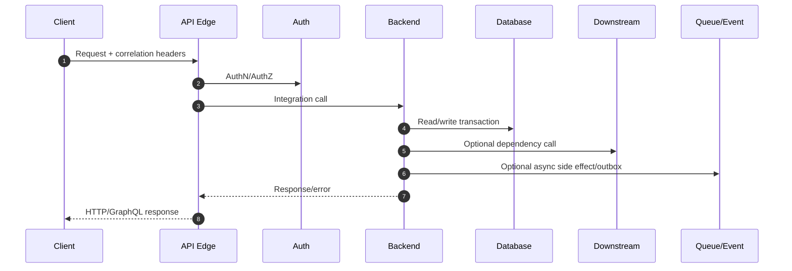
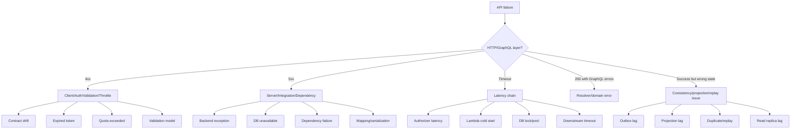
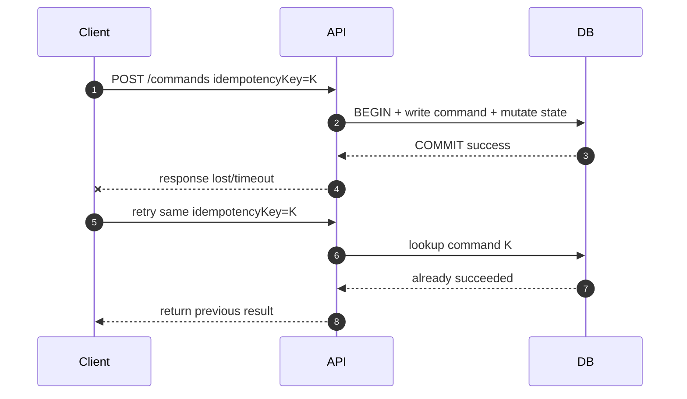
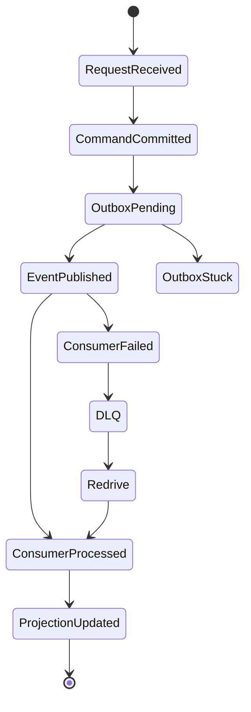

# Part 024 — API Observability and Debugging

API yang “jalan” belum tentu bisa dioperasikan. Production API harus bisa menjawab pertanyaan sulit dalam menit, bukan jam:

- Request user ini gagal di edge, auth, backend, database, atau downstream?
- Latency p99 naik karena API Gateway, Lambda cold start, connection pool, lock database, atau dependency?
- 5xx meningkat karena bug deploy, throttling, timeout, retry storm, atau partial regional issue?
- Error ini aman untuk di-retry atau sudah commit ke database?
- Apakah satu tenant menyebabkan noisy neighbor?
- Apakah subscription AppSync gagal deliver atau projection belum update?
- Apakah client mengirim query GraphQL terlalu mahal?

Observability bukan kumpulan dashboard. Observability adalah kemampuan membuat state internal sistem terlihat dari luar, sehingga engineer bisa membangun hipotesis, menguji hipotesis, dan mengambil tindakan yang aman.

---

## 1. Mental Model: API Request sebagai Causal Chain

Satu API request bukan satu event. Ia adalah rantai sebab-akibat:



Debugging harus bisa mengikuti chain ini. Jika setiap hop membuat ID sendiri tanpa hubungan, engineer akan melihat pecahan log yang tidak bisa disatukan.

Invariant observability:

> Setiap request yang masuk harus memiliki trace/correlation identity yang dapat menghubungkan edge, auth, backend, database call, event publication, dan user-facing response.

---

## 2. Logs, Metrics, Traces: Tiga Alat Berbeda

| Signal | Menjawab | Contoh |
|---|---|---|
| Metrics | “Apakah sesuatu berubah?” | p99 latency, 5xx rate, throttle count |
| Logs | “Apa yang terjadi pada kasus spesifik?” | request log, command log, error detail |
| Traces | “Di mana waktu/error terjadi dalam call path?” | API Gateway -> Lambda -> RDS |

Kesalahan umum:

- memakai log untuk semua hal sampai biaya besar dan susah dicari;
- punya metrics tanpa dimensions yang actionable;
- punya trace tapi tidak menambahkan domain annotation;
- membuat dashboard indah tapi tidak menjawab incident question;
- alert pada gejala terlalu rendah level tanpa user impact;
- tidak menyimpan command/event ID yang menghubungkan sync dan async path.

---

## 3. Minimum Observability Contract untuk API

Setiap API operation harus menghasilkan structured signal berikut:

| Field | Keterangan |
|---|---|
| `timestamp` | waktu event |
| `service` | nama service/component |
| `environment` | prod/staging/dev |
| `operation` | HTTP route atau GraphQL operation |
| `requestId` | ID dari edge/API Gateway/AppSync |
| `correlationId` | ID end-to-end yang diteruskan antar service |
| `traceId` | distributed tracing ID bila ada |
| `tenantIdHash` | hash tenant/customer, bukan PII mentah |
| `callerType` | user/service/system |
| `status` | success/failure/rejected/timeout |
| `errorCode` | stable application error code |
| `httpStatus` | HTTP status jika relevan |
| `latencyMs` | total latency |
| `backendLatencyMs` | latency integration/backend |
| `dbLatencyMs` | latency database bila tersedia |
| `idempotencyKey` | untuk command retryable |
| `commandId` | untuk write path |
| `eventId` | jika menghasilkan event/outbox |
| `retryAttempt` | attempt number jika retry |

Structured logs harus machine-queryable. Jangan mengandalkan teks bebas seperti:

```txt
Error happened while processing customer
```

Gunakan:

```json
{
  "level": "ERROR",
  "service": "customer-command-api",
  "operation": "SuspendCustomer",
  "correlationId": "c-01J...",
  "requestId": "api-gw-...",
  "tenantIdHash": "tenant_8f3a",
  "customerIdHash": "cust_12ad",
  "commandId": "cmd_01J...",
  "idempotencyKey": "idem_01J...",
  "errorCode": "CUSTOMER_STATE_CONFLICT",
  "latencyMs": 142,
  "retryable": false
}
```

---

## 4. API Gateway Observability

API Gateway dapat menghasilkan access logs, execution logs untuk REST API, CloudWatch metrics, CloudTrail management events, dan X-Ray tracing untuk REST API active tracing.

### 4.1 Access Logs

Access log adalah log per request yang paling penting untuk API boundary. Ia harus menjawab:

- siapa memanggil;
- route apa;
- status berapa;
- latency berapa;
- integration status apa;
- request ID apa;
- error message apa;
- source IP/user agent jika boleh;
- authorizer context apa yang aman dicatat;
- correlation ID apa.

Contoh format JSON access log:

```json
{
  "requestId":"$context.requestId",
  "extendedRequestId":"$context.extendedRequestId",
  "ip":"$context.identity.sourceIp",
  "requestTime":"$context.requestTime",
  "httpMethod":"$context.httpMethod",
  "routeKey":"$context.routeKey",
  "resourcePath":"$context.resourcePath",
  "status":"$context.status",
  "protocol":"$context.protocol",
  "responseLength":"$context.responseLength",
  "responseLatency":"$context.responseLatency",
  "integrationLatency":"$context.integrationLatency",
  "integrationStatus":"$context.integrationStatus",
  "errorMessage":"$context.error.message",
  "authorizerPrincipalId":"$context.authorizer.principalId"
}
```

Do not log raw authorization tokens, credentials, full PII payload, or secrets.

### 4.2 Execution Logs

Execution logs berguna untuk debugging REST API integration, mapping, authorizer, dan validation issue. Tetapi execution logs dapat mahal dan berisiko mencatat data sensitif jika tidak dikonfigurasi hati-hati. Gunakan dengan disiplin:

- nyalakan detail tinggi sementara saat investigation;
- sanitasi data sensitif;
- pisahkan prod/staging verbosity;
- retention policy wajib;
- jangan jadikan execution log sebagai satu-satunya audit trail.

### 4.3 Metrics

Minimal CloudWatch metrics untuk API Gateway:

| Metric | Signal |
|---|---|
| `Count` | traffic volume |
| `Latency` | total request-response latency |
| `IntegrationLatency` | backend latency |
| `4XXError` | client/auth/validation/throttle issue |
| `5XXError` | server/integration issue |
| throttling/quota-related status | pressure/abuse/capacity |

Interpretasi penting:

- `Latency` tinggi tetapi `IntegrationLatency` rendah: edge/mapping/authorizer/client-side path perlu dicek.
- `IntegrationLatency` tinggi: backend/database/dependency perlu dicek.
- 4xx spike: bisa valid client error, auth outage, bad deploy contract, atau throttling.
- 5xx spike: integration failure, timeout, mapping exception, backend crash, dependency failure.

---

## 5. AppSync Observability

AppSync debugging berbeda dari REST karena satu GraphQL operation bisa menjalankan banyak resolver. Observability harus operation-aware dan resolver-aware.

Minimal signal:

| Signal | Kenapa penting |
|---|---|
| GraphQL operation name | Mengelompokkan query/mutation |
| Query/mutation/subscription type | Memahami behavior |
| Resolver field latency | Menemukan field lambat |
| Data source latency/error | Menemukan dependency gagal |
| GraphQL errors[] code | Error domain/client |
| Query depth/field count | Complexity/abuse |
| Subscription connection count | Realtime pressure |
| Subscription delivery failure | Missing update risk |
| Auth failure | Security/client config issue |

Contoh application log dari Lambda resolver:

```json
{
  "level": "INFO",
  "service": "customer-graphql-resolver",
  "graphqlOperation": "CustomerDashboardQuery",
  "graphqlField": "Query.customerDashboard",
  "correlationId": "c-01J...",
  "requestId": "appsync-...",
  "tenantIdHash": "tenant_8f3a",
  "dataSource": "CustomerDashboardProjection",
  "latencyMs": 34,
  "projectionVersion": 88392
}
```

GraphQL anti-observability smell:

```txt
GraphQL returned 200 OK, so everything is fine.
```

Tidak benar. GraphQL dapat mengembalikan HTTP 200 dengan `errors[]`. Monitor application-level errors, bukan hanya HTTP status.

---

## 6. Distributed Tracing

Tracing menjawab: waktu habis di mana?

API Gateway REST API mendukung active tracing dengan AWS X-Ray. Lambda juga dapat direkam dalam X-Ray segment dan dapat diberi subsegment untuk outbound call. Untuk HTTP API/AppSync path, tracing strategy dapat berbeda; tetap gunakan correlation ID dan backend instrumentation agar chain dapat disambung.

Trace harus memuat annotation yang queryable:

- `tenantHash`;
- `operation`;
- `commandType`;
- `errorCode`;
- `dbSystem`;
- `dependencyName`;
- `retryAttempt`.

Jangan memasukkan PII besar sebagai metadata trace. Trace bukan data lake.

Example Java pseudo-instrumentation:

```java
public final class ObservedCommandHandler {
    private final CommandHandler delegate;
    private final Metrics metrics;
    private final Logger log;

    public CommandResult handle(Command command, RequestContext ctx) {
        long start = System.nanoTime();
        try (var ignored = CorrelationScope.open(ctx.correlationId())) {
            CommandResult result = delegate.handle(command);
            long latency = elapsedMs(start);

            metrics.timer("api.command.latency", latency,
                "command", command.type(),
                "status", "success");

            log.info("command_completed", Map.of(
                "correlationId", ctx.correlationId(),
                "commandId", result.commandId(),
                "commandType", command.type(),
                "latencyMs", latency
            ));
            return result;
        } catch (DomainException ex) {
            long latency = elapsedMs(start);
            metrics.counter("api.command.error",
                "command", command.type(),
                "errorCode", ex.code(),
                "retryable", Boolean.toString(ex.retryable()));
            log.warn("command_rejected", Map.of(
                "correlationId", ctx.correlationId(),
                "commandType", command.type(),
                "errorCode", ex.code(),
                "latencyMs", latency
            ));
            throw ex;
        }
    }
}
```

---

## 7. Correlation ID Strategy

Use two kinds of identity:

| ID | Meaning |
|---|---|
| Request ID | ID per hop/request, often generated by AWS service |
| Correlation ID | End-to-end causal chain ID controlled/propagated by application |

Rule:

1. Accept client-provided correlation ID only if format/length valid.
2. Generate one if absent.
3. Return it to client in response header/body extension.
4. Pass it to downstream service.
5. Persist it in command log/outbox event.
6. Include it in queue/event message attributes.
7. Log it in every component.

Example HTTP headers:

```txt
X-Correlation-Id: c-01JZ9Y4KZRW3X6J4Y4W6YB29WQ
Idempotency-Key: idem-01JZ9Y4TRBD0QQRQ5H6X9VEP65
```

Event envelope:

```json
{
  "eventId": "evt_01J...",
  "eventType": "CustomerSuspended",
  "aggregateId": "cus_123",
  "aggregateVersion": 42,
  "occurredAt": "2026-07-06T03:40:00Z",
  "correlationId": "c-01J...",
  "causationId": "cmd_01J...",
  "producer": "customer-command-api",
  "schemaVersion": 1,
  "data": {}
}
```

`correlationId` groups a business journey. `causationId` points to the direct cause.

---

## 8. Debugging Taxonomy

When API fails, classify before guessing.



This taxonomy prevents random debugging.

---

## 9. API Gateway Debugging Playbook

### Symptom: 5xx spike

Check in order:

1. Did deployment happen recently?
2. Is spike isolated to route/stage/tenant/region?
3. Is `IntegrationLatency` high?
4. Are backend Lambda/ECS errors up?
5. Are DB connection errors up?
6. Are timeouts up?
7. Are mapping template errors present?
8. Did authorizer fail?
9. Did dependency start throttling?
10. Can one failed request be traced by correlation ID?

### Symptom: 4xx spike

Do not assume client bug. Check:

- auth provider outage/token expiry;
- contract/schema deploy changed validation;
- WAF/rate limit/quota threshold;
- client version rollout;
- CORS/preflight errors;
- route mismatch;
- request body size/payload issue.

### Symptom: latency p99 increase

Compare:

```txt
API Latency - IntegrationLatency = edge/authorizer/mapping overhead approximation
```

Then inspect backend:

- cold starts;
- thread pool saturation;
- connection pool exhaustion;
- database locks;
- slow queries;
- downstream timeouts;
- retry amplification;
- GC pressure;
- overloaded dependency.

---

## 10. AppSync Debugging Playbook

### Symptom: GraphQL returns errors with HTTP 200

Check:

1. Which operation name?
2. Which resolver path in `errors[].path`?
3. Is error nullable field or top-level failure?
4. Is data partial?
5. Is error from auth, resolver mapping, Lambda, data source, or domain?
6. Does client handle partial data correctly?

### Symptom: one query suddenly slow

Check:

- query depth/field selection changed;
- nested list page size too high;
- resolver count increased;
- N+1 Lambda invocation;
- data source partition hot;
- OpenSearch slow query;
- projection read degraded;
- identity-specific auth check slow.

### Symptom: subscription clients miss updates

Check:

- was update triggered by GraphQL mutation or external event path?
- does publisher bridge handle non-GraphQL state changes?
- are clients reconnecting and reconciling?
- are event versions monotonic?
- are filters too restrictive?
- did auth context change?
- are connection/message limits involved?

---

## 11. Database-Centric API Debugging

API symptoms often originate from database behavior.

| API symptom | Possible DB cause |
|---|---|
| p99 latency spike | slow query, lock, missing index, buffer/cache pressure |
| intermittent 500 | connection exhaustion, failover, transaction timeout |
| conflict errors | optimistic concurrency, duplicate idempotency key, state machine transition |
| stale read | read replica lag, projection lag, cache stale |
| timeout after write | commit succeeded but response lost |
| duplicate side effect | retry after ambiguous outcome without idempotency |
| throttling | DynamoDB hot partition/provisioned capacity |

Debugging write ambiguity:



Without idempotency log, the retry may duplicate state change.

---

## 12. Alert Design

Alert on user impact and actionable cause, not every noisy metric.

Bad alert:

```txt
CPU > 80% for 5 minutes
```

Better alert:

```txt
API p99 latency > SLO for 10 minutes AND request count > minimum traffic threshold
```

Better still:

```txt
Route SuspendCustomer 5xx rate > 2% for 5 minutes, affecting > 3 tenants, with DB connection errors elevated
```

Alert dimensions:

- service;
- operation/route;
- environment;
- region;
- tenant tier if allowed;
- error class;
- dependency.

Avoid high-cardinality metric labels like raw user ID, request ID, email, or arbitrary path values.

---

## 13. SLOs for API Layer

Define SLO per operation class, not one average for all APIs.

| Operation class | Example SLO |
|---|---|
| Read simple | p95 < 150 ms, p99 < 400 ms |
| Read composed dashboard | p95 < 500 ms, p99 < 1500 ms |
| Command accepted | p95 < 300 ms, p99 < 1000 ms |
| Long-running command start | p95 < 500 ms to accepted response |
| GraphQL subscription delivery | p95 < 2 seconds after projection update |
| Admin search | p95 < 1s, p99 < 3s |

SLO must match user expectation and dependency shape. A dashboard that touches projection/search/cache has different envelope from a single DynamoDB `GetItem`.

---

## 14. Dashboard Layout that Actually Helps

A useful API dashboard has four layers.

### 14.1 Business/API Layer

- request count by operation;
- success/error rate by operation;
- p50/p95/p99 latency by operation;
- top error codes;
- active tenants affected;
- idempotency duplicate/in-progress count;
- GraphQL errors by field path.

### 14.2 Edge Layer

- API Gateway/AppSync status;
- 4xx/5xx;
- integration latency;
- throttles/quota;
- authorizer latency/error;
- request size/response size.

### 14.3 Backend Layer

- Lambda/ECS invocation count;
- duration;
- cold starts if Lambda;
- errors;
- concurrency;
- queue depth if async handoff;
- circuit breaker state.

### 14.4 Data Layer

- DB connection count;
- query latency;
- lock waits;
- deadlocks/conflicts;
- DynamoDB throttle/hot key symptoms;
- cache hit/miss;
- projection lag;
- outbox publish lag.

---

## 15. Log Retention and Cost Discipline

Observability can become a cost incident. Apply different retention:

| Log type | Suggested retention idea |
|---|---|
| Access logs | medium retention; useful for API audit/debug |
| Debug execution logs | short retention; enable selectively |
| Application structured logs | based on incident/audit needs |
| Security/audit logs | longer retention, compliance-driven |
| Trace samples | sampling strategy; not all requests forever |
| Payload logs | avoid; only sanitized and temporary |

Principles:

- log metadata, not full payload;
- sample success path if very high volume;
- keep all errors/slow requests;
- redact PII/secrets;
- set retention explicitly;
- estimate log volume before launch;
- use metric filters/embedded metrics carefully.

---

## 16. Observability for Async Side Effects Started by API

An API command often commits state and schedules async work. The user sees 200/202, but work continues.

Track the full lifecycle:



Metrics:

- command committed count;
- outbox pending age;
- publish failure count;
- event delivery failure;
- queue age/lag;
- DLQ message count;
- projection lag;
- reconciliation correction count.

Without these signals, API looks healthy while user-visible downstream state is broken.

---

## 17. Redaction and Privacy

Never log:

- access tokens;
- refresh tokens;
- API keys;
- passwords/secrets;
- full authorization header;
- raw payment details;
- unnecessary PII;
- large request/response payload by default.

Prefer:

- hash IDs where possible;
- stable internal IDs over names/emails;
- explicit allowlist logging;
- structured `errorCode` over exception dump;
- secure audit log for required sensitive audit events;
- retention and access control per log group.

Remember: logs are a secondary data store. Treat them as part of the security boundary.

---

## 18. Failure Drills

Run drills before incidents.

### Drill 1 — Backend Timeout

Inject backend delay beyond API timeout.

Expected:

- client receives documented timeout/error;
- backend stops work or handles ambiguous outcome safely;
- idempotency retry returns correct result;
- alert triggers if error budget impacted;
- trace shows timeout location.

### Drill 2 — Database Lock

Hold lock on hot row/table path.

Expected:

- API latency increases visible by operation;
- DB wait events/lock metrics visible;
- request times out safely;
- no duplicate side effect;
- runbook identifies blocking transaction.

### Drill 3 — GraphQL Expensive Query

Send deep query with large nested lists.

Expected:

- query is rejected or constrained;
- resolver count does not explode;
- backend protected;
- error code stable.

### Drill 4 — Outbox Stuck

Stop outbox publisher.

Expected:

- API command still commits if design allows;
- outbox age alert fires;
- projection lag visible;
- replay resumes without duplicate consumer side effects.

### Drill 5 — Auth Misconfiguration

Break authorizer/decode dependency in staging.

Expected:

- 401/403 spike visible;
- not confused with backend 5xx;
- no sensitive data leaked;
- rollback path clear.

---

## 19. Practical Debugging Workflow

When an incident arrives, use this sequence:

```txt
1. Define user-visible symptom.
2. Identify affected operation/route/GraphQL field.
3. Check blast radius: all users, one tenant, one region, one client version?
4. Compare error rate and latency to baseline.
5. Split edge vs backend using integration latency/traces.
6. Follow one failed correlation ID end-to-end.
7. Classify failure: auth, validation, throttle, timeout, backend, DB, async lag, projection, cache.
8. Mitigate first: rollback, throttle, disable feature, shed load, increase capacity, pause consumer, redrive carefully.
9. Verify invariant: no duplicate commit, no lost event, no unauthorized exposure.
10. Write post-incident correction: better alert, better runbook, better test, better invariant.
```

The key is not to stare at dashboards randomly. Start from the user-facing symptom and walk down the causal chain.

---

## 20. Production Checklist

Before API module is considered production-ready:

- [ ] Every API has access logs enabled with JSON format.
- [ ] Logs include correlation ID and request ID.
- [ ] Client receives correlation ID in response.
- [ ] Backend logs use same correlation ID.
- [ ] Command logs include idempotency key and command ID.
- [ ] Outbox/events include correlation ID and causation ID.
- [ ] Metrics exist for count, latency, error rate by operation.
- [ ] Alerting uses SLO/user-impact thresholds.
- [ ] 4xx and 5xx are separated by cause.
- [ ] GraphQL errors are monitored beyond HTTP status.
- [ ] Resolver latency is visible for AppSync operations.
- [ ] X-Ray/tracing or equivalent correlation exists for critical REST paths.
- [ ] Logs redact secrets and PII.
- [ ] Log retention is explicitly configured.
- [ ] Debug verbosity can be raised safely and temporarily.
- [ ] Runbooks exist for timeout, throttling, DB lock, auth failure, projection lag, DLQ growth.
- [ ] Failure drills have been run in staging.

---

## 21. Mental Model Summary

Production API observability is not about knowing that “something failed.” It is about knowing:

```txt
who was affected,
which operation failed,
where the failure happened,
whether state changed,
whether retry is safe,
which invariant is at risk,
and what action reduces blast radius.
```

For AWS Application + Database systems, the hard bugs live at boundaries:

- API Gateway/AppSync to backend;
- backend to database;
- database commit to event publish;
- event consume to projection update;
- cache to source-of-truth;
- subscription to client local state.

Good observability makes these boundaries visible.

The next module moves from API layer into SQS. Keep this mental model: queueing does not remove observability needs. It adds time, lag, retry, DLQ, and replay as first-class dimensions.

---

## References

- Amazon API Gateway Developer Guide — Logging and monitoring: https://docs.aws.amazon.com/apigateway/latest/developerguide/security-monitoring.html
- Amazon API Gateway Developer Guide — Set up CloudWatch logging for REST APIs: https://docs.aws.amazon.com/apigateway/latest/developerguide/set-up-logging.html
- Amazon API Gateway Developer Guide — HTTP API access log variables: https://docs.aws.amazon.com/apigateway/latest/developerguide/http-api-logging-variables.html
- Amazon API Gateway Developer Guide — AWS X-Ray active tracing support: https://docs.aws.amazon.com/xray/latest/devguide/xray-services-apigateway.html
- AWS X-Ray Developer Guide — Lambda tracing: https://docs.aws.amazon.com/xray/latest/devguide/xray-services-lambda.html
- AWS AppSync Developer Guide — Resolvers: https://docs.aws.amazon.com/appsync/latest/devguide/resolver-components.html
- AWS AppSync Developer Guide — Real-time data/subscriptions: https://docs.aws.amazon.com/appsync/latest/devguide/aws-appsync-real-time-data.html
