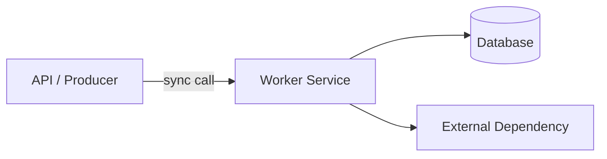
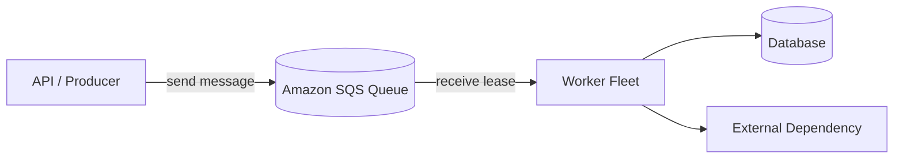
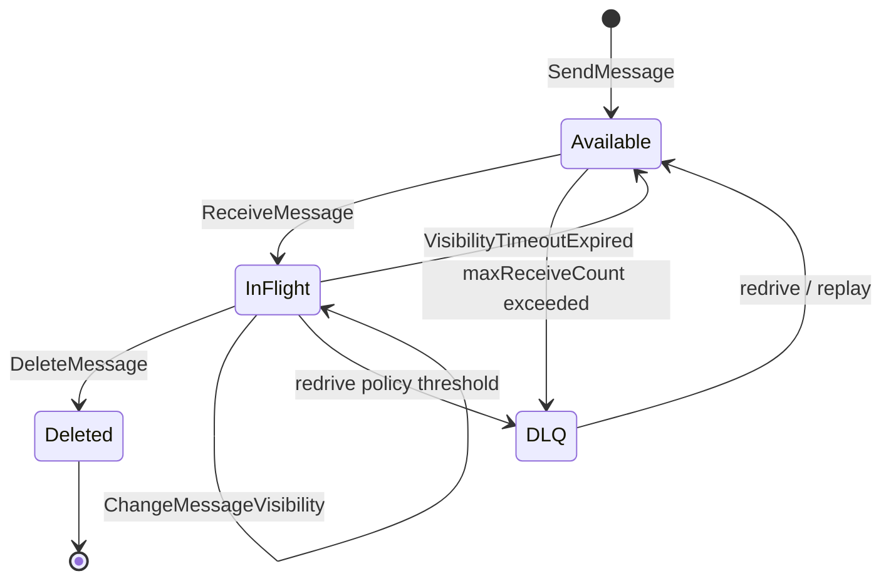
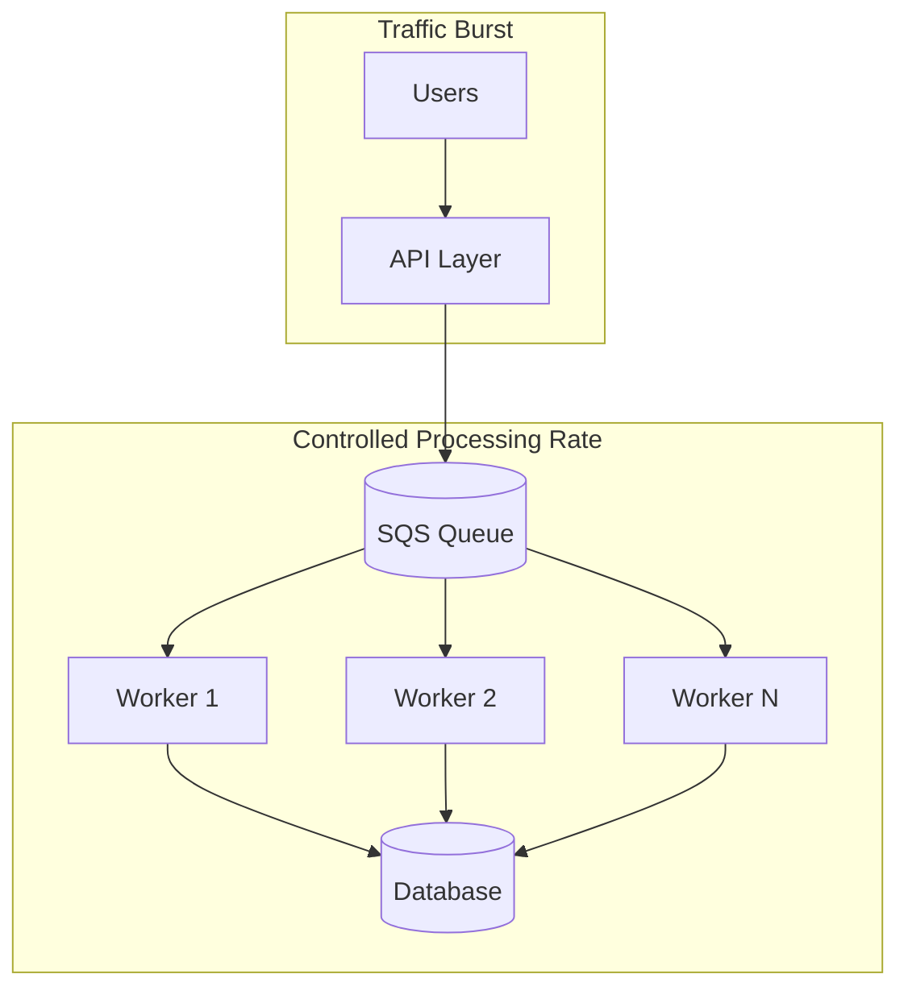
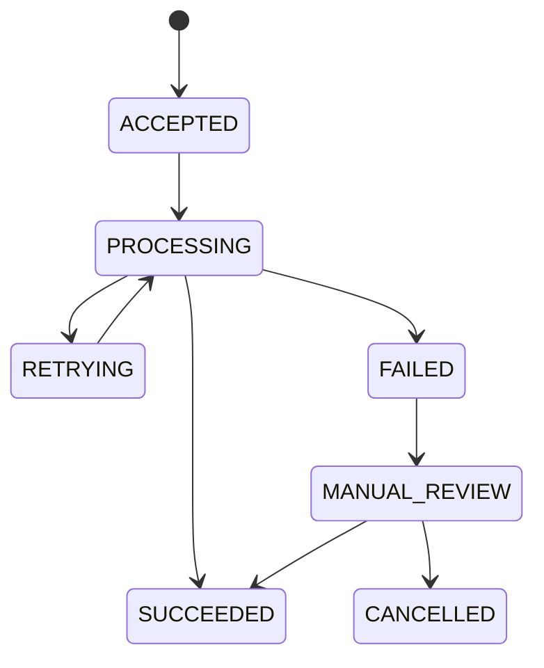
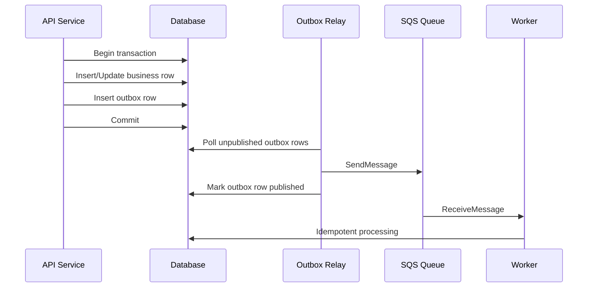
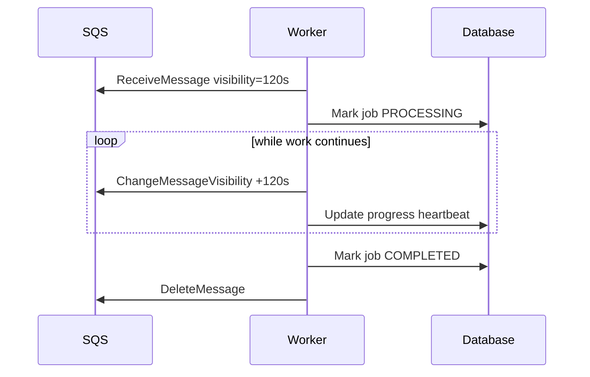
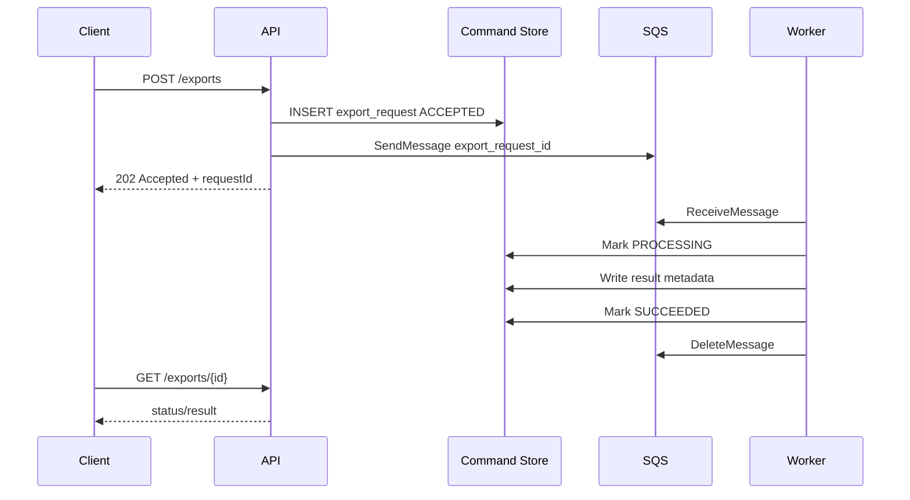
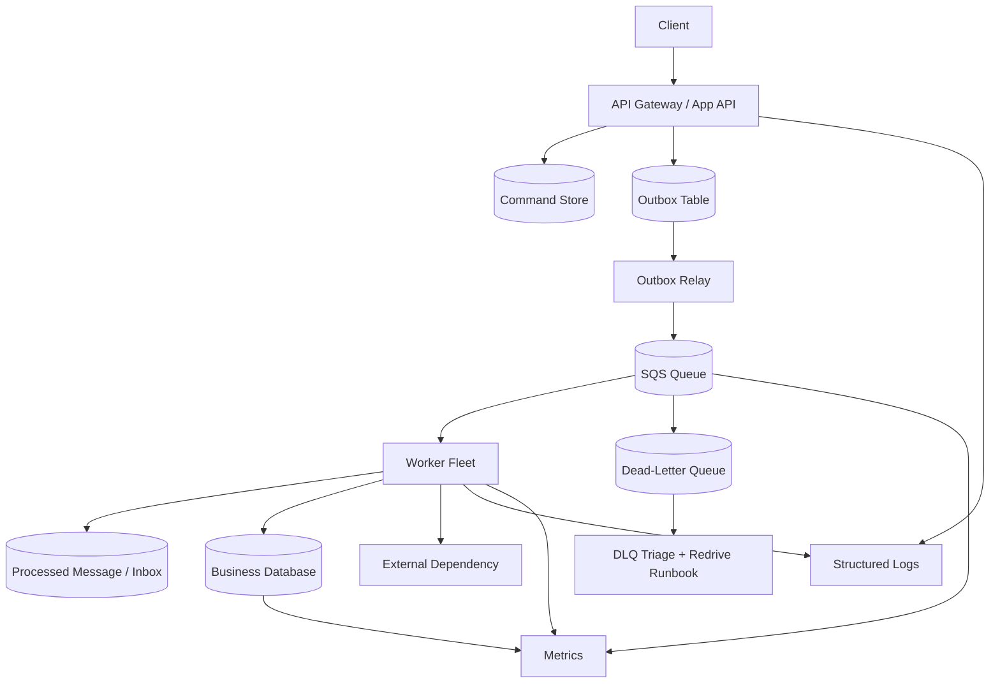

# Part 025 — SQS Mental Model: Queue sebagai Load-Leveler, Buffer, dan Failure Isolation

Amazon SQS terlihat sederhana: producer kirim message, consumer baca message, lalu delete message.

Tapi di production, SQS bukan sekadar “tempat naro task”. SQS adalah **durable asynchronous boundary** antara dua bagian sistem yang tidak boleh saling menjatuhkan.

Mental model yang benar:

> SQS adalah buffer tahan lama yang memisahkan **rate producer**, **rate consumer**, **failure domain**, dan **lifetime operasi**.

Kalau dipakai dengan benar, queue membuat sistem lebih stabil saat spike, dependency lambat, consumer error, database overload, atau downstream sedang maintenance. Kalau dipakai sembarangan, queue hanya menyembunyikan failure sampai backlog membesar, DLQ penuh, retry storm terjadi, dan database menerima duplicate write.

Dokumentasi AWS mendeskripsikan Amazon SQS sebagai fully managed message queuing service untuk decouple dan scale distributed software systems/components. SQS juga memiliki semantics seperti visibility timeout, long polling, dead-letter queue, standard/FIFO queue, dan integration dengan SNS/Lambda/EventBridge.

Referensi resmi:

- Amazon SQS Developer Guide: <https://docs.aws.amazon.com/AWSSimpleQueueService/latest/SQSDeveloperGuide/welcome.html>
- SQS Visibility Timeout: <https://docs.aws.amazon.com/AWSSimpleQueueService/latest/SQSDeveloperGuide/sqs-visibility-timeout.html>
- SQS Long Polling: <https://docs.aws.amazon.com/AWSSimpleQueueService/latest/SQSDeveloperGuide/sqs-short-and-long-polling.html>
- SQS Dead-Letter Queues: <https://docs.aws.amazon.com/AWSSimpleQueueService/latest/SQSDeveloperGuide/sqs-dead-letter-queues.html>
- AWS Well-Architected — loosely coupled dependencies: <https://docs.aws.amazon.com/wellarchitected/latest/framework/rel_prevent_interaction_failure_loosely_coupled_system.html>

---

## 1. Problem yang Diselesaikan Queue

Tanpa queue, producer biasanya memanggil consumer secara langsung.



Masalahnya: producer dan consumer menjadi satu failure chain.

Jika worker lambat, API ikut lambat. Jika database overload, API ikut error. Jika external dependency timeout, request user ikut timeout. Jika traffic spike, semua layer menerima spike sekaligus.

Queue memutus chain itu.



Dengan queue:

- producer hanya perlu berhasil menyimpan intent ke queue;
- consumer bisa berjalan sesuai kapasitasnya sendiri;
- database tidak harus menerima semua burst saat itu juga;
- consumer bisa retry tanpa memblokir request user;
- failure dapat diisolasi ke DLQ dan runbook replay.

Ini bukan berarti sistem otomatis benar. Queue hanya mengganti masalah dari **latency request** menjadi **backlog, ordering, duplicate, retry, and replay correctness**.

---

## 2. SQS Bukan Apa

Sebelum membahas pattern, penting untuk menghilangkan framing yang salah.

SQS bukan database.

Queue tidak didesain untuk query arbitrary, join, aggregate, partial update, atau menjadi source of truth jangka panjang. Source of truth tetap berada di database atau event log yang memang dirancang untuk retention/query semantics tersebut.

SQS bukan stream processing log.

SQS adalah message queue. Consumer mengambil message, memproses, lalu menghapus. Kalau butuh ordered replay jangka panjang, consumer group, partitioned log, dan retention historis sebagai primitive utama, pikirkan Kinesis, MSK, atau event log lain. SQS bisa dipakai untuk replay terbatas melalui DLQ/redrive/archive integrasi lain, tapi bukan immutable event log utama.

SQS bukan scheduler kompleks.

SQS punya delay queue/message timer, tapi itu bukan pengganti workflow scheduler, calendar, atau state machine. Untuk operasi multi-step, timeout, compensation, callback, dan human escalation, Step Functions biasanya lebih tepat.

SQS bukan exactly-once side-effect engine.

Bahkan jika menggunakan FIFO, application tetap harus mengendalikan idempotency side effect. “Exactly-once processing” pada FIFO membantu mencegah duplicate message dalam batas fitur FIFO, tetapi tidak membuat database write, email send, payment capture, atau call ke pihak ketiga otomatis exactly-once.

---

## 3. Model Dasar: Message Lifecycle

SQS message memiliki lifecycle sederhana:

1. Producer mengirim message ke queue.
2. Message tersedia untuk consumer.
3. Consumer menerima message.
4. Message menjadi invisible selama visibility timeout.
5. Consumer berhasil memproses dan menghapus message.
6. Jika tidak dihapus sebelum visibility timeout habis, message muncul lagi.
7. Jika gagal berulang kali sampai `maxReceiveCount`, message dapat dipindah ke DLQ.



Inilah mental model paling penting:

> `ReceiveMessage` bukan mengambil message secara permanen. Ia memberikan **lease sementara** atas message.

Consumer baru benar-benar “memiliki” message setelah berhasil memproses dan memanggil `DeleteMessage` memakai receipt handle yang valid.

Konsekuensinya:

- consumer harus idempotent;
- visibility timeout harus disesuaikan dengan durasi proses;
- long-running task perlu extend visibility;
- crash sebelum delete berarti message dapat diproses ulang;
- duplicate delivery harus dianggap normal, bukan kejadian aneh.

---

## 4. Queue sebagai Load-Leveler

Queue menyerap spike producer agar consumer memproses sesuai kapasitas.

Misalnya API menerima 50.000 request dalam 2 menit, tetapi worker/database hanya aman memproses 500 request per detik. Tanpa queue, API, worker, dan database semua menerima spike yang sama. Dengan queue, API menaruh pekerjaan ke SQS, lalu worker membaca sesuai concurrency yang dikontrol.



Queue mengubah overload dari instant failure menjadi backlog.

Backlog bukan gratis. Backlog adalah **work debt**.

Kalau arrival rate lebih tinggi daripada processing rate dalam waktu lama, backlog akan terus naik. Artinya sistem sedang kalah kapasitas, walaupun API masih kelihatan sehat.

Formula mental sederhana:

```txt
backlog_growth_rate = incoming_messages_per_second - processed_messages_per_second
```

Jika hasilnya positif terus-menerus, queue hanya menunda incident.

Production metric yang perlu dibaca:

- approximate number of visible messages;
- approximate number of in-flight messages;
- approximate age of oldest message;
- receive/delete error rate;
- DLQ message count;
- consumer success/failure rate;
- processing latency per message;
- database wait/lock/throttle saat consumer aktif.

Metric yang paling sering disepelekan adalah **age of oldest message**. Queue length bisa besar tapi stabil jika throughput normal; age yang naik terus berarti user-visible delay atau business SLA mulai rusak.

---

## 5. Queue sebagai Failure Isolation

SQS memisahkan producer dan consumer failure.

Tanpa queue:

```txt
API request -> worker -> database -> external service
```

Jika external service down, API gagal.

Dengan queue:

```txt
API request -> enqueue command -> return 202 Accepted
worker -> external service later
```

API bisa tetap menerima command selama business semantics mengizinkan asynchronous completion.

Namun ini hanya benar jika sistem punya model status.

Contoh endpoint buruk:

```http
POST /payments
```

Response:

```json
{
  "status": "success"
}
```

Padahal payment belum diproses, hanya masuk queue. Ini kontrak palsu.

Endpoint lebih benar:

```http
POST /payment-requests
```

Response:

```json
{
  "requestId": "payreq_123",
  "status": "ACCEPTED",
  "statusUrl": "/payment-requests/payreq_123"
}
```

Dengan begini, queue boundary terlihat di API contract.

Sistem perlu status model:



Queue tidak menghapus kebutuhan state machine. Queue justru memaksa kita mendesain state machine dengan jujur.

---

## 6. Queue sebagai Temporal Boundary

Synchronous call mengharapkan hasil sekarang.

Queue mengakui bahwa pekerjaan dapat selesai nanti.

Ini cocok untuk:

- email notification;
- PDF generation;
- image/video processing;
- audit enrichment;
- data export;
- indexing projection;
- cache invalidation;
- fraud scoring asynchronous;
- order fulfillment step;
- retryable external integration;
- database backfill chunk;
- reconciliation job.

Tidak cocok untuk:

- validasi yang harus menentukan response immediate;
- authorization decision;
- read-your-writes query yang user tunggu saat itu juga;
- transaksi yang harus commit atomik dengan response;
- operasi yang tidak punya status/progress model.

Kalimat desainnya:

> Jika user/business process bisa menerima “accepted, not completed”, queue mungkin tepat. Jika response harus merepresentasikan final outcome saat itu juga, queue harus dipakai hati-hati atau bukan boundary utama.

---

## 7. Message Contract: Jangan Kirim Object Dump

Salah satu anti-pattern paling umum adalah mengirim object database utuh ke queue.

Contoh buruk:

```json
{
  "id": 991,
  "customer": { "...": "entire object" },
  "order": { "...": "entire object" },
  "internalFlags": { "...": "many fields" }
}
```

Masalah:

- schema producer bocor ke consumer;
- payload besar;
- consumer bergantung pada field yang tidak seharusnya;
- perubahan entity internal menjadi breaking change;
- stale data sulit dikendalikan;
- sensitive data mudah tersebar.

Message queue sebaiknya membawa **command/event envelope** yang kecil, eksplisit, dan versioned.

Contoh command message:

```json
{
  "messageId": "01JZCMD4XQ6YQ3Q6M9A1R9T7AK",
  "messageType": "GenerateInvoicePdfRequested",
  "schemaVersion": 1,
  "occurredAt": "2026-07-06T10:15:30Z",
  "correlationId": "req-7e7c",
  "causationId": "cmd-123",
  "tenantId": "tenant-a",
  "idempotencyKey": "invoice-pdf:inv_123:v1",
  "payload": {
    "invoiceId": "inv_123",
    "format": "PDF_A"
  }
}
```

Payload idealnya berisi identifier dan intent, bukan snapshot seluruh domain object. Consumer membaca detail dari source of truth jika butuh data terbaru, atau menerima snapshot minimal jika semantics-nya memang “process snapshot as of time X”.

Bedakan tiga tipe message:

| Tipe | Makna | Contoh | Consumer boleh? |
|---|---|---|---|
| Command | “Tolong lakukan X” | `GenerateInvoicePdfRequested` | Menolak/failed/retry |
| Event | “X sudah terjadi” | `InvoiceIssued` | Bereaksi, tidak mengubah fakta event |
| Job | “Kerjakan unit teknis ini” | `BackfillCustomerChunk` | Mengatur retry/progress teknis |

SQS sering dipakai untuk command/job queue. Event fanout biasanya lebih cocok melalui SNS atau EventBridge lalu targetnya bisa SQS.

---

## 8. Direct Send vs Transactional Outbox

Pertanyaan penting: kapan producer mengirim langsung ke SQS, dan kapan harus memakai outbox?

Direct send cocok jika message itu sendiri adalah source of truth pertama.

Contoh:

```txt
API receives request -> SendMessage to SQS -> return 202
```

Jika SendMessage sukses, request diterima. Jika gagal, request gagal. Tidak ada database write yang harus atomik dengan queue send.

Namun jika API harus menulis database dan mengirim message sebagai satu business action, direct send berisiko dual-write failure.

Contoh buruk:

```txt
1. INSERT order into database -> success
2. SendMessage OrderCreated to SQS -> timeout/failure
```

Database sudah berubah, tetapi message tidak terkirim. Atau sebaliknya, message terkirim tetapi database transaction rollback.

Untuk kasus ini, gunakan transactional outbox.



Outbox invariant:

> Business state change dan publish intent tercatat atomik dalam database yang sama.

SQS delivery tetap at-least-once; outbox relay juga bisa publish duplicate saat crash di antara send dan mark-published. Karena itu consumer tetap harus idempotent.

---

## 9. Consumer Correctness: Receive, Process, Delete

Consumer loop harus memperlakukan message sebagai leased work.

Pseudo flow:

```txt
while running:
  messages = receive batch with long polling
  for message in messages:
    try:
      parse and validate envelope
      acquire idempotency/inbox record
      process business effect
      commit business effect
      delete message
    catch retryable:
      do not delete message
    catch non-retryable:
      record error; optionally delete or let DLQ policy move it
```

Dengan Java AWS SDK v2, bentuk dasarnya:

```java
import software.amazon.awssdk.services.sqs.SqsClient;
import software.amazon.awssdk.services.sqs.model.DeleteMessageRequest;
import software.amazon.awssdk.services.sqs.model.Message;
import software.amazon.awssdk.services.sqs.model.ReceiveMessageRequest;

import java.time.Duration;
import java.util.List;

public final class InvoiceWorker implements Runnable {
    private final SqsClient sqs;
    private final String queueUrl;
    private final InvoiceProcessor processor;

    public InvoiceWorker(SqsClient sqs, String queueUrl, InvoiceProcessor processor) {
        this.sqs = sqs;
        this.queueUrl = queueUrl;
        this.processor = processor;
    }

    @Override
    public void run() {
        while (!Thread.currentThread().isInterrupted()) {
            ReceiveMessageRequest request = ReceiveMessageRequest.builder()
                    .queueUrl(queueUrl)
                    .maxNumberOfMessages(10)
                    .waitTimeSeconds(20)          // long polling
                    .visibilityTimeout(120)       // per-receive lease, if needed
                    .messageAttributeNames("All")
                    .build();

            List<Message> messages = sqs.receiveMessage(request).messages();

            for (Message message : messages) {
                processOne(message);
            }
        }
    }

    private void processOne(Message message) {
        try {
            processor.process(message.body(), message.messageAttributes());

            sqs.deleteMessage(DeleteMessageRequest.builder()
                    .queueUrl(queueUrl)
                    .receiptHandle(message.receiptHandle())
                    .build());
        } catch (RetryableProcessingException ex) {
            // Do not delete. Message becomes visible again after visibility timeout.
            // Log with message id, correlation id, receive count, and error code.
        } catch (NonRetryableProcessingException ex) {
            // Usually do not delete immediately unless you have a deliberate quarantine path.
            // Let redrive policy move repeated failures to DLQ, or write explicit failure state.
        }
    }
}
```

Hal yang sering salah:

- delete message sebelum commit business effect;
- tidak punya idempotency/inbox table;
- visibility timeout lebih pendek dari processing p99;
- retry semua error termasuk validation error;
- tidak membaca receive count;
- tidak membedakan poison message dan transient dependency failure;
- tidak punya graceful shutdown sehingga message terus diproses saat container termination.

---

## 10. Idempotent Consumer dengan Database

Karena message dapat diproses lebih dari sekali, consumer harus punya idempotency guard.

Relational pattern:

```sql
CREATE TABLE processed_message (
    consumer_name       varchar(128) NOT NULL,
    message_id          varchar(128) NOT NULL,
    idempotency_key     varchar(256) NOT NULL,
    status              varchar(32)  NOT NULL,
    first_seen_at       timestamptz  NOT NULL DEFAULT now(),
    completed_at        timestamptz,
    result_ref          varchar(256),
    error_code          varchar(128),
    PRIMARY KEY (consumer_name, idempotency_key)
);
```

Processing flow:

```txt
1. Start DB transaction.
2. Insert processed_message with status PROCESSING.
3. If duplicate key:
   - if COMPLETED, skip and delete SQS message;
   - if PROCESSING and stale, apply recovery rule;
   - if FAILED_RETRYABLE, decide retry policy;
4. Apply business effect.
5. Mark processed_message COMPLETED.
6. Commit.
7. Delete SQS message.
```

DynamoDB pattern:

```txt
PutItem idempotencyKey with condition attribute_not_exists(pk)
```

Lalu business effect bisa dilakukan dalam `TransactWriteItems` jika masih dalam batas transaction design dan table ownership. Untuk side effect eksternal, simpan side-effect attempt/result agar retry tidak memanggil dependency yang sama tanpa kontrol.

Invariant consumer:

> Message boleh diterima berkali-kali, tetapi business effect yang sama hanya boleh committed sekali per idempotency key.

---

## 11. Visibility Timeout sebagai Lease

Visibility timeout adalah periode message tidak terlihat oleh consumer lain setelah diterima. Default queue visibility timeout adalah 30 detik, tetapi bisa diubah sesuai kebutuhan.

Jika consumer berhasil sebelum timeout habis, ia memanggil `DeleteMessage`.

Jika consumer crash, hang, atau gagal delete, message muncul lagi setelah timeout habis.

Desain visibility timeout harus berbasis data:

```txt
visibility_timeout >= processing_p99 + database_commit_p99 + delete_call_margin
```

Tapi jangan terlalu besar tanpa alasan. Visibility timeout terlalu panjang membuat recovery lambat saat consumer mati.

Untuk task long-running, pattern yang lebih aman:

```txt
1. Set initial visibility moderate.
2. Worker heartbeat progress.
3. Extend visibility with ChangeMessageVisibility.
4. If heartbeat stops, message eventually returns.
```



Jika task bisa berjalan sangat lama dan punya banyak step, Step Functions sering lebih tepat daripada memaksa satu SQS message memegang lease panjang.

---

## 12. Long Polling dan Empty Receive Cost

SQS mendukung short polling dan long polling.

Long polling aktif ketika `ReceiveMessage` memakai `WaitTimeSeconds` lebih dari 0; maximum long polling wait time adalah 20 detik. Long polling mengurangi empty responses dan false empty responses, sehingga biasanya lebih efisien untuk worker service.

Worker production biasanya memakai:

```txt
WaitTimeSeconds = 20
MaxNumberOfMessages = 10
```

Lalu concurrency dikontrol di worker process, ECS service autoscaling, Lambda event source mapping, atau Kubernetes deployment.

Jangan membangun busy loop seperti ini:

```txt
while true:
  receive immediately
  if empty: sleep 10ms
```

Itu membuat biaya API call naik, CPU noise, dan log kosong.

---

## 13. DLQ: Quarantine, Bukan Tempat Sampah

Dead-letter queue adalah target untuk message yang gagal diproses setelah melewati threshold tertentu.

DLQ dipakai untuk:

- mengisolasi poison message;
- menjaga queue utama tidak tersumbat failure permanen;
- memberi ruang debugging;
- memungkinkan replay setelah bug diperbaiki;
- menghitung error budget processing.

DLQ bukan tempat membuang message tanpa owner.

Setiap DLQ harus punya:

- owner team;
- alert threshold;
- triage dashboard;
- sample payload inspection path;
- redaction policy;
- replay runbook;
- max age policy;
- decision: fix-and-redrive, discard, manual repair, or compensate.

DLQ message harus diperlakukan sebagai production incident, bukan normal backlog.

Contoh redrive decision:

| Penyebab | Redrive? | Aksi |
|---|---:|---|
| Temporary DB outage | Ya | Redrive setelah DB stabil |
| Bug parser versi lama | Ya | Deploy fix, redrive batch kecil |
| Unknown schema version | Tergantung | Tambah compatibility atau quarantine permanen |
| Invalid business data | Tidak langsung | Buat failure record/manual remediation |
| External dependency 4xx permanent | Tidak | Mark failed, jangan retry storm |

---

## 14. Backpressure: Queue Tidak Boleh Menyerang Database

Queue sering dipasang untuk melindungi database. Ironisnya, worker yang autoscale terlalu agresif bisa membuat queue menjadi amplifier yang menyerang database.

Buruk:

```txt
queue length naik -> autoscale worker sebanyak mungkin -> database connection habis -> error naik -> retry naik -> queue makin berat
```

Lebih aman:

```txt
queue length naik -> scale worker sampai batas DB-safe concurrency -> rate-limit per tenant/job type -> monitor DB waits/throttles -> pause/redrive jika downstream tidak sehat
```

Worker concurrency harus dihitung dari bottleneck downstream.

Contoh kasar:

```txt
safe_worker_concurrency = floor(database_safe_qps / qps_per_worker)
```

Jika satu worker rata-rata membuat 5 query per detik dan database aman di 500 query per detik untuk workload tersebut, jangan autoscale sampai 500 worker hanya karena queue backlog besar.

Untuk RDS/Aurora, perhatikan:

- connection count;
- lock wait;
- deadlock;
- CPU;
- IO latency;
- buffer/cache hit ratio;
- slow query;
- transaction duration;
- replication lag jika worker membaca replica.

Untuk DynamoDB, perhatikan:

- throttled requests;
- consumed read/write capacity;
- hot partition;
- conditional check failure rate;
- transaction conflict;
- item collection growth.

---

## 15. Producer Pattern: API Accepted Command

Queue cocok untuk API yang mengembalikan accepted status.



Jika command store write dan send queue harus atomik, gunakan outbox. Jika queue send adalah acceptance boundary, direct send bisa cukup.

API response harus jujur:

```json
{
  "requestId": "exp_01JZ",
  "status": "ACCEPTED",
  "statusUrl": "/exports/exp_01JZ",
  "retryAfterSeconds": 3
}
```

Jangan memberi `200 OK` seolah pekerjaan selesai.

---

## 16. Worker Pattern: Chunked Database Job

SQS sering dipakai untuk backfill atau batch processing. Pattern yang aman adalah chunked job.

Message:

```json
{
  "messageType": "BackfillCustomerRiskScoreChunk",
  "schemaVersion": 1,
  "jobId": "job_20260706_001",
  "chunkId": "chunk_00042",
  "range": {
    "fromCustomerId": "cust_100000",
    "toCustomerId": "cust_102499"
  },
  "idempotencyKey": "risk-backfill:job_20260706_001:chunk_00042"
}
```

Kenapa chunk?

- retry terbatas ke unit kecil;
- progress bisa diukur;
- database transaction tidak terlalu lama;
- failure tidak mengulang semua pekerjaan;
- concurrency bisa dikontrol;
- chunk bisa dipindah ke DLQ tanpa menghentikan job total.

Jangan membuat satu message yang berarti “proses 50 juta row”. Itu bukan queue message; itu workflow/batch job tanpa kontrol.

---

## 17. Message Size dan Payload Reference

SQS punya batas ukuran message. Untuk payload besar, pattern yang lebih aman adalah payload reference.

```json
{
  "messageType": "ImportFileUploaded",
  "schemaVersion": 1,
  "importId": "imp_123",
  "payloadRef": {
    "bucket": "app-imports-prod",
    "key": "imports/imp_123/input.csv",
    "sha256": "...",
    "sizeBytes": 18273645
  }
}
```

SQS membawa metadata dan pointer; S3 menyimpan payload besar.

Invariant:

> Object yang direferensikan message harus tersedia sampai semua consumer selesai atau message expired.

Masalah umum:

- object dihapus sebelum message diproses;
- producer overwrite object dengan key sama;
- tidak ada checksum;
- permission worker ke S3 terlalu luas;
- message retry membaca versi object berbeda.

Gunakan immutable object key, checksum, encryption, lifecycle policy yang lebih panjang dari queue retention + replay window.

---

## 18. Observability Model

Queue observability harus menjawab enam pertanyaan:

1. Apakah producer masih mengirim message?
2. Apakah consumer masih mengambil message?
3. Apakah backlog naik?
4. Apakah message tertua makin tua?
5. Apakah failure masuk DLQ?
6. Apakah downstream database/dependency menjadi bottleneck?

Minimal dashboard:

```txt
SQS
- ApproximateNumberOfMessagesVisible
- ApproximateNumberOfMessagesNotVisible
- ApproximateAgeOfOldestMessage
- NumberOfMessagesSent
- NumberOfMessagesReceived
- NumberOfMessagesDeleted
- DLQ visible messages

Worker
- processing success/failure count
- processing duration p50/p90/p99
- delete message failure
- idempotency duplicate count
- validation failure count
- retryable failure count
- non-retryable failure count

Database
- write latency
- lock wait / throttle / conflict
- connection usage
- slow query
- transaction duration
```

Correlation fields yang wajib ada dalam logs:

```txt
correlationId
causationId
messageId
idempotencyKey
queueName
receiveCount
tenantId
consumerName
businessEntityId
processingStatus
errorCode
```

---

## 19. Common Failure Modes

| Failure Mode | Gejala | Root Cause Umum | Mitigasi |
|---|---|---|---|
| Duplicate processing | Double email, double DB row | Consumer tidak idempotent | Inbox/idempotency table, unique constraint |
| Backlog naik terus | Queue visible naik, age naik | Consumer lebih lambat dari producer | Scale safely, throttle producer, optimize DB |
| DLQ penuh | Banyak poison message | Schema bug, validation error, downstream permanent failure | Triage, fix, redrive batch kecil |
| Retry storm | DB/API dependency makin overloaded | Retry tanpa backoff/budget | Backoff, circuit breaker, pause consumers |
| In-flight tinggi | Message tidak selesai/delete | Visibility terlalu panjang, worker hang | Timeout, heartbeat, graceful shutdown |
| Message hilang dari flow bisnis | Tidak ada status/result | API hanya enqueue tanpa tracking | Command store/status model |
| Replay merusak data | Redrive duplicate side effects | Consumer tidak replay-safe | Idempotency, reconciliation, dry-run redrive |
| Cost naik | Banyak empty receives | Short polling/busy loop | Long polling, batch receive |

---

## 20. Design Checklist

Sebelum memakai SQS di production, jawab ini:

- Apa tipe message: command, event target, atau job?
- Siapa owner queue dan DLQ?
- Apa source of truth status pekerjaan?
- Apakah API response jujur: accepted vs completed?
- Apakah producer perlu transactional outbox?
- Apa idempotency key consumer?
- Apa unique constraint/conditional write yang mencegah duplicate effect?
- Berapa processing p50/p90/p99?
- Berapa visibility timeout?
- Kapan worker harus extend visibility?
- Berapa max receive count?
- Error mana retryable dan mana permanent?
- Apa redrive runbook?
- Apa dashboard dan alert threshold?
- Bagaimana tenant isolation/rate limit?
- Bagaimana payload besar direferensikan?
- Bagaimana graceful shutdown worker?
- Bagaimana replay diuji sebelum incident?

---

## 21. Minimal Production Reference Architecture



Core invariants:

1. Accepted command memiliki status yang bisa dilihat.
2. Business write dan outbox write atomik jika keduanya harus selalu terjadi bersama.
3. Consumer idempotent terhadap duplicate message.
4. Message hanya di-delete setelah effect aman/committed.
5. DLQ tidak boleh tumbuh tanpa alert.
6. Replay tidak boleh membuat double side effect.
7. Worker concurrency tidak boleh melebihi kapasitas downstream.

---

## 22. Latihan Implementasi

Bangun satu flow:

```txt
POST /exports
  -> simpan export_request ACCEPTED
  -> enqueue GenerateExportRequested
  -> worker generate file
  -> simpan result S3 key
  -> update status SUCCEEDED/FAILED
```

Requirement:

- API mengembalikan `202 Accepted`;
- setiap request punya `requestId` dan `idempotencyKey`;
- worker punya inbox table;
- message duplicate tidak membuat file duplicate;
- failure transient retry;
- failure permanen masuk DLQ;
- dashboard menampilkan queue age, DLQ count, processing latency;
- replay DLQ batch kecil aman.

Tambahkan chaos test:

- worker crash setelah DB commit sebelum `DeleteMessage`;
- worker timeout saat external call;
- S3 upload sukses tapi DB update gagal;
- duplicate message diterima bersamaan oleh dua worker;
- payload schema version tidak dikenal;
- database lambat dan worker autoscale naik.

Jika flow tetap benar di semua skenario itu, Anda mulai memahami SQS sebagai production primitive, bukan sekadar queue API.

---

## 23. Ringkasan

SQS adalah boundary untuk memisahkan rate, failure, dan waktu eksekusi.

Queue membuat sistem lebih resilient hanya jika:

- kontrak API mengakui async completion;
- message contract kecil dan versioned;
- consumer idempotent;
- visibility timeout dipahami sebagai lease;
- DLQ punya owner dan runbook;
- backlog diperlakukan sebagai work debt;
- worker concurrency dikontrol oleh kapasitas downstream;
- replay sudah dianggap sejak desain awal.

Kesalahan terbesar adalah mengira queue menghilangkan kompleksitas. Queue tidak menghilangkan kompleksitas; queue memindahkan kompleksitas dari request path ke asynchronous correctness path. Engineer top-tier tidak hanya bisa mengirim message ke SQS. Ia tahu invariant apa yang harus tetap benar saat message duplicate, delayed, retried, redriven, atau diproses saat database sedang setengah sehat.
