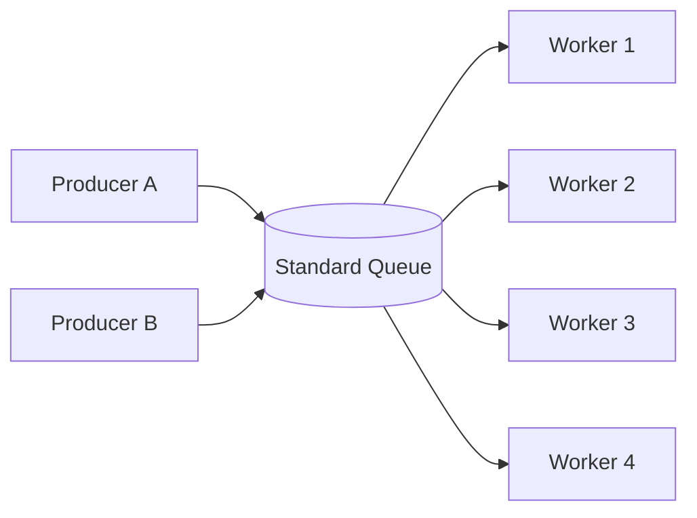
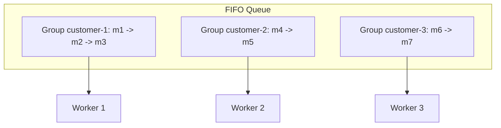
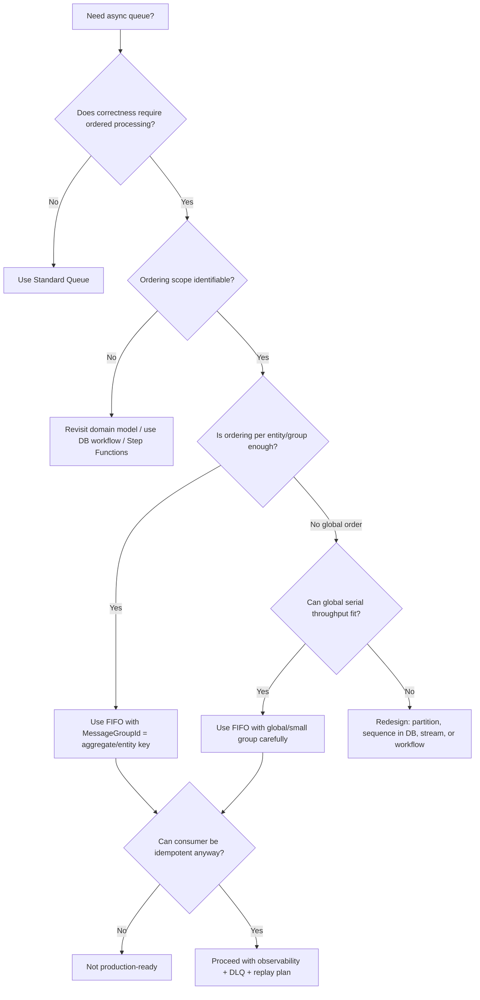

# Part 026 — Standard vs FIFO Queue: Ordering, Throughput, Deduplication, Message Group

Memilih SQS Standard atau FIFO bukan keputusan kosmetik.

Itu keputusan tentang semantics:

- apakah ordering penting;
- ordering berlaku global atau per entity;
- berapa concurrency yang dibutuhkan;
- bagaimana duplicate dicegah;
- apakah throughput lebih penting daripada strict order;
- bagaimana consumer menjaga idempotency;
- apakah bottleneck per message group bisa diterima.

Rule of thumb:

> Pakai Standard kecuali Anda bisa menjelaskan dengan presisi ordering apa yang harus dipertahankan, pada scope apa, dan apa konsekuensi throughput-nya.

FIFO sering dipilih karena terdengar lebih aman. Dalam praktik, FIFO yang salah desain bisa menjadi bottleneck besar, terutama jika semua message memakai satu `MessageGroupId`.

Referensi resmi:

- SQS Queue Types: <https://docs.aws.amazon.com/AWSSimpleQueueService/latest/SQSDeveloperGuide/sqs-queue-types.html>
- SQS Standard at-least-once delivery: <https://docs.aws.amazon.com/AWSSimpleQueueService/latest/SQSDeveloperGuide/standard-queues-at-least-once-delivery.html>
- SQS FIFO queues: <https://docs.aws.amazon.com/AWSSimpleQueueService/latest/SQSDeveloperGuide/sqs-fifo-queues.html>
- FIFO delivery logic: <https://docs.aws.amazon.com/AWSSimpleQueueService/latest/SQSDeveloperGuide/FIFO-queues-understanding-logic.html>
- FIFO exactly-once processing: <https://docs.aws.amazon.com/AWSSimpleQueueService/latest/SQSDeveloperGuide/FIFO-queues-exactly-once-processing.html>
- Message deduplication ID: <https://docs.aws.amazon.com/AWSSimpleQueueService/latest/SQSDeveloperGuide/using-messagededuplicationid-property.html>
- High throughput FIFO: <https://docs.aws.amazon.com/AWSSimpleQueueService/latest/SQSDeveloperGuide/high-throughput-fifo.html>

---

## 1. Perbedaan Inti

| Dimensi | Standard Queue | FIFO Queue |
|---|---|---|
| Ordering | Best-effort ordering | Ordered dalam `MessageGroupId` |
| Delivery | At-least-once, duplicate bisa terjadi | Membantu mencegah duplicate dalam dedup window |
| Throughput | Sangat tinggi dan elastis | Lebih terikat pada message group/partition/config |
| Concurrency | Tinggi, bebas antar message | Parallel antar group, serial dalam group |
| Deduplication | Harus application-level | `MessageDeduplicationId` atau content-based dedup + app idempotency |
| Cocok untuk | Job independent, fanout worker, bulk async task | Per-entity ordered command, ledger-like sequence, strict mutation order |
| Risiko utama | Duplicate/out-of-order | Bottleneck dan false sense of exactly-once |

Mental model:

```txt
Standard = scalable unordered work queue with at-least-once delivery
FIFO    = ordered work queue per message group with deduplication support
```

Jangan membaca FIFO sebagai “semua masalah distributed systems selesai”. FIFO hanya memberi primitive ordering/dedup tertentu. Business side effect tetap harus dirancang idempotent.

---

## 2. Standard Queue Mental Model

SQS Standard queue cocok untuk pekerjaan yang:

- bisa diproses paralel;
- tidak membutuhkan strict order;
- tahan terhadap duplicate;
- bisa di-idempotent-kan;
- lebih mementingkan throughput daripada sequence;
- worker dapat mengambil batch dari queue kapan pun.

Contoh:

- generate thumbnail;
- send email notification idempotent;
- process import rows;
- update search index projection;
- invalidate cache;
- generate report;
- async audit enrichment;
- run independent fraud scoring tasks;
- process webhook retry.

Diagram:



Standard queue tidak menjanjikan urutan strict. Message bisa diterima dalam urutan berbeda dari urutan kirim, dan duplicate dapat terjadi. Ini bukan bug. Ini bagian dari kontrak.

Karena itu desain Standard queue harus berbasis invariant:

> Urutan message tidak boleh menjadi sumber correctness utama.

Jika dua message untuk entity yang sama bisa saling mendahului dan menghasilkan state salah, Standard queue saja tidak cukup. Anda perlu concurrency control di database, sequence check, FIFO group per entity, atau desain ulang event/command model.

---

## 3. FIFO Queue Mental Model

FIFO queue menjaga urutan message dalam scope `MessageGroupId`.

Setiap message FIFO wajib memiliki `MessageGroupId`. Message dengan group yang sama diproses satu per satu dalam urutan. Message dari group berbeda bisa diproses paralel.



Key insight:

> FIFO bukan satu global queue serial kecuali Anda membuat semua message memakai group yang sama.

Message group adalah partition of ordering.

Jika semua message memakai:

```txt
MessageGroupId = "default"
```

maka Anda membuat seluruh queue menjadi single-lane.

Itu mungkin benar untuk ledger global kecil, tetapi hampir selalu salah untuk high-scale application workload.

---

## 4. Ordering Scope: Pertanyaan yang Harus Dijawab

Sebelum memilih FIFO, jawab:

1. Apa yang harus ordered?
2. Ordered terhadap apa?
3. Apakah order global, per tenant, per customer, per account, per order, atau per aggregate?
4. Apa yang terjadi jika message out-of-order?
5. Apakah database dapat menolak stale sequence?
6. Apakah operation commutative?
7. Berapa throughput per ordering key?
8. Apa key dengan traffic paling panas?
9. Apakah satu entity bisa menerima burst besar?
10. Apakah order masih penting setelah retry/DLQ/redrive?

Contoh scope ordering:

| Use Case | Ordering Scope | `MessageGroupId` Kandidat |
|---|---|---|
| Mutasi saldo account | Account | `account:{accountId}` |
| Update status order | Order | `order:{orderId}` |
| Tenant-level billing cycle | Tenant | `tenant:{tenantId}:billing` |
| Ledger global kecil | Global ledger | `ledger:{ledgerId}` |
| Device telemetry command | Device | `device:{deviceId}` |
| User profile mutation | User | `user:{userId}` |

Jangan pilih `tenantId` jika sebenarnya ordering hanya perlu per `orderId`. Itu mengurangi parallelism secara drastis.

---

## 5. MessageGroupId sebagai Concurrency Partition

`MessageGroupId` menentukan dua hal sekaligus:

1. ordering boundary;
2. concurrency boundary.

Message dalam group yang sama tidak diproses paralel dengan cara yang melanggar order. Message dari group berbeda dapat diproses paralel.

```txt
Throughput effective FIFO ≈ jumlah active message group × throughput per group yang dapat dicapai
```

Ini bukan formula quota resmi, tetapi mental model kapasitas.

Jika Anda punya 10.000 account aktif dan group = account, queue punya banyak lane paralel. Jika Anda punya 1 tenant besar dan group = tenant, tenant itu menjadi single-lane bottleneck.

Bad design:

```txt
MessageGroupId = tenantId
```

untuk semua operasi tenant, padahal tiap order independent.

Better:

```txt
MessageGroupId = orderId
```

jika invariant hanya butuh order per order.

Tapi hati-hati: jika satu order punya ribuan step berat, satu order itu tetap bottleneck. FIFO menjaga correctness, bukan magic throughput.

---

## 6. Deduplication: FIFO Membantu, Bukan Mengganti Idempotency

FIFO queue mendukung `MessageDeduplicationId`. Dalam deduplication interval 5 menit, SQS dapat mengenali duplicate send dengan deduplication ID yang sama sehingga duplicate tidak dikirimkan ulang ke consumer.

Ada dua mode umum:

1. explicit `MessageDeduplicationId`;
2. content-based deduplication.

Explicit lebih aman untuk command/event karena dedup identity biasanya berasal dari business identity.

Contoh:

```txt
MessageDeduplicationId = invoice-pdf:inv_123:v1
MessageGroupId         = invoice:inv_123
```

Content-based dedup menghitung hash body message. Masalahnya, dua message yang business-nya sama tetapi memiliki timestamp/correlationId berbeda akan dianggap berbeda.

Contoh buruk untuk content-based dedup:

```json
{
  "invoiceId": "inv_123",
  "requestedAt": "2026-07-06T10:00:00Z",
  "correlationId": "req-a"
}
```

Retry body:

```json
{
  "invoiceId": "inv_123",
  "requestedAt": "2026-07-06T10:00:02Z",
  "correlationId": "req-b"
}
```

Secara business duplicate, tapi body berbeda.

Gunakan explicit dedup ID jika semantics duplicate penting.

Namun tetap ingat:

> Dedup SQS FIFO punya window. Database idempotency harus tetap menjadi garis pertahanan terakhir.

Jika duplicate datang setelah window, dari replay, dari DLQ redrive, dari outbox relay, atau dari bug producer, consumer tetap harus aman.

---

## 7. Standard Queue dan Idempotency

Pada Standard queue, idempotency sepenuhnya milik application.

Contoh message:

```json
{
  "messageId": "01JZ...",
  "messageType": "SendInvoiceEmail",
  "schemaVersion": 1,
  "idempotencyKey": "invoice-email:inv_123:issued:v1",
  "payload": {
    "invoiceId": "inv_123"
  }
}
```

Consumer:

```sql
INSERT INTO processed_message (consumer_name, idempotency_key, status)
VALUES ('invoice-email-worker', :idempotencyKey, 'PROCESSING')
ON CONFLICT (consumer_name, idempotency_key) DO NOTHING;
```

Jika insert berhasil, proses. Jika tidak, cek status.

Untuk external side effect seperti email, simpan `providerMessageId` atau delivery request ID supaya retry tidak mengirim ulang tanpa kontrol.

Idempotency bukan optional. Standard queue harus diasumsikan duplicate.

---

## 8. FIFO dan Database Sequence

FIFO ordering membantu, tetapi database tetap perlu menjaga sequence jika state mutation sensitif.

Misalnya status order:

```txt
CREATED -> PAID -> PACKED -> SHIPPED -> DELIVERED
```

Jika message `SHIPPED` tiba sebelum `PAID`, Standard queue bisa membuat state salah jika consumer naive.

FIFO dengan `MessageGroupId=order:{orderId}` membantu menjaga command order untuk order tersebut.

Namun database tetap harus validasi transition:

```sql
UPDATE orders
SET status = 'SHIPPED', version = version + 1
WHERE order_id = :orderId
  AND status = 'PACKED'
  AND version = :expectedVersion;
```

Jika update count 0, jangan paksa state. Catat conflict.

Mengandalkan FIFO tanpa state transition guard adalah desain rapuh. Message queue bukan pengganti domain invariant.

---

## 9. FIFO Head-of-Line Blocking

FIFO menjaga order dengan konsekuensi: message berikutnya dalam group yang sama tidak boleh melompati message yang sedang gagal.

```txt
Group order-123:
  m1 fails repeatedly
  m2 waits
  m3 waits
```

Ini disebut head-of-line blocking dalam ordering group.

Jika m1 poison message, seluruh group terblokir sampai m1 berhasil, visibility timeout habis berkali-kali, atau masuk DLQ sesuai redrive policy.

Konsekuensi desain:

- pilih group sekecil mungkin sesuai invariant;
- jangan mencampur operasi berat dan ringan dalam group yang sama jika tidak perlu;
- atur `maxReceiveCount` dengan sadar;
- observability harus bisa melihat group/key mana yang stuck;
- DLQ redrive harus mempertimbangkan order.

FIFO bukan pilihan otomatis untuk reliability. FIFO menukar ordering correctness dengan risiko blocking.

---

## 10. DLQ pada FIFO: Hati-Hati Merusak Order

DLQ pada FIFO membantu mengeluarkan poison message, tapi juga bisa memecah urutan.

Misalnya:

```txt
m1 = debit 100
m2 = credit 50
m3 = close account
```

Jika m1 masuk DLQ lalu m2/m3 lanjut, invariant bisnis mungkin rusak.

Untuk workflow yang benar-benar membutuhkan sequential correctness, kadang pilihan yang lebih aman:

- stop group dan mark aggregate `BLOCKED`;
- kirim alert/manual remediation;
- jangan otomatis melanjutkan message berikutnya;
- gunakan Step Functions untuk saga/state eksplisit;
- simpan pending commands di database dengan sequence number.

Jika memakai FIFO + DLQ, tulis policy:

```txt
If a message from group X enters DLQ, what happens to future messages for group X?
```

Jawaban “SQS akan handle” tidak cukup. SQS tidak tahu invariant domain Anda.

---

## 11. Decision Tree: Standard atau FIFO?



Practical guidance:

Use Standard when:

- jobs independent;
- order irrelevant;
- duplicate can be handled;
- high throughput is important;
- backlog processing can be parallelized freely.

Use FIFO when:

- command order matters per aggregate;
- out-of-order processing breaks correctness;
- you can define good `MessageGroupId`;
- throughput per group is acceptable;
- head-of-line blocking is acceptable or mitigated;
- consumer remains idempotent.

Avoid SQS-only design when:

- workflow has many steps, compensation, timeout, human approval;
- global event replay/history is required;
- you need query over unprocessed work;
- ordering needs cannot be partitioned and throughput is high;
- domain needs explicit state machine in database.

---

## 12. Use Case: Account Balance Commands

Problem:

```txt
DebitAccount(accountId, amount)
CreditAccount(accountId, amount)
FreezeAccount(accountId)
```

If commands for same account process out-of-order, correctness can break.

FIFO design:

```txt
MessageGroupId = account:{accountId}
MessageDeduplicationId = command:{commandId}
```

Consumer still uses database transition/locking:

```sql
BEGIN;

SELECT account_id, balance, status, version
FROM account
WHERE account_id = :accountId
FOR UPDATE;

-- validate command against current status/balance
-- apply mutation

UPDATE account
SET balance = :newBalance,
    version = version + 1
WHERE account_id = :accountId
  AND version = :oldVersion;

INSERT INTO processed_command(command_id, account_id, status)
VALUES (:commandId, :accountId, 'COMPLETED');

COMMIT;
```

FIFO gives ordered delivery per account. Database gives atomic mutation and invariant enforcement.

---

## 13. Use Case: Search Index Projection

Problem:

```txt
ProductUpdated events need to update OpenSearch projection.
```

Is FIFO needed?

Maybe not.

If projection document contains version number, Standard queue is often enough.

Message:

```json
{
  "messageType": "ProductProjectionUpdateRequested",
  "productId": "prod_123",
  "sourceVersion": 42,
  "idempotencyKey": "product-projection:prod_123:v42"
}
```

Consumer:

```txt
1. Load product current state/version from source DB.
2. If message version < projected version, skip.
3. Write projection with version guard.
```

Ordering is handled by version comparison, not queue ordering.

This often scales better than FIFO.

Key lesson:

> If stale work can be detected and skipped, Standard queue plus version guard may be better than FIFO.

---

## 14. Use Case: Email Notification

Problem:

```txt
Send invoice issued email.
```

FIFO rarely needed.

Need idempotency:

```txt
idempotencyKey = email:invoice-issued:invoiceId:recipient:v1
```

Consumer records email send attempt. If duplicate message appears, skip or return stored result.

Ordering between email messages usually not business-critical. If it is, ask why. Many teams overestimate email ordering requirements.

---

## 15. Use Case: Webhook Delivery

Webhook delivery has two possible semantics.

If subscriber expects events in order per endpoint/entity, FIFO might help:

```txt
MessageGroupId = subscriber:{subscriberId}:entity:{entityId}
```

But webhook delivery also has external dependency failure and retry policy. A failing webhook endpoint can block a FIFO group.

Alternative design:

- store webhook delivery attempts in database;
- use Standard queue for delivery attempts;
- include event sequence;
- endpoint consumer handles ordering or your delivery service suppresses stale events;
- use per-subscriber rate limit.

FIFO is not automatically right. The true requirement is delivery contract with subscribers.

---

## 16. Producer Code: Standard Queue

```java
import software.amazon.awssdk.services.sqs.SqsClient;
import software.amazon.awssdk.services.sqs.model.SendMessageRequest;

public final class StandardQueuePublisher {
    private final SqsClient sqs;
    private final String queueUrl;

    public StandardQueuePublisher(SqsClient sqs, String queueUrl) {
        this.sqs = sqs;
        this.queueUrl = queueUrl;
    }

    public void publish(String body, String correlationId) {
        SendMessageRequest request = SendMessageRequest.builder()
                .queueUrl(queueUrl)
                .messageBody(body)
                .messageAttributes(Maps.stringAttributes(Map.of(
                        "correlationId", correlationId,
                        "schemaVersion", "1"
                )))
                .build();

        sqs.sendMessage(request);
    }
}
```

For Standard queue, application message body must contain idempotency key because SQS does not deduplicate for you.

---

## 17. Producer Code: FIFO Queue

FIFO queue URL usually ends with `.fifo`, and message send requires `MessageGroupId`. Deduplication can be explicit or content-based depending on queue config.

```java
import software.amazon.awssdk.services.sqs.SqsClient;
import software.amazon.awssdk.services.sqs.model.SendMessageRequest;

public final class FifoQueuePublisher {
    private final SqsClient sqs;
    private final String queueUrl;

    public FifoQueuePublisher(SqsClient sqs, String queueUrl) {
        this.sqs = sqs;
        this.queueUrl = queueUrl;
    }

    public void publishAccountCommand(AccountCommand command) {
        String messageGroupId = "account:" + command.accountId();
        String deduplicationId = "command:" + command.commandId();

        SendMessageRequest request = SendMessageRequest.builder()
                .queueUrl(queueUrl)
                .messageBody(command.toJson())
                .messageGroupId(messageGroupId)
                .messageDeduplicationId(deduplicationId)
                .build();

        sqs.sendMessage(request);
    }
}
```

Dedup ID should be stable across retry. Do not use random UUID generated per send attempt unless each attempt really is a distinct business command.

Buruk:

```java
.messageDeduplicationId(UUID.randomUUID().toString())
```

Lebih baik:

```java
.messageDeduplicationId("command:" + command.commandId())
```

---

## 18. Consumer Design untuk FIFO

Consumer FIFO mirip Standard, tetapi mental model harus memperhatikan group blocking.

Best practices:

- log `MessageGroupId`;
- expose per-group failure if possible;
- classify poison message quickly;
- avoid long processing within one group;
- use short transactions;
- keep idempotency table;
- do not rely only on FIFO dedup.

Jika satu message gagal retryable, jangan langsung delete. Biarkan retry sesuai visibility timeout. Jika permanent, tulis failure state dan biarkan redrive policy menangani, atau pindahkan ke manual remediation dengan sangat hati-hati.

Untuk domain sequence sensitif, jangan otomatis melanjutkan group setelah message permanent failed tanpa business decision.

---

## 19. Throughput Strategy

Standard queue throughput strategy:

- scale worker horizontally;
- batch receive/delete;
- long polling;
- idempotency guard;
- downstream rate limit;
- partition workload by queue jika isolation diperlukan;
- monitor backlog age.

FIFO throughput strategy:

- gunakan banyak distinct `MessageGroupId`;
- jangan global group kecuali workload kecil;
- aktifkan high throughput FIFO jika sesuai;
- batch operation dengan benar;
- hindari hot group;
- pisahkan heavy/light workload jika satu group sering memblokir;
- pertimbangkan sharded group jika ordering bisa dipartisi lebih kecil.

Sharded group contoh:

```txt
MessageGroupId = customer:{customerId}:bucket:{hash(orderId) % 16}
```

Tapi ini hanya valid jika ordering tidak perlu global per customer. Jangan shard ordering key yang sebenarnya harus strict.

---

## 20. Hot Message Group

Hot group terjadi ketika satu `MessageGroupId` menerima volume jauh lebih tinggi daripada group lain.

Gejala:

- queue backlog naik;
- worker banyak idle atau tidak optimal;
- satu business entity terlambat jauh;
- DLQ berisi message dari group yang sama;
- processing latency skewed.

Solusi bergantung pada invariant:

1. Jika ordering key terlalu besar, perkecil scope.
2. Jika operasi commutative, gunakan Standard + version/merge logic.
3. Jika group memang hot dan harus ordered, terima bottleneck atau redesign domain workflow.
4. Jika ada poison message, quarantine dengan business policy.
5. Jika workload bisa dipisah, buat queue berbeda untuk command berat.

Jangan menyelesaikan hot group dengan menambah worker tanpa mengubah group design. Itu tidak menyelesaikan serial lane.

---

## 21. Ordering vs Commutativity

Tidak semua operasi butuh order. Beberapa operasi commutative atau bisa dibuat commutative.

Contoh commutative:

```txt
increment counter by +1
add tag X to set
record audit event
mark projection dirty
```

Contoh non-commutative:

```txt
set status to PAID then CANCELLED
withdraw then close account
apply interest then fee
approve then revoke
```

Jika operasi bisa dibuat commutative, Standard queue sering lebih scalable.

Misalnya daripada mengirim:

```txt
SetInventoryQuantity(productId, quantity=10)
SetInventoryQuantity(productId, quantity=8)
```

yang order-sensitive, mungkin desain lebih baik:

```txt
InventoryChanged(productId, sourceVersion=42)
```

Consumer membaca state terbaru dan skip stale version.

---

## 22. Anti-Patterns

### Anti-pattern 1: FIFO karena takut duplicate

FIFO bukan pengganti idempotency. Jika masalah utama duplicate side effect, buat idempotent consumer.

### Anti-pattern 2: Semua message pakai group `default`

Ini membuat single-lane queue. Throughput jatuh dan poison message memblokir semua.

### Anti-pattern 3: MessageGroupId = tenantId untuk semua operasi

Tenant besar menjadi bottleneck. Gunakan aggregate key yang benar jika invariant memungkinkan.

### Anti-pattern 4: Content-based dedup dengan body volatile

Timestamp/correlationId/random field membuat duplicate business command tidak terdedup.

### Anti-pattern 5: Menganggap DLQ FIFO aman otomatis

DLQ bisa memecah order. Butuh policy domain.

### Anti-pattern 6: Mengandalkan queue order untuk domain invariant

Database tetap harus validasi state transition, version, uniqueness, dan idempotency.

### Anti-pattern 7: Standard queue untuk mutation order-sensitive tanpa guard

Jika out-of-order merusak state, tambahkan sequence/version guard atau gunakan FIFO.

---

## 23. Testing Matrix

| Scenario | Standard Expected | FIFO Expected |
|---|---|---|
| Duplicate message | Idempotency skips duplicate | Dedup may suppress send; app idempotency still skips |
| Out-of-order delivery | Version/transition guard handles | Same group preserves order |
| Worker crash before delete | Message retried; no duplicate effect | Same |
| Poison message | DLQ after threshold | Group may block until DLQ threshold |
| Hot entity | May process concurrently, DB guard required | Hot group bottleneck |
| Replay DLQ | Idempotent replay | Replay must respect ordering policy |
| Producer retry SendMessage | Duplicate possible | Dedup ID suppresses within window |
| Schema version unknown | Quarantine/DLQ | Same |

---

## 24. Selection Examples

| Workload | Queue Type | Reason |
|---|---|---|
| PDF generation per invoice | Standard | Independent jobs, idempotent output |
| Email notification | Standard | Ordering rarely matters, idempotency enough |
| Product search projection | Standard | Version guard can skip stale work |
| Account balance command | FIFO | Per-account ordered mutation |
| Order lifecycle command | FIFO | Per-order state transition order matters |
| Webhook delivery per subscriber/entity | Depends | FIFO if contract requires order; Standard if versioned delivery enough |
| Bulk data backfill | Standard | Chunk independent, high throughput |
| Device command queue | FIFO | Per-device command sequence may matter |
| Cache invalidation | Standard | Duplicate harmless, order usually irrelevant |
| Global ledger | FIFO or DB log | Only if throughput fits and strict sequence required |

---

## 25. Production Checklist

For Standard queue:

- Is every consumer idempotent?
- Can out-of-order message break state?
- If yes, where is sequence/version guard?
- Are retries classified?
- Is DLQ configured and owned?
- Is backlog age alerted?
- Is worker concurrency DB-safe?
- Is duplicate side effect prevented?

For FIFO queue:

- What exact invariant requires ordering?
- What is the `MessageGroupId`?
- Is group scope too broad?
- What are the hottest groups?
- Is `MessageDeduplicationId` stable?
- Is content-based dedup safe, or body volatile?
- What happens when one group has poison message?
- Can DLQ/redrive violate order?
- Is consumer still idempotent after dedup window/replay?
- Is throughput acceptable under realistic traffic?

---

## 26. Ringkasan

Standard queue adalah default untuk high-throughput asynchronous work yang bisa diproses paralel dan idempotent.

FIFO queue adalah alat untuk ordered processing dalam scope `MessageGroupId`, bukan jaminan global correctness. FIFO membantu ketika order benar-benar bagian dari invariant, tetapi membawa trade-off: throughput lebih sensitif pada group design, hot group bisa menjadi bottleneck, dan poison message dapat memblokir lane.

Keputusan terbaik bukan “Standard cepat, FIFO aman”. Keputusan terbaik adalah:

```txt
What ordering invariant exists?
Can it be enforced in database instead?
Can stale work be skipped by version?
What is the smallest safe ordering scope?
Can throughput survive that scope?
Is consumer idempotent even after replay?
```

Engineer yang matang tidak memilih FIFO karena cemas. Ia memilih FIFO hanya saat ordering invariant jelas, message group didesain sebagai concurrency partition, dan database tetap menjaga correctness.
