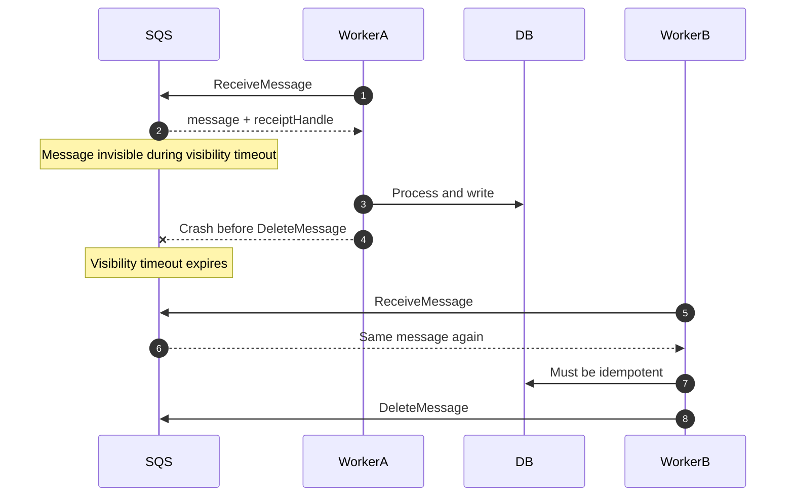
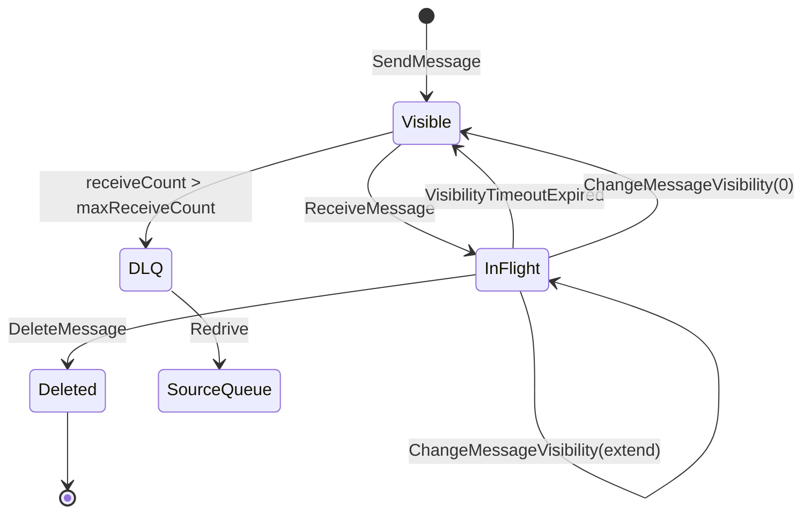
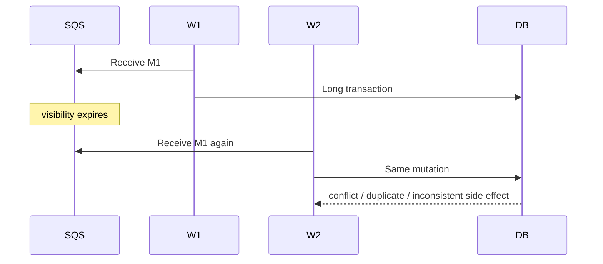
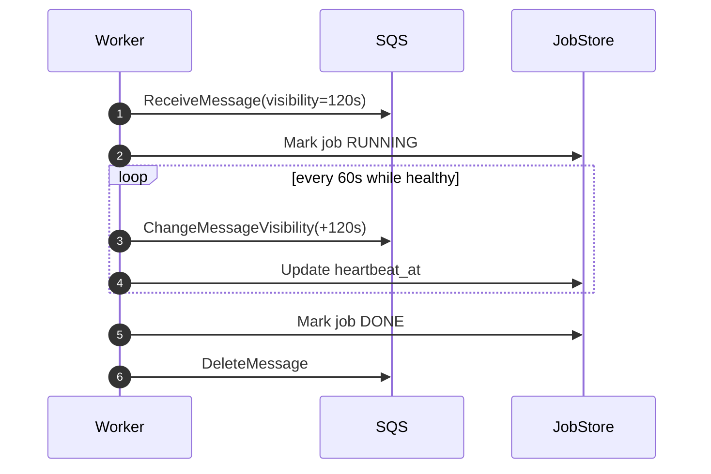
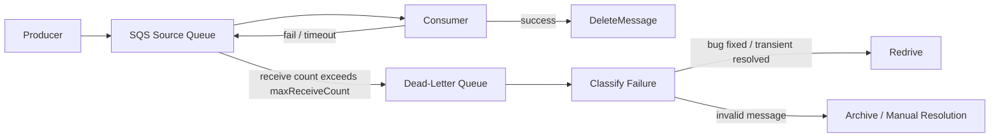
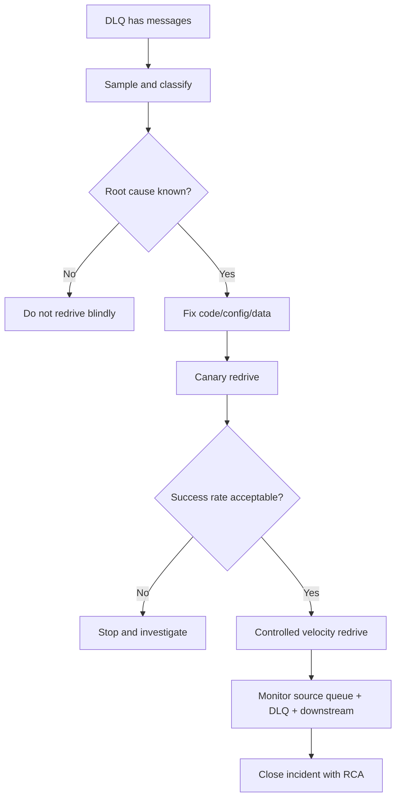
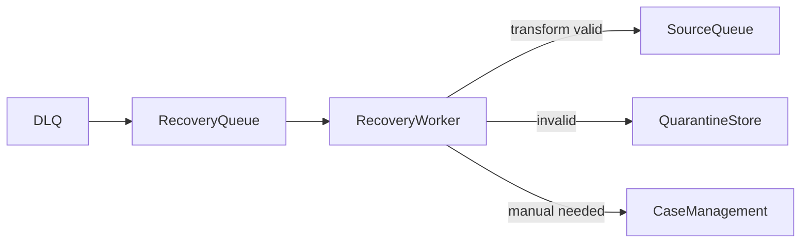
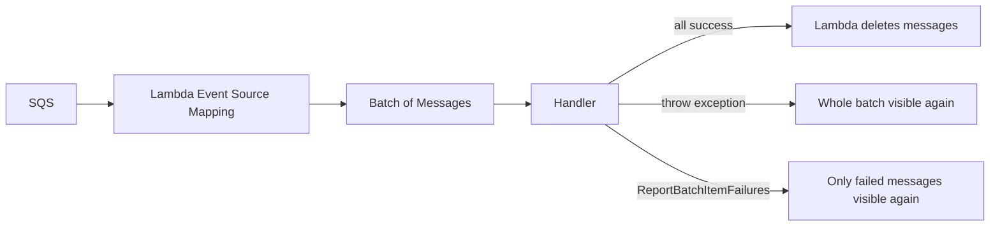

# Part 027 — Visibility Timeout, DLQ, Redrive, Poison Message, dan Retry Envelope

SQS bukan hanya tempat menaruh pesan.

SQS adalah mekanisme koordinasi kerja antar proses yang gagal secara independen. Karena itu, desain SQS yang matang tidak dimulai dari `SendMessage` dan `ReceiveMessage`, tetapi dari pertanyaan:

> Jika consumer mati setelah menerima message tetapi sebelum commit selesai, apa state sistem yang masih benar?

Part ini membahas bagian SQS yang paling sering salah dipahami:

- visibility timeout;
- receive count;
- retry;
- dead-letter queue;
- redrive;
- poison message;
- message retention;
- failure isolation;
- replay safety;
- operational playbook.

Referensi resmi:

- SQS visibility timeout: <https://docs.aws.amazon.com/AWSSimpleQueueService/latest/SQSDeveloperGuide/sqs-visibility-timeout.html>
- SQS configuring visibility timeout: <https://docs.aws.amazon.com/AWSSimpleQueueService/latest/SQSDeveloperGuide/working-with-visibility-timeouts.html>
- SQS dead-letter queues: <https://docs.aws.amazon.com/AWSSimpleQueueService/latest/SQSDeveloperGuide/sqs-dead-letter-queues.html>
- SQS DLQ redrive: <https://docs.aws.amazon.com/AWSSimpleQueueService/latest/SQSDeveloperGuide/sqs-configure-dead-letter-queue-redrive.html>
- SQS quotas: <https://docs.aws.amazon.com/AWSSimpleQueueService/latest/SQSDeveloperGuide/quotas-queues.html>
- Lambda SQS error handling: <https://docs.aws.amazon.com/lambda/latest/dg/services-sqs-errorhandling.html>
- Lambda partial batch response for SQS: <https://docs.aws.amazon.com/lambda/latest/dg/example_serverless_SQS_Lambda_batch_item_failures_section.html>

---

## 1. Visibility Timeout Bukan Lock

Kesalahan mental model yang paling umum:

> “Message sudah diterima consumer, berarti consumer lain tidak akan pernah melihat message itu.”

Itu salah.

Visibility timeout adalah **lease sementara**. Saat consumer menerima message, SQS membuat message itu tidak terlihat untuk durasi tertentu. Jika consumer tidak menghapus message sebelum lease habis, message akan terlihat lagi dan bisa diterima ulang oleh consumer yang sama atau consumer lain.

Jadi, visibility timeout bukan:

- distributed lock permanen;
- guarantee exactly-once;
- bukti bahwa consumer pasti berhasil;
- transaction boundary;
- pengganti idempotency.

Visibility timeout adalah:

- grace period untuk consumer memproses message;
- mekanisme recovery otomatis jika consumer crash;
- alat pengatur retry delay kasar;
- sumber duplicate jika timeout terlalu pendek;
- sumber lambat recovery jika timeout terlalu panjang.



Invariant penting:

> Setiap consumer SQS harus benar walaupun message yang sama diterima lebih dari sekali.

---

## 2. Message Lifecycle

Sebuah message SQS biasanya bergerak melalui lifecycle berikut:



State utama:

| State | Arti | Risiko |
|---|---|---|
| `Visible` | Message tersedia untuk consumer | backlog naik jika worker kurang |
| `InFlight` | Message sudah diterima tapi belum dihapus | duplicate jika timeout habis |
| `Deleted` | Consumer menghapus message setelah sukses | hilang permanen dari queue |
| `DLQ` | Message dianggap gagal setelah receive count melewati threshold | data pending investigasi |
| `Redriven` | Message dipindahkan kembali dari DLQ | bisa menciptakan replay storm |

Yang sering luput:

> `DeleteMessage` adalah acknowledgment. Jika ack gagal setelah side effect berhasil, message bisa diproses lagi.

Karena itu, urutan aman biasanya:

1. receive message;
2. validate envelope;
3. execute idempotent operation;
4. commit state/dedup record;
5. only then delete message.

Jangan delete lebih awal kecuali operation memang fire-and-forget dan kehilangan message dapat diterima.

---

## 3. Receipt Handle: Ack Token, Bukan Message ID

Saat consumer menerima message, SQS memberikan `ReceiptHandle`.

Gunanya:

- delete message;
- change visibility timeout;
- terminate visibility timeout.

`ReceiptHandle` bukan stable message identity. Message yang sama diterima ulang bisa punya receipt handle berbeda.

Maka:

- gunakan `messageId` atau application-level `eventId` untuk observability;
- gunakan `deduplicationKey`, `commandId`, `eventId`, atau business idempotency key untuk correctness;
- gunakan `receiptHandle` hanya untuk operasi terhadap SQS.

Anti-pattern:

```text
processed_messages(receipt_handle primary key)
```

Lebih benar:

```text
processed_messages(event_id primary key, processed_at, result_hash, consumer_name)
```

---

## 4. Menentukan Visibility Timeout

Visibility timeout harus lebih panjang dari waktu pemrosesan normal, tetapi tidak terlalu panjang sehingga retry menjadi lambat saat worker mati.

Formula awal:

```text
visibility_timeout = p99_processing_time + downstream_retry_budget + network_margin
```

Namun formula itu belum cukup. Pertimbangkan juga:

- batch size;
- database lock wait;
- downstream timeout;
- external API retry;
- GC pause;
- cold start;
- throttling;
- failover database;
- consumer autoscaling delay.

Contoh:

| Workload | p99 Processing | Downstream Retry | Margin | Visibility Awal |
|---|---:|---:|---:|---:|
| simple projection write | 500 ms | 1 s | 2 s | 5 s |
| email sender | 2 s | 10 s | 5 s | 20–30 s |
| PDF generation | 90 s | 60 s | 30 s | 3–5 min |
| external compliance sync | 5 min | 5 min | 2 min | 12–15 min |

Default visibility timeout SQS adalah 30 detik. Nilai ini aman untuk demo, tetapi sering salah untuk production.

---

## 5. Timeout Terlalu Pendek vs Terlalu Panjang

### 5.1 Terlalu pendek

Gejala:

- duplicate processing naik;
- DB unique constraint conflict meningkat;
- consumer seolah bekerja dua kali;
- side effect eksternal bisa double-send jika tidak idempotent;
- log menunjukkan message yang sama diproses paralel.

Penyebab:

- visibility timeout lebih kecil dari p99 processing;
- batch terlalu besar;
- downstream lambat;
- worker tidak memperpanjang lease untuk pekerjaan panjang.

Dampak:



### 5.2 Terlalu panjang

Gejala:

- retry lambat setelah worker crash;
- backlog terlihat stabil tetapi progress rendah;
- DLQ butuh lama terisi;
- incident recovery lambat;
- message stuck in-flight.

Penyebab:

- timeout diset jauh di atas real processing time;
- tidak ada heartbeat extension, hanya timeout besar;
- worker menggantung tanpa fail-fast.

Trade-off:

| Visibility Timeout | Kelebihan | Risiko |
|---|---|---|
| pendek | retry cepat | duplicate tinggi |
| panjang | duplicate lebih rendah | recovery lambat |
| dinamis/heartbeat | lebih adaptif | implementasi lebih kompleks |

---

## 6. Heartbeat Pattern dengan `ChangeMessageVisibility`

Untuk pekerjaan panjang, jangan selalu langsung set visibility timeout sangat besar.

Gunakan heartbeat:

1. receive message dengan visibility awal moderat;
2. proses step-by-step;
3. secara periodik extend visibility jika masih sehat;
4. jika consumer tahu tidak bisa lanjut, terminate visibility ke 0 atau biarkan timeout;
5. delete setelah commit final.



Java-like sketch:

```java
public final class SqsLeaseExtender implements AutoCloseable {
    private final SqsClient sqs;
    private final String queueUrl;
    private final String receiptHandle;
    private final ScheduledExecutorService scheduler;
    private final AtomicBoolean closed = new AtomicBoolean(false);

    public SqsLeaseExtender(SqsClient sqs, String queueUrl, String receiptHandle) {
        this.sqs = sqs;
        this.queueUrl = queueUrl;
        this.receiptHandle = receiptHandle;
        this.scheduler = Executors.newSingleThreadScheduledExecutor();
    }

    public void start(Duration interval, Duration extension) {
        scheduler.scheduleAtFixedRate(() -> {
            if (closed.get()) return;
            sqs.changeMessageVisibility(ChangeMessageVisibilityRequest.builder()
                    .queueUrl(queueUrl)
                    .receiptHandle(receiptHandle)
                    .visibilityTimeout((int) extension.toSeconds())
                    .build());
        }, interval.toSeconds(), interval.toSeconds(), TimeUnit.SECONDS);
    }

    @Override
    public void close() {
        closed.set(true);
        scheduler.shutdownNow();
    }
}
```

Gunakan heartbeat hanya jika:

- job bisa berlangsung lama;
- job bisa diamati progress-nya;
- worker memiliki cancellation/shutdown handling;
- operation idempotent;
- Anda punya upper bound total runtime.

Jangan gunakan heartbeat untuk menyembunyikan worker yang menggantung.

---

## 7. In-Flight Messages: Quota yang Sering Terlupakan

SQS punya konsep in-flight message: message yang sudah diterima tetapi belum di-delete.

Pada Standard queue, ada batas sekitar 120.000 in-flight message, tergantung traffic dan backlog. Jika batas ini tercapai:

- short polling bisa mendapat `OverLimit`;
- long polling bisa tidak mengembalikan message baru sampai in-flight turun.

Gejala in-flight saturation:

- queue backlog tinggi;
- consumer polling tetapi tidak mendapat message;
- `ApproximateNumberOfMessagesNotVisible` tinggi;
- processing time/visibility timeout terlalu besar;
- consumer crash sebelum delete;
- batch size terlalu besar;
- downstream lambat.

Dashboard minimal:

| Metric | Interpretasi |
|---|---|
| `ApproximateNumberOfMessagesVisible` | backlog siap diproses |
| `ApproximateNumberOfMessagesNotVisible` | in-flight messages |
| `ApproximateAgeOfOldestMessage` | umur message tertua yang belum selesai |
| `NumberOfMessagesReceived` | receive throughput |
| `NumberOfMessagesDeleted` | successful ack throughput |
| DLQ visible count | failure backlog |

Alert yang buruk:

```text
ApproximateNumberOfMessagesVisible > 0
```

Alert yang lebih berguna:

```text
ApproximateAgeOfOldestMessage > SLO_processing_delay
AND NumberOfMessagesDeleted tidak naik cukup cepat
```

Karena backlog sementara bukan selalu masalah. Backlog yang tidak drain sesuai SLO adalah masalah.

---

## 8. Dead-Letter Queue: Failure Isolation, Bukan Tempat Sampah

DLQ adalah queue khusus untuk message yang gagal diproses setelah jumlah receive tertentu.

DLQ bukan:

- tempat membuang data yang tidak ingin dipikirkan;
- pengganti alerting;
- bukti message aman;
- mekanisme retry utama;
- cara menyembunyikan bug.

DLQ adalah:

- failure isolation;
- forensic buffer;
- reprocessing source;
- safety valve agar poison message tidak memblokir queue utama;
- input untuk incident workflow.



Pertanyaan desain DLQ:

1. Message apa yang boleh masuk DLQ?
2. Berapa `maxReceiveCount` yang benar?
3. Siapa yang mendapat alert?
4. Bagaimana message diinvestigasi?
5. Bagaimana message di-redrive?
6. Bagaimana mencegah redrive storm?
7. Bagaimana membedakan transient failure dari permanent failure?
8. Berapa lama DLQ retention?
9. Apakah data di DLQ mengandung PII/secrets?
10. Apakah message schema lama masih bisa diproses setelah redrive?

---

## 9. `maxReceiveCount`: Retry Budget, Bukan Angka Random

Redrive policy menentukan `maxReceiveCount`: berapa kali message dapat diterima sebelum dipindahkan ke DLQ.

Jangan set terlalu rendah.

Jika `maxReceiveCount = 1`, satu kegagalan kecil langsung mengirim message ke DLQ. Ini buruk untuk failure transient seperti:

- temporary DB timeout;
- throttling downstream;
- deployment restart;
- network blip;
- Lambda cold/throttle behavior;
- temporary lock contention.

Jangan set terlalu tinggi tanpa alasan.

Jika `maxReceiveCount = 1000`, poison message bisa membakar kapasitas worker sangat lama.

Cara berpikir:

```text
maxReceiveCount = jumlah percobaan yang masuk akal sebelum failure dianggap perlu investigasi manusia/otomatis
```

Contoh baseline:

| Workload | Failure Mode Umum | Suggested Start |
|---|---|---:|
| projection update | transient DB conflict | 5–10 |
| email notification | provider throttle | 5–8 |
| payment capture | external API ambiguity | 3–5 + reconciliation |
| document generation | input corruption mungkin permanen | 2–4 |
| import batch row | invalid row sering permanen | 1–3 + row-level error store |

Tetapi angka final harus ditentukan dari:

- SLO delay;
- cost retry;
- downstream rate limits;
- probability transient recovery;
- blast radius duplicate;
- time to detect;
- time to repair.

---

## 10. Retry Envelope

Message body sebaiknya tidak hanya berisi payload domain. Untuk production, gunakan envelope.

Contoh:

```json
{
  "messageId": "msg_01J8...",
  "eventId": "evt_01J8...",
  "eventType": "CaseEscalationRequested",
  "eventVersion": 3,
  "occurredAt": "2026-07-06T10:15:30Z",
  "producer": "case-service",
  "correlationId": "corr_abc",
  "causationId": "cmd_123",
  "tenantId": "tenant-a",
  "idempotencyKey": "case-123:escalation-requested:v3",
  "schemaRef": "case-escalation-requested/3",
  "retryPolicy": {
    "class": "default-worker",
    "notBefore": null
  },
  "payload": {
    "caseId": "case-123",
    "reason": "sla_breach"
  }
}
```

Field penting:

| Field | Fungsi |
|---|---|
| `messageId` | technical identity |
| `eventId`/`commandId` | semantic identity |
| `eventType` | routing dan handler selection |
| `eventVersion` | schema evolution |
| `correlationId` | trace lintas service |
| `causationId` | hubungan sebab-akibat |
| `tenantId` | isolation, rate limit, debugging |
| `idempotencyKey` | correctness terhadap duplicate |
| `schemaRef` | validation dan compatibility |
| `occurredAt` | domain time |

SQS punya message attributes, tetapi jangan bergantung pada attribute untuk semua data kritikal jika downstream pipeline mungkin hanya menyimpan body. Gunakan attribute untuk routing/filtering/observability, dan body untuk canonical processing contract.

---

## 11. Poison Message

Poison message adalah message yang akan gagal terus jika diproses ulang dengan kondisi sistem saat ini.

Jenis poison message:

| Jenis | Contoh | Solusi |
|---|---|---|
| schema poison | field wajib hilang | schema validation + DLQ |
| semantic poison | `caseId` tidak ada | quarantine / reconciliation |
| authorization poison | tenant invalid | reject + audit |
| code poison | bug handler | fix code + redrive |
| dependency poison | downstream permanent 400 | classify non-retryable |
| data poison | constraint violation permanen | compensation/manual review |

Consumer harus membedakan failure:

```text
transient failure  -> retry
permanent failure  -> DLQ/quarantine cepat
ambiguous failure  -> idempotency + reconciliation
```

Anti-pattern:

```java
try {
    process(message);
} catch (Exception e) {
    throw e; // all failures treated the same
}
```

Lebih baik:

```java
try {
    process(message);
    ack(message);
} catch (PermanentMessageException e) {
    writeQuarantineRecord(message, e);
    ack(message); // do not poison the queue repeatedly
} catch (TransientDependencyException e) {
    throw e; // let SQS retry
} catch (AmbiguousCommitException e) {
    reconcileLater(message, e);
    throw e; // or ack only if reconciliation record is durable
}
```

Catatan penting: ack permanent failure setelah menulis quarantine record bukan “kehilangan message”. Itu mengubah jalur penyelesaian dari automatic retry menjadi manual/compensating workflow.

---

## 12. DLQ Retention: Jangan Kalah dari Source Queue

Retention DLQ harus lebih panjang dari source queue.

Alasannya:

- message mungkin sudah menghabiskan waktu lama di source queue sebelum pindah ke DLQ;
- butuh waktu investigasi;
- redrive mungkin menunggu bug fix;
- auditor mungkin butuh bukti payload/error.

Perilaku retention berbeda:

| Queue Type | Timestamp Saat Masuk DLQ |
|---|---|
| Standard | original enqueue timestamp tidak berubah |
| FIFO | enqueue timestamp reset saat masuk DLQ |

Implikasi untuk Standard queue:

Jika source retention 4 hari dan message masuk DLQ setelah 3 hari, DLQ retention 4 hari tidak berarti message tersedia 4 hari penuh di DLQ. Karena expiration tetap dihitung dari original enqueue timestamp.

Praktik aman:

```text
DLQ retention >= source retention + investigation window
```

Contoh:

```text
source retention = 4 days
desired investigation window = 7 days
DLQ retention >= 11 days
```

Namun pertimbangkan compliance dan PII. DLQ bukan archive permanen.

---

## 13. Redrive: Replay dengan Tombol Besar

Redrive memindahkan message dari DLQ ke source queue atau queue tujuan lain.

Redrive terlihat sederhana, tetapi secara arsitektur itu adalah replay.

Risiko redrive:

- duplicate side effect;
- replay storm;
- downstream overload;
- schema lama tidak kompatibel;
- ordering berubah;
- invalid message kembali poison;
- source queue bercampur dengan traffic baru;
- DLQ kosong tetapi masalah belum selesai.

AWS SQS mendukung redrive dengan velocity control. Gunakan itu.

Jangan melakukan:

```text
redrive all messages at maximum speed during peak traffic
```

Lakukan:

1. classify DLQ sample;
2. fix root cause;
3. deploy fix;
4. redrive small canary subset;
5. monitor success/delete/error metrics;
6. ramp up velocity;
7. pause jika DLQ/source error naik;
8. document incident.



---

## 14. Redrive ke Source Queue vs Custom Queue

Pilihan redrive:

| Destination | Kapan Cocok | Risiko |
|---|---|---|
| source queue | bug fixed, message bisa diproses normal | bercampur traffic baru |
| custom recovery queue | butuh worker khusus recovery | perlu pipeline tambahan |
| quarantine archive | message invalid/perlu audit | bukan automatic recovery |

Custom recovery queue berguna ketika:

- schema lama butuh transformer;
- operation perlu mode repair;
- perlu throttling lebih ketat;
- consumer normal tidak boleh menyentuh message lama;
- butuh approval/human-in-the-loop.

Pattern:



Ini lebih aman untuk domain sensitif seperti regulatory enforcement, payment, compliance, atau case lifecycle system.

---

## 15. FIFO Queue dan DLQ: Ordering Bisa Rusak

Untuk FIFO queue, DLQ bisa merusak exact ordering jika domain membutuhkan urutan penuh tanpa gap.

Contoh:

```text
M1: set status = OPEN
M2: set status = UNDER_REVIEW
M3: set status = CLOSED
```

Jika `M2` masuk DLQ tetapi `M3` tetap diproses, state bisa salah.

SQS FIFO menjamin ordering dalam message group pada delivery queue, tetapi begitu message dipindahkan ke DLQ dan kemudian di-redrive, pesan redrive dapat bercampur dengan pesan baru sesuai waktu ingress ke destination queue.

Untuk domain ordered mutation, pertimbangkan:

- jangan gunakan DLQ langsung jika order gap tidak boleh terjadi;
- stop processing entity saat ada gap;
- gunakan per-entity sequence number;
- consumer reject jika previous sequence belum committed;
- simpan pending events di store;
- redrive melalui recovery workflow, bukan langsung.

Contoh invariant:

```sql
CREATE TABLE entity_sequence_guard (
    entity_id VARCHAR(100) PRIMARY KEY,
    last_sequence BIGINT NOT NULL,
    updated_at TIMESTAMP NOT NULL
);
```

Consumer:

```text
if message.sequence != last_sequence + 1:
    do not apply mutation
    store pending/gap event
```

---

## 16. Visibility Timeout dan Lambda Trigger

Jika SQS diproses oleh Lambda, ada aturan penting:

```text
queue visibility timeout >= 6 x lambda function timeout
```

Ini bukan hukum fisika, tetapi guidance praktis AWS agar Lambda punya ruang retry ketika function throttled saat batch sebelumnya sedang diproses.

Hal yang perlu dipahami:

- Lambda melakukan polling SQS;
- Lambda mengirim batch ke function;
- jika function error, batch bisa retry setelah visibility timeout;
- default behavior: satu error dalam batch membuat seluruh batch retry;
- partial batch response dapat membuat hanya item gagal yang retry;
- untuk FIFO, saat memakai partial batch response, berhenti setelah failure pertama dan return failed + unprocessed items agar ordering tetap dijaga.



Partial batch response sangat penting jika batch berisi banyak independent messages. Tanpa ini, satu poison message membuat message lain yang sudah sukses diproses ulang berkali-kali.

---

## 17. Retry Delay: SQS Visibility vs Application Scheduler

SQS retry delay default terjadi karena visibility timeout. Ini coarse-grained.

Untuk retry sederhana:

```text
process fails -> visibility expires -> message visible again
```

Untuk retry yang perlu backoff dinamis, ada beberapa opsi:

| Opsi | Cocok Untuk | Catatan |
|---|---|---|
| visibility timeout tetap | retry sederhana | delay sama setiap attempt |
| `ChangeMessageVisibility` | delay per message | worker harus memutuskan delay |
| requeue dengan delay queue | delayed retry terbatas | max delay queue SQS 15 menit |
| EventBridge Scheduler | retry/resume jauh di masa depan | lebih eksplisit untuk scheduled command |
| Step Functions | retry policy + stateful workflow | cocok multi-step/compensation |
| retry table di DB | domain-specific retry | mudah diquery dan diaudit |

Pattern retry table:

```sql
CREATE TABLE retry_jobs (
    job_id VARCHAR(100) PRIMARY KEY,
    payload JSONB NOT NULL,
    attempt_count INT NOT NULL,
    next_attempt_at TIMESTAMP NOT NULL,
    status VARCHAR(30) NOT NULL,
    last_error TEXT,
    created_at TIMESTAMP NOT NULL,
    updated_at TIMESTAMP NOT NULL
);
```

Gunakan retry table jika:

- retry perlu delay > 15 menit;
- retry perlu manual pause/resume;
- retry perlu audit;
- retry perlu klasifikasi error;
- retry policy berbeda per tenant/domain.

---

## 18. Idempotency saat Redrive

Redrive berarti message lama diproses ulang. Karena itu consumer harus bisa membedakan:

1. message belum pernah diproses;
2. message sudah diproses sukses;
3. message pernah diproses tetapi gagal setelah side effect ambigu;
4. message invalid dan sudah di-quarantine;
5. message versi lama yang perlu transformer.

Minimal table:

```sql
CREATE TABLE processed_message (
    consumer_name VARCHAR(100) NOT NULL,
    idempotency_key VARCHAR(200) NOT NULL,
    status VARCHAR(30) NOT NULL,
    result_hash VARCHAR(128),
    first_seen_at TIMESTAMP NOT NULL,
    completed_at TIMESTAMP,
    last_error TEXT,
    PRIMARY KEY (consumer_name, idempotency_key)
);
```

Pola:

```java
@Transactional
public ProcessingDecision begin(MessageEnvelope envelope) {
    try {
        insertProcessedMessage(envelope.idempotencyKey(), "PROCESSING");
        return ProcessingDecision.PROCESS;
    } catch (DuplicateKeyException duplicate) {
        var row = findProcessedMessage(envelope.idempotencyKey());
        if (row.status().equals("COMPLETED")) {
            return ProcessingDecision.ACK_ALREADY_DONE;
        }
        if (row.status().equals("PROCESSING") && row.isStale()) {
            return ProcessingDecision.RECOVER_OR_RETRY;
        }
        return ProcessingDecision.RETRY_LATER;
    }
}
```

Delete message only when durable state proves the message no longer needs queue retry.

---

## 19. Safe Delete Rule

Ack/delete adalah irreversible.

Rule:

> Delete message hanya setelah efek yang Anda butuhkan sudah durable, atau setelah Anda secara sadar memindahkan responsibility ke durable recovery path lain.

Aman delete setelah:

- DB transaction committed;
- processed-message record completed;
- quarantine record written;
- recovery job written;
- external side effect confirmed idempotently;
- workflow state persisted.

Tidak aman delete setelah:

- parsing sukses tetapi DB belum commit;
- external request sent tetapi response ambiguous;
- log ditulis tetapi state tidak durable;
- in-memory cache updated;
- downstream async publish belum durable.

---

## 20. Observability untuk DLQ dan Redrive

Log per message harus memuat:

- queue name;
- message id;
- semantic id;
- idempotency key;
- receive count;
- approximate first receive timestamp;
- correlation id;
- tenant id;
- handler name;
- attempt status;
- error class;
- action: retry, ack, quarantine, dlq, redrive.

Contoh structured log:

```json
{
  "event": "sqs_message_processing_failed",
  "queue": "case-escalation-worker-prod",
  "messageId": "...",
  "eventId": "evt_123",
  "idempotencyKey": "case-123:escalation:v3",
  "receiveCount": 4,
  "tenantId": "tenant-a",
  "errorClass": "TransientDatabaseTimeout",
  "decision": "retry",
  "correlationId": "corr_abc"
}
```

Dashboard minimal:

| Panel | Metric |
|---|---|
| source backlog | visible messages |
| source in-flight | not visible messages |
| source age | oldest message age |
| success throughput | deleted messages / minute |
| receive throughput | received messages / minute |
| duplicate pressure | processed duplicate count from app metric |
| DLQ backlog | DLQ visible messages |
| DLQ age | DLQ oldest message age |
| redrive progress | moved messages / minute |
| downstream health | DB/API latency + error rate |

Alert minimal:

```text
DLQ visible messages > 0 for 5 minutes
```

Untuk domain kritikal, alert langsung saat DLQ masuk 1 message bisa benar. Untuk domain noisy, gunakan threshold + rate.

---

## 21. Production Runbook: DLQ Message Muncul

Saat DLQ berisi message, jangan langsung klik redrive.

Runbook:

1. Ambil sample message.
2. Identifikasi `eventType`, `eventVersion`, producer, tenant, correlation id.
3. Kelompokkan error dari logs berdasarkan idempotency key/message id.
4. Tentukan class failure:
   - transient;
   - permanent input error;
   - schema mismatch;
   - code bug;
   - downstream outage;
   - data inconsistency;
   - ambiguous side effect.
5. Cek apakah message sudah punya side effect durable.
6. Jika side effect sudah terjadi, jangan redrive tanpa idempotency proof.
7. Jika root cause fixed, lakukan canary redrive.
8. Monitor DLQ baru, source queue age, worker error rate, downstream latency.
9. Ramp velocity bertahap.
10. Dokumentasikan RCA dan preventive control.

Decision table:

| Failure | Action |
|---|---|
| schema lama tapi valid | transform + recovery queue |
| schema invalid | quarantine + producer fix |
| DB transient fixed | redrive controlled |
| downstream masih outage | wait, do not redrive |
| code bug fixed | canary redrive |
| duplicate already completed | ack/drop via recovery worker |
| unknown | sample more, no bulk redrive |

---

## 22. Anti-Pattern

### 22.1 DLQ tanpa owner

```text
Queue punya DLQ, tapi tidak ada yang memonitor.
```

Ini hanya memindahkan kegagalan dari sistem runtime ke kuburan data.

### 22.2 Redrive all setelah deploy

```text
Bug sudah fix. Redrive semua sekarang.
```

Tanpa canary dan velocity control, ini bisa menciptakan incident kedua.

### 22.3 `maxReceiveCount = 1`

Satu timeout kecil langsung DLQ. Biasanya terlalu agresif untuk distributed system.

### 22.4 Visibility timeout 12 jam untuk semua message

Menyembunyikan stuck worker. Recovery jadi lambat.

### 22.5 Tidak ada idempotency karena “ada DLQ”

DLQ tidak mencegah duplicate. DLQ hanya menerima message setelah gagal berulang.

### 22.6 Menaruh data sensitif di DLQ tanpa retention/security design

DLQ sering lebih jarang dilihat, tetapi bisa berisi payload paling bermasalah.

### 22.7 FIFO + DLQ untuk urutan yang tidak boleh putus

Jika operasi harus benar-benar sequence-preserving, DLQ harus didesain sebagai bagian dari sequence control, bukan sekadar fallback.

---

## 23. Testing Matrix

| Test | Tujuan | Expected Result |
|---|---|---|
| worker crash before delete | duplicate safety | reprocessed idempotently |
| DB commit succeeds, delete fails | ack ambiguity | second attempt no-op |
| visibility too short | duplicate pressure | app metrics detect duplicate |
| downstream transient timeout | retry path | no DLQ before retry budget |
| permanent invalid payload | poison handling | quarantine or DLQ quickly |
| DLQ redrive canary | replay safety | processed without storm |
| redrive while new traffic active | mixing behavior | throughput stable |
| FIFO first message failure | order preservation | later messages not incorrectly applied |
| in-flight saturation | backpressure visibility | alerts fire |
| schema old version redrive | compatibility | transformer/handler works |

---

## 24. Checklist

Sebelum queue dianggap production-ready:

- [ ] visibility timeout berdasarkan p99 processing dan downstream retry budget;
- [ ] long-running job punya heartbeat atau external job state;
- [ ] consumer idempotent;
- [ ] delete hanya setelah durable commit/recovery path;
- [ ] DLQ dikonfigurasi;
- [ ] DLQ retention lebih panjang dari source queue;
- [ ] `maxReceiveCount` dipilih berdasarkan retry budget;
- [ ] DLQ owner jelas;
- [ ] alert DLQ dan oldest message age aktif;
- [ ] redrive runbook tersedia;
- [ ] redrive velocity tidak default maksimum untuk incident besar;
- [ ] poison message classification ada;
- [ ] schema versioning kompatibel dengan replay;
- [ ] PII/secrets handling jelas;
- [ ] FIFO ordering gap ditangani jika relevan;
- [ ] app metrics punya duplicate count, retry count, quarantine count.

---

## 25. Ringkasan Mental Model

SQS failure handling bisa diringkas dalam lima aturan:

1. Visibility timeout adalah lease, bukan lock.
2. DLQ adalah failure isolation, bukan tempat sampah.
3. Redrive adalah replay, bukan undo.
4. Duplicate adalah kondisi normal, bukan bug langka.
5. Delete message hanya setelah responsibility berpindah ke state durable yang benar.

Jika lima aturan ini dipegang, SQS menjadi komponen reliability yang kuat. Jika dilanggar, SQS berubah menjadi mesin duplicate, hidden failure, dan replay storm.

---

## 26. Koneksi ke Part Berikutnya

Part berikutnya membahas consumer design:

- polling model;
- batch size;
- partial batch failure;
- manual worker vs Lambda event source mapping;
- backpressure;
- concurrency;
- database write pattern;
- graceful shutdown;
- exactly-once illusion.

Visibility timeout dan DLQ hanya aman jika consumer-nya benar. Karena itu Part 028 akan turun ke implementasi worker.
