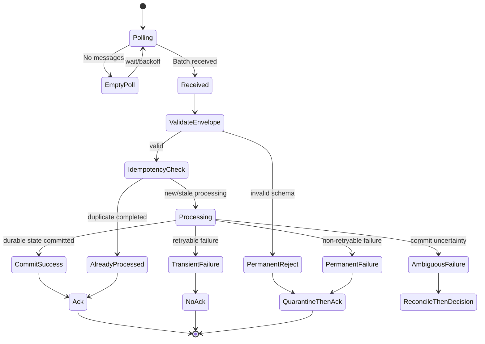
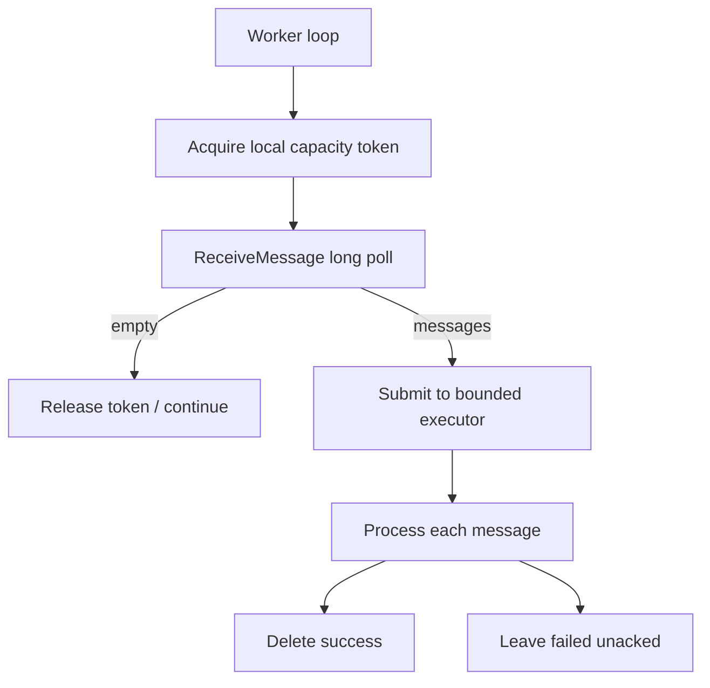
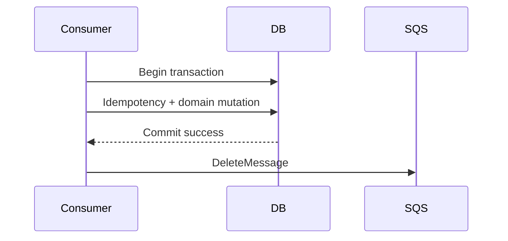
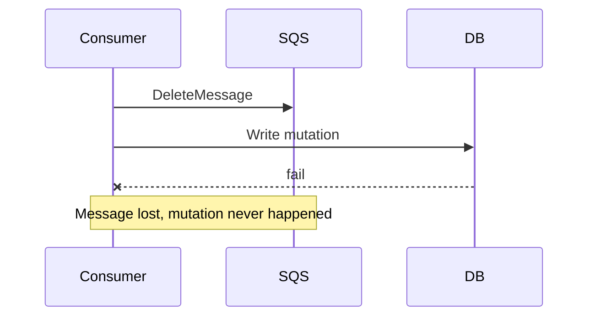
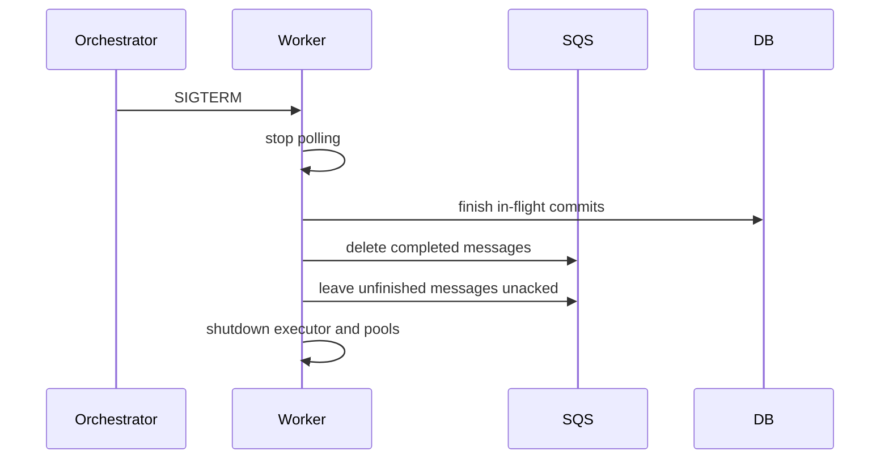
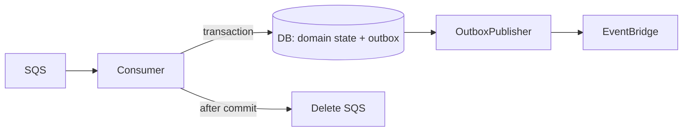
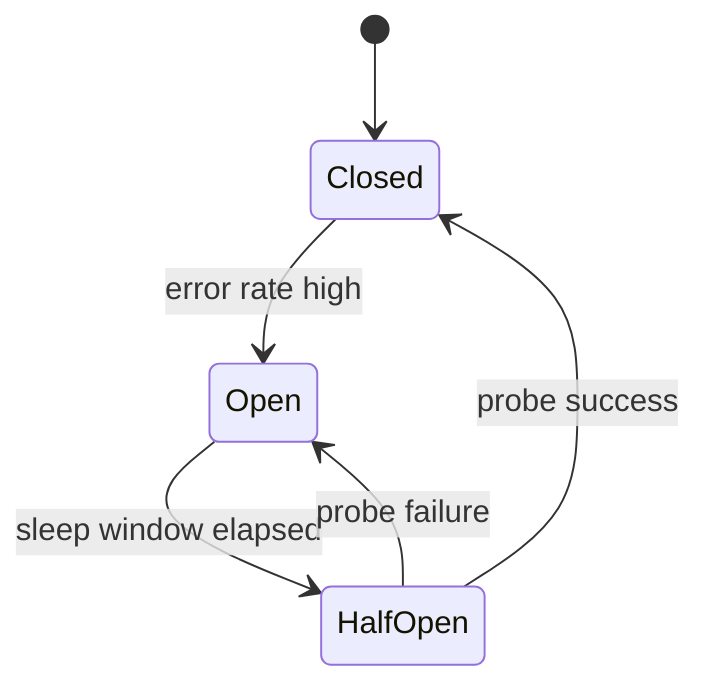

# Part 028 — Consumer Design: Polling, Batch, Partial Batch Failure, Backpressure

SQS queue yang bagus bisa tetap gagal jika consumer-nya buruk.

Queue hanya menyimpan dan mengirim message. Correctness tetap diputuskan oleh consumer:

- kapan message di-ack;
- bagaimana duplicate ditangani;
- bagaimana batch failure dipisahkan;
- bagaimana DB write dibuat idempotent;
- bagaimana concurrency dibatasi;
- bagaimana shutdown dilakukan;
- bagaimana worker memberi tekanan balik ke upstream/downstream.

Part ini membahas desain consumer SQS production-grade, baik consumer manual menggunakan AWS SDK maupun consumer berbasis Lambda event source mapping.

Referensi resmi:

- SQS short and long polling: <https://docs.aws.amazon.com/AWSSimpleQueueService/latest/SQSDeveloperGuide/sqs-short-and-long-polling.html>
- SQS visibility timeout: <https://docs.aws.amazon.com/AWSSimpleQueueService/latest/SQSDeveloperGuide/sqs-visibility-timeout.html>
- SQS quotas: <https://docs.aws.amazon.com/AWSSimpleQueueService/latest/SQSDeveloperGuide/quotas-queues.html>
- Lambda SQS event source configuration: <https://docs.aws.amazon.com/AWSSimpleQueueService/latest/SQSDeveloperGuide/sqs-configure-lambda-function-trigger.html>
- Lambda SQS error handling: <https://docs.aws.amazon.com/lambda/latest/dg/services-sqs-errorhandling.html>
- Lambda partial batch response examples: <https://docs.aws.amazon.com/lambda/latest/dg/example_serverless_SQS_Lambda_batch_item_failures_section.html>
- AWS Prescriptive Guidance partial batch responses: <https://docs.aws.amazon.com/prescriptive-guidance/latest/lambda-event-filtering-partial-batch-responses-for-sqs/best-practices-partial-batch-responses.html>

---

## 1. Consumer Is a State Machine

Jangan lihat consumer sebagai loop sederhana.

```java
while (true) {
    var messages = sqs.receiveMessage(...);
    for (var m : messages) {
        process(m);
        delete(m);
    }
}
```

Itu hanya skeleton.

Consumer production adalah state machine:



Setiap transisi harus eksplisit.

Pertanyaan utama:

| Transisi | Pertanyaan |
|---|---|
| receive → validate | apakah message contract valid? |
| validate → process | apakah version didukung? |
| process → commit | apakah operation atomic/idempotent? |
| commit → ack | apakah state durable sudah cukup? |
| failure → retry | apakah failure transient? |
| failure → quarantine | apakah retry hanya membakar kapasitas? |
| crash → retry | apakah duplicate aman? |

---

## 2. Manual Polling vs Lambda Event Source Mapping

Ada dua pendekatan umum.

| Model | Cocok Untuk | Kelebihan | Trade-Off |
|---|---|---|---|
| Lambda SQS trigger | serverless worker, bursty workload, simple processing | managed polling, autoscaling, batch integration | timeout/runtime limits, concurrency harus dikontrol |
| Manual worker | long-running service, custom backpressure, complex pooling | kontrol penuh atas polling, concurrency, lease, DB pool | harus membangun lifecycle sendiri |

### 2.1 Lambda SQS Trigger

Lambda polling SQS dan invoke function secara synchronous dengan batch message.

Cocok jika:

- processing relatif pendek;
- dependency bisa diakses dari Lambda;
- concurrency bisa dibatasi dengan reserved concurrency/event source settings;
- partial batch response diaktifkan untuk batch independent;
- cold start dan runtime timeout tidak melanggar SLO.

### 2.2 Manual Worker

Manual worker cocok jika:

- proses butuh runtime panjang;
- butuh connection pool stabil ke Aurora/RDS;
- butuh custom rate limiter per tenant/downstream;
- butuh heartbeat visibility yang detail;
- butuh graceful shutdown kompleks;
- worker berjalan di ECS/EKS/EC2.

Rule:

> Lambda cocok untuk “message handler”. Manual worker cocok untuk “message processing subsystem”.

---

## 3. Polling Strategy

SQS mendukung short polling dan long polling.

Long polling lebih umum untuk production karena mengurangi empty response dan false empty response. Maksimum long polling wait time adalah 20 detik.

Manual worker baseline:

```text
ReceiveMessage:
  MaxNumberOfMessages = 10
  WaitTimeSeconds = 20
  VisibilityTimeout = tuned per workload
```

Namun jangan copy-paste.

Tentukan berdasarkan:

- message arrival rate;
- processing time;
- concurrency target;
- batch independence;
- downstream capacity;
- desired latency;
- cost per poll;
- shutdown responsiveness.



---

## 4. Batch Size

SQS `ReceiveMessage` dapat mengambil batch message. Batch size yang besar meningkatkan throughput, tetapi memperbesar blast radius jika failure handling buruk.

| Batch Size | Kelebihan | Risiko |
|---:|---|---|
| 1 | simplest correctness | overhead tinggi |
| 2–5 | balance untuk workload kritikal | perlu partial handling |
| 10 | throughput lebih baik | satu failure bisa retry banyak jika salah desain |

Untuk manual worker, batch bukan berarti harus diproses dalam satu transaction.

Anti-pattern:

```text
receive 10 messages -> open one DB transaction -> process all -> commit -> delete all
```

Masalah:

- satu bad message menggagalkan semua;
- transaction terlalu panjang;
- lock besar;
- partial progress sulit;
- retry menyebabkan duplicate massal.

Lebih baik:

```text
receive batch -> process each message independently -> delete successful messages -> leave failed messages
```

Jika domain memang perlu batch atomicity, jangan sembunyikan itu di SQS consumer. Jadikan batch sebagai domain aggregate/job dengan state eksplisit di database.

---

## 5. Partial Batch Failure

Partial batch failure berarti message yang sukses tidak perlu diproses ulang hanya karena message lain gagal.

### 5.1 Manual Worker

Manual worker mengontrol delete per message.

```java
for (Message message : messages) {
    try {
        handler.handle(message);
        sqs.deleteMessage(DeleteMessageRequest.builder()
                .queueUrl(queueUrl)
                .receiptHandle(message.receiptHandle())
                .build());
    } catch (RetryableException e) {
        // Do not delete. Message becomes visible after timeout.
        logRetry(message, e);
    } catch (PermanentMessageException e) {
        quarantine(message, e);
        sqs.deleteMessage(DeleteMessageRequest.builder()
                .queueUrl(queueUrl)
                .receiptHandle(message.receiptHandle())
                .build());
    }
}
```

### 5.2 Lambda Worker

Default Lambda behavior: jika function error, seluruh batch dianggap gagal.

Untuk independent messages, aktifkan `ReportBatchItemFailures`. Function mengembalikan daftar message gagal. Lambda akan membuat hanya item tersebut visible lagi.

Pseudo-response:

```json
{
  "batchItemFailures": [
    { "itemIdentifier": "message-id-2" },
    { "itemIdentifier": "message-id-7" }
  ]
}
```

Important:

- jika function throw exception, batch dianggap gagal total;
- handler harus menangkap failure per record;
- untuk FIFO queue, berhenti setelah failure pertama dan return failed + unprocessed messages untuk menjaga ordering.

---

## 6. Consumer Handler Structure

Struktur handler yang baik memisahkan concerns:

```text
SQS transport
  -> envelope parser
  -> schema validator
  -> idempotency gate
  -> domain handler
  -> transaction boundary
  -> side-effect boundary
  -> ack/quarantine/retry decision
```

Jangan taruh semua di satu method `handleMessage`.

Contoh struktur Java:

```java
public final class SqsMessageConsumer {
    private final EnvelopeParser parser;
    private final MessageClassifier classifier;
    private final IdempotencyGate idempotencyGate;
    private final DomainMessageHandler handler;
    private final QuarantineStore quarantineStore;
    private final SqsAckClient ackClient;

    public void consume(RawSqsMessage raw) {
        MessageEnvelope envelope;
        try {
            envelope = parser.parse(raw.body());
            classifier.validate(envelope);
        } catch (InvalidMessageException e) {
            quarantineStore.save(raw, e);
            ackClient.delete(raw.receiptHandle());
            return;
        }

        var decision = idempotencyGate.begin(envelope);
        if (decision == IdempotencyDecision.ALREADY_COMPLETED) {
            ackClient.delete(raw.receiptHandle());
            return;
        }

        try {
            handler.handle(envelope);
            idempotencyGate.markCompleted(envelope);
            ackClient.delete(raw.receiptHandle());
        } catch (PermanentBusinessException e) {
            quarantineStore.save(envelope, e);
            idempotencyGate.markRejected(envelope, e);
            ackClient.delete(raw.receiptHandle());
        } catch (TransientException e) {
            idempotencyGate.markRetryableFailure(envelope, e);
            throw e;
        }
    }
}
```

---

## 7. Database Write Pattern

Consumer sering melakukan database write.

Ingat: SQS delivery bisa duplicate. Maka DB write harus idempotent.

### 7.1 Relational Pattern

Gunakan unique constraint pada semantic id.

```sql
CREATE TABLE consumer_inbox (
    consumer_name VARCHAR(100) NOT NULL,
    message_key VARCHAR(200) NOT NULL,
    status VARCHAR(30) NOT NULL,
    payload_hash VARCHAR(128) NOT NULL,
    first_seen_at TIMESTAMP NOT NULL,
    completed_at TIMESTAMP,
    last_error TEXT,
    PRIMARY KEY (consumer_name, message_key)
);
```

Pola transaction:

```sql
BEGIN;

INSERT INTO consumer_inbox (
  consumer_name, message_key, status, payload_hash, first_seen_at
)
VALUES (?, ?, 'PROCESSING', ?, now())
ON CONFLICT DO NOTHING;

-- If inserted or recoverable stale, apply domain mutation.

UPDATE cases
SET status = 'ESCALATED', updated_at = now()
WHERE case_id = ?
  AND status <> 'ESCALATED';

UPDATE consumer_inbox
SET status = 'COMPLETED', completed_at = now()
WHERE consumer_name = ? AND message_key = ?;

COMMIT;
```

Key idea:

> Inbox record dan domain mutation harus berada dalam atomic boundary yang sama jika keduanya ada di database yang sama.

### 7.2 DynamoDB Pattern

Gunakan conditional write.

```text
PutItem consumer_inbox
  condition attribute_not_exists(pk)

UpdateItem aggregate
  condition current_state allows transition

TransactWriteItems jika perlu atomic multi-item write
```

Contoh pseudo:

```java
TransactWriteItemsRequest request = TransactWriteItemsRequest.builder()
    .transactItems(
        TransactWriteItem.builder()
            .put(Put.builder()
                .tableName("consumer_inbox")
                .item(inboxItem)
                .conditionExpression("attribute_not_exists(pk)")
                .build())
            .build(),
        TransactWriteItem.builder()
            .update(Update.builder()
                .tableName("case")
                .key(caseKey)
                .updateExpression("SET #status = :escalated")
                .conditionExpression("#status <> :closed")
                .build())
            .build()
    ).build();
```

---

## 8. Ack Timing

Ack/delete timing menentukan data safety.



Jika delete gagal setelah DB commit, message bisa retry. Karena DB operation idempotent, retry harus no-op lalu delete lagi.

Jangan lakukan:



Delete-before-commit hanya boleh jika kehilangan message diterima secara eksplisit.

---

## 9. Backpressure

Queue menyerap burst, tetapi bukan alasan consumer menghancurkan database.

Consumer harus punya backpressure.

Backpressure primitive:

| Primitive | Fungsi |
|---|---|
| bounded thread pool | membatasi concurrent processing |
| DB connection pool limit | mencegah DB connection exhaustion |
| token bucket | rate limit per downstream/tenant |
| circuit breaker | stop call dependency yang sedang gagal |
| adaptive polling | kurangi receive saat downstream lambat |
| visibility timeout tuning | hindari duplicate akibat slow dependency |
| autoscaling by age | scale berdasarkan queue delay, bukan CPU saja |

Manual worker anti-pattern:

```java
while (true) {
    var messages = receive(10);
    messages.forEach(m -> CompletableFuture.runAsync(() -> process(m)));
}
```

Ini unbounded concurrency.

Lebih baik:

```java
ThreadPoolExecutor executor = new ThreadPoolExecutor(
    8, 8,
    0L, TimeUnit.MILLISECONDS,
    new ArrayBlockingQueue<>(100),
    new ThreadPoolExecutor.CallerRunsPolicy()
);

while (!shutdown.get()) {
    if (executor.getQueue().remainingCapacity() < 10) {
        Thread.sleep(250);
        continue;
    }

    var messages = receiveMessages(10, 20);
    for (var message : messages) {
        executor.submit(() -> consume(message));
    }
}
```

Bounded queue membuat worker berhenti mengambil message baru ketika kapasitas lokal penuh. Ini mengurangi in-flight message yang tidak dikerjakan.

---

## 10. Autoscaling Signal

Untuk SQS worker, CPU bukan satu-satunya sinyal.

Sinyal lebih baik:

```text
backlog_per_worker = visible_messages / active_workers
age_of_oldest_message = end-to-end delay pressure
not_visible_messages = in-flight pressure
processing_success_rate = drain capacity
```

Scale out jika:

```text
ApproximateAgeOfOldestMessage > target_delay
AND downstream healthy
AND DB connection headroom available
```

Jangan scale out jika downstream sedang sakit.

Jika database latency naik dan worker terus ditambah, Anda hanya mempercepat kegagalan.

Decision:

| Condition | Action |
|---|---|
| backlog naik, DB sehat | scale workers |
| backlog naik, DB saturating | reduce polling / shed load / scale DB |
| DLQ naik karena schema error | stop redrive/producer fix |
| in-flight tinggi, visible rendah | investigate stuck workers/visibility |
| age naik, deleted rate rendah | capacity or downstream problem |

---

## 11. Concurrency and Ordering

Untuk Standard queue, concurrency bisa tinggi, tetapi duplicate dan ordering tidak dijamin.

Untuk FIFO queue:

- concurrency terjadi antar `MessageGroupId`;
- dalam satu group, processing serial;
- hot group membatasi throughput;
- failure pada satu message dapat menahan group.

Consumer FIFO harus memahami entity scope.

Contoh `MessageGroupId`:

| Domain | Good MessageGroupId | Bad MessageGroupId |
|---|---|---|
| case lifecycle | `case-{caseId}` | `tenant-{tenantId}` jika tenant sangat besar |
| order mutation | `order-{orderId}` | `all-orders` |
| account ledger | `account-{accountId}` | random UUID |
| user notification preference | `user-{userId}` | event type |

Untuk FIFO + partial batch failure:

> Stop processing setelah failure pertama dalam group/batch yang ordering-sensitive.

Jika tidak, Anda bisa meng-ack message setelah gap.

---

## 12. Graceful Shutdown

Worker yang mati sembarangan menciptakan duplicate dan in-flight backlog.

Shutdown sequence manual worker:

1. stop polling message baru;
2. wait in-flight local tasks selesai sampai grace period;
3. untuk task yang belum selesai, jangan delete message;
4. optional: set visibility timeout pendek agar cepat retry;
5. close DB pool setelah task selesai;
6. flush logs/metrics.



Anti-pattern:

```text
SIGTERM -> process exits immediately -> all in-flight messages wait full visibility timeout
```

Untuk ECS/Kubernetes, align:

- container stop timeout;
- visibility timeout;
- max processing time;
- health check deregistration;
- deployment rolling window.

---

## 13. Error Classification

Semua exception tidak sama.

Buat taxonomy eksplisit:

```java
sealed interface MessageProcessingException permits RetryableException, PermanentException, AmbiguousException {}

final class RetryableException extends RuntimeException {}
final class PermanentException extends RuntimeException {}
final class AmbiguousException extends RuntimeException {}
```

Mapping:

| Error | Classification | Action |
|---|---|---|
| DB connection timeout | retryable | no ack |
| optimistic lock conflict | retryable or no-op | depends domain |
| duplicate key on idempotency | completed duplicate | ack |
| invalid JSON | permanent | quarantine + ack |
| unsupported version | permanent/recoverable | quarantine or transform |
| downstream 429 | retryable with backoff | no ack/change visibility |
| downstream 400 | permanent usually | quarantine + ack |
| downstream timeout after request sent | ambiguous | reconcile |

Ambiguous failure is the hardest.

Example:

```text
external payment API times out after request sent
```

You do not know if payment happened.

Correct response:

- persist reconciliation job;
- use external idempotency key;
- do not blindly retry without checking;
- ack only if durable reconciliation state exists.

---

## 14. Consumer and Outbox Together

A consumer may also publish another event after processing.

Bad pattern:

```text
consume SQS -> write DB -> publish EventBridge -> delete SQS
```

If DB write succeeds but publish fails, state changed but event lost.

Better pattern:

```text
consume SQS -> DB transaction writes domain state + outbox row -> delete SQS
outbox publisher -> publish EventBridge/SNS/SQS -> mark outbox published
```



This preserves atomicity between consumed effect and produced event.

If consumer writes to DynamoDB, use streams or explicit outbox item depending on ordering and projection requirements.

---

## 15. Message Validation

Validate before side effect.

Validation layers:

| Layer | Example |
|---|---|
| transport | body exists, size ok |
| envelope | `eventType`, `eventVersion`, `idempotencyKey` |
| schema | JSON schema / generated class |
| semantic | entity id format, tenant id, valid transition |
| authorization | tenant allowed, producer trusted |
| compatibility | version supported |

Invalid message handling:

```text
invalid transport/schema -> quarantine + ack
valid but dependency missing -> retry or reconciliation depending domain
valid but semantic impossible -> quarantine + audit
```

Do not let invalid JSON retry 10 times and pollute DLQ if you can classify it immediately.

---

## 16. Local Capacity Model

Before polling, worker should know its local capacity.

Capacity formula:

```text
max_concurrent_messages <= min(
  worker_threads,
  db_pool_available_connections,
  downstream_rate_limit / per_message_calls,
  cpu_capacity,
  memory_capacity,
  tenant_fairness_limit
)
```

Example:

```text
worker_threads = 32
DB pool = 20
reserved DB connections for HTTP = 8
available DB for SQS = 12
external API limit = 100 rps
per message external calls = 2
rate-derived capacity = 50 msg/s

max concurrent SQS tasks should start around 12, not 32.
```

If SQS worker shares DB with synchronous API, reserve capacity for API.

Otherwise async backlog can starve online traffic.

---

## 17. Tenant Fairness

In multi-tenant systems, one tenant can flood queue.

Problems:

- tenant A creates huge backlog;
- workers process only tenant A;
- tenant B messages age beyond SLO;
- DB hot partitions/rows focus on tenant A.

Options:

| Pattern | How |
|---|---|
| queue per priority/tenant class | isolate workload classes |
| message group by tenant/entity | FIFO partial isolation |
| consumer-side token bucket | limit per tenant processing |
| scheduler table | pull fair jobs from DB |
| EventBridge routing | route to tenant-specific queues |

Consumer-side fairness example:

```java
if (!tenantRateLimiter.tryAcquire(envelope.tenantId())) {
    changeVisibility(message, Duration.ofSeconds(30));
    return;
}
```

But use carefully. Changing visibility repeatedly can hide backlog. Monitor per-tenant delay.

---

## 18. Lambda Consumer Specifics

Lambda SQS trigger is powerful, but has traps.

Checklist:

- set visibility timeout at least 6x Lambda timeout;
- configure batch size intentionally;
- use partial batch response for independent records;
- configure reserved concurrency to protect downstream;
- monitor iterator-like delay via queue age metrics;
- avoid long blocking calls near timeout;
- make handler idempotent;
- use Powertools Batch Processing if it reduces custom failure code;
- for FIFO, stop after first failure in ordered batch.

Pseudo Java Lambda partial batch response:

```java
public SQSBatchResponse handleRequest(SQSEvent event, Context context) {
    List<SQSBatchResponse.BatchItemFailure> failures = new ArrayList<>();

    for (SQSEvent.SQSMessage message : event.getRecords()) {
        try {
            consumer.consume(message);
        } catch (RetryableException e) {
            failures.add(new SQSBatchResponse.BatchItemFailure(message.getMessageId()));
        } catch (PermanentException e) {
            quarantine.save(message, e);
            // do not add to failures; acknowledge by omission
        }
    }

    return new SQSBatchResponse(failures);
}
```

Caution:

If your function throws outside per-record try/catch, Lambda treats the batch as failed.

---

## 19. Manual Worker Reference Loop

Reference worker:

```java
public final class SqsWorker implements AutoCloseable {
    private final SqsClient sqs;
    private final String queueUrl;
    private final ExecutorService executor;
    private final AtomicBoolean running = new AtomicBoolean(true);
    private final Semaphore capacity;

    public SqsWorker(SqsClient sqs, String queueUrl, int concurrency) {
        this.sqs = sqs;
        this.queueUrl = queueUrl;
        this.executor = Executors.newFixedThreadPool(concurrency);
        this.capacity = new Semaphore(concurrency);
    }

    public void run() {
        while (running.get()) {
            int permits = Math.min(10, capacity.availablePermits());
            if (permits == 0) {
                sleep(Duration.ofMillis(100));
                continue;
            }

            ReceiveMessageResponse response = sqs.receiveMessage(ReceiveMessageRequest.builder()
                    .queueUrl(queueUrl)
                    .maxNumberOfMessages(permits)
                    .waitTimeSeconds(20)
                    .messageAttributeNames("All")
                    .attributeNamesWithStrings("All")
                    .build());

            for (Message message : response.messages()) {
                capacity.acquireUninterruptibly();
                executor.submit(() -> {
                    try {
                        consumeOne(message);
                    } finally {
                        capacity.release();
                    }
                });
            }
        }
    }

    private void consumeOne(Message message) {
        // parse -> validate -> idempotency -> handle -> delete/leave/quarantine
    }

    @Override
    public void close() {
        running.set(false);
        executor.shutdown();
    }
}
```

This is not complete production code, but the important property is bounded capacity before receive.

---

## 20. Handling Slow Downstream

If downstream becomes slow, consumer should not blindly continue.

Options:

1. reduce polling;
2. reduce executor concurrency;
3. increase visibility timeout if processing legitimately slower;
4. open circuit breaker and stop processing retryable dependency messages;
5. route to DLQ/quarantine only for permanent failure;
6. scale downstream;
7. shed low-priority messages.

Circuit breaker behavior:



When open:

- do not receive too many messages;
- or receive and immediately change visibility for later;
- avoid filling in-flight quota;
- emit alert.

---

## 21. Observability

Consumer metrics:

| Metric | Type | Meaning |
|---|---|---|
| `messages_processed_total` | counter | successful messages |
| `messages_failed_retryable_total` | counter | retry pressure |
| `messages_failed_permanent_total` | counter | bad input/poison |
| `messages_duplicate_total` | counter | idempotency hits |
| `message_processing_duration` | histogram | handler latency |
| `db_write_duration` | histogram | DB bottleneck |
| `ack_duration` | histogram | SQS delete latency |
| `local_executor_queue_depth` | gauge | local overload |
| `tenant_processing_delay` | gauge/histogram | fairness |
| `visibility_extensions_total` | counter | long processing |

Log fields:

```json
{
  "event": "sqs_consume_result",
  "queue": "case-escalation-worker-prod",
  "messageId": "...",
  "eventId": "evt_123",
  "eventType": "CaseEscalationRequested",
  "eventVersion": 3,
  "idempotencyKey": "case-123:escalation:v3",
  "tenantId": "tenant-a",
  "receiveCount": 2,
  "decision": "ack_success",
  "durationMs": 241,
  "correlationId": "corr_abc"
}
```

Trace:

```text
SQS receive is not always a parent span from producer.
Use correlationId/causationId in envelope to connect async trace.
```

---

## 22. Security and Data Handling

Consumer often logs message body during debugging. This is dangerous.

Rules:

- never log full payload by default;
- log stable identifiers;
- redact PII/secrets;
- ensure quarantine store has access controls;
- encrypt queues if payload sensitive;
- restrict `sqs:ReceiveMessage`, `sqs:DeleteMessage`, `sqs:ChangeMessageVisibility` to worker role;
- separate redrive permissions from normal consumer permissions;
- audit manual redrive.

DLQ and quarantine often contain the worst data: malformed, unexpected, and sometimes sensitive. Treat them as production data, not debug scratchpad.

---

## 23. Consumer Testing Matrix

| Test | Scenario | Expected |
|---|---|---|
| duplicate delivery | same message twice | second attempt no-op + ack |
| crash after DB commit before delete | ack ambiguity | retry no-op |
| crash before DB commit | rollback | retry applies once |
| invalid JSON | permanent failure | quarantine + ack |
| transient DB timeout | retry | no ack, later success |
| batch one item fails | partial failure | only failed item retried |
| Lambda handler throws outside loop | whole batch failure | test catches bad structure |
| downstream slow | backpressure | polling/concurrency reduced |
| SIGTERM during processing | graceful shutdown | completed acked, unfinished retried |
| in-flight quota pressure | local overload | worker stops over-receiving |
| FIFO message failure | ordering | no later ordered messages incorrectly acked |
| redrive old schema | compatibility | handler transforms or quarantines |

---

## 24. Production Checklist

Before SQS consumer is production-ready:

- [ ] long polling configured unless strong reason not to;
- [ ] batch size intentionally chosen;
- [ ] partial batch failure implemented;
- [ ] Lambda `ReportBatchItemFailures` enabled if using Lambda and independent records;
- [ ] FIFO partial failure preserves ordering;
- [ ] consumer concurrency bounded;
- [ ] polling respects local capacity;
- [ ] DB pool protected from worker overload;
- [ ] downstream rate limits modeled;
- [ ] idempotency store exists;
- [ ] delete happens after durable commit/recovery path;
- [ ] invalid messages quarantined;
- [ ] retryable/permanent/ambiguous failures separated;
- [ ] graceful shutdown implemented;
- [ ] metrics and structured logs include semantic ids;
- [ ] DLQ runbook connected to consumer error taxonomy;
- [ ] load test includes duplicate and crash scenarios.

---

## 25. Ringkasan Mental Model

Consumer SQS production-grade bukan loop polling.

Consumer adalah combination of:

- lease manager;
- validator;
- idempotency gate;
- transaction coordinator;
- error classifier;
- backpressure controller;
- ack manager;
- observability emitter.

SQS memberi at-least-once delivery dan durable buffering. Tugas consumer adalah mengubah at-least-once delivery menjadi **effectively-once business effect** melalui idempotency, transaction boundary, dan recovery path.

---

## 26. Koneksi ke Part Berikutnya

Part berikutnya membahas **SQS Database Worker Pattern** secara lebih spesifik:

- queue-to-database write;
- idempotency key;
- lock dan transaction;
- relational implementation;
- DynamoDB implementation;
- optimistic concurrency;
- worker scaling terhadap database capacity;
- replay-safe write model.
