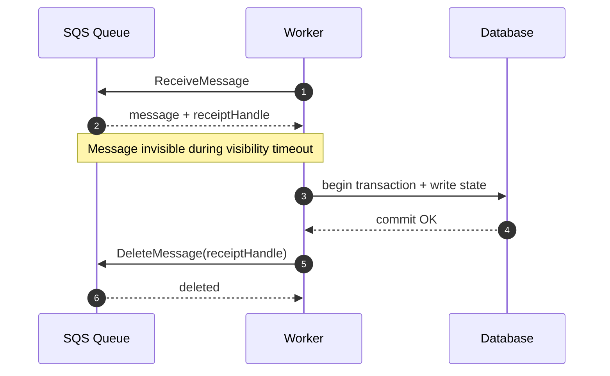
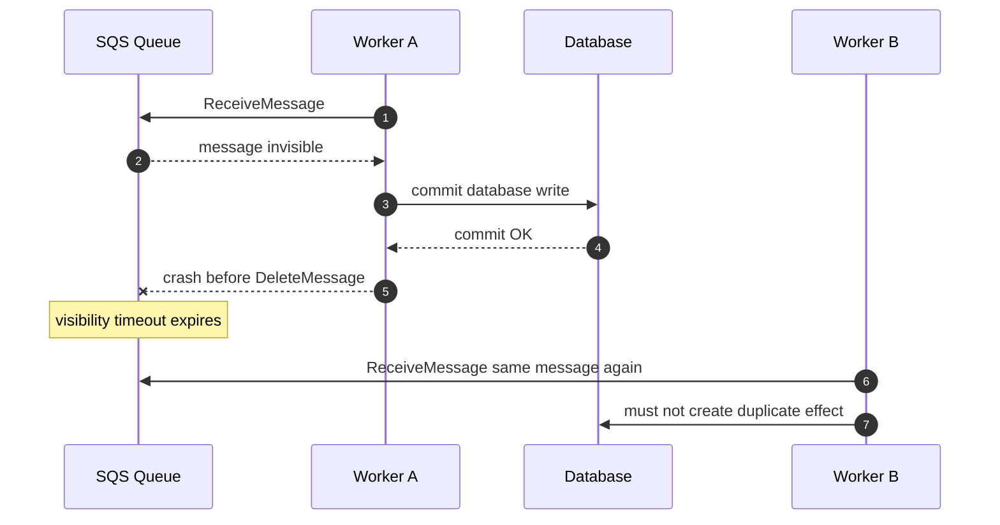
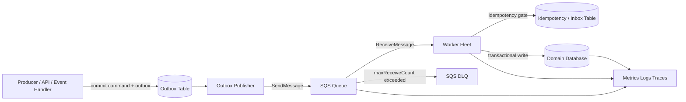
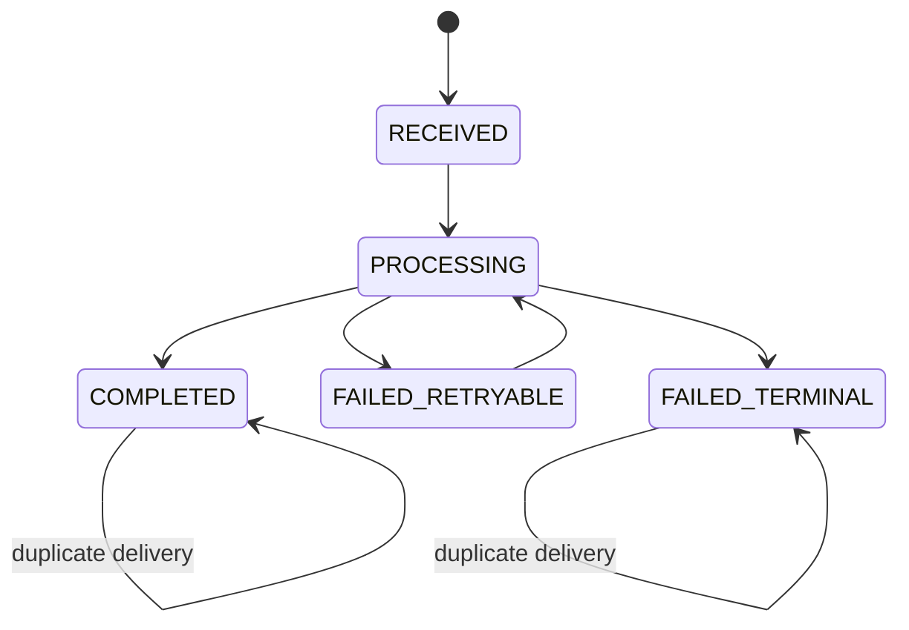
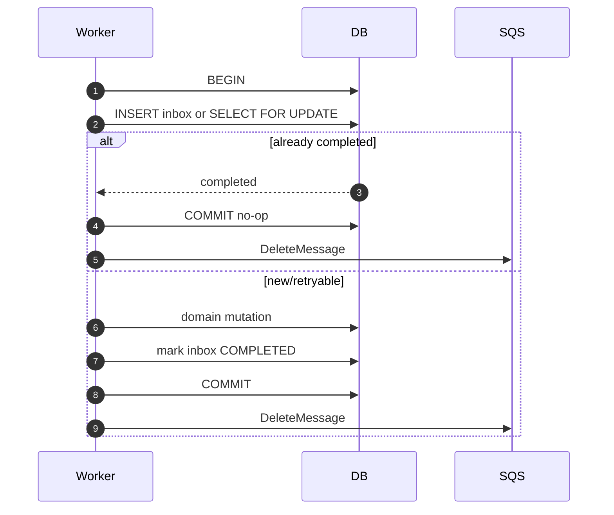
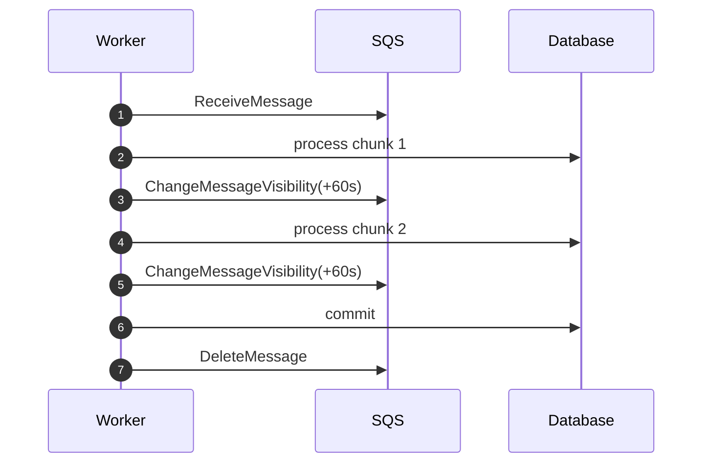
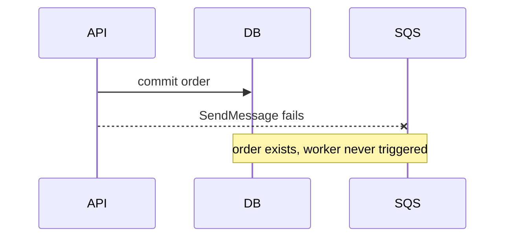
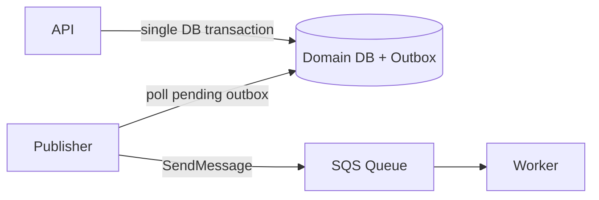
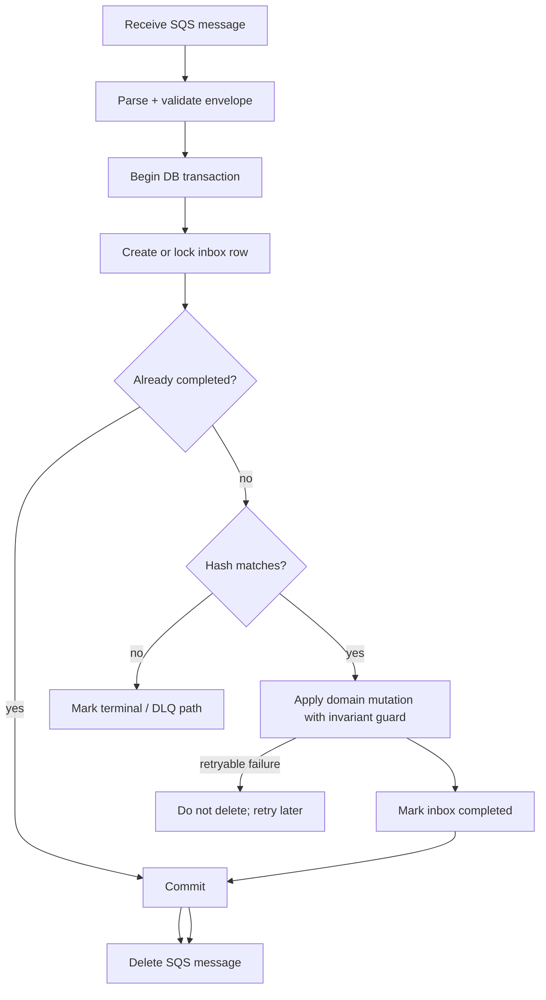

# Part 029 — SQS Database Worker Pattern

> Target pembelajaran: mampu mendesain worker berbasis SQS yang menulis ke database tanpa double-write bug, tanpa duplicate side effect, tanpa retry storm, dan tetap bisa dioperasikan saat queue menumpuk, worker crash, database lambat, atau message perlu di-replay.

SQS sering dipakai karena terlihat sederhana: producer mengirim message, consumer mengambil message, consumer menulis ke database, lalu message dihapus.

Di production, pola itu tidak sederhana. Ada banyak state tersembunyi:

- message mungkin dikirim lebih dari sekali;
- consumer mungkin crash setelah database commit tetapi sebelum `DeleteMessage`;
- database mungkin berhasil commit tetapi API client atau worker tidak tahu hasilnya;
- visibility timeout mungkin habis saat transaksi masih berjalan;
- batch mungkin berisi beberapa message sukses dan beberapa message gagal;
- retry bisa memukul database yang sedang sakit;
- DLQ bisa menjadi kuburan message yang tidak pernah direkonsiliasi;
- replay bisa membuat side effect kedua jika desainnya tidak idempotent.

Part ini membahas pola **SQS → Worker → Database** sebagai correctness pattern, bukan sekadar integration pattern.

---

## 1. Problem yang Diselesaikan

Gunakan SQS database worker ketika satu request/event tidak harus langsung mengubah semua state secara synchronous.

Contoh:

- API menerima `SubmitApplicationCommand`, lalu worker membuat derived records;
- order sudah dibuat, lalu worker membuat invoice draft;
- enforcement case masuk tahap baru, lalu worker menghitung SLA deadline;
- document uploaded, lalu worker mengekstrak metadata dan menulis indexing status;
- event `PaymentCaptured` menghasilkan ledger projection;
- batch import mengirim ribuan item untuk diproses satu per satu.

SQS worker cocok ketika:

| Kebutuhan | Mengapa SQS cocok |
|---|---|
| Workload spike | Queue menyerap burst agar database tidak dipukul langsung. |
| Producer dan consumer tidak harus hidup bersamaan | Message persisted sampai consumer siap. |
| Processing dapat diulang | At-least-once delivery bisa diterima jika consumer idempotent. |
| Unit kerja bisa dipisahkan | Setiap message adalah satu work item atau satu aggregate command. |
| Retry perlu dikontrol | Visibility timeout, receive count, DLQ, dan redrive memberi mekanisme recovery. |
| Database write mahal/lambat | Worker concurrency dapat dibatasi agar database tetap stabil. |

Namun SQS worker bukan jawaban untuk semua hal.

Jangan gunakan pola ini jika:

- caller harus menerima hasil final dengan latency rendah;
- operasi harus berada dalam satu ACID transaction bersama request awal;
- message tidak punya idempotency key yang stabil;
- ordering global mutlak diperlukan;
- consumer melakukan side effect eksternal yang tidak bisa dibuat idempotent;
- queue dipakai sebagai tempat menyembunyikan model domain yang tidak jelas.

---

## 2. Mental Model: Message sebagai Lease, Bukan Ownership

Ketika consumer menerima message dari SQS, message tidak hilang. Message hanya **tidak terlihat sementara** selama visibility timeout.

Artinya consumer bukan pemilik permanen message. Consumer hanya memegang lease.



Failure penting:



Konsekuensi desain:

1. **Database write harus idempotent.**
2. **DeleteMessage tidak boleh dianggap bagian dari DB transaction.**
3. **Worker harus aman terhadap duplicate delivery.**
4. **Reprocessing adalah kondisi normal, bukan exception.**
5. **Idempotency state idealnya disimpan dekat dengan state yang dimutasi.**

---

## 3. Baseline Architecture



Ada dua sisi:

1. **Producer side** memastikan message tidak hilang setelah state utama berubah.
2. **Consumer side** memastikan message boleh diproses lebih dari sekali tanpa menghasilkan efek ganda.

Part ini fokus consumer side, tetapi producer side tetap muncul karena banyak bug berasal dari dual-write producer.

---

## 4. Message Envelope untuk Database Worker

Worker yang bagus tidak menerima payload ad-hoc. Worker menerima envelope stabil.

```json
{
  "messageId": "msg_01HX...",
  "schemaVersion": 1,
  "messageType": "CaseDeadlineCalculationRequested",
  "producer": "case-service",
  "occurredAt": "2026-07-06T10:15:30Z",
  "idempotencyKey": "case:CASE-123:deadline:v4",
  "aggregateType": "case",
  "aggregateId": "CASE-123",
  "causationId": "cmd_01HX...",
  "correlationId": "trace_01HX...",
  "attemptPolicy": {
    "maxBusinessAttempts": 5,
    "notBefore": null
  },
  "payload": {
    "caseId": "CASE-123",
    "stage": "INVESTIGATION",
    "effectiveAt": "2026-07-06T10:15:00Z"
  }
}
```

Field penting:

| Field | Fungsi |
|---|---|
| `messageId` | Identitas message dari domain, bukan hanya SQS message id. |
| `schemaVersion` | Evolusi payload. |
| `messageType` | Dispatch dan observability. |
| `idempotencyKey` | Kunci efek; harus stabil untuk operasi yang sama. |
| `aggregateId` | Boundary locking/ordering. |
| `causationId` | Menghubungkan message ke command/event asal. |
| `correlationId` | Trace lintas API, queue, worker, database. |
| `occurredAt` | Waktu domain event/command terjadi. |
| `payload` | Data minimal yang dibutuhkan worker. |

Jangan mengandalkan SQS `MessageId` sebagai idempotency key utama untuk efek domain. Jika producer mengirim ulang work item yang sama sebagai message baru, SQS `MessageId` berubah. Idempotency key harus datang dari domain.

---

## 5. Idempotency Gate: Inbox Table

Pola paling praktis untuk worker database adalah **inbox table**.

Inbox table menyimpan status pemrosesan message berdasarkan `idempotency_key`.

```sql
create table worker_inbox (
    idempotency_key varchar(200) primary key,
    message_type varchar(100) not null,
    aggregate_type varchar(100) not null,
    aggregate_id varchar(200) not null,
    status varchar(30) not null,
    request_hash char(64) not null,
    first_seen_at timestamptz not null default now(),
    last_seen_at timestamptz not null default now(),
    started_at timestamptz,
    completed_at timestamptz,
    failed_at timestamptz,
    failure_code varchar(100),
    failure_message text,
    receive_count integer not null default 0,
    result_ref varchar(300),
    constraint chk_worker_inbox_status check (
        status in ('RECEIVED','PROCESSING','COMPLETED','FAILED_RETRYABLE','FAILED_TERMINAL')
    )
);

create index idx_worker_inbox_aggregate
    on worker_inbox (aggregate_type, aggregate_id);

create index idx_worker_inbox_status_seen
    on worker_inbox (status, last_seen_at);
```

State machine:



Kunci penting:

- `COMPLETED` berarti efek domain sudah terjadi.
- duplicate setelah `COMPLETED` harus dianggap sukses no-op.
- `FAILED_RETRYABLE` boleh diproses ulang.
- `FAILED_TERMINAL` tidak boleh diretry otomatis tanpa perubahan data/config.
- `request_hash` mendeteksi idempotency key yang sama tetapi payload berbeda.

---

## 6. Transaction Boundary yang Benar

Untuk relational database, pola aman adalah:

1. Mulai transaksi.
2. Insert/lock inbox row berdasarkan idempotency key.
3. Jika sudah `COMPLETED`, commit no-op lalu delete message.
4. Jika payload hash berbeda, tandai terminal failure.
5. Jalankan domain mutation.
6. Mark inbox `COMPLETED` dalam transaksi yang sama.
7. Commit.
8. Baru delete SQS message.



Pseudo SQL:

```sql
begin;

insert into worker_inbox (
    idempotency_key,
    message_type,
    aggregate_type,
    aggregate_id,
    status,
    request_hash,
    started_at,
    receive_count
)
values (?, ?, ?, ?, 'PROCESSING', ?, now(), 1)
on conflict (idempotency_key) do update
set last_seen_at = now(),
    receive_count = worker_inbox.receive_count + 1
returning status, request_hash;

-- If status = COMPLETED and hash matches: commit no-op.
-- If hash mismatch: mark FAILED_TERMINAL.

-- domain mutation here

update cases
set deadline_at = ?,
    deadline_version = deadline_version + 1
where case_id = ?;

update worker_inbox
set status = 'COMPLETED',
    completed_at = now(),
    result_ref = ?
where idempotency_key = ?;

commit;
```

Namun `ON CONFLICT DO UPDATE RETURNING` saja belum cukup jika dua worker memproses duplicate bersamaan. Untuk relational DB, gunakan locking row setelah insert/upsert.

Contoh pola eksplisit:

```sql
begin;

insert into worker_inbox (
    idempotency_key,
    message_type,
    aggregate_type,
    aggregate_id,
    status,
    request_hash,
    started_at,
    receive_count
)
values (?, ?, ?, ?, 'RECEIVED', ?, now(), 0)
on conflict (idempotency_key) do nothing;

select *
from worker_inbox
where idempotency_key = ?
for update;

-- row is locked until commit

update worker_inbox
set status = 'PROCESSING',
    started_at = coalesce(started_at, now()),
    last_seen_at = now(),
    receive_count = receive_count + 1
where idempotency_key = ?;

-- domain write

update worker_inbox
set status = 'COMPLETED', completed_at = now()
where idempotency_key = ?;

commit;
```

---

## 7. Idempotent Domain Mutation

Inbox table mencegah message yang sama menghasilkan efek ganda. Tetapi domain mutation juga sebaiknya punya guard.

Contoh anti-pattern:

```sql
insert into case_deadlines(case_id, deadline_at)
values (?, ?);
```

Jika duplicate lolos atau operator melakukan replay manual tanpa idempotency key yang sama, row bisa dobel.

Lebih aman:

```sql
insert into case_deadlines(case_id, deadline_type, deadline_at, source_event_id)
values (?, 'INVESTIGATION_SLA', ?, ?)
on conflict (case_id, deadline_type)
do update set
    deadline_at = excluded.deadline_at,
    source_event_id = excluded.source_event_id,
    updated_at = now();
```

Atau jika operation harus create-only:

```sql
insert into ledger_entries(entry_id, account_id, amount, source_event_id)
values (?, ?, ?, ?)
on conflict (source_event_id) do nothing;
```

Layering yang ideal:

| Layer | Guard |
|---|---|
| Inbox | Message effect idempotency. |
| Domain table | Business uniqueness. |
| Aggregate version | Optimistic concurrency. |
| External effect log | Third-party call idempotency. |

Idempotency bukan satu tabel. Idempotency adalah desain efek.

---

## 8. DynamoDB Worker Pattern

Untuk DynamoDB, gunakan conditional writes.

Inbox item:

```json
{
  "PK": "IDEMP#case:CASE-123:deadline:v4",
  "SK": "WORKER#CaseDeadlineCalculationRequested",
  "status": "PROCESSING",
  "requestHash": "...",
  "aggregateId": "CASE-123",
  "startedAt": "2026-07-06T10:16:00Z",
  "ttl": 1814868960
}
```

New message gate:

```text
PutItem
ConditionExpression: attribute_not_exists(PK)
```

Duplicate handling:

- If conditional put succeeds: process.
- If conditional put fails: read existing item.
- If existing status `COMPLETED` and hash matches: delete SQS message.
- If existing status `PROCESSING`: either skip and let visibility timeout retry, or apply stale-processing policy.
- If hash mismatch: terminal failure.

Atomic mutation with DynamoDB transaction:

```json
{
  "TransactItems": [
    {
      "Update": {
        "TableName": "ApplicationTable",
        "Key": { "PK": { "S": "CASE#CASE-123" }, "SK": { "S": "META" } },
        "UpdateExpression": "SET deadlineAt = :d, deadlineVersion = deadlineVersion + :one",
        "ConditionExpression": "attribute_exists(PK)"
      }
    },
    {
      "Update": {
        "TableName": "ApplicationTable",
        "Key": { "PK": { "S": "IDEMP#case:CASE-123:deadline:v4" }, "SK": { "S": "WORKER#CaseDeadlineCalculationRequested" } },
        "UpdateExpression": "SET #s = :completed, completedAt = :now",
        "ConditionExpression": "#s = :processing"
      }
    }
  ]
}
```

DynamoDB membuat pola ini sangat kuat jika access pattern sederhana dan idempotency key natural. Namun jangan memaksa semua worker DB ke DynamoDB jika domain mutation membutuhkan query relational, constraints kompleks, atau join-heavy validation.

---

## 9. Locking: Kapan Perlu, Kapan Tidak

Worker bisa mengunci pada beberapa level.

| Lock Level | Contoh | Risiko |
|---|---|---|
| Idempotency key | `case:123:deadline:v4` | Aman untuk duplicate same operation. |
| Aggregate ID | `CASE-123` | Mencegah race antar operasi berbeda pada aggregate sama. |
| Business uniqueness | `(case_id, deadline_type)` | Menjaga invariant domain. |
| Global lock | satu lock untuk semua worker | Hampir selalu salah; throughput hancur. |

Gunakan aggregate lock jika dua message berbeda bisa mengubah state yang sama secara tidak komutatif.

Contoh:

- `CaseStageChanged`
- `CaseDeadlineRecalculationRequested`
- `CaseClosed`

Ketiganya menyentuh aggregate `CASE-123`. Jika urutan penting, ada tiga pendekatan:

1. **FIFO queue dengan `MessageGroupId = caseId`**.
2. **Relational row lock pada aggregate**.
3. **Optimistic concurrency dengan version check dan retry**.

Untuk banyak sistem, opsi 2 atau 3 lebih fleksibel daripada memaksa FIFO untuk semua message.

---

## 10. Worker Concurrency dan Database Backpressure

Queue bisa menampung burst. Database tidak selalu bisa.

Jangan menskalakan worker hanya berdasarkan queue depth. Skala worker harus mempertimbangkan:

- DB connection capacity;
- average transaction duration;
- lock wait;
- CPU/IO database;
- deadlock rate;
- retry rate;
- downstream side-effect rate limits;
- `ApproximateAgeOfOldestMessage`;
- DLQ growth.

Kapasitas kasar:

```text
safe_worker_concurrency <= min(
  db_available_connections / connection_per_worker,
  db_write_iops_budget / write_iops_per_message,
  downstream_rate_limit / calls_per_message,
  lock_contention_safe_parallelism
)
```

Untuk Lambda consumer:

- set reserved concurrency untuk membatasi tekanan ke database;
- gunakan batch size kecil jika transaksi per message berat;
- aktifkan partial batch response;
- gunakan RDS Proxy jika Lambda membuka koneksi ke RDS/Aurora;
- jangan membuat connection pool besar per invocation.

Untuk ECS/EKS/EC2 worker:

- gunakan bounded thread pool;
- gunakan long polling;
- gunakan DB pool kecil dan terukur;
- stop polling saat DB health buruk;
- implement graceful shutdown yang menghindari message lease habis di tengah transaksi.

---

## 11. Visibility Timeout sebagai Processing Lease

Visibility timeout harus lebih besar dari waktu proses normal, tetapi tidak terlalu besar sehingga failure lama tersembunyi.

Baseline:

```text
visibility_timeout >= p99_processing_time + delete_message_margin
```

Jika processing time bervariasi besar, gunakan heartbeat dengan `ChangeMessageVisibility`.



Namun heartbeat bukan alasan untuk membuat satu message memproses pekerjaan raksasa. Jika pekerjaan bisa dipecah, pecah menjadi message lebih kecil.

Red flags:

- processing p99 mendekati visibility timeout;
- banyak duplicate karena lease habis;
- worker sering extend visibility berkali-kali;
- satu message memegang lock database lama;
- message menjalankan full table scan atau batch besar.

---

## 12. Batch Processing: Partial Success Wajib Dipikirkan

Dengan batch, satu invocation menerima beberapa message.

Anti-pattern:

```text
process 10 messages
message #7 fails
throw exception
all 10 messages retried
messages #1-#6 may produce duplicate effects
```

Untuk Lambda SQS event source, gunakan partial batch response (`ReportBatchItemFailures`) agar hanya message gagal yang kembali visible.

Conceptual response:

```json
{
  "batchItemFailures": [
    { "itemIdentifier": "message-id-that-failed" }
  ]
}
```

Worker batch non-Lambda juga harus punya prinsip sama:

- delete message yang sukses;
- jangan delete message yang gagal retryable;
- terminal failure dapat dikirim ke quarantine flow atau dibiarkan mencapai DLQ;
- duplicate sukses harus diperlakukan sukses dan message dihapus.

Batch size decision:

| Workload | Batch Size |
|---|---:|
| Lightweight validation + fast write | 10 mungkin OK. |
| Heavy DB transaction | 1–5 lebih aman. |
| High contention aggregate | 1 per aggregate atau FIFO grouping. |
| External API calls | kecil, batasi concurrency. |
| Large payload via S3 pointer | kecil, karena fetch/parse mahal. |

---

## 13. Failure Classification

Tidak semua failure harus diperlakukan sama.

| Failure | Retry? | Action |
|---|---:|---|
| DB connection timeout sementara | Ya | retry dengan backoff; jangan mark terminal. |
| Deadlock | Ya | retry transaction terbatas. |
| Optimistic lock conflict | Tergantung | reread/recompute atau retry. |
| Missing required domain entity | Biasanya tidak | terminal atau delayed retry jika eventual. |
| Schema validation gagal | Tidak | terminal; message contract bug. |
| Permission/IAM misconfig | Tidak otomatis terus-menerus | alarm; stop consumer bila perlu. |
| Downstream rate limit | Ya, controlled | backoff atau delay queue. |
| Payload hash mismatch untuk same idempotency key | Tidak | terminal; data corruption signal. |
| Poison message | Tidak terus | DLQ/quarantine + investigation. |

Pola kode:

```java
sealed interface WorkerFailure permits RetryableFailure, TerminalFailure {}
record RetryableFailure(String code, Throwable cause) implements WorkerFailure {}
record TerminalFailure(String code, String reason) implements WorkerFailure {}
```

Worker harus tahu bedanya failure teknis sementara dan failure data permanen.

---

## 14. Retry Envelope dan Business Attempts

SQS punya receive count, tetapi domain sering butuh attempt policy sendiri.

Contoh:

```json
{
  "idempotencyKey": "case:CASE-123:deadline:v4",
  "attemptPolicy": {
    "maxBusinessAttempts": 5,
    "retryableUntil": "2026-07-06T11:00:00Z",
    "terminalAfterCodes": ["INVALID_STAGE", "CASE_NOT_FOUND"]
  }
}
```

Mengapa tidak cukup `ApproximateReceiveCount`?

- receive count adalah metadata transport;
- message bisa direplayed dari DLQ dan receive count berubah/reset tergantung alur;
- business retry mungkin harus berhenti sebelum DLQ;
- retry policy perlu diketahui operator dan auditor.

Simpan attempt di inbox:

```sql
update worker_inbox
set receive_count = receive_count + 1,
    last_seen_at = now(),
    failure_code = ?
where idempotency_key = ?;
```

---

## 15. DeleteMessage Timing

Aturan praktis:

> Delete SQS message hanya setelah semua efek yang wajib dipertahankan sudah commit atau setelah duplicate diketahui sudah pernah selesai.

Jangan delete message:

- sebelum transaksi database commit;
- hanya karena message berhasil divalidasi sebagian;
- saat side effect eksternal belum punya idempotency confirmation;
- saat write ke projection gagal tetapi seharusnya bagian dari efek utama;
- saat worker tidak yakin apakah failure retryable atau terminal.

Jika terminal failure, ada dua pilihan:

1. **Biarkan message gagal sampai DLQ.** Cocok jika DLQ menjadi mekanisme quarantine utama.
2. **Catat terminal failure ke database/quarantine table lalu delete message.** Cocok jika ingin DLQ hanya untuk failure infrastruktur.

Pilihan kedua butuh disiplin tinggi agar message terminal tidak hilang dari proses investigasi.

---

## 16. Transactional Outbox di Sisi Producer

SQS worker tidak menyelesaikan masalah jika producer melakukan dual-write yang rapuh.

Anti-pattern producer:



Solusi: transactional outbox.

```sql
begin;

insert into orders(order_id, status, total_amount)
values (?, 'CREATED', ?);

insert into outbox_events(
    event_id,
    aggregate_type,
    aggregate_id,
    event_type,
    payload,
    status
)
values (?, 'order', ?, 'OrderCreated', ?::jsonb, 'PENDING');

commit;
```

Publisher terpisah membaca outbox dan mengirim ke SQS/SNS/EventBridge.



Outbox publisher juga harus idempotent. Jika publish berhasil tetapi update outbox status gagal, publisher bisa mengirim ulang. Consumer tetap harus idempotent.

---

## 17. External Side Effects

Database worker sering melakukan side effect eksternal:

- call payment API;
- send email/SMS;
- create document in another system;
- publish event after DB mutation;
- call regulatory portal.

Side effect eksternal paling berbahaya karena tidak ikut dalam database transaction.

Pola aman:

1. Simpan `external_effects` row dengan idempotency key.
2. Jika provider mendukung idempotency key, kirim key yang sama.
3. Simpan provider response/reference.
4. Jika worker crash, retry membaca log sebelum call ulang.

```sql
create table external_effect_log (
    effect_key varchar(200) primary key,
    provider varchar(100) not null,
    operation varchar(100) not null,
    status varchar(30) not null,
    request_hash char(64) not null,
    provider_reference varchar(300),
    created_at timestamptz not null default now(),
    completed_at timestamptz
);
```

Jangan mengirim email/payment lalu baru menyimpan bahwa email/payment sudah dikirim. Itu membuka duplicate effect saat crash.

---

## 18. Worker Implementation Skeleton in Java

Contoh konseptual. Detail SDK/config akan berbeda per stack.

```java
public final class SqsDatabaseWorker {
    private final SqsClient sqs;
    private final DataSource dataSource;
    private final String queueUrl;

    public void pollLoop() {
        while (!Thread.currentThread().isInterrupted()) {
            var response = sqs.receiveMessage(r -> r
                .queueUrl(queueUrl)
                .maxNumberOfMessages(5)
                .waitTimeSeconds(20)
                .visibilityTimeout(120)
                .messageAttributeNames("All")
            );

            for (var msg : response.messages()) {
                processOne(msg);
            }
        }
    }

    private void processOne(Message msg) {
        WorkerMessage wm = parseAndValidate(msg.body());

        try {
            ProcessingResult result = withTransaction(conn -> {
                InboxRow row = inboxRepository.createOrLock(conn, wm);

                if (row.isCompleted()) {
                    return ProcessingResult.alreadyCompleted();
                }

                if (!row.requestHash().equals(wm.requestHash())) {
                    inboxRepository.markTerminal(conn, wm.idempotencyKey(), "IDEMPOTENCY_HASH_MISMATCH");
                    return ProcessingResult.terminalFailure();
                }

                inboxRepository.markProcessing(conn, wm.idempotencyKey());
                domainHandler.apply(conn, wm);
                inboxRepository.markCompleted(conn, wm.idempotencyKey());
                return ProcessingResult.completed();
            });

            if (result.shouldDeleteMessage()) {
                sqs.deleteMessage(r -> r
                    .queueUrl(queueUrl)
                    .receiptHandle(msg.receiptHandle())
                );
            }
        } catch (RetryableWorkerException e) {
            // Do not delete. Let visibility timeout retry.
            logRetryable(wm, e);
        } catch (TerminalWorkerException e) {
            // Either mark terminal in DB and delete, or do not delete and let DLQ catch it.
            logTerminal(wm, e);
        }
    }
}
```

Kualitas worker bukan dilihat dari kemampuan memproses happy path, tetapi dari apa yang terjadi saat exception muncul di setiap baris.

---

## 19. Lambda Consumer Skeleton

Dengan Lambda, event source mapping menerima batch. Gunakan partial batch response.

```java
public class Handler implements RequestHandler<SQSEvent, SQSBatchResponse> {
    private final WorkerProcessor processor = new WorkerProcessor();

    @Override
    public SQSBatchResponse handleRequest(SQSEvent event, Context context) {
        List<SQSBatchResponse.BatchItemFailure> failures = new ArrayList<>();

        for (SQSEvent.SQSMessage record : event.getRecords()) {
            try {
                processor.process(record);
            } catch (RetryableWorkerException ex) {
                failures.add(new SQSBatchResponse.BatchItemFailure(record.getMessageId()));
            } catch (TerminalWorkerException ex) {
                // Policy decision:
                // 1. return failure so DLQ gets it after maxReceiveCount, or
                // 2. persist terminal/quarantine and do not return failure.
                failures.add(new SQSBatchResponse.BatchItemFailure(record.getMessageId()));
            }
        }

        return new SQSBatchResponse(failures);
    }
}
```

Untuk FIFO queue, jika satu message gagal, berhati-hati terhadap message berikutnya dalam group yang sama. AWS guidance untuk FIFO partial batch biasanya mengharuskan berhenti memproses setelah failure pertama dalam group agar ordering semantics tidak dilanggar.

---

## 20. Database Connection Management

SQS worker bisa membunuh database melalui koneksi berlebihan.

Rules:

- Jangan satu thread membuka satu connection permanen tanpa batas.
- Jangan Lambda membuat pool besar di setiap execution environment.
- Batasi concurrency berdasarkan database capacity, bukan hanya queue depth.
- Gunakan RDS Proxy untuk workload Lambda ke RDS/Aurora jika connection churn tinggi.
- Ukur wait time di pool, bukan hanya query latency.

Connection symptoms:

| Symptom | Kemungkinan Penyebab |
|---|---|
| `too many connections` | concurrency worker terlalu tinggi atau pool config buruk. |
| query latency naik saat queue backlog naik | DB saturated oleh write burst. |
| lock wait naik | message menyentuh aggregate yang sama secara paralel. |
| CPU DB rendah tapi latency tinggi | connection pool starvation atau lock contention. |
| DLQ naik setelah scaling worker | autoscaling memperparah downstream bottleneck. |

---

## 21. Ordering dan Aggregate Consistency

SQS Standard tidak memberi strict ordering. Jika worker update aggregate yang sama, desain harus tahan out-of-order.

Contoh event:

```text
CaseStageChanged(stage=INVESTIGATION, version=4)
CaseStageChanged(stage=REVIEW, version=5)
```

Jika version 5 diproses dulu, lalu version 4 datang belakangan, jangan rollback state.

Relational guard:

```sql
update cases
set stage = ?, version = ?
where case_id = ?
  and version < ?;
```

DynamoDB guard:

```text
ConditionExpression: attribute_not_exists(version) OR version < :incomingVersion
```

Jika operasi tidak komutatif dan tidak bisa dilindungi dengan version check, pertimbangkan FIFO dengan `MessageGroupId = aggregateId`, atau workflow orchestration.

---

## 22. Payload Size dan S3 Pointer

SQS message size terbatas. Jangan memasukkan blob besar atau full object graph.

Gunakan payload reference:

```json
{
  "messageType": "DocumentMetadataExtractionRequested",
  "idempotencyKey": "document:DOC-123:extract:v1",
  "payloadRef": {
    "bucket": "case-documents-prod",
    "key": "documents/DOC-123/original.pdf",
    "versionId": "...",
    "sha256": "..."
  }
}
```

Worker harus memvalidasi:

- object exists;
- checksum cocok;
- version ID jika bucket versioning dipakai;
- permission minimal;
- failure membaca object diklasifikasi retryable atau terminal.

Jangan mengubah object di lokasi yang sama tanpa versioning jika message lama masih bisa diretry.

---

## 23. Observability: Apa yang Harus Terlihat

Minimal metrics:

| Metric | Makna |
|---|---|
| Queue depth | backlog work. |
| Approximate age of oldest message | user-visible staleness risk. |
| Receive count distribution | retry storm signal. |
| Processing latency | worker compute + DB time. |
| DB transaction latency | downstream pressure. |
| Success count | throughput aktual. |
| Retryable failure count by code | transient failure pattern. |
| Terminal failure count by code | data/contract bug. |
| DLQ depth | quarantine growth. |
| Duplicate completed count | normal duplicate/replay rate. |
| Idempotency hash mismatch | severe correctness alert. |
| DeleteMessage failure count | duplicate risk. |
| Visibility extension count | long-running processing signal. |

Structured log fields:

```json
{
  "level": "INFO",
  "message": "worker_message_completed",
  "queue": "case-deadline-worker-prod",
  "messageType": "CaseDeadlineCalculationRequested",
  "idempotencyKey": "case:CASE-123:deadline:v4",
  "aggregateId": "CASE-123",
  "correlationId": "trace_01HX...",
  "receiveCount": 2,
  "processingMs": 184,
  "dbTransactionMs": 91,
  "result": "COMPLETED"
}
```

Alert examples:

| Alert | Condition |
|---|---|
| Backlog age high | oldest message age > SLO. |
| DLQ growing | DLQ visible messages > 0 for critical queue. |
| Retry storm | retryable failure rate > threshold. |
| DB pressure | worker DB latency p95 high + queue age rising. |
| Idempotency corruption | hash mismatch > 0. |
| Consumer down | queue depth rising + no successful processing. |

---

## 24. Runbook: Queue Backlog Naik

Ketika backlog naik, jangan langsung scale worker.

Diagnosis sequence:

1. Apakah producer spike normal atau abnormal?
2. Apakah consumer running?
3. Apakah error rate naik?
4. Apakah DB latency/lock wait naik?
5. Apakah receive count naik?
6. Apakah DLQ bertambah?
7. Apakah message age melampaui SLO?
8. Apakah ada satu tenant/aggregate hot?
9. Apakah deployment baru mengubah payload/schema?
10. Apakah downstream dependency rate-limited?

Actions:

| Situation | Action |
|---|---|
| Producer spike, DB sehat | scale worker bertahap. |
| DB saturated | jangan scale worker; kurangi concurrency. |
| Poison message | isolate ke DLQ/quarantine. |
| Schema bug | stop consumer, patch parser, replay. |
| Hot aggregate | shard by aggregate or serialize. |
| Downstream outage | pause consumer or delay retries. |

---

## 25. Runbook: DLQ Ada Message

DLQ bukan tempat sampah. DLQ adalah incident queue.

Proses:

1. Ambil sample message.
2. Baca `messageType`, `schemaVersion`, `idempotencyKey`, `correlationId`.
3. Cari log worker berdasarkan idempotency key.
4. Cek inbox status.
5. Klasifikasi failure: retryable, terminal data, bug code, permission, dependency.
6. Jika bug code: deploy fix dahulu.
7. Jika data issue: patch data atau buat compensating command.
8. Redrive sedikit dulu, bukan semua.
9. Monitor duplicate completed, retry failure, DB latency, queue age.
10. Catat postmortem jika invariant dilanggar.

Redrive semua message sekaligus tanpa memahami failure adalah cara cepat membuat incident kedua.

---

## 26. Testing Matrix

Unit test tidak cukup. Worker perlu failure injection.

| Test | Expected Result |
|---|---|
| Duplicate same message setelah completed | no-op sukses, message deleted. |
| Same idempotency key payload berbeda | terminal failure, alert. |
| Crash setelah DB commit sebelum DeleteMessage | retry no-op sukses. |
| Crash sebelum DB commit | retry memproses ulang. |
| Visibility timeout habis saat processing | duplicate tidak membuat efek ganda. |
| Batch partial failure | sukses tidak diretry. |
| DB deadlock | retry terbatas. |
| DB unavailable | message tidak dihapus; backlog naik terukur. |
| Poison message | masuk DLQ/quarantine. |
| DLQ redrive | tidak menciptakan duplicate side effect. |
| Out-of-order event | version guard mencegah rollback. |
| Hot aggregate | throughput turun tapi correctness aman. |

---

## 27. Anti-Patterns

### 27.1 Worker tanpa idempotency table

Jika worker hanya `insert` dan berharap SQS tidak duplicate, desainnya salah.

### 27.2 Delete sebelum commit

Menghapus message sebelum database commit berarti work item bisa hilang permanen.

### 27.3 Semua failure dilempar agar retry

Tidak semua failure retryable. Payload invalid tidak akan sembuh dengan retry.

### 27.4 DLQ tanpa owner

DLQ tanpa runbook hanya memindahkan masalah dari runtime ke storage.

### 27.5 Autoscaling worker tanpa DB guard

Queue backlog naik, worker diskalakan agresif, database jatuh, retry makin banyak, backlog makin parah.

### 27.6 FIFO untuk menyelesaikan semua race

FIFO membantu ordering per message group, tetapi tidak menggantikan domain versioning, idempotency, dan transactional guard.

### 27.7 Message membawa full mutable snapshot

Jika message membawa snapshot besar yang bisa basi, worker bisa menulis state lama. Lebih aman membawa identity + version + facts minimal.

---

## 28. Design Checklist

Sebelum production:

- [ ] Setiap message punya `idempotencyKey` domain-stable.
- [ ] Worker punya inbox/idempotency storage.
- [ ] Domain table punya uniqueness/version guard.
- [ ] Duplicate completed diperlakukan sukses.
- [ ] Payload hash mismatch menjadi alert.
- [ ] Visibility timeout berdasarkan p99 processing.
- [ ] Batch partial failure diaktifkan/diimplementasikan.
- [ ] Worker concurrency dibatasi berdasarkan database capacity.
- [ ] DLQ punya owner dan runbook.
- [ ] Redrive diuji dengan sample.
- [ ] Crash after commit before delete diuji.
- [ ] Observability mencakup queue, worker, DB, idempotency, DLQ.
- [ ] Producer side memakai outbox jika message harus mengikuti DB state.
- [ ] External side effect punya idempotency/log.
- [ ] Schema versioning jelas.

---

## 29. Minimal Production Pattern

Jika harus merangkum seluruh part ini menjadi satu pola:



The worker is not just code that reads a queue. It is a small transaction processor. Treat it with the same seriousness as an API command handler.

---

## 30. Referensi Resmi

- Amazon SQS Developer Guide — visibility timeout: https://docs.aws.amazon.com/AWSSimpleQueueService/latest/SQSDeveloperGuide/sqs-visibility-timeout.html
- Amazon SQS Developer Guide — short and long polling: https://docs.aws.amazon.com/AWSSimpleQueueService/latest/SQSDeveloperGuide/sqs-short-and-long-polling.html
- AWS Lambda Developer Guide — using Lambda with SQS: https://docs.aws.amazon.com/lambda/latest/dg/with-sqs.html
- AWS Lambda Developer Guide — SQS error handling and partial batch response: https://docs.aws.amazon.com/lambda/latest/dg/services-sqs-errorhandling.html
- AWS Prescriptive Guidance — partial batch responses for SQS: https://docs.aws.amazon.com/prescriptive-guidance/latest/lambda-event-filtering-partial-batch-responses-for-sqs/best-practices-partial-batch-responses.html
- AWS Prescriptive Guidance — transactional outbox pattern: https://docs.aws.amazon.com/prescriptive-guidance/latest/cloud-design-patterns/transactional-outbox.html
- DynamoDB Developer Guide — condition expressions: https://docs.aws.amazon.com/amazondynamodb/latest/developerguide/Expressions.ConditionExpressions.html
- DynamoDB Developer Guide — transactions: https://docs.aws.amazon.com/amazondynamodb/latest/developerguide/transactions.html

---

## Status

Module 04 belum selesai.

Part berikutnya:

```txt
learn-aws-application-database-part-030-sqs-fanout-with-sns-eventbridge.mdx
```
