# Part 030 — SQS Fanout with SNS and EventBridge

> Target pembelajaran: mampu mendesain fanout dari satu event/message ke banyak consumer menggunakan SNS→SQS atau EventBridge→SQS tanpa membuat coupling tersembunyi, tanpa satu consumer memperlambat consumer lain, dan tanpa kehilangan kemampuan retry, DLQ, replay, filtering, serta observability.

SQS sendiri adalah queue point-to-point. Satu message diproses oleh satu consumer logical.

Namun banyak sistem membutuhkan fanout:

- `CaseCreated` harus memicu SLA worker, notification worker, audit worker, dan search projection worker.
- `PaymentCaptured` harus memicu ledger, receipt email, fraud scoring, dan entitlement update.
- `DocumentUploaded` harus memicu malware scan, metadata extraction, OCR, dan indexing.

Jangan membuat producer mengirim ke empat queue secara manual. Itu membuat producer tahu terlalu banyak consumer, memperbesar blast radius, dan menciptakan dual-write/fanout-write problem.

Gunakan fanout service:

- **SNS → SQS** untuk pub/sub fanout sederhana, cepat, dan durable per subscriber queue.
- **EventBridge → SQS** untuk event routing berbasis event bus, rules, schema, cross-account/org routing, archive/replay, dan target yang lebih luas.
- **EventBridge Pipes** untuk menghubungkan source ke target dengan filtering/enrichment/input transformation tanpa menulis glue code besar.

---

## 1. Baseline Problem: Producer Mengirim ke Banyak Queue

Anti-pattern:

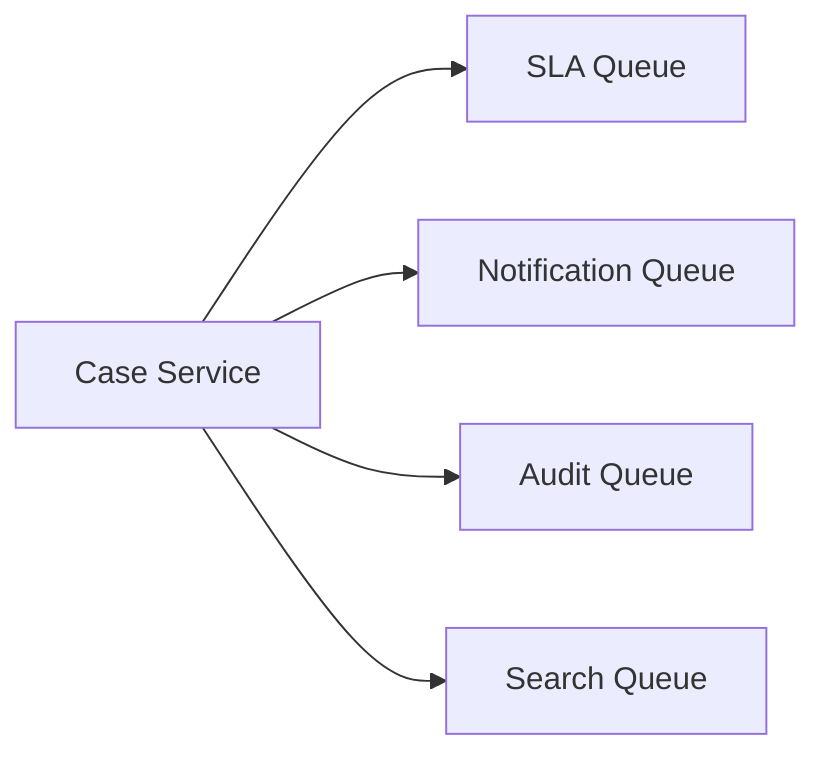

Masalah:

- producer harus tahu semua consumer;
- menambah consumer berarti deploy producer;
- partial failure sulit: publish ke Q1 sukses, Q2 gagal;
- retry producer bisa menciptakan duplicate tidak seragam;
- observability fanout tersebar di aplikasi;
- permission producer melebar ke banyak queue;
- ownership event contract kabur.

Lebih baik:

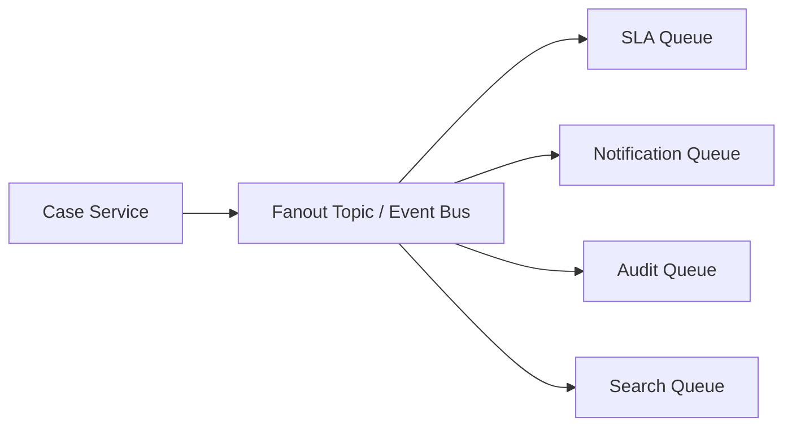

Producer publish satu kali ke boundary. Setiap consumer punya queue sendiri.

---

## 2. Mengapa Setiap Consumer Butuh Queue Sendiri

Fanout langsung ke Lambda/HTTP target terlihat praktis, tetapi untuk banyak database-backed consumer, queue per consumer lebih sehat.

Queue per consumer memberi:

| Capability | Dampak |
|---|---|
| Failure isolation | Notification worker gagal tidak menghentikan SLA worker. |
| Independent retry | Setiap consumer punya retry/DLQ sendiri. |
| Backpressure | Consumer lambat menumpuk di queue-nya sendiri. |
| Replay per consumer | Hanya search projection yang di-redrive, bukan semua consumer. |
| Scaling terpisah | Worker capacity mengikuti bottleneck masing-masing. |
| Observability jelas | Queue depth menunjukkan consumer lag. |
| Deployment safety | Consumer baru bisa subscribe tanpa mengubah producer. |

Rule:

> Fanout event ke queue per consumer, bukan ke satu shared queue untuk banyak bounded context.

Shared queue untuk banyak consumer berbeda sering menghasilkan invisible coupling. Siapa yang boleh delete? Siapa owner DLQ? Siapa pemilik schema interpretation?

---

## 3. SNS → SQS Fanout Mental Model

SNS adalah topic pub/sub. SQS adalah durable subscriber queue.

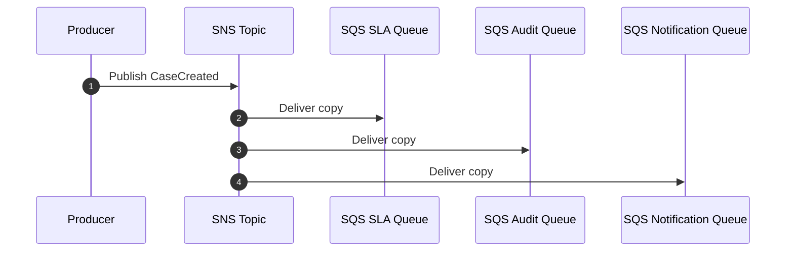

Setiap queue menerima salinan message. Jika Q2 consumer down, Q1 dan Q3 tetap berjalan.

SNS→SQS cocok untuk:

- fanout event sederhana;
- publish-subscribe antar aplikasi internal;
- banyak subscriber yang butuh durable queue;
- filtering berdasarkan message attributes/body;
- low ceremony dibanding event bus governance penuh;
- FIFO fanout jika ordering per group dibutuhkan dan semua resource memakai FIFO-compatible path.

---

## 4. EventBridge → SQS Mental Model

EventBridge event bus adalah router event. Event masuk ke bus, rules mencocokkan event pattern, lalu mengirim ke target.

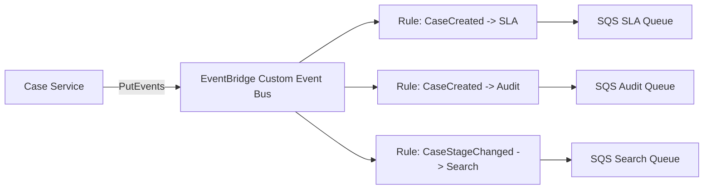

EventBridge cocok untuk:

- event routing lintas banyak source/target;
- event governance dengan `source`, `detail-type`, dan schema;
- cross-account dan org-level routing;
- SaaS/AWS service events;
- archive/replay;
- event pattern matching yang lebih kaya;
- target selain SQS;
- routing berbasis event envelope, bukan hanya topic.

---

## 5. SNS vs EventBridge Decision Table

| Kriteria | SNS → SQS | EventBridge → SQS |
|---|---|---|
| Model utama | Topic pub/sub | Event bus routing |
| Producer intent | Publish notification to topic | Emit domain event to bus |
| Subscriber binding | Topic subscription | Rule target |
| Filtering | Subscription filter policy | Event pattern rule / pipe filtering |
| Event governance | Lebih ringan | Lebih kuat: source/detail-type/schema/archive |
| Cross-account | Bisa, tapi bus pattern sering lebih natural | Sangat cocok untuk org/event mesh |
| Replay | Tidak native seperti EventBridge archive/replay | Archive/replay native untuk event bus |
| Ordering/FIFO | SNS FIFO + SQS FIFO tersedia untuk use case tertentu | EventBridge bukan strict FIFO ordering tool |
| Target diversity | Banyak endpoint/subscriber | Sangat banyak AWS/SaaS/API targets |
| Simplicity | Sederhana untuk fanout | Lebih eksplisit untuk event architecture |
| Best fit | Local pub/sub fanout | Enterprise/domain event routing |

Simplifikasi praktis:

- Gunakan **SNS→SQS** saat Anda butuh topic fanout sederhana dan setiap consumer punya queue sendiri.
- Gunakan **EventBridge→SQS** saat event adalah bagian dari event architecture yang perlu routing, governance, archive/replay, cross-account, atau banyak target berbeda.

---

## 6. Event Contract untuk Fanout

Fanout memperbesar blast radius contract. Satu event bisa dikonsumsi banyak sistem. Maka event harus stabil.

EventBridge-style envelope:

```json
{
  "Source": "com.company.case-service",
  "DetailType": "CaseCreated",
  "Detail": {
    "schemaVersion": 1,
    "eventId": "evt_01HX...",
    "aggregateType": "case",
    "aggregateId": "CASE-123",
    "occurredAt": "2026-07-06T10:15:30Z",
    "correlationId": "trace_01HX...",
    "payload": {
      "caseId": "CASE-123",
      "caseType": "ENFORCEMENT",
      "openedBy": "user-001"
    }
  }
}
```

SNS-style body + attributes:

```json
{
  "schemaVersion": 1,
  "eventId": "evt_01HX...",
  "eventType": "CaseCreated",
  "producer": "case-service",
  "aggregateType": "case",
  "aggregateId": "CASE-123",
  "occurredAt": "2026-07-06T10:15:30Z",
  "correlationId": "trace_01HX...",
  "payload": {
    "caseId": "CASE-123",
    "caseType": "ENFORCEMENT"
  }
}
```

SNS message attributes:

```json
{
  "eventType": "CaseCreated",
  "schemaVersion": "1",
  "aggregateType": "case",
  "tenantId": "tenant-a"
}
```

Rules:

- Event menyatakan fact, bukan command untuk consumer tertentu.
- Jangan menaruh `targetService = notification-service` di event domain umum.
- Jangan mengganti makna field tanpa version bump.
- Jangan menghapus field yang masih dipakai consumer lama.
- Jangan publish full mutable database row tanpa contract.
- Sertakan event ID domain untuk idempotency consumer.

---

## 7. SNS Message Filtering

Secara default, subscriber topic menerima semua message. Filter policy membuat subscriber hanya menerima subset.

Contoh filter policy untuk notification queue:

```json
{
  "eventType": ["CaseCreated", "CaseAssigned"],
  "tenantTier": ["gold", "enterprise"]
}
```

Filter policy untuk SLA queue:

```json
{
  "eventType": ["CaseCreated", "CaseStageChanged"],
  "caseType": ["ENFORCEMENT", "INVESTIGATION"]
}
```

Filtering bagus untuk mengurangi noise, tetapi jangan menjadikan filter sebagai business logic tersembunyi.

Bad smell:

- filter policy terlalu kompleks;
- consumer tidak tahu kenapa event tertentu tidak masuk;
- filter field tidak terdokumentasi dalam contract;
- perubahan filter dilakukan manual tanpa review;
- filter menggunakan field yang bisa berubah makna.

---

## 8. EventBridge Event Pattern

EventBridge rule matching berbasis event pattern.

Contoh rule:

```json
{
  "source": ["com.company.case-service"],
  "detail-type": ["CaseCreated"],
  "detail": {
    "caseType": ["ENFORCEMENT", "INVESTIGATION"]
  }
}
```

Rule ini bisa mengirim ke SQS SLA queue.

Kelebihan event pattern:

- routing eksplisit di event bus;
- matching pada envelope dan detail;
- target bisa SQS, Lambda, Step Functions, API destination, event bus lain, dan banyak lainnya;
- cocok untuk multi-team governance.

Risiko:

- rule sprawl;
- event bus menjadi spaghetti routing jika naming tidak disiplin;
- consumer dependency tidak terlihat dari repository producer;
- replay event lama bisa memicu consumer baru jika rule tidak dirancang hati-hati.

---

## 9. EventBridge Pipes untuk SQS

EventBridge Pipes menghubungkan source ke target dengan optional filtering, enrichment, dan transformation.

Contoh mental model:

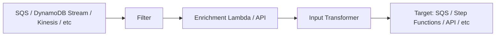

Pipes berguna ketika:

- Anda ingin mengambil records dari SQS lalu mengirim subset ke target lain;
- Anda butuh enrichment ringan sebelum target;
- Anda ingin mengurangi custom poller glue code;
- routing tidak perlu full application service.

Namun Pipes bukan pengganti domain model. Jika logic enrichment berisi business transaction kompleks, lebih baik tulis worker/service eksplisit.

---

## 10. Delivery Semantics pada Fanout

Fanout tidak menghapus kebutuhan idempotency. Justru memperbanyak titik duplicate.

Duplicate bisa muncul dari:

- producer publish retry;
- SNS delivery retry;
- EventBridge target retry;
- SQS at-least-once delivery;
- worker crash after commit before delete;
- DLQ redrive;
- EventBridge archive replay;
- manual re-drive atau backfill.

Setiap consumer queue tetap harus punya idempotency key.

Recommended consumer idempotency key:

```text
consumerName + ':' + eventId
```

Contoh:

```text
sla-worker:evt_01HX...
search-projection-worker:evt_01HX...
audit-worker:evt_01HX...
```

Mengapa include consumer name? Karena event yang sama boleh menghasilkan efek berbeda di consumer berbeda. Idempotency scope adalah per consumer effect.

---

## 11. SNS Subscription DLQ vs SQS Consumer DLQ

Ada dua level DLQ yang sering tertukar.

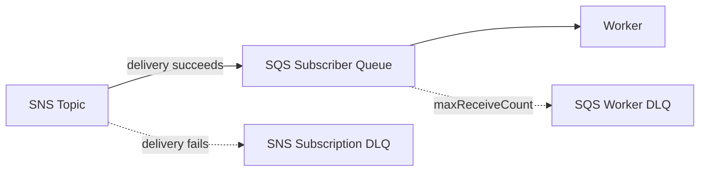

| DLQ | Menangkap |
|---|---|
| SNS subscription DLQ | SNS gagal deliver ke subscriber endpoint/queue. |
| SQS DLQ | Consumer gagal memproses message dari queue. |

Jika SNS→SQS permission salah, message bisa masuk subscription DLQ. Jika worker bug, message masuk SQS DLQ.

Keduanya perlu alarm berbeda.

---

## 12. EventBridge Target Failure dan DLQ

EventBridge rule target bisa gagal. Untuk beberapa target, EventBridge mendukung retry policy dan DLQ. Jika target adalah SQS, permission/policy queue harus benar agar EventBridge boleh mengirim message.

Mental model:

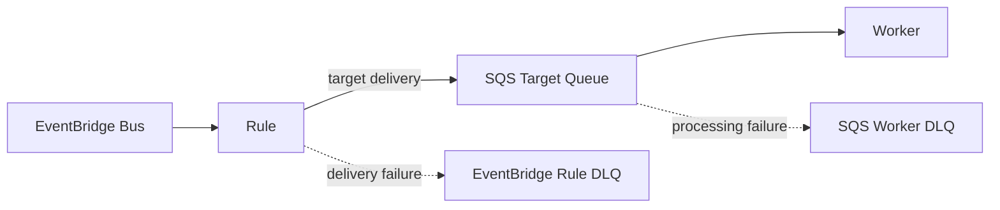

Operational distinction:

- EventBridge rule DLQ: event tidak sampai ke SQS target.
- SQS DLQ: event sampai ke queue, tetapi worker gagal memproses.

Jangan hanya memonitor SQS DLQ. Jika EventBridge target delivery gagal, SQS queue bisa kosong padahal event hilang dari consumer path dan hanya ada di EventBridge DLQ.

---

## 13. Raw Message Delivery SNS→SQS

SNS dapat mengirim message ke SQS dengan envelope SNS default atau raw message delivery.

Default SNS envelope memberi metadata SNS:

```json
{
  "Type": "Notification",
  "MessageId": "...",
  "TopicArn": "...",
  "Message": "{...actual payload...}",
  "Timestamp": "..."
}
```

Raw message delivery membuat body SQS menjadi payload asli.

Trade-off:

| Mode | Kelebihan | Kekurangan |
|---|---|---|
| SNS envelope | metadata SNS tersedia | consumer harus parse nested `Message`. |
| Raw delivery | consumer lebih sederhana | beberapa metadata SNS tidak ada di body. |

Pilih satu standar per platform. Jangan campur tanpa alasan kuat.

---

## 14. FIFO Fanout

Jika ordering per aggregate penting, Anda bisa memakai SNS FIFO topic ke SQS FIFO queue.

Constraint desain:

- topic FIFO dan queue FIFO;
- `MessageGroupId` harus dipilih dengan hati-hati;
- `MessageDeduplicationId` harus domain-stable;
- DLQ harus mempertimbangkan ordering;
- satu hot message group bisa menjadi bottleneck;
- jangan memakai FIFO untuk ordering global kecuali throughput kecil dan benar-benar perlu.

Contoh:

```text
MessageGroupId = caseId
MessageDeduplicationId = eventId
```

Jika `caseId` sangat hot, satu case bisa memblokir group-nya sendiri. Itu mungkin benar jika ordering case harus serial. Jika tidak, gunakan version guard dan Standard queue.

---

## 15. Cross-Account Fanout

Dalam organisasi besar, producer dan consumer sering berada di akun berbeda.

EventBridge sering lebih natural untuk cross-account event architecture:

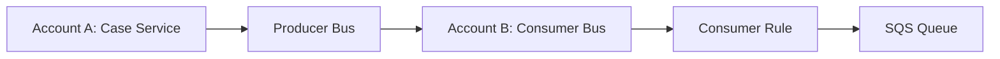

Keuntungan:

- producer tidak perlu permission langsung ke queue consumer;
- consumer account bisa mengelola rules dan queues;
- event bus policy menjadi governance boundary;
- audit routing lebih eksplisit.

SNS juga bisa cross-account, tetapi untuk event mesh multi-account, EventBridge biasanya lebih cocok karena bus abstraction dan routing policies lebih eksplisit.

---

## 16. Fanout dan Database Writes

Fanout ke banyak consumer berarti banyak database writes terpisah.

Contoh:

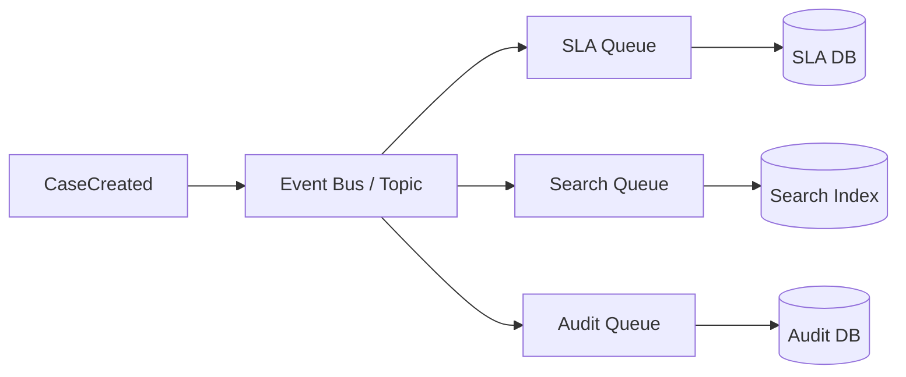

Setiap consumer harus diperlakukan sebagai projection/effect owner.

Consumer tidak boleh mengasumsikan semua consumer lain berhasil.

Jika business process membutuhkan semua efek selesai sebelum lanjut, itu bukan pure fanout. Itu workflow/orchestration problem.

Contoh:

- Case tidak boleh dianggap `READY_FOR_REVIEW` sampai SLA, assignment, notification, dan audit selesai.
- Ini lebih cocok Step Functions/saga daripada fire-and-forget fanout.

Fanout menghasilkan eventual consistency. Orchestration menghasilkan explicit progress state.

---

## 17. Fanout Event vs Command

Event fanout:

```text
CaseCreated happened.
```

Command dispatch:

```text
CalculateDeadline for case CASE-123.
SendWelcomeNotification to user U-123.
IndexCase CASE-123.
```

SNS/EventBridge bisa membawa keduanya secara teknis, tetapi modelnya berbeda.

| Type | Meaning | Coupling |
|---|---|---|
| Event | Fact already happened | Producer tidak tahu consumer action. |
| Command | Instruction for specific capability | Sender tahu intent target. |

Untuk fanout lintas bounded context, gunakan event.

Untuk worker internal satu service, command message ke queue bisa lebih tepat.

Anti-pattern:

```json
{
  "eventType": "CaseCreated",
  "actionForNotificationService": "SEND_EMAIL",
  "actionForSearchService": "INDEX_NOW"
}
```

Itu event yang menyamar sebagai orchestration script.

---

## 18. Consumer Onboarding Pattern

Ketika consumer baru ingin subscribe event existing:

1. Baca event contract.
2. Tentukan apakah perlu historical backfill atau hanya future events.
3. Buat queue sendiri.
4. Buat subscription/rule filter minimal.
5. Implement idempotent worker.
6. Jalankan shadow mode jika memungkinkan.
7. Monitor queue lag dan terminal failures.
8. Setelah stabil, aktifkan side effect utama.

Jika consumer butuh data historis, jangan berharap event future mencukupi. Buat backfill job terpisah yang menghasilkan event replay/backfill command dengan idempotency key berbeda.

---

## 19. Replay Semantics

Replay adalah fitur sekaligus bahaya.

Replay harus menjawab:

- event mana yang direplay?
- consumer mana yang menerima?
- apakah consumer baru ikut menerima replay lama?
- apakah idempotency key sama atau baru?
- apakah replay menghasilkan side effect eksternal seperti email kedua?
- apakah event schema lama masih bisa diproses?
- apakah downstream database mampu menerima burst replay?

Untuk projection rebuild, replay mungkin aman.

Untuk notification/email/payment, replay bisa berbahaya.

Tambahkan metadata replay:

```json
{
  "eventId": "evt_01HX...",
  "replayContext": {
    "isReplay": true,
    "replayId": "replay_2026_07_06_search_rebuild",
    "reason": "search-index-rebuild",
    "initiatedBy": "platform-ops"
  }
}
```

Consumer bisa menggunakan metadata ini untuk menonaktifkan side effect eksternal tertentu.

---

## 20. IaC Skeleton: SNS Topic to SQS Queues

Contoh konseptual CloudFormation-style, disederhanakan.

```yaml
Resources:
  CaseEventsTopic:
    Type: AWS::SNS::Topic
    Properties:
      TopicName: case-events-prod

  SlaQueue:
    Type: AWS::SQS::Queue
    Properties:
      QueueName: case-sla-worker-prod
      RedrivePolicy:
        deadLetterTargetArn: !GetAtt SlaDlq.Arn
        maxReceiveCount: 5

  SlaDlq:
    Type: AWS::SQS::Queue
    Properties:
      QueueName: case-sla-worker-prod-dlq

  SlaSubscription:
    Type: AWS::SNS::Subscription
    Properties:
      TopicArn: !Ref CaseEventsTopic
      Protocol: sqs
      Endpoint: !GetAtt SlaQueue.Arn
      RawMessageDelivery: true
      FilterPolicy:
        eventType:
          - CaseCreated
          - CaseStageChanged

  SlaQueuePolicy:
    Type: AWS::SQS::QueuePolicy
    Properties:
      Queues:
        - !Ref SlaQueue
      PolicyDocument:
        Version: '2012-10-17'
        Statement:
          - Effect: Allow
            Principal:
              Service: sns.amazonaws.com
            Action: sqs:SendMessage
            Resource: !GetAtt SlaQueue.Arn
            Condition:
              ArnEquals:
                aws:SourceArn: !Ref CaseEventsTopic
```

Poin penting:

- queue policy membatasi source topic;
- DLQ dipasang di SQS consumer queue;
- subscription filter eksplisit;
- raw delivery dipilih konsisten.

---

## 21. IaC Skeleton: EventBridge Rule to SQS

```yaml
Resources:
  CaseEventBus:
    Type: AWS::Events::EventBus
    Properties:
      Name: case-events-prod

  SlaQueue:
    Type: AWS::SQS::Queue
    Properties:
      QueueName: case-sla-worker-prod
      RedrivePolicy:
        deadLetterTargetArn: !GetAtt SlaDlq.Arn
        maxReceiveCount: 5

  SlaRule:
    Type: AWS::Events::Rule
    Properties:
      Name: case-created-to-sla-worker
      EventBusName: !Ref CaseEventBus
      EventPattern:
        source:
          - com.company.case-service
        detail-type:
          - CaseCreated
          - CaseStageChanged
        detail:
          caseType:
            - ENFORCEMENT
            - INVESTIGATION
      Targets:
        - Arn: !GetAtt SlaQueue.Arn
          Id: SlaQueueTarget
          DeadLetterConfig:
            Arn: !GetAtt EventBridgeTargetDlq.Arn
          RetryPolicy:
            MaximumRetryAttempts: 10
            MaximumEventAgeInSeconds: 3600

  SlaQueuePolicy:
    Type: AWS::SQS::QueuePolicy
    Properties:
      Queues:
        - !Ref SlaQueue
      PolicyDocument:
        Version: '2012-10-17'
        Statement:
          - Effect: Allow
            Principal:
              Service: events.amazonaws.com
            Action: sqs:SendMessage
            Resource: !GetAtt SlaQueue.Arn
            Condition:
              ArnEquals:
                aws:SourceArn: !GetAtt SlaRule.Arn
```

Poin penting:

- rule target DLQ berbeda dari SQS worker DLQ;
- queue policy membatasi source rule;
- event pattern menjadi routing contract;
- retry policy target harus sesuai dengan tolerance consumer.

---

## 22. Fanout Observability

Dashboard fanout harus menjawab: event masuk, event diroute, event sampai queue, event diproses, event gagal di mana?

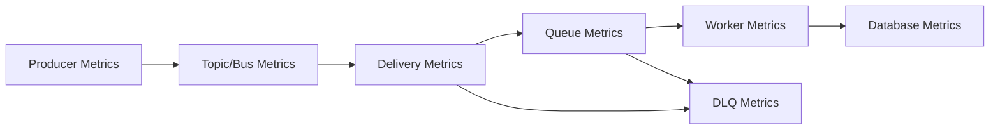

Metrics per layer:

| Layer | Metrics |
|---|---|
| Producer | publish success/failure, publish latency, event count by type. |
| SNS/EventBridge | matched rules/subscriptions, delivery failures, throttles. |
| Subscription/rule DLQ | target delivery failure count. |
| SQS queue | visible messages, oldest age, not visible, receive/delete count. |
| Worker | success/failure by code, processing latency, duplicate completed. |
| Database | write latency, lock wait, connection pool, deadlock, throttle. |
| SQS DLQ | poison/terminal processing failure. |

Correlation fields:

- `eventId`
- `correlationId`
- `causationId`
- `source`
- `detailType` / `eventType`
- `consumerName`
- `idempotencyKey`
- `subscriptionName` / `ruleName`
- `queueName`

---

## 23. Failure Mode Table

| Failure | Where | Detection | Recovery |
|---|---|---|---|
| Producer publish fails | producer | publish error metric | retry/outbox publisher. |
| SNS cannot deliver to SQS | subscription | SNS subscription DLQ | fix policy/endpoint, replay from DLQ if possible. |
| EventBridge cannot deliver target | rule target | EventBridge DLQ | fix permission/target, redrive/replay. |
| SQS worker fails | consumer | SQS DLQ | fix worker/data, redrive controlled. |
| Consumer slow | queue | oldest message age | scale worker or reduce DB bottleneck. |
| Duplicate event | consumer | idempotency duplicate count | no-op if completed. |
| Event schema incompatible | consumer | terminal failure/schema validation | deploy compatibility fix or transform. |
| Filter too broad | routing | unexpected queue load | fix filter/rule, possibly discard/quarantine. |
| Filter too narrow | routing | missing expected events | audit rules/subscriptions, replay/backfill. |
| Replay triggers email again | consumer | side effect duplicate | replay-aware consumer and effect log. |

---

## 24. Security and Least Privilege

Producer should not get broad `sqs:SendMessage` to all consumer queues.

Better:

- producer can `sns:Publish` to one topic, or `events:PutEvents` to one bus;
- SNS/EventBridge service principal can send to queue under narrow source ARN condition;
- consumer role can receive/delete only from its queue;
- DLQ redrive permissions limited to operator role/tooling;
- event payload excludes secrets and sensitive data unless encrypted/justified;
- cross-account bus/topic policies reviewed as architecture boundary.

Queue policy should limit source:

```json
{
  "Effect": "Allow",
  "Principal": { "Service": "events.amazonaws.com" },
  "Action": "sqs:SendMessage",
  "Resource": "arn:aws:sqs:ap-southeast-1:111122223333:case-sla-worker-prod",
  "Condition": {
    "ArnEquals": {
      "aws:SourceArn": "arn:aws:events:ap-southeast-1:111122223333:rule/case-events-prod/case-created-to-sla-worker"
    }
  }
}
```

---

## 25. Cost and Capacity Thinking

Fanout multiplies work.

If one event fans out to 8 queues, then one business event can become:

```text
1 publish + 8 deliveries + 8 queue stores + 8 worker processing paths + N database writes
```

Cost/performance questions:

- Berapa average fanout factor?
- Apakah semua consumer butuh semua event?
- Apakah filtering terjadi sebelum queue atau setelah consumer?
- Apakah event payload besar sehingga biaya transfer/storage naik?
- Apakah replay akan menciptakan burst besar?
- Apakah database setiap consumer mampu mengejar backlog?
- Apakah consumer non-critical perlu lower priority queue?

High fanout bukan masalah jika disengaja. High fanout tanpa ownership adalah masalah.

---

## 26. Design Patterns

### 26.1 Domain Event Fanout

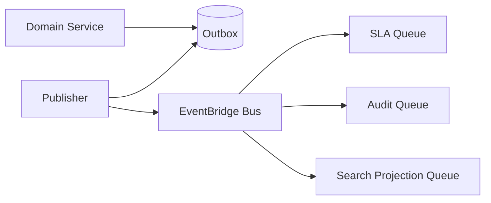

Use when event is a fact and many consumers may care.

### 26.2 Internal Work Fanout

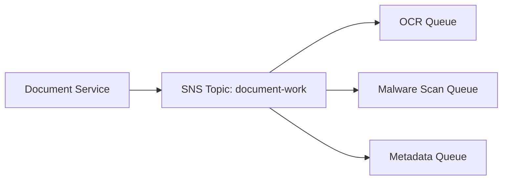

Use when one service decomposes internal asynchronous work.

### 26.3 EventBridge to SQS for Consumer Isolation

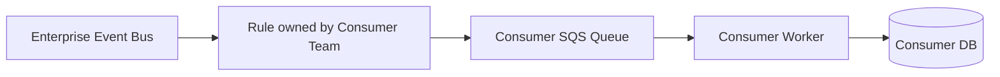

Use when consumer team wants isolated lag/retry/DLQ.

### 26.4 Fanout + Orchestration Hybrid

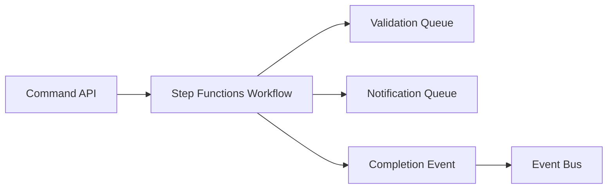

Use when some steps require explicit progress/compensation, but final facts should be published as events.

---

## 27. Anti-Patterns

### 27.1 Producer knows every consumer queue

This defeats fanout decoupling.

### 27.2 One queue shared by unrelated consumers

Consumers compete and delete each other's work. Use one queue per consumer.

### 27.3 Event contains consumer-specific instructions

That is orchestration leaking into event contract.

### 27.4 No target delivery DLQ

You monitor worker DLQ but miss delivery failures before queue.

### 27.5 Filter policies undocumented

A missing event becomes impossible to debug.

### 27.6 Replay without side-effect guard

Rebuild search index accidentally sends email again.

### 27.7 Fanout used for required transaction completion

If all branches must complete before business state advances, use workflow orchestration.

### 27.8 EventBridge rule sprawl

Hundreds of undocumented rules become distributed spaghetti. Name, tag, own, and review rules.

---

## 28. Production Readiness Checklist

- [ ] Producer publishes once to topic/bus, not N queues.
- [ ] Each consumer has its own SQS queue.
- [ ] Each consumer queue has DLQ and owner.
- [ ] SNS subscription/EventBridge rule has delivery failure monitoring.
- [ ] Queue policy restricts source topic/rule.
- [ ] Event envelope includes event ID, source, type, version, time, correlation ID.
- [ ] Consumer idempotency scope includes consumer name + event ID.
- [ ] Filtering rules are reviewed and versioned as infrastructure code.
- [ ] Replay behavior is documented per consumer.
- [ ] External side effects are replay-safe.
- [ ] Event schema compatibility is tested.
- [ ] Cross-account permissions are minimal.
- [ ] Dashboard shows producer→routing→queue→worker→database path.
- [ ] Redrive procedure exists for both delivery DLQ and worker DLQ.
- [ ] Fanout factor and cost are known.

---

## 29. Decision Heuristic

Use this mental shortcut:

```text
Need one producer, many independent durable consumers?
  -> SNS/EventBridge fanout to one SQS queue per consumer.

Need simple topic pub/sub with message filtering?
  -> SNS -> SQS.

Need event bus, event pattern routing, cross-account, archive/replay, governance?
  -> EventBridge -> SQS.

Need required multi-step business process completion?
  -> Step Functions orchestration, then publish final events.

Need transform/enrich route between source and target with minimal glue?
  -> EventBridge Pipes.
```

The strongest fanout architecture is boring at runtime: producer emits once, routing is visible, queues isolate failure, consumers are idempotent, and replay is deliberate.

---

## 30. Referensi Resmi

- Amazon SNS Developer Guide — fanout to SQS queues: https://docs.aws.amazon.com/sns/latest/dg/sns-sqs-as-subscriber.html
- Amazon SNS Developer Guide — subscription filter policies: https://docs.aws.amazon.com/sns/latest/dg/sns-subscription-filter-policies.html
- Amazon SNS Developer Guide — message filtering: https://docs.aws.amazon.com/sns/latest/dg/sns-message-filtering.html
- Amazon SNS Developer Guide — dead-letter queues: https://docs.aws.amazon.com/sns/latest/dg/sns-dead-letter-queues.html
- Amazon EventBridge User Guide — what is EventBridge: https://docs.aws.amazon.com/eventbridge/latest/userguide/eb-what-is.html
- Amazon EventBridge User Guide — event buses: https://docs.aws.amazon.com/eventbridge/latest/userguide/eb-event-bus.html
- Amazon EventBridge User Guide — targets: https://docs.aws.amazon.com/eventbridge/latest/userguide/eb-targets.html
- Amazon EventBridge User Guide — Pipes: https://docs.aws.amazon.com/eventbridge/latest/userguide/eb-pipes.html
- Amazon EventBridge User Guide — Pipes SQS source: https://docs.aws.amazon.com/eventbridge/latest/userguide/eb-pipes-sqs.html
- Amazon EventBridge User Guide — Pipes filtering: https://docs.aws.amazon.com/eventbridge/latest/userguide/eb-pipes-event-filtering.html
- Amazon EventBridge User Guide — SQS permissions for EventBridge: https://docs.aws.amazon.com/eventbridge/latest/userguide/eb-use-resource-based.html

---

## Status

Module 04 belum selesai.

Part berikutnya:

```txt
learn-aws-application-database-part-031-sqs-large-message-pattern.mdx
learn-aws-application-database-part-032-sqs-operability-playbook.mdx
```
