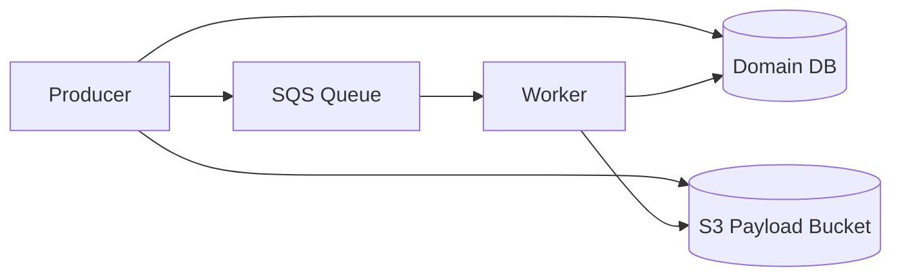
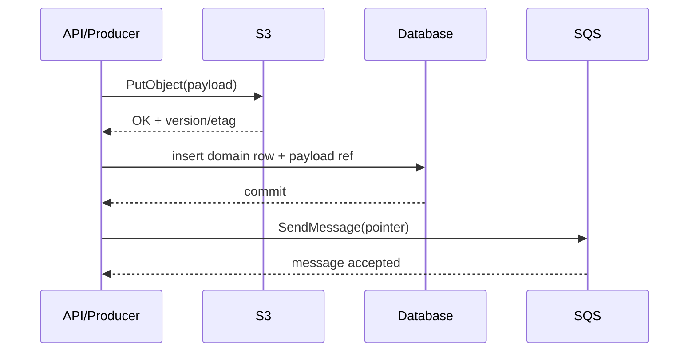
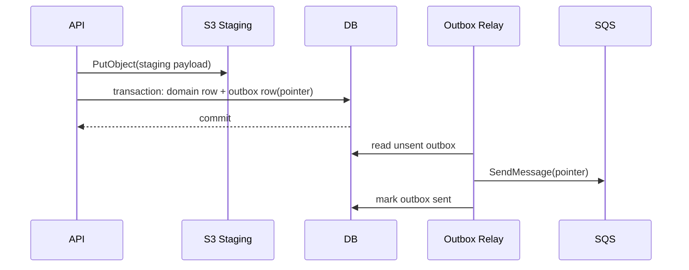
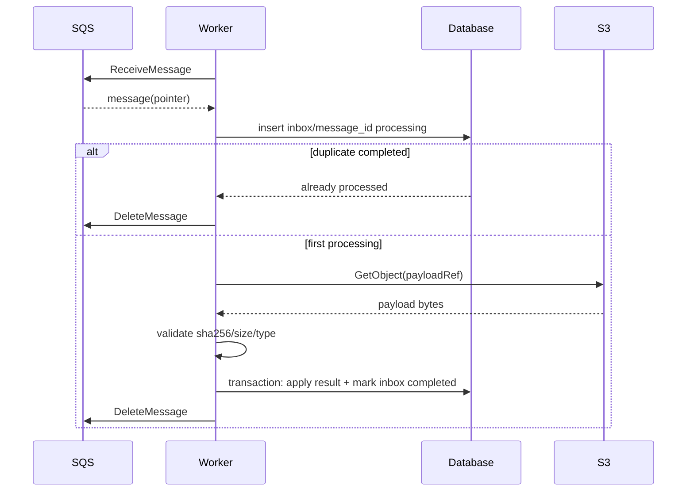
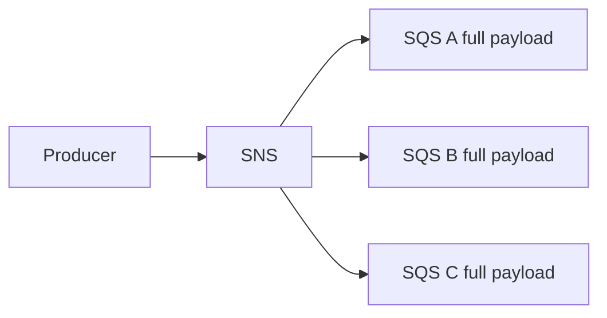
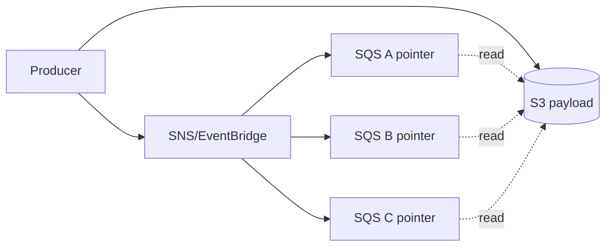
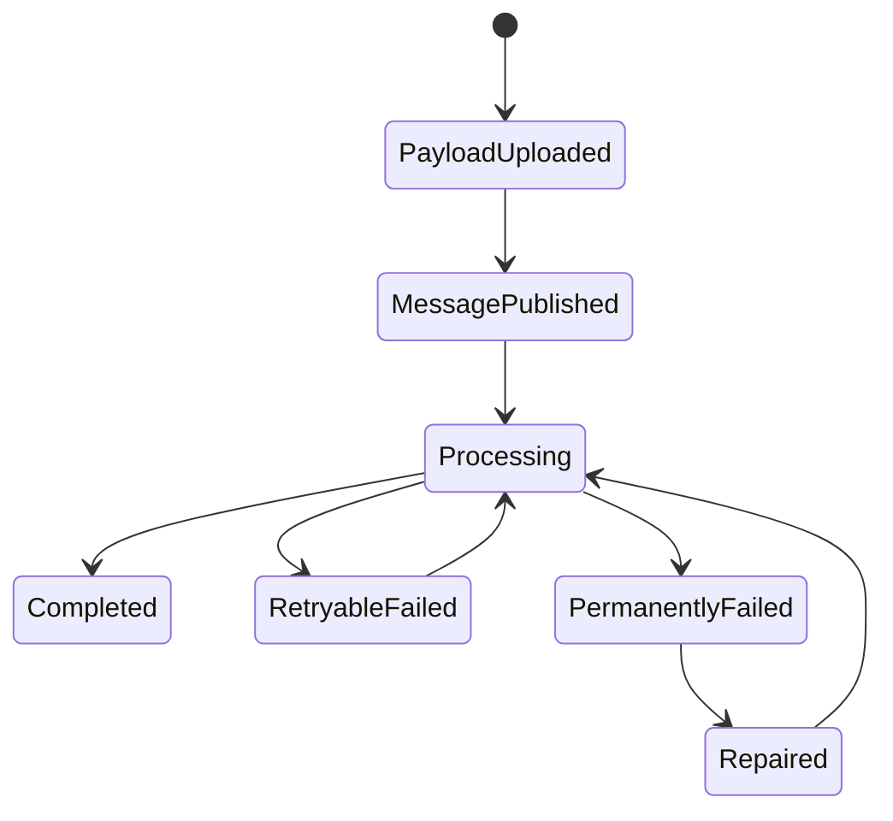

# Part 031 — SQS Large Message Pattern

> Target pembelajaran: mampu mendesain pengiriman payload besar melalui SQS tanpa menjadikan queue sebagai object store, tanpa membuat orphaned payload di S3, tanpa kehilangan idempotency, dan tanpa membuat replay/DLQ menjadi berbahaya.

SQS adalah queue, bukan storage layer untuk dokumen besar.

Queue message idealnya membawa:

- identitas command/event;
- routing metadata;
- idempotency key;
- correlation ID;
- pointer ke state/payload besar;
- ringkasan kecil yang cukup untuk filtering/debugging.

Queue message tidak ideal untuk:

- PDF;
- image;
- export file;
- spreadsheet;
- JSON besar;
- full domain aggregate;
- encoded binary blob;
- dump database row lengkap;
- hasil OCR panjang;
- HTML email body besar dengan attachment embedded.

Saat payload membesar, problem-nya bukan hanya limit ukuran. Problem sesungguhnya adalah **atomicity, lifecycle, retry, replay, security, dan observability**.

---

## 1. Current Constraint: Ukuran Message SQS

Menurut dokumentasi quota Amazon SQS, ukuran message native minimum adalah 1 byte dan maksimum `1,048,576 bytes` atau `1 MiB`. Untuk payload lebih besar, AWS menyediakan extended client library yang menyimpan payload di S3 dan menaruh reference di SQS. Extended client library mendukung payload sampai `2 GB`.

Konsekuensi praktis:

- payload kecil boleh inline;
- payload sedang perlu dipertimbangkan dari sisi biaya, latency, log safety, dan filtering;
- payload besar harus memakai pointer/reference pattern;
- payload sangat besar lebih cocok menjadi object workflow, bukan message workflow.

Jangan mendesain dekat limit maksimum. Limit adalah pagar keamanan, bukan target desain.

Rule of thumb:

| Payload | Rekomendasi |
|---:|---|
| `< 32 KB` | Biasanya aman inline jika bukan data sensitif/verbose |
| `32 KB - 256 KB` | Pertimbangkan pointer jika message sering diretry, difanout, atau dilog |
| `256 KB - 1 MiB` | Sangat disarankan pointer; inline hanya jika alasan kuat |
| `> 1 MiB` | Wajib pointer/S3/offload |
| `> 100 MB` | Perlakukan sebagai object-processing workflow, bukan queue message biasa |

Yang membuat payload besar berbahaya:

- biaya transfer dan API meningkat;
- retry menjadi mahal;
- DLQ inspection sulit;
- logging raw payload bisa bocor data;
- batch throughput turun;
- consumer memory pressure naik;
- poison message makin mahal;
- fanout menggandakan payload;
- replay bisa membanjiri storage/network.

---

## 2. Mental Model: Message vs Payload vs State

Pisahkan tiga hal:

1. **Message** — unit scheduling/notification di SQS.
2. **Payload** — data besar yang dibutuhkan worker.
3. **State** — kebenaran domain yang durable dan queryable.



Jika semua data dimasukkan ke SQS, queue berubah menjadi storage layer. Itu salah boundary.

SQS harus menjawab:

> “Ada pekerjaan apa yang harus diproses?”

Bukan:

> “Semua data pekerjaan ini ada di mana?”

Payload besar sebaiknya berada di storage yang memang dibuat untuk object: S3. Domain state tetap berada di database sumber kebenaran: Aurora/RDS/DynamoDB/dll.

---

## 3. Pattern Utama: Payload Reference Pattern

Message SQS berisi pointer:

```json
{
  "messageId": "msg-01J2...",
  "eventType": "DocumentUploaded",
  "eventVersion": 1,
  "occurredAt": "2026-07-06T10:15:30Z",
  "correlationId": "corr-8f3d",
  "tenantId": "tenant-123",
  "idempotencyKey": "document-uploaded:doc-789:v3",
  "payloadRef": {
    "bucket": "prod-case-payloads",
    "key": "tenant-123/documents/doc-789/events/msg-01J2.json",
    "versionId": "optional-s3-version-id",
    "contentType": "application/json",
    "contentLength": 1849382,
    "sha256": "2dd7..."
  },
  "domainRef": {
    "documentId": "doc-789",
    "caseId": "case-456"
  }
}
```

Message tetap kecil dan cukup informatif.

Payload di S3 berisi data besar:

```json
{
  "documentId": "doc-789",
  "caseId": "case-456",
  "uploadedBy": "user-111",
  "metadata": {
    "filename": "evidence.pdf",
    "mimeType": "application/pdf",
    "size": 1849382
  },
  "extractedHints": {
    "pages": 31,
    "language": "id"
  }
}
```

Domain DB berisi source of truth:

```sql
create table document_upload (
    document_id text primary key,
    case_id text not null,
    tenant_id text not null,
    upload_status text not null,
    payload_bucket text not null,
    payload_key text not null,
    payload_sha256 text not null,
    created_at timestamptz not null default now()
);
```

SQS message tidak perlu membawa seluruh payload karena worker bisa mengambil dari S3 dan memverifikasi terhadap DB/invariant.

---

## 4. Producer Write Sequence

Ada dua sequence umum.

### 4.1 S3 First, Then DB, Then SQS



Kelebihan:

- payload sudah tersedia sebelum worker menerima message;
- DB dapat menyimpan pointer dan checksum;
- worker dapat memvalidasi payload terhadap DB.

Risiko:

- jika S3 sukses lalu DB gagal, ada orphaned object;
- jika DB sukses lalu SQS gagal, ada domain state tanpa message;
- jika producer retry tanpa idempotency, object bisa dobel.

Mitigasi:

- gunakan deterministic key;
- simpan content hash;
- gunakan transactional outbox untuk publish message;
- jalankan cleanup orphaned object berbasis prefix/tag/age;
- gunakan idempotency key di command boundary.

### 4.2 DB Transaction + Outbox, Payload Already Staged



Ini biasanya lebih baik untuk production karena masalah `DB commit sukses tetapi SQS publish gagal` diselesaikan oleh outbox relay.

Kelemahannya:

- ada delay kecil sebelum message masuk queue;
- perlu relay dan observability outbox lag;
- tetap perlu cleanup untuk payload yang berhasil ditulis ke S3 tetapi transaksi DB gagal.

---

## 5. Deterministic Object Key Design

Object key jangan random murni kalau idempotency penting.

Contoh buruk:

```txt
payloads/7f6d8a2b-71e9-4a03-98f8.json
```

Masalah:

- retry membuat object baru;
- sulit reconcile;
- orphan cleanup sulit dikaitkan dengan command;
- audit trail kurang jelas.

Contoh lebih baik:

```txt
tenants/{tenantId}/cases/{caseId}/documents/{documentId}/events/{eventId}/payload.json
```

Atau untuk command idempotent:

```txt
tenants/{tenantId}/commands/{idempotencyKey}/payload.json
```

Atau content-addressed:

```txt
sha256/{first2}/{sha256}.json
```

Perbandingan:

| Strategy | Kelebihan | Risiko |
|---|---|---|
| Domain path | Mudah audit dan cleanup | Rename/move domain tidak boleh mengubah object key lama |
| Command key | Cocok untuk idempotent command | Key bisa bocor makna jika tidak dienkripsi/di-sanitize |
| Event key | Cocok untuk immutable event payload | Event ID harus stabil |
| Content-addressed | Dedup natural | Perlu metadata mapping ke domain |
| Random UUID | Simple | Idempotency dan reconciliation lemah |

Prinsip:

- object key harus stabil untuk retry;
- object key tidak boleh mengandung PII yang tidak perlu;
- object key harus bisa dipakai untuk cleanup dan audit;
- object key harus punya tenant/domain partition yang jelas;
- object key harus immutable setelah dipublish.

---

## 6. Metadata yang Harus Tetap Inline di SQS

Jangan membuat consumer harus membaca S3 hanya untuk tahu apakah message relevan.

Metadata yang ideal tetap inline:

```json
{
  "tenantId": "tenant-123",
  "eventType": "DocumentUploaded",
  "eventVersion": 1,
  "domainId": "doc-789",
  "correlationId": "corr-abc",
  "idempotencyKey": "...",
  "payloadRef": { "bucket": "...", "key": "..." },
  "payloadSummary": {
    "contentType": "application/pdf",
    "contentLength": 1849382,
    "sha256": "..."
  }
}
```

Inline metadata membantu:

- filtering;
- logging aman;
- DLQ triage;
- tracing;
- routing;
- idempotency;
- tenant isolation;
- debugging tanpa membuka payload sensitif.

Namun jangan inline:

- full PII;
- document content;
- token/secrets;
- raw OCR text panjang;
- entire aggregate snapshot;
- payload yang membuat log membengkak.

---

## 7. Consistency Model: Pointer dan Payload Harus Sepaket secara Invariant

Invariant utama:

> Jika SQS message visible, maka `payloadRef` harus resolvable, readable oleh consumer yang sah, dan sesuai checksum/metadata yang dinyatakan.

S3 sekarang memberikan strong read-after-write consistency untuk object write/read/list. Itu mengurangi risiko consumer menerima pointer sebelum object terlihat. Namun strong consistency bukan berarti atomic transaction lintas S3, SQS, dan database.

Masih ada failure window:

| Window | Contoh | Mitigasi |
|---|---|---|
| S3 sukses, DB gagal | orphan object | cleanup job, lifecycle rule, staging prefix |
| S3 sukses, DB sukses, SQS gagal | work tidak diproses | transactional outbox |
| SQS sukses, S3 permission salah | consumer gagal membaca | IAM test, canary, DLQ classification |
| SQS sukses, payload dihapus terlalu cepat | payload missing | retention alignment, versioning, lifecycle discipline |
| payload berubah setelah message dikirim | checksum mismatch | immutable key, version ID, hash validation |

Tidak ada magical atomicity. Yang ada adalah desain failure window yang kecil, terobservasi, dan recoverable.

---

## 8. Staging Prefix vs Final Prefix

Untuk upload multi-step, gunakan prefix staging:

```txt
staging/tenants/{tenantId}/commands/{idempotencyKey}/payload.json
final/tenants/{tenantId}/documents/{documentId}/payload.json
```

Flow:

1. API upload payload ke `staging/`.
2. API validasi checksum, size, MIME type.
3. API commit DB row.
4. API/outbox publish SQS message.
5. Worker membaca dari `final/` atau `staging/` tergantung desain.
6. Cleanup menghapus staging yang tidak pernah dipromosikan.

Namun rename di S3 bukan operasi metadata rename; biasanya perlu copy + delete. Untuk payload besar, hindari promosi yang mahal jika tidak perlu.

Alternatif lebih sederhana:

- tulis langsung ke deterministic final key;
- simpan DB status `PENDING_PROCESSING`;
- cleanup object yang tidak punya DB row setelah usia tertentu;
- jangan expose object ke consumer sampai DB commit dan message publish/outbox terjadi.

---

## 9. Consumer Flow yang Aman



Consumer harus melakukan:

1. parse message envelope;
2. validate event version;
3. acquire idempotency/inbox record;
4. fetch payload from S3;
5. validate checksum and content length;
6. apply business operation inside DB transaction;
7. mark message completed;
8. delete SQS message.

Jika payload missing:

- jangan langsung delete message;
- classify sebagai transient atau permanent;
- retry dengan backoff;
- setelah threshold, pindahkan ke DLQ;
- runbook harus bisa membedakan `MissingPayload`, `AccessDenied`, `ChecksumMismatch`, dan `PayloadTooLargeForWorker`.

---

## 10. Checksum, ETag, dan Payload Integrity

Simpan checksum eksplisit di metadata message dan DB.

```json
"payloadRef": {
  "bucket": "prod-payloads",
  "key": "...",
  "contentLength": 1849382,
  "sha256": "2dd72c..."
}
```

Consumer menghitung ulang:

```java
String actualSha256 = sha256(payloadBytes);
if (!actualSha256.equals(message.payloadRef().sha256())) {
    throw new PayloadIntegrityException(message.messageId());
}
```

Jangan mengandalkan ETag sebagai checksum universal:

- multipart upload dapat menghasilkan ETag yang bukan MD5 sederhana;
- encryption dan upload method bisa membuat ETag tidak cocok dengan ekspektasi sederhana;
- checksum eksplisit lebih jelas sebagai kontrak aplikasi.

Payload integrity adalah bagian dari contract, bukan detail storage.

---

## 11. Extended Client Library vs Manual Pointer Pattern

AWS menyediakan Amazon SQS Extended Client Library for Java dan Python untuk menyimpan payload besar di S3 lalu mengirim reference di SQS.

### 11.1 Kapan Extended Client Cocok

Cocok ketika:

- aplikasi Java/Python;
- ingin abstraction transparan;
- payload besar adalah detail transport;
- producer dan consumer sama-sama memakai library;
- tidak butuh custom envelope yang kompleks;
- tim menerima dependency pada library-specific message format.

### 11.2 Kapan Manual Pointer Lebih Baik

Manual pointer lebih baik ketika:

- multi-language consumers;
- event contract harus eksplisit;
- payload metadata perlu dikontrol;
- perlu schema evolution formal;
- perlu content hash/tenant/domain metadata inline;
- perlu custom lifecycle, encryption, dan audit;
- queue diakses oleh platform berbeda.

Decision table:

| Kondisi | Pilihan |
|---|---|
| Java/Python only, simple payload offload | Extended client |
| Polyglot platform | Manual pointer |
| Event-driven system dengan schema registry | Manual pointer |
| Internal batch worker sederhana | Extended client bisa cukup |
| Strict audit/security/compliance | Manual pointer lebih eksplisit |

Prinsip internal engineering handbook: transparansi library boleh mengurangi boilerplate, tetapi jangan mengaburkan contract operational.

---

## 12. Object Lifecycle dan Orphan Cleanup

Karena S3, SQS, dan DB tidak commit atomically, orphan payload pasti mungkin terjadi.

Jenis orphan:

| Orphan Type | Penyebab | Deteksi | Cleanup |
|---|---|---|---|
| S3 object tanpa DB row | DB transaction gagal setelah upload | scan prefix + DB lookup | delete after safe age |
| DB row tanpa SQS message | publish gagal tanpa outbox | DB status stuck | outbox/reconciliation publish |
| DLQ message dengan valid payload | poison business logic | DLQ triage | fix + redrive |
| payload expired sebelum message diproses | lifecycle terlalu agresif | missing payload DLQ | restore/recreate if possible |
| duplicate payload object | retry dengan random key | prefix analysis | deterministic key fix |

S3 Lifecycle rule dapat menghapus object berdasarkan umur/prefix/tag. Namun lifecycle bukan pengganti correctness. Lifecycle adalah safety net.

Contoh lifecycle policy concept:

```json
{
  "Rules": [
    {
      "ID": "expire-staging-payloads-after-7-days",
      "Status": "Enabled",
      "Filter": { "Prefix": "staging/" },
      "Expiration": { "Days": 7 }
    }
  ]
}
```

Untuk production, cleanup sebaiknya dua layer:

1. **Lifecycle rule** untuk safety net objektif berbasis umur/prefix.
2. **Reconciliation job** untuk cleanup sadar domain berdasarkan DB dan processing state.

---

## 13. Retention Alignment: SQS, DLQ, S3, dan Audit

Jangan mengatur S3 lifecycle lebih pendek dari kemungkinan message masih dibutuhkan.

Minimal retention payload harus mencakup:

```txt
source queue retention
+ maximum processing delay
+ DLQ retention
+ maximum triage delay
+ redrive/replay window
+ audit/legal retention if applicable
```

Contoh:

| Komponen | Nilai |
|---|---:|
| Source queue retention | 4 hari |
| DLQ retention | 14 hari |
| Incident triage SLA | 7 hari |
| Replay window | 14 hari |
| Payload lifecycle | minimal 21-30 hari |

Jika payload dihapus setelah 3 hari tetapi DLQ disimpan 14 hari, DLQ menjadi tidak berguna karena pointer sudah mati.

Invariant:

> Selama message dapat direplay, payload harus masih tersedia atau dapat direkonstruksi.

---

## 14. Security Boundary

Payload besar sering berisi data sensitif. SQS message harus meminimalkan exposure.

Security checklist:

- bucket dedicated untuk payload workflow;
- block public access;
- encryption at rest;
- least privilege IAM per producer/consumer;
- prefix-level access jika multi-tenant;
- no PII in object key if avoidable;
- message body tidak memuat raw sensitive payload;
- CloudWatch logs tidak mencetak payload;
- checksum bukan secret;
- payload access logged through CloudTrail/S3 data events if required;
- lifecycle tidak menghapus evidence/audit data yang harus disimpan;
- consumer hanya boleh membaca prefix yang relevan.

Contoh IAM intent:

```json
{
  "Effect": "Allow",
  "Action": ["s3:GetObject"],
  "Resource": "arn:aws:s3:::prod-case-payloads/tenants/${aws:PrincipalTag/tenantId}/*"
}
```

Dalam praktik, IAM policy perlu disesuaikan dengan model identity runtime, account boundary, dan tenant isolation strategy.

---

## 15. Large Payload dan Fanout

Jika message difanout ke banyak consumer, payload pointer menjadi makin penting.

Tanpa pointer:



Payload besar digandakan ke setiap queue.

Dengan pointer:



Trade-off:

- queue storage lebih kecil;
- fanout lebih murah;
- consumer perlu S3 permission;
- S3 read load bisa naik saat replay;
- payload lifecycle harus mengikuti semua consumer, bukan hanya satu.

Jika setiap consumer perlu transformasi berbeda, jangan overwrite payload. Buat derived payload/projection terpisah dengan key/version masing-masing.

---

## 16. Replay Safety

Replay large message berbahaya karena bisa menyebabkan:

- S3 read storm;
- database write storm;
- external API storm;
- cache stampede;
- payload missing karena lifecycle;
- duplicate derived artifacts;
- long queue lag.

Replay-safe message harus punya:

- stable `messageId` atau business idempotency key;
- stable `payloadRef`;
- payload checksum;
- consumer inbox/idempotency table;
- rate-limited redrive;
- ability to skip already completed work;
- DLQ reason classification;
- dashboard yang membedakan new work vs replay work.

Runbook redrive:

```txt
1. Inspect DLQ sample.
2. Group by error reason.
3. Confirm payloadRef still readable.
4. Confirm fix deployed.
5. Estimate replay volume and downstream capacity.
6. Redrive small batch.
7. Watch queue age, DB load, S3 4xx/5xx, consumer errors.
8. Increase gradually.
9. Stop if duplicate side effects or throttling appear.
```

Jangan redrive ribuan payload besar sekaligus hanya karena UI menyediakan tombol redrive.

---

## 17. Worker Memory and Streaming

Consumer jangan selalu `readAllBytes()` untuk payload besar.

Bad:

```java
byte[] payload = s3.getObject(request).readAllBytes();
process(payload);
```

Better:

```java
try (ResponseInputStream<GetObjectResponse> input = s3.getObject(request)) {
    PayloadDigestingInputStream verified = new PayloadDigestingInputStream(input, expectedSha256);
    processor.processStreaming(verified);
    verified.assertDigestMatches();
}
```

Prinsip:

- stream jika payload besar;
- batasi max content length;
- validasi content type;
- gunakan temp file jika library downstream butuh file;
- jangan load semua payload batch ke memory;
- jangan fetch S3 sebelum idempotency gate;
- jangan delete SQS message sebelum commit hasil pemrosesan.

Memory pressure sering muncul bukan dari satu message, tetapi dari batch/concurrency:

```txt
memory_required ≈ average_payload_size * concurrent_messages * expansion_factor
```

Jika payload 100 MB, concurrency 20, expansion factor 2, worker bisa butuh 4 GB hanya untuk buffer.

---

## 18. Database State untuk Payload Workflow

Gunakan tabel payload/job state untuk observability dan recovery.

```sql
create table payload_job (
    job_id text primary key,
    tenant_id text not null,
    domain_type text not null,
    domain_id text not null,
    payload_bucket text not null,
    payload_key text not null,
    payload_version_id text,
    payload_sha256 text not null,
    payload_size_bytes bigint not null,
    status text not null,
    attempt_count integer not null default 0,
    last_error_code text,
    last_error_message text,
    created_at timestamptz not null default now(),
    updated_at timestamptz not null default now()
);
```

Status machine:



SQS sendiri tidak cukup sebagai state machine. Queue memberi scheduling, bukan queryable lifecycle state.

---

## 19. Anti-Patterns

### 19.1 Full Payload in Every Message

Masalah:

- biaya naik;
- retry mahal;
- DLQ sulit dibaca;
- log bocor;
- fanout menggandakan payload.

### 19.2 Pointer Without Checksum

Masalah:

- consumer tidak tahu payload berubah/rusak;
- debugging checksum mismatch mustahil;
- audit lemah.

### 19.3 Lifecycle Shorter Than DLQ Retention

Masalah:

- redrive gagal karena payload sudah hilang;
- DLQ berubah menjadi dead pointer queue.

### 19.4 Random Object Key on Retry

Masalah:

- duplicate object;
- orphan sulit dibersihkan;
- idempotency lemah.

### 19.5 Deleting S3 Payload When First Consumer Succeeds

Masalah:

- consumer lain dalam fanout masih butuh payload;
- replay/audit gagal.

Payload deletion harus mempertimbangkan semua consumer dan replay window.

### 19.6 Treating Extended Client as Magic Transaction

Extended client menyederhanakan offload, tetapi tidak membuat S3/SQS/DB menjadi atomic transaction. Tetap perlu idempotency, cleanup, observability, dan retention design.

---

## 20. Implementation Skeleton: Manual Pointer Producer

```java
public final class LargeMessagePublisher {
    private final S3Client s3;
    private final SqsClient sqs;
    private final ObjectMapper mapper;
    private final String bucket;
    private final String queueUrl;

    public void publish(DocumentUploaded command) throws Exception {
        String eventId = command.eventId();
        String key = "tenants/%s/documents/%s/events/%s/payload.json"
                .formatted(command.tenantId(), command.documentId(), eventId);

        byte[] payload = mapper.writeValueAsBytes(command.largePayload());
        String sha256 = Sha256.hex(payload);

        s3.putObject(
            PutObjectRequest.builder()
                .bucket(bucket)
                .key(key)
                .contentType("application/json")
                .metadata(Map.of(
                    "tenant-id", command.tenantId(),
                    "event-id", eventId,
                    "sha256", sha256
                ))
                .build(),
            RequestBody.fromBytes(payload)
        );

        SqsEnvelope envelope = new SqsEnvelope(
            eventId,
            "DocumentUploaded",
            1,
            command.tenantId(),
            command.correlationId(),
            "document-uploaded:" + command.documentId() + ":" + command.version(),
            new PayloadRef(bucket, key, null, "application/json", payload.length, sha256),
            Map.of("documentId", command.documentId(), "caseId", command.caseId())
        );

        sqs.sendMessage(SendMessageRequest.builder()
            .queueUrl(queueUrl)
            .messageBody(mapper.writeValueAsString(envelope))
            .build());
    }
}
```

Production version harus memakai:

- transactional outbox;
- retries with bounded backoff;
- idempotency key;
- structured logging;
- metrics;
- S3 server-side encryption;
- IAM least privilege;
- cleanup for failed path.

---

## 21. Implementation Skeleton: Consumer

```java
public void handle(Message sqsMessage) {
    SqsEnvelope envelope = parse(sqsMessage.body());

    InboxResult gate = inbox.tryStart(envelope.idempotencyKey());
    if (gate == InboxResult.ALREADY_COMPLETED) {
        deleteMessage(sqsMessage);
        return;
    }

    try {
        PayloadRef ref = envelope.payloadRef();
        HeadObjectResponse head = s3.headObject(HeadObjectRequest.builder()
            .bucket(ref.bucket())
            .key(ref.key())
            .build());

        if (head.contentLength() != ref.contentLength()) {
            throw new PayloadIntegrityException("content length mismatch");
        }

        try (ResponseInputStream<GetObjectResponse> stream = s3.getObject(
                GetObjectRequest.builder().bucket(ref.bucket()).key(ref.key()).build())) {
            ProcessingResult result = processor.process(stream, ref.sha256());
            database.transaction(() -> {
                applyResult(result);
                inbox.markCompleted(envelope.idempotencyKey());
            });
        }

        deleteMessage(sqsMessage);
    } catch (PayloadNotFoundException e) {
        inbox.markFailed(envelope.idempotencyKey(), "MissingPayload", e.getMessage());
        throw e; // let SQS retry / DLQ policy handle it
    } catch (Exception e) {
        inbox.markFailed(envelope.idempotencyKey(), "ProcessingFailed", e.getMessage());
        throw e;
    }
}
```

Catatan:

- `deleteMessage` hanya setelah hasil durable;
- inbox harus tahan duplicate;
- payload integrity exception biasanya permanent sampai payload diperbaiki;
- access denied adalah misconfiguration/security issue, bukan sekadar retry normal.

---

## 22. Observability

Metrics penting:

| Metric | Meaning |
|---|---|
| `large_message_published_total` | jumlah pointer message diterbitkan |
| `payload_bytes_total` | total byte payload ditulis/dibaca |
| `payload_fetch_latency_ms` | latency S3 read |
| `payload_missing_total` | pointer tidak bisa dibaca |
| `payload_checksum_mismatch_total` | integrity failure |
| `payload_orphan_detected_total` | S3 object tanpa DB/message state |
| `payload_cleanup_deleted_total` | object dibersihkan |
| `payload_processing_duration_ms` | end-to-end processing |
| `dlq_large_message_total` | DLQ terkait payload besar |

Structured log minimal:

```json
{
  "message": "large_message_processing_failed",
  "queue": "document-processing",
  "messageId": "msg-01J2",
  "tenantId": "tenant-123",
  "domainId": "doc-789",
  "payloadBucket": "prod-case-payloads",
  "payloadKeyHash": "hash-of-key-for-log",
  "payloadSizeBytes": 1849382,
  "errorCode": "ChecksumMismatch",
  "correlationId": "corr-abc"
}
```

Jangan log raw payload. Jangan log presigned URL. Jangan log object key jika key mengandung PII.

---

## 23. Production Checklist

Sebelum pattern ini dianggap siap production:

- [ ] SQS message body tetap kecil dan tidak membawa payload sensitif besar.
- [ ] Payload S3 key deterministic atau traceable.
- [ ] Payload ref memuat bucket, key, optional version, content length, content type, checksum.
- [ ] Producer punya idempotency boundary.
- [ ] Publish memakai outbox atau reconciliation untuk DB commit vs SQS send failure.
- [ ] Consumer melakukan idempotency/inbox sebelum fetch payload besar.
- [ ] Consumer memvalidasi checksum/content length.
- [ ] S3 lifecycle tidak lebih pendek dari queue/DLQ/replay retention.
- [ ] Orphan cleanup tersedia.
- [ ] Payload missing/access denied/checksum mismatch punya error classification.
- [ ] DLQ redrive diuji dengan payload besar.
- [ ] S3 read storm saat replay sudah dimitigasi dengan rate limit.
- [ ] IAM least privilege dan encryption aktif.
- [ ] Logging tidak membocorkan payload.
- [ ] Dashboard memuat queue age, DLQ, S3 errors, payload fetch latency, DB load.

---

## 24. Latihan Desain

Desain workflow `EvidenceUploaded` untuk regulatory case system:

- file evidence bisa 1 KB sampai 500 MB;
- metadata harus masuk database;
- malware scan worker membaca file;
- OCR worker membaca file;
- audit worker hanya perlu metadata;
- search indexer butuh OCR result, bukan file original;
- DLQ harus bisa direplay selama 30 hari;
- tenant isolation wajib;
- object key tidak boleh memuat nama file asli karena bisa mengandung PII.

Jawab:

1. Apa isi SQS message?
2. Apa isi S3 object metadata?
3. Apa yang disimpan di database?
4. Berapa lifecycle minimal untuk payload original?
5. Bagaimana worker membedakan missing payload vs permission error?
6. Apakah SNS/EventBridge fanout membawa pointer yang sama atau payload berbeda?
7. Kapan payload boleh dihapus?
8. Apa invariant utama saat message visible?

---

## 25. Ringkasan

SQS large message pattern bukan sekadar “taruh payload di S3 lalu kirim pointer”.

Pattern yang benar membutuhkan:

- message kecil dan contract-aware;
- S3 sebagai object payload store;
- database sebagai source of truth;
- checksum dan metadata integrity;
- deterministic object key;
- idempotency/inbox/outbox;
- retention alignment;
- orphan cleanup;
- secure access boundary;
- replay-safe operational model.

Mental model paling penting:

> SQS menjadwalkan pekerjaan. S3 menyimpan payload besar. Database menjaga kebenaran state. Jangan mencampur ketiganya.

---

## Referensi

- Amazon SQS message quotas — https://docs.aws.amazon.com/AWSSimpleQueueService/latest/SQSDeveloperGuide/quotas-messages.html
- Managing large Amazon SQS messages using Java and Amazon S3 — https://docs.aws.amazon.com/AWSSimpleQueueService/latest/SQSDeveloperGuide/sqs-s3-messages.html
- Managing large Amazon SQS messages using Python and Amazon S3 — https://docs.aws.amazon.com/AWSSimpleQueueService/latest/SQSDeveloperGuide/extended-client-library-python.html
- Amazon S3 strong consistency — https://aws.amazon.com/s3/consistency/
- Managing the lifecycle of objects in Amazon S3 — https://docs.aws.amazon.com/AmazonS3/latest/userguide/object-lifecycle-mgmt.html
- Amazon SNS Extended Client Library for Java — https://docs.aws.amazon.com/sns/latest/dg/extended-client-library-java.html
