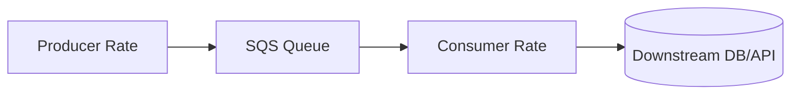
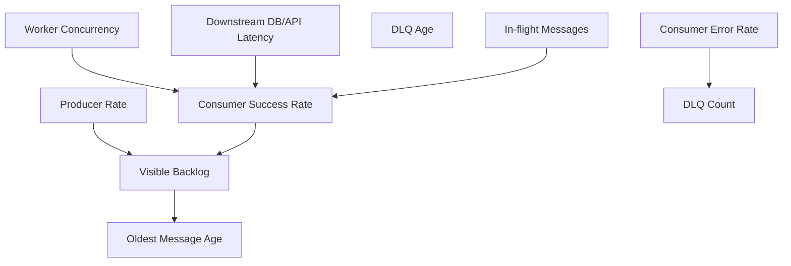
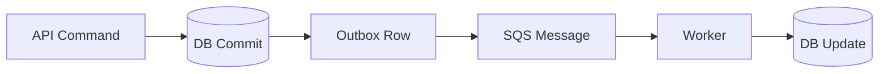

# Part 032 — SQS Operability Playbook

> Target pembelajaran: mampu mengoperasikan SQS queue di production dengan dashboard, alarm, runbook, autoscaling signal, replay discipline, dan failure diagnosis yang tidak sekadar melihat “ada message di queue”.

Queue adalah alat paling jujur di distributed system.

Jika consumer lambat, queue akan menunjukkan backlog.
Jika downstream database sakit, queue age akan naik.
Jika poison message muncul, DLQ akan tumbuh.
Jika retry policy salah, receive count akan meledak.
Jika autoscaling terlalu agresif, database akan ikut tumbang.

Operability SQS bukan sekadar membuat queue dan DLQ. Operability berarti tim bisa menjawab:

- apakah sistem tertinggal?
- sejak kapan tertinggal?
- message mana yang stuck?
- consumer mana yang gagal?
- downstream mana yang membatasi throughput?
- apakah aman menambah worker?
- apakah aman redrive DLQ?
- apakah duplicate processing sedang terjadi?
- apakah backlog ini normal burst atau incident?

---

## 1. Mental Model: Queue sebagai Pressure Gauge

SQS berada di antara producer dan consumer.



Backlog berubah berdasarkan selisih rate:

```txt
backlog_change_per_second = producer_rate - successful_consumer_rate
```

Jika producer mengirim 1.000 msg/s dan consumer berhasil menyelesaikan 800 msg/s, backlog naik 200 msg/s.

Jika producer berhenti tetapi backlog tetap tidak turun, consumer/downstream bermasalah.

Jika backlog turun tetapi DLQ naik, consumer bekerja tetapi banyak message gagal permanen.

Jika `messages not visible` tinggi tetapi `age oldest` tetap naik, worker mengambil message tetapi tidak menyelesaikannya tepat waktu.

---

## 2. Core CloudWatch Metrics SQS

Amazon SQS terintegrasi dengan CloudWatch dan menyediakan metric untuk queue. Banyak metric bersifat approximate karena distributed nature SQS, tetapi tetap sangat berguna untuk trend dan alarm.

Metric penting:

| Metric | Pertanyaan yang Dijawab |
|---|---|
| `ApproximateNumberOfMessagesVisible` | Berapa message siap diproses? |
| `ApproximateNumberOfMessagesNotVisible` | Berapa message sedang di-flight/diproses? |
| `ApproximateAgeOfOldestMessage` | Seberapa lama message tertua menunggu? |
| `NumberOfMessagesSent` | Producer rate berapa? |
| `NumberOfMessagesReceived` | Consumer receive rate berapa? |
| `NumberOfMessagesDeleted` | Successful completion rate berapa? |
| `NumberOfEmptyReceives` | Polling kosong berapa banyak? |
| `SentMessageSize` | Ukuran message normal/tidak? |

Untuk FIFO/fair queue ada metric tambahan terkait group/noisy group. Namun baseline operability tetap dimulai dari visible, not visible, age, sent, received, deleted, dan DLQ.

---

## 3. Queue Lag: Visible Backlog vs Age

Dua metric backlog yang paling sering dipakai:

1. `ApproximateNumberOfMessagesVisible`
2. `ApproximateAgeOfOldestMessage`

Keduanya menjawab hal berbeda.

### 3.1 Visible Message Count

Menjawab:

> “Berapa banyak pekerjaan yang belum diambil?”

Bagus untuk capacity planning.

Namun message count saja menyesatkan:

- 10.000 message bisa normal jika consumer memproses 5.000 msg/s;
- 100 message bisa incident jika SLA message 10 detik dan age sudah 1 jam;
- backlog tinggi saat scheduled batch bisa expected.

### 3.2 Age of Oldest Message

Menjawab:

> “Seberapa lama sistem tertinggal dari waktu masuk message?”

Ini biasanya lebih dekat ke user/business impact.

Jika SLA worker adalah “event harus diproses dalam 2 menit”, alarm sebaiknya berbasis age, bukan hanya count.

```txt
queue_delay_slo = ApproximateAgeOfOldestMessage <= 120 seconds
```

### 3.3 Kombinasi yang Benar

| Visible | Age | Interpretasi |
|---:|---:|---|
| rendah | rendah | normal |
| tinggi | rendah | burst baru masuk, consumer mungkin masih mengejar |
| tinggi | tinggi | backlog incident atau under-provisioned |
| rendah | tinggi | sedikit message stuck/poison/head-of-line |
| rendah | rendah tapi DLQ naik | failure permanen tertangani DLQ |

---

## 4. In-Flight Messages dan Visibility Timeout

`ApproximateNumberOfMessagesNotVisible` menunjukkan message yang sudah diterima consumer tetapi belum di-delete atau belum visibility timeout.

Jika not-visible tinggi:

- worker concurrency tinggi;
- processing lambat;
- visibility timeout terlalu panjang;
- worker crash tanpa delete message;
- downstream blocking;
- Lambda batch sedang berjalan lama.

Interpretasi penting:

```txt
in_flight ≈ active_processing + stuck_until_visibility_timeout
```

Jika not-visible mendekati limit in-flight, receive bisa terhambat. Untuk Standard queue, AWS mendokumentasikan approximate in-flight limit sekitar 120.000 message tergantung traffic dan backlog; saat short polling dapat muncul `OverLimit`, sedangkan long polling tidak mengembalikan message baru sampai in-flight turun.

Runbook:

1. Cek consumer error rate.
2. Cek processing duration p95/p99.
3. Cek DB/API downstream latency.
4. Cek visibility timeout vs actual duration.
5. Cek apakah worker delete message setelah commit.
6. Cek apakah Lambda timeout lebih pendek dari visibility timeout.
7. Cek apakah batch terlalu besar.

---

## 5. Sent, Received, Deleted: Throughput Triangle

Tiga metric ini harus dibaca sebagai satu sistem.

```txt
sent_rate      = NumberOfMessagesSent / window
received_rate  = NumberOfMessagesReceived / window
deleted_rate   = NumberOfMessagesDeleted / window
```

Interpretasi:

| Pola | Kemungkinan |
|---|---|
| sent > deleted | backlog naik |
| received >> deleted | banyak retry/failure/visibility timeout |
| deleted > sent | backlog sedang dikuras |
| received rendah, visible tinggi | consumer tidak polling/skala kurang/permission error |
| empty receives tinggi, visible rendah | normal idle atau polling terlalu agresif |

`NumberOfMessagesReceived` bukan success count. Message yang sama bisa diterima berkali-kali karena retry/visibility timeout.

Success rate lebih dekat ke `NumberOfMessagesDeleted`, tetapi delete juga bisa terjadi untuk duplicate yang di-skip. Karena itu aplikasi perlu custom metric:

- `message_processed_total`
- `message_duplicate_skipped_total`
- `message_failed_total`
- `message_permanent_failed_total`
- `message_business_rejected_total`

---

## 6. DLQ Metrics dan Meaning

DLQ bukan tempat sampah. DLQ adalah quarantine.

Untuk DLQ, pantau:

- visible message count;
- age of oldest DLQ message;
- incoming rate to DLQ;
- top error code;
- top event type;
- top tenant/domain;
- payload availability;
- redrive attempts;
- redrive success/failure.

DLQ growth berarti salah satu:

- bug consumer;
- schema incompatible;
- downstream permanent rejection;
- missing payload;
- permission issue;
- poison message;
- data quality problem;
- maxReceiveCount terlalu rendah;
- visibility timeout terlalu pendek sehingga message retry terlalu cepat;
- consumer non-idempotent dan gagal setelah partial side effect.

Runbook DLQ:

```txt
1. Stop automatic redrive.
2. Sample messages by error code/event type.
3. Identify whether failure is transient, permanent, or data-specific.
4. Confirm whether side effects may already have happened.
5. Fix code/config/data.
6. Redrive small batch.
7. Watch source queue age, DLQ count, downstream load, duplicate metric.
8. Continue gradual redrive.
```

Jangan jadikan redrive sebagai refleks. Redrive tanpa diagnosis adalah memperbanyak incident.

---

## 7. Dashboard Minimum

Satu queue production minimal punya dashboard ini:



Panels:

1. **Queue Health**
   - visible messages;
   - not visible messages;
   - age oldest;
   - delayed messages if used.

2. **Producer Rate**
   - messages sent;
   - message size;
   - publish error rate.

3. **Consumer Rate**
   - messages received;
   - messages deleted;
   - custom processed count;
   - duplicate skipped.

4. **Failure**
   - consumer exceptions by type;
   - DLQ visible count;
   - DLQ age;
   - max receive count distribution.

5. **Downstream**
   - database connections;
   - DB CPU/I/O/lock waits;
   - API latency;
   - throttling;
   - circuit breaker state.

6. **Autoscaling**
   - worker desired/running count;
   - Lambda concurrent executions;
   - ECS task count;
   - scaling events.

Dashboard tanpa downstream metric hanya menunjukkan gejala, bukan penyebab.

---

## 8. Alarm Design

Alarm buruk:

```txt
ApproximateNumberOfMessagesVisible > 0
```

Ini akan noise. Queue boleh punya message.

Alarm lebih baik:

| Alarm | Example Condition | Severity |
|---|---|---|
| Queue delay SLO breach | age oldest > 5 min for 10 min | page/warn depending workload |
| DLQ non-empty | DLQ visible > 0 for 5 min | page for critical, ticket for async |
| DLQ growth rate | DLQ count increases > N/min | page |
| Consumer failure rate | failures / processed > 1% | page/warn |
| In-flight saturation | not-visible near safe threshold | page |
| Backlog not draining | visible high and deleted rate low | page |
| Replay storm | received >> deleted and duplicates high | page |
| Payload missing | missing payload > 0 | page for critical data |

Alarm harus mempertimbangkan:

- business SLA;
- expected batch windows;
- downstream maintenance windows;
- queue type;
- consumer capacity;
- message retention;
- DLQ triage SLA.

Untuk critical command queue, `age oldest` adalah alarm utama. Untuk batch analytics queue, backlog count mungkin lebih relevan.

---

## 9. Autoscaling Signal

Autoscaling consumer harus menjaga queue delay tanpa menghancurkan downstream.

Bad scaling:

```txt
if visible messages high -> add many workers immediately
```

Masalah:

- database connection storm;
- hot partition DynamoDB;
- external API throttling;
- lock contention;
- cache stampede;
- DLQ growth makin cepat.

Better scaling signal:

```txt
desired_workers = min(
  max_workers_allowed_by_downstream,
  ceil(visible_messages / messages_per_worker_target),
  ceil(required_drain_rate / per_worker_success_rate)
)
```

Pertimbangkan:

- p95 processing duration;
- successful delete rate;
- DB CPU/connections;
- DynamoDB throttling;
- API rate limits;
- max in-flight;
- FIFO message group parallelism;
- visibility timeout.

Untuk ECS worker, backlog per task sering dipakai:

```txt
backlog_per_task = ApproximateNumberOfMessagesVisible / RunningTaskCount
```

Untuk Lambda event source mapping, kontrol concurrency melalui reserved concurrency, maximum concurrency per event source mapping, batch size, dan batch window.

Scaling invariant:

> Consumer scale tidak boleh melebihi kapasitas downstream yang dibutuhkan untuk menyelesaikan message dengan sukses.

---

## 10. Backpressure Playbook

Queue memberi backpressure temporal. Namun queue tidak otomatis melindungi database jika consumer scale salah.

Backpressure strategy:

1. **Bound consumer concurrency**
   - limit worker threads;
   - limit Lambda concurrency;
   - limit ECS tasks;
   - limit DB connection pool.

2. **Fail fast on downstream saturation**
   - circuit breaker;
   - retry later by not deleting message;
   - avoid holding message too long if impossible to proceed.

3. **Use visibility timeout deliberately**
   - long enough for normal processing;
   - not so long that failures disappear for hours;
   - extend only for known long-running work.

4. **Separate queues by workload class**
   - short vs long jobs;
   - high priority vs low priority;
   - tenant/noisy group isolation;
   - database-heavy vs external-API-heavy.

5. **Throttle producer if needed**
   - not every queue should absorb infinite backlog;
   - some business flows should reject/slow producer before SLA is impossible.

---

## 11. Poison Message Diagnosis

Poison message adalah message yang gagal berulang karena karakteristik dirinya, bukan karena transient system failure.

Tanda:

- receive count tinggi untuk message tertentu;
- DLQ berisi event type/data pattern sama;
- consumer error deterministic;
- replay batch kecil tetap gagal;
- downstream sehat tapi message gagal.

Kategori poison:

| Category | Contoh | Handling |
|---|---|---|
| Schema poison | field required hilang | compatibility fix / transform |
| Data poison | invalid state transition | reject with domain reason |
| Payload poison | S3 payload missing/checksum mismatch | repair/recreate payload |
| Permission poison | consumer no access to prefix | IAM/config fix |
| Code poison | bug parsing value tertentu | deploy fix |
| External poison | third-party rejects permanently | mark failed, manual workflow |

Message poisoning harus menghasilkan structured error:

```json
{
  "errorCode": "SchemaIncompatible",
  "eventType": "CaseEscalated",
  "eventVersion": 3,
  "messageId": "...",
  "idempotencyKey": "...",
  "receiveCount": 5,
  "tenantId": "tenant-123"
}
```

Tanpa error classification, DLQ hanya menjadi gudang JSON.

---

## 12. FIFO-Specific Operability

FIFO queue punya problem khusus: head-of-line blocking per `MessageGroupId`.

Jika satu message dalam group gagal, message berikutnya di group tersebut tidak akan diproses sampai message gagal selesai, timeout, atau masuk DLQ.

Dashboard FIFO perlu menambah:

- distribution of message group IDs;
- hot group rate;
- oldest age per logical group jika aplikasi punya metric;
- DLQ by message group;
- duplicate deduplication key conflicts;
- sequence number tracing.

High-throughput FIFO membutuhkan distribusi message group yang baik. Jika semua message memakai satu `MessageGroupId`, FIFO queue efektif menjadi single-lane.

Anti-pattern:

```txt
MessageGroupId = "global"
```

Lebih baik:

```txt
MessageGroupId = tenantId
MessageGroupId = accountId
MessageGroupId = aggregateId
MessageGroupId = hash(domainId) % N
```

Pilihan tergantung ordering invariant.

Jika ordering hanya perlu per aggregate, jangan pakai tenant-wide group karena satu aggregate bermasalah bisa menahan semua tenant.

---

## 13. Replay dan Redrive Playbook

Redrive adalah operasi production change. Perlakukan seperti migration kecil.

### 13.1 Pre-Redrive Checklist

- [ ] Root cause sudah dipahami.
- [ ] Fix sudah deployed.
- [ ] Message sample sudah diuji manual.
- [ ] Idempotency table tersedia.
- [ ] Downstream capacity cukup.
- [ ] Payload S3 masih tersedia jika pakai pointer.
- [ ] Redrive rate dibatasi.
- [ ] Dashboard dibuka.
- [ ] Rollback/stop plan jelas.

### 13.2 Redrive Batch Strategy

```txt
batch 1: 10 messages
batch 2: 100 messages
batch 3: 1,000 messages
batch 4: controlled continuous redrive
```

Setiap step cek:

- source queue age;
- DLQ count;
- consumer error;
- duplicate skipped;
- DB CPU/connections;
- API throttling;
- S3 4xx/5xx;
- business invariant.

### 13.3 Stop Conditions

Stop redrive jika:

- DLQ kembali naik dengan error sama;
- duplicate side effect muncul;
- DB load melewati threshold;
- age source queue naik tidak terkendali;
- missing payload muncul;
- consumer deploy rollback;
- downstream dependency degraded.

---

## 14. Message Retention and Incident Clock

SQS message retention menentukan seberapa lama message dapat bertahan di queue. DLQ retention menentukan seberapa lama failure bisa ditangani sebelum hilang.

Operability rule:

> Retention harus lebih panjang dari waktu maksimum tim butuh untuk mendeteksi, mendiagnosis, memperbaiki, dan me-redrive.

Jika queue critical tetapi DLQ retention hanya 1 hari, incident weekend bisa menyebabkan data hilang sebelum tim melihat.

Checklist retention:

- source queue retention sesuai expected backlog/recovery;
- DLQ retention lebih panjang dari source queue jika debugging lama;
- S3 payload retention selaras dengan DLQ/replay;
- database audit state tidak hilang sebelum reconciliation;
- alarms aktif sebelum retention mendekati habis.

Alarm tambahan:

```txt
DLQ oldest age > 50% of DLQ retention
DLQ oldest age > 80% of DLQ retention
```

Ini mengubah DLQ dari “nanti dilihat” menjadi accountable queue.

---

## 15. Runbook: Queue Age Naik

Gejala:

```txt
ApproximateAgeOfOldestMessage increasing
ApproximateNumberOfMessagesVisible increasing or stable high
```

Diagnosis:

1. Apakah producer rate naik?
   - cek `NumberOfMessagesSent`.
2. Apakah consumer receive rate turun?
   - cek `NumberOfMessagesReceived`.
3. Apakah success/delete rate turun?
   - cek `NumberOfMessagesDeleted` dan custom processed metric.
4. Apakah consumer error naik?
   - cek logs/errors.
5. Apakah downstream lambat?
   - cek DB/API latency.
6. Apakah autoscaling terjadi?
   - cek running workers/concurrency.
7. Apakah not-visible tinggi?
   - cek processing stuck/visibility.
8. Apakah DLQ naik?
   - cek poison/permanent failures.

Action:

- jika producer burst normal: scale within downstream limit;
- jika consumer down: rollback/fix/deploy;
- jika downstream bottleneck: throttle consumer, not producer blindly;
- jika poison: isolate/DLQ/fix;
- jika FIFO hot group: inspect group distribution;
- jika long job: separate queue or adjust visibility.

---

## 16. Runbook: DLQ Tiba-Tiba Naik

Gejala:

```txt
DLQ visible count increasing
source queue error rate increasing
```

Diagnosis:

1. Ambil sample message.
2. Group by `eventType`, `eventVersion`, `tenantId`, `errorCode`.
3. Cek deploy terbaru.
4. Cek schema change terbaru.
5. Cek permission/IAM change.
6. Cek downstream contract change.
7. Cek payload pointer availability.
8. Cek receive count dan first failure time.

Action:

- stop auto-redrive;
- rollback jika code regression jelas;
- add compatibility transform jika schema drift;
- fix IAM/config jika access denied;
- quarantine tenant-specific data jika noisy tenant;
- redrive bertahap setelah fix.

---

## 17. Runbook: Received Tinggi, Deleted Rendah

Gejala:

```txt
NumberOfMessagesReceived high
NumberOfMessagesDeleted low
ApproximateNumberOfMessagesNotVisible oscillating
```

Makna:

- worker mengambil message tetapi tidak menyelesaikan;
- message retry berkali-kali;
- visibility timeout habis sebelum delete;
- consumer crash setelah receive;
- delete permission/logic error;
- batch partial failure tidak di-handle.

Action:

1. Cek exception sebelum `DeleteMessage`.
2. Cek Lambda timeout vs visibility timeout.
3. Cek processing duration p99.
4. Cek apakah batch gagal total karena satu item poison.
5. Aktifkan partial batch response jika Lambda + SQS.
6. Tambah idempotency agar retry aman.
7. Perbaiki visibility timeout atau pecah workload long-running.

---

## 18. Runbook: Empty Receives Tinggi

`NumberOfEmptyReceives` tinggi bisa normal atau waste.

Normal jika:

- queue mostly idle;
- low latency polling sengaja;
- long polling belum dikonfigurasi optimal.

Masalah jika:

- cost/API call tinggi;
- banyak worker idle;
- autoscaling tidak turun;
- receive wait time terlalu pendek.

Action:

- gunakan long polling;
- set `WaitTimeSeconds` sampai 20 detik jika cocok;
- scale down idle workers;
- gunakan batch receive;
- hindari tight polling loop.

---

## 19. Application-Level Metrics yang Wajib

CloudWatch SQS metric tidak cukup. Tambahkan metric aplikasi.

### 19.1 Consumer Metrics

```txt
sqs_consumer_message_started_total{queue,eventType}
sqs_consumer_message_completed_total{queue,eventType}
sqs_consumer_message_failed_total{queue,eventType,errorCode}
sqs_consumer_message_duplicate_skipped_total{queue,eventType}
sqs_consumer_processing_duration_ms{queue,eventType}
sqs_consumer_db_transaction_duration_ms{queue,eventType}
sqs_consumer_external_call_duration_ms{queue,dependency}
```

### 19.2 Idempotency Metrics

```txt
idempotency_started_total
idempotency_already_completed_total
idempotency_in_progress_conflict_total
idempotency_expired_total
```

### 19.3 DLQ Classification Metrics

```txt
dlq_message_classified_total{queue,errorCode,eventType}
dlq_redrive_started_total{queue}
dlq_redrive_completed_total{queue}
dlq_redrive_failed_total{queue,errorCode}
```

### 19.4 Large Message Metrics

```txt
payload_fetch_latency_ms
payload_missing_total
payload_checksum_mismatch_total
payload_bytes_processed_total
```

Without custom metrics, team hanya melihat queue symptom tanpa tahu business outcome.

---

## 20. Log Fields Standard

Setiap consumer log harus menyertakan:

```json
{
  "queue": "case-events-worker",
  "messageId": "sqs-message-id",
  "eventId": "domain-event-id",
  "eventType": "CaseCreated",
  "eventVersion": 1,
  "tenantId": "tenant-123",
  "aggregateId": "case-456",
  "correlationId": "corr-abc",
  "idempotencyKey": "case-created:case-456:v1",
  "receiveCount": 3,
  "messageGroupId": "case-456",
  "attemptResult": "failed",
  "errorCode": "DatabaseTimeout"
}
```

Jangan expose:

- raw PII;
- raw payload besar;
- credentials;
- presigned URL;
- full object key jika mengandung sensitive data.

Gunakan stable IDs supaya log, DB inbox, DLQ, dan trace bisa dikorelasikan.

---

## 21. Trace Boundary

Trace untuk SQS tidak sama dengan synchronous HTTP trace.

SQS memutus call stack temporal. Karena itu perlu propagasi context eksplisit:

- `correlationId`;
- `traceparent` jika memakai W3C trace context;
- `causationId`;
- `producerService`;
- `eventId`;
- `idempotencyKey`.

Model causal chain:



Trace harus bisa menjawab:

> “Message ini diproduksi oleh command apa, dari request mana, lalu side effect apa yang dihasilkan?”

---

## 22. Capacity Planning

Hitung dari target drain time.

Misal:

```txt
burst = 1,000,000 messages
SLA drain = 30 minutes = 1,800 seconds
required_success_rate = 1,000,000 / 1,800 ≈ 556 msg/s
per_worker_success_rate = 20 msg/s
required_workers = ceil(556 / 20) = 28 workers
```

Lalu cek downstream:

```txt
db_writes_per_message = 2
required_db_writes = 556 * 2 = 1,112 writes/s
```

Jika DB hanya aman 500 writes/s, target drain 30 menit tidak realistis. Pilih:

- naikkan kapasitas DB;
- optimasi worker batch;
- ubah SLA;
- split queue;
- delay producer;
- gunakan projection async lebih lambat.

Queue tidak menghapus bottleneck. Queue hanya membuat bottleneck terlihat dan memberi waktu.

---

## 23. Deployment Safety untuk Consumer

Consumer deploy harus memperhatikan message yang sudah ada.

Checklist:

- backward compatible dengan old message version;
- idempotency schema tidak breaking;
- batch failure behavior diuji;
- visibility timeout cukup untuk versi baru;
- DLQ alarm aktif;
- canary consumer jika memungkinkan;
- rollback tidak merusak message yang sudah diproses sebagian;
- database migration expand-migrate-contract jika consumer butuh column baru;
- event schema versioning jelas.

Deployment anti-pattern:

- deploy producer schema v2 dan consumer v1 tanpa compatibility;
- rename field wajib dalam message;
- mengubah idempotency key format tanpa migration;
- menaikkan concurrency bersamaan dengan deploy risky code;
- redrive DLQ bersamaan dengan deploy baru.

---

## 24. Multi-Queue Operating Model

Production system jarang punya satu queue. Biasanya ada banyak queue:

- command worker queue;
- projection queue;
- notification queue;
- audit queue;
- search indexing queue;
- long-running job queue;
- retry/delay queue;
- DLQ per queue.

Standardisasi naming:

```txt
{env}-{domain}-{workload}-queue
{env}-{domain}-{workload}-dlq
```

Contoh:

```txt
prod-case-sla-evaluation-queue
prod-case-sla-evaluation-dlq
prod-case-search-projection-queue
prod-case-search-projection-dlq
```

Standardisasi tags:

```txt
service=case-management
owner=case-platform
criticality=high
data-classification=confidential
runbook=https://...
slo=age<=120s
```

Setiap queue harus punya owner. Queue tanpa owner akan menjadi silent data-loss risk.

---

## 25. Production Readiness Checklist

Queue siap production jika:

- [ ] Source queue dan DLQ dibuat berpasangan.
- [ ] `maxReceiveCount` dipilih berdasarkan retry model, bukan default asal.
- [ ] Visibility timeout > p99 normal processing + buffer.
- [ ] Lambda timeout lebih pendek dari visibility timeout jika Lambda consumer.
- [ ] Consumer idempotent.
- [ ] Partial batch failure aktif jika batch consumer dan relevan.
- [ ] Dashboard ada untuk visible, not visible, age, sent, received, deleted, DLQ.
- [ ] Alarm age-based dan DLQ-based aktif.
- [ ] Runbook queue age, DLQ, replay, poison message tersedia.
- [ ] Autoscaling dibatasi downstream capacity.
- [ ] Message schema versioned.
- [ ] Logs punya correlation ID dan idempotency key.
- [ ] Replay/redrive pernah diuji di non-prod.
- [ ] Retention source/DLQ/payload selaras.
- [ ] IAM least privilege.
- [ ] Cost dan API call volume dipahami.

---

## 26. Incident Drill

Latihan internal:

1. Inject 1.000 valid messages.
2. Matikan consumer 10 menit.
3. Pastikan age alarm menyala.
4. Nyalakan consumer.
5. Pastikan backlog drain sesuai ekspektasi.
6. Inject 10 poison messages.
7. Pastikan masuk DLQ setelah `maxReceiveCount`.
8. Deploy fix.
9. Redrive 10 messages.
10. Pastikan idempotency mencegah duplicate side effect.
11. Cek dashboard dan logs.
12. Update runbook berdasarkan friction nyata.

Production readiness tidak valid sampai tim pernah melakukan drill.

---

## 27. Ringkasan

SQS operability adalah tentang membaca queue sebagai sistem tekanan:

- producer rate;
- consumer success rate;
- backlog;
- age;
- in-flight;
- DLQ;
- downstream capacity;
- idempotency;
- replay safety.

Metric paling penting biasanya bukan “berapa message di queue”, tetapi:

> “Berapa lama message tertua menunggu, apakah consumer berhasil menyelesaikan pekerjaan, dan apakah failure masuk quarantine yang bisa ditindaklanjuti?”

SQS membuat distributed system lebih resilient hanya jika operability-nya matang. Tanpa dashboard, alarm, DLQ discipline, idempotency, dan replay playbook, queue hanya menunda kegagalan sampai lebih sulit dilacak.

---

## Referensi

- Amazon SQS CloudWatch metrics — https://docs.aws.amazon.com/AWSSimpleQueueService/latest/SQSDeveloperGuide/sqs-available-cloudwatch-metrics.html
- Monitoring Amazon SQS queues using CloudWatch — https://docs.aws.amazon.com/AWSSimpleQueueService/latest/SQSDeveloperGuide/monitoring-using-cloudwatch.html
- Creating CloudWatch alarms for Amazon SQS metrics — https://docs.aws.amazon.com/AWSSimpleQueueService/latest/SQSDeveloperGuide/set-cloudwatch-alarms-for-metrics.html
- Amazon SQS visibility timeout — https://docs.aws.amazon.com/AWSSimpleQueueService/latest/SQSDeveloperGuide/sqs-visibility-timeout.html
- Using dead-letter queues in Amazon SQS — https://docs.aws.amazon.com/AWSSimpleQueueService/latest/SQSDeveloperGuide/sqs-dead-letter-queues.html
- Configuring dead-letter queue redrive — https://docs.aws.amazon.com/AWSSimpleQueueService/latest/SQSDeveloperGuide/sqs-configure-dead-letter-queue-redrive.html
- High throughput for FIFO queues in Amazon SQS — https://docs.aws.amazon.com/AWSSimpleQueueService/latest/SQSDeveloperGuide/high-throughput-fifo.html
- Amazon SQS queue types — https://docs.aws.amazon.com/AWSSimpleQueueService/latest/SQSDeveloperGuide/sqs-queue-types.html
