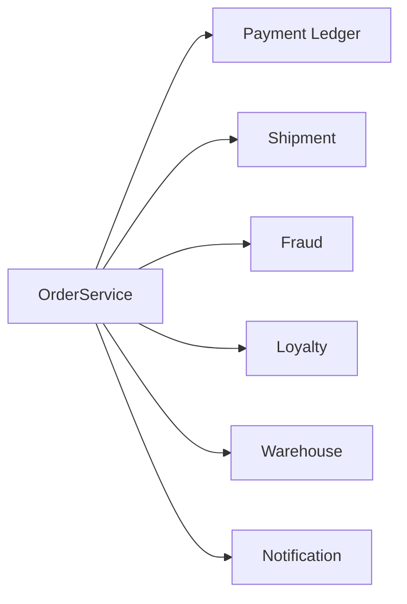
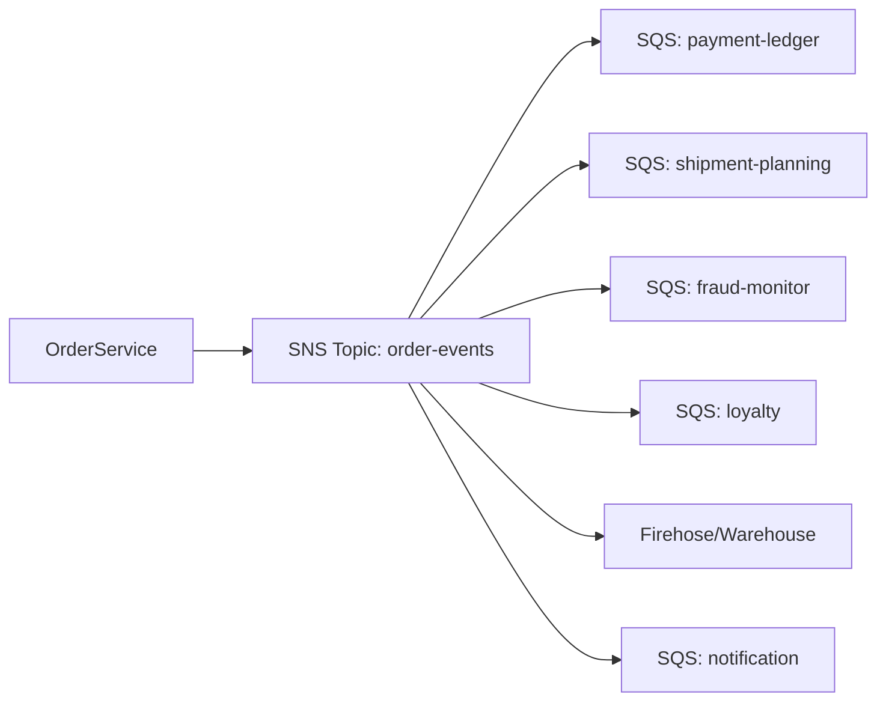
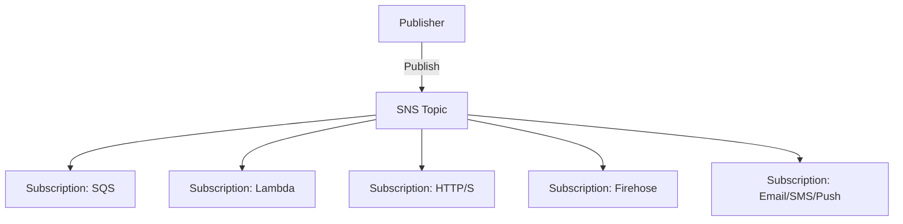
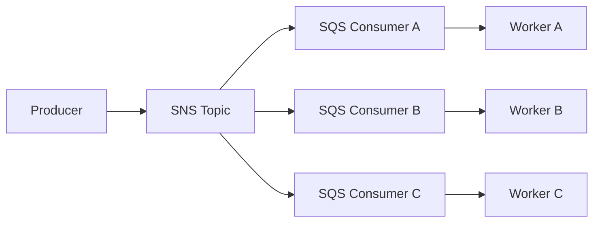
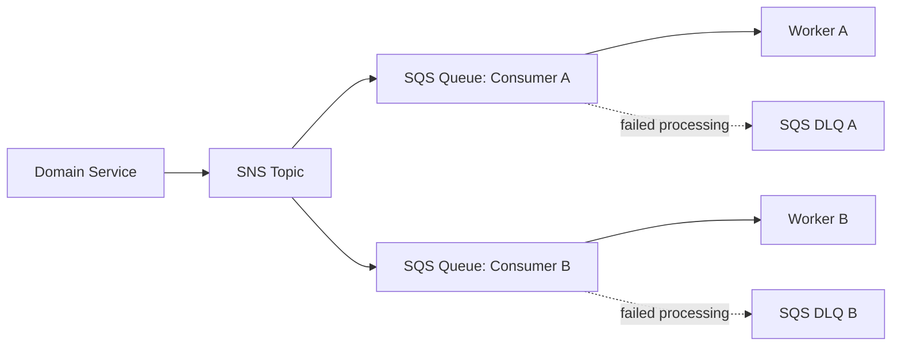
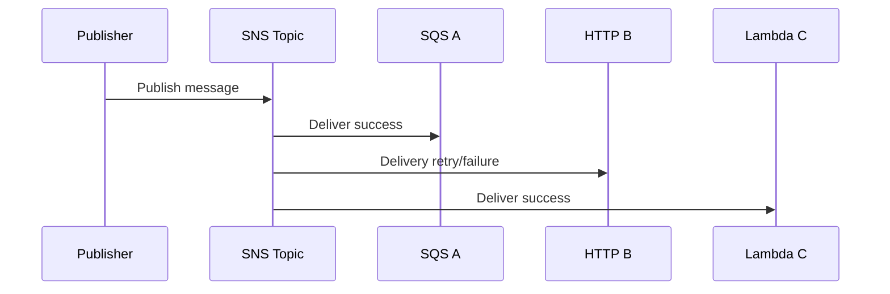
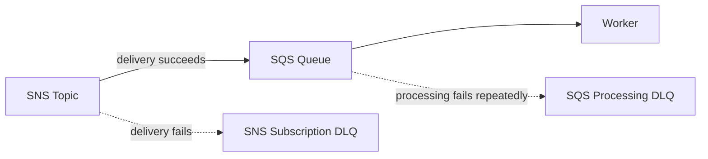
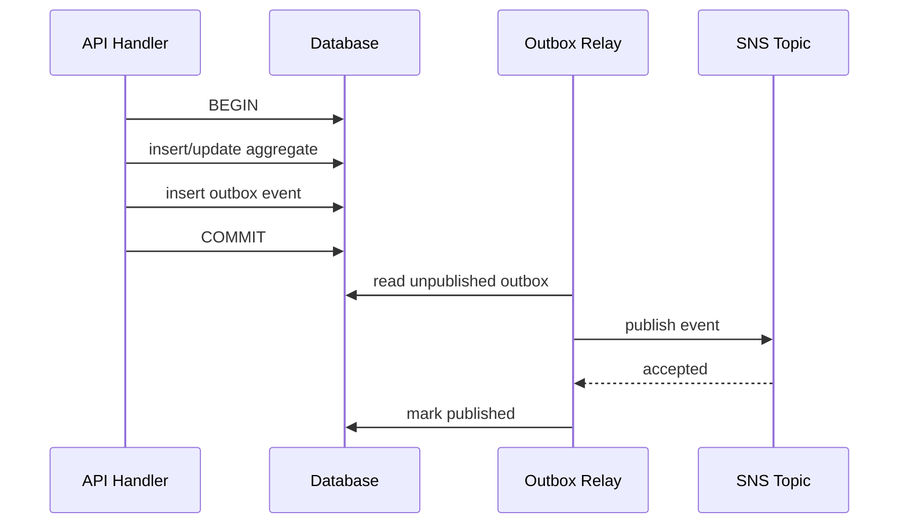
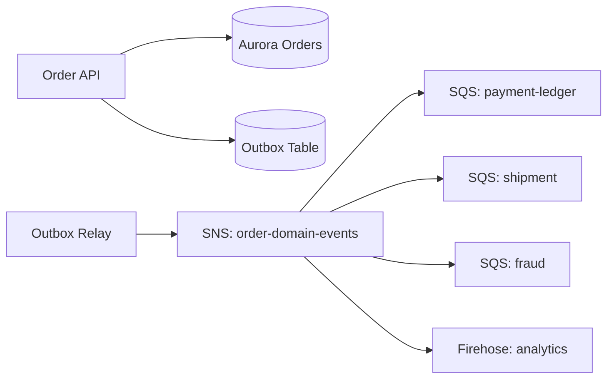
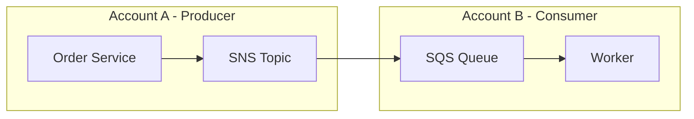

# Part 033 — SNS Pub/Sub Mental Model

> Target pembelajaran: mampu memakai Amazon SNS bukan sebagai “broadcast utility”, tetapi sebagai fanout boundary yang eksplisit, observable, idempotent, dan aman untuk production.

SNS terlihat sederhana: publish message ke topic, lalu subscriber menerima message.

Namun di production, SNS bukan sekadar “kirim notifikasi”. SNS adalah **fanout router**. Ia memisahkan producer dari banyak consumer, membuat setiap consumer bisa punya delivery path sendiri, dan mengurangi kebutuhan producer mengetahui siapa saja yang harus bereaksi terhadap sebuah kejadian.

Mental model yang benar:

```txt
producer does not call consumers
producer publishes a fact/notification to a topic
subscriptions decide delivery paths
consumers own their own processing queue/failure/retry policy
```

Jika SQS adalah buffer per consumer, SNS adalah **broadcast/fanout plane**.

---

## 1. Masalah yang Diselesaikan SNS

Bayangkan service `OrderService` harus memberi tahu:

- payment ledger;
- shipment planning;
- fraud monitor;
- loyalty program;
- data warehouse ingestion;
- customer notification;
- audit archive.

Anti-pattern awal biasanya seperti ini:



Masalahnya:

- `OrderService` tahu terlalu banyak consumer;
- deployment consumer baru butuh perubahan producer;
- failure consumer bisa bocor ke producer;
- retry policy tercampur;
- observability fanout tersebar;
- ownership data/event tidak jelas;
- coupling temporal meningkat.

Dengan SNS:



`OrderService` hanya tahu:

> “Saya menerbitkan event ke `order-events`.”

Setiap consumer mengatur:

- apakah ingin subscribe;
- apakah butuh queue;
- apakah perlu filter;
- retry dan DLQ sendiri;
- idempotency sendiri;
- scaling worker sendiri;
- runbook sendiri.

---

## 2. Definisi Praktis: Apa itu Topic?

SNS topic adalah **logical channel**.

Topic bukan table.
Topic bukan queue.
Topic bukan event store.
Topic bukan workflow engine.
Topic bukan guaranteed audit log.

Topic adalah tempat publisher menaruh message agar SNS mengirimkannya ke subscription yang cocok.



Yang harus didesain bukan hanya topic name, tetapi **meaning** topic tersebut.

Contoh topic yang lemah:

```txt
notifications
backend-events
events
service-bus
misc
```

Contoh topic yang lebih kuat:

```txt
order-domain-events
payment-domain-events
case-lifecycle-events
customer-notification-commands
regulatory-audit-notifications
```

Perbedaan utamanya: topic kuat punya boundary semantik.

---

## 3. SNS Bukan EventBridge

SNS dan EventBridge sama-sama bisa fanout, tetapi mental modelnya berbeda.

| Pertanyaan | SNS | EventBridge |
|---|---|---|
| Apa pusat modelnya? | Topic + subscription | Event bus + rules |
| Cocok untuk? | High-throughput fanout, pub/sub, direct subscriber delivery | Event routing, SaaS/AWS integration, schema-ish event bus, archive/replay |
| Consumer biasanya? | SQS, Lambda, HTTP/S, Firehose, mobile/email/SMS | AWS services, event targets, pipes, cross-account event bus |
| Filtering | Subscription filter policy | Event pattern rules |
| Ordering/dedup | FIFO topic + SQS FIFO | Tidak sama dengan SNS/SQS FIFO ordering model |
| Use case umum | “Publish once, deliver to many subscribers” | “Route event by pattern across systems/accounts/services” |

Rule praktis:

- pakai SNS ketika domain service ingin **fanout notifikasi** ke beberapa subscriber;
- pakai EventBridge ketika event perlu **routing bus**, rule-based integration, archive/replay, atau source dari AWS/SaaS;
- pakai SQS ketika hanya butuh **work queue** satu consumer group;
- pakai Step Functions ketika butuh **durable workflow orchestration**.

Jangan memaksa satu service menjadi semua hal.

---

## 4. SNS Bukan SQS

SQS menyimpan message sampai consumer mengambilnya.

SNS mengirim message ke subscription.

```txt
SQS = pull-based durable queue per consumer
SNS = push-based fanout to subscriptions
```

Dalam banyak arsitektur production, SNS tidak langsung mengirim ke worker. SNS mengirim ke SQS per consumer.



Ini memberi setiap consumer:

- durable buffer;
- independent scaling;
- DLQ sendiri;
- retry sendiri;
- backlog metric sendiri;
- isolation dari consumer lain.

Tanpa SQS, subscriber Lambda/HTTP bisa cocok untuk kasus tertentu, tetapi failure isolation biasanya lebih lemah.

---

## 5. The Core Fanout Invariant

Invariant SNS fanout yang harus dijaga:

> Satu publish dari producer tidak boleh memaksa producer mengetahui jumlah, urutan, performa, atau failure policy setiap consumer.

Kalau producer masih berisi kode seperti ini:

```java
if (orderCreated) {
    paymentClient.notify(order);
    shipmentClient.notify(order);
    fraudClient.notify(order);
    loyaltyClient.notify(order);
}
```

maka sistem belum benar-benar ter-decouple.

Dengan SNS:

```java
sns.publish(PublishRequest.builder()
    .topicArn(orderEventsTopicArn)
    .message(json(orderCreatedEvent))
    .messageAttributes(Map.of(
        "eventType", stringAttr("OrderCreated"),
        "tenantId", stringAttr(order.tenantId()),
        "schemaVersion", stringAttr("1")
    ))
    .build());
```

Producer hanya menerbitkan event/notification.

Consumer baru ditambahkan dengan subscription, bukan dengan mengubah producer.

---

## 6. Message: Body vs Attributes

SNS publish membawa dua jenis informasi penting:

1. **message body** — payload utama;
2. **message attributes** — metadata untuk filtering/routing/diagnostics.

Contoh body:

```json
{
  "eventId": "evt_01JZ_ORDER_CREATED_0001",
  "eventType": "OrderCreated",
  "schemaVersion": 1,
  "occurredAt": "2026-07-06T15:12:33Z",
  "producer": "order-service",
  "tenantId": "tenant-42",
  "data": {
    "orderId": "ord_123",
    "customerId": "cus_456",
    "currency": "USD",
    "totalAmount": 129.90
  }
}
```

Contoh attributes:

```json
{
  "eventType": {
    "DataType": "String",
    "StringValue": "OrderCreated"
  },
  "schemaVersion": {
    "DataType": "Number",
    "StringValue": "1"
  },
  "tenantId": {
    "DataType": "String",
    "StringValue": "tenant-42"
  },
  "domain": {
    "DataType": "String",
    "StringValue": "order"
  }
}
```

Prinsip:

- body dipakai consumer untuk memproses business fact;
- attributes dipakai SNS untuk filtering dan operator untuk observability;
- jangan taruh seluruh domain payload di attributes;
- jangan membuat consumer bergantung pada attribute yang tidak dikontrak;
- jangan memakai attribute untuk data rahasia.

---

## 7. Envelope Design

Untuk event domain, selalu gunakan envelope eksplisit.

```json
{
  "eventId": "evt_01JZ8WJX0Z7K7Q8RQYEXAMPLE",
  "eventType": "OrderConfirmed",
  "schemaVersion": 2,
  "source": "order-service",
  "occurredAt": "2026-07-06T12:00:00Z",
  "publishedAt": "2026-07-06T12:00:01Z",
  "traceId": "1-686b9d10-abcdef0123456789abcdef01",
  "correlationId": "cmd_01JZ8WJX0Z",
  "tenantId": "tenant-42",
  "subject": "order/ord_123",
  "data": {
    "orderId": "ord_123",
    "status": "CONFIRMED"
  }
}
```

Envelope menjawab:

| Field | Fungsi |
|---|---|
| `eventId` | idempotency/deduplication consumer |
| `eventType` | routing/filtering/handler dispatch |
| `schemaVersion` | compatibility dan migration |
| `source` | producer ownership |
| `occurredAt` | kapan fakta terjadi |
| `publishedAt` | kapan message dipublish |
| `traceId` | distributed tracing |
| `correlationId` | menghubungkan command ke event |
| `tenantId` | tenant isolation/filtering |
| `subject` | aggregate/resource identity |
| `data` | payload business |

Tanpa envelope, event cenderung berubah menjadi JSON bebas yang sulit dioperasikan.

---

## 8. Standard Topic vs FIFO Topic

SNS punya dua family penting:

- Standard topic;
- FIFO topic.

| Aspek | Standard Topic | FIFO Topic |
|---|---|---|
| Ordering | Tidak strict global ordering | Ordering per `MessageGroupId` |
| Deduplication | Tidak seperti FIFO dedup | Deduplication via `MessageDeduplicationId` atau content-based dedup |
| Subscriber utama | Banyak tipe endpoint | Terutama cocok dengan SQS FIFO untuk ordered fanout |
| Use case | Domain notification umum, high fanout | Workload yang butuh urutan dan dedup dalam group |
| Risiko | duplicate/out-of-order perlu ditangani consumer | head-of-line blocking per group |

Pakai FIFO topic hanya jika ordering benar-benar invariant bisnis.

Contoh invariant ordering valid:

```txt
Semua event untuk paymentId yang sama harus diproses berurutan.
```

Contoh invariant ordering palsu:

```txt
Agar lebih aman, semua order event harus ordered global.
```

Global ordering biasanya membunuh throughput dan membuat blast radius besar.

---

## 9. MessageGroupId adalah Boundary Ordering

Pada SNS FIFO, publisher wajib memilih `MessageGroupId`.

```java
sns.publish(PublishRequest.builder()
    .topicArn(orderEventsFifoTopicArn)
    .messageGroupId("order-" + orderId)
    .messageDeduplicationId(eventId)
    .message(json(event))
    .build());
```

Pilihan `MessageGroupId` menentukan concurrency.

| MessageGroupId | Dampak |
|---|---|
| `global` | semua message serial; throughput rendah; blast radius besar |
| `tenantId` | ordering per tenant; tenant besar bisa hot group |
| `orderId` | ordering per order; concurrency tinggi |
| `paymentId` | cocok untuk payment lifecycle |
| random UUID | ordering hilang secara praktis |

Rule:

> `MessageGroupId` harus sama dengan unit bisnis yang membutuhkan urutan.

Jangan pilih group ID berdasarkan kenyamanan teknis.

---

## 10. Deduplication Bukan Idempotency

SNS FIFO punya deduplication interval. Jika message dengan deduplication ID yang sama dipublish dalam interval tersebut, message kedua diterima oleh SNS tetapi tidak dikirim lagi ke subscriber.

Namun ini bukan pengganti idempotent consumer.

Mengapa?

- deduplication window terbatas;
- consumer bisa retry setelah window;
- DLQ redrive bisa terjadi jauh setelah publish awal;
- producer bisa publish event berbeda dengan dedup ID salah;
- subscriber bisa menerima duplicate dari layer lain;
- side effect external tetap harus dilindungi.

Consumer tetap perlu idempotency table/inbox.

```sql
CREATE TABLE processed_sns_messages (
    subscriber_name varchar(100) NOT NULL,
    event_id varchar(120) NOT NULL,
    processed_at timestamptz NOT NULL DEFAULT now(),
    PRIMARY KEY (subscriber_name, event_id)
);
```

---

## 11. SNS + SQS: Default Production Pattern

Untuk application-to-application messaging, pola paling stabil biasanya:



Mengapa ini kuat:

- topic mengelola fanout;
- queue mengelola durability per consumer;
- worker bisa scale independent;
- DLQ consumer A tidak memblok consumer B;
- backlog per consumer terlihat jelas;
- replay bisa dilakukan per consumer.

Anti-pattern:

```txt
SNS topic -> Lambda -> heavy DB write
```

Ini boleh untuk workload kecil, tetapi untuk heavy DB write biasanya SQS buffer lebih aman.

---

## 12. Delivery Semantics

SNS delivery harus diperlakukan sebagai **at-least-once from the application perspective**.

Artinya consumer harus siap menghadapi:

- duplicate notification;
- retry delivery;
- subscriber unavailable;
- target throttling;
- message delivered ke sebagian subscriber tetapi gagal ke subscriber lain;
- event dipublish ulang saat recovery;
- fanout dengan filter yang berubah.

Consumer yang benar:

```txt
receive message
parse envelope
validate schema version
try insert inbox(subscriber, eventId)
if already exists -> ack/delete message
execute side effect idempotently
mark processed / commit transaction
ack/delete message
```

Consumer yang salah:

```txt
receive message
call external payment API
insert processed record
ack
```

Jika external call sukses tetapi insert gagal, retry akan mengulang external call.

---

## 13. Subscription Failure Boundary

SNS mengirim message ke setiap subscription. Jika satu subscription gagal, subscription lain tetap bisa sukses.



Ini penting:

> Publish success tidak berarti semua subscriber berhasil memproses message secara bisnis.

Publish success biasanya berarti SNS menerima publish, bukan seluruh downstream processing selesai.

Karena itu untuk business-critical downstream:

- gunakan SQS subscription;
- monitor queue backlog;
- monitor DLQ;
- gunakan reconciliation;
- jangan membuat producer menunggu consumer selesai.

---

## 14. SNS DLQ vs SQS DLQ

Ada dua jenis DLQ yang sering tertukar:

| DLQ | Menangkap apa? | Contoh |
|---|---|---|
| SNS subscription DLQ | SNS gagal deliver ke endpoint | permission salah ke SQS, HTTP endpoint down |
| SQS source queue DLQ | Consumer gagal memproses message setelah diterima | JSON valid tetapi business rule error, DB conflict berulang |

Diagram:



Keduanya perlu dimonitor.

Jika subscription DLQ tumbuh, problem ada pada delivery dari SNS ke endpoint.
Jika SQS DLQ tumbuh, problem ada pada consumer processing.

---

## 15. Raw Message Delivery

Saat SNS mengirim ke SQS tanpa raw message delivery, SQS body berisi wrapper SNS:

```json
{
  "Type": "Notification",
  "MessageId": "...",
  "TopicArn": "...",
  "Message": "{\"eventId\":\"evt_123\"}",
  "Timestamp": "2026-07-06T12:00:00.000Z",
  "MessageAttributes": {
    "eventType": {
      "Type": "String",
      "Value": "OrderCreated"
    }
  }
}
```

Dengan raw message delivery, SQS body langsung payload asli:

```json
{
  "eventId": "evt_123",
  "eventType": "OrderCreated"
}
```

Trade-off:

| Mode | Kelebihan | Risiko |
|---|---|---|
| SNS envelope default | metadata SNS lengkap tersedia | consumer harus unwrap `Message` string |
| Raw message delivery | body lebih sederhana | metadata SNS hilang/berubah, attribute limit perlu diperhatikan |

Untuk sistem internal yang punya envelope sendiri, raw delivery sering membuat consumer lebih bersih. Namun pastikan metadata yang diperlukan sudah ada di body/envelope aplikasi.

---

## 16. Topic Design: Domain Topic vs Event-Type Topic

Dua pendekatan umum:

### 16.1 Topic per Domain

```txt
order-events
payment-events
case-lifecycle-events
```

Subscriber memakai filter untuk event type.

Kelebihan:

- jumlah topic lebih sedikit;
- subscriber bisa memilih beberapa event terkait domain;
- producer domain punya satu channel utama.

Risiko:

- topic terlalu lebar;
- filter policy menjadi governance penting;
- event contract harus disiplin.

### 16.2 Topic per Event Type

```txt
order-created
order-cancelled
order-shipped
```

Kelebihan:

- routing eksplisit;
- filter sederhana;
- ownership mudah terlihat.

Risiko:

- topic sprawl;
- subscription/IaC membesar;
- event evolution bisa tersebar.

Rekomendasi default:

```txt
Topic per bounded context/domain + filter by eventType
```

Kecuali ada alasan kuat seperti compliance isolation, throughput isolation, atau ownership berbeda.

---

## 17. Filter Policy adalah Routing Contract

SNS subscription filter policy membuat subscriber menerima subset message.

```json
{
  "eventType": ["OrderCreated", "OrderCancelled"],
  "tenantTier": ["enterprise"],
  "schemaVersion": [{"numeric": [">=", 2]}]
}
```

Filter bukan sekadar optimization. Filter adalah kontrak routing.

Jika producer menghapus attribute `tenantTier`, subscriber bisa berhenti menerima message.
Jika producer mengganti `OrderCreated` menjadi `ORDER_CREATED`, filter bisa gagal.
Jika version field berubah dari number ke string, numeric filter bisa gagal.

Karena itu filterable attributes harus dianggap bagian dari public contract.

Part berikutnya akan membahas message filtering lebih dalam.

---

## 18. Publisher Pattern dengan Transactional Outbox

Kesalahan umum:

```txt
write database
publish SNS
```

Jika database commit sukses tetapi publish gagal, event hilang.
Jika publish sukses tetapi database rollback, event palsu terkirim.

Gunakan outbox untuk state change penting.



Invariant:

> Jika state change committed, event publish harus bisa diretry sampai berhasil.

SNS publish harus memakai deterministic `eventId` dari outbox, bukan random ID baru tiap retry.

---

## 19. PublishBatch: Throughput vs Failure Granularity

SNS mendukung batch publish untuk mengurangi overhead.

Namun batch tidak berarti atomic all-or-nothing di level bisnis.

Saat memakai batch:

- setiap entry harus punya ID sendiri;
- setiap event harus punya `eventId` sendiri;
- partial failure harus diretry per failed entry;
- retry tidak boleh membuat duplicate side effect;
- metrics harus membedakan attempted vs accepted.

Pseudocode:

```java
for (List<OutboxEvent> batch : batches(events, 10)) {
    PublishBatchResponse response = sns.publishBatch(toRequest(batch));

    markSuccessful(response.successful());
    retryLater(response.failed());
}
```

Jangan mark seluruh batch published hanya karena API call tidak throw exception.

---

## 20. Consumer Contract

Subscriber tidak boleh mengasumsikan:

- hanya dirinya yang menerima event;
- event akan selalu tiba berurutan;
- event tidak akan duplicate;
- producer tidak akan menambah field;
- semua event akan relevan jika filter tidak ada;
- SNS publish success berarti domain process downstream selesai.

Consumer wajib:

- validate envelope;
- validate schema version;
- ignore unknown fields;
- handle duplicate `eventId`;
- expose processing lag;
- expose DLQ reason;
- punya replay plan;
- punya reconciliation query ke source of truth.

---

## 21. Example: Order Event Fanout



Subscription filter examples:

Payment ledger:

```json
{
  "eventType": ["OrderConfirmed", "OrderCancelled", "OrderRefunded"]
}
```

Shipment:

```json
{
  "eventType": ["OrderConfirmed"],
  "shippingRequired": ["true"]
}
```

Fraud:

```json
{
  "eventType": ["OrderCreated"],
  "riskTier": ["medium", "high"]
}
```

Analytics:

```json
{
  "domain": ["order"]
}
```

---

## 22. SNS for Commands: Hati-Hati

SNS bisa dipakai untuk “notification commands”, misalnya:

```txt
customer-notification-commands
```

Namun jangan mencampur domain event dan command dalam topic yang sama.

Perbedaan:

| Jenis Message | Makna |
|---|---|
| Event | Sesuatu sudah terjadi |
| Command | Seseorang/sistem meminta sesuatu dilakukan |

Event:

```json
{
  "eventType": "OrderConfirmed",
  "data": { "orderId": "ord_123" }
}
```

Command:

```json
{
  "commandType": "SendOrderConfirmationEmail",
  "data": { "orderId": "ord_123", "template": "order-confirmed-v2" }
}
```

Command butuh ownership yang lebih ketat:

- siapa target consumer utama;
- apakah fanout command valid;
- apa idempotency key;
- apa compensation jika gagal;
- apakah command harus queued, bukan pub/sub.

Default: gunakan SNS untuk event notification, bukan orchestration command, kecuali boundary-nya jelas.

---

## 23. Cross-Account Fanout

SNS bisa dipakai untuk cross-account integration, misalnya central domain event topic di account platform dan consumer queue di account tim lain.



Yang harus didesain:

- topic resource policy;
- SQS queue policy agar SNS topic boleh send message;
- KMS key policy jika encrypted;
- subscription ownership;
- monitoring dua account;
- incident ownership;
- schema governance.

Cross-account integration tanpa ownership jelas akan menjadi distributed blame system.

---

## 24. Security Boundary

Checklist keamanan SNS:

- batasi `sns:Publish` hanya ke producer yang sah;
- gunakan topic resource policy eksplisit untuk cross-account;
- gunakan encryption at rest jika payload sensitif;
- hindari PII/secrets di message attributes;
- gunakan VPC endpoints/PrivateLink jika diperlukan oleh posture jaringan;
- audit subscription changes;
- protect topic deletion;
- tag topic untuk ownership/cost/compliance;
- gunakan least privilege untuk outbox relay.

Security SNS bukan hanya IAM. Security juga mencakup payload governance:

```txt
Apakah event ini boleh diterima semua subscriber topic ini?
```

Jika tidak, topic boundary terlalu lebar atau payload harus dipisah.

---

## 25. Observability

Untuk SNS fanout, amati tiga layer:

### 25.1 Publisher Layer

- publish attempts;
- publish accepted;
- publish failed;
- publish latency;
- outbox unpublished count;
- oldest unpublished outbox age;
- event type distribution.

### 25.2 SNS Delivery Layer

- message published count;
- delivery success/failure per protocol;
- subscription DLQ count;
- throttling/error from endpoint;
- topic-level delivery logs jika diaktifkan.

### 25.3 Consumer Layer

- SQS visible backlog;
- SQS age oldest;
- not visible count;
- processing success/failure;
- idempotency duplicate count;
- consumer DLQ growth;
- downstream DB/API latency.

Dashboard yang hanya melihat “SNS NumberOfMessagesPublished” tidak cukup.

---

## 26. Failure Modes

| Failure | Gejala | Mitigasi |
|---|---|---|
| Publish gagal setelah DB commit | outbox unpublished naik | transactional outbox + relay retry |
| Message duplicate | consumer side effect double | inbox/idempotency key |
| Filter salah | subscriber tidak menerima event | contract test untuk filterable attributes |
| Subscriber SQS permission salah | subscription DLQ naik | queue policy/IAM test |
| Consumer lambat | SQS age naik | autoscaling/backpressure |
| Poison message | SQS DLQ naik | DLQ analysis + redrive controlled |
| Topic terlalu lebar | subscriber menerima data tak relevan/sensitif | split topic / payload minimization |
| FIFO hot group | throughput rendah satu group | redesign MessageGroupId |
| Raw delivery salah asumsi | consumer gagal parse | contract test raw/default envelope |
| Replay tidak aman | duplicate side effects | idempotency + replay runbook |

---

## 27. Anti-Patterns

### 27.1 Generic Topic Bus

```txt
events
all-events
backend-topic
```

Masalah: tidak ada semantic ownership.

### 27.2 Publish Langsung dari Transaction Sebelum Commit

Jika publish terjadi sebelum DB commit, consumer bisa melihat event untuk state yang belum committed atau akhirnya rollback.

### 27.3 Topic sebagai Database Change Feed Tanpa Contract

Mengirim raw database row change ke SNS membuat consumer tergantung schema internal database.

### 27.4 Filtering Berdasarkan Field yang Tidak Stabil

Filter attribute harus stabil. Jangan filter berdasarkan display label atau field yang bisa berubah karena product wording.

### 27.5 Lambda Subscriber Berat Tanpa Queue

SNS -> Lambda langsung cocok untuk ringan. Untuk heavy processing atau DB write, gunakan queue.

### 27.6 Menganggap FIFO Menghapus Kebutuhan Idempotency

FIFO mengurangi duplicate dalam scope tertentu, tetapi tidak menggantikan idempotent consumer.

---

## 28. Implementation Skeleton: Topic + SQS Subscription

CloudFormation-style skeleton:

```yaml
OrderEventsTopic:
  Type: AWS::SNS::Topic
  Properties:
    TopicName: order-domain-events

PaymentLedgerQueue:
  Type: AWS::SQS::Queue
  Properties:
    QueueName: payment-ledger-order-events
    RedrivePolicy:
      deadLetterTargetArn: !GetAtt PaymentLedgerDlq.Arn
      maxReceiveCount: 5

PaymentLedgerDlq:
  Type: AWS::SQS::Queue
  Properties:
    QueueName: payment-ledger-order-events-dlq

PaymentLedgerSubscription:
  Type: AWS::SNS::Subscription
  Properties:
    TopicArn: !Ref OrderEventsTopic
    Protocol: sqs
    Endpoint: !GetAtt PaymentLedgerQueue.Arn
    RawMessageDelivery: true
    FilterPolicyScope: MessageAttributes
    FilterPolicy:
      eventType:
        - OrderConfirmed
        - OrderCancelled
        - OrderRefunded
```

Queue policy harus mengizinkan SNS topic mengirim message ke queue.

```yaml
PaymentLedgerQueuePolicy:
  Type: AWS::SQS::QueuePolicy
  Properties:
    Queues:
      - !Ref PaymentLedgerQueue
    PolicyDocument:
      Version: '2012-10-17'
      Statement:
        - Effect: Allow
          Principal:
            Service: sns.amazonaws.com
          Action: sqs:SendMessage
          Resource: !GetAtt PaymentLedgerQueue.Arn
          Condition:
            ArnEquals:
              aws:SourceArn: !Ref OrderEventsTopic
```

---

## 29. Java Publisher Skeleton

```java
public final class SnsDomainEventPublisher {
    private final SnsClient sns;
    private final String topicArn;

    public void publish(DomainEvent event) {
        PublishRequest request = PublishRequest.builder()
            .topicArn(topicArn)
            .message(toJson(event))
            .messageAttributes(Map.of(
                "eventType", attr("String", event.eventType()),
                "domain", attr("String", event.domain()),
                "schemaVersion", attr("Number", String.valueOf(event.schemaVersion())),
                "tenantId", attr("String", event.tenantId())
            ))
            .build();

        sns.publish(request);
    }

    private static MessageAttributeValue attr(String type, String value) {
        return MessageAttributeValue.builder()
            .dataType(type)
            .stringValue(value)
            .build();
    }
}
```

Production publisher biasanya tidak dipanggil langsung dari command handler. Ia dipanggil oleh outbox relay.

---

## 30. Production Readiness Checklist

Sebuah SNS topic siap production jika:

- topic punya semantic owner;
- topic name mencerminkan domain/purpose;
- event envelope distandarkan;
- filterable attributes terdokumentasi;
- schema versioning jelas;
- producer memakai outbox untuk critical state changes;
- subscriber utama memakai SQS queue;
- setiap queue punya DLQ;
- subscription DLQ dipertimbangkan untuk endpoint rawan delivery failure;
- consumer idempotent berdasarkan `eventId`;
- raw/default message delivery dipilih eksplisit;
- CloudWatch metrics dan alarms ada;
- replay/redrive runbook ada;
- cross-account policy diuji;
- KMS/IAM/resource policy ditinjau;
- contract test mencakup filter policy;
- tidak ada PII/secrets yang bocor ke topic lebar.

---

## 31. Ringkasan Mental Model

SNS adalah fanout layer.

Ia paling kuat ketika digabung dengan:

- outbox di producer;
- SQS per consumer;
- filter policy sebagai routing contract;
- idempotent consumer;
- DLQ dan replay discipline;
- observability per layer.

Gunakan SNS ketika pertanyaannya:

> “Saya punya satu kejadian/notifikasi dan banyak subscriber yang mungkin perlu tahu.”

Jangan gunakan SNS ketika pertanyaannya:

> “Saya butuh satu worker mengambil satu job.”

Itu SQS.

Jangan gunakan SNS ketika pertanyaannya:

> “Saya butuh state machine durable dengan timeout dan compensation.”

Itu Step Functions.

Jangan gunakan SNS ketika pertanyaannya:

> “Saya butuh event bus dengan complex routing, SaaS/AWS source, archive, replay, dan rule governance.”

Itu sering lebih cocok EventBridge.

---

## 32. Referensi Resmi

- [What is Amazon SNS?](https://docs.aws.amazon.com/sns/latest/dg/welcome.html)
- [Fanout Amazon SNS notifications to Amazon SQS queues](https://docs.aws.amazon.com/sns/latest/dg/sns-sqs-as-subscriber.html)
- [Amazon SNS message filtering](https://docs.aws.amazon.com/sns/latest/dg/sns-message-filtering.html)
- [Amazon SNS dead-letter queues](https://docs.aws.amazon.com/sns/latest/dg/sns-dead-letter-queues.html)
- [Amazon SNS message delivery retries](https://docs.aws.amazon.com/sns/latest/dg/sns-message-delivery-retries.html)
- [Amazon SNS raw message delivery](https://docs.aws.amazon.com/sns/latest/dg/sns-large-payload-raw-message-delivery.html)
- [Amazon SNS FIFO topics](https://docs.aws.amazon.com/sns/latest/dg/sns-fifo-topics.html)
- [Amazon SNS message deduplication for FIFO topics](https://docs.aws.amazon.com/sns/latest/dg/fifo-message-dedup.html)
- [Amazon SNS message grouping for FIFO topics](https://docs.aws.amazon.com/sns/latest/dg/fifo-message-grouping.html)
