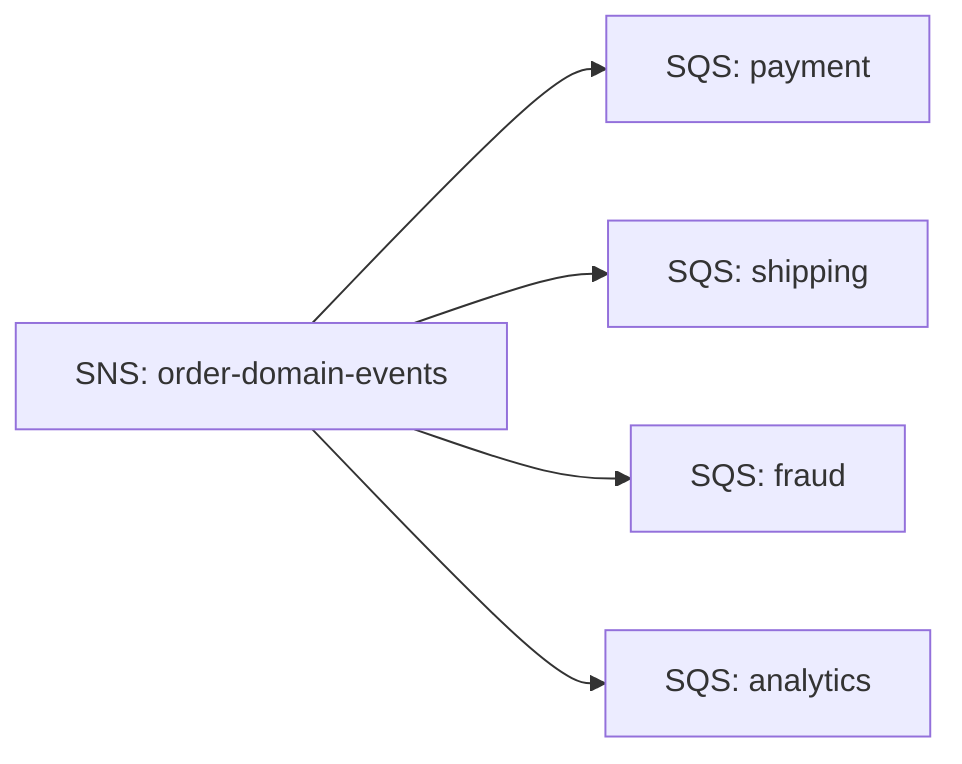

# Part 034 — SNS Message Filtering

> Target pembelajaran: mampu mendesain SNS subscription filter policy sebagai kontrak routing yang stabil, versioned, testable, dan aman untuk production.

Message filtering terlihat seperti fitur kecil.

Namun di event-driven system, filtering menentukan siapa menerima apa. Itu berarti filtering ikut menentukan:

- correctness;
- data exposure;
- consumer load;
- blast radius;
- compatibility;
- migration behavior;
- incident diagnosis.

Kalau filtering salah, sistem tidak selalu gagal keras. Lebih berbahaya: sistem bisa **diam-diam tidak mengirim event ke consumer yang seharusnya menerima**.

---

## 1. Masalah yang Diselesaikan Filtering

Tanpa filtering, setiap subscriber menerima semua message dari topic.



Jika topic berisi:

- `OrderCreated`
- `OrderConfirmed`
- `OrderCancelled`
- `OrderRefunded`
- `OrderAddressChanged`
- `OrderNoteAdded`

maka semua consumer harus melakukan filtering sendiri.

Consumer code menjadi seperti ini:

```java
switch (event.eventType()) {
    case "OrderConfirmed" -> process(event);
    case "OrderCancelled" -> process(event);
    default -> ignore(event);
}
```

Masalah:

- biaya delivery dan processing naik;
- semua consumer harus parse semua event;
- sensitive event bisa sampai ke consumer yang tidak perlu;
- consumer ignore logic tersebar;
- topic backlog consumer tidak mencerminkan relevansi;
- event baru bisa membebani consumer lama.

Dengan SNS filter policy:

```json
{
  "eventType": ["OrderConfirmed", "OrderCancelled"]
}
```

SNS hanya mengirim message yang cocok ke subscription tersebut.

---

## 2. Filtering adalah Routing Contract

Subscription filter policy bukan optimization internal.

Ia adalah kontrak antara:

- publisher yang menyediakan filterable fields;
- topic owner yang mendefinisikan semantic routing;
- subscriber yang menyatakan interest;
- platform/operator yang mengobservasi delivery.

Invariant:

> Field yang dipakai dalam filter policy tidak boleh berubah tanpa compatibility plan.

Jika subscription filter memakai:

```json
{
  "eventType": ["CaseEscalated"]
}
```

maka publisher tidak boleh tiba-tiba publish:

```json
{
  "event_type": "CASE_ESCALATED"
}
```

atau attribute:

```txt
eventName = case.escalated
```

kecuali semua subscription sudah dimigrasi.

---

## 3. Dua Scope Filtering: MessageAttributes dan MessageBody

SNS filtering bisa diterapkan pada:

1. message attributes;
2. message body.

### 3.1 MessageAttributes

Default scope adalah `MessageAttributes`.

Publisher mengirim metadata filterable sebagai attributes.

```json
{
  "eventType": {
    "DataType": "String",
    "StringValue": "OrderConfirmed"
  },
  "tenantTier": {
    "DataType": "String",
    "StringValue": "enterprise"
  },
  "amountUsd": {
    "DataType": "Number",
    "StringValue": "129.90"
  }
}
```

Filter:

```json
{
  "eventType": ["OrderConfirmed"],
  "tenantTier": ["enterprise"],
  "amountUsd": [{"numeric": [">=", 100]}]
}
```

Kelebihan:

- filter fields eksplisit;
- tidak perlu inspect payload body;
- cocok untuk stable routing metadata;
- memisahkan business payload dari routing metadata.

Kekurangan:

- publisher harus duplikasi metadata dari body jika juga dibutuhkan consumer;
- attributes harus dijaga type dan name-nya;
- raw message delivery punya constraint terkait attributes.

### 3.2 MessageBody

Filter policy juga bisa diterapkan ke body jika body adalah JSON object yang valid.

Body:

```json
{
  "eventType": "OrderConfirmed",
  "tenant": {
    "tier": "enterprise"
  },
  "amountUsd": 129.90
}
```

Filter scope:

```yaml
FilterPolicyScope: MessageBody
FilterPolicy:
  eventType:
    - OrderConfirmed
  tenant:
    tier:
      - enterprise
```

Kelebihan:

- tidak perlu duplikasi banyak fields sebagai attributes;
- bisa filter nested JSON body;
- cocok jika envelope sudah stabil.

Kekurangan:

- payload body menjadi routing contract;
- perubahan struktur nested body bisa memutus subscription;
- filter bisa terlalu dekat dengan internal event schema;
- lebih mudah bocor complexity business ke routing layer.

Default rekomendasi:

```txt
Gunakan MessageAttributes untuk routing metadata stabil.
Gunakan MessageBody filtering jika envelope/body memang sudah menjadi public routing contract dan nested filtering diperlukan.
```

---

## 4. Envelope + Attributes: Pola Paling Aman

Pola umum yang seimbang:

```json
{
  "eventId": "evt_01JZ9A",
  "eventType": "OrderConfirmed",
  "schemaVersion": 2,
  "source": "order-service",
  "tenantId": "tenant-42",
  "occurredAt": "2026-07-06T12:00:00Z",
  "data": {
    "orderId": "ord_123",
    "totalAmount": 129.90,
    "currency": "USD"
  }
}
```

Attributes:

```json
{
  "eventType": "OrderConfirmed",
  "schemaVersion": 2,
  "source": "order-service",
  "tenantId": "tenant-42",
  "tenantTier": "enterprise",
  "domain": "order"
}
```

Attributes berisi routing metadata stabil. Body berisi event contract penuh.

Jangan meletakkan seluruh `data` ke attributes.
Jangan membuat filter policy bergantung pada field volatile seperti `customerDisplayName`, `note`, atau `description`.

---

## 5. Basic Matching: Exact String

Filter:

```json
{
  "eventType": ["OrderConfirmed", "OrderCancelled"]
}
```

Makna:

```txt
match jika eventType == OrderConfirmed OR eventType == OrderCancelled
```

Pada satu property, beberapa values berarti OR.

Message cocok:

```json
{
  "eventType": "OrderConfirmed"
}
```

Message tidak cocok:

```json
{
  "eventType": "OrderCreated"
}
```

Gunakan exact matching untuk field enum stabil:

- `eventType`;
- `domain`;
- `tenantTier`;
- `regionGroup`;
- `schemaFamily`;
- `commandType` jika memang command topic.

---

## 6. AND Logic Antar Property

Filter:

```json
{
  "eventType": ["OrderConfirmed"],
  "tenantTier": ["enterprise"],
  "schemaVersion": [{"numeric": [">=", 2]}]
}
```

Makna:

```txt
eventType == OrderConfirmed
AND tenantTier == enterprise
AND schemaVersion >= 2
```

Beberapa property berbeda berarti AND.

Ini cocok untuk:

- event tertentu;
- tenant tertentu;
- versi schema tertentu;
- domain tertentu;
- region tertentu.

Jangan terlalu banyak AND jika tidak punya observability filter miss. Filter yang terlalu ketat sering menciptakan silent drop.

---

## 7. OR Logic dalam Property

Filter:

```json
{
  "eventType": ["OrderConfirmed", "OrderRefunded", "OrderCancelled"]
}
```

Makna:

```txt
eventType in {OrderConfirmed, OrderRefunded, OrderCancelled}
```

Ini cocok untuk consumer yang punya satu bounded responsibility, misalnya accounting ledger butuh semua event yang berdampak finansial.

---

## 8. Explicit `$or`

Untuk OR lintas attribute, SNS mendukung operator `$or` dengan struktur tertentu.

Contoh kebutuhan:

```txt
Terima event jika:
- eventType == OrderConfirmed AND tenantTier == enterprise
OR
- eventType == OrderRefunded AND riskTier == high
```

Filter:

```json
{
  "$or": [
    {
      "eventType": ["OrderConfirmed"],
      "tenantTier": ["enterprise"]
    },
    {
      "eventType": ["OrderRefunded"],
      "riskTier": ["high"]
    }
  ]
}
```

Gunakan `$or` hemat.

Jika filter policy terlalu kompleks, itu tanda:

- topic terlalu lebar;
- subscriber responsibility terlalu campur;
- event taxonomy kurang jelas;
- routing sebaiknya pindah ke EventBridge;
- atau consumer seharusnya punya dua subscription/queue terpisah.

---

## 9. Prefix, Suffix, Wildcard

SNS mendukung string matching seperti prefix, suffix, dan wildcard.

Contoh prefix:

```json
{
  "eventType": [{"prefix": "Order"}]
}
```

Cocok untuk:

```txt
OrderCreated
OrderConfirmed
OrderCancelled
```

Namun hati-hati. Prefix pada `eventType` sering terlalu longgar.

Lebih baik exact enum untuk business-critical routing.

Prefix lebih cocok untuk field seperti:

```txt
subject = order/ord_123
subject = customer/cus_456
```

Filter:

```json
{
  "subject": [{"prefix": "order/"}]
}
```

Suffix/wildcard berguna untuk taxonomy tertentu, tetapi jangan membuat routing bergantung pada naming convention yang mudah berubah tanpa test.

---

## 10. Numeric Matching

Numeric filter cocok untuk field angka yang benar-benar menjadi routing dimension.

Contoh:

```json
{
  "eventType": ["OrderConfirmed"],
  "amountUsd": [{"numeric": [">=", 1000]}]
}
```

Use case:

- high-value transaction monitoring;
- risk threshold;
- limit-based routing;
- anomaly workflow trigger.

Risiko:

- currency conversion problem;
- rounding/precision problem;
- threshold berubah karena policy bisnis;
- amount field berubah dari number ke string;
- field tidak selalu ada.

Untuk financial domain, lebih aman filter pada normalized attribute:

```json
{
  "riskBand": ["high_value"]
}
```

bukan langsung angka raw, kecuali threshold memang bagian dari routing contract.

---

## 11. Anything-But Matching

Filter:

```json
{
  "eventType": [
    {
      "anything-but": ["OrderNoteAdded", "OrderViewed"]
    }
  ]
}
```

Makna:

```txt
terima semua eventType kecuali dua itu
```

Gunakan sangat hati-hati.

`anything-but` berbahaya untuk event-driven systems karena event baru otomatis masuk.

Jika besok producer menambahkan:

```txt
OrderInternalFraudSignalAttached
```

subscriber bisa menerima event sensitif tanpa sengaja.

Rekomendasi:

```txt
Untuk domain event routing, prefer allow-list exact matching.
Gunakan deny-list hanya untuk kasus non-sensitive dan high-level telemetry.
```

---

## 12. Exists Matching

Filter dengan `exists` berguna untuk routing berdasarkan keberadaan attribute.

Contoh:

```json
{
  "tenantId": [{"exists": true}],
  "internalOnly": [{"exists": false}]
}
```

Use case:

- hanya terima event tenant-aware;
- exclude internal-only message;
- migrate dari event lama yang belum punya field tertentu.

Namun jangan menjadikan absence sebagai business logic utama kecuali field tersebut distandarkan.

Absence bisa berarti:

- field benar-benar tidak ada;
- producer bug;
- version lama;
- schema drift;
- serialization issue.

---

## 13. CIDR Matching

SNS mendukung CIDR matching untuk string IP.

Contoh:

```json
{
  "sourceIp": [{"cidr": "10.0.0.0/24"}]
}
```

Ini lebih sering berguna untuk security/telemetry notification daripada domain event biasa.

Jangan menggunakannya sebagai pengganti network security control. Filter policy bukan firewall.

---

## 14. Case Sensitivity

Exact string matching sensitif terhadap case.

```txt
OrderConfirmed != orderconfirmed != ORDER_CONFIRMED
```

SNS juga menyediakan operator seperti `equals-ignore-case`.

Namun untuk kontrak internal, lebih baik distandarkan daripada mengandalkan ignore-case.

Pilih satu format:

```txt
OrderConfirmed
```

atau:

```txt
order.confirmed
```

Lalu enforce di contract test.

---

## 15. Filter Policy Governance

Filter policy harus direview seperti API contract.

Minimal metadata subscription:

```yaml
subscription:
  owner: payment-ledger-team
  topic: order-domain-events
  queue: payment-ledger-order-events
  filterPolicy:
    eventType:
      - OrderConfirmed
      - OrderCancelled
      - OrderRefunded
  reason: "Ledger needs events that affect financial position."
  contact: "#team-payment-ledger"
  runbook: "https://internal/runbooks/payment-ledger-order-events"
```

Kenapa `reason` penting?

Karena enam bulan kemudian, saat ingin menghapus `OrderRefunded`, tim bisa tahu dampaknya.

---

## 16. Filterable Attribute Registry

Topic owner harus punya registry field yang boleh dipakai filter.

Contoh:

| Attribute | Type | Stability | Meaning | Owner |
|---|---|---|---|---|
| `eventType` | String | stable | business event type | domain owner |
| `schemaVersion` | Number | stable | envelope version | platform/domain |
| `domain` | String | stable | bounded context | platform |
| `tenantId` | String | stable but sensitive | tenant identity | platform |
| `tenantTier` | String | policy-driven | commercial tier | customer platform |
| `riskTier` | String | derived | risk classification | fraud team |
| `amountUsd` | Number | volatile threshold | normalized amount | finance |

Tidak semua body field boleh menjadi filter field.

Rule:

> Filterable attribute adalah public routing API.

---

## 17. Schema Evolution dan Compatibility

Masalah paling umum:

```txt
v1 publisher emits attribute eventType = OrderConfirmed
v2 publisher emits type = order.confirmed
subscription still filters eventType = OrderConfirmed
subscriber stops receiving events
```

Migrasi aman:

1. tambahkan attribute baru tanpa menghapus lama;
2. update subscription untuk menerima keduanya;
3. deploy dan monitor;
4. pindahkan producer ke format baru;
5. tunggu window replay/retention;
6. hapus filter lama;
7. hapus attribute lama.

Contoh transitional filter:

```json
{
  "$or": [
    {"eventType": ["OrderConfirmed"]},
    {"type": ["order.confirmed"]}
  ]
}
```

Jangan melakukan rename filter field secara big bang.

---

## 18. Filter Miss Tidak Sama dengan Error

Jika message tidak cocok filter, SNS tidak mengirim ke subscription. Itu normal.

Namun dari sisi consumer, “tidak menerima” bisa berarti:

- memang tidak match;
- producer tidak publish;
- attribute hilang;
- attribute type salah;
- filter policy salah;
- subscription disabled/misconfigured;
- endpoint delivery gagal;
- queue policy salah.

Karena itu debugging harus punya langkah sistematis.

---

## 19. Debugging Filter Miss

Runbook:

1. Ambil contoh message yang seharusnya diterima.
2. Cek apakah producer benar-benar publish ke topic yang sama.
3. Cek message attributes/body aktual dari publisher log/outbox.
4. Cek subscription `FilterPolicyScope`.
5. Cek filter policy JSON aktual di AWS.
6. Simulasikan match secara lokal/unit test.
7. Cek apakah raw/default delivery memengaruhi consumer parse, bukan SNS filter.
8. Cek subscription DLQ untuk delivery failure.
9. Cek SQS queue policy jika endpoint SQS.
10. Cek consumer DLQ jika delivery sukses tetapi processing gagal.

Bedakan dua problem:

```txt
Message tidak dikirim ke queue = filtering/delivery problem
Message masuk queue tapi gagal diproses = consumer problem
```

---

## 20. Testing Filter Policy

Filter policy harus punya test.

Contoh test case table:

| Event | Attributes | Expected |
|---|---|---|
| OrderConfirmed enterprise v2 | `eventType=OrderConfirmed`, `tenantTier=enterprise`, `schemaVersion=2` | match |
| OrderConfirmed free v2 | `tenantTier=free` | no match |
| OrderCancelled enterprise v2 | `eventType=OrderCancelled` | match/no match sesuai contract |
| OrderConfirmed enterprise v1 | `schemaVersion=1` | no match jika min v2 |
| Missing tenantTier | no `tenantTier` | no match |
| Wrong type schemaVersion | `schemaVersion="2"` as String | no match untuk numeric |
| New event type | `OrderChargebackCreated` | no match kecuali allow-listed |

Test lokal sederhana:

```java
record MessageFixture(
    Map<String, Object> attributes,
    boolean expectedMatch
) {}
```

Lebih penting dari test engine matching adalah **test contract intent**.

---

## 21. CI Gate untuk Subscription Changes

Setiap perubahan subscription filter policy harus memicu:

- JSON schema validation;
- filter policy lint;
- golden fixture match test;
- compatibility check terhadap sample event lama;
- review dari topic owner;
- review dari subscriber owner;
- security review jika filter memperluas data exposure.

Contoh PR checklist:

```txt
[ ] Filter policy hanya memakai registered filterable attributes
[ ] Ada reason/business justification
[ ] Ada positive dan negative fixtures
[ ] Tidak memakai anything-but untuk sensitive topic
[ ] Tidak memperluas subscriber exposure tanpa approval
[ ] Tidak mengganti field/type tanpa migration path
[ ] Dashboard/alarms queue terkait sudah ada
```

---

## 22. Attribute Type Discipline

SNS attributes punya data type seperti `String`, `String.Array`, dan `Number`.

Type mismatch dapat membuat filter tidak match.

Contoh salah:

```json
{
  "schemaVersion": {
    "DataType": "String",
    "StringValue": "2"
  }
}
```

Filter numeric:

```json
{
  "schemaVersion": [{"numeric": [">=", 2]}]
}
```

Ini harus diperlakukan sebagai contract bug.

Buat helper publisher agar type konsisten:

```java
public final class SnsAttributes {
    public static MessageAttributeValue string(String value) {
        return MessageAttributeValue.builder()
            .dataType("String")
            .stringValue(value)
            .build();
    }

    public static MessageAttributeValue number(long value) {
        return MessageAttributeValue.builder()
            .dataType("Number")
            .stringValue(Long.toString(value))
            .build();
    }
}
```

Jangan membuat attribute secara ad-hoc di banyak tempat.

---

## 23. Filtering dan Security

Filtering dapat mengurangi exposure, tetapi bukan security boundary absolut.

Jika topic berisi data sensitif, semua subscription dan policy topic tetap harus diperlakukan hati-hati.

Security questions:

- siapa boleh subscribe ke topic ini?
- apakah subscriber menerima PII yang tidak diperlukan?
- apakah filter policy bisa diubah oleh tim consumer sendiri?
- apakah topic terlalu lebar sehingga filter menjadi satu-satunya pembatas exposure?
- apakah message attributes berisi sensitive data?
- apakah cross-account subscription punya approval?

Prinsip:

```txt
Gunakan topic boundary untuk coarse-grained data isolation.
Gunakan filter policy untuk routing relevance.
Jangan hanya mengandalkan filter untuk data access control.
```

---

## 24. Filtering dan Cost

Filtering menurunkan cost downstream karena message tidak dikirim ke subscription yang tidak relevan.

Namun cost bukan alasan utama. Alasan utama adalah correctness dan operability.

Jika consumer menerima banyak event tidak relevan:

- parsing cost naik;
- queue backlog noise naik;
- DLQ bisa berisi event yang seharusnya tidak pernah dikirim;
- consumer code dipenuhi ignore logic;
- event baru bisa memicu bug di consumer lama.

Filtering yang baik membuat setiap queue lebih bermakna:

```txt
Jika message masuk queue, consumer memang punya kewajiban memproses atau secara eksplisit menolaknya.
```

---

## 25. Pattern: Event Family Filter

Subscriber ingin semua event lifecycle case, tapi hanya untuk enforcement cases.

Attributes:

```json
{
  "domain": "case-management",
  "eventFamily": "case-lifecycle",
  "caseType": "enforcement",
  "eventType": "CaseEscalated"
}
```

Filter:

```json
{
  "eventFamily": ["case-lifecycle"],
  "caseType": ["enforcement"]
}
```

Ini lebih stabil daripada listing semua event type jika consumer benar-benar ingin seluruh family.

Namun gunakan hanya jika event family adalah konsep kontrak, bukan naming convention lemah.

---

## 26. Pattern: Tenant Segmentation

Untuk SaaS multi-tenant, subscriber tertentu mungkin hanya memproses tenant tertentu.

Filter:

```json
{
  "tenantId": ["tenant-42", "tenant-77"]
}
```

Risiko:

- filter policy bisa membesar;
- tenant assignment berubah sering;
- ada batas ukuran filter policy;
- subscription update menjadi operational path;
- data exposure jika tenant filter salah.

Alternatif:

- topic per tenant group untuk isolation kuat;
- queue per tenant tier;
- EventBridge routing jika rule governance lebih kompleks;
- consumer authorization check tetap ada.

---

## 27. Pattern: Version Gate

Subscriber hanya mendukung schema v2 ke atas.

Filter:

```json
{
  "eventType": ["OrderConfirmed"],
  "schemaVersion": [{"numeric": [">=", 2]}]
}
```

Ini berguna saat migrasi.

Namun jangan jadikan filter version sebagai satu-satunya compatibility mechanism. Consumer tetap harus validate schema dan handle unsupported version dengan jelas.

---

## 28. Pattern: Risk-Based Routing

Fraud team hanya ingin high-risk order.

Filter:

```json
{
  "eventType": ["OrderCreated"],
  "riskTier": ["high", "critical"]
}
```

Pertanyaan penting:

- siapa menghitung `riskTier`?
- apakah `riskTier` immutable setelah event publish?
- apakah risk model berubah menyebabkan replay berbeda?
- apakah low-risk event yang berubah menjadi high-risk nanti akan dipublish event baru?

Jika risk classification derived dan bisa berubah, publish event khusus:

```txt
OrderRiskClassified
```

bukan mengandalkan consumer menebak dari `OrderCreated` lama.

---

## 29. Pattern: Audit Subscriber

Audit sering ingin semua event dalam domain.

Filter minimal:

```json
{
  "domain": ["order"]
}
```

atau tidak pakai filter sama sekali.

Namun audit consumer harus punya:

- strict schema archival;
- immutable storage;
- DLQ monitored;
- reconciliation dengan outbox/source;
- alert jika publish count != archive count dalam tolerance.

Audit subscriber tidak boleh silently ignore unknown event.

---

## 30. Anti-Pattern: Filter Berdasarkan Internal Status DB

Buruk:

```json
{
  "orderStatusCode": ["P03"]
}
```

Jika `P03` adalah kode internal database, consumer menjadi tergantung implementation detail.

Lebih baik:

```json
{
  "eventType": ["OrderPaymentCaptured"]
}
```

atau:

```json
{
  "paymentState": ["captured"]
}
```

Field filter harus domain-readable, bukan storage-readable.

---

## 31. Anti-Pattern: Consumer-Specific Attributes

Buruk:

```json
{
  "sendToFraudTeam": "true",
  "sendToLedger": "true",
  "sendToShipment": "false"
}
```

Ini mengembalikan coupling ke producer.

Producer lagi-lagi tahu consumer.

Lebih baik publish business attributes:

```json
{
  "eventType": "OrderCreated",
  "riskTier": "high",
  "paymentRequired": "true",
  "shippingRequired": "false"
}
```

Lalu consumer/subscription menentukan interest.

---

## 32. Anti-Pattern: Anything-But pada Topic Sensitif

Buruk:

```json
{
  "eventType": [{"anything-but": ["InternalDebugEvent"]}]
}
```

Pada topic berisi data customer/regulatory, ini berbahaya.

Event baru otomatis terkirim.

Gunakan allow-list:

```json
{
  "eventType": ["CaseOpened", "CaseEscalated", "CaseClosed"]
}
```

---

## 33. Anti-Pattern: Business Logic Kompleks di Filter

Jika filter mulai seperti mini rule engine:

```json
{
  "$or": [
    {"a": ["x"], "b": [{"numeric": [">", 10]}]},
    {"c": [{"prefix": "foo"}], "d": [{"anything-but": ["bar"]}]},
    {"e": [{"exists": false}], "f": [{"cidr": "10.0.0.0/8"}]}
  ]
}
```

mungkin problemnya bukan filter.

Mungkin Anda butuh:

- event classification upstream;
- separate topic;
- EventBridge rule governance;
- workflow decision step;
- consumer-specific rules service;
- policy engine.

Filtering harus routing, bukan business decision engine penuh.

---

## 34. Observability untuk Filtering

SNS tidak selalu memberi tahu “berapa message yang tidak match filter” dalam bentuk yang langsung menjawab semua pertanyaan bisnis. Karena itu observability harus dibangun di publisher dan consumer.

Publisher log:

```json
{
  "eventId": "evt_123",
  "topic": "order-domain-events",
  "eventType": "OrderConfirmed",
  "schemaVersion": 2,
  "tenantTier": "enterprise",
  "published": true
}
```

Consumer queue metric:

- messages visible;
- age oldest;
- number sent to queue;
- processing success;
- ignored messages should be near zero jika filter benar.

Contract metric:

```txt
published OrderConfirmed count
vs
messages delivered to payment-ledger queue
```

Untuk subscriber yang seharusnya menerima semua `OrderConfirmed`, ratio aneh bisa mengindikasikan filter drift.

---

## 35. Local Filter Simulator

Walau AWS melakukan matching sebenarnya, tim dapat membuat simulator internal untuk test fixture.

Pseudocode:

```java
boolean matches(FilterPolicy policy, Map<String, Attribute> attrs) {
    for (Rule rule : policy.rules()) {
        if (!rule.matches(attrs)) {
            return false;
        }
    }
    return true;
}
```

Tujuannya bukan meniru semua edge AWS secara sempurna, tetapi memaksa:

- positive fixture;
- negative fixture;
- migration fixture;
- unknown event fixture;
- missing attribute fixture.

Untuk operator kompleks, kombinasikan simulator dengan integration test di environment AWS non-production.

---

## 36. IaC Skeleton: Filter Policy Attributes

```yaml
FraudOrderEventsSubscription:
  Type: AWS::SNS::Subscription
  Properties:
    TopicArn: !Ref OrderEventsTopic
    Protocol: sqs
    Endpoint: !GetAtt FraudOrderEventsQueue.Arn
    RawMessageDelivery: true
    FilterPolicyScope: MessageAttributes
    FilterPolicy:
      eventType:
        - OrderCreated
      riskTier:
        - high
        - critical
      schemaVersion:
        - numeric:
            - ">="
            - 2
```

Pastikan `schemaVersion` dipublish sebagai `Number`, bukan `String`.

---

## 37. IaC Skeleton: Filter Policy Body

```yaml
EnterpriseOrderSubscription:
  Type: AWS::SNS::Subscription
  Properties:
    TopicArn: !Ref OrderEventsTopic
    Protocol: sqs
    Endpoint: !GetAtt EnterpriseOrderQueue.Arn
    RawMessageDelivery: true
    FilterPolicyScope: MessageBody
    FilterPolicy:
      eventType:
        - OrderConfirmed
      tenant:
        tier:
          - enterprise
```

Gunakan body filtering hanya jika body schema adalah kontrak stabil.

Jika body sering berubah, attributes lebih aman untuk routing.

---

## 38. Deployment Strategy untuk Filter Change

Filter change bisa mengubah data stream yang diterima consumer. Treat as production change.

Safe rollout:

1. Tambahkan queue/subscription baru sebagai shadow jika perubahan besar.
2. Kirim event ke subscription lama dan baru.
3. Bandingkan delivery count dan sample payload.
4. Jalankan consumer baru dalam dry-run jika memungkinkan.
5. Cutover consumer.
6. Monitor DLQ/backlog.
7. Hapus subscription lama setelah retention window.

Untuk perubahan kecil allow-list:

- tambah event type baru;
- deploy consumer support terlebih dahulu;
- baru update filter;
- monitor processing;
- rollback filter jika DLQ naik.

---

## 39. Redrive dan Filtering

Pertanyaan penting:

> Jika filter policy berubah, apa yang terjadi pada message lama yang akan di-redrive?

Tergantung redrive dilakukan dari mana.

Jika message sudah ada di SQS queue, filter SNS tidak berlaku lagi. Message akan diproses consumer saat redrive dari DLQ ke source queue.

Jika message dipublish ulang ke SNS topic, filter policy saat ini akan berlaku.

Konsekuensi:

- replay via SNS bisa menghasilkan delivery set berbeda jika filter berubah;
- replay via SQS DLQ mempertahankan subscriber path lama;
- untuk audit, simpan filter policy version saat delivery jika perlu.

Replay design harus eksplisit.

---

## 40. Checklist Desain Filter Policy

Sebelum membuat subscription filter, jawab:

- Apa business responsibility subscriber?
- Event apa yang wajib diterima?
- Event apa yang tidak boleh diterima?
- Attribute mana yang menjadi routing contract?
- Apakah attribute tersebut stable?
- Apakah type-nya konsisten?
- Apakah ada positive/negative fixtures?
- Apakah filter memperluas data exposure?
- Apa migration path jika attribute berubah?
- Bagaimana mendeteksi filter miss?
- Bagaimana replay dilakukan jika filter berubah?
- Siapa owner subscription?
- Siapa owner topic?
- Apakah queue/DLQ/dashboard sudah ada?

---

## 41. Production Readiness Checklist

Filter policy siap production jika:

- memakai registered filterable attributes;
- menghindari deny-list untuk sensitive domain;
- punya positive dan negative test fixtures;
- punya migration plan untuk schema/filter field changes;
- filter policy disimpan di IaC;
- reason/owner/runbook terdokumentasi;
- queue policy dan subscription permission diuji;
- message attributes type distandarkan helper/library;
- publisher log memuat filterable attributes;
- consumer queue metric dipantau;
- DLQ dan subscription delivery failure dipantau;
- replay behavior diketahui;
- security review dilakukan untuk cross-account/sensitive topics.

---

## 42. Ringkasan Mental Model

SNS filtering bukan sekadar mengurangi traffic.

Filtering adalah routing contract.

Field yang dipakai filter harus diperlakukan seperti API field:

- named dengan hati-hati;
- typed konsisten;
- versioned;
- tested;
- documented;
- reviewed;
- observable.

Desain yang baik membuat consumer hanya menerima message yang memang menjadi tanggung jawabnya.

Desain yang buruk membuat event-driven system terlihat jalan, tetapi sebagian consumer diam-diam kehilangan event atau menerima data yang tidak seharusnya.

---

## 43. Referensi Resmi

- [Amazon SNS message filtering](https://docs.aws.amazon.com/sns/latest/dg/sns-message-filtering.html)
- [Amazon SNS subscription filter policies](https://docs.aws.amazon.com/sns/latest/dg/sns-subscription-filter-policies.html)
- [Applying a subscription filter policy in Amazon SNS](https://docs.aws.amazon.com/sns/latest/dg/message-filtering-apply.html)
- [Filter policy constraints in Amazon SNS](https://docs.aws.amazon.com/sns/latest/dg/subscription-filter-policy-constraints.html)
- [Amazon SNS message attributes](https://docs.aws.amazon.com/sns/latest/dg/sns-message-attributes.html)
- [String value matching](https://docs.aws.amazon.com/sns/latest/dg/string-value-matching.html)
- [Numeric value matching](https://docs.aws.amazon.com/sns/latest/dg/numeric-value-matching.html)
- [AND/OR logic](https://docs.aws.amazon.com/sns/latest/dg/and-or-logic.html)
- [Key matching with exists operator](https://docs.aws.amazon.com/sns/latest/dg/attribute-key-matching.html)
