# Part 035 — EventBridge Event Bus Design

> Target pembelajaran: mampu mendesain EventBridge event bus sebagai routing boundary yang jelas, bukan sekadar tempat menaruh event. Kita akan membahas bus topology, rule design, target isolation, cross-account routing, operational ownership, quota, replay readiness, dan anti-pattern yang sering membuat event-driven architecture berubah menjadi distributed chaos.

EventBridge sering diperkenalkan sebagai "serverless event bus". Itu benar, tapi belum cukup.

Dalam sistem production, EventBridge lebih tepat dipahami sebagai **event routing control plane**.

Ia bukan queue.
Ia bukan stream.
Ia bukan workflow engine.
Ia bukan database.
Ia bukan audit log utama.
Ia bukan tempat semua message dilempar agar arsitektur terlihat modern.

EventBridge adalah boundary yang menerima event, mencocokkan event terhadap rules, lalu mengirim event ke zero-or-more targets. Ini cocok untuk **routing fakta antar sistem** ketika producer tidak boleh tahu consumer mana yang akan bereaksi.

Mental model yang benar:

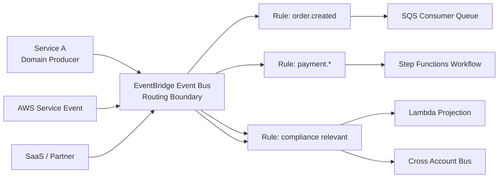

Core idea:

- producer menerbitkan **fact**;
- event bus merutekan berdasarkan contract;
- consumer menerima melalui target yang sesuai;
- ownership tidak bocor dari consumer ke producer;
- perubahan consumer tidak memaksa producer deploy ulang;
- replay, audit, dan debugging bisa dilakukan pada boundary yang eksplisit.

Kalau event bus didesain buruk, gejalanya cepat muncul:

- semua event masuk ke satu bus tanpa taxonomy;
- rule dibuat per user/per tenant/per request;
- event body diperlakukan seperti RPC command;
- consumer langsung Lambda tanpa buffer, lalu throttling menjadi random;
- tidak ada event envelope standard;
- tidak ada DLQ target delivery;
- tidak ada policy untuk cross-account publisher;
- replay event lama merusak state baru;
- observability hanya "PutEvents success" padahal target failure diam-diam terjadi.

Part ini membangun desain EventBridge dari sudut production engineering.

---

## 1. Apa yang EventBridge Selesaikan?

EventBridge menyelesaikan masalah **decoupled event routing**.

Tanpa event bus, integrasi sering menjadi seperti ini:

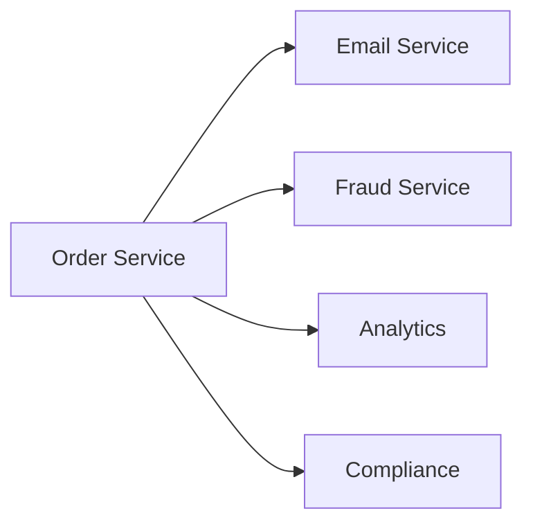

Masalahnya bukan hanya jumlah koneksi. Masalah sebenarnya:

- Order Service tahu terlalu banyak consumer.
- Consumer baru butuh perubahan producer.
- Retry policy tiap consumer tercampur dengan request path producer.
- Kegagalan consumer bisa mengganggu producer.
- Tidak ada routing contract pusat.
- Tidak ada tempat alami untuk audit event routing.

Dengan EventBridge:

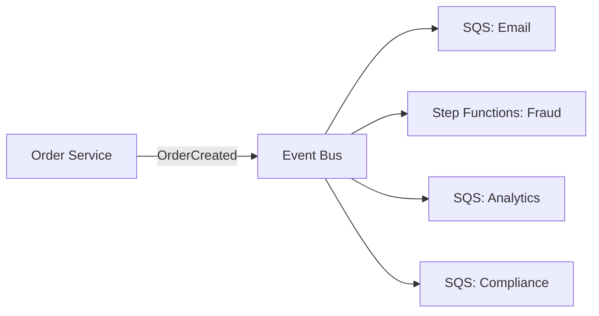

Producer hanya mengatakan:

> "OrderCreated terjadi."

Bukan:

> "Email service, fraud service, analytics, dan compliance, tolong lakukan X."

Perbedaan ini fundamental. Yang pertama adalah event-driven architecture. Yang kedua adalah distributed command invocation yang dibungkus topic.

---

## 2. EventBridge Bukan Pengganti Semua Integration Primitive

Sebelum memakai EventBridge, pastikan masalahnya memang event routing.

| Kebutuhan | Primitive Lebih Cocok | Kenapa |
|---|---|---|
| Caller butuh jawaban langsung | API Gateway / ALB / AppSync | Semantics request-response eksplisit |
| Work harus diproses satu consumer pool | SQS | Queue adalah buffer + lease + backlog |
| Fanout sederhana ke banyak subscriber | SNS | Pub/sub ringan, filtering, fanout cepat |
| Routing event antar domain/account | EventBridge | Event pattern, bus policy, archive/replay, SaaS/AWS source |
| Workflow dengan state dan compensation | Step Functions | Durable orchestration, retry, catch, wait, audit history |
| Ordered high-throughput event log | Kinesis / MSK | Stream retention dan ordered shard/partition processing |
| Query state terkini | Database / read model | Event bus bukan source of truth |

Rule sederhana:

> Gunakan EventBridge ketika event perlu dirutekan berdasarkan metadata/content ke target yang berubah-ubah, lintas service/account/domain, dan producer tidak boleh tahu semua consumer.

Jangan gunakan EventBridge hanya karena ingin "async". Untuk async work queue biasa, SQS biasanya lebih sederhana dan lebih operable.

---

## 3. Event Bus sebagai Boundary, Bukan Folder

Kesalahan umum adalah membuat satu event bus bernama `application-bus`, lalu semua event dari semua domain masuk ke sana.

Awalnya terasa simpel. Enam bulan kemudian:

- rule sulit dipahami;
- event source bercampur;
- permission terlalu luas;
- replay risk tidak jelas;
- consumer tidak tahu event mana milik domain mana;
- governance menjadi meeting, bukan desain.

Event bus perlu didesain sebagai **boundary**.

Boundary yang baik punya:

1. owner jelas;
2. taxonomy event jelas;
3. policy publisher jelas;
4. consumer class jelas;
5. observability jelas;
6. replay policy jelas;
7. lifecycle/versioning jelas.

Contoh bus topology:

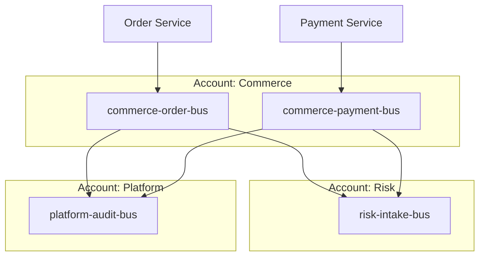

Tidak ada aturan universal satu bus per domain, account, environment, atau bounded context. Tapi ada prinsip:

> Event bus boundary harus mengikuti ownership dan blast radius, bukan hanya struktur organisasi atau nama aplikasi.

---

## 4. Default Bus, Custom Bus, Partner Bus

EventBridge memiliki beberapa tipe bus yang perlu dipahami.

### 4.1 Default Event Bus

Default bus menerima event dari banyak AWS services dalam account yang sama.

Gunakan default bus untuk:

- event dari AWS services;
- operational automation;
- infrastructure event;
- integration ringan yang memang account-local.

Jangan campur semua domain business event ke default bus hanya karena sudah tersedia.

Problem default bus sebagai business backbone:

- terlalu banyak noise dari AWS services;
- permission dan governance kurang eksplisit;
- ownership kabur;
- event discovery sulit;
- rule business bercampur dengan rule operational.

### 4.2 Custom Event Bus

Custom bus adalah pilihan utama untuk domain/application event.

Gunakan custom bus ketika:

- event adalah business/domain fact;
- publisher dan consumer butuh contract yang dikelola;
- cross-account routing diperlukan;
- archive/replay policy perlu spesifik;
- ownership domain perlu eksplisit.

Contoh naming:

```txt
commerce-order-events-prod
commerce-payment-events-prod
risk-intake-events-prod
platform-audit-events-prod
```

Naming buruk:

```txt
events
main-bus
prod-bus
serverless-bus
all-events
```

Nama bus harus menjawab: domain apa, tipe event apa, environment apa.

### 4.3 Partner Event Bus

Partner bus menerima event dari SaaS/partner source.

Gunakan partner bus sebagai **external integration boundary**. Jangan biarkan event partner langsung bercampur dengan internal canonical event tanpa normalization.

Pattern yang lebih aman:

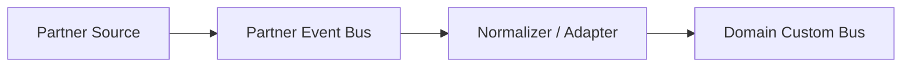

Normalizer mengubah event eksternal menjadi internal event contract yang stabil.

---

## 5. Bus Topology Patterns

### 5.1 Single Domain Bus

Cocok untuk sistem kecil atau domain yang cohesive.

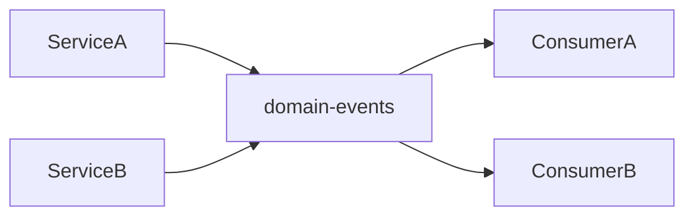

Kelebihan:

- sederhana;
- mudah onboarding;
- sedikit resource;
- cocok untuk awal.

Kelemahan:

- bisa menjadi dumping ground;
- rule bertambah tanpa taxonomy;
- owner sulit jika domain melebar.

Gunakan jika event volume, ownership, dan data sensitivity masih dalam satu boundary.

### 5.2 Bus per Bounded Context

Cocok untuk platform dengan beberapa domain jelas.

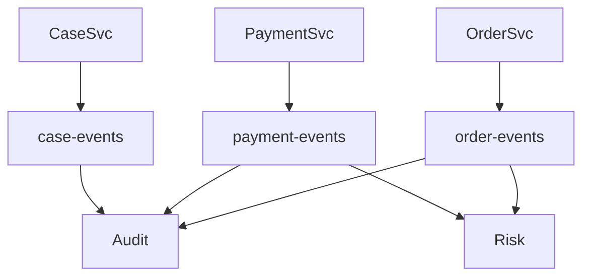

Kelebihan:

- ownership lebih jelas;
- replay policy per domain;
- permission per domain;
- blast radius lebih kecil.

Kelemahan:

- butuh governance;
- cross-domain routing lebih eksplisit;
- lebih banyak IaC resource.

Ini biasanya default yang baik untuk engineering organization yang sudah mature.

### 5.3 Intake Bus + Internal Domain Bus

Cocok untuk inbound event dari external systems, partner, atau legacy.

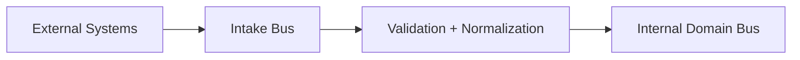

Keuntungan:

- external schema tidak bocor ke internal domain;
- validation dan quarantine bisa dilakukan di adapter;
- partner-specific retry/failure tidak mengganggu internal bus;
- contract internal tetap bersih.

### 5.4 Central Audit Bus

Cocok untuk compliance, audit trail, lineage, atau forensic pipeline.

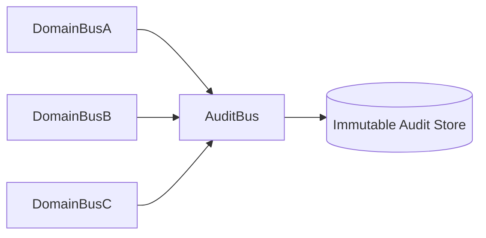

Penting:

- audit bus bukan pengganti domain bus;
- audit consumer tidak boleh mengubah business state;
- audit event harus tahan replay;
- sensitive data harus dipikirkan sebelum fanout.

### 5.5 Cross-Account Event Mesh

Cocok untuk multi-account AWS organization.

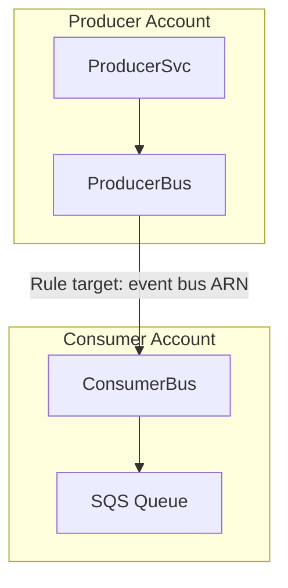

Pattern ini membantu:

- memisahkan account ownership;
- membatasi IAM blast radius;
- membuat consumer accountable atas processing;
- menghindari direct invocation lintas account.

Namun jangan membangun "global event mesh" tanpa topology. Event mesh tanpa taxonomy hanya memindahkan spaghetti dari REST call ke event rules.

---

## 6. Event Routing: Rules adalah Contract, Bukan Script

EventBridge rule mencocokkan event pattern dan mengirim ke target.

Rule yang baik punya intent domain:

```json
{
  "source": ["com.acme.order"],
  "detail-type": ["OrderCreated"],
  "detail": {
    "market": ["ID"],
    "riskRelevant": [true]
  }
}
```

Rule yang buruk:

```json
{
  "detail": {
    "payload": {
      "status": ["X", "Y", "Z"],
      "code": [{ "anything-but": ["A"] }]
    }
  }
}
```

Bukan karena EventBridge tidak bisa mencocokkan detail nested. Masalahnya rule menjadi dependent pada internal payload detail yang mungkin bukan routing contract.

Prinsip rule design:

1. routing berdasarkan stable metadata;
2. jangan match field yang sering berubah;
3. jangan encode business logic kompleks di event pattern;
4. hindari one-rule-per-entity;
5. rule harus bisa dibaca manusia;
6. setiap rule harus punya owner dan target purpose;
7. rule harus punya DLQ/retry policy jika target mendukung.

Rule adalah configuration, tapi secara arsitektur ia adalah contract.

---

## 7. Event Envelope untuk Routing yang Stabil

EventBridge event memiliki field umum seperti `source`, `detail-type`, `detail`, `eventBusName`, dan metadata lain.

Untuk event custom, desain envelope canonical.

Contoh:

```json
{
  "Source": "com.acme.commerce.order",
  "DetailType": "OrderCreated.v1",
  "EventBusName": "commerce-order-events-prod",
  "Detail": "{\"eventId\":\"evt_01J...\",\"occurredAt\":\"2026-07-06T12:00:00Z\",\"aggregateType\":\"Order\",\"aggregateId\":\"ord_123\",\"tenantId\":\"tenant_456\",\"market\":\"ID\",\"schemaVersion\":1,\"data\":{...}}"
}
```

Perhatikan dua lapis:

- EventBridge routing envelope: `Source`, `DetailType`, `EventBusName`.
- Domain envelope di `Detail`: `eventId`, `occurredAt`, `aggregateId`, `schemaVersion`, `data`.

Jangan mengandalkan EventBridge-generated event id sebagai domain idempotency key. Domain event harus punya event id sendiri yang berasal dari producer/outbox.

Recommended detail fields:

| Field | Fungsi |
|---|---|
| `eventId` | Idempotency/replay/debug key dari domain |
| `eventType` | Nama event domain, bisa sama dengan detail-type |
| `schemaVersion` | Versi schema detail |
| `occurredAt` | Waktu fakta terjadi di domain |
| `publishedAt` | Waktu event dipublish, opsional |
| `producer` | Service/component publisher |
| `aggregateType` | Entity/aggregate owner |
| `aggregateId` | Id entity utama |
| `tenantId` | Routing/multitenancy jika aman dibuka |
| `correlationId` | Trace business flow lintas service |
| `causationId` | Event/command penyebab event ini |
| `data` | Payload business |
| `metadata` | Non-business metadata |

Rule of thumb:

> Field yang dipakai untuk routing harus dianggap public contract bagi consumer.

---

## 8. Producer Design: PutEvents Bukan Transaction

Producer biasanya mengirim event dengan `PutEvents`.

Bahaya terbesar: database write sukses, publish event gagal.

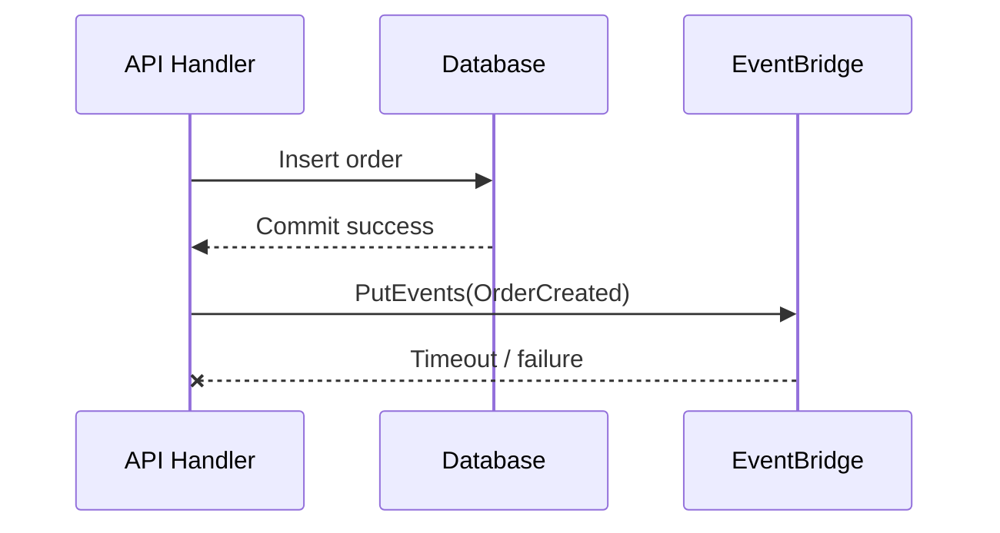

Jika producer tidak punya outbox, state sudah berubah tapi event hilang.

Production pattern:

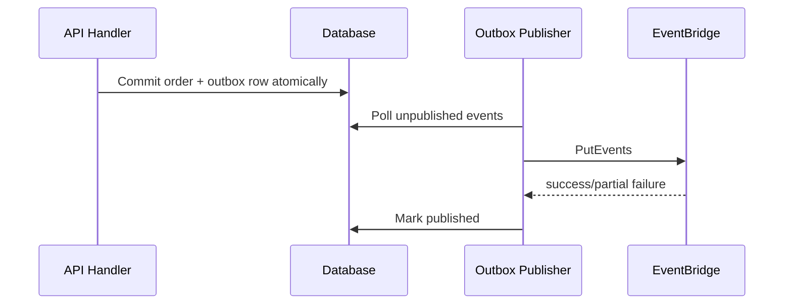

Outbox memberikan invariant:

> Jika state domain berubah, event publikasi yang merepresentasikan perubahan itu tercatat durable di database yang sama.

Untuk DynamoDB, outbox bisa berupa:

- item event di table yang sama;
- DynamoDB Streams sebagai trigger projection/outbox publisher;
- explicit event item dengan partition key aggregate.

Untuk RDS/Aurora, outbox bisa berupa table:

```sql
CREATE TABLE outbox_events (
    event_id        TEXT PRIMARY KEY,
    aggregate_type  TEXT NOT NULL,
    aggregate_id    TEXT NOT NULL,
    event_type      TEXT NOT NULL,
    schema_version  INT NOT NULL,
    payload         JSONB NOT NULL,
    occurred_at     TIMESTAMPTZ NOT NULL,
    published_at    TIMESTAMPTZ,
    publish_attempt INT NOT NULL DEFAULT 0,
    last_error      TEXT
);
```

`PutEvents` response juga perlu diperiksa per entry. Jangan hanya menganggap HTTP 200 berarti semua event berhasil.

Producer checklist:

- generate domain `eventId` sebelum commit;
- commit state + outbox atomically;
- publish dari worker terpisah;
- handle partial failure;
- retry dengan backoff;
- mark publish hanya setelah success;
- expose metric `outbox_oldest_unpublished_age`;
- jangan publish event yang belum commit;
- jangan publish command masquerading as event.

---

## 9. Target Design: Selalu Tanyakan “Target Ini Perlu Buffer?”

EventBridge dapat mengirim ke berbagai target: Lambda, SQS, Step Functions, another event bus, API destinations, dan lainnya.

Kesalahan umum: semua target langsung Lambda.

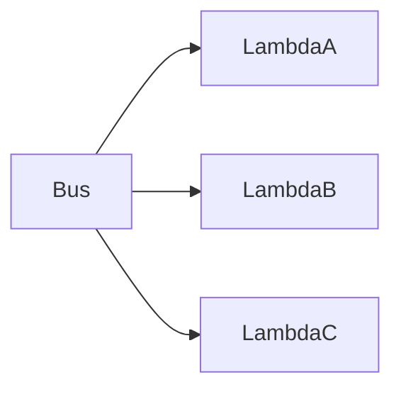

Ini bisa baik untuk event ringan, tapi risk-nya:

- burst event langsung menjadi Lambda concurrency burst;
- target downstream database bisa overload;
- retry target bisa sulit dikontrol;
- failure isolation lemah;
- tidak ada backlog yang mudah dipantau;
- replay langsung menghantam consumer.

Untuk consumer yang menulis ke database atau external API, prefer target SQS:

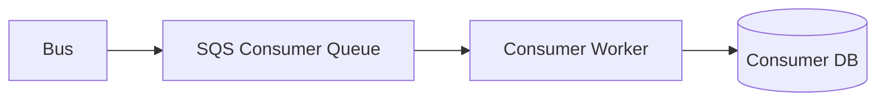

Kenapa?

- queue memberi buffer;
- consumer bisa scale independent;
- DLQ lebih jelas;
- backlog menjadi signal;
- redrive bisa dikontrol;
- database backpressure lebih aman.

Target decision table:

| Target | Cocok untuk | Hati-hati |
|---|---|---|
| Lambda | Lightweight reaction, validation, enrichment | Burst, concurrency, duplicate, downstream overload |
| SQS | Durable consumer queue, database write, replay control | At-least-once, visibility timeout, DLQ discipline |
| Step Functions | Multi-step process, compensation, human callback | Cost, workflow versioning, state payload size |
| Event bus | Cross-account/cross-domain routing | Event loops, policy, source taxonomy |
| API destination | External HTTPS integration | Rate limit, auth, retry, data privacy |
| Kinesis/Firehose | Analytics/log pipeline | Different semantics from domain event routing |

Default safe pattern:

> EventBridge rule target should usually be SQS for stateful consumers and Step Functions for process consumers.

---

## 10. Rule Fanout vs SNS Fanout

EventBridge dan SNS sama-sama bisa fanout. Bedanya ada pada routing semantics.

SNS:

- topic-oriented;
- publisher memilih topic;
- subscription filtering;
- fanout cepat dan sederhana;
- cocok untuk broadcast dari topic yang jelas.

EventBridge:

- bus-oriented;
- rule pattern matching lebih event-centric;
- source/detail-type taxonomy kuat;
- AWS/SaaS/custom event source terintegrasi;
- archive/replay tersedia;
- cross-account event bus routing lebih natural.

Gunakan SNS ketika:

- semua subscriber memang mendengarkan topic yang sama;
- routing sederhana;
- fanout per topic cukup;
- tidak butuh event bus topology.

Gunakan EventBridge ketika:

- routing berdasarkan source/detail/content;
- event berasal dari banyak source;
- perlu cross-account event routing;
- perlu archive/replay;
- perlu event pattern sebagai governance.

Gabungan umum:

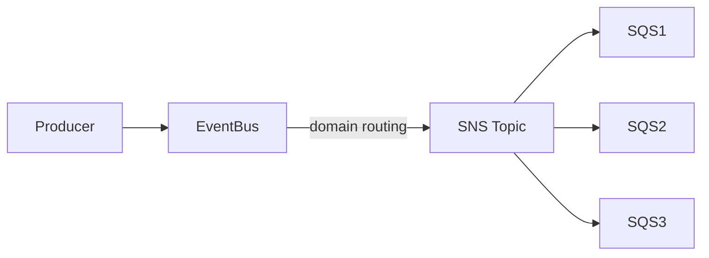

Namun jangan pakai keduanya tanpa alasan. Setiap hop menambah failure mode, latency, cost, IAM, dan observability surface.

---

## 11. Cross-Account Routing

EventBridge sangat berguna dalam multi-account architecture.

Pattern:

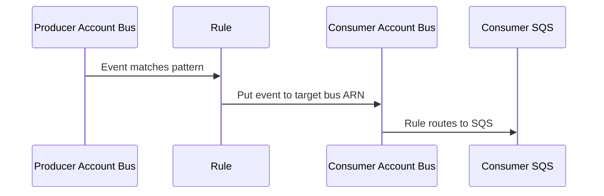

Keuntungannya:

- producer account tidak perlu invoke consumer compute langsung;
- consumer account bisa mengelola rule internalnya;
- centralized security dapat mengontrol bus policy;
- account boundary tetap kuat.

Risiko:

- bus policy terlalu luas;
- event source spoofing;
- routing loops;
- unclear ownership untuk failed delivery;
- cost visibility tersebar;
- event contract sulit dilacak jika tidak ada registry.

Praktik aman:

1. Producer bus hanya mengirim event yang sudah canonical.
2. Consumer bus policy membatasi source account/principal.
3. Rule lintas account diberi nama eksplisit.
4. Event detail mencantumkan original producer.
5. Target account memiliki DLQ untuk processing sendiri.
6. Jangan langsung route ke Lambda cross-account tanpa buffer jika processing stateful.
7. Buat dashboard per account dan central audit.

---

## 12. Event Loop dan Recursive Routing

Event loop terjadi ketika target mem-publish event yang cocok lagi dengan rule yang sama atau downstream rule sehingga sistem memakan dirinya sendiri.

Contoh buruk:

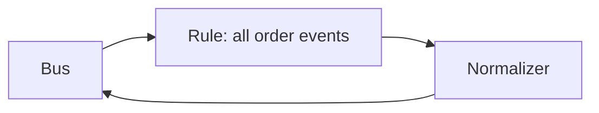

Jika normalizer publish event dengan `source` dan `detail-type` yang masih cocok rule, loop terjadi.

Cara mencegah:

- gunakan `source` berbeda untuk normalized event;
- rule match spesifik, bukan catch-all;
- tambahkan field `metadata.stage` jika perlu;
- hindari target yang mem-publish balik ke bus sama tanpa guard;
- alarm pada sudden spike `PutEvents`;
- gunakan archive/replay hati-hati agar tidak memicu loop lama.

Anti-pattern rule:

```json
{
  "source": [{ "prefix": "com.acme" }]
}
```

Ini terlalu luas untuk target yang bisa publish ulang.

Lebih aman:

```json
{
  "source": ["com.acme.partner.raw"],
  "detail-type": ["PartnerOrderImported.v1"]
}
```

---

## 13. Archive and Replay Readiness

EventBridge archive/replay sering dianggap fitur recovery. Benar, tapi replay bisa berbahaya jika consumer tidak replay-safe.

Replay mengirim event lama kembali ke rule/target. Ini berarti:

- consumer bisa menerima event yang sudah pernah diproses;
- event lama bisa bertemu state baru;
- side effect eksternal bisa terulang;
- projection bisa mundur jika event ordering tidak dijaga;
- DLQ bisa penuh jika bug belum diperbaiki.

Replay-safe consumer invariant:

```txt
Processing event E more than once must not corrupt state.
Processing old event E after newer state exists must not regress state.
```

Pattern:

- idempotency key = domain `eventId`;
- store processed event ids;
- compare aggregate version/sequence jika ada;
- use monotonic update untuk projection;
- avoid external side effect tanpa idempotency key;
- separate replay mode jika consumer butuh behavior berbeda;
- replay ke isolated bus/queue untuk backfill besar.

Safer replay topology:

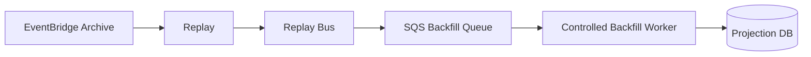

Jangan replay besar langsung ke production consumer tanpa throttle.

---

## 14. EventBridge Quotas as Design Constraints

EventBridge memiliki quotas seperti jumlah event buses, rules per bus, targets per rule, invocation throttle, dan `PutEvents` throttle per Region. Quota bukan detail administratif; quota adalah bagian dari desain.

Design implications:

- Jangan buat rule per user, per object, atau per customer jika jumlahnya bisa besar.
- Jangan jadikan EventBridge sebagai low-level routing table untuk jutaan dynamic subscription.
- Untuk dynamic user-level fanout, gunakan database subscription table, WebSocket management, IoT Core, atau custom delivery service.
- Untuk very high-throughput event stream, pertimbangkan Kinesis/MSK.
- Untuk queue backlog dan pull-based consumption, gunakan SQS.

Bad design:

```txt
one EventBridge rule per tenant per event type per consumer
```

Better design:

```txt
one rule per consumer routing class, tenant filtering done in consumer or dedicated routing service
```

Quota-aware design bertanya:

- berapa event per second peak?
- berapa rule dievaluasi per event?
- berapa target invoked?
- apakah PutEvents bisa throttle?
- apakah target invocation throttle akan delay?
- apakah rule count scalable terhadap tenant/customer growth?
- apakah event payload size aman?

---

## 15. Security and Governance

Event bus security bukan hanya IAM permission `events:PutEvents`.

Ada beberapa layer:

1. siapa boleh publish ke bus;
2. source apa yang valid;
3. event type apa yang valid;
4. target apa yang boleh dikonfigurasi;
5. data apa yang boleh keluar dari account/domain;
6. siapa boleh replay archive;
7. siapa boleh mengubah rules.

Threat model:

| Risiko | Contoh | Mitigasi |
|---|---|---|
| Source spoofing | Service lain publish `com.acme.payment` | IAM, bus policy, event validation, source ownership |
| Data exfiltration | Rule baru kirim event sensitive ke external API | Change control, IaC review, SCP/permission boundary |
| Replay abuse | Operator replay event payment lama | Restricted replay permission, approval, audit logs |
| Rule drift | Manual rule di console | IaC only, config drift detection |
| Broad target | Catch-all rule ke logging external | Sensitive field classification |
| Cross-account over-permission | Principal `*` publish bus | Explicit account/principal conditions |

Governance checklist:

- event bus dibuat via IaC;
- rules dibuat via IaC;
- bus policy reviewed;
- event taxonomy documented;
- schema registry atau contract repo maintained;
- archive/replay permission terbatas;
- sensitive field policy jelas;
- event examples tersedia untuk consumer;
- rule naming dan tagging konsisten.

---

## 16. Observability for Event Bus

Observability EventBridge perlu menjawab:

- event diterima bus?
- rule match?
- target invoked?
- target gagal?
- target retry?
- event masuk DLQ?
- latency routing naik?
- PutEvents throttle?
- event volume spike?
- replay sedang berjalan?

Minimal metrics:

| Area | Signal |
|---|---|
| Producer | `PutEvents` success/failure/partial failure, latency, throttle |
| Bus/rules | matched events, invocations, failed invocations |
| Target | per-target success/failure, DLQ depth, Lambda error/throttle, SQS backlog |
| Archive/replay | replay started/completed/failed, replay volume |
| Contract | unknown event type, schema validation failure |
| Outbox | unpublished age, publish attempt count |

Dashboard topology:

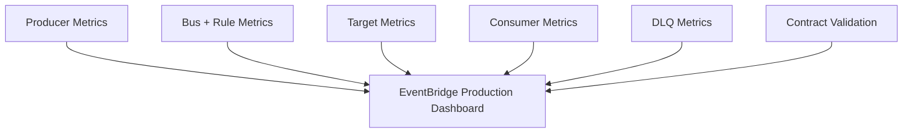

Logging strategy:

- producer logs `eventId`, `source`, `detailType`, `bus`, `correlationId`;
- outbox logs `eventId`, attempt, error;
- target worker logs same `eventId`;
- DLQ payload includes original event enough for diagnosis;
- replay logs replay name/window/rule/target.

Debug path:

1. check producer outbox;
2. check `PutEvents` response;
3. check event pattern rule match;
4. check target permission;
5. check target delivery metrics;
6. check target DLQ;
7. check consumer idempotency/inbox;
8. check downstream DB/API.

---

## 17. Event Bus Naming, Tagging, and IaC Structure

Naming is not cosmetics. It is an operational interface.

Recommended bus naming:

```txt
<org>-<domain>-<event-class>-<env>
```

Examples:

```txt
acme-commerce-order-events-prod
acme-commerce-payment-events-prod
acme-risk-intake-events-prod
acme-platform-audit-events-prod
```

Rule naming:

```txt
<source-domain>-<event-type>-to-<consumer-purpose>
```

Examples:

```txt
order-created-to-fulfillment-queue
payment-authorized-to-risk-workflow
case-escalated-to-compliance-audit
```

Tags:

```yaml
Owner: commerce-platform
Domain: order
Environment: prod
DataClassification: internal
ReplayAllowed: controlled
ManagedBy: terraform
```

IaC layout example:

```txt
infra/
  eventbridge/
    buses/
      commerce-order-events-prod.tf
      commerce-payment-events-prod.tf
    rules/
      order-created-to-fulfillment-queue.tf
      order-created-to-audit-bus.tf
    policies/
      commerce-order-bus-policy.tf
    archives/
      commerce-order-events-archive.tf
```

Contract repo example:

```txt
contracts/
  events/
    com.acme.commerce.order/
      OrderCreated.v1.schema.json
      OrderCancelled.v1.schema.json
      examples/
        order-created-minimal.json
        order-created-with-discount.json
```

---

## 18. EventBridge vs Database Trigger

Sometimes teams ask:

> "Why not just trigger event from database changes?"

Database CDC/streams can be useful, but domain event and database change are not always the same.

Database change:

```txt
row in orders changed status from PENDING to CONFIRMED
```

Domain event:

```txt
OrderConfirmed because payment authorization succeeded and fraud check passed
```

EventBridge should receive **semantic domain events**, not arbitrary table mutations, unless the use case is replication/projection and the consumer understands CDC semantics.

Bad pattern:

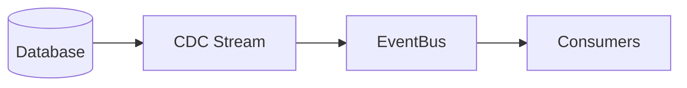

If every row change becomes public business event, consumers couple to schema internals.

Better pattern:

```mermaid
flowchart LR
    App[Domain Application] --> DB[(Database + Outbox)]
    DB --> OutboxPublisher
    OutboxPublisher --> EventBus
```

The app records meaningful event as part of domain transaction.

---

## 19. Worked Example: Case Management Event Bus

Suppose regulatory case management system has events:

- `CaseOpened.v1`
- `CaseAssigned.v1`
- `CaseEscalated.v1`
- `EvidenceSubmitted.v1`
- `EnforcementActionIssued.v1`
- `CaseClosed.v1`

Topology:

```mermaid
flowchart TB
    CaseService[Case Service]
    CaseDB[(Case DB + Outbox)]
    Publisher[Outbox Publisher]
    CaseBus[reg-case-events-prod]

    AssignmentQ[SQS: assignment-workload]
    SLAWorkflow[Step Functions: SLA workflow]
    AuditBus[platform-audit-events-prod]
    SearchQ[SQS: search-projection]
    NotificationQ[SQS: notification]

    CaseService --> CaseDB
    CaseDB --> Publisher
    Publisher --> CaseBus

    CaseBus --> AssignmentQ
    CaseBus --> SLAWorkflow
    CaseBus --> AuditBus
    CaseBus --> SearchQ
    CaseBus --> NotificationQ
```

Rule examples:

Assignment workload:

```json
{
  "source": ["gov.reg.case"],
  "detail-type": ["CaseOpened.v1", "CaseEscalated.v1"],
  "detail": {
    "data": {
      "requiresAssignment": [true]
    }
  }
}
```

SLA workflow:

```json
{
  "source": ["gov.reg.case"],
  "detail-type": ["CaseOpened.v1", "CaseEscalated.v1"]
}
```

Audit:

```json
{
  "source": ["gov.reg.case"]
}
```

But audit target should be highly controlled, because catch-all rule has large blast radius.

Event example:

```json
{
  "eventId": "evt_case_01J1XQ9R8Z",
  "eventType": "CaseEscalated",
  "schemaVersion": 1,
  "occurredAt": "2026-07-06T09:30:00Z",
  "producer": "case-service",
  "aggregateType": "Case",
  "aggregateId": "case_123",
  "tenantId": "agency_456",
  "correlationId": "corr_789",
  "data": {
    "caseId": "case_123",
    "fromLevel": "L1",
    "toLevel": "L2",
    "reasonCode": "SLA_RISK",
    "requiresAssignment": true,
    "escalatedBy": "system"
  },
  "metadata": {
    "sensitivity": "internal",
    "replaySafe": true
  }
}
```

Design notes:

- `CaseEscalated` is fact, not command.
- SLA workflow starts from event.
- Assignment queue gets buffered work.
- Search projection consumes asynchronously.
- Audit receives immutable fact.
- Event is replay-safe if consumers are idempotent by `eventId`.

---

## 20. Common Anti-Patterns

### Anti-Pattern 1: EventBridge as Message Queue

Symptom:

- one target consumer;
- consumer needs backlog;
- consumer writes database;
- failures need controlled retry;
- team asks how to see queue depth.

Use SQS.

### Anti-Pattern 2: Event as Command

Bad event:

```json
{
  "detail-type": "SendWelcomeEmail",
  "detail": {
    "email": "user@example.com"
  }
}
```

Better event:

```json
{
  "detail-type": "UserRegistered.v1",
  "detail": {
    "userId": "user_123"
  }
}
```

Consumer decides whether welcome email is needed.

### Anti-Pattern 3: Catch-All Consumer

A consumer subscribes to everything, then does internal routing.

This defeats EventBridge rule routing. If a consumer needs all events for audit, make it explicit and treat it as audit pipeline.

### Anti-Pattern 4: Rule per Tenant

Rule count grows with tenant count. This is usually wrong. Use tenant field as data and process in consumer, or build dedicated tenant routing if truly needed.

### Anti-Pattern 5: No Target DLQ

Target delivery failures disappear into metrics nobody watches. Every critical rule target should have explicit failure handling and alarm.

### Anti-Pattern 6: Replay Without Idempotency

Replay becomes data corruption tool.

### Anti-Pattern 7: Bus Without Owner

If no team owns the bus, nobody owns schema, rules, archive, replay, policy, or incident response.

---

## 21. Production Readiness Checklist

Event bus:

- [ ] bus name expresses domain/environment;
- [ ] owner team defined;
- [ ] bus policy least privilege;
- [ ] tags applied;
- [ ] archive policy decided;
- [ ] replay permission restricted;
- [ ] cross-account routing documented.

Event contract:

- [ ] `source` taxonomy defined;
- [ ] `detail-type` naming/versioning defined;
- [ ] domain `eventId` present;
- [ ] `occurredAt` present;
- [ ] schema version present;
- [ ] examples committed;
- [ ] backward compatibility rules defined.

Producer:

- [ ] outbox or equivalent durable publish mechanism;
- [ ] partial `PutEvents` failure handled;
- [ ] publish retries bounded;
- [ ] outbox age alarm;
- [ ] event payload size checked;
- [ ] sensitive data reviewed.

Rules/targets:

- [ ] rules specific and readable;
- [ ] no rule per dynamic entity;
- [ ] stateful consumers receive through SQS;
- [ ] workflow consumers use Step Functions;
- [ ] target DLQ configured where appropriate;
- [ ] target permissions explicit;
- [ ] event loop risk checked.

Observability:

- [ ] producer metrics;
- [ ] bus/rule metrics;
- [ ] target failure alarms;
- [ ] DLQ alarms;
- [ ] eventId propagated in logs;
- [ ] replay dashboard/runbook;
- [ ] contract validation failure metric.

Failure drills:

- [ ] target permission broken;
- [ ] consumer downstream DB slow;
- [ ] PutEvents throttled;
- [ ] poison event routed to DLQ;
- [ ] replay small window;
- [ ] event loop simulation in non-prod;
- [ ] cross-account policy denied.

---

## 22. Decision Summary

Use EventBridge when the problem is **event routing** across decoupled producers and consumers.

Design the bus as a boundary:

- custom bus for domain events;
- default bus mostly for AWS service events and operational automation;
- partner bus as external intake boundary;
- cross-account bus routing for organization-scale decoupling;
- SQS target for stateful consumers;
- Step Functions target for process consumers;
- archive/replay only if consumers are replay-safe;
- event contract managed like API contract.

The mature question is not:

> "Can EventBridge deliver this event?"

The mature question is:

> "Can this event bus remain understandable, secure, replayable, observable, and evolvable after 100 event types, 40 consumers, multiple accounts, and three years of production incidents?"

That is the real design standard.

---

## References

- AWS Documentation — What is Amazon EventBridge?
- AWS Documentation — Event buses in Amazon EventBridge
- AWS Documentation — Rules in Amazon EventBridge
- AWS Documentation — Event patterns in Amazon EventBridge
- AWS Documentation — Event bus targets in Amazon EventBridge
- AWS Documentation — Amazon EventBridge quotas
- AWS Documentation — EventBridge Schemas and Schema Registry
- AWS Prescriptive Guidance — Transactional outbox pattern
