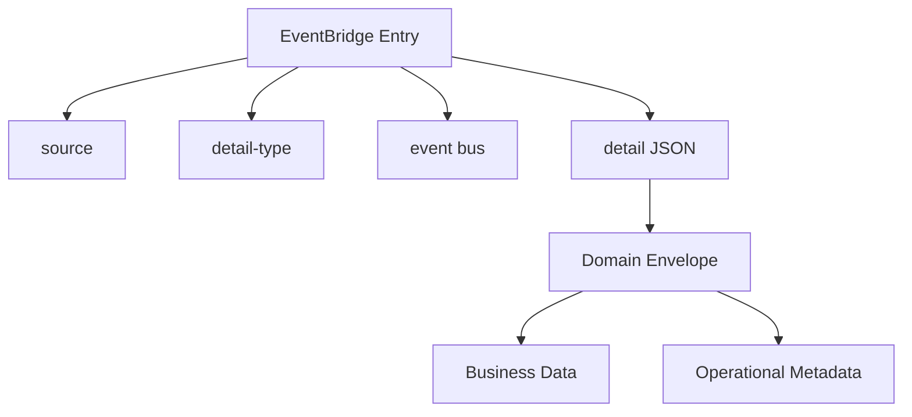
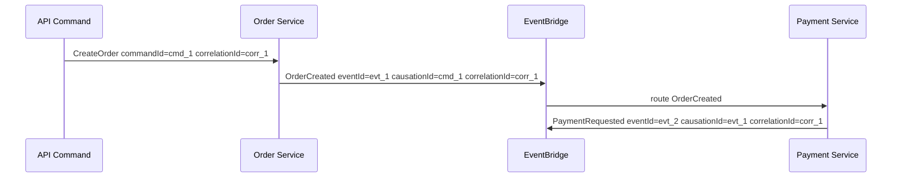
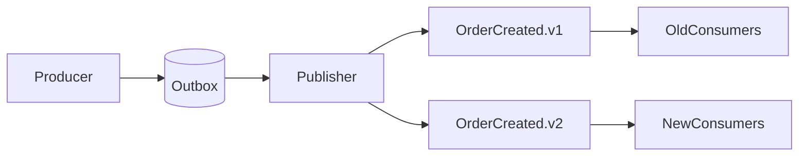
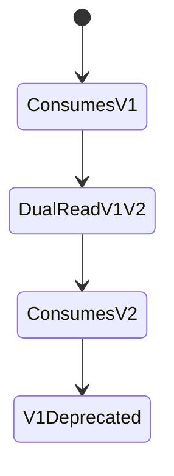
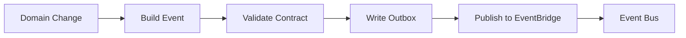
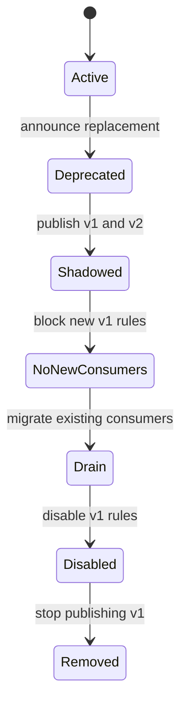

# Part 036 — EventBridge Event Contract

> Target pembelajaran: mampu merancang event contract EventBridge yang stabil, kompatibel, auditable, replay-safe, dan bisa dipakai lintas service/team/account tanpa membuat consumer rapuh terhadap perubahan producer.

Event-driven architecture gagal bukan hanya karena infrastructure.

Ia lebih sering gagal karena **event contract buruk**.

Contoh event yang terlihat sederhana:

```json
{
  "status": "DONE",
  "id": "123",
  "time": "2026-07-06"
}
```

Masalahnya:

- `status` apa? Status entity apa?
- `DONE` berarti selesai apa?
- `id` id apa?
- waktu terjadi atau waktu publish?
- siapa producer?
- apakah event ini bisa diproses ulang?
- apa versi schema?
- apakah field boleh hilang?
- apakah consumer boleh mengandalkan field ini?
- apakah event ini command atau fact?

Event contract harus menghilangkan ambiguitas itu.

Dalam EventBridge, contract tidak hanya berada di `detail`. Contract mencakup:

1. `source`;
2. `detail-type`;
3. event bus name;
4. domain envelope di `detail`;
5. schema dan examples;
6. compatibility rules;
7. versioning policy;
8. routing semantics;
9. replay semantics;
10. ownership dan lifecycle.

Part ini fokus pada desain contract yang tahan umur panjang.

---

## 1. Event adalah Fact, Bukan Request

Definisi kerja:

> Event adalah fakta yang sudah terjadi, diterbitkan oleh owner domain, dan dapat diamati oleh consumer tanpa producer mengetahui consumer tersebut.

Event yang baik:

```txt
OrderCreated
PaymentAuthorized
CaseEscalated
DocumentVerified
UserRegistered
PolicyPublished
```

Event yang buruk:

```txt
SendEmail
CreateInvoice
UpdateProjection
RunFraudCheck
NotifyCompliance
```

Yang buruk di atas adalah commands. Commands mengekspresikan instruksi kepada receiver.

Perbedaan:

| Aspek | Command | Event |
|---|---|---|
| Makna | Tolong lakukan sesuatu | Sesuatu sudah terjadi |
| Nama | Imperative | Past tense |
| Receiver | Biasanya diketahui | Tidak harus diketahui |
| Coupling | Caller ke handler | Producer ke contract |
| Failure | Caller butuh hasil/compensation | Consumer bertanggung jawab sendiri |
| Replay | Bisa berbahaya | Harus dirancang replay-safe |

Jika event kamu bernama `GenerateReport`, kemungkinan itu command.
Jika event kamu bernama `ReportRequested`, itu fact bahwa request masuk.
Jika event kamu bernama `ReportGenerated`, itu fact bahwa report sudah dibuat.

---

## 2. EventBridge Contract Layers

EventBridge custom event dikirim via `PutEvents` dengan struktur tingkat atas seperti:

```json
{
  "Source": "com.acme.commerce.order",
  "DetailType": "OrderCreated.v1",
  "EventBusName": "acme-commerce-order-events-prod",
  "Detail": "{...json string...}"
}
```

Lalu `Detail` berisi domain envelope:

```json
{
  "eventId": "evt_01J1Z3X8E7S4Q9",
  "eventType": "OrderCreated",
  "schemaVersion": 1,
  "occurredAt": "2026-07-06T10:15:30Z",
  "publishedAt": "2026-07-06T10:15:31Z",
  "producer": "order-service",
  "aggregateType": "Order",
  "aggregateId": "ord_123",
  "tenantId": "tenant_456",
  "correlationId": "corr_abc",
  "causationId": "cmd_xyz",
  "data": {
    "orderId": "ord_123",
    "customerId": "cus_789",
    "currency": "IDR",
    "totalAmount": 250000,
    "lineItemCount": 3
  },
  "metadata": {
    "sensitivity": "internal",
    "replaySafe": true
  }
}
```

Layer contract:



Setiap layer punya fungsi berbeda.

| Layer | Stabilitas | Dipakai oleh |
|---|---|---|
| `source` | Sangat stabil | Rule, governance, ownership |
| `detail-type` | Sangat stabil | Rule, consumer dispatch |
| bus name | Stabil per environment/domain | IAM, routing topology |
| envelope fields | Stabil | Idempotency, tracing, replay |
| `data` | Evolvable | Consumer business logic |
| `metadata` | Evolvable tapi controlled | Ops/security/routing tambahan |

---

## 3. Designing `source`

`source` harus menjawab: **siapa pemilik event secara domain?**

Good examples:

```txt
com.acme.commerce.order
com.acme.commerce.payment
gov.reg.case
gov.reg.enforcement
com.acme.platform.identity
```

Bad examples:

```txt
lambda
backend
app
service
prod
orders
```

Kenapa `orders` kurang baik? Karena tidak namespace-aware dan mudah bentrok saat organisasi tumbuh.

Recommended shape:

```txt
<reverse-domain>.<business-domain>.<bounded-context>
```

Atau untuk organisasi internal:

```txt
<org>.<domain>.<context>
```

Examples:

```txt
acme.commerce.order
acme.risk.fraud
acme.platform.identity
govreg.enforcement.case
```

Rules:

1. `source` tidak berubah karena rename service implementation.
2. `source` bukan nama Lambda/function/repository.
3. `source` dimiliki oleh domain owner.
4. `source` tidak terlalu granular.
5. `source` tidak terlalu umum.

Bad:

```txt
com.acme.order-service-v2
```

Jika service dipecah menjadi dua, event source domain tidak harus berubah.

Better:

```txt
com.acme.commerce.order
```

---

## 4. Designing `detail-type`

`detail-type` harus menjawab: **fakta apa yang terjadi?**

Gunakan past tense domain event:

```txt
OrderCreated.v1
PaymentAuthorized.v1
CaseEscalated.v1
EvidenceSubmitted.v1
DocumentRejected.v1
```

Jangan gunakan technical action:

```txt
OrderTableUpdated
LambdaFinished
DynamoStreamRecord
SendNotification
```

Versioning bisa ditempel di `detail-type` atau di `detail.schemaVersion`. Ada trade-off.

### Option A: Version in `detail-type`

```txt
OrderCreated.v1
OrderCreated.v2
```

Kelebihan:

- routing rule bisa membedakan major version;
- consumer dispatch jelas;
- breaking change eksplisit.

Kekurangan:

- rule bertambah;
- naming lebih verbose;
- minor evolution tidak cocok jadi detail-type baru.

### Option B: Version only in `detail.schemaVersion`

```txt
OrderCreated
```

```json
{
  "schemaVersion": 2
}
```

Kelebihan:

- detail-type stabil;
- rule lebih sederhana;
- schema version ditangani consumer.

Kekurangan:

- breaking change bisa diam-diam merusak consumer;
- rule tidak bisa mudah filter version;
- consumer harus lebih disiplin.

Recommended pragmatic policy:

- gunakan `detail-type` dengan major version: `OrderCreated.v1`;
- gunakan `schemaVersion` juga di detail untuk validation/runtime;
- backward-compatible change tetap di major version sama;
- breaking change pakai major version baru.

Example:

```txt
OrderCreated.v1
OrderCreated.v2
```

With detail:

```json
{
  "eventType": "OrderCreated",
  "schemaVersion": 1
}
```

---

## 5. Domain Envelope Standard

Envelope adalah bagian yang membuat event bisa dioperasikan.

Minimal envelope:

```json
{
  "eventId": "evt_01J1Z3X8E7S4Q9",
  "eventType": "OrderCreated",
  "schemaVersion": 1,
  "occurredAt": "2026-07-06T10:15:30Z",
  "producer": "order-service",
  "aggregateType": "Order",
  "aggregateId": "ord_123",
  "data": {}
}
```

Recommended envelope:

```json
{
  "eventId": "evt_01J1Z3X8E7S4Q9",
  "eventType": "OrderCreated",
  "schemaVersion": 1,
  "occurredAt": "2026-07-06T10:15:30Z",
  "publishedAt": "2026-07-06T10:15:31Z",
  "producer": "order-service",
  "aggregateType": "Order",
  "aggregateId": "ord_123",
  "tenantId": "tenant_456",
  "correlationId": "corr_abc",
  "causationId": "cmd_xyz",
  "data": {},
  "metadata": {}
}
```

Field semantics:

| Field | Required | Meaning |
|---|---:|---|
| `eventId` | Yes | Stable domain event identity for idempotency |
| `eventType` | Yes | Domain type without transport version suffix |
| `schemaVersion` | Yes | Major schema version used by payload |
| `occurredAt` | Yes | When fact happened in domain time |
| `publishedAt` | Recommended | When event was published to bus |
| `producer` | Yes | Publishing component, not necessarily domain source |
| `aggregateType` | Recommended | Domain entity/aggregate class |
| `aggregateId` | Recommended | Entity id used for idempotency/projection/order |
| `tenantId` | Conditional | Only if multitenancy requires and policy allows |
| `correlationId` | Recommended | Business trace across request/workflow |
| `causationId` | Recommended | Command/event that caused this event |
| `data` | Yes | Business payload |
| `metadata` | Optional | Ops/security/routing hints |

Do not make envelope a dumping ground. If everything goes into metadata, contract becomes meaningless.

---

## 6. `eventId` and Idempotency

`eventId` must be generated by the domain producer before publication.

Bad practice:

```txt
Use EventBridge assigned id as consumer idempotency key.
```

Why bad?

- event can be republished during retry/backfill;
- outbox may use same domain event but new transport attempt;
- replay semantics require stable identity;
- idempotency should represent business fact, not delivery attempt.

Good practice:

```txt
eventId = immutable domain event id stored in outbox
```

Consumer inbox example:

```sql
CREATE TABLE processed_events (
    consumer_name TEXT NOT NULL,
    event_id TEXT NOT NULL,
    processed_at TIMESTAMPTZ NOT NULL DEFAULT now(),
    PRIMARY KEY (consumer_name, event_id)
);
```

Consumer algorithm:

```txt
begin transaction
  insert into processed_events(consumer_name, event_id)
  if duplicate: skip
  apply business update
commit
```

For DynamoDB:

```json
{
  "Put": {
    "TableName": "consumer-inbox",
    "Item": {
      "pk": { "S": "consumer#search-projection" },
      "sk": { "S": "event#evt_01J1Z3X8E7S4Q9" }
    },
    "ConditionExpression": "attribute_not_exists(pk) AND attribute_not_exists(sk)"
  }
}
```

Idempotency is part of contract because consumer cannot be safely replayed without a stable event identity.

---

## 7. Time Semantics: `occurredAt` vs `publishedAt`

Do not collapse domain time and publish time.

```json
{
  "occurredAt": "2026-07-06T10:15:30Z",
  "publishedAt": "2026-07-06T10:17:45Z"
}
```

Difference matters:

- outbox delay;
- retry delay;
- replay;
- backfill;
- clock skew;
- SLA computation;
- projection freshness.

Use `occurredAt` for domain fact ordering and business SLA.
Use `publishedAt` for integration latency and operational debugging.

Metric examples:

```txt
publish_lag = publishedAt - occurredAt
consumer_lag = processedAt - occurredAt
delivery_lag = processedAt - publishedAt
```

If event is replayed one month later, `occurredAt` must stay old. Do not mutate it.

---

## 8. Correlation and Causation

`correlationId` groups a business flow.

`causationId` points to what caused this event.

Example:



This chain enables:

- distributed debugging;
- audit causality;
- replay investigation;
- workflow trace;
- incident analysis.

Without causation, event-driven systems become a pile of facts with weak lineage.

---

## 9. Payload Design: Enough Data, Not Whole Database Row

Event payload design has a tension:

- too little data forces consumer to call producer;
- too much data leaks internals and grows stale;
- raw database row couples consumer to schema;
- full snapshot can be useful for projections but costly.

Payload styles:

### 9.1 Notification Event

```json
{
  "data": {
    "orderId": "ord_123"
  }
}
```

Consumer must fetch detail.

Pros:

- small payload;
- minimal data exposure;
- producer schema hidden.

Cons:

- consumer couples to producer API;
- thundering herd after event burst;
- replay depends on current state, not event-time state.

### 9.2 Enriched Domain Event

```json
{
  "data": {
    "orderId": "ord_123",
    "customerId": "cus_789",
    "currency": "IDR",
    "totalAmount": 250000,
    "status": "CREATED"
  }
}
```

Pros:

- consumer can work independently;
- projection easier;
- replay more deterministic.

Cons:

- payload contract larger;
- sensitive data review needed;
- schema evolution matters.

### 9.3 Snapshot Event

```json
{
  "data": {
    "order": {
      "id": "ord_123",
      "status": "CREATED",
      "customer": { ... },
      "items": [ ... ],
      "totals": { ... }
    }
  }
}
```

Pros:

- convenient for read model rebuild;
- fewer producer calls.

Cons:

- high coupling;
- larger payload;
- more privacy risk;
- more compatibility burden.

Guideline:

> Put enough data for known consumers to process without synchronous callback, but not raw internal database state.

A good event is a **public domain fact**, not a database export.

---

## 10. Compatibility Rules

Event contracts must evolve safely.

Backward-compatible changes usually include:

- adding optional field;
- adding enum value only if consumers tolerate unknown values;
- widening string constraints carefully;
- adding metadata field;
- adding nested optional object;
- increasing max length if consumers do not rely on limit.

Breaking changes include:

- removing required field;
- renaming field;
- changing type;
- changing semantics without field name change;
- changing meaning of enum;
- changing id format if consumers parse it;
- making optional field required;
- moving field path;
- changing time format;
- changing currency/amount scale.

Schema compatibility is not just JSON shape. It is semantics.

Example semantic breaking change:

```json
{
  "totalAmount": 250000
}
```

If v1 means cents/minor unit and v2 means major unit, schema type still number but consumer breaks.

Better:

```json
{
  "totalAmountMinor": 250000,
  "currency": "IDR"
}
```

Or:

```json
{
  "amount": {
    "minor": 250000,
    "currency": "IDR"
  }
}
```

---

## 11. Versioning Strategy

Recommended major version strategy:

```txt
<DomainEventName>.v<major>
```

Example:

```txt
OrderCreated.v1
OrderCreated.v2
```

Minor compatible changes stay in same major version.

Rules:

1. Never mutate meaning of existing field in same major version.
2. Never remove required field in same major version.
3. Prefer additive optional fields.
4. Consumers must ignore unknown fields.
5. Producers must not require all consumers to upgrade immediately.
6. Major version can run in parallel during migration.
7. Deprecation requires consumer inventory.

Parallel publish pattern:



Consumer migration:



Avoid forcing flag day migrations.

---

## 12. Schema Design with JSON Schema / OpenAPI

EventBridge Schema Registry can store and organize schemas, infer schemas from events, and generate code bindings for supported languages. This is useful, but do not confuse inferred schema with intentional contract.

Inferred schema tells you:

> "What shape did we observe?"

Intentional schema tells you:

> "What shape do we promise?"

Contract schema example:

```json
{
  "$schema": "https://json-schema.org/draft/2020-12/schema",
  "$id": "https://contracts.acme.com/events/order-created-v1.schema.json",
  "title": "OrderCreated.v1",
  "type": "object",
  "required": [
    "eventId",
    "eventType",
    "schemaVersion",
    "occurredAt",
    "producer",
    "aggregateType",
    "aggregateId",
    "data"
  ],
  "properties": {
    "eventId": {
      "type": "string",
      "pattern": "^evt_"
    },
    "eventType": {
      "const": "OrderCreated"
    },
    "schemaVersion": {
      "const": 1
    },
    "occurredAt": {
      "type": "string",
      "format": "date-time"
    },
    "producer": {
      "type": "string"
    },
    "aggregateType": {
      "const": "Order"
    },
    "aggregateId": {
      "type": "string"
    },
    "data": {
      "type": "object",
      "required": ["orderId", "customerId", "currency", "totalAmountMinor"],
      "properties": {
        "orderId": { "type": "string" },
        "customerId": { "type": "string" },
        "currency": { "type": "string", "minLength": 3, "maxLength": 3 },
        "totalAmountMinor": { "type": "integer", "minimum": 0 }
      },
      "additionalProperties": true
    },
    "metadata": {
      "type": "object",
      "additionalProperties": true
    }
  },
  "additionalProperties": true
}
```

Notice `additionalProperties: true` for forward compatibility. For internal validation, you may choose stricter producer-side schema, but consumer-side parsing should usually tolerate unknown fields.

---

## 13. Contract Repository

Event contract should live in source control, not only in EventBridge console.

Suggested layout:

```txt
contracts/
  events/
    com.acme.commerce.order/
      OrderCreated.v1/
        schema.json
        examples/
          minimal.json
          full.json
        README.md
        changelog.md
      OrderCancelled.v1/
        schema.json
        examples/
          minimal.json
          full.json
```

Each event README should answer:

- What happened?
- Who owns this event?
- When is it emitted?
- Is it emitted once or multiple times per aggregate?
- What is idempotency key?
- What ordering guarantees exist, if any?
- Is replay supported?
- What fields are routing fields?
- Which fields are sensitive?
- Which consumers currently depend on it?
- What are compatibility rules?

Example README fragment:

```md
# OrderCreated.v1

Owner: Commerce Order Team
Source: com.acme.commerce.order
Detail-Type: OrderCreated.v1
Bus: acme-commerce-order-events-prod

Emitted when an order aggregate is successfully created and committed.
This event is emitted once per orderId.

Idempotency key: eventId
Aggregate key: aggregateId / data.orderId
Replay-safe: yes, if consumer deduplicates by eventId.
Ordering: no global ordering. Per order aggregate sequence is not guaranteed unless consumer uses aggregate version.
```

---

## 14. Producer-Side Validation

Producer must validate event before publish.

Pipeline:



Validation should happen before durable outbox write if possible.

Producer validation catches:

- missing required fields;
- invalid timestamp;
- invalid enum;
- wrong schema version;
- invalid id format;
- payload too large;
- sensitive field leakage;
- contract-breaking code change.

Do not rely only on consumer failure to discover bad events. Bad events once published are hard to erase from archives, logs, DLQs, and downstream stores.

---

## 15. Consumer-Side Contract Handling

Consumer must be strict about what it needs and tolerant about what it does not need.

Consumer should:

- verify `source` and `detail-type`;
- parse known schema version;
- reject unsupported major version;
- ignore unknown fields;
- validate required fields it depends on;
- dedupe by `eventId`;
- log contract violation with event id;
- send poison event to DLQ/quarantine;
- avoid crashing entire batch for one invalid event when using SQS batch.

Consumer pseudo-code:

```txt
receive event
if source/detail-type unsupported:
  reject or ignore according to routing expectation
parse envelope
if schemaVersion unsupported:
  send to contract DLQ
if eventId already processed:
  ack/skip
validate required consumer fields
apply idempotent business update
mark event processed
```

Consumer should not require exact schema equality. Exact equality breaks additive evolution.

---

## 16. Routing Fields vs Business Fields

Fields used by EventBridge rules become routing contract.

Example rule:

```json
{
  "source": ["com.acme.commerce.order"],
  "detail-type": ["OrderCreated.v1"],
  "detail": {
    "data": {
      "market": ["ID"]
    }
  }
}
```

Now `detail.data.market` is not just business data; it is routing API.

Implication:

- producer cannot rename `market` freely;
- producer cannot change values without routing impact;
- consumer may miss events;
- rule tests must be part of contract tests.

For stable routing, consider putting routing fields in envelope/metadata:

```json
{
  "tenantId": "tenant_456",
  "metadata": {
    "market": "ID",
    "riskRelevant": true
  },
  "data": {
    "orderId": "ord_123"
  }
}
```

But do not duplicate too much. Duplication creates consistency risk.

Policy:

> Any event field used by a rule must be documented as routing-stable.

---

## 17. Sensitive Data and Contract Minimization

Events spread. They are logged, archived, queued, replayed, stored in DLQs, and copied across accounts.

Therefore event payloads must be designed with data classification.

Ask before adding field:

- Does every consumer need this?
- Is it PII/PHI/financially sensitive/confidential?
- Will it appear in DLQ?
- Will it cross account/region?
- Will it be archived?
- What is retention?
- Can it be reconstructed from id if needed?

Bad event:

```json
{
  "data": {
    "customerName": "...",
    "email": "...",
    "nationalId": "...",
    "fullAddress": "...",
    "paymentCardLast4": "1234"
  }
}
```

Better event if consumers only need identity reference:

```json
{
  "data": {
    "customerId": "cus_789",
    "profileVersion": 12
  },
  "metadata": {
    "sensitivity": "restricted"
  }
}
```

This does not mean never include sensitive data. It means including it is an explicit architecture decision, not convenience.

---

## 18. Ordering and Sequence Semantics

EventBridge is not a per-aggregate ordered event log.

If consumer needs ordering, contract must include enough information to handle it.

Options:

### 18.1 Aggregate Version

```json
{
  "aggregateId": "ord_123",
  "aggregateVersion": 7
}
```

Consumer projection can apply only if version is newer.

```txt
if incoming.aggregateVersion <= stored.aggregateVersion:
  skip
else:
  apply update
```

### 18.2 OccurredAt Guard

Useful for approximate last-write-wins, but weaker due clock skew and same-time conflicts.

### 18.3 Consumer Fetches Current State

For events that only notify change, consumer fetches source of truth and avoids event ordering issue. But this couples consumer to producer availability.

### 18.4 Use FIFO/SQS/Kinesis Where Ordering Is Core

If order is a hard invariant, EventBridge alone may not be the correct primitive.

Contract must state:

```txt
Ordering: no global ordering guarantee. Consumers must dedupe by eventId and must not assume events for the same aggregate arrive in order. Use aggregateVersion to avoid state regression.
```

---

## 19. Replay Contract

Every event type should document replay behavior.

Replay policy examples:

```yaml
replay:
  supported: true
  idempotencyKey: eventId
  orderingAssumption: none
  sideEffects: none
  consumerGuidance: "Consumers must dedupe by eventId and skip stale aggregateVersion."
```

Or:

```yaml
replay:
  supported: restricted
  reason: "Triggers external notification side effects."
  requiredMode: "backfill-mode"
  approval: "domain-owner + platform-owner"
```

Event types that trigger external side effects need special care:

- email;
- SMS;
- payment capture;
- case escalation notification;
- third-party API call;
- irreversible external workflow.

Consumer can separate side-effect mode:

```txt
normal event path: send notification if not sent before
replay path: rebuild projection only, skip notification
```

But replay mode must be explicit; do not rely on operator memory.

---

## 20. Event Contract Testing

Contract testing must run before deploy.

Producer tests:

- generated event validates against schema;
- examples validate against schema;
- `source` and `detail-type` are correct;
- no removed required field;
- no changed type;
- payload size within EventBridge limit;
- sensitive fields comply with policy;
- event pattern tests still match.

Consumer tests:

- can parse current schema;
- ignores unknown fields;
- rejects unsupported major version;
- dedupe works;
- stale aggregate version skipped;
- poison event goes to DLQ;
- replay duplicate does not corrupt state.

Rule tests:

```json
{
  "source": ["com.acme.commerce.order"],
  "detail-type": ["OrderCreated.v1"],
  "detail": {
    "metadata": {
      "riskRelevant": [true]
    }
  }
}
```

Test cases:

| Event | Should Match? |
|---|---:|
| `OrderCreated.v1` with `riskRelevant=true` | Yes |
| `OrderCreated.v1` with `riskRelevant=false` | No |
| `OrderCancelled.v1` | No |
| wrong source | No |
| missing `riskRelevant` | No, unless intended |

---

## 21. CI/CD Contract Gate

Suggested pipeline:

```mermaid
flowchart LR
    PR[Pull Request]
    SchemaLint[Schema Lint]
    ExampleValidation[Example Validation]
    CompatibilityCheck[Compatibility Check]
    RulePatternTests[Rule Pattern Tests]
    ConsumerContractTests[Consumer Contract Tests]
    IaCPlan[IaC Plan]
    Deploy[Deploy]

    PR --> SchemaLint --> ExampleValidation --> CompatibilityCheck --> RulePatternTests --> ConsumerContractTests --> IaCPlan --> Deploy
```



Compatibility gate examples:

- required field removed: fail;
- field type changed: fail;
- enum value removed: fail;
- optional field added: pass;
- description changed: pass;
- new major version added: pass with deprecation plan if replacing old.

Consumer inventory gate:

```txt
Before deprecating OrderCreated.v1:
  list rules matching OrderCreated.v1
  list known consumer queues/workflows
  confirm zero production dependency
  disable rule in staging
  observe no impact
  remove producer v1 publishing
```

---

## 22. Example: `CaseEscalated.v1` Contract

EventBridge entry:

```json
{
  "Source": "gov.reg.case",
  "DetailType": "CaseEscalated.v1",
  "EventBusName": "gov-reg-case-events-prod",
  "Detail": "{...}"
}
```

Detail:

```json
{
  "eventId": "evt_case_01J2ABCDEF",
  "eventType": "CaseEscalated",
  "schemaVersion": 1,
  "occurredAt": "2026-07-06T10:30:00Z",
  "publishedAt": "2026-07-06T10:30:02Z",
  "producer": "case-service",
  "aggregateType": "Case",
  "aggregateId": "case_123",
  "tenantId": "agency_001",
  "correlationId": "corr_case_789",
  "causationId": "cmd_escalate_456",
  "data": {
    "caseId": "case_123",
    "fromLevel": "L1",
    "toLevel": "L2",
    "reasonCode": "SLA_RISK",
    "escalatedByType": "SYSTEM",
    "requiresAssignment": true,
    "previousOwnerUserId": "usr_111"
  },
  "metadata": {
    "sensitivity": "internal",
    "riskRelevant": true,
    "replaySafe": true
  }
}
```

Schema excerpt:

```json
{
  "title": "CaseEscalated.v1",
  "type": "object",
  "required": ["eventId", "eventType", "schemaVersion", "occurredAt", "producer", "aggregateType", "aggregateId", "data"],
  "properties": {
    "eventType": { "const": "CaseEscalated" },
    "schemaVersion": { "const": 1 },
    "aggregateType": { "const": "Case" },
    "data": {
      "type": "object",
      "required": ["caseId", "fromLevel", "toLevel", "reasonCode", "escalatedByType", "requiresAssignment"],
      "properties": {
        "caseId": { "type": "string" },
        "fromLevel": { "type": "string" },
        "toLevel": { "type": "string" },
        "reasonCode": { "type": "string" },
        "escalatedByType": { "enum": ["USER", "SYSTEM", "RULE"] },
        "requiresAssignment": { "type": "boolean" },
        "previousOwnerUserId": { "type": ["string", "null"] }
      },
      "additionalProperties": true
    }
  },
  "additionalProperties": true
}
```

README excerpt:

```md
# CaseEscalated.v1

A case moved from one escalation level to another.

Emitted after the case state transition commits.

Idempotency: eventId
Aggregate: Case / aggregateId
Replay: supported for projection and workflow reconciliation. Notification consumers must dedupe by eventId.
Ordering: no delivery ordering guarantee. Consumers that maintain case projection must compare case version if present or fetch current case state.
Sensitivity: internal. Do not route to external API destinations without approval.
```

---

## 23. Schema Registry: Useful, But Not Sufficient

EventBridge Schema Registry helps organize schemas, infer schemas from events, and generate code bindings. It is useful for discoverability and type generation.

But a registry is not governance by itself.

You still need:

- owner review;
- semantic compatibility rules;
- examples;
- event lifecycle policy;
- consumer inventory;
- security classification;
- deprecation process;
- replay guidance;
- CI checks.

Use Schema Registry as one tool in contract management, not as substitute for design discipline.

---

## 24. Consumer Inventory and Deprecation

Before changing or removing an event version, know who consumes it.

Sources of consumer inventory:

- EventBridge rules targeting queues/workflows/functions;
- IaC state;
- schema registry metadata;
- contract repository CODEOWNERS;
- runtime logs by `detail-type`;
- consumer self-registration;
- platform catalog.

Deprecation process:



Do not remove event contract because "we think nobody uses it". In event-driven systems, hidden consumers are common.

---

## 25. Common Contract Anti-Patterns

### Anti-Pattern 1: Generic Event Type

```txt
EntityUpdated
StatusChanged
DataChanged
```

These are too vague. Consumer must inspect payload and infer meaning.

Better:

```txt
CaseEscalated
PaymentAuthorized
OrderCancelled
EvidenceSubmitted
```

### Anti-Pattern 2: Raw Database Row Event

```json
{
  "table": "orders",
  "op": "UPDATE",
  "after": { ...full row... }
}
```

This is CDC, not domain event. It may be valid for replication, but not as public domain contract.

### Anti-Pattern 3: Enum Without Unknown Handling

Producer adds enum `REVIEW_REQUIRED`; consumer crashes because switch statement has no default.

Consumer should handle unknown enum safely when enum is expected to evolve.

### Anti-Pattern 4: Reusing Event Name with New Meaning

`OrderCompleted` originally meant paid + fulfilled. Later it means payment completed only. Same name, different semantics. This is a silent breaking change.

Create new event:

```txt
PaymentCompleted.v1
OrderFulfilled.v1
```

### Anti-Pattern 5: Event Without Owner

No owner means no one can answer compatibility, lifecycle, support, or incident questions.

### Anti-Pattern 6: Sensitive Data by Convenience

Adding email, address, identity number, or free-text notes because "maybe useful later" creates permanent data sprawl.

### Anti-Pattern 7: No Examples

Schema without realistic examples is incomplete. Examples reveal semantics better than field names alone.

---

## 26. Production Checklist

Event identity:

- [ ] event has domain `eventId`;
- [ ] event id is stable across retry/replay;
- [ ] consumers dedupe by `eventId`;
- [ ] event id appears in logs/DLQ.

Naming:

- [ ] `source` is domain-owned and namespace-safe;
- [ ] `detail-type` is past-tense domain fact;
- [ ] major versioning policy is clear;
- [ ] event bus name expresses domain/environment.

Envelope:

- [ ] `occurredAt` present;
- [ ] `publishedAt` present or intentionally omitted;
- [ ] `aggregateId` present for entity event;
- [ ] `correlationId` propagated;
- [ ] `causationId` included where possible.

Schema:

- [ ] schema stored in repo/registry;
- [ ] examples stored;
- [ ] CI validates examples;
- [ ] compatibility gate exists;
- [ ] unknown fields tolerated by consumers;
- [ ] sensitive fields classified.

Routing:

- [ ] routing fields documented;
- [ ] rules tested against examples;
- [ ] no rule depends on unstable field;
- [ ] source/detail-type cannot be spoofed by unauthorized producer.

Replay:

- [ ] replay policy documented;
- [ ] side-effect consumers dedupe;
- [ ] stale event handling defined;
- [ ] ordering assumption documented.

Lifecycle:

- [ ] owner defined;
- [ ] consumer inventory known;
- [ ] deprecation process exists;
- [ ] event changes reviewed like API changes.

---

## 27. Final Mental Model

Event contract is not the JSON you happen to publish today.

Event contract is the long-lived promise that allows independently deployed systems to coordinate without direct knowledge of each other.

A production-grade EventBridge event contract has:

- stable `source`;
- explicit `detail-type`;
- owned event bus boundary;
- domain `eventId`;
- clear time semantics;
- correlation and causation;
- documented payload semantics;
- compatibility rules;
- replay behavior;
- security classification;
- schema and examples;
- producer/consumer tests;
- deprecation process.

The mature standard:

> A new engineer should be able to read the event contract and know what happened, who owns it, how to consume it safely, how it evolves, and what breaks if it is replayed.

If the contract cannot answer that, the event is not ready to become a production integration boundary.

---

## References

- AWS Documentation — What is Amazon EventBridge?
- AWS Documentation — Amazon EventBridge events
- AWS Documentation — EventBridge event patterns
- AWS Documentation — EventBridge schemas
- AWS Documentation — EventBridge schema registries
- AWS Documentation — Inferring schemas from event bus events
- AWS Documentation — Amazon EventBridge quotas
- AWS Prescriptive Guidance — Transactional outbox pattern
