# Part 037 — EventBridge Rules, Pipes, Scheduler: Routing, Enrichment, Scheduled Command

Di part sebelumnya kita membangun event bus dan event contract. Sekarang kita turun ke tiga primitive yang membuat EventBridge benar-benar berguna di sistem production:

1. **Rules**: memilih event dari event bus dan mengirimkannya ke target.
2. **Pipes**: menghubungkan source ke target dengan filtering, enrichment, dan transformasi ringan.
3. **Scheduler**: membuat command berbasis waktu, baik one-time maupun recurring.

Mental model utamanya sederhana:

> **EventBridge bukan message broker umum yang menggantikan semua queue, workflow, atau database. EventBridge adalah routing control plane untuk event-driven integration.**

Kalau salah memodelkan primitive ini, sistem akan menjadi kumpulan trigger yang sulit dijelaskan. Kalau benar, EventBridge menjadi peta aliran bisnis: siapa menerbitkan fakta, siapa bereaksi, apa yang disaring, kapan proses dijalankan, dan bagaimana failure dibatasi.

Referensi utama:

- Amazon EventBridge overview: `https://docs.aws.amazon.com/eventbridge/latest/userguide/eb-what-is.html`
- EventBridge rules: `https://docs.aws.amazon.com/eventbridge/latest/userguide/eb-rules.html`
- Event patterns: `https://docs.aws.amazon.com/eventbridge/latest/userguide/eb-event-patterns.html`
- EventBridge targets: `https://docs.aws.amazon.com/eventbridge/latest/userguide/eb-targets.html`
- EventBridge Pipes: `https://docs.aws.amazon.com/eventbridge/latest/userguide/eb-pipes.html`
- Pipes filtering: `https://docs.aws.amazon.com/eventbridge/latest/userguide/eb-pipes-event-filtering.html`
- Pipes enrichment: `https://docs.aws.amazon.com/eventbridge/latest/userguide/pipes-enrichment.html`
- EventBridge Scheduler: `https://docs.aws.amazon.com/scheduler/latest/UserGuide/what-is-scheduler.html`
- EventBridge Scheduler through EventBridge guide: `https://docs.aws.amazon.com/eventbridge/latest/userguide/using-eventbridge-scheduler.html`

---

## 1. The Shape of the Problem

Misalkan ada sistem regulatory case management:

- `CaseOpened`
- `EvidenceUploaded`
- `RiskScoreCalculated`
- `CaseAssigned`
- `DeadlineApproaching`
- `EnforcementActionApproved`
- `PaymentReceived`
- `AppealSubmitted`

Aplikasi lain ingin merespons event tersebut:

- notification service
- audit projection
- SLA monitor
- reporting database
- search index
- escalation workflow
- compliance ledger
- external regulator integration

Tanpa routing layer, pilihan buruk biasanya muncul:

```txt
producer service -> direct HTTP call to every consumer
producer service -> publish one queue per consumer
producer service -> one giant notification table
producer service -> hardcoded Lambda fanout
producer service -> shared database trigger
```

Semua terlihat cepat di awal, tapi gagal saat jumlah consumer bertambah, schema berubah, atau consumer perlu replay.

EventBridge memberi boundary yang lebih jelas:

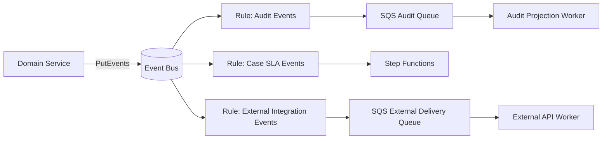

Producer hanya tahu: **saya menerbitkan fakta domain ke bus**.

Consumer hanya tahu: **saya berlangganan subset event yang relevan melalui rule/pipe/schedule**.

---

## 2. Three Primitives, Three Different Jobs

Jangan campur tiga primitive ini sebagai “sama-sama trigger”. Mereka punya fungsi arsitektural berbeda.

| Primitive | Source | Core job | Best for | Hindari untuk |
|---|---|---|---|---|
| EventBridge Rule | Event bus | Match event pattern lalu kirim ke target | Domain event routing | Transformasi kompleks, business workflow panjang |
| EventBridge Pipe | Stream/queue/source tertentu | Point-to-point integration dengan filter/enrich/transform | Menghubungkan SQS/Kinesis/DynamoDB Stream/MSK ke target | Domain event governance luas lintas bounded context |
| EventBridge Scheduler | Time | Trigger target berdasarkan waktu | Reminder, delayed command, periodic job | Long-running workflow, stateful saga, polling database berat |

Rule adalah **event routing**.

Pipe adalah **source-to-target integration**.

Scheduler adalah **time-to-command integration**.

Kalau kamu hanya mengingat satu hal:

> Rule bereaksi terhadap fakta. Pipe mengalirkan record dari source tertentu. Scheduler menciptakan intent berbasis waktu.

---

## 3. EventBridge Rule Mental Model

AWS mendefinisikan rule sebagai konfigurasi yang menentukan event mana yang dikirim ke target. Satu rule dapat mengirim event ke beberapa target yang berjalan paralel.

Dalam desain production, rule adalah **subscription contract**, bukan sekadar konfigurasi console.

Rule harus menjawab:

1. Event apa yang dipilih?
2. Dari source mana?
3. Dengan `detail-type` apa?
4. Field detail apa yang menjadi filter?
5. Target mana yang menerima?
6. Bagaimana failure delivery ditangani?
7. Apakah target butuh event asli atau transformed input?
8. Siapa owner rule?
9. Bagaimana rule diuji sebelum deploy?

Rule yang baik mudah dibaca:

```txt
case-domain.case-events.case-opened-to-sla-workflow
```

Rule yang buruk terdengar seperti random trigger:

```txt
rule-1
case-lambda-trigger
prod-event-handler
send-stuff
```

Nama rule harus memuat semantic:

```txt
<domain-or-bus>.<event-family>.<match-intent>.to.<target-purpose>
```

Contoh:

```txt
case.case-events.deadline-events.to.escalation-workflow
case.case-events.all-events.to.audit-queue
payments.payment-events.failed-payments.to-reconciliation-queue
```

---

## 4. Event Pattern as Routing Contract

Event pattern adalah filter deklaratif. Ini bukan logic bisnis penuh. Ia memilih subset event berdasarkan envelope atau detail.

Contoh event:

```json
{
  "version": "0",
  "id": "evt-01HY...",
  "detail-type": "CaseDeadlineApproaching",
  "source": "com.acme.case",
  "account": "123456789012",
  "time": "2026-07-06T10:15:00Z",
  "region": "ap-southeast-1",
  "detail": {
    "eventId": "case-event-88491",
    "schemaVersion": 1,
    "caseId": "CASE-2026-00091",
    "tenantId": "regulator-id",
    "severity": "HIGH",
    "deadlineType": "RESPONSE_DUE",
    "dueAt": "2026-07-08T17:00:00Z"
  }
}
```

Rule untuk escalation:

```json
{
  "source": ["com.acme.case"],
  "detail-type": ["CaseDeadlineApproaching"],
  "detail": {
    "severity": ["HIGH", "CRITICAL"],
    "deadlineType": ["RESPONSE_DUE", "ACTION_DUE"]
  }
}
```

Rule untuk audit projection:

```json
{
  "source": ["com.acme.case"],
  "detail": {
    "tenantId": ["regulator-id"]
  }
}
```

Rule untuk semua case events versi tertentu:

```json
{
  "source": ["com.acme.case"],
  "detail": {
    "schemaVersion": [1]
  }
}
```

### 4.1 Do Not Treat Event Pattern as Authorization

Event pattern bukan pengganti authorization.

Pattern dapat mengurangi routing, tapi tidak boleh menjadi satu-satunya kontrol bahwa consumer hanya melihat data yang boleh dilihat.

Kalau event memuat data sensitif, filter tidak cukup. Gunakan salah satu:

- event minim data, consumer fetch detail via authorized API
- separate bus per sensitivity boundary
- separate account boundary
- encrypted payload pattern dengan key policy ketat
- queue per consumer dengan IAM scope jelas

Routing filter adalah **selection**, bukan **security model**.

---

## 5. Rule Target Design

EventBridge target bisa berupa banyak AWS service. Untuk sistem application/database, target yang paling sering dipakai:

- SQS queue
- Step Functions state machine
- Lambda function
- SNS topic
- another EventBridge event bus
- API destination
- Kinesis stream
- ECS task

Tapi target selection harus mengikuti failure semantics, bukan convenience.

| Target | Cocok ketika | Risiko utama |
|---|---|---|
| SQS | consumer butuh durable buffer, retry, DLQ, backpressure | queue backlog dan duplicate processing |
| Step Functions | event memulai workflow terstruktur | workflow explosion jika semua event jadi workflow |
| Lambda | handler ringan, cepat, idempotent | retry storm, concurrency spike, hidden state |
| SNS | fanout notification sederhana | routing governance lebih lemah dari EventBridge untuk domain event luas |
| Another bus | cross-account/domain routing | loop, governance, permission complexity |
| API Destination | invoke external/internal HTTPS endpoint | external availability, auth rotation, timeout |

Default production recommendation:

> Untuk consumer penting yang menulis database atau memanggil external system, jadikan **SQS sebagai target rule**, lalu worker memproses message.

Mengapa?

- EventBridge delivery failure bukan tempat terbaik untuk business retry panjang.
- SQS memberi backlog visibility.
- Worker bisa dikontrol concurrency-nya.
- DLQ bisa dipisahkan dari EventBridge delivery DLQ.
- Database bisa dilindungi dari spike.

Pattern:

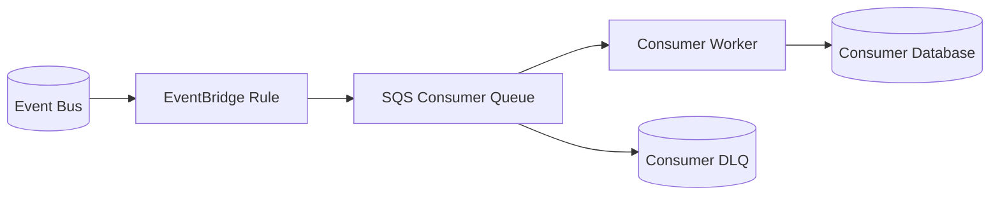

---

## 6. Rule to Multiple Targets: Use Carefully

EventBridge rule dapat mengirim ke beberapa target secara paralel. Fitur ini terlihat nyaman, tapi sering membuat ownership buram.

Contoh buruk:

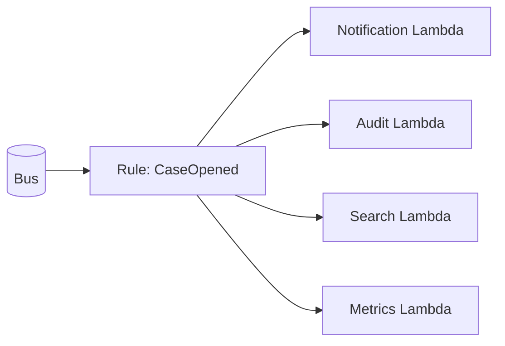

Masalah:

- satu rule dimiliki siapa?
- apakah semua target butuh pattern sama?
- apakah failure satu target mempengaruhi mental model delivery?
- apakah perubahan filter untuk satu target aman untuk target lain?
- apakah observability per subscription jelas?

Lebih baik:

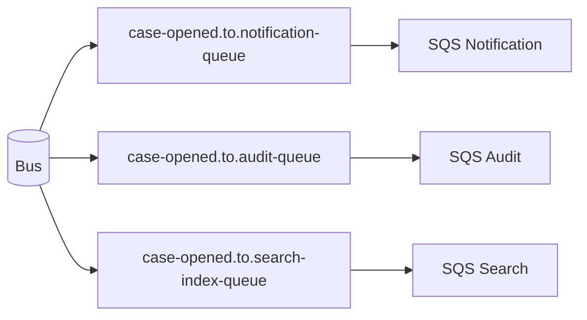

Satu rule per subscription intent lebih verbose, tapi lebih defensible.

### Rule ownership invariant

> Satu rule harus punya satu owner dan satu alasan bisnis yang jelas.

Kalau rule punya target banyak dengan lifecycle berbeda, pecah rule.

---

## 7. Input Transformation: Useful, Dangerous, and Often Overused

EventBridge dapat melakukan input transformation sebelum mengirim ke target.

Gunakan untuk:

- wrapping event ke target-specific command envelope
- memilih field minimal untuk target sederhana
- menambahkan static metadata
- mengubah payload agar sesuai format target yang tidak bisa diubah

Hindari untuk:

- business logic
- enrichment yang butuh data external
- compatibility hack permanen
- mapping kompleks yang tidak diuji
- mengubah semantic event menjadi command tanpa nama eksplisit

Contoh transformasi aman:

Event asli:

```json
{
  "source": "com.acme.case",
  "detail-type": "CaseDeadlineApproaching",
  "detail": {
    "caseId": "CASE-1",
    "severity": "HIGH",
    "dueAt": "2026-07-08T17:00:00Z"
  }
}
```

Payload ke Step Functions:

```json
{
  "commandType": "START_ESCALATION_REVIEW",
  "caseId": "CASE-1",
  "reason": "DEADLINE_APPROACHING",
  "severity": "HIGH",
  "dueAt": "2026-07-08T17:00:00Z"
}
```

Ini masih masuk akal karena target memang workflow command.

Contoh transformasi buruk:

```json
{
  "shouldEscalate": true,
  "priority": "P1",
  "assignedTeam": "REGION_A_HIGH_RISK_SPECIAL_REVIEW",
  "computedPenaltyBand": "BAND_3"
}
```

Itu bukan routing. Itu business decision. Letakkan di service/workflow yang bisa diuji, diaudit, dan diobservasi.

---

## 8. EventBridge Pipes Mental Model

Rule bekerja di event bus. Pipe bekerja sebagai point-to-point integration dari source tertentu ke target.

AWS menjelaskan setup pipe sebagai memilih source, optional filtering, optional enrichment, lalu target.

Pipeline mental model:

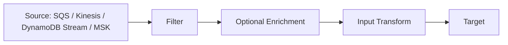

Pipe cocok ketika kamu ingin menghindari Lambda glue code yang hanya melakukan:

```txt
read from source -> filter -> call API for enrichment -> send to target
```

Pipe bukan pengganti domain service. Pipe adalah integration shortcut yang tetap harus punya contract dan observability.

---

## 9. When to Use Pipes Instead of Rules

Gunakan **Rule** ketika:

- source utama adalah EventBridge bus
- kamu sedang merutekan domain event lintas bounded context
- subscription harus terlihat sebagai bagian dari event governance
- banyak consumer memilih event berdasarkan `source`, `detail-type`, dan `detail`

Gunakan **Pipe** ketika:

- source adalah SQS, Kinesis, DynamoDB Stream, Amazon MSK, atau stream/queue lain yang didukung
- kamu butuh point-to-point connection
- kamu ingin filter record sebelum memanggil target
- kamu butuh enrichment ringan
- kamu ingin mengurangi Lambda glue code

Contoh pipe yang baik:

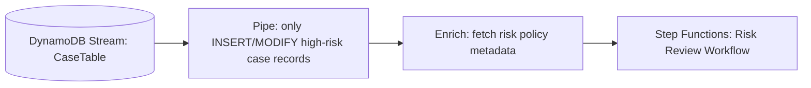

Contoh pipe yang meragukan:

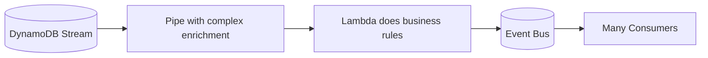

Jika hasil akhirnya adalah domain event untuk banyak consumer, pertimbangkan service/outbox publisher yang eksplisit. Pipe dari DB stream langsung ke event bus bisa berguna, tapi jangan biarkan database stream menjadi domain model publik tanpa control.

---

## 10. Pipes Filtering: Move Cheap Rejection Earlier

Filtering di Pipe bisa mengurangi pemrosesan target. Ini bermanfaat untuk source bervolume tinggi.

Contoh DynamoDB Stream record. Hanya kirim perubahan status `APPROVED`:

```json
{
  "eventName": ["MODIFY"],
  "dynamodb": {
    "NewImage": {
      "status": {
        "S": ["APPROVED"]
      }
    }
  }
}
```

Contoh SQS payload. Hanya proses tenant tertentu:

```json
{
  "body": {
    "tenantId": ["regulator-id"],
    "eventType": ["CaseOpened", "CaseReopened"]
  }
}
```

Desain filtering yang sehat:

- filter berdasarkan field stabil
- field filter masuk contract source
- filter pattern diuji di CI
- filter tidak bergantung pada incidental field
- filter tidak menggantikan authorization
- filter miss bisa didiagnosis

Anti-pattern:

```txt
Pipe filter matches on free-text description, localized label, display name, or UI-only field.
```

Filter seperti itu akan pecah saat copywriting berubah.

---

## 11. Pipes Enrichment: Sharp Tool, Not Business Layer

Enrichment dapat memanggil service untuk menambah informasi sebelum target.

Gunakan enrichment untuk:

- resolve lookup kecil
- fetch configuration snapshot
- translate ID ke small context payload
- validate target routing metadata
- enrich notification content minimal

Jangan gunakan enrichment untuk:

- long-running business calculation
- transaction dengan side effect
- write ke database utama
- workflow branching kompleks
- policy decision besar yang butuh audit trail formal

Contoh enrichment sehat:

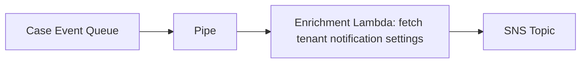

Enrichment buruk:

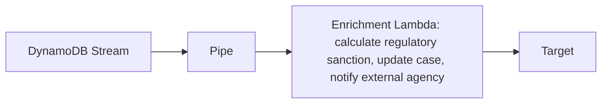

Itu bukan enrichment. Itu application service tersembunyi.

### 11.1 Enrichment as Filter

AWS dokumentasi Pipes enrichment menyebut enrichment response dapat langsung diteruskan ke target; enrichment juga dapat mengembalikan response kosong agar target tidak dipanggil.

Gunakan ini hati-hati.

Kalau enrichment dipakai sebagai filter, maka alasan drop harus bisa diobservasi. Kalau tidak, debugging menjadi sulit:

```txt
source count high -> pipe target count low -> apakah filter benar, enrichment drop, atau error?
```

Tambahkan metric:

- `records_received`
- `records_filtered_by_pattern`
- `records_dropped_by_enrichment`
- `records_sent_to_target`
- `enrichment_errors`
- `target_errors`

---

## 12. Pipe Source and Target Design

Pipe memperjelas satu koneksi. Tapi production safety tetap bergantung pada source dan target semantics.

### 12.1 SQS Source

Pipe dari SQS cocok untuk:

- filter message sebelum workflow
- enrich message sebelum API destination
- route subset ke event bus

Perhatikan:

- SQS tetap at-least-once
- target harus idempotent
- visibility timeout harus cukup
- failure target dapat membuat message diproses ulang
- DLQ source masih penting

### 12.2 DynamoDB Stream Source

Pipe dari DynamoDB Stream cocok untuk:

- projection update
- event materialization
- workflow trigger dari state transition tertentu

Perhatikan:

- stream record bukan domain event otomatis
- database image dapat mengandung data internal
- eventName `INSERT/MODIFY/REMOVE` belum menjelaskan business fact
- old/new image perlu mapping eksplisit
- target harus tahan duplicate/retry

Jika ingin domain event, lebih baik outbox record eksplisit:

```txt
DynamoDB transaction writes business entity + outbox item
DynamoDB Stream observes outbox item
Pipe filters only outbox item
Target receives domain event envelope
```

### 12.3 Kinesis/MSK Source

Pipe dari stream cocok untuk:

- filtering high-volume records
- enrichment ringan
- pushing subset to Step Functions/SQS/EventBridge

Perhatikan:

- ordering/partition semantics source
- batch size
- backpressure
- poison record
- target throughput
- replay from stream bukan sama dengan EventBridge replay

---

## 13. Scheduler Mental Model

EventBridge Scheduler adalah serverless scheduler untuk membuat, menjalankan, dan mengelola task terjadwal. Ia mendukung one-time schedule, recurring schedule, cron/rate expression, flexible time window, retry, dan banyak target AWS API.

Dalam desain application/database, scheduler harus dilihat sebagai:

> **time-based command producer**

Bukan sekadar cron replacement.

Command berbasis waktu harus punya owner, idempotency, dan lifecycle.

Contoh:

```txt
At 2026-07-08T09:00:00+07:00, trigger command:
SendCaseDeadlineReminder(caseId=CASE-123, reminderKind=FIRST_REMINDER)
```

Ini bukan event fakta. Ini intent.

Scheduler menghasilkan command karena waktu sudah sampai. Setelah command sukses, domain service mungkin menerbitkan event:

```txt
CaseDeadlineReminderSent
```

---

## 14. Scheduler vs Scheduled Rule

EventBridge dulu sering memakai scheduled rule. Untuk kebutuhan scheduling modern, EventBridge Scheduler memberi model yang lebih spesifik.

Practical guidance:

| Kebutuhan | Pilihan |
|---|---|
| satu periodic system job sederhana | Scheduler atau rule legacy, pilih Scheduler untuk desain baru |
| jutaan reminder per entity | Scheduler, tapi desain lifecycle dan cleanup serius |
| cron kecil untuk maintenance | Scheduler |
| domain event routing | EventBridge rule, bukan Scheduler |
| delayed command per aggregate | Scheduler atau SQS delay, tergantung delay dan cardinality |
| workflow wait state | Step Functions `Wait`, bukan Scheduler eksternal kecuali command lifecycle memang external |

---

## 15. Scheduled Command Pattern

Problem:

Saat case dibuat, sistem harus mengirim reminder 2 hari sebelum deadline, lalu escalate saat deadline lewat.

Naive design:

```txt
cron every 5 minutes -> scan all open cases -> find due reminders -> send reminder
```

Masalah:

- database scan mahal
- job overlap
- race condition
- retry sulit
- idempotency kabur
- multi-tenant fairness buruk
- sulit tahu reminder mana yang pending

Scheduled command design:

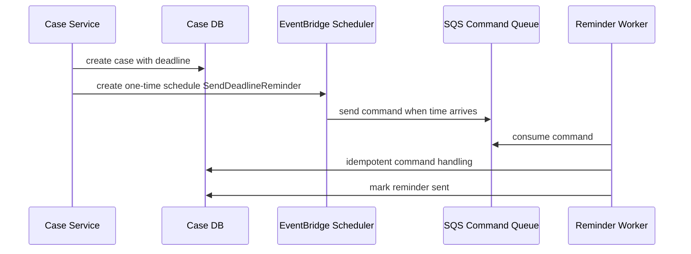

Command payload:

```json
{
  "commandId": "cmd-reminder-CASE-123-FIRST",
  "commandType": "SendDeadlineReminder",
  "caseId": "CASE-123",
  "tenantId": "regulator-id",
  "reminderKind": "FIRST",
  "scheduledFor": "2026-07-08T02:00:00Z",
  "createdBy": "case-service",
  "schemaVersion": 1
}
```

Worker idempotency:

```sql
CREATE TABLE scheduled_command_execution (
  command_id TEXT PRIMARY KEY,
  command_type TEXT NOT NULL,
  status TEXT NOT NULL,
  first_seen_at TIMESTAMPTZ NOT NULL DEFAULT now(),
  completed_at TIMESTAMPTZ,
  result_hash TEXT
);
```

Handling:

```pseudo
handle(command):
  inserted = try_insert_execution(command.commandId, status='IN_PROGRESS')

  if not inserted:
    existing = load_execution(command.commandId)
    if existing.status == 'COMPLETED':
      return existing.result
    if existing.status == 'IN_PROGRESS' and not stale(existing):
      return retry_later()

  case = load_case(command.caseId)

  if case.deadlineChangedAfter(command.scheduledFor):
    mark_skipped(command.commandId, reason='STALE_SCHEDULE')
    return

  if reminder_already_sent(case, command.reminderKind):
    mark_completed(command.commandId, result='ALREADY_SENT')
    return

  send_reminder(case)
  mark_reminder_sent(case, command.reminderKind)
  mark_completed(command.commandId, result='SENT')
```

Key idea:

> Scheduler fires at-least-once-like in spirit for reliability. Your command handler must be safe if invoked more than once.

---

## 16. Scheduler and Mutable Deadlines

Deadlines change. That is where scheduled commands become tricky.

Scenario:

```txt
Case deadline: July 10
Reminder schedule created for July 8
Case deadline extended to July 20
Old reminder schedule must not send stale reminder
```

There are two valid approaches.

### Approach A — Update/Delete Schedule

When deadline changes:

1. update case transaction
2. cancel old schedule
3. create new schedule
4. store schedule name/arn/version in DB

Data model:

```sql
CREATE TABLE case_deadline_schedule (
  case_id TEXT NOT NULL,
  reminder_kind TEXT NOT NULL,
  schedule_name TEXT NOT NULL,
  deadline_version BIGINT NOT NULL,
  scheduled_for TIMESTAMPTZ NOT NULL,
  status TEXT NOT NULL,
  PRIMARY KEY (case_id, reminder_kind)
);
```

Command includes `deadlineVersion`:

```json
{
  "commandId": "cmd-reminder-CASE-123-FIRST-v7",
  "caseId": "CASE-123",
  "deadlineVersion": 7,
  "scheduledFor": "2026-07-18T02:00:00Z"
}
```

Worker checks current version before acting.

### Approach B — Immutable Schedule + Staleness Check

Instead of deleting old schedule perfectly, allow old commands to fire but make them harmless.

This is often more robust.

Rule:

```txt
A scheduled command may become stale. Stale command must be detected and skipped by target handler.
```

This handles:

- schedule deletion failure
- race between update and fired command
- retry after target failure
- duplicate invocation

Production systems usually need both:

- best-effort cancel/update schedule
- mandatory staleness check in handler

---

## 17. Scheduler Target Choice

Do not send scheduled command directly into a fragile business Lambda unless you understand retry and concurrency behavior.

Better default:

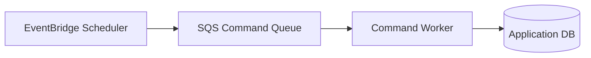

Why SQS target?

- buffers spikes at exact minute boundaries
- gives DLQ and backlog metrics
- decouples Scheduler delivery from business execution
- allows worker concurrency control
- simplifies redrive

Direct Step Functions target is good when command starts a workflow:

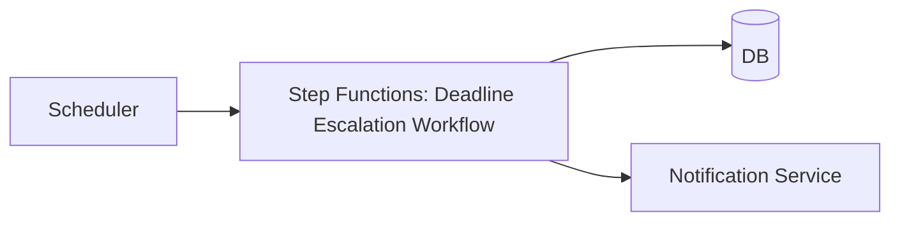

Direct Lambda target is acceptable for:

- small low-risk jobs
- idempotent maintenance tasks
- operations with strong retry safety

---

## 18. Routing, Enrichment, Scheduling: Combined Example

Use case:

- Case service emits `CaseOpened` and `CaseDeadlineChanged`.
- Audit projection wants all case events.
- SLA workflow wants high-risk case events.
- Reminder service needs scheduled reminders.
- Search projection consumes DB stream changes.

Architecture:

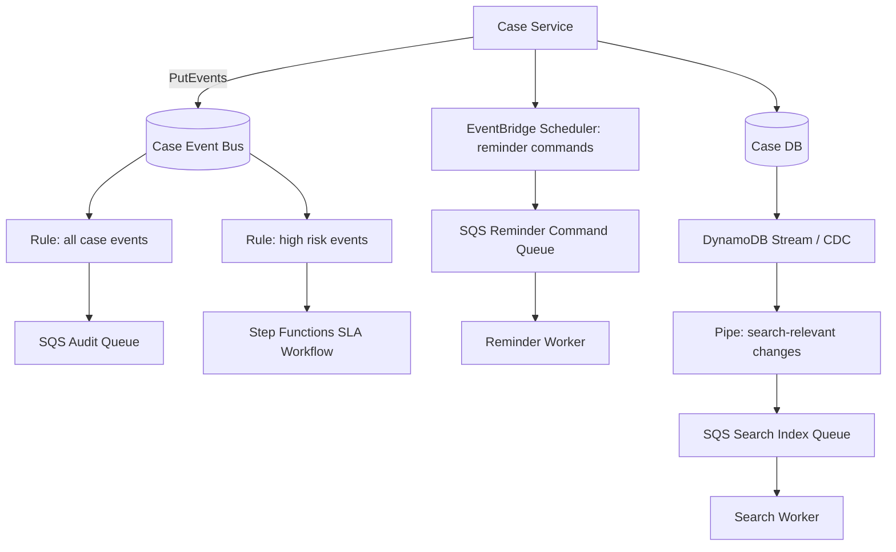

What each primitive owns:

| Primitive | Responsibility |
|---|---|
| RuleAudit | domain event subscription for audit |
| RuleSLA | domain event routing to workflow |
| Scheduler | time-based command creation |
| Pipe | source-to-target integration from DB stream to search projection |
| SQS queues | buffering/backpressure/retry per consumer |
| Workers | idempotent business side effects |

---

## 19. Common Failure Modes

### 19.1 Rule Pattern Too Broad

Symptoms:

- target receives unrelated events
- consumer has many `if eventType != ... return` branches
- cost grows
- debugging noisy

Fix:

- tighten `source` and `detail-type`
- split event families
- make target-specific rule
- add contract tests for event pattern

### 19.2 Rule Pattern Too Narrow

Symptoms:

- expected events do not arrive
- schema evolution silently breaks consumer
- filter field renamed or moved

Fix:

- test rule against sample events
- version filter explicitly
- avoid filtering on volatile fields
- add metric for producer event count vs target delivery count

### 19.3 Pipe Becomes Hidden Application Service

Symptoms:

- enrichment Lambda contains business decision logic
- pipe has no domain owner
- failure reason hidden in integration config
- debugging requires reading console settings

Fix:

- move business logic to named service/workflow
- keep pipe transformation shallow
- document pipe as integration contract
- monitor filter/enrichment/target counts

### 19.4 Scheduler Creates Duplicate Business Actions

Symptoms:

- reminders sent twice
- escalation opened twice
- stale deadline command still executes

Fix:

- stable command ID
- idempotency table
- deadline version in command
- staleness check against source of truth
- SQS buffer target

### 19.5 Rule Target Directly Overloads Database

Symptoms:

- event spike invokes many Lambdas
- Lambdas open too many database connections
- RDS/Aurora connection exhaustion
- retries make load worse

Fix:

- use SQS target
- worker concurrency limit
- RDS Proxy if appropriate
- database-aware autoscaling
- retry budget

---

## 20. Contract Testing for Rules and Pipes

Event pattern is code. Treat it like code.

Repository layout:

```txt
integration-contracts/
  eventbridge/
    rules/
      case-deadline-to-escalation.rule.json
      case-events-to-audit.rule.json
    samples/
      case-deadline-approaching.v1.json
      case-opened.v1.json
      payment-received.v1.json
    tests/
      case-deadline-to-escalation.test.yaml
```

Test spec example:

```yaml
rule: case-deadline-to-escalation.rule.json
cases:
  - name: high severity deadline event matches
    event: case-deadline-approaching-high.v1.json
    expectMatch: true
  - name: low severity deadline event does not match
    event: case-deadline-approaching-low.v1.json
    expectMatch: false
  - name: unrelated payment event does not match
    event: payment-received.v1.json
    expectMatch: false
```

For Pipes:

```txt
pipe-contracts/
  search-index-pipe/
    source-records/
    filter-pattern.json
    enrichment-contract.md
    target-payload-schema.json
```

Test what matters:

- source record accepted/rejected
- enrichment input shape
- enrichment output shape
- target payload shape
- compatibility with old events

---

## 21. Observability Model

You need observability at each boundary:

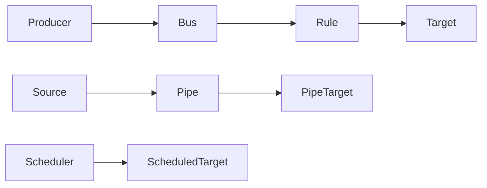

Minimum dashboard:

### Event Bus / Rules

- events published by source
- matched events per rule
- failed invocations per target
- throttled invocations
- DLQ messages if configured
- target age/lag if target is SQS

### Pipes

- source records read
- records filtered
- enrichment invocation count
- enrichment errors
- target invocation errors
- target latency
- backlog/iterator age if source is stream

### Scheduler

- schedules created/deleted/updated
- invocations attempted
- target failures
- DLQ count
- command execution status in target system
- stale command skip count

Application-level metric is more important than AWS-level metric:

```txt
case_reminder_commands_scheduled_total
case_reminder_commands_fired_total
case_reminder_commands_completed_total
case_reminder_commands_skipped_stale_total
case_reminder_commands_failed_total
```

Without application metric, Scheduler may look healthy while business action silently skips or duplicates.

---

## 22. IAM and Governance

Rules, Pipes, and Scheduler can invoke targets. That means permission mistakes can create surprising blast radius.

Basic governance:

- each rule/pipe/schedule group has owner tag
- target IAM role is least privilege
- event bus resource policy is explicit
- cross-account routing is reviewed
- schedule creation API is restricted
- API destination credentials are rotated
- DLQ access is controlled because messages may contain payload data

Tags:

```yaml
tags:
  domain: case-management
  owner: case-platform-team
  environment: prod
  data-classification: internal
  integration-type: eventbridge-rule
  runbook: rb-case-event-routing
```

For scheduled commands, add:

```yaml
  command-owner: reminder-service
  command-type: SendDeadlineReminder
```

---

## 23. Infrastructure as Code Skeleton

Pseudo-CDK-like shape:

```ts
const bus = new events.EventBus(this, "CaseEventBus", {
  eventBusName: "case-events-prod",
});

const auditQueue = new sqs.Queue(this, "CaseAuditQueue", {
  queueName: "case-audit-events-prod",
  deadLetterQueue: {
    queue: auditDlq,
    maxReceiveCount: 5,
  },
});

new events.Rule(this, "CaseEventsToAuditRule", {
  eventBus: bus,
  ruleName: "case.case-events.all.to.audit-queue",
  eventPattern: {
    source: ["com.acme.case"],
  },
  targets: [new targets.SqsQueue(auditQueue)],
});
```

Pipe skeleton:

```ts
new pipes.CfnPipe(this, "SearchIndexPipe", {
  name: "case-stream-to-search-index-prod",
  roleArn: pipeRole.roleArn,
  source: caseStreamArn,
  sourceParameters: {
    dynamoDbStreamParameters: {
      startingPosition: "LATEST",
      batchSize: 100,
    },
    filterCriteria: {
      filters: [
        {
          pattern: JSON.stringify({
            eventName: ["INSERT", "MODIFY"],
            dynamodb: {
              NewImage: {
                entityType: { S: ["CASE"] },
              },
            },
          }),
        },
      ],
    },
  },
  target: searchIndexQueue.queueArn,
});
```

Scheduler skeleton:

```ts
new scheduler.CfnSchedule(this, "DeadlineReminderSchedule", {
  name: "case-CASE-123-first-reminder-v7",
  groupName: "case-reminders-prod",
  scheduleExpression: "at(2026-07-08T02:00:00)",
  flexibleTimeWindow: { mode: "OFF" },
  target: {
    arn: reminderQueue.queueArn,
    roleArn: schedulerRole.roleArn,
    input: JSON.stringify({
      commandId: "cmd-reminder-CASE-123-FIRST-v7",
      commandType: "SendDeadlineReminder",
      caseId: "CASE-123",
      deadlineVersion: 7,
      schemaVersion: 1,
    }),
  },
});
```

The code is skeleton. Real production IaC must include IAM, DLQ, alarms, tags, retention, encryption, and deployment safeguards.

---

## 24. Design Decision Records

### 24.1 Rule DDR

```md
# DDR: Route high-risk case deadline events to escalation workflow

## Context
Case service emits CaseDeadlineApproaching. High and critical severity cases require escalation workflow.

## Decision
Create EventBridge rule on case event bus matching:
- source = com.acme.case
- detail-type = CaseDeadlineApproaching
- detail.severity in HIGH, CRITICAL

Target: Step Functions escalation workflow.

## Consequences
- Producer remains decoupled from escalation workflow.
- Workflow must be idempotent by eventId/caseId/deadlineVersion.
- Rule must be tested against sample events in CI.
- Failed workflow starts go to target DLQ/alarm.
```

### 24.2 Pipe DDR

```md
# DDR: Use EventBridge Pipe for case table stream to search queue

## Context
Search projection needs selected changes from case table. A Lambda currently reads stream and forwards all changes.

## Decision
Replace glue Lambda with Pipe:
- source: DynamoDB Stream
- filter: entityType=CASE and operation INSERT/MODIFY
- target: SQS search indexing queue

## Consequences
- Less glue code.
- Pipe filter is now integration contract and must be tested.
- Search worker remains idempotent.
- Business transformation stays in search worker, not Pipe enrichment.
```

### 24.3 Scheduler DDR

```md
# DDR: Use EventBridge Scheduler for per-case deadline reminders

## Context
Cron scan over open cases causes DB load and duplicate reminder risk.

## Decision
Create one-time schedule per deadline reminder. Target is SQS command queue.

## Consequences
- Reminder command has stable commandId and deadlineVersion.
- Worker performs idempotency and staleness check.
- Deadline change updates schedule best-effort but stale command remains safe.
- Schedule lifecycle must be reconciled periodically.
```

---

## 25. Production Checklist

Before shipping EventBridge Rules:

- [ ] rule name describes source, event family, and target purpose
- [ ] event pattern tested against positive/negative sample events
- [ ] target owner is explicit
- [ ] target failure handling is configured
- [ ] SQS target used where backpressure matters
- [ ] target handler is idempotent
- [ ] metrics/alarms exist for failed invocations and downstream backlog
- [ ] replay behavior is documented
- [ ] rule is deployed by IaC, not manual console change

Before shipping EventBridge Pipes:

- [ ] source semantics documented
- [ ] filter pattern tested
- [ ] enrichment is not hidden business logic
- [ ] target payload schema documented
- [ ] target is idempotent
- [ ] source/target throughput checked
- [ ] failure path and DLQ/backlog known
- [ ] metrics distinguish filter drop, enrichment failure, and target failure

Before shipping EventBridge Scheduler:

- [ ] schedule represents command, not fact
- [ ] command has stable `commandId`
- [ ] target handler is idempotent
- [ ] stale command check exists
- [ ] schedule lifecycle stored in application DB if per-entity
- [ ] update/delete race is safe
- [ ] SQS target used for buffering unless direct target is intentionally chosen
- [ ] failed invocations have DLQ/alarms
- [ ] reconciliation job detects missing/orphan schedules

---

## 26. Mental Model Recap

Rules:

> “When event matching this pattern appears on this bus, send it to this target.”

Pipes:

> “Move records from this source to this target, optionally filtering and enriching on the way.”

Scheduler:

> “At this time, produce this command to this target.”

Production invariant:

> **Routing, enrichment, and scheduling are not business correctness by themselves. Correctness still lives in idempotent handlers, database constraints, explicit state machines, observability, and replay-safe design.**

Part berikutnya akan membahas Archive and Replay: bagaimana memproses ulang event tanpa menghancurkan invariants, tanpa duplicate side effect, dan tanpa replay storm.
