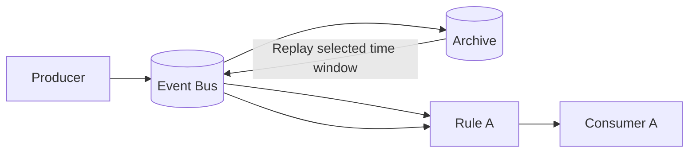
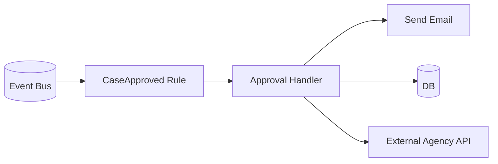
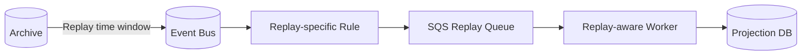
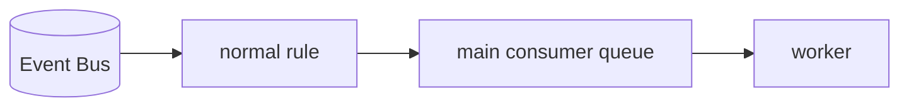
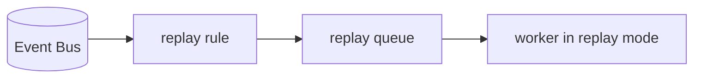
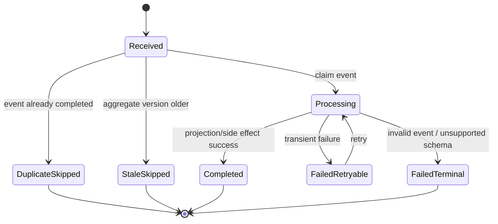
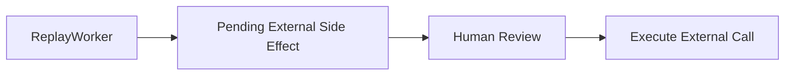
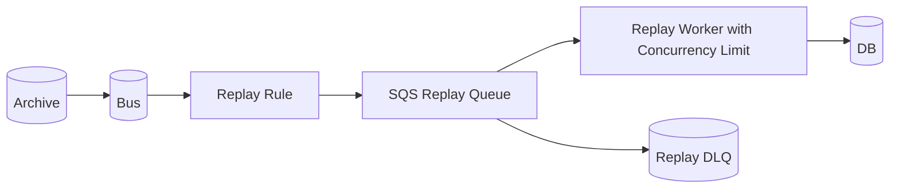
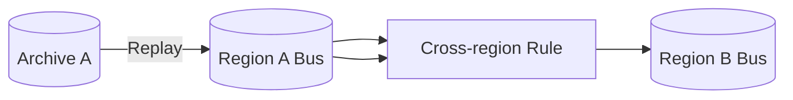
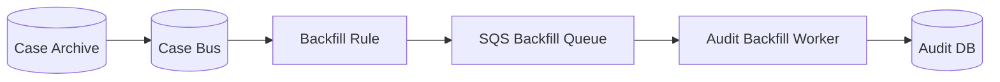

# Part 038 — Archive and Replay: Reprocessing Events Without Breaking Invariants

Event replay terdengar seperti fitur ajaib:

> “Kalau consumer bug, tinggal replay event lama.”

Di production, kalimat itu berbahaya jika sistem belum replay-safe.

Replay bukan tombol undo. Replay adalah operasi produksi yang mengirim event lama kembali ke event bus. Kalau consumer tidak idempotent, side effect tidak dibatasi, atau event contract tidak stabil, replay bisa menggandakan email, membuka enforcement action dua kali, memposting ledger dua kali, atau menimpa state baru dengan state lama.

Amazon EventBridge Archive and Replay memungkinkan event yang masuk ke event bus disimpan dalam archive lalu dikirim ulang ke event bus yang sama pada waktu berikutnya. AWS dokumentasi menyebut replay bisa dipakai untuk recovery dari error atau validasi functionality baru. Tapi arsitektur yang baik harus mengasumsikan:

> **Setiap event yang bisa di-replay dapat muncul lagi. Setiap consumer harus bisa membedakan “event baru”, “event duplicate”, “event lama tapi valid”, dan “event lama yang sudah stale”.**

Referensi utama:

- EventBridge Archive and Replay: `https://docs.aws.amazon.com/eventbridge/latest/userguide/eb-archive.html`
- Creating event archives: `https://docs.aws.amazon.com/eventbridge/latest/userguide/eb-archive-event.html`
- Creating replays: `https://docs.aws.amazon.com/eventbridge/latest/userguide/eb-replay-archived-event.html`
- EventBridge event buses: `https://docs.aws.amazon.com/eventbridge/latest/userguide/eb-event-bus.html`
- EventBridge rules: `https://docs.aws.amazon.com/eventbridge/latest/userguide/eb-rules.html`
- Event patterns: `https://docs.aws.amazon.com/eventbridge/latest/userguide/eb-event-patterns.html`

---

## 1. What Archive and Replay Really Means

Archive:

```txt
EventBridge stores selected events from an event bus according to an archive event pattern and retention period.
```

Replay:

```txt
EventBridge resends archived events for a selected time window to the same event bus that originally received them, optionally through selected rules.
```

Important consequences:

1. Replay is not consumer-specific storage like a Kafka consumer offset.
2. Replay sends events back through EventBridge routing.
3. Replayed events can invoke normal rules/targets unless scoped carefully.
4. Replay can create duplicate processing.
5. Replay can trigger side effects unless consumers guard against it.
6. Replay is a production operation and needs runbook, approval, and monitoring.

Mental model:



The replayed event travels back through routing. It is not magically delivered only to the broken consumer unless replay target rules are constrained.

---

## 2. Why Replay Exists

Replay is useful for specific classes of problems.

### 2.1 Consumer Bug Recovery

A consumer was deployed with a bug:

```txt
CaseOpened events from 09:00-11:00 were consumed but not written to audit projection.
```

Fix consumer, replay event window, rebuild missing projection.

### 2.2 New Consumer Backfill

You introduce a new search projection:

```txt
Search service needs last 30 days of CaseOpened and CaseUpdated events.
```

Replay archived events into new consumer route.

### 2.3 Rule Misconfiguration

A rule pattern was too narrow:

```txt
severity = HIGH matched, but CRITICAL was omitted.
```

Fix rule, replay time window.

### 2.4 Validation of New Functionality

You want to test a new projection logic against real historical events in non-production or controlled production path.

### 2.5 Disaster Recovery Adjacent

A downstream queue/consumer lost processing window due to incident.

Replay can repopulate work, assuming event history exists and downstream is replay-safe.

---

## 3. Why Replay Is Dangerous

Replay can break systems because event-driven systems often hide side effects behind consumers.

Example:



Replay of `CaseApproved` may:

- send email again
- call external agency again
- insert duplicate DB rows
- overwrite newer status
- trigger workflows again

Replay safety is not an EventBridge feature. Replay safety is an application design property.

---

## 4. Replay-Safe Consumer Invariants

A replay-safe consumer must satisfy these invariants:

### Invariant 1 — Stable Event Identity

Every event has stable `eventId` controlled by producer.

Do not rely only on transient transport id if your business id must survive republish, replay, or outbox retry.

Good envelope:

```json
{
  "eventId": "case-event-01J1E2...",
  "eventType": "CaseOpened",
  "schemaVersion": 1,
  "aggregateType": "Case",
  "aggregateId": "CASE-2026-00001",
  "aggregateVersion": 4,
  "occurredAt": "2026-07-06T09:10:00Z",
  "publishedAt": "2026-07-06T09:10:02Z",
  "producer": "case-service",
  "correlationId": "corr-...",
  "causationId": "cmd-..."
}
```

### Invariant 2 — Idempotent Processing Ledger

Each consumer stores event processing status.

Relational example:

```sql
CREATE TABLE consumer_event_inbox (
  consumer_name TEXT NOT NULL,
  event_id TEXT NOT NULL,
  aggregate_id TEXT NOT NULL,
  event_type TEXT NOT NULL,
  event_occurred_at TIMESTAMPTZ NOT NULL,
  processing_status TEXT NOT NULL,
  first_seen_at TIMESTAMPTZ NOT NULL DEFAULT now(),
  last_seen_at TIMESTAMPTZ NOT NULL DEFAULT now(),
  completed_at TIMESTAMPTZ,
  failure_reason TEXT,
  PRIMARY KEY (consumer_name, event_id)
);
```

DynamoDB example:

```json
{
  "PK": "CONSUMER#audit-projection",
  "SK": "EVENT#case-event-01J1E2",
  "eventId": "case-event-01J1E2",
  "aggregateId": "CASE-2026-00001",
  "status": "COMPLETED",
  "firstSeenAt": "2026-07-06T09:10:03Z",
  "completedAt": "2026-07-06T09:10:04Z"
}
```

### Invariant 3 — Side Effects Are Guarded

External side effects need their own idempotency key.

Email:

```txt
emailIdempotencyKey = consumerName + eventId + emailTemplate + recipient
```

External API:

```txt
externalRequestId = businessCommandId or eventId-derived key
```

Ledger posting:

```txt
ledgerEntryId = deterministic hash(eventId, ledgerPurpose)
```

### Invariant 4 — State Updates Are Monotonic or Version-Checked

Replay of old event must not overwrite newer state.

Bad:

```sql
UPDATE case_projection
SET status = :eventStatus
WHERE case_id = :caseId;
```

Good:

```sql
UPDATE case_projection
SET status = :eventStatus,
    aggregate_version = :eventAggregateVersion,
    updated_from_event_id = :eventId
WHERE case_id = :caseId
  AND aggregate_version < :eventAggregateVersion;
```

### Invariant 5 — Replay Is Observable

Consumer must expose:

- processed new events
- duplicate events skipped
- stale events skipped
- replay events processed
- side effects suppressed
- failed events
- lag/backlog

Without this, replay becomes gambling.

---

## 5. Archive Design

Archive should not be “store everything forever” by default. Archive design is part of data governance.

Questions:

1. Which bus is archived?
2. Which event patterns are archived?
3. What retention period is needed?
4. What data classification is inside events?
5. Is payload minimal enough to store long-term?
6. Who can start replay?
7. How do we prevent replay to unintended targets?
8. How do we audit replay operations?

### 5.1 Archive Event Pattern

Archive only what has recovery value.

Example: archive all case domain events:

```json
{
  "source": ["com.acme.case"]
}
```

Archive only selected critical events:

```json
{
  "source": ["com.acme.case"],
  "detail-type": [
    "CaseOpened",
    "CaseAssigned",
    "CaseDeadlineChanged",
    "EnforcementActionApproved"
  ]
}
```

Avoid archiving noisy technical events with low replay value unless you have a clear use case.

### 5.2 Retention Decision

Retention should be tied to recovery scenarios:

| Scenario | Retention implication |
|---|---|
| consumer deployment rollback within hours | short retention may be enough |
| projection rebuild for 30 days | at least 30 days |
| audit/legal reconstruction | may need longer, but consider dedicated audit store |
| new consumer backfill | depends on product rollout window |
| incident forensic analysis | align with ops policy |

Archive is not automatically your audit ledger. Audit ledger usually needs stronger guarantees, query model, retention policy, and access controls.

### 5.3 Data Minimization

Event payload should be replayable but not excessive.

Bad event:

```json
{
  "eventType": "CitizenProfileUpdated",
  "detail": {
    "citizenName": "...",
    "nationalId": "...",
    "address": "...",
    "phone": "...",
    "fullCaseNarrative": "..."
  }
}
```

Better:

```json
{
  "eventType": "CitizenProfileUpdated",
  "detail": {
    "profileId": "PROFILE-123",
    "changedFields": ["address"],
    "profileVersion": 18
  }
}
```

Consumer can fetch sensitive detail via authorized service if needed.

---

## 6. Replay Scope

AWS documentation describes replaying events from an archive back to the same event bus and choosing all rules or specified rules.

In production, default to **specified rules**, not all rules.

Bad replay runbook:

```txt
Replay 09:00-11:00 to all rules.
```

Good replay runbook:

```txt
Replay 09:00-11:00 from case-events archive to rule case-events.to.audit-rebuild-queue only.
```

Why?

- avoids duplicate notifications
- avoids workflow restart
- avoids external API duplicate calls
- limits blast radius
- simplifies monitoring

Recommended design:



Replay-specific rule can be temporary or permanently disabled until needed.

---

## 7. Replay Lane Pattern

Create a separate “replay lane” for risky consumers.

Normal lane:



Replay lane:



Replay worker can use different configuration:

- lower concurrency
- side effects disabled
- projection-only mode
- stricter logging
- dry-run validation
- separate DLQ

Payload metadata can include replay context only if you wrap via target transformation or replay lane processing. Do not assume all consumers can tell transport replay by default. Design consumer mode explicitly.

### 7.1 Projection-Only Replay

Many replay use cases are projection rebuilds.

Example:

```txt
Audit projection missed events. Rebuild audit rows. Do not send notifications. Do not call external APIs.
```

Separate worker mode:

```pseudo
if mode == REPLAY_PROJECTION_ONLY:
  apply_projection(event)
  do_not_send_email()
  do_not_call_external_api()
```

But be careful: mode flags can hide correctness. Better separate worker deployment or separate handler path when side effects are materially different.

---

## 8. Consumer Processing State Machine

Replay-safe consumer needs explicit state machine.



SQL implementation skeleton:

```pseudo
process(event):
  begin transaction

  inserted = insert inbox row if not exists
  if not inserted:
    row = select inbox row
    if row.status == 'COMPLETED':
      commit
      emit metric duplicate_skipped
      return
    if row.status == 'IN_PROGRESS' and not stale(row):
      commit
      retry_later
      return

  current = load_projection(event.aggregateId)

  if current.aggregateVersion >= event.aggregateVersion:
    mark inbox STALE_SKIPPED
    commit
    return

  apply projection update with version guard
  mark inbox COMPLETED
  commit
```

For side effects, split into deterministic command records:

```sql
CREATE TABLE outbound_side_effect (
  side_effect_id TEXT PRIMARY KEY,
  source_event_id TEXT NOT NULL,
  side_effect_type TEXT NOT NULL,
  target TEXT NOT NULL,
  status TEXT NOT NULL,
  created_at TIMESTAMPTZ NOT NULL DEFAULT now(),
  completed_at TIMESTAMPTZ
);
```

This lets replay create the same side effect record and see it already completed.

---

## 9. Replay and Ordering

EventBridge is not a strict ordered log for aggregate reconstruction. Do not design replay that assumes global order.

If projection requires order per aggregate, enforce it at consumer:

- include `aggregateVersion`
- detect gaps
- hold or fetch missing state
- rebuild from source of truth when gap detected
- use monotonic update guard

Example:

```txt
Current projection version = 4
Replay receives event version = 6
Version 5 missing
```

Options:

1. reject to DLQ for manual repair
2. fetch current aggregate snapshot from source service
3. apply if event is self-contained and monotonic rules allow
4. trigger full rebuild for that aggregate

For regulatory systems, silent gap acceptance is usually unacceptable.

Gap table:

```sql
CREATE TABLE projection_gap (
  aggregate_id TEXT NOT NULL,
  expected_version BIGINT NOT NULL,
  received_version BIGINT NOT NULL,
  event_id TEXT NOT NULL,
  detected_at TIMESTAMPTZ NOT NULL DEFAULT now(),
  status TEXT NOT NULL,
  PRIMARY KEY (aggregate_id, expected_version)
);
```

---

## 10. Replay and Schema Evolution

Archived events are old. New consumers may not understand old schema.

You need one of these strategies:

### Strategy A — Backward-Compatible Consumer

Consumer supports multiple event schema versions:

```pseudo
switch event.schemaVersion:
  case 1: handleV1(event)
  case 2: handleV2(event)
  default: rejectUnsupportedSchema(event)
```

### Strategy B — Upcaster

Convert old event to current internal representation:

```pseudo
upcast(eventV1):
  return EventV2(
    eventId = eventV1.eventId,
    caseId = eventV1.caseId,
    severity = eventV1.riskLevel ?? "UNKNOWN",
    deadline = eventV1.deadlineAt
  )
```

Upcaster rules:

- deterministic
- tested with archived samples
- no external side effects
- document default values
- preserve original event for audit

### Strategy C — Replay to Legacy Handler

Keep old handler for old event versions. This is heavier but sometimes safer when semantic changed deeply.

### Strategy D — Snapshot Rebuild Instead of Event Replay

If old events do not contain enough data, rebuild projection from source-of-truth snapshot or database export instead of replay.

Weak assumption to avoid:

> “Because we have events, we can rebuild anything.”

Only true if events are complete enough, ordered enough, retained long enough, and understood by current code.

---

## 11. Replay and External Side Effects

External side effects are where replay hurts most.

Examples:

- sending email/SMS/push notification
- calling payment provider
- notifying external regulator
- creating ticket in third-party system
- sending webhook to customer
- posting to immutable ledger

Default rule:

> Replay should not trigger external side effects unless explicitly intended and idempotency-protected.

Design options:

### Option 1 — Replay-Specific Rule Excludes Side-Effect Consumers

Only replay to projection queue.

### Option 2 — Side-Effect Consumer Suppresses Replay Mode

Consumer detects replay lane and disables side effects.

### Option 3 — External Idempotency Key

Send the same idempotency key to external service.

```txt
externalIdempotencyKey = eventId + sideEffectType + targetExternalSystem
```

### Option 4 — Manual Approval for Side-Effect Replay

For high-impact actions, replay creates pending commands requiring operator approval.



For enforcement/regulatory domains, Option 4 is often more defensible.

---

## 12. Replay and Database Writes

Database writes must be version-guarded.

### 12.1 Append-Only Projection

Audit projection:

```sql
INSERT INTO audit_event_projection (
  event_id,
  aggregate_id,
  event_type,
  occurred_at,
  payload
)
VALUES (:eventId, :aggregateId, :eventType, :occurredAt, :payload)
ON CONFLICT (event_id) DO NOTHING;
```

This is naturally replay-friendly.

### 12.2 Mutable Projection

Case status projection:

```sql
UPDATE case_read_model
SET status = :status,
    aggregate_version = :aggregateVersion,
    updated_at = now()
WHERE case_id = :caseId
  AND aggregate_version < :aggregateVersion;
```

### 12.3 Derived Counter

Counters are dangerous.

Bad:

```sql
UPDATE stats SET case_opened_count = case_opened_count + 1;
```

Replay duplicates count.

Better:

```sql
INSERT INTO counted_event (counter_name, event_id)
VALUES ('case_opened_count', :eventId)
ON CONFLICT DO NOTHING;

UPDATE stats
SET case_opened_count = (
  SELECT count(*) FROM counted_event WHERE counter_name = 'case_opened_count'
);
```

Or use periodic recompute from append-only projection.

### 12.4 Materialized View Rebuild

For large projection rebuild, consider:

```txt
build new projection table -> validate counts/checksums -> switch reader -> drop old table later
```

Do not replay into live projection blindly if business reads depend on it.

---

## 13. Replay Runbook

A production replay should follow a controlled runbook.

### Step 1 — Define Incident or Backfill Goal

```txt
Goal: Rebuild audit projection for CaseOpened and CaseAssigned events from 2026-07-06 09:00 to 11:00 UTC.
```

### Step 2 — Identify Archive and Event Pattern

```txt
Archive: case-events-prod-archive
Events: source=com.acme.case, detail-type in CaseOpened, CaseAssigned
```

### Step 3 — Identify Target Rules

```txt
Replay target rules: case-events.to.audit-replay-queue only
```

### Step 4 — Confirm Consumer Mode

```txt
Audit replay worker in projection-only mode.
External notifications disabled.
Idempotency table active.
```

### Step 5 — Estimate Volume

```txt
Expected event count: 240,000
Expected replay queue backlog: 240,000
Expected processing time: 45 minutes at 100 msg/sec
```

### Step 6 — Preflight Checks

- target queue empty or expected backlog known
- DLQ empty
- worker deployed fixed version
- database capacity available
- alarms active
- rollback plan exists
- stakeholders notified

### Step 7 — Start Replay

Start with narrow time window when possible:

```txt
09:00-09:05 first
validate
then 09:05-11:00
```

### Step 8 — Monitor

- replay status
- queue depth
- oldest message age
- worker success/error rate
- duplicate skip rate
- stale skip rate
- DB CPU/IO/locks
- DLQ growth

### Step 9 — Validate Result

- event count vs processed count
- projection row count
- checksum by aggregate/date/type
- sample record validation
- no unexpected side effects

### Step 10 — Close Replay

- disable replay-specific rule if temporary
- archive run log
- write incident/backfill report
- update tests/runbook if needed

---

## 14. Replay Safety Test Matrix

Before relying on replay, test it.

| Test | Expected result |
|---|---|
| replay same event twice | second attempt skipped as duplicate |
| replay old event after newer event | old event skipped as stale |
| replay event with unsupported schema | goes to terminal failure path, no partial write |
| replay projection event | projection converges to same state |
| replay notification event | no duplicate notification unless explicitly allowed |
| replay external API event | idempotency key suppresses duplicate external action |
| replay high-volume window | queue absorbs load, DB remains stable |
| replay with one poison event | poison event isolated to DLQ, rest progress |
| replay through wrong rule | guardrail prevents or alert fires |
| replay after consumer deploy | version/correlation visible in logs |

A system that cannot pass these tests is not replay-ready.

---

## 15. Replay Storm

Replay storm happens when replay volume exceeds downstream capacity and triggers retries/failures that multiply load.

Causes:

- replaying too large window
- routing to all rules
- direct Lambda target with high concurrency
- database connection exhaustion
- target throttling
- DLQ redrive at same time
- consumer bug still present

Prevention:

- replay to SQS target
- limit worker concurrency
- use narrow windows
- disable unrelated rules
- pre-scale database or reduce write rate
- monitor retry rate
- pause replay/consumer if error rate rises

Replay architecture:



Worker should have a kill switch:

```txt
REPLAY_WORKER_ENABLED=false
MAX_REPLAY_CONCURRENCY=10
SIDE_EFFECT_MODE=SUPPRESS
```

---

## 16. Replay and Multi-Account / Multi-Region Systems

If events cross account or region boundaries, replay scope needs extra care.

Questions:

- Is archive in producer account or integration account?
- Does replay re-trigger cross-account routing?
- Are target accounts ready for duplicate events?
- Are IAM permissions still valid?
- Are event bus policies scoped for replay?
- Does replay in one Region need corresponding replay in another?

Avoid accidental cross-region duplication:



Replay in Region A can re-send events to Region B if cross-region rule is active. That may be desired or catastrophic. Make the replay rule explicit.

---

## 17. Replay and Source of Truth

Event replay is not always the correct recovery tool.

Use replay when:

- event history contains needed information
- consumer logic is fixed
- event schema remains interpretable
- duplicate side effects are controlled
- ordering requirements are manageable

Use source-of-truth rebuild when:

- event history is incomplete
- events are too old for current schema
- projection requires current snapshot only
- event order gaps exist
- consumer state must be recomputed from canonical DB

Decision table:

| Goal | Better tool |
|---|---|
| rebuild audit append-only log | EventBridge replay if all events archived |
| rebuild current search index | DB scan/export may be simpler; replay if event coverage complete |
| correct missed notification | manual command/reconciliation often safer |
| rebuild derived counters | recompute from append-only rows or source DB |
| test new consumer against historical traffic | replay to isolated queue/environment |
| recover external API calls | reconciliation with external system + idempotent resend |

---

## 18. Replay Governance

Replay should be auditable.

Replay request record:

```yaml
replayId: replay-20260706-001
requestedBy: platform-oncall
approvedBy: domain-owner
reason: audit projection missed events due to deploy bug
archive: case-events-prod-archive
timeWindow:
  start: 2026-07-06T02:00:00Z
  end: 2026-07-06T04:00:00Z
rules:
  - case-events.to.audit-replay-queue
sideEffectPolicy: suppressed
expectedVolume: 240000
rollbackPlan: disable replay worker; restore projection snapshot
status: approved
```

Store replay history in an operations repository or incident system.

IAM guardrails:

- only platform/oncall role can start replay
- production replay requires approval
- replay to all rules restricted
- archive deletion restricted
- schedule/rule changes require IaC review

---

## 19. Replay-Aware Event Envelope

EventBridge archive stores EventBridge events, but your domain `detail` should carry replay-relevant metadata.

Recommended fields inside `detail`:

```json
{
  "eventId": "case-event-01J1E2",
  "eventType": "CaseDeadlineChanged",
  "schemaVersion": 2,
  "aggregateType": "Case",
  "aggregateId": "CASE-2026-00001",
  "aggregateVersion": 12,
  "occurredAt": "2026-07-06T02:15:00Z",
  "producer": "case-service",
  "producerVersion": "case-service@2026.07.06.1",
  "correlationId": "corr-123",
  "causationId": "cmd-456",
  "idempotencyKey": "cmd-456"
}
```

Fields that make replay safer:

- `eventId`: duplicate detection
- `aggregateVersion`: stale detection
- `occurredAt`: temporal reasoning
- `schemaVersion`: handler compatibility
- `correlationId`: debugging
- `causationId`: trace command/event chain
- `producerVersion`: forensic investigation

---

## 20. Reconciliation After Replay

Replay should end with reconciliation, not just “replay completed”.

Example audit projection reconciliation:

```sql
SELECT event_type, count(*)
FROM audit_event_projection
WHERE occurred_at >= :start
  AND occurred_at < :end
GROUP BY event_type;
```

Compare to expected archive/event count if available, or producer outbox count.

Projection checksum:

```sql
SELECT date_trunc('hour', occurred_at) AS hour,
       event_type,
       count(*) AS row_count,
       md5(string_agg(event_id, ',' ORDER BY event_id)) AS event_checksum
FROM audit_event_projection
WHERE occurred_at >= :start
  AND occurred_at < :end
GROUP BY 1, 2;
```

Case-level sample validation:

```txt
Pick 20 aggregates affected by incident.
Compare source-of-truth case timeline with audit projection timeline.
Verify no duplicate event ids.
Verify aggregate version sequence has no unexplained gap.
```

---

## 21. Example: Recover Missed Search Index Events

Problem:

```txt
Search index worker had mapping bug from 13:00 to 14:30.
CaseUpdated events were consumed but indexed incorrectly.
```

Plan:

1. Deploy fixed search worker.
2. Create or enable replay-specific rule matching `CaseUpdated`.
3. Target replay queue.
4. Worker runs in upsert mode.
5. Replay window 13:00-14:30.
6. Validate index documents count and sampled records.

Worker logic:

```pseudo
handle(event):
  if inbox.alreadyCompleted(event.eventId, consumer='search-v2'):
    return

  document = buildSearchDocument(event)
  searchIndex.upsert(id=event.aggregateId, document=document, version=event.aggregateVersion)
  inbox.markCompleted(event.eventId)
```

Better if search document can be rebuilt from source DB:

```pseudo
handle(event):
  case = caseApi.getCase(event.aggregateId)
  document = buildSearchDocument(case)
  searchIndex.upsert(case.id, document)
```

This makes replay less sensitive to old event payload shape.

---

## 22. Example: New Audit Consumer Backfill

New audit service wants 90 days of events.

Do not attach it to all live rules and hope.

Better:



Run in phases:

```txt
Phase 1: replay 1 hour
Phase 2: validate
Phase 3: replay 1 day
Phase 4: validate
Phase 5: replay remaining windows
Phase 6: switch live subscription
```

Audit insert:

```sql
INSERT INTO audit_events(event_id, aggregate_id, event_type, occurred_at, payload)
VALUES (:eventId, :aggregateId, :eventType, :occurredAt, :payload)
ON CONFLICT (event_id) DO NOTHING;
```

This is a good replay use case because append-only idempotent insert is natural.

---

## 23. Anti-Patterns

### 23.1 Replay to All Rules by Default

This is the fastest way to duplicate side effects.

### 23.2 No Stable Event ID

Without stable event identity, every replay looks new.

### 23.3 Event Payload Is Not Versioned

Old events become unreadable.

### 23.4 Projection Update Without Version Guard

Old events overwrite new state.

### 23.5 Replay as Substitute for Reconciliation

Replay reprocesses events. It does not prove final state is correct.

### 23.6 Business Logic in Rule Pattern

Complex policy encoded in event patterns becomes untestable and hard to audit.

### 23.7 External Side Effects During Backfill

Backfill should not email users or notify external agencies unless explicitly intended.

### 23.8 Archive Everything Sensitive Forever

Archive retention must respect data minimization and governance.

---

## 24. Replay Readiness Checklist

Event design:

- [ ] `eventId` is stable and producer-controlled
- [ ] `schemaVersion` exists
- [ ] `aggregateId` exists for aggregate events
- [ ] `aggregateVersion` exists where ordering/staleness matters
- [ ] `occurredAt` exists
- [ ] event payload is minimal and governance-approved

Consumer design:

- [ ] inbox/idempotency table exists
- [ ] duplicate event skip path exists
- [ ] stale event skip path exists
- [ ] side effects have idempotency key
- [ ] projection writes are guarded by version or append-only uniqueness
- [ ] unsupported schema path exists
- [ ] DLQ path exists

Replay operation:

- [ ] archive exists with correct retention
- [ ] replay target rules are specified, not all rules
- [ ] replay queue exists
- [ ] replay worker concurrency is limited
- [ ] side effect policy is explicit
- [ ] dashboard and alarms exist
- [ ] expected event volume estimated
- [ ] validation query prepared
- [ ] rollback/stop plan exists
- [ ] replay request approved and recorded

---

## 25. Final Mental Model

Archive gives you historical event storage.

Replay gives you controlled re-emission of archived events.

Neither gives you correctness automatically.

Correctness comes from:

- stable event identity
- event schema discipline
- idempotent consumers
- version-guarded state updates
- side-effect deduplication
- replay-specific routing
- bounded throughput
- observability
- reconciliation
- operational governance

The practical rule:

> **Design every consumer as if yesterday’s event can arrive again tomorrow.**

If that holds, EventBridge Archive and Replay becomes a powerful recovery and backfill tool. If it does not hold, replay is just a production incident generator with a friendly button.

Part berikutnya akan membahas cross-account dan cross-region EventBridge routing: bagaimana event melintasi account/Region tanpa kehilangan ownership, security boundary, dan operational clarity.
