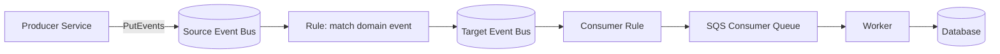
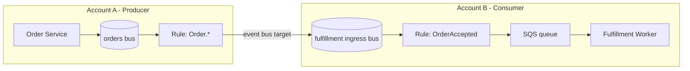
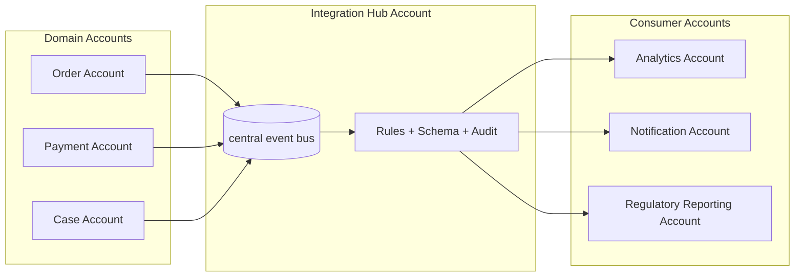
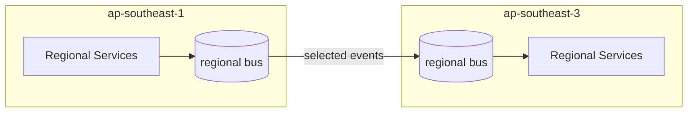
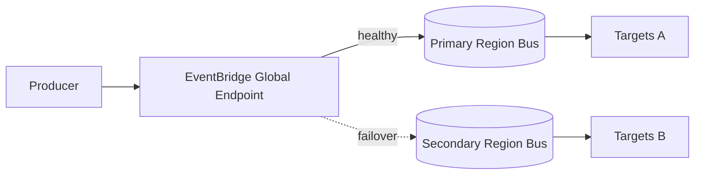
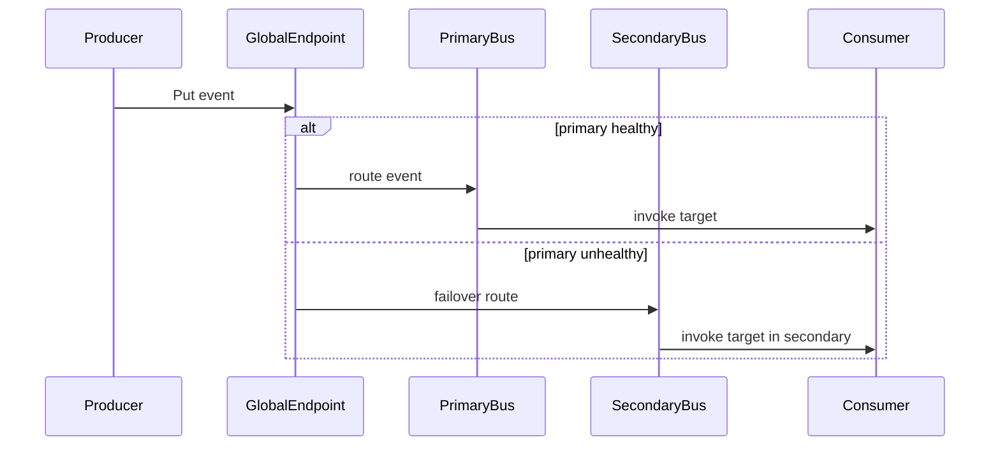
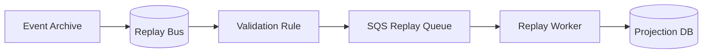

# Part 039 — EventBridge Cross-Account dan Cross-Region Event Routing

Pada sistem kecil, event bus sering dimulai sebagai satu komponen sederhana: producer publish event, rule melakukan match, target menerima event. Pada sistem organisasi besar, bentuknya berubah. Event tidak lagi hanya bergerak di dalam satu application account. Event melintasi account, organizational unit, environment, region, compliance boundary, dan team ownership.

Di titik ini, EventBridge bukan sekadar pub/sub service. Ia menjadi **event routing control plane**.

Cross-account dan cross-region routing harus didesain sebagai boundary arsitektur, bukan sebagai konfigurasi tambahan. Salah desain di sini biasanya tidak langsung terlihat saat development. Ia baru terlihat ketika ada incident: event tidak sampai, event sampai ke account yang salah, replay menembak target production, schema drift menyebar lintas team, atau region failover menghasilkan duplicate side effect.

Tujuan part ini: membuat mental model dan implementasi yang aman untuk mengirim event lintas account dan region.

---

## 1. Masalah yang Diselesaikan

Cross-account routing menyelesaikan masalah **organizational decoupling**.

Cross-region routing menyelesaikan masalah **regional isolation, locality, dan regional resilience**.

Jangan mencampur keduanya. Account boundary dan region boundary punya risiko yang berbeda.

| Boundary | Pertanyaan utama | Risiko utama |
|---|---|---|
| Cross-account | Siapa boleh publish/receive event? | Permission leak, tenant/environment leak, ownership kabur |
| Cross-region | Region mana yang menjadi authority? | Latency, duplicate, failover ambiguity, data residency |
| Cross-account + cross-region | Siapa authority di region mana? | Operasi rumit, replay berbahaya, debugging sulit |

Kuncinya: routing lintas boundary harus punya **contract**, **permission**, **observability**, dan **runbook** yang eksplisit.

---

## 2. Mental Model: Event Routing sebagai Control Plane

EventBridge event bus menerima event, mencocokkan event dengan rules, lalu mengirim event ke targets. Target bisa berupa Lambda, SQS, Step Functions, API destination, atau event bus lain. Event bus lain dapat berada di account berbeda dan/atau region berbeda.



Hal penting: ketika event dikirim ke event bus lain, kita tidak sedang “memanggil service lain”. Kita sedang **memindahkan event ke routing domain lain**. Setelah event masuk ke target bus, ownership routing berikutnya berpindah ke account/region pemilik bus tersebut.

Itulah alasan rule lintas account/region harus dianggap sebagai **public contract antar platform boundary**.

---

## 3. Bentuk-Bentuk Topologi

### 3.1 Direct Account-to-Account Routing

Satu producer account mengirim event ke event bus milik consumer/platform account.



Kapan cocok:

- hubungan producer-consumer jelas;
- jumlah consumer lintas account kecil;
- contract event stabil;
- tidak butuh central governance bus.

Kapan berbahaya:

- banyak producer menembak banyak account;
- tidak ada registry ownership;
- rule dibuat manual tanpa review;
- environment dev/staging/prod memakai nama event bus mirip.

---

### 3.2 Central Event Hub Account

Semua domain account publish ke central event bus, lalu central bus route ke consumer account.



Kapan cocok:

- organisasi punya banyak account;
- perlu governance lintas team;
- perlu audit semua integration flow;
- perlu central schema registry/contract review;
- event dipakai oleh analytics, compliance, reporting, atau shared platform.

Trade-off:

- central bus bisa menjadi bottleneck governance;
- ownership event contract bisa kabur;
- blast radius rule salah menjadi lebih besar;
- perlu naming, tagging, IAM, dan account lifecycle yang disiplin.

Aturan praktis: central hub boleh menjadi **routing plane**, tetapi jangan menjadi **domain brain**. Ia tidak boleh menafsirkan business semantics terlalu dalam.

---

### 3.3 Ingress Bus per Consumer Account

Account consumer menyediakan ingress event bus. Producer hanya tahu kontrak publish ke ingress bus tersebut.

Kelebihan:

- consumer mengontrol routing internal;
- producer tidak tahu consumer topology;
- permission lebih mudah dibatasi;
- account consumer dapat mengubah target internal tanpa mengubah producer.

Kekurangan:

- setiap consumer harus matang secara platform;
- observability perlu federated dashboard;
- sulit melihat global event graph jika tidak ada inventory.

---

### 3.4 Regional Bus Pair

Setiap region punya event bus lokal. Event tertentu direplikasi atau dikirim ke region lain.



Kapan cocok:

- multi-region active/passive;
- event perlu diproses di region lain;
- regional reporting;
- regulated workload dengan regional locality;
- recovery pipeline.

Jangan langsung membuat semua event cross-region. Kirim hanya event yang punya alasan eksplisit.

---

## 4. Cross-Account Routing: Permission Model

Cross-account event routing punya dua sisi:

1. **Target event bus policy**: target bus mengizinkan account/source tertentu mengirim event.
2. **IAM role pada rule target**: source rule memakai role untuk mengirim ke event bus account lain.

Setelah perubahan AWS sejak 2023, event bus target lintas account baru membutuhkan IAM role. Ini bagus secara governance karena Service Control Policies dan boundary organisasi lebih mudah diterapkan.

### 4.1 Policy harus Sempit

Bad policy:

```json
{
  "Effect": "Allow",
  "Principal": "*",
  "Action": "events:PutEvents",
  "Resource": "arn:aws:events:ap-southeast-1:222222222222:event-bus/ingress"
}
```

Masalah:

- semua principal bisa mencoba publish;
- sulit audit siapa producer sah;
- raw event injection risk;
- environment leak mungkin terjadi.

Lebih baik:

```json
{
  "Effect": "Allow",
  "Principal": {
    "AWS": "arn:aws:iam::111111111111:root"
  },
  "Action": "events:PutEvents",
  "Resource": "arn:aws:events:ap-southeast-1:222222222222:event-bus/ingress",
  "Condition": {
    "StringEquals": {
      "aws:PrincipalOrgID": "o-exampleorgid"
    }
  }
}
```

Policy lebih matang lagi bisa membatasi source account, organization, dan pola operasional tertentu. Prinsipnya: target bus policy adalah **ingress firewall untuk event**.

---

## 5. Cross-Region Routing: Authority dan Locality

Cross-region routing bukan “fanout jarak jauh”. Ia menyentuh consistency, latency, data residency, dan failure recovery.

Sebelum mengirim event lintas region, jawab ini:

1. Region mana yang menjadi **write authority** untuk aggregate tersebut?
2. Apakah event mengandung data yang boleh keluar region?
3. Apakah consumer di region lain butuh event penuh atau hanya projection minimal?
4. Apakah duplicate event lintas region aman?
5. Apa yang terjadi saat region source pulih setelah failover?
6. Apakah replay lintas region diizinkan?
7. Siapa yang punya runbook failover?

Jika jawaban ini tidak jelas, cross-region routing hanya memindahkan risiko dari application code ke integration layer.

---

## 6. Global Endpoint vs Manual Cross-Region Routing

EventBridge menyediakan global endpoints untuk membantu aplikasi lebih toleran terhadap regional fault. Dengan global endpoint, event dapat diarahkan ke primary region dan failover ke secondary region berdasarkan health check. Event replication dapat diaktifkan untuk mengirim custom events ke event bus primary dan secondary region.

Mental model:



Gunakan global endpoint ketika:

- aplikasi butuh regional fault tolerance untuk event ingestion;
- producer tidak ingin mengelola region selection sendiri;
- ada health check yang bermakna;
- consumer side di secondary region siap menerima event;
- duplicate dan replay semantics sudah aman.

Jangan gunakan global endpoint sebagai pengganti desain multi-region data consistency. Ia membantu event ingestion dan routing. Ia tidak menyelesaikan konflik database, ownership aggregate, atau side-effect duplication.

---

## 7. Event Identity untuk Cross-Boundary Routing

Event lintas account/region harus punya identity yang stabil. Jangan hanya mengandalkan EventBridge generated event id untuk business idempotency lintas sistem.

Gunakan envelope seperti:

```json
{
  "metadata": {
    "eventId": "evt_01J2...",
    "eventType": "OrderAccepted",
    "eventVersion": 3,
    "sourceSystem": "order-service",
    "sourceAccount": "111111111111",
    "sourceRegion": "ap-southeast-1",
    "occurredAt": "2026-07-06T10:15:30Z",
    "publishedAt": "2026-07-06T10:15:31Z",
    "correlationId": "corr_...",
    "causationId": "cmd_...",
    "aggregateType": "Order",
    "aggregateId": "ord_123",
    "tenantId": "tenant_456"
  },
  "data": {
    "orderId": "ord_123",
    "customerId": "cus_789",
    "acceptedAmount": {
      "currency": "IDR",
      "value": 1500000
    }
  }
}
```

Field yang penting untuk cross-account/region:

| Field | Fungsi |
|---|---|
| `eventId` | Idempotency lintas consumer |
| `eventVersion` | Compatibility dan upcasting |
| `sourceAccount` | Audit publisher boundary |
| `sourceRegion` | Debugging regional path |
| `occurredAt` | Business time |
| `publishedAt` | Infrastructure publication time |
| `correlationId` | Trace business transaction |
| `causationId` | Menghubungkan command/event sebelumnya |
| `tenantId` | Routing, isolation, dan audit |

Tanpa metadata ini, debugging cross-boundary akan berubah menjadi forensic manual.

---

## 8. Routing Contract: Jangan Kirim Semua ke Semua

Anti-pattern umum:

```txt
source bus -> rule "anything" -> target central bus -> rule "anything" -> every consumer
```

Ini terasa fleksibel di awal, tetapi membunuh operability.

Masalahnya:

- consumer menerima event yang tidak relevan;
- biaya meningkat;
- schema drift menyebar;
- replay menjadi berbahaya;
- security boundary melemah;
- sulit tahu event mana yang menjadi public contract.

Pola yang lebih aman:

```txt
source bus
  rule: source = com.company.order AND detail-type IN [OrderAccepted, OrderCancelled]
    -> integration hub bus

hub bus
  rule: detail-type = OrderAccepted AND detail.tenantRegion = apac
    -> regional reporting account bus
```

Rule harus diperlakukan sebagai code. Ia perlu review, test, IaC, tagging, dan ownership.

---

## 9. Account Boundary Pattern

### 9.1 Producer-Owned Outbound Bus

Producer account memiliki outbound bus. Semua event publik domain keluar dari bus ini.

Kelebihan:

- producer mengontrol event publication;
- mudah audit event domain;
- source of truth jelas.

Kekurangan:

- consumer discovery perlu registry;
- banyak consumer lintas account dapat menambah kompleksitas permission.

### 9.2 Platform-Owned Integration Bus

Platform account memiliki bus pusat untuk integration.

Kelebihan:

- governance kuat;
- contract dan rule bisa distandarkan;
- lebih mudah untuk audit organisasi.

Kekurangan:

- platform team bisa menjadi bottleneck;
- domain ownership bisa kabur jika platform ikut menafsirkan event terlalu dalam.

### 9.3 Consumer-Owned Ingress Bus

Consumer account menyediakan bus penerima.

Kelebihan:

- consumer punya kontrol penuh terhadap routing internal;
- producer hanya publish contract;
- isolate consumer failure.

Kekurangan:

- banyak ingress bus perlu katalog;
- cross-account permission harus dikelola rapi.

---

## 10. Environment Isolation

Jangan biarkan dev/staging/prod berbagi event bus, rule, target, atau archive kecuali ada alasan sangat kuat.

Gunakan naming eksplisit:

```txt
prod-order-outbound-ap-southeast-1
stg-order-outbound-ap-southeast-1
dev-order-outbound-ap-southeast-1
```

Dan tagging wajib:

```yaml
Environment: prod
Domain: order
OwnerTeam: order-platform
DataClassification: internal
EventContract: order-public-v3
Criticality: tier-1
```

Failure mode yang sering terjadi:

- staging producer publish ke prod consumer karena ARN salah;
- replay dari archive staging diarahkan ke prod bus;
- account sandbox diberi permission `PutEvents` ke prod bus;
- developer membuat broad rule `source: prefix` yang menangkap event production.

Environment isolation bukan kosmetik. Ia adalah safety boundary.

---

## 11. Multi-Region Routing Pattern

### 11.1 Active/Passive Event Ingestion

Primary region menerima event. Secondary hanya aktif saat failover.



Yang harus benar:

- secondary region punya rule dan target siap;
- database/write authority jelas;
- consumer idempotent;
- eventId global unique;
- failback tidak menghasilkan duplicate side effect.

### 11.2 Active/Active Regional Event Processing

Dua region memproses event lokal. Event tertentu direplikasi untuk projection global.

Kapan cocok:

- tenant punya home region;
- write lokal per region;
- global dashboard hanya derived state;
- conflict antar region dihindari dengan ownership, bukan diselesaikan belakangan.

Desain aman:

```txt
tenantId -> homeRegion
aggregateId -> owned by exactly one region at a time
cross-region event -> projection only, not command authority
```

### 11.3 Cross-Region Reporting Projection

Event dari beberapa region masuk ke reporting region.

Rule:

- reporting DB bukan source of truth;
- consumer harus idempotent;
- lag harus terlihat;
- replay harus bisa dilakukan per source region dan event type;
- data minimization wajib jika ada constraint residency.

---

## 12. Data Residency dan Minimization

Cross-region event sering membawa data lebih banyak daripada yang diperlukan. Ini buruk dari sisi biaya, security, privacy, dan compliance.

Contoh buruk:

```json
{
  "detail-type": "CustomerUpdated",
  "detail": {
    "customerId": "cus_123",
    "name": "...",
    "email": "...",
    "phone": "...",
    "address": "...",
    "identityDocument": "...",
    "fullProfile": { }
  }
}
```

Untuk consumer reporting lintas region, mungkin cukup:

```json
{
  "detail-type": "CustomerRiskSegmentChanged",
  "detail": {
    "customerId": "cus_123",
    "riskSegment": "HIGH",
    "effectiveAt": "2026-07-06T10:15:30Z"
  }
}
```

Prinsipnya:

- event publik bukan dump database row;
- event lintas region harus minim;
- PII harus diberi classification;
- field sensitif harus punya justifikasi consumer;
- payload encryption bukan pengganti minimization.

---

## 13. Idempotency Lintas Account dan Region

Cross-account dan cross-region routing memperbesar kemungkinan duplicate.

Duplicate dapat muncul karena:

- producer retry `PutEvents` setelah timeout;
- EventBridge retry target delivery;
- consumer failure sebelum commit offset/side effect;
- archive replay;
- global endpoint failover/failback;
- manual redrive dari DLQ;
- rule ganda yang route event sama ke target sama.

Consumer wajib punya idempotency gate:

```sql
CREATE TABLE event_inbox (
  event_id        VARCHAR(80) PRIMARY KEY,
  source_system   VARCHAR(120) NOT NULL,
  source_account  VARCHAR(32) NOT NULL,
  source_region   VARCHAR(32) NOT NULL,
  event_type      VARCHAR(120) NOT NULL,
  received_at     TIMESTAMP NOT NULL DEFAULT CURRENT_TIMESTAMP,
  processed_at    TIMESTAMP NULL,
  status          VARCHAR(32) NOT NULL,
  error_message   TEXT NULL
);
```

Pseudo flow:

```txt
1. receive event
2. insert event_id into inbox
3. if duplicate -> return success
4. validate contract
5. apply side effect inside transaction
6. mark processed
7. acknowledge target delivery
```

Untuk DynamoDB:

```json
{
  "PutItem": {
    "TableName": "event_inbox",
    "Item": {
      "pk": { "S": "EVENT#evt_01J2" },
      "sourceRegion": { "S": "ap-southeast-1" },
      "status": { "S": "PROCESSING" }
    },
    "ConditionExpression": "attribute_not_exists(pk)"
  }
}
```

Idempotency harus berdasarkan event identity dari domain envelope, bukan hanya delivery metadata.

---

## 14. Observability untuk Cross-Boundary Routing

Minimum telemetry per event:

| Signal | Di mana dicatat | Tujuan |
|---|---|---|
| `eventId` | producer, bus log/archive, consumer | dedup/debug |
| `correlationId` | semua hop | end-to-end trace |
| `sourceAccount` | envelope + log | permission/audit |
| `sourceRegion` | envelope + log | regional path |
| `targetAccount` | route inventory | ownership |
| `targetRegion` | route inventory | failover/debug |
| `ruleName` | EventBridge metrics/log | match/invocation analysis |
| `matchedAt` | consumer log | latency decomposition |
| `processedAt` | consumer DB/log | projection freshness |

Dashboard minimal:

```txt
Producer
  - PutEvents success/failure
  - events published by type
  - publication latency
  - outbox backlog

Source Bus
  - PutEvents count/failure
  - matched events by rule
  - failed invocations
  - retry attempts
  - DLQ sent / DLQ failure

Target Bus
  - events received by source account/region/type
  - matched events by rule
  - target invocation success/failure

Consumer
  - inbox duplicate count
  - processing latency
  - business side-effect success/failure
  - projection lag
```

Jika hanya memonitor consumer error, kamu buta terhadap routing failure sebelum consumer menerima event.

---

## 15. Route Inventory sebagai Production Asset

Untuk event lintas account/region, dokumentasi manual tidak cukup. Perlu inventory yang bisa diaudit.

Contoh route inventory:

```yaml
routeId: order-accepted-to-regulatory-reporting-prod
source:
  account: "111111111111"
  region: ap-southeast-1
  bus: prod-order-outbound
  eventTypes:
    - OrderAccepted.v3
target:
  account: "333333333333"
  region: ap-southeast-3
  bus: prod-regulatory-ingress
owner:
  producerTeam: order-platform
  consumerTeam: regulatory-reporting
contract:
  schema: schemas/order/OrderAccepted.v3.json
  compatibility: backward
security:
  dataClassification: internal
  containsPii: false
operations:
  dlq: arn:aws:sqs:ap-southeast-3:333333333333:prod-eventbridge-dlq
  replayAllowed: true
  replayApproval: required
  rto: 30m
  rpo: 5m
```

Route inventory menjawab pertanyaan saat incident:

- Event ini seharusnya pergi ke mana?
- Siapa owner rule?
- Apakah replay boleh?
- Consumer mana yang aman menerima replay?
- Apakah event membawa data sensitif?
- DLQ mana yang harus diperiksa?

---

## 16. IaC Skeleton: Cross-Account Event Bus Target

Contoh konseptual CloudFormation/SAM-style. Detail resource bisa berbeda sesuai IaC yang digunakan, tetapi struktur logikanya sama.

### Target Account: Event Bus Policy

```yaml
Resources:
  IngressEventBus:
    Type: AWS::Events::EventBus
    Properties:
      Name: prod-fulfillment-ingress

  AllowOrderAccountPutEvents:
    Type: AWS::Events::EventBusPolicy
    Properties:
      EventBusName: !Ref IngressEventBus
      StatementId: AllowOrderAccount
      Statement:
        Effect: Allow
        Principal:
          AWS: arn:aws:iam::111111111111:root
        Action: events:PutEvents
        Resource: !GetAtt IngressEventBus.Arn
        Condition:
          StringEquals:
            aws:PrincipalOrgID: o-exampleorgid
```

### Source Account: Rule with Event Bus Target

```yaml
Resources:
  SendToFulfillmentRole:
    Type: AWS::IAM::Role
    Properties:
      AssumeRolePolicyDocument:
        Version: "2012-10-17"
        Statement:
          - Effect: Allow
            Principal:
              Service: events.amazonaws.com
            Action: sts:AssumeRole
      Policies:
        - PolicyName: AllowPutToFulfillmentBus
          PolicyDocument:
            Version: "2012-10-17"
            Statement:
              - Effect: Allow
                Action: events:PutEvents
                Resource: arn:aws:events:ap-southeast-1:222222222222:event-bus/prod-fulfillment-ingress

  RouteOrderAccepted:
    Type: AWS::Events::Rule
    Properties:
      EventBusName: prod-order-outbound
      EventPattern:
        source:
          - com.company.order
        detail-type:
          - OrderAccepted
        detail:
          metadata:
            eventVersion:
              - 3
      Targets:
        - Id: FulfillmentIngressBus
          Arn: arn:aws:events:ap-southeast-1:222222222222:event-bus/prod-fulfillment-ingress
          RoleArn: !GetAtt SendToFulfillmentRole.Arn
```

Jangan hardcode account/region di banyak tempat tanpa registry. Untuk production, gunakan parameter, environment config, dan route inventory.

---

## 17. Replay Lintas Account/Region

Replay lintas boundary adalah operasi berisiko tinggi.

Sebelum replay, pastikan:

- consumer idempotent;
- replay target jelas;
- event type dan time window sempit;
- side effect eksternal dimatikan atau guarded;
- target DLQ kosong atau dipahami;
- dashboard aktif;
- owner producer dan consumer menyetujui;
- ada rollback/stop condition.

Gunakan “replay lane” jika memungkinkan:



Replay lane memisahkan replay dari live traffic. Ini menurunkan risiko replay storm dan memudahkan throttling.

---

## 18. Failure Modes

| Failure | Gejala | Penyebab umum | Mitigasi |
|---|---|---|---|
| Event tidak sampai target account | Producer sukses tapi consumer kosong | target bus policy salah, role salah, rule tidak match | test event, DLQ, metrics rule, IaC validation |
| Event sampai account salah | Consumer asing menerima event | ARN/env config salah | environment guard, route inventory, account allowlist |
| Duplicate side effect | invoice/email dibuat dua kali | retry/replay/failover | idempotency key, inbox, external side-effect log |
| Region failover kacau | event diproses di dua region | unclear authority | global eventId, home region, failover runbook |
| Replay storm | backlog target naik drastis | replay ke live bus tanpa throttle | replay lane, queue buffer, rate limit |
| Schema drift | consumer parse error | producer ubah schema tanpa compatibility | schema registry, contract test, versioned detail-type |
| Permission drift | route tiba-tiba gagal | SCP/IAM/policy berubah | permission canary, drift detection |
| Data residency violation | sensitive data keluar region | event terlalu gemuk | minimization, classification, approval gate |

---

## 19. Test Matrix

### 19.1 Cross-Account Test

| Test | Expected result |
|---|---|
| Authorized producer sends valid event | event reaches target bus and consumer |
| Unauthorized account sends event | rejected |
| Wrong event type | not routed |
| Wrong schema version | rejected or routed to quarantine |
| Target bus policy removed | failed invocation visible |
| Target DLQ permission broken | DLQ failure metric visible |

### 19.2 Cross-Region Test

| Test | Expected result |
|---|---|
| Primary region healthy | event routed primary |
| Primary health check fails | event routed secondary |
| Duplicate after failback | consumer dedups |
| Region-specific data forbidden | validation blocks event |
| Replay old region event | processed as replay, not live command |

### 19.3 Replay Test

| Test | Expected result |
|---|---|
| Replay same event twice | one side effect |
| Replay incompatible old event | upcaster/quarantine handles it |
| Replay large window | throttled and observable |
| Replay to wrong environment | blocked by guardrail |

---

## 20. Production Checklist

Sebelum cross-account/cross-region route dianggap production-ready:

- [ ] Event contract punya owner.
- [ ] Event envelope punya `eventId`, `eventVersion`, `sourceAccount`, `sourceRegion`, `correlationId`.
- [ ] Target event bus policy least privilege.
- [ ] Source rule target memakai IAM role eksplisit.
- [ ] Route dibuat via IaC.
- [ ] Route inventory terdaftar.
- [ ] Environment isolation jelas.
- [ ] Consumer punya idempotency gate.
- [ ] Rule punya DLQ jika target failure harus tidak hilang.
- [ ] Metrics dan alarms tersedia untuk failed invocation, retry, DLQ, latency.
- [ ] Replay policy tertulis.
- [ ] Cross-region data residency direview.
- [ ] Failover/failback drill pernah diuji.
- [ ] Schema compatibility test berjalan di CI.
- [ ] Runbook memuat owner, dashboard, DLQ, stop condition, dan escalation.

---

## 21. Anti-Pattern

### 21.1 Event Bus sebagai Shared Dump Pipe

Semua service publish semua perubahan ke central bus. Consumer pilih sendiri apa yang mau dipakai.

Ini bukan event-driven architecture. Ini distributed database dump.

### 21.2 Cross-Region Command Tanpa Authority

Region A dan Region B sama-sama mengirim command untuk aggregate yang sama.

Jika tidak ada ownership rule, kamu membuat distributed write conflict yang tidak akan diselesaikan oleh EventBridge.

### 21.3 Rule Manual di Console

Rule lintas account/region dibuat manual karena “urgent”. Beberapa bulan kemudian tidak ada yang tahu kenapa event sampai ke account tertentu.

Untuk production, manual route harus dianggap emergency change dan segera direkonsiliasi ke IaC.

### 21.4 Replay Tanpa Idempotency

Replay dianggap aman karena “event-nya sama”. Justru karena event-nya sama, side effect bisa terjadi lagi jika consumer tidak idempotent.

### 21.5 Event Contract Mengandung Internal Schema

Producer mengirim database row internal. Consumer mulai bergantung pada field internal. Migrasi schema menjadi mustahil tanpa breaking change.

---

## 22. Mental Model Ringkas

Cross-account routing menjawab: **siapa boleh berintegrasi dengan siapa**.

Cross-region routing menjawab: **region mana memproses apa saat sehat, gagal, dan pulih**.

EventBridge menyediakan primitive routing. Tetapi correctness tetap milik desainmu:

- event identity;
- schema compatibility;
- idempotent consumer;
- permission boundary;
- route inventory;
- observability;
- replay governance;
- failover runbook.

Jangan ukur kematangan event architecture dari jumlah event bus. Ukur dari kemampuan menjawab satu pertanyaan saat incident:

> Untuk event ini, dari account mana, region mana, rule mana, menuju target mana, dengan contract versi berapa, dan apakah aman untuk diproses ulang?

Jika jawaban itu cepat, sistemmu operable.

---

## References

- AWS EventBridge User Guide — Sending and receiving events between AWS accounts: https://docs.aws.amazon.com/eventbridge/latest/userguide/eb-cross-account.html
- AWS EventBridge User Guide — Sending and receiving events between AWS Regions: https://docs.aws.amazon.com/eventbridge/latest/userguide/eb-cross-region.html
- AWS EventBridge User Guide — Global endpoints: https://docs.aws.amazon.com/eventbridge/latest/userguide/eb-global-endpoints.html
- AWS EventBridge User Guide — Best practices for global endpoints: https://docs.aws.amazon.com/eventbridge/latest/userguide/eb-ge-best-practices.html
- AWS EventBridge User Guide — Event buses: https://docs.aws.amazon.com/eventbridge/latest/userguide/eb-event-bus.html
- AWS EventBridge User Guide — Event bus targets: https://docs.aws.amazon.com/eventbridge/latest/userguide/eb-targets.html
