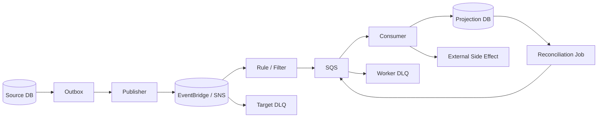
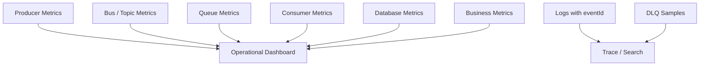
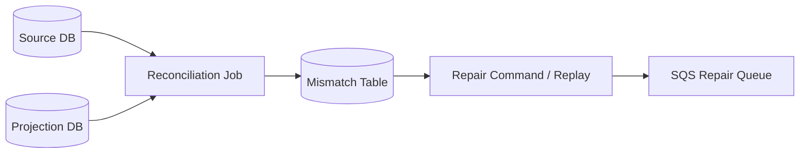

# Part 040 — Event-Driven Operability

Event-driven architecture sering terlihat bersih di diagram. Producer publish event, bus route event, consumer bereaksi, database projection ter-update. Diagramnya sederhana. Production-nya tidak.

Masalah event-driven system bukan hanya “apakah event terkirim”. Masalah sebenarnya:

- apakah event yang benar terkirim ke consumer yang benar;
- apakah event diproses tepat sekali secara efek bisnis meskipun delivery bisa lebih dari sekali;
- apakah duplicate, delay, retry, DLQ, replay, dan schema drift bisa diamati;
- apakah operator tahu apa yang harus dilakukan saat event berhenti mengalir;
- apakah sistem bisa dipulihkan tanpa membuat side effect ganda.

Part ini adalah operational playbook untuk event-driven system berbasis EventBridge, SNS, SQS, Step Functions, Lambda/worker, dan database projection.

Ini menutup Module 05.

---

## 1. Mental Model: Event-Driven System adalah Data Pipeline + Control Plane

Event-driven system bukan hanya messaging. Ia gabungan dari:

1. **event producer** — membuat fakta bisnis;
2. **event publication boundary** — outbox, bus, topic;
3. **routing plane** — EventBridge rules, SNS subscriptions, filters;
4. **delivery buffer** — SQS queue, DLQ;
5. **consumer execution** — Lambda, container worker, Step Functions;
6. **side effect** — database write, API call, email, external system;
7. **projection** — read model, search index, analytics table;
8. **reconciliation** — proses koreksi ketika pipeline tidak sempurna.



Operability berarti setiap edge pada diagram bisa dijawab:

- berapa banyak event masuk;
- berapa banyak event match;
- berapa banyak invocation berhasil/gagal;
- berapa banyak event retry;
- berapa banyak event masuk DLQ;
- berapa lama event tertunda;
- event mana yang duplicate;
- event mana yang tidak valid;
- consumer mana yang tertinggal;
- projection mana yang stale.

---

## 2. Invariant Operasional

Event-driven system production-ready jika invariant ini dijaga.

| Invariant | Artinya |
|---|---|
| Event has identity | setiap event punya `eventId` domain-level |
| Consumer is idempotent | duplicate delivery tidak membuat duplicate business effect |
| Routing is explainable | setiap rule/filter punya owner dan alasan |
| Failure is retained | failed delivery masuk DLQ/quarantine, bukan hilang diam-diam |
| Replay is safe | event bisa diproses ulang tanpa merusak state |
| Lag is visible | keterlambatan projection/queue terlihat |
| Schema is governed | perubahan contract tidak diam-diam memecahkan consumer |
| Side effect is guarded | email/payment/external call tidak dieksekusi ulang tanpa kontrol |
| Reconciliation exists | ada cara memperbaiki gap di luar happy path |
| Runbook is executable | operator bisa bertindak tanpa membaca source code dulu |

Jika satu invariant tidak benar, sistem mungkin masih jalan, tetapi tidak operable.

---

## 3. Failure Taxonomy

### 3.1 Producer Failure

Contoh:

- database commit sukses, event tidak terpublish;
- event terpublish dua kali;
- event payload salah;
- producer mengirim event versi baru tanpa compatibility;
- outbox backlog meningkat.

Mitigasi:

- transactional outbox;
- publisher retry dengan idempotent `eventId`;
- schema validation sebelum publish;
- outbox age alarm;
- reconciliation dari source table ke outbox/event log.

### 3.2 Routing Failure

Contoh:

- EventBridge rule tidak match;
- SNS filter salah;
- target ARN salah;
- cross-account permission berubah;
- rule disabled;
- target invocation throttled.

Mitigasi:

- IaC untuk rule/filter;
- unit test event pattern;
- canary event;
- route inventory;
- EventBridge metrics: matched events, invocations, failed invocations, retry attempts;
- DLQ per critical target.

### 3.3 Delivery Failure

Contoh:

- target service unavailable;
- EventBridge retry habis;
- SNS subscription delivery gagal;
- SQS consumer tidak mengambil message;
- DLQ permission salah.

Mitigasi:

- retry policy eksplisit;
- DLQ target;
- alarm DLQ depth;
- alarm failed-to-send-to-DLQ;
- manual redrive runbook;
- queue-based buffering untuk target kritis.

### 3.4 Consumer Failure

Contoh:

- consumer crash setelah side effect tetapi sebelum ack;
- consumer timeout;
- batch processing gagal semua karena satu item buruk;
- database connection pool exhausted;
- schema parse error;
- poison message.

Mitigasi:

- idempotency/inbox table;
- partial batch failure;
- bounded concurrency;
- validation/quarantine;
- DLQ;
- database backpressure;
- retry classification.

### 3.5 Projection Failure

Contoh:

- read model tertinggal;
- search index tidak konsisten;
- reporting table duplicate;
- projection logic bug;
- replay menghasilkan state berbeda.

Mitigasi:

- projection lag metric;
- rebuild path;
- deterministic projection;
- versioned projector;
- reconciliation against source of truth;
- snapshot + event replay strategy.

---

## 4. Observability Stack

Event-driven observability tidak cukup dengan application logs. Kamu butuh signal di setiap layer.



### 4.1 Producer Metrics

Minimum:

- events produced by type/version;
- publish success/failure;
- outbox pending count;
- outbox oldest age;
- publish latency;
- invalid event count;
- retry count.

Alarm penting:

- outbox age melewati SLO;
- publish failure > threshold;
- event volume drop mendadak untuk event kritis;
- event volume spike tidak normal.

### 4.2 EventBridge Metrics

Minimum:

- matched events;
- successful invocations;
- failed invocations;
- retry invocation attempts;
- invocation latency;
- invocations sent to DLQ;
- invocations failed to be sent to DLQ;
- throttled rules.

EventBridge secara default melakukan retry delivery untuk event target failure dalam window tertentu; jika retry habis, event dapat drop atau dikirim ke DLQ jika DLQ dikonfigurasi. Karena itu, critical target harus punya DLQ.

### 4.3 SNS Metrics

Minimum:

- messages published;
- messages delivered;
- delivery failures;
- filtered out count;
- subscription DLQ count;
- SMS/email/mobile metrics jika dipakai;
- FIFO throughput/ordering indicators jika memakai FIFO topic.

### 4.4 SQS Metrics

Minimum:

- `ApproximateNumberOfMessagesVisible`;
- `ApproximateNumberOfMessagesNotVisible`;
- `ApproximateAgeOfOldestMessage`;
- messages received/deleted/sent;
- DLQ visible messages;
- Lambda iterator/processing errors jika relevan;
- consumer concurrency;
- processing latency.

### 4.5 Consumer Metrics

Minimum:

- events processed by type/version;
- success/failure count;
- duplicate event count;
- invalid schema count;
- retryable vs non-retryable failure;
- side effect success/failure;
- processing duration;
- DB write duration;
- external call duration;
- business result count.

### 4.6 Projection Metrics

Minimum:

- projection lag by event type;
- last processed event timestamp;
- rebuild progress;
- reconciliation mismatch count;
- stale read percentage;
- query error rate.

---

## 5. Logs: Event ID atau Tidak Berguna

Log tanpa event identity akan sulit dipakai.

Setiap log di producer, router helper, consumer, dan projection harus membawa:

```json
{
  "eventId": "evt_01J2...",
  "eventType": "OrderAccepted",
  "eventVersion": 3,
  "correlationId": "corr_...",
  "causationId": "cmd_...",
  "aggregateId": "ord_123",
  "tenantId": "tenant_456",
  "source": "com.company.order",
  "sourceAccount": "111111111111",
  "sourceRegion": "ap-southeast-1",
  "consumer": "fulfillment-worker",
  "attempt": 2
}
```

Log stages:

```txt
producer.command.received
producer.db.committed
producer.outbox.inserted
publisher.event.published
router.event.matched
consumer.event.received
consumer.idempotency.duplicate_detected
consumer.side_effect.started
consumer.side_effect.completed
consumer.projection.updated
consumer.event.acked
consumer.event.failed
consumer.event.sent_to_dlq
```

Dengan stage ini, debugging menjadi latency decomposition, bukan tebakan.

---

## 6. Alert Design: Hindari Noise, Tangkap Risiko

Alert buruk:

```txt
FailedInvocations > 0 for 1 minute
```

Hasilnya noisy. Tim akan ignore.

Alert lebih baik:

| Alert | Kenapa |
|---|---|
| Critical target DLQ depth > 0 | ada event gagal yang perlu tindakan |
| Failed to send to DLQ > 0 | failure retention rusak |
| Outbox oldest age > SLO | producer publication tertinggal |
| Queue oldest message age > SLO | consumer lag berdampak ke bisnis |
| Retry attempts spike | target mulai tidak sehat |
| Event volume drop to zero during business hours | producer/routing mungkin mati |
| Invalid schema count > 0 | contract drift terjadi |
| Duplicate count spike | retry/replay/failover abnormal |
| Projection lag > SLO | read model stale |

Prinsip alert:

- alert pada symptom yang membutuhkan tindakan;
- dashboard untuk diagnosis;
- log untuk forensic;
- trace untuk path reconstruction;
- ticket untuk trend jangka panjang.

---

## 7. DLQ Strategy

DLQ bukan tempat sampah. DLQ adalah **failure evidence store**.

Ada beberapa jenis DLQ:

| DLQ | Menangkap |
|---|---|
| EventBridge rule target DLQ | EventBridge gagal invoke target |
| SNS subscription DLQ | SNS gagal deliver ke subscription endpoint |
| SQS source queue DLQ | Consumer gagal process message berkali-kali |
| Scheduler DLQ | scheduled target invocation gagal |
| Application quarantine | event valid delivery tetapi invalid business/schema |

Jangan mencampur semuanya ke satu DLQ tanpa metadata. Nanti operator tidak tahu failure berasal dari layer mana.

### 7.1 DLQ Message Metadata

Saat memindahkan failure ke application quarantine, simpan:

```json
{
  "failureId": "fail_01J2...",
  "eventId": "evt_01J2...",
  "eventType": "OrderAccepted",
  "failureLayer": "CONSUMER_VALIDATION",
  "failureClass": "NON_RETRYABLE_SCHEMA_ERROR",
  "errorCode": "MISSING_REQUIRED_FIELD",
  "firstFailedAt": "2026-07-06T10:20:00Z",
  "lastFailedAt": "2026-07-06T10:21:00Z",
  "attempts": 3,
  "consumer": "fulfillment-worker",
  "sourceAccount": "111111111111",
  "sourceRegion": "ap-southeast-1"
}
```

Metadata ini membuat DLQ bisa dikelola tanpa membuka raw payload sensitif.

---

## 8. Retry Classification

Tidak semua error boleh di-retry.

| Error | Retry? | Contoh |
|---|---|---|
| Transient infrastructure | Ya | timeout DB, throttling, network blip |
| Temporary dependency failure | Ya dengan backoff | downstream 503 |
| Concurrency conflict | Ya terbatas | optimistic lock conflict |
| Invalid schema | Tidak | required field hilang |
| Business rule violation | Tidak | order already cancelled |
| Unauthorized | Tidak sampai permission diperbaiki | IAM denied |
| External side effect ambiguous | Hati-hati | payment timeout setelah charge mungkin sukses |

Retry buta membuat incident lebih besar. Retry harus punya budget dan classification.

---

## 9. Replay Strategy

Replay adalah operasi pemulihan, bukan fitur debug sembarangan.

### 9.1 Kapan Replay Diperlukan

- consumer bug menyebabkan projection salah;
- event delivery gagal tetapi event tersedia di archive/DLQ;
- read model perlu rebuild;
- schema upcaster diperbaiki;
- downstream outage sudah pulih;
- manual correction flow.

### 9.2 Kapan Replay Berbahaya

- consumer tidak idempotent;
- side effect eksternal tidak guarded;
- event lama tidak compatible;
- replay ke live traffic tanpa throttle;
- replay lintas account/region tanpa approval;
- duplicate business effect tidak bisa dikompensasi.

### 9.3 Replay Modes

| Mode | Kapan dipakai | Risiko |
|---|---|---|
| Target DLQ redrive | failure target tertentu | duplicate jika consumer partial success |
| SQS DLQ redrive | worker failure | poison message kembali ke queue |
| EventBridge archive replay | event bus history | replay storm / route berubah |
| Application event store replay | rebuild projection | schema evolution/upcasting |
| Source-of-truth reconciliation | gap correction | expensive query / consistency delay |

### 9.4 Replay Runbook

```txt
1. Tentukan tujuan replay.
2. Tentukan event type, source, time window, tenant, aggregate scope.
3. Validasi consumer idempotency.
4. Disable/guard external side effects jika tidak boleh terulang.
5. Pilih replay lane atau queue buffer.
6. Set concurrency/rate limit.
7. Monitor DLQ, retry, projection lag, duplicate count.
8. Stop jika error rate melewati threshold.
9. Jalankan reconciliation setelah replay.
10. Catat audit trail.
```

---

## 10. Schema Drift Operability

Schema drift terjadi ketika producer dan consumer tidak lagi sepakat tentang contract.

Gejala:

- parse error meningkat;
- invalid schema metric muncul;
- consumer mulai ignore field penting;
- projection tidak update;
- event replay lama gagal;
- consumer tim lain rusak setelah deployment producer.

Mitigasi:

- schema registry;
- versioned event contract;
- compatibility test di CI;
- canary consumer;
- upcaster untuk replay event lama;
- deprecation window;
- event contract owner.

Compatibility rule sederhana:

| Change | Biasanya aman? | Catatan |
|---|---|---|
| tambah optional field | Ya | consumer lama ignore |
| tambah required field | Tidak | breaking |
| rename field | Tidak | breaking |
| ubah type | Tidak | breaking |
| tambah enum value | Hati-hati | consumer switch-case bisa gagal |
| hapus field | Tidak | breaking |
| ubah semantics field | Tidak | paling berbahaya karena tidak selalu terdeteksi |

Schema validation harus terjadi di producer dan consumer. Producer mencegah event buruk masuk sistem. Consumer melindungi dirinya dari producer drift.

---

## 11. Duplicate Operability

Duplicate bukan bug di distributed messaging. Duplicate adalah kondisi normal yang harus dikelola.

Metric wajib:

```txt
event_duplicate_detected_total{consumer,eventType}
event_idempotency_conflict_total{consumer,eventType}
external_side_effect_duplicate_prevented_total{consumer,provider}
```

Duplicate spike dapat berarti:

- target timeout meningkat;
- consumer terlalu lambat;
- visibility timeout terlalu pendek;
- replay sedang berjalan;
- producer retry karena response ambiguity;
- cross-region failover/failback;
- rule ganda mengirim event ke target sama.

Runbook duplicate spike:

1. cek apakah ada replay/redrive aktif;
2. cek deploy terbaru producer/consumer;
3. cek timeout dan retry target;
4. cek queue age dan visibility timeout;
5. cek rule duplication;
6. cek idempotency table capacity/latency;
7. cek external provider idempotency key.

---

## 12. Ordering Operability

Event-driven system sering gagal karena asumsi ordering yang tidak tertulis.

Pertanyaan yang harus dijawab:

- Apakah consumer butuh ordering total atau per aggregate?
- Apakah event bisa datang out-of-order?
- Bagaimana consumer menangani stale event?
- Apakah replay bisa mengubah urutan?
- Apakah cross-region route mempertahankan urutan? Jangan berasumsi.

Pattern aman:

```txt
aggregateId = ordering boundary
version = monotonic sequence per aggregate
consumer only applies event if event.version > current.version
```

Contoh SQL:

```sql
UPDATE order_projection
SET status = :new_status,
    version = :event_version,
    updated_at = :occurred_at
WHERE order_id = :order_id
  AND version < :event_version;
```

Jika update affected rows = 0, event tersebut duplicate atau stale.

---

## 13. Backpressure dan Load Shedding

Event-driven system menyembunyikan overload dengan backlog. Itu bagus karena memberi waktu pemulihan. Tetapi backlog yang tidak dimonitor hanya menunda kegagalan.

Backpressure signal:

- outbox age;
- queue visible messages;
- oldest message age;
- in-flight messages;
- consumer CPU/memory;
- DB connection pool usage;
- DB lock wait;
- target throttling;
- retry attempts.

Control knobs:

- consumer concurrency;
- Lambda reserved concurrency;
- SQS batch size;
- max receive count;
- visibility timeout;
- EventBridge retry policy;
- queue buffering per target;
- rate limit before DB/external call;
- shard queue by tenant/priority;
- shed low-priority event processing.

### Priority Isolation

Jangan campur critical dan non-critical workload di queue yang sama.

```txt
critical-events-queue
standard-events-queue
bulk-replay-queue
low-priority-analytics-queue
```

Replay bulk tidak boleh menghambat command/event critical production.

---

## 14. Debugging Playbook

### 14.1 Event Tidak Sampai Consumer

Langkah:

1. Producer benar-benar publish? Cek outbox dan publish metrics.
2. Event masuk bus/topic? Cek PutEvents/publish success.
3. Rule/filter match? Cek matched events dan test event pattern.
4. Target invocation berhasil? Cek failed invocation/retry metrics.
5. Target DLQ ada isi?
6. Jika target SQS, message masuk queue?
7. Consumer mengambil message?
8. Consumer log punya `eventId`?
9. Event masuk application quarantine?

### 14.2 Consumer Memproses Duplicate

Langkah:

1. Cek `eventId` sama atau payload sama tapi eventId berbeda.
2. Jika eventId sama, cek idempotency gate.
3. Jika eventId berbeda, cek producer retry/id generation.
4. Cek replay/redrive aktif.
5. Cek rule ganda.
6. Cek cross-region failover.

### 14.3 Projection Stale

Langkah:

1. Cek source event volume.
2. Cek queue backlog dan oldest age.
3. Cek consumer error.
4. Cek database write latency/lock.
5. Cek schema validation failure.
6. Cek projection version logic.
7. Jalankan reconciliation scoped.

### 14.4 DLQ Naik

Langkah:

1. Klasifikasi DLQ layer: EventBridge/SNS/SQS/application.
2. Ambil sample message.
3. Kelompokkan by error class dan event type.
4. Tentukan retryable atau non-retryable.
5. Fix root cause.
6. Redrive kecil dulu.
7. Monitor duplicate, error rate, lag.
8. Redrive bertahap.

---

## 15. Operational Database Tables

Untuk sistem event-driven penting, pertimbangkan operational tables.

### 15.1 Event Inbox

```sql
CREATE TABLE event_inbox (
  event_id        VARCHAR(100) PRIMARY KEY,
  event_type      VARCHAR(120) NOT NULL,
  event_version   INT NOT NULL,
  source          VARCHAR(160) NOT NULL,
  aggregate_id    VARCHAR(120),
  tenant_id       VARCHAR(120),
  received_at     TIMESTAMP NOT NULL,
  processed_at    TIMESTAMP,
  status          VARCHAR(32) NOT NULL,
  failure_class   VARCHAR(80),
  error_message   TEXT
);

CREATE INDEX idx_event_inbox_status_received
  ON event_inbox(status, received_at);
```

### 15.2 Projection Checkpoint

```sql
CREATE TABLE projection_checkpoint (
  projection_name VARCHAR(120) PRIMARY KEY,
  last_event_time TIMESTAMP NOT NULL,
  last_event_id   VARCHAR(100) NOT NULL,
  last_updated_at TIMESTAMP NOT NULL,
  lag_seconds     BIGINT NOT NULL
);
```

### 15.3 Reconciliation Result

```sql
CREATE TABLE reconciliation_result (
  run_id          VARCHAR(100) NOT NULL,
  aggregate_id    VARCHAR(120) NOT NULL,
  mismatch_type   VARCHAR(80) NOT NULL,
  expected_hash   VARCHAR(128),
  actual_hash     VARCHAR(128),
  detected_at     TIMESTAMP NOT NULL,
  fixed_at        TIMESTAMP,
  status          VARCHAR(32) NOT NULL,
  PRIMARY KEY (run_id, aggregate_id)
);
```

Operational tables membuat event-driven system dapat diperiksa, bukan hanya dipercaya.

---

## 16. Reconciliation: Safety Net yang Wajib Ada

Messaging guarantees tidak menghilangkan kebutuhan reconciliation. Bahkan sistem dengan idempotency dan DLQ tetap bisa punya gap karena bug logic, schema drift, operator mistake, atau external dependency.

Reconciliation membandingkan source of truth dengan derived state.



Jenis reconciliation:

| Jenis | Tujuan |
|---|---|
| Count reconciliation | jumlah aggregate/event cocok |
| Hash reconciliation | isi projection konsisten |
| State transition reconciliation | status mengikuti state machine sah |
| Lag reconciliation | projection tidak terlalu tertinggal |
| External reconciliation | payment/email/provider state cocok |

Reconciliation harus scoped. Jangan jalankan full scan di jam sibuk tanpa capacity plan.

---

## 17. Production Readiness Checklist

Event-driven flow siap production jika:

- [ ] Producer memakai outbox atau publication boundary yang aman.
- [ ] Event punya domain-level `eventId`.
- [ ] Event contract versioned dan tervalidasi.
- [ ] Rule/filter dibuat via IaC.
- [ ] Setiap route punya owner.
- [ ] Critical target punya DLQ.
- [ ] DLQ punya alarm dan runbook.
- [ ] Consumer idempotent.
- [ ] Consumer membedakan retryable vs non-retryable error.
- [ ] Queue backlog dan oldest age dimonitor.
- [ ] Projection lag dimonitor.
- [ ] Duplicate count dimonitor.
- [ ] Replay strategy tertulis.
- [ ] Replay pernah diuji di staging dengan data realistis.
- [ ] External side effect punya idempotency key atau guard table.
- [ ] Reconciliation job tersedia.
- [ ] Dashboard menampilkan producer → router → queue → consumer → DB.
- [ ] Runbook bisa dijalankan oleh engineer on-call, bukan hanya original author.

---

## 18. Anti-Pattern

### 18.1 No DLQ Because Retry Exists

Retry bukan retention. Jika retry habis dan tidak ada DLQ, evidence hilang.

### 18.2 EventBridge Archive Dianggap Backup Database

Archive membantu replay event. Ia bukan backup database, bukan source of truth universal, dan tidak otomatis menjamin projection benar.

### 18.3 Consumer Menganggap Event Selalu Ordered

Jika ordering penting, desain explicit sequence/version per aggregate. Jangan mengandalkan urutan arrival.

### 18.4 Replay Langsung ke Live Consumer

Replay tanpa lane dan throttle bisa menenggelamkan traffic production.

### 18.5 Logging Payload Penuh

Event payload mungkin mengandung PII atau data sensitif. Log metadata cukup untuk debugging. Payload penuh harus dikontrol.

### 18.6 Dashboard Hanya di Consumer

Jika event tidak pernah sampai consumer, dashboard consumer tetap hijau. Observability harus mencakup producer dan routing plane.

---

## 19. Incident Template

Gunakan template ini saat event-driven incident.

```md
# Event-Driven Incident Report

## Summary
- Incident ID:
- Start time:
- Detection source:
- Affected event types:
- Affected consumers:
- Business impact:

## Event Path
- Producer:
- Source bus/topic:
- Rule/filter:
- Queue/target:
- Consumer:
- Database/projection:

## Symptoms
- Outbox age:
- Matched events:
- Failed invocations:
- Retry attempts:
- DLQ depth:
- Queue oldest age:
- Consumer error rate:
- Projection lag:

## Root Cause
- Producer / routing / delivery / consumer / projection / external dependency:

## Recovery
- Replay/redrive performed:
- Scope:
- Idempotency verified:
- Reconciliation result:

## Prevention
- Contract test:
- Alarm change:
- Runbook change:
- IaC/policy change:
```

Template seperti ini memaksa tim melihat event-driven flow sebagai sistem penuh, bukan komponen terpisah.

---

## 20. Mental Model Ringkas

Event-driven architecture production-grade bukan tentang “service A publish event dan service B listen”. Itu bagian mudah.

Bagian sulitnya:

- event yang tidak sampai harus terlihat;
- event yang duplicate harus aman;
- event yang salah schema harus dikarantina;
- event yang terlambat harus terukur;
- event yang perlu replay harus bisa diproses ulang;
- event yang mengubah projection harus bisa direkonsiliasi;
- event yang melintasi account/region harus punya governance.

Kalimat operasionalnya:

> Event-driven system yang baik bukan sistem yang tidak pernah gagal. Ia adalah sistem yang ketika gagal, event mana yang hilang, tertahan, duplicate, stale, invalid, atau unsafe-to-replay dapat diketahui dengan cepat.

Dengan Part 040, Module 05 selesai. Kita sudah membangun mental model SNS/EventBridge dari pub/sub, filtering, event bus design, contract, rules/pipes/scheduler, archive/replay, cross-account/cross-region routing, sampai operability production. Module berikutnya masuk ke workflow orchestration dengan Step Functions.

---

## References

- AWS EventBridge User Guide — Monitoring Amazon EventBridge: https://docs.aws.amazon.com/eventbridge/latest/userguide/eb-monitoring.html
- AWS EventBridge User Guide — Best practices for monitoring event delivery: https://docs.aws.amazon.com/eventbridge/latest/userguide/eb-monitoring-events-best-practices.html
- AWS EventBridge User Guide — Using dead-letter queues: https://docs.aws.amazon.com/eventbridge/latest/userguide/eb-rule-dlq.html
- AWS EventBridge User Guide — Archive and replay: https://docs.aws.amazon.com/eventbridge/latest/userguide/eb-archive.html
- Amazon SQS Developer Guide — CloudWatch metrics: https://docs.aws.amazon.com/AWSSimpleQueueService/latest/SQSDeveloperGuide/sqs-available-cloudwatch-metrics.html
- Amazon SNS Developer Guide — Message filtering: https://docs.aws.amazon.com/sns/latest/dg/sns-message-filtering.html
- AWS Prescriptive Guidance — Transactional outbox pattern: https://docs.aws.amazon.com/prescriptive-guidance/latest/cloud-design-patterns/transactional-outbox.html
