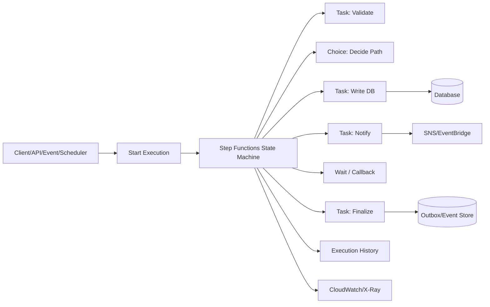
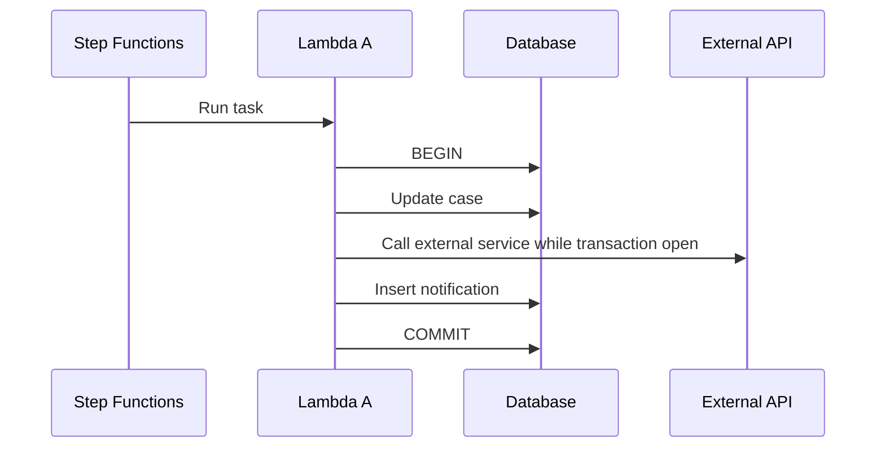
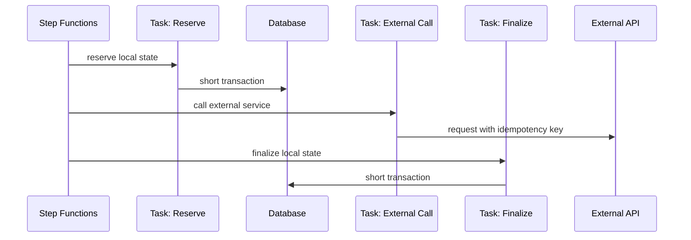
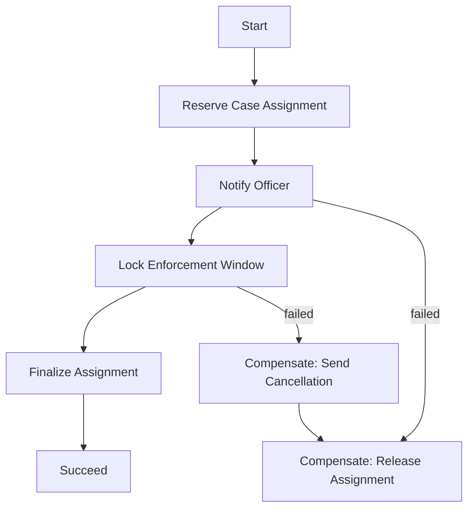
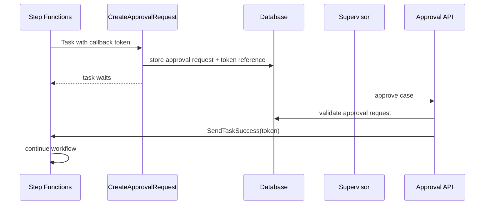
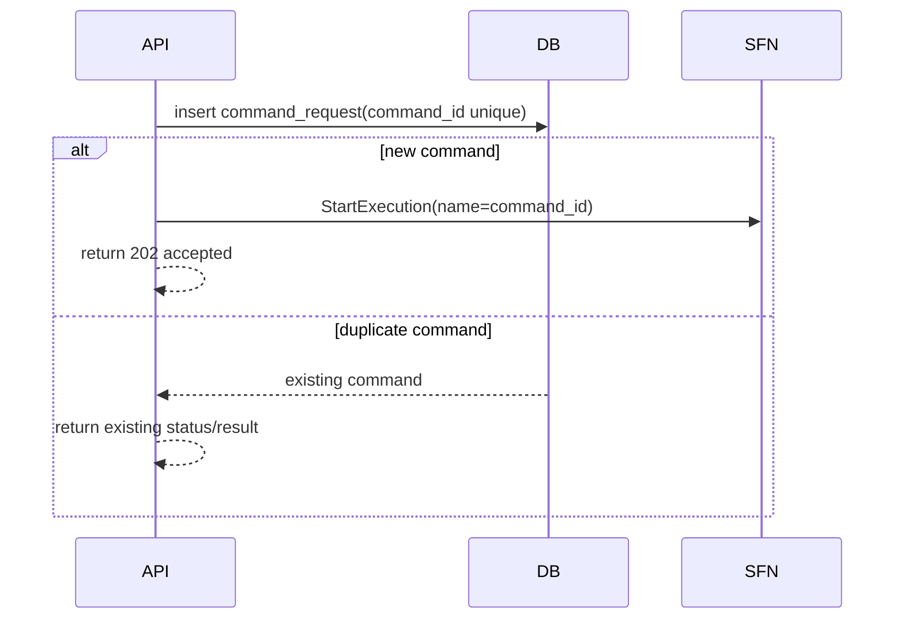
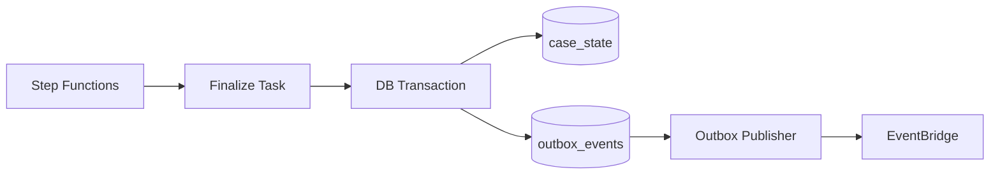
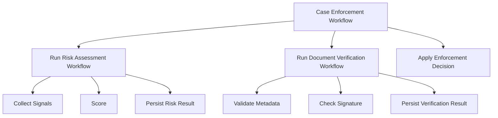
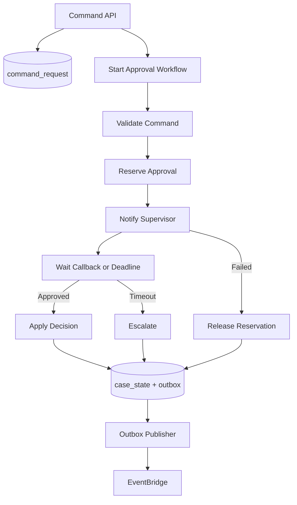

# Step Functions Mental Model: State Machine sebagai Durable Control Plane

> Target part ini: kamu tidak hanya bisa “membuat workflow Step Functions”, tetapi bisa memutuskan **kapan workflow perlu menjadi durable control plane**, bagaimana membatasi state, bagaimana menghubungkan workflow ke database tanpa long transaction, dan bagaimana mendesain retry/compensation yang aman.

AWS Step Functions adalah service untuk membuat workflow/state machine untuk membangun distributed applications, automation, microservice orchestration, dan data/ML pipelines. Itu definisi service. Mental model engineering-nya lebih tajam:

> Step Functions adalah **durable control plane** untuk proses yang perlu mengingat langkah, keputusan, retry, timeout, branch, callback, dan status lintas service tanpa menyimpan semua state orchestration di application code atau database transaction yang panjang.

Kalau API handler adalah “satu tarikan napas”, Step Functions adalah “paru-paru proses”. Ia tidak menggantikan business domain model, database, queue, atau event bus. Ia mengendalikan **progress** dari proses.

---

## 1. Problem yang Diselesaikan Step Functions

Bayangkan proses `ApproveEnforcementCase`:

1. validasi case,
2. simpan command,
3. reserve assignment,
4. panggil risk scoring,
5. kirim notification,
6. tunggu supervisor approval,
7. update final case state,
8. publish event.

Kalau semua ini dipaksakan dalam satu synchronous API call, kamu akan menghadapi:

- API timeout,
- retry ambiguity,
- duplicate side effect,
- database lock terlalu lama,
- external service failure,
- human approval yang tidak cocok dengan request/response,
- status proses yang susah diaudit,
- compensation tersebar di banyak handler.

Kalau semua ini dipaksakan sebagai event choreography murni, kamu akan menghadapi:

- workflow tersebar di banyak consumer,
- susah tahu proses sedang di step mana,
- timeout dan compensation tersebar,
- debugging butuh menyusun event timeline manual,
- failure bisa terlihat seperti “silent stuck”.

Step Functions cocok ketika proses punya **control flow eksplisit**.

---

## 2. Mental Model Utama

Step Functions bukan “Lambda chain”. Bukan juga “BPMN replacement total”. Ia adalah **state transition engine** yang mengeksekusi definisi workflow.



State machine menyimpan progress eksekusi. Worker/service menyimpan business state. Database menyimpan source of truth. Event bus menyebarkan fakta. Jangan campur semuanya.

---

## 3. Control Plane vs Data Plane

Ini pemisahan terpenting.

| Layer | Tanggung Jawab | Contoh |
|---|---|---|
| Control plane | Urutan, keputusan, retry, timeout, compensation, progress | Step Functions |
| Data plane | Business data mutation, validation, invariant, query | Aurora/RDS/DynamoDB/service domain |
| Communication plane | Delivery, fanout, queueing, routing | SQS/SNS/EventBridge |
| Observation plane | Trace, log, metrics, execution history | CloudWatch/X-Ray/Step Functions history |

Kesalahan umum: menjadikan Step Functions sebagai database business state. Jangan.

Workflow state boleh berisi:

- identifier,
- correlation id,
- command id,
- lightweight decision fields,
- retry context,
- callback token reference,
- status dari task sebelumnya,
- pointer ke data besar.

Workflow state sebaiknya tidak berisi:

- full aggregate snapshot besar,
- PII yang tidak perlu,
- object payload raksasa,
- list ribuan item tanpa Map/partitioning,
- mutable business object lengkap,
- secret/token jangka panjang.

---

## 4. State Machine adalah “Progress Record”, Bukan Source of Truth

Step Functions execution history sangat berguna untuk audit teknis, tetapi source of truth domain tetap di database domain.

Contoh pemisahan:

```mermaid
flowchart TD
  API[POST /cases/{id}/approve] --> Cmd[(command_request)]
  Cmd --> Start[Start Step Functions Execution]
  Start --> SFN[Approval Workflow]

  SFN --> Reserve[Reserve approval slot]
  Reserve --> DB[(case_approval_state)]

  SFN --> Notify[Notify supervisor]
  Notify --> EB[EventBridge/SNS]

  SFN --> Callback[Wait for callback]
  Callback --> Finalize[Finalize case approval]
  Finalize --> DB
  Finalize --> Outbox[(outbox)]
```

Database menjawab:

- apakah case approved,
- siapa approver,
- kapan effective,
- apakah approval valid,
- apa current domain state.

Step Functions menjawab:

- workflow sedang di step mana,
- task apa yang gagal,
- retry sudah berapa kali,
- branch mana yang dipilih,
- apakah menunggu callback,
- execution mana yang perlu diinspeksi.

---

## 5. Kapan Step Functions Cocok

Gunakan Step Functions ketika minimal satu dari kondisi ini benar:

1. proses berjalan lebih lama dari satu request API;
2. ada beberapa service call yang harus diurutkan;
3. perlu retry/catch/timeout berbeda per step;
4. ada branch/choice yang eksplisit;
5. ada human approval atau callback pihak ketiga;
6. perlu compensation/saga;
7. perlu audit teknis per langkah;
8. perlu menjalankan job `.sync` atau callback token;
9. perlu Map/Parallel untuk fan-out terkendali;
10. failure harus terlihat sebagai execution, bukan log tersebar.

Jangan gunakan Step Functions hanya karena “lebih visual”. Pakai ketika control flow memang perlu durable.

---

## 6. Kapan Step Functions Tidak Cocok

Step Functions bukan default untuk semua business logic.

Hindari Step Functions jika:

- operasi cukup satu database transaction pendek;
- hanya butuh async background work sederhana, cukup SQS worker;
- hanya butuh event fanout, cukup SNS/EventBridge;
- butuh stream processing continuous, gunakan streaming service;
- logic sangat latency-sensitive dan tiap millisecond penting;
- state machine hanya membungkus satu Lambda tanpa nilai orchestration;
- workflow berubah per tenant secara liar tanpa governance;
- ingin mengganti domain model dengan JSON workflow besar.

Rule praktis:

> Kalau proses hanya punya satu unit of work, jangan buat workflow. Kalau proses punya beberapa unit of work yang harus dipulihkan secara eksplisit, workflow mulai masuk akal.

---

## 7. Step Functions dalam Context Application + Database

Dalam seri ini Step Functions dipakai terutama untuk masalah application/database berikut:

| Masalah | Tanpa Step Functions | Dengan Step Functions |
|---|---|---|
| Long-running business process | API timeout atau worker tersebar | Durable workflow execution |
| Multi-step write | Long transaction atau dual-write liar | Step boundary + DB transaction pendek |
| Human approval | Polling/status custom | Callback/wait state |
| External API failure | Retry tersebar | Retry/Catch per task |
| Compensation | Manual/terlupakan | Explicit compensation branch |
| Audit teknis | Log correlation manual | Execution history |
| Parallel jobs | Custom queue orchestration | Map/Parallel state |
| Timeout | Hidden timeout | Wait/TimeoutSeconds/Heartbeat |

---

## 8. Anatomy of a State Machine

State machine berisi states dan transition.

State umum yang akan sering muncul:

| State | Fungsi | Engineering Use |
|---|---|---|
| `Task` | menjalankan unit kerja | Lambda, AWS SDK integration, Activity, HTTP task |
| `Choice` | memilih path | business branching, guard condition |
| `Wait` | menunggu waktu | delayed retry, deadline, scheduled continuation |
| `Parallel` | menjalankan branch paralel | independent checks |
| `Map` | iterasi item | batch processing, fan-out controlled |
| `Pass` | transform/debug/input shaping | temporary state, shaping payload |
| `Succeed` | selesai sukses | terminal success |
| `Fail` | selesai gagal | terminal failure eksplisit |

Contoh sangat sederhana:

```json id="quy4m7"
{
  "Comment": "Minimal approval workflow",
  "StartAt": "ValidateCommand",
  "States": {
    "ValidateCommand": {
      "Type": "Task",
      "Resource": "arn:aws:lambda:ap-southeast-1:111122223333:function:validate-command",
      "Next": "IsValid"
    },
    "IsValid": {
      "Type": "Choice",
      "Choices": [
        {
          "Variable": "$.valid",
          "BooleanEquals": true,
          "Next": "ReserveApproval"
        }
      ],
      "Default": "RejectCommand"
    },
    "ReserveApproval": {
      "Type": "Task",
      "Resource": "arn:aws:lambda:ap-southeast-1:111122223333:function:reserve-approval",
      "Next": "NotifySupervisor"
    },
    "NotifySupervisor": {
      "Type": "Task",
      "Resource": "arn:aws:lambda:ap-southeast-1:111122223333:function:notify-supervisor",
      "End": true
    },
    "RejectCommand": {
      "Type": "Fail",
      "Error": "InvalidCommand"
    }
  }
}
```

Ini belum production-ready. Tapi sudah menunjukkan mental model: state transition lebih eksplisit daripada nested imperative code.

---

## 9. Workflow Input Harus Kecil dan Stabil

Input execution biasanya cukup membawa reference:

```json id="ze0ubw"
{
  "executionId": "01JZ9QK2B7P72A8E0TQK4YVY74",
  "commandId": "cmd_01JZ9QK2B2M74R99CSEB9J1AE8",
  "tenantId": "tenant-a",
  "caseId": "case-100092",
  "requestedBy": "user-881",
  "correlationId": "corr-01JZ9QK2B9F0CW6GM2FW4KC08M",
  "schemaVersion": 1
}
```

Jangan masukkan seluruh case document ke workflow input jika case document bisa berubah, besar, atau mengandung data sensitif. Gunakan database sebagai source of truth dan baca ulang state saat task membutuhkan.

Prinsip:

1. workflow input adalah **instruction envelope**;
2. database adalah **fact store**;
3. task output adalah **decision evidence**, bukan snapshot domain penuh;
4. payload besar simpan sebagai S3 pointer dengan checksum/version.

---

## 10. Step Boundary = Transaction Boundary

Setiap `Task` sebaiknya punya satu transaction boundary yang jelas.

Buruk:



Masalah:

- lock ditahan saat external call,
- retry ambiguity,
- external call tidak rollback,
- transaction duration tidak terkendali.

Lebih baik:



Workflow mengurutkan proses. Database transaction tetap pendek.

---

## 11. Durable Workflow Tidak Menghapus Kebutuhan Idempotency

Step Functions dapat retry task. AWS service dapat retry. Client dapat retry `StartExecution`. Lambda bisa dijalankan ulang. External service bisa menerima request dua kali.

Maka setiap task yang punya side effect harus idempotent.

Pattern minimal:

```sql id="tlp0cj"
CREATE TABLE workflow_task_effect (
  task_key        text PRIMARY KEY,
  workflow_name   text NOT NULL,
  execution_name  text NOT NULL,
  task_name       text NOT NULL,
  aggregate_id    text NOT NULL,
  request_hash    text NOT NULL,
  status          text NOT NULL,
  result_json     jsonb,
  created_at      timestamptz NOT NULL DEFAULT now(),
  updated_at      timestamptz NOT NULL DEFAULT now()
);
```

`task_key` bisa dibentuk dari:

```txt id="n3nxz6"
<workflow-name>#<execution-name>#<task-name>#<business-id>#<side-effect-type>
```

Untuk DynamoDB:

```json id="3sgy7r"
{
  "PK": "TASK#approval-workflow#exec-123#NotifySupervisor",
  "SK": "EFFECT#case-100092",
  "status": "COMPLETED",
  "requestHash": "sha256:...",
  "result": {
    "notificationId": "notif-7781"
  }
}
```

Gunakan conditional write supaya hanya satu worker/task yang mencatat efek pertama.

---

## 12. Retry Harus Diklasifikasikan

Retry bukan obat universal. Step Functions membuat retry mudah, sehingga risiko over-retry juga besar.

Klasifikasikan error:

| Error | Retry? | Catatan |
|---|---:|---|
| Timeout transient | Ya, bounded | exponential backoff + jitter jika di client/task |
| 429 throttling | Ya, bounded | respect quota/backpressure |
| 5xx dependency | Ya, bounded | circuit breaker di task bila perlu |
| Validation error | Tidak | Fail fast |
| Conflict/version mismatch | Kadang | Bisa re-read lalu decide |
| Duplicate command | Tidak sebagai error | Return existing result |
| External permanent reject | Tidak | Branch ke compensation/manual review |
| Unknown after side effect | Jangan buta | Check idempotency/result store dulu |

Contoh `Retry` dan `Catch`:

```json id="dxxv0k"
{
  "ChargePenalty": {
    "Type": "Task",
    "Resource": "arn:aws:lambda:ap-southeast-1:111122223333:function:charge-penalty",
    "Retry": [
      {
        "ErrorEquals": ["ThrottlingException", "ServiceUnavailable"],
        "IntervalSeconds": 2,
        "BackoffRate": 2.0,
        "MaxAttempts": 4
      }
    ],
    "Catch": [
      {
        "ErrorEquals": ["ValidationError", "BusinessRuleViolation"],
        "Next": "RejectPenalty"
      },
      {
        "ErrorEquals": ["States.ALL"],
        "Next": "EscalateForManualReview"
      }
    ],
    "Next": "RecordPenaltyResult"
  }
}
```

Design rule:

> Retry harus punya owner, budget, classification, dan post-retry state.

---

## 13. Compensation: Undo Bukan Selalu Rollback

Dalam distributed workflow, kamu jarang bisa rollback seperti database transaction. Yang bisa dilakukan adalah compensation.

Contoh saga:



Compensation harus:

- idempotent,
- punya own audit event,
- tidak menghapus fakta historis,
- aman dipanggil walau original step belum pasti selesai,
- bisa gagal dan punya escalation path.

Jangan tulis compensation seperti:

```txt id="brdqvp"
delete everything that was created earlier
```

Lebih benar:

```txt id="vljyso"
create compensating fact that reverses current effective state
```

Regulatory systems biasanya lebih cocok dengan **reversal fact** daripada physical delete.

---

## 14. Callback Token: Untuk Human/External Completion

Beberapa proses tidak selesai karena code selesai, tapi karena dunia luar merespons:

- supervisor approve,
- vendor callback,
- payment provider callback,
- document signed,
- manual investigation done.

Callback pattern memungkinkan workflow menunggu token sampai pihak luar menyelesaikan step.



Jangan expose callback token mentah ke frontend atau pihak tidak dipercaya. Simpan token aman di backend, lalu mapping lewat approval request id.

---

## 15. Execution Name sebagai Idempotency Boundary

Untuk Standard Workflows, `StartExecution` memiliki idempotency semantics tertentu ketika name dan input sama selama execution masih berjalan. Karena itu execution name bisa menjadi boundary penting.

Pattern:

```txt id="7a43dh"
<workflow-type>#<tenant-id>#<command-id>
```

Contoh:

```txt id="24na82"
case-approval#tenant-a#cmd_01JZ9QK2B2M74R99CSEB9J1AE8
```

Namun jangan hanya bergantung ke Step Functions idempotency. Tetap simpan command record di database.



Database command record memberikan stable API behavior bahkan setelah workflow selesai, retention berbeda, atau execution history tidak lagi cukup.

---

## 16. Workflow State Machine vs Domain State Machine

Ini perbedaan halus tapi penting.

Domain state machine:

```txt id="1usair"
DRAFT -> SUBMITTED -> UNDER_REVIEW -> APPROVED -> ENFORCED -> CLOSED
```

Workflow state machine:

```txt id="eq35n9"
ValidateCommand -> ReserveReviewer -> NotifyReviewer -> WaitApproval -> ApplyDecision -> PublishEvent
```

Domain state menjelaskan **status business entity**.
Workflow state menjelaskan **progress orchestration**.

Jangan samakan keduanya. Satu domain transition bisa membutuhkan banyak workflow steps. Satu workflow bisa tidak mengubah domain state sampai akhir.

---

## 17. Step Functions dan Outbox Pattern

Untuk memastikan database write dan event publishing tidak pecah, tetap gunakan outbox.



Jangan menganggap Step Functions task yang memanggil database lalu EventBridge secara berurutan sudah atomic.

Buruk:

```txt id="d0ch8m"
Task:
  update database
  publish event
```

Jika publish gagal setelah database commit, event hilang. Jika retry task, database update bisa duplicate. Lebih aman:

```txt id="mhflvc"
Task:
  database transaction:
    update aggregate
    insert outbox event
Publisher:
  publish outbox event with retry
```

---

## 18. Nested Workflow: Modularisasi, Bukan Pelarian Complexity

Step Functions bisa memulai workflow lain dari `Task`. Ini berguna untuk memecah workflow besar.

Gunakan nested workflow ketika:

- sub-process reusable,
- sub-process punya lifecycle sendiri,
- ownership berbeda,
- execution history perlu dipisah,
- sub-process bisa diuji sendiri.

Jangan gunakan nested workflow untuk menyembunyikan spaghetti orchestration.



Boundary nested workflow harus punya contract seperti API:

- input schema,
- output schema,
- error model,
- timeout,
- idempotency key,
- ownership.

---

## 19. Map dan Parallel: Concurrency dengan Batas

`Parallel` cocok untuk beberapa branch independen yang jumlahnya tetap.

`Map` cocok untuk memproses list item.

Tetapi fan-out tanpa limit bisa menghancurkan dependency:

- database connection exhaustion,
- Lambda concurrency spike,
- downstream API throttling,
- DynamoDB hot partition,
- EventBridge target pressure,
- cost spike.

Gunakan concurrency limit, chunking, dan backpressure. Untuk workload besar, pertimbangkan apakah SQS worker pool lebih cocok daripada Map state.

Decision heuristic:

| Kebutuhan | Pilihan |
|---|---|
| 3-5 branch tetap, harus join hasil | `Parallel` |
| Puluhan/ratusan item dengan hasil join | `Map` dengan concurrency limit |
| Jutaan item, long backlog, independent processing | SQS worker / batch pipeline |
| Per item butuh durable sub-orchestration | Distributed Map atau nested workflow dengan hati-hati |

---

## 20. Observability: Execution History Bukan Satu-Satunya Sumber

Step Functions memberi execution history, tetapi production observability tetap butuh:

- structured logs di tiap task,
- correlation id,
- business id,
- execution ARN/name,
- metrics per step,
- dependency latency,
- retry count,
- compensation count,
- manual escalation count,
- workflow age,
- stuck executions,
- failure reason distribution.

Standardisasi log task:

```json id="29f4tj"
{
  "timestamp": "2026-07-06T12:30:00Z",
  "level": "INFO",
  "service": "case-approval-worker",
  "workflow": "case-approval",
  "executionName": "case-approval#tenant-a#cmd_01JZ...",
  "task": "ReserveReviewer",
  "tenantId": "tenant-a",
  "caseId": "case-100092",
  "commandId": "cmd_01JZ...",
  "correlationId": "corr_01JZ...",
  "attempt": 2,
  "result": "RESERVED",
  "latencyMs": 143
}
```

---

## 21. Workflow Definition as Code

State machine definition harus diperlakukan sebagai production code:

- versioned,
- reviewed,
- tested,
- linted,
- deployed via IaC,
- punya rollback strategy,
- punya compatibility policy,
- punya contract tests.

Repository layout contoh:

```txt id="27f5yf"
workflows/
  case-approval/
    state-machine.asl.json
    README.md
    input.schema.json
    output.schema.json
    errors.md
    examples/
      happy-path.json
      validation-failed.json
      supervisor-timeout.json
    tests/
      asl-validation.test.ts
      contract.test.ts
      local-step.test.ts
infra/
  step-functions/
    case-approval.ts
services/
  case-command-api/
  case-approval-tasks/
```

---

## 22. Local Reasoning: Table sebelum ASL

Sebelum menulis JSON ASL, buat transition table.

| State | Input | Action | Success | Failure | Idempotency Key |
|---|---|---|---|---|---|
| ValidateCommand | commandId | read command + validate | ReserveReviewer | RejectCommand | commandId#validate |
| ReserveReviewer | caseId | insert reservation | NotifySupervisor | Escalate | caseId#reservation |
| NotifySupervisor | reservationId | send notification | WaitApproval | ReleaseReservation | notificationId |
| WaitApproval | approvalId | wait callback | ApplyDecision | ExpireApproval | approvalId |
| ApplyDecision | approvalId | update case state + outbox | Succeed | Escalate | caseId#decision |

Jika table ini tidak jelas, ASL akan menjadi tempat menyembunyikan kebingungan.

---

## 23. Common Anti-Patterns

### 23.1 Lambda Chain dengan Nama Workflow

```txt id="3x5zz1"
Lambda A -> Lambda B -> Lambda C -> Lambda D
```

Kalau Step Functions hanya membungkus chain tanpa error model, idempotency, atau compensation, kamu hanya memindahkan kompleksitas.

### 23.2 Workflow sebagai Giant JSON Business Object

State machine membawa semua data. Task saling memodifikasi payload. Akhirnya tidak jelas mana source of truth.

### 23.3 Retry Semua Error

`States.ALL` dengan `MaxAttempts` besar bisa membuat permanent business error menjadi expensive loop.

### 23.4 Compensation Tanpa Audit

Undo diam-diam tanpa event/fact akan merusak audit trail.

### 23.5 Menunggu Human Approval di Database Polling Loop

Kalau ada waiting semantics yang durable, jangan buat loop worker yang polling tiap beberapa detik selama berhari-hari.

### 23.6 Workflow Menggantikan Queue Backlog

Jika kebutuhan utamanya menampung banyak pekerjaan homogen, SQS worker lebih sederhana dan murah secara mental model.

### 23.7 Step Functions sebagai Cross-Service Transaction Manager

Step Functions mengatur urutan dan recovery. Ia bukan ACID transaction manager lintas service.

---

## 24. Production Checklist

Sebelum workflow production, jawab ini:

### Contract

- Apa input schema?
- Apa output schema?
- Apa error names yang stabil?
- Apakah ada versioning?
- Apakah execution name deterministic?

### State

- Apakah workflow membawa hanya reference, bukan full object besar?
- Di mana source of truth business state?
- Apakah data sensitif diminimalkan?
- Apakah payload size aman?

### Idempotency

- Apakah setiap side-effect task idempotent?
- Apakah external API menerima idempotency key?
- Apakah duplicate callback aman?
- Apakah retry setelah partial success aman?

### Failure

- Error mana yang retryable?
- Error mana yang permanent?
- Error mana yang butuh manual escalation?
- Compensation apa yang harus terjadi?
- Apa timeout per step?

### Database

- Apakah tiap task memakai transaction pendek?
- Apakah outbox dipakai untuk publish event setelah DB mutation?
- Apakah optimistic concurrency/version check ada?
- Apakah lock tidak ditahan selama external call?

### Observability

- Apakah log punya execution name, business id, correlation id?
- Apakah ada alarm untuk failed/timed-out executions?
- Apakah ada dashboard workflow age?
- Apakah manual replay procedure jelas?

### Operations

- Bagaimana stop/abort execution?
- Bagaimana retry failed business process?
- Bagaimana handle stuck callback?
- Bagaimana deploy workflow change tanpa merusak execution lama?

---

## 25. Mini Case Study: Enforcement Case Approval

### Requirement

- Case approval harus dilakukan supervisor.
- Jika supervisor tidak merespons dalam 3 hari, eskalasi.
- Setelah approval, system mengubah case state dan publish event.
- Jika notification gagal, reservation harus dilepas.
- API tidak boleh menunggu proses selesai.

### Architecture



### Transition Table

| Step | Business Effect | Recovery |
|---|---|---|
| Validate | none | fail fast |
| Reserve | creates pending approval reservation | release reservation |
| Notify | sends notification | release reservation or retry |
| Wait | no mutation | timeout to escalation |
| Apply | updates case state + outbox | idempotent retry |
| Escalate | records escalation + outbox | idempotent retry |

### Invariant

```txt id="rrnsuo"
A case cannot be APPROVED unless there is exactly one valid approval decision
linked to the current case version and reviewer authority.
```

Workflow helps enforce order, but the database must enforce this invariant.

---

## 26. Mental Model Final

Step Functions gives you a durable place to say:

```txt id="hkmnwh"
This process started.
This step succeeded.
This step failed.
This retry is allowed.
This branch was selected.
This callback is pending.
This compensation ran.
This execution ended.
```

But domain correctness still comes from:

- database constraints,
- idempotency records,
- aggregate versioning,
- outbox publishing,
- event contracts,
- reconciliation.

Use Step Functions as a **durable control plane**, not as a dumping ground for distributed complexity.

---

## 27. Practical Exercises

1. Ambil satu proses production yang punya lebih dari 3 side effects. Tulis transition table sebelum menulis ASL.
2. Tandai setiap task: apakah punya DB write, external call, event publish, atau callback?
3. Untuk setiap side effect, tulis idempotency key.
4. Untuk setiap error, klasifikasikan: retryable, permanent, conflict, unknown, escalation.
5. Tulis satu compensation fact, bukan delete operation.
6. Buat dashboard minimal: failed execution, timed out execution, workflow age, task latency, retry count.

---

## 28. Referensi

- AWS Step Functions Developer Guide — What is Step Functions: https://docs.aws.amazon.com/step-functions/latest/dg/welcome.html
- AWS Step Functions — Amazon States Language: https://docs.aws.amazon.com/step-functions/latest/dg/concepts-amazon-states-language.html
- AWS Step Functions — State machines concepts: https://docs.aws.amazon.com/step-functions/latest/dg/concepts-statemachines.html
- AWS Step Functions — Error handling: https://docs.aws.amazon.com/step-functions/latest/dg/concepts-error-handling.html
- AWS Step Functions — Service integration patterns: https://docs.aws.amazon.com/step-functions/latest/dg/connect-to-resource.html
- AWS Prescriptive Guidance — Orchestration: https://docs.aws.amazon.com/prescriptive-guidance/latest/modernization-integrating-microservices/orchestration.html
