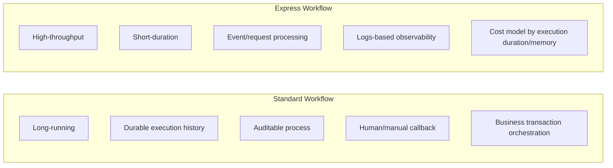
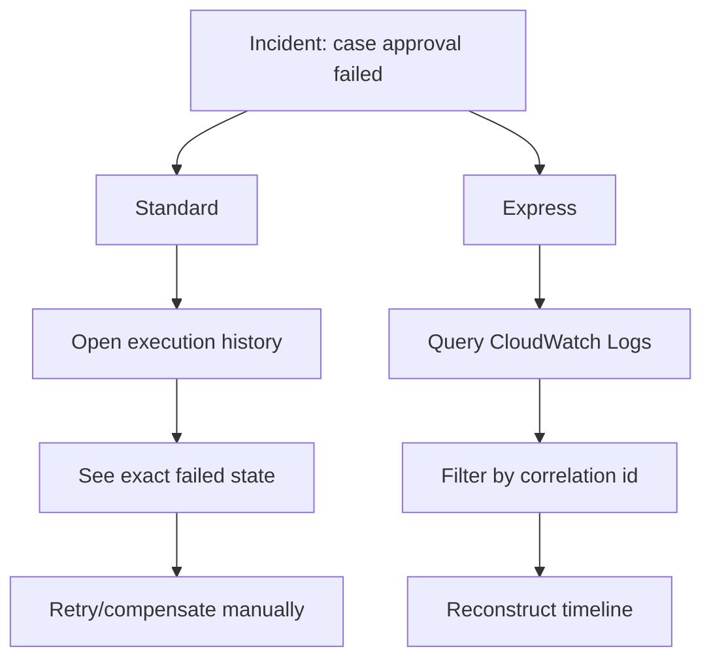
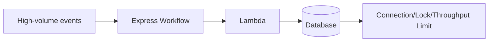
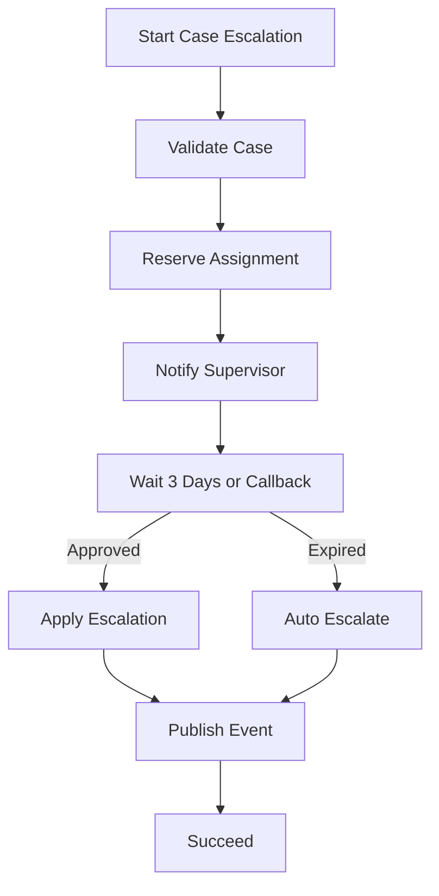
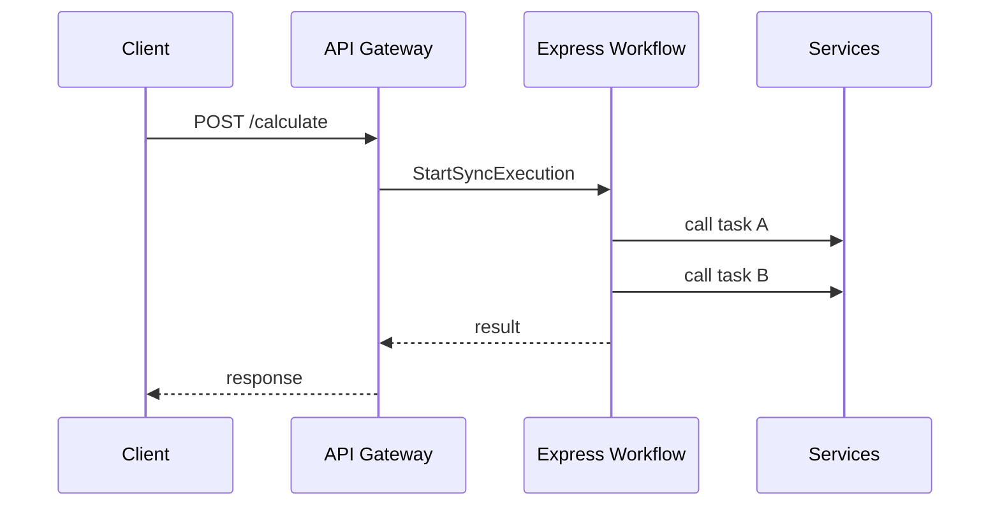
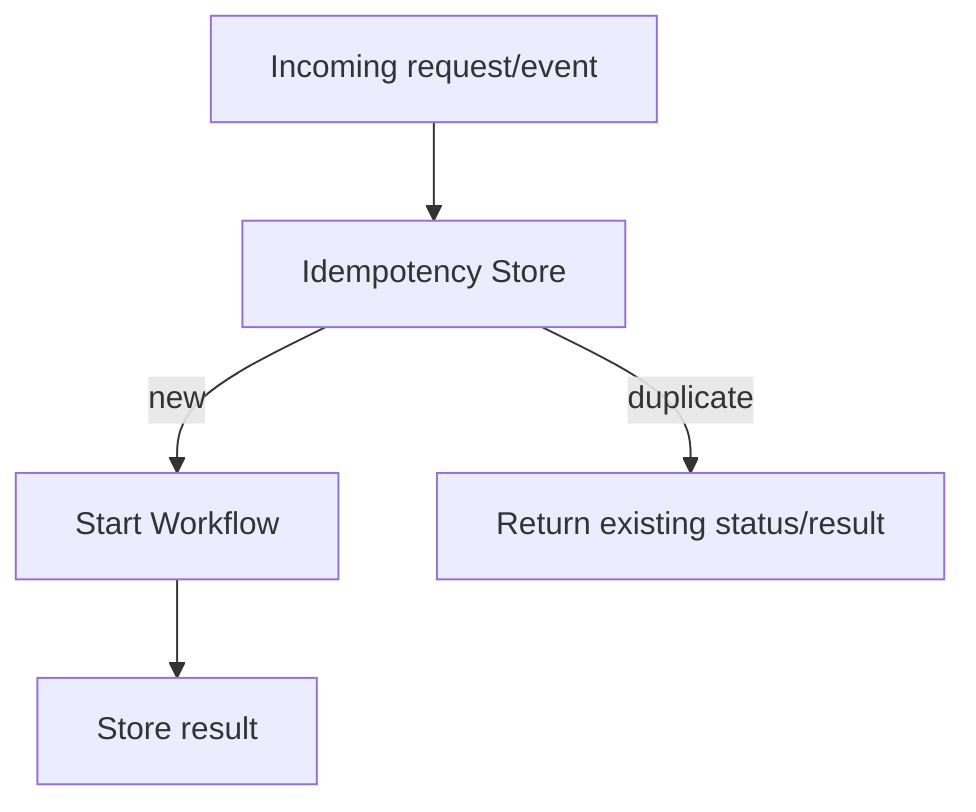
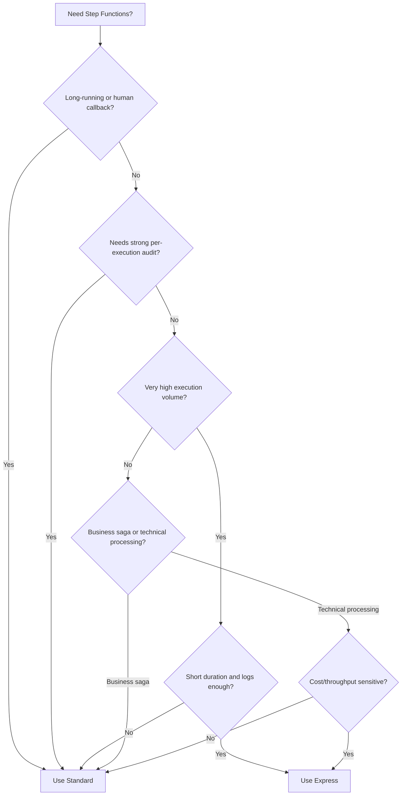
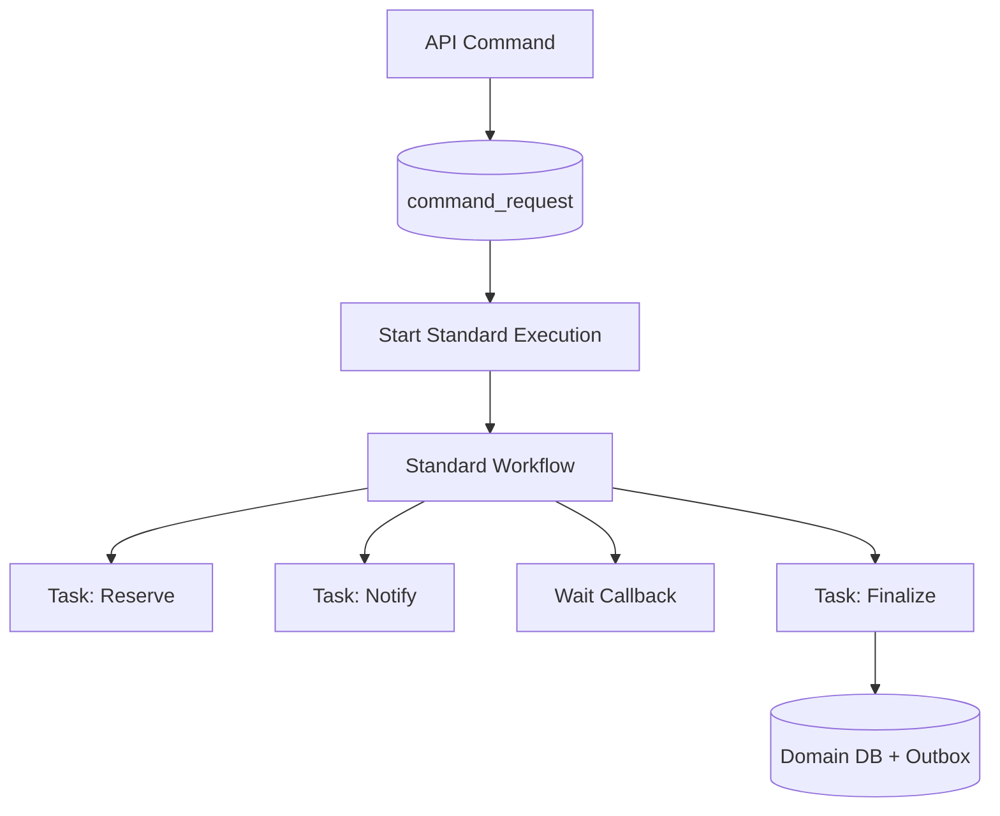
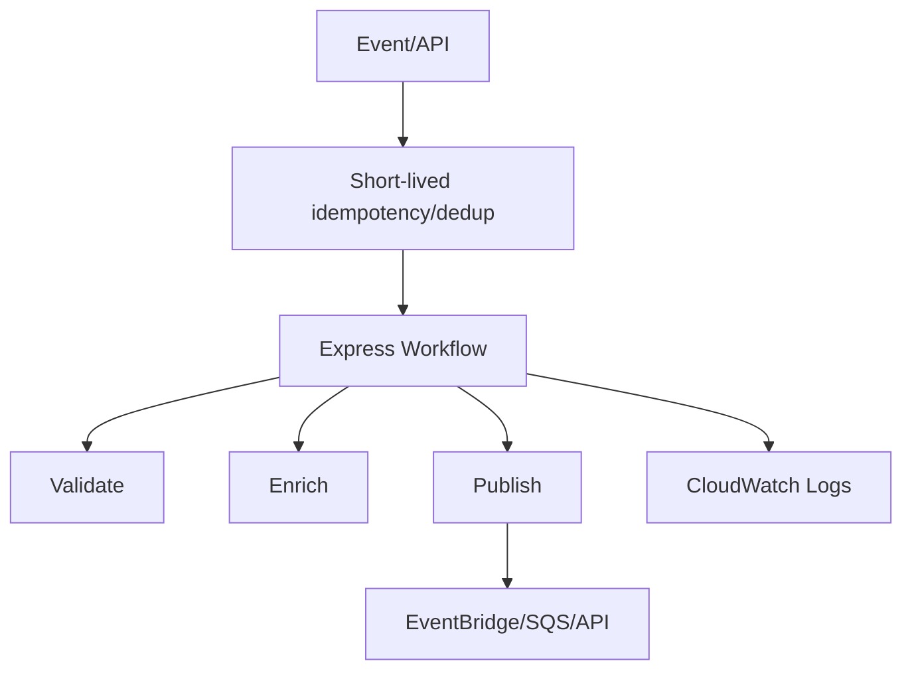

# Standard vs Express Workflow: Duration, Cost, Throughput, Auditability

> Target part ini: kamu bisa memilih **Standard** atau **Express** Step Functions bukan berdasarkan “mana lebih murah”, tetapi berdasarkan semantics: durability, duration, execution history, idempotency, throughput, observability, retry behavior, dan business auditability.

Step Functions punya dua tipe workflow utama:

1. **Standard Workflows**
2. **Express Workflows**

Keduanya sama-sama state machine. Yang berbeda adalah semantic contract dan operational trade-off.

AWS mendeskripsikan Standard Workflows sebagai cocok untuk workflow long-running, durable, dan auditable hingga satu tahun. Express Workflows cocok untuk high-volume event-processing workload dan short-duration workflow. Workflow type tidak bisa diubah setelah state machine dibuat, jadi keputusan ini adalah architecture decision, bukan toggle belakangan.

---

## 1. Executive Decision

Gunakan **Standard Workflow** ketika:

- proses bisa berjalan lama;
- auditability penting;
- execution history penting;
- human approval/callback diperlukan;
- business process harus jelas statusnya;
- setiap eksekusi punya nilai business besar;
- failure harus diinvestigasi per execution;
- butuh exactly-once-ish start behavior untuk execution name/input tertentu;
- retry/compensation harus mudah ditelusuri.

Gunakan **Express Workflow** ketika:

- proses sangat sering dipanggil;
- durasi pendek;
- audit per execution tidak seberat Standard;
- workload event processing / request processing intensif;
- cost per state transition Standard terlalu mahal;
- observability via logs/metrics cukup;
- execution volume lebih penting daripada long-lived execution history.

Rule kasar:

```txt id="gtrhye"
If the workflow represents a business process, start with Standard.
If the workflow represents high-volume technical processing, consider Express.
```

---

## 2. Perbedaan Mental Model



Standard adalah **process ledger**.
Express adalah **high-throughput workflow runtime**.

Ini bukan definisi resmi, tapi mental model yang berguna untuk engineering.

---

## 3. Comparison Table

| Dimension | Standard Workflow | Express Workflow |
|---|---|---|
| Primary use | Durable business/workflow orchestration | High-volume short workflow |
| Duration | Long-running, sampai satu tahun | Short-duration; limit jauh lebih pendek |
| Execution history | Full execution history tersedia via Step Functions API untuk periode tertentu | Execution detail terutama melalui CloudWatch Logs/Logs Insights jika logging enabled |
| Auditability | Kuat untuk per-execution investigation | Lebih cocok aggregate/log-based investigation |
| Cost model | Per state transition | Per request + duration + memory |
| Throughput orientation | Durable orchestration | High-throughput event/request processing |
| Callback/human wait | Sangat cocok | Umumnya tidak cocok untuk long wait |
| Failure inspection | Detail per execution | Log/metrics centric |
| Idempotent start behavior | Lebih kuat untuk execution name/input tertentu saat running | Berbeda; jangan asumsikan sama |
| Best fit | Saga, approval, provisioning, long-running process | API composition pendek, event enrichment, lightweight ETL, high volume transformations |

---

## 4. Duration adalah Semantic Boundary

Workflow type pertama-tama adalah keputusan waktu.

### Standard

Cocok untuk:

- approval 3 hari,
- remediation 2 jam,
- provisioning 45 menit,
- investigation SLA 7 hari,
- database migration orchestration,
- compensation process yang menunggu external condition.

### Express

Cocok untuk:

- enrich event lalu publish,
- validate payload lalu call service,
- API backend orchestration pendek,
- transform batch kecil,
- route high-volume request,
- lightweight workflow untuk telemetry/event processing.

Jika proses kamu bisa tidur lama, menunggu callback, atau perlu dilihat lagi setelah beberapa jam/hari, Express biasanya salah mental model.

---

## 5. Auditability: Execution History vs Logs

Standard Workflows menyimpan execution history yang bisa ditarik dari Step Functions API untuk periode setelah execution selesai. Ini sangat berguna untuk:

- incident review,
- compliance evidence,
- business process investigation,
- debugging exact path,
- melihat retry/catch/choice/branch yang terjadi.

Express lebih mengandalkan CloudWatch Logs untuk detail execution. Ini bisa sangat baik untuk volume tinggi, tetapi kamu harus mendesain log ingestion, retention, query cost, dan correlation.



Kalau regulatory defensibility penting, Standard biasanya lebih alami.

---

## 6. Cost Model: Jangan Bandingkan Mentah

Standard ditagih berdasarkan state transitions. Express ditagih berdasarkan jumlah request, durasi, dan memory yang digunakan.

Konsekuensi:

- Standard bisa mahal untuk workflow dengan state transition sangat banyak dan volume tinggi.
- Express bisa lebih ekonomis untuk volume besar dan durasi pendek.
- Express bisa menjadi mahal jika payload besar, durasi panjang, dan logging berlebihan.
- CloudWatch Logs cost perlu dihitung untuk Express jika logging detail tinggi.

Cost decision harus memakai formula workload:

```txt id="0fbjw7"
Standard monthly cost approximation:
  executions_per_month * average_state_transitions_per_execution * price_per_transition

Express monthly cost approximation:
  executions_per_month * request_price
  + executions_per_month * average_duration_seconds * memory_gb * duration_price
  + logs_cost_if_enabled
```

Yang paling sering salah: membandingkan harga tanpa menghitung observability dan failure investigation cost.

---

## 7. Throughput dan Backpressure

Express dirancang untuk high-volume scenarios. Tetapi high-throughput workflow bukan berarti downstream aman.

Jika Express memanggil:

- Lambda,
- RDS/Aurora,
- DynamoDB,
- external API,
- EventBridge,
- SQS,

maka bottleneck tetap bisa pindah ke dependency.



Express bisa mempercepat arrival rate ke database. Itu bisa membuat database jatuh lebih cepat jika tidak ada backpressure.

Untuk database-heavy workload, pertimbangkan:

- SQS sebelum DB worker,
- reserved concurrency Lambda,
- token bucket,
- rate limiting,
- DynamoDB capacity planning,
- RDS Proxy/connection pool,
- batch write controlled.

---

## 8. Standard untuk Business Saga

Contoh: enforcement case escalation.



Gunakan Standard karena:

- menunggu manusia,
- butuh audit path,
- process punya business value tinggi,
- compensation penting,
- execution bisa lama.

---

## 9. Express untuk High-Volume Event Enrichment

Contoh: event `CaseDocumentUploaded` perlu enrich metadata lalu route.


Gunakan Express jika:

- event banyak,
- durasi pendek,
- setiap event tidak butuh audit detail panjang,
- retry/idempotency tetap ada,
- logs cukup untuk debugging.

---

## 10. Synchronous Express: API Backend Pattern

Express bisa digunakan sebagai backend synchronous untuk API-like flow, tetapi hati-hati.

Pattern:



Cocok untuk:

- composition pendek,
- deterministic processing,
- no long wait,
- no heavy DB transaction,
- bounded latency.

Tidak cocok untuk:

- human approval,
- long-running job,
- operation yang perlu status polling panjang,
- command yang harus punya durable business process audit.

Kalau API command mengubah business state penting, lebih baik:

1. API menerima command,
2. simpan command idempotently,
3. start Standard workflow async,
4. return `202 Accepted`,
5. client poll/query status.

---

## 11. Idempotency Semantics: Jangan Disamakan

Standard dan Express tidak boleh diperlakukan sama dalam idempotency design.

Untuk Standard, execution name sering dipakai sebagai idempotency guard di start boundary. Namun tetap perlu command table.

Untuk Express, jangan bergantung pada execution name sebagai durable idempotency mechanism. Gunakan explicit idempotency store.



Idempotency store bisa:

- DynamoDB table dengan conditional write + TTL,
- Aurora table dengan unique constraint,
- Redis/MemoryDB untuk short-lived technical dedup,
- business command table untuk long-lived command.

---

## 12. Failure Semantics

### Standard Failure Model

Standard cocok untuk failure yang perlu ditindaklanjuti per execution.

Kamu bisa melihat:

- failed state,
- input/output step,
- retry attempts,
- caught error,
- branch decision,
- execution age.

Runbook bisa berbunyi:

```txt id="bzk6f9"
1. Open failed execution.
2. Identify failed state.
3. Check business aggregate state.
4. Check idempotency/effect table.
5. Decide restart, compensate, or mark manual review.
```

### Express Failure Model

Express lebih cocok untuk aggregate failure handling:

- alarm error rate,
- query logs by correlation id,
- replay from source event/queue,
- route failed event to DLQ where possible,
- use idempotency to make replay safe.

Runbook bisa berbunyi:

```txt id="37xbgw"
1. Identify error spike by workflow/version.
2. Query logs by time window/correlation id.
3. Locate source events/requests.
4. Fix consumer/task bug.
5. Replay from source queue/event archive with controlled rate.
```

---

## 13. Logging Strategy

### Standard Logging

Standard bisa memakai execution history, tetapi tetap aktifkan logging yang cukup untuk centralized observability.

Minimum fields:

```json id="r9i0w9"
{
  "workflowType": "STANDARD",
  "workflowName": "case-escalation",
  "executionName": "case-escalation#tenant-a#cmd-123",
  "stateName": "ApplyEscalation",
  "tenantId": "tenant-a",
  "caseId": "case-100092",
  "commandId": "cmd-123",
  "correlationId": "corr-7781",
  "status": "FAILED",
  "errorType": "OptimisticLockConflict"
}
```

### Express Logging

Untuk Express, logs bukan tambahan. Logs adalah jalur utama investigasi detail.

Tambahkan:

- correlation id,
- event id,
- source event version,
- workflow version,
- task attempt,
- downstream latency,
- idempotency decision,
- output classification.

Jangan log payload penuh jika berisi PII/secret atau terlalu besar.

---

## 14. Decision Tree



Default untuk business process: Standard.
Default untuk high-volume technical workflow: evaluate Express.

---

## 15. Workload Archetypes

| Archetype | Recommended Type | Why |
|---|---|---|
| Case approval with human wait | Standard | long-running + audit |
| Account provisioning across services | Standard | compensation + per-execution visibility |
| Payment capture saga | Standard | business-critical + side effects |
| Event enrichment at high volume | Express | short + high throughput |
| API composition under tight latency | Express sync or normal API code | short + request scoped |
| ETL validation for many small events | Express | high volume |
| Scheduled compliance report generation | Standard or SQS/Batch | depends duration/audit |
| Image processing pipeline with many items | Express/Map/SQS | depends fan-out and duration |
| Database migration cutover workflow | Standard | audit + manual checkpoints |
| Retry wrapper around one Lambda | Usually neither | too little orchestration value |

---

## 16. Cost-Aware Design Examples

### Example A: Approval Workflow

```txt id="t5e16w"
100,000 executions/month
25 state transitions/execution
Long wait, audit required
```

Standard likely fits. Even if Express looks cheaper in raw compute, missing per-execution audit and long wait semantics are the real cost.

### Example B: Event Enrichment

```txt id="5qkzq5"
50,000,000 executions/month
6 short states/execution
Duration < 1 second
No human wait
Replay from source possible
```

Express likely fits. Standard transition cost may dominate.

### Example C: API Backend Composition

```txt id="bd1p8s"
10,000,000 requests/month
3 short service calls
Latency target < 1 second
No durable business workflow
```

Evaluate whether Step Functions is needed at all. Express sync can help if you want visual composition/retry, but ordinary service code may be simpler.

---

## 17. Standard Workflow Design Pattern



Implementation rules:

- deterministic execution name,
- command table first,
- task idempotency,
- database transaction per task,
- explicit Catch branches,
- manual escalation state,
- outbox for final event,
- alert failed/timed-out execution.

---

## 18. Express Workflow Design Pattern



Implementation rules:

- keep duration short,
- keep payload small,
- logs are first-class,
- downstream throttling protection,
- explicit idempotency store,
- replay from upstream source,
- avoid long waits,
- avoid per-execution business audit dependency.

---

## 19. Database Interaction Differences

### Standard + Database

Standard can coordinate multiple short transactions over time.

Good for:

- create pending state,
- wait,
- finalize,
- compensate,
- escalate.

Pattern:

```txt id="y4nboa"
Step 1 transaction: create pending approval
Step 2 external notification: no DB lock
Step 3 callback: validate and finalize approval
Step 4 outbox publisher: emit event
```

### Express + Database

Express can easily create write spikes.

Guardrails:

- use queue before DB write if load is spiky,
- batch where safe,
- limit Lambda concurrency,
- use conditional writes for idempotency,
- use RDS Proxy/pooling for relational database,
- avoid full table scans or unbounded queries in task.

---

## 20. Versioning and Deployment

Workflow type is immutable. More generally, workflow behavior changes can affect in-flight executions.

Deployment strategy:

1. version state machine definition;
2. publish new state machine/alias/version strategy where applicable;
3. route new commands/events to new version;
4. let old executions finish;
5. keep old task handlers compatible;
6. monitor both versions;
7. retire old version after no in-flight executions remain.

For Standard long-running workflows, backward compatibility matters more because executions can live for a long time.

---

## 21. Observability Matrix

| Signal | Standard | Express |
|---|---|---|
| Failed executions | Alarm | Alarm |
| Timed out executions | Alarm | Alarm if relevant |
| Execution duration | Per execution + aggregate | Aggregate/log metric |
| State transition failure | Execution history | Logs/metrics |
| Business id lookup | Execution name/tag/log | Logs/correlation index |
| Retry count | History/logs | Logs/metrics |
| Callback age | Important | Usually not applicable |
| Log cost | Moderate | Important cost factor |
| Replay source | Execution/manual/business command | Upstream queue/event/archive |

---

## 22. API Response Patterns

### Standard Async Command

```http id="6w57tj"
POST /cases/case-100092/approve
Idempotency-Key: cmd_01JZ...
```

Response:

```json id="m70te4"
{
  "status": "ACCEPTED",
  "commandId": "cmd_01JZ...",
  "workflow": "case-approval",
  "executionName": "case-approval#tenant-a#cmd_01JZ...",
  "statusUrl": "/commands/cmd_01JZ..."
}
```

### Express Sync API

```http id="x4p4rd"
POST /quote-risk-score
```

Response:

```json id="ui8da5"
{
  "riskScore": 87,
  "classification": "HIGH",
  "featuresVersion": "2026-07-01"
}
```

If the operation changes durable business state, be careful with sync Express. Prefer explicit command status unless the operation is truly short and idempotent.

---

## 23. Security and Data Handling

Both Standard and Express require:

- least-privilege IAM role,
- no secrets in workflow input/output,
- encrypted logs where required,
- data minimization,
- careful CloudWatch log retention,
- masking/redaction for PII,
- tenant isolation in input and task authorization,
- explicit permission for integrated AWS services.

Express logging can accidentally become a PII leak if full input/output logging is enabled without review.

Checklist:

```txt id="j8b4px"
For every state machine:
- what data enters workflow input?
- what data appears in execution history/logs?
- who can view execution history/logs?
- how long is it retained?
- can payload contain secrets?
- are task IAM permissions scoped to required resources?
```

---

## 24. Migration from One Type to Another

Because workflow type is immutable, switching means creating a new state machine.

Migration plan:

1. define new state machine type;
2. copy/adjust ASL;
3. review semantic differences;
4. update IAM;
5. update observability;
6. update caller route;
7. keep old state machine for in-flight executions;
8. migrate/replay only if idempotency is proven;
9. decommission old after retention and execution drain.

Do not “just recreate it” if there are running Standard workflows.

---

## 25. Common Wrong Decisions

### 25.1 Choosing Express Only Because It Looks Cheaper

If the workflow is business-critical and needs audit, the investigation cost can exceed transition cost.

### 25.2 Choosing Standard for High-Volume Tiny Event Processing

If each event is low-value, short, and replayable from source, Standard may be expensive and operationally noisy.

### 25.3 Using Express for Human Approval

Human wait is a Standard-shaped problem.

### 25.4 Using Standard as Queue Replacement

If you just need millions of independent jobs waiting for workers, SQS is usually simpler.

### 25.5 Forgetting Downstream Capacity

Express can scale workflow invocation faster than your database can accept writes.

### 25.6 Treating Execution History as Domain Audit

Execution history is technical audit. Domain audit belongs in domain database/event log.

---

## 26. Architecture Review Questions

Ask these before approving Step Functions type:

1. Is this a business process or technical processing pipeline?
2. Maximum expected duration?
3. Does it wait for human/external callback?
4. Do we need per-execution audit after completion?
5. What is expected monthly execution volume?
6. Average and p99 state transitions per execution?
7. Payload size and sensitivity?
8. What downstream dependency will be bottleneck?
9. How do we replay failed executions/events?
10. Where is idempotency stored?
11. How do we observe failure at execution and aggregate level?
12. What happens to in-flight executions during deployment?
13. What cost dominates: state transitions, duration, memory, logs, or operator time?

---

## 27. Decision Records

### ADR Template

```mdx id="eq67sc"
# ADR: Use Standard Step Functions for Case Approval Workflow

## Context
Case approval requires supervisor callback, 3-day timeout, compensation, and audit trail.

## Decision
Use Step Functions Standard Workflow.

## Rationale
- Workflow can run for days.
- Per-execution debugging matters.
- Human callback is central.
- Business process must be auditable.
- Execution volume is moderate.

## Rejected Options
- Express Workflow: not appropriate for long wait/audit.
- SQS worker only: hidden workflow state and timeout handling.
- Event choreography only: compensation and progress visibility become scattered.

## Consequences
- Pay per state transition.
- Need workflow versioning for long-running executions.
- Need command table and task idempotency.
- Need alarms for failed/timed-out/stuck executions.
```

### ADR for Express

```mdx id="hd7xrd"
# ADR: Use Express Step Functions for Event Enrichment

## Context
Document upload events must be validated, enriched, and republished. Volume is high and processing is short.

## Decision
Use Step Functions Express Workflow.

## Rationale
- Short execution duration.
- High event volume.
- Replay possible from EventBridge archive/SQS source.
- Per-execution long-term audit is not required.

## Rejected Options
- Standard Workflow: state transition cost and execution noise too high.
- Single Lambda: less explicit branching and retry policy.

## Consequences
- Logs become primary debugging source.
- Need correlation id in every log.
- Need explicit idempotency/dedup for publish side effect.
- Need downstream throttling controls.
```

---

## 28. Final Heuristic

Use this sentence during architecture review:

```txt id="2a28rs"
Standard is for processes you may need to explain later.
Express is for high-volume processing you can observe and replay operationally.
```

It is not perfect, but it prevents the most common mistake: choosing workflow type based on syntax similarity instead of production semantics.

---

## 29. Practical Exercises

1. Pick three workflows in your system and classify them as Standard, Express, SQS worker, or no workflow.
2. For each classification, write one rejected alternative and why.
3. Estimate monthly executions and average state transitions.
4. Identify whether investigation is per-execution or aggregate/log based.
5. Design idempotency store for one Standard workflow and one Express workflow.
6. Define dashboard metrics for both.
7. Write an ADR for the chosen workflow type.

---

## 30. Referensi

- AWS Step Functions — Choosing workflow type: https://docs.aws.amazon.com/step-functions/latest/dg/choosing-workflow-type.html
- AWS Step Functions — What is Step Functions: https://docs.aws.amazon.com/step-functions/latest/dg/welcome.html
- AWS Step Functions — Viewing execution details: https://docs.aws.amazon.com/step-functions/latest/dg/concepts-view-execution-details.html
- AWS Step Functions — Best practices: https://docs.aws.amazon.com/step-functions/latest/dg/sfn-best-practices.html
- AWS Well-Architected Serverless Lens — Step Functions workflows: https://docs.aws.amazon.com/wellarchitected/latest/serverless-applications-lens/step-functions-workflows.html
