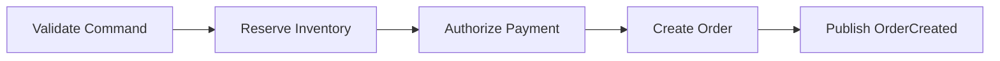
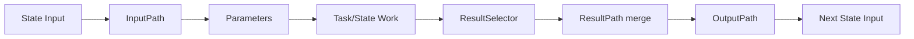
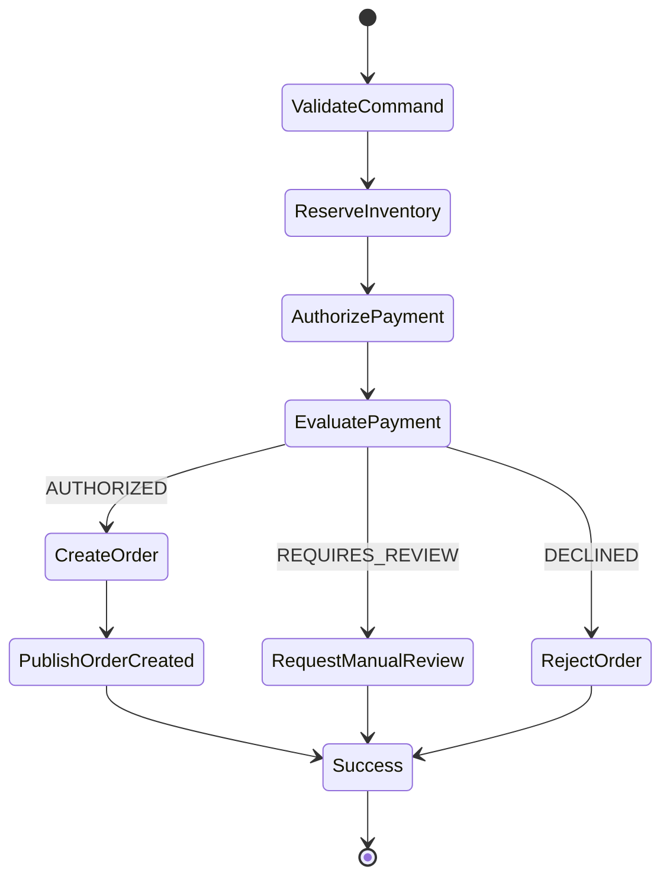
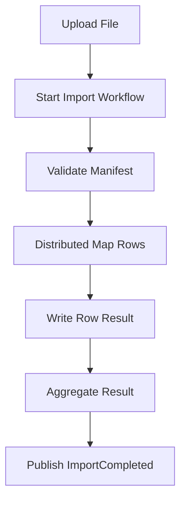
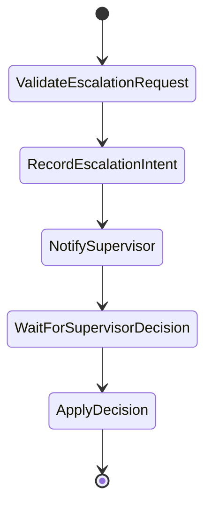

# Part 043 — AWS States Language in Action

> Step Functions bukan sekadar diagram workflow. Ia adalah interpreter untuk _durable control flow_. Amazon States Language adalah grammar-nya. Jika grammar-nya dipakai asal-asalan, workflow akan terlihat rapi di console, tetapi rapuh saat retry, timeout, replay, schema berubah, atau satu service lambat.

Part ini membahas **Amazon States Language (ASL)** secara implementatif: bagaimana membaca, menulis, dan mereview state machine definition yang bisa dipakai di production.

Kita tidak akan mengulang definisi dasar Step Functions dari part sebelumnya. Fokusnya adalah:

1. cara memodelkan workflow sebagai state machine;
2. kapan memakai `Task`, `Choice`, `Pass`, `Wait`, `Parallel`, `Map`, `Succeed`, dan `Fail`;
3. bagaimana input/output bergerak antar state;
4. bagaimana service integration dipilih;
5. bagaimana membuat workflow yang bisa di-debug, di-review, dan diubah dengan aman.

---

## 1. Mental Model: ASL adalah Contract Antara Intent dan Runtime

ASL adalah JSON-based structured language untuk mendefinisikan Step Functions state machine.

Tetapi secara engineering, ASL adalah **contract** antara empat pihak:

| Pihak | Yang dikontrak |
|---|---|
| Caller | bentuk input, nama execution, synchronous/asynchronous expectation |
| Workflow runtime | urutan state, retry, catch, timeout, transition |
| Task implementation | payload yang diterima, error yang dilempar, output yang dikembalikan |
| Operator | execution history, trace, log, metric, failure point |

Jadi ASL bukan hanya deployment artifact. Ia adalah **specification of control flow**.

Jika aplikasi biasa punya kode seperti ini:

```java
validate(command);
reserveInventory(command);
authorizePayment(command);
createOrder(command);
publishOrderCreated(command);
```

State machine memindahkan sebagian control flow itu ke runtime yang durable:



Perbedaannya besar:

| Kode imperative biasa | Step Functions ASL |
|---|---|
| stack/memory process-local | execution history durable |
| retry sering tersembunyi di library | retry eksplisit per state |
| timeout sering incidental | timeout adalah bagian contract |
| error path sering menyebar | fallback/compensation bisa dimodelkan |
| observability perlu dibuat manual | execution graph/history tersedia |

Rule utamanya:

> Domain decision tetap di domain/application code. Durable control decision bisa dinaikkan ke Step Functions.

---

## 2. Bentuk Dasar State Machine

State machine minimal punya:

| Field | Fungsi |
|---|---|
| `Comment` | dokumentasi manusia |
| `StartAt` | state pertama |
| `States` | dictionary nama state ke definition |
| `TimeoutSeconds` | optional, timeout seluruh execution |
| `QueryLanguage` | optional, JSONPath default atau JSONata jika dipilih |

Contoh sederhana:

```json
{
  "Comment": "Create order workflow",
  "StartAt": "ValidateCommand",
  "States": {
    "ValidateCommand": {
      "Type": "Task",
      "Resource": "arn:aws:states:::lambda:invoke",
      "Parameters": {
        "FunctionName": "arn:aws:lambda:ap-southeast-1:111122223333:function:validate-order-command",
        "Payload.$": "$"
      },
      "OutputPath": "$.Payload",
      "Next": "CreateOrder"
    },
    "CreateOrder": {
      "Type": "Task",
      "Resource": "arn:aws:states:::lambda:invoke",
      "Parameters": {
        "FunctionName": "arn:aws:lambda:ap-southeast-1:111122223333:function:create-order",
        "Payload.$": "$"
      },
      "OutputPath": "$.Payload",
      "End": true
    }
  }
}
```

Ada dua hal penting:

1. `StartAt` harus menunjuk ke state yang benar-benar ada.
2. Setiap state harus mengarah ke `Next` atau berakhir dengan `End`, `Succeed`, atau `Fail`.

Jika sebuah workflow sulit dibaca dari `StartAt` sampai terminal state, berarti ia belum menjadi specification yang baik.

---

## 3. State Type sebagai Vocabulary

ASL punya state type. Jangan treat semua state sebagai `Task`.

| State | Gunakan untuk | Jangan gunakan untuk |
|---|---|---|
| `Task` | memanggil unit kerja eksternal/service integration | decision logic berat yang bisa di `Choice` |
| `Choice` | branching berdasarkan input/state | business rule kompleks yang perlu domain code |
| `Pass` | transform ringan, placeholder, inject value | menggantikan validation serius |
| `Wait` | delay, scheduled continuation, cooldown | sleep worker/thread |
| `Parallel` | cabang independen yang semua harus selesai | proses yang saling tergantung kuat |
| `Map` | apply workflow ke koleksi item | loop dengan side effect tanpa idempotency |
| `Succeed` | terminal success eksplisit | menyembunyikan partial failure |
| `Fail` | terminal failure eksplisit | failure yang masih bisa dipulihkan |

Cara berpikirnya:

> State type bukan dekorasi. State type adalah klaim semantics.

---

## 4. `Task`: Satu Unit Kerja, Bukan Satu Function Sembarangan

`Task` merepresentasikan satu unit kerja yang dilakukan oleh Lambda, Activity, AWS SDK integration, optimized integration, atau HTTPS endpoint.

### 4.1 Anatomy Task

```json
{
  "Type": "Task",
  "Resource": "arn:aws:states:::lambda:invoke",
  "Parameters": {
    "FunctionName": "arn:aws:lambda:ap-southeast-1:111122223333:function:create-order",
    "Payload.$": "$"
  },
  "OutputPath": "$.Payload",
  "TimeoutSeconds": 10,
  "Retry": [
    {
      "ErrorEquals": ["Lambda.ServiceException", "Lambda.SdkClientException"],
      "IntervalSeconds": 1,
      "BackoffRate": 2,
      "MaxAttempts": 3,
      "JitterStrategy": "FULL"
    }
  ],
  "Next": "PublishOrderCreated"
}
```

Checklist desain `Task`:

| Pertanyaan | Alasan |
|---|---|
| Apakah task idempotent? | retry Step Functions dapat memanggil ulang |
| Apakah task punya timeout lebih pendek dari execution budget? | mencegah workflow menggantung |
| Apakah error names stabil? | retry/catch bergantung pada error classification |
| Apakah output kecil dan stabil? | Step Functions punya payload limit |
| Apakah task mengandung domain transaction? | tentukan commit point |
| Apakah task memanggil external side effect? | butuh idempotency key eksternal |

### 4.2 Task sebagai Boundary

Task yang baik punya satu outcome jelas:

```txt
ReserveInventory
AuthorizePayment
CreateOrderRecord
SendNotification
```

Task yang buruk mencampur banyak hal:

```txt
ProcessEverything
HandleOrder
DoBusinessLogic
RunWorkflowStep
```

Nama task harus menjawab:

1. apa intent-nya;
2. state apa yang boleh berubah;
3. failure-nya berarti apa.

---

## 5. Direct Service Integration vs Lambda Wrapper

Salah satu kekuatan Step Functions adalah bisa memanggil AWS services langsung.

Contoh publish EventBridge tanpa Lambda wrapper:

```json
{
  "Type": "Task",
  "Resource": "arn:aws:states:::events:putEvents",
  "Parameters": {
    "Entries": [
      {
        "Source": "com.example.order",
        "DetailType": "OrderCreated",
        "EventBusName": "domain-events",
        "Detail.$": "States.JsonToString($.eventDetail)"
      }
    ]
  },
  "End": true
}
```

Gunakan direct integration ketika:

| Kondisi | Direct integration cocok? |
|---|---|
| hanya call AWS API sederhana | ya |
| tidak perlu domain logic kompleks | ya |
| transformation ringan | ya |
| perlu custom validation/domain invariant | biasanya tidak |
| perlu library khusus atau database transaction | gunakan Lambda/container/service |

Anti-pattern:

> Membuat Lambda yang hanya memanggil `PutEvents`, `SendMessage`, atau `Publish` tanpa value tambahan.

Tetapi jangan ekstrem sebaliknya. Direct integration bukan pengganti domain code.

---

## 6. Service Integration Pattern

Step Functions punya beberapa integration pattern penting:

| Pattern | Bentuk resource | Makna |
|---|---|---|
| Request Response | default | panggil service, tunggu response API |
| Run a Job | `.sync` | mulai job dan tunggu selesai |
| Callback Token | `.waitForTaskToken` | pause sampai callback eksternal |

Contoh `.sync` untuk ECS/Fargate job:

```json
{
  "Type": "Task",
  "Resource": "arn:aws:states:::ecs:runTask.sync",
  "Parameters": {
    "LaunchType": "FARGATE",
    "Cluster": "arn:aws:ecs:ap-southeast-1:111122223333:cluster/batch-cluster",
    "TaskDefinition": "order-reconciliation:12",
    "NetworkConfiguration": {
      "AwsvpcConfiguration": {
        "Subnets": ["subnet-aaa", "subnet-bbb"],
        "SecurityGroups": ["sg-worker"],
        "AssignPublicIp": "DISABLED"
      }
    }
  },
  "Next": "EvaluateResult"
}
```

Contoh callback token untuk human approval:

```json
{
  "Type": "Task",
  "Resource": "arn:aws:states:::lambda:invoke.waitForTaskToken",
  "Parameters": {
    "FunctionName": "arn:aws:lambda:ap-southeast-1:111122223333:function:create-approval-request",
    "Payload": {
      "taskToken.$": "$$.Task.Token",
      "caseId.$": "$.caseId",
      "requestedBy.$": "$.requestedBy"
    }
  },
  "TimeoutSeconds": 604800,
  "Next": "ApprovalReceived"
}
```

Callback token cocok ketika:

1. manusia harus approve;
2. third-party system butuh waktu;
3. job eksternal tidak punya native `.sync` integration;
4. workflow harus durable tanpa polling terus-menerus.

---

## 7. `Choice`: Branching yang Eksplisit

`Choice` dipakai untuk menentukan next state berdasarkan data.

Contoh:

```json
{
  "Type": "Choice",
  "Choices": [
    {
      "Variable": "$.payment.status",
      "StringEquals": "AUTHORIZED",
      "Next": "CreateOrder"
    },
    {
      "Variable": "$.payment.status",
      "StringEquals": "REQUIRES_REVIEW",
      "Next": "RequestManualReview"
    }
  ],
  "Default": "RejectOrder"
}
```

Rule production:

> Selalu punya `Default`, kecuali memang ingin execution gagal saat tidak ada match.

Tanpa `Default`, schema baru atau value baru bisa membuat workflow gagal dengan cara yang sulit dipahami caller.

### 7.1 Choice Jangan Jadi Domain Rule Engine

`Choice` cocok untuk routing:

```txt
payment authorized? -> create order
payment requires review? -> manual review
payment declined? -> reject order
```

`Choice` tidak cocok untuk rule kompleks:

```txt
if customer segment is gold AND total amount > threshold AND risk score from last 90 days ...
```

Rule kompleks sebaiknya dihitung oleh domain task, lalu workflow hanya membaca hasilnya:

```json
{
  "riskDecision": "APPROVE | REVIEW | REJECT",
  "reasonCodes": ["HIGH_AMOUNT", "NEW_DEVICE"]
}
```

Workflow bukan tempat terbaik untuk menyimpan seluruh policy bisnis yang sering berubah.

---

## 8. `Pass`: Pisau Kecil untuk Transformasi

`Pass` tidak melakukan work eksternal. Ia berguna untuk:

1. membuat placeholder saat desain workflow;
2. menyisipkan static result;
3. merapikan payload;
4. membuat branch testing;
5. mengakhiri fallback dengan payload yang konsisten.

Contoh fallback result:

```json
{
  "Type": "Pass",
  "Result": {
    "status": "REJECTED",
    "reason": "PAYMENT_DECLINED"
  },
  "ResultPath": "$.orderDecision",
  "Next": "EmitDecisionEvent"
}
```

Anti-pattern:

> Terlalu banyak `Pass` state untuk menambal payload yang sejak awal tidak dirancang.

Jika workflow penuh `Pass` hanya untuk reshape JSON, masalahnya biasanya ada pada contract antar state.

---

## 9. `Wait`: Delay sebagai Control Flow, Bukan Sleep

`Wait` membuat workflow pause sampai waktu tertentu atau durasi tertentu.

Contoh cooldown sebelum status check:

```json
{
  "Type": "Wait",
  "Seconds": 30,
  "Next": "CheckJobStatus"
}
```

Contoh wait sampai timestamp dari input:

```json
{
  "Type": "Wait",
  "TimestampPath": "$.notBefore",
  "Next": "ExecuteScheduledCommand"
}
```

Gunakan `Wait` untuk:

| Use case | Penjelasan |
|---|---|
| delayed verification | tunggu eventual consistency sebelum check |
| cooldown | beri waktu downstream recover |
| scheduled continuation | command tidak boleh dieksekusi sebelum waktu tertentu |
| human SLA | tunggu approval sampai deadline |

Jangan gunakan `Wait` untuk:

1. polling tanpa batas;
2. menggantikan EventBridge Scheduler;
3. menutupi race condition;
4. tidur beberapa jam hanya karena arsitektur tidak punya callback.

---

## 10. `Parallel`: Cabang Independen

`Parallel` menjalankan beberapa branch secara concurrently dan menunggu semuanya selesai.

Contoh:

```json
{
  "Type": "Parallel",
  "Branches": [
    {
      "StartAt": "ReserveInventory",
      "States": {
        "ReserveInventory": {
          "Type": "Task",
          "Resource": "arn:aws:states:::lambda:invoke",
          "Parameters": {
            "FunctionName": "reserve-inventory",
            "Payload.$": "$"
          },
          "OutputPath": "$.Payload",
          "End": true
        }
      }
    },
    {
      "StartAt": "RunFraudCheck",
      "States": {
        "RunFraudCheck": {
          "Type": "Task",
          "Resource": "arn:aws:states:::lambda:invoke",
          "Parameters": {
            "FunctionName": "run-fraud-check",
            "Payload.$": "$"
          },
          "OutputPath": "$.Payload",
          "End": true
        }
      }
    }
  ],
  "Next": "EvaluateParallelResults"
}
```

Pertanyaan desain:

| Pertanyaan | Kenapa penting |
|---|---|
| Apakah branch benar-benar independen? | menghindari hidden coupling |
| Jika satu branch gagal, apakah semua harus gagal? | default behavior dapat menggagalkan Parallel |
| Apakah branch punya compensation sendiri? | partial success harus dibereskan |
| Apakah hasil branch mudah dievaluasi? | output `Parallel` berupa array |

Jika branch punya dependency kuat, gunakan sequential flow atau `Choice`, bukan `Parallel`.

---

## 11. `Map`: Loop yang Durable

`Map` menjalankan sub-workflow untuk setiap item dalam collection.

Ada dua mode penting:

| Mode | Cocok untuk | Constraint utama |
|---|---|---|
| Inline Map | array kecil dalam input workflow | concurrency terbatas, history masuk parent |
| Distributed Map | dataset besar, S3 source, high concurrency | child executions, Map Run, IAM tambahan |

### 11.1 Inline Map

Contoh memproses line item order:

```json
{
  "Type": "Map",
  "ItemsPath": "$.items",
  "MaxConcurrency": 10,
  "ItemSelector": {
    "orderId.$": "$.orderId",
    "item.$": "$$.Map.Item.Value"
  },
  "ItemProcessor": {
    "ProcessorConfig": {
      "Mode": "INLINE"
    },
    "StartAt": "ValidateItem",
    "States": {
      "ValidateItem": {
        "Type": "Task",
        "Resource": "arn:aws:states:::lambda:invoke",
        "Parameters": {
          "FunctionName": "validate-order-item",
          "Payload.$": "$"
        },
        "OutputPath": "$.Payload",
        "End": true
      }
    }
  },
  "ResultPath": "$.itemResults",
  "Next": "EvaluateItemResults"
}
```

Checklist:

1. `MaxConcurrency` harus dipilih berdasarkan downstream capacity, bukan default optimisme.
2. Setiap item processor harus idempotent.
3. Output tiap item jangan besar.
4. Kegagalan satu item harus diputuskan: fail all atau collect partial?

### 11.2 Distributed Map

Distributed Map cocok untuk dataset besar, misalnya file CSV/JSON di S3 atau set objek S3.

```json
{
  "Type": "Map",
  "ItemReader": {
    "Resource": "arn:aws:states:::s3:getObject",
    "ReaderConfig": {
      "InputType": "CSV",
      "CSVHeaderLocation": "FIRST_ROW"
    },
    "Parameters": {
      "Bucket": "example-import-bucket",
      "Key": "imports/orders-2026-07-06.csv"
    }
  },
  "ItemProcessor": {
    "ProcessorConfig": {
      "Mode": "DISTRIBUTED",
      "ExecutionType": "EXPRESS"
    },
    "StartAt": "ProcessRow",
    "States": {
      "ProcessRow": {
        "Type": "Task",
        "Resource": "arn:aws:states:::lambda:invoke",
        "Parameters": {
          "FunctionName": "process-import-row",
          "Payload.$": "$"
        },
        "OutputPath": "$.Payload",
        "End": true
      }
    }
  },
  "MaxConcurrency": 500,
  "ToleratedFailurePercentage": 1,
  "ResultWriter": {
    "Resource": "arn:aws:states:::s3:putObject",
    "Parameters": {
      "Bucket": "example-import-result-bucket",
      "Prefix": "imports/orders-2026-07-06/results/"
    }
  },
  "End": true
}
```

Distributed Map harus diperlakukan seperti batch processing system:

| Concern | Harus eksplisit |
|---|---|
| idempotency | row key / import id / deterministic item id |
| failure threshold | berapa item gagal masih acceptable |
| result writer | hasil tidak boleh menumpuk di workflow payload |
| concurrency | jangan melebihi DB/API capacity |
| replay | import run harus bisa diulang aman |
| observability | Map Run, child execution metric, failed item report |

---

## 12. `Succeed` dan `Fail`: Terminal State yang Membuat Intent Jelas

State machine bisa berakhir dengan `End: true`, tetapi `Succeed` dan `Fail` membuat intent lebih eksplisit.

Contoh terminal success:

```json
{
  "Type": "Succeed"
}
```

Contoh terminal failure:

```json
{
  "Type": "Fail",
  "Error": "OrderRejected",
  "Cause": "Payment authorization was declined"
}
```

Gunakan `Fail` ketika:

1. command memang tidak boleh dilanjutkan;
2. caller harus melihat failure eksplisit;
3. tidak ada recovery otomatis;
4. operator perlu error name yang stabil.

Jangan gunakan `Fail` untuk business rejection yang normal jika caller menganggap rejection sebagai valid outcome. Dalam kasus itu, lebih baik return successful workflow result dengan status `REJECTED`.

Perbedaan penting:

| Kondisi | Terminal yang disarankan |
|---|---|
| valid business rejection | `Succeed` dengan result `REJECTED` |
| technical unrecoverable failure | `Fail` |
| partial workflow completion dengan manual queue | `Succeed` dengan status `PENDING_MANUAL_ACTION` |
| invariant breach | `Fail` + alarm |

---

## 13. Input, Output, dan Payload Discipline

Banyak state machine production gagal bukan karena state type, tetapi karena payload berantakan.

ASL menyediakan beberapa field untuk mengontrol data:

| Field | Fungsi ringkas |
|---|---|
| `InputPath` | pilih bagian input yang masuk state |
| `Parameters` | bentuk payload ke resource/task |
| `ResultSelector` | bentuk hasil task sebelum merge |
| `ResultPath` | tempat menaruh result ke input lama |
| `OutputPath` | pilih output final dari state |
| `Assign` | menyimpan variable pada state type yang mendukung |

Mental model:



### 13.1 Jangan Mengoper Seluruh Dunia

Bad:

```json
"Payload.$": "$"
```

Ini sering dipakai saat awal, tetapi berbahaya jika payload tumbuh.

Better:

```json
"Payload": {
  "commandId.$": "$.command.commandId",
  "orderId.$": "$.command.orderId",
  "customerId.$": "$.command.customerId",
  "amount.$": "$.command.amount",
  "correlationId.$": "$.meta.correlationId"
}
```

Kenapa?

1. contract task menjadi jelas;
2. payload lebih kecil;
3. tidak bocor field internal;
4. schema evolution lebih aman;
5. debugging lebih mudah.

### 13.2 Pakai `ResultPath` untuk Preserve Context

Bad:

```json
{
  "Type": "Task",
  "Resource": "arn:aws:states:::lambda:invoke",
  "OutputPath": "$.Payload",
  "Next": "NextTask"
}
```

Jika `Payload` mengganti seluruh context, task berikutnya mungkin kehilangan metadata penting.

Better:

```json
{
  "Type": "Task",
  "Resource": "arn:aws:states:::lambda:invoke",
  "Parameters": {
    "FunctionName": "authorize-payment",
    "Payload": {
      "orderId.$": "$.order.orderId",
      "amount.$": "$.order.amount",
      "idempotencyKey.$": "$.meta.commandId"
    }
  },
  "ResultSelector": {
    "status.$": "$.Payload.status",
    "authorizationId.$": "$.Payload.authorizationId"
  },
  "ResultPath": "$.payment",
  "Next": "EvaluatePayment"
}
```

Hasilnya context tetap stabil:

```json
{
  "meta": { "commandId": "cmd-123", "correlationId": "corr-abc" },
  "order": { "orderId": "ord-1", "amount": 150000 },
  "payment": { "status": "AUTHORIZED", "authorizationId": "auth-9" }
}
```

---

## 14. JSONPath vs JSONata: Pilih dengan Disiplin

Step Functions mendukung data transformation dengan JSONPath dan juga JSONata pada definisi yang memakai `QueryLanguage`.

Prinsip praktis:

| Pilihan | Cocok untuk |
|---|---|
| JSONPath | selection sederhana, explicit path, easy review |
| JSONata | transformation lebih ekspresif, condition, object construction |

Untuk internal engineering handbook, default yang aman:

> Gunakan JSONPath untuk workflow production kecuali ada alasan kuat menggunakan JSONata.

Alasannya bukan karena JSONata buruk. Alasannya karena workflow definition adalah operational artifact. Ia harus mudah dibaca saat incident.

Jika transformation mulai kompleks, pindahkan ke task kecil yang typed dan testable.

---

## 15. Workflow Input Contract

Sebelum menulis ASL, definisikan input contract.

Contoh:

```json
{
  "schemaVersion": 1,
  "command": {
    "commandId": "cmd-20260706-0001",
    "type": "CreateOrder",
    "requestedBy": "user-123",
    "orderId": "ord-123",
    "customerId": "cust-456",
    "items": [
      { "sku": "SKU-1", "quantity": 2, "unitPrice": 50000 }
    ]
  },
  "meta": {
    "correlationId": "corr-abc",
    "tenantId": "tenant-a",
    "requestedAt": "2026-07-06T10:15:00Z"
  }
}
```

Wajib ada:

| Field | Kenapa |
|---|---|
| `schemaVersion` | workflow input bisa berevolusi |
| `commandId` | idempotency dan execution name |
| `correlationId` | trace lintas service |
| `tenantId` | authorization, quota, observability |
| `requestedAt` | freshness dan SLA |
| domain identifiers | deterministic processing |

Jangan bergantung pada payload yang kebetulan dikirim caller.

---

## 16. Execution Name sebagai Idempotency Boundary

Untuk Standard Workflow, execution name bisa dipakai sebagai bagian dari idempotency boundary.

Pattern:

```txt
executionName = <workflowName>-<tenantId>-<commandId>
```

Contoh:

```txt
create-order-tenant-a-cmd-20260706-0001
```

Tetapi jangan hanya bergantung pada execution name. Tetap simpan command state di database jika workflow menghasilkan state bisnis.

Kenapa?

1. workflow execution bukan database domain;
2. retention/history punya lifecycle;
3. business query tidak boleh bergantung pada Step Functions history;
4. audit domain sebaiknya di domain store.

---

## 17. Example: Create Order Workflow

Diagram:



ASL skeleton:

```json
{
  "Comment": "Create order command workflow",
  "StartAt": "ValidateCommand",
  "TimeoutSeconds": 300,
  "States": {
    "ValidateCommand": {
      "Type": "Task",
      "Resource": "arn:aws:states:::lambda:invoke",
      "Parameters": {
        "FunctionName": "validate-create-order-command",
        "Payload": {
          "schemaVersion.$": "$.schemaVersion",
          "command.$": "$.command",
          "meta.$": "$.meta"
        }
      },
      "ResultSelector": {
        "valid.$": "$.Payload.valid",
        "normalizedCommand.$": "$.Payload.normalizedCommand"
      },
      "ResultPath": "$.validation",
      "Next": "ReserveInventory"
    },
    "ReserveInventory": {
      "Type": "Task",
      "Resource": "arn:aws:states:::lambda:invoke",
      "Parameters": {
        "FunctionName": "reserve-inventory",
        "Payload": {
          "commandId.$": "$.command.commandId",
          "orderId.$": "$.command.orderId",
          "items.$": "$.validation.normalizedCommand.items",
          "correlationId.$": "$.meta.correlationId"
        }
      },
      "ResultSelector": {
        "reservationId.$": "$.Payload.reservationId",
        "status.$": "$.Payload.status"
      },
      "ResultPath": "$.inventory",
      "Next": "AuthorizePayment"
    },
    "AuthorizePayment": {
      "Type": "Task",
      "Resource": "arn:aws:states:::lambda:invoke",
      "Parameters": {
        "FunctionName": "authorize-payment",
        "Payload": {
          "idempotencyKey.$": "$.command.commandId",
          "orderId.$": "$.command.orderId",
          "customerId.$": "$.command.customerId",
          "amount.$": "$.validation.normalizedCommand.totalAmount",
          "correlationId.$": "$.meta.correlationId"
        }
      },
      "ResultSelector": {
        "status.$": "$.Payload.status",
        "authorizationId.$": "$.Payload.authorizationId"
      },
      "ResultPath": "$.payment",
      "Next": "EvaluatePayment"
    },
    "EvaluatePayment": {
      "Type": "Choice",
      "Choices": [
        {
          "Variable": "$.payment.status",
          "StringEquals": "AUTHORIZED",
          "Next": "CreateOrder"
        },
        {
          "Variable": "$.payment.status",
          "StringEquals": "REQUIRES_REVIEW",
          "Next": "RequestManualReview"
        },
        {
          "Variable": "$.payment.status",
          "StringEquals": "DECLINED",
          "Next": "RejectOrder"
        }
      ],
      "Default": "UnknownPaymentState"
    },
    "CreateOrder": {
      "Type": "Task",
      "Resource": "arn:aws:states:::lambda:invoke",
      "Parameters": {
        "FunctionName": "create-order-record",
        "Payload": {
          "commandId.$": "$.command.commandId",
          "orderId.$": "$.command.orderId",
          "customerId.$": "$.command.customerId",
          "reservationId.$": "$.inventory.reservationId",
          "authorizationId.$": "$.payment.authorizationId",
          "correlationId.$": "$.meta.correlationId"
        }
      },
      "ResultPath": "$.orderWrite",
      "Next": "PublishOrderCreated"
    },
    "PublishOrderCreated": {
      "Type": "Task",
      "Resource": "arn:aws:states:::events:putEvents",
      "Parameters": {
        "Entries": [
          {
            "EventBusName": "domain-events",
            "Source": "com.example.order",
            "DetailType": "OrderCreated",
            "Detail": {
              "eventId.$": "$.command.commandId",
              "orderId.$": "$.command.orderId",
              "customerId.$": "$.command.customerId",
              "correlationId.$": "$.meta.correlationId"
            }
          }
        ]
      },
      "Next": "Success"
    },
    "RequestManualReview": {
      "Type": "Pass",
      "Result": {
        "status": "PENDING_MANUAL_REVIEW"
      },
      "ResultPath": "$.decision",
      "Next": "Success"
    },
    "RejectOrder": {
      "Type": "Pass",
      "Result": {
        "status": "REJECTED"
      },
      "ResultPath": "$.decision",
      "Next": "Success"
    },
    "UnknownPaymentState": {
      "Type": "Fail",
      "Error": "UnknownPaymentState",
      "Cause": "Payment task returned a status not recognized by this workflow version"
    },
    "Success": {
      "Type": "Succeed"
    }
  }
}
```

Catatan penting: contoh di atas sengaja belum memasukkan retry/catch lengkap. Itu akan dibahas di Part 044. Di sini fokusnya grammar dan control flow.

---

## 18. Output Contract Workflow

Workflow harus punya output yang caller bisa pahami.

Bad output:

```json
{
  "Payload": {
    "foo": "bar"
  },
  "SdkHttpMetadata": {},
  "ExecutedVersion": "$LATEST"
}
```

Good output:

```json
{
  "workflow": "CreateOrder",
  "commandId": "cmd-20260706-0001",
  "orderId": "ord-123",
  "status": "CREATED",
  "correlationId": "corr-abc"
}
```

Jika caller synchronous, output harus kecil, stabil, dan tidak bocor detail internal.

Jika caller asynchronous, output bisa hanya acknowledgement:

```json
{
  "accepted": true,
  "commandId": "cmd-20260706-0001",
  "trackingId": "exec-create-order-tenant-a-cmd-20260706-0001"
}
```

---

## 19. Jangan Jadikan Step Functions sebagai Database

Workflow input/output bukan source of truth.

Step Functions menyimpan execution history untuk operability dan audit teknis, bukan untuk menggantikan domain database.

Domain state tetap harus ada di:

1. Aurora/RDS untuk transactional relational domain;
2. DynamoDB untuk access-pattern predictable aggregate state;
3. event store/outbox jika memakai event-driven projection;
4. specialized store untuk query/projection tertentu.

Workflow state boleh menyimpan _progress_, bukan semua state bisnis permanen.

Anti-pattern:

```txt
Order status hanya diketahui dari Step Functions execution history.
```

Lebih baik:

```txt
Order status disimpan di order database.
Workflow execution history menjelaskan bagaimana status itu dicapai.
```

---

## 20. ASL Review Checklist

Gunakan checklist ini saat code review state machine.

### 20.1 Structural Review

| Check | Harus benar |
|---|---|
| `StartAt` valid | menunjuk state yang ada |
| terminal jelas | `End`, `Succeed`, atau `Fail` |
| nama state readable | verb + domain object |
| no hidden mega-state | task tidak mencampur terlalu banyak hal |
| no unreachable state | semua state bisa dicapai atau memang disabled |

### 20.2 Data Review

| Check | Harus benar |
|---|---|
| input contract eksplisit | ada schema version dan correlation id |
| payload minimal | tidak selalu mengirim `$` |
| output contract stabil | caller tidak bergantung pada SDK metadata |
| no payload explosion | hasil besar disimpan di S3/DB, bukan workflow payload |
| ResultPath intentional | context tidak hilang tanpa sengaja |

### 20.3 Operational Review

| Check | Harus benar |
|---|---|
| timeout per task | tidak bergantung default |
| retry classified | transient vs permanent dibedakan |
| catch path jelas | fallback/compensation tidak ambigu |
| idempotency | task aman dipanggil ulang |
| observability | correlationId masuk semua task |
| IAM least privilege | role state machine tidak terlalu luas |

### 20.4 Evolution Review

| Check | Harus benar |
|---|---|
| workflow versioning jelas | perubahan breaking tidak diam-diam |
| task output compatible | field lama tidak hilang tanpa migration |
| Choice punya Default | value baru tidak meledakkan workflow secara misterius |
| rollback path | versi lama masih bisa dipakai jika deployment gagal |

---

## 21. Naming Convention

State name harus membantu operator saat melihat execution graph.

Good:

```txt
ValidateCreateOrderCommand
ReserveInventory
AuthorizePayment
CreateOrderRecord
PublishOrderCreated
CompensateInventoryReservation
```

Bad:

```txt
Lambda1
Step2
CallAPI
Process
Handler
```

Naming rule:

```txt
<Verb><DomainObjectOrOutcome>
```

Untuk failure/compensation:

```txt
Compensate<PreviousSideEffect>
Record<FailureOutcome>
Notify<Actor>
```

---

## 22. Folder Layout untuk Production Workflow

Rekomendasi repository:

```txt
order-service/
  workflows/
    create-order/
      state-machine.asl.json
      input.schema.json
      output.schema.json
      examples/
        accepted.json
        payment-declined.json
        manual-review.json
      tests/
        create-order-contract.test.ts
        create-order-paths.test.ts
      README.md
  src/
    validate-command/
    reserve-inventory/
    authorize-payment/
    create-order-record/
```

Jangan campur workflow definition sebagai blob string di kode application tanpa review terpisah.

Workflow adalah architecture artifact. Ia layak punya:

1. test;
2. sample input;
3. sample output;
4. ADR;
5. runbook link;
6. ownership metadata.

---

## 23. CI Checks untuk ASL

Minimal CI gate:

```txt
1. validate JSON syntax
2. validate ASL shape
3. check state reachability
4. check no task without TimeoutSeconds
5. check no Choice without Default
6. check no wildcard IAM action unless exception approved
7. run golden-path local/sandbox execution test
8. run failure-path test for known errors
9. compare input/output schema compatibility
10. publish rendered graph artifact
```

Contoh pseudo-test:

```ts
import { readFileSync } from "fs";

const definition = JSON.parse(readFileSync("state-machine.asl.json", "utf8"));

for (const [name, state] of Object.entries<any>(definition.States)) {
  if (state.Type === "Task" && state.TimeoutSeconds === undefined) {
    throw new Error(`Task ${name} has no TimeoutSeconds`);
  }

  if (state.Type === "Choice" && state.Default === undefined) {
    throw new Error(`Choice ${name} has no Default`);
  }
}
```

Ini bukan pengganti integration test, tetapi mencegah kesalahan desain paling umum.

---

## 24. Common Anti-Patterns

### 24.1 Workflow sebagai Visual Spaghetti

Gejala:

1. terlalu banyak branch;
2. state name generik;
3. output payload tidak jelas;
4. task punya side effect tersembunyi;
5. tidak ada owner yang berani mengubah workflow.

Solusi:

1. pecah workflow;
2. extract child workflow;
3. pindahkan business rule kompleks ke domain task;
4. tulis state machine contract.

### 24.2 Lambda Wrapper untuk Semua AWS API

Jika Lambda hanya memanggil SQS/SNS/EventBridge/DynamoDB tanpa logic berarti, pertimbangkan direct service integration.

Tetapi tetap gunakan Lambda/service jika:

1. butuh domain validation;
2. butuh transaction;
3. butuh custom idempotency;
4. butuh library kompleks;
5. butuh external system client.

### 24.3 Payload Menjadi Dumping Ground

Gejala:

```json
{
  "everything": "from every previous step"
}
```

Efek:

1. payload limit risk;
2. data sensitive bocor ke state berikutnya;
3. schema sulit dievolusi;
4. debug sulit;
5. task contract kabur.

### 24.4 Map Tanpa Downstream Capacity Model

`Map` dan `Parallel` dapat menciptakan concurrency besar. Jika database hanya mampu 200 write/s, workflow dengan concurrency 5.000 hanya memindahkan masalah ke database.

Rule:

```txt
MaxConcurrency <= downstream_safe_capacity / average_calls_per_item
```

### 24.5 Choice Mengandung Policy Berubah Cepat

Jika policy berubah harian/mingguan, jangan embed penuh di ASL. Simpan policy di policy engine/config/domain service, lalu workflow membaca decision.

---

## 25. Production Design Template

Saat mendesain workflow baru, isi template ini sebelum menulis ASL.

```md
# Workflow Design: <Name>

## Intent
Apa command/process yang di-orchestrate?

## Caller
Siapa yang memulai workflow? API? EventBridge? Scheduler? Manual?

## Input Contract
Schema, version, command id, tenant id, correlation id.

## Terminal Outcomes
- CREATED
- REJECTED
- PENDING_REVIEW
- FAILED_TECHNICAL

## State List
| State | Type | Side Effect | Idempotency Key | Timeout | Retry |
|---|---|---|---|---|---|

## Domain State
Database/table mana yang menjadi source of truth?

## External Side Effects
Payment, notification, third-party API, file generation, etc.

## Failure Model
Transient, permanent, timeout, partial commit, unknown commit.

## Compensation
Apa yang harus dibatalkan jika step berikutnya gagal?

## Observability
Correlation id, metrics, alarms, logs, trace.

## Replay Policy
Boleh replay? Dari state mana? Dengan guard apa?
```

---

## 26. Mini Case Study: Import File Workflow

Use case: user upload CSV, system validates and imports rows.

Naive design:

```txt
API -> Lambda reads entire file -> DB writes all rows -> timeout/failure
```

Better design:



State machine shape:

| State | Type | Notes |
|---|---|---|
| ValidateManifest | Task | check file exists, schema, tenant ownership |
| ProcessRows | Distributed Map | process CSV rows with bounded concurrency |
| AggregateResult | Task | compute success/failure counts from result writer |
| PublishImportCompleted | EventBridge integration | notify downstream |
| MarkImportFailed | Task | durable failure status |

Important invariant:

```txt
Each row write is idempotent by (importId, rowNumber) or deterministic row key.
```

Without that invariant, Distributed Map retry/replay can duplicate data.

---

## 27. Mini Case Study: Enforcement Lifecycle Workflow

Untuk sistem regulatory/case management, workflow sering tampak seperti state machine domain. Jangan campur dua state machine:

| Layer | Contoh state |
|---|---|
| Domain case lifecycle | OPEN, UNDER_REVIEW, ESCALATED, CLOSED |
| Step Functions workflow progress | ValidateEscalation, NotifySupervisor, WaitForApproval |

Example:



Domain lifecycle disimpan di database case management.

Workflow hanya mengatur proses eskalasi yang durable.

Jika workflow execution dihapus/expire, case history tetap utuh.

---

## 28. Key Takeaways

1. ASL adalah grammar untuk durable control flow, bukan sekadar JSON deployment.
2. `Task` harus punya boundary, idempotency, timeout, dan output contract jelas.
3. `Choice` cocok untuk routing, bukan rule engine kompleks.
4. `Pass` berguna untuk transformasi kecil, bukan tambalan payload design buruk.
5. `Wait` menggantikan sleep dalam control flow, bukan menggantikan scheduling architecture.
6. `Parallel` dan `Map` harus tunduk pada downstream capacity.
7. Distributed Map adalah batch orchestration tool, bukan loop biasa.
8. Workflow payload harus kecil, eksplisit, dan stabil.
9. Step Functions execution history bukan domain database.
10. State machine harus direview seperti production code.

---

## 29. Latihan

### Latihan 1 — Refactor Workflow

Ambil workflow berikut:

```txt
Start -> ProcessOrder -> End
```

`ProcessOrder` melakukan validasi, reservasi stok, payment authorization, DB write, dan event publish.

Refactor menjadi state machine dengan minimal:

1. validation task;
2. inventory task;
3. payment task;
4. choice payment result;
5. DB write task;
6. event publish task;
7. terminal states.

### Latihan 2 — Payload Review

Cari state yang mengirim:

```json
"Payload.$": "$"
```

Untuk setiap state, tulis ulang payload menjadi explicit contract.

### Latihan 3 — Map Capacity

Dataset punya 1.000.000 item. Setiap item melakukan 1 write ke database. Database aman di 2.000 write/s, tetapi service lain hanya aman di 500 request/s.

Tentukan `MaxConcurrency` awal yang aman dan alasan observability-nya.

---

## 30. Sumber Resmi

- AWS Step Functions Developer Guide — Using Amazon States Language to define workflows: https://docs.aws.amazon.com/step-functions/latest/dg/concepts-amazon-states-language.html
- AWS Step Functions Developer Guide — Workflow states: https://docs.aws.amazon.com/step-functions/latest/dg/workflow-states.html
- AWS Step Functions Developer Guide — Task state: https://docs.aws.amazon.com/step-functions/latest/dg/state-task.html
- AWS Step Functions Developer Guide — Choice state: https://docs.aws.amazon.com/step-functions/latest/dg/state-choice.html
- AWS Step Functions Developer Guide — Parallel state: https://docs.aws.amazon.com/step-functions/latest/dg/state-parallel.html
- AWS Step Functions Developer Guide — Map state: https://docs.aws.amazon.com/step-functions/latest/dg/state-map.html
- AWS Step Functions Developer Guide — Inline Map mode: https://docs.aws.amazon.com/step-functions/latest/dg/state-map-inline.html
- AWS Step Functions Developer Guide — Distributed Map mode: https://docs.aws.amazon.com/step-functions/latest/dg/state-map-distributed.html
- AWS Step Functions Developer Guide — Service integration patterns: https://docs.aws.amazon.com/step-functions/latest/dg/connect-to-resource.html
- AWS Step Functions Developer Guide — Optimized service integrations: https://docs.aws.amazon.com/step-functions/latest/dg/integrate-optimized.html
- AWS Step Functions Developer Guide — Passing data between states with variables: https://docs.aws.amazon.com/step-functions/latest/dg/workflow-variables.html
