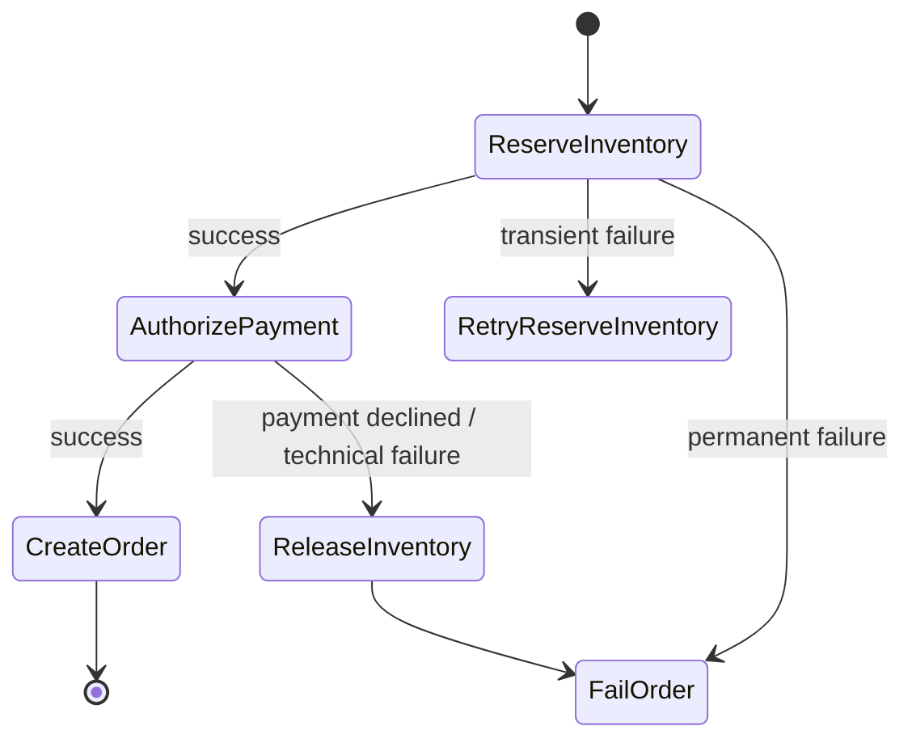
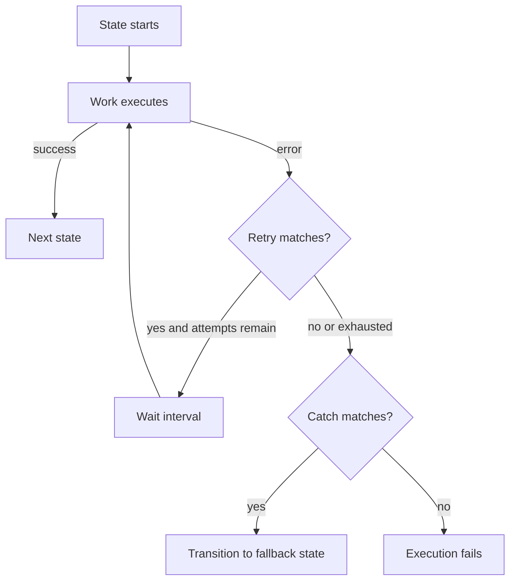
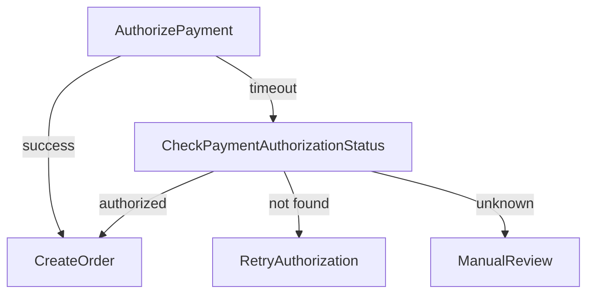
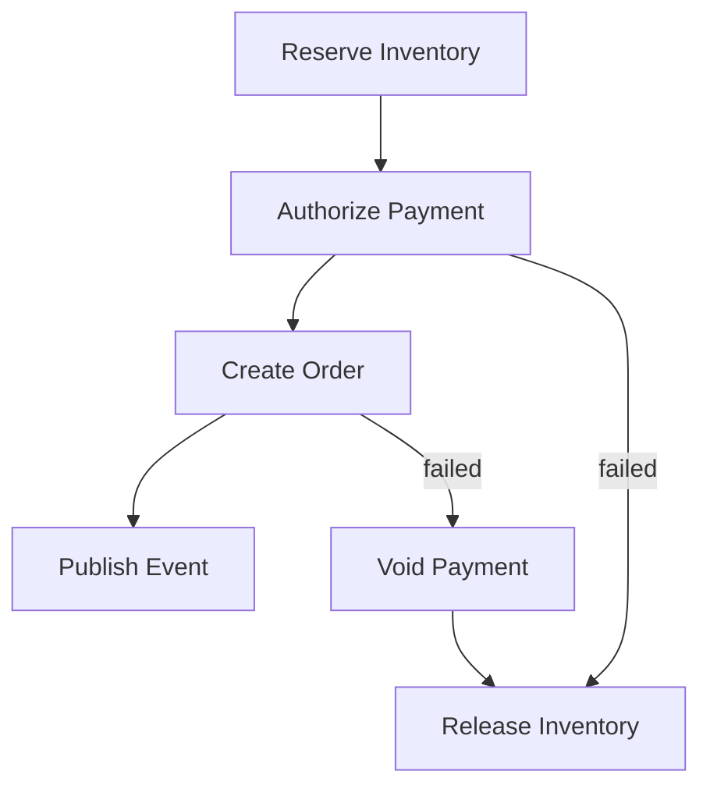
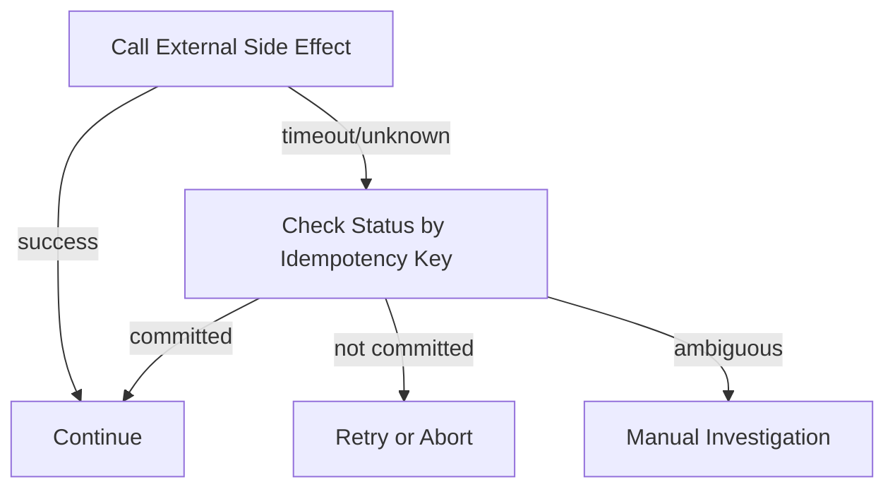
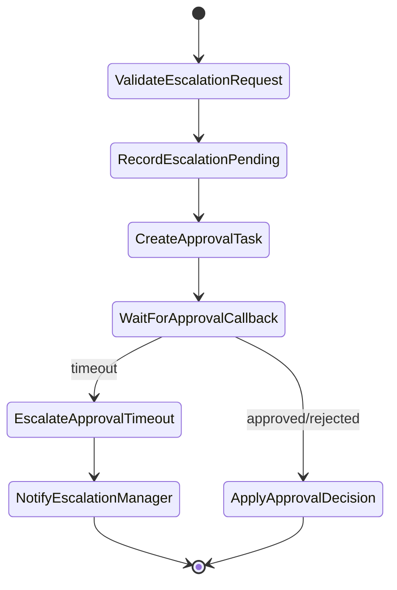

# Part 044 — Step Functions Error Handling

> Workflow yang benar bukan yang hanya berhasil di happy path. Workflow yang benar tahu kapan harus retry, kapan harus berhenti, kapan harus compensate, kapan harus menunggu manusia, dan kapan harus menulis failure state yang bisa diaudit.

Part ini membahas **error handling Step Functions** secara production-oriented.

Kita akan membahas:

1. taxonomy error workflow;
2. `Retry`, `Catch`, `TimeoutSeconds`, `HeartbeatSeconds`;
3. reserved error names seperti `States.Timeout`, `States.TaskFailed`, `States.ALL`;
4. transient vs permanent failure;
5. partial side effect dan unknown commit;
6. compensation dan saga;
7. error observability, runbook, dan failure test matrix.

---

## 1. Mental Model: Error Handling adalah State Transition, Bukan Exception Handler

Di aplikasi biasa, error handling sering seperti ini:

```java
try {
  reserveInventory();
  chargePayment();
  createOrder();
} catch (Exception e) {
  log.error("failed", e);
  throw e;
}
```

Di workflow durable, error bukan sekadar exception. Error adalah **event yang mengubah jalur state machine**.



Pertanyaan utama bukan:

```txt
Bagaimana menangkap exception?
```

Pertanyaan yang benar:

```txt
Setelah error ini terjadi, state bisnis dan side effect apa yang sudah berubah, dan transition aman berikutnya apa?
```

---

## 2. Failure Taxonomy untuk Workflow

Sebelum menulis `Retry` dan `Catch`, klasifikasikan failure.

| Failure | Contoh | Treatment |
|---|---|---|
| transient infrastructure | Lambda service exception, throttling, network blip | retry dengan backoff+jitter |
| downstream overload | DB connection exhaustion, 429, 503 | retry terbatas + backpressure/circuit breaker |
| permanent validation | invalid command, missing required field | jangan retry, record rejected |
| business rejection | payment declined, insufficient stock | jangan technical fail; hasil bisnis valid |
| timeout before side effect | task tidak sempat commit | safe retry mungkin boleh |
| timeout after unknown commit | caller tidak tahu commit terjadi atau tidak | idempotency/reconciliation wajib |
| partial side effect | inventory reserved, payment failed | compensation |
| payload/runtime bug | path salah, output terlalu besar | fail fast, deploy fix |
| permission/config error | IAM denied, wrong ARN, missing env | fail/alert, jangan retry lama |
| manual/external delay | approval belum datang | wait/callback/SLA timeout |

Rule:

> Retry hanya untuk failure yang punya peluang berhasil tanpa mengubah intent bisnis dan tanpa membuat side effect ganda.

---

## 3. Default Behavior Step Functions

Jika sebuah state melaporkan error dan tidak ada handler yang sesuai, execution gagal.

`Retry` dan `Catch` dapat dipasang pada state tertentu seperti `Task`, `Parallel`, dan `Map`.

Urutan mental model:



`Retry` selalu dievaluasi sebelum `Catch`.

Jadi `Catch` bukan pengganti retry. `Catch` adalah jalur setelah retry tidak dilakukan atau sudah habis.

---

## 4. Reserved Error Names yang Harus Dipahami

Step Functions memiliki reserved error names.

| Error | Makna praktis |
|---|---|
| `States.Timeout` | task/execution melewati `TimeoutSeconds` atau heartbeat timeout terkait |
| `States.HeartbeatTimeout` | task tidak mengirim heartbeat dalam window |
| `States.TaskFailed` | wildcard untuk task failure selain timeout |
| `States.ALL` | wildcard untuk known error, harus sendirian dan terakhir |
| `States.Permissions` | IAM/permission failure |
| `States.Runtime` | runtime processing error, misalnya path pada payload null; tidak retriable |
| `States.DataLimitExceeded` | payload/result melebihi quota; terminal terhadap `States.ALL` |
| `States.ItemReaderFailed` | Distributed Map gagal membaca source |
| `States.ResultWriterFailed` | Distributed Map gagal menulis result |
| `States.ExceedToleratedFailureThreshold` | Map failure threshold terlampaui |
| `States.Http.Socket` | HTTP task socket timeout |

Poin yang sering dilupakan:

1. `States.ALL` harus muncul sendiri di `ErrorEquals` dan ditempatkan terakhir.
2. `States.ALL` tidak menangkap `States.DataLimitExceeded` dan `States.Runtime`.
3. `States.TaskFailed` tidak menangkap `States.Timeout`.
4. Lambda timeout pada runtime baru bisa muncul sebagai `Sandbox.Timedout`, sedangkan histori lama sering memakai `Lambda.Unknown`.

Artinya catch-all tidak benar-benar catch-all untuk semua kemungkinan buruk.

---

## 5. Retry: Gunakan untuk Transient Failure, Bukan Untuk Menenangkan Dashboard

Contoh retry yang wajar:

```json
{
  "Type": "Task",
  "Resource": "arn:aws:states:::lambda:invoke",
  "Parameters": {
    "FunctionName": "reserve-inventory",
    "Payload.$": "$"
  },
  "TimeoutSeconds": 10,
  "Retry": [
    {
      "ErrorEquals": [
        "Lambda.ServiceException",
        "Lambda.SdkClientException",
        "Lambda.TooManyRequestsException"
      ],
      "IntervalSeconds": 1,
      "BackoffRate": 2,
      "MaxAttempts": 3,
      "MaxDelaySeconds": 10,
      "JitterStrategy": "FULL"
    }
  ],
  "Next": "AuthorizePayment"
}
```

### 5.1 Parameter Retry

| Field | Makna |
|---|---|
| `ErrorEquals` | error name yang dicocokkan |
| `IntervalSeconds` | delay awal |
| `BackoffRate` | multiplier delay |
| `MaxAttempts` | jumlah maksimum retry |
| `MaxDelaySeconds` | cap delay maksimum |
| `JitterStrategy` | randomization untuk menghindari retry herd |

### 5.2 Retry Budget

Jangan tulis retry tanpa menghitung budget.

Formula kasar:

```txt
max_task_time = task_timeout * (1 + max_attempts)
              + sum(retry_delays)
```

Contoh:

```txt
task timeout = 10s
max attempts = 3 retry
attempts total = 4
retry delays = 1s + 2s + 4s
max_task_time = 10*4 + 7 = 47s
```

Jika API caller timeout 30 detik, workflow synchronous ini tidak cocok.

Solusi:

1. jadikan workflow asynchronous;
2. kurangi retry;
3. pindahkan retry ke queue/worker;
4. ubah API menjadi accepted-command pattern.

---

## 6. Jangan Retry Permanent Failure

Bad:

```json
"Retry": [
  {
    "ErrorEquals": ["States.ALL"],
    "IntervalSeconds": 2,
    "MaxAttempts": 5
  }
]
```

Ini meretry:

1. validation error;
2. business rejection;
3. IAM denied;
4. schema bug;
5. payload too large jika explicit;
6. state path error jika catchable context tidak tepat.

Better:

```json
"Retry": [
  {
    "ErrorEquals": [
      "Lambda.ServiceException",
      "Lambda.SdkClientException",
      "Lambda.TooManyRequestsException",
      "DynamoDB.ProvisionedThroughputExceededException",
      "DynamoDB.ThrottlingException"
    ],
    "IntervalSeconds": 1,
    "BackoffRate": 2,
    "MaxAttempts": 3,
    "MaxDelaySeconds": 8,
    "JitterStrategy": "FULL"
  }
]
```

Permanent domain failure harus dilempar sebagai error spesifik atau dikembalikan sebagai valid result.

Contoh business rejection sebagai valid result:

```json
{
  "payment": {
    "status": "DECLINED",
    "reasonCode": "INSUFFICIENT_FUNDS"
  }
}
```

Ini bukan technical error. Jangan masuk DLQ. Jangan alarm critical.

---

## 7. Timeout: Batas Waktu adalah Correctness Constraint

Timeout bukan hanya performance setting. Timeout menentukan kapan runtime menganggap task tidak sehat.

Contoh:

```json
{
  "Type": "Task",
  "Resource": "arn:aws:states:::lambda:invoke",
  "Parameters": {
    "FunctionName": "authorize-payment",
    "Payload.$": "$"
  },
  "TimeoutSeconds": 15,
  "Catch": [
    {
      "ErrorEquals": ["States.Timeout", "Sandbox.Timedout", "Lambda.Unknown"],
      "ResultPath": "$.error.paymentAuthorization",
      "Next": "CheckPaymentAuthorizationStatus"
    }
  ],
  "Next": "CreateOrder"
}
```

Kenapa timeout payment tidak langsung retry?

Karena timeout bisa terjadi setelah payment provider menerima request. Commit status bisa ambigu.

Better flow:



Rule:

> Timeout pada operation dengan external side effect harus dianggap sebagai unknown outcome sampai ada idempotency key atau status check.

---

## 8. Heartbeat: Untuk Task yang Panjang dan Bisa Mati Diam-Diam

`HeartbeatSeconds` berguna untuk task/activity yang panjang.

Jika task harus mengirim heartbeat dan tidak melakukannya, Step Functions dapat menghasilkan heartbeat timeout.

Gunakan heartbeat ketika:

1. task long-running;
2. worker eksternal bisa mati tanpa response;
3. task token/callback pattern dipakai;
4. operator butuh deteksi hang lebih cepat dari total timeout.

Contoh concept:

```json
{
  "Type": "Task",
  "Resource": "arn:aws:states:::lambda:invoke.waitForTaskToken",
  "Parameters": {
    "FunctionName": "start-external-review",
    "Payload": {
      "taskToken.$": "$$.Task.Token",
      "caseId.$": "$.caseId"
    }
  },
  "HeartbeatSeconds": 3600,
  "TimeoutSeconds": 604800,
  "Catch": [
    {
      "ErrorEquals": ["States.HeartbeatTimeout", "States.Timeout"],
      "ResultPath": "$.error.review",
      "Next": "EscalateReviewTimeout"
    }
  ],
  "Next": "ApplyReviewDecision"
}
```

Untuk human workflow, timeout bukan selalu failure teknis. Ia bisa berarti SLA escalation.

---

## 9. Catch: Fallback Path Harus Menjaga Input dan Error

Contoh catch yang buruk:

```json
"Catch": [
  {
    "ErrorEquals": ["States.ALL"],
    "Next": "HandleFailure"
  }
]
```

Masalahnya: error output dapat mengganti context, tergantung penggunaan `ResultPath`.

Better:

```json
"Catch": [
  {
    "ErrorEquals": ["Payment.ValidationError"],
    "ResultPath": "$.error.payment",
    "Next": "RejectOrder"
  },
  {
    "ErrorEquals": ["States.Timeout", "Sandbox.Timedout", "Lambda.Unknown"],
    "ResultPath": "$.error.payment",
    "Next": "CheckPaymentAuthorizationStatus"
  },
  {
    "ErrorEquals": ["States.ALL"],
    "ResultPath": "$.error.payment",
    "Next": "RecordTechnicalFailure"
  }
]
```

Selalu simpan error pada field eksplisit:

```json
{
  "error": {
    "payment": {
      "Error": "States.Timeout",
      "Cause": "..."
    }
  }
}
```

Ini membuat downstream fallback masih punya `command`, `meta`, dan state sebelumnya.

---

## 10. Error Classification Contract dari Task

Jika Lambda/service task melempar error asal-asalan, workflow tidak bisa melakukan routing dengan benar.

Bad Java:

```java
throw new RuntimeException("payment failed");
```

Better:

```java
public final class PaymentDeclinedException extends RuntimeException {
    public PaymentDeclinedException(String message) {
        super(message);
    }
}

public final class PaymentProviderUnavailableException extends RuntimeException {
    public PaymentProviderUnavailableException(String message, Throwable cause) {
        super(message, cause);
    }
}
```

Lalu workflow bisa membedakan:

```json
"Catch": [
  {
    "ErrorEquals": ["com.example.PaymentDeclinedException"],
    "ResultPath": "$.error.payment",
    "Next": "RejectOrder"
  },
  {
    "ErrorEquals": ["com.example.PaymentProviderUnavailableException"],
    "ResultPath": "$.error.payment",
    "Next": "RecordTechnicalFailure"
  }
]
```

Tetapi untuk business rejection normal, lebih baik return value daripada exception jika rejection adalah expected outcome.

---

## 11. Saga Error Handling

Saga adalah sequence of local transactions dengan compensation.

Contoh order flow:



Compensation bukan rollback database global. Compensation adalah aksi bisnis baru yang mengoreksi efek sebelumnya.

| Forward action | Compensation |
|---|---|
| reserve inventory | release reservation |
| authorize payment | void authorization |
| create shipment | cancel shipment |
| create case escalation | record escalation cancelled |
| send notification | send correction notification, not unsend |

Rule:

> Compensation harus idempotent. Compensation juga bisa gagal.

---

## 12. Compensation Workflow Example

Skeleton:

```json
{
  "Comment": "Create order with compensation",
  "StartAt": "ReserveInventory",
  "States": {
    "ReserveInventory": {
      "Type": "Task",
      "Resource": "arn:aws:states:::lambda:invoke",
      "Parameters": {
        "FunctionName": "reserve-inventory",
        "Payload.$": "$"
      },
      "OutputPath": "$.Payload",
      "ResultPath": "$.inventory",
      "Retry": [
        {
          "ErrorEquals": ["Lambda.ServiceException", "Lambda.SdkClientException"],
          "IntervalSeconds": 1,
          "BackoffRate": 2,
          "MaxAttempts": 3,
          "JitterStrategy": "FULL"
        }
      ],
      "Catch": [
        {
          "ErrorEquals": ["Inventory.OutOfStock"],
          "ResultPath": "$.error.inventory",
          "Next": "RejectOutOfStock"
        },
        {
          "ErrorEquals": ["States.ALL"],
          "ResultPath": "$.error.inventory",
          "Next": "RecordTechnicalFailure"
        }
      ],
      "Next": "AuthorizePayment"
    },
    "AuthorizePayment": {
      "Type": "Task",
      "Resource": "arn:aws:states:::lambda:invoke",
      "Parameters": {
        "FunctionName": "authorize-payment",
        "Payload": {
          "idempotencyKey.$": "$.command.commandId",
          "orderId.$": "$.command.orderId",
          "amount.$": "$.command.amount"
        }
      },
      "ResultPath": "$.payment",
      "Catch": [
        {
          "ErrorEquals": ["Payment.Declined"],
          "ResultPath": "$.error.payment",
          "Next": "ReleaseInventoryAfterPaymentDeclined"
        },
        {
          "ErrorEquals": ["States.Timeout", "Sandbox.Timedout", "Lambda.Unknown"],
          "ResultPath": "$.error.payment",
          "Next": "CheckPaymentStatus"
        },
        {
          "ErrorEquals": ["States.ALL"],
          "ResultPath": "$.error.payment",
          "Next": "ReleaseInventoryAfterPaymentFailure"
        }
      ],
      "Next": "CreateOrder"
    },
    "ReleaseInventoryAfterPaymentDeclined": {
      "Type": "Task",
      "Resource": "arn:aws:states:::lambda:invoke",
      "Parameters": {
        "FunctionName": "release-inventory-reservation",
        "Payload": {
          "reservationId.$": "$.inventory.reservationId",
          "reason": "PAYMENT_DECLINED",
          "idempotencyKey.$": "$.command.commandId"
        }
      },
      "ResultPath": "$.compensation.inventoryRelease",
      "Next": "RejectPaymentDeclined"
    },
    "ReleaseInventoryAfterPaymentFailure": {
      "Type": "Task",
      "Resource": "arn:aws:states:::lambda:invoke",
      "Parameters": {
        "FunctionName": "release-inventory-reservation",
        "Payload": {
          "reservationId.$": "$.inventory.reservationId",
          "reason": "PAYMENT_TECHNICAL_FAILURE",
          "idempotencyKey.$": "$.command.commandId"
        }
      },
      "ResultPath": "$.compensation.inventoryRelease",
      "Next": "RecordTechnicalFailure"
    },
    "CheckPaymentStatus": {
      "Type": "Task",
      "Resource": "arn:aws:states:::lambda:invoke",
      "Parameters": {
        "FunctionName": "check-payment-authorization-status",
        "Payload": {
          "idempotencyKey.$": "$.command.commandId",
          "orderId.$": "$.command.orderId"
        }
      },
      "ResultPath": "$.paymentStatusCheck",
      "Next": "EvaluatePaymentStatusAfterTimeout"
    },
    "EvaluatePaymentStatusAfterTimeout": {
      "Type": "Choice",
      "Choices": [
        {
          "Variable": "$.paymentStatusCheck.Payload.status",
          "StringEquals": "AUTHORIZED",
          "Next": "CreateOrder"
        },
        {
          "Variable": "$.paymentStatusCheck.Payload.status",
          "StringEquals": "NOT_AUTHORIZED",
          "Next": "ReleaseInventoryAfterPaymentFailure"
        }
      ],
      "Default": "EscalateUnknownPaymentOutcome"
    },
    "CreateOrder": {
      "Type": "Task",
      "Resource": "arn:aws:states:::lambda:invoke",
      "Parameters": {
        "FunctionName": "create-order-record",
        "Payload.$": "$"
      },
      "ResultPath": "$.order",
      "Catch": [
        {
          "ErrorEquals": ["States.ALL"],
          "ResultPath": "$.error.order",
          "Next": "VoidPaymentAfterOrderFailure"
        }
      ],
      "Next": "Success"
    },
    "VoidPaymentAfterOrderFailure": {
      "Type": "Task",
      "Resource": "arn:aws:states:::lambda:invoke",
      "Parameters": {
        "FunctionName": "void-payment-authorization",
        "Payload": {
          "authorizationId.$": "$.payment.authorizationId",
          "idempotencyKey.$": "$.command.commandId"
        }
      },
      "ResultPath": "$.compensation.paymentVoid",
      "Next": "ReleaseInventoryAfterPaymentFailure"
    },
    "RejectOutOfStock": {
      "Type": "Succeed"
    },
    "RejectPaymentDeclined": {
      "Type": "Succeed"
    },
    "RecordTechnicalFailure": {
      "Type": "Task",
      "Resource": "arn:aws:states:::lambda:invoke",
      "Parameters": {
        "FunctionName": "record-order-command-failure",
        "Payload.$": "$"
      },
      "Next": "TechnicalFailure"
    },
    "EscalateUnknownPaymentOutcome": {
      "Type": "Task",
      "Resource": "arn:aws:states:::lambda:invoke",
      "Parameters": {
        "FunctionName": "open-manual-payment-investigation",
        "Payload.$": "$"
      },
      "Next": "PendingManualResolution"
    },
    "Success": {
      "Type": "Succeed"
    },
    "PendingManualResolution": {
      "Type": "Succeed"
    },
    "TechnicalFailure": {
      "Type": "Fail",
      "Error": "CreateOrderTechnicalFailure",
      "Cause": "Create order workflow failed after recovery attempts"
    }
  }
}
```

Catatan: skeleton ini panjang karena failure path memang bagian dari desain, bukan afterthought.

---

## 13. Unknown Commit Problem

Ini failure paling berbahaya.

Contoh:

1. workflow memanggil payment provider;
2. provider menerima request dan mengotorisasi pembayaran;
3. Lambda timeout sebelum response diterima;
4. Step Functions melihat `States.Timeout`;
5. workflow retry;
6. customer bisa terkena double authorization jika tidak ada idempotency.

Mitigation:

| Mitigation | Fungsi |
|---|---|
| external idempotency key | provider mengenali duplicate request |
| status check by command id | menentukan apakah commit sudah terjadi |
| side effect log | menyimpan attempt dan outcome |
| manual escalation | jika outcome tetap tidak diketahui |
| compensation | void/reverse jika duplicate/incorrect effect terjadi |

Workflow pattern:



Rule:

> Jangan retry external side effect setelah timeout kecuali operation punya idempotency key yang kuat.

---

## 14. Database Transaction Boundary di Workflow

Step Functions tidak membuat distributed transaction antara states.

Jika state A menulis DB dan state B gagal, DB write A tidak otomatis rollback.

Karena itu local transaction harus jelas:

| State | Local transaction |
|---|---|
| `CreateOrderRecord` | insert order + command status + outbox in one DB transaction |
| `ReserveInventory` | create reservation with idempotency key |
| `VoidPayment` | record compensation attempt + call provider safely |
| `RecordTechnicalFailure` | durable command failure state |

Pattern yang aman:

```txt
Task receives commandId
Task checks command/action log
Task performs local transaction
Task records deterministic outcome
Task returns stable result
```

Jangan membuat task yang hanya mengandalkan memory atau Step Functions payload untuk mengetahui apakah DB write sudah pernah dilakukan.

---

## 15. Error Handling untuk `Parallel`

`Parallel` akan menjalankan branch concurrently. Jika branch gagal tanpa handler, keseluruhan `Parallel` bisa gagal.

Pattern 1: fail-fast jika semua branch wajib sukses.

```json
{
  "Type": "Parallel",
  "Branches": [
    { "StartAt": "FraudCheck", "States": { } },
    { "StartAt": "InventoryCheck", "States": { } }
  ],
  "Catch": [
    {
      "ErrorEquals": ["States.ALL"],
      "ResultPath": "$.error.parallelChecks",
      "Next": "RecordPreconditionFailure"
    }
  ],
  "Next": "EvaluateChecks"
}
```

Pattern 2: branch returns structured result, no exception for expected rejection.

```json
{
  "fraudCheck": {
    "status": "PASS | REVIEW | FAIL"
  },
  "inventoryCheck": {
    "status": "AVAILABLE | OUT_OF_STOCK"
  }
}
```

Business rejection sebaiknya tidak menggagalkan technical workflow.

---

## 16. Error Handling untuk `Map`

Map failure bisa terjadi pada:

1. item processing;
2. item reader;
3. result writer;
4. tolerated failure threshold;
5. downstream throttling karena concurrency terlalu tinggi.

### 16.1 Inline Map

Untuk Inline Map, failures masuk ke parent execution history.

Gunakan ketika item count kecil dan failure handling sederhana.

### 16.2 Distributed Map

Distributed Map punya Map Run dan child executions. Gunakan failure threshold dengan sadar.

Contoh:

```json
{
  "Type": "Map",
  "ItemProcessor": {
    "ProcessorConfig": {
      "Mode": "DISTRIBUTED",
      "ExecutionType": "EXPRESS"
    },
    "StartAt": "ProcessItem",
    "States": {
      "ProcessItem": {
        "Type": "Task",
        "Resource": "arn:aws:states:::lambda:invoke",
        "Parameters": {
          "FunctionName": "process-import-row",
          "Payload.$": "$"
        },
        "Retry": [
          {
            "ErrorEquals": ["Lambda.TooManyRequestsException"],
            "IntervalSeconds": 2,
            "BackoffRate": 2,
            "MaxAttempts": 3,
            "JitterStrategy": "FULL"
          }
        ],
        "End": true
      }
    }
  },
  "MaxConcurrency": 200,
  "ToleratedFailurePercentage": 0.5,
  "Catch": [
    {
      "ErrorEquals": [
        "States.ItemReaderFailed",
        "States.ResultWriterFailed",
        "States.ExceedToleratedFailureThreshold"
      ],
      "ResultPath": "$.error.importMap",
      "Next": "RecordImportFailed"
    }
  ],
  "Next": "AggregateImportResult"
}
```

Untuk import/batch, failure threshold harus sesuai business rule:

| Use case | Threshold |
|---|---|
| financial ledger import | biasanya 0 |
| product catalog enrichment | mungkin sebagian kecil boleh gagal |
| notification campaign | partial failure mungkin acceptable |
| regulatory enforcement action | biasanya fail/hold untuk review |

---

## 17. Technical Failure vs Business Outcome

Jangan campur technical failure dan business outcome.

| Scenario | Workflow terminal | Business status |
|---|---|---|
| payment declined | `Succeed` | `REJECTED` |
| invalid command | `Succeed` atau `Fail`, tergantung API contract | `INVALID` |
| DB unavailable setelah retry | `Fail` | `FAILED_TECHNICAL` / command remains retryable |
| unknown payment outcome | `Succeed` | `PENDING_INVESTIGATION` |
| fraud requires manual review | `Succeed` | `PENDING_REVIEW` |

Kenapa business rejection bisa `Succeed`?

Karena workflow berhasil memproses command dan menghasilkan keputusan valid. Tidak semua outcome negatif adalah system failure.

---

## 18. Record Failure State Sebelum `Fail`

Jika workflow langsung masuk `Fail`, domain database mungkin tidak tahu command gagal.

Bad:

```json
"Catch": [
  {
    "ErrorEquals": ["States.ALL"],
    "Next": "FailWorkflow"
  }
]
```

Better:

```json
"Catch": [
  {
    "ErrorEquals": ["States.ALL"],
    "ResultPath": "$.error.createOrder",
    "Next": "RecordCommandFailure"
  }
]
```

Lalu:

```json
"RecordCommandFailure": {
  "Type": "Task",
  "Resource": "arn:aws:states:::lambda:invoke",
  "Parameters": {
    "FunctionName": "record-command-failure",
    "Payload": {
      "commandId.$": "$.command.commandId",
      "workflowExecutionId.$": "$$.Execution.Id",
      "error.$": "$.error",
      "correlationId.$": "$.meta.correlationId"
    }
  },
  "Next": "FailWorkflow"
}
```

Operator perlu menemukan failure dari domain database/dashboard, bukan hanya dari Step Functions console.

---

## 19. Catch Ordering

Catchers dievaluasi berdasarkan urutan.

Bad:

```json
"Catch": [
  {
    "ErrorEquals": ["States.ALL"],
    "Next": "GenericFailure"
  },
  {
    "ErrorEquals": ["Payment.Declined"],
    "Next": "RejectOrder"
  }
]
```

`Payment.Declined` tidak akan pernah sampai ke catcher kedua karena `States.ALL` sudah menangkap dulu.

Better:

```json
"Catch": [
  {
    "ErrorEquals": ["Payment.Declined"],
    "ResultPath": "$.error.payment",
    "Next": "RejectOrder"
  },
  {
    "ErrorEquals": ["States.Timeout", "Sandbox.Timedout", "Lambda.Unknown"],
    "ResultPath": "$.error.payment",
    "Next": "CheckPaymentStatus"
  },
  {
    "ErrorEquals": ["States.ALL"],
    "ResultPath": "$.error.payment",
    "Next": "RecordTechnicalFailure"
  }
]
```

Specific dulu. Wildcard terakhir.

---

## 20. Retry Ordering

Retry juga dievaluasi berdasarkan urutan.

Contoh: jangan retry timeout, retry transient lain.

```json
"Retry": [
  {
    "ErrorEquals": ["States.Timeout"],
    "MaxAttempts": 0
  },
  {
    "ErrorEquals": [
      "Lambda.ServiceException",
      "Lambda.SdkClientException",
      "Lambda.TooManyRequestsException"
    ],
    "IntervalSeconds": 1,
    "BackoffRate": 2,
    "MaxAttempts": 3,
    "JitterStrategy": "FULL"
  }
]
```

Kenapa timeout tidak diretry?

Karena timeout pada side-effect task sering ambiguous. Pilih status check dulu.

---

## 21. Idempotency untuk Retry dan Catch

Setiap task yang punya side effect harus menerima idempotency key.

| Side effect | Idempotency key |
|---|---|
| DB command write | `commandId` |
| inventory reservation | `commandId` atau `reservationRequestId` |
| payment authorization | provider idempotency key = `commandId` |
| notification | `notificationId` / event id |
| file generation | deterministic object key |
| case escalation | `(caseId, escalationRequestId)` |

Task implementation minimal:

```txt
1. Read idempotency/action log by key
2. If completed, return stored result
3. If in progress and still valid, return conflict/in-progress
4. Execute side effect
5. Store result atomically where possible
6. Return stable output
```

Workflow retry tanpa idempotency adalah duplicate side effect generator.

---

## 22. Observability of Error Handling

Error path harus terlihat.

Minimal fields di setiap task payload/log:

```json
{
  "correlationId": "corr-abc",
  "commandId": "cmd-123",
  "workflowName": "CreateOrder",
  "executionId": "arn:aws:states:...:execution:CreateOrder:...",
  "stateName": "AuthorizePayment",
  "attempt": 1,
  "tenantId": "tenant-a"
}
```

Metrics yang berguna:

| Metric | Insight |
|---|---|
| executions started/succeeded/failed/timed out | workflow health |
| failure by state | failure hotspot |
| retry count by error | transient instability |
| compensation count | downstream business impact |
| timeout count | bad timeout/downstream latency |
| manual escalation count | ambiguity/SLA issue |
| DLQ/event failure count | async side effect issue |
| duration percentile | SLO and cost |

Alarm jangan hanya:

```txt
ExecutionFailed > 0
```

Lebih baik:

```txt
technical_failure_rate > threshold for 5m
unknown_payment_outcome_count > 0
compensation_failure_count > 0
workflow_timeout_count > 0
map_tolerated_failure_threshold_exceeded > 0
```

---

## 23. Runbook: Payment Timeout

Contoh runbook singkat.

```md
# Runbook: CreateOrder Payment Timeout

## Signal
- Workflow state `AuthorizePayment` caught `States.Timeout`, `Sandbox.Timedout`, or `Lambda.Unknown`.
- Workflow transitions to `CheckPaymentAuthorizationStatus`.

## Immediate Questions
1. Did provider receive request with `commandId` as idempotency key?
2. Does provider status endpoint return AUTHORIZED, DECLINED, NOT_FOUND, or UNKNOWN?
3. Did internal side effect log record provider request id?
4. How many workflows are in `EscalateUnknownPaymentOutcome`?

## Safe Actions
- If provider says AUTHORIZED, continue order creation once.
- If provider says NOT_FOUND, retry authorization with same idempotency key.
- If provider says UNKNOWN, keep command PENDING_INVESTIGATION.
- Do not manually retry payment with a new idempotency key.

## Escalation
- Payment platform owner
- Order domain owner
- Incident commander if count exceeds threshold
```

Runbook harus ditulis saat desain, bukan saat incident.

---

## 24. Testing Failure Paths

Happy path test tidak cukup.

Failure test matrix:

| Test | Expected outcome |
|---|---|
| `ReserveInventory` transient failure twice then success | retry then continue |
| `ReserveInventory` out of stock | no retry, rejected outcome |
| `AuthorizePayment` timeout | status check, no immediate blind retry |
| payment status authorized after timeout | continue create order |
| payment status unknown | manual investigation |
| `CreateOrder` fails after payment authorized | void payment then release inventory |
| compensation fails | record compensation failure and alarm |
| `Choice` receives unknown value | `Fail` or safe default path |
| Map item failures below threshold | aggregate partial result |
| Map failures above threshold | record import failed |
| payload grows above safe budget | test catches before production |

For each failure path, assert:

1. terminal workflow status;
2. domain DB state;
3. side effect log;
4. emitted events;
5. alarms/metrics;
6. idempotency behavior on replay.

---

## 25. Local Reasoning Before Deployment

Sebelum deploy workflow error handling, lakukan table-top simulation.

Example:

```txt
State: AuthorizePayment
Side effect: external payment authorization
Commit point: provider receives request and authorizes
Known failure modes:
- provider 503 before commit
- Lambda timeout after provider commit
- provider response malformed
- provider duplicate request
- provider status endpoint unavailable
Retry policy:
- retry 503 before request sent? yes, with idempotency key
- retry timeout blindly? no
Catch path:
- timeout -> CheckPaymentStatus
- declined -> RejectOrder
- unknown -> ManualInvestigation
Compensation:
- if order creation fails after authorized -> VoidPayment
```

Jika tim tidak bisa mengisi tabel ini, workflow belum siap production.

---

## 26. Error Handling and Cost

Retry adalah state transition. Banyak retry berarti biaya dan load tambahan.

Tetapi biaya terbesar biasanya bukan Step Functions transition. Biaya terbesar adalah:

1. downstream overload;
2. duplicate side effects;
3. manual investigation;
4. data correction;
5. incident time.

Jadi optimasi bukan “minimize retry”; optimasi adalah:

```txt
retry only where it improves correctness and recovery probability.
```

---

## 27. Error Handling and Deployment

Workflow error handling bisa berubah seiring waktu.

Risiko deployment:

1. execution lama masih memakai definition/version tertentu;
2. task baru melempar error name baru;
3. `Choice` lama tidak mengenal status baru;
4. compensation baru tidak compatible dengan side effect lama;
5. caller menganggap `Fail` sebagai API failure, padahal business outcome berubah.

Mitigation:

| Risiko | Mitigation |
|---|---|
| error name berubah | contract test task-to-workflow |
| new business status | Choice `Default` aman |
| breaking workflow change | version/alias deployment |
| in-flight execution | jangan hapus task lama terlalu cepat |
| compensation schema berubah | support old and new payload |

---

## 28. Anti-Patterns

### 28.1 Catch `States.ALL` dan Lanjut Success

Bad:

```json
"Catch": [
  {
    "ErrorEquals": ["States.ALL"],
    "Next": "Success"
  }
]
```

Ini menyembunyikan failure.

Jika memang ingin graceful outcome, record failure state dulu dan return status eksplisit.

### 28.2 Retry Semua Error Banyak Kali

Ini menciptakan retry storm dan menunda recovery.

### 28.3 Compensation Tanpa Idempotency

Compensation juga side effect. Ia bisa dipanggil ulang.

### 28.4 Tidak Membedakan Declined vs Failed

Payment declined adalah business outcome. Payment provider timeout adalah technical uncertainty.

### 28.5 Timeout Lebih Lama dari Caller Budget

Jika caller menunggu 30 detik tetapi workflow step bisa 2 menit, desain API salah.

### 28.6 Workflow Failure Tidak Tercatat di Domain DB

Operator domain tidak boleh harus membuka Step Functions console untuk tahu command gagal.

### 28.7 Error Path Tidak Diuji

Jika failure path tidak diuji, itu bukan design. Itu harapan.

---

## 29. Production Checklist

### 29.1 Per Task

| Check | Status |
|---|---|
| task punya `TimeoutSeconds` | wajib |
| retry hanya transient | wajib |
| `JitterStrategy` dipakai untuk retry fanout/high traffic | disarankan |
| side effect punya idempotency key | wajib |
| error names stabil | wajib |
| output kecil dan typed | wajib |
| catch menyimpan error dengan `ResultPath` | wajib |

### 29.2 Per Workflow

| Check | Status |
|---|---|
| terminal outcomes jelas | wajib |
| business rejection bukan technical incident | wajib |
| compensation path ada untuk partial side effect | wajib jika saga |
| unknown commit path ada | wajib untuk external side effect |
| failure state direkam di domain DB | wajib |
| execution id/correlation id tercatat | wajib |
| runbook failure tersedia | wajib |
| failure matrix diuji | wajib |

### 29.3 Per Deployment

| Check | Status |
|---|---|
| ASL validation | wajib |
| IAM least privilege | wajib |
| versioning/alias strategy | wajib untuk critical workflow |
| in-flight execution compatibility | wajib |
| rollback plan | wajib |
| CloudWatch alarms | wajib |
| dashboard by state/error | wajib |

---

## 30. Mini Case Study: Regulatory Escalation Timeout

Use case: enforcement case escalation membutuhkan supervisor approval dalam 48 jam.

Naive design:

```txt
send email -> wait 48h -> close if no response
```

Problem:

1. tidak tahu email terkirim atau tidak;
2. approval link bisa dipakai dua kali;
3. case state bisa berubah selama menunggu;
4. supervisor bisa tidak aktif;
5. timeout bukan failure teknis, tetapi SLA event.

Better design:



Error handling semantics:

| Error/Timeout | Meaning | Action |
|---|---|---|
| create approval task fails transiently | infra issue | retry |
| create approval task permission denied | config issue | fail + alert |
| callback timeout | SLA breach | escalate, not technical fail |
| callback duplicate | idempotent decision apply | return stored outcome |
| case already closed | business conflict | record no-op/rejected decision |

Domain invariant:

```txt
A case can only apply an escalation decision if its current lifecycle state allows escalation.
```

That invariant belongs in the case database transaction, not only in workflow `Choice`.

---

## 31. Key Takeaways

1. Step Functions error handling is state transition design, not exception cosmetics.
2. `Retry` happens before `Catch`.
3. Retry only transient failures with bounded backoff and preferably jitter.
4. `States.ALL` is not truly universal; it must be last and alone, and it does not catch all terminal/runtime conditions.
5. `States.TaskFailed` does not match `States.Timeout`.
6. Timeout on external side effect creates unknown commit risk.
7. Catch paths should preserve input using `ResultPath`.
8. Business rejection and technical failure are different outcomes.
9. Compensation is a new idempotent business action, not magic rollback.
10. Failure state must be recorded where domain operators can see it.

---

## 32. Latihan

### Latihan 1 — Retry Classification

Untuk setiap error berikut, tentukan retry/catch behavior:

```txt
Lambda.ServiceException
Lambda.TooManyRequestsException
Payment.Declined
Payment.ProviderTimeout
States.Timeout
States.Permissions
States.Runtime
Inventory.OutOfStock
DynamoDB.ConditionalCheckFailedException
DynamoDB.ProvisionedThroughputExceededException
```

### Latihan 2 — Unknown Commit Flow

Desain workflow untuk external API `CreatePermit` yang bisa timeout setelah permit dibuat.

Harus ada:

1. idempotency key;
2. status check;
3. retry rule;
4. manual investigation path;
5. compensation atau correction path.

### Latihan 3 — Compensation Test

Buat test matrix untuk workflow:

```txt
ReserveInventory -> AuthorizePayment -> CreateOrder -> PublishEvent
```

Pastikan setiap side effect punya compensation atau reconciliation path.

---

## 33. Sumber Resmi

- AWS Step Functions Developer Guide — Handling errors in Step Functions workflows: https://docs.aws.amazon.com/step-functions/latest/dg/concepts-error-handling.html
- AWS Step Functions Developer Guide — Service integration patterns: https://docs.aws.amazon.com/step-functions/latest/dg/connect-to-resource.html
- AWS Step Functions Developer Guide — Optimized service integrations: https://docs.aws.amazon.com/step-functions/latest/dg/integrate-optimized.html
- AWS Step Functions Developer Guide — Task workflow state: https://docs.aws.amazon.com/step-functions/latest/dg/state-task.html
- AWS Step Functions Developer Guide — Parallel workflow state: https://docs.aws.amazon.com/step-functions/latest/dg/state-parallel.html
- AWS Step Functions Developer Guide — Map workflow state: https://docs.aws.amazon.com/step-functions/latest/dg/state-map.html
- AWS Step Functions Developer Guide — Distributed Map failure thresholds: https://docs.aws.amazon.com/step-functions/latest/dg/state-map-distributed.html
- AWS Prescriptive Guidance — Saga pattern: https://docs.aws.amazon.com/prescriptive-guidance/latest/cloud-design-patterns/saga.html
- AWS Prescriptive Guidance — Retry with backoff pattern: https://docs.aws.amazon.com/prescriptive-guidance/latest/cloud-design-patterns/retry-backoff.html
