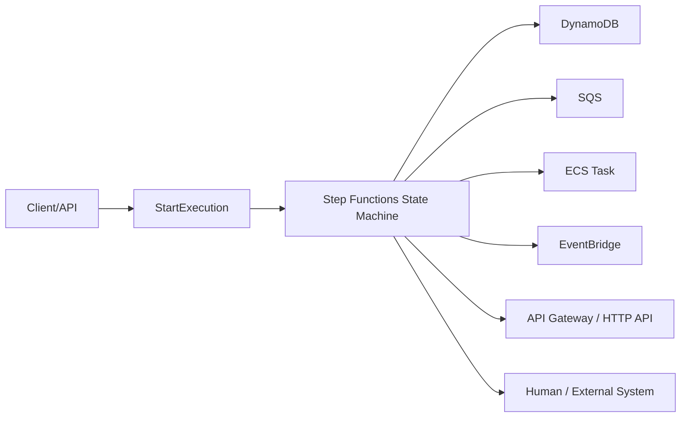
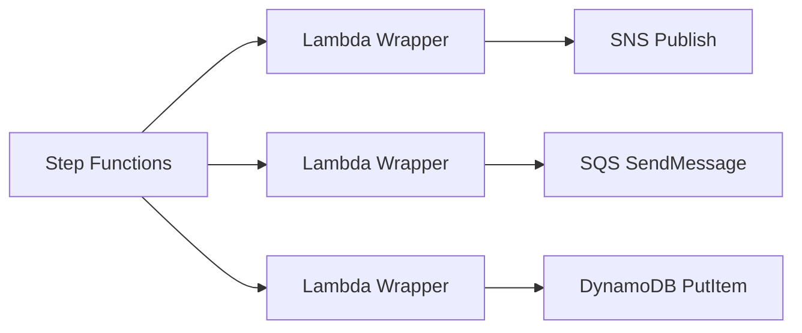
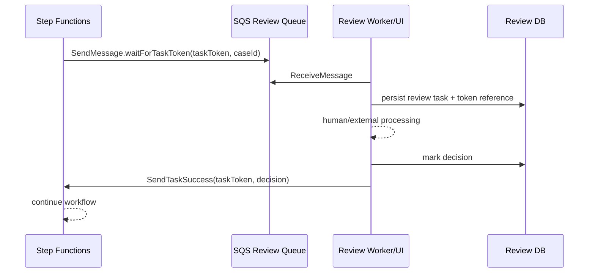
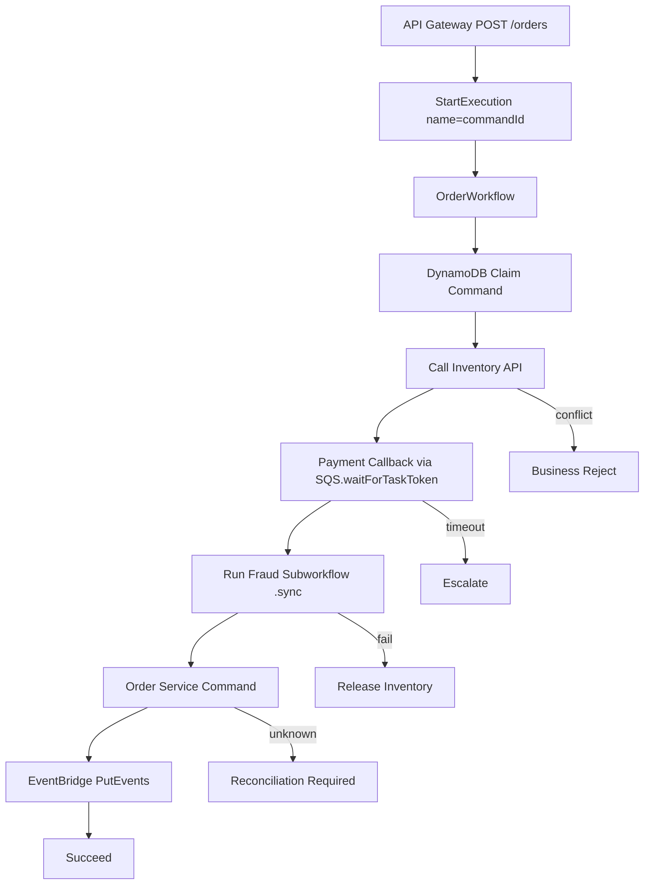

# Part 045 — Service Integration Patterns

> Step Functions bukan hanya cara menggambar flowchart. Nilainya muncul ketika state machine menjadi **durable control plane** yang memanggil AWS services, menunggu job selesai, atau menunggu callback dari dunia luar tanpa membuat thread, connection, atau database transaction ikut tertahan.

Part ini membahas **service integration patterns** di AWS Step Functions secara implementatif.

Kita akan membahas:

1. kenapa service integration lebih penting daripada “Lambda glue everywhere”;
2. tiga pattern utama: `Request Response`, `.sync`, dan `.waitForTaskToken`;
3. kapan memakai optimized integration vs AWS SDK integration;
4. timeout, heartbeat, retry, IAM, payload shaping, dan idempotency;
5. integrasi dengan SQS, SNS, EventBridge, DynamoDB, ECS, Batch, API Gateway, dan nested Step Functions;
6. failure mode dan production checklist.

---

## 1. Mental Model: Step Functions sebagai Control Plane, Bukan Worker

Di banyak sistem, workflow awalnya ditulis seperti ini:

```java
public void runOrderWorkflow(CreateOrderCommand command) {
  var order = orderService.create(command);
  inventoryService.reserve(order);
  paymentService.authorize(order);
  fulfillmentService.schedule(order);
  notificationService.send(order);
}
```

Kode ini mudah dibaca, tetapi menyembunyikan masalah production:

- proses bisa berjalan lama;
- caller bisa timeout padahal step belakang masih berjalan;
- retry bisa menggandakan side effect;
- status workflow tidak terlihat sebagai state durable;
- failure recovery hanya ada di log;
- operasi manual harus membaca banyak service untuk tahu “sekarang workflow sampai mana”.

Step Functions memindahkan orchestration ke durable state machine.



Mental model yang benar:

```txt
Step Functions decides what should happen next.
The integrated service does the work.
The database records domain state.
The workflow records control state.
```

Jangan jadikan Step Functions sebagai tempat semua logic bisnis. Jadikan ia sebagai **control plane** untuk:

- memanggil capability yang sudah jelas;
- mengatur retry/catch/timeout;
- menyimpan progress workflow;
- menjalankan compensation;
- mengaudit jalur keputusan.

---

## 2. Tiga Service Integration Pattern

AWS Step Functions menyediakan tiga pola integrasi utama:

| Pattern | Resource suffix | Workflow lanjut kapan? | Cocok untuk |
|---|---|---|---|
| Request Response | tanpa suffix khusus | setelah service API mengembalikan response | call cepat, publish message, write metadata |
| Run a Job | `.sync` | setelah job selesai | ECS task, Batch job, Glue job, nested workflow |
| Wait for Callback | `.waitForTaskToken` | setelah token dikembalikan via `SendTaskSuccess`/`SendTaskFailure` | human approval, external system, async worker, legacy integration |

Pattern ini bukan variasi syntax. Ini adalah **semantics**.

Salah memilih pattern akan menghasilkan failure mode berbeda:

- memakai Request Response untuk job panjang → workflow lanjut terlalu cepat;
- memakai `.sync` untuk external system yang tidak punya lifecycle API jelas → stuck/polling mahal;
- memakai callback token tanpa heartbeat/timeout → execution bisa menggantung;
- memakai Lambda wrapper untuk semua hal → orchestration state tersembunyi di kode.

---

## 3. Request Response Pattern

Request Response adalah default. Step Functions memanggil service API, menerima response HTTP/API, lalu langsung lanjut ke state berikutnya.

Contoh publish SNS:

```json
{
  "PublishOrderAccepted": {
    "Type": "Task",
    "Resource": "arn:aws:states:::sns:publish",
    "Parameters": {
      "TopicArn": "arn:aws:sns:ap-southeast-1:123456789012:order-events",
      "Message": {
        "eventId.$": "$.eventId",
        "orderId.$": "$.orderId",
        "type": "OrderAccepted"
      }
    },
    "Next": "MarkWorkflowPublished"
  }
}
```

Step Functions tidak menunggu semua subscriber selesai memproses event tersebut. Ia hanya tahu `sns:Publish` berhasil.

### 3.1 Kapan Cocok

Gunakan Request Response ketika:

- operation cepat;
- response API cukup untuk menentukan next state;
- side effect downstream tidak perlu selesai sebelum workflow lanjut;
- operation idempotent atau dilindungi idempotency key;
- failure API bisa diklasifikasi transient/permanent.

Contoh cocok:

| Operation | Kenapa cocok |
|---|---|
| `dynamodb:PutItem` dengan condition expression | write cepat, deterministic result |
| `sns:Publish` | hanya perlu tahu publish diterima SNS |
| `sqs:SendMessage` | hanya perlu tahu message masuk queue |
| `events:PutEvents` | hanya perlu tahu event diterima bus |
| `apigateway:invoke` untuk internal HTTP call cepat | request-response natural |

### 3.2 Kapan Tidak Cocok

Tidak cocok ketika API hanya memulai job async.

Misalnya:

```txt
startVideoEncoding() returns jobId immediately.
encoding completes 40 minutes later.
```

Jika workflow lanjut setelah `startVideoEncoding`, maka state machine berbohong. Ia mencatat step selesai padahal job baru dimulai.

Pilih salah satu:

- `.sync` jika service mendukung lifecycle completion;
- `.waitForTaskToken` jika external worker akan callback;
- polling loop eksplisit jika terpaksa, tetapi desain ini harus punya timeout dan budget.

---

## 4. Run a Job Pattern: `.sync`

`.sync` berarti Step Functions memanggil service API lalu menunggu job selesai.

Contoh nested state machine:

```json
{
  "RunFraudWorkflow": {
    "Type": "Task",
    "Resource": "arn:aws:states:::states:startExecution.sync",
    "Parameters": {
      "StateMachineArn": "arn:aws:states:ap-southeast-1:123456789012:stateMachine:FraudCheckWorkflow",
      "Name.$": "States.Format('fraud-{}', $.orderId)",
      "Input": {
        "orderId.$": "$.orderId",
        "customerId.$": "$.customerId",
        "amount.$": "$.amount",
        "AWS_STEP_FUNCTIONS_STARTED_BY_EXECUTION_ID.$": "$$.Execution.Id"
      }
    },
    "ResultPath": "$.fraud",
    "Next": "EvaluateFraudDecision"
  }
}
```

Contoh ECS task:

```json
{
  "RunRepricingJob": {
    "Type": "Task",
    "Resource": "arn:aws:states:::ecs:runTask.sync",
    "Parameters": {
      "Cluster": "arn:aws:ecs:ap-southeast-1:123456789012:cluster/jobs",
      "TaskDefinition": "repricing-job:42",
      "LaunchType": "FARGATE",
      "NetworkConfiguration": {
        "AwsvpcConfiguration": {
          "Subnets": ["subnet-aaa", "subnet-bbb"],
          "SecurityGroups": ["sg-123"],
          "AssignPublicIp": "DISABLED"
        }
      },
      "Overrides": {
        "ContainerOverrides": [
          {
            "Name": "worker",
            "Environment": [
              { "Name": "JOB_ID", "Value.$": "$.jobId" },
              { "Name": "CORRELATION_ID", "Value.$": "$.correlationId" }
            ]
          }
        ]
      }
    },
    "TimeoutSeconds": 3600,
    "ResultPath": "$.repricingResult",
    "Next": "PublishRepricingCompleted"
  }
}
```

### 4.1 Kapan Cocok

Gunakan `.sync` ketika:

- service punya job lifecycle yang bisa dimonitor;
- workflow tidak boleh lanjut sebelum job selesai;
- completion status adalah bagian dari business decision;
- audit trail workflow harus menunjukkan job selesai/gagal;
- retry harus terjadi di level submit job atau seluruh job, bukan di tengah kode caller.

Contoh:

- Batch job untuk proses file;
- ECS task untuk transformasi data;
- Glue job untuk ETL;
- SageMaker processing job;
- nested Standard Workflow;
- Athena query execution.

### 4.2 Failure Semantics `.sync`

`.sync` membuat Step Functions menjadi pengawas job. Namun, ada beberapa konsekuensi:

1. **Aborted workflow tidak selalu berarti job berhasil dihentikan.** Step Functions melakukan best-effort cancellation jika execution dihentikan atau branch lain gagal.
2. **Cross-account `.sync` lebih bergantung pada polling.** Polling menggunakan quota API terkait.
3. **Timeout harus dipasang.** Tanpa timeout, Standard Workflow bisa berjalan lama dan membuat recovery lebih sulit.
4. **Job harus idempotent.** Retry submit job bisa membuat job ganda jika `jobName`, idempotency token, atau input key tidak deterministic.

Desain aman:

```txt
job identity = deterministic business key + workflow attempt
job input = immutable payload reference
job output = written to deterministic output location
workflow result = pointer + summary, not giant payload
```

---

## 5. Wait for Callback Pattern: `.waitForTaskToken`

Callback token pattern dipakai ketika Step Functions harus menunggu pihak luar menyelesaikan pekerjaan.

Contoh SQS callback task:

```json
{
  "RequestManualReview": {
    "Type": "Task",
    "Resource": "arn:aws:states:::sqs:sendMessage.waitForTaskToken",
    "HeartbeatSeconds": 900,
    "TimeoutSeconds": 86400,
    "Parameters": {
      "QueueUrl": "https://sqs.ap-southeast-1.amazonaws.com/123456789012/manual-review-requests",
      "MessageBody": {
        "reviewId.$": "$.reviewId",
        "caseId.$": "$.caseId",
        "riskScore.$": "$.riskScore",
        "taskToken.$": "$$.Task.Token",
        "correlationId.$": "$.correlationId"
      }
    },
    "ResultPath": "$.manualReview",
    "Next": "EvaluateManualReview"
  }
}
```

External worker/human approval service kemudian memanggil:

```txt
SendTaskSuccess(taskToken, output)
```

atau:

```txt
SendTaskFailure(taskToken, error, cause)
```

### 5.1 Kapan Cocok

Gunakan callback token ketika:

- workflow harus menunggu human approval;
- integrasi ke vendor/legacy tidak punya job lifecycle API standar;
- worker mengambil message dari queue dan mengembalikan result belakangan;
- proses bisa lama tetapi tidak boleh menahan HTTP request atau DB transaction;
- workflow harus lanjut tepat setelah external process selesai.

Contoh:

| Use case | Callback source |
|---|---|
| manual fraud review | internal review UI |
| legal approval | approval service |
| vendor KYC check | webhook adapter |
| long-running document processing | worker service |
| external batch settlement | integration gateway |

### 5.2 Token adalah Capability Sensitif

Task token adalah capability untuk melanjutkan execution.

Konsekuensi:

- jangan log token mentah di application logs;
- simpan token encrypted jika harus persisted;
- batasi IAM `states:SendTaskSuccess`, `states:SendTaskFailure`, `states:SendTaskHeartbeat`;
- token harus dikirim dari principal dalam AWS account yang sama;
- token timeout menghasilkan token baru pada retry path;
- callback lama setelah timeout harus dianggap stale.

Desain callback record:

```sql
create table workflow_callbacks (
  callback_id varchar(80) primary key,
  workflow_execution_arn text not null,
  business_key varchar(120) not null,
  task_name varchar(120) not null,
  token_ciphertext text not null,
  status varchar(30) not null,
  expires_at timestamp not null,
  completed_at timestamp null,
  result_hash varchar(64) null,
  created_at timestamp not null,
  updated_at timestamp not null
);

create unique index ux_workflow_callbacks_business_active
  on workflow_callbacks(business_key, task_name)
  where status in ('WAITING', 'HEARTBEAT_REQUIRED');
```

---

## 6. Optimized Integration vs AWS SDK Integration

Step Functions punya dua keluarga integrasi:

| Integration type | Karakter |
|---|---|
| Optimized integrations | syntax khusus, behavior lebih idiomatis untuk Step Functions, beberapa mendukung `.sync`/callback |
| AWS SDK integrations | memanggil AWS SDK API untuk banyak service, cakupan luas, perlu paham API shape service |

Contoh optimized DynamoDB:

```json
{
  "PersistCommand": {
    "Type": "Task",
    "Resource": "arn:aws:states:::dynamodb:putItem",
    "Parameters": {
      "TableName": "orders",
      "Item": {
        "pk": { "S.$": "States.Format('ORDER#{}', $.orderId)" },
        "sk": { "S": "STATE" },
        "status": { "S": "PENDING_PAYMENT" }
      },
      "ConditionExpression": "attribute_not_exists(pk)"
    },
    "ResultPath": "$.writeResult",
    "Next": "PublishOrderPending"
  }
}
```

Contoh AWS SDK integration shape:

```json
{
  "TagResource": {
    "Type": "Task",
    "Resource": "arn:aws:states:::aws-sdk:resourcegroupstaggingapi:tagResources",
    "Parameters": {
      "ResourceARNList.$": "$.resourceArns",
      "Tags": {
        "managed-by": "step-functions",
        "correlation-id.$": "$.correlationId"
      }
    },
    "Next": "Continue"
  }
}
```

Rule praktis:

```txt
Gunakan optimized integration jika tersedia dan semantics-nya sesuai.
Gunakan AWS SDK integration jika operasi yang dibutuhkan tidak tersedia di optimized integration.
Gunakan Lambda wrapper hanya jika butuh logic custom yang bukan sekadar proxy API call.
```

---

## 7. Lambda Glue Everywhere: Anti-Pattern yang Mahal

Anti-pattern:



Masalah:

- IAM tersebar di Lambda role;
- timeout Lambda menambah layer failure;
- retry Step Functions dan retry SDK bisa bertabrakan;
- payload transform sulit dilihat di state machine;
- observability terpecah;
- unit kecil yang seharusnya deklaratif jadi kode imperative.

Gunakan Lambda ketika:

- perlu validasi atau transformasi non-trivial;
- perlu memanggil library/protocol yang tidak didukung integrasi langsung;
- perlu menggabungkan beberapa operation dalam satu local transaction;
- perlu logic domain yang memang milik service.

Jangan gunakan Lambda hanya untuk:

```txt
SNS.publish(input)
SQS.sendMessage(input)
DynamoDB.putItem(input)
EventBridge.putEvents(input)
StartExecution(input)
```

Jika Step Functions bisa memanggil service langsung dengan shape yang jelas, lakukan langsung.

---

## 8. Payload Shaping: Jangan Bawa Seluruh Dunia ke Setiap State

Step Functions workflow sering rusak bukan karena ASL-nya, tetapi karena payload tumbuh liar.

Gunakan:

- `InputPath` untuk memilih input yang masuk state;
- `Parameters` untuk membentuk request service;
- `ResultSelector` untuk merapikan response;
- `ResultPath` untuk menaruh hasil di lokasi spesifik;
- `OutputPath` untuk mengontrol output state.

Contoh:

```json
{
  "SendOrderEvent": {
    "Type": "Task",
    "Resource": "arn:aws:states:::events:putEvents",
    "Parameters": {
      "Entries": [
        {
          "Source": "com.example.order",
          "DetailType": "OrderAccepted",
          "EventBusName": "application-events",
          "Detail": {
            "eventId.$": "$.event.eventId",
            "orderId.$": "$.order.orderId",
            "customerId.$": "$.order.customerId",
            "occurredAt.$": "$$.State.EnteredTime"
          }
        }
      ]
    },
    "ResultSelector": {
      "failedEntryCount.$": "$.FailedEntryCount",
      "entries.$": "$.Entries"
    },
    "ResultPath": "$.publishResult",
    "OutputPath": "$",
    "Next": "CheckPublishResult"
  }
}
```

Invariants:

```txt
Workflow input is a contract.
State input is a working set.
Service request is minimal.
State output is intentional.
Large payloads are pointers, not blobs.
```

---

## 9. IAM untuk Service Integration

Service integration membuat Step Functions execution role menjadi aktor yang memanggil AWS services.

Contoh minimal untuk publish ke SNS:

```json
{
  "Effect": "Allow",
  "Action": "sns:Publish",
  "Resource": "arn:aws:sns:ap-southeast-1:123456789012:order-events"
}
```

Contoh untuk callback result:

```json
{
  "Effect": "Allow",
  "Action": [
    "states:SendTaskSuccess",
    "states:SendTaskFailure",
    "states:SendTaskHeartbeat"
  ],
  "Resource": "*"
}
```

Catatan penting:

- execution role Step Functions harus punya permission ke service yang dipanggil;
- worker callback harus punya permission mengembalikan token;
- resource-level permission tidak selalu granular untuk semua action;
- cross-account `.sync` dan callback punya batasan tambahan;
- least privilege harus diuji dengan integration test, bukan hanya review policy.

---

## 10. Pattern: Step Functions → SQS Worker → Callback

Ini salah satu pattern paling kuat untuk proses asynchronous yang tetap punya workflow control.



### 10.1 Callback Worker Invariants

Worker harus menjamin:

```txt
One callback task is completed at most once.
Expired token is not used.
Result is persisted before SendTaskSuccess.
SendTaskSuccess retry is safe.
Human decision is auditable.
```

Pseudo-code:

```java
@Transactional
public CallbackCompletion completeReview(CompleteReviewCommand command) {
  var callback = callbackRepository.findForUpdate(command.callbackId());

  if (callback.isCompleted()) {
    return CallbackCompletion.alreadyCompleted(callback.result());
  }

  if (callback.isExpired(clock.now())) {
    callback.markExpired();
    return CallbackCompletion.expired();
  }

  callback.markCompleted(command.decision(), hash(command));
  auditLog.append("review.completed", command);

  return CallbackCompletion.readyToNotifyStepFunctions(
      callback.taskToken(),
      callback.resultPayload()
  );
}
```

Lalu panggil Step Functions di luar database transaction:

```java
var completion = service.completeReview(command);

if (completion.shouldNotify()) {
  stepFunctions.sendTaskSuccess(completion.taskToken(), completion.output());
}
```

Jika `SendTaskSuccess` gagal setelah DB commit, reconciliation job dapat mencoba ulang berdasarkan record `COMPLETED_BUT_NOT_NOTIFIED`.

---

## 11. Pattern: Step Functions → EventBridge → Asynchronous Continuation

Kadang workflow tidak perlu menunggu downstream consumer selesai. Ia hanya perlu mengumumkan fact.

```json
{
  "PublishDecision": {
    "Type": "Task",
    "Resource": "arn:aws:states:::events:putEvents",
    "Parameters": {
      "Entries": [
        {
          "EventBusName": "application-events",
          "Source": "com.example.workflow.order",
          "DetailType": "OrderDecisionRecorded",
          "Detail": {
            "eventId.$": "$.eventId",
            "orderId.$": "$.orderId",
            "decision.$": "$.decision",
            "workflowExecution.$": "$$.Execution.Id"
          }
        }
      ]
    },
    "Next": "CompleteWorkflow"
  }
}
```

Ini bukan orchestration downstream. Ini **notification**.

Jangan menulis:

```txt
publish event, assume projection is updated, then query projection immediately
```

Jika workflow butuh projection selesai, gunakan callback, `.sync`, atau explicit readiness check dengan timeout.

---

## 12. Pattern: Step Functions → DynamoDB Conditional Write

Untuk workflow yang mengelola state kecil, Step Functions bisa langsung menulis ke DynamoDB.

```json
{
  "ClaimOrder": {
    "Type": "Task",
    "Resource": "arn:aws:states:::dynamodb:putItem",
    "Parameters": {
      "TableName": "workflow_claims",
      "Item": {
        "pk": { "S.$": "States.Format('ORDER#{}', $.orderId)" },
        "sk": { "S": "CLAIM" },
        "executionArn": { "S.$": "$$.Execution.Id" },
        "status": { "S": "CLAIMED" },
        "createdAt": { "S.$": "$$.State.EnteredTime" }
      },
      "ConditionExpression": "attribute_not_exists(pk)"
    },
    "Catch": [
      {
        "ErrorEquals": ["DynamoDB.ConditionalCheckFailedException"],
        "ResultPath": "$.claimError",
        "Next": "AlreadyClaimed"
      }
    ],
    "Next": "ContinueProcessing"
  }
}
```

Gunakan untuk:

- idempotency claim;
- workflow lock sederhana;
- status transition yang kecil dan deterministic;
- deduplication of workflow start.

Jangan gunakan untuk:

- transaksi domain kompleks yang seharusnya ada di service/domain layer;
- operasi relational multi-table yang butuh invariant kompleks;
- business logic yang perlu test domain mendalam.

---

## 13. Pattern: Step Functions → API Gateway

Step Functions dapat memanggil API Gateway endpoint. Ini berguna ketika capability hanya tersedia sebagai API boundary.

```json
{
  "CallRiskApi": {
    "Type": "Task",
    "Resource": "arn:aws:states:::apigateway:invoke",
    "Parameters": {
      "ApiEndpoint": "abc123.execute-api.ap-southeast-1.amazonaws.com",
      "Stage": "prod",
      "Method": "POST",
      "Path": "/risk/evaluate",
      "Headers": {
        "Idempotency-Key.$": "$.commandId",
        "X-Correlation-Id.$": "$.correlationId"
      },
      "RequestBody": {
        "orderId.$": "$.orderId",
        "customerId.$": "$.customerId",
        "amount.$": "$.amount"
      },
      "AuthType": "IAM_ROLE"
    },
    "TimeoutSeconds": 10,
    "ResultPath": "$.riskApi",
    "Next": "InterpretRiskResponse"
  }
}
```

Gunakan API call jika:

- service boundary memang HTTP API;
- perlu reuse auth/contract/rate-limit layer;
- service owner tidak mau expose direct queue/event integration.

Namun untuk internal workflow-to-service, queue/event/callback sering lebih baik daripada synchronous HTTP jika proses bisa lama.

---

## 14. Timeout, Heartbeat, Retry: Tiga Guardrail Wajib

Setiap `Task` yang punya side effect harus punya jawaban eksplisit atas tiga pertanyaan:

```txt
TimeoutSeconds: berapa lama task boleh berjalan?
HeartbeatSeconds: bagaimana tahu worker masih hidup?
Retry: error mana yang boleh dicoba lagi?
Catch: jika gagal, state berikutnya apa?
```

Contoh:

```json
{
  "ExternalCheck": {
    "Type": "Task",
    "Resource": "arn:aws:states:::sqs:sendMessage.waitForTaskToken",
    "HeartbeatSeconds": 300,
    "TimeoutSeconds": 7200,
    "Parameters": {
      "QueueUrl": "https://sqs.ap-southeast-1.amazonaws.com/123456789012/external-checks",
      "MessageBody": {
        "taskToken.$": "$$.Task.Token",
        "caseId.$": "$.caseId"
      }
    },
    "Retry": [
      {
        "ErrorEquals": ["SQS.AmazonSQSException", "States.TaskFailed"],
        "IntervalSeconds": 2,
        "MaxAttempts": 3,
        "BackoffRate": 2.0
      }
    ],
    "Catch": [
      {
        "ErrorEquals": ["States.Timeout"],
        "ResultPath": "$.externalCheckTimeout",
        "Next": "EscalateExternalCheckTimeout"
      },
      {
        "ErrorEquals": ["States.ALL"],
        "ResultPath": "$.externalCheckError",
        "Next": "FailCaseSafely"
      }
    ],
    "Next": "ContinueAfterExternalCheck"
  }
}
```

Retry bukan default. Retry adalah keputusan bisnis.

| Error type | Retry? | Reasoning |
|---|---:|---|
| network timeout before accepted | yes, with idempotency | operation may not have arrived |
| throttling | yes, with backoff/jitter | capacity transient |
| validation error | no | input invalid |
| conditional check failed | usually no | business conflict |
| payment declined | no technical retry | business rejection |
| unknown commit | reconcile first | retry may duplicate side effect |

---

## 15. Idempotency untuk Service Integration

Step Functions retry dapat memanggil service yang sama lebih dari sekali.

Maka semua side-effecting operation butuh idempotency strategy.

### 15.1 Idempotency Key Sources

Gunakan key dari:

```txt
businessCommandId
workflowExecutionName
domainAggregateId + stateName
externalTransactionId
```

Jangan gunakan random UUID baru di setiap retry.

### 15.2 Mapping per Service

| Service call | Idempotency strategy |
|---|---|
| DynamoDB `PutItem` | `ConditionExpression attribute_not_exists` |
| SQS `SendMessage` | consumer idempotency; FIFO dedup hanya tambahan |
| SNS `Publish` | subscriber idempotency |
| EventBridge `PutEvents` | consumer idempotency via `eventId` |
| ECS/Batch job | deterministic job name/client token jika tersedia |
| API Gateway call | `Idempotency-Key` header |
| nested Step Functions | deterministic execution name |

### 15.3 Outbox Masih Relevan

Jika state machine memanggil service domain yang menulis database lalu publish event, jangan pecah transaksi domain ke Step Functions secara sembarangan.

Better:

```txt
Step Functions -> Domain API/Command Handler
Domain service -> local transaction + outbox
Outbox publisher -> EventBridge/SNS/SQS
Step Functions -> waits/continues based on command result
```

Step Functions mengatur control flow. Domain service menjaga invariant domain.

---

## 16. Service Integration Failure Matrix

| Failure | Pattern terdampak | Gejala | Design response |
|---|---|---|---|
| API call timeout | Request Response | task gagal, unknown commit possible | idempotency key + reconciliation |
| job submitted but workflow aborted | `.sync` | job terus berjalan | deterministic job identity + cleanup runbook |
| callback token expired | callback | external worker gagal `SendTaskSuccess` | callback record expiry + stale result handling |
| callback sent twice | callback | second call fails/ignored | local completion state + idempotent finalization |
| payload too large | all | state transition fails / service rejects | S3 pointer + summary result |
| IAM missing cancel permission | `.sync` | job not cancelled on abort | explicit cancel permission + runbook |
| downstream throttling | all | retry storm/cost spike | backoff + concurrency limit + circuit breaker |
| EventBridge put partial failure | Request Response | some entries fail | inspect `FailedEntryCount` + retry failed entries |
| DynamoDB conditional failure | Request Response | expected conflict | Catch to business conflict path |

---

## 17. Production Architecture Example



Key design:

- API returns `202 Accepted` with workflow id;
- execution name equals command id;
- workflow claim prevents duplicate execution semantics;
- inventory reservation is idempotent;
- payment uses callback because external process is async;
- fraud is nested `.sync` because its result blocks order acceptance;
- publish event is notification, not proof all consumers processed it;
- every compensation is an explicit command, not rollback fantasy.

---

## 18. Testing Strategy

Test state machine at four levels.

### 18.1 ASL Validation

- schema valid;
- state names consistent;
- `Next` targets exist;
- `Catch` paths not dead;
- `ResultPath` does not overwrite needed fields accidentally.

### 18.2 Contract Test

For each service integration:

- request shape correct;
- IAM permission exists;
- error names mapped correctly;
- payload size within limit;
- idempotency key present.

### 18.3 Failure Simulation

Inject:

- service throttling;
- timeout;
- duplicate callback;
- expired callback;
- job started but workflow aborted;
- partial EventBridge failure;
- conditional write conflict;
- downstream API 409/429/500.

### 18.4 Replay/Redrive Test

- rerun same command id;
- replay event;
- redrive SQS callback request;
- retry completed job submission;
- resume after manual correction.

---

## 19. Observability

At minimum, each workflow execution needs:

```txt
executionArn
executionName
businessCommandId
aggregateId
correlationId
stateName
attempt
serviceIntegrationResource
externalJobId
callbackId
errorName
errorCauseHash
```

Dashboard per workflow:

| Metric | Why |
|---|---|
| executions started/succeeded/failed/timed out | health |
| executions stuck by state | operational queue |
| callback waiting count by age | human/external bottleneck |
| `.sync` job duration p50/p95/p99 | capacity and cost |
| retry count by state/error | downstream instability |
| compensation count | business/process instability |
| task timeout count | wrong timeout or stuck integration |

Logs harus menjawab:

```txt
Which business command created this execution?
Which state failed?
Was side effect committed?
Can this be retried safely?
Which compensation already ran?
Who/what should act next?
```

---

## 20. Design Review Checklist

Sebelum merge state machine:

- [ ] Setiap `Task` punya pattern yang benar: Request Response, `.sync`, atau callback.
- [ ] Tidak ada Lambda wrapper yang hanya proxy service API tanpa alasan kuat.
- [ ] Semua side effect punya idempotency key atau dedup strategy.
- [ ] Semua long-running task punya timeout.
- [ ] Callback task punya heartbeat/timeout dan stale-token handling.
- [ ] `.sync` job punya deterministic job identity dan abort runbook.
- [ ] Payload besar memakai pointer, bukan dibawa dalam execution state.
- [ ] `ResultPath`/`OutputPath` menjaga payload tetap kecil dan eksplisit.
- [ ] IAM execution role least privilege.
- [ ] Error mapping membedakan transient, business conflict, permanent failure, unknown commit.
- [ ] Compensation command idempotent.
- [ ] Dashboard dan alarm dibuat sebelum production traffic.

---

## 21. Ringkasan

Service integration patterns adalah bahasa kontrol Step Functions:

- **Request Response** untuk call cepat yang selesai ketika API response diterima.
- **`.sync`** untuk job yang workflow harus tunggu sampai selesai.
- **`.waitForTaskToken`** untuk external/human/legacy async process yang akan callback.

Rule paling penting:

```txt
Choose the pattern based on the lifecycle you need to observe, not based on which syntax looks easiest.
```

Jika lifecycle service tidak cocok dengan pattern, jangan paksa. Tambahkan queue, callback record, idempotency store, atau domain API yang lebih tepat.

---

## Referensi

- AWS Step Functions Developer Guide — Service integration patterns: https://docs.aws.amazon.com/step-functions/latest/dg/connect-to-resource.html
- AWS Step Functions Developer Guide — Integrating services with Step Functions: https://docs.aws.amazon.com/step-functions/latest/dg/integrate-services.html
- AWS Step Functions Developer Guide — Task workflow state: https://docs.aws.amazon.com/step-functions/latest/dg/state-task.html
- AWS Step Functions Developer Guide — Error handling: https://docs.aws.amazon.com/step-functions/latest/dg/concepts-error-handling.html
- AWS Step Functions Developer Guide — Choosing workflow type: https://docs.aws.amazon.com/step-functions/latest/dg/choosing-workflow-type.html
