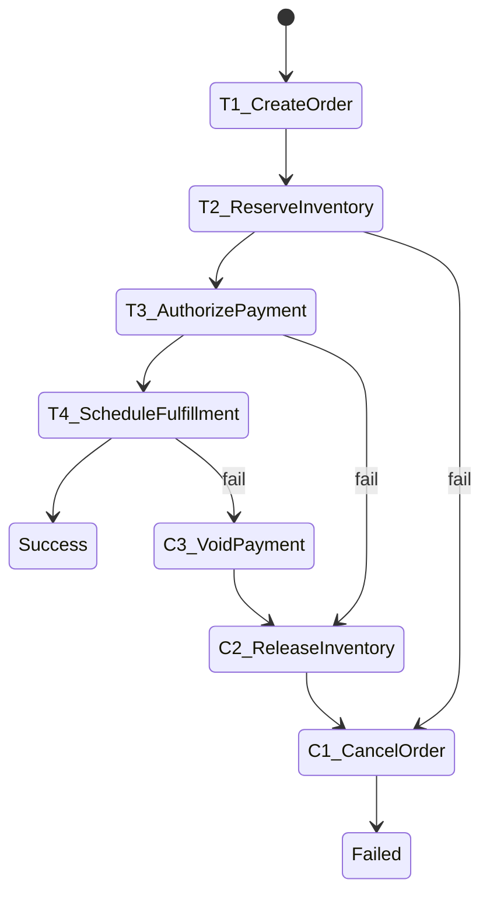
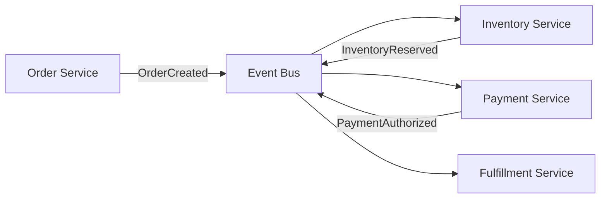
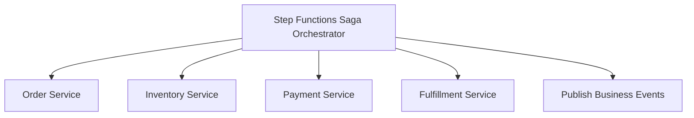
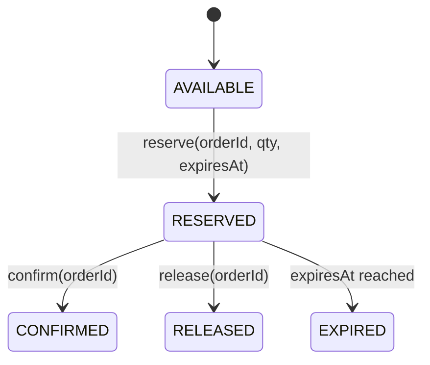
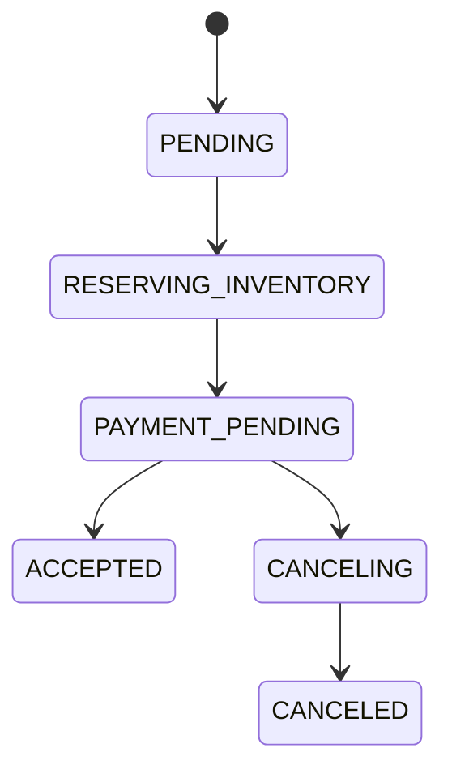
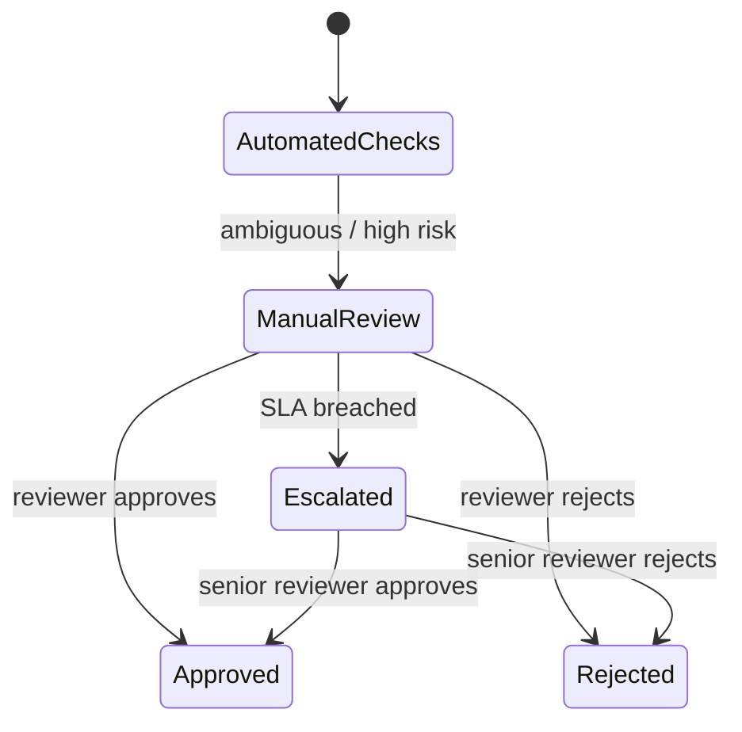
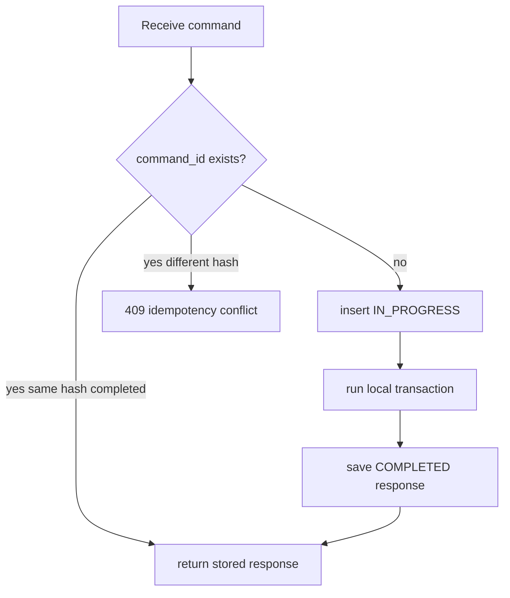

# Part 046 — Saga Orchestration

> Saga bukan distributed transaction yang lebih keren. Saga adalah pengakuan jujur bahwa di sistem terdistribusi, beberapa perubahan sudah terlanjur terjadi, dan yang bisa kita lakukan adalah membawa sistem ke **acceptable end state** melalui forward recovery atau compensation.

Part ini membahas **saga orchestration** dengan AWS Step Functions.

Kita akan membahas:

1. kenapa saga ada;
2. local transaction, continuation, compensation;
3. orchestration vs choreography untuk saga;
4. desain reservation, semantic lock, timeout, dan expiry;
5. participant contract;
6. compensation yang idempotent;
7. human escalation;
8. contoh state machine order/payment/inventory;
9. failure matrix dan production checklist.

---

## 1. Masalah yang Diselesaikan Saga

Misalnya proses order:

```txt
1. Create order
2. Reserve inventory
3. Authorize payment
4. Schedule fulfillment
5. Publish order accepted
```

Jika semua state berada dalam satu database relational, kita bisa memakai satu ACID transaction.

```sql
begin;
insert into orders ...;
update inventory ...;
insert into payment_authorizations ...;
commit;
```

Tetapi pada microservices atau bounded contexts terpisah:

```txt
Order DB != Inventory DB != Payment system != Fulfillment DB
```

Tidak ada satu local transaction yang bisa menutup semua perubahan. Two-phase commit jarang menjadi pilihan yang sehat untuk sistem application-level modern karena coupling, blocking, failure handling, dan operability cost.

Saga mengganti pertanyaan:

```txt
Bagaimana semua step commit atomic bersama-sama?
```

menjadi:

```txt
Jika step ke-N gagal setelah step sebelumnya berhasil, transisi bisnis aman berikutnya apa?
```

---

## 2. Definisi Operasional Saga

Saga adalah sequence dari **local transactions**.

Setiap local transaction:

1. mengubah state milik satu participant;
2. commit secara lokal;
3. menghasilkan output untuk melanjutkan workflow;
4. punya compensation jika perubahan perlu dibatalkan secara bisnis.



Ada dua arah recovery:

| Recovery | Makna | Contoh |
|---|---|---|
| Forward recovery | coba lanjutkan sampai berhasil | retry reserve inventory karena throttling |
| Backward recovery | compensate step sebelumnya | release inventory karena payment declined |

Saga bukan rollback teknis. Compensation adalah **business operation baru**.

Contoh:

```txt
ReserveInventory -> ReleaseInventory
AuthorizePayment -> VoidAuthorization
CreateOrder -> CancelOrder
ScheduleShipment -> CancelShipment
```

---

## 3. Apa yang Bukan Saga

Saga bukan:

- distributed lock global;
- hidden `try/catch` besar;
- “publish event lalu berharap semua consumer benar”;
- rollback SQL lintas database;
- jaminan isolation otomatis;
- alasan untuk membuat transaksi bisnis berantakan.

Saga yang buruk:

```txt
try step A
try step B
try step C
catch any exception:
  call undo C
  call undo B
  call undo A
```

Masalah:

- tidak tahu step mana sudah commit;
- compensation bisa gagal;
- retry compensation bisa menggandakan efek;
- business rejection dan technical failure dicampur;
- tidak ada audit state yang jelas.

Saga yang benar mendesain state transition secara eksplisit.

---

## 4. Orchestration vs Choreography untuk Saga

### 4.1 Choreography

Dalam choreography, setiap participant publish event dan participant berikutnya bereaksi.



Kelebihan:

- tidak ada orchestrator sentral;
- participant loosely coupled;
- cocok untuk flow sederhana dengan sedikit participant.

Risiko:

- dependency graph tersembunyi di rules/subscriptions;
- sulit menjawab “workflow ini sekarang sampai mana?”;
- compensation tersebar;
- onboarding participant baru bisa mengubah semantics flow;
- debug lebih sulit ketika event banyak.

### 4.2 Orchestration

Dalam orchestration, Step Functions menjadi coordinator.



Kelebihan:

- workflow state terlihat;
- timeout/retry/compensation terpusat;
- audit trail jelas;
- human escalation lebih mudah;
- cocok untuk flow kompleks dengan banyak step dan keputusan.

Risiko:

- orchestrator bisa menjadi terlalu pintar;
- domain logic bocor ke workflow;
- participant menjadi command endpoint pasif;
- versioning workflow perlu disiplin;
- compensation path harus ditest serius.

Rule praktis:

```txt
Gunakan choreography untuk event propagation sederhana.
Gunakan orchestration untuk business transaction yang punya urutan, timeout, compensation, dan audit obligation.
```

---

## 5. Saga Boundary: Jangan Semua Proses Dijadikan Saga

Saga mahal secara mental dan operasional. Gunakan hanya ketika ada kebutuhan nyata:

- multiple data stores harus dijaga konsistensinya;
- local ACID transaction tidak cukup;
- proses bisnis punya beberapa participant;
- step bisa lama;
- failure butuh compensation;
- user/operator perlu melihat progress;
- audit/regulatory trail penting.

Tidak perlu saga untuk:

- single database transaction;
- CRUD sederhana;
- eventual notification yang tidak memblokir command;
- read model update;
- side effect non-critical yang bisa direconcile.

Decision check:

```txt
Jika semua invariant penting bisa dijaga dalam satu aggregate/database transaction,
jangan gunakan saga.
```

---

## 6. Participant Contract

Setiap participant saga harus punya contract yang eksplisit.

Contoh inventory participant:

```http
POST /inventory/reservations
Idempotency-Key: reserve-order-123

{
  "reservationId": "resv-order-123",
  "orderId": "order-123",
  "sku": "BOOK-1",
  "quantity": 2,
  "expiresAt": "2026-07-06T10:30:00+07:00"
}
```

Response sukses:

```json
{
  "reservationId": "resv-order-123",
  "status": "RESERVED",
  "expiresAt": "2026-07-06T10:30:00+07:00"
}
```

Response business failure:

```json
{
  "errorCode": "INSUFFICIENT_STOCK",
  "message": "Requested quantity is not available",
  "retryable": false
}
```

Compensation:

```http
POST /inventory/reservations/resv-order-123/release
Idempotency-Key: release-order-123
```

Participant contract wajib menjawab:

| Pertanyaan | Kenapa penting |
|---|---|
| Apa idempotency key? | retry-safe execution |
| Apa business key? | trace dan reconciliation |
| Error mana retryable? | avoid retrying business rejection |
| Apa compensation command? | recovery eksplisit |
| Compensation idempotent? | repeated compensation safe |
| Apa timeout/expiry? | avoid indefinite reservation |
| Apa observable status? | operator bisa inspect |

---

## 7. Reservation Pattern

Reservation adalah salah satu primitive paling penting dalam saga.

Daripada langsung mengurangi stock final, inventory membuat reservation dengan expiry.



### 7.1 Kenapa Reservation Lebih Aman

Tanpa reservation:

```txt
payment succeeds but stock has gone
or stock reduced but payment fails
```

Dengan reservation:

```txt
reserve temporary capacity
payment attempts within reservation window
confirm or release
expiry cleans up forgotten reservation
```

### 7.2 SQL Sketch

```sql
create table inventory_reservations (
  reservation_id varchar(80) primary key,
  order_id varchar(80) not null unique,
  sku varchar(80) not null,
  quantity int not null,
  status varchar(30) not null,
  expires_at timestamp not null,
  created_at timestamp not null,
  updated_at timestamp not null
);

create table inventory_stock (
  sku varchar(80) primary key,
  available_qty int not null,
  reserved_qty int not null,
  version bigint not null
);
```

Reservation transaction:

```sql
begin;

select available_qty, reserved_qty
from inventory_stock
where sku = :sku
for update;

-- invariant: available_qty - reserved_qty >= requested_qty

update inventory_stock
set reserved_qty = reserved_qty + :qty,
    version = version + 1
where sku = :sku
  and available_qty - reserved_qty >= :qty;

insert into inventory_reservations(
  reservation_id, order_id, sku, quantity, status, expires_at, created_at, updated_at
) values (
  :reservationId, :orderId, :sku, :qty, 'RESERVED', :expiresAt, now(), now()
);

commit;
```

Release transaction:

```sql
begin;

update inventory_reservations
set status = 'RELEASED', updated_at = now()
where reservation_id = :reservationId
  and status = 'RESERVED';

update inventory_stock
set reserved_qty = reserved_qty - :qty,
    version = version + 1
where sku = :sku
  and exists (
    select 1 from inventory_reservations
    where reservation_id = :reservationId
      and status = 'RELEASED'
  );

commit;
```

In real system, guard against double decrement carefully. Better use status transition row count and only update stock when transition happened.

---

## 8. Semantic Locking

Saga tidak memberi isolation otomatis. Dua saga bisa mempengaruhi aggregate yang sama.

Contoh:

```txt
Order A reserves last item.
Order B also tries to reserve last item.
```

Inventory local transaction harus menjaga invariant, bukan Step Functions.

Semantic lock adalah business-level lock/state yang menghalangi operation conflict.

Contoh order state:



Ketika order `PAYMENT_PENDING`, command tertentu mungkin ditolak:

```txt
Cannot modify order items while payment is pending.
Cannot cancel after fulfillment confirmed unless cancellation policy allows it.
```

Semantic lock bukan database lock panjang. Ia adalah status domain yang membuat concurrency visible.

---

## 9. State Machine Example: Order Saga

Berikut skeleton ASL yang menyederhanakan order saga.

```json
{
  "Comment": "Order saga orchestration",
  "StartAt": "CreateOrder",
  "States": {
    "CreateOrder": {
      "Type": "Task",
      "Resource": "arn:aws:states:::apigateway:invoke",
      "Parameters": {
        "ApiEndpoint": "orders.example.internal",
        "Method": "POST",
        "Path": "/orders",
        "Headers": {
          "Idempotency-Key.$": "$.commandId",
          "X-Correlation-Id.$": "$.correlationId"
        },
        "RequestBody": {
          "orderId.$": "$.orderId",
          "customerId.$": "$.customerId",
          "items.$": "$.items"
        },
        "AuthType": "IAM_ROLE"
      },
      "Retry": [
        {
          "ErrorEquals": ["States.TaskFailed"],
          "IntervalSeconds": 2,
          "MaxAttempts": 3,
          "BackoffRate": 2
        }
      ],
      "Catch": [
        {
          "ErrorEquals": ["States.ALL"],
          "ResultPath": "$.createOrderError",
          "Next": "FailWithoutCompensation"
        }
      ],
      "ResultPath": "$.createOrder",
      "Next": "ReserveInventory"
    },

    "ReserveInventory": {
      "Type": "Task",
      "Resource": "arn:aws:states:::apigateway:invoke",
      "Parameters": {
        "ApiEndpoint": "inventory.example.internal",
        "Method": "POST",
        "Path": "/reservations",
        "Headers": {
          "Idempotency-Key.$": "States.Format('reserve-{}', $.orderId)",
          "X-Correlation-Id.$": "$.correlationId"
        },
        "RequestBody": {
          "reservationId.$": "States.Format('resv-{}', $.orderId)",
          "orderId.$": "$.orderId",
          "items.$": "$.items",
          "expiresAt.$": "$.reservationExpiresAt"
        },
        "AuthType": "IAM_ROLE"
      },
      "Catch": [
        {
          "ErrorEquals": ["Business.InsufficientStock"],
          "ResultPath": "$.inventoryBusinessError",
          "Next": "CancelOrder"
        },
        {
          "ErrorEquals": ["States.ALL"],
          "ResultPath": "$.inventoryError",
          "Next": "CancelOrder"
        }
      ],
      "ResultPath": "$.inventory",
      "Next": "AuthorizePayment"
    },

    "AuthorizePayment": {
      "Type": "Task",
      "Resource": "arn:aws:states:::sqs:sendMessage.waitForTaskToken",
      "HeartbeatSeconds": 300,
      "TimeoutSeconds": 1800,
      "Parameters": {
        "QueueUrl": "https://sqs.ap-southeast-1.amazonaws.com/123456789012/payment-authorization-requests",
        "MessageBody": {
          "taskToken.$": "$$.Task.Token",
          "paymentRequestId.$": "States.Format('pay-{}', $.orderId)",
          "orderId.$": "$.orderId",
          "amount.$": "$.amount",
          "correlationId.$": "$.correlationId"
        }
      },
      "Catch": [
        {
          "ErrorEquals": ["Payment.Declined"],
          "ResultPath": "$.paymentDeclined",
          "Next": "ReleaseInventory"
        },
        {
          "ErrorEquals": ["States.Timeout"],
          "ResultPath": "$.paymentTimeout",
          "Next": "ReleaseInventory"
        },
        {
          "ErrorEquals": ["States.ALL"],
          "ResultPath": "$.paymentError",
          "Next": "ReleaseInventory"
        }
      ],
      "ResultPath": "$.payment",
      "Next": "ConfirmInventory"
    },

    "ConfirmInventory": {
      "Type": "Task",
      "Resource": "arn:aws:states:::apigateway:invoke",
      "Parameters": {
        "ApiEndpoint": "inventory.example.internal",
        "Method": "POST",
        "Path.$": "States.Format('/reservations/{}/confirm', $.inventory.reservationId)",
        "Headers": {
          "Idempotency-Key.$": "States.Format('confirm-inventory-{}', $.orderId)",
          "X-Correlation-Id.$": "$.correlationId"
        },
        "AuthType": "IAM_ROLE"
      },
      "Catch": [
        {
          "ErrorEquals": ["States.ALL"],
          "ResultPath": "$.confirmInventoryError",
          "Next": "VoidPayment"
        }
      ],
      "Next": "AcceptOrder"
    },

    "AcceptOrder": {
      "Type": "Task",
      "Resource": "arn:aws:states:::apigateway:invoke",
      "Parameters": {
        "ApiEndpoint": "orders.example.internal",
        "Method": "POST",
        "Path.$": "States.Format('/orders/{}/accept', $.orderId)",
        "Headers": {
          "Idempotency-Key.$": "States.Format('accept-order-{}', $.orderId)",
          "X-Correlation-Id.$": "$.correlationId"
        },
        "AuthType": "IAM_ROLE"
      },
      "Next": "PublishOrderAccepted"
    },

    "PublishOrderAccepted": {
      "Type": "Task",
      "Resource": "arn:aws:states:::events:putEvents",
      "Parameters": {
        "Entries": [
          {
            "EventBusName": "application-events",
            "Source": "com.example.order.workflow",
            "DetailType": "OrderAccepted",
            "Detail": {
              "eventId.$": "States.UUID()",
              "orderId.$": "$.orderId",
              "correlationId.$": "$.correlationId",
              "workflowExecution.$": "$$.Execution.Id"
            }
          }
        ]
      },
      "End": true
    },

    "VoidPayment": {
      "Type": "Task",
      "Resource": "arn:aws:states:::apigateway:invoke",
      "Parameters": {
        "ApiEndpoint": "payments.example.internal",
        "Method": "POST",
        "Path.$": "States.Format('/authorizations/{}/void', $.payment.authorizationId)",
        "Headers": {
          "Idempotency-Key.$": "States.Format('void-payment-{}', $.orderId)",
          "X-Correlation-Id.$": "$.correlationId"
        },
        "AuthType": "IAM_ROLE"
      },
      "Catch": [
        {
          "ErrorEquals": ["States.ALL"],
          "ResultPath": "$.voidPaymentError",
          "Next": "EscalateCompensationFailure"
        }
      ],
      "Next": "ReleaseInventory"
    },

    "ReleaseInventory": {
      "Type": "Task",
      "Resource": "arn:aws:states:::apigateway:invoke",
      "Parameters": {
        "ApiEndpoint": "inventory.example.internal",
        "Method": "POST",
        "Path.$": "States.Format('/reservations/{}/release', $.inventory.reservationId)",
        "Headers": {
          "Idempotency-Key.$": "States.Format('release-inventory-{}', $.orderId)",
          "X-Correlation-Id.$": "$.correlationId"
        },
        "AuthType": "IAM_ROLE"
      },
      "Catch": [
        {
          "ErrorEquals": ["States.ALL"],
          "ResultPath": "$.releaseInventoryError",
          "Next": "EscalateCompensationFailure"
        }
      ],
      "Next": "CancelOrder"
    },

    "CancelOrder": {
      "Type": "Task",
      "Resource": "arn:aws:states:::apigateway:invoke",
      "Parameters": {
        "ApiEndpoint": "orders.example.internal",
        "Method": "POST",
        "Path.$": "States.Format('/orders/{}/cancel', $.orderId)",
        "Headers": {
          "Idempotency-Key.$": "States.Format('cancel-order-{}', $.orderId)",
          "X-Correlation-Id.$": "$.correlationId"
        },
        "AuthType": "IAM_ROLE"
      },
      "Next": "FailAfterCompensation"
    },

    "EscalateCompensationFailure": {
      "Type": "Task",
      "Resource": "arn:aws:states:::events:putEvents",
      "Parameters": {
        "Entries": [
          {
            "EventBusName": "operations-events",
            "Source": "com.example.order.workflow",
            "DetailType": "SagaCompensationFailed",
            "Detail": {
              "orderId.$": "$.orderId",
              "executionArn.$": "$$.Execution.Id",
              "correlationId.$": "$.correlationId"
            }
          }
        ]
      },
      "Next": "FailAfterCompensation"
    },

    "FailWithoutCompensation": {
      "Type": "Fail",
      "Error": "OrderSaga.CreateOrderFailed"
    },

    "FailAfterCompensation": {
      "Type": "Fail",
      "Error": "OrderSaga.FailedAfterCompensation"
    }
  }
}
```

Ini skeleton, bukan drop-in production code. Tujuannya menunjukkan struktur decision dan compensation.

---

## 10. Compensation Design

Compensation harus diperlakukan sebagai command normal, bukan cleanup script.

### 10.1 Sifat Compensation yang Baik

Compensation harus:

- idempotent;
- auditable;
- punya authorization;
- punya business reason;
- aman jika original operation belum benar-benar commit;
- aman jika dipanggil setelah compensation sebelumnya berhasil;
- tidak menghapus evidence.

Contoh buruk:

```sql
delete from orders where order_id = :orderId;
```

Contoh lebih baik:

```sql
update orders
set status = 'CANCELED',
    cancel_reason = :reason,
    canceled_at = now()
where order_id = :orderId
  and status in ('CREATED', 'PENDING_PAYMENT', 'RESERVED');
```

Compensation harus menjaga audit trail.

### 10.2 Compensation Tidak Selalu Mengembalikan Dunia

Misalnya payment sudah captured, bukan sekadar authorized.

Compensation mungkin bukan `void`, tapi `refund`.

```txt
AuthorizePayment -> VoidAuthorization
CapturePayment -> RefundPayment
ShipItem -> CreateReturnCase
NotifyCustomer -> SendCorrectionNotice
```

Jangan menamai compensation sebagai `rollback` jika secara bisnis bukan rollback.

---

## 11. Timeout dan Expiry

Saga harus punya clock.

Tanpa expiry:

- reservation bisa menggantung;
- payment pending bisa tidak pernah selesai;
- human task bisa dilupakan;
- workflow bisa menumpuk;
- operator tidak tahu kapan harus bertindak.

Desain expiry per resource:

| Resource | Expiry |
|---|---|
| inventory reservation | 15–30 menit untuk checkout normal |
| payment authorization | mengikuti policy payment provider |
| manual review | SLA operasional, misalnya 24 jam |
| shipping hold | sesuai business rule |
| callback token | lebih pendek dari business SLA jika butuh heartbeat |

Workflow harus membedakan:

```txt
technical timeout: system didn't respond
business expiry: offer/reservation no longer valid
human SLA breach: needs escalation
```

---

## 12. Human Escalation

Beberapa saga tidak boleh auto-fail.

Contoh regulatory/case management:

- suspicious transaction review;
- enforcement action approval;
- high-value refund;
- sanctions screening;
- identity mismatch;
- legal hold decision.

Pattern:



Step Functions callback token cocok untuk human escalation, tetapi token jangan menjadi domain state utama. Simpan review task di database sendiri.

```txt
Workflow waits.
Review system owns review state.
Callback bridges review completion back to workflow.
```

---

## 13. Participant Idempotency Table

Setiap service participant sebaiknya punya command table.

```sql
create table command_idempotency (
  command_id varchar(120) primary key,
  command_type varchar(80) not null,
  aggregate_id varchar(120) not null,
  request_hash varchar(64) not null,
  status varchar(30) not null,
  response_json jsonb null,
  error_code varchar(80) null,
  created_at timestamp not null,
  updated_at timestamp not null
);
```

Flow:



Ini melindungi participant dari:

- Step Functions retry;
- duplicate API call;
- callback retry;
- operator replay;
- network ambiguity.

---

## 14. Saga State vs Domain State

Jangan campuradukkan:

| State | Owner | Contoh |
|---|---|---|
| Workflow state | Step Functions | `AuthorizePayment` running, `ReleaseInventory` failed |
| Domain state | domain service database | order `PENDING_PAYMENT`, reservation `RESERVED` |
| Integration state | adapter/worker database | callback `WAITING`, vendor request `SENT` |
| Projection state | read model/search/cache | order view `stale` |

Step Functions execution history bukan source of truth domain. Ia source of truth untuk **control flow execution**.

Domain service tetap harus menyimpan status domain sendiri.

Kenapa?

- domain query tidak boleh bergantung pada workflow execution history;
- workflow bisa berubah versi;
- domain state harus tetap bisa direconcile;
- operator bisnis butuh domain lifecycle, bukan ASL internals.

---

## 15. Failure Matrix

| Failure | Forward recovery | Backward recovery | Notes |
|---|---|---|---|
| inventory API timeout before commit known | retry with idempotency key | if uncertain, query reservation status first | unknown commit problem |
| insufficient stock | no | cancel order | business failure |
| payment provider timeout | retry/query provider status | release inventory if declined/expired | avoid double charge |
| payment declined | no | release inventory + cancel order | business rejection |
| confirm inventory fails after payment authorized | retry confirm | void payment + release reservation | depends expiry |
| void payment fails | retry/escalate | cannot safely proceed | operations alert |
| release inventory fails | retry/escalate | order remains canceled but reservation stuck | reconciliation job |
| publish event fails | retry | maybe workflow success but event missing | outbox may be better |
| compensation partially succeeds | continue remaining compensation | escalate incomplete state | audit required |
| workflow execution aborted | inspect domain states | run repair workflow | kill is not rollback |

---

## 16. Reconciliation is Part of the Design

Saga tanpa reconciliation adalah optimisme berbahaya.

Buat scheduled reconciliation untuk mencari state yang stuck:

```sql
select * from orders
where status in ('PENDING_PAYMENT', 'RESERVING_INVENTORY', 'CANCELING')
  and updated_at < now() - interval '30 minutes';
```

Reconciliation worker:

1. read domain state;
2. read workflow/external status;
3. classify state;
4. issue idempotent command;
5. append audit event;
6. notify operator if unsafe.

State classification:

```txt
SAFE_TO_RETRY_FORWARD
SAFE_TO_COMPENSATE
NEEDS_HUMAN_DECISION
EXTERNAL_PROVIDER_UNKNOWN
DATA_CORRUPTION_SUSPECTED
```

---

## 17. Observability for Saga

Minimum fields:

```txt
sagaId
workflowExecutionArn
commandId
businessAggregateId
participant
participantCommandId
participantStatus
compensationCommandId
forwardStep
compensationStep
correlationId
causationId
businessErrorCode
technicalErrorName
```

Dashboard:

| Metric | Why |
|---|---|
| saga started/succeeded/failed | health |
| saga duration p50/p95/p99 | SLA |
| step retry count by participant | participant instability |
| compensation count | business/process quality |
| compensation failure count | urgent operational risk |
| stuck saga by age/state | work queue for operations |
| manual escalation count | capacity planning |
| reservation expiry count | checkout/payment friction |

Trace shape:

```txt
API command -> StartExecution -> participant commands -> callback/external events -> compensation/events
```

Logs harus bisa menjawab:

```txt
Apa step terakhir yang committed?
Apa compensation yang sudah berhasil?
Apa yang masih harus dilakukan?
Apakah retry aman?
Siapa owner next action?
```

---

## 18. Versioning Saga

Workflow akan berubah. Saga yang sedang running bisa memakai versi lama.

Risiko:

- compensation endpoint berubah;
- participant contract berubah;
- state name berubah sehingga runbook lama tidak cocok;
- event schema berubah;
- business policy expiry berubah.

Praktik aman:

- version state machine secara eksplisit;
- include `sagaVersion` di input;
- jangan hapus endpoint compensation lama sebelum semua execution lama selesai;
- simpan mapping state name ke operational runbook;
- gunakan alias/version jika perlu deployment gradual;
- test migration untuk in-flight workflows.

---

## 19. Anti-Patterns

### 19.1 Saga untuk Menghindari Data Modeling yang Benar

Jika satu aggregate bisa menyelesaikan invariant dalam satu database transaction, jangan pecah menjadi saga.

### 19.2 Compensation Menghapus Data

Regulatory/audit system seharusnya jarang menghapus. Ubah status dan append audit.

### 19.3 Retry Semua Error

Retry payment declined, insufficient stock, invalid state, atau duplicate command hanya membuang capacity dan memperburuk audit.

### 19.4 Workflow Menjadi Domain God Object

Jika semua rule bisnis ditulis dalam ASL, domain service menjadi anemic dan sulit ditest.

Letakkan invariant domain di participant. Letakkan sequencing, timeout, dan compensation di workflow.

### 19.5 Tidak Ada Manual Repair Path

Beberapa state tidak bisa dipulihkan otomatis. Production system butuh repair command yang idempotent dan auditable.

---

## 20. Production Readiness Checklist

- [ ] Saga boundary jelas dan memang membutuhkan distributed consistency.
- [ ] Setiap step adalah local transaction yang owned oleh satu participant.
- [ ] Setiap participant command punya idempotency key.
- [ ] Setiap participant punya observable status endpoint atau query path.
- [ ] Setiap compensation adalah command idempotent dan auditable.
- [ ] Business failure dan technical failure dipisah.
- [ ] Timeout/expiry ditentukan untuk reservation, payment, callback, human task.
- [ ] Unknown commit punya reconciliation path.
- [ ] Compensation failure punya escalation path.
- [ ] Workflow payload kecil dan memakai references untuk data besar.
- [ ] Execution name deterministic untuk deduplication.
- [ ] Dashboard dan alarm mencakup stuck saga, compensation failure, dan duration SLA.
- [ ] Runbook menjelaskan next action per terminal/non-terminal failure state.
- [ ] In-flight workflow versioning dipertimbangkan.
- [ ] Failure drills dilakukan sebelum production launch.

---

## 21. Ringkasan

Saga orchestration dengan Step Functions cocok ketika proses bisnis membutuhkan:

- urutan step yang eksplisit;
- transaksi lokal lintas beberapa data store;
- timeout;
- compensation;
- audit trail;
- human escalation;
- operational recovery.

Inti desain saga:

```txt
Do not pretend distributed rollback exists.
Design explicit forward recovery and explicit compensation.
Make every participant idempotent.
Make every state observable.
Make manual repair safe.
```

Saga yang baik bukan yang tidak pernah gagal. Saga yang baik adalah yang ketika gagal, sistem tahu **apa yang sudah terjadi**, **apa yang belum terjadi**, dan **aksi aman berikutnya apa**.

---

## Referensi

- AWS Prescriptive Guidance — Saga patterns: https://docs.aws.amazon.com/prescriptive-guidance/latest/cloud-design-patterns/saga.html
- AWS Prescriptive Guidance — Saga orchestration pattern: https://docs.aws.amazon.com/prescriptive-guidance/latest/cloud-design-patterns/saga-orchestration.html
- AWS Prescriptive Guidance — Saga pattern for data persistence in microservices: https://docs.aws.amazon.com/prescriptive-guidance/latest/modernization-data-persistence/saga-pattern.html
- AWS Prescriptive Guidance — Implement the serverless saga pattern by using AWS Step Functions: https://docs.aws.amazon.com/prescriptive-guidance/latest/patterns/implement-the-serverless-saga-pattern-by-using-aws-step-functions.html
- AWS Step Functions Developer Guide — Error handling: https://docs.aws.amazon.com/step-functions/latest/dg/concepts-error-handling.html
- AWS Step Functions Developer Guide — Service integration patterns: https://docs.aws.amazon.com/step-functions/latest/dg/connect-to-resource.html
