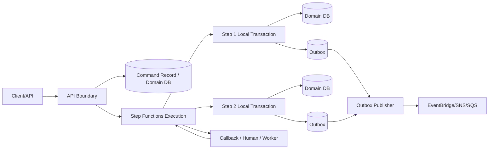
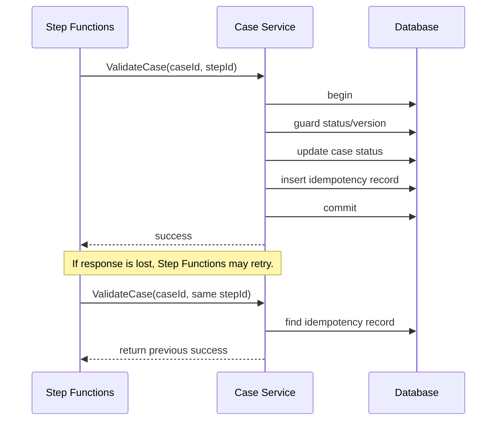
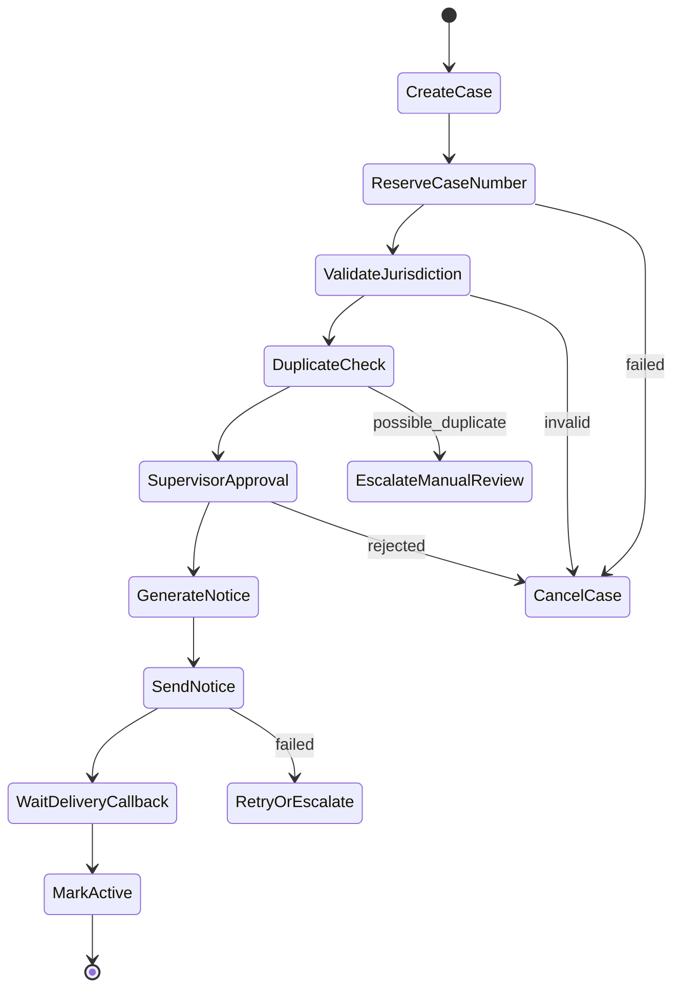
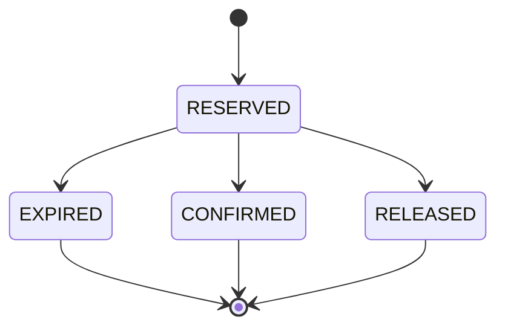
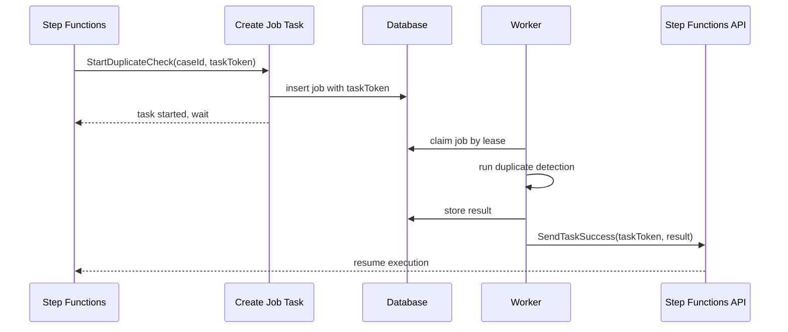
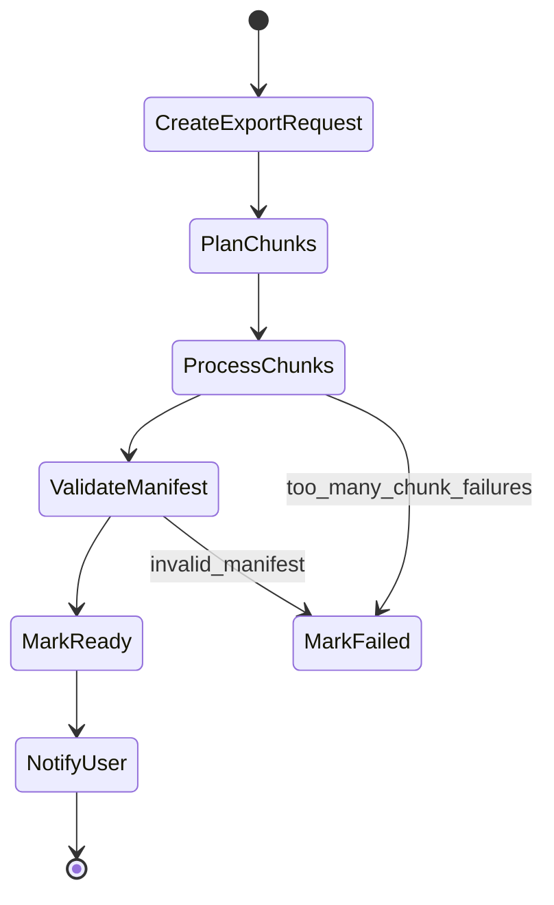

# Part 047 — Step Functions Database Workflow

> Workflow panjang bukan alasan untuk membuat transaksi database panjang. Di production, transaksi database harus pendek, deterministik, dan mudah di-retry. Step Functions menyimpan **control state**; database menyimpan **domain state**.

Part ini membahas cara memakai AWS Step Functions untuk mengorkestrasi proses yang menyentuh database tanpa menahan lock, connection, transaction, atau thread terlalu lama.

Kita akan membahas:

1. kenapa long-running database transaction berbahaya;
2. perbedaan workflow state dan domain state;
3. pola local transaction per step;
4. reservation/lease instead of lock;
5. outbox, inbox, idempotency, dan command record;
6. callback token untuk worker/human/third-party process;
7. RDS/Aurora dan DynamoDB implementation pattern;
8. contoh state machine;
9. Java/Spring-style worker skeleton;
10. failure matrix dan production checklist.

---

## 1. Problem: Business Process Panjang, Database Transaction Harus Pendek

Misalnya proses case enforcement:

```txt
1. Create case
2. Validate jurisdiction
3. Reserve case number
4. Run duplicate detection
5. Ask supervisor approval
6. Generate notice
7. Send notice
8. Wait for delivery acknowledgement
9. Mark case active
```

Proses ini bisa berlangsung detik, menit, jam, atau hari. Jika kita mencoba membungkus semua dengan satu database transaction, hasilnya buruk:

```sql
begin;
insert into cases ...;
update case_number_sequences ...;
insert into approvals ...;
-- wait for supervisor
-- call external provider
-- wait for delivery callback
commit;
```

Ini bukan transaction. Ini bom operasional.

Yang akan terjadi:

| Masalah | Dampak |
|---|---|
| Connection tertahan lama | pool exhaustion, request lain ikut gagal |
| Lock tertahan lama | deadlock, blocking chain, throughput drop |
| Transaction log tumbuh | replication lag, vacuum/cleanup tertahan |
| External call di dalam transaction | unknown commit problem makin parah |
| Restart aplikasi | state proses hilang atau ambigu |
| Failover database | transaction dibatalkan atau outcome tidak jelas |
| Human approval | mustahil dipertahankan sebagai DB transaction |

Aturan pertama:

```txt
Business workflow boleh panjang.
Database transaction tidak boleh panjang.
```

Aturan kedua:

```txt
Setiap step workflow yang mengubah domain state harus commit lokal secara pendek.
```

Step Functions bukan pengganti database transaction. Ia adalah **durable control plane** untuk mengingat step mana yang sudah selesai, step mana yang gagal, dan step mana yang harus dikompensasi.

---

## 2. Mental Model: Control State vs Domain State

Pisahkan dua jenis state.

| State | Disimpan di | Contoh | Sifat |
|---|---|---|---|
| Workflow state | Step Functions | current step, retry count, branch, token, error | control/progress state |
| Domain state | database | order status, case status, payment status | business truth |
| Integration state | queue/event/log | message delivery, outbox status, consumer checkpoint | delivery/projection state |
| Observability state | logs/metrics/traces | execution id, duration, failed state | debugging/audit signal |

Diagram dasarnya:



Kebenaran domain tidak boleh hanya hidup di execution history Step Functions.

Step Functions tahu:

```txt
execution CaseActivation-CASE-2026-0001 sedang menunggu approval
```

Database domain tahu:

```txt
case CASE-2026-0001 status = PENDING_SUPERVISOR_APPROVAL
```

Keduanya saling melengkapi. Jika hanya Step Functions yang tahu status bisnis, query operasional, audit regulator, reporting, dan recovery akan sulit. Jika hanya database yang tahu step proses, orchestration retry/timeout/compensation akan menyebar ke application code.

---

## 3. Golden Rule: Satu Step, Satu Local Transaction yang Jelas

Pola sehat:

```txt
Step Functions state
  -> call participant
  -> participant opens local transaction
  -> validate current domain state
  -> mutate state
  -> write outbox/inbox/audit if needed
  -> commit
  -> return stable result to workflow
```

Contoh local transaction pada relational database:

```sql
begin;

select status, version
from cases
where case_id = :case_id
for update;

-- guard current state
-- only PENDING_VALIDATION can become VALIDATED

update cases
set status = 'VALIDATED',
    version = version + 1,
    validated_at = now()
where case_id = :case_id
  and status = 'PENDING_VALIDATION';

insert into case_events_outbox(
  event_id,
  case_id,
  event_type,
  payload,
  created_at,
  publish_status
) values (
  :event_id,
  :case_id,
  'CaseValidated',
  :payload,
  now(),
  'PENDING'
);

commit;
```

Setelah commit, workflow lanjut ke step berikutnya.

Yang tidak sehat:

```txt
Open transaction
  -> call Step Functions
  -> call payment provider
  -> wait queue
  -> wait human approval
Commit
```

Yang sehat:

```txt
Commit local state
Signal workflow or emit event
Let workflow decide next transition
```

---

## 4. Transaction Boundary pada Workflow

Boundary paling penting:

```txt
Step Functions execution != database transaction
```

Step Functions dapat retry sebuah Task. Artinya participant harus aman terhadap duplicate invocation.



Design requirement:

```txt
Every workflow task that mutates state must have a stable idempotency key.
```

Idempotency key dapat dibentuk dari:

```txt
workflowExecutionId + stateName
businessCommandId + participantName
caseId + transitionName + transitionVersion
```

Jangan gunakan random UUID baru setiap retry. Itu mengubah retry menjadi operasi baru.

---

## 5. Workflow State Machine untuk Database Process

Contoh state machine sederhana untuk aktivasi case:



Secara database, setiap transition punya guard:

| Step | Allowed current status | New status | Local transaction? |
|---|---|---|---|
| CreateCase | none | DRAFT | yes |
| ReserveCaseNumber | DRAFT | NUMBER_RESERVED | yes |
| ValidateJurisdiction | NUMBER_RESERVED | JURISDICTION_VALIDATED | yes |
| DuplicateCheck | JURISDICTION_VALIDATED | DUPLICATE_CHECK_PASSED / NEEDS_REVIEW | yes |
| SupervisorApproval | NEEDS_APPROVAL | APPROVED / REJECTED | yes, callback completion |
| GenerateNotice | APPROVED | NOTICE_GENERATED | yes |
| SendNotice | NOTICE_GENERATED | NOTICE_SENT | yes + provider call boundary |
| MarkActive | NOTICE_SENT | ACTIVE | yes |

Workflow transition dan database transition harus cocok.

Jika Step Functions berada di state `GenerateNotice`, database tidak boleh tiba-tiba `CANCELLED` tanpa workflow mengetahui. Jika domain memungkinkan cancellation eksternal, workflow harus punya check/choice sebelum melanjutkan.

---

## 6. Reservation Instead of Long Lock

Long-running process sering butuh “mengamankan” resource.

Contoh:

```txt
reserve inventory
reserve case number
reserve application slot
reserve appointment time
reserve quota
```

Kesalahan umum:

```txt
Ambil DB lock sampai proses selesai.
```

Pola sehat:

```txt
Create reservation row with expiry.
Commit.
Let workflow continue.
Confirm or release reservation later.
```

Relational example:

```sql
create table case_number_reservations (
  reservation_id uuid primary key,
  case_id text not null unique,
  case_number text not null unique,
  status text not null,
  expires_at timestamptz not null,
  created_at timestamptz not null,
  confirmed_at timestamptz,
  released_at timestamptz
);
```

Reserve:

```sql
begin;

insert into case_number_reservations(
  reservation_id,
  case_id,
  case_number,
  status,
  expires_at,
  created_at
) values (
  :reservation_id,
  :case_id,
  :case_number,
  'RESERVED',
  now() + interval '30 minutes',
  now()
);

update cases
set status = 'NUMBER_RESERVED',
    case_number = :case_number
where case_id = :case_id
  and status = 'DRAFT';

commit;
```

Confirm:

```sql
update case_number_reservations
set status = 'CONFIRMED',
    confirmed_at = now()
where reservation_id = :reservation_id
  and status = 'RESERVED'
  and expires_at > now();
```

Release:

```sql
update case_number_reservations
set status = 'RELEASED',
    released_at = now()
where reservation_id = :reservation_id
  and status = 'RESERVED';
```

Reservation membuat resource punya lifecycle eksplisit.



Invariant:

```txt
A reservation is not a lock. It is a business state with expiry and reconciliation.
```

---

## 7. Lease Pattern untuk Worker Coordination

Untuk workflow database, kadang Step Functions memulai job yang diproses worker:

```txt
Start duplicate detection job
Wait for callback
Continue when result available
```

Jangan tahan database lock saat worker memproses. Gunakan lease.

```sql
create table duplicate_detection_jobs (
  job_id uuid primary key,
  case_id text not null,
  status text not null,
  lease_owner text,
  lease_until timestamptz,
  task_token text,
  result jsonb,
  created_at timestamptz not null,
  completed_at timestamptz
);
```

Claim job:

```sql
update duplicate_detection_jobs
set lease_owner = :worker_id,
    lease_until = now() + interval '2 minutes',
    status = 'RUNNING'
where job_id = :job_id
  and status in ('PENDING', 'RUNNING')
  and (lease_until is null or lease_until < now())
returning *;
```

Complete job:

```sql
update duplicate_detection_jobs
set status = 'SUCCEEDED',
    result = :result,
    completed_at = now()
where job_id = :job_id
  and lease_owner = :worker_id
  and lease_until > now()
  and status = 'RUNNING';
```

Lalu worker memanggil Step Functions `SendTaskSuccess` memakai task token.

Workflow tidak memegang lock. Database hanya menyimpan job state dan task token.

---

## 8. Callback Token Pattern untuk Database Worker

Step Functions mendukung pola callback token untuk menunggu proses eksternal. Pola ini cocok ketika:

1. proses butuh worker khusus;
2. proses butuh human approval;
3. proses butuh third-party callback;
4. proses bisa lama;
5. workflow harus durable selama menunggu.

Flow:



State machine snippet:

```json
{
  "StartAt": "StartDuplicateCheck",
  "States": {
    "StartDuplicateCheck": {
      "Type": "Task",
      "Resource": "arn:aws:states:::lambda:invoke.waitForTaskToken",
      "TimeoutSeconds": 1800,
      "HeartbeatSeconds": 120,
      "Parameters": {
        "FunctionName": "StartDuplicateCheckJob",
        "Payload": {
          "caseId.$": "$.caseId",
          "taskToken.$": "$$.Task.Token",
          "executionId.$": "$$.Execution.Id"
        }
      },
      "Next": "EvaluateDuplicateCheck",
      "Catch": [
        {
          "ErrorEquals": ["States.Timeout"],
          "Next": "EscalateDuplicateCheckTimeout"
        }
      ]
    },
    "EvaluateDuplicateCheck": {
      "Type": "Choice",
      "Choices": [
        {
          "Variable": "$.duplicateCheckResult.status",
          "StringEquals": "CLEAR",
          "Next": "ContinueActivation"
        },
        {
          "Variable": "$.duplicateCheckResult.status",
          "StringEquals": "POSSIBLE_DUPLICATE",
          "Next": "EscalateManualReview"
        }
      ],
      "Default": "EscalateManualReview"
    },
    "ContinueActivation": { "Type": "Succeed" },
    "EscalateManualReview": { "Type": "Succeed" },
    "EscalateDuplicateCheckTimeout": { "Type": "Fail" }
  }
}
```

Important boundary:

```txt
Task token is control state.
Job row is integration state.
Case row is domain state.
```

Jangan menyimpan task token sebagai domain truth utama. Token hanya cara workflow dilanjutkan.

---

## 9. RDS/Aurora Pattern: Command Record + Local Transaction + Outbox

Untuk relational database, gunakan kombinasi:

1. command record;
2. state transition guard;
3. unique constraint;
4. outbox;
5. audit log.

Schema contoh:

```sql
create table workflow_commands (
  command_id text primary key,
  execution_id text not null,
  state_name text not null,
  aggregate_id text not null,
  command_type text not null,
  request_hash text not null,
  status text not null,
  result jsonb,
  created_at timestamptz not null,
  completed_at timestamptz,
  failed_at timestamptz
);

create unique index ux_workflow_command_step
on workflow_commands(execution_id, state_name, aggregate_id);
```

Handler skeleton:

```java
@Transactional
public ValidateCaseResult validateCase(ValidateCaseCommand command) {
    String key = command.executionId() + ":" + command.stateName() + ":" + command.caseId();

    Optional<WorkflowCommand> existing = commandRepo.findById(key);
    if (existing.isPresent()) {
        return existing.get().toResultOrThrowIfInProgress();
    }

    commandRepo.insertStarted(key, command);

    CaseRecord record = caseRepo.findForUpdate(command.caseId())
        .orElseThrow(() -> new NotFoundException("case not found"));

    if (!record.status().equals("NUMBER_RESERVED")) {
        throw new InvalidTransitionException(record.status(), "VALIDATE_CASE");
    }

    JurisdictionResult result = jurisdictionPolicy.evaluate(record);

    if (result.allowed()) {
        caseRepo.transition(command.caseId(), "JURISDICTION_VALIDATED");
        outboxRepo.insert("CaseJurisdictionValidated", command.caseId(), result);
    } else {
        caseRepo.transition(command.caseId(), "JURISDICTION_REJECTED");
        outboxRepo.insert("CaseJurisdictionRejected", command.caseId(), result);
    }

    commandRepo.markCompleted(key, result);
    return result;
}
```

Hal penting:

```txt
WorkflowCommand inserted before mutation.
Domain state transition guarded.
Outbox written in the same transaction.
Result cached for retry.
```

Jika response handler hilang setelah commit, retry Step Functions akan membaca command record dan mengembalikan result yang sama.

---

## 10. DynamoDB Pattern: Conditional Write + Transaction

Untuk DynamoDB, primitive utamanya:

1. conditional write;
2. transaction write;
3. item version;
4. idempotency item;
5. stream/outbox style event.

Single-table sketch:

```txt
PK = CASE#<caseId>, SK = META
PK = CASE#<caseId>, SK = COMMAND#<executionId>#<stateName>
PK = CASE#<caseId>, SK = EVENT#<timestamp>#<eventId>
```

`TransactWriteItems` concept:

```json
{
  "TransactItems": [
    {
      "Put": {
        "TableName": "CaseTable",
        "Item": {
          "PK": { "S": "CASE#123" },
          "SK": { "S": "COMMAND#exec-1#ValidateJurisdiction" },
          "status": { "S": "COMPLETED" },
          "result": { "S": "ALLOWED" }
        },
        "ConditionExpression": "attribute_not_exists(PK) AND attribute_not_exists(SK)"
      }
    },
    {
      "Update": {
        "TableName": "CaseTable",
        "Key": {
          "PK": { "S": "CASE#123" },
          "SK": { "S": "META" }
        },
        "UpdateExpression": "SET #status = :next, version = version + :one",
        "ConditionExpression": "#status = :expected AND version = :version",
        "ExpressionAttributeNames": {
          "#status": "status"
        },
        "ExpressionAttributeValues": {
          ":expected": { "S": "NUMBER_RESERVED" },
          ":next": { "S": "JURISDICTION_VALIDATED" },
          ":version": { "N": "7" },
          ":one": { "N": "1" }
        }
      }
    }
  ]
}
```

Jika conditional check gagal, jangan langsung treat sebagai fatal. Bedakan:

| Conditional failure | Makna mungkin | Response |
|---|---|---|
| command item sudah ada completed | duplicate retry | return previous result |
| command item sudah ada in-progress | concurrent duplicate | return retryable/in-progress |
| status bukan expected | invalid transition atau race | inspect aggregate status |
| version mismatch | optimistic conflict | retry bounded atau fail conflict |

DynamoDB conditional failure adalah signal desain, bukan sekadar exception.

---

## 11. Jangan Menaruh Semua Payload di Workflow

Step Functions input/output bukan database dokumen utama. Hindari membawa payload besar antar-state.

Buruk:

```txt
Execution input contains full case snapshot, evidence list, document content, historical timeline, generated PDF metadata, all approval notes.
```

Lebih baik:

```txt
Execution input contains identifiers and control data:
- caseId
- commandId
- tenantId
- correlationId
- execution policy version
```

State mengambil data terbaru dari database saat diperlukan.

```json
{
  "caseId": "CASE-2026-0001",
  "tenantId": "agency-a",
  "commandId": "cmd-7e1",
  "correlationId": "corr-a91",
  "policyVersion": "case-activation-v3"
}
```

Alasan:

1. payload besar meningkatkan biaya dan log risk;
2. state lama bisa stale;
3. audit domain harus ada di database;
4. redrive/retry dengan snapshot lama bisa salah;
5. sensitive data bisa bocor ke logs/execution history.

Workflow membawa **routing context**, bukan semua state.

---

## 12. Workflow Input Contract

Execution input harus stabil dan kecil.

Minimal:

```json
{
  "workflowName": "CaseActivation",
  "workflowVersion": "v3",
  "caseId": "CASE-2026-0001",
  "tenantId": "agency-a",
  "commandId": "cmd-20260706-001",
  "requestedBy": "user-123",
  "correlationId": "corr-abc",
  "startedAt": "2026-07-06T09:00:00Z"
}
```

Anti-pattern:

```json
{
  "case": {
    "allFields": "...",
    "allDocuments": "...",
    "allEvidence": "...",
    "fullAuditHistory": "..."
  }
}
```

Rule:

```txt
Input Step Functions harus cukup untuk menemukan state, bukan menggantikan state.
```

---

## 13. Workflow Output Contract

Workflow output juga harus jelas.

Contoh:

```json
{
  "caseId": "CASE-2026-0001",
  "finalStatus": "ACTIVE",
  "completedAt": "2026-07-06T09:05:12Z",
  "summary": {
    "caseNumber": "ENF-2026-000001",
    "noticeId": "NOTICE-123",
    "deliveryStatus": "ACKNOWLEDGED"
  }
}
```

Jangan mengandalkan output workflow sebagai satu-satunya final state. Database harus punya:

```txt
cases.status = ACTIVE
case_notices.delivery_status = ACKNOWLEDGED
case_audit_log contains transitions
```

Workflow output berguna untuk caller, tracing, dan automation lanjutan. Domain read path tetap database/read model.

---

## 14. Starting a Workflow from API Safely

API command handler sering melakukan dua hal:

1. membuat domain record awal;
2. memulai Step Functions execution.

Masalah: ini dual-write.

```txt
DB commit success, StartExecution fails
DB commit fails, StartExecution success
StartExecution success, API response lost
```

Ada beberapa pola.

### Pattern A — API Starts Workflow, First Step Creates Domain Record

```txt
API validates request
API starts Step Functions with deterministic execution name
Workflow first task creates domain record idempotently
```

Cocok jika domain record belum harus ada sebelum workflow mulai.

### Pattern B — DB Command Record + Outbox Starts Workflow

```txt
API writes command record in DB
Outbox publisher starts Step Functions
Workflow updates command status
```

Cocok jika database harus menjadi source-of-truth untuk accepted command.

### Pattern C — API Writes DB Then Starts Workflow with Reconciliation

```txt
API writes DB command accepted
API starts Step Functions
If start fails, reconciliation job starts missing execution
```

Cocok jika ingin synchronous response cepat tapi siap menerima reconciliation complexity.

Decision:

| Need | Pattern |
|---|---|
| workflow adalah primary process owner | A |
| DB command acceptance harus durable sebelum workflow | B |
| low-latency API dan toleransi reconciliation | C |

Untuk sistem regulatori/case management, Pattern B sering paling defensible karena semua accepted command punya record audit di database sebelum orchestration berjalan.

---

## 15. Deterministic Execution Name

Untuk Standard Workflows, execution name dapat dipakai sebagai idempotency primitive saat memulai workflow.

Contoh:

```txt
CaseActivation-<tenantId>-<caseId>-<commandId>
```

Jangan:

```txt
CaseActivation-<randomUuid>
```

Jika API retry memanggil `StartExecution` lagi, deterministic name membantu mencegah workflow ganda untuk command yang sama.

Tetap simpan command record di database. Execution name bukan pengganti audit domain.

```sql
create table workflow_starts (
  command_id text primary key,
  workflow_name text not null,
  execution_name text not null unique,
  execution_arn text,
  status text not null,
  created_at timestamptz not null,
  started_at timestamptz
);
```

---

## 16. Avoid Hidden Distributed Transaction

Anti-pattern klasik:

```java
@Transactional
public void approveCase(String caseId) {
    caseRepo.markApproved(caseId);
    stepFunctions.startExecution(...);
    eventBridge.putEvents(...);
}
```

Masalah:

| Failure | Akibat |
|---|---|
| DB commit berhasil, `StartExecution` gagal | case approved tapi workflow tidak jalan |
| `StartExecution` berhasil, DB commit rollback | workflow jalan untuk case yang tidak approved |
| EventBridge publish gagal | derived systems tidak tahu |
| API timeout setelah semua berhasil | client retry membuat duplicate |

Solusi paling kuat: transactional outbox.

```java
@Transactional
public void approveCase(String caseId, String commandId) {
    caseRepo.markApproved(caseId);
    outboxRepo.insertStartWorkflowRequested(commandId, caseId);
}
```

Publisher:

```java
public void publishPendingOutbox() {
    List<OutboxMessage> messages = outboxRepo.claimBatch(100);
    for (OutboxMessage message : messages) {
        try {
            stepFunctions.startExecution(message.executionName(), message.payload());
            outboxRepo.markPublished(message.id());
        } catch (ExecutionAlreadyExistsException e) {
            outboxRepo.markPublished(message.id());
        } catch (RetryableException e) {
            outboxRepo.release(message.id());
        }
    }
}
```

Outbox mengubah dual-write menjadi:

```txt
Atomic DB write now.
Reliable publish later.
```

---

## 17. Handling External Side Effects

Workflow database sering punya external side effect:

1. charge payment;
2. send email/SMS/notice;
3. call government registry;
4. generate document;
5. create ticket;
6. notify external agency.

Setiap external side effect harus punya idempotency boundary sendiri.

Contoh provider call table:

```sql
create table external_side_effects (
  side_effect_id text primary key,
  provider text not null,
  operation text not null,
  idempotency_key text not null unique,
  request_hash text not null,
  status text not null,
  provider_reference text,
  response jsonb,
  created_at timestamptz not null,
  completed_at timestamptz
);
```

Flow:

```txt
1. Insert side effect record as PENDING.
2. Commit domain intent if needed.
3. Call provider with idempotency key.
4. Store provider response/reference.
5. Return result to workflow.
```

Jika provider tidak mendukung idempotency key, buat **side-effect ledger** internal dan reconciliation process.

Jangan panggil provider dari dalam DB transaction kecuali operasi benar-benar cepat, idempotent, dan failure impact dipahami. Bahkan saat itu, lebih aman memisahkan intent dan side effect execution.

---

## 18. Database Polling vs Callback

Ada dua cara workflow menunggu hasil database job.

### Polling Pattern

```txt
Start job
Wait 30s
Check job status
If completed -> continue
Else -> wait again
```

Kelebihan:

1. sederhana;
2. tidak perlu task token;
3. worker tidak perlu memanggil Step Functions.

Kekurangan:

1. banyak state transitions;
2. latency minimal sebesar interval polling;
3. cost meningkat;
4. execution history bertambah;
5. berisiko menyentuh quota event history untuk workflow panjang.

### Callback Pattern

```txt
Start job with task token
Worker completes job
Worker calls SendTaskSuccess/Failure
Workflow resumes
```

Kelebihan:

1. lebih event-driven;
2. tidak polling;
3. cocok untuk human/third-party/worker;
4. lebih jelas timeout dan heartbeat.

Kekurangan:

1. task token harus diamankan;
2. worker perlu permission Step Functions callback;
3. callback lost/duplicate harus ditangani;
4. token expiry/timeout perlu runbook.

Decision:

| Kondisi | Pilihan |
|---|---|
| job sangat pendek dan status check murah | polling bisa cukup |
| job lama atau unpredictable | callback |
| human approval | callback |
| third-party async callback | callback |
| high-frequency short workflow | hindari Standard polling loop berlebihan |

---

## 19. Heartbeat, Timeout, dan Lease Harus Konsisten

Jika memakai callback worker, ada tiga waktu:

| Time concept | Lokasi | Makna |
|---|---|---|
| Step timeout | Step Functions | batas total task menunggu |
| Heartbeat timeout | Step Functions | worker harus memberi heartbeat sebelum batas |
| DB lease_until | database | worker claim masih valid |

Mereka harus konsisten.

Contoh:

```txt
DB lease: 2 minutes
Heartbeat: 90 seconds
Task timeout: 30 minutes
Job expiry: 35 minutes
```

Rule:

```txt
DB lease < heartbeat < task timeout < business expiry
```

Tidak selalu matematis persis, tetapi relationship-nya harus jelas.

Jika DB lease lebih lama dari task timeout, worker bisa terus memproses job yang workflow-nya sudah timeout. Jika task timeout lebih lama dari business expiry, workflow bisa melanjutkan keputusan yang sudah tidak valid.

---

## 20. Long-Running Report/Export Example

Database workflow tidak hanya untuk saga. Contoh lain: export laporan besar.

Bad pattern:

```txt
API request holds HTTP connection
Query database besar
Generate CSV
Upload S3
Return response
```

Good pattern:

```txt
API creates export request
Step Functions orchestrates chunks
Workers query pages/chunks
Store files in S3
Merge manifest
Mark export ready
Notify user
```

State machine:



Database tables:

```sql
create table export_requests (
  export_id uuid primary key,
  requested_by text not null,
  status text not null,
  query_spec jsonb not null,
  manifest_s3_uri text,
  created_at timestamptz not null,
  completed_at timestamptz
);

create table export_chunks (
  export_id uuid not null,
  chunk_id int not null,
  status text not null,
  s3_uri text,
  row_count bigint,
  error text,
  primary key(export_id, chunk_id)
);
```

Workflow state membawa `exportId`, bukan seluruh data export.

---

## 21. Distributed Map and Database Backpressure

Step Functions Map/Distributed Map bisa memproses banyak item paralel. Untuk database, ini berbahaya jika concurrency tidak dibatasi.

Bad:

```txt
10,000 chunks -> 10,000 concurrent Lambda -> database overwhelmed
```

Good:

```txt
Map concurrency bounded by database capacity.
Workers use connection pool limits.
Database exposes backpressure signal.
Retry has exponential backoff.
```

Desain parameter:

```txt
maxConcurrency = min(
  safeDbConnectionsForWorkflow,
  safeWriteThroughput,
  downstreamRateLimit,
  tenantQuota
)
```

Database bukan infinitely elastic hanya karena orchestration layer serverless.

Rule:

```txt
Workflow concurrency must be derived from downstream capacity, not from service maximums.
```

---

## 22. Reconciliation Workflow

Setiap workflow database penting harus punya reconciliation.

Contoh anomaly:

| Anomaly | Deteksi | Recovery |
|---|---|---|
| case status `APPROVED` tapi workflow missing | command record without execution ARN | start workflow or mark manual |
| workflow waiting callback tapi job completed | job completed without callback success | send callback if token valid or redrive/manual |
| workflow succeeded tapi DB status not final | execution success but aggregate stale | run repair transition |
| outbox pending terlalu lama | outbox age metric | republish/reclaim |
| reservation expired tapi case still reserved | reservation expiry scan | release/cancel/escalate |
| external provider success tapi DB unknown | provider reconciliation report | record provider reference and continue |

Reconciliation bukan tanda desain buruk. Reconciliation adalah bukti desain mengakui realitas distributed systems.

---

## 23. Human-in-the-Loop Database Workflow

Human approval adalah long-running state.

Pola:

1. workflow membuat approval request row;
2. row menyimpan `taskToken` terenkripsi atau reference aman;
3. user menyetujui melalui application API;
4. API melakukan local transaction untuk update approval;
5. API mengirim `SendTaskSuccess`;
6. workflow lanjut.

Approval table:

```sql
create table approval_requests (
  approval_id uuid primary key,
  case_id text not null,
  workflow_execution_id text not null,
  task_token_ref text not null,
  status text not null,
  requested_at timestamptz not null,
  decided_at timestamptz,
  decided_by text,
  decision text,
  decision_reason text
);
```

API approval handler:

```java
@Transactional
public ApprovalCallback approve(String approvalId, User user, ApprovalDecision decision) {
    ApprovalRequest approval = approvalRepo.findForUpdate(approvalId);

    if (!approval.status().equals("PENDING")) {
        return approval.previousCallbackResult();
    }

    authz.checkCanApprove(user, approval.caseId());
    approvalRepo.markDecided(approvalId, user.id(), decision);
    caseRepo.transitionIfCurrent(approval.caseId(), "NEEDS_APPROVAL", "APPROVED");

    return new ApprovalCallback(approval.taskTokenRef(), decision);
}
```

Setelah DB commit, kirim callback ke Step Functions. Jika callback gagal, reconciliation dapat menemukan approval decided tetapi workflow masih waiting.

Jangan kirim callback sebelum commit. Jika callback dikirim dulu lalu DB commit gagal, workflow lanjut dengan decision yang tidak tercatat.

---

## 24. Error Handling Strategy per Database Step

Setiap Task harus mengklasifikasi error.

| Error | Contoh | Retry? | Workflow action |
|---|---|---|---|
| transient infrastructure | timeout DB, throttling | yes, bounded | Retry with backoff |
| concurrency conflict | version mismatch | maybe | reload/choice/fail conflict |
| business invalid | jurisdiction invalid | no | transition to rejected path |
| duplicate command | same idempotency key | no technical retry | return previous result |
| downstream unavailable | provider down | yes or wait | retry/compensate/escalate |
| poison data | impossible invariant | no blind retry | fail and manual investigation |

Step Functions `Retry` hanya aman jika participant idempotent.

Jika participant tidak idempotent, retry di workflow hanya mempercepat kerusakan.

---

## 25. Example ASL: Database-Safe Case Activation

```json
{
  "Comment": "Database-safe case activation workflow",
  "StartAt": "ValidateCommand",
  "States": {
    "ValidateCommand": {
      "Type": "Task",
      "Resource": "arn:aws:states:::lambda:invoke",
      "Parameters": {
        "FunctionName": "CaseCommandValidator",
        "Payload.$": "$"
      },
      "ResultPath": "$.validation",
      "Retry": [
        {
          "ErrorEquals": ["Lambda.ServiceException", "Lambda.AWSLambdaException", "Lambda.SdkClientException"],
          "IntervalSeconds": 2,
          "MaxAttempts": 3,
          "BackoffRate": 2
        }
      ],
      "Next": "ReserveCaseNumber"
    },
    "ReserveCaseNumber": {
      "Type": "Task",
      "Resource": "arn:aws:states:::lambda:invoke",
      "Parameters": {
        "FunctionName": "ReserveCaseNumber",
        "Payload": {
          "caseId.$": "$.caseId",
          "executionId.$": "$$.Execution.Id",
          "stateName": "ReserveCaseNumber"
        }
      },
      "ResultPath": "$.caseNumber",
      "Retry": [
        {
          "ErrorEquals": ["TransientDatabaseError"],
          "IntervalSeconds": 1,
          "MaxAttempts": 5,
          "BackoffRate": 2
        }
      ],
      "Catch": [
        {
          "ErrorEquals": ["NoNumberAvailable"],
          "Next": "EscalateNoCaseNumber"
        }
      ],
      "Next": "WaitForSupervisorApproval"
    },
    "WaitForSupervisorApproval": {
      "Type": "Task",
      "Resource": "arn:aws:states:::lambda:invoke.waitForTaskToken",
      "TimeoutSeconds": 604800,
      "Parameters": {
        "FunctionName": "CreateSupervisorApprovalRequest",
        "Payload": {
          "caseId.$": "$.caseId",
          "executionId.$": "$$.Execution.Id",
          "taskToken.$": "$$.Task.Token"
        }
      },
      "ResultPath": "$.approval",
      "Catch": [
        {
          "ErrorEquals": ["States.Timeout"],
          "Next": "ExpireApprovalRequest"
        }
      ],
      "Next": "ApprovalDecision"
    },
    "ApprovalDecision": {
      "Type": "Choice",
      "Choices": [
        {
          "Variable": "$.approval.decision",
          "StringEquals": "APPROVED",
          "Next": "MarkCaseActive"
        },
        {
          "Variable": "$.approval.decision",
          "StringEquals": "REJECTED",
          "Next": "CancelCase"
        }
      ],
      "Default": "EscalateUnexpectedApprovalResult"
    },
    "MarkCaseActive": {
      "Type": "Task",
      "Resource": "arn:aws:states:::lambda:invoke",
      "Parameters": {
        "FunctionName": "MarkCaseActive",
        "Payload": {
          "caseId.$": "$.caseId",
          "executionId.$": "$$.Execution.Id",
          "stateName": "MarkCaseActive"
        }
      },
      "End": true
    },
    "CancelCase": { "Type": "Succeed" },
    "ExpireApprovalRequest": { "Type": "Fail" },
    "EscalateNoCaseNumber": { "Type": "Fail" },
    "EscalateUnexpectedApprovalResult": { "Type": "Fail" }
  }
}
```

Yang perlu diperhatikan:

1. setiap mutating Lambda harus idempotent;
2. `stateName` dikirim untuk idempotency key;
3. callback task punya timeout bisnis;
4. approval decision di database commit sebelum callback;
5. unexpected result tidak diam-diam dianggap rejected;
6. payload membawa identifier, bukan full aggregate.

---

## 26. Observability per Step

Setiap step harus emit log structured:

```json
{
  "level": "INFO",
  "message": "case transition completed",
  "workflowName": "CaseActivation",
  "executionId": "arn:aws:states:...:execution:CaseActivation:...",
  "stateName": "ReserveCaseNumber",
  "caseId": "CASE-2026-0001",
  "commandId": "cmd-123",
  "fromStatus": "DRAFT",
  "toStatus": "NUMBER_RESERVED",
  "idempotencyKey": "exec:state:case",
  "correlationId": "corr-abc",
  "durationMs": 87
}
```

Metric minimal:

| Metric | Dimension |
|---|---|
| workflow executions started/succeeded/failed/timed out | workflowName, version |
| task duration | stateName |
| task retry count | stateName, errorType |
| DB transition success/failure | aggregateType, transition |
| invalid transition count | aggregateType, fromStatus, transition |
| callback wait age | approvalType/jobType |
| outbox pending age | publisher |
| reconciliation repair count | anomalyType |

Tanpa observability per step, workflow hanya terlihat sebagai “Step Functions failed”. Itu tidak cukup untuk production.

---

## 27. Redrive and Database Safety

Redrive/retry execution berbahaya jika step tidak idempotent.

Before redrive:

1. inspect failed state;
2. inspect domain aggregate state;
3. inspect command records;
4. inspect outbox publish status;
5. inspect external side effect ledger;
6. determine if failed step is safe to re-run;
7. record operator decision.

Runbook example:

```txt
CaseActivation failed at SendNotice.
Check notice_side_effects by idempotency key.
- If provider_reference exists and status SUCCESS: mark step result completed or continue workflow path.
- If status PENDING and no provider reference: safe to retry.
- If status UNKNOWN: reconcile with provider before redrive.
```

Do not redrive only because button exists.

---

## 28. Failure Matrix

| Failure | Example | Required design |
|---|---|---|
| Lambda timeout after DB commit | Step Functions sees failure, DB changed | command record returns previous result on retry |
| DB deadlock | transaction rolled back | retry with backoff, short transaction |
| Step Functions retry duplicate | same task invoked again | idempotency key per workflow state |
| Callback lost | worker completed but callback API failed | job result persisted, reconciliation resends callback if valid |
| Workflow timeout | approval not completed | expire approval, release reservation |
| Reservation expired | workflow still running | check expiry before confirm |
| External provider unknown outcome | network timeout after call | side-effect ledger and provider reconciliation |
| Outbox stuck | event not published | outbox age alarm and publisher retry |
| Operator redrive | state re-executed | idempotent participants and pre-redrive inspection |
| Workflow definition changed | old execution still running | version/alias discipline |

---

## 29. Production Checklist

Sebelum workflow database dianggap production-ready:

```txt
[ ] Every mutating task has idempotency key.
[ ] Every local transaction has explicit expected current state.
[ ] No task holds DB transaction while waiting external/human process.
[ ] Long-running resource ownership uses reservation/lease with expiry.
[ ] External side effects have ledger/idempotency/reconciliation.
[ ] Workflow input contains identifiers, not full domain snapshot.
[ ] Workflow output is not sole source of truth.
[ ] Callback token storage is secure and scoped.
[ ] Task timeout, heartbeat, DB lease, and business expiry are aligned.
[ ] Redrive runbook includes domain-state inspection.
[ ] Outbox/inbox tables have age alarms.
[ ] Reconciliation job exists for known ambiguous states.
[ ] Sensitive data is not logged in execution history unnecessarily.
[ ] Workflow version/alias deployment process is defined.
```

---

## 30. Engineering Heuristic

Gunakan Step Functions ketika proses punya:

1. banyak step;
2. retry berbeda per step;
3. timeout bisnis;
4. compensation;
5. human/third-party wait;
6. auditability requirement;
7. cross-service orchestration;
8. need for explicit operational visibility.

Jangan gunakan Step Functions untuk menyembunyikan desain domain yang tidak jelas.

Kalimat praktis:

```txt
If the process can be expressed as explicit states, timeouts, retries, and compensations, Step Functions is a good control plane.
If the process is just a single short DB write, keep it in application code.
```

---

## 31. References

- AWS Step Functions Developer Guide — What is Step Functions: https://docs.aws.amazon.com/step-functions/latest/dg/welcome.html
- AWS Step Functions service integration patterns: https://docs.aws.amazon.com/step-functions/latest/dg/connect-to-resource.html
- AWS Step Functions callback task sample with SQS/SNS/Lambda: https://docs.aws.amazon.com/step-functions/latest/dg/callback-task-sample-sqs.html
- AWS Step Functions error handling: https://docs.aws.amazon.com/step-functions/latest/dg/concepts-error-handling.html
- AWS Step Functions service quotas: https://docs.aws.amazon.com/step-functions/latest/dg/service-quotas.html
- AWS Step Functions redrive executions: https://docs.aws.amazon.com/step-functions/latest/dg/redrive-executions.html
- AWS Prescriptive Guidance — Saga pattern: https://docs.aws.amazon.com/prescriptive-guidance/latest/cloud-design-patterns/saga.html
- AWS Prescriptive Guidance — Transactional outbox pattern: https://docs.aws.amazon.com/prescriptive-guidance/latest/cloud-design-patterns/transactional-outbox.html
