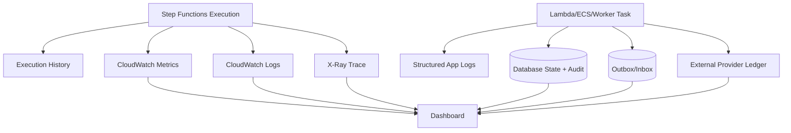
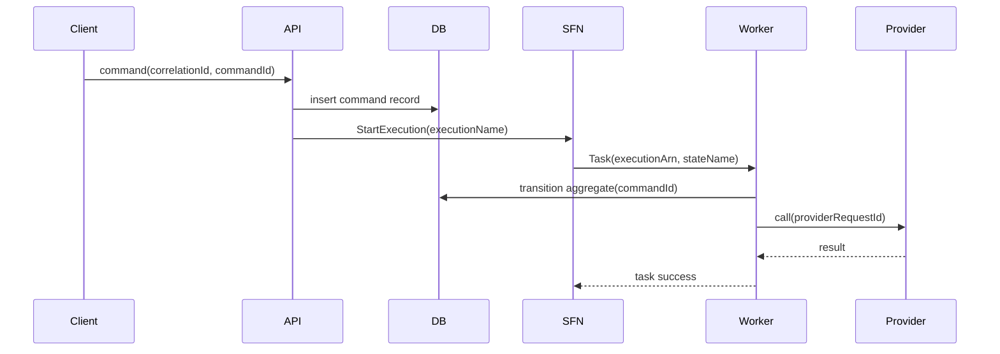

# Part 048 — Workflow Observability and Cost

> Workflow yang tidak bisa dijelaskan saat gagal belum production-ready. Workflow yang tidak bisa dihitung biayanya belum siap scale.

Part ini membahas **observability, execution history, debugging, cost model, redrive, dan production review** untuk AWS Step Functions, terutama ketika workflow mengorkestrasi application dan database.

Kita akan membahas:

1. mental model observability workflow;
2. execution history Standard vs Express;
3. CloudWatch Logs, metrics, alarms;
4. X-Ray tracing;
5. structured logging dan correlation;
6. debugging workflow database;
7. cost model Standard vs Express;
8. cost traps;
9. version/alias deployment observability;
10. redrive dan replay discipline;
11. production dashboard dan checklist.

---

## 1. Observability Workflow: Bukan Sekadar “Ada Log”

Workflow observability harus menjawab pertanyaan:

```txt
Apa yang sedang terjadi?
Apa yang sudah terjadi?
Step mana yang gagal?
Kenapa gagal?
Apakah aman di-retry?
Apa dampaknya ke domain state?
Berapa biaya eksekusinya?
Apakah ada anomali yang butuh reconciliation?
```

Step Functions memberi control-plane visibility. Tetapi untuk application/database workflow, visibility lengkap butuh gabungan:

| Layer | Signal |
|---|---|
| Step Functions | execution status, state transitions, retries, duration, failed state |
| Application task | structured logs, business error, idempotency result |
| Database | transition record, lock wait, query latency, command status, outbox status |
| Messaging/Event | delivery failure, DLQ, replay, target failure |
| External provider | request id, provider reference, callback status |
| Cost | state transitions, execution count, duration, log volume |

Diagram:



Observability bukan tujuan kosmetik. Observability adalah prasyarat untuk operasi aman.

---

## 2. Execution History: Apa yang Disimpan Step Functions

Execution history adalah narasi control plane:

```txt
ExecutionStarted
TaskStateEntered
TaskScheduled
TaskStarted
TaskSucceeded
ChoiceStateEntered
ExecutionSucceeded
```

Untuk Standard Workflows, execution history bisa diinspeksi melalui console/API. Untuk Express Workflows, debugging bergantung pada CloudWatch Logs karena `GetExecutionHistory` tidak tersedia untuk Express.

Hal yang harus dipahami:

| Concern | Standard Workflow | Express Workflow |
|---|---|---|
| Long-running audit | kuat | tidak cocok untuk audit panjang |
| Console visual debug | tersedia | terbatas/berbasis logs |
| Execution history API | tersedia | tidak tersedia seperti Standard |
| CloudWatch Logs | optional, tidak default via API/CLI/CloudFormation | penting, console dapat mengaktifkan default |
| Guaranteed workflow history | lebih kuat | CloudWatch Logs best-effort |
| Cost model | state transitions | request + duration + memory |

Execution history bukan domain audit log. Jika regulatory audit butuh bukti bisnis, simpan audit domain di database.

Contoh audit domain:

```sql
create table case_audit_log (
  audit_id uuid primary key,
  case_id text not null,
  transition text not null,
  from_status text,
  to_status text,
  actor_type text not null,
  actor_id text,
  workflow_execution_id text,
  workflow_state_name text,
  reason text,
  occurred_at timestamptz not null
);
```

Step Functions history menjawab:

```txt
Workflow melewati state apa?
```

Audit domain menjawab:

```txt
Mengapa status case berubah, oleh siapa, dan berdasarkan aturan apa?
```

---

## 3. Execution History Limits and Design Impact

Workflow panjang dengan loop/polling bisa menghasilkan banyak event history.

Contoh polling loop:

```txt
Wait 30 seconds
CheckJobStatus
Choice not completed
Wait 30 seconds
CheckJobStatus
...
```

Setiap iterasi menambah events. Jika workflow menunggu berjam-jam atau berhari-hari dengan polling pendek, history dapat membengkak.

Better patterns:

| Problem | Better design |
|---|---|
| waiting for worker job | callback token |
| waiting for human approval | callback token + approval row |
| chunk processing too many items | Distributed Map with bounded concurrency and child workflows |
| repeated status check | event/callback or coarser polling interval |
| large payload passing | pass identifiers/S3 references |

Rule:

```txt
If a workflow waits for something external, prefer callback/event completion over tight polling.
```

Polling bukan salah. Polling pendek tanpa cost/history budget adalah salah.

---

## 4. CloudWatch Logs: Use Them, But Understand Guarantees

CloudWatch Logs untuk Step Functions berguna untuk:

1. execution trace;
2. state input/output debugging;
3. Express workflow visibility;
4. CloudWatch Logs Insights queries;
5. central incident investigation.

Tetapi ada batasan:

1. log delivery bersifat best-effort;
2. completeness/timeliness tidak selalu dijamin;
3. payload input/output bisa terpotong jika terlalu besar;
4. sensitive data dapat bocor jika input/output logging tidak dikontrol;
5. Express logging menambah biaya CloudWatch Logs.

Logging level harus dipilih berdasarkan environment dan sensitivity.

Contoh policy:

| Environment | Logging |
|---|---|
| dev | full execution data boleh, dengan dummy data |
| staging | selected execution data, redaction enabled |
| production low-risk | errors + metadata |
| production sensitive/regulatory | metadata only, domain audit in DB |

Jangan jadikan CloudWatch Logs sebagai primary domain audit store.

---

## 5. Structured Logging Contract

Setiap task yang dipanggil workflow harus log dengan struktur konsisten.

Minimal fields:

```json
{
  "timestamp": "2026-07-06T10:00:00Z",
  "level": "INFO",
  "message": "workflow task completed",
  "service": "case-service",
  "environment": "prod",
  "tenantId": "agency-a",
  "correlationId": "corr-abc",
  "workflowName": "CaseActivation",
  "workflowVersion": "v3",
  "executionArn": "arn:aws:states:...",
  "executionName": "CaseActivation-agency-a-case-123-cmd-456",
  "stateName": "ReserveCaseNumber",
  "taskAttempt": 1,
  "aggregateType": "Case",
  "aggregateId": "CASE-123",
  "commandId": "cmd-456",
  "idempotencyKey": "exec:state:case",
  "fromStatus": "DRAFT",
  "toStatus": "NUMBER_RESERVED",
  "durationMs": 82,
  "outcome": "SUCCESS"
}
```

Error log:

```json
{
  "level": "ERROR",
  "message": "workflow task failed",
  "errorType": "TransientDatabaseError",
  "retryable": true,
  "safeToRetry": true,
  "workflowName": "CaseActivation",
  "stateName": "ReserveCaseNumber",
  "caseId": "CASE-123",
  "commandId": "cmd-456",
  "correlationId": "corr-abc",
  "dbErrorCode": "deadlock_detected"
}
```

Fields `retryable` dan `safeToRetry` berbeda.

| Field | Makna |
|---|---|
| retryable | secara teknis bisa dicoba lagi |
| safeToRetry | tidak merusak correctness jika dicoba lagi |

Contoh: timeout setelah provider call mungkin retryable secara HTTP, tetapi belum tentu safe jika provider tidak idempotent.

---

## 6. Correlation and Causation

Workflow harus bisa ditelusuri lintas API, database, event, queue, dan external provider.

Gunakan beberapa identifier:

| ID | Fungsi |
|---|---|
| `correlationId` | mengikat satu user/business request end-to-end |
| `causationId` | event/command yang menyebabkan operasi ini |
| `commandId` | idempotency command dari caller |
| `executionArn` | Step Functions execution |
| `executionName` | human-readable deterministic workflow instance |
| `stateName` | task/step yang berjalan |
| `aggregateId` | domain entity |
| `providerRequestId` | call ke external provider |

Flow:



Tanpa correlation, debugging berubah menjadi grep acak.

---

## 7. Metrics: Control Plane and Business Plane

Step Functions metrics penting:

| Metric group | Pertanyaan |
|---|---|
| executions started/succeeded/failed/timed out | apakah workflow sehat? |
| execution duration | apakah workflow melambat? |
| activity/task failures | step mana bermasalah? |
| throttling | apakah ada service quota pressure? |
| redriven executions | apakah incident recovery meningkat? |

Application/database metrics penting:

| Metric | Pertanyaan |
|---|---|
| invalid transition count | apakah workflow dan domain state mismatch? |
| idempotency duplicate count | apakah retry/client duplicate meningkat? |
| command in-progress age | apakah command stuck? |
| outbox pending age | apakah publish stuck? |
| callback wait age | apakah approval/job stuck? |
| reservation expiry count | apakah process terlalu lambat? |
| compensation count | apakah downstream sering gagal? |
| reconciliation repair count | apakah hidden inconsistency naik? |

Dashboard harus menggabungkan keduanya.

Jika hanya melihat Step Functions `ExecutionsFailed`, kita tahu workflow gagal. Kita belum tahu apakah case sudah berubah, provider sudah dipanggil, atau outbox sudah publish.

---

## 8. Alarm Design

Alarm buruk:

```txt
Any failed execution > 0 => wake everyone
```

Itu bisa valid untuk workflow kritis kecil, tetapi sering menciptakan alert fatigue.

Alarm lebih baik:

| Alarm | Signal | Severity |
|---|---|---|
| workflow failure rate above baseline | failed / started | high |
| timed out executions > 0 for critical workflow | timeout | high |
| callback wait age near SLA | max wait age | medium/high |
| DLQ messages for workflow target | DLQ visible | high |
| outbox pending age > threshold | oldest pending | high |
| compensation spike | compensation rate | medium |
| invalid transition > 0 | correctness invariant | high |
| execution duration p95 above SLO | latency | medium |
| state transition volume anomaly | cost/routing bug | medium |
| CloudWatch log ingestion spike | cost/loop bug | medium |

Alarm harus punya runbook link.

```txt
Alert without runbook = anxiety, not operability.
```

---

## 9. X-Ray Tracing

X-Ray membantu melihat request path dan latency lintas service yang terintegrasi.

Gunakan tracing untuk:

1. melihat latency task per service;
2. menemukan downstream bottleneck;
3. menghubungkan API request ke workflow execution;
4. mengidentifikasi retries dan error path;
5. membedakan delay orchestration vs delay task.

Namun trace tidak menggantikan domain audit.

Trace menjawab:

```txt
Service mana yang lambat?
```

Domain audit menjawab:

```txt
Kenapa case berubah status?
```

Execution history menjawab:

```txt
Step mana yang dijalankan workflow?
```

Ketiganya diperlukan.

---

## 10. Debugging a Failed Database Workflow

Saat workflow gagal, jangan langsung retry/redrive.

Gunakan urutan investigasi:

```txt
1. Identify executionArn and failed state.
2. Read execution input, failed state input, error, cause.
3. Inspect task logs by correlationId/executionArn/stateName.
4. Inspect domain aggregate current status/version.
5. Inspect command/idempotency record for failed state.
6. Inspect outbox/inbox records.
7. Inspect external side-effect ledger.
8. Determine if failure happened before or after commit.
9. Choose retry, redrive, compensation, manual repair, or no-op.
10. Record operational decision.
```

Decision table:

| Observed state | Likely outcome | Action |
|---|---|---|
| command record absent | task likely failed before DB mutation | retry/redrive likely safe |
| command in-progress old | task crashed mid-flight | inspect DB, then mark failed/retry |
| command completed, workflow failed | response lost after commit | return cached result or repair workflow |
| domain transitioned, outbox pending | DB commit success, publish pending | restart outbox publisher |
| provider reference exists, DB unknown | external side effect succeeded | reconcile before retry |
| invalid transition | workflow/domain mismatch | stop and investigate |

Production runbook harus menghindari “just rerun”.

---

## 11. Redrive Discipline

Redrive adalah alat pemulihan. Ia bukan mesin waktu.

Sebelum redrive:

1. pastikan state yang akan dieksekusi ulang idempotent;
2. pastikan external side effect aman;
3. pastikan input masih valid;
4. pastikan domain state masih cocok dengan expected transition;
5. pastikan workflow version yang dipakai dipahami;
6. catat operator dan alasan.

Redrive checklist:

```txt
[ ] failed state identified
[ ] domain aggregate inspected
[ ] idempotency record inspected
[ ] external ledger inspected
[ ] outbox/inbox inspected
[ ] current workflow version understood
[ ] safe-to-redrive decision recorded
[ ] rollback/compensation path known
```

Jika workflow memanggil payment provider, notice delivery, document issuance, atau regulatory action, redrive tanpa ledger bisa membuat aksi ganda.

---

## 12. Version and Alias Observability

Step Functions versions dan aliases membuat deployment lebih aman, tetapi observability harus memasukkan version.

Log field:

```json
{
  "workflowName": "CaseActivation",
  "workflowAlias": "PROD",
  "workflowVersion": "17",
  "executionArn": "arn:aws:states:...",
  "stateName": "ValidateJurisdiction"
}
```

Metric dimension:

```txt
workflowName
alias
version
stateName
tenantId if safe/cardinality controlled
```

Kenapa penting?

| Scenario | Tanpa version visibility | Dengan version visibility |
|---|---|---|
| canary release gagal | terlihat random failures | failure terkonsentrasi di v18 |
| old execution redriven | bingung definisi mana | tahu redrive memakai version lama |
| alias shift | tidak tahu traffic split | bisa bandingkan v17 vs v18 |
| rollback | metric tetap noisy | validasi rollback jelas |

Deployment workflow sama pentingnya dengan deployment service code.

---

## 13. Cost Model: Standard Workflows

Standard Workflows dikenakan biaya berdasarkan **state transitions**. Setiap step yang dieksekusi dihitung, termasuk retry.

Formula mental:

```txt
monthly_standard_cost ~= executions_per_month
                         * average_state_transitions_per_execution
                         * price_per_transition
```

Secara engineering, yang penting bukan angka harga spesifiknya, tetapi driver-nya:

| Driver | Dampak |
|---|---|
| banyak states kecil | transition count naik |
| polling loop | transition count naik cepat |
| retry tinggi | transition count naik |
| Map/Parallel besar | transition count berlipat |
| high-volume event trigger | executions naik |
| verbose failure path | transition count failure path naik |

Contoh estimasi:

```txt
100,000 executions/month
20 transitions happy path
5% executions retry average +4 transitions

base transitions = 100,000 * 20 = 2,000,000
retry transitions = 5,000 * 4 = 20,000
total = 2,020,000 transitions/month
```

Cost review harus dilakukan sebelum workflow dihubungkan ke high-volume event source.

---

## 14. Cost Model: Express Workflows

Express Workflows dikenakan biaya berdasarkan:

1. jumlah request/execution;
2. durasi execution;
3. memory consumption;
4. CloudWatch Logs jika logging diaktifkan.

Formula mental:

```txt
monthly_express_cost ~= request_count_cost
                       + duration_memory_cost
                       + log_ingestion_cost
```

Express cocok untuk high-volume, short-duration, idempotent workflows. Tetapi untuk workflow yang butuh audit kuat, durasi panjang, human wait, dan per-step inspection, Standard sering lebih sesuai.

Decision cost bukan hanya murah/mahal.

| Requirement | Bias |
|---|---|
| long-running up to days/months | Standard |
| detailed execution history | Standard |
| high-volume short orchestration | Express |
| synchronous API composition | Express or direct app logic |
| human approval | Standard |
| regulatory audit workflow | Standard + DB audit |
| event enrichment high throughput | Express |

---

## 15. Cost Trap: Polling Loop

Polling loop tampak sederhana tapi mahal pada Standard Workflow.

Example:

```txt
Wait 10 seconds
Check status
Repeat for 6 hours
```

Iterations:

```txt
6 hours * 60 minutes * 6 iterations/minute = 2160 iterations
```

Jika setiap iteration punya:

```txt
Wait -> Task -> Choice = roughly 3 transitions
```

Maka:

```txt
2160 * 3 = 6480 transitions for one waiting workflow
```

Untuk 10,000 workflows/month:

```txt
64,800,000 transitions just to wait
```

Callback token jauh lebih efisien dan lebih bersih secara observability.

---

## 16. Cost Trap: Over-Orchestration

Step Functions bagus untuk explicit orchestration. Tetapi tidak semua function call perlu menjadi state.

Buruk:

```txt
NormalizeString
ValidateEmailFormat
TrimWhitespace
ParseDate
CheckRequiredFields
MapDto
CallDatabase
```

Lebih baik:

```txt
ValidateCommand
PersistCommand
```

Heuristic:

```txt
A state deserves to exist when it has different retry policy, timeout, owner, observability need, or business meaning.
```

Jika step hanya detail implementation internal tanpa failure policy berbeda, simpan di code.

---

## 17. Cost Trap: Logging Full Payload

Full input/output logging bisa mahal dan berisiko.

Masalah:

1. CloudWatch Logs ingestion cost naik;
2. sensitive data terekspos;
3. logs sulit dicari;
4. payload bisa terpotong;
5. debugging menjadi noisy.

Better:

```json
{
  "caseId": "CASE-123",
  "commandId": "cmd-456",
  "stateName": "ValidateJurisdiction",
  "outcome": "REJECTED",
  "reasonCode": "OUT_OF_JURISDICTION"
}
```

Full detail domain tetap di database/audit table dengan access control dan retention policy yang tepat.

---

## 18. Cost Trap: Fanout Execution Storm

EventBridge rule bisa memulai Step Functions execution untuk setiap event.

Jika event source noisy:

```txt
EntityUpdated event emitted for every field update
EventBridge rule starts workflow for every update
Workflow does several DB reads and transitions
```

Biaya dan load database naik.

Mitigation:

1. filter event pattern ketat;
2. gunakan event type semantik, bukan generic `EntityUpdated`;
3. debounce/coalesce jika perlu;
4. route high-volume simple transformations ke Express atau Lambda langsung;
5. gunakan SQS buffer untuk backpressure;
6. tambahkan metric executions per event type.

Workflow harus dipicu oleh event yang bermakna, bukan noise persistence.

---

## 19. Cost-Aware State Design

State boundary sebaiknya ditentukan oleh:

| Criterion | State terpisah? |
|---|---|
| retry policy berbeda | yes |
| timeout berbeda | yes |
| owner/service berbeda | yes |
| compensation berbeda | yes |
| audit milestone | yes |
| security boundary berbeda | yes |
| hanya helper function | no |
| hanya mapping object | no |
| hanya validation trivial | maybe not |

Contoh sehat:

```txt
ValidateCommand
ReserveInventory
AuthorizePayment
WaitForApproval
GenerateDocument
SendNotice
MarkActive
```

Contoh terlalu granular:

```txt
ValidateFieldA
ValidateFieldB
ValidateFieldC
ConvertDate
BuildSqlParams
ExecuteSql
MapSqlResult
```

Cost-aware bukan berarti mengorbankan clarity. Artinya state punya alasan operasional.

---

## 20. Dashboard Template

Minimal dashboard untuk workflow production:

```txt
Panel 1: Executions started/succeeded/failed/timed out by workflow/version
Panel 2: Failure rate and top failed states
Panel 3: Execution duration p50/p95/p99
Panel 4: State retry count by error type
Panel 5: Callback wait age p95/max
Panel 6: Outbox pending age and count
Panel 7: DLQ depth for workflow-related queues
Panel 8: Invalid domain transition count
Panel 9: Compensation count by workflow
Panel 10: State transition volume/cost proxy
Panel 11: CloudWatch log ingestion volume
Panel 12: Reconciliation anomalies and repairs
```

Dashboard harus punya link ke:

1. Step Functions execution search;
2. CloudWatch Logs query;
3. X-Ray traces;
4. database admin/performance dashboard;
5. runbook;
6. deployment/version page.

---

## 21. CloudWatch Logs Insights Queries

Contoh query failed task logs:

```sql
fields @timestamp, workflowName, workflowVersion, executionName, stateName, errorType, message
| filter workflowName = "CaseActivation"
| filter outcome = "FAILED"
| sort @timestamp desc
| limit 50
```

Query invalid transition:

```sql
fields @timestamp, aggregateId, fromStatus, attemptedTransition, executionName, stateName
| filter errorType = "InvalidTransition"
| sort @timestamp desc
| limit 100
```

Query idempotency duplicates:

```sql
fields @timestamp, workflowName, stateName, idempotencyKey, duplicateOutcome
| filter eventType = "IdempotencyDuplicate"
| stats count() by workflowName, stateName, duplicateOutcome
```

Query expensive polling symptoms:

```sql
fields @timestamp, workflowName, executionName, stateName
| filter stateName like /Check.*Status|Wait.*/
| stats count() as events by workflowName, executionName
| sort events desc
| limit 20
```

Logging contract menentukan kualitas query. Jika log tidak punya `stateName`, query menjadi lemah.

---

## 22. Database Queries for Workflow Debugging

Contoh command state:

```sql
select command_id,
       execution_id,
       state_name,
       aggregate_id,
       status,
       created_at,
       completed_at,
       failed_at,
       result
from workflow_commands
where execution_id = :execution_id
order by created_at;
```

Outbox age:

```sql
select count(*) as pending_count,
       min(created_at) as oldest_pending_at,
       now() - min(created_at) as oldest_age
from outbox_messages
where publish_status = 'PENDING';
```

Stuck callback job:

```sql
select job_id,
       case_id,
       status,
       lease_owner,
       lease_until,
       created_at,
       now() - created_at as age
from duplicate_detection_jobs
where status in ('PENDING', 'RUNNING')
order by created_at asc
limit 100;
```

Invalid domain/workflow mismatch:

```sql
select c.case_id,
       c.status,
       ws.execution_id,
       ws.current_state,
       ws.updated_at
from cases c
join workflow_shadow_status ws on ws.case_id = c.case_id
where ws.current_state = 'WaitForApproval'
  and c.status not in ('NEEDS_APPROVAL', 'APPROVED', 'REJECTED');
```

Database observability harus dirancang, bukan diimprovisasi saat incident.

---

## 23. Workflow Shadow Status

Untuk workflow penting, simpan shadow status di database.

```sql
create table workflow_instances (
  execution_id text primary key,
  execution_name text not null unique,
  workflow_name text not null,
  workflow_version text not null,
  aggregate_type text not null,
  aggregate_id text not null,
  status text not null,
  current_state text,
  started_at timestamptz not null,
  updated_at timestamptz not null,
  completed_at timestamptz,
  failed_at timestamptz
);
```

Update shadow status dari task callbacks atau periodic sync.

Manfaat:

1. operational search cepat;
2. business UI bisa menampilkan progress;
3. reconciliation lebih mudah;
4. reporting tidak perlu query Step Functions API terus-menerus;
5. audit defensibility meningkat.

Batasan:

```txt
Shadow status is a projection, not the Step Functions source of control.
```

Jika shadow stale, reconciliation harus memperbaiki.

---

## 24. Sensitive Data and Compliance

Workflow sering membawa data sensitif:

1. PII;
2. enforcement evidence;
3. payment data;
4. legal/regulatory notes;
5. internal decision reasoning.

Prinsip:

```txt
Do not pass what you do not need.
Do not log what you cannot safely retain.
Do not expose what you cannot audit.
```

Checklist:

```txt
[ ] execution input contains only identifiers and minimum context
[ ] sensitive payload stored in database/S3 with proper access control
[ ] CloudWatch Logs retention configured
[ ] logging level excludes full payload in production
[ ] error cause does not leak secrets/PII
[ ] task token is not logged
[ ] callback URL/token never appears in user-visible logs
[ ] audit log has proper immutable retention policy
```

Task token harus diperlakukan sebagai credential sementara. Jangan log task token mentah.

---

## 25. SLO for Workflow

Workflow butuh SLO berbeda dari API.

API SLO:

```txt
POST /cases returns accepted within 300ms p95
```

Workflow SLO:

```txt
95% of CaseActivation workflows reach ACTIVE within 5 minutes excluding human approval.
99% of approval callbacks resume workflow within 30 seconds.
No accepted command remains without workflow execution for more than 2 minutes.
Outbox oldest pending age under 60 seconds.
```

SLO harus mengecualikan atau memisahkan human wait.

Buruk:

```txt
CaseActivation p95 < 5 minutes
```

Padahal ada approval manusia yang bisa butuh hari.

Lebih baik:

```txt
Machine processing time p95 < 5 minutes.
Human approval wait tracked separately.
Post-approval resume p95 < 30 seconds.
```

---

## 26. Cost SLO / Budget Guardrail

Selain latency/error SLO, buat cost guardrail.

Contoh:

```txt
Expected CaseActivation volume: 100k/month
Expected avg transitions: 18
Expected transition budget: 1.8M/month
Alert at: 2.5M/month or +30% week-over-week
```

Cost anomaly signals:

| Signal | Possible cause |
|---|---|
| executions spike | noisy event rule, retry storm, duplicate API commands |
| transitions per execution spike | polling loop, failure retry, definition change |
| logs ingestion spike | payload logging, Express workflow volume |
| duration spike | downstream slowness, callback stuck |
| retries spike | dependency instability |

Cost observability harus ada sebelum traffic besar, bukan setelah tagihan naik.

---

## 27. Testing Observability

Observability harus diuji.

Test cases:

```txt
[ ] task fails before DB commit -> logs identify pre-commit failure
[ ] task fails after DB commit -> duplicate retry returns cached result
[ ] external provider timeout -> ledger shows UNKNOWN
[ ] callback job completes but callback fails -> reconciliation detects stuck workflow
[ ] workflow times out -> alarm fires and runbook explains expiry
[ ] outbox publisher stopped -> outbox age alarm fires
[ ] event source duplicate -> idempotency duplicate metric increments
[ ] workflow redrive -> version and operator action recorded
[ ] PII appears in fake payload -> log redaction test catches it
[ ] polling loop accidental change -> transition volume alarm catches it
```

Jika observability hanya dites saat incident, ia terlalu terlambat.

---

## 28. Incident Runbook Template

Template runbook:

```md
# Workflow Incident Runbook: <WorkflowName>

## Severity Criteria
- SEV1:
- SEV2:
- SEV3:

## First 5 Minutes
1. Identify affected workflow/version.
2. Check execution failure rate.
3. Check top failed states.
4. Check domain invariant alarms.
5. Check DLQ/outbox/callback age.

## Debug Queries
- CloudWatch Logs Insights:
- Database command query:
- Outbox query:
- External ledger query:

## Safe Actions
- Retry task:
- Redrive execution:
- Requeue message:
- Release reservation:
- Pause event rule:

## Unsafe Actions
- Do not redrive SendPayment without ledger inspection.
- Do not delete command rows.
- Do not manually set case ACTIVE without audit entry.

## Escalation
- Workflow owner:
- Domain owner:
- Database owner:
- Security/compliance:

## Post-Incident
- Reconciliation required:
- Customer/regulatory notification required:
- Cost impact review:
```

Runbook harus spesifik per workflow, bukan generic Step Functions documentation link.

---

## 29. Production Readiness Review for Workflow Module

Sebelum Module 06 dianggap selesai, pastikan:

```txt
[ ] Workflow type chosen intentionally: Standard vs Express.
[ ] Execution input/output contract documented.
[ ] Each state has owner, timeout, retry, and error policy.
[ ] Every mutating state is idempotent.
[ ] Domain audit is stored outside Step Functions history.
[ ] CloudWatch Logs configured with safe payload policy.
[ ] X-Ray/tracing decision documented.
[ ] Dashboard exists.
[ ] Alarms exist with runbooks.
[ ] Cost estimate exists for expected and worst-case volume.
[ ] Polling loops reviewed.
[ ] Callback token handling is secure.
[ ] Redrive policy documented.
[ ] Version/alias deployment strategy defined.
[ ] Reconciliation jobs cover ambiguous states.
[ ] Operators can answer: safe to retry or not?
```

---

## 30. Engineering Heuristic

A workflow is production-grade when an on-call engineer can answer these questions in under five minutes:

```txt
Which execution failed?
Which state failed?
Did the database commit happen?
Was an external side effect sent?
Is retry safe?
What domain entities are affected?
What is the current cost/volume anomaly?
What runbook action is allowed?
```

Jika jawabannya butuh membaca source code dari nol, workflow belum operable.

---

## 31. Module 06 Closure

Module 06 membangun Step Functions sebagai durable orchestration layer:

| Part | Core idea |
|---|---|
| Part 041 | Step Functions sebagai durable control plane |
| Part 042 | Standard vs Express trade-off |
| Part 043 | Amazon States Language in action |
| Part 044 | Retry, catch, timeout, dan compensation |
| Part 045 | Service integration patterns |
| Part 046 | Saga orchestration |
| Part 047 | Database-safe workflow |
| Part 048 | Observability, cost, redrive, debugging |

Mental model akhir:

```txt
Step Functions controls process.
Database owns truth.
Messages/events move facts.
Logs/metrics/traces explain behavior.
Runbooks make recovery repeatable.
Cost model keeps design honest.
```

---

## 32. References

- AWS Step Functions Developer Guide — What is Step Functions: https://docs.aws.amazon.com/step-functions/latest/dg/welcome.html
- AWS Step Functions — CloudWatch Logs execution history: https://docs.aws.amazon.com/step-functions/latest/dg/cw-logs.html
- AWS Step Functions — Logging and monitoring: https://docs.aws.amazon.com/step-functions/latest/dg/monitoring-logging.html
- AWS Step Functions — X-Ray tracing: https://docs.aws.amazon.com/step-functions/latest/dg/concepts-xray-tracing.html
- AWS Step Functions — Service quotas: https://docs.aws.amazon.com/step-functions/latest/dg/service-quotas.html
- AWS General Reference — Step Functions endpoints and quotas: https://docs.aws.amazon.com/general/latest/gr/step-functions.html
- AWS Step Functions — Redrive executions: https://docs.aws.amazon.com/step-functions/latest/dg/redrive-executions.html
- AWS Step Functions — Versions and aliases: https://docs.aws.amazon.com/step-functions/latest/dg/concepts-cd-aliasing-versioning.html
- AWS Step Functions Pricing: https://aws.amazon.com/step-functions/pricing/
- AWS Step Functions — Choosing workflow type: https://docs.aws.amazon.com/step-functions/latest/dg/choosing-workflow-type.html
