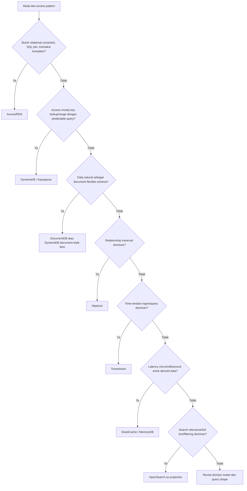
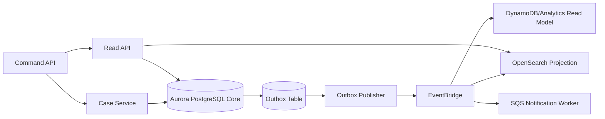

# Part 049 — Database Selection Framework

> Database yang tepat bukan database yang paling powerful. Database yang tepat adalah database yang membuat invariant sistem paling mudah dipertahankan di bawah load, failure, perubahan schema, dan operasi harian.

Part ini membuka **Module 07 — Database Selection and Data Modeling on AWS**.

Di level engineer biasa, pemilihan database sering berbunyi seperti ini:

```txt
Kita pakai PostgreSQL karena familiar.
Kita pakai DynamoDB karena scale.
Kita pakai Redis karena cepat.
Kita pakai graph karena relasi kompleks.
```

Di level production architecture, pertanyaannya berubah:

```txt
Apa access pattern yang harus dijamin?
Apa consistency invariant yang tidak boleh rusak?
Apa latency budget query dan write path?
Apa query shape yang dominan?
Apa mutation pattern-nya?
Apa failure mode yang masih bisa diterima?
Apa blast radius jika database ini salah dipilih?
Seberapa reversible keputusan ini setelah data tumbuh 100x?
```

AWS menyediakan banyak database purpose-built: relational, key-value, document, in-memory, graph, time-series, wide-column, distributed SQL, search projection, dan migration tooling. Itu bukan undangan untuk memakai semuanya. Itu berarti **pemilihan database adalah keputusan model sistem**, bukan keputusan katalog service.

Referensi utama:

- AWS Well-Architected menekankan purpose-built data store berdasarkan data type, access pattern, throughput, frequency of access, update pattern, availability, dan durability constraint.
- AWS database decision guide membedakan relational dan non-relational database berdasarkan model data, scale, latency, consistency, dan access model.
- DynamoDB guidance menekankan bahwa access pattern harus diidentifikasi sebelum table/key design.

---

## 1. Core Mental Model

Database bukan hanya tempat menyimpan data. Database adalah kombinasi dari:

| Dimensi | Pertanyaan |
|---|---|
| Storage model | Data direpresentasikan sebagai row, item, document, edge, time-series point, key-value, index? |
| Query model | Aplikasi membaca dengan lookup, range, join, traversal, aggregation, search, time-window? |
| Mutation model | Data berubah sebagai append, overwrite, transaction, conditional update, counter, event projection? |
| Consistency model | Read harus melihat write terbaru, atau eventual consistency cukup? |
| Scaling model | Scale by vertical instance, read replica, partition key, shard, serverless capacity, active-active region? |
| Failure model | Apa yang terjadi saat node, AZ, Region, network, replica, atau partition gagal? |
| Operational model | Siapa yang backup, restore, tune, patch, observe, scale, failover, migrate? |
| Cost model | Biaya berdasarkan instance, storage, I/O, request units, memory, replication, log, backup? |

Mental model sederhananya:

```txt
Database choice = Query shape + Consistency invariant + Mutation frequency + Scale axis + Operational tolerance
```

Jika satu dari lima komponen itu kabur, keputusan database akan tampak benar di awal tetapi menjadi utang arsitektur setelah sistem scale.

---

## 2. Decision Tree Tingkat Tinggi

Gunakan decision tree ini sebagai filter awal, bukan jawaban final.



Beberapa catatan penting:

1. **Relational bukan anti-scale.** Aurora/RDS sering menjadi pilihan paling defensible untuk complex transactional domain.
2. **DynamoDB bukan sekadar “NoSQL cepat”.** DynamoDB sangat kuat ketika access pattern bisa didesain eksplisit dan key distribution sehat.
3. **Cache bukan database utama kecuali memang didesain durable.** ElastiCache mempercepat derived/read data; MemoryDB bisa menjadi durable in-memory store untuk use case tertentu.
4. **OpenSearch bukan source of truth.** Ia biasanya projection untuk search/query, bukan authority state.
5. **Graph database hanya masuk akal jika traversal relationship adalah operasi inti, bukan sekadar karena ada relasi antar entitas.**

---

## 3. Mulai dari Access Pattern, Bukan Entity Diagram

Kesalahan umum engineer yang berasal dari SQL-first background:

```txt
User punya Order.
Order punya Item.
Item punya Product.
Mari gambar ERD.
```

Itu belum salah. Tapi untuk database selection, ERD saja tidak cukup. Yang perlu ditanyakan:

```txt
Query apa yang paling sering?
Query mana yang latency-sensitive?
Query mana yang boleh stale?
Query mana yang hanya admin/backoffice?
Write mana yang harus transactional?
Read mana yang bisa di-project?
Apa cardinality dan growth path-nya?
```

Contoh domain enforcement/case management:

| Kebutuhan | Access Pattern | Kandidat |
|---|---|---|
| Create case dengan invariant legal status | transactional write, constraint, audit | Aurora PostgreSQL/RDS |
| Ambil case by ID | point lookup | Aurora/DynamoDB |
| List case by officer + status + due date | indexed query/range | Aurora index atau DynamoDB GSI |
| Timeline event case | append/read by case ID/time | Aurora table, DynamoDB item collection, OpenSearch projection |
| Search across case narrative | full-text search | OpenSearch projection |
| Escalation due soon | time-window scan/query | Aurora index, DynamoDB GSI, EventBridge Scheduler, Timestream if metric-like |
| Fraud relationship graph | traversal relationship | Neptune |
| Dashboard aggregate | projection/materialized view | Aurora read model, OpenSearch, DynamoDB projection, analytics store |

**Rule:** Jika access pattern tidak bisa ditulis sebagai daftar eksplisit, database belum boleh dipilih.

---

## 4. Access Pattern Template

Sebelum memilih service, tulis access pattern seperti ini:

```txt
AP-001: Create enforcement case
Actor: intake-service
Operation: write
Input: tenantId, caseType, subjectId, sourceRef
Read before write: subject exists, duplicate case check, policy active
Write: case, case_status_history, audit_record, outbox_event
Consistency: strong, atomic within case aggregate
Latency target: p95 < 300 ms
Frequency: 20 rps average, 300 rps peak
Growth: 5 years retention, 100M cases
Failure behavior: duplicate create must not happen; ambiguous commit must be resolvable
Candidate: Aurora PostgreSQL with unique constraint + transaction + outbox
```

Template penuh:

| Field | Isi |
|---|---|
| ID | `AP-xxx` |
| Name | Nama operasi, bukan nama table |
| Actor | Service/persona yang melakukan operasi |
| Type | read/write/read-write/stream/projection/admin |
| Input key | Field yang diketahui sebelum query |
| Output | Data yang harus dikembalikan |
| Cardinality | 1, bounded many, unbounded many |
| Sort/filter | Field sort/filter yang wajib |
| Consistency | strong/eventual/session/monotonic |
| Latency | p50/p95/p99 target |
| Throughput | average/peak/burst |
| Mutation | insert/update/delete/append/conditional |
| Transaction boundary | satu item, satu aggregate, multi aggregate, cross service |
| Retention | TTL, archive, legal hold |
| Failure tolerance | duplicate, stale read, partial result, retry |
| Candidate store | service kandidat |
| Reversibility | mudah/sedang/sulit |

---

## 5. Query Shape Lebih Penting dari Nama Database

Database berbeda kuat di query shape berbeda.

| Query Shape | Karakteristik | Cocok |
|---|---|---|
| Point lookup | `get by primary key` | DynamoDB, Aurora/RDS, ElastiCache |
| Bounded range | `by partition + sort range` | DynamoDB, Keyspaces, Aurora index |
| Relational join | query lintas table dengan constraint | Aurora/RDS |
| Ad-hoc SQL | filter/sort dinamis | Aurora/RDS, OpenSearch projection untuk search-like |
| Full-text search | relevance, tokenization, fuzzy | OpenSearch |
| Graph traversal | path, neighbor, relationship depth | Neptune |
| Time-window ingest/query | metric/event time range | Timestream, DynamoDB time-bucket, Aurora partition |
| Document retrieval | nested flexible document | DocumentDB, DynamoDB, Aurora JSONB depending need |
| Ultra-low-latency cached read | derived data, session, token bucket | ElastiCache/MemoryDB |

Hal yang sering menjebak:

- Query **ad-hoc** dipaksakan ke DynamoDB → lahir banyak GSI, scan, dan backfill mahal.
- Query **relational** dipaksakan ke document store → consistency pindah ke application code.
- Query **search** dipaksakan ke SQL `LIKE` → lambat, buruk untuk relevance.
- Query **transactional** dipindah ke cache → correctness hilang.
- Query **graph traversal** dikerjakan dengan recursive app calls → latency dan complexity meledak.

---

## 6. Consistency Invariant

Database selection harus dimulai dari invariant yang tidak boleh rusak.

Contoh invariant:

```txt
Satu complaint tidak boleh menghasilkan dua active enforcement case untuk subject yang sama.
Case status transition harus mengikuti state machine legal.
Payment must not be captured twice.
Penalty notice cannot be issued before approval.
A revoked license must not be treated as active after revocation commit.
```

Map invariant ke database capability:

| Invariant | Capability yang Dibutuhkan |
|---|---|
| uniqueness | unique constraint, conditional write, idempotency table |
| legal state transition | transaction + check, conditional update, stored transition log |
| cross-row atomicity | SQL transaction, DynamoDB transaction, saga if cross service |
| latest read after write | strong read, writer endpoint, session cache invalidation |
| monotonic status | version column, optimistic lock, conditional expression |
| derived read freshness | projection lag metric, read model freshness SLA |
| external side effect once | idempotency key + provider ledger + reconciliation |

Prinsip:

```txt
Jika invariant domain membutuhkan atomic multi-entity update, jangan pura-pura eventual consistency cukup.
Jika invariant hanya membutuhkan eventual projection, jangan bayar complexity relational hot path yang tidak perlu.
```

---

## 7. Relational Selection: Aurora/RDS

Pilih Aurora/RDS ketika sistem membutuhkan:

- relational constraint yang kuat;
- multi-row/multi-table transaction;
- SQL query expressiveness;
- secondary indexes yang fleksibel;
- transactional audit dan reporting operasional;
- team perlu compatibility PostgreSQL/MySQL/engine tertentu;
- migration dari existing relational system;
- domain state yang lebih mudah dijaga dengan constraint database.

Contoh:

```txt
Case management core
License registry
Billing ledger
Policy versioning
Approval workflow state
Entitlement/legal status
```

Trade-off:

| Area | Konsekuensi |
|---|---|
| Scale write | biasanya writer bottleneck; perlu partitioning, batching, workload shaping |
| Connection | butuh pooling/RDS Proxy terutama dari serverless/container burst |
| Schema evolution | migration harus expand-contract |
| Query freedom | bisa jadi masalah jika semua consumer membuat query liar |
| Replica lag | read replica bukan strong read path |
| Failover | perlu retry dan connection recovery |

Aurora/RDS cocok ketika correctness lebih penting daripada unlimited write scale, atau ketika data model benar-benar relational.

---

## 8. Key-Value / Wide Access Pattern: DynamoDB dan Keyspaces

Pilih DynamoDB ketika:

- access pattern predictable;
- lookup/range query bisa diturunkan dari partition/sort key;
- throughput scale tinggi;
- latency single-digit millisecond diinginkan;
- serverless operational model bernilai;
- data dapat dimodelkan sebagai aggregate/item collection;
- application siap menerima strict query discipline.

DynamoDB bukan cocok untuk:

- ad-hoc query dinamis;
- join kompleks;
- reporting query liar;
- query by arbitrary field tanpa index planning;
- low-cardinality partition key;
- write hot spot yang tidak bisa disebar.

Pilih Keyspaces/Cassandra-compatible jika:

- tim/ekosistem sudah Cassandra-oriented;
- data model wide-column sesuai query pattern;
- compatibility Cassandra API/driver menjadi kebutuhan;
- workload membutuhkan partition/clustering semantics Cassandra.

Tetap berlaku:

```txt
NoSQL tidak menghapus data modeling. Ia memindahkan data modeling dari runtime query optimizer ke design-time access pattern.
```

---

## 9. Document Database: DocumentDB vs DynamoDB Document-Style vs Aurora JSONB

Pertanyaan penting:

```txt
Apakah document adalah source-of-truth mutable object?
Apakah query butuh document operators?
Apakah schema fleksibel tetapi query tetap predictable?
Apakah transaction/constraint relational masih penting?
```

Pilihan:

| Kebutuhan | Kandidat |
|---|---|
| MongoDB-compatible workload managed di AWS | DocumentDB |
| Document payload tetapi access pattern key-value | DynamoDB |
| Relational core dengan flexible attributes | Aurora PostgreSQL JSONB |
| Search inside documents | OpenSearch projection |

Anti-pattern:

- memakai document DB hanya karena “schema fleksibel”, padahal domain punya invariant relational kuat;
- menyimpan semua data sebagai JSON blob di SQL lalu kehilangan constraint dan index discipline;
- memakai DynamoDB document item lalu butuh query arbitrary nested field.

---

## 10. Cache / In-Memory: ElastiCache dan MemoryDB

Cache menjawab latency dan load, bukan menggantikan modeling source-of-truth.

Pilih ElastiCache ketika:

- data derived dan bisa direbuild;
- stale data masih bisa diterima dalam window tertentu;
- cache-aside/read-through/write-through pattern masuk akal;
- butuh session, rate limit, token bucket, leaderboard, hot lookup;
- failure cache boleh degrade ke database atau fallback.

Pilih MemoryDB ketika:

- Redis-compatible data structure diperlukan;
- durability in-memory dibutuhkan;
- state in-memory bukan sekadar disposable cache.

Pertanyaan wajib:

```txt
Apa source of truth-nya?
Apa TTL-nya?
Bagaimana invalidation?
Apa yang terjadi saat cache miss storm?
Apa yang terjadi saat cache berisi data stale?
Apa yang terjadi saat cache cluster failover?
```

---

## 11. Graph, Time-Series, Search Projection

### Neptune

Pilih Neptune ketika traversal relationship adalah operasi inti:

```txt
Find all related regulated entities within 3 hops.
Detect shared beneficial ownership chain.
Find suspicious transaction network.
Trace dependency graph between enforcement actions.
```

Jika hanya butuh foreign key biasa, relational cukup.

### Timestream

Pilih Timestream ketika workload dominan:

- ingest time-series;
- query time-window;
- retention lifecycle;
- metric/event measurement;
- rollup dan time-based analysis.

Jika data time-based tetapi transactional domain state, Aurora/DynamoDB time-bucket bisa lebih tepat.

### OpenSearch

Gunakan OpenSearch sebagai projection untuk:

- full-text search;
- relevance ranking;
- faceted filtering;
- user-facing search;
- log/query exploration.

Jangan jadikan OpenSearch authority untuk domain state kecuali sistem memang didesain dengan konsekuensi consistency-nya.

---

## 12. Multi-Region dan Distributed Database Question

Sebelum memilih multi-Region database, jawab:

```txt
Apakah write aktif harus terjadi di lebih dari satu Region?
Apakah conflict bisa terjadi?
Jika conflict terjadi, siapa menang?
Apakah data residency membatasi replication?
Apakah read locality cukup tanpa multi-writer?
Apakah RTO/RPO membutuhkan active-active atau active-passive cukup?
```

Pilihan umum:

| Kebutuhan | Pola |
|---|---|
| DR dengan failover | Aurora Global Database, RDS replica, backup/restore, DMS depending case |
| Multi-Region key-value active-active | DynamoDB Global Tables |
| Multi-Region SQL active-active | Aurora DSQL / distributed SQL pattern depending constraints |
| Regional event routing | EventBridge cross-region/global endpoints |
| Search locality | OpenSearch regional projection |

Jebakan:

```txt
Multi-Region bukan fitur availability gratis. Ia menambah consistency problem, conflict problem, observability problem, cost, dan operational drill.
```

---

## 13. Operational Fit Matrix

Pemilihan database juga harus mempertimbangkan operasi harian.

| Pertanyaan | Kenapa Penting |
|---|---|
| Bagaimana backup/restore diuji? | Backup yang belum diuji restore belum bisa dipercaya |
| Bagaimana schema berubah tanpa downtime? | Data hidup lebih lama dari code |
| Bagaimana query lambat ditemukan? | Latency sering memburuk pelan-pelan |
| Bagaimana hot key/hot row dideteksi? | Bottleneck sering muncul pada key/aggregate populer |
| Bagaimana kapasitas direncanakan? | Cost dan throttling muncul dari model salah |
| Bagaimana data corrupt diperbaiki? | Perlu reconciliation dan repair workflow |
| Bagaimana replay dilakukan? | Event/queue replay bisa merusak invariant |
| Bagaimana dependency failure diisolasi? | Database overload bisa menjatuhkan seluruh aplikasi |

AWS Well-Architected menekankan pengukuran metric data store untuk memastikan data management solution memenuhi requirement workload. Jangan memilih database yang tim tidak sanggup observe, operate, dan restore.

---

## 14. Reversibility: Keputusan Database Hampir Selalu Mahal Diubah

Database decision berbeda dari library decision.

```txt
Library salah: refactor dependency.
Database salah: migrate data, rewrite query, change consistency, rebuild projections, retrain ops, change incidents.
```

Nilai reversibility:

| Level | Contoh |
|---|---|
| Mudah | Tambah OpenSearch projection dari outbox event |
| Sedang | Tambah cache untuk read model |
| Sulit | Migrasi single-table DynamoDB ke relational core |
| Sangat sulit | Pecah shared relational database lintas banyak service |
| Sangat sulit | Ubah single-region transactional DB menjadi active-active multi-region |

Strategi menjaga reversibility:

1. isolasi database di balik service boundary;
2. jangan expose schema internal ke consumer;
3. publish domain events/outbox;
4. buat migration/export path sejak awal;
5. simpan canonical identifiers stabil;
6. gunakan expand-contract untuk schema evolution;
7. ukur growth dan query pressure lebih awal.

---

## 15. Database Selection Scorecard

Gunakan scorecard ini untuk ADR.

| Kriteria | Bobot | Pertanyaan |
|---|---:|---|
| Correctness fit | 5 | Apakah invariant domain mudah dijaga? |
| Query fit | 5 | Apakah query utama native/efisien? |
| Write scalability | 4 | Apakah write path scale sesuai forecast? |
| Read latency | 4 | Apakah p95/p99 realistis? |
| Consistency fit | 5 | Apakah consistency model sesuai risk? |
| Operational fit | 4 | Apakah tim bisa operate/debug/restore? |
| Cost predictability | 3 | Apakah cost model bisa diproyeksikan? |
| Schema evolution | 4 | Apakah perubahan aman? |
| Integration fit | 3 | Apakah outbox/stream/projection mudah? |
| Reversibility | 4 | Seberapa mahal keluar dari pilihan ini? |

Contoh penilaian sederhana:

```txt
Candidate: Aurora PostgreSQL
Correctness fit: 5/5
Query fit: 4/5
Write scalability: 3/5
Read latency: 4/5
Consistency fit: 5/5
Operational fit: 4/5
Cost predictability: 3/5
Schema evolution: 4/5
Integration fit: 4/5
Reversibility: 3/5
Decision: good default for core enforcement state, with event outbox and read projections.
```

---

## 16. Example: Enforcement Case Core Store

Requirement:

```txt
- Case state transition must be legal.
- Duplicate active case for same subject/type must be prevented.
- Audit history must be complete.
- Officers need filtered list by status/due date.
- Public portal needs read-only summary.
- Search across narrative needed.
- Metrics dashboard needed.
```

Candidate architecture:



Why Aurora core?

- state transition and uniqueness are natural relational constraints;
- audit and transaction boundary are strong;
- filtered operational lists can be indexed;
- search/dashboard are projections, not core authority;
- outbox avoids dual-write ambiguity.

When would DynamoDB core be plausible?

- if access patterns are highly predictable;
- if aggregate boundary is tight per `caseId` or `tenantId#caseId`;
- if uniqueness and query patterns can be handled with conditional writes/GSI;
- if write scale demands exceed relational writer comfort;
- if reporting/search is projection-based from the start.

---

## 17. Anti-Patterns

### Anti-Pattern 1 — “One Database to Rule Them All”

Satu database untuk semua read/write/search/cache/reporting sering menyebabkan:

- query contention;
- schema coupling;
- blast radius besar;
- permission boundary kabur;
- sulit scale per access pattern.

### Anti-Pattern 2 — “Database per Microservice” Tanpa Data Ownership

Database per service bukan berarti setiap service bebas membuat copy source-of-truth. Pertanyaan ownership tetap harus jelas:

```txt
Siapa boleh mengubah field ini?
Siapa authority-nya?
Siapa hanya projection?
Bagaimana stale projection dideteksi?
```

### Anti-Pattern 3 — Memilih DynamoDB Sebelum Menulis Access Pattern

DynamoDB bisa sangat powerful. Tapi tanpa access pattern, desain key dan GSI akan menjadi tebakan.

### Anti-Pattern 4 — Memakai Cache untuk Menyembunyikan Query Buruk

Cache bisa menunda masalah. Jika query shape salah, cache miss dan invalidation akan membawa masalah kembali saat traffic tinggi.

### Anti-Pattern 5 — Search Index sebagai Source of Truth

Search index cocok untuk discovery. Domain update tetap harus punya authority store yang bisa menjaga invariant.

---

## 18. Production Checklist

Sebelum keputusan database dianggap siap:

- [ ] Semua access pattern utama tertulis.
- [ ] Semua invariant domain tertulis.
- [ ] Consistency requirement per access pattern jelas.
- [ ] Query shape dominan diketahui.
- [ ] Cardinality dan growth forecast tersedia.
- [ ] Hot key/hot row risk dianalisis.
- [ ] Transaction boundary eksplisit.
- [ ] Read model vs source-of-truth dibedakan.
- [ ] Backup/restore strategy diuji.
- [ ] Migration strategy dipikirkan.
- [ ] Observability metric dipilih.
- [ ] Cost model dibuat.
- [ ] Failure behavior saat failover/throttle/timeout diketahui.
- [ ] Reversibility dinilai.
- [ ] ADR database selection ditulis.

---

## 19. ADR Template

```md
# ADR: Database Selection for <Domain>

## Context
<Business/domain/system context>

## Access Patterns
- AP-001: ...
- AP-002: ...

## Invariants
- INV-001: ...
- INV-002: ...

## Candidates
- Aurora PostgreSQL
- DynamoDB
- DocumentDB
- ...

## Decision Matrix
| Criteria | Weight | Aurora | DynamoDB | Notes |
|---|---:|---:|---:|---|
| Correctness | 5 | 5 | 3 | ... |
| Query fit | 5 | 4 | 4 | ... |

## Decision
<Chosen database and why>

## Consequences
<Trade-offs and operational implications>

## Reversibility Plan
<How to migrate, project, export, or split later>

## Observability
<Metrics, logs, alarms, dashboards>

## Migration and Rollout
<Initial schema/table, backfill, cutover, validation>
```

---

## 20. Key Takeaways

Database selection harus dimulai dari:

```txt
access pattern → invariant → consistency → query shape → scale axis → operational model → reversibility
```

Bukan dari:

```txt
service popularity → team preference → benchmark headline → convenience demo
```

AWS memberi banyak database purpose-built. Engineer top-tier tidak hafal semua fitur lalu memilih yang terdengar modern. Engineer top-tier bisa menurunkan domain invariant dan workload shape menjadi keputusan data store yang defensible, observable, testable, dan masih bisa berevolusi.

---

## References

- AWS Well-Architected Framework — Performance Efficiency: Data management
- AWS Well-Architected Framework — Use a purpose-built data store that best supports your data access and storage requirements
- AWS — Choosing an AWS database service
- AWS Prescriptive Guidance — DynamoDB data modeling: identify access patterns
- Amazon DynamoDB Developer Guide — Best practices for partition key design
- Amazon RDS User Guide — Best practices for Amazon RDS
- Amazon Aurora User Guide — High availability and replication
