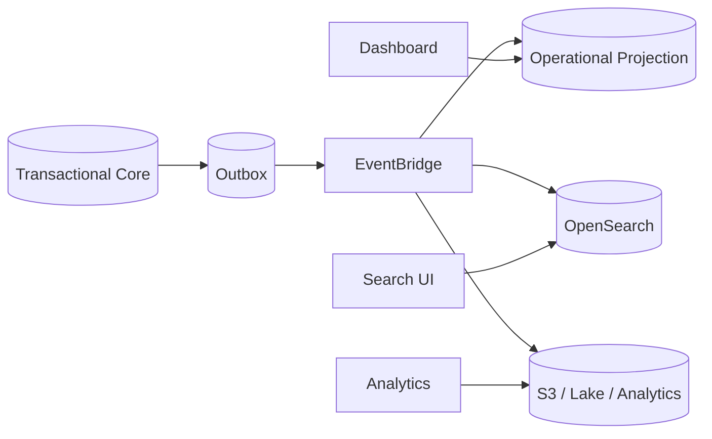
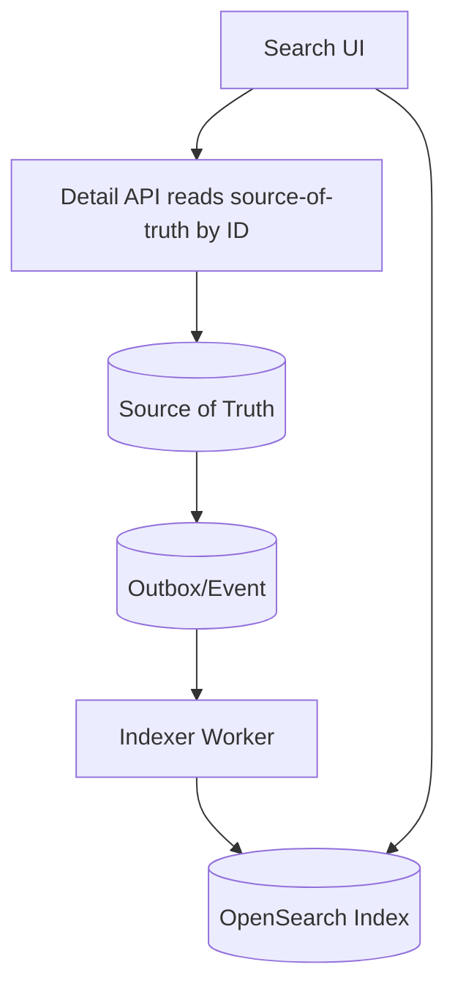
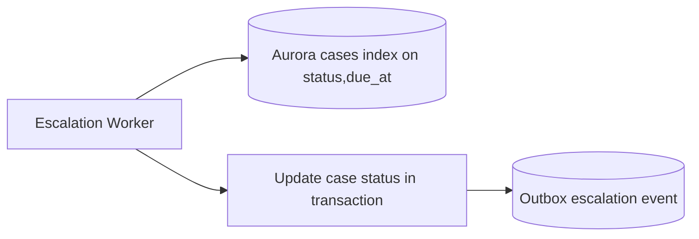
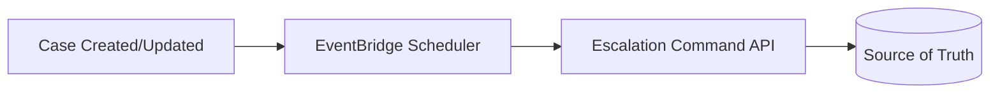
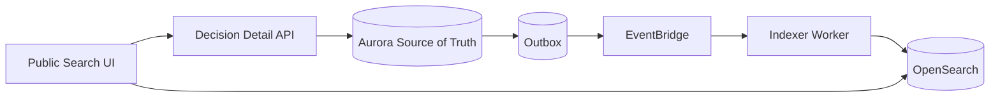

# Part 050 — Workload Characterization

> Jangan memilih database sebelum tahu bentuk workload. Workload adalah “cuaca nyata” yang akan menghantam desain: read/write ratio, latency, cardinality, concurrency, skew, burst, retention, dan failure behavior.

Part sebelumnya membahas database selection framework. Part ini lebih rendah level: **cara mengkarakterisasi workload** sebelum membuat keputusan teknis.

Banyak desain database gagal bukan karena engine buruk, tetapi karena workload yang sebenarnya berbeda dari workload yang diasumsikan.

Contoh asumsi keliru:

```txt
Asumsi: ini hanya CRUD sederhana.
Realita: ada 40 filter dinamis, audit history, full-text search, due-date queue, approval state machine, dan dashboard near-real-time.

Asumsi: write volume kecil.
Realita: batch import dan replay event bisa menghasilkan burst 100x.

Asumsi: cache akan menyelesaikan latency.
Realita: cache invalidation lebih sulit daripada query optimization.

Asumsi: eventual consistency aman.
Realita: regulatory decision memakai read model stale dan menghasilkan keputusan salah.
```

Workload characterization adalah proses menjawab:

```txt
Sistem ini sebenarnya melakukan apa terhadap data, seberapa sering, dengan constraint apa, dan apa yang terjadi saat gagal?
```

---

## 1. Workload ≠ Use Case

Use case adalah cerita bisnis.

```txt
Officer reviews an enforcement case.
Citizen submits a complaint.
System escalates overdue cases.
Supervisor approves penalty notice.
```

Workload adalah bentuk teknis dari cerita itu.

```txt
Read case by ID 500 rps p95 80 ms.
List cases by officer/status/dueDate 120 rps p95 150 ms.
Append audit event 300 rps p95 50 ms.
Full-text search 30 rps p95 500 ms.
Escalation scan every minute over due items.
Bulk import 2M records over 4 hours.
```

Use case membantu memahami domain. Workload menentukan database, index, partition, capacity, retry, backup, observability, dan cost.

---

## 2. Workload Characterization Dimensions

Gunakan dimensi berikut.

| Dimensi | Pertanyaan |
|---|---|
| Operation mix | Berapa persen read/write/update/delete/append/search? |
| Access path | Query by key, range, join, filter, traversal, time window, search? |
| Latency target | p50, p95, p99, timeout, user-facing vs background? |
| Throughput | average, peak, burst, sustained, replay? |
| Concurrency | berapa actor/worker bersamaan menyentuh data sama? |
| Cardinality | berapa row/item per tenant/user/case/day? |
| Skew | apakah ada tenant/key/entity yang jauh lebih panas? |
| Data size | item size, row width, blob/reference, index size? |
| Mutation frequency | append-only, frequent update, counter, status transition? |
| Consistency | strong, eventual, read-your-writes, monotonic, bounded staleness? |
| Transaction scope | single item, aggregate, multi-row, cross-service, saga? |
| Retention | TTL, archive, legal hold, hot/warm/cold split? |
| Growth | 3 bulan, 1 tahun, 5 tahun; linear, burst, seasonal? |
| Failure behavior | retry, duplicate, ambiguous commit, replay, repair? |
| Observability | metric apa membuktikan workload sehat? |

---

## 3. Workload Inventory Template

Tulis workload inventory sebelum menggambar schema.

```yaml
workload: enforcement-case-management
period: 2026-Q3 estimate
assumptions:
  tenants: 300
  active_cases: 20_000_000
  yearly_growth: 40%
  retention: 7 years hot, 20 years archive/legal hold
operations:
  - id: W-001
    name: create_case
    type: write
    actor: intake-api
    frequency: 50 rps average, 500 rps peak
    latency: p95 300 ms
    consistency: strong
    transaction_scope: case aggregate + audit + outbox
    candidate: Aurora PostgreSQL
  - id: W-002
    name: get_case_summary
    type: read
    actor: officer-ui
    frequency: 800 rps average, 3000 rps peak
    latency: p95 100 ms
    consistency: read-your-writes for officer session
    candidate: Aurora reader or DynamoDB projection
  - id: W-003
    name: search_case_narrative
    type: search
    actor: officer-ui
    frequency: 50 rps average
    latency: p95 700 ms
    consistency: eventual <= 60 seconds
    candidate: OpenSearch projection
```

Inventory ini harus versioned seperti code. Ketika traffic berubah, keputusan database harus bisa dilacak terhadap asumsi lama.

---

## 4. OLTP Workload

OLTP workload berfokus pada transaksi operasional pendek:

```txt
create order
update case status
approve notice
capture payment
assign officer
record audit entry
```

Ciri umum:

| Dimensi | Karakteristik |
|---|---|
| Latency | rendah, user-facing |
| Write | pendek, atomic, high correctness |
| Read | by key, by status, by owner, by date |
| Consistency | sering strong/read-your-writes |
| Query | indexed, bounded, predictable |
| Failure | ambiguous commit harus bisa diselesaikan |

Kandidat AWS:

- Aurora/RDS untuk relational transaction dan SQL;
- DynamoDB untuk predictable key-value/aggregate access;
- Aurora DSQL untuk distributed SQL pattern tertentu;
- RDS Proxy untuk connection management dari bursty clients;
- SQS/Step Functions untuk memindahkan long-running work keluar dari transaction.

OLTP anti-pattern:

- transaction menunggu external API;
- query admin/reporting berat di writer database;
- long-running lock;
- uncontrolled ORM lazy loading;
- tidak ada idempotency key pada write command;
- read replica dipakai untuk operation yang butuh read-your-writes.

---

## 5. Read-Heavy Operational Workload

Read-heavy bukan otomatis cache. Pertama pahami bentuk read.

| Read Type | Contoh | Kandidat |
|---|---|---|
| point lookup | get case summary | Aurora PK, DynamoDB, cache |
| filtered list | status + due date + officer | Aurora index, DynamoDB GSI |
| dashboard counter | cases by status | projection table, DynamoDB aggregate, cache |
| full-text | narrative search | OpenSearch |
| personalized feed | ordered item collection | DynamoDB, Aurora index, OpenSearch projection |

Pertanyaan:

```txt
Apakah read harus melihat write terbaru?
Apakah read boleh stale 1 detik, 1 menit, 1 jam?
Apakah read cardinality bounded?
Apakah sort/filter kombinasi terbatas atau ad-hoc?
Apakah read bisa dilayani dari projection?
```

Jika read pattern banyak dan berbeda dari write model, buat read model/projection. Jangan paksa write database menjadi semua hal.

---

## 6. Write-Heavy Workload

Write-heavy workload harus dikarakterisasi berdasarkan write distribution.

| Pola Write | Risiko |
|---|---|
| append event per entity | hot entity jika satu aggregate terlalu populer |
| counter increment | contention/hot key |
| status update | optimistic conflict, lost update |
| batch import | lock, index pressure, replication lag |
| event replay | duplicate side effect, replay storm |
| IoT telemetry | partition by device/time, retention pressure |

Pertanyaan wajib:

```txt
Apakah write tersebar merata atau terkonsentrasi pada sedikit key?
Apakah write membutuhkan unique constraint?
Apakah write bisa di-buffer dengan SQS?
Apakah write bisa di-shard secara semantic?
Apakah ada burst dari retry/replay/backfill?
Apakah failure write boleh retry tanpa efek ganda?
```

Kandidat:

- DynamoDB jika key distribution sehat dan access pattern jelas;
- Aurora/RDS jika constraint/transaction dominan;
- SQS sebagai buffer untuk smoothing;
- Kinesis/MSK jika stream ingest/order replay besar;
- Timestream untuk metric time-series;
- S3/object storage untuk raw immutable ingest.

---

## 7. Analytical-Adjacent Workload

Analytical-adjacent adalah workload yang bukan data warehouse penuh, tetapi sudah lebih berat dari OLTP biasa.

Contoh:

```txt
dashboard operational near-real-time
case aging report
daily compliance summary
aggregate per region/officer/status
trend over time
```

Masalah muncul ketika query seperti ini dijalankan langsung di transactional writer.

Tanda bahaya:

- query scan banyak row;
- join besar;
- grouping berat;
- dashboard auto-refresh;
- export CSV jutaan row;
- reporting user bisa membuat filter ad-hoc;
- index bertambah untuk dashboard dan merusak write performance.

Pola yang lebih sehat:



Decision principle:

```txt
Jika query tidak ikut menjaga invariant write path, jangan otomatis jalankan di write database.
```

---

## 8. Cache Workload

Cache workload harus dibedakan dari source-of-truth workload.

Cache cocok untuk:

- expensive but repeatable read;
- session state;
- feature flag/config snapshot;
- rate limit/token bucket;
- hot lookup;
- leaderboard/ranking sementara;
- computed response.

Cache tidak cocok untuk:

- invariant yang harus benar secara legal/financial;
- data yang tidak punya invalidation strategy;
- data yang tidak bisa direcompute;
- menutupi database modeling yang salah tanpa batas.

Characterization:

| Field | Pertanyaan |
|---|---|
| source | Dari mana data asli? |
| TTL | Berapa lama stale boleh? |
| invalidation | event, write-through, versioned key, manual? |
| miss behavior | fallback ke DB, return degraded, enqueue recompute? |
| stampede control | lock, single-flight, jittered TTL? |
| failure mode | cache down = system down atau degrade? |
| memory growth | bounded keyspace atau unbounded? |

Cache workload yang sehat punya stale semantics eksplisit:

```txt
This endpoint may return data up to 30 seconds stale.
Decision-critical actions must re-read source-of-truth before commit.
```

---

## 9. Document Workload

Document workload muncul ketika data natural sebagai nested object.

Contoh:

```json
{
  "caseId": "CASE-123",
  "intake": {
    "source": "portal",
    "complainant": { "type": "person" },
    "attachments": []
  },
  "riskAssessment": {
    "score": 83,
    "signals": []
  }
}
```

Pertanyaan:

```txt
Apakah document dibaca utuh atau sebagian?
Apakah field nested sering difilter?
Apakah schema fleksibel antar tipe domain?
Apakah update sebagian sering dan concurrent?
Apakah perlu transaction lintas document?
Apakah document size akan tumbuh tidak bounded?
```

Pilihan:

- DocumentDB untuk MongoDB-compatible document workload;
- DynamoDB untuk document-as-item dengan key access yang jelas;
- Aurora PostgreSQL JSONB untuk hybrid relational + flexible attributes;
- OpenSearch untuk search/filtering projection.

Anti-pattern:

```txt
Satu document terus tumbuh sebagai “aggregate semua hal” sampai update jadi conflict, size membesar, dan query nested butuh index liar.
```

---

## 10. Graph Workload

Graph workload bukan “ada relationship”. Hampir semua domain punya relationship. Graph workload berarti **query utama adalah traversal relationship**.

Contoh graph access pattern:

```txt
Find all companies connected to subject X through ownership within 4 hops.
Find shortest path between two regulated entities.
Find clusters of complaints sharing phone/email/address/bank account.
Find all enforcement cases indirectly linked to a sanctioned director.
```

Ciri:

| Dimensi | Karakteristik |
|---|---|
| Entity count | besar |
| Edge count | besar dan berubah |
| Query | traversal/path/neighborhood |
| Latency | traversal bounded but non-trivial |
| Update | edge insert/delete |
| Consistency | depends on risk decision |

Pilih Neptune jika traversal adalah first-class operation dan tidak efisien dikerjakan dengan join manual atau recursive application calls.

Tetapi tetap tentukan source of truth:

```txt
Apakah graph adalah primary store?
Atau graph projection dari relational/domain events?
```

Untuk banyak regulatory system, graph sering lebih aman sebagai projection dari authoritative registry/case data.

---

## 11. Time-Series Workload

Time-series workload ditandai oleh data yang selalu punya timestamp sebagai dimensi utama.

Contoh:

```txt
API latency metric per endpoint per minute
sensor reading per device per second
workflow duration per state transition
case SLA aging sample per hour
payment risk score over time
```

Ciri:

| Dimensi | Karakteristik |
|---|---|
| Write | append-heavy |
| Query | time window, aggregate, latest N, downsample |
| Retention | hot/warm/cold lifecycle |
| Cardinality | dimension combinations |
| Mutation | rare updates, mostly immutable |

Kandidat:

- Timestream for time-series metrics/events;
- CloudWatch Metrics/Logs for operational telemetry;
- DynamoDB time-bucket for application-specific time-window lookup;
- Aurora partitioned table for transactional-adjacent history;
- S3/lake for long-term analytics/archive.

Anti-pattern:

```txt
Menaruh high-volume telemetry di OLTP core tanpa retention dan partition strategy.
```

---

## 12. Search Workload

Search workload harus dipisahkan dari transactional query.

Search memiliki karakteristik:

- relevance scoring;
- tokenization;
- stemming/language analyzer;
- fuzzy matching;
- faceted navigation;
- filter/sort kombinasi;
- partial match;
- autocomplete;
- ranking.

Source-of-truth store biasanya buruk untuk search karena search bukan hanya filter.

Pola sehat:



Prinsip:

```txt
Search returns candidates. Critical decision reads source-of-truth before acting.
```

---

## 13. Concurrency Characterization

Concurrency sering lebih penting daripada throughput rata-rata.

Contoh:

```txt
1000 rps tersebar ke 1000 case berbeda = mudah.
1000 rps ke 1 case yang sama = contention.
```

Pertanyaan:

```txt
Apakah banyak actor bisa update aggregate yang sama?
Apakah ada hot tenant?
Apakah status transition bisa terjadi bersamaan?
Apakah batch job menyentuh row yang sama dengan user action?
Apakah retry bisa memperparah contention?
```

Concurrency control options:

| Pattern | Cocok Untuk |
|---|---|
| optimistic locking/version | status update, aggregate command |
| unique constraint | duplicate prevention |
| conditional write | DynamoDB state transition/counter guard |
| pessimistic lock | rare critical section, short transaction |
| queue per entity/group | serialization by key |
| saga reservation | long-running cross-service process |
| commutative update | counters/accumulators where possible |

Jangan memilih database sebelum tahu contention shape.

---

## 14. Skew dan Hot Key

Rata-rata menipu. Workload production sering power-law.

```txt
1% tenant menghasilkan 60% traffic.
1% case menjadi viral/hot.
1 officer dashboard membuka page auto-refresh.
1 replay job membanjiri satu partition.
```

Skew questions:

- top tenant berapa persen traffic?
- top entity berapa write per second?
- key distribution uniform atau low cardinality?
- apakah partition key memakai status seperti `OPEN`?
- apakah due date bucket membuat hot partition per hari?
- apakah event replay akan menumpuk pada key lama?

DynamoDB guidance sangat menekankan distribusi aktivitas yang merata pada partition key dan secondary index. Di relational database, skew muncul sebagai hot row, hot index page, lock contention, atau buffer cache pressure.

---

## 15. Latency Budget

Latency workload harus dipecah per layer.

Contoh API read:

```txt
Client budget: 1000 ms
API Gateway: 30 ms
Auth: 50 ms
Service processing: 80 ms
Database query: 120 ms
Cache: 10 ms if hit
Network + serialization: 50 ms
Safety buffer: 200 ms
```

Jangan hanya menulis:

```txt
p95 < 500 ms
```

Tulis juga:

```txt
p95 database query < 100 ms
p99 database query < 300 ms
timeout service-to-db 500 ms
API timeout 2 seconds
retry disabled for non-idempotent write
```

Latency decision:

| Kebutuhan | Implikasi |
|---|---|
| p95 < 20 ms | cache/in-memory/very simple key lookup |
| p95 < 100 ms | indexed lookup/query, DynamoDB/Aurora tuned |
| p95 < 500 ms | relational query/search acceptable |
| p95 seconds | workflow/job/reporting path |
| minutes | async batch/projection/backfill |

---

## 16. Burst, Replay, and Backfill Workload

Production workload bukan hanya steady state.

Ada workload episodik:

- retry storm setelah dependency pulih;
- EventBridge replay;
- SQS DLQ redrive;
- database migration backfill;
- monthly reporting;
- batch import;
- tenant onboarding;
- incident repair;
- blue/green projection rebuild.

Pertanyaan:

```txt
Apakah database dipilih hanya untuk steady traffic?
Berapa besar replay/backfill maksimum?
Apakah backfill memakai same table/index dengan OLTP?
Apakah write throttling ada?
Apakah job bisa pause/resume?
Apakah idempotency tahan replay 10x?
```

Untuk setiap database, siapkan **bulk lane** yang berbeda dari hot path:

```txt
hot path: user command/API
bulk lane: batch/backfill/replay dengan rate limit dan checkpoint
repair lane: targeted reconciliation
```

---

## 17. Retention and Lifecycle

Data lifecycle mempengaruhi database sejak awal.

| Data Type | Lifecycle |
|---|---|
| active case | hot, frequently read/write |
| closed case | read occasionally, legal hold |
| audit event | append-only, long retention |
| search index | rebuildable projection |
| metric | retention/rollup |
| attachment | object storage, metadata in DB |
| idempotency record | TTL based on retry/replay risk |
| outbox/inbox | retain for audit/replay window |

Pertanyaan:

```txt
Apa yang tetap hot setelah 1 tahun?
Apa yang boleh archive?
Apa yang harus legal hold?
Apa yang bisa TTL?
Apa yang bisa direbuild?
Apa yang harus immutable?
```

Kesalahan umum:

```txt
Semua data tetap di table utama selamanya.
Index membengkak.
Query makin lambat.
Backup/restore makin berat.
Cost naik tanpa visibility.
```

---

## 18. Observability per Workload Type

Metric harus mengikuti workload.

| Workload | Metrics Utama |
|---|---|
| OLTP SQL | query latency, lock wait, deadlock, connection count, CPU, IOPS, replica lag |
| DynamoDB | consumed capacity, throttles, hot partition symptoms, conditional check failure |
| Queue worker | backlog, age of oldest message, in-flight, DLQ growth, processing latency |
| Cache | hit ratio, eviction, memory, command latency, connection count, stale rate |
| Search | indexing lag, query latency, rejected requests, shard health |
| Graph | traversal latency, query timeout, edge growth |
| Time-series | ingest rate, query latency, retention storage, cardinality |
| Projection | source lag, projection lag, replay count, poison records |

AWS Well-Architected mendorong pengumpulan metric data store agar workload requirement bisa divalidasi. Tanpa metric, workload characterization hanya dokumen asumsi.

---

## 19. Workload-to-Database Mapping Cheat Sheet

| Workload Dominan | Database/Pattern Kandidat | Catatan |
|---|---|---|
| core transactional relational | Aurora/RDS | constraint, SQL, transaction |
| predictable high-scale key access | DynamoDB | key design menentukan sukses/gagal |
| Cassandra-compatible wide-column | Keyspaces | query by partition/clustering |
| flexible document workload | DocumentDB | pastikan query/index fit |
| low-latency derived data | ElastiCache | cache invalidation wajib jelas |
| durable Redis-compatible state | MemoryDB | bukan sekadar disposable cache |
| relationship traversal | Neptune | graph query sebagai first-class workload |
| time-series metrics/events | Timestream | retention/time-window query |
| search/relevance/facet | OpenSearch projection | bukan source of truth umum |
| distributed SQL active-active | Aurora DSQL | evaluasi consistency/conflict/latency |
| long-running business process | Step Functions + DB | jangan tahan DB transaction lama |
| async write smoothing | SQS + worker | idempotent consumer wajib |

---

## 20. Example Characterization: Case SLA Escalation

Use case:

```txt
System must escalate cases that exceed SLA based on case type, region, risk, and current status.
```

Naive implementation:

```sql
SELECT * FROM cases
WHERE status IN ('OPEN', 'UNDER_REVIEW')
AND due_at < now()
ORDER BY due_at
LIMIT 1000;
```

Ini bisa benar untuk awal, tetapi characterization diperlukan:

| Dimensi | Pertanyaan |
|---|---|
| Frequency | setiap menit, setiap 5 menit, real-time? |
| Cardinality | berapa active case? |
| Selectivity | berapa persen due per interval? |
| Concurrency | ada worker paralel? |
| Consistency | apakah escalation boleh telat 1 menit? |
| Idempotency | apakah case bisa dieskalasi dua kali? |
| State transition | apakah status berubah saat worker berjalan? |
| Audit | apakah escalation harus tercatat? |
| Backfill | bagaimana mengejar backlog setelah outage? |

Possible designs:

### Option A — Aurora Indexed Query + Worker

Cocok jika active case manageable dan query indexed.



### Option B — EventBridge Scheduler per Case

Cocok jika scheduled command per case manageable dan lifecycle jelas.



### Option C — DynamoDB GSI by Due Bucket

Cocok jika access pattern key-value/range dan partitioning bisa dirancang.

```txt
PK: tenantId#dueBucket
SK: dueAt#caseId
GSI for status/risk if needed
```

Decision bukan “mana paling keren”. Decision berdasarkan workload:

```txt
Jika due event berubah sering, scheduler per case bisa mahal/rumit.
Jika query range per status/dueAt efisien dan active data bounded, Aurora index cukup.
Jika scale tinggi dan due-bucket access predictable, DynamoDB GSI bisa bagus.
```

---

## 21. Example Characterization: Public Case Search

Requirement:

```txt
Public users search published enforcement decisions by entity name, region, category, date, and keyword.
```

Workload:

```yaml
operation: search_public_decisions
type: search/read
frequency: 100 rps average, 2000 rps peak during press release
latency: p95 500 ms
consistency: eventual <= 5 minutes
query_shape:
  - full-text keyword
  - entity name partial match
  - filters: region, category, decisionDate
  - sort: relevance or date
source_of_truth: Aurora published_decision table
candidate: OpenSearch projection
```

Architecture:



Why not Aurora only?

- full-text relevance and faceting are search-native problems;
- public burst can be isolated from transactional database;
- index is rebuildable projection;
- detail page can still read source-of-truth.

---

## 22. Characterization Review Questions

Sebelum schema design, review ini:

```txt
1. Apa top 10 read operations?
2. Apa top 10 write operations?
3. Mana yang user-facing?
4. Mana yang background?
5. Mana yang decision-critical?
6. Mana yang boleh stale?
7. Apa aggregate paling panas?
8. Apa tenant paling besar?
9. Apa query dengan cardinality tidak bounded?
10. Apa workload replay/backfill terbesar?
11. Apa data yang harus long retention?
12. Apa projection yang bisa direbuild?
13. Apa source-of-truth final?
14. Apa metric yang membuktikan asumsi benar?
15. Apa failure drill untuk database overload?
```

---

## 23. Anti-Patterns

### Anti-Pattern 1 — Average-Case Design

Average traffic hampir tidak pernah menjatuhkan sistem. Peak, skew, retry, replay, dan backfill yang menjatuhkan.

### Anti-Pattern 2 — CRUD Classification

Menyebut workload sebagai CRUD menyembunyikan complexity. Hampir semua sistem bisa disebut CRUD jika cukup malas mendeskripsikan invariant.

### Anti-Pattern 3 — Latency Tanpa Percentile

“Cepat” bukan requirement. `p95 < 150 ms` dan `p99 < 500 ms` adalah requirement.

### Anti-Pattern 4 — Projection Tanpa Lag SLO

Projection eventual consistency harus punya lag metric dan SLO. Kalau tidak, stale data akan menjadi bug samar.

### Anti-Pattern 5 — Batch Job sebagai Afterthought

Batch/backfill/replay sering lebih berat dari user traffic. Desain harus punya lane dan throttle sendiri.

---

## 24. Production Checklist

- [ ] Workload inventory ditulis dan versioned.
- [ ] Read/write ratio diketahui.
- [ ] Top access patterns ditulis lengkap.
- [ ] Latency p50/p95/p99 ditentukan.
- [ ] Average/peak/burst/replay throughput dipisahkan.
- [ ] Cardinality dan skew dianalisis.
- [ ] Hot key/hot row risk ditulis.
- [ ] Transaction boundary jelas.
- [ ] Consistency requirement per operation jelas.
- [ ] Retention dan lifecycle jelas.
- [ ] Cache stale semantics jelas.
- [ ] Projection lag SLO jelas.
- [ ] Bulk/backfill/replay lane didesain.
- [ ] Observability metric dipilih per workload.
- [ ] Cost model berdasarkan workload, bukan asumsi kecil.
- [ ] Failure drill mencakup overload, failover, retry storm, replay storm.

---

## 25. Key Takeaways

Workload characterization adalah jembatan antara domain dan database design.

Urutannya:

```txt
use case → operation → access pattern → workload dimension → database capability → schema/key/index design → observability
```

Bukan:

```txt
use case → ERD → pilih database → berharap scale
```

Engineer top-tier tidak bertanya “database apa yang terbaik?”. Ia bertanya:

```txt
Workload ini bentuknya apa?
Apa invariant-nya?
Apa query shape-nya?
Apa scale axis-nya?
Apa failure mode-nya?
Apa metric yang membuktikan desain ini benar?
```

Setelah workload jelas, pemilihan Aurora, DynamoDB, ElastiCache, Neptune, Timestream, DocumentDB, OpenSearch projection, atau kombinasi purpose-built lain menjadi konsekuensi logis, bukan debat preferensi.

---

## References

- AWS Well-Architected Framework — Performance Efficiency: Data management
- AWS Well-Architected Framework — Collect and record data store performance metrics
- AWS — Choosing an AWS database service
- AWS Prescriptive Guidance — DynamoDB data modeling: identify access patterns
- Amazon DynamoDB Developer Guide — Best practices for partition key design
- Amazon RDS User Guide — Best practices for Amazon RDS
- Amazon Aurora User Guide — High availability and replication
