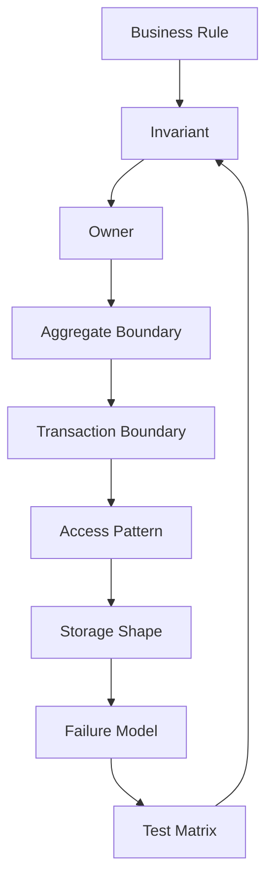
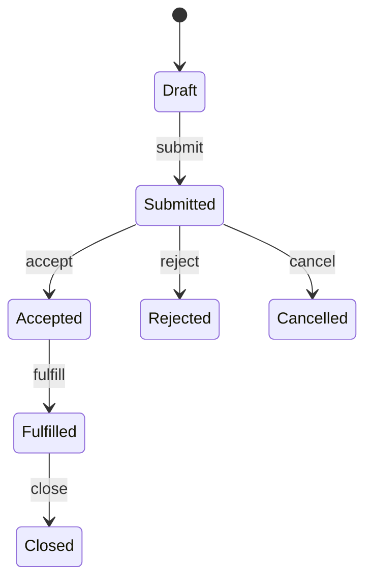
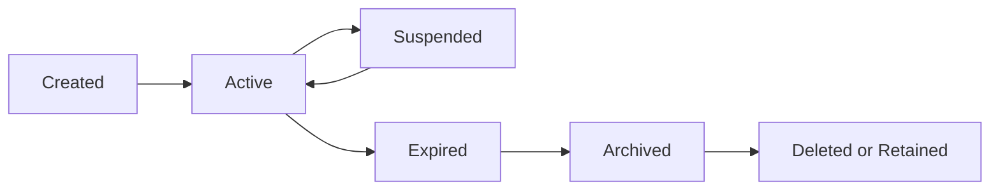
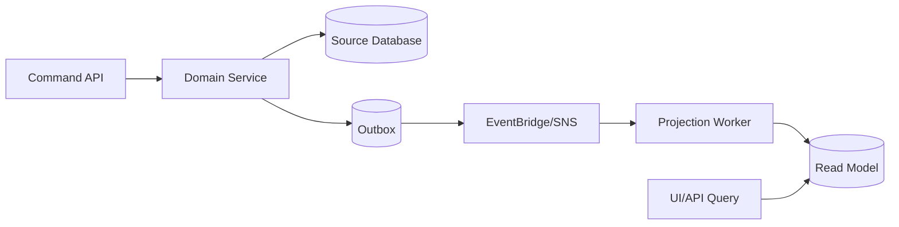

# Part 051 — Data Modeling Invariants: Aggregate, Ownership, Cardinality, Mutation Frequency

> Data model yang baik bukan model yang terlihat rapi di ERD. Data model yang baik adalah model yang membuat hal penting tetap benar saat sistem menerima retry, duplicate request, concurrent update, delayed event, replay, failover, backfill, dan schema evolution.

Di part sebelumnya kita memilih database berdasarkan workload. Sekarang kita turun satu level: **apa yang harus selalu benar pada data**.

Ini bukan sekadar “buat tabel”. Ini adalah proses menemukan **invariant**.

Invariant adalah aturan yang tidak boleh rusak, bahkan ketika:

- client retry setelah timeout;
- worker membaca message yang sama dua kali;
- event consumer tertinggal 30 menit;
- read replica lag;
- global table menerima write dari dua Region;
- schema berubah saat traffic masih berjalan;
- batch backfill berjalan bersamaan dengan online write;
- service dependency sedang degraded;
- operator melakukan replay dari DLQ atau EventBridge archive.

Kalau invariant tidak eksplisit, database akan tetap menyimpan data, tetapi sistem tidak lagi menyimpan **kebenaran**.

---

## 1. Mental Model: Data Model Adalah Mesin Penjaga Kebenaran

Banyak engineer memulai data modeling dari pertanyaan:

> “Field apa saja yang perlu disimpan?”

Pertanyaan itu terlalu lemah.

Pertanyaan yang lebih benar:

> “Kebenaran apa yang harus dijaga, siapa yang boleh mengubahnya, dalam boundary transaksi apa, dengan pola akses apa, dan apa yang terjadi saat operasi gagal di tengah?”

Data model production-grade selalu menjawab 8 hal:

| Dimensi | Pertanyaan |
|---|---|
| Identity | Apa identitas stabil entity ini? |
| Ownership | Service/domain mana yang menjadi source of truth? |
| Aggregate | Data mana yang harus berubah atomik bersama? |
| Cardinality | Berapa jumlah child/relationship yang realistis dan ekstrem? |
| Mutation | Field mana yang sering berubah, jarang berubah, append-only, atau immutable? |
| Consistency | Apa yang harus langsung konsisten dan apa yang boleh eventual? |
| Lifecycle | Kapan data dibuat, berubah, expired, archived, deleted? |
| Access Pattern | Query apa yang harus murah, stabil, dan predictable? |

ERD hanya menggambar struktur. Invariant menggambar **kontrak kebenaran**.

---

## 2. Invariant-First Data Modeling Loop

Gunakan loop ini sebelum memilih tabel, index, item collection, document shape, atau graph edge.



Contoh rule:

> “Satu invoice tidak boleh dibayar dua kali.”

Jangan langsung membuat tabel `payments`.

Turunkan dulu:

| Layer | Keputusan |
|---|---|
| Invariant | `invoice.paidAmount <= invoice.totalAmount`; payment command tidak boleh applied dua kali. |
| Owner | Billing service menjadi source of truth invoice/payment. |
| Aggregate | Invoice + payment application state berada dalam satu aggregate consistency boundary. |
| Transaction | Mark invoice paid dan insert payment ledger harus atomik atau recoverable. |
| Access Pattern | Lookup invoice by id, list payments by invoice, reconcile pending payment. |
| Storage | Aurora transaction atau DynamoDB conditional transaction, plus idempotency key. |
| Failure Model | PSP success tetapi app timeout; duplicate webhook; replay; partial outbox publish. |
| Test | concurrent payment, duplicate command, PSP retry, replay outbox, restore from backup. |

---

## 3. Invariant vs Constraint vs Validation

Tiga istilah ini sering dicampur.

| Konsep | Artinya | Tempat |
|---|---|---|
| Validation | Request masuk valid secara bentuk dan basic rule. | API/service layer |
| Constraint | Mekanisme teknis untuk menolak state invalid. | Database / conditional write / unique index |
| Invariant | Kebenaran domain yang harus tetap benar di semua failure mode. | Architecture + code + storage + operation |

Contoh:

```txt
Validation:
- amount harus positif.

Constraint:
- payment_id unique.
- invoice_id foreign key valid.
- status enum valid.

Invariant:
- invoice tidak boleh masuk PAID kecuali total successful payment >= invoice amount.
- payment success event tidak boleh applied dua kali.
- refund tidak boleh melebihi captured amount.
```

Validation bisa dilewati oleh bug internal, replay, migration script, atau operator tool.

Constraint lebih kuat, tetapi belum cukup untuk invariant lintas tabel, lintas service, lintas event, dan lintas waktu.

Invariant harus didukung oleh:

- database constraint;
- conditional write;
- transaction boundary;
- idempotency key;
- state transition guard;
- reconciliation job;
- audit log;
- monitoring;
- operational runbook.

---

## 4. Aggregate: Boundary Tempat Kebenaran Dijaga

Aggregate adalah unit domain yang menjaga invariant internalnya.

Jangan mendefinisikan aggregate dari bentuk UI. Definisikan dari aturan atomik.

Contoh:

| Domain | Aggregate Candidate | Invariant |
|---|---|---|
| Order | Order | item total, order status transition, cancellation rule |
| Payment | Payment Attempt | idempotency, provider reference, capture/refund rule |
| Inventory | Stock Reservation | reserved quantity tidak melebihi available stock |
| Case Management | Case | escalation state, assignee rule, due date rule |
| Enforcement | Violation Proceeding | stage transition, evidence completeness, appeal window |

Aggregate bukan berarti semua data harus ada dalam satu tabel atau satu document. Aggregate berarti perubahan yang menjaga invariant harus memiliki **satu coordination boundary**.

### Aggregate Boundary Rule

Sebuah data termasuk dalam aggregate yang sama bila:

1. perubahan A dan B harus selalu atomik untuk menjaga kebenaran;
2. pembaca tidak boleh melihat A berubah tanpa B berubah;
3. konflik concurrency pada A dan B harus diselesaikan bersama;
4. replay command terhadap A dan B harus idempotent sebagai satu unit.

Bila tidak, mungkin itu projection, child collection, atau separate aggregate.

---

## 5. Aggregate Terlalu Besar: Gejala dan Dampaknya

Aggregate terlalu besar ketika terlalu banyak entity dipaksa konsisten bersama.

Gejala:

- transaction sering menyentuh banyak row/item;
- lock contention tinggi;
- DynamoDB transaction sering konflik;
- write throughput terkonsentrasi pada satu partition key;
- update kecil membutuhkan load object besar;
- satu command kecil memblokir banyak workflow;
- migration schema menjadi sulit;
- cache invalidation terlalu luas.

Contoh buruk:

```txt
Customer aggregate:
- customer profile
- all orders
- all invoices
- all payments
- all support tickets
- all notification preferences
```

Ini bukan aggregate. Ini folder data.

Yang benar biasanya:

```txt
CustomerProfile aggregate
Order aggregate
Invoice aggregate
Payment aggregate
SupportCase aggregate
NotificationPreference aggregate
```

Lalu gunakan event/projection untuk query lintas aggregate.

---

## 6. Aggregate Terlalu Kecil: Gejala dan Dampaknya

Aggregate terlalu kecil ketika invariant yang seharusnya atomik tersebar ke banyak owner.

Gejala:

- butuh distributed transaction untuk rule sederhana;
- command success tapi invariant akhir sering harus diperbaiki job rekonsiliasi;
- UI sering melihat state “mustahil”;
- banyak compensating action untuk operasi yang sebenarnya lokal;
- concurrency bug terjadi pada rule domain dasar.

Contoh:

```txt
Invoice service menyimpan invoice status.
Payment service menyimpan payment status.
Ledger service menyimpan applied amount.
Tidak ada satu boundary yang menjaga paidAmount <= totalAmount.
```

Kalau invariant pembayaran invoice sangat ketat, harus ada satu aggregate/owner yang memutuskan application of payment.

---

## 7. Ownership: Source of Truth Tidak Boleh Kabur

Setiap data penting harus punya owner.

Owner artinya:

- satu service/domain memiliki hak menulis authoritative state;
- service lain hanya membaca via API, event, projection, atau replica resmi;
- perubahan schema/meaning dikontrol oleh owner;
- owner menyediakan audit trail dan reconciliation mechanism;
- owner bertanggung jawab atas invariant.

### Ownership Decision Table

| Pertanyaan | Jawaban yang Dicari |
|---|---|
| Siapa yang boleh mengubah field ini? | Satu owner jelas. |
| Siapa yang menjelaskan arti field ini? | Domain owner, bukan consumer. |
| Apa event authoritative ketika field berubah? | Domain event dari owner. |
| Apa sumber untuk recovery/rebuild projection? | Owner database atau event log resmi. |
| Siapa yang menang saat ada konflik? | Rule owner, bukan timestamp acak. |

Anti-pattern paling mahal:

```txt
Tabel customer dipakai 8 service.
Semua service boleh update kolom masing-masing.
Tidak ada owner schema.
Tidak ada event resmi.
Tidak ada audit semantik.
```

Ini bukan shared database. Ini shared liability.

---

## 8. Ownership di AWS: Mapping Praktis

| Pola | Cocok | Risiko |
|---|---|---|
| Service owns Aurora schema | Strong relational invariant, SQL query, transaction | schema coupling bila DB dipakai service lain |
| Service owns DynamoDB table | predictable key-value access, high scale | access pattern harus matang sejak awal |
| Service owns event stream/outbox | derived read models, projections | event compatibility harus disiplin |
| Service publishes EventBridge events | cross-domain notification | consumer tidak boleh menganggap event sebagai command |
| Service exposes API Gateway/AppSync API | synchronous read/command | latency coupling dan retry storm |
| Shared read replica/projection | reporting/search/read-heavy use case | stale read dan schema drift |

Aturan keras:

> Service lain boleh membaca projection, tetapi tidak boleh menulis source table milik domain lain.

---

## 9. Identity Invariant

Identity adalah fondasi semua idempotency, join, reference, event, audit, dan replay.

Identity harus:

- stabil;
- unik dalam scope yang benar;
- tidak bergantung pada field mutable;
- aman dipakai sebagai idempotency/reference key;
- punya owner;
- tidak berubah karena migration atau rebranding domain.

### Jenis Identity

| Jenis | Contoh | Catatan |
|---|---|---|
| Surrogate ID | `orderId`, `caseId`, `paymentId` | aman untuk primary reference |
| Natural ID | `email`, `taxNumber`, `licenseNumber` | hati-hati mutable/PII/format change |
| External Reference | PSP transaction id, regulator case number | harus disimpan dengan source/provider |
| Idempotency Key | client request key | bukan primary identity domain |
| Correlation ID | trace/business flow id | bukan entity id |

Contoh buruk:

```txt
user_id = email
```

Email bisa berubah. Email bisa reusable. Email mengandung PII. Email tidak ideal sebagai identity internal.

Contoh lebih baik:

```txt
user_id = usr_01J...
email = unique attribute with lifecycle rule
```

---

## 10. Cardinality Invariant

Cardinality menentukan apakah model Anda akan tetap sehat saat data membesar.

Pertanyaan wajib:

| Pertanyaan | Kenapa Penting |
|---|---|
| Berapa child per parent dalam p50/p95/p99/max? | menentukan partition/item collection/index strategy |
| Apakah child bertambah selamanya? | risiko hot partition dan unbounded query |
| Apakah perlu pagination stabil? | mencegah scan dan memory blow-up |
| Apakah relationship many-to-many? | butuh association entity atau inverted index |
| Apakah parent sering di-update bersamaan dengan child? | menentukan aggregate boundary |

### Contoh Cardinality Trap

```txt
Account -> Events
```

Di awal satu account punya 50 events. Setelah 2 tahun enterprise account punya 300 juta events.

Kalau partition key DynamoDB adalah `ACCOUNT#123`, semua events account besar berada dalam satu logical partition key. Query mungkin mudah, tetapi write/read distribution bisa rusak.

Model yang lebih sadar cardinality:

```txt
PK = ACCOUNT#123#DAY#2026-07-06
SK = EVENT#<timestamp>#<eventId>
```

Atau untuk relational:

```sql
partition by range (event_date)
index(account_id, event_date desc, event_id)
```

---

## 11. Mutation Frequency Invariant

Tidak semua field punya pola perubahan yang sama.

| Mutation Type | Contoh | Desain |
|---|---|---|
| Immutable | `createdAt`, `orderId`, original request payload | append-only / never update |
| Rarely mutable | customer name, configuration | optimistic locking |
| Frequently mutable | counters, status, progress | conflict-aware update |
| Append-only | ledger, audit, history, events | immutable log + projection |
| Expiring | session, reservation, token | TTL / scheduled expiry |
| Derived | balance, summary, search index | rebuildable projection |

Jangan mencampur field hot dan cold tanpa alasan.

Contoh buruk document item:

```json
{
  "caseId": "case-123",
  "metadata": { "createdBy": "u1", "createdAt": "..." },
  "currentAssignee": "u9",
  "slaRemainingSeconds": 240,
  "timeline": [ /* grows forever */ ]
}
```

Masalah:

- update `slaRemainingSeconds` menulis ulang item besar;
- timeline tumbuh tanpa batas;
- konflik update assignee vs SLA vs timeline;
- item size bisa meledak.

Lebih baik:

```txt
CaseHeader     -> metadata/status/current owner
CaseTimeline   -> append-only entries
CaseSlaState   -> hot operational field
CaseProjection -> read model untuk UI
```

---

## 12. State Transition Invariant

Banyak bug bukan karena field salah, tetapi karena transisi status salah.

Contoh status order:

```txt
DRAFT -> SUBMITTED -> ACCEPTED -> FULFILLED -> CLOSED
                    \-> REJECTED
SUBMITTED -> CANCELLED
```

Jangan simpan status sebagai string bebas tanpa transition guard.



Implementasi invariant:

- relational: `version`, transaction, state transition table/function, check constraint bila mungkin;
- DynamoDB: `ConditionExpression status = :expected and version = :v`;
- workflow: Step Functions hanya orchestrate command, domain table tetap menjaga transition;
- event consumer: ignore duplicate transition, reject invalid transition, log violation.

Contoh DynamoDB conditional transition:

```ts
await dynamodb.send(new UpdateCommand({
  TableName: "cases",
  Key: { pk: "CASE#123", sk: "STATE" },
  UpdateExpression: "SET #s = :next, version = version + :one, updatedAt = :now",
  ConditionExpression: "#s = :expected AND version = :version",
  ExpressionAttributeNames: { "#s": "status" },
  ExpressionAttributeValues: {
    ":expected": "SUBMITTED",
    ":next": "ACCEPTED",
    ":version": 7,
    ":one": 1,
    ":now": new Date().toISOString()
  }
}));
```

---

## 13. Uniqueness Invariant

Uniqueness adalah salah satu invariant yang paling sering diremehkan pada distributed system.

Contoh:

- satu email aktif hanya boleh dimiliki satu user;
- satu invoice number unik per tenant;
- satu active reservation per `(orderId, sku)`;
- satu payment provider reference hanya boleh applied sekali;
- satu case escalation id hanya boleh menghasilkan satu escalation task.

### Relational Pattern

```sql
create unique index uq_users_tenant_email_active
on users (tenant_id, lower(email))
where deleted_at is null;
```

### DynamoDB Unique Constraint Emulation

Gunakan item penjaga uniqueness.

```txt
PK = USER#<userId>                 SK = PROFILE
PK = UNIQUE#EMAIL#<tenant>#<email> SK = LOCK -> userId
```

Tulis dengan transaction:

```txt
TransactWriteItems:
1. Put UNIQUE#EMAIL#tenant#a@example.com if attribute_not_exists(PK)
2. Put USER#userId PROFILE if attribute_not_exists(PK)
```

Jika step 1 gagal, email sudah dipakai.

Hal penting:

- unique lock harus punya lifecycle saat email berubah;
- release old unique item dan acquire new unique item harus atomik;
- jangan memakai eventually consistent read untuk memutuskan uniqueness;
- jangan mengandalkan pre-check tanpa conditional write.

---

## 14. Ordering Invariant

Tidak semua sistem butuh global ordering. Kebanyakan hanya butuh ordering per aggregate.

Pertanyaan:

| Pertanyaan | Implikasi |
|---|---|
| Order apa yang harus dijaga? | global, tenant, aggregate, entity, workflow |
| Apakah event bisa datang terlambat? | perlu sequence/version guard |
| Apakah update bisa paralel? | perlu optimistic concurrency |
| Apakah consumer boleh skip old event? | perlu projection version |
| Apakah reorder bisa merusak uang/stok/status? | harus strict guard |

Pattern:

```txt
aggregateId = order-123
version = 42
```

Consumer projection hanya apply event jika:

```txt
event.version == projection.version + 1
```

Kalau event version 44 datang saat projection masih 42, simpan pending atau trigger rebuild.

Untuk EventBridge/SNS/SQS Standard, jangan mengasumsikan ordering global. Untuk SQS FIFO, ordering berlaku dalam `MessageGroupId`, tetapi hot group bisa menjadi bottleneck.

---

## 15. Lifecycle Invariant

Data punya lifecycle, bukan hanya CRUD.

Contoh lifecycle:



Pertanyaan wajib:

- kapan data boleh dibuat?;
- siapa yang boleh mengubah?;
- kapan status terminal?;
- apakah delete fisik atau soft delete?;
- apakah data punya retention legal?;
- apakah PII harus bisa dihapus/anonymized?;
- apakah archive masih queryable?;
- apakah event lama masih valid setelah schema berubah?;
- apakah TTL boleh menghapus source of truth?;
- bagaimana restore dari backup mempengaruhi lifecycle?

### TTL Bukan Business Logic Tunggal

DynamoDB TTL atau scheduled cleanup berguna untuk expiry, tetapi jangan jadikan satu-satunya mekanisme correctness.

Untuk reservation:

```txt
reservation.status = ACTIVE
reservation.expiresAt = 2026-07-06T10:00:00Z
```

Consumer command harus memeriksa expiry saat digunakan, bukan hanya menunggu TTL menghapus item.

---

## 16. Derived State Invariant

Derived state adalah data yang bisa dibangun ulang dari source of truth.

Contoh:

- search index;
- dashboard count;
- denormalized read model;
- materialized view;
- cache;
- recommendation vector;
- activity feed.

Aturan:

> Derived state boleh stale, tetapi tidak boleh menjadi authority kecuali Anda sengaja mempromosikannya menjadi source of truth dengan invariant baru.

Checklist derived state:

- source event/table jelas;
- rebuild mechanism tersedia;
- freshness metric ada;
- duplicate event aman;
- out-of-order event aman;
- schema version ditangani;
- projection lag terlihat;
- consumer checkpoint/audit tersedia;
- deletion/privacy propagation jelas.

---

## 17. Denormalization: Optimasi yang Harus Punya Owner

AWS purpose-built database sering mendorong denormalization, terutama DynamoDB dan search projection. Denormalization bukan dosa. Yang berbahaya adalah denormalization tanpa ownership.

Contoh:

```txt
OrderProjection menyimpan customerName.
CustomerProfile adalah source of truth customerName.
```

Pertanyaan:

- apakah perubahan customerName harus mengubah historical order?;
- apakah order harus menyimpan name at time of purchase?;
- apakah projection boleh stale?;
- siapa publish event `CustomerNameChanged`?;
- apakah rebuild projection mengubah historical semantics?

Kadang data yang terlihat duplikat sebenarnya immutable snapshot.

```txt
order.customerSnapshot.name
```

Itu bukan derived state. Itu fakta historis.

---

## 18. Read Model vs Source Model

Source model menjaga invariant. Read model melayani query.



Jangan memaksa source model melayani semua query UI bila itu merusak write invariant.

Tetapi jangan juga membuat read model menjadi tempat update domain.

Rule:

```txt
Write path: command -> owner -> source database -> outbox/event
Read path: query -> projection/read model/cache/search
```

---

## 19. Relational Data Modeling Invariants: Aurora/RDS

Relational database kuat untuk invariant yang butuh:

- foreign key;
- unique constraint;
- transaction multi-row;
- relational query;
- ad-hoc investigation;
- strong consistency dalam satu database;
- schema constraint;
- audit/reporting query.

Gunakan constraint sebagai pagar pertama:

```sql
create table invoices (
  invoice_id uuid primary key,
  tenant_id uuid not null,
  status text not null,
  total_amount numeric(18,2) not null check (total_amount >= 0),
  paid_amount numeric(18,2) not null default 0 check (paid_amount >= 0),
  version bigint not null default 0,
  created_at timestamptz not null,
  updated_at timestamptz not null,
  check (paid_amount <= total_amount)
);

create unique index uq_invoice_number_per_tenant
on invoices (tenant_id, invoice_number);
```

Tetapi constraint tidak cukup untuk semua transition. Gunakan transaction dan optimistic lock:

```sql
update invoices
set status = 'PAID',
    paid_amount = total_amount,
    version = version + 1,
    updated_at = now()
where invoice_id = :invoiceId
  and status = 'ISSUED'
  and version = :expectedVersion;
```

Jika affected rows = 0, itu concurrency conflict atau invalid transition.

---

## 20. DynamoDB Data Modeling Invariants

DynamoDB kuat jika access pattern jelas dan invariant bisa dijaga dengan:

- partition key design;
- condition expression;
- transaction API;
- item collection;
- GSI projection;
- streams;
- TTL;
- optimistic concurrency;
- idempotency item.

Contoh item collection order:

```txt
PK = ORDER#123, SK = META
PK = ORDER#123, SK = ITEM#sku-1
PK = ORDER#123, SK = PAYMENT#pay-1
PK = ORDER#123, SK = EVENT#000001
```

Bagus jika jumlah child bounded dan query per order umum.

Buruk jika order punya jutaan child atau write hot pada satu aggregate.

### Conditional Write sebagai Invariant Guard

```ts
await dynamodb.send(new PutCommand({
  TableName: "orders",
  Item: {
    pk: "ORDER#123",
    sk: "COMMAND#cmd-abc",
    commandType: "SubmitOrder",
    status: "APPLIED",
    createdAt: now
  },
  ConditionExpression: "attribute_not_exists(pk)"
}));
```

Jangan melakukan:

```txt
read -> if not exists -> write
```

Lakukan:

```txt
conditional write
```

Karena pre-check race-prone.

---

## 21. Mutation + Cardinality Matrix

Gunakan matriks ini untuk memilih shape.

| Cardinality | Mutation | Shape yang Biasanya Aman |
|---|---|---|
| one-to-one | rarely mutable | same row/item/document |
| one-to-few bounded | changed together | aggregate row group / item collection |
| one-to-many bounded | queried by parent | child table / item collection with pagination |
| one-to-many unbounded | append-only | partition by time/bucket, separate table |
| many-to-many | independent mutation | association table / inverted index |
| high-frequency counter | hot update | sharded counter / atomic counter with limits |
| audit/history | append-only | immutable log table/stream |
| projection | rebuildable | denormalized read model/search/cache |

---

## 22. Hot Data and Cold Data Split

Hot data sering berubah dan butuh low latency.
Cold data jarang berubah atau historical.

Jangan selalu simpan keduanya dalam satu item/document.

Contoh enforcement case:

```txt
Hot:
- currentStatus
- currentAssignee
- dueAt
- riskScore
- version

Cold:
- submitted evidence
- historical notes
- generated letters
- audit trail
- attachments
```

Desain:

```txt
CaseState table/item       -> hot, small, guarded by version
CaseEvidence table/S3      -> large/cold, append or immutable
CaseTimeline table         -> append-only
CaseSearchProjection       -> derived query model
```

Efek:

- update status tidak menulis ulang evidence;
- audit tidak mengunci state;
- projection bisa rebuild;
- cost lebih terkendali;
- migration lebih aman.

---

## 23. Time as Modeling Dimension

Waktu bukan hanya kolom `created_at`.

Waktu menentukan:

- ordering;
- expiry;
- retention;
- partitioning;
- SLA;
- replay window;
- audit reconstruction;
- regulatory defensibility;
- snapshot semantics.

Jenis timestamp:

| Timestamp | Arti |
|---|---|
| `occurredAt` | kapan fakta terjadi di domain |
| `recordedAt` | kapan sistem mencatat fakta |
| `publishedAt` | kapan event dipublish |
| `processedAt` | kapan consumer memproses |
| `effectiveFrom` | kapan rule mulai berlaku |
| `expiresAt` | kapan state tidak valid lagi |
| `deletedAt` | kapan soft delete terjadi |

Jangan memakai satu timestamp untuk semua makna.

Contoh regulatory/enforcement system:

```txt
A violation occurredAt = 2026-06-01.
It was reportedAt = 2026-06-10.
It was recordedAt = 2026-06-11.
A new penalty policy effectiveFrom = 2026-07-01.
```

Keputusan penalty mungkin bergantung pada `occurredAt`, bukan `recordedAt`.

---

## 24. Versioning Invariant

Setiap aggregate penting butuh version.

Version digunakan untuk:

- optimistic concurrency;
- event ordering;
- projection apply guard;
- idempotent transition;
- audit reconstruction;
- conflict detection;
- cache invalidation;
- ETag/API concurrency.

Pattern:

```txt
aggregateId = case-123
version = 17
```

Write:

```txt
update if version = 17
set version = 18
publish event version = 18
```

Consumer:

```txt
apply event if event.version = currentProjectionVersion + 1
```

API:

```http
If-Match: "v17"
```

Tanpa version, sistem cenderung memakai timestamp sebagai conflict resolver. Timestamp sering tidak cukup: clock skew, concurrent update, and lost update tetap terjadi.

---

## 25. Audit and Ledger Invariant

Untuk uang, regulatory case, enforcement lifecycle, entitlement, inventory, dan permission, jangan hanya simpan current state.

Simpan juga history yang menjelaskan bagaimana state terjadi.

Pattern:

```txt
Current state:
- account.balance = 100

Ledger:
- +150 deposit
- -30 fee
- -20 refund
```

Current state berguna untuk query cepat. Ledger berguna untuk audit, reconciliation, dan recovery.

Invariant ledger:

- append-only;
- immutable correction, bukan update/delete diam-diam;
- setiap entry punya causation id;
- setiap entry idempotent;
- total bisa direkonstruksi;
- correction entry eksplisit;
- retention jelas.

---

## 26. Delete Invariant

Delete adalah salah satu operasi paling berbahaya.

Tipe delete:

| Tipe | Kapan Dipakai |
|---|---|
| Soft delete | perlu restore/audit/filter aktif |
| Hard delete | privacy/legal deletion |
| Tombstone | distributed delete propagation |
| Archive | retention panjang, query jarang |
| Anonymize | data statistik tetap, PII hilang |
| Expire | session/token/temp data |

Distributed delete butuh tombstone agar projection/search/cache tahu bahwa entity harus dihapus.

```json
{
  "eventType": "CustomerDeleted",
  "customerId": "cus-123",
  "deletedAt": "2026-07-06T10:00:00Z",
  "reason": "privacy_request"
}
```

Kalau hanya hard delete source row tanpa event/tombstone, derived state bisa menjadi zombie data.

---

## 27. Invariant Testing

Unit test tidak cukup. Test invariant harus menyerang failure mode.

### Test Matrix

| Scenario | Expected Invariant |
|---|---|
| duplicate API command | one domain change only |
| command timeout after DB commit | retry returns same result |
| concurrent update same aggregate | one succeeds or deterministic merge |
| duplicate SQS message | idempotent consumer ignores duplicate |
| out-of-order event | projection rejects/buffers/rebuilds |
| replay old event | no duplicate side effect |
| migration backfill during live write | no overwrite of newer data |
| delete source entity | projection/cache/search eventually removed |
| global concurrent write | conflict policy deterministic |
| restore from backup | reconciliation detects gaps |

### Property-Like Test Example

Untuk invoice:

```txt
Generate random operations:
- issue invoice
- apply payment
- duplicate payment
- refund
- cancel
- retry command
- replay event

Assert always:
- paidAmount >= 0
- paidAmount <= totalAmount
- status PAID implies paidAmount == totalAmount
- same providerPaymentId applied once
- ledger sum == invoice paidAmount
```

---

## 28. Data Modeling ADR Template

Gunakan template ini untuk setiap entity/aggregate penting.

```md
# ADR: <Aggregate/Data Model Name>

## Context
What domain rule and workload does this model serve?

## Source of Truth
Which service owns this data?

## Invariants
- ...

## Aggregate Boundary
What must change atomically?

## Identity
Primary id, natural keys, external references.

## Access Patterns
- AP1: ...
- AP2: ...

## Cardinality
Expected p50/p95/p99/max.

## Mutation Pattern
Immutable / hot / append-only / derived.

## Consistency Requirement
Strong / eventual / monotonic / read-your-writes.

## Storage Shape
Tables/items/indexes/documents/edges.

## Failure Model
Duplicate, retry, out-of-order, replay, restore, migration.

## Operational Signals
Metrics, alarms, reconciliation jobs.

## Alternatives Considered
Why not relational/DynamoDB/document/graph/cache/search?

## Reversibility
How hard is changing this model later?
```

---

## 29. Case Study: Enforcement Case Lifecycle

Misalnya sistem enforcement lifecycle:

```txt
Case -> Investigation -> Notice -> Response -> Decision -> Appeal -> Closure
```

### Wrong Model

```txt
case table:
- id
- status
- investigator
- evidenceJson
- noticesJson
- responsesJson
- decisionJson
- appealJson
- auditJson
```

Masalah:

- document tumbuh besar;
- append evidence konflik dengan status update;
- audit bisa diubah diam-diam;
- query SLA sulit;
- partial update rawan lost update;
- regulatory defensibility lemah.

### Better Model

```txt
CaseState
- caseId
- status
- stage
- assignee
- dueAt
- version

CaseTimeline
- caseId
- sequence
- eventType
- occurredAt
- actor
- payloadHash

CaseEvidence
- caseId
- evidenceId
- s3ObjectKey
- checksum
- submittedAt

CaseNotice
- caseId
- noticeId
- noticeType
- issuedAt
- deliveryStatus

CaseDecision
- caseId
- decisionId
- decisionVersion
- effectiveAt

CaseSearchProjection
- fields optimized for search/filter
```

Invariant:

- status transition valid;
- evidence immutable after submission except correction event;
- notice cannot be issued before required evidence threshold;
- decision cannot be finalized while response window open;
- appeal must reference finalized decision;
- timeline append-only and sequence monotonic;
- projection rebuildable.

---

## 30. Common Anti-Patterns

### Anti-Pattern 1: “One JSON Column to Move Fast”

Awal cepat, akhir mahal.

JSON blob cocok untuk flexible metadata, bukan untuk invariant utama yang butuh query, constraint, migration, dan audit.

### Anti-Pattern 2: “DynamoDB Single Table Without Access Pattern Discipline”

Single-table design bukan seni menyimpan semua hal dalam satu tabel. Ia adalah desain key/index berbasis access pattern. Tanpa access pattern, single-table menjadi opaque storage.

### Anti-Pattern 3: “Foreign Key Across Service Boundary”

Foreign key bagus dalam satu ownership boundary. Buruk jika memaksa dua service deploy dan evolve bersama.

### Anti-Pattern 4: “Cache as Source of Truth”

Cache boleh mempercepat. Cache tidak boleh menjadi satu-satunya tempat state penting kecuali Anda memang memilih durable in-memory database dan mendesain invariantnya.

### Anti-Pattern 5: “Timestamp as Conflict Resolution for Everything”

Last-write-wins sederhana, tetapi sering salah untuk uang, status, inventory, case lifecycle, entitlement, dan policy decisions.

### Anti-Pattern 6: “Projection Without Rebuild”

Projection tanpa rebuild path adalah source of truth palsu.

---

## 31. Production Checklist

Sebelum data model dianggap siap production, jawab ini:

- [ ] setiap entity penting punya owner;
- [ ] setiap aggregate punya invariant eksplisit;
- [ ] transaction boundary jelas;
- [ ] uniqueness dijaga dengan constraint/conditional write, bukan pre-check;
- [ ] status transition punya guard;
- [ ] idempotency key jelas untuk command dan consumer;
- [ ] cardinality p99/max diketahui;
- [ ] hot/cold data dipisah bila perlu;
- [ ] unbounded child collection punya partition/pagination strategy;
- [ ] derived state punya rebuild path;
- [ ] delete/tombstone propagation jelas;
- [ ] schema evolution strategy tersedia;
- [ ] replay event/message aman;
- [ ] backfill tidak overwrite data baru;
- [ ] audit trail cukup untuk menjelaskan keputusan;
- [ ] observability menunjukkan invariant drift;
- [ ] reconciliation job tersedia untuk invariant lintas boundary.

---

## 32. Ringkasan

Data modeling production-grade tidak dimulai dari tabel, item, document, atau index.

Dimulai dari invariant:

```txt
Apa yang harus selalu benar?
```

Lalu turun ke:

```txt
Siapa owner-nya?
Dalam aggregate apa rule itu dijaga?
Dalam transaction boundary apa perubahan dilakukan?
Pola akses apa yang harus murah?
Failure mode apa yang harus aman?
Bagaimana operator membuktikan state masih benar?
```

Jika Anda bisa menjawab itu, memilih Aurora, RDS, DynamoDB, DocumentDB, Neptune, Timestream, OpenSearch projection, atau cache menjadi keputusan engineering, bukan preferensi.

---

## References

- AWS Well-Architected Framework — Performance Efficiency: Data Management: https://docs.aws.amazon.com/wellarchitected/latest/performance-efficiency-pillar/data-management.html
- AWS Prescriptive Guidance — Data persistence patterns in microservices: https://docs.aws.amazon.com/prescriptive-guidance/latest/modernization-data-persistence/welcome.html
- AWS Prescriptive Guidance — Database per service pattern: https://docs.aws.amazon.com/prescriptive-guidance/latest/modernization-data-persistence/database-per-service.html
- AWS Prescriptive Guidance — Transactional outbox pattern: https://docs.aws.amazon.com/prescriptive-guidance/latest/cloud-design-patterns/transactional-outbox.html
- Amazon DynamoDB Developer Guide — Read consistency: https://docs.aws.amazon.com/amazondynamodb/latest/developerguide/HowItWorks.ReadConsistency.html
- Amazon DynamoDB Developer Guide — Transactions: https://docs.aws.amazon.com/amazondynamodb/latest/developerguide/transaction-apis.html
- Amazon DynamoDB Developer Guide — Data modeling building blocks: https://docs.aws.amazon.com/amazondynamodb/latest/developerguide/data-modeling-blocks.html
