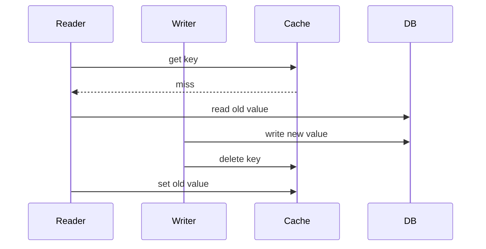
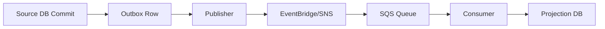
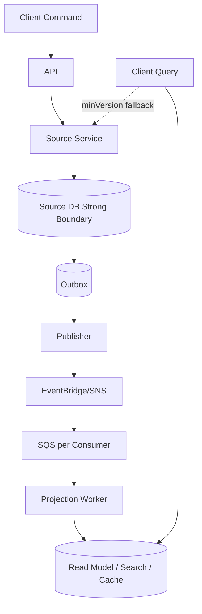
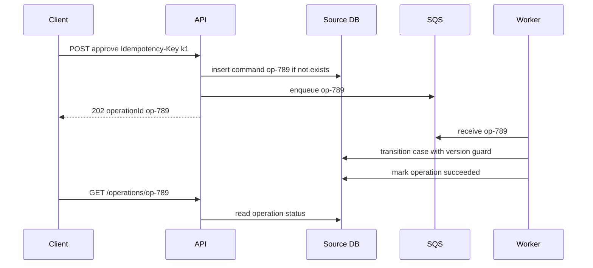

# Part 052 — Consistency Models: Strong, Eventual, Read-After-Write, Transactional Boundary

> Consistency bukan pilihan moral antara “benar” dan “cepat”. Consistency adalah kontrak observasi: setelah sebuah write terjadi, siapa boleh melihat apa, kapan, dari mana, dan dengan konsekuensi apa jika mereka melihat state lama.

Di sistem AWS modern, satu request bisa melewati:

```txt
API Gateway -> Lambda/ECS -> Aurora/DynamoDB -> Outbox -> EventBridge -> SQS -> Projection -> Cache -> UI
```

Tidak ada satu consistency model tunggal untuk seluruh jalur itu.

Ada beberapa boundary:

- database primary;
- read replica;
- transaction;
- event bus;
- queue;
- projection;
- cache;
- search index;
- global replication;
- workflow execution state;
- client local state.

Engineer top-tier tidak bertanya:

> “Apakah sistem ini strong consistent?”

Pertanyaan yang benar:

> “Untuk invariant ini, pada boundary mana kita butuh consistency apa, dan anomaly mana yang masih aman?”

---

## 1. Mental Model: Consistency Adalah Kontrak Observasi

Misalnya user submit payment.

Write berhasil di database pada `10:00:00.000`.

Kemudian ada beberapa pembaca:

| Pembaca | Pertanyaan |
|---|---|
| API caller yang retry | apakah harus melihat result yang sama? |
| UI setelah redirect | apakah harus melihat payment success? |
| read replica | apakah sudah catch up? |
| EventBridge consumer | apakah event sudah delivered? |
| SQS worker | apakah message sudah diproses? |
| search index | apakah status sudah ter-update? |
| cache | apakah value lama masih disajikan? |
| Region lain | apakah write sudah replicated? |

Satu write, banyak observasi.

Consistency model menjawab perilaku observasi itu.

---

## 2. Strong Consistency

Strong consistency secara praktis berarti read setelah write pada boundary tertentu melihat update terbaru yang sudah committed.

Di relational database primary, transaction committed biasanya dapat dibaca oleh subsequent read pada primary dengan isolation semantics engine tersebut.

Di DynamoDB, strongly consistent read tersedia untuk table dan Local Secondary Index, tetapi Global Secondary Index dan streams bersifat eventually consistent.

### Kapan Strong Consistency Dibutuhkan

Gunakan strong consistency untuk:

- keputusan uang;
- uniqueness;
- entitlement/permission kritis;
- inventory decrement;
- status transition yang tidak boleh salah;
- command retry after timeout;
- optimistic concurrency;
- source-of-truth read sebelum write;
- conflict resolution;
- regulatory decision boundary.

### Kapan Strong Consistency Tidak Wajib

Tidak semua read butuh strong consistency.

Boleh eventual untuk:

- dashboard;
- search result;
- notification list;
- activity feed;
- analytics summary;
- recommendation;
- cacheable catalog;
- UI list yang bisa refresh;
- projection yang punya freshness indicator.

Kuncinya: eventual consistency harus **disengaja**, bukan accidental.

---

## 3. Eventual Consistency

Eventual consistency berarti setelah tidak ada write baru, replica/projection/consumer pada akhirnya konvergen ke state terbaru.

Yang sering dilupakan: “eventual” tidak memberi janji kuat tentang **berapa cepat**, kecuali service/architecture Anda menambahkan SLO sendiri.

Contoh eventual boundary:

- DynamoDB GSI;
- DynamoDB Streams;
- SQS consumer processing;
- EventBridge target delivery;
- read projection;
- cache invalidation;
- OpenSearch index;
- async notification;
- cross-Region async replication;
- materialized view refresh.

### Eventual Consistency Bukan Masalah Jika Invariant-nya Aman

Contoh aman:

```txt
Order source table sudah ACCEPTED.
Search projection masih menampilkan PENDING selama 10 detik.
```

Jika UI memberi indikator refresh/staleness, ini mungkin aman.

Contoh tidak aman:

```txt
Payment sudah captured.
Retry API membaca projection stale dan melakukan capture kedua.
```

Itu bukan eventual consistency yang diterima. Itu salah boundary.

Command path tidak boleh bergantung pada stale projection untuk invariant kritis.

---

## 4. Read-After-Write Consistency

Read-after-write adalah pengalaman bahwa setelah user menulis, user yang sama melihat tulisannya.

Ini sering lebih penting dari strong consistency global.

Contoh:

```txt
User update profile.
Redirect ke profile page.
Page harus menampilkan nama baru.
```

Solusi:

| Pattern | Cara Kerja |
|---|---|
| Read from primary | query source DB setelah write |
| Return write result | response command membawa state terbaru |
| Session stickiness to source | untuk window pendek, baca source |
| Version token | client meminta minimal version tertentu |
| Poll until projection version | query read model sampai catch up |
| Optimistic UI | client tampilkan state baru sambil refresh |

### Version Token Pattern

Command response:

```json
{
  "caseId": "case-123",
  "status": "ACCEPTED",
  "version": 18
}
```

Query read model:

```http
GET /cases/case-123?minVersion=18
```

Behavior:

- jika projection version >= 18, return data;
- jika belum, return `202 Accepted`, stale marker, atau fallback source read;
- jangan diam-diam return version 17 seolah final.

---

## 5. Monotonic Read

Monotonic read berarti client tidak melihat waktu mundur.

Buruk:

```txt
Refresh 1: status = APPROVED
Refresh 2: status = SUBMITTED
```

Ini bisa terjadi jika request pertama membaca primary/projection baru, request kedua membaca replica/projection lama.

Pattern:

- client membawa `lastSeenVersion`;
- server tidak boleh mengembalikan versi lebih rendah;
- gunakan sticky read source sementara;
- simpan session consistency token;
- projection API menolak jika belum catch up.

Contoh response:

```json
{
  "caseId": "case-123",
  "status": "APPROVED",
  "version": 42,
  "projectionLagMs": 2300
}
```

Client berikutnya mengirim:

```http
X-Min-Observed-Version: 42
```

---

## 6. Transactional Consistency

Transaction memberi boundary atomicity/isolation/durability tertentu.

Tetapi transaction boundary selalu punya scope.

| Boundary | Yang Bisa Dijaga |
|---|---|
| Single row/item | atomic update field entity |
| Single DB transaction | multi-row/table invariant dalam satu DB |
| DynamoDB transaction | multi-item invariant dalam limit transaction |
| Step Functions saga | long-running consistency dengan compensation |
| Outbox pattern | DB write + event record atomik dalam DB |
| Cross-service event flow | eventual consistency + reconciliation |

Jangan menganggap Step Functions saga sama dengan database transaction.

Saga menjaga proses bisnis dengan compensation. Ia tidak memberi isolation seperti database transaction.

---

## 7. Isolation Level: Consistency di Dalam Relational Transaction

Relational database punya isolation level yang mempengaruhi anomaly.

Anomaly umum:

| Anomaly | Arti |
|---|---|
| Dirty read | membaca data uncommitted |
| Non-repeatable read | read row yang sama berubah dalam transaction |
| Phantom read | query range menghasilkan row baru/hilang |
| Lost update | dua writer saling overwrite |
| Write skew | dua transaction masing-masing valid, bersama-sama merusak invariant |

AWS RDS/Aurora engine mengikuti behavior database engine yang dipilih seperti PostgreSQL/MySQL. Jadi design harus spesifik engine, bukan sekadar “RDS”.

### Practical Guidance

- gunakan unique constraint untuk uniqueness;
- gunakan `SELECT ... FOR UPDATE` atau optimistic version untuk conflict;
- hindari transaction panjang;
- tangani deadlock dengan retry terbatas;
- jangan memakai read replica untuk command validation;
- pilih isolation sesuai invariant, bukan default blindly;
- test concurrent scenario, bukan hanya happy path.

Contoh optimistic update:

```sql
update cases
set status = 'APPROVED', version = version + 1
where case_id = :caseId
  and status = 'UNDER_REVIEW'
  and version = :expectedVersion;
```

Affected rows = 0 berarti conflict atau invalid transition.

---

## 8. DynamoDB Consistency Model

DynamoDB punya beberapa consistency surface.

| Surface | Consistency |
|---|---|
| Table read | eventually consistent default, strongly consistent optional |
| LSI read | eventually consistent default, strongly consistent optional |
| GSI read | eventually consistent only |
| Streams | eventually consistent event stream |
| Transactions | all-or-nothing write/read APIs |
| Global Tables | multi-Region replication dengan mode consistency tertentu |
| DAX | cache layer; strongly consistent reads passed through to DynamoDB and not cached |

### Strong Read Example

```ts
const item = await dynamodb.send(new GetCommand({
  TableName: "cases",
  Key: { pk: "CASE#123", sk: "STATE" },
  ConsistentRead: true
}));
```

Gunakan untuk command decision yang butuh latest state.

### Conditional Write Example

```ts
await dynamodb.send(new UpdateCommand({
  TableName: "cases",
  Key: { pk: "CASE#123", sk: "STATE" },
  UpdateExpression: "SET #s = :approved, version = version + :one",
  ConditionExpression: "#s = :underReview AND version = :expectedVersion",
  ExpressionAttributeNames: { "#s": "status" },
  ExpressionAttributeValues: {
    ":approved": "APPROVED",
    ":underReview": "UNDER_REVIEW",
    ":expectedVersion": 17,
    ":one": 1
  }
}));
```

Conditional write lebih kuat daripada read-then-write.

---

## 9. DynamoDB GSI Staleness Trap

GSI adalah projection. Jangan menggunakannya untuk invariant yang membutuhkan latest state.

Contoh buruk:

```txt
Query GSI by email.
Jika tidak ada user, create user.
```

Karena GSI eventually consistent, dua request concurrent bisa melihat email belum ada lalu membuat duplicate bila tidak ada uniqueness guard.

Pattern benar:

```txt
Use transaction/conditional write on unique key item.
Then allow GSI to catch up for query/read UX.
```

GSI bagus untuk:

- lookup read path;
- list/search projection;
- query by alternative access pattern;
- eventually consistent UI.

GSI tidak cukup untuk:

- uniqueness decision;
- permission decision kritis;
- money movement;
- exactly-once effect;
- command conflict detection.

---

## 10. DynamoDB Global Tables Consistency

Global tables memperluas consistency problem ke Region.

Dengan multi-Region active-active, Anda harus bertanya:

- apakah writer di banyak Region boleh mengubah item yang sama?;
- apa conflict policy?;
- apakah last-writer-wins aman?;
- apakah transaction API tersedia untuk mode consistency yang dipilih?;
- apakah application butuh locality atau correctness lintas Region?;
- apa recovery behavior saat Region reconnect?

Design yang aman sering memakai **regional ownership**:

```txt
Tenant A primary write Region = ap-southeast-1
Tenant B primary write Region = eu-west-1
```

Atau **entity ownership**:

```txt
caseId hash menentukan home Region.
Only home Region accepts writes for that case.
Other Regions serve read/proxy.
```

Kalau semua Region boleh write entity yang sama, conflict resolution harus menjadi domain decision, bukan default timestamp saja.

---

## 11. Aurora/RDS Read Replica Consistency

Read replica membantu scaling read, tetapi memperkenalkan lag.

Risiko:

- user submit lalu redirect membaca replica stale;
- command validation membaca replica dan menerima invalid command;
- duplicate creation karena uniqueness pre-check di replica;
- dashboard tidak punya freshness indicator;
- failover membuat connection/session behavior berubah.

Rule:

```txt
Command path reads from primary/source-of-truth.
Query path may read from replica/projection with staleness contract.
```

Pattern:

- route read-after-write ke primary untuk window pendek;
- expose replica lag metric;
- return data version;
- fallback primary if `minVersion` not met;
- use projection freshness indicator;
- do not validate critical invariant from replica.

---

## 12. Cache Consistency

Cache adalah deliberate inconsistency layer.

Cache bisa stale karena:

- TTL belum habis;
- invalidation event terlambat;
- writer lupa invalidate;
- race antara read miss dan write;
- cache warming pakai data lama;
- multi-node local cache tidak sinkron;
- failover cache loss.

### Cache-Aside Race



Hasil: cache menyimpan old value setelah invalidation.

Mitigasi:

- short TTL;
- versioned cache key;
- write-through untuk beberapa use case;
- compare version before set;
- stale-while-revalidate;
- cache only safe derived reads;
- source DB for command decisions.

### Versioned Key Pattern

```txt
case:case-123:v42
```

Jika state berubah ke version 43, key lama tidak perlu invalidation langsung. Reader yang tahu version baru membaca key baru.

---

## 13. Search Index Consistency

OpenSearch/search index adalah projection.

Ia bagus untuk:

- full-text search;
- filtering kompleks;
- relevance scoring;
- faceting;
- user-facing discovery.

Ia buruk sebagai:

- source of truth;
- command validation source;
- uniqueness checker;
- permission authority tanpa source check;
- audit source.

Search result harus punya stale semantics.

Contoh:

```json
{
  "results": [...],
  "indexFreshness": {
    "lastAppliedEventAt": "2026-07-06T10:00:05Z",
    "lagSeconds": 12
  }
}
```

Untuk action sensitif dari search result:

```txt
Search -> select result -> command API validates against source DB
```

---

## 14. Event-Driven Consistency

Event-driven system hampir selalu eventual.

Flow:



Konsistensi bisa delay di tiap edge.

Failure point:

- outbox belum dipublish;
- publish retry;
- event rule salah;
- target delivery gagal;
- SQS backlog;
- consumer failed;
- projection write conflict;
- schema mismatch;
- replay duplicate;
- projection rebuild.

Jangan menjual flow ini sebagai real-time strong consistency. Jual sebagai:

```txt
source strong, propagation eventual, projection freshness observable
```

---

## 15. Outbox Consistency

Transactional outbox menyelesaikan dual-write problem antara database update dan event publish.

Tanpa outbox:

```txt
1. update DB success
2. publish event fails
```

State berubah tetapi consumer tidak tahu.

Dengan outbox:

```txt
single DB transaction:
1. update domain table
2. insert outbox event row

publisher later:
3. publish outbox event
4. mark published
```

Outbox memberi atomicity antara domain write dan event record, bukan exactly-once delivery ke semua consumer.

Consumer tetap harus idempotent.

---

## 16. Inbox Consistency

Inbox pattern menjaga consumer idempotent.

```sql
create table consumer_inbox (
  consumer_name text not null,
  message_id text not null,
  processed_at timestamptz not null,
  primary key (consumer_name, message_id)
);
```

Processing transaction:

```txt
1. insert inbox row if not exists
2. apply side effect/projection update
3. commit
```

Duplicate message gagal insert inbox lalu di-ignore.

Untuk side effect eksternal, simpan external effect log juga.

---

## 17. Workflow Consistency

Step Functions menyimpan execution state. Domain database menyimpan domain state.

Jangan mencampur.

```txt
Workflow state:
- waiting for approval
- retrying provider call
- running compensation

Domain state:
- case status
- payment status
- order status
```

Step Functions bisa durable, tetapi ia bukan source of truth domain kecuali Anda sengaja mendesainnya begitu dan menerima coupling.

Pattern aman:

```txt
Step Functions orchestrates commands.
Each command performs local transaction on domain DB.
Domain DB guards invariant.
Workflow responds to result.
```

---

## 18. Consistency Decision Matrix

| Use Case | Recommended Consistency Boundary |
|---|---|
| create unique user email | conditional write/unique index on source DB |
| update case status | source DB transaction/conditional update |
| show updated profile after save | return write result or read primary/minVersion |
| list cases dashboard | projection/read replica eventual + freshness |
| send notification | eventual event delivery + idempotent consumer |
| search enforcement cases | OpenSearch projection + source validation on action |
| inventory reserve | strong/conditional write in owner boundary |
| payment capture | idempotency key + source DB/ledger transaction |
| workflow approval | Step Functions callback + domain state transition guard |
| cross-Region active-active writes | regional ownership or explicit conflict model |
| cache catalog | cache-aside with TTL/versioned keys |

---

## 19. Staleness Budget

Eventual consistency harus punya budget.

Contoh:

| Projection | Target Freshness | Hard Limit | Action |
|---|---:|---:|---|
| case search | < 30s | 5m | alert + pause bulk update |
| dashboard count | < 5m | 30m | mark stale |
| entitlement cache | < 5s | 30s | fallback source DB |
| payment reconciliation | < 1m | 10m | page on-call |
| notification feed | < 1m | 15m | delayed marker |

Tanpa staleness budget, eventual consistency menjadi excuse, bukan engineering decision.

### Freshness Metric

```txt
projection_lag_seconds = now - max(applied_event.occurredAt)
```

Tapi hati-hati: `occurredAt` bisa dari producer clock. Kadang lebih aman memakai `publishedAt` atau sequence/checkpoint timestamp.

---

## 20. UI Semantics for Consistency

UI harus jujur tentang consistency.

Bad UX:

```txt
User clicks approve.
UI immediately shows old status PENDING without explanation.
User clicks approve again.
```

Better UX:

```txt
User clicks approve.
API returns APPROVED version 42.
UI shows APPROVED immediately.
Background query waits until projection >= 42.
Button disabled based on command result.
```

Pattern UI:

- optimistic update for safe transitions;
- disable duplicate command using idempotency key;
- show “processing” for async command;
- poll operation status;
- expose stale data marker;
- prevent actions based solely on stale projection;
- source validation on final command.

---

## 21. Consistency and Idempotency

Idempotency is the seatbelt of weak consistency.

Without idempotency:

```txt
timeout -> retry -> duplicate write
```

With idempotency:

```txt
same command key -> same result
```

Idempotency consistency requirements:

- idempotency record write must be atomic with command decision or recoverable;
- duplicate request must read authoritative command record;
- in-progress state must be handled;
- request hash mismatch must be rejected;
- TTL must exceed retry/replay window;
- response replay must not rely on stale projection.

---

## 22. Consistency and Authorization

Authorization often has stricter consistency needs than people expect.

Example:

```txt
Admin revokes user permission.
User tries destructive action immediately after.
```

Can stale permission cache allow action?

Answer depends on risk.

| Action | Consistency Strategy |
|---|---|
| read public catalog | cache eventual ok |
| read own profile | session/cache ok |
| export sensitive data | source/strong permission check |
| delete regulatory case | latest authorization required |
| approve payment | latest authorization + domain guard |

Pattern:

- short TTL for permission cache;
- versioned entitlement token;
- source check for sensitive commands;
- revocation list for urgent revoke;
- audit every authorization decision;
- deny if consistency cannot be established for high-risk action.

---

## 23. Consistency and Backfill

Backfill is a consistency event.

During backfill:

- old rows/items are rewritten;
- projections may receive historical events;
- cache may be invalidated massively;
- concurrent live writes continue;
- schema versions may mix;
- event order may be artificial.

Safe pattern:

```txt
1. expand schema
2. dual write new field for live traffic
3. backfill only if target field absent or version older
4. verify counts/checksum
5. switch read path
6. contract old schema
```

Never run backfill that blindly overwrites live newer values.

Use version guard:

```sql
update cases
set normalized_status = :computed,
    migration_version = 3
where migration_version < 3
  and updated_at < :migrationStartTime;
```

Or DynamoDB condition:

```txt
ConditionExpression = attribute_not_exists(migrationVersion) OR migrationVersion < :v
```

---

## 24. Consistency and Restore/Disaster Recovery

Restore changes time.

If you restore database to 09:55 but event bus/projection/cache contains data until 10:05, consistency is broken.

DR plan must define:

- database restore point;
- outbox restore point;
- event replay window;
- projection rebuild strategy;
- cache flush;
- search reindex;
- idempotency record restore;
- external side effect reconciliation;
- user-visible data loss/rollback policy;
- Region failover conflict handling.

Rule:

```txt
Do not restore source DB without a plan for derived state.
```

---

## 25. Consistency Anomaly Catalog

| Anomaly | Example | Mitigation |
|---|---|---|
| Lost update | two reviewers overwrite status | version check |
| Duplicate effect | retry captures payment twice | idempotency key |
| Stale read | replica says order not paid | source read for command |
| Read-your-write violation | profile page shows old name | return result/minVersion |
| Out-of-order event | projection applies v44 before v43 | sequence guard |
| Replay duplicate | old event re-sends notification | inbox/effect log |
| Write skew | two approvals violate separation-of-duty rule | transaction/isolation/constraint |
| Phantom | range check misses new row | stronger isolation/locking/constraint |
| Zombie projection | deleted customer still in search | tombstone/delete event |
| Cache resurrection | stale cache set after invalidation | versioned key/compare version |
| Global conflict | two Regions update same item | ownership/conflict policy |

---

## 26. Implementation Pattern: Source Strong, Projection Eventual

Ini adalah baseline yang sering paling sehat.



Semantics:

- command correctness dijaga source DB;
- event propagation eventual;
- projection freshness visible;
- query may be stale;
- sensitive command revalidates source;
- replay is idempotent;
- projection rebuild is supported.

---

## 27. Implementation Pattern: Async Command with Operation Status

Untuk command yang lama:

```txt
POST /cases/case-123/approve
-> 202 Accepted
-> operationId = op-789
```

Flow:



Consistency contract:

- command accepted, not completed;
- operation status is source of truth for command progress;
- duplicate POST returns same operation;
- UI does not infer success from projection;
- worker idempotent.

---

## 28. Practical Design Questions

Untuk setiap flow, jawab:

1. Apa write authoritative?
2. Di mana commit dianggap berhasil?
3. Siapa boleh membaca hasil terbaru?
4. Apakah read path boleh stale?
5. Berapa staleness budget?
6. Apakah user harus read-your-write?
7. Bagaimana monotonic read dijaga?
8. Apa yang terjadi jika read replica lag?
9. Apa yang terjadi jika event terlambat?
10. Apa yang terjadi jika event duplicate?
11. Apa yang terjadi jika cache stale?
12. Apa yang terjadi jika Region lain punya value berbeda?
13. Bagaimana invariant diuji dalam concurrency?
14. Bagaimana operator mendeteksi drift?
15. Bagaimana reconciliation memperbaiki drift?

Jika jawaban Anda “biasanya cepat”, itu belum design.

---

## 29. Observability for Consistency

Metrics penting:

| Metric | Arti |
|---|---|
| projection lag | event tertinggal berapa lama |
| replica lag | read replica tertinggal berapa lama |
| stale read fallback count | berapa sering fallback source |
| conditional check failure | concurrency/duplicate/conflict signal |
| idempotency replay count | retry/duplicate behavior |
| outbox unpublished age | event publish delay |
| DLQ message count | delivery/consumer failure |
| cache hit stale version | cache returns old version |
| reconciliation mismatch | invariant drift |
| operation pending age | async command stuck |

Log penting:

- `aggregateId`;
- `aggregateVersion`;
- `commandId`;
- `idempotencyKey`;
- `eventId`;
- `eventVersion`;
- `correlationId`;
- `causationId`;
- `sourceRegion`;
- `readConsistency`;
- `projectionVersion`;
- `minRequestedVersion`.

---

## 30. Production Checklist

- [ ] setiap command path membaca authoritative state;
- [ ] uniqueness tidak bergantung pada eventually consistent index;
- [ ] read-after-write strategy jelas;
- [ ] monotonic read dijaga untuk UX penting;
- [ ] read replica/projection/cache punya staleness contract;
- [ ] stale projection tidak dipakai untuk decision kritis;
- [ ] event consumer idempotent;
- [ ] outbox dipakai untuk DB write + event publish;
- [ ] inbox/effect log dipakai untuk duplicate consumer;
- [ ] cache invalidation race dipertimbangkan;
- [ ] search index bukan source of truth;
- [ ] backfill punya version guard;
- [ ] restore/DR plan mencakup derived state;
- [ ] global replication punya ownership/conflict policy;
- [ ] consistency metrics dan alarms tersedia;
- [ ] reconciliation job mendeteksi invariant drift;
- [ ] failure drills mencakup stale read, duplicate event, replay, lag, failover.

---

## 31. Ringkasan

Consistency di AWS bukan satu tombol.

Anda akan memakai kombinasi:

```txt
strong consistency untuk invariant
transaction/conditional write untuk conflict
idempotency untuk retry/duplicate
outbox untuk DB + event consistency
eventual consistency untuk projection
freshness metric untuk visibility
fallback source read untuk UX penting
reconciliation untuk drift
```

Prinsip inti:

> Jangan memaksa seluruh sistem menjadi strongly consistent. Jadikan invariant kritis strong pada boundary yang tepat, lalu buat semua derived state eventual, observable, replay-safe, dan rebuildable.

---

## References

- Amazon DynamoDB Developer Guide — Read consistency: https://docs.aws.amazon.com/amazondynamodb/latest/developerguide/HowItWorks.ReadConsistency.html
- Amazon DynamoDB Developer Guide — DynamoDB transactions: https://docs.aws.amazon.com/amazondynamodb/latest/developerguide/transaction-apis.html
- Amazon DynamoDB Developer Guide — Global tables: https://docs.aws.amazon.com/amazondynamodb/latest/developerguide/GlobalTables.html
- Amazon DynamoDB Developer Guide — Global tables how it works: https://docs.aws.amazon.com/amazondynamodb/latest/developerguide/globaltables_HowItWorks.html
- Amazon DynamoDB Developer Guide — DAX and DynamoDB consistency models: https://docs.aws.amazon.com/amazondynamodb/latest/developerguide/DAX.consistency.html
- AWS Prescriptive Guidance — Transactional outbox pattern: https://docs.aws.amazon.com/prescriptive-guidance/latest/cloud-design-patterns/transactional-outbox.html
- AWS Prescriptive Guidance — Saga pattern: https://docs.aws.amazon.com/prescriptive-guidance/latest/cloud-design-patterns/saga.html
- Amazon RDS User Guide — Working with read replicas: https://docs.aws.amazon.com/AmazonRDS/latest/UserGuide/USER_ReadRepl.html
- AWS Well-Architected Framework — Data management: https://docs.aws.amazon.com/wellarchitected/latest/performance-efficiency-pillar/data-management.html
