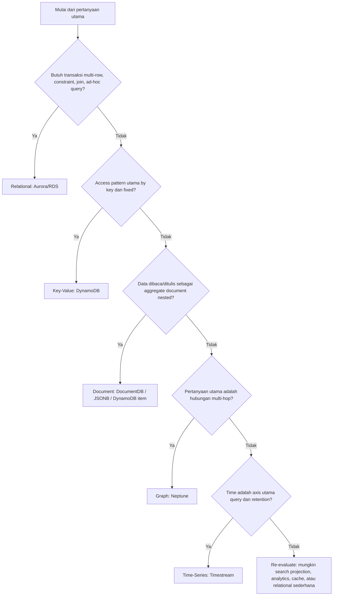
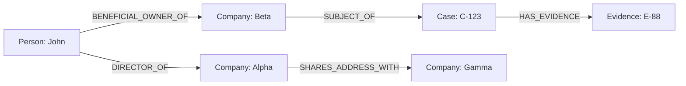
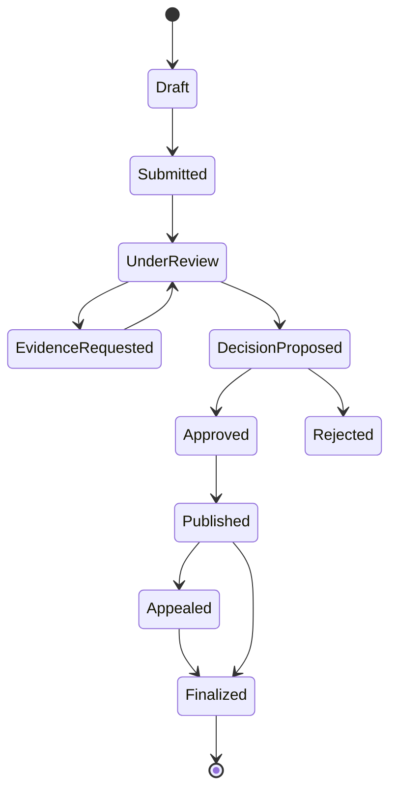
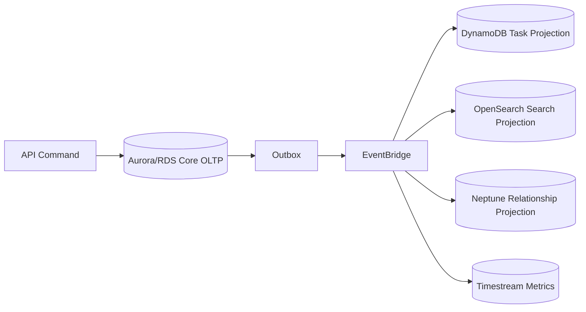

# Part 053 — Relational vs Key-Value vs Document vs Graph vs Time-Series

Database bukan cuma tempat menyimpan data.

Database adalah **mesin constraint + mesin akses + mesin durability**.

Kalau hanya dilihat sebagai tempat simpan, semua database terlihat mirip:

```txt
create -> read -> update -> delete
```

Tapi di production, yang membedakan database bukan CRUD. Yang membedakan adalah:

1. **bagaimana data diidentifikasi**,
2. **bagaimana data dicari**,
3. **bagaimana data berubah**,
4. **invariant apa yang harus dijaga**,
5. **berapa mahal query ketika data membesar**,
6. **apa failure mode ketika traffic, data, dan organisasi ikut membesar**.

AWS menyediakan banyak pilihan database purpose-built. AWS Well-Architected menekankan bahwa data store sebaiknya dipilih berdasarkan query pattern, scaling characteristic, storage characteristic, throughput, access frequency, update frequency, availability, dan durability constraint, bukan berdasarkan preferensi engine semata. Lihat AWS Well-Architected Performance Efficiency: [PERF03-BP01 Use a purpose-built data store](https://docs.aws.amazon.com/wellarchitected/latest/framework/perf_data_use_purpose_built_data_store.html) dan AWS Decision Guide: [Choosing an AWS database service](https://docs.aws.amazon.com/databases-on-aws-how-to-choose/).

Bagian ini membandingkan lima keluarga besar:

- relational,
- key-value,
- document,
- graph,
- time-series.

Tujuannya bukan menghafal service, tetapi membangun kemampuan memilih database dari **shape of truth**.

---

## 1. Mental Model: Shape of Truth

Sebelum memilih database, tanyakan:

> “Bentuk kebenaran data saya seperti apa?”

Bukan:

> “Database apa yang sedang populer?”

Setiap workload punya bentuk kebenaran berbeda.

Contoh domain regulatory case management:

| Pertanyaan | Bentuk Data | Database yang Mungkin Cocok |
|---|---|---|
| Apakah satu case boleh masuk dua status final sekaligus? | invariant transaksional | relational / transactional KV |
| Ambil detail case by ID dengan SLA rendah | key lookup | key-value / relational indexed lookup |
| Tampilkan dokumen evidence dengan struktur fleksibel | aggregate document | document / relational JSONB / object storage + metadata DB |
| Cari hubungan antara company, officer, case, complaint, suspicious account | relationship traversal | graph / relational tergantung depth |
| Simpan telemetry event enforcement workflow per detik | append-only time series | time-series / object store + analytics |
| Tampilkan dashboard case open per region | derived read model | relational projection / OpenSearch / DynamoDB / analytics store |

Satu sistem bisa punya beberapa shape. Itu tidak otomatis berarti harus punya banyak database. Tapi itu berarti **satu database tidak boleh dipilih tanpa memahami access shape**.

---

## 2. Lima Bentuk Utama Database

### 2.1 Relational

Relational database menyimpan data dalam table, row, column, constraint, index, dan relation.

Kekuatan utamanya:

- transaksi kuat,
- referential integrity,
- query fleksibel,
- join,
- constraint,
- ad-hoc investigation,
- mature tooling,
- predictable correctness untuk domain kompleks.

AWS mapping:

- Amazon RDS,
- Amazon Aurora,
- Amazon Aurora PostgreSQL,
- Amazon Aurora MySQL,
- RDS for PostgreSQL/MySQL/MariaDB/Oracle/SQL Server/Db2.

### 2.2 Key-Value

Key-value database mengoptimalkan lookup by key dan akses yang sudah diketahui.

Kekuatan utamanya:

- latency rendah,
- horizontal scale,
- simple access pattern,
- high throughput,
- predictable cost jika key design benar.

AWS mapping:

- Amazon DynamoDB.

### 2.3 Document

Document database menyimpan aggregate sebagai document, biasanya JSON-like.

Kekuatan utamanya:

- schema fleksibel,
- aggregate locality,
- nested structure,
- evolusi field cepat,
- cocok untuk object-like domain yang dibaca sebagai satu dokumen.

AWS mapping:

- Amazon DocumentDB,
- DynamoDB document-ish item model untuk beberapa pattern,
- Aurora PostgreSQL JSONB untuk hybrid relational-document.

### 2.4 Graph

Graph database menyimpan node, edge, dan property. Fokusnya bukan entity saja, tetapi hubungan antar entity.

Kekuatan utamanya:

- relationship traversal,
- multi-hop query,
- pattern matching,
- fraud/risk network,
- knowledge graph,
- dependency graph.

AWS mapping:

- Amazon Neptune.

### 2.5 Time-Series

Time-series database mengoptimalkan data yang selalu punya waktu sebagai axis utama.

Kekuatan utamanya:

- ingest tinggi,
- time-window query,
- retention tiering,
- rollup,
- metric/event analytics,
- append-heavy workload.

AWS mapping:

- Amazon Timestream,
- Amazon Managed Service for Prometheus untuk metric tertentu,
- S3/data lake untuk long-term analytical archive,
- Aurora/PostgreSQL partitioning untuk workload time-based yang masih relational.

---

## 3. Decision Map Singkat



Decision tree ini bukan hukum mutlak. Ini alat untuk menghindari pilihan yang terlalu cepat.

Rule sederhana:

> Pilih database yang membuat query utama menjadi natural, bukan database yang memaksa semua query penting menjadi workaround.

---

## 4. Perbandingan Cepat

| Dimensi | Relational | Key-Value | Document | Graph | Time-Series |
|---|---|---|---|---|---|
| Unit utama | row/table | item/key | document | node/edge | measurement/event |
| Query natural | SQL, join, filter, aggregate | get/query by key | document lookup/filter | traversal/path | time-window query |
| Strength | correctness + flexibility | scale + latency | aggregate locality | relationship reasoning | high ingest + retention |
| Weakness | scaling write horizontal lebih kompleks | query harus known upfront | schema drift, unbounded document | supernode, traversal cost | high-cardinality trap |
| Invariant | constraint + transaction | conditional write + transaction terbatas | app-level/schema validation | graph integrity + app rules | ingestion/retention rules |
| AWS service | Aurora/RDS | DynamoDB | DocumentDB/JSONB | Neptune | Timestream |
| Cocok untuk | ledger-ish OLTP, case mgmt, order | session, cart, lookup, high-scale aggregate | catalog, profile, flexible metadata | fraud, dependency, relationship | telemetry, IoT, metrics |
| Hati-hati pada | locks, deadlock, replica lag | hot partition, GSI lag | document growth, query index | query explosion | cardinality, late data |

---

## 5. Relational Database: Ketika Constraint Lebih Mahal daripada Query

Relational database cocok saat sistem punya banyak invariant yang harus benar secara eksplisit.

Contoh invariant:

- satu `case_id` hanya boleh punya satu active investigation,
- status tidak boleh lompat dari `DRAFT` ke `SANCTIONED` tanpa approval,
- `appeal.deadline_at` harus lebih besar dari `decision.issued_at`,
- evidence tidak boleh dihapus jika sudah dipakai dalam final decision,
- satu payment allocation tidak boleh melebihi outstanding penalty,
- user tidak boleh approve decision yang dia buat sendiri.

Relational database memberi primitive kuat:

- primary key,
- unique constraint,
- foreign key,
- check constraint,
- transaction,
- isolation,
- row-level lock,
- index,
- materialized view,
- trigger jika benar-benar diperlukan,
- stored procedure jika governance mengizinkan.

### 5.1 Kenapa Relational Sering Menang untuk Core System

Core system biasanya punya sifat:

- entity saling berhubungan,
- lifecycle kompleks,
- auditability tinggi,
- query investigation tidak selalu diketahui sejak awal,
- correctness lebih penting daripada raw write throughput,
- regulator/auditor butuh alasan keputusan.

SQL memberi bahasa eksplorasi yang sulit ditandingi database lain.

Misalnya pertanyaan investigasi:

```sql
SELECT c.id, c.status, d.issued_at, COUNT(e.id) AS evidence_count
FROM cases c
JOIN decisions d ON d.case_id = c.id
LEFT JOIN evidences e ON e.case_id = c.id
WHERE c.region = 'JKT'
  AND d.outcome = 'SANCTION'
  AND d.issued_at >= now() - interval '90 days'
GROUP BY c.id, c.status, d.issued_at
ORDER BY d.issued_at DESC;
```

Di key-value database, query seperti ini harus diprediksi sebagai access pattern, dibuat projection, atau dipindah ke analytical/search store.

Relational lebih fleksibel untuk unknown questions.

### 5.2 Tapi Relational Tidak Gratis

Failure mode relational:

- lock contention,
- deadlock,
- long transaction,
- connection exhaustion,
- replica lag,
- migration lock,
- slow query karena missing index,
- query planner regression,
- hot table/index,
- noisy neighbor query,
- accidental Cartesian join,
- write amplification karena terlalu banyak index.

Relational database bisa terlihat sederhana di development, tetapi menjadi bottleneck ketika:

- semua service berbagi database yang sama,
- query reporting berjalan di primary OLTP,
- API request membuka transaction terlalu lama,
- application connection pool lebih besar daripada database capacity,
- retry dilakukan tanpa idempotency,
- schema change dilakukan tanpa expand/migrate/contract.

### 5.3 Relational Cocok Jika

Gunakan relational jika:

- data punya banyak relationship dan constraint,
- query tidak semuanya bisa diketahui sejak awal,
- multi-row transaction dibutuhkan,
- auditability dan explainability penting,
- domain lifecycle kompleks,
- consistency kuat lebih penting dari extreme write scale,
- team punya SQL discipline.

### 5.4 Relational Tidak Cocok Jika

Hindari relational sebagai primary engine jika:

- workload murni key lookup skala sangat besar,
- schema sangat volatile dan validasi domain longgar,
- data append-only time-series dengan volume tinggi,
- query utama adalah traversal multi-hop dalam graph besar,
- aplikasi butuh write scale global active-active yang tidak cocok dengan single-writer topology,
- relational dipakai hanya karena “semua orang tahu SQL”.

---

## 6. Key-Value Database: Ketika Access Pattern Diketahui dan Latency Harus Stabil

Key-value database seperti DynamoDB cocok ketika pertanyaan utama berbentuk:

```txt
given key -> get item(s)
```

Contoh:

- ambil session by token,
- ambil user preferences by user ID,
- ambil case summary by case ID,
- list tasks by assignee and due date,
- simpan idempotency record by idempotency key,
- simpan command status by command ID,
- simpan tenant rate limit bucket by tenant ID,
- query item collection by partition key + sort key range.

Kekuatan key-value bukan “tidak punya schema”. Kekuatan sebenarnya adalah:

> query path dibuat eksplisit lewat key design.

### 6.1 DynamoDB Mental Model Singkat

DynamoDB table terdiri dari item. Item diakses melalui primary key:

- partition key,
- optional sort key.

Query efektif biasanya:

- equality pada partition key,
- optional range/prefix/between pada sort key,
- optional filter setelah data dibaca.

Index:

- LSI: same partition key, different sort key,
- GSI: different partition/sort key, eventually consistent.

Dengan DynamoDB, model data biasanya dimulai dari access pattern:

```txt
AP1: Get case summary by caseId
AP2: List open tasks by assignee ordered by dueAt
AP3: List events for case ordered by occurredAt
AP4: Get idempotency record by idempotencyKey
AP5: List active cases by tenant and status
```

Lalu key didesain untuk menjawab access pattern itu.

Contoh single-table style:

```txt
PK                         SK                         Entity
CASE#C-123                 META                       CaseSummary
CASE#C-123                 EVENT#2026-07-06T10:15:00Z Event
CASE#C-123                 TASK#T-991                 Task
ASSIGNEE#U-42              DUE#2026-07-07#TASK#T-991  TaskLookup
IDEMPOTENCY#abc-123        COMMAND                    IdempotencyRecord
```

### 6.2 Key-Value Cocok Jika

Gunakan key-value jika:

- access pattern bisa didesain upfront,
- query utama by key atau narrow range,
- latency p99 harus stabil,
- traffic tinggi,
- entity bisa didenormalisasi dengan aman,
- join tidak dibutuhkan di request path,
- consistency bisa dibatasi pada item/transaction kecil,
- team siap menguji hot key dan GSI design.

### 6.3 Key-Value Tidak Cocok Jika

Hindari key-value jika:

- query eksploratif/ad-hoc penting,
- banyak join dinamis,
- filter kompleks pada banyak attribute,
- business question sering berubah tanpa projection strategy,
- banyak global uniqueness yang sulit dimodelkan,
- team belum siap dengan access-pattern-first modeling,
- “kita pilih DynamoDB karena scale” tetapi traffic masih kecil dan domain penuh constraint.

### 6.4 Failure Mode Key-Value

Failure mode utama:

- hot partition,
- unbounded item collection,
- GSI backpressure,
- GSI eventual consistency surprise,
- query dengan filter expression yang membaca banyak data lalu membuang sebagian,
- item size limit,
- conditional check failure storm,
- write sharding yang merusak query simplicity,
- TTL bukan deletion guarantee real-time,
- transaction dipakai seperti relational join substitute.

Key-value database cepat jika key-nya benar. Jika key-nya salah, database menjadi mahal dan sulit dioperasikan.

---

## 7. Document Database: Ketika Aggregate Dibaca sebagai Dokumen

Document database cocok ketika entity natural dibaca sebagai satu document.

Contoh:

```json
{
  "caseId": "C-123",
  "title": "Unauthorized financial promotion",
  "subject": {
    "companyId": "CO-88",
    "name": "Example Capital"
  },
  "currentStatus": "UNDER_REVIEW",
  "riskSignals": [
    { "type": "COMPLAINT_SPIKE", "score": 0.87 },
    { "type": "UNLICENSED_ACTIVITY", "score": 0.92 }
  ],
  "metadata": {
    "source": "market_surveillance",
    "campaign": "2026-Q3"
  }
}
```

Data ini punya nested structure. Banyak field mungkin optional. Document bisa berubah lebih cepat daripada schema relational formal.

### 7.1 Document Cocok Jika

Gunakan document database jika:

- aplikasi membaca/menulis aggregate document,
- struktur nested penting,
- field bervariasi antar entity,
- schema evolution sering,
- relationship antar document tidak terlalu dalam,
- query utama masih bisa didukung index,
- validasi schema dikontrol application/contract layer.

Contoh workload:

- product catalog,
- user profile,
- risk profile snapshot,
- form submission dengan dynamic fields,
- content/document metadata,
- configuration object,
- workflow payload snapshot.

### 7.2 Document Tidak Sama dengan “Bebas Schema”

Document database sering disalahpahami sebagai no-schema.

Di production, schema tetap ada. Bedanya, schema sering hidup di:

- application code,
- JSON schema,
- API contract,
- validation library,
- migration script,
- consumer expectation.

Jika schema tidak dikelola, document database berubah menjadi arsip JSON yang tidak bisa dipercaya.

Masalah umum:

```txt
case.status      = "UNDER_REVIEW"
case.state       = "under-review"
case.workflowStatus = "UNDER_REVIEW_PENDING"
case.current_status = 3
```

Semua terlihat fleksibel sampai reporting, migration, dan incident datang.

### 7.3 Document Database vs Relational JSONB

Kadang pilihan bukan DocumentDB vs Aurora. Pilihannya bisa:

- relational table untuk invariant utama,
- JSONB column untuk metadata fleksibel,
- generated column/index untuk field penting,
- object storage untuk payload besar,
- search projection untuk full-text/faceted query.

Contoh hybrid:

```sql
CREATE TABLE cases (
  id uuid PRIMARY KEY,
  tenant_id uuid NOT NULL,
  status text NOT NULL,
  subject_id uuid NOT NULL,
  created_at timestamptz NOT NULL,
  metadata jsonb NOT NULL DEFAULT '{}',
  CONSTRAINT valid_status CHECK (status IN ('DRAFT', 'UNDER_REVIEW', 'CLOSED'))
);

CREATE INDEX cases_metadata_risk_idx
ON cases ((metadata->>'riskLevel'));
```

Ini bisa lebih tepat daripada memindahkan seluruh core case data ke document database.

### 7.4 Failure Mode Document

Failure mode utama:

- unbounded document growth,
- array update contention,
- index explosion,
- schema drift,
- hidden relationship yang butuh join,
- partial update yang merusak invariant,
- duplicate embedded data menjadi stale,
- query scan karena index tidak sesuai,
- document sebagai dumping ground payload event/API.

Document database bagus untuk aggregate yang natural. Buruk untuk domain yang sebenarnya relational tetapi dipaksa menjadi JSON.

---

## 8. Graph Database: Ketika Hubungan Adalah Data Utama

Graph database cocok ketika pertanyaan utama bukan:

```txt
apa atribut entity ini?
```

Tapi:

```txt
bagaimana entity ini terhubung dengan entity lain?
```

Contoh pertanyaan:

- apakah company A dan company B terhubung melalui beneficial owner yang sama?
- akun mana yang menjadi hub transfer mencurigakan dalam 3 hop?
- officer mana yang terkait dengan banyak entity berisiko?
- case mana yang punya evidence yang berasal dari source yang sama?
- vendor mana yang menjadi single point of failure dalam dependency graph?
- apakah ada circular ownership?

Relational bisa menjawab sebagian query graph, tetapi multi-hop dynamic traversal sering menjadi kompleks dan mahal.

### 8.1 Graph Model

Graph terdiri dari:

- node/vertex: entity,
- edge: relationship,
- property: attribute pada node/edge.

Contoh:



Pertanyaan graph:

```txt
Find all companies within 3 hops of Company Alpha that are connected to a sanctioned case.
```

Ini bukan sekadar join. Ini traversal.

### 8.2 Graph Cocok Jika

Gunakan graph jika:

- relationship multi-hop adalah fitur utama,
- depth traversal tidak diketahui upfront,
- entity relationship berubah sering,
- fraud/risk/recommendation/dependency analysis penting,
- relationship punya property penting,
- query mencari pattern dalam jaringan,
- relational query menjadi recursive CTE berat dan sulit di-maintain.

### 8.3 Graph Tidak Cocok Jika

Hindari graph jika:

- query hanya lookup by ID,
- relationship shallow dan fixed,
- semua pertanyaan bisa dijawab dengan join sederhana,
- data lebih natural sebagai aggregate document,
- team tidak punya graph query skill,
- graph dipilih karena diagram domain terlihat seperti node-edge.

Banyak domain bisa digambar sebagai graph. Itu tidak berarti perlu graph database.

### 8.4 Failure Mode Graph

Failure mode utama:

- supernode: node dengan edge sangat banyak,
- traversal explosion,
- query tanpa bound depth,
- edge semantics tidak konsisten,
- graph menjadi duplicate source of truth,
- ingestion lag dari source relational/event,
- relationship deletion tidak sinkron,
- authorization traversal mahal,
- sulit menjelaskan query performance tanpa skill graph.

Graph database kuat untuk relationship-heavy workload. Tapi jangan jadikan graph sebagai primary OLTP default jika invariant utama masih transaction row/table.

---

## 9. Time-Series Database: Ketika Waktu Adalah Axis Utama

Time-series database cocok untuk data seperti:

- metric,
- sensor reading,
- operational telemetry,
- audit event volume tinggi,
- state transition events,
- clickstream,
- IoT measurement,
- workflow duration samples,
- queue lag samples,
- rate limit consumption,
- application performance data.

Bentuk umum:

```txt
time + dimensions + measure(s)
```

Contoh:

```txt
time: 2026-07-06T10:15:00Z
dimensions:
  tenantId = T-01
  workflow = ENFORCEMENT_REVIEW
  region = ap-southeast-3
measure:
  stepDurationMs = 842
```

### 9.1 Time-Series Cocok Jika

Gunakan time-series jika:

- data append-heavy,
- query utama by time window,
- retention berbeda untuk hot/cold data,
- agregasi time bucket penting,
- high ingest rate,
- late-arriving data bisa ditangani,
- data detail lama bisa diringkas/diturunkan resolusinya.

AWS mapping paling jelas:

- Amazon Timestream untuk time-series database managed,
- CloudWatch Metrics untuk operational metrics,
- Prometheus untuk metric monitoring ecosystem,
- S3/data lake untuk archive analytics,
- Aurora/PostgreSQL partitioning jika time-series masih punya relational transaction/query needs.

### 9.2 Time-Series Tidak Cocok Jika

Hindari time-series primary DB jika:

- entity lifecycle utama butuh update kompleks,
- query utama bukan by time,
- record sering di-update sebagai mutable aggregate,
- foreign key/transaction kuat dibutuhkan,
- data sebenarnya event log yang butuh replay semantics kuat,
- cardinality dimension tidak terkendali.

### 9.3 Failure Mode Time-Series

Failure mode utama:

- cardinality explosion,
- too many dimensions,
- high write volume tanpa retention policy,
- query time range terlalu besar,
- raw data disimpan selamanya tanpa rollup,
- late data tidak dipikirkan,
- downsampling merusak forensic requirement,
- operational metrics dicampur dengan legal audit trail.

Time-series database bagus untuk memahami perilaku sistem sepanjang waktu. Tetapi untuk audit hukum/regulatory, event audit trail mungkin harus disimpan sebagai immutable ledger/event store terpisah dengan retention dan evidentiary guarantees yang lebih ketat.

---

## 10. Search Projection dan Cache Bukan Pengganti Database Utama

Dua kategori sering disalahgunakan dalam diskusi database:

- search engine,
- cache.

### 10.1 Search Projection

OpenSearch sangat berguna untuk:

- full-text search,
- faceted search,
- relevance ranking,
- text analysis,
- filtering cepat pada projection,
- investigation UI.

Tapi search index biasanya bukan source of truth.

Search index bisa:

- lag,
- duplicate,
- kehilangan update sementara,
- perlu reindex,
- punya analyzer-dependent behavior,
- punya eventual consistency dengan DB utama.

Gunakan search sebagai **query projection**, bukan tempat menjaga invariant utama.

### 10.2 Cache

ElastiCache/MemoryDB berguna untuk:

- latency rendah,
- reduce database load,
- session state,
- rate limit,
- ephemeral computation,
- hot read.

Tapi cache harus punya strategy:

- cache-aside,
- write-through,
- TTL,
- versioned key,
- invalidation,
- stale read tolerance,
- stampede protection.

Kalau cache down, sistem harus tahu apakah:

- degrade,
- fail closed,
- fail open,
- fallback ke database,
- reject traffic.

Cache tanpa failure model adalah hutang operasional.

---

## 11. Query Shape: Cara Paling Praktis Memilih Database

Jangan mulai dari entity diagram.

Mulai dari pertanyaan production.

### 11.1 Access Pattern Sheet

Gunakan format berikut:

| ID | Pertanyaan | Frequency | Latency SLO | Consistency | Cardinality | Candidate |
|---|---|---:|---:|---|---:|---|
| AP1 | Get case by ID | high | p99 < 50 ms | strong/read-your-write | 1 | relational/key-value |
| AP2 | List open tasks by assignee | high | p99 < 100 ms | eventual ok < 5s | 10-100 | DynamoDB GSI/relational index |
| AP3 | Search cases by text and facets | medium | p99 < 500 ms | eventual ok < 60s | thousands | OpenSearch projection |
| AP4 | Find related parties within 3 hops | low/medium | p95 < 2s | eventual ok | variable | Neptune projection |
| AP5 | Count workflow duration by hour | high analytics | p95 < 3s | eventual ok | millions | Timestream/analytics |
| AP6 | Enforce unique active sanction per subject | write path | transactional | strong | 1 | relational/transactional pattern |

Setiap access pattern harus punya:

- key/filter,
- sort order,
- expected result size,
- consistency need,
- latency target,
- update frequency,
- data growth estimate,
- failure behavior.

### 11.2 Query Shape Categories

| Query Shape | Natural Fit | Warning |
|---|---|---|
| Lookup by ID | key-value, relational | index key must be stable |
| Range by owner/time | key-value sort key, relational index, time-series | partition cardinality matters |
| Join many entities | relational | watch join cost/indexes |
| Nested aggregate read | document | watch document growth |
| Multi-hop relationship | graph | bound traversal depth |
| Full-text/facet search | search projection | not source of truth |
| Time bucket aggregate | time-series/analytics | cardinality and retention |
| Unknown ad-hoc query | relational/analytics | avoid overfitting NoSQL |

---

## 12. Consistency Shape: Jangan Pilih Database dari Read Path Saja

Read path sering membuat key-value/document/search terlihat menarik.

Tapi write path menentukan correctness.

Tanyakan:

1. invariant apa yang harus dicegah sebelum commit?
2. apakah uniqueness harus global?
3. apakah ada multi-entity transaction?
4. apakah duplicate command bisa terjadi?
5. apakah retry aman?
6. apakah update order penting?
7. apakah stale read bisa diterima?
8. apakah derived projection boleh lag?
9. apakah cross-region conflict mungkin?
10. apakah reconciliation tersedia?

### 12.1 Contoh Kesalahan

Tim memilih DynamoDB karena read path sederhana:

```txt
Get active sanction by subjectId
```

Lalu muncul invariant:

```txt
Subject cannot have two active sanctions overlapping in time.
```

Jika model key tidak mendukung conditional uniqueness dengan jelas, sistem bisa butuh:

- transactional write,
- unique guard item,
- conflict detection,
- reconciliation,
- relational fallback,
- redesign partition key.

Bukan berarti DynamoDB salah. Tapi choice harus dinilai dari write invariant, bukan read speed saja.

---

## 13. Mutation Shape: Bagaimana Data Berubah

Data model buruk sering lahir karena hanya melihat snapshot.

Yang lebih penting:

> Bagaimana data berubah sepanjang hidupnya?

### 13.1 Mutation Frequency

| Mutation Type | Implication |
|---|---|
| Immutable append | time-series/event log/object store cocok |
| Frequent small update | relational/key-value cocok, document perlu hati-hati |
| Large document rewrite | risk contention/cost |
| Status transition | state machine + invariant needed |
| Counter increment | atomic counter / sharded counter / aggregation strategy |
| Relationship add/remove | graph/relational join table |
| Bulk backfill | capacity, index, migration strategy |

### 13.2 Lifecycle Example

Case lifecycle:



Ini bukan sekadar data. Ini state machine.

Database harus mendukung:

- valid transition,
- actor authorization,
- audit trail,
- concurrent update prevention,
- event emission,
- derived projection refresh,
- rollback/compensation rules.

Relational cocok jika invariant kompleks. DynamoDB bisa cocok jika aggregate dan conditional writes dirancang jelas. Document bisa cocok untuk snapshot tambahan, tetapi jangan jadikan free-form JSON sebagai satu-satunya penjaga lifecycle.

---

## 14. AWS Service Mapping yang Lebih Realistis

### 14.1 Aurora/RDS

Pilih untuk:

- transactional OLTP,
- SQL queries,
- join,
- constraints,
- normalized core data,
- enterprise/reporting-friendly schema,
- audit-driven system.

Hati-hati:

- connection pool,
- failover behavior,
- replica lag,
- schema migration,
- lock contention,
- index bloat,
- long-running query.

### 14.2 DynamoDB

Pilih untuk:

- high-scale key access,
- predictable access pattern,
- low-latency lookup,
- idempotency store,
- command status,
- task list by partition,
- serverless architecture.

Hati-hati:

- hot partition,
- GSI design,
- query flexibility rendah,
- denormalization complexity,
- global tables conflict,
- projection lag.

### 14.3 DocumentDB

Pilih untuk:

- document-style workload,
- flexible nested data,
- MongoDB-compatible application pattern,
- aggregate-centric reads.

Hati-hati:

- compatibility nuance,
- schema drift,
- index design,
- multi-document invariant,
- document growth.

### 14.4 Neptune

Pilih untuk:

- graph traversal,
- knowledge graph,
- fraud/risk relationships,
- dependency map,
- recommendation/path query.

Hati-hati:

- supernode,
- traversal depth,
- graph source-of-truth confusion,
- query skill gap,
- sync from OLTP source.

### 14.5 Timestream

Pilih untuk:

- metric/time-series event,
- IoT/operational telemetry,
- time-window analysis,
- retention tiering.

Hati-hati:

- cardinality,
- retention legal needs,
- late-arriving data,
- raw vs rollup storage.

### 14.6 Keyspaces

Amazon Keyspaces cocok untuk Cassandra-compatible wide-column workloads. Pertimbangkan ketika:

- aplikasi sudah punya Cassandra data model,
- query by partition/clustering key,
- high-scale distributed write,
- wide-column access pattern natural.

Jangan pilih hanya karena “NoSQL”. Wide-column modeling juga access-pattern-first dan punya constraint kuat pada query shape.

---

## 15. Case Study 1: Enforcement Case Core

### Problem

Sistem enforcement case memiliki:

- case lifecycle kompleks,
- assignment,
- evidence,
- legal decision,
- appeal,
- sanction,
- audit trail,
- reporting.

### Bad Design

Semua data disimpan sebagai satu document:

```json
{
  "caseId": "C-123",
  "status": "UNDER_REVIEW",
  "tasks": [...],
  "evidences": [...],
  "decisions": [...],
  "appeals": [...],
  "audit": [...]
}
```

Awalnya enak. Setelah besar:

- document membesar,
- concurrent update sulit,
- partial update rentan,
- audit query berat,
- evidence array unbounded,
- decision invariant tidak jelas,
- migration sulit.

### Better Design

Core transactional data di relational:

```txt
cases
case_assignments
case_status_transitions
case_evidences
case_decisions
case_appeals
case_audit_entries
```

Projection tambahan:

- DynamoDB untuk task inbox low latency,
- OpenSearch untuk investigation search,
- Neptune untuk related-party graph,
- Timestream/CloudWatch untuk workflow metrics.

Mental model:



Core truth tetap satu. Projections boleh polyglot karena mereka derived state.

---

## 16. Case Study 2: Regulatory Relationship Risk

### Problem

An investigator wants to ask:

```txt
Which persons are connected within 3 hops to entities that have active sanctions and share addresses with high-risk firms?
```

Relational bisa:

- join tables,
- recursive CTE,
- indexes.

Tapi jika query relationship menjadi product feature utama, graph bisa lebih natural.

### Design

Source of truth:

- relational tables for companies/persons/cases/sanctions.

Graph projection:

- Neptune nodes: Person, Company, Case, Address, License,
- edges: DIRECTOR_OF, OWNS, SUBJECT_OF, SHARES_ADDRESS, SANCTIONED_IN.

Update path:

```txt
Core DB commit -> outbox -> EventBridge -> graph projector -> Neptune
```

Important invariant:

- graph is projection,
- core decision still reads source-of-truth before enforcement action,
- graph result is investigative lead, not legal final truth unless reconciled.

---

## 17. Case Study 3: High-Volume Workflow Metrics

### Problem

Need to observe:

- average review duration by step,
- stuck workflow count,
- p95 time from submission to decision,
- queue lag by tenant,
- human approval delay.

Do not put every metric query on OLTP database.

### Design

- OLTP database stores authoritative case state.
- Events are emitted for transitions.
- Metrics projector writes time-series measurements.
- Dashboard queries Timestream/CloudWatch/analytics store.

Event example:

```json
{
  "source": "enforcement.case",
  "detailType": "CaseWorkflowStepCompleted",
  "detail": {
    "caseId": "C-123",
    "tenantId": "T-01",
    "step": "LEGAL_REVIEW",
    "durationMs": 384000,
    "completedAt": "2026-07-06T10:15:00Z"
  }
}
```

This is time-series data. The core case row should not be abused as metrics store.

---

## 18. Anti-Patterns

### 18.1 “We Use One Database for Everything”

One database can be fine early. But one model for all access shapes is dangerous.

Symptoms:

- OLTP DB becomes search engine,
- search index becomes source of truth,
- cache contains business-critical state without recovery,
- DynamoDB table becomes ad-hoc reporting store,
- document DB becomes audit ledger,
- graph DB becomes transactional system.

### 18.2 “Microservice Means Database per Service Automatically”

Database-per-service can improve autonomy. It can also create:

- distributed transaction pain,
- data duplication,
- eventual consistency bugs,
- reporting complexity,
- operational overhead,
- migration overhead.

Do not split data before ownership is clear.

### 18.3 “NoSQL Means No Schema”

NoSQL moves schema responsibility. It does not remove it.

Schema still exists in:

- keys,
- item/document shape,
- indexes,
- event contracts,
- API contracts,
- consumer assumptions,
- migration scripts.

### 18.4 “Search Can Replace Database”

Search index is not the place for transactional invariant.

Use it for discovery and filtering. Confirm critical actions against source of truth.

### 18.5 “Graph Because Everything Is Connected”

Everything can be modeled as graph. The real question:

> Are relationship traversals central enough to justify a graph database operationally?

---

## 19. Selection Scorecard

Use this scorecard before choosing a database.

| Criterion | Weight | Relational | Key-Value | Document | Graph | Time-Series |
|---|---:|---:|---:|---:|---:|---:|
| Natural access pattern | 5 |  |  |  |  |  |
| Consistency/invariant fit | 5 |  |  |  |  |  |
| Query flexibility | 4 |  |  |  |  |  |
| Write scalability | 4 |  |  |  |  |  |
| Operational maturity | 5 |  |  |  |  |  |
| Cost predictability | 3 |  |  |  |  |  |
| Migration reversibility | 3 |  |  |  |  |  |
| Team expertise | 4 |  |  |  |  |  |
| Observability/debuggability | 4 |  |  |  |  |  |
| Failure-mode simplicity | 5 |  |  |  |  |  |

Scoring is not mathematical truth. It forces design conversation.

---

## 20. Practical Decision Rules

### Rule 1: Unknown Query + Strong Invariant → Relational First

If you do not know all future questions and correctness matters, relational is often the safest default.

### Rule 2: Known Query + Massive Scale → Key-Value Candidate

If access patterns are fixed and high-volume, key-value can be excellent.

### Rule 3: Aggregate Document + Flexible Fields → Document Candidate

If one entity is naturally nested and read as a whole, document can fit.

### Rule 4: Relationship Traversal Is Product Feature → Graph Candidate

If multi-hop relationships are not secondary but core, graph deserves serious evaluation.

### Rule 5: Time Window Is Primary Axis → Time-Series Candidate

If almost every query starts with time range and aggregation, use time-series/analytics pattern.

### Rule 6: Search and Cache Are Projections Unless Proven Otherwise

Treat search/cache as derived unless you have explicit design for source-of-truth semantics.

---

## 21. Design Review Questions

Before approving database selection, ask:

1. What are the top 10 access patterns?
2. What access patterns are impossible or expensive?
3. What invariants must be enforced before commit?
4. What consistency can users tolerate?
5. What query needs ad-hoc flexibility?
6. What data will grow unbounded?
7. What key/index can become hot?
8. What happens during replay/backfill?
9. What happens if projection lags?
10. What is source of truth?
11. What data can be reconstructed?
12. What data cannot be lost?
13. What is the rollback strategy?
14. What is the migration path away from this database?
15. Does the team know how to debug p99 latency on this engine?

---

## 22. Production Readiness Checklist

A database choice is not production-ready until these are explicit:

- [ ] source of truth identified,
- [ ] access pattern sheet completed,
- [ ] top queries load-tested,
- [ ] write invariants documented,
- [ ] consistency model documented,
- [ ] transaction/retry/idempotency boundary defined,
- [ ] index/key design reviewed,
- [ ] hot key/hot row risk evaluated,
- [ ] data growth forecast written,
- [ ] backup/restore tested,
- [ ] migration strategy defined,
- [ ] observability dashboard prepared,
- [ ] alarms mapped to runbooks,
- [ ] projection lag monitored,
- [ ] replay/backfill strategy tested,
- [ ] security and data residency reviewed,
- [ ] cost model estimated,
- [ ] failure drills executed.

---

## 23. Summary

Relational, key-value, document, graph, dan time-series bukan sekadar teknologi berbeda. Mereka adalah jawaban untuk bentuk pertanyaan yang berbeda.

Relational unggul ketika correctness, join, constraint, dan query flexibility penting.

Key-value unggul ketika access pattern diketahui dan latency/scale harus stabil.

Document unggul ketika aggregate nested dibaca/ditulis sebagai dokumen dan schema field bervariasi.

Graph unggul ketika hubungan multi-hop adalah data utama.

Time-series unggul ketika waktu adalah axis query, ingest, dan retention.

Pilihan database yang matang tidak dimulai dari brand service. Pilihan database yang matang dimulai dari:

```txt
access pattern + invariant + mutation shape + failure model + operational maturity
```

Kalau lima hal itu jelas, service AWS akan menjadi alat. Kalau tidak jelas, service AWS akan menjadi sumber complexity.

---

## References

- AWS Well-Architected Framework — [PERF03-BP01 Use a purpose-built data store that best supports your data access and storage requirements](https://docs.aws.amazon.com/wellarchitected/latest/framework/perf_data_use_purpose_built_data_store.html)
- AWS Well-Architected Performance Efficiency Pillar — [Data management](https://docs.aws.amazon.com/wellarchitected/latest/performance-efficiency-pillar/data-management.html)
- AWS Decision Guide — [Choosing an AWS database service](https://docs.aws.amazon.com/databases-on-aws-how-to-choose/)
- AWS Prescriptive Guidance — [Enabling data persistence in microservices](https://docs.aws.amazon.com/prescriptive-guidance/latest/modernization-data-persistence/welcome.html)
- AWS Prescriptive Guidance — [Database-per-service pattern](https://docs.aws.amazon.com/prescriptive-guidance/latest/modernization-data-persistence/database-per-service.html)
