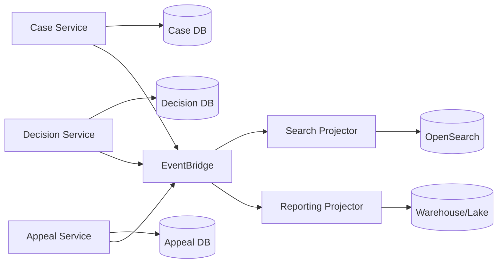
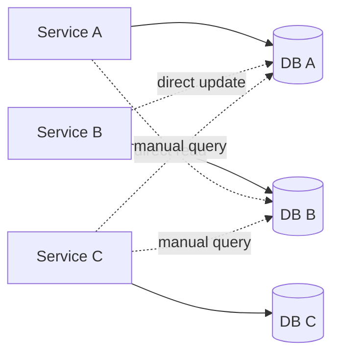
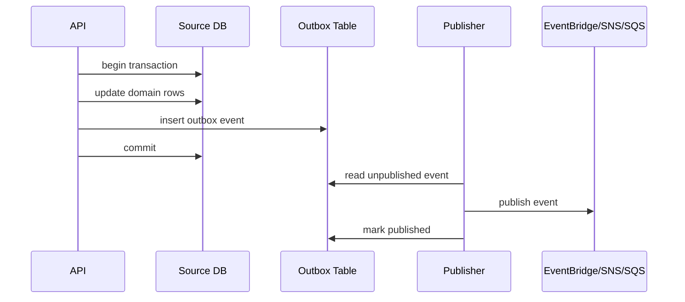
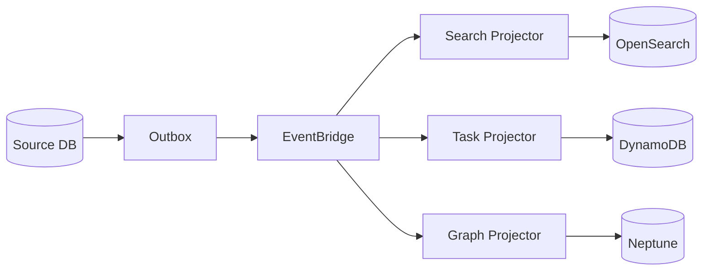
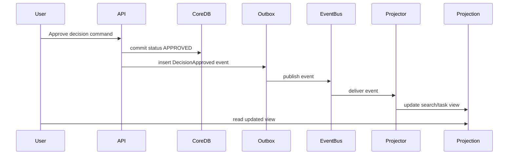
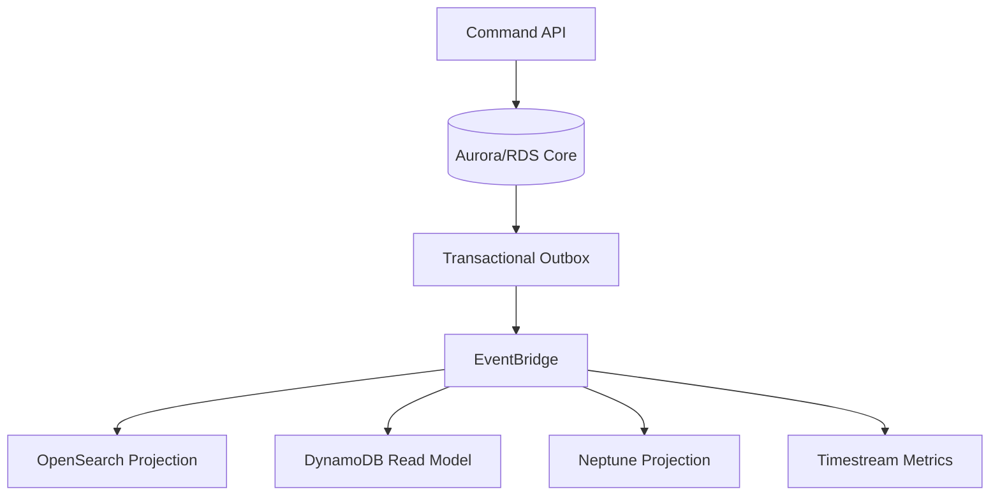
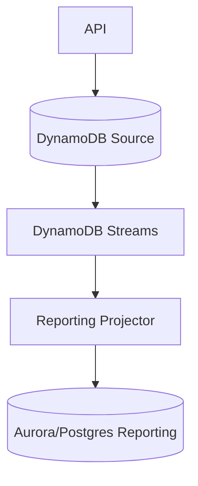
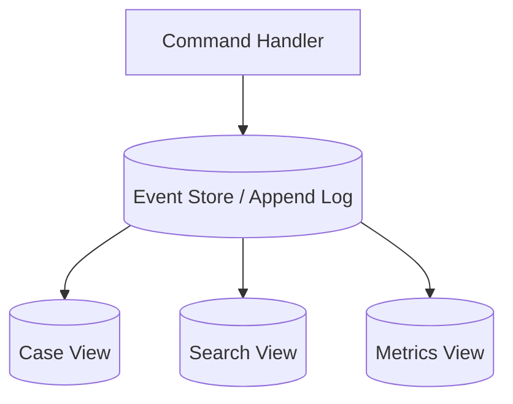
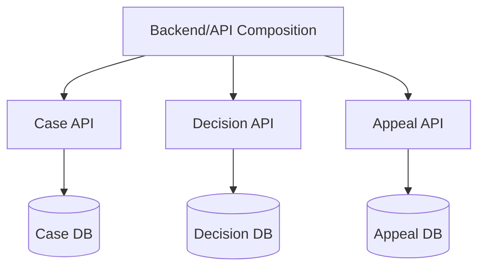
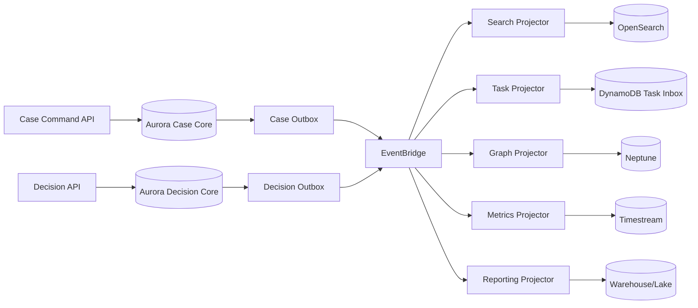

# Part 054 — Polyglot Persistence with Discipline: Bukan Microservice = Database Baru

Polyglot persistence adalah penggunaan beberapa jenis database dalam satu landscape sistem karena workload, data model, dan access pattern memang berbeda.

Itu ide yang benar.

Tapi implementasi buruknya sering menjadi:

```txt
satu microservice = satu database baru
```

Hasilnya bukan architecture modern. Hasilnya bisa menjadi distributed data mess:

- source of truth tidak jelas,
- data duplicate tidak sinkron,
- reporting pecah,
- transaksi lintas service sulit,
- audit trail tersebar,
- operational burden naik,
- incident debugging makin lambat,
- migration menjadi proyek besar,
- ownership kabur.

AWS Prescriptive Guidance memang membahas database-per-service dan polyglot persistence untuk microservices, tetapi pattern tersebut harus dipahami sebagai **decentralized ownership dengan trade-off**, bukan aturan otomatis bahwa setiap service harus membuat database sendiri. Lihat [Enabling data persistence in microservices](https://docs.aws.amazon.com/prescriptive-guidance/latest/modernization-data-persistence/welcome.html) dan [Database-per-service pattern](https://docs.aws.amazon.com/prescriptive-guidance/latest/modernization-data-persistence/database-per-service.html).

Bagian ini membahas cara menerapkan polyglot persistence secara disiplin.

---

## 1. Mental Model: Banyak Database Bukan Banyak Kebenaran

Sistem boleh punya banyak database.

Tapi sistem tidak boleh punya banyak kebenaran untuk fakta yang sama tanpa aturan rekonsiliasi.

Contoh buruk:

```txt
Case status di Aurora: UNDER_REVIEW
Case status di DynamoDB projection: APPROVED
Case status di OpenSearch: DRAFT
Case status di analytics warehouse: CLOSED
```

Kalau user bertanya “status case ini apa?”, jawaban mana yang benar?

Jawabannya harus eksplisit:

```txt
Aurora case_core adalah source of truth.
DynamoDB task_projection adalah derived state untuk inbox.
OpenSearch case_search adalah derived state untuk search UI.
Warehouse adalah analytical snapshot.
Jika berbeda, source of truth menang.
```

Polyglot persistence yang sehat punya satu prinsip:

> Banyak database boleh ada, tetapi setiap fakta harus punya ownership dan authority yang jelas.

---

## 2. Kapan Polyglot Persistence Masuk Akal

Polyglot persistence masuk akal ketika ada perbedaan nyata pada:

1. access pattern,
2. consistency requirement,
3. latency requirement,
4. query model,
5. data lifecycle,
6. scale dimension,
7. ownership boundary,
8. failure isolation,
9. compliance requirement,
10. operational economics.

Contoh:

| Need | Source/Projection | Candidate |
|---|---|---|
| Core case lifecycle + legal invariant | source of truth | Aurora/RDS |
| Low-latency task inbox by assignee | projection | DynamoDB |
| Full-text/faceted investigation search | projection | OpenSearch |
| Relationship risk traversal | projection | Neptune |
| Workflow duration metrics | derived metric | Timestream/CloudWatch |
| Session/rate limit | operational state | ElastiCache/MemoryDB/DynamoDB |
| Long-term audit archive | immutable/archive | S3 + catalog/ledger pattern |

Ini disiplin karena setiap store punya alasan.

---

## 3. Kapan Polyglot Persistence Tidak Masuk Akal

Jangan tambah database baru jika alasan utamanya:

- “team ini lebih suka MongoDB”,
- “service baru harus punya DB sendiri”,
- “NoSQL lebih scalable”,
- “kita mungkin butuh fleksibilitas nanti”,
- “biar independent”,
- “database utama sudah ramai”,
- “reporting butuh query lain” tanpa melihat projection/replica/warehouse,
- “biar mengikuti microservice pattern”.

Pertanyaan yang lebih tepat:

> Complexity apa yang kita beli, dan complexity apa yang kita hapus?

Jika database baru hanya memindahkan complexity dari query ke consistency, itu belum tentu lebih baik.

---

## 4. The Real Cost of a New Database

Setiap database baru bukan hanya connection string baru.

Setiap database baru menambah:

- backup strategy,
- restore drill,
- schema migration/process migration,
- IAM/security boundary,
- encryption review,
- data classification,
- observability dashboard,
- alarms,
- runbook,
- capacity model,
- cost model,
- incident playbook,
- local development setup,
- test fixture,
- migration tool,
- data retention policy,
- deletion/privacy workflow,
- audit evidence,
- on-call knowledge,
- failure modes,
- dependency lifecycle.

Kalau team tidak siap mengoperasikan database itu pukul 03:00 ketika incident, database itu belum layak masuk critical path.

---

## 5. Ownership: Pertanyaan Pertama Sebelum Service Selection

Sebelum memilih database, jawab:

```txt
Siapa pemilik fakta ini?
```

Bukan:

```txt
Service mana yang butuh data ini?
```

### 5.1 Fact Ownership

Contoh fakta:

| Fact | Owner | Source of Truth |
|---|---|---|
| Case status | Case Management domain | case_core DB |
| Decision issued date | Legal Decision domain | decision DB/table |
| Appeal deadline | Appeal domain | appeal DB/table |
| Assignee task count | Workflow/Task projection | derived from case/task events |
| Searchable case text | Search projection | derived from case/evidence metadata |
| Risk relationship score | Risk analytics domain | graph/analytics projection with version |

Setiap fact harus punya owner.

Owner bertanggung jawab atas:

- schema,
- write API,
- invariant,
- event contract,
- data quality,
- migration,
- deprecation,
- recovery.

### 5.2 Consumers Do Not Own Data Just Because They Need It

Consumer sering butuh data. Itu tidak berarti consumer boleh menulis source of truth.

Pattern sehat:

```txt
Consumer reads via API/query model/projection.
Consumer requests change via command.
Owner validates and commits.
Owner publishes event.
Consumer updates projection.
```

Pattern berbahaya:

```txt
Consumer directly updates owner's database because it is convenient.
```

Convenience ini biasanya menjadi coupling jangka panjang.

---

## 6. Database-per-Service: Pattern, Bukan Agama

Database-per-service berarti setiap service mengelola data persisten yang dimilikinya sendiri. Service lain tidak langsung membaca/menulis database tersebut; mereka berinteraksi lewat API/events.

Manfaat:

- ownership jelas,
- autonomy deployment,
- schema perubahan tidak langsung memecah consumer,
- service bisa memilih database sesuai workload,
- blast radius lebih kecil,
- security boundary lebih tegas.

Biaya:

- cross-service query sulit,
- distributed consistency sulit,
- reporting butuh integration layer,
- duplication meningkat,
- eventual consistency muncul,
- migration/backfill perlu event/CDC,
- debugging perlu correlation ID lintas service,
- transaction semantics berubah.

### 6.1 Good Database-per-Service



Properties:

- each service owns writes,
- event contracts are explicit,
- projections are derived,
- reporting is not direct cross-db join,
- source of truth documented.

### 6.2 Bad Database-per-Service



Ini bukan autonomy. Ini distributed shared database dengan latency dan ownership yang lebih buruk.

---

## 7. Shared Database: Selalu Salah?

Tidak selalu.

Shared database bisa masuk akal jika:

- sistem masih modular monolith,
- satu bounded context belum jelas,
- team masih kecil,
- invariant lintas module sangat kuat,
- reporting/ad-hoc query penting,
- deployment masih coordinated,
- split sekarang akan menciptakan distributed transaction yang tidak perlu.

Shared database menjadi masalah ketika:

- banyak service menulis table yang sama,
- schema change butuh koordinasi banyak team,
- ownership tidak jelas,
- access pattern tidak diketahui,
- database menjadi integration bus,
- security boundary tidak bisa dipisah,
- incident tidak tahu siapa pemilik query.

### 7.1 Better Shared Database Discipline

Jika masih shared DB, lakukan:

- schema ownership per module,
- no cross-module writes,
- read views/contracts,
- migration ownership,
- database role per service,
- explicit API for state changes,
- event/outbox for integration,
- query review for shared tables.

Shared DB bisa menjadi tahap evolusi yang sehat jika dikontrol.

---

## 8. Source of Truth vs Projection

Polyglot persistence sehat membedakan:

| Type | Meaning | Can be stale? | Can be rebuilt? | Example |
|---|---|---|---|---|
| Source of Truth | authoritative record | no for critical reads | usually no, except from backup/event log | core case DB |
| Projection | optimized derived view | yes | yes | search index, task inbox |
| Cache | temporary acceleration | yes | yes | Redis cache |
| Audit/Event Log | immutable record of facts | append-only | no/backup needed | outbox/event store/archive |
| Analytical Store | reporting/analysis | yes | usually yes from pipeline | warehouse/lake |
| External Replica | copy for integration | yes | maybe | partner data sync |

### 8.1 Rule

If a store can be rebuilt from another store/event log, it is probably projection.

If it cannot be rebuilt and legal/business truth depends on it, it is source of truth.

### 8.2 Projection Lag Must Be Visible

Do not hide eventual consistency.

Expose:

- `lastUpdatedAt`,
- projection lag metric,
- stale marker,
- reconciliation status,
- source version,
- event sequence.

Example API response:

```json
{
  "caseId": "C-123",
  "status": "UNDER_REVIEW",
  "projection": {
    "sourceVersion": 491,
    "projectedAt": "2026-07-06T10:15:20Z",
    "lagMs": 4200
  }
}
```

This makes consistency a product property, not a hidden bug.

---

## 9. Integration Patterns for Polyglot Persistence

### 9.1 Transactional Outbox

Use when a service must update its database and publish an event/message reliably.

Pattern:



Why:

- avoids dual-write bug,
- event publication can retry,
- commit order clear,
- projection can rebuild from events.

AWS Prescriptive Guidance documents the transactional outbox pattern for dual-write problems: [Transactional outbox](https://docs.aws.amazon.com/prescriptive-guidance/latest/cloud-design-patterns/transactional-outbox.html).

### 9.2 CDC

Change Data Capture can be useful for migration or projection when application events are not available.

Use carefully.

CDC captures row changes. It does not automatically capture business meaning.

Example:

```txt
status changed from UNDER_REVIEW to APPROVED
```

CDC sees update. Domain event should say:

```txt
DecisionApproved
```

CDC is integration plumbing. Domain event is semantic contract.

### 9.3 Event-Driven Projection

Projection updates from events:



Projector must be:

- idempotent,
- replay-safe,
- ordered where needed,
- observable,
- backfillable,
- schema-version aware.

### 9.4 API Composition

Sometimes consumer needs data from multiple sources.

Options:

- API composition at backend-for-frontend,
- GraphQL/AppSync resolver composition,
- read model projection,
- reporting store,
- direct service APIs.

Avoid synchronous fanout for hot paths if:

- many downstream calls,
- inconsistent latency,
- partial failure hard to represent,
- rate limit differs,
- response needs stable p99.

For read-heavy composite views, build a projection.

---

## 10. Consistency Strategy

Polyglot persistence almost always introduces multiple consistency zones.

### 10.1 Strong Local, Eventual Global

A common model:

```txt
Each service enforces strong consistency inside its local source of truth.
Cross-service views are eventually consistent.
```

This is acceptable if:

- users understand stale boundaries,
- critical commands re-check source of truth,
- projections show lag or tolerate staleness,
- reconciliation exists,
- no legal action relies solely on stale projection.

### 10.2 Sagas

Use saga when business process spans multiple owners.

Example:

```txt
Open investigation -> reserve review slot -> assign investigator -> request evidence -> notify subject
```

Each step commits locally. Compensation handles failure.

Do not pretend saga is a distributed transaction. Saga provides business-level recovery, not ACID rollback.

### 10.3 Read-Your-Writes Problem

If user writes through source DB but reads from projection, user may see stale data.

Solutions:

- read source immediately after write,
- return command result from write model,
- client waits for projection version,
- sticky read to source for short window,
- expose pending state,
- design UI as asynchronous operation.

Example response:

```json
{
  "commandId": "cmd-123",
  "status": "ACCEPTED",
  "caseId": "C-123",
  "expectedProjectionDelayMs": 5000
}
```

---

## 11. Governance: Without It, Polyglot Becomes Chaos

Minimum governance artifacts:

1. data ownership registry,
2. source-of-truth map,
3. event catalog,
4. schema registry,
5. projection catalog,
6. data classification matrix,
7. retention/deletion policy,
8. database decision record,
9. operational readiness checklist,
10. incident owner mapping.

### 11.1 Data Ownership Registry

| Domain | Fact | Owner Service | Source DB | Events Published | Consumers |
|---|---|---|---|---|---|
| Case | case status | case-service | Aurora case_core | CaseStatusChanged | search, task, reporting |
| Decision | decision outcome | decision-service | Aurora decision_core | DecisionIssued | case, search, reporting |
| Task | task assignment | task-service | DynamoDB task_core | TaskAssigned | notification, reporting |
| Risk | relationship score | risk-service | Neptune/risk store | RiskScoreChanged | case UI, analytics |

### 11.2 Projection Catalog

| Projection | Source Events | Store | Rebuild Method | Lag SLO | Owner |
|---|---|---|---|---|---|
| case_search | Case*, Decision*, Evidence* | OpenSearch | replay events | < 60s | search-platform |
| task_inbox | Task*, CaseStatusChanged | DynamoDB | replay events | < 10s | workflow |
| relationship_graph | Company*, Person*, Sanction* | Neptune | replay + snapshot | < 15m | risk |
| workflow_metrics | WorkflowStep* | Timestream | replay metrics events | < 5m | platform-observability |

---

## 12. Security and Compliance Implications

More databases means more surfaces:

- IAM policies,
- network boundaries,
- encryption keys,
- backup encryption,
- audit logs,
- data retention,
- PII replication,
- cross-region restrictions,
- cross-account access,
- least privilege,
- deletion propagation.

A projection that contains PII is not “less sensitive” because it is derived.

If source deletes or masks PII, projection must handle:

- tombstone events,
- delete propagation,
- reindex,
- cache invalidation,
- backup retention policy,
- legal hold exception.

### 12.1 Data Classification Must Travel with Events

Event envelope should carry classification metadata where appropriate:

```json
{
  "source": "case.service",
  "detailType": "CaseUpdated",
  "classification": "CONFIDENTIAL",
  "containsPii": true,
  "retentionClass": "REGULATORY_7Y",
  "detail": {
    "caseId": "C-123",
    "status": "UNDER_REVIEW"
  }
}
```

Do not let data classification exist only in wiki pages.

---

## 13. Observability for Polyglot Systems

Single database systems can often be debugged with one query.

Polyglot systems need timeline reconstruction.

You need:

- correlation ID,
- causation ID,
- command ID,
- event ID,
- source version,
- projection version,
- producer timestamp,
- publish timestamp,
- consume timestamp,
- write timestamp,
- trace ID.

### 13.1 Event Timeline



Debugging question:

```txt
Where did the update stop?
```

Possible answers:

- command rejected,
- DB committed but outbox not published,
- event published but rule did not match,
- target invocation failed,
- projector failed,
- projection write throttled,
- projection updated but cache stale,
- UI read old version.

Dashboard must reveal this path.

### 13.2 Core Metrics

For every projection pipeline:

- events received,
- events processed,
- events failed,
- DLQ depth,
- oldest unprocessed event age,
- projection lag,
- replay mode active,
- idempotency duplicates,
- schema validation failures,
- write throttles,
- reconciliation mismatch count.

---

## 14. Migration Strategy

Polyglot persistence often appears during migration:

- monolith to microservice,
- relational to DynamoDB projection,
- database engine modernization,
- search index introduction,
- graph projection introduction,
- reporting extraction.

### 14.1 Safe Evolution Path

```txt
1. Identify source of truth.
2. Add outbox/domain events.
3. Build projection in parallel.
4. Backfill projection from source snapshot.
5. Replay events after snapshot point.
6. Compare source vs projection.
7. Shadow read.
8. Route small percentage of reads.
9. Monitor mismatch.
10. Cut over.
11. Keep rollback path.
12. Decommission old read path.
```

### 14.2 Dual Write Trap

Bad:

```txt
API writes Aurora.
API also writes DynamoDB projection.
If DynamoDB write fails after Aurora commit, data diverges.
```

Better:

```txt
API writes Aurora + outbox in same transaction.
Publisher/projector updates DynamoDB with retry and idempotency.
```

### 14.3 Backfill Needs Idempotency

Backfill is replay with volume.

Backfill must handle:

- duplicate records,
- out-of-order updates,
- schema version differences,
- rate limits,
- partial failure,
- checkpointing,
- pause/resume,
- verification.

Do not run backfill as an unobservable one-off script.

---

## 15. Failure Modes of Polyglot Persistence

### 15.1 Split-Brain Truth

Two stores both accept writes for the same fact.

Symptom:

```txt
case-service and decision-service both update case final status.
```

Fix:

- assign authority,
- route writes through owner,
- make non-owner stores projections,
- reconciliation job.

### 15.2 Projection Drift

Projection no longer matches source.

Causes:

- event handler bug,
- missed event,
- schema change,
- manual DB update,
- replay with old code,
- partial backfill.

Controls:

- reconciliation query,
- version counters,
- projection checksum,
- replay from source/events,
- DLQ monitoring.

### 15.3 Event Contract Drift

Producer changes event field semantics without consumer readiness.

Controls:

- schema registry,
- compatibility tests,
- consumer-driven tests,
- versioning policy,
- deprecation period.

### 15.4 Operational Orphan

A database exists but no team fully owns it.

Symptoms:

- nobody knows backup policy,
- alarms ignored,
- cost grows,
- schema undocumented,
- IAM broad,
- restore never tested.

Fix:

- ownership registry,
- operational readiness gate,
- decommission or assign owner.

### 15.5 Reporting Hell

Every dashboard joins across service databases manually.

Fix:

- analytical projection,
- event-driven reporting model,
- data lake/warehouse,
- semantic layer,
- source/version metadata.

---

## 16. Polyglot Persistence Decision Framework

Add a new database only if it passes these gates.

### Gate 1: Workload Difference

Is the workload meaningfully different?

Examples:

- OLTP vs full-text search,
- OLTP vs relationship traversal,
- OLTP vs high-volume time-series,
- source-of-truth vs cache,
- command model vs read projection.

If no, do not add DB.

### Gate 2: Ownership Clarity

Can we say who owns each fact?

If not, do not split.

### Gate 3: Consistency Strategy

Can we explain how data stays consistent enough?

Need:

- source of truth,
- event/CDC/outbox,
- idempotent projector,
- reconciliation,
- staleness budget.

If not, do not add DB.

### Gate 4: Operational Readiness

Can the team operate it?

Need:

- dashboard,
- alarms,
- backup/restore,
- runbook,
- cost model,
- migration process,
- incident owner.

If not, do not add DB.

### Gate 5: Reversibility

Can we move away later?

Need:

- export path,
- schema documentation,
- event history,
- backfill plan,
- cutover/rollback plan.

If not, be careful.

---

## 17. Architecture Patterns

### 17.1 Core Relational + Polyglot Projections

Most common enterprise-safe pattern.



Properties:

- strong core invariant,
- flexible projections,
- eventual consistency explicit,
- rebuildable views.

### 17.2 DynamoDB Source + Relational Reporting Projection

Useful when primary workload is high-scale key access but reporting needs SQL.



Warning:

- reporting DB is projection,
- source remains DynamoDB,
- report freshness must be visible.

### 17.3 Event-Sourced-ish Source + Materialized Views

Events are authoritative, views are projections.



Use only if event modeling maturity is high. Event sourcing is not just “save events”. It changes debugging, schema evolution, replay, and business semantics.

### 17.4 Service-Owned DB + API Composition

Use for low-volume composite reads.



Warning:

- synchronous fanout affects p99,
- partial failure must be represented,
- cache/projection may be needed for hot views.

---

## 18. Example: Regulatory Case Platform

### 18.1 Initial State

One Aurora database:

```txt
cases
subjects
evidences
decisions
appeals
tasks
audit_entries
```

This is acceptable early because:

- domain invariant is complex,
- reporting needs SQL,
- team is one unit,
- transaction boundaries still being discovered.

### 18.2 Pressure Appears

New requirements:

- investigators need full-text search,
- relationship risk requires multi-hop traversal,
- task inbox must be low-latency,
- workflow metrics grow fast,
- reporting queries hurt OLTP.

Bad response:

```txt
Split every table into separate microservice DB immediately.
```

Better response:

```txt
Keep core facts in Aurora.
Publish domain events via outbox.
Build projections for search/task/graph/metrics/reporting.
Only split source-of-truth ownership when domain/team boundaries become stable.
```

### 18.3 Target State



Every database has a job:

- Aurora: authoritative lifecycle and legal decisions,
- DynamoDB: low-latency task access,
- OpenSearch: investigation discovery,
- Neptune: relationship intelligence,
- Timestream: workflow telemetry,
- Warehouse/Lake: reporting and analysis.

This is polyglot persistence with discipline.

---

## 19. Checklist: Add a New Database?

Before approving a new database, answer:

- [ ] What exact workload does the current database fail to serve?
- [ ] Is the new store source of truth or projection?
- [ ] Who owns it?
- [ ] What facts does it own?
- [ ] What facts does it duplicate?
- [ ] How is it populated?
- [ ] What is the staleness budget?
- [ ] What happens if population fails?
- [ ] Can it be rebuilt?
- [ ] How is schema versioned?
- [ ] How are deletes propagated?
- [ ] How are PII/classification rules preserved?
- [ ] What is the backup/restore plan?
- [ ] What is the runbook?
- [ ] What are the top 5 failure modes?
- [ ] What is the cost model?
- [ ] What is the decommission path?

If these cannot be answered, the database is not ready.

---

## 20. Database Decision Record Template

Use this ADR format.

```mdx
# ADR: Introduce <Database/Store> for <Workload>

## Status
Proposed | Accepted | Deprecated | Rejected

## Context
What workload/access pattern/constraint requires this store?

## Decision
We will use <service> as <source-of-truth/projection/cache/analytics store> for <data>.

## Source of Truth
- Fact owner:
- Authoritative store:
- Derived stores:

## Access Patterns
- AP1:
- AP2:
- AP3:

## Consistency Model
- Strong boundary:
- Eventual boundary:
- Staleness budget:
- Read-your-write strategy:

## Population Strategy
- API write:
- Outbox/event:
- CDC:
- Backfill:

## Failure Modes
- FM1:
- FM2:
- FM3:

## Operability
- Metrics:
- Alarms:
- Runbooks:
- Backup/restore:

## Security and Compliance
- Data classification:
- Encryption:
- IAM:
- Retention:
- Deletion:

## Cost
- Baseline cost:
- Growth driver:
- Cost alarm:

## Reversibility
- Export path:
- Migration path:
- Rollback path:

## Consequences
Positive:
Negative:
Open questions:
```

---

## 21. Team Topology and Ownership

Polyglot persistence is not only technical. It is organizational.

A team owning a database must own:

- data contract,
- schema migration,
- performance,
- backup/restore,
- incident response,
- cost,
- data quality,
- support documentation,
- deprecation.

Do not let platform team become accidental owner of every database because they created Terraform modules.

Platform can own:

- standards,
- paved road modules,
- observability baseline,
- backup policies,
- security guardrails,
- deployment templates.

Domain team must own:

- data meaning,
- invariants,
- access patterns,
- event semantics,
- lifecycle.

---

## 22. Production Readiness Review

A polyglot persistence design is production-ready only when:

- [ ] every fact has source of truth,
- [ ] every projection has rebuild plan,
- [ ] every event has contract owner,
- [ ] every database has operational owner,
- [ ] every cross-store consistency gap has strategy,
- [ ] every critical command reads authoritative source before final action,
- [ ] every projection has lag metric,
- [ ] every pipeline has DLQ/retry/replay plan,
- [ ] every schema has migration/version policy,
- [ ] every database has backup/restore drill,
- [ ] every sensitive field has propagation/deletion rule,
- [ ] every incident path has correlation IDs,
- [ ] every cost driver has budget/alert,
- [ ] every new store has ADR.

---

## 23. Summary

Polyglot persistence is powerful because different data shapes deserve different storage engines.

But the principle is not:

```txt
every service gets its own database
```

The principle is:

```txt
each fact has one owner, each workload gets an appropriate model, and every duplicate is governed as derived state
```

Use many databases only when they reduce total system complexity, not when they merely move complexity from one place to another.

A disciplined polyglot system has:

- source-of-truth map,
- projection catalog,
- event contracts,
- idempotent pipelines,
- reconciliation,
- observability,
- restore drills,
- security governance,
- cost ownership,
- decommission path.

Without discipline, polyglot persistence becomes data entropy.

With discipline, it becomes a way to let each workload use the right engine while preserving correctness and operability.

---

## References

- AWS Prescriptive Guidance — [Enabling data persistence in microservices](https://docs.aws.amazon.com/prescriptive-guidance/latest/modernization-data-persistence/welcome.html)
- AWS Prescriptive Guidance — [Database-per-service pattern](https://docs.aws.amazon.com/prescriptive-guidance/latest/modernization-data-persistence/database-per-service.html)
- AWS Prescriptive Guidance — [Transactional outbox pattern](https://docs.aws.amazon.com/prescriptive-guidance/latest/cloud-design-patterns/transactional-outbox.html)
- AWS Prescriptive Guidance — [Saga pattern](https://docs.aws.amazon.com/prescriptive-guidance/latest/cloud-design-patterns/saga.html)
- AWS Well-Architected Framework — [PERF03-BP01 Use a purpose-built data store](https://docs.aws.amazon.com/wellarchitected/latest/framework/perf_data_use_purpose_built_data_store.html)
- AWS Decision Guide — [Choosing an AWS database service](https://docs.aws.amazon.com/databases-on-aws-how-to-choose/)
