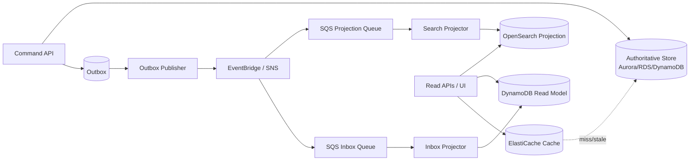
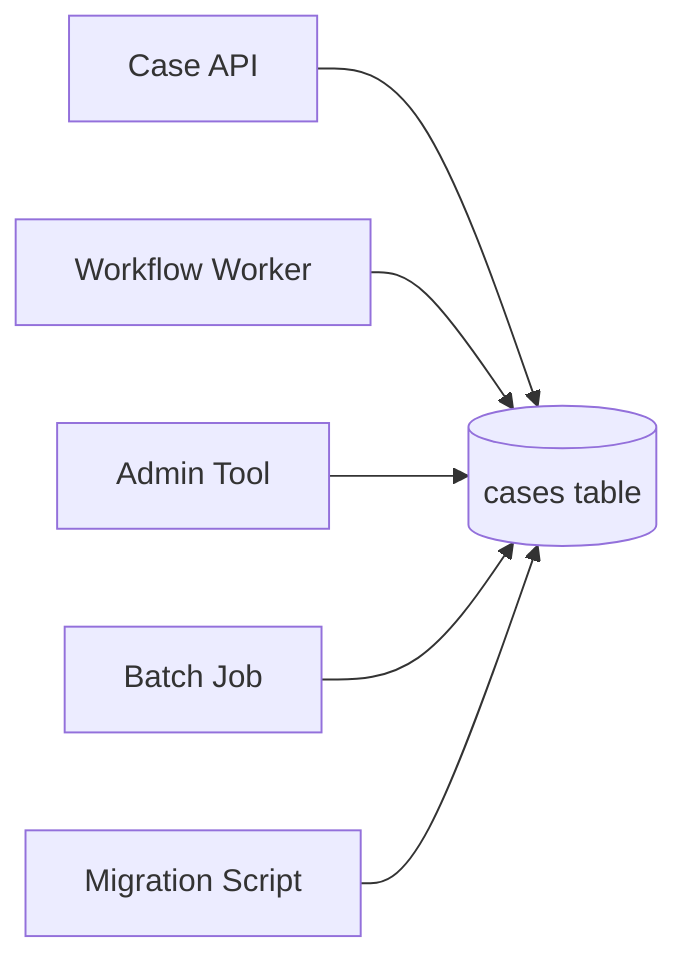
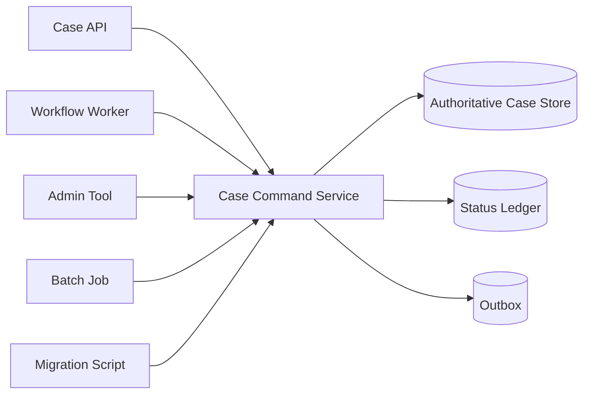
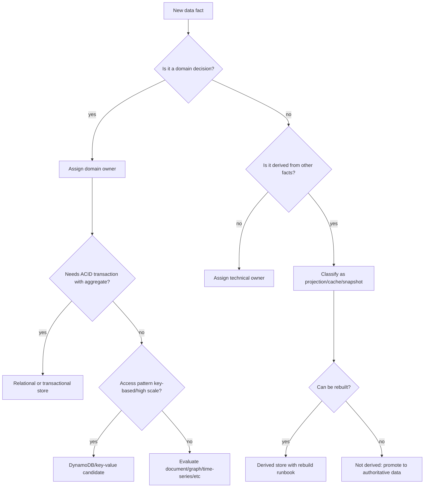
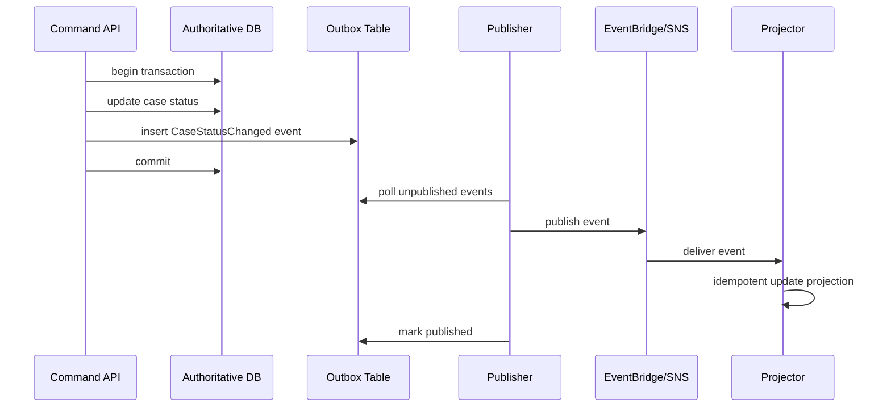

# Part 055 — Data Ownership: Source of Truth, Projection, Read Model, Derived State

Di sistem kecil, data ownership sering terasa jelas karena semua orang tahu tabel mana yang dipakai.

Di sistem production yang sudah punya API, queue, event bus, workflow, cache, search index, reporting store, dan banyak service, pertanyaan sederhana seperti ini bisa menjadi mahal:

```txt
Status case ini yang benar ada di mana?
```

Kalau jawabannya adalah “tergantung endpoint mana yang dipanggil”, sistem sudah kehilangan pusat kebenaran.

Bagian ini membahas cara mendesain **data ownership** dan **source of truth** secara eksplisit di AWS application/database architecture.

Kita tidak akan mengulang definisi database-per-service secara dangkal. Fokusnya adalah bagaimana membuat data tetap dapat dipercaya ketika state tersebar ke Aurora/RDS, DynamoDB, SQS, EventBridge, OpenSearch, cache, workflow execution, dan read model.

Referensi AWS yang relevan:

- AWS Prescriptive Guidance: [Database-per-service pattern](https://docs.aws.amazon.com/prescriptive-guidance/latest/modernization-data-persistence/database-per-service.html)
- AWS Prescriptive Guidance: [CQRS pattern](https://docs.aws.amazon.com/prescriptive-guidance/latest/modernization-data-persistence/cqrs-pattern.html)
- AWS Prescriptive Guidance: [Event sourcing pattern](https://docs.aws.amazon.com/prescriptive-guidance/latest/cloud-design-patterns/event-sourcing.html)
- AWS Prescriptive Guidance: [Transactional outbox pattern](https://docs.aws.amazon.com/prescriptive-guidance/latest/cloud-design-patterns/transactional-outbox.html)
- AWS Well-Architected: [Data management](https://docs.aws.amazon.com/wellarchitected/latest/performance-efficiency-pillar/data-management.html)

---

## 1. Core Problem: Data Bisa Tersebar, Tetapi Authority Tidak Boleh Kabur

Pada sistem modern, data yang sama sering muncul di banyak tempat.

Contoh:

```txt
Aurora table: cases
DynamoDB table: user_task_inbox
OpenSearch index: case_search
ElastiCache key: case:{caseId}:summary
EventBridge archive: CaseStatusChanged events
S3 data lake: case_status_daily_snapshot
Step Functions execution input: approval workflow state
```

Semua tempat itu bisa menyimpan sesuatu yang tampak seperti `caseStatus`.

Tetapi tidak semuanya punya hak untuk menjawab:

```txt
Apa status case yang authoritative?
```

Jawaban sistem sehat harus seperti ini:

```txt
Authoritative status: Aurora case_core.cases.status
Allowed writers: CaseCommandService only
Derived projections:
  - DynamoDB user_task_inbox for assignee task view
  - OpenSearch case_search for full-text discovery
  - ElastiCache case summary for low-latency read
  - S3 snapshot for analytics
Conflict rule:
  - authoritative store wins
  - projections are repaired by replay/rebuild/reconciliation
```

Mental model paling penting:

> Banyak copy data adalah normal. Banyak authority untuk fakta yang sama adalah bug arsitektur.

---

## 2. Vocabulary yang Harus Dibakukan

Sebelum desain, tim perlu bahasa yang sama.

### 2.1 Source of Truth

**Source of truth** adalah tempat yang dianggap benar untuk satu fakta/domain decision.

Contoh:

```txt
Case lifecycle status      -> Aurora case_core
Payment authorization      -> external payment provider + local payment ledger
User assignment            -> DynamoDB assignment aggregate
Document metadata          -> Aurora document registry
Document binary            -> S3 object version
Search result              -> OpenSearch projection
Workflow progress          -> Step Functions execution + local process record
```

Source of truth bukan selalu satu database global.

Yang benar:

```txt
Setiap fakta penting harus punya authoritative owner.
```

Yang salah:

```txt
Semua data harus ada di satu database besar supaya konsisten.
```

### 2.2 System of Record

**System of record** sering dipakai untuk store resmi yang menyimpan record canonical jangka panjang.

Di sistem enterprise/regulatory, system of record biasanya perlu:

- audit trail,
- retention policy,
- mutation history,
- access control,
- legal defensibility,
- restore/PITR,
- reconciliation evidence.

Source of truth dan system of record sering sama, tetapi tidak selalu.

Contoh:

```txt
Current case status source of truth: Aurora current_state table
Legal audit system of record: append-only case_event_ledger
```

### 2.3 Derived State

**Derived state** adalah data yang dihitung/disalin dari source of truth.

Contoh:

```txt
case_search index
task_inbox projection
case_summary cache
analytics snapshot
reporting mart
notification timeline
```

Derived state boleh stale.

Syaratnya:

```txt
Staleness budget eksplisit.
Repair mechanism jelas.
User experience mengakui kemungkinan lag.
```

### 2.4 Read Model

**Read model** adalah derived state yang sengaja dibentuk untuk query tertentu.

Contoh:

```txt
DynamoDB table user_task_inbox
PK = USER#<userId>
SK = DUE#<date>#CASE#<caseId>
```

Read model bukan source of truth hanya karena UI paling sering membacanya.

### 2.5 Projection

**Projection** adalah proses/materialisasi yang mengubah source event/state menjadi read model.

Contoh:

```txt
CaseStatusChanged event -> update OpenSearch document
CaseAssigned event      -> update DynamoDB task inbox
DocumentUploaded event  -> update case summary projection
```

Projection harus punya:

- input contract,
- idempotency,
- ordering assumption,
- replay strategy,
- lag metric,
- reconciliation path.

### 2.6 Cache

Cache adalah optimization, bukan authority.

Aturan sederhana:

```txt
Kalau cache hilang, sistem tetap benar.
Kalau cache stale, sistem punya cara membatasi dampaknya.
Kalau cache corrupt, sistem punya cara invalidate/rebuild.
```

Kalau cache menjadi satu-satunya tempat data penting, ia bukan cache lagi. Ia adalah primary store dan harus diperlakukan sebagai database.

---

## 3. Ownership Matrix: Artefak Wajib untuk Sistem Production

Untuk domain non-trivial, buat ownership matrix.

Contoh untuk enforcement/case management platform:

| Data/Fakta | Authoritative Owner | Store | Writer | Readers | Derived Stores | Repair Mechanism |
|---|---|---|---|---|---|---|
| Case identity | Case Core | Aurora | CaseCommandService | Many | OpenSearch, S3 | Rebuild projection from Aurora/outbox |
| Case status | Case Core | Aurora + status ledger | CaseCommandService | Workflow, UI, Reporting | DynamoDB inbox, OpenSearch | Event replay + reconciliation job |
| Assignment | Work Allocation | DynamoDB | AssignmentService | Case UI, Inbox | OpenSearch summary | Recompute from assignment table |
| Document metadata | Document Registry | Aurora | DocumentService | Case Core, UI | OpenSearch | Re-index from registry |
| Document binary | Document Storage | S3 versioned bucket | DocumentService | UI, ML pipeline | None/derived thumbnails | Restore object version |
| Notification sent | Notification Ledger | DynamoDB/Aurora | NotificationService | Audit, Support | Analytics | Reconcile against provider receipt |
| Search document | Search Projection | OpenSearch | ProjectionWorker | UI search | None | Full re-index |

Matrix ini bukan dokumentasi dekoratif. Ini mengunci jawaban terhadap pertanyaan production:

```txt
Kalau data berbeda, mana yang menang?
Service mana yang boleh memperbaiki?
Apakah boleh update manual?
Apakah event replay aman?
Apakah store ini perlu backup atau bisa rebuild?
```

---

## 4. Diagram: Authority vs Projection



Yang penting dari diagram ini:

- command API menulis ke authoritative store,
- event diterbitkan setelah state authoritative tersimpan,
- read model menerima perubahan secara async,
- search/cache/inbox bukan authority,
- jika projection salah, ia diperbaiki dari authority/event history.

---

## 5. Rule of Authority: Jangan Menyimpan Fakta Tanpa Menentukan Pemiliknya

Setiap field penting perlu rule.

Contoh field `caseStatus`:

```yaml
field: caseStatus
owner: Case Core
sourceOfTruth: aurora.case_core.cases.status
allowedWriters:
  - CaseCommandService.transitionStatus
allowedTransitions:
  DRAFT:
    - SUBMITTED
  SUBMITTED:
    - UNDER_REVIEW
    - REJECTED
  UNDER_REVIEW:
    - APPROVED
    - REJECTED
  APPROVED:
    - CLOSED
  REJECTED:
    - CLOSED
projectionTargets:
  - opensearch.case_search.status
  - dynamodb.user_task_inbox.caseStatus
  - s3.analytics.case_daily_status
conflictResolution:
  projectionMismatch: authoritativeStoreWins
repair:
  method: replayEventsOrRebuildFromSnapshot
stalenessBudget:
  search: 60s
  inbox: 10s
  analytics: 24h
```

Ini terlihat formal, tetapi sangat praktis saat incident.

Tanpa rule seperti ini, incident meeting berubah menjadi debat:

```txt
Kenapa UI A bilang APPROVED tapi UI B bilang UNDER_REVIEW?
```

Dengan rule ini, debugging langsung:

```txt
1. Cek authoritative store.
2. Cek outbox event.
3. Cek EventBridge/SQS delivery.
4. Cek projection lag.
5. Repair projection.
```

---

## 6. Write Ownership: Siapa yang Boleh Mengubah State?

Write ownership lebih penting daripada read ownership.

Banyak service boleh membaca satu fakta. Tetapi hanya sedikit komponen yang boleh mengubahnya.

### 6.1 Bad Pattern: Shared Writer



Masalah:

- transition rule tersebar,
- audit tidak lengkap,
- idempotency tidak konsisten,
- race condition sulit dilacak,
- rollback tidak jelas,
- invariant bisa ditembus bypass.

### 6.2 Better Pattern: Single Write Gate



Semua mutation lewat command service.

Keuntungan:

- invariant terpusat,
- audit konsisten,
- transition rule eksplisit,
- idempotency bisa satu model,
- event/outbox reliable,
- authorization bisa domain-aware.

Kompromi:

- command service menjadi critical boundary,
- harus didesain highly available,
- perlu versioned command contract,
- tidak semua batch/migration nyaman lewat API.

### 6.3 Practical Rule

```txt
Direct database write hanya boleh untuk:
1. service owner,
2. controlled migration,
3. emergency repair dengan approval + audit,
4. projection rebuild terhadap derived store.
```

Selain itu, write harus lewat domain command.

---

## 7. Read Ownership: Boleh Banyak, Tetapi Harus Tahu Staleness

Read path sering berbeda dari write path.

Contoh:

```txt
Write path:
API -> CaseCommandService -> Aurora

Read path:
Case detail      -> Aurora read model / API composition
Search           -> OpenSearch
Task inbox       -> DynamoDB projection
Analytics        -> S3/warehouse snapshot
Low-latency card -> ElastiCache
```

Ini valid.

Tetapi tiap read path harus menjawab:

| Pertanyaan | Kenapa Penting |
|---|---|
| Data ini authoritative atau derived? | Menghindari keputusan bisnis dari projection stale |
| Berapa staleness budget? | UI/operation tahu delay normal vs incident |
| Bagaimana mendeteksi lag? | Projection lag harus terlihat sebagai metric |
| Bagaimana memperbaiki? | Rebuild/replay harus tersedia |
| Apakah user boleh bertindak dari data ini? | Action dari stale data perlu optimistic concurrency |

Contoh UI rule:

```txt
Search result boleh stale sampai 60 detik.
Tetapi tombol approve harus reload authoritative case version sebelum submit command.
```

Ini mencegah user melakukan decision dari projection lama.

---

## 8. Source of Truth vs Event Store

Event sourcing sering disalahpahami.

Ada dua model berbeda.

### 8.1 State Store as Source of Truth

```txt
Current state table adalah authority.
Event/outbox adalah notification/audit/projection driver.
```

Contoh:

```txt
aurora.cases.status = APPROVED
case_status_ledger = history/audit
outbox = integration event queue
```

Ini cocok untuk banyak sistem business OLTP.

### 8.2 Event Store as Source of Truth

```txt
Append-only events adalah authority.
Current state dihitung dari event stream.
```

AWS Prescriptive Guidance mendeskripsikan event store sebagai historical record dari semua action/state changes dan dapat menjadi single source of truth yang dipakai untuk membangun state melalui replay.

Contoh:

```txt
CaseCreated
CaseSubmitted
CaseAssigned
CaseReviewed
CaseApproved
```

Current view dihitung dari event sequence.

Kelebihan:

- audit sangat kuat,
- temporal query natural,
- replay/projection powerful,
- state transition history tidak hilang.

Biaya:

- schema evolution event sulit,
- replay harus deterministic,
- query current state butuh projection,
- correction/amendment harus hati-hati,
- developer mental model lebih berat.

### 8.3 Jangan Mengaku Event Sourcing Jika Hanya Punya Event Notification

Jika sistem menyimpan current state di database lalu publish `CaseStatusChanged`, itu bukan event sourcing penuh.

Itu biasanya:

```txt
State store + outbox + event-driven projections
```

Ini bukan buruk. Bahkan sering lebih cocok.

Yang buruk adalah memakai istilah event sourcing tetapi tidak punya:

- append-only event log sebagai authority,
- deterministic replay,
- event versioning/upcaster,
- snapshot strategy,
- correction model,
- projection rebuild process.

---

## 9. Derived State Classes

Tidak semua derived state sama.

### 9.1 Projection

Projection adalah read model permanen/semi-permanen.

Contoh:

```txt
OpenSearch case_search index
DynamoDB task_inbox table
Aurora reporting table
```

Karakteristik:

- bisa rebuild,
- punya lag,
- punya schema sendiri,
- biasanya diupdate async,
- tidak boleh menjadi writer balik ke source.

### 9.2 Cache

Cache adalah akselerasi temporary.

Contoh:

```txt
ElastiCache case summary
API response cache
computed eligibility cache
```

Karakteristik:

- TTL,
- invalidation,
- safe to lose,
- bisa stale,
- tidak boleh menyimpan satu-satunya state penting.

### 9.3 Snapshot

Snapshot adalah view pada waktu tertentu.

Contoh:

```txt
Daily status snapshot in S3
Month-end regulatory report snapshot
Point-in-time export for audit
```

Karakteristik:

- immutable atau append-only,
- punya `asOfTime`,
- tidak sama dengan current truth,
- dipakai untuk historical/reporting/legal evidence.

### 9.4 Materialized Aggregate

Materialized aggregate menyimpan hasil perhitungan.

Contoh:

```txt
open_cases_by_region
sla_breach_counter
assignee_workload_score
```

Karakteristik:

- bisa incremental,
- raw facts harus tetap tersedia,
- butuh correction/recompute path,
- sangat rentan silent drift.

### 9.5 External Mirror

External mirror adalah copy data ke sistem lain.

Contoh:

```txt
CRM mirror
BI warehouse
third-party compliance portal
```

Karakteristik:

- ownership sering lintas organisasi,
- consistency contract harus formal,
- deletion/privacy/retention harus eksplisit,
- reconciliation wajib.

---

## 10. Authority Decision Tree

Gunakan decision tree berikut saat field/fakta baru muncul.



Rule inti:

```txt
Jika data tidak bisa rebuild dan business bergantung padanya, jangan sebut itu projection.
```

---

## 11. Conflict Resolution: Saat Copy Data Berbeda

Distributed data akan berbeda pada beberapa waktu.

Pertanyaannya bukan “bagaimana mencegah semua perbedaan”.

Pertanyaannya:

```txt
Perbedaan mana yang legal, berapa lama legal, dan bagaimana diperbaiki?
```

### 11.1 Projection Lag

Normal:

```txt
Aurora status = APPROVED
OpenSearch status = UNDER_REVIEW
Lag = 8 seconds
Budget = 60 seconds
```

Tidak normal:

```txt
Lag = 45 minutes
Event missing or projector stuck
```

Handling:

- expose projection lag metric,
- alert jika melewati budget,
- replay/rebuild dari event/source,
- jangan manual edit projection kecuali repair script controlled.

### 11.2 Concurrent Command Conflict

Contoh:

```txt
Reviewer A approves case version 8.
Reviewer B rejects case version 8.
```

Solusi:

- optimistic concurrency,
- version column,
- conditional write,
- transition guard,
- explicit conflict response.

API response:

```json
{
  "error": "CONFLICT",
  "message": "Case changed since you loaded it.",
  "currentVersion": 9,
  "retryable": false
}
```

### 11.3 Multi-Region Conflict

Jika multi-region active-active dipakai, conflict harus didesain di domain layer.

Contoh aman:

```txt
Append independent comments from two regions.
```

Contoh sulit:

```txt
Two regions both decide final enforcement outcome.
```

Untuk critical decision, sering lebih baik punya:

- regional ownership,
- single-writer per aggregate,
- explicit conflict workflow,
- quorum/coordination,
- atau distributed SQL dengan trade-off latency/consistency yang dipahami.

### 11.4 External System Conflict

Contoh:

```txt
Local payment ledger says CAPTURED.
Provider says FAILED.
```

Jangan overwrite sembarangan.

Gunakan ledger:

```txt
PaymentCaptureRequested
PaymentProviderAccepted
PaymentProviderFailed
PaymentReconciliationOpened
PaymentCorrected
```

Untuk domain regulated, correction harus menjadi event/fakta baru, bukan delete history.

---

## 12. Outbox sebagai Boundary Source-of-Truth ke Event World

Masalah klasik:

```txt
1. Simpan case status ke database.
2. Publish CaseStatusChanged ke EventBridge.
```

Jika step 1 sukses dan step 2 gagal, projection tidak update.

Jika step 2 sukses dan step 1 gagal, event palsu tersebar.

Transactional outbox menyelesaikan masalah dual-write dengan menyimpan state change dan event-to-publish dalam transaksi yang sama pada authoritative store.



Kunci desain:

- event ID deterministic,
- event payload berasal dari committed state,
- publisher idempotent,
- consumer idempotent,
- outbox retention cukup untuk replay/audit,
- event schema versioned.

Outbox bukan sekadar “tabel event”. Ia adalah jembatan atomic antara domain truth dan integration fabric.

---

## 13. Projection Rebuild Strategy

Kalau projection tidak bisa di-rebuild, projection itu berbahaya.

Minimal ada tiga mode rebuild.

### 13.1 Full Rebuild

Digunakan saat schema index berubah besar.

```txt
1. Create new projection/index/table.
2. Scan source of truth or event history.
3. Populate new projection.
4. Validate count/hash/sample.
5. Switch read alias/route.
6. Keep old projection for rollback window.
```

Cocok untuk:

- OpenSearch reindex,
- DynamoDB read model redesign,
- reporting table rebuild.

### 13.2 Partial Repair

Digunakan untuk scope kecil.

```txt
Repair all cases modified between T1 and T2.
Repair all projections for tenant X.
Repair all events with type CaseAssigned version 3.
```

### 13.3 Replay from Archive/Event Log

Digunakan jika event stream/Archive tersedia.

Syarat:

- consumer replay-safe,
- idempotency/inbox aktif,
- event version compatibility,
- side effect guard,
- replay lane jika perlu.

Jangan replay event ke consumer yang mengirim email/payment tanpa guard.

---

## 14. Read Model Contract

Read model harus punya contract seperti API/event.

Contoh:

```yaml
readModel: user_task_inbox
store: DynamoDB
owner: Work Allocation
sourceFacts:
  - CaseAssigned
  - CaseStatusChanged
  - CaseSlaChanged
keys:
  pk: USER#<assigneeId>
  sk: DUE#<dueDate>#CASE#<caseId>
stalenessBudget: 10s
authoritative: false
allowedActionsFromThisModel:
  - openCaseDetail
  - claimTaskWithVersionCheck
notAllowedActions:
  - approveCaseWithoutReloadingAuthority
repair:
  fullRebuild: supported
  partialRepair: byCaseId/byUserId
metrics:
  - projection_lag_seconds
  - projector_failure_count
  - mismatch_count
```

Tanpa contract ini, read model mudah berubah menjadi shadow database.

---

## 15. Anti-Patterns

### 15.1 Projection Becomes Authority by Accident

Awalnya OpenSearch hanya untuk search.

Lalu tim menambahkan tombol bulk approve dari search result tanpa reload authoritative version.

Masalah:

- user bertindak dari data stale,
- conflict tidak terdeteksi,
- audit tidak menjelaskan basis keputusan,
- projection bug bisa menghasilkan decision salah.

Perbaikan:

```txt
Search result -> open authoritative case -> command with expectedVersion.
```

### 15.2 Shared Database as Integration Contract

Service A dan B membaca/menulis tabel yang sama.

```txt
Service A owns table design.
Service B depends on internal columns.
Service C adds trigger.
Batch job updates status directly.
```

Masalah:

- schema evolution sulit,
- invariant tersebar,
- ownership kabur,
- blast radius besar.

Perbaikan:

- ownership matrix,
- API/event contract,
- data access boundary,
- migration plan ke owner-writer model.

### 15.3 Event as Source of Truth Tanpa Event Store Discipline

Tim berkata:

```txt
EventBridge adalah source of truth kita.
```

Tetapi:

- retention tidak cukup,
- schema berubah breaking,
- replay tidak deterministic,
- duplicate tidak ditangani,
- consumer punya side effect irreversible.

Event bus bukan otomatis event store.

### 15.4 Cache Mutation

```txt
Update cache first, later maybe database.
```

Ini biasanya salah kecuali pattern-nya memang write-through/write-behind dengan durability dan failure semantics jelas.

Untuk kebanyakan aplikasi business:

```txt
DB first, event/invalidate/update cache after commit.
```

### 15.5 Analytics Snapshot Used as Current State

Dashboard analytics harian dipakai untuk operational decision real-time.

Masalah:

- snapshot stale,
- transform mungkin aggregate,
- correction belum masuk,
- semantics bukan current truth.

Perbaikan:

- beri `asOfTime`,
- pisahkan operational dashboard dari analytical dashboard,
- jangan gunakan snapshot untuk command decision tanpa reload authority.

---

## 16. Data Ownership untuk Regulatory/Complex Case Management

Untuk sistem enforcement lifecycle, ownership bukan hanya teknis. Ia menentukan defensibility.

Pertanyaan penting:

```txt
Siapa yang berhak mengubah status enforcement?
Apa bukti bahwa perubahan sah?
Apa rule transisinya saat itu?
Siapa yang melihat data apa saat mengambil keputusan?
Apakah keputusan bisa direkonstruksi 2 tahun kemudian?
Jika projection/search salah, apakah keputusan tetap valid?
```

Desain yang baik:

- domain command mencatat actor, reason, expected version,
- transition rule versioned,
- authoritative state dan audit ledger konsisten,
- derived state punya rebuild path,
- user action dari projection melakukan authority reload,
- correction tidak menghapus history,
- report snapshot punya `asOfTime` dan source lineage.

Contoh command:

```json
{
  "commandId": "cmd-0192ab",
  "caseId": "case-123",
  "expectedVersion": 17,
  "action": "APPROVE_ENFORCEMENT_RECOMMENDATION",
  "actor": {
    "userId": "u-778",
    "role": "SENIOR_REVIEWER"
  },
  "reasonCode": "EVIDENCE_SUFFICIENT",
  "decisionRationale": "Reviewed evidence bundle EB-8821",
  "ruleSetVersion": "enforcement-transition-rules-v14"
}
```

Authoritative write output:

```json
{
  "caseId": "case-123",
  "previousStatus": "UNDER_REVIEW",
  "newStatus": "APPROVED",
  "newVersion": 18,
  "decisionEventId": "evt-abc",
  "committedAt": "2026-07-06T09:18:22Z"
}
```

Ini bukan ceremony. Ini membuat keputusan bisa dipertahankan.

---

## 17. Designing Source of Truth by Data Category

### 17.1 Identity and Master Data

Contoh:

```txt
user profile
organization profile
regulated entity
license identifier
```

Pertanyaan:

- Apakah ada external master?
- Apakah local copy authoritative atau mirror?
- Bagaimana update external disinkronkan?
- Bagaimana conflict ditangani?
- Apakah ID immutable?

Rule:

```txt
Identifier immutable lebih berharga daripada nama yang selalu berubah.
```

### 17.2 Workflow State

Step Functions punya execution state, tetapi domain biasanya tetap perlu local process record.

```txt
Step Functions: durable control flow state
Domain DB: business state / audit / queryable process record
```

Jangan menjadikan execution history sebagai satu-satunya source of truth untuk business reporting jangka panjang.

### 17.3 Document State

Document biasanya punya dua lapis:

```txt
S3 object/version = binary truth
Document registry DB = metadata/ownership/lifecycle truth
```

Metadata penting:

- object key,
- version ID,
- checksum,
- content type,
- retention class,
- legal hold,
- uploader,
- case association,
- virus scan status,
- extraction status.

### 17.4 Notification State

Notification bukan hanya “send email”.

Authoritative record perlu menjawab:

```txt
Apakah notification wajib dikirim?
Apakah sudah dicoba?
Apakah provider menerima?
Apakah recipient membuka?
Apakah failure butuh retry/escalation?
```

Pisahkan:

```txt
business obligation to notify
technical delivery attempt
provider receipt
user engagement
```

### 17.5 Search State

Search index jarang source of truth.

Gunakan sebagai:

```txt
discovery projection
ranking projection
filtering projection
```

Action harus reload authoritative object.

---

## 18. Governance: Data Contract Review

Setiap data store baru harus melewati review berikut.

```txt
1. Fakta apa yang disimpan?
2. Apakah authoritative atau derived?
3. Siapa owner-nya?
4. Siapa writer-nya?
5. Apa invariant-nya?
6. Apa staleness budget-nya?
7. Bagaimana backup/restore/rebuild-nya?
8. Bagaimana delete/retention-nya?
9. Bagaimana audit-nya?
10. Bagaimana schema evolution-nya?
11. Bagaimana reconciliation-nya?
12. Apa alert jika drift terjadi?
```

Kalau pertanyaan ini tidak bisa dijawab, database/projection itu belum production-ready.

---

## 19. Reconciliation as First-Class System

Reconciliation bukan batch job murahan. Ia adalah safety net distributed data.

Contoh reconciliation checks:

```sql
-- Aurora authoritative cases vs outbox events
select c.case_id
from cases c
left join outbox_events e
  on e.aggregate_id = c.case_id
 and e.event_type = 'CaseStatusChanged'
 and e.aggregate_version = c.version
where c.updated_at >= now() - interval '1 day'
  and e.event_id is null;
```

```txt
Check: all APPROVED cases appear in OpenSearch within 60 seconds.
Check: all assigned cases appear in assignee inbox.
Check: all S3 document objects have document registry row.
Check: all document registry rows point to existing S3 object version.
Check: all provider-success notifications have local receipt record.
```

Reconciliation output harus actionable:

```json
{
  "check": "case_search_projection_missing",
  "caseId": "case-123",
  "authoritativeVersion": 18,
  "projectionVersion": 16,
  "repairAction": "enqueue_reindex_case",
  "severity": "warning"
}
```

---

## 20. Observability for Source of Truth and Projection

Minimal metrics:

| Metric | Meaning |
|---|---|
| `authoritative_write_success_count` | command write berhasil |
| `authoritative_write_conflict_count` | optimistic concurrency conflict |
| `outbox_unpublished_count` | event belum publish |
| `outbox_oldest_unpublished_age_seconds` | publisher lag |
| `projection_lag_seconds` | delay source event ke read model |
| `projection_failure_count` | projector gagal |
| `projection_mismatch_count` | hasil reconciliation mismatch |
| `cache_stale_served_count` | stale cache served |
| `repair_job_success_count` | repair berhasil |
| `repair_job_failure_count` | repair gagal |

Log fields wajib:

```json
{
  "correlationId": "corr-1",
  "causationId": "cmd-1",
  "aggregateId": "case-123",
  "aggregateType": "Case",
  "aggregateVersion": 18,
  "sourceOfTruth": "case_core",
  "projection": "case_search",
  "eventId": "evt-1"
}
```

Tanpa observability ini, drift data akan ditemukan oleh user, bukan sistem.

---

## 21. Production Checklist

Sebelum sebuah data store/read model masuk production, checklist ini harus hijau.

```txt
[ ] Source of truth jelas.
[ ] Owner domain jelas.
[ ] Allowed writers eksplisit.
[ ] Allowed readers diketahui.
[ ] Derived vs authoritative diklasifikasikan.
[ ] Staleness budget ditentukan.
[ ] Invariant ditulis.
[ ] Conflict rule ditulis.
[ ] Idempotency strategy ada.
[ ] Outbox/inbox/retry strategy ada jika async.
[ ] Backup/restore atau rebuild path tersedia.
[ ] Reconciliation check tersedia.
[ ] Drift alert tersedia.
[ ] Schema evolution strategy ada.
[ ] Retention/delete/legal hold jelas.
[ ] Manual repair procedure audited.
[ ] Runbook incident tersedia.
```

---

## 22. Mini Case Study: Case Status Projection Drift

### Situation

UI search menunjukkan:

```txt
case-123 status = UNDER_REVIEW
```

Case detail page menunjukkan:

```txt
case-123 status = APPROVED
```

### Bad Response

```txt
Update OpenSearch document manually.
```

Ini memperbaiki gejala, bukan sistem.

### Good Response

```txt
1. Cek authoritative store: Aurora case_core.
2. Cek case version dan last committed transition.
3. Cek outbox event untuk version tersebut.
4. Cek publisher lag.
5. Cek EventBridge/SQS delivery.
6. Cek projector logs/inbox table.
7. Repair via replay/reindex.
8. Tambah reconciliation rule jika belum ada.
```

### Root Cause Examples

```txt
Outbox publisher stuck karena IAM permission berubah.
Projector gagal parsing event version baru.
SQS DLQ penuh poison message.
OpenSearch bulk update partially failed.
Projection worker lost idempotency lock.
```

### Permanent Fix

```txt
- Contract test event version.
- Alarm outbox oldest unpublished age.
- Alarm projection lag.
- DLQ runbook.
- Idempotent reindex command.
```

---

## 23. Key Takeaways

Data ownership adalah pertahanan utama terhadap distributed data chaos.

Hal yang harus selalu benar:

```txt
Setiap fakta punya owner.
Setiap mutation punya gate.
Setiap copy punya classification.
Setiap projection punya staleness budget.
Setiap drift punya detection.
Setiap repair punya runbook.
```

Architecture yang matang bukan yang tidak pernah punya data duplicate.

Architecture yang matang adalah yang tahu:

```txt
mana yang benar,
mana yang derived,
berapa lama boleh beda,
dan bagaimana memperbaikinya tanpa panik.
```

