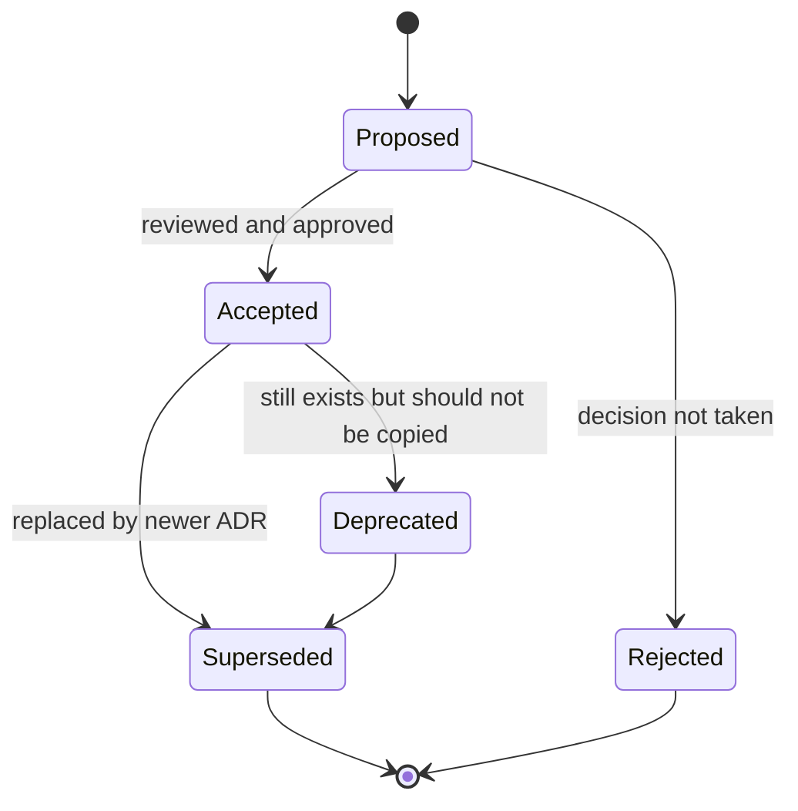
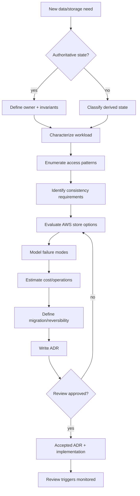

# Part 056 — Database Architecture Decision Record: Template, Trade-Off, Reversibility

Keputusan database jarang gagal karena tim tidak tahu nama service.

Keputusan database gagal karena alasan pemilihannya tidak terdokumentasi:

```txt
Kenapa DynamoDB, bukan Aurora?
Kenapa Aurora PostgreSQL, bukan Aurora DSQL?
Kenapa OpenSearch dipakai di sini?
Apakah tabel ini source of truth atau projection?
Apa access pattern yang dipenuhi?
Apa trade-off consistency-nya?
Apa rencana kalau workload berubah?
Siapa owner keputusan ini?
```

Jika jawaban hanya ada di kepala architect atau chat lama, sistem kehilangan memori engineering.

Bagian ini membahas **Database Architecture Decision Record**: cara mendokumentasikan keputusan database AWS dengan ringkas tetapi cukup kuat untuk audit, onboarding, incident review, dan evolusi sistem.

Referensi AWS yang relevan:

- AWS Prescriptive Guidance: [Using architectural decision records to streamline technical decision-making](https://docs.aws.amazon.com/prescriptive-guidance/latest/architectural-decision-records/welcome.html)
- AWS Prescriptive Guidance: [ADR process](https://docs.aws.amazon.com/prescriptive-guidance/latest/architectural-decision-records/adr-process.html)
- AWS Well-Architected: [Data management](https://docs.aws.amazon.com/wellarchitected/latest/performance-efficiency-pillar/data-management.html)
- AWS Well-Architected: [Use a purpose-built data store](https://docs.aws.amazon.com/wellarchitected/latest/framework/perf_data_use_purpose_built_data_store.html)
- AWS Prescriptive Guidance: [Enabling data persistence in microservices](https://docs.aws.amazon.com/prescriptive-guidance/latest/modernization-data-persistence/welcome.html)

---

## 1. Mental Model: ADR Bukan Dokumentasi, ADR adalah Decision Log

AWS Prescriptive Guidance mendeskripsikan ADR sebagai proses untuk menyimpan keputusan arsitektur penting, rationale, dan konsekuensinya sehingga tim punya decision log yang bisa dibaca ulang.

Untuk database, ADR harus menjawab:

```txt
Kami memilih X karena workload Y, invariant Z, dan constraint A/B/C.
Kami menolak opsi P/Q karena trade-off tertentu.
Kami menerima risiko R dengan mitigasi M.
Kami akan meninjau ulang jika trigger T terjadi.
```

ADR bukan proposal panjang.

ADR juga bukan tutorial service.

ADR adalah record keputusan.

---

## 2. Kapan Database ADR Wajib Dibuat?

Buat Database ADR jika keputusan memenuhi salah satu kondisi ini:

```txt
[ ] Memilih database/service baru.
[ ] Menentukan source of truth untuk domain penting.
[ ] Memisahkan read model/projection baru.
[ ] Mengubah consistency model.
[ ] Mengubah partition/key strategy.
[ ] Menambah cache yang memengaruhi correctness.
[ ] Menambah search/analytics projection yang dipakai user.
[ ] Melakukan migration database.
[ ] Mengubah backup/restore/retention posture.
[ ] Mengubah multi-region strategy.
[ ] Mengizinkan shared database atau cross-service query.
[ ] Mengubah schema evolution strategy.
[ ] Menambah direct writer baru ke authoritative store.
```

Tidak semua perubahan schema butuh ADR.

Tetapi semua perubahan yang mengubah **ownership, correctness, scaling, availability, consistency, operability, atau reversibility** harus punya ADR.

---

## 3. Database ADR vs Runbook vs Design Doc

| Artifact | Tujuan | Umur | Isi |
|---|---|---|---|
| ADR | Mencatat keputusan dan trade-off | Panjang | Context, decision, alternatives, consequences |
| Design Doc | Mendesain solusi detail | Sedang | Architecture, APIs, data model, sequence, rollout |
| Runbook | Menangani operasi/incident | Aktif | Symptoms, commands, dashboards, escalation |
| Data Contract | Menjelaskan contract data | Aktif | Schema, owner, compatibility, staleness |
| Migration Plan | Eksekusi perubahan | Sementara | Steps, validation, rollback, cutover |

ADR tidak menggantikan artifact lain.

ADR menjelaskan **mengapa** keputusan diambil.

---

## 4. Database ADR Template

Gunakan template ini sebagai default.

```mdx
# ADR-DB-<number>: <decision title>

## Status

Proposed | Accepted | Superseded | Deprecated | Rejected

## Date

YYYY-MM-DD

## Owners

- Decision owner:
- Domain owner:
- Data owner:
- Operational owner:

## Context

Apa masalah yang diselesaikan?
Workload apa yang sedang/akan terjadi?
Apa constraint business, regulatory, latency, cost, migration, dan team?

## Decision

Keputusan final dalam 3-7 kalimat.

## Data Ownership

- Source of truth:
- Derived stores:
- Allowed writers:
- Allowed readers:
- Repair/rebuild path:

## Workload Characterization

- Read/write ratio:
- Peak traffic:
- Data volume:
- Item/row size:
- Query patterns:
- Mutation patterns:
- Hot key/skew risk:
- Retention:
- Latency objective:
- Availability objective:

## Access Patterns

| Pattern | Frequency | Latency Target | Consistency | Query Shape | Store Support |
|---|---:|---:|---|---|---|

## Consistency and Transaction Boundary

- Required invariants:
- Transaction boundary:
- Isolation/conditional write strategy:
- Cross-service consistency:
- Retry/idempotency strategy:

## Options Considered

### Option A
Pros:
Cons:
Risks:

### Option B
Pros:
Cons:
Risks:

## Decision Drivers

- correctness:
- latency:
- scalability:
- operational simplicity:
- cost:
- security/compliance:
- migration feasibility:
- reversibility:

## Consequences

Positive:
Negative:
Neutral:

## Failure Modes and Mitigations

| Failure Mode | Impact | Detection | Mitigation | Owner |
|---|---|---|---|---|

## Observability

- Metrics:
- Logs:
- Traces:
- Dashboards:
- Alerts:
- Reconciliation checks:

## Security and Compliance

- Data classification:
- Encryption:
- IAM boundary:
- Network boundary:
- Audit:
- Retention/deletion:

## Cost Model

- Main cost drivers:
- Expected baseline:
- Scaling trigger:
- Cost alarms:

## Migration and Rollout

- Rollout plan:
- Backfill:
- Dual write/CDC:
- Validation:
- Rollback:

## Reversibility

- Can this decision be reversed?
- Exit strategy:
- Data export path:
- Contract compatibility:

## Review Triggers

- Traffic grows above:
- Cost grows above:
- Latency exceeds:
- New access pattern appears:
- Consistency bug occurs:
- Service feature changes:

## References

- Links to docs, benchmark, design docs, experiments, tickets.
```

Template ini bisa terasa panjang. Tetapi untuk keputusan database serius, setiap bagian mencegah failure berbeda.

---

## 5. Status Lifecycle

Gunakan status eksplisit.



Makna status:

| Status | Arti |
|---|---|
| Proposed | Sedang dikaji, belum binding |
| Accepted | Keputusan berlaku |
| Rejected | Opsi tidak dipakai, alasan tetap disimpan |
| Deprecated | Dulu valid, sekarang tidak direkomendasikan untuk kasus baru |
| Superseded | Diganti ADR lain |

ADR lama jangan dihapus.

Supersede dengan ADR baru.

Keputusan lama adalah konteks penting untuk memahami sistem.

---

## 6. Evidence: Keputusan Database Harus Berbasis Bukti

Database ADR yang baik tidak hanya berkata:

```txt
DynamoDB dipilih karena scalable.
```

Itu terlalu kabur.

Lebih baik:

```txt
DynamoDB dipilih karena access pattern utama adalah key-based lookup by tenant+caseId dan query inbox by assignee+dueDate. Workload expected 4.000 writes/sec peak, item size < 8 KB, no ad-hoc joins, no multi-item invariant beyond conditional uniqueness per aggregate. Strongly consistent reads hanya dibutuhkan pada command confirmation path; GSI staleness acceptable untuk inbox dengan budget 10 detik.
```

Evidence yang berguna:

- measured read/write ratio,
- realistic data volume,
- cardinality analysis,
- hot partition analysis,
- latency target,
- transaction requirement,
- proof-of-concept result,
- load test,
- failure test,
- cost estimate,
- migration estimate,
- team operational experience.

AWS Well-Architected menekankan pemilihan data store berdasarkan karakteristik data, access pattern, throughput, frequency, availability, dan durability constraint. Database ADR adalah tempat tim menuliskan bukti itu.

---

## 7. Option Analysis: Jangan Cuma Menulis Opsi yang Dipilih

ADR harus menyimpan opsi yang ditolak.

Contoh buruk:

```txt
Decision: Use DynamoDB.
Reason: It scales.
```

Contoh lebih baik:

| Option | Fit | Rejected/Accepted Reason |
|---|---|---|
| Aurora PostgreSQL | Strong relational consistency, ad-hoc queries | Rejected untuk read model inbox karena key-based high-throughput workload dan tidak butuh join |
| DynamoDB | Key-based, predictable latency, conditional writes | Accepted untuk task inbox projection |
| OpenSearch | Search/filter/ranking | Rejected sebagai source of truth; accepted hanya sebagai search projection |
| ElastiCache | Low latency cache | Rejected sebagai durable state karena data harus rebuildable/authoritative |

Alasan opsi ditolak mencegah diskusi yang sama muncul lagi tiga bulan kemudian.

---

## 8. Decision Drivers untuk Database AWS

Gunakan driver ini untuk membandingkan opsi.

### 8.1 Correctness

Pertanyaan:

```txt
Invariant apa yang harus selalu benar?
Apakah butuh ACID transaction?
Apakah conditional write cukup?
Apakah eventual consistency acceptable?
Apa risiko duplicate/retry?
```

Contoh:

```txt
Case status transition harus linear per case.
Dua final decision tidak boleh committed untuk case yang sama.
```

Jika ini core invariant, database yang dipilih harus mendukung guard-nya secara jelas.

### 8.2 Access Pattern Fit

Pertanyaan:

```txt
Query utama apa?
Apakah query known upfront?
Apakah query ad-hoc?
Apakah perlu join?
Apakah perlu range query?
Apakah perlu graph traversal?
Apakah perlu time-window aggregation?
```

Jangan pilih NoSQL kalau access pattern belum diketahui dan tim butuh flexible relational exploration.

Jangan pilih relational hanya karena familiar kalau workload sebenarnya key-value high-throughput dengan predictable patterns.

### 8.3 Scaling Shape

Pertanyaan:

```txt
Scale by row count?
Scale by tenant count?
Scale by write throughput?
Scale by read fanout?
Scale by item size?
Scale by query complexity?
Scale by connection count?
```

Different database, different bottleneck.

### 8.4 Operational Burden

Pertanyaan:

```txt
Siapa yang akan tune query/index?
Siapa yang menangani failover?
Siapa yang debug slow query/hot partition?
Siapa yang manage schema evolution?
Siapa yang restore saat corruption?
```

Managed service mengurangi sebagian burden, bukan menghilangkan ownership.

### 8.5 Reversibility

Pertanyaan:

```txt
Berapa sulit pindah dari keputusan ini?
Apakah data bisa diekspor?
Apakah contract membocorkan teknologi store?
Apakah key design mengunci masa depan?
Apakah migration bisa incremental?
```

Semakin irreversible keputusan, semakin kuat evidence yang dibutuhkan.

---

## 9. Database ADR Decision Flow



Jangan mulai dari service.

Mulai dari data dan invariant.

---

## 10. Worked Example 1: DynamoDB untuk Task Inbox Projection

### ADR-DB-017: Use DynamoDB for User Task Inbox Projection

#### Status

Accepted

#### Context

Case management system butuh inbox per user:

```txt
Show open tasks assigned to a user sorted by due date.
Filter by priority/status.
Update quickly after case assignment/status changes.
Support high read volume from UI.
```

Data ini bukan source of truth. Assignment authoritative ada di Work Allocation domain store. Inbox adalah projection.

#### Decision

Gunakan DynamoDB table `user_task_inbox` sebagai read model projection.

```txt
PK = USER#<userId>
SK = DUE#<yyyy-mm-dd>#PRIORITY#<p>#CASE#<caseId>
```

Projection diupdate oleh SQS consumer dari EventBridge events:

```txt
CaseAssigned
CaseUnassigned
CaseStatusChanged
CaseSlaChanged
```

#### Access Patterns

| Pattern | Frequency | Latency Target | Consistency | Query Shape | Store Support |
|---|---:|---:|---|---|---|
| List tasks by user due date | Very high | < 50 ms p95 read-side | Eventual <= 10s | PK + SK range | DynamoDB fit |
| Get task by user+case | High | < 20 ms | Eventual <= 10s | key lookup | DynamoDB fit |
| Remove closed case from inbox | Medium | <= 10s propagation | Eventual | conditional update/delete | DynamoDB fit |
| Ad-hoc manager report | Low | seconds/minutes | snapshot acceptable | aggregate scan | Not supported; use reporting projection |

#### Options Considered

| Option | Result | Reason |
|---|---|---|
| Aurora read query | Rejected | Would add read load and indexing complexity to authoritative store |
| OpenSearch | Rejected | Better for search/ranking, not primary inbox ordering/point reads |
| DynamoDB | Accepted | Query shape is known, key-based, high-read, low-latency |
| ElastiCache | Rejected | Inbox must survive cache loss and support deterministic repair |

#### Consistency

```txt
Authoritative assignment wins.
Inbox may lag by 10 seconds.
Actions from inbox must submit command with expected case version.
```

#### Failure Modes

| Failure Mode | Detection | Mitigation |
|---|---|---|
| Projector lag | `projection_lag_seconds` | autoscale/replay |
| Duplicate event | idempotency table / conditional write | ignore duplicate |
| Missing event | reconciliation assignment vs inbox | enqueue repair |
| Hot user | partition cardinality review | split key if needed |
| Schema change | contract test | dual projection/versioned attributes |

#### Reversibility

Medium.

The inbox is derived, so table can be rebuilt from assignment state and events. API contract must not expose DynamoDB key design.

---

## 11. Worked Example 2: Aurora PostgreSQL untuk Case Core

### ADR-DB-021: Use Aurora PostgreSQL for Case Core Authoritative Store

#### Status

Accepted

#### Context

Case Core owns:

```txt
case identity
case lifecycle status
case parties
case evidence association
case version
case transition ledger
```

Important invariants:

```txt
Case status transition must be valid.
Only one current status per case.
Every status change must have audit entry.
Case command must be idempotent.
Concurrent command must detect version conflict.
```

#### Decision

Use Aurora PostgreSQL as authoritative store for Case Core.

Reasons:

- relational aggregate with multiple tables,
- strong transaction boundary needed,
- constraints and indexes valuable,
- audit ledger is relationally linked,
- operational team has PostgreSQL expertise,
- read replicas can support moderate read scale,
- schema evolution is manageable.

#### Alternatives

| Option | Result | Reason |
|---|---|---|
| DynamoDB single-table | Rejected | Transaction/query complexity high; relational constraints valuable |
| Aurora PostgreSQL | Accepted | Best fit for aggregate consistency and SQL query needs |
| DocumentDB | Rejected | Document shape not dominant; relational constraints stronger fit |
| Event sourcing store | Deferred | Audit ledger needed, but full event sourcing complexity not justified |

#### Transaction Boundary

```txt
One command = one database transaction.
Within transaction:
  - validate current state/version
  - update case current state
  - insert ledger row
  - insert outbox event
```

#### Consequences

Positive:

- clear source of truth,
- strong invariant enforcement,
- SQL visibility,
- audit-friendly.

Negative:

- connection management required,
- schema migration discipline required,
- horizontal write scaling not unlimited,
- read projection needed for some UI/search paths.

#### Review Triggers

```txt
Write p95 > 100 ms for 3 days.
Lock wait spikes on status transition.
Connection utilization > 80% sustained.
Case search workload starts affecting OLTP.
Multi-region active-active write requirement appears.
```

---

## 12. Worked Example 3: OpenSearch as Projection, Not Authority

### ADR-DB-025: Use OpenSearch for Case Discovery Projection

#### Status

Accepted

#### Context

Users need full-text search across case title, party names, document metadata, tags, and narrative text.

This is not the authoritative case store.

#### Decision

Use OpenSearch as search projection updated asynchronously from domain events and periodic reindex.

#### Data Ownership

```txt
Authoritative case fields: Aurora Case Core
Authoritative document metadata: Aurora Document Registry
Authoritative document text extraction: Document Processing domain
Search projection: OpenSearch case_search_vN index
```

#### Contract

```txt
Search results are discovery hints.
Any command action must reload authoritative case detail.
Projection staleness budget: 60 seconds.
```

#### Failure Modes

| Failure | Mitigation |
|---|---|
| Index stale | projection lag alarm + repair |
| Mapping incompatible | versioned index + alias cutover |
| Bulk indexing partial failure | retry failed document IDs |
| Search result used for command | API requires expected authoritative version |

#### Reversibility

High for correctness because source data remains authoritative elsewhere.
Medium for UX because search features depend on index mapping.

---

## 13. ADR Review Checklist

Sebelum ADR diterima, reviewer harus menanyakan ini.

### 13.1 Data and Ownership

```txt
[ ] Apakah source of truth jelas?
[ ] Apakah derived state diklasifikasikan?
[ ] Apakah allowed writers eksplisit?
[ ] Apakah read model punya staleness budget?
[ ] Apakah repair/rebuild path jelas?
```

### 13.2 Correctness

```txt
[ ] Invariant ditulis, bukan diasumsikan.
[ ] Transaction boundary jelas.
[ ] Consistency model cocok dengan business requirement.
[ ] Idempotency/retry strategy ada.
[ ] Conflict behavior jelas.
```

### 13.3 Performance and Scale

```txt
[ ] Access patterns ditulis.
[ ] Cardinality dan hot key risk dianalisis.
[ ] Latency target realistis.
[ ] Throughput estimate punya dasar.
[ ] Backfill/replay load dipertimbangkan.
```

### 13.4 Operability

```txt
[ ] Metrics/logs/traces disebutkan.
[ ] Dashboard/alert jelas.
[ ] Backup/restore atau rebuild diuji.
[ ] Runbook failure utama ada.
[ ] Cost driver dipahami.
```

### 13.5 Evolution

```txt
[ ] Schema evolution strategy ada.
[ ] Migration/cutover plan ada jika relevan.
[ ] Reversibility dinilai.
[ ] Review triggers ditentukan.
[ ] Superseding ADR path jelas.
```

---

## 14. Common Database ADR Smells

### 14.1 “Because It Scales”

Kalimat ini hampir tidak berarti.

Tulis scale dimension:

```txt
scales writes by partition key cardinality
scales reads via replicas
scales search query via inverted index
scales time-series ingestion by dimension/time partition
```

### 14.2 “Future Proof”

Tidak ada database future-proof.

Yang ada:

```txt
reversible
evolvable
observable
migration-friendly
contract-protected
```

### 14.3 “We Might Need Ad-Hoc Queries”

Ini bisa valid atau hanya rasa takut.

Pisahkan:

```txt
operational query
admin support query
analytics query
investigation query
product search query
```

Masing-masing bisa butuh store berbeda.

### 14.4 “One Database per Service” as Dogma

Database-per-service adalah pattern ownership, bukan lisensi membuat database tanpa reason.

Tulis:

```txt
why separate ownership is needed
how consistency is handled
how reporting works
how cross-service query is avoided
```

### 14.5 “Cache Will Solve It”

Cache menyelesaikan latency/read pressure.

Cache tidak menyelesaikan:

- incorrect data model,
- missing index,
- bad transaction boundary,
- unknown source of truth,
- unbounded query,
- poor partition key.

### 14.6 “We Can Migrate Later”

Mungkin bisa. Tetapi berapa biaya?

ADR harus menyebut:

```txt
export path
dual write/CDC strategy
backfill duration
contract compatibility
cutover validation
rollback window
```

---

## 15. ADR Repository Structure

Simpan ADR dekat dengan sistem, bukan di wiki yang sulit ditemukan.

Contoh:

```txt
architecture/
  adr/
    database/
      0001-use-aurora-postgresql-for-case-core.md
      0002-use-dynamodb-for-task-inbox-projection.md
      0003-use-opensearch-for-case-discovery.md
      0004-use-transactional-outbox-for-case-events.md
    application-integration/
      0001-use-eventbridge-for-domain-events.md
      0002-use-sqs-for-projection-workers.md
  diagrams/
  data-contracts/
    case-events/
    read-models/
```

Tambahkan index:

```md
# Database ADR Index

| ADR | Status | Domain | Decision | Superseded By |
|---|---|---|---|---|
| ADR-DB-001 | Accepted | Case Core | Aurora PostgreSQL | - |
| ADR-DB-002 | Accepted | Work Allocation | DynamoDB Inbox Projection | - |
| ADR-DB-003 | Accepted | Search | OpenSearch Projection | - |
```

---

## 16. ADR as Guardrail in Code Review

ADR harus dipakai aktif.

Contoh pull request checklist:

```txt
[ ] Does this PR change database ownership?
[ ] Does this PR add a writer to an authoritative store?
[ ] Does this PR add a new projection/cache/index?
[ ] Does this PR change access pattern materially?
[ ] Does this PR violate an accepted ADR?
[ ] Does this PR require new ADR or ADR update?
```

Contoh violation:

```txt
PR adds direct update to case_core.cases.status from BatchCorrectionJob.
```

Check against ADR:

```txt
ADR-DB-021 says allowed writer is CaseCommandService only.
```

Resolution:

```txt
Use CaseCommandService correction command, or create new ADR for emergency repair path.
```

---

## 17. Linking ADR to Observability

ADR harus menyebut review triggers yang bisa dimonitor.

Contoh:

```yaml
reviewTriggers:
  - name: aurora_connection_utilization
    threshold: "> 80% for 30 minutes"
    dashboard: cloudwatch/rds-case-core
  - name: lock_wait_p95
    threshold: "> 200 ms for 15 minutes"
  - name: dynamodb_hot_partition_suspected
    signal: throttling on task_inbox despite available table capacity
  - name: projection_lag
    threshold: "> 60s for case_search"
  - name: monthly_cost
    threshold: "> 150% forecast"
```

Ini membuat ADR hidup.

Keputusan dievaluasi saat realitas berubah.

---

## 18. Cost Section: Jangan Menulis Angka Tanpa Driver

Cost estimate cepat basi.

Yang lebih tahan lama adalah cost driver.

Contoh untuk DynamoDB:

```txt
Cost drivers:
- read/write request units,
- item size,
- GSI count/projection size,
- streams usage,
- global tables replication,
- backup/PITR/export,
- on-demand vs provisioned mode.
```

Contoh untuk Aurora:

```txt
Cost drivers:
- instance class / ACU if serverless,
- storage and I/O,
- backup/snapshot retention,
- read replicas,
- cross-region replication,
- Performance Insights retention,
- data transfer.
```

Contoh untuk OpenSearch:

```txt
Cost drivers:
- data nodes,
- storage size,
- replica count,
- indexing rate,
- query complexity,
- shard strategy,
- snapshot retention.
```

ADR harus menulis:

```txt
Cost is expected to grow primarily with X.
We will review if X exceeds Y.
```

---

## 19. Security and Compliance Section

Database ADR untuk production harus menjawab minimal:

```txt
Data classification apa?
Apakah PII/regulated/confidential?
Encryption at rest/in transit?
IAM principal mana yang bisa read/write?
Apakah network private?
Apakah backup terenkripsi?
Apakah audit log dibutuhkan?
Retention berapa lama?
Delete semantics apa?
Apakah legal hold berlaku?
Apakah cross-region/cross-account allowed?
```

Untuk enforcement/regulatory systems, tambahkan:

```txt
Can decision be reconstructed?
Can unauthorized mutation be detected?
Are manual repairs approved and logged?
Is evidence immutable enough for policy/legal need?
```

---

## 20. Migration and Reversibility

Setiap database ADR harus punya exit thinking.

Tidak selalu berarti migration plan detail.

Tetapi minimal:

```txt
How would we leave this decision?
What data export is possible?
What contract hides the database choice?
Can we run dual read/write temporarily?
Can we rebuild derived state elsewhere?
What is irreversible?
```

### 20.1 Reversibility Scale

| Level | Meaning | Example |
|---|---|---|
| High | Bisa diubah dengan rebuild dari source | OpenSearch projection |
| Medium | Butuh migration/backfill tapi contract terlindungi | DynamoDB read model |
| Low | Banyak business logic/data contract terkunci | primary source of truth database |
| Very Low | External/legal/long-retention constraint berat | audit ledger / regulatory record |

Semakin rendah reversibility, semakin kuat review yang dibutuhkan.

---

## 21. ADR for Source of Truth vs Projection

Gunakan section berbeda.

### 21.1 Jika Store adalah Source of Truth

ADR wajib menjelaskan:

```txt
- domain owner,
- allowed writers,
- invariants,
- transaction model,
- backup/restore,
- audit,
- migration strategy,
- schema evolution,
- security boundary,
- manual repair policy.
```

### 21.2 Jika Store adalah Projection

ADR wajib menjelaskan:

```txt
- source facts,
- projection builder,
- staleness budget,
- rebuild path,
- idempotency,
- replay safety,
- mismatch reconciliation,
- whether user actions can start from this projection.
```

Projection ADR tanpa rebuild path belum selesai.

---

## 22. Decision Record Example: Transactional Outbox

### ADR-DB-008: Use Transactional Outbox for Case Domain Events

#### Status

Accepted

#### Context

Case Core harus:

```txt
1. update authoritative case state,
2. notify downstream consumers,
3. avoid dual-write inconsistency.
```

Direct publish after DB commit bisa gagal. Publish before commit bisa menciptakan false event.

#### Decision

Use transactional outbox in the same Aurora transaction as case state mutation.

#### Consequences

Positive:

- domain state and integration event committed atomically,
- publisher retry safe,
- downstream projection can be eventually consistent,
- event ID tied to aggregate version.

Negative:

- additional table and publisher process,
- outbox lag must be monitored,
- payload/schema versioning required,
- cleanup/retention policy needed.

#### Failure Modes

| Failure | Detection | Mitigation |
|---|---|---|
| Publisher stopped | oldest unpublished age | restart/scale publisher |
| Duplicate publish | duplicate event ID | idempotent consumers |
| Poison event | publish failure count | quarantine + schema fix |
| Outbox table growth | table size metric | retention/archive |

#### Review Triggers

```txt
outbox_oldest_unpublished_age > 60 seconds
outbox table > retention budget
new event consumers require replay beyond retention
```

---

## 23. How to Keep ADRs Short Without Losing Meaning

Gunakan prinsip:

```txt
Main ADR: decision and trade-off.
Appendix/link: benchmark, diagrams, long analysis.
```

ADR utama harus bisa dibaca dalam 5-10 menit.

Detail panjang boleh masuk:

```txt
design doc
load test report
spreadsheet cost model
schema contract
migration plan
runbook
```

Tetapi ADR harus mengarah ke artefak itu.

---

## 24. Final Checklist: Database Decision Ready?

Sebuah keputusan database siap diterima jika reviewer bisa menjawab:

```txt
[ ] Apa fakta yang disimpan?
[ ] Siapa owner-nya?
[ ] Apakah store ini authoritative atau derived?
[ ] Apa access pattern utama?
[ ] Apa invariant correctness?
[ ] Apa consistency model?
[ ] Apa failure mode utama?
[ ] Apa observability signal-nya?
[ ] Apa cost driver-nya?
[ ] Apa security/compliance boundary-nya?
[ ] Apa migration/reversibility story-nya?
[ ] Kapan keputusan ini harus ditinjau ulang?
```

Jika tidak bisa, keputusan belum cukup matang.

---

## 25. Key Takeaways

Database ADR adalah mekanisme untuk membuat keputusan database tetap rasional setelah konteks awal hilang.

Yang harus dihindari:

```txt
Kami pilih ini karena familiar.
Kami pilih ini karena scalable.
Kami pilih ini karena managed.
Kami pilih ini karena tim lain memakainya.
```

Yang harus dicapai:

```txt
Kami pilih ini karena access pattern, invariant, consistency, scale, operations, cost, security, migration, dan reversibility-nya cocok dengan workload ini.
```

Database architecture yang kuat bukan hanya memilih service yang benar hari ini.

Architecture yang kuat meninggalkan jejak keputusan yang cukup jelas sehingga engineer berikutnya bisa:

```txt
mengerti,
mengoperasikan,
menguji,
menantang,
dan mengganti keputusan itu saat realitas berubah.
```

