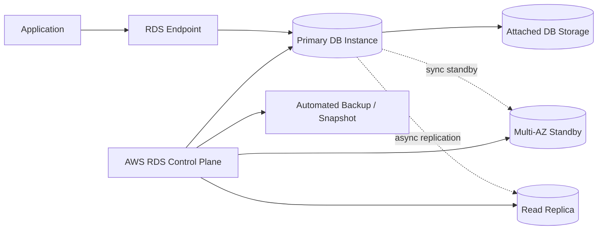
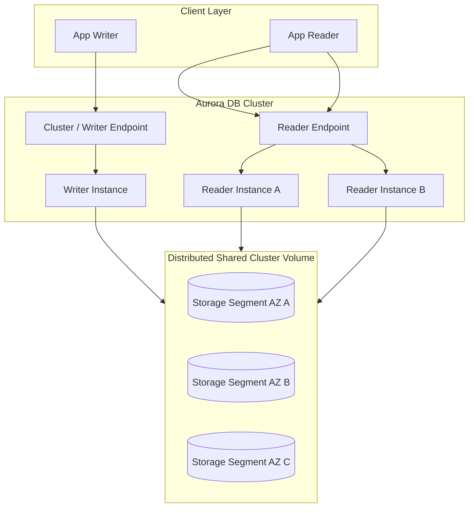
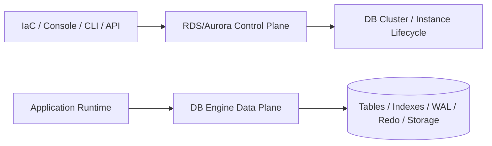
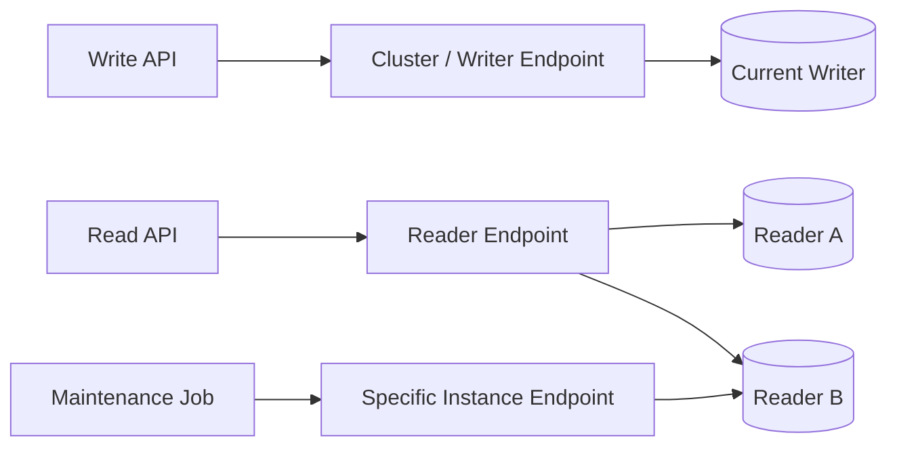
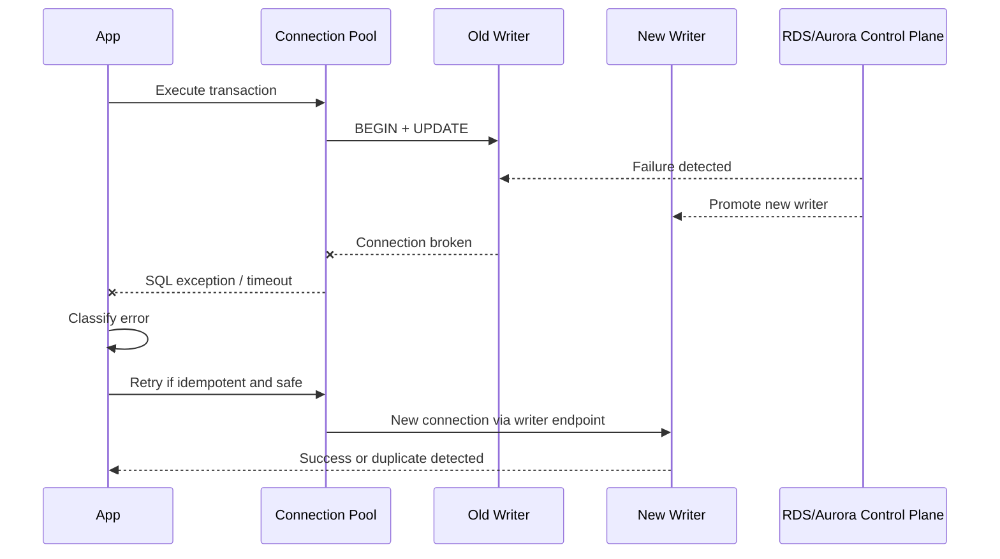
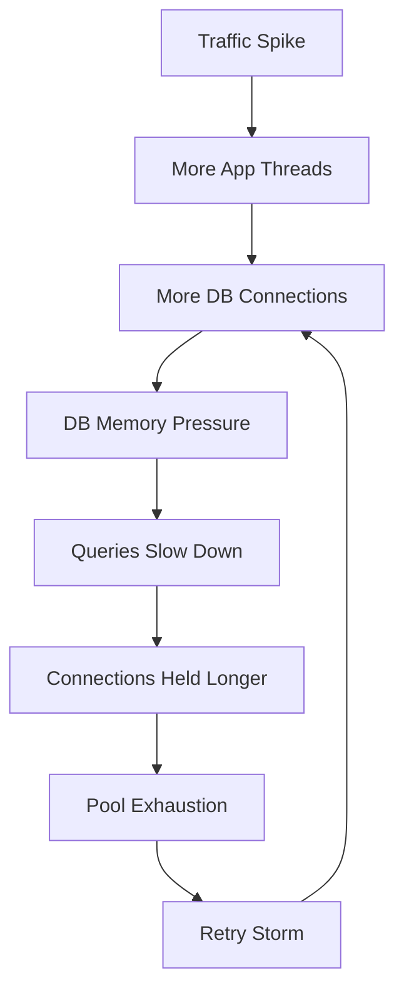
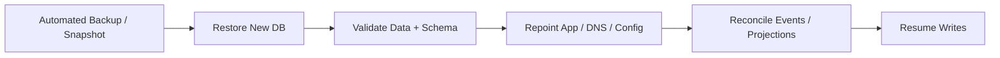
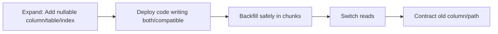
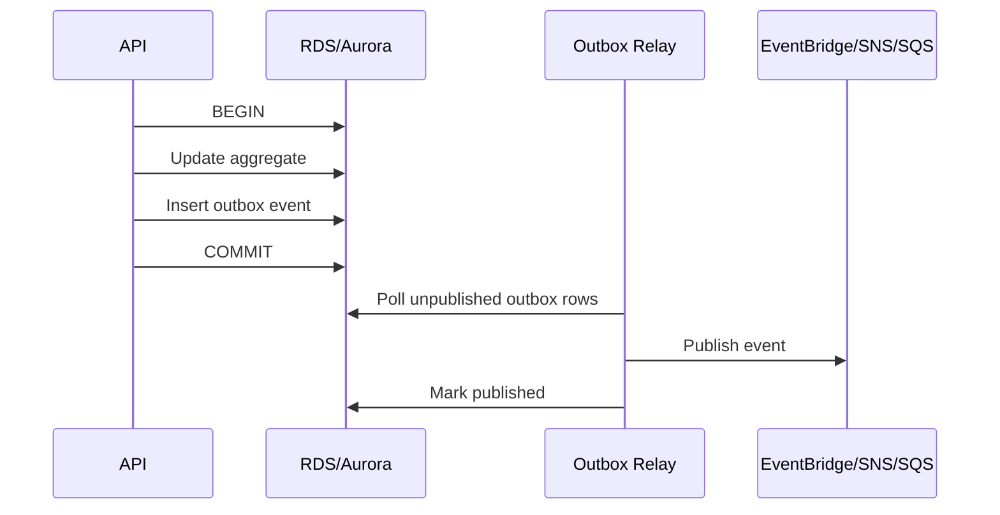

# RDS dan Aurora Mental Model: Managed Relational Database Bukan Sekadar VM DB

Amazon RDS dan Amazon Aurora sering dipahami terlalu sederhana: “database yang dikelola AWS.” Definisi itu benar, tetapi kurang berguna untuk engineer yang harus membuat sistem production. Mental model yang lebih tepat:

> **RDS/Aurora adalah kombinasi database engine, storage subsystem, control plane otomatis, network boundary, backup/restore system, failover machinery, observability surface, dan operational contract.**

Kalau hanya melihatnya sebagai “PostgreSQL/MySQL di cloud”, desain aplikasi akan salah pada titik-titik kritikal: koneksi, failover, retry, read replica lag, backup, maintenance, transaction duration, schema migration, dan capacity planning.

Part ini tidak mengulang SQL dasar. Fokusnya adalah cara memodelkan RDS/Aurora sebagai komponen distributed system.

---

## 1. Apa yang Dikelola AWS dan Apa yang Tetap Menjadi Tanggung Jawab Aplikasi?

RDS/Aurora mengurangi beban operasi, tetapi tidak menghapus tanggung jawab engineering.

### Dikelola oleh AWS

AWS membantu pada area seperti:

- provisioning database instance/cluster;
- patching engine dan OS sesuai konfigurasi maintenance;
- automated backup dan snapshot;
- Multi-AZ deployment/failover mechanism;
- storage allocation, tergantung engine dan deployment model;
- monitoring integration ke CloudWatch, Performance Insights/Database Insights;
- encryption integration dengan KMS;
- parameter group dan option group management;
- endpoint management;
- lifecycle control plane.

### Tetap tanggung jawab engineer

Aplikasi tetap harus mengelola:

- data model dan index design;
- transaction boundary;
- isolation level dan locking behavior;
- query performance;
- connection pooling;
- retry semantics;
- idempotency;
- schema migration;
- read/write split correctness;
- failover behavior di client;
- backup restore drill;
- RPO/RTO decision;
- alert/runbook;
- auditability;
- cost controls.

Managed database bukan berarti managed correctness.

---

## 2. Mental Model RDS: Managed Engine Instance

RDS klasik paling mudah dipahami sebagai **managed DB instance** yang menjalankan engine tertentu: PostgreSQL, MySQL, MariaDB, SQL Server, Oracle, atau Db2.



Core idea:

- application connects to an endpoint;
- endpoint resolves to a DB instance;
- engine behavior remains engine-native;
- Multi-AZ standby is for high availability, not read scaling in classic Multi-AZ DB instance deployment;
- read replicas are separate read-only copies, usually asynchronous;
- failover changes which instance is active;
- clients must tolerate connection drops.

RDS does not make PostgreSQL or MySQL magically distributed. It manages the lifecycle and HA mechanics around them.

---

## 3. Mental Model Aurora: Clustered Engine with Shared Distributed Storage

Aurora is not merely “RDS for MySQL/PostgreSQL.” Aurora uses a different storage architecture.

At a high level:



Important consequences:

- Aurora cluster has one writer instance and up to multiple reader instances, depending on configuration and limits.
- Writer and readers share the cluster volume.
- Failover promotes a reader to writer when possible.
- Storage replication is handled by Aurora storage subsystem, not normal engine-native replica chain in the same way as traditional replicas.
- Read scaling is via reader instances, but read consistency still matters.
- Application connection management remains critical.

Aurora gives you a managed clustered relational database architecture, not a license to ignore database design.

---

## 4. The Most Important Boundary: Control Plane vs Data Plane

A recurring production mistake is mixing up control plane and data plane.

### Control plane

The control plane manages infrastructure state:

- create DB instance/cluster;
- modify instance class;
- create snapshot;
- restore snapshot;
- add replica;
- failover;
- patch;
- change parameter group;
- scale storage or capacity;
- enable logs/monitoring.

### Data plane

The data plane executes application workload:

- SQL queries;
- transactions;
- locks;
- reads/writes;
- replication;
- connection sessions;
- query planning;
- index scans;
- constraints.



Why this matters:

- Creating a read replica is a control-plane action; avoiding stale reads is a data-plane/application design issue.
- Enabling Multi-AZ is a control-plane decision; handling broken DB connections during failover is an application issue.
- Enabling backups is a control-plane setting; proving restore works is an operational discipline.
- Increasing instance class is control-plane scaling; removing bad queries and lock contention is data-plane optimization.

---

## 5. Instance, Cluster, Storage, Endpoint: Four Things You Must Not Confuse

### DB instance

A DB instance is the compute runtime that runs the database engine process.

You tune:

- vCPU/memory;
- network bandwidth;
- storage throughput compatibility;
- parameter group;
- connection count;
- CPU/memory pressure;
- failover target priority for Aurora readers.

### DB cluster

For Aurora and RDS Multi-AZ DB clusters, a cluster is the higher-level grouping of instances and shared/replicated storage semantics.

You reason about:

- writer;
- readers;
- endpoints;
- failover;
- cluster volume;
- replication;
- high availability;
- global database, if used.

### Storage

Storage is not just “disk size.” It determines:

- durability;
- I/O latency;
- throughput;
- backup mechanics;
- restore behavior;
- replication model;
- autoscaling behavior;
- cost.

Aurora storage and traditional RDS storage have different operational models.

### Endpoint

Endpoint is the application-facing connection address.

Important Aurora endpoints include:

- writer/cluster endpoint;
- reader endpoint;
- instance endpoint;
- custom endpoint.

Endpoint is not the same as session stability. During failover, existing connections can still break.

---

## 6. Aurora Endpoint Mental Model

Aurora endpoints are routing abstractions, not transaction coordinators.



Use them carefully:

| Endpoint | Use | Risk |
|---|---|---|
| Writer/cluster endpoint | All writes and strongly ordered command-side reads | Failover breaks existing connections |
| Reader endpoint | Scale read-only traffic | Replica lag / read-after-write surprise |
| Instance endpoint | Diagnostics, controlled jobs, pinning | Hard coupling to a node |
| Custom endpoint | Route specific workload to selected readers | Operational complexity |

Rule of thumb:

> If the read affects a business decision immediately after a write, read from the writer or design a read-your-writes mechanism.

---

## 7. Multi-AZ Does Not Mean Read Scaling

This distinction is fundamental.

### RDS Multi-AZ DB instance deployment

- One primary instance.
- One standby instance in another AZ.
- Standby is for failover.
- Standby does not serve reads.
- Replication to standby is synchronous.

### RDS read replica

- Read-only copy.
- Usually asynchronous replication.
- Can serve read traffic.
- Can lag.
- Can be promoted in some scenarios.

### RDS Multi-AZ DB cluster deployment

- Has writer plus readable standby DB instances.
- Designed for higher availability and read capability than classic single-standby deployment.
- Still requires read consistency design.

### Aurora cluster

- Writer plus Aurora Replicas/readers.
- Readers can serve read traffic.
- Failover promotes a reader.
- Reader endpoint balances across readers.

Wrong mental model:

> “Multi-AZ means I can send reads to the other AZ.”

Better mental model:

> “High availability and read scaling are separate concerns unless the selected deployment model explicitly provides readable replicas.”

---

## 8. Failover Is a Data-Plane Event Seen by the Application

Database failover is often described as infrastructure behavior. For the application, failover appears as:

- connection reset;
- socket timeout;
- transient authentication/connection error;
- transaction aborted;
- commit ambiguity;
- stale DNS or pooled connection;
- retry burst;
- read/write endpoint transition;
- temporary elevated latency.



The application must decide:

- Is the operation safe to retry?
- Was the transaction committed before failure?
- Is there an idempotency key?
- Does the database enforce uniqueness?
- Does the retry create double side effects?
- Does the connection pool discard broken connections?

Failover readiness is not proven by seeing the database recover. It is proven by seeing the application recover correctly.

---

## 9. Commit Ambiguity: The Failure Nobody Likes to Talk About

Suppose the application sends `COMMIT`, then the connection breaks before the client receives the result.

Did the transaction commit?

Possible answers:

- yes;
- no;
- committed but response lost;
- failed before commit reached engine;
- committed but subsequent outbox publish failed;
- committed on old writer before failover and visible after recovery.

This is why production APIs need idempotency keys and database constraints.

```sql
CREATE TABLE command_request (
    idempotency_key      text PRIMARY KEY,
    request_hash         text NOT NULL,
    status               text NOT NULL,
    response_body        jsonb,
    created_at           timestamptz NOT NULL DEFAULT now(),
    completed_at         timestamptz
);
```

Retry should not mean “run the command again blindly.” Retry should mean:

1. Check command record.
2. If completed, return stored response or canonical resource state.
3. If in progress, return `409 Conflict` or wait depending on API contract.
4. If failed retryably, continue safely.
5. If unknown, reconcile using authoritative state.

---

## 10. The Database Is a Consistency Boundary, Not a Storage Bucket

A relational database is valuable because it can enforce invariants.

Examples:

- case number is unique;
- enforcement action cannot be approved without required evidence;
- payment capture cannot exceed authorized amount;
- user cannot hold two active exclusive leases;
- audit event must reference an existing aggregate;
- status transition must be legal;
- one workflow command has one result.

Use database constraints intentionally:

- primary key;
- unique constraint;
- foreign key where appropriate;
- check constraint;
- exclusion constraint in PostgreSQL;
- optimistic version column;
- transaction isolation;
- row-level locks;
- advisory locks only when justified;
- immutable audit table.

Application-only invariant enforcement is fragile under concurrency.

---

## 11. Long Transactions Are Operational Debt

Long transactions cause:

- lock retention;
- vacuum pressure in PostgreSQL;
- replication lag;
- deadlocks;
- connection pool exhaustion;
- deployment/migration blockage;
- slow failover recovery;
- large rollback cost;
- unpredictable user latency.

A production transaction should usually be:

- short;
- local to one aggregate or one command boundary;
- explicit in code;
- isolated from slow external calls;
- followed by outbox/event publication outside the transaction through a safe relay;
- observable through duration metrics.

Do not hold a transaction while calling:

- payment provider;
- another microservice;
- email/SMS provider;
- S3 large object operation;
- human approval process;
- Step Functions callback wait;
- long analytics query.

---

## 12. Connection Management Is Part of Database Design

A database connection is not free. It consumes memory and server resources.

Common failure path:



Healthy pattern:

- bounded pool size;
- short acquire timeout;
- query timeout;
- transaction timeout;
- circuit breaker on DB dependency;
- RDS Proxy where useful, especially with bursty/serverless clients;
- separate pools for OLTP and background jobs;
- reject/load-shed before database collapse.

Bad pattern:

- unlimited pool;
- Lambda concurrency not bounded against DB connection limit;
- every worker opens its own pool;
- read jobs share pool with critical writes;
- retries create new connections faster than old ones close.

---

## 13. RDS Proxy Mental Model

RDS Proxy is not a magic performance booster. It is a managed database proxy designed to improve connection pooling and failover behavior for supported RDS/Aurora engines.

Useful when:

- clients are bursty;
- Lambda/serverless workloads create many short-lived connections;
- failover should be handled with less client disruption;
- you need centralized credential handling with Secrets Manager;
- connection storm is a risk.

Still required:

- good transaction hygiene;
- no session state assumptions unless understood;
- correct pool sizing;
- retry classification;
- query optimization;
- database capacity planning.

RDS Proxy helps with connection management. It does not fix bad SQL, long locks, poor indexes, or wrong transaction design.

---

## 14. Read Scaling Is Not Free: Replica Lag and Read-Your-Writes

Read replicas reduce load on writer, but they introduce consistency questions.

Scenario:

1. User submits case update.
2. Write commits on writer.
3. API immediately reads from reader endpoint.
4. Reader has not caught up.
5. User sees stale status.
6. User retries or submits duplicate command.

This is not a database bug. It is a design bug.

Patterns:

| Need | Pattern |
|---|---|
| Immediate read-after-write | read from writer |
| Slightly stale dashboard | read from replica |
| User-specific session consistency | route user to writer briefly after write |
| Projection model | show `lastUpdatedAt` / freshness metadata |
| Async workflow state | expose command status, not immediate final state |
| Strong business decision | avoid stale replica |

Add a staleness budget:

```txt
This read model may be stale up to 5 seconds.
It must never be used to approve enforcement action.
```

A staleness budget is an architectural contract.

---

## 15. Aurora Storage Auto-Scaling Is Not a Capacity Strategy by Itself

Aurora storage can grow automatically, but production capacity involves more than storage size.

You still need to think about:

- write IOPS;
- read IOPS;
- instance CPU;
- memory/buffer cache;
- connection count;
- temp space;
- sort/hash operations;
- log volume;
- backup retention;
- table/index bloat;
- vacuum/autovacuum for PostgreSQL-compatible engines;
- hot rows;
- hot indexes;
- transaction log pressure.

Storage growth is not the same as performance headroom.

---

## 16. Backup Is Not Recovery

Having automated backups and snapshots is necessary. It is not sufficient.

Recovery needs proof:

- Can we restore to a new cluster?
- How long does restore take?
- Is application configuration ready to point to restored DB?
- Are credentials and KMS keys accessible?
- Are dependent projections/cache/search indexes rebuildable?
- How do we handle events emitted after restore point?
- What is the data loss window?
- Who approves restore?
- Is restore tested under realistic size?



Backup answers “do we have historical bytes?”

Recovery answers “can the business safely continue?”

---

## 17. Maintenance Windows Are Application Events

A database maintenance window can cause:

- restart;
- failover;
- parameter application;
- brief unavailability;
- performance shift;
- plan cache changes;
- extension version changes;
- client reconnection.

Treat maintenance like a controlled failure drill:

- verify retry policies;
- ensure connection pool recycles broken connections;
- monitor error rate;
- check replication lag after maintenance;
- validate writer/reader endpoint behavior;
- run smoke tests;
- confirm alarms do not page unnecessarily for expected transitions;
- document rollback/escape path.

---

## 18. Parameter Groups Are Part of Runtime Behavior

Parameter groups are not administrative noise. They are runtime behavior.

Examples:

- connection limits;
- statement timeout;
- lock timeout;
- logging behavior;
- replication settings;
- memory/work_mem-style parameters;
- timezone;
- character encoding assumptions;
- audit/logging extensions;
- optimizer-related settings.

Discipline:

- version parameter groups like code;
- separate dev/staging/prod with intentional drift only;
- document static vs dynamic parameters;
- schedule changes that require reboot;
- test under production-like workload;
- include parameter diffs in change review.

---

## 19. Database Logs Are a Signal, Not a Trash Bin

Useful database logs include:

- slow queries;
- lock waits;
- deadlocks;
- connection failures;
- checkpoint pressure;
- authentication failure;
- temp file usage;
- statement timeout;
- replication issue;
- vacuum/autovacuum activity, for PostgreSQL-compatible engines.

Bad logging strategy:

- log everything forever;
- no retention policy;
- no structured query fingerprinting;
- no correlation to application request;
- alert on log volume without classification.

Good logging strategy:

- log slow queries above workload-specific threshold;
- record application name / service / route where possible;
- correlate with request ID at application level;
- aggregate by query fingerprint;
- review top query cost weekly;
- treat deadlock as design signal, not random noise.

---

## 20. Performance Insights / Database Insights Mental Model

Database performance should be reasoned through wait states, not only CPU.

A slow database may be slow because of:

- CPU saturation;
- I/O wait;
- lock wait;
- buffer cache miss;
- connection queueing;
- poor plan;
- missing index;
- over-indexing writes;
- temporary file spill;
- replication lag;
- network latency;
- application transaction holding locks.

The question is not only:

> “Is CPU high?”

Better questions:

- What are sessions waiting on?
- Which query fingerprints dominate load?
- Which application route triggers them?
- Are waits caused by one tenant, one job, one migration, or global traffic?
- Is the database slow, or is the pool exhausted?
- Is lock contention caused by state machine design?

---

## 21. Schema Migration Mental Model

Schema change is an application/database protocol change.

Safe pattern:



Rules:

- avoid long blocking DDL;
- understand engine-specific DDL locking;
- add indexes concurrently/online where supported;
- backfill in bounded chunks;
- monitor replication lag;
- throttle migration jobs;
- ensure old and new application versions can coexist;
- do not combine irreversible migration with feature release if avoidable;
- precompute rollback strategy.

---

## 22. Transactional Outbox with RDS/Aurora

Outbox solves the dual-write problem between database state and message/event publication.



Important details:

- outbox event is written in the same transaction as domain state;
- event ID is deterministic or unique;
- relay is idempotent;
- consumer is idempotent;
- failed publish does not lose event;
- replay and repair are possible;
- outbox table needs retention/partitioning strategy.

Outbox is often more valuable than distributed transactions for service boundaries.

---

## 23. Anti-Patterns

### Anti-pattern 1: Treating RDS as a shared integration bus

Multiple services writing the same schema creates hidden coupling.

Prefer:

- one owner for authoritative state;
- APIs/events for cross-service communication;
- read projections for other services.

### Anti-pattern 2: Direct read replica for correctness-critical decisions

A stale read can approve or reject incorrectly.

Prefer:

- writer read for critical command validation;
- explicit stale-read contract for dashboards.

### Anti-pattern 3: Infinite retry on SQL exceptions

Retries without idempotency can double-apply commands.

Prefer:

- classify retryable vs non-retryable;
- use idempotency key;
- enforce uniqueness in database.

### Anti-pattern 4: Long transaction around external call

This holds locks while waiting on an unreliable dependency.

Prefer:

- local transaction;
- outbox;
- Step Functions saga;
- compensation.

### Anti-pattern 5: Unlimited Lambda concurrency against relational DB

This causes connection storm and collapse.

Prefer:

- reserved concurrency;
- RDS Proxy where appropriate;
- queue buffering;
- bounded worker pool.

---

## 24. Production Readiness Checklist

Before treating RDS/Aurora as production-ready, answer:

### Data correctness

- What invariants are enforced by database constraints?
- What invariants are application-only?
- Are command operations idempotent?
- Are retries safe after unknown commit outcome?
- Is there an outbox for emitted events?

### Availability

- Is Multi-AZ/cluster HA configured appropriately?
- Has failover been tested with real clients?
- Does the pool discard broken connections?
- Are retry budgets bounded?
- Are maintenance events rehearsed?

### Performance

- Are top access patterns indexed?
- Are slow queries logged and reviewed?
- Are pool sizes bounded?
- Are transaction durations measured?
- Are background jobs isolated from critical OLTP traffic?

### Consistency

- Which reads can use replicas?
- Which reads require writer?
- Is staleness visible to users/operators?
- Are projections rebuildable?

### Recovery

- Are backups enabled?
- Has restore been tested?
- Is RPO/RTO documented?
- Are KMS/credentials/configs included in restore plan?
- Is reconciliation after restore defined?

### Observability

- Are DB metrics, logs, waits, query fingerprints, and app traces connected?
- Are alarms actionable?
- Are runbooks tested?
- Are dashboards workload-oriented rather than service-oriented only?

---

## 25. Mental Model Summary

RDS/Aurora should be modeled as:

```txt
Relational correctness engine
+ managed lifecycle control plane
+ HA/failover mechanism
+ storage/replication subsystem
+ connection-sensitive data plane
+ backup/restore capability
+ observability surface
+ operational contract
```

The top-level engineering question is not:

> “Can AWS run my database?”

The real question is:

> “Can my application remain correct, observable, recoverable, and cost-controlled while using this managed relational database under real failure, concurrency, migration, and growth?”

That is the difference between using RDS/Aurora and engineering with RDS/Aurora.

---

## References

- Amazon RDS User Guide — What is Amazon RDS: https://docs.aws.amazon.com/AmazonRDS/latest/UserGuide/Welcome.html
- Amazon Aurora User Guide — What is Amazon Aurora: https://docs.aws.amazon.com/AmazonRDS/latest/AuroraUserGuide/CHAP_AuroraOverview.html
- Amazon Aurora User Guide — Aurora DB clusters: https://docs.aws.amazon.com/AmazonRDS/latest/AuroraUserGuide/Aurora.Overview.html
- Amazon Aurora User Guide — Aurora storage: https://docs.aws.amazon.com/AmazonRDS/latest/AuroraUserGuide/Aurora.Overview.StorageReliability.html
- Amazon Aurora User Guide — High availability for Amazon Aurora: https://docs.aws.amazon.com/AmazonRDS/latest/AuroraUserGuide/Concepts.AuroraHighAvailability.html
- Amazon Aurora User Guide — Aurora endpoints: https://docs.aws.amazon.com/AmazonRDS/latest/AuroraUserGuide/Aurora.Endpoints.Cluster.html
- Amazon RDS User Guide — Multi-AZ deployments: https://docs.aws.amazon.com/AmazonRDS/latest/UserGuide/Concepts.MultiAZ.html
- Amazon RDS User Guide — Read replicas: https://docs.aws.amazon.com/AmazonRDS/latest/UserGuide/USER_ReadRepl.html
- AWS Prescriptive Guidance — Transactional outbox pattern: https://docs.aws.amazon.com/prescriptive-guidance/latest/cloud-design-patterns/transactional-outbox.html
