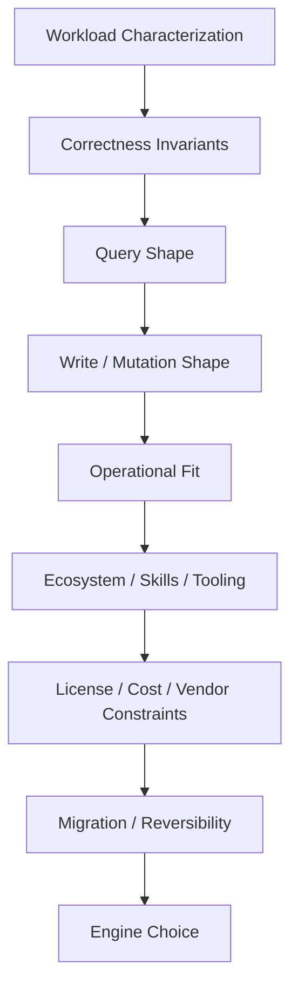
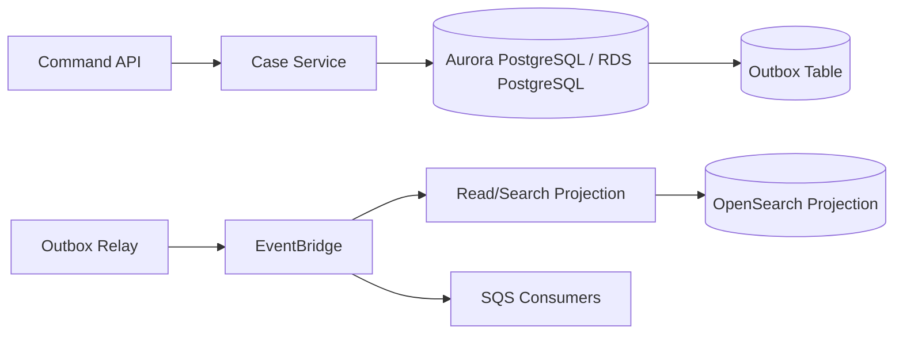

# Engine Selection: PostgreSQL, MySQL, MariaDB, SQL Server, Oracle, Db2

Engine selection is not a brand preference. It is a long-lived architecture decision that shapes:

- data modeling;
- transaction semantics;
- query capability;
- indexing strategy;
- operational runbooks;
- migration cost;
- license cost;
- hiring/troubleshooting skill;
- ecosystem integration;
- future portability;
- compliance posture;
- failover behavior;
- extension/plugin availability;
- managed-service limitations.

In Amazon RDS, you can use familiar engines such as PostgreSQL, MySQL, MariaDB, SQL Server, Oracle Database, and Db2. With Aurora, AWS provides MySQL-compatible and PostgreSQL-compatible editions with Aurora-specific storage, replication, high availability, and scaling behavior.

The wrong way to choose:

> “We use PostgreSQL because everyone says Postgres is good.”

The better way:

> “This workload has these invariants, query shapes, write rate, latency needs, operational constraints, licensing constraints, and migration constraints. Therefore this engine is the least dangerous fit.”

---

## 1. The Engine Selection Stack

Do not start with engine names. Start with the decision stack.



Every engine choice should be explainable through this stack.

---

## 2. First Principle: The Database Engine Is Part of Your Application Semantics

The engine is not a passive storage layer.

It defines:

- transaction isolation behavior;
- lock behavior;
- index types;
- query optimizer characteristics;
- JSON support;
- full-text search capability;
- stored procedure language;
- extension/plugin model;
- replication options;
- online DDL characteristics;
- partitioning behavior;
- constraint support;
- observability tools;
- backup/restore semantics;
- maintenance behavior.

Once the application depends on engine-specific behavior, migration becomes harder.

That does not mean engine-specific features are bad. It means they must be intentional.

---

## 3. RDS vs Aurora Before Engine Selection

Before choosing PostgreSQL vs MySQL, decide whether the workload fits classic RDS engine deployments or Aurora.

### RDS engine family

Use when you need:

- engine-native compatibility;
- familiar operational behavior;
- support for commercial engines;
- lower complexity for smaller systems;
- predictable instance-based deployment;
- existing vendor/tool compatibility;
- specific engine version/feature support not available in Aurora;
- migration lift-and-shift compatibility.

### Aurora family

Use when you need:

- managed clustered architecture;
- shared distributed storage model;
- fast replica creation and reader scaling patterns;
- Aurora-specific failover/replication behavior;
- Aurora Serverless v2 where appropriate;
- Aurora Global Database where appropriate;
- MySQL/PostgreSQL compatibility with Aurora operational model.

Aurora is not always “better.” It is different. Its advantages are strongest when the workload benefits from its storage/cluster architecture and operational features.

---

## 4. Decision Table: RDS Engines and Aurora Editions

| Engine / Edition | Strong Fit | Be Careful When |
|---|---|---|
| RDS for PostgreSQL | Complex relational model, advanced SQL, JSONB, extensions, constraints, analytical-adjacent OLTP | Extension support/versions matter, write-heavy bloat/vacuum behavior, complex upgrades |
| Aurora PostgreSQL | PostgreSQL-compatible workload needing Aurora HA/read scaling/storage behavior | Exact PostgreSQL feature/extension compatibility is critical; Aurora-specific behavior must be tested |
| RDS for MySQL | Broad ecosystem compatibility, simple OLTP, common web workload, MySQL tooling | Complex query/constraint needs; online DDL/replication behavior must be understood |
| Aurora MySQL | MySQL-compatible workload needing Aurora storage/cluster benefits | Exact MySQL compatibility/plugin behavior matters; failover/read consistency must be tested |
| RDS for MariaDB | MariaDB-specific compatibility and ecosystem | Divergence from MySQL matters; managed feature support must be validated |
| RDS for SQL Server | Existing SQL Server apps, T-SQL, Microsoft ecosystem, vendor apps | Licensing, edition features, cross-platform expectations, operational cost |
| RDS for Oracle | Existing Oracle apps, PL/SQL, enterprise Oracle features/vendor products | Licensing, feature support restrictions, cost, migration complexity |
| RDS for Db2 | Existing IBM Db2 workloads/vendor dependency | Skill availability, licensing, feature compatibility, migration complexity |

The table is not a replacement for workload evidence. It is a starting map.

---

## 5. PostgreSQL: When It Is Usually the Best Default

PostgreSQL is often a strong default for new relational systems because it gives a broad correctness and query toolbox.

### Strong fit

- complex relational models;
- strong constraint usage;
- rich indexing;
- JSONB with relational control;
- geospatial or extension-driven workloads, if supported;
- analytical-adjacent OLTP queries;
- event/outbox tables;
- audit trails;
- state machines;
- regulatory case management;
- systems that need data integrity more than minimal SQL feature set.

### Useful properties

- mature transaction model;
- MVCC;
- advanced indexes;
- `CHECK`, `FOREIGN KEY`, `UNIQUE`, partial indexes, expression indexes;
- JSONB support;
- CTEs/window functions;
- extensions, depending on RDS/Aurora support;
- good ecosystem for migrations and observability.

### Production risks

- vacuum/autovacuum behavior must be understood;
- table/index bloat can become operational debt;
- long-running transactions are dangerous;
- badly chosen indexes slow writes;
- complex queries can hide performance cliffs;
- extension availability differs across RDS/Aurora/version;
- major upgrades need planning and testing.

### Good use case

A regulatory enforcement lifecycle platform with:

- cases;
- evidence;
- assignments;
- escalation rules;
- status transitions;
- audit history;
- cross-entity consistency constraints;
- reporting-adjacent queries;
- strict correctness.

PostgreSQL is often a strong candidate because constraints and relational modeling are first-class.

---

## 6. Aurora PostgreSQL: PostgreSQL Compatibility + Aurora Runtime

Aurora PostgreSQL is attractive when you want PostgreSQL-compatible semantics but also want Aurora cluster/storage benefits.

### Strong fit

- PostgreSQL-compatible application needing high availability and reader scaling;
- operational preference for Aurora cluster endpoints and replica promotion;
- workloads with high read scale and moderate write concentration;
- systems that benefit from Aurora storage behavior;
- teams willing to test Aurora-specific behavior.

### What changes mentally

You are not choosing only PostgreSQL. You are choosing:

```txt
PostgreSQL-compatible engine behavior
+ Aurora cluster lifecycle
+ Aurora distributed storage
+ Aurora endpoint/failover behavior
+ Aurora replication model
```

### Validate before choosing

- PostgreSQL version compatibility;
- extension support;
- parameter behavior;
- failover behavior with your driver/pool;
- reader lag under write load;
- query plans on Aurora;
- migration path from existing PostgreSQL;
- backup/restore/RPO/RTO;
- cost under production I/O and storage patterns.

Aurora PostgreSQL can be excellent, but never assume exact behavior purely from self-managed PostgreSQL experience.

---

## 7. MySQL: Broad Compatibility and Simple OLTP

MySQL is a strong fit for many web-scale OLTP applications with straightforward relational needs.

### Strong fit

- existing MySQL app;
- broad compatibility with frameworks/tools;
- simple transactional operations;
- common web workloads;
- read-heavy applications with replica strategy;
- teams deeply experienced with MySQL.

### Useful properties

- huge ecosystem;
- simple operational model for common use cases;
- broad ORM/framework compatibility;
- mature replication ecosystem;
- widespread operational knowledge.

### Production risks

- engine/storage engine specifics matter;
- online DDL characteristics matter;
- transaction isolation defaults must be understood;
- complex relational constraints/features may be less expressive than PostgreSQL for some workloads;
- JSON support exists but should not become ungoverned schema dumping;
- read replica lag and failover must be designed explicitly.

### Good use case

A high-volume transactional application with simple aggregate boundaries, predictable queries, and strong MySQL ecosystem dependency.

---

## 8. Aurora MySQL: MySQL Compatibility + Aurora Runtime

Aurora MySQL is not simply RDS for MySQL with a different label. It brings Aurora cluster/storage behavior into a MySQL-compatible environment.

### Strong fit

- MySQL-compatible workload needing Aurora HA/read-scaling properties;
- systems with many read replicas/read endpoints;
- teams wanting Aurora Serverless v2 or Global Database patterns where appropriate;
- workloads that benefit from Aurora storage architecture.

### Validate before choosing

- MySQL version compatibility;
- SQL mode assumptions;
- feature/plugin support;
- client driver behavior during failover;
- read consistency under replica traffic;
- binlog/CDC needs;
- migration approach;
- operational metrics and runbooks.

Aurora MySQL is often a strong target for modernizing MySQL-heavy workloads, but compatibility must be tested at the application behavior level, not just schema import.

---

## 9. MariaDB: Choose for MariaDB Compatibility, Not as Generic MySQL

MariaDB and MySQL have diverged over time. Do not treat MariaDB as automatically interchangeable with MySQL.

### Strong fit

- existing MariaDB workload;
- MariaDB-specific features;
- vendor/application requirement;
- operational team already committed to MariaDB.

### Be careful

- MySQL compatibility assumptions;
- tooling differences;
- migration from/to MySQL;
- managed feature support;
- version-specific behavior;
- extension/plugin dependencies.

Choose RDS for MariaDB because your workload needs MariaDB, not because it sounds like “open-source MySQL but different.”

---

## 10. SQL Server: Choose for T-SQL and Microsoft Ecosystem

SQL Server on RDS is usually driven by existing application, vendor software, T-SQL, and Microsoft ecosystem integration.

### Strong fit

- existing SQL Server workload;
- vendor app certified on SQL Server;
- T-SQL stored procedures;
- SQL Server-specific features;
- Microsoft-oriented enterprise environment;
- migration where rewrite risk is higher than managed SQL Server cost.

### Be careful

- licensing and edition constraints;
- feature availability on RDS;
- Windows/Microsoft operational assumptions;
- cross-platform data access expectations;
- backup/restore and migration tooling;
- performance tuning skill requirements;
- cost predictability.

SQL Server is often a rational choice for enterprise modernization, but rarely the best default for a greenfield cloud-native service unless the ecosystem dependency is real.

---

## 11. Oracle: Choose for Oracle Dependency, Not Prestige

RDS for Oracle is generally selected because an organization already has Oracle workloads, PL/SQL code, vendor products, or enterprise licensing constraints.

### Strong fit

- existing Oracle application;
- PL/SQL-heavy business logic;
- vendor package requiring Oracle;
- Oracle-specific features;
- migration to managed infrastructure without full database refactor.

### Be careful

- licensing model;
- edition/features;
- operational cost;
- RDS limitations vs self-managed Oracle;
- migration complexity;
- skill availability;
- modernization roadmap.

Oracle can be the right answer when the business dependency is real. For greenfield systems, require very strong justification.

---

## 12. Db2: Choose for Existing IBM Db2 Workloads

RDS for Db2 is primarily relevant when you have Db2 applications, vendor dependencies, or enterprise migration requirements.

### Strong fit

- existing Db2 workload;
- IBM ecosystem dependency;
- vendor application requiring Db2;
- modernization from self-managed Db2 to managed service.

### Be careful

- feature compatibility;
- licensing;
- operational knowledge;
- migration tooling;
- integration with application framework;
- long-term team support.

Like Oracle and SQL Server, Db2 is usually not a generic default. It is a dependency-driven decision.

---

## 13. Greenfield Default: PostgreSQL vs MySQL vs Aurora

For a new system, narrow the default choices first.

### Prefer PostgreSQL / Aurora PostgreSQL when

- data integrity is central;
- relational model is non-trivial;
- advanced constraints/indexing are useful;
- JSON is needed but must remain governed;
- regulatory auditability matters;
- query complexity is moderate/high;
- future reporting/query needs are likely;
- team can operate PostgreSQL well.

### Prefer MySQL / Aurora MySQL when

- workload is simple OLTP;
- ecosystem/tooling is MySQL-heavy;
- framework/vendor compatibility matters;
- team has stronger MySQL operational expertise;
- query model is predictable and simple;
- application is read-heavy with clear replica strategy.

### Prefer classic RDS over Aurora when

- exact engine-native behavior matters more than Aurora features;
- workload is small/simple and Aurora complexity/cost is unnecessary;
- migration compatibility is the priority;
- feature/version support is better on RDS engine;
- team wants simpler instance mental model.

### Prefer Aurora over classic RDS when

- HA/read scaling/storage behavior gives clear value;
- cluster endpoints and replica promotion are useful;
- workload benefits from Aurora storage architecture;
- Global Database/Serverless v2 is part of architecture;
- operational team understands Aurora-specific behavior.

---

## 14. Workload-Based Decision Matrix

| Workload Trait | Stronger Candidate | Reason |
|---|---|---|
| Complex business invariants | PostgreSQL / Aurora PostgreSQL | Rich constraints, indexing, SQL capability |
| Simple web OLTP | MySQL / Aurora MySQL / PostgreSQL | Ecosystem/team fit decides |
| Existing SQL Server app | RDS for SQL Server | Compatibility and migration risk |
| Existing Oracle app | RDS for Oracle | PL/SQL/vendor compatibility |
| Existing Db2 app | RDS for Db2 | Dependency-driven modernization |
| Heavy JSON with relational constraints | PostgreSQL | JSONB plus relational guardrails |
| Many read replicas with Aurora fit | Aurora PostgreSQL/MySQL | Aurora reader/failover/storage model |
| Need exact engine extension/plugin | RDS native engine | Validate Aurora support first |
| License-sensitive greenfield | PostgreSQL/MySQL/Aurora open-source compatible editions | Avoid commercial license burden |
| Vendor-certified database | Required vendor engine | Certification may dominate elegance |

---

## 15. Feature Fit: Ask These Questions

### SQL and query behavior

- Do we need complex joins?
- Do we need recursive queries?
- Do we need window functions?
- Do we need generated columns?
- Do we need advanced JSON support?
- Do we need geospatial support?
- Do we need full-text search or should OpenSearch be a projection?

### Constraints and correctness

- Do we need partial uniqueness?
- Do we need exclusion constraints?
- Do we need deferred constraints?
- Do we need strict foreign key behavior?
- Can the engine enforce the invariants we care about?

### Indexing

- What index types are required?
- Are indexes compatible with write rate?
- Can we use expression/functional indexes?
- Are partial/sparse indexes needed?
- How painful is online index creation?

### Operations

- How does the engine behave under long transactions?
- How does it handle vacuum/garbage collection/bloat?
- How does failover affect sessions?
- How mature are monitoring tools?
- Are slow query logs useful enough?
- Can the team debug locks/deadlocks?

---

## 16. Compatibility Is More Than Syntax

A database can accept your SQL schema and still be behaviorally incompatible.

Validate:

- transaction isolation behavior;
- collation/sort order;
- timezone behavior;
- numeric precision;
- case sensitivity;
- null handling assumptions;
- stored procedures/functions;
- triggers;
- extensions/plugins;
- query plans;
- locking behavior;
- DDL behavior;
- replication/CDC compatibility;
- driver behavior;
- connection pool behavior;
- failover behavior.

Migration tests must include behavior, not only DDL import.

---

## 17. Licensing and Cost Are Architecture Constraints

Commercial engines can be the correct choice, but the cost model must be explicit.

Consider:

- license included vs bring-your-own-license;
- edition feature requirements;
- core/vCPU implications;
- Multi-AZ/replica cost;
- dev/test license footprint;
- backup and storage cost;
- support cost;
- skill cost;
- migration exit cost.

A cheap migration that preserves a high-cost database forever may not be cheap.

A costly rewrite that removes a business-critical vendor dependency may not be safe.

Make the trade-off explicit.

---

## 18. Team Skill Is a Production Feature

A technically excellent engine can be a bad choice if the team cannot operate it.

Ask:

- Can the team read query plans?
- Can the team diagnose locks?
- Can the team handle backup/restore incidents?
- Can the team design indexes safely?
- Can the team perform zero-downtime schema changes?
- Can the team debug replication lag?
- Can the team tune connection pools?
- Can the team interpret engine-specific metrics?

Database incidents are rarely solved by documentation during a production outage. They are solved by practiced familiarity.

---

## 19. Migration Path Matters

Selection should include future migration risk.

### Easier-to-change dependencies

- simple SQL usage;
- few stored procedures;
- generic constraints;
- minimal extension/plugin use;
- clean data access layer;
- documented access patterns;
- integration tests;
- no database as shared integration layer.

### Harder-to-change dependencies

- stored procedures as business logic;
- engine-specific SQL everywhere;
- triggers with hidden side effects;
- vendor-specific types;
- direct database access from many services;
- no ownership boundary;
- reporting coupled to OLTP schema;
- no migration test harness;
- no CDC/outbox strategy.

Avoid accidental lock-in. Accept intentional lock-in only when the value is clear.

---

## 20. Application Architecture Should Influence Engine Choice

### Monolith with rich domain model

A relational engine with strong constraints is often appropriate. PostgreSQL is commonly strong here.

### Microservices with database-per-service

Each service database should fit its aggregate and workload. But do not overuse polyglot persistence. Operational cost compounds.

### Event-driven system

Relational engine often remains command-side source of truth, with outbox table and projections elsewhere.

### Serverless API with bursty traffic

Connection management becomes central. Consider Aurora Serverless v2 or RDS Proxy depending on engine/workload, but validate latency and transaction behavior.

### SaaS multi-tenant system

Engine choice must account for tenant isolation model:

- shared schema;
- schema per tenant;
- database per tenant;
- row-level security;
- noisy-neighbor control;
- per-tenant backup/restore expectations;
- tenant-level deletion/export.

PostgreSQL often has useful tenant modeling features, but design still matters more than engine name.

---

## 21. Engine Selection for Regulatory Case Management

For the user's domain-style workload—enforcement lifecycle modelling, complex case management, state machines, escalation logic, and regulatory defensibility—the database needs often include:

- strong transactional invariants;
- immutable audit history;
- temporal state transitions;
- cross-entity consistency;
- flexible query/reporting;
- controlled schema evolution;
- idempotent command handling;
- clear ownership boundaries;
- reliable outbox/event emission;
- explainability during audit.

A common architecture:



PostgreSQL/Aurora PostgreSQL is often a strong candidate because it supports rich relational integrity and audit-friendly modeling. But the final choice should still evaluate:

- expected write volume;
- query complexity;
- extension needs;
- reporting separation;
- operational skill;
- Aurora feature fit;
- cost;
- migration constraints.

Do not force graph/search/document requirements into the command database. Use projections when they are derived, rebuildable, and not source of truth.

---

## 22. Engine Selection Anti-Patterns

### Anti-pattern 1: Choosing Aurora because it sounds more advanced

Aurora is valuable when its architecture solves real workload problems.

Bad reason:

> “Aurora is AWS-native, therefore always better.”

Better reason:

> “We need Aurora cluster storage, failover model, reader scaling, and operational features; we tested compatibility and cost.”

### Anti-pattern 2: Choosing PostgreSQL then using it as schemaless JSON storage

PostgreSQL has excellent JSON support, but ungoverned JSON blobs bypass relational value.

Use JSON intentionally, with constraints/indexes where appropriate.

### Anti-pattern 3: Choosing commercial engine for greenfield without dependency

Oracle/SQL Server/Db2 can be correct for existing workloads. For greenfield, justify the license and operational constraint.

### Anti-pattern 4: Ignoring engine-specific DDL behavior

Schema migration safety depends heavily on engine and version.

Validate DDL locking behavior before production.

### Anti-pattern 5: Optimizing for developer familiarity only

Team skill matters, but the workload still has requirements. Familiarity cannot override correctness constraints.

---

## 23. Engine Selection ADR Template

Use this structure for every serious engine decision.

```mdx
# ADR: Select Database Engine for <Service>

## Status
Proposed | Accepted | Superseded

## Context
- Business domain:
- Service owner:
- Data owner:
- Expected data size:
- Expected read/write rate:
- Latency budget:
- Availability requirement:
- RPO/RTO:
- Compliance/audit needs:

## Workload Characteristics
- Command patterns:
- Query patterns:
- Transaction boundaries:
- Consistency requirements:
- Mutation frequency:
- Cardinality/skew:
- Reporting/search needs:

## Options Considered
- RDS PostgreSQL
- Aurora PostgreSQL
- RDS MySQL
- Aurora MySQL
- RDS SQL Server
- RDS Oracle
- RDS Db2
- Other datastore/projection

## Decision
Chosen engine:
Deployment model:
Why:

## Consequences
Positive:
Negative:
Operational risks:
Cost risks:
Migration risks:

## Validation Required
- Load test:
- Failover test:
- Migration test:
- Schema change test:
- Backup/restore test:
- Observability test:

## Review Trigger
- Data size exceeds:
- P95 latency exceeds:
- Write rate exceeds:
- Engine feature gap discovered:
- Cost exceeds:
```

---

## 24. Validation Plan Before Final Choice

Before committing to an engine, run a proof that touches real risks.

### Schema proof

- model core aggregates;
- implement constraints;
- create indexes;
- implement migration scripts;
- verify online migration behavior.

### Query proof

- run top 20 access patterns;
- test realistic cardinality;
- inspect query plans;
- test worst tenant/skew;
- measure p95/p99.

### Transaction proof

- simulate concurrent commands;
- test uniqueness races;
- test deadlocks;
- test retry/idempotency;
- test transaction timeout.

### Operational proof

- failover database;
- restart instance;
- exhaust connection pool intentionally in staging;
- restore backup;
- replay outbox;
- run schema migration under load;
- test observability dashboard.

### Migration proof

- import representative data;
- test character/collation/timezone behavior;
- test stored procedures/functions/triggers if any;
- test CDC/outbox integration;
- test rollback/dual-read plan.

---

## 25. Practical Selection Heuristics

Use these heuristics, but do not treat them as laws.

### Greenfield complex business system

Start evaluation with:

```txt
Aurora PostgreSQL or RDS PostgreSQL
```

Then prove whether Aurora features are needed.

### Greenfield simple high-volume web OLTP

Start evaluation with:

```txt
Aurora MySQL, RDS MySQL, Aurora PostgreSQL, or RDS PostgreSQL
```

Let team expertise, query needs, and operational model decide.

### Existing commercial database

Start with:

```txt
RDS for the same engine
```

Then separately evaluate modernization/refactor path.

### Heavy search/query projection

Do not choose relational engine solely to perform search workload. Use relational database as source of truth and OpenSearch or another projection when justified.

### Heavy graph traversal

Do not force deep graph traversal into relational queries if graph is the core workload. Evaluate Neptune or a graph projection.

### Heavy time-series ingest

Do not default to relational unless query and retention are relational. Evaluate Timestream or purpose-built time-series design.

---

## 26. Final Decision Checklist

An engine choice is ready only when you can answer:

- Why this engine?
- Why not the closest alternative?
- Which engine-specific features are we relying on?
- Which features are unavailable or restricted in managed RDS/Aurora?
- What is our transaction boundary?
- What consistency guarantees do we need?
- How do we scale reads?
- How do we handle replica lag?
- How do we handle failover at application layer?
- How do we manage connections?
- How do we migrate schema safely?
- How do we restore from backup?
- What is our RPO/RTO?
- What are cost drivers?
- What operational skills are required?
- What would make us revisit this decision?

---

## 27. Mental Model Summary

Engine selection is a production decision, not a preference decision.

```txt
Engine choice = workload semantics
              + correctness constraints
              + query capability
              + operational behavior
              + compatibility
              + skill availability
              + cost/license
              + migration/reversibility
```

For top-tier engineering, the target is not to memorize which engine is “best.” The target is to make database engine choice auditable, testable, reversible where possible, and aligned with real workload invariants.

---

## References

- Amazon RDS User Guide — What is Amazon RDS: https://docs.aws.amazon.com/AmazonRDS/latest/UserGuide/Welcome.html
- Amazon RDS Getting Started Guide — Choosing your database engine: https://docs.aws.amazon.com/AmazonRDS/latest/gettingstartedguide/choosing-engine.html
- Amazon RDS User Guide — Engine-native features in Amazon RDS: https://docs.aws.amazon.com/AmazonRDS/latest/UserGuide/Concepts.RDS_Fea_Regions_DB-eng.Feature.EngineNativeFeatures.html
- Amazon RDS User Guide — Supported features by Region and DB engine: https://docs.aws.amazon.com/AmazonRDS/latest/UserGuide/Concepts.RDSFeaturesRegionsDBEngines.grids.html
- Amazon Aurora User Guide — What is Amazon Aurora: https://docs.aws.amazon.com/AmazonRDS/latest/AuroraUserGuide/CHAP_AuroraOverview.html
- Amazon Aurora User Guide — Aurora DB clusters: https://docs.aws.amazon.com/AmazonRDS/latest/AuroraUserGuide/Aurora.Overview.html
- Amazon Aurora User Guide — Aurora storage: https://docs.aws.amazon.com/AmazonRDS/latest/AuroraUserGuide/Aurora.Overview.StorageReliability.html
- AWS Well-Architected Framework — Use purpose-built data stores: https://docs.aws.amazon.com/wellarchitected/latest/framework/perf_data_use_purpose_built_data_store.html
