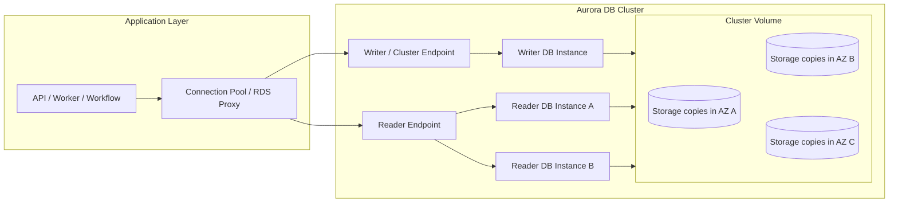
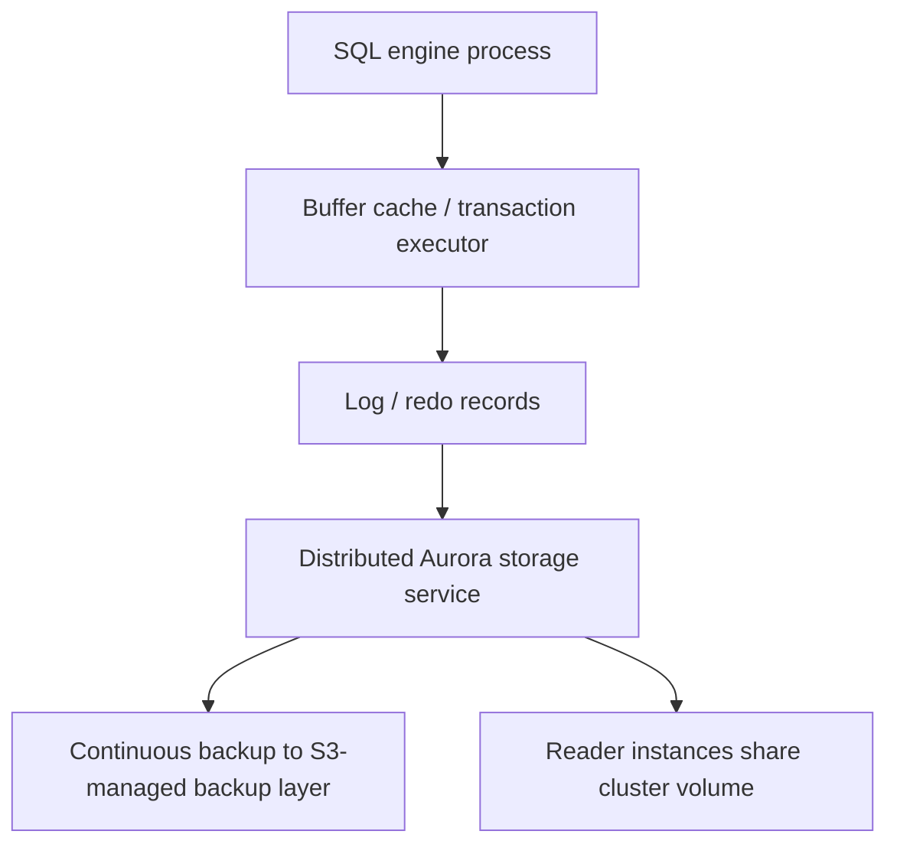
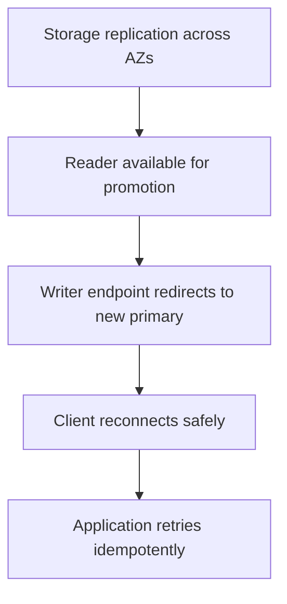
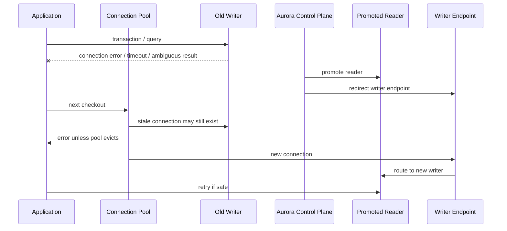
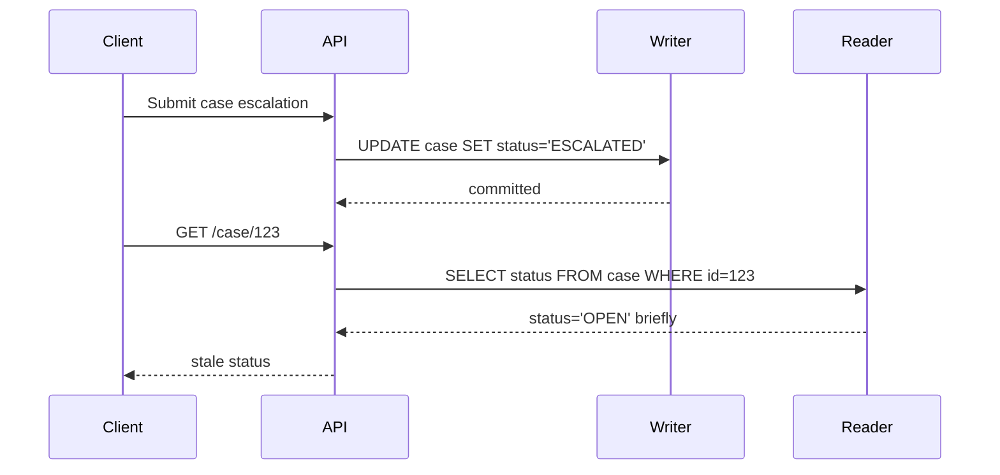
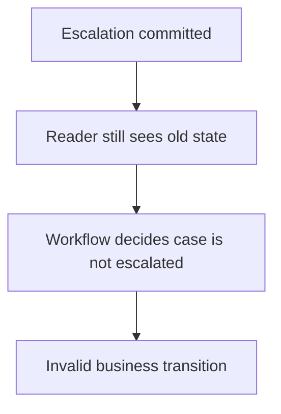
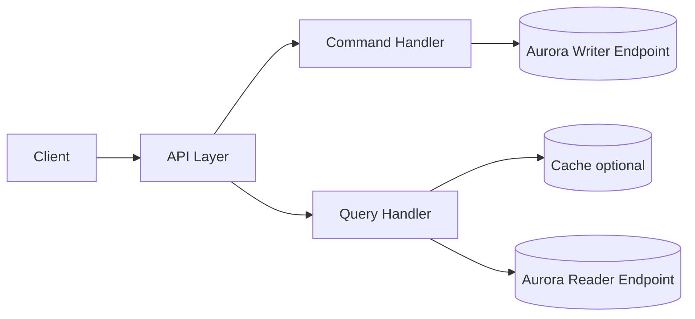
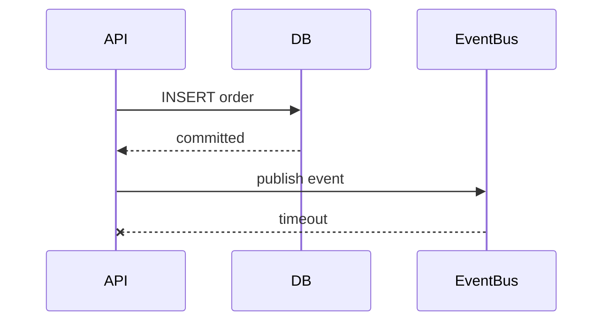
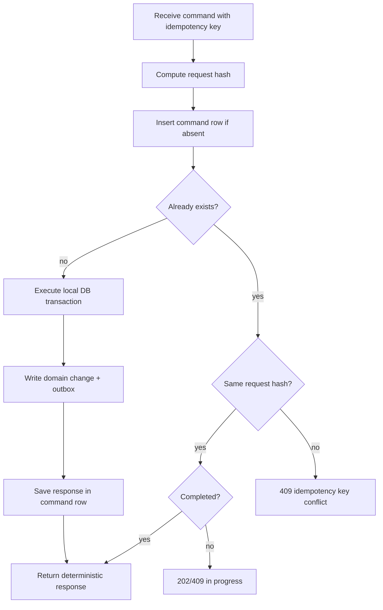
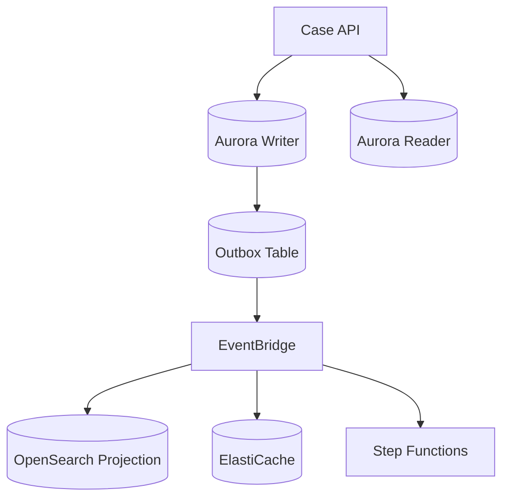

# Aurora Architecture: Storage, Replication, Writer, Reader, Failover

Aurora is not “PostgreSQL/MySQL on a managed EC2 box”.

That mental model is too small.

A better mental model:

> Aurora is a relational compute layer attached to a distributed, replicated, multi-AZ cluster volume, exposed through cluster endpoints, managed failover, continuous backup, and AWS control-plane automation.

That sentence hides most of the engineering risk.

This part breaks it apart.

We are not trying to memorize Aurora marketing bullets. We want to understand what changes when the database storage, replication, backup, failover, and endpoints are no longer shaped like a single self-managed database server.

---

## 1. The Shape of an Aurora Cluster

An Aurora DB cluster has two major planes:

1. **Compute plane**: DB instances that run the database engine.
2. **Storage plane**: the cluster volume that stores the data and spans multiple Availability Zones.



In ordinary RDS mental models, people often think in terms of “primary instance plus standby instance”. Aurora forces a different model:

- the **writer instance** accepts writes;
- **reader instances** serve read-only traffic and can be promoted during failover;
- all DB instances in the cluster share the **same cluster volume**;
- the cluster volume is replicated across Availability Zones;
- the application should connect through **cluster endpoints**, not hard-coded instance endpoints;
- failover moves the writer role to another instance, but application connections still experience disruption and must reconnect safely.

The first operational invariant:

> Aurora improves database availability, but it does not remove the need for application-level retry, connection recovery, idempotency, timeout discipline, and transaction ambiguity handling.

---

## 2. Aurora Is Compute/Storage Separation, Not Magic

Aurora separates the DB engine compute from the underlying distributed storage system.

This creates real benefits:

- storage grows independently from DB instance compute;
- replicas share storage instead of requiring full physical copy replication inside the same Region;
- backups can be continuous and storage-integrated;
- failover can promote a reader without copying data;
- crash recovery behavior differs from traditional database recovery because storage is already distributed.

But it also creates design obligations:

- the application must understand writer/reader endpoints;
- reader traffic must tolerate replica/session semantics;
- failover still drops or invalidates existing connections;
- storage-level durability does not protect you from bad writes, bad migrations, or bad deletes;
- low-level Aurora metrics become part of your production debugging vocabulary;
- cost can shift from instance cost to I/O and storage behavior.

Think of Aurora like this:



The database engine still has normal database responsibilities: parsing SQL, planning queries, executing transactions, managing locks, enforcing constraints, using indexes, and maintaining MVCC semantics. Aurora changes much of the surrounding storage and replication machinery.

Do not confuse “managed distributed storage” with “application correctness”.

Aurora can make the bytes durable. It cannot decide whether your order should have been approved twice.

---

## 3. The Cluster Volume

The **cluster volume** is the central object.

For Aurora, a DB cluster consists of one or more DB instances and a cluster volume. The cluster volume is a virtual database storage volume that spans multiple Availability Zones. Each Availability Zone has a copy of the DB cluster data.

Operationally, this means:

- the cluster volume is not “attached disk” in the EC2 sense;
- the writer and readers interact with the shared storage layer;
- storage replication is handled by Aurora, not by application code;
- failover does not require attaching a completely separate standby data volume;
- reader instances do not require logical replication from the writer in the same way a normal primary/replica topology does.

A useful contrast:

| Model | Storage shape | Failover implication |
|---|---|---|
| Self-managed PostgreSQL on EC2 | local EBS volume plus replication you manage | you own replication, promotion, data-loss analysis, and failover automation |
| RDS Multi-AZ instance deployment | managed primary plus standby | AWS manages failover to standby, but architecture is closer to instance-level standby replication |
| Aurora DB cluster | multiple compute instances over shared distributed cluster volume | readers share cluster volume and one can become writer without full data copy promotion |

The cluster volume does not mean all queries become faster. Query performance is still dominated by:

- query shape;
- index design;
- table bloat;
- statistics quality;
- lock contention;
- connection count;
- buffer cache hit ratio;
- temporary files;
- write amplification;
- storage I/O pattern;
- transaction duration.

Aurora changes the storage substrate. It does not repeal database physics.

---

## 4. Replication Across Availability Zones

Aurora stores data across multiple Availability Zones in a Region.

From a failure-model perspective, this matters because a single AZ failure should not mean database data loss. Aurora’s storage design replicates data across AZs and is designed to continue operating through certain storage-node failures.

The key architectural consequence:

> In Aurora, high availability is a storage + compute + endpoint + client behavior property. It is not only a storage property.

Storage may survive. But the application can still fail because:

- it used an instance endpoint instead of the writer endpoint;
- it had long-lived broken TCP connections;
- its pool did not evict dead connections quickly;
- it retried non-idempotent commands;
- it treated ambiguous commit as failed and submitted duplicate commands;
- it routed read-after-write queries to readers that did not yet observe the write;
- it could not drain traffic during maintenance or failover;
- it exceeded connection limits when all clients reconnected at once.

The right mental model is layered:



If any layer is weak, the incident becomes visible.

---

## 5. Writer Instance

Every normal Aurora cluster has one primary/writer DB instance.

The writer is responsible for:

- accepting writes;
- executing DDL that changes schema;
- executing read/write transactions;
- enforcing constraints and transaction semantics;
- coordinating database engine state with the cluster volume;
- serving reads when clients connect to the writer endpoint.

The writer endpoint should be used for:

- commands that mutate state;
- transactions that must read their own writes;
- DDL/migrations;
- job workers that update row state;
- command handlers that enforce invariants;
- consistency-sensitive reads.

It should not be used blindly for every read if your read workload can be safely offloaded to readers.

However, offloading reads is not free. You need to classify reads.

| Read type | Safe for reader endpoint? | Reason |
|---|---:|---|
| Public catalog read with stale tolerance | Usually yes | small staleness is acceptable |
| Dashboard with freshness label | Usually yes | user can tolerate delayed view if explicit |
| Immediate read after command | Usually no | may require read-your-writes |
| Authorization or entitlement read | Usually no | stale auth can become security incident |
| Workflow decision read | Usually no | stale state can trigger wrong transition |
| Analytics-like report | Sometimes | depends on isolation from OLTP and freshness budget |

Rule:

> If a stale read can cause an invalid state transition, use the writer or redesign the consistency boundary.

---

## 6. Reader Instances

Aurora reader instances are read-only DB instances in the cluster. They use the same cluster volume and can serve read traffic. They can also become failover targets.

A reader is useful when:

- read traffic is high and can be separated from writes;
- queries are expensive but do not require latest committed data from the writer session;
- reporting queries can tolerate freshness lag or should be routed to a custom endpoint;
- operational read-only tools should not compete with writer CPU;
- regional read locality is needed through Aurora Global Database secondaries.

A reader is dangerous when:

- used for command validation that requires newest state;
- used for authorization decisions without freshness model;
- used for workflow branching;
- used immediately after write in the same request path;
- overloaded with expensive reports that starve normal read traffic;
- assumed to be equivalent to the writer.

A mature system labels query consistency explicitly:

```java
public enum ReadConsistencyClass {
    STRONG_DECISION_READ,      // writer endpoint only
    READ_YOUR_WRITES,          // writer endpoint or session-pinned flow
    STALE_TOLERANT_VIEW,       // reader endpoint allowed
    ANALYTICAL_PROJECTION,     // separate projection / reporting DB preferred
    CACHEABLE_PUBLIC_READ      // cache or reader allowed
}
```

Then routing becomes a deliberate architecture decision, not a repository-level accident.

---

## 7. Endpoints Are Part of the Architecture

Aurora exposes different endpoint types. The most important are:

- **cluster endpoint / writer endpoint**: connects to the current primary DB instance;
- **reader endpoint**: load-balances new read-only connections across available Aurora Replicas;
- **instance endpoint**: connects to one specific DB instance;
- **custom endpoint**: groups selected DB instances for specialized routing.

A common production mistake:

> The team correctly creates Aurora with readers, but the application uses instance endpoints, then failover behavior becomes brittle.

Use endpoint types intentionally:

| Endpoint | Use | Avoid |
|---|---|---|
| Writer/cluster endpoint | commands, migrations, strong reads | reporting-only traffic if it can be offloaded |
| Reader endpoint | stale-tolerant reads | read-after-write and invariant decisions |
| Custom endpoint | isolate reporting readers or special instance class | hiding unclear query consistency rules |
| Instance endpoint | maintenance, debugging, targeted test | normal application routing |

Endpoint behavior does not eliminate connection management. DNS and endpoint redirection help new connections. Existing broken connections still have to be detected and replaced.

---

## 8. Failover Is a State Transition, Not an Event Name

During failover, Aurora promotes a suitable reader to become the new writer.

From the application perspective, failover is a state transition with multiple phases:



There are three different questions:

1. **Infrastructure question**: Did Aurora promote a new writer?
2. **Connectivity question**: Did the application reconnect correctly?
3. **Semantic question**: Is it safe to retry the command?

Teams often solve the first question and ignore the second and third.

That is not production-ready.

### 8.1 Ambiguous Commit

The worst database failure mode for API correctness is not a clear failure. It is ambiguity.

Example:

1. Client calls `POST /payments`.
2. API starts DB transaction.
3. DB commits successfully.
4. Network breaks before API receives success.
5. API times out.
6. Client retries.

Question: did the payment happen?

Without idempotency, nobody knows cheaply.

Aurora HA does not solve ambiguous commit. You solve it with:

- idempotency key;
- command table;
- unique business key;
- transactionally written outcome;
- retry-safe response recovery;
- external side-effect log.

Example command table:

```sql
CREATE TABLE command_request (
    tenant_id          uuid        NOT NULL,
    idempotency_key   text        NOT NULL,
    request_hash      bytea       NOT NULL,
    status            text        NOT NULL CHECK (status IN ('IN_PROGRESS', 'SUCCEEDED', 'FAILED')),
    response_json     jsonb,
    created_at        timestamptz NOT NULL DEFAULT now(),
    updated_at        timestamptz NOT NULL DEFAULT now(),
    PRIMARY KEY (tenant_id, idempotency_key)
);
```

After failover, the retry path should ask:

- Does this idempotency key already exist?
- Does the request hash match?
- Did the command succeed?
- Can I return the previous response?
- Is it in progress and should I return `409`, `202`, or poll status?

This is how you turn failover ambiguity into deterministic application behavior.

---

## 9. Aurora Failover Readiness Checklist

Do not call a system highly available until this has been tested.

### 9.1 Connection Pool

Check:

- pool validates connections before use or has low enough max lifetime;
- pool does not keep dead writer connections forever;
- pool has bounded maximum size;
- pool acquisition timeout is lower than API timeout;
- pool handles sudden reconnect storms;
- startup does not stampede the database;
- application has exponential backoff on DB connection failures;
- readiness probe fails when DB access is impossible;
- liveness probe does not restart healthy pods just because DB is degraded.

HikariCP-style invariants:

```properties
maximumPoolSize=30
minimumIdle=5
connectionTimeout=1000
validationTimeout=500
idleTimeout=600000
maxLifetime=1800000
```

These numbers are examples, not universal defaults. The invariant is more important:

> pool acquisition timeout < request timeout, and total connections across all app instances < safe DB connection budget.

### 9.2 Retry

Retry only when safe.

| Operation | Retry safe? | Requirement |
|---|---:|---|
| pure read | usually | timeout and circuit breaker |
| idempotent command | yes | idempotency key and outcome recovery |
| non-idempotent command | no | redesign before retry |
| migration DDL | rarely | manual/operator-controlled |
| background worker message | yes | inbox/idempotent consumer |

### 9.3 Failover Game Day

Minimum exercise:

1. Start normal load.
2. Trigger Aurora failover in non-production environment.
3. Measure failed requests.
4. Measure recovery time at application level.
5. Verify no duplicate business effect.
6. Verify connection pool recovers.
7. Verify dashboard and alerts fired.
8. Verify runbook steps are accurate.
9. Verify no manual database cleanup was needed.
10. Verify API clients see documented error behavior.

A failover test that only checks “RDS console says available” is not enough.

---

## 10. Read Scaling and the Read-Your-Writes Trap

The reader endpoint is attractive. It can also silently corrupt business behavior if you route the wrong query to it.

Example:



For a UI, maybe this is acceptable if the read model is known stale.

For workflow branching, it is dangerous:



The solution is not “never use readers”. The solution is explicit query classification.

```java
public interface CaseRepository {
    Case loadForDecision(CaseId id);        // writer endpoint
    CaseView loadForDisplay(CaseId id);     // reader endpoint allowed
    CaseSummary loadForDashboard(...);      // projection / reader / cache
}
```

Repository method names should reveal consistency semantics.

Bad:

```java
Case findById(UUID id);
```

Better:

```java
Case loadCurrentStateForCommand(UUID id);
CaseView loadPossiblyStaleView(UUID id);
```

Top-tier engineering is often just removing ambiguity at the boundary where ambiguity causes expensive incidents.

---

## 11. Replication Lag and Reader Health

Aurora readers are generally close to the writer, but “close” is not “zero-lag invariant for every business operation”.

You need metrics and behavior rules:

- reader lag threshold;
- route-to-writer fallback for sensitive reads;
- read endpoint health alarms;
- dashboard distinguishing writer CPU vs reader CPU;
- custom endpoints for heavy reporting readers;
- slow query isolation;
- statement timeout for read-only workloads.

A useful routing policy:

```text
if query.consistency == STRONG_DECISION_READ:
    use writer
elif query.maxStalenessMs <= currentReaderLagMs:
    use writer or reject/degrade
else:
    use reader
```

Most systems do not implement this literally. But the thinking should exist.

Without this policy, read scaling is guesswork.

---

## 12. Backups, Snapshots, and PITR

Aurora changes backup operations because storage is integrated with the managed cluster volume.

But you still need recovery design.

Backup vocabulary:

- **automated backup**: managed backup within retention period;
- **point-in-time restore**: restore to a specific time within retention window;
- **manual snapshot**: operator-created backup artifact;
- **clone**: fast copy-like environment for test/dev/analysis in some Aurora scenarios;
- **export**: move data to analytical/storage destination;
- **logical dump**: SQL-level export for portability or selected recovery;
- **recovery drill**: proof that your restore plan works.

Do not confuse backup with recovery.

Backup says:

> “Some historical bytes exist.”

Recovery says:

> “We can restore the right bytes, into the right environment, within the required time, without violating business invariants.”

### 12.1 The Delete Incident

Aurora’s replicated storage protects against infrastructure failure. It does not protect against this:

```sql
DELETE FROM enforcement_case;
```

If the statement commits, Aurora faithfully stores the wrong state.

Recovery must answer:

- What time do we restore to?
- How do we identify lost writes after that point?
- Can we replay outbox events?
- Can we reconcile external side effects?
- Do we restore whole database or selected rows?
- How long can the application be unavailable?
- Do we need legal/audit approval before restore?

For regulatory systems, restore is not purely technical. It is evidence-preserving operational behavior.

---

## 13. Storage Configuration and I/O Cost

Aurora cost is not only instance hours.

Important cost drivers include:

- DB instance class or Aurora Serverless capacity;
- storage consumed;
- backup storage beyond included retention behavior;
- data transfer;
- read/write I/O operations under Aurora Standard;
- storage configuration choice such as Aurora Standard vs Aurora I/O-Optimized;
- Global Database replication and secondary clusters;
- Performance Insights / monitoring retention;
- snapshot export and restore activities;
- heavy polling queries from applications.

A system with bad query design can become expensive even if it is “serverless” or “managed”.

Aurora I/O-Optimized can be attractive for I/O-intensive workloads because it removes separate read/write I/O charges, but that does not mean it is always cheaper. The decision should be based on observed spend mix and workload behavior.

Decision rule:

> If I/O charges are a meaningful share of Aurora cost, evaluate Aurora I/O-Optimized with real workload metrics, not a synthetic guess.

Engineering review questions:

- Which queries generate most read I/O?
- Which writes cause index amplification?
- Which tables are bloated?
- Which endpoints are being polled?
- Are dashboards hammering OLTP tables?
- Are background jobs scanning full tables?
- Are JSONB/GIN indexes oversized?
- Is partition pruning working?
- Are we paying I/O cost for avoidable ORM behavior?

Cost is an architecture signal.

---

## 14. Aurora Global Database: Do Not Confuse DR with Active-Active

Aurora Global Database spans multiple AWS Regions. It has a primary cluster and secondary clusters.

Use it for:

- cross-Region disaster recovery;
- globally distributed low-latency reads;
- regional resilience planning;
- read locality for non-mutating workloads.

Be careful with:

- write routing;
- failover runbooks;
- RPO/RTO expectations;
- DNS/application routing;
- external side effects;
- regional identity generation;
- legal/data residency constraints;
- stale reads from secondary Regions.

Aurora Global Database is not automatically the same as fully active-active distributed SQL for arbitrary multi-Region writes. You need to understand the primary/secondary semantics and failover procedure.

A safer framing:

```text
Single-Region Aurora:
    HA within one Region / multiple AZs.

Aurora Global Database:
    Cross-Region DR and global reads, with explicit failover/switchover behavior.

Active-active application semantics:
    Requires conflict model, write ownership, idempotency, identity, and region authority design.
```

If business requires multi-Region writes with conflict handling, the architecture conversation is bigger than “turn on Global Database”.

---

## 15. Aurora vs Traditional RDS: Practical Differences

| Dimension | RDS instance mental model | Aurora cluster mental model |
|---|---|---|
| Storage | instance/storage-bound | distributed cluster volume |
| Replicas | engine/native or managed replicas | readers share cluster volume in cluster |
| Failover | standby/read replica promotion depending deployment | reader can be promoted to writer |
| Endpoint | instance endpoint often seen | writer/reader endpoints are central |
| Backup | managed but engine/instance-shaped | storage-integrated continuous backup model |
| Read scale | read replicas | Aurora Replicas / reader endpoint / custom endpoint |
| Cost | instance + storage + backup + I/O depending engine | instance/capacity + storage + I/O config + backup + global options |
| App impact | still needs retry/idempotency | still needs retry/idempotency, plus endpoint/read consistency discipline |

Aurora is more powerful than basic RDS for many workloads. It is also easier to misuse because it gives the illusion that distributed systems complexity has disappeared.

It has not disappeared. It moved.

---

## 16. Operational Metrics You Should Know

At minimum, track:

### 16.1 Compute Health

- CPU utilization;
- database connections;
- freeable memory;
- swap usage;
- network throughput;
- replica/reader CPU;
- connection pool wait time;
- connection acquisition timeout count.

### 16.2 Storage and I/O

- read IOPS / write IOPS;
- read latency / write latency;
- volume bytes used;
- storage billing trend;
- dead tuples / bloat indicators for PostgreSQL;
- temp file usage;
- table/index scan ratios.

### 16.3 Query Performance

- slow query count;
- p95/p99 query latency by operation;
- wait events;
- lock wait time;
- deadlock count;
- buffer cache hit ratio;
- top SQL by total time;
- top SQL by I/O;
- top SQL by calls.

### 16.4 Replication and Availability

- replica lag;
- failover events;
- writer restart events;
- reader availability;
- endpoint connection errors;
- DNS/reconnect behavior;
- application DB error rate.

### 16.5 Business-Correctness Metrics

- command duplicate count;
- idempotency replay count;
- ambiguous outcome count;
- failed outbox publish count;
- reconciliation mismatch count;
- read-after-write stale detection;
- workflow compensation count.

The database dashboard should not stop at CPU and storage.

Top-tier dashboards connect infrastructure symptoms to business invariants.

---

## 17. Design Pattern: Writer for Commands, Reader for Views

A mature Aurora application often starts with this split:



But the split must be semantic:

- command handler uses writer;
- invariant reads use writer;
- stale-tolerant views use reader;
- expensive reporting uses custom endpoint or separate projection;
- cache has clear invalidation/staleness policy;
- all command retries are idempotent;
- application can survive failover.

Example service policy:

```java
public final class DbRoutingPolicy {
    public DataSource choose(QueryIntent intent) {
        return switch (intent.consistency()) {
            case DECISION_CURRENT, READ_YOUR_WRITES -> writerDataSource;
            case STALE_TOLERANT, DASHBOARD_VIEW -> readerDataSource;
            case REPORTING -> reportingReaderDataSource;
        };
    }
}
```

The anti-pattern:

```java
@ReadOnly
public Case getCase(UUID id) {
    return caseRepository.findById(id); // silently routes to reader
}
```

The annotation says read-only. It does not say stale-safe.

Read-only is not the same as stale-tolerant.

---

## 18. Design Pattern: Aurora Outbox

Aurora is often used as the source of truth for commands. If the system is event-driven, the command must usually publish an event after commit.

Do not dual-write naïvely:



Now the database says the order exists, but downstream systems may not know.

Use transactional outbox:

```sql
CREATE TABLE outbox_event (
    id              uuid PRIMARY KEY,
    aggregate_type  text NOT NULL,
    aggregate_id    uuid NOT NULL,
    event_type      text NOT NULL,
    event_version   integer NOT NULL,
    payload         jsonb NOT NULL,
    status          text NOT NULL DEFAULT 'PENDING',
    created_at      timestamptz NOT NULL DEFAULT now(),
    published_at    timestamptz
);
```

In the same DB transaction:

```sql
BEGIN;

UPDATE enforcement_case
SET status = 'ESCALATED', version = version + 1
WHERE id = :case_id AND version = :expected_version;

INSERT INTO outbox_event (...)
VALUES (...);

COMMIT;
```

Then an outbox publisher reads pending events and publishes to EventBridge/SNS/SQS with idempotent publish behavior.

Aurora HA protects the outbox rows. Application design protects the event consistency.

---

## 19. Design Pattern: Failover-Safe Command Handler

A failover-safe command handler has this structure:



This design survives:

- client retry;
- API timeout;
- database failover;
- duplicate request delivery;
- connection break after commit;
- worker restart;
- outbox publisher retry.

It does not prevent every possible bug, but it makes the hardest failure mode observable and deterministic.

---

## 20. Aurora Anti-Patterns

### 20.1 Treating the Reader Endpoint as a Free Consistency Layer

Reader endpoint is for read scaling, not for hiding consistency design.

### 20.2 Long-Running Transactions

Long transactions cause:

- vacuum pressure;
- lock retention;
- bloat;
- replication pressure;
- blocked DDL;
- unclear rollback behavior;
- bad failover experience.

For long business processes, use Step Functions + local transactions per step, not one giant DB transaction.

### 20.3 Unlimited Connection Pools

Aurora can still be killed by too many connections.

The application fleet total matters:

```text
safe_total_connections = app_instances * max_pool_size + workers * worker_pool_size + admin_tools
```

This must stay below the DB’s safe connection budget, not just the hard maximum.

### 20.4 Cross-Service Shared Schema

Aurora makes it easy to centralize relational data. That does not mean every service should write every table.

The ownership rule remains:

> One authoritative writer per aggregate boundary.

### 20.5 Blind ORM Generated Queries

ORMs can generate:

- N+1 queries;
- unbounded joins;
- missing pagination;
- accidental eager loading;
- full table scans;
- chatty transactions;
- bad locking behavior.

Aurora will faithfully execute expensive queries.

### 20.6 Reporting on the OLTP Writer

Heavy reports should not fight command processing. Use readers, custom endpoints, exports, projections, or analytics stores depending on freshness and query shape.

### 20.7 Believing Backup Equals Undo Button

Restoring a relational database in a live distributed system can create conflicts with events, caches, search indexes, external notifications, and downstream databases.

Restore must be rehearsed.

---

## 21. Regulatory Case Management Example

Imagine a regulatory enforcement system.

Entities:

- enforcement case;
- party;
- allegation;
- evidence item;
- workflow state;
- decision record;
- audit event;
- notice/communication;
- deadline;
- escalation.

Aurora is a good fit for the core case database when:

- relationships are important;
- transactional state transitions matter;
- uniqueness and constraints matter;
- auditability matters;
- SQL query capability matters;
- schema governance matters;
- operational recovery is important.

But you still need architecture boundaries:



Correctness decisions:

| Operation | Endpoint | Reason |
|---|---|---|
| approve enforcement action | writer | state transition + audit invariant |
| check whether deadline expired for transition | writer | stale read can cause invalid action |
| display case summary | reader/projection | stale tolerance acceptable if labelled |
| search cases by party name | OpenSearch projection | search index is derived, not source of truth |
| invalidate case dashboard cache | event-driven | derived state invalidation |
| send statutory notice | workflow + outbox | external side effect must be traceable |

The system’s defensibility depends on knowing which state is authoritative.

---

## 22. Failure Scenario Walkthroughs

### 22.1 Writer Fails During Command

Symptom:

- API sees DB connection reset or timeout.

Required behavior:

- do not blindly resubmit non-idempotent command;
- retry only with idempotency key;
- recover previous result if command committed;
- return documented error if uncertain but not recoverable;
- alert if ambiguity rate exceeds threshold.

### 22.2 Reader Lag Causes Stale UI

Symptom:

- user submits update and immediately sees old value.

Options:

- route immediate post-write read to writer;
- return command result directly;
- use client-side optimistic state;
- show “updating” state;
- expose projection freshness.

Do not pretend it cannot happen.

### 22.3 Migration Locks Hot Table

Symptom:

- API latency spikes;
- lock wait grows;
- command failures increase.

Prevent with:

- expand/migrate/contract;
- concurrent index where applicable;
- short lock timeout;
- statement timeout;
- pre-production migration timing;
- rollback plan;
- query plan review.

### 22.4 Connection Storm After Failover

Symptom:

- all app instances reconnect simultaneously;
- DB connection count spikes;
- new writer overloaded.

Prevent with:

- bounded pool;
- jittered reconnect;
- RDS Proxy where appropriate;
- circuit breaker;
- readiness gating;
- autoscaling discipline.

### 22.5 Bad Delete Replicated Correctly

Symptom:

- data is missing everywhere because the delete committed.

Prevent/detect/recover with:

- least privilege;
- migration/change approval;
- soft delete where required;
- audit log;
- PITR drill;
- reconciliation from outbox/audit;
- operator runbook.

---

## 23. Infrastructure-as-Code Baseline

Do not treat this as complete Terraform. Treat it as a shape checklist.

```hcl
resource "aws_rds_cluster" "case_core" {
  cluster_identifier      = "case-core-prod"
  engine                  = "aurora-postgresql"
  engine_version          = "..."
  database_name           = "casecore"
  master_username         = var.master_username
  manage_master_user_password = true

  backup_retention_period = 14
  preferred_backup_window = "18:00-19:00"
  preferred_maintenance_window = "sun:19:00-sun:20:00"

  db_subnet_group_name    = aws_db_subnet_group.main.name
  vpc_security_group_ids  = [aws_security_group.aurora.id]

  storage_encrypted       = true
  deletion_protection     = true

  enabled_cloudwatch_logs_exports = ["postgresql"]

  tags = {
    Service = "case-core"
    DataClassification = "regulated"
  }
}

resource "aws_rds_cluster_instance" "writer_and_readers" {
  count              = 3
  identifier         = "case-core-prod-${count.index}"
  cluster_identifier = aws_rds_cluster.case_core.id
  instance_class     = var.db_instance_class
  engine             = aws_rds_cluster.case_core.engine
  engine_version     = aws_rds_cluster.case_core.engine_version
}
```

Questions missing from the snippet:

- parameter group?
- monitoring interval?
- Performance Insights?
- log retention?
- alarm definitions?
- failover priority?
- reader custom endpoints?
- secrets rotation?
- backup restore test?
- deletion protection exception process?
- database migration pipeline?
- RDS Proxy?
- IAM authentication?
- cross-account access?

IaC is not production readiness by itself. It is a place to encode decisions.

---

## 24. Production Readiness Review

Before relying on Aurora for a critical application/database workload, answer these questions.

### Architecture

- What is the source of truth?
- Which service owns each table/aggregate?
- Which endpoint does each query class use?
- Which reads require current state?
- Which reads tolerate staleness?
- Which workloads are isolated to readers/custom endpoints?
- Which external side effects are protected by outbox/workflow?

### Failure

- What happens if the writer fails during commit?
- What happens if the reader is stale?
- What happens if failover takes longer than API timeout?
- What happens if all clients reconnect at once?
- What happens if migration blocks a table?
- What happens if an operator deletes bad data?
- What happens if backup restore is needed during business hours?

### Operations

- Are slow queries visible?
- Are wait events visible?
- Is connection pool wait visible?
- Is reader lag visible?
- Is failover tested?
- Is restore tested?
- Are alarms actionable?
- Is there a runbook for each major failure mode?

### Cost

- What are top I/O queries?
- Is Aurora Standard or I/O-Optimized justified by real metrics?
- Are reporting queries isolated?
- Are indexes causing unnecessary write amplification?
- Are polling loops avoidable?
- Is storage growth forecasted?

### Compliance

- Is encryption enabled?
- Is deletion protection enabled?
- Are logs retained appropriately?
- Is access least-privilege?
- Are audit records immutable enough for the domain?
- Are restores evidence-safe?
- Are cross-Region copies legally allowed?

---

## 25. Key Takeaways

- Aurora is a relational database engine attached to a managed distributed cluster volume.
- The storage layer is highly available, but application correctness still depends on retry, idempotency, and transaction design.
- Use writer/reader/custom endpoints intentionally.
- Read-only is not the same as stale-tolerant.
- Failover is a multi-layer event: storage, compute, endpoint, client, and business semantics.
- Backups are not recovery until restore has been tested.
- Aurora Global Database is primarily a cross-Region resilience/global-read architecture, not a blanket active-active write solution.
- Cost debugging must include query shape and I/O behavior, not only instance size.
- Production readiness is proven through failover drills, restore drills, query observability, and business-invariant metrics.

---

## References

- AWS Documentation: Amazon Aurora DB clusters — https://docs.aws.amazon.com/AmazonRDS/latest/AuroraUserGuide/Aurora.Overview.html
- AWS Documentation: Amazon Aurora storage — https://docs.aws.amazon.com/AmazonRDS/latest/AuroraUserGuide/Aurora.Overview.StorageReliability.html
- AWS Documentation: High availability for Amazon Aurora — https://docs.aws.amazon.com/AmazonRDS/latest/AuroraUserGuide/Concepts.AuroraHighAvailability.html
- AWS Documentation: Amazon Aurora endpoints — https://docs.aws.amazon.com/AmazonRDS/latest/AuroraUserGuide/Aurora.Overview.Endpoints.html
- AWS Documentation: Cluster endpoints for Amazon Aurora — https://docs.aws.amazon.com/AmazonRDS/latest/AuroraUserGuide/Aurora.Endpoints.Cluster.html
- AWS Documentation: Failing over an Amazon Aurora DB cluster — https://docs.aws.amazon.com/AmazonRDS/latest/AuroraUserGuide/aurora-failover.html
- AWS Documentation: Replication with Amazon Aurora — https://docs.aws.amazon.com/AmazonRDS/latest/AuroraUserGuide/Aurora.Replication.html
- AWS Documentation: Using Amazon Aurora Global Database — https://docs.aws.amazon.com/AmazonRDS/latest/AuroraUserGuide/aurora-global-database.html
- AWS Documentation: Aurora Global Database disaster recovery — https://docs.aws.amazon.com/AmazonRDS/latest/AuroraUserGuide/aurora-global-database-disaster-recovery.html
- AWS Pricing: Amazon Aurora Pricing — https://aws.amazon.com/rds/aurora/pricing/
