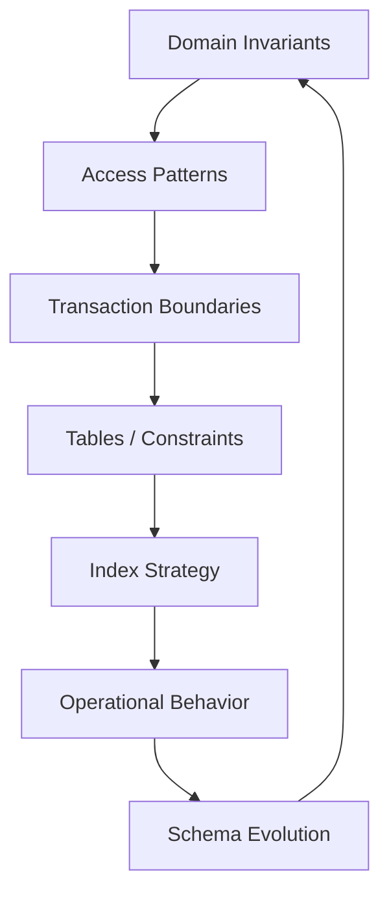
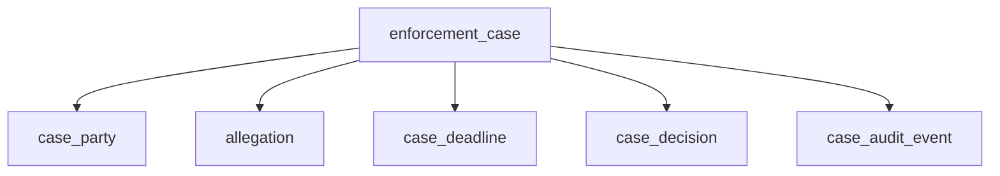
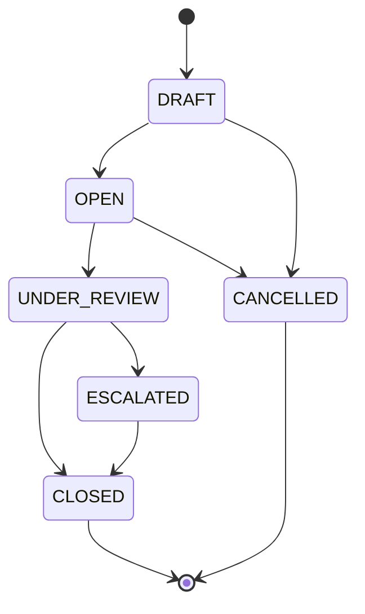
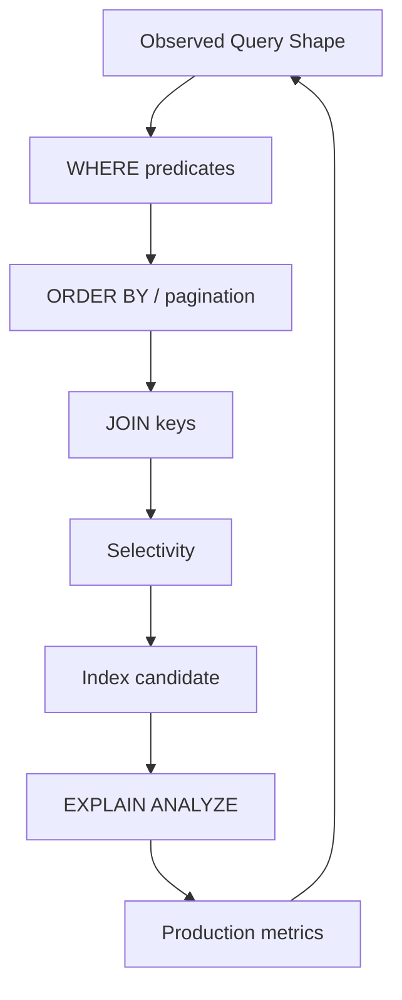
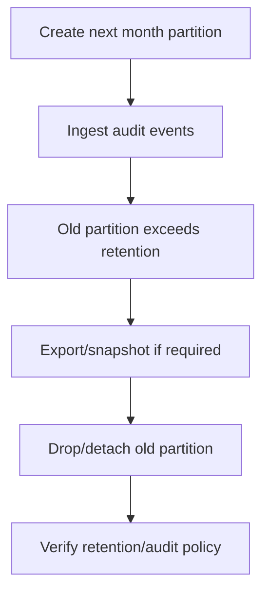
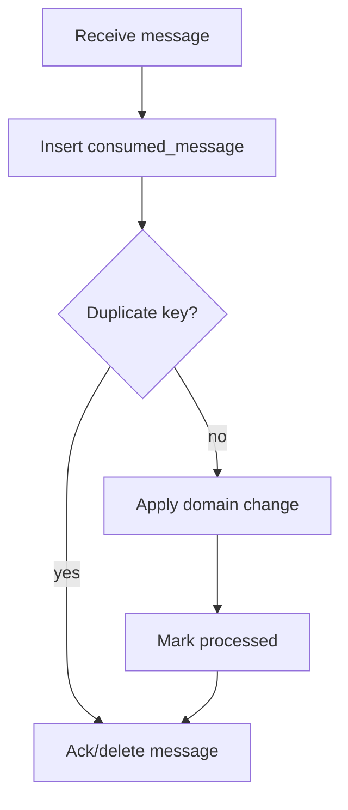
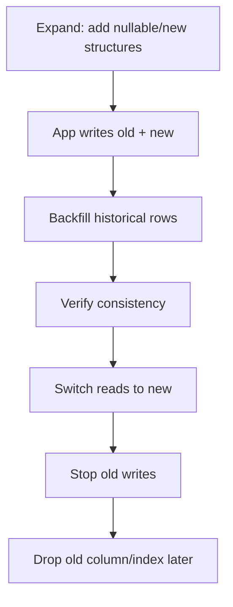

# Schema Design for Aurora PostgreSQL: Index, Constraint, Partition, JSONB

A good Aurora PostgreSQL schema is not a diagram of tables.

It is executable domain law.

It encodes:

- identity;
- ownership;
- relationships;
- allowed state transitions;
- uniqueness;
- immutability;
- auditability;
- concurrency expectations;
- query shape;
- retention;
- partition strategy;
- operational recovery;
- future migration paths.

The schema is the part of your system that does not care what your application code “intended”. It enforces what you actually declared.

A top-tier engineer treats schema design as a production safety system, not as an ORM side effect.

---

## 1. The Core Design Loop

Do not start by creating tables.

Start with the loop:



Every schema decision should answer:

1. What invariant does this protect?
2. Which query does this support?
3. What write amplification does this introduce?
4. What lock/concurrency behavior does this create?
5. How will we migrate it later?
6. How will we observe it in production?

If you cannot answer those questions, the schema is not designed. It merely exists.

---

## 2. Aurora PostgreSQL Is PostgreSQL-Compatible, Not PostgreSQL-Unbounded

Aurora PostgreSQL is PostgreSQL-compatible and managed by AWS, but it still follows PostgreSQL fundamentals:

- MVCC;
- transactions;
- locks;
- indexes;
- query planning;
- autovacuum;
- constraints;
- partitioning semantics;
- extensions supported by the managed environment;
- engine version compatibility;
- parameter group behavior;
- storage I/O consequences.

Aurora changes the managed infrastructure and storage architecture. It does not remove the need to understand PostgreSQL.

The most dangerous schema attitude:

> “Aurora scales, so schema design matters less.”

The better attitude:

> “Aurora gives us better managed infrastructure, so bad schema decisions can scale into expensive production incidents faster.”

---

## 3. Model Aggregates Before Tables

A relational schema is not only entity storage. It is a state consistency boundary.

For a regulatory enforcement platform, possible aggregates:

- `enforcement_case`;
- `case_party`;
- `allegation`;
- `evidence_item`;
- `case_deadline`;
- `case_decision`;
- `case_audit_event`;
- `notice_delivery`;
- `workflow_instance`.

But not every noun deserves an aggregate. Ask:

- What changes together?
- What must be valid atomically?
- What can be eventually consistent?
- What has independent lifecycle?
- What has legal/audit significance?
- What is append-only?
- What can be rebuilt?
- What must never be silently rewritten?

Example aggregate boundary:



This diagram does not mean every table must be updated in one transaction. It means the case aggregate owns the core case state and related consistency rules.

---

## 4. Table Design: Make State Explicit

Bad table design hides state in nullable columns and application conventions.

Bad:

```sql
CREATE TABLE enforcement_case (
    id uuid PRIMARY KEY,
    assigned_to uuid,
    closed_at timestamptz,
    approved_at timestamptz,
    rejected_at timestamptz,
    escalation_reason text,
    deleted_at timestamptz
);
```

What is the case status? Open? Closed? Approved? Rejected? Deleted? Escalated? Which combinations are legal?

Better:

```sql
CREATE TABLE enforcement_case (
    id                  uuid PRIMARY KEY,
    tenant_id           uuid NOT NULL,
    case_number         text NOT NULL,
    status              text NOT NULL,
    severity            text NOT NULL,
    assigned_to_user_id uuid,
    opened_at           timestamptz NOT NULL,
    closed_at           timestamptz,
    version             bigint NOT NULL DEFAULT 0,
    created_at          timestamptz NOT NULL DEFAULT now(),
    updated_at          timestamptz NOT NULL DEFAULT now(),

    CONSTRAINT enforcement_case_status_chk
      CHECK (status IN ('DRAFT', 'OPEN', 'UNDER_REVIEW', 'ESCALATED', 'CLOSED', 'CANCELLED')),

    CONSTRAINT enforcement_case_closed_at_chk
      CHECK (
        (status IN ('CLOSED', 'CANCELLED') AND closed_at IS NOT NULL)
        OR
        (status NOT IN ('CLOSED', 'CANCELLED') AND closed_at IS NULL)
      ),

    CONSTRAINT enforcement_case_case_number_uk
      UNIQUE (tenant_id, case_number)
);
```

The schema now communicates:

- tenant boundary;
- business identity;
- allowed status values;
- status/closed timestamp invariant;
- optimistic concurrency field;
- audit timestamps;
- uniqueness rule.

You can still enforce richer transitions in application code, but the database blocks impossible static combinations.

---

## 5. Constraints Are Production Guardrails

Constraints are not optional decoration.

They are database-enforced invariants.

Use:

- `NOT NULL` for required state;
- `CHECK` for local value/domain invariants;
- `UNIQUE` for identity and idempotency;
- `FOREIGN KEY` for relational integrity when the lifecycle is inside the same ownership boundary;
- exclusion constraints for advanced overlap prevention when appropriate;
- generated columns when derived state should be deterministic;
- row-level security only when you fully understand operational implications.

### 5.1 `NOT NULL`

A nullable column means one of three things:

1. value unknown;
2. value not applicable;
3. value not yet set.

Those are different states. Do not collapse them casually.

Bad:

```sql
resolution_reason text
```

Better:

```sql
resolution_reason text,
CONSTRAINT resolution_reason_required_when_closed_chk
CHECK (
  (status = 'CLOSED' AND resolution_reason IS NOT NULL)
  OR
  (status <> 'CLOSED')
)
```

### 5.2 `UNIQUE`

Uniqueness is a correctness primitive.

Use it for:

- business identifiers;
- idempotency keys;
- external reference IDs;
- one-active-item rules;
- natural keys inside tenant boundary;
- deduplication of event consumption.

Example idempotency:

```sql
CREATE TABLE api_command_request (
    tenant_id        uuid NOT NULL,
    idempotency_key text NOT NULL,
    request_hash    bytea NOT NULL,
    status          text NOT NULL,
    response_body   jsonb,
    created_at      timestamptz NOT NULL DEFAULT now(),
    PRIMARY KEY (tenant_id, idempotency_key)
);
```

This is not merely data storage. It is failover and retry safety.

### 5.3 Foreign Keys

Foreign keys are useful when they express ownership and lifecycle inside a boundary.

Example:

```sql
CREATE TABLE case_party (
    id         uuid PRIMARY KEY,
    tenant_id  uuid NOT NULL,
    case_id    uuid NOT NULL,
    party_type text NOT NULL,
    name       text NOT NULL,

    CONSTRAINT case_party_case_fk
      FOREIGN KEY (case_id)
      REFERENCES enforcement_case(id)
);
```

But foreign keys across service-owned schemas can create coupling. If another service owns `party`, do not casually create a cross-service FK into its table. Use reference IDs plus application-level validation or replicated reference projection.

Rule:

> Database constraints should strengthen aggregate boundaries, not accidentally merge service ownership boundaries.

---

## 6. State Transitions: Database and Application Cooperation

Some invariants fit in constraints. Some require transition logic.

Example allowed transitions:



You can enforce static validity with `CHECK`. But transition validity usually belongs in command handling logic with optimistic locking:

```sql
UPDATE enforcement_case
SET status = :new_status,
    version = version + 1,
    updated_at = now()
WHERE id = :case_id
  AND tenant_id = :tenant_id
  AND status = :expected_status
  AND version = :expected_version;
```

Then check row count:

```java
if (updatedRows == 0) {
    throw new ConcurrencyConflict("Case changed or transition no longer valid");
}
```

This pattern protects against two users making conflicting decisions simultaneously.

Do not use “last write wins” for business state transitions that carry legal or financial meaning.

---

## 7. Index Design: Every Index Is a Trade-Off

Indexes speed reads by making writes more expensive.

Each index has costs:

- additional storage;
- write amplification;
- vacuum/maintenance overhead;
- planner complexity;
- bloat risk;
- migration time;
- potential lock behavior during creation;
- memory/cache pressure.

The index design loop:



Do not create indexes because columns “look important”.

Create indexes because a known access pattern needs them.

---

## 8. B-Tree Indexes: Default, Not Automatic Magic

B-tree is the default PostgreSQL index method and fits many equality/range/order queries.

Example:

```sql
CREATE INDEX enforcement_case_tenant_status_updated_idx
ON enforcement_case (tenant_id, status, updated_at DESC);
```

Supports query shape:

```sql
SELECT id, case_number, status, updated_at
FROM enforcement_case
WHERE tenant_id = :tenant_id
  AND status = 'UNDER_REVIEW'
ORDER BY updated_at DESC
LIMIT 50;
```

Column order matters.

A practical rule:

- equality predicates first;
- then range/sort columns;
- include ordering direction if relevant;
- do not over-wide composite indexes without evidence;
- align index with pagination strategy;
- check actual query plans.

Bad index:

```sql
CREATE INDEX enforcement_case_status_idx ON enforcement_case (status);
```

In a multi-tenant system, this may be low-value because most queries also filter by tenant. Better:

```sql
CREATE INDEX enforcement_case_tenant_status_idx
ON enforcement_case (tenant_id, status);
```

Tenant ID is not just authorization metadata. It is often a physical access-path dimension.

---

## 9. Covering and Included Columns

PostgreSQL supports included columns for B-tree indexes.

Example:

```sql
CREATE INDEX enforcement_case_list_idx
ON enforcement_case (tenant_id, status, updated_at DESC)
INCLUDE (case_number, severity, assigned_to_user_id);
```

This can help index-only scans for list views.

But included columns increase index size.

Ask:

- Is the query hot enough?
- Is the table large enough?
- Are included columns stable or frequently updated?
- Does index-only scan actually happen?
- What is the storage/write cost?

Do not include half the table “just in case”.

---

## 10. Partial Indexes

A partial index indexes only rows matching a predicate.

This is useful when queries repeatedly target a subset.

Example:

```sql
CREATE INDEX enforcement_case_open_escalated_idx
ON enforcement_case (tenant_id, updated_at DESC)
WHERE status IN ('OPEN', 'UNDER_REVIEW', 'ESCALATED');
```

Useful for:

- active records;
- non-deleted rows;
- pending jobs;
- failed outbox events;
- open cases;
- incomplete tasks;
- sparse flags.

Example outbox:

```sql
CREATE INDEX outbox_pending_idx
ON outbox_event (created_at)
WHERE status = 'PENDING';
```

This is much better than indexing all outbox rows if the publisher only scans pending events.

But partial indexes require query predicates to match in ways the planner can use. If application queries are inconsistent, the index may not help.

---

## 11. Expression Indexes

Expression indexes support queries over computed expressions.

Example case-insensitive lookup:

```sql
CREATE INDEX party_email_lower_idx
ON case_party (tenant_id, lower(email));
```

Query:

```sql
SELECT *
FROM case_party
WHERE tenant_id = :tenant_id
  AND lower(email) = lower(:email);
```

But expression indexes make writes more expensive and can hide data modeling issues.

For frequently queried normalized fields, consider storing canonical value explicitly:

```sql
email_original text NOT NULL,
email_normalized text NOT NULL,
UNIQUE (tenant_id, email_normalized)
```

The explicit column can be clearer, easier to validate, and easier to reason about in application code.

---

## 12. JSONB: Useful Tool, Dangerous Escape Hatch

JSONB is powerful. It is also a common way to avoid schema design.

Good uses:

- external payload snapshots;
- sparse metadata;
- evolving attributes that are not core invariants;
- event payload storage;
- audit snapshots;
- integration-specific details;
- feature flags with limited query needs.

Bad uses:

- core domain state;
- fields requiring strong constraints;
- high-cardinality frequently updated attributes;
- relational relationships;
- authorization-critical values;
- fields that need complex reporting;
- hiding schema disagreement between teams.

Rule:

> Put domain invariants in columns. Put flexible non-authoritative metadata in JSONB.

Example balanced design:

```sql
CREATE TABLE evidence_item (
    id              uuid PRIMARY KEY,
    tenant_id       uuid NOT NULL,
    case_id         uuid NOT NULL REFERENCES enforcement_case(id),
    evidence_type   text NOT NULL,
    storage_uri     text NOT NULL,
    sha256_digest   text NOT NULL,
    received_at     timestamptz NOT NULL,
    metadata        jsonb NOT NULL DEFAULT '{}'::jsonb,

    CONSTRAINT evidence_type_chk
      CHECK (evidence_type IN ('DOCUMENT', 'IMAGE', 'AUDIO', 'VIDEO', 'OTHER')),

    CONSTRAINT evidence_digest_uk
      UNIQUE (tenant_id, sha256_digest)
);
```

Core fields are relational columns. Flexible details live in `metadata`.

---

## 13. JSONB Indexing

PostgreSQL supports GIN indexes for composite values such as JSONB.

Example containment query:

```sql
CREATE INDEX evidence_metadata_gin_idx
ON evidence_item USING gin (metadata);
```

Query:

```sql
SELECT id
FROM evidence_item
WHERE metadata @> '{"source":"portal"}'::jsonb;
```

But GIN is not a universal JSONB speed button.

For specific key equality, an expression index can be better:

```sql
CREATE INDEX evidence_metadata_source_idx
ON evidence_item (tenant_id, (metadata->>'source'));
```

Query:

```sql
SELECT id
FROM evidence_item
WHERE tenant_id = :tenant_id
  AND metadata->>'source' = 'portal';
```

For sparse key:

```sql
CREATE INDEX evidence_metadata_camera_model_idx
ON evidence_item ((metadata->>'cameraModel'))
WHERE metadata ? 'cameraModel';
```

Decision table:

| Query shape | Candidate index |
|---|---|
| containment `@>` over varied keys | GIN on JSONB column |
| equality on one known key | expression B-tree index |
| key exists query | GIN or partial expression depending shape |
| range comparison on numeric JSON field | generated column or expression index with cast |
| frequent reporting on JSON field | promote field to typed column |

If a JSONB field becomes important enough to index heavily, ask whether it should be a real column.

---

## 14. Generated Columns for JSONB Extraction

Generated columns can make semi-structured ingestion safer.

Example:

```sql
CREATE TABLE inbound_document_event (
    id              uuid PRIMARY KEY,
    tenant_id       uuid NOT NULL,
    payload         jsonb NOT NULL,
    event_type      text GENERATED ALWAYS AS (payload->>'eventType') STORED,
    external_id     text GENERATED ALWAYS AS (payload->>'externalId') STORED,
    received_at     timestamptz NOT NULL DEFAULT now(),

    CONSTRAINT inbound_document_event_external_uk
      UNIQUE (tenant_id, external_id)
);
```

Benefits:

- typed access path;
- normal indexes;
- easier constraints;
- less repeated expression logic;
- better query readability.

But generated columns also tie table design to payload shape. Use when the extracted field is stable enough.

---

## 15. Partitioning: Scale Tool, Not First Reflex

Partitioning divides a large logical table into smaller physical partitions.

Use partitioning when you have:

- large tables with lifecycle/retention by time;
- queries that filter on partition key;
- maintenance operations by partition;
- archival/delete requirements;
- hot/cold data separation;
- table/index bloat pressure;
- predictable range/list partition boundaries.

Do not partition because “large system”.

Partitioning adds complexity:

- partition management;
- constraints and unique key limitations;
- query planner considerations;
- migration complexity;
- application assumptions;
- index management on partitions;
- operational tooling.

Good candidate:

- append-only audit events partitioned by month.

Poor candidate:

- small reference table partitioned for aesthetics.

---

## 16. Time-Partitioned Audit Events

Audit/event tables are often good partition candidates.

Example:

```sql
CREATE TABLE case_audit_event (
    id              uuid NOT NULL,
    tenant_id       uuid NOT NULL,
    case_id         uuid NOT NULL,
    event_type      text NOT NULL,
    actor_user_id   uuid,
    occurred_at     timestamptz NOT NULL,
    payload         jsonb NOT NULL,
    PRIMARY KEY (tenant_id, occurred_at, id)
) PARTITION BY RANGE (occurred_at);
```

Example partition:

```sql
CREATE TABLE case_audit_event_2026_07
PARTITION OF case_audit_event
FOR VALUES FROM ('2026-07-01') TO ('2026-08-01');
```

Index for case history:

```sql
CREATE INDEX case_audit_event_2026_07_case_idx
ON case_audit_event_2026_07 (tenant_id, case_id, occurred_at DESC);
```

Important PostgreSQL limitation:

> Unique or primary key constraints on a partitioned table must include all partition key columns.

That is why the primary key above includes `occurred_at`.

If your business requires global uniqueness by `id` alone, you need another strategy:

- use globally unique UUIDs and accept database does not enforce global uniqueness across partitions by id alone;
- include partition key in primary key;
- keep a separate identity table;
- avoid partitioning that table;
- use application/inbox uniqueness elsewhere.

Partitioning is powerful, but it changes constraint design.

---

## 17. Partitioning and Retention

For large audit/event tables, partition retention can be operationally cleaner than row-by-row delete.

Example retention flow:



But retention is not only technical.

For regulated domains:

- legal hold can override retention;
- audit data may require WORM-like controls elsewhere;
- deletion must be logged;
- retention policy must be approved;
- restore process must preserve evidence chain.

A schema can help, but governance owns the rule.

---

## 18. Multi-Tenancy Schema Design

For many SaaS-style AWS systems, `tenant_id` is a first-class schema dimension.

Common options:

1. shared database, shared schema, tenant column;
2. shared database, schema per tenant;
3. database/cluster per tenant;
4. hybrid based on tenant tier/regulatory boundary.

This part focuses on shared schema with `tenant_id`.

Rules:

- include `tenant_id` in business unique constraints;
- include `tenant_id` in hot query indexes;
- include `tenant_id` in idempotency keys;
- include `tenant_id` in audit events;
- include `tenant_id` in outbox events;
- enforce tenant boundary in application and, if justified, with RLS;
- never rely only on UI filtering.

Example:

```sql
CREATE UNIQUE INDEX enforcement_case_tenant_case_number_uk
ON enforcement_case (tenant_id, case_number);

CREATE INDEX enforcement_case_tenant_status_updated_idx
ON enforcement_case (tenant_id, status, updated_at DESC);
```

Bad:

```sql
CREATE UNIQUE INDEX enforcement_case_case_number_uk
ON enforcement_case (case_number);
```

Unless case numbers are globally unique by domain law, this creates unnecessary coupling across tenants.

---

## 19. Optimistic Concurrency

For command-heavy systems, optimistic locking is often better than broad pessimistic locking.

Schema:

```sql
ALTER TABLE enforcement_case
ADD COLUMN version bigint NOT NULL DEFAULT 0;
```

Update:

```sql
UPDATE enforcement_case
SET status = 'ESCALATED',
    version = version + 1,
    updated_at = now()
WHERE id = :id
  AND tenant_id = :tenant_id
  AND version = :expected_version;
```

If zero rows updated, the command lost a race.

Application behavior:

- reload current state;
- decide whether command is still valid;
- return `409 Conflict` to user;
- or retry automatically only if operation is semantically safe.

Do not hide concurrency conflicts under generic retry.

A conflict is often a business fact, not an infrastructure fault.

---

## 20. Pessimistic Locking

Sometimes you need row locks.

Example worker claiming jobs:

```sql
WITH next_jobs AS (
    SELECT id
    FROM case_recalculation_job
    WHERE status = 'PENDING'
    ORDER BY created_at
    FOR UPDATE SKIP LOCKED
    LIMIT 10
)
UPDATE case_recalculation_job j
SET status = 'RUNNING',
    started_at = now()
FROM next_jobs
WHERE j.id = next_jobs.id
RETURNING j.*;
```

`SKIP LOCKED` can be useful for queue-like tables.

But beware:

- it can hide starvation;
- it can complicate fairness;
- it can create stuck RUNNING rows if worker dies;
- you need lease expiry/reaper logic;
- SQS may be a better queue when you need distributed queue semantics.

Use database queues only when relational proximity is worth the trade-off.

---

## 21. Outbox Schema Design

The outbox table is a schema-level integration primitive.

```sql
CREATE TABLE outbox_event (
    id                uuid PRIMARY KEY,
    tenant_id         uuid NOT NULL,
    aggregate_type    text NOT NULL,
    aggregate_id      uuid NOT NULL,
    event_type        text NOT NULL,
    event_version     integer NOT NULL,
    payload           jsonb NOT NULL,
    status            text NOT NULL DEFAULT 'PENDING',
    publish_attempts  integer NOT NULL DEFAULT 0,
    next_attempt_at   timestamptz NOT NULL DEFAULT now(),
    created_at        timestamptz NOT NULL DEFAULT now(),
    published_at      timestamptz,

    CONSTRAINT outbox_status_chk
      CHECK (status IN ('PENDING', 'PUBLISHING', 'PUBLISHED', 'FAILED'))
);
```

Indexes:

```sql
CREATE INDEX outbox_pending_due_idx
ON outbox_event (next_attempt_at, created_at)
WHERE status IN ('PENDING', 'FAILED');

CREATE INDEX outbox_aggregate_idx
ON outbox_event (tenant_id, aggregate_type, aggregate_id, created_at);
```

Publisher claim:

```sql
WITH due AS (
    SELECT id
    FROM outbox_event
    WHERE status IN ('PENDING', 'FAILED')
      AND next_attempt_at <= now()
    ORDER BY created_at
    FOR UPDATE SKIP LOCKED
    LIMIT 100
)
UPDATE outbox_event e
SET status = 'PUBLISHING',
    publish_attempts = publish_attempts + 1
FROM due
WHERE e.id = due.id
RETURNING e.*;
```

Outbox design choices:

- keep published rows for replay/audit or archive them?
- partition by `created_at`?
- store full event payload or payload reference?
- use EventBridge event ID mapping?
- how to handle poison event?
- how to preserve ordering per aggregate?
- how to re-publish safely?

The table is simple. The semantics are not.

---

## 22. Inbox / Dedup Schema Design

For consumers writing into Aurora, use an inbox table.

```sql
CREATE TABLE consumed_message (
    consumer_name text NOT NULL,
    message_id    text NOT NULL,
    tenant_id     uuid,
    first_seen_at timestamptz NOT NULL DEFAULT now(),
    processed_at  timestamptz,
    status        text NOT NULL,
    PRIMARY KEY (consumer_name, message_id)
);
```

Processing flow:



The inbox table turns at-least-once delivery into effectively-once business effects.

It also helps during replay.

---

## 23. Audit Schema Design

Audit tables are not just logs.

They should support evidence reconstruction.

Example:

```sql
CREATE TABLE case_audit_event (
    id              uuid NOT NULL,
    tenant_id       uuid NOT NULL,
    case_id         uuid NOT NULL,
    event_type      text NOT NULL,
    actor_type      text NOT NULL,
    actor_id        text,
    occurred_at     timestamptz NOT NULL,
    command_id      uuid,
    correlation_id  text,
    causation_id    text,
    before_snapshot jsonb,
    after_snapshot  jsonb,
    metadata        jsonb NOT NULL DEFAULT '{}'::jsonb,
    PRIMARY KEY (tenant_id, occurred_at, id)
) PARTITION BY RANGE (occurred_at);
```

Audit design decisions:

- before/after snapshot or event-only?
- actor identity source?
- immutable insert-only table?
- legal hold handling?
- partition retention?
- tamper detection?
- link to API command idempotency?
- link to workflow execution?
- link to external notice delivery?

For regulated systems, audit rows should answer:

> Who did what, when, why, based on which state, through which command, resulting in which state, and what downstream action followed?

---

## 24. Soft Delete vs Hard Delete

Soft delete is not always correct. Hard delete is not always safe.

Use soft delete when:

- recovery is required;
- audit trail matters;
- user-visible restore is needed;
- legal process requires traceability;
- downstream projections need tombstone event.

Use hard delete when:

- legal/privacy requirement mandates deletion;
- data is derived and rebuildable;
- retention expired and no hold exists;
- storage cost and table bloat matter.

Soft delete schema:

```sql
ALTER TABLE enforcement_case
ADD COLUMN deleted_at timestamptz,
ADD COLUMN deleted_by text;

CREATE INDEX enforcement_case_active_idx
ON enforcement_case (tenant_id, status, updated_at DESC)
WHERE deleted_at IS NULL;
```

Soft delete anti-pattern:

- every query forgets `deleted_at IS NULL`;
- unique constraints still block reuse when domain allows reuse;
- deleted rows remain forever and bloat indexes;
- no retention cleanup exists;
- audit and delete semantics are mixed.

Sometimes a separate lifecycle state is clearer than generic soft delete.

---

## 25. Pagination: Offset Is Often a Trap

Offset pagination becomes expensive at scale.

Bad for deep pages:

```sql
SELECT id, case_number, updated_at
FROM enforcement_case
WHERE tenant_id = :tenant_id
ORDER BY updated_at DESC
OFFSET 100000
LIMIT 50;
```

Better keyset pagination:

```sql
SELECT id, case_number, updated_at
FROM enforcement_case
WHERE tenant_id = :tenant_id
  AND (updated_at, id) < (:last_updated_at, :last_id)
ORDER BY updated_at DESC, id DESC
LIMIT 50;
```

Index:

```sql
CREATE INDEX enforcement_case_keyset_idx
ON enforcement_case (tenant_id, updated_at DESC, id DESC);
```

Keyset pagination requires stable ordering. Add a tie-breaker like `id`.

API contract should expose opaque cursor, not raw SQL details.

---

## 26. Time and Identity

Use time carefully.

Recommendations:

- use `timestamptz`, not local timestamp, for event time;
- distinguish `occurred_at` from `recorded_at`/`created_at`;
- do not use database time and application time interchangeably without intent;
- use monotonic version for concurrency;
- use UUID/ULID/sequence based on domain and index locality trade-off;
- do not use wall-clock timestamp as sole ordering authority for legal decisions.

Example:

```sql
occurred_at timestamptz NOT NULL, -- when domain event happened
recorded_at timestamptz NOT NULL DEFAULT now(), -- when system recorded it
```

For distributed workflows, also store:

- `command_id`;
- `correlation_id`;
- `causation_id`;
- `workflow_execution_arn` where relevant;
- external provider reference.

Traceability is schema design.

---

## 27. Naming Conventions

Boring conventions reduce cognitive load.

Use consistent suffixes:

- `_id` for identifiers;
- `_at` for timestamps;
- `_by` for actor references;
- `_status` or `status` for lifecycle;
- `_type` for classification;
- `_json` rarely; prefer meaningful name;
- `created_at`, `updated_at` standard columns;
- `version` for optimistic locking.

Constraint names:

```sql
CONSTRAINT enforcement_case_status_chk CHECK (...)
CONSTRAINT enforcement_case_tenant_case_number_uk UNIQUE (...)
CONSTRAINT case_party_case_fk FOREIGN KEY (...)
```

Index names:

```sql
enforcement_case_tenant_status_updated_idx
outbox_pending_due_idx
case_audit_event_case_occurred_idx
```

Good names make incident debugging faster.

---

## 28. Zero-Downtime Schema Change

Never assume schema change is safe because the DDL ran locally.

Use expand/migrate/contract:



Example: replacing `assigned_to` with `assigned_to_user_id`.

1. Add new nullable column.
2. Deploy app writing both columns.
3. Backfill new column in batches.
4. Add constraint `NOT VALID` where applicable.
5. Validate constraint.
6. Switch reads.
7. Stop old writes.
8. Drop old column in a later release.

Do not combine all steps into one migration.

---

## 29. Migration Safety: Locks and Timeouts

DDL can block production.

Use defensive settings in migration sessions:

```sql
SET lock_timeout = '2s';
SET statement_timeout = '5min';
```

For index creation on live tables, consider concurrent index creation where appropriate:

```sql
CREATE INDEX CONCURRENTLY enforcement_case_tenant_status_updated_idx
ON enforcement_case (tenant_id, status, updated_at DESC);
```

Caveats:

- `CREATE INDEX CONCURRENTLY` cannot run inside a normal transaction block;
- it takes longer;
- it still consumes resources;
- failed concurrent indexes may leave invalid index artifacts;
- it needs operational monitoring.

Migration pipeline should include:

- pre-checks;
- expected lock behavior;
- rollback or forward-fix plan;
- batch backfill strategy;
- production runtime estimate;
- dashboard during migration;
- abort criteria.

---

## 30. Backfill Design

Backfills are production workloads.

Bad:

```sql
UPDATE enforcement_case
SET normalized_case_number = lower(case_number);
```

On a large table, this can create massive write load, locks, WAL, replication pressure, and vacuum work.

Better batch shape:

```sql
UPDATE enforcement_case
SET normalized_case_number = lower(case_number)
WHERE id IN (
    SELECT id
    FROM enforcement_case
    WHERE normalized_case_number IS NULL
    ORDER BY id
    LIMIT 1000
);
```

Operational controls:

- batch size;
- sleep/jitter between batches;
- statement timeout;
- max runtime window;
- progress table;
- idempotent batch logic;
- stop/resume behavior;
- metrics;
- lock wait observation;
- rollback plan.

Backfill correctness:

- Does app write new rows correctly while backfill runs?
- Are updated rows reprocessed safely?
- Is there a verification query?
- Can backfill be rerun?
- What if deployment rolls back?

---

## 31. Schema and Query Observability

Schema decisions must be observable.

Track:

- slow queries;
- top queries by total time;
- top queries by calls;
- top queries by read I/O;
- lock waits;
- deadlocks;
- temporary file creation;
- sequential scans on large tables;
- index hit ratio;
- table/index bloat;
- autovacuum activity;
- row count growth;
- partition count;
- failed constraints;
- migration runtime;
- connection pool wait.

A schema without observability is a guess.

---

## 32. Performance Review with `EXPLAIN`

Every critical query should have a known plan.

Example:

```sql
EXPLAIN (ANALYZE, BUFFERS)
SELECT id, case_number, status, updated_at
FROM enforcement_case
WHERE tenant_id = '00000000-0000-0000-0000-000000000001'
  AND status = 'UNDER_REVIEW'
ORDER BY updated_at DESC
LIMIT 50;
```

Review:

- index scan or seq scan?
- rows estimated vs actual?
- buffers hit vs read?
- sort method?
- temp files?
- loop count?
- join method?
- planning time?
- execution time?

The optimizer is not wrong because you dislike the plan. It is responding to schema, statistics, parameters, and query shape.

Fix causes, not symptoms.

---

## 33. Common Schema Anti-Patterns

### 33.1 Generic Entity-Attribute-Value for Core Domain

Bad:

```sql
CREATE TABLE entity_attribute (
    entity_id uuid,
    key text,
    value text
);
```

This avoids schema design and destroys constraints, type safety, query clarity, and performance.

Use only for truly dynamic extension data, not core state.

### 33.2 JSONB for Everything

This turns PostgreSQL into a slower document store with fewer guardrails.

### 33.3 Missing Tenant ID in Indexes

Multi-tenant systems often filter by tenant. Indexes should reflect that.

### 33.4 Boolean State Explosion

Bad:

```sql
is_open boolean,
is_closed boolean,
is_escalated boolean,
is_cancelled boolean
```

Use explicit state machine/status.

### 33.5 No Idempotency Tables

Retry safety cannot be retrofitted cheaply after incidents.

### 33.6 Nullable Foreign Keys Everywhere

This usually indicates unclear lifecycle.

### 33.7 Unbounded Text Search in OLTP Table

Use proper indexes, generated columns, or search projection.

### 33.8 No Archive/Retention Strategy

Tables grow forever, then every migration becomes scary.

---

## 34. Production Schema Review Template

Use this before approving a schema change.

```md
# Schema Review

## Change Summary
- Tables changed:
- Columns added/removed:
- Indexes added/removed:
- Constraints added/removed:

## Domain Invariant
- What business rule is protected?
- Is it enforced in DB, app, or both?

## Access Pattern
- Which queries depend on this?
- Expected cardinality:
- Expected selectivity:
- Expected frequency:

## Transaction Boundary
- Which command writes this data?
- Does it require idempotency?
- Does it require optimistic locking?

## Migration Plan
- Expand/migrate/contract steps:
- Backfill required:
- Lock risk:
- Rollback/forward-fix:

## Index Cost
- Write amplification:
- Storage growth:
- Bloat risk:
- Query plan evidence:

## Operations
- Metrics:
- Alarms:
- Runbook changes:

## Compliance/Audit
- Retention:
- Legal hold:
- PII/security classification:
```

The goal is not bureaucracy. The goal is to make invisible database risk reviewable.

---

## 35. End-to-End Example: Case Escalation Schema

Tables:

```sql
CREATE TABLE enforcement_case (
    id              uuid PRIMARY KEY,
    tenant_id       uuid NOT NULL,
    case_number     text NOT NULL,
    status          text NOT NULL,
    severity        text NOT NULL,
    assigned_to     uuid,
    version         bigint NOT NULL DEFAULT 0,
    opened_at       timestamptz NOT NULL,
    closed_at       timestamptz,
    created_at      timestamptz NOT NULL DEFAULT now(),
    updated_at      timestamptz NOT NULL DEFAULT now(),

    CONSTRAINT enforcement_case_tenant_case_number_uk
      UNIQUE (tenant_id, case_number),

    CONSTRAINT enforcement_case_status_chk
      CHECK (status IN ('DRAFT', 'OPEN', 'UNDER_REVIEW', 'ESCALATED', 'CLOSED', 'CANCELLED'))
);

CREATE TABLE case_escalation (
    id              uuid PRIMARY KEY,
    tenant_id       uuid NOT NULL,
    case_id         uuid NOT NULL REFERENCES enforcement_case(id),
    reason          text NOT NULL,
    escalated_by    uuid NOT NULL,
    escalated_at    timestamptz NOT NULL DEFAULT now(),
    command_id      uuid NOT NULL,

    CONSTRAINT case_escalation_command_uk
      UNIQUE (tenant_id, command_id)
);

CREATE TABLE outbox_event (
    id              uuid PRIMARY KEY,
    tenant_id       uuid NOT NULL,
    aggregate_type  text NOT NULL,
    aggregate_id    uuid NOT NULL,
    event_type      text NOT NULL,
    event_version   integer NOT NULL,
    payload         jsonb NOT NULL,
    status          text NOT NULL DEFAULT 'PENDING',
    created_at      timestamptz NOT NULL DEFAULT now(),
    published_at    timestamptz
);
```

Command transaction:

```sql
BEGIN;

UPDATE enforcement_case
SET status = 'ESCALATED',
    severity = GREATEST(severity, 'HIGH'), -- illustrative only; use real severity model
    version = version + 1,
    updated_at = now()
WHERE id = :case_id
  AND tenant_id = :tenant_id
  AND status IN ('OPEN', 'UNDER_REVIEW')
  AND version = :expected_version;

-- application checks row count == 1

INSERT INTO case_escalation (
    id, tenant_id, case_id, reason, escalated_by, command_id
) VALUES (
    :escalation_id, :tenant_id, :case_id, :reason, :user_id, :command_id
);

INSERT INTO outbox_event (
    id, tenant_id, aggregate_type, aggregate_id, event_type, event_version, payload
) VALUES (
    :event_id,
    :tenant_id,
    'EnforcementCase',
    :case_id,
    'CaseEscalated',
    1,
    jsonb_build_object(
      'caseId', :case_id,
      'reason', :reason,
      'escalatedBy', :user_id,
      'commandId', :command_id
    )
);

COMMIT;
```

Important: the `GREATEST(severity, 'HIGH')` line is only illustrative and not a good real severity implementation if severity is text. In production, use a numeric severity rank or controlled transition logic.

This example shows the shape:

- state transition guarded by current state and version;
- escalation record inserted;
- duplicate command protected;
- outbox event written transactionally;
- event publication decoupled.

---

## 36. Final Checklist

A production-grade Aurora PostgreSQL schema should answer yes to most of these:

- Are core domain invariants represented as constraints where possible?
- Are state transitions protected by optimistic locking or equivalent?
- Are idempotency keys stored with uniqueness?
- Are outbox/inbox tables designed for retry and replay?
- Are JSONB fields limited to appropriate flexible data?
- Are JSONB queries indexed intentionally?
- Are tenant boundaries reflected in keys and indexes?
- Are hot queries backed by observed query plans?
- Are indexes justified by access patterns?
- Are write amplification and bloat considered?
- Is partitioning used only where operationally justified?
- Are partition constraints and unique key limitations understood?
- Are schema changes deployed through expand/migrate/contract?
- Are backfills resumable and observable?
- Are audit and retention requirements encoded deliberately?
- Are slow queries, locks, deadlocks, and bloat observable?
- Is the schema understandable without reading all application code?

---

## 37. Key Takeaways

- Aurora PostgreSQL schema design is production safety engineering.
- Constraints are executable invariants, not decoration.
- Indexes are read optimizations paid for by writes and operations.
- JSONB is valuable for flexible metadata but dangerous for core domain state.
- Partitioning is an operational tool; it changes constraints, migrations, and maintenance.
- Multi-tenant schema design must include tenant-aware keys and indexes.
- Optimistic concurrency is essential for business state transitions.
- Outbox and inbox tables are database-level integration patterns.
- Zero-downtime schema change requires expand/migrate/contract, not heroic DDL.
- Top-tier schema design makes correctness visible, enforceable, and evolvable.

---

## References

- AWS Documentation: Working with Amazon Aurora PostgreSQL — https://docs.aws.amazon.com/AmazonRDS/latest/AuroraUserGuide/Aurora.AuroraPostgreSQL.html
- AWS Documentation: Best practices with Amazon Aurora PostgreSQL — https://docs.aws.amazon.com/AmazonRDS/latest/AuroraUserGuide/AuroraPostgreSQL.BestPractices.html
- AWS Documentation: Performance and scaling for Amazon Aurora PostgreSQL — https://docs.aws.amazon.com/AmazonRDS/latest/AuroraUserGuide/AuroraPostgreSQL.Managing.html
- AWS Documentation: Managing PostgreSQL partitions with pg_partman — https://docs.aws.amazon.com/AmazonRDS/latest/AuroraUserGuide/PostgreSQL_Partitions.html
- PostgreSQL Documentation: CREATE INDEX — https://www.postgresql.org/docs/current/sql-createindex.html
- PostgreSQL Documentation: Partial Indexes — https://www.postgresql.org/docs/current/indexes-partial.html
- PostgreSQL Documentation: Table Partitioning — https://www.postgresql.org/docs/current/ddl-partitioning.html
- PostgreSQL Documentation: GIN Indexes — https://www.postgresql.org/docs/current/gin.html
- AWS Database Blog: Index types supported in Amazon Aurora PostgreSQL and Amazon RDS for PostgreSQL — https://aws.amazon.com/blogs/database/index-types-supported-in-amazon-aurora-postgresql-and-amazon-rds-for-postgresql-gin-gist-hash-brin/
