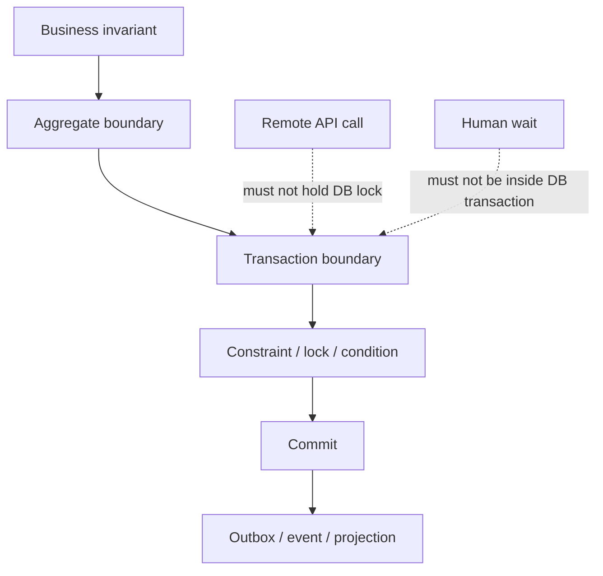
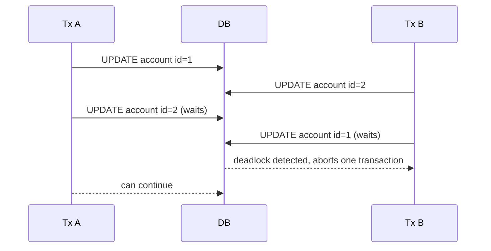
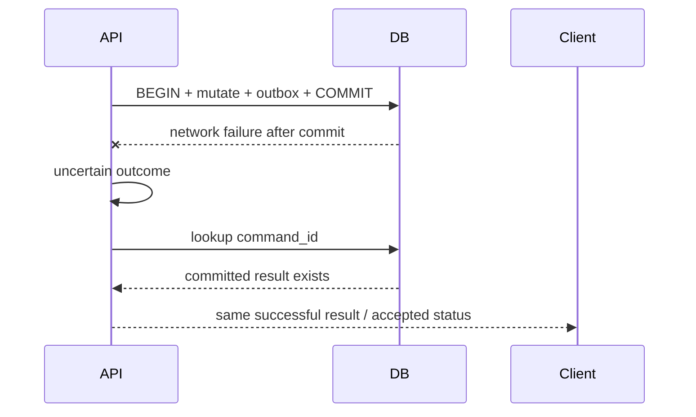
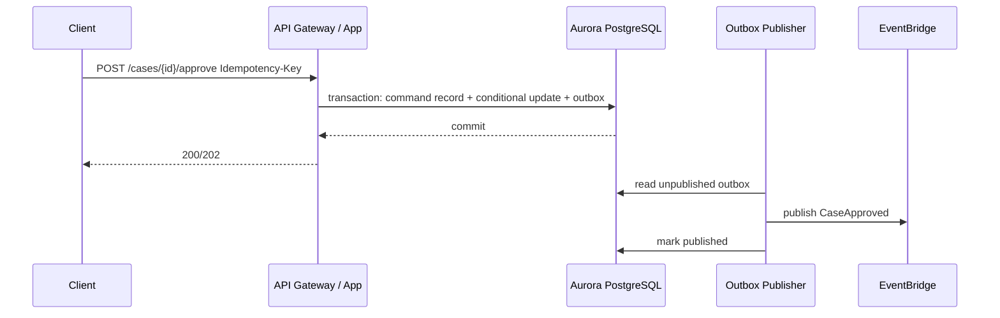

# Part 061 — Transaction Isolation, Locking, Deadlock, MVCC, and Retry Strategy

> Target pembelajaran: setelah membaca bagian ini, kamu tidak hanya tahu `READ COMMITTED`, `SELECT FOR UPDATE`, atau `deadlock detected`. Kamu harus bisa mendesain transaction boundary yang mempertahankan invariant bisnis, menghindari contention yang tidak perlu, dan membangun retry strategy yang aman untuk production.

Relational database bukan sekadar tempat menyimpan row. Dalam sistem application + database, database sering menjadi **consistency engine**: tempat uniqueness ditegakkan, state transition divalidasi, concurrent write diserialisasi, dan audit trail dipertahankan. Masalah muncul ketika application memperlakukan transaction seperti detail teknis kecil, bukan sebagai **runtime protocol**.

Kesalahan umum:

- memakai transaction terlalu besar sampai lock ditahan lama;
- memakai transaction terlalu kecil sampai invariant bocor;
- retry statement individual tanpa memahami apakah transaction sudah commit;
- menganggap higher isolation selalu lebih benar;
- menganggap MVCC berarti tidak ada lock;
- menganggap deadlock adalah bug database, padahal sering kali bug ordering di application;
- menggabungkan remote call, user approval, payment gateway, dan database lock dalam satu transaction boundary.

Part ini fokus pada Aurora PostgreSQL/RDS PostgreSQL sebagai primary lens. Banyak konsep berlaku ke MySQL, SQL Server, Oracle, dan Db2, tetapi detail isolation, lock, error code, dan retry behavior berbeda per engine.

---

## 1. Mental Model: Transaction Adalah Boundary Invariant

Transaction bukan “bungkus beberapa query supaya atomic”. Transaction adalah deklarasi:

> “Selama blok ini berjalan, invariant berikut harus terlihat benar ketika commit berhasil.”

Contoh invariant:

- satu case enforcement hanya boleh punya satu active escalation;
- nomor perkara harus unik per regulator + tahun;
- status tidak boleh lompat dari `DRAFT` ke `CLOSED` tanpa `APPROVED`;
- account balance tidak boleh negatif;
- task hanya boleh diklaim oleh satu officer;
- setiap domain event harus merepresentasikan state yang benar-benar sudah commit.

Kalau invariant-nya tidak kamu tulis, kamu cenderung memilih isolation dan locking secara reaktif.



Rule praktis:

> Satu transaction sebaiknya cukup besar untuk menjaga invariant, tetapi cukup kecil agar tidak membawa network wait, human wait, atau side effect eksternal.

---

## 2. Empat Hal yang Sering Tertukar

| Konsep | Pertanyaan yang dijawab | Contoh |
|---|---|---|
| Atomicity | Apakah semua perubahan dalam transaction commit/rollback bersama? | insert `case`, insert `audit_log`, insert `outbox` |
| Isolation | Apa yang boleh dilihat/dipengaruhi transaksi concurrent? | `READ COMMITTED`, `REPEATABLE READ`, `SERIALIZABLE` |
| Locking | Resource apa yang sedang dicegah dari modifikasi concurrent? | row lock, table lock, advisory lock |
| Constraint | Invariant apa yang ditegakkan database tanpa percaya application? | unique key, foreign key, check constraint |

Top 1% engineer tidak memilih salah satu secara dogmatis. Mereka menggabungkan:

- constraint untuk invariant statis;
- conditional update untuk optimistic concurrency;
- row lock untuk resource claim/reservation;
- isolation level untuk snapshot/serialization requirement;
- retry strategy untuk konflik yang memang normal pada high concurrency.

---

## 3. PostgreSQL Isolation Level: Apa yang Benar-Benar Terjadi

PostgreSQL mendukung syntax empat isolation level SQL standard, tetapi secara internal hanya tiga behavior berbeda. `READ UNCOMMITTED` berperilaku seperti `READ COMMITTED` karena MVCC PostgreSQL tidak mengekspos dirty read.

| Isolation | Dirty read | Non-repeatable read | Phantom read | Serialization anomaly | Mental model |
|---|---:|---:|---:|---:|---|
| Read Uncommitted | Tidak terjadi di PostgreSQL | Mungkin | Mungkin | Mungkin | Sama seperti Read Committed |
| Read Committed | Tidak | Mungkin | Mungkin | Mungkin | Snapshot per statement |
| Repeatable Read | Tidak | Tidak | Tidak di PostgreSQL | Mungkin | Snapshot per transaction |
| Serializable | Tidak | Tidak | Tidak | Tidak | PostgreSQL mencegah anomaly via SSI dan dapat abort transaction |

### 3.1 Read Committed

Default PostgreSQL.

Setiap statement melihat snapshot baru dari data yang sudah committed sebelum statement dimulai. Dalam satu transaction, query kedua bisa melihat perubahan yang query pertama belum lihat.

Cocok untuk:

- command sederhana dengan primary key update;
- optimistic concurrency via `version`;
- insert dengan unique constraint;
- request/response API yang tidak membutuhkan stable multi-query snapshot;
- sebagian besar OLTP ketika invariant dijaga constraint/conditional update.

Bahaya:

- read-check-write yang tidak dilindungi constraint bisa race;
- multi-query decision bisa berubah di tengah transaction;
- “saya sudah query tidak ada row, lalu insert” bisa conflict jika tidak ada unique constraint.

Anti-pattern:

```sql
-- Race-prone jika tidak ada unique constraint.
BEGIN;
SELECT id FROM case_assignment
WHERE case_id = :case_id AND active = true;

-- application melihat tidak ada row
INSERT INTO case_assignment(case_id, officer_id, active)
VALUES (:case_id, :officer_id, true);
COMMIT;
```

Lebih benar:

```sql
CREATE UNIQUE INDEX uq_one_active_assignment
ON case_assignment(case_id)
WHERE active = true;

INSERT INTO case_assignment(case_id, officer_id, active)
VALUES (:case_id, :officer_id, true)
ON CONFLICT ON CONSTRAINT uq_one_active_assignment
DO NOTHING;
```

Atau tangkap unique violation dan ubah menjadi domain error `CASE_ALREADY_ASSIGNED`.

### 3.2 Repeatable Read

Satu transaction melihat snapshot yang stabil. Ini berguna untuk report pendek, validation multi-query, atau proses yang membutuhkan konsistensi snapshot dalam satu transaction.

Namun jangan salah: stable snapshot bukan berarti semua write conflict hilang. Write tetap bisa conflict, dan serialization anomaly masih mungkin menurut model PostgreSQL.

Cocok untuk:

- membaca beberapa table sebagai satu snapshot;
- short-lived validation dengan query kompleks;
- batch kecil yang harus melihat dunia secara konsisten.

Bahaya:

- transaction panjang menahan snapshot lama;
- vacuum pressure meningkat;
- application melihat data lama terlalu lama;
- conflict muncul saat commit/update, bukan saat read awal.

### 3.3 Serializable

Serializable memberi ilusi hasil transaksi concurrent setara dengan suatu urutan serial. Ini kuat, tetapi bukan “gratis”. PostgreSQL bisa membatalkan transaction dengan serialization failure. Artinya application harus siap retry seluruh transaction.

Cocok untuk:

- invariant lintas banyak row/table yang sulit diekspresikan sebagai constraint;
- high-value correctness operation dengan throughput relatif terkontrol;
- financial/ledger-like operation yang tidak boleh anomali;
- workflow admin/internal yang lebih mementingkan correctness daripada latency.

Bahaya:

- konflik tinggi menyebabkan abort rate tinggi;
- retry storm jika semua client retry agresif;
- transaction panjang memperbesar conflict window;
- sulit di-debug kalau tidak ada metric serialization failure.

Rule:

> Pakai `SERIALIZABLE` ketika kamu punya invariant yang tidak bisa diekspresikan dengan unique/check/foreign key/conditional update secara lebih sederhana.

---

## 4. MVCC: Membaca Tidak Sama dengan Mengunci

MVCC membuat pembaca dan penulis lebih jarang saling menghalangi. Pembaca membaca versi row yang sesuai snapshot; penulis membuat versi baru. Ini meningkatkan concurrency, tetapi tidak menghapus locking.

```mermaid
sequenceDiagram
  participant T1 as Tx A
  participant DB as Aurora PostgreSQL
  participant T2 as Tx B

  T1->>DB: SELECT case WHERE id=42
  DB-->>T1: snapshot version v1
  T2->>DB: UPDATE case SET status='APPROVED'
  DB-->>T2: creates version v2 + row lock during update
  T2->>DB: COMMIT
  T1->>DB: SELECT case WHERE id=42
  DB-->>T1: Read Committed sees v2; Repeatable Read sees v1
```

Important distinction:

- plain `SELECT` biasanya tidak mengambil row lock yang menghalangi writer;
- `UPDATE`, `DELETE`, `SELECT FOR UPDATE`, dan constraint check bisa mengambil row-level lock;
- DDL tertentu bisa mengambil table-level lock berat;
- idle transaction yang sudah mengambil lock tetap menahan lock walaupun query-nya selesai.

---

## 5. Lock Taxonomy yang Penting untuk Application Engineer

Kamu tidak perlu menghafal semua lock mode, tetapi perlu tahu lock mana yang sering meledakkan production.

### 5.1 Row-Level Lock

Muncul ketika beberapa transaction ingin mengubah row yang sama, atau satu transaction melakukan `SELECT ... FOR UPDATE` dan transaction lain ingin update row tersebut.

Contoh claim task:

```sql
BEGIN;

SELECT id
FROM review_task
WHERE status = 'READY'
ORDER BY priority DESC, created_at ASC
LIMIT 1
FOR UPDATE SKIP LOCKED;

UPDATE review_task
SET status = 'CLAIMED', claimed_by = :officer_id, claimed_at = now()
WHERE id = :task_id;

COMMIT;
```

`SKIP LOCKED` berguna untuk worker queue berbasis table, tetapi jangan langsung menjadikannya default. Kalau workload queue besar dan high-throughput, SQS lebih cocok sebagai work distribution layer; database tetap menjaga state authoritative.

### 5.2 Relation/Table Lock

DDL dan maintenance operation tertentu dapat mengambil lock yang menghalangi DML.

Contoh berbahaya:

```sql
CREATE INDEX idx_case_status ON enforcement_case(status);
```

Pada table besar, gunakan strategi online/low-lock jika engine mendukung:

```sql
CREATE INDEX CONCURRENTLY idx_case_status
ON enforcement_case(status);
```

Tetapi `CREATE INDEX CONCURRENTLY` punya trade-off:

- tidak bisa berjalan di dalam transaction block biasa;
- lebih lambat;
- bisa meninggalkan invalid index jika gagal;
- tetap butuh observability dan rollback plan.

### 5.3 Advisory Lock

PostgreSQL advisory lock adalah lock application-defined. Bisa berguna untuk rare global coordination, tetapi rawan disalahgunakan.

Cocok:

- menjalankan satu migration/backfill coordinator;
- mencegah dua scheduler instance memproses job global yang sama;
- coarse-grained admin operation.

Hindari:

- menjadikan advisory lock sebagai general distributed lock untuk request hot path;
- lock tanpa timeout;
- lock key yang tidak terdokumentasi;
- lock yang bertahan melewati transaction karena salah memilih session-level lock.

Lebih baik mulai dari constraint/conditional update/row lock sebelum advisory lock.

---

## 6. Invariant Enforcement Pattern

### 6.1 Unique Constraint sebagai Concurrency Primitive

Untuk uniqueness, database constraint hampir selalu lebih baik daripada application check.

```sql
CREATE TABLE case_number_registry (
  regulator_id text NOT NULL,
  year int NOT NULL,
  sequence_no bigint NOT NULL,
  case_id uuid NOT NULL,
  created_at timestamptz NOT NULL DEFAULT now(),
  PRIMARY KEY (regulator_id, year, sequence_no),
  UNIQUE (case_id)
);
```

Application:

```sql
INSERT INTO case_number_registry(regulator_id, year, sequence_no, case_id)
VALUES (:regulator_id, :year, :seq, :case_id)
ON CONFLICT (regulator_id, year, sequence_no)
DO NOTHING;
```

Jika `rowCount = 0`, sequence sudah dipakai. Jangan retry membabi buta dengan sequence yang sama; generate next candidate atau pakai allocator yang benar.

### 6.2 Optimistic Concurrency dengan Version Column

Cocok untuk aggregate command:

```sql
UPDATE enforcement_case
SET status = :new_status,
    version = version + 1,
    updated_at = now()
WHERE id = :case_id
  AND version = :expected_version
  AND status = :expected_status;
```

Jika affected rows = 0:

- row tidak ada;
- version berubah;
- status tidak sesuai;
- command stale;
- concurrent command menang lebih dulu.

Jangan langsung retry tanpa memahami intent. Untuk command user, biasanya kembalikan `409 Conflict` dengan current version. Untuk internal idempotent workflow, reload state dan evaluasi apakah command masih valid.

### 6.3 Conditional State Transition

Status transition jangan hanya divalidasi di application memory.

```sql
UPDATE enforcement_case
SET status = 'APPROVED', approved_at = now(), approved_by = :user_id
WHERE id = :case_id
  AND status = 'SUBMITTED';
```

Affected rows = 1 berarti transition terjadi. Affected rows = 0 berarti state sudah berubah atau invalid.

### 6.4 Pessimistic Lock untuk Reservation

Cocok ketika kamu harus membaca lalu mengubah beberapa row sebagai satu critical section pendek.

```sql
BEGIN;

SELECT id, remaining_capacity
FROM officer_capacity
WHERE officer_id = :officer_id
FOR UPDATE;

-- application check: remaining_capacity > 0

UPDATE officer_capacity
SET remaining_capacity = remaining_capacity - 1
WHERE officer_id = :officer_id;

INSERT INTO case_assignment(case_id, officer_id, active)
VALUES (:case_id, :officer_id, true);

COMMIT;
```

Batasan:

- jangan panggil service lain setelah `FOR UPDATE`;
- jangan menunggu user input;
- jangan menjalankan query lambat;
- pasang `lock_timeout`/statement timeout yang wajar.

### 6.5 Outbox dalam Transaction yang Sama

Event harus keluar dari state yang sudah commit, bukan dari niat yang belum commit.

```sql
BEGIN;

UPDATE enforcement_case
SET status = 'APPROVED', version = version + 1
WHERE id = :case_id
  AND status = 'SUBMITTED';

INSERT INTO outbox_event(
  event_id,
  aggregate_type,
  aggregate_id,
  event_type,
  payload,
  created_at
)
VALUES (
  gen_random_uuid(),
  'EnforcementCase',
  :case_id,
  'CaseApproved',
  :payload::jsonb,
  now()
);

COMMIT;
```

Outbox publisher boleh retry publish. Consumer harus idempotent. Ini mencegah dual-write failure antara database dan EventBridge/SNS/SQS.

---

## 7. Deadlock: Bukan Sekadar “Database Error”

Deadlock terjadi ketika dua transaction saling menunggu lock yang dipegang satu sama lain.



Database akan memilih salah satu korban dan membatalkan transaction. Itu normal. Yang tidak normal adalah deadlock rate tinggi karena application tidak punya lock ordering discipline.

### 7.1 Cara Mencegah Deadlock

1. **Lock resource dalam urutan deterministik**.

```sql
-- Kalau harus lock banyak case, selalu urutkan.
SELECT id
FROM enforcement_case
WHERE id = ANY(:case_ids)
ORDER BY id
FOR UPDATE;
```

2. **Short transaction**.

Jangan lakukan remote call, file processing, PDF generation, notification, atau wait user di dalam transaction.

3. **Single aggregate command**.

Semakin banyak aggregate dalam satu transaction, semakin besar graph lock dependency.

4. **Gunakan unique/conditional update sebelum lock eksplisit**.

Banyak invariant bisa ditegakkan tanpa `SELECT FOR UPDATE` manual.

5. **Pisahkan batch besar menjadi chunk kecil**.

Batch update 500.000 row dalam satu transaction dapat menjadi lock amplifier.

6. **Set timeout**.

`lock_timeout` membuat request gagal cepat daripada menumpuk.

```sql
SET LOCAL lock_timeout = '500ms';
SET LOCAL statement_timeout = '5s';
```

---

## 8. Retry Strategy: Retry Harus Mengulang Intent, Bukan Query Buta

Tidak semua error boleh di-retry. Tidak semua retry aman. Retry aman membutuhkan idempotency dan transaction boundary yang jelas.

### 8.1 Retryable Error Class

Untuk PostgreSQL, error yang sering dianggap retryable:

| Error | SQLSTATE | Retry? | Catatan |
|---|---:|---:|---|
| serialization_failure | `40001` | Ya | Retry seluruh transaction dengan backoff |
| deadlock_detected | `40P01` | Ya | Retry seluruh transaction, perbaiki ordering jika sering |
| lock_not_available | `55P03` | Kadang | Biasanya return conflict/try later; retry internal boleh terbatas |
| connection_exception | `08xxx` | Hati-hati | Commit ambiguity mungkin terjadi |
| unique_violation | `23505` | Tidak otomatis | Bisa berarti idempotent duplicate atau business conflict |
| foreign_key_violation | `23503` | Tidak otomatis | Biasanya bug/order issue |
| check_violation | `23514` | Tidak | Domain validation failure |

### 8.2 Whole-Transaction Retry

Retry statement individual bisa merusak invariant. Retry harus menjalankan ulang decision logic dari awal.

Pseudo-code:

```java
<T> T runTransactionWithRetry(Command command, Supplier<T> txBody) {
    int attempt = 0;
    while (true) {
        attempt++;
        try {
            return transactionTemplate.execute(status -> txBody.get());
        } catch (DatabaseException ex) {
            if (!isRetryable(ex) || attempt >= 3) {
                throw ex;
            }
            sleep(jitteredBackoff(attempt));
        }
    }
}
```

Tetapi ini hanya aman jika command punya idempotency boundary:

```text
CommandId / Idempotency-Key
        ↓
command_record unique constraint
        ↓
transaction attempt
        ↓
state mutation + outbox event
        ↓
commit
```

### 8.3 Commit Ambiguity

Koneksi bisa putus setelah database commit tetapi sebelum application menerima response. Application melihat “connection error”, tetapi state mungkin sudah berubah.

Karena itu:

- jangan mengandalkan retry tanpa idempotency key;
- simpan command record dengan unique command id;
- setelah uncertain error, lookup command state;
- response duplicate harus mengembalikan hasil yang sama atau safe conflict.



---

## 9. Anti-Patterns yang Harus Dihindari

### 9.1 Remote Call di Dalam Transaction

```java
@Transactional
public void approveCase(UUID caseId) {
    caseRepository.lock(caseId);
    paymentOrExternalRegistryClient.validate(caseId); // buruk
    caseRepository.approve(caseId);
}
```

Masalah:

- lock ditahan selama network latency;
- remote timeout membuat transaction lama;
- retry remote call bisa duplicate side effect;
- database connection ikut tertahan.

Lebih baik:

1. local transaction membuat reservation/pending state;
2. outbox/workflow memanggil remote dependency;
3. callback/worker melakukan local transaction berikutnya.

### 9.2 Transaction Panjang untuk Human Workflow

Jangan pernah menahan DB transaction untuk approval manusia. Gunakan durable workflow state, bukan database lock.

### 9.3 Check-Then-Act Tanpa Constraint

```sql
SELECT count(*) FROM assignment WHERE case_id = :id AND active = true;
-- if zero then insert
```

Ini bukan invariant enforcement. Ini cuma observasi sementara.

### 9.4 Shared Table sebagai Coordination Bus

Table polling bisa dipakai untuk outbox/inbox, tetapi jangan jadikan RDS sebagai general high-throughput queue kalau SQS lebih cocok.

### 9.5 Membuka Transaction Terlalu Awal

```java
@Transactional
public Response handle(Request req) {
    validateJson(req);            // belum perlu transaction
    enrichFromRemoteService(req); // jangan di transaction
    return repository.mutate(req);
}
```

Transaction harus dimulai sedekat mungkin dengan database mutation.

---

## 10. Aurora PostgreSQL Observability untuk Locking

Saat production melambat, jangan langsung menambah instance size. Cari dulu wait event dan blocking transaction.

Metric/alat yang penting:

- Performance Insights wait events;
- `pg_stat_activity`;
- `pg_locks`;
- slow query log;
- `idle in transaction` sessions;
- deadlock count/log;
- lock wait timeout count;
- transaction duration histogram;
- DB connections active vs idle;
- application trace span database query.

Query diagnostik blocking:

```sql
SELECT
  blocked.pid AS blocked_pid,
  blocked.query AS blocked_query,
  blocking.pid AS blocking_pid,
  blocking.query AS blocking_query,
  now() - blocking.query_start AS blocking_duration
FROM pg_catalog.pg_locks blocked_locks
JOIN pg_catalog.pg_stat_activity blocked
  ON blocked.pid = blocked_locks.pid
JOIN pg_catalog.pg_locks blocking_locks
  ON blocking_locks.locktype = blocked_locks.locktype
 AND blocking_locks.database IS NOT DISTINCT FROM blocked_locks.database
 AND blocking_locks.relation IS NOT DISTINCT FROM blocked_locks.relation
 AND blocking_locks.page IS NOT DISTINCT FROM blocked_locks.page
 AND blocking_locks.tuple IS NOT DISTINCT FROM blocked_locks.tuple
 AND blocking_locks.virtualxid IS NOT DISTINCT FROM blocked_locks.virtualxid
 AND blocking_locks.transactionid IS NOT DISTINCT FROM blocked_locks.transactionid
 AND blocking_locks.classid IS NOT DISTINCT FROM blocked_locks.classid
 AND blocking_locks.objid IS NOT DISTINCT FROM blocked_locks.objid
 AND blocking_locks.objsubid IS NOT DISTINCT FROM blocked_locks.objsubid
 AND blocking_locks.pid != blocked_locks.pid
JOIN pg_catalog.pg_stat_activity blocking
  ON blocking.pid = blocking_locks.pid
WHERE NOT blocked_locks.granted;
```

`idle in transaction` check:

```sql
SELECT pid, usename, application_name, client_addr,
       now() - xact_start AS transaction_age,
       state, query
FROM pg_stat_activity
WHERE state = 'idle in transaction'
ORDER BY xact_start ASC;
```

Production rule:

> Setiap service harus mengirim `application_name` yang jelas ke PostgreSQL connection string agar blocking query bisa dilacak ke service/component.

---

## 11. Transaction Boundary Patterns untuk AWS Application Layer

### 11.1 API Command Handler



Invariants:

- idempotency key unique per operation scope;
- state transition conditional;
- outbox event inserted in same commit;
- publish retry outside transaction.

### 11.2 SQS Worker Updating DB

```text
SQS message received
  → begin transaction
  → insert inbox(message_id) or detect duplicate
  → load aggregate
  → conditional mutation
  → insert outbox if needed
  → commit
  → delete SQS message
```

Jika commit sukses tapi delete SQS gagal, message muncul lagi. Inbox/idempotency table mencegah duplicate mutation.

### 11.3 Step Functions + DB Local Transaction

Step Functions tidak menggantikan database transaction. Ia mengorkestrasi beberapa local transactions.

```text
Reserve resource    -> local transaction
Call external API   -> no DB lock held
Confirm resource    -> local transaction
Compensate if fail  -> local transaction
```

---

## 12. Isolation Decision Framework

| Kebutuhan | Tool utama | Isolation umum | Catatan |
|---|---|---|---|
| Unique business key | unique constraint | Read Committed | Tangkap `23505` sebagai conflict/idempotent duplicate |
| State transition satu aggregate | conditional update + version | Read Committed | Prefer optimistic concurrency |
| Claim satu task/resource | `FOR UPDATE SKIP LOCKED` atau conditional update | Read Committed | Hindari transaction panjang |
| Multi-row snapshot read | snapshot transaction | Repeatable Read | Jangan lama-lama |
| Complex invariant lintas row | constraint jika bisa; kalau tidak Serializable | Serializable | Siapkan retry `40001` |
| High-contention counter | atomic update / sharded counter | Read Committed | Jangan lock global row panas jika throughput tinggi |
| Cross-service consistency | outbox/saga | Local transactions | Jangan distributed DB transaction kecuali benar-benar perlu |
| Human approval | workflow state | No long DB transaction | Step Functions/state machine |

---

## 13. Latency Budget dan Timeout

Transaction yang benar bukan hanya logically correct, tapi juga bounded.

Baseline:

```sql
SET LOCAL statement_timeout = '3s';
SET LOCAL lock_timeout = '500ms';
SET LOCAL idle_in_transaction_session_timeout = '10s'; -- biasanya diset level role/db, bukan per tx
```

Application side:

- request timeout > DB statement timeout;
- lock timeout pendek untuk hot command;
- retry dengan jitter;
- circuit breaker jika DB saturated;
- fail fast pada user-facing API daripada menumpuk request.

Contoh budget:

```text
API timeout:              5s
Application processing:   500ms
DB statement timeout:     3s
Lock timeout:             300-800ms
Retry attempts:           max 2 for user request, more for internal async worker
```

---

## 14. Review Checklist

Sebelum merge fitur yang menyentuh transaction:

- [ ] Apa invariant bisnis yang dijaga transaction ini?
- [ ] Apakah invariant ditegakkan database constraint/conditional update, bukan hanya application check?
- [ ] Apakah ada remote call di dalam transaction?
- [ ] Apakah ada user wait/human approval di dalam transaction?
- [ ] Apakah query yang mengambil lock sudah minimal dan indexed?
- [ ] Apakah lock ordering deterministik jika banyak resource disentuh?
- [ ] Apakah retry mengulang seluruh transaction?
- [ ] Apakah retry punya idempotency key/command record?
- [ ] Apakah unique violation diklasifikasikan sebagai conflict/idempotent duplicate, bukan retry buta?
- [ ] Apakah `lock_timeout` dan `statement_timeout` masuk akal?
- [ ] Apakah transaction duration terlihat di tracing?
- [ ] Apakah `application_name` di connection string jelas?
- [ ] Apakah outbox event commit bersama state mutation?
- [ ] Apakah migration/index operation punya low-lock plan?

---

## 15. Failure Drill

Uji minimal:

1. dua request approve case yang sama secara concurrent;
2. dua worker claim task yang sama;
3. deadlock sengaja dengan lock order terbalik;
4. serialization failure pada transaction `SERIALIZABLE`;
5. connection drop setelah commit;
6. unique violation idempotency key;
7. long-running transaction yang menahan row lock;
8. DDL pada table besar saat traffic aktif;
9. SQS duplicate delivery setelah DB commit;
10. outbox publish gagal setelah commit.

Expected result:

- invariant tidak bocor;
- salah satu request mendapat conflict atau idempotent response;
- retry tidak membuat duplicate side effect;
- deadlock/serialization failure tidak menjadi 500 permanen untuk async worker;
- observability bisa menunjukkan blocker dan owner service.

---

## 16. Ringkasan Mental Model

Transaction isolation bukan pilihan global “pakai level paling aman”. Ia adalah alat untuk menjaga invariant dalam cost envelope tertentu.

Gunakan urutan berpikir ini:

```text
Invariant apa yang harus benar?
  → bisakah ditegakkan dengan constraint?
  → bisakah ditegakkan dengan conditional update/version?
  → perlu row lock pendek?
  → perlu snapshot transaction?
  → perlu serializable + retry?
  → bagaimana idempotency menangani uncertain outcome?
  → bagaimana observability membuktikan ini bekerja?
```

Top engineer tidak menghindari lock. Mereka membuat lock **pendek, terlihat, terukur, dan punya fallback**.

---

## References

- PostgreSQL Documentation — Transaction Isolation: https://www.postgresql.org/docs/current/transaction-iso.html
- PostgreSQL Documentation — Concurrency Control/MVCC: https://www.postgresql.org/docs/current/mvcc.html
- AWS Aurora PostgreSQL Wait Event — Lock:Relation: https://docs.aws.amazon.com/AmazonRDS/latest/AuroraUserGuide/apg-waits.lockrelation.html
- AWS Aurora PostgreSQL Wait Event — Lock:transactionid: https://docs.aws.amazon.com/AmazonRDS/latest/AuroraUserGuide/apg-waits.locktransactionid.html
- AWS Prescriptive Guidance — Transactional Outbox Pattern: https://docs.aws.amazon.com/prescriptive-guidance/latest/cloud-design-patterns/transactional-outbox.html
