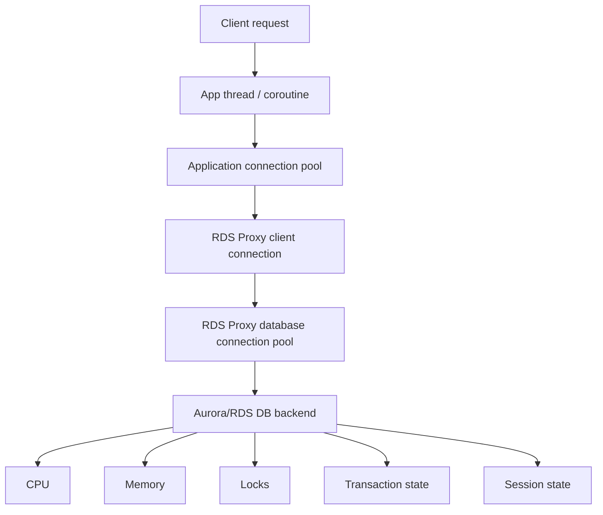
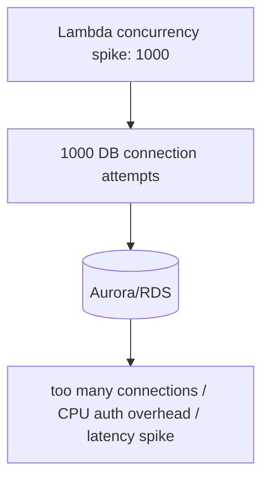
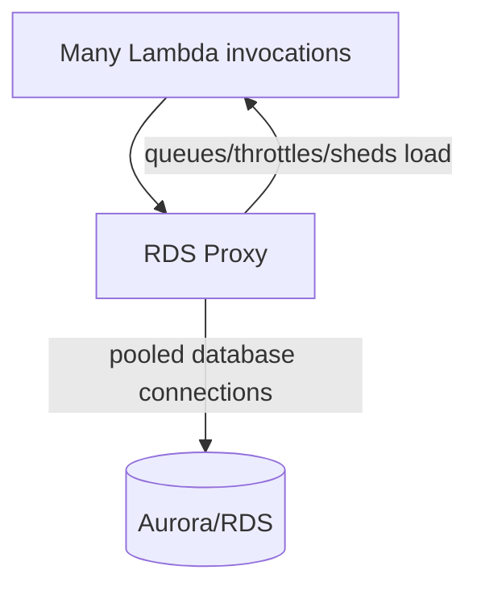
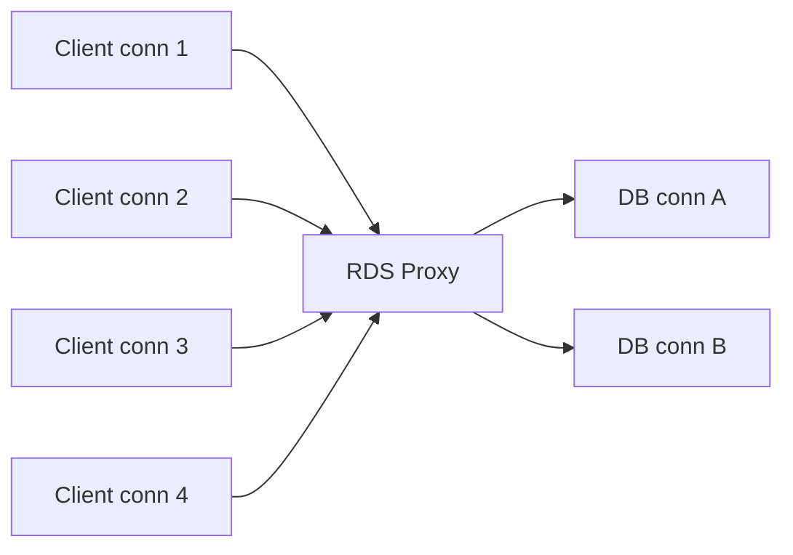
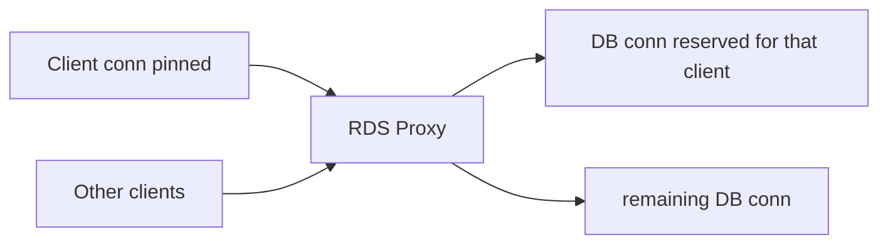
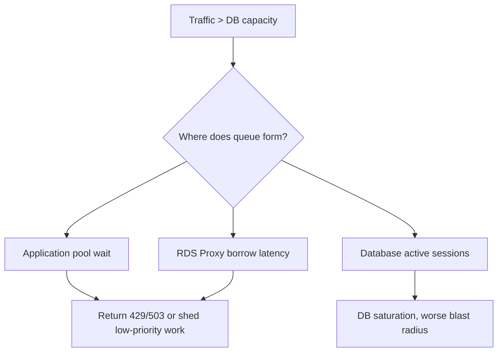
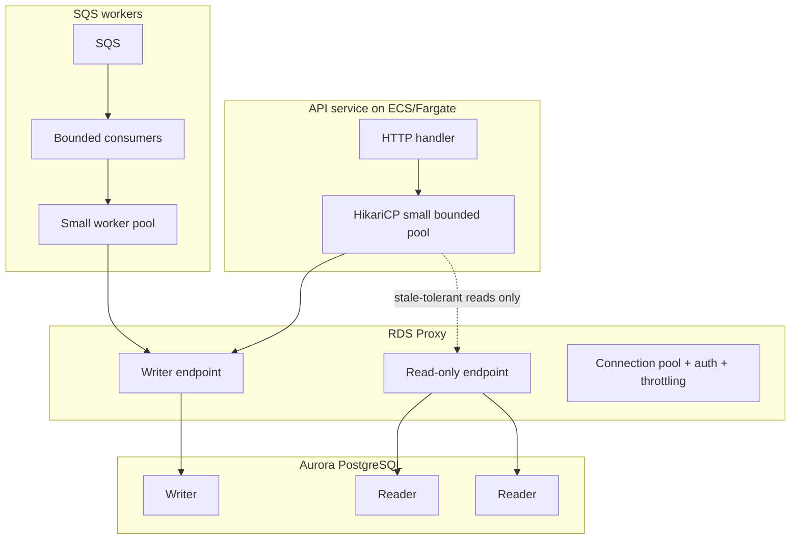

# Part 062 — Connection Management, Pooling, RDS Proxy, Serverless Clients, and Exhaustion

> Target pembelajaran: kamu harus bisa menjelaskan kenapa database connection adalah scarce resource, kapan memakai application-side pool, kapan memakai RDS Proxy, kenapa Lambda bisa membuat connection storm, bagaimana pinning merusak multiplexing, dan metric apa yang harus dipantau sebelum production incident.

Banyak sistem relational database gagal bukan karena query paling kompleks, tetapi karena **connection management** buruk. Query yang benar pun bisa gagal jika semua connection habis. Service yang cepat pun bisa membuat database collapse jika autoscaling menambah ratusan container/function tanpa connection budget.

Database connection bukan HTTP request. Connection membawa memory, backend process/thread, transaction context, session state, auth state, buffers, prepared statements, temp objects, dan lock ownership. Karena itu connection adalah bagian dari capacity model.

---

## 1. Mental Model: Connection adalah Runtime Lease

Setiap request application yang “pinjam” database connection sedang memegang lease atas resource database.



Connection exhaustion terjadi ketika permintaan connection melebihi kemampuan database atau pool untuk melayani dengan latency yang masih masuk akal.

Gejala:

- API latency naik walaupun CPU app rendah;
- error `too many connections`;
- pool timeout di app;
- RDS Proxy `DatabaseConnectionsBorrowLatency` naik;
- DB CPU naik karena connection churn/auth overhead;
- banyak session `idle in transaction`;
- failover terasa lama karena connection dan retry tidak disiplin;
- Lambda concurrency naik lalu DB collapse.

---

## 2. Kenapa “Tambah Connection” Sering Salah

Connection bukan throughput. Lebih banyak connection bisa meningkatkan concurrency sampai titik tertentu, lalu menurunkan throughput karena:

- context switching meningkat;
- memory per connection bertambah;
- lock contention meningkat;
- query queue pindah dari app ke database;
- cache locality memburuk;
- failover/recovery lebih berat;
- database sulit memberi latency predictability.

Rule:

> Pool bukan dibuat sebesar traffic puncak. Pool dibuat sebesar database dapat melayani dengan stabil.

Jika request lebih banyak daripada kapasitas DB, kamu butuh backpressure, queue, caching, read replica, query optimization, atau workload shedding — bukan sekadar menambah connection.

---

## 3. Layer Pooling: Jangan Campur Aduk

| Layer | Apa yang di-pool | Tujuan | Risiko |
|---|---|---|---|
| Driver connection | TCP/TLS/auth/session ke DB/proxy | Reuse connection | stale connection, session leak |
| Application pool | Connection dari app ke DB/proxy | Limit concurrency dan reuse | pool terlalu besar/kecil |
| RDS Proxy pool | Database connection dari proxy ke DB | Multiplex client connections ke DB connections | pinning, borrow latency |
| DB engine backend | Actual server-side sessions | Execute SQL | memory/lock/CPU exhaustion |

RDS Proxy tidak otomatis menghapus kebutuhan application-side discipline. Ia membantu mengelola connection surge dan failover, tetapi application tetap harus:

- membatasi concurrent DB work;
- menutup/return connection;
- menghindari idle transaction;
- mengatur timeout;
- menghindari session state yang menyebabkan pinning;
- memahami read/write endpoint.

---

## 4. Application-Side Pooling untuk ECS/EC2/EKS

Untuk long-running service seperti ECS/Fargate, EC2, atau EKS, application-side pool seperti HikariCP masih sangat penting.

### 4.1 Pool Sizing Formula Awal

Misal:

```text
DB effective max connections for app fleet: 300
service instances: 10
reserved admin/migration/headroom: 60
usable for service: 240
max pool per instance: floor(240 / 10) = 24
```

Tetapi angka ini hanya start. Validasi dengan:

- DB CPU;
- query latency;
- lock wait;
- active vs idle connections;
- pool wait time;
- p95/p99 request latency;
- failover drill.

### 4.2 HikariCP Baseline

Contoh prinsip konfigurasi, bukan angka universal:

```properties
spring.datasource.hikari.maximumPoolSize=20
spring.datasource.hikari.minimumIdle=5
spring.datasource.hikari.connectionTimeout=500
spring.datasource.hikari.validationTimeout=250
spring.datasource.hikari.idleTimeout=600000
spring.datasource.hikari.maxLifetime=1800000
spring.datasource.hikari.leakDetectionThreshold=5000
```

Guideline:

- `connectionTimeout` harus pendek agar app fail fast saat DB saturated;
- `maximumPoolSize` harus bounded;
- `maxLifetime` lebih pendek dari batas proxy/client lifecycle jika memakai RDS Proxy;
- leak detection aktif di staging dan bisa aktif terbatas di production;
- pool metrics wajib diekspor.

### 4.3 Jangan Menahan Connection Selama Remote Call

Buruk:

```java
Connection c = dataSource.getConnection();
var caseData = loadCase(c, caseId);
externalRegistry.validate(caseData); // connection idle tapi tertahan
updateCase(c, caseId);
c.close();
```

Lebih baik:

```java
var caseData = repository.loadSnapshot(caseId); // connection cepat kembali
var validation = externalRegistry.validate(caseData);
repository.applyValidationResult(caseId, validation); // transaction pendek
```

Kalau invariant membutuhkan reservation, buat pending/reserved state dulu, lalu remote call di luar transaction.

---

## 5. Lambda dan Serverless Connection Storm

Lambda bisa scale sangat cepat. Itu bagus untuk stateless compute, tetapi buruk jika setiap invocation membuat connection database langsung.



RDS Proxy sering cocok untuk Lambda karena Lambda membuat koneksi pendek dan sering. Proxy membuat banyak client connections bisa dimultiplex ke lebih sedikit database connections.

Dengan RDS Proxy:



Tetapi tetap perlu:

- reserved concurrency untuk Lambda;
- per-function DB concurrency budget;
- short transaction;
- idempotency;
- retry backoff;
- no unbounded parallel DB calls inside one invocation;
- monitor borrow latency.

### 5.1 Lambda Pattern

Prinsip:

- simpan client/pool object di luar handler jika runtime reuse menguntungkan;
- jangan menyimpan transaction global;
- jangan membiarkan connection terbuka dalam state rusak setelah error;
- close/return connection di `finally`;
- gunakan RDS Proxy endpoint, bukan direct DB endpoint, untuk function dengan concurrency dinamis;
- atur reserved concurrency sesuai DB capacity.

Pseudo-code:

```java
public class Handler implements RequestHandler<Event, Response> {
    private static final HikariDataSource ds = createDataSourceForRdsProxy();

    @Override
    public Response handleRequest(Event event, Context context) {
        try (Connection c = ds.getConnection()) {
            c.setAutoCommit(false);
            // short local transaction
            applyCommand(c, event);
            c.commit();
            return Response.ok();
        } catch (SQLException e) {
            // rollback via close if needed; classify retryability
            throw classify(e);
        }
    }
}
```

Catatan: pada beberapa workload Lambda, pool kecil per execution environment bisa berguna; pada workload lain, connection-per-invocation ke RDS Proxy cukup. Yang salah adalah unbounded pool per warm environment tanpa memahami aggregate concurrency.

---

## 6. RDS Proxy: Apa yang Dilakukan dan Tidak Dilakukan

Amazon RDS Proxy berada di antara application dan database.

Ia membantu:

- connection pooling database-side;
- mengurangi overhead membuka connection baru;
- menangani traffic surge dengan queue/throttle/load shedding;
- membatasi jumlah database connections;
- membantu failover dengan routing ke target sehat;
- memakai Secrets Manager/IAM authentication;
- memberi endpoint tambahan termasuk read-only endpoint untuk Aurora reader use case.

Ia tidak:

- memperbaiki query lambat;
- menghapus kebutuhan index;
- menghilangkan lock contention;
- membuat transaction panjang menjadi aman;
- menjamin semua client connections selalu multiplexed;
- menggantikan application-side concurrency limit;
- menjadikan database infinite.

---

## 7. Client Connection vs Database Connection

RDS Proxy membedakan:

- **client connection**: koneksi dari application ke proxy;
- **database connection**: koneksi dari proxy ke database.

Multiplexing berarti banyak client connection dapat memakai lebih sedikit database connection dari pool, terutama ketika session tidak pinned dan transaction pendek.



Jika session pinned:



Pinning mengurangi efektivitas proxy. Saat pinning tinggi, RDS Proxy berubah dari multiplexing layer menjadi mostly pass-through connection holder.

---

## 8. Connection Pinning

Pinning terjadi ketika proxy tidak bisa aman memindahkan client session ke database connection lain karena ada session state yang harus dipertahankan.

Untuk PostgreSQL, penyebab umum:

- `SET` command;
- `PREPARE`, `DISCARD`, `DEALLOCATE`, `EXECUTE` untuk prepared statement management;
- temporary table/sequence/view;
- cursor;
- `LISTEN/NOTIFY`;
- library/session state tertentu;
- statement text sangat besar;
- transaction-scope isolation/read-only setting dalam pola tertentu.

### 8.1 Cara Mengurangi Pinning

1. Hindari session state di hot path.

Buruk:

```sql
SET app.current_tenant = 'tenant-a';
SELECT * FROM cases WHERE tenant_id = current_setting('app.current_tenant');
```

Lebih jelas:

```sql
SELECT * FROM cases WHERE tenant_id = :tenant_id;
```

2. Jika butuh initialization yang sama untuk semua connection, gunakan proxy initialization query daripada `SET` dari application setiap request.

3. Hindari temporary table untuk request OLTP. Gunakan CTE, staging permanent table dengan request id, atau process async.

4. Pastikan ORM/driver behavior dipahami. Beberapa driver/ORM memakai prepared statement atau session settings yang bisa memicu pinning.

5. Monitor `DatabaseConnectionsCurrentlySessionPinned`.

### 8.2 Pinning dan Application Pool

Application-side pool bisa memperpanjang umur client connection. Jika client connection pinned lalu idle di pool, database connection tetap tidak bisa dipakai client lain.

Maka:

- jika pinning tinggi, pool besar di app bisa memperparah;
- set `maxLifetime` dan idle timeout agar client connections tidak hidup terlalu lama;
- pisahkan workload pinned ke proxy/endpoint/pool khusus jika perlu;
- hilangkan sumber pinning sebelum menaikkan capacity.

---

## 9. Konfigurasi RDS Proxy yang Perlu Dipahami

### 9.1 `IdleClientTimeout`

Berapa lama client connection boleh idle sebelum proxy menutupnya. Default AWS saat ini 1.800 detik atau 30 menit.

Design choice:

- workload frequent connections: timeout lebih tinggi bisa mengurangi reconnect;
- workload banyak idle clients: timeout lebih rendah mengurangi stale client connections;
- application pool idle timeout sebaiknya lebih rendah dari proxy idle timeout agar app menutup duluan secara terkontrol.

### 9.2 `MaxConnectionsPercent`

Batas database connections yang boleh dibuat proxy, sebagai persentase dari `max_connections` DB target.

Jangan set 100% tanpa headroom. Sisakan untuk:

- admin connection;
- migration tool;
- monitoring;
- emergency debug;
- internal proxy operations;
- failover/rebalancing.

Guideline awal:

```text
MaxConnectionsPercent = 70-80% untuk workload utama
reserved headroom = 20-30%
validasi lewat load test dan failover drill
```

### 9.3 `MaxIdleConnectionsPercent`

Berapa banyak database connections idle dipertahankan proxy. Lebih tinggi membantu traffic burst, tetapi mempertahankan resource lebih banyak.

### 9.4 `ConnectionBorrowTimeout`

Berapa lama proxy menunggu database connection tersedia sebelum error. Default AWS saat ini 120 detik.

Untuk API user-facing, 120 detik biasanya terlalu lama. Kalau request timeout API hanya 5-10 detik, borrow timeout harus lebih pendek agar error cepat dan terklasifikasi.

```text
API p99 target: 800ms
API timeout: 5s
DB query timeout: 2-3s
RDS Proxy borrow timeout: 0.5-2s, tergantung workload
```

---

## 10. Endpoint Strategy: Writer vs Reader

Untuk Aurora cluster:

- default proxy endpoint mengarah ke writer untuk read/write;
- read-only proxy endpoint dapat meneruskan koneksi ke reader endpoint;
- read traffic ke reader harus siap replica lag;
- command flow jangan membaca dari reader untuk decision yang butuh read-your-writes.

Pattern:

```text
Command path:
  API → writer proxy endpoint → Aurora writer

Query path tolerant staleness:
  API/read model → read-only proxy endpoint → Aurora readers

Projection/search path:
  event consumer → projection DB/OpenSearch/cache
```

Jangan memakai reader endpoint untuk validasi command seperti:

- apakah idempotency key sudah processed;
- apakah status sekarang boleh diubah;
- apakah uniqueness sudah dipakai;
- apakah outbox event sudah published.

Itu harus ke writer/authoritative store.

---

## 11. Pooling by Workload Type

### 11.1 Synchronous API Service

Characteristics:

- latency sensitive;
- request timeout pendek;
- user-visible failure;
- bursty traffic.

Design:

- bounded app pool;
- RDS Proxy jika traffic burst/failover/serverless hybrid;
- short transaction;
- fail fast on pool exhaustion;
- return `429`/`503` jika overload;
- circuit breaker untuk DB saturation.

### 11.2 SQS Worker

Characteristics:

- async;
- can wait/retry;
- throughput controlled by consumer concurrency;
- duplicate message possible.

Design:

- concurrency derived from DB capacity;
- batch size aligned with transaction cost;
- no unbounded parallelism inside worker;
- if DB saturated, reduce consumer concurrency, don't increase queue pollers;
- DLQ for poison message;
- idempotent inbox.

```text
safe_worker_concurrency = floor(usable_db_connections / connections_per_worker)
```

### 11.3 Batch/Backfill Job

Characteristics:

- large data volume;
- can hurt OLTP;
- often causes locks and I/O pressure.

Design:

- separate pool/user/application_name;
- low concurrency;
- chunking;
- statement timeout;
- pause/resume checkpoint;
- schedule off-peak;
- monitor replica lag and lock waits.

### 11.4 Admin/Internal Tool

Characteristics:

- low volume;
- high privilege;
- dangerous query potential.

Design:

- separate credentials;
- very small pool;
- strong timeout;
- audit every action;
- never share app pool.

---

## 12. Backpressure Design

Connection pool exhaustion should be treated as backpressure signal, not only as error.



Prefer queueing at:

1. SQS for async work;
2. application pool for very short bounded wait;
3. RDS Proxy borrow queue for controlled surge;
4. never unbounded inside database.

---

## 13. Observability: Metrics yang Wajib Ada

### 13.1 Application Pool Metrics

Expose:

- active connections;
- idle connections;
- pending threads waiting for connection;
- connection acquisition latency;
- timeout count;
- max pool size;
- leak detection count;
- transaction duration.

### 13.2 RDS Proxy Metrics

Monitor:

- `ClientConnections`;
- `DatabaseConnections`;
- `MaxDatabaseConnectionsAllowed`;
- `DatabaseConnectionsBorrowLatency`;
- `DatabaseConnectionsCurrentlySessionPinned`;
- target health/availability;
- endpoint-specific metrics for read/write vs read-only.

### 13.3 Database Metrics

Monitor:

- `DatabaseConnections`;
- CPU;
- freeable memory;
- read/write IOPS;
- transaction duration;
- lock wait events;
- deadlocks;
- active vs idle vs idle-in-transaction sessions;
- replication lag for readers;
- Performance Insights top waits.

### 13.4 Trace Tags

Every DB span should include:

```text
service.name
operation.name
route / command
transaction_id / command_id
pool.wait_ms
db.statement_hash, not raw PII SQL
rows_affected
db.endpoint_type: writer|reader|proxy
retry_attempt
```

---

## 14. Incident Playbook: Connection Exhaustion

### Symptom

- API 5xx naik;
- pool timeout;
- RDS Proxy borrow latency naik;
- DB connection count near max;
- p99 latency spike.

### Step 1 — Identify Queue Location

- App pool pending high? Application concurrency too high or query slow.
- Proxy borrow latency high? Database connection pool exhausted or pinning high.
- DB active sessions high? DB doing too much work.
- DB idle sessions high? Pool sizing/leak/session management issue.
- Idle in transaction? Application bug.

### Step 2 — Reduce Blast Radius

- throttle low-priority API;
- reduce Lambda reserved concurrency;
- reduce ECS desired count only if connection storm from too many tasks, not if CPU app bottleneck;
- pause backfill/batch jobs;
- reduce SQS worker concurrency;
- enable circuit breaker/load shedding.

### Step 3 — Classify Root Cause

| Finding | Likely root cause | Action |
|---|---|---|
| high active DB sessions + CPU | query overload | optimize query/index, reduce concurrency |
| high idle DB sessions | pool too large/leak | reduce pool, fix lifecycle |
| high idle in transaction | transaction leak | kill blockers, fix code |
| high session pinned | RDS Proxy pinning | remove session state/temp table/prepared pattern |
| high borrow latency, low DB CPU | pool/proxy config or pinning | inspect proxy metrics/logs |
| high connection attempts | serverless/container surge | cap concurrency, use proxy, warm discipline |

### Step 4 — Recovery

- kill only confirmed safe blockers;
- do not restart every service blindly;
- scale DB only if workload truly needs more compute/memory and query plan is sane;
- preserve logs/Performance Insights window;
- write post-incident connection budget.

---

## 15. Common Anti-Patterns

### 15.1 Pool Per Request

Creating a new pool per request is catastrophic. Pool is process/runtime-level, not request-level.

### 15.2 Pool Size Equals Thread Count

If each of 50 pods has pool size 50, potential DB connections = 2.500. Your DB probably cannot serve that.

### 15.3 Lambda Unlimited Concurrency to RDS

Serverless compute without database concurrency budget is a controlled DDoS against your own database.

### 15.4 Holding Connection While Waiting on S3/HTTP/Kafka/EventBridge

Connection should be held only while executing DB work.

### 15.5 RDS Proxy as Magic Fix

If query is slow, indexes missing, transactions long, or session pinning high, proxy does not solve root cause.

### 15.6 Reader Endpoint for Command Validation

Read replica lag can make command validation stale. Use writer for authoritative decision.

### 15.7 No Admin Headroom

If application consumes all connections, engineers cannot connect during incident. Always reserve headroom.

---

## 16. Reference Architecture Pattern



Capacity budget must be explicit:

```text
Aurora max_connections: 1000
reserved admin/internal: 100
reserved migrations/batch: 100
RDS Proxy max allowed for app: 700-800
API fleet budget: 400
worker budget: 200
spare/failover headroom: 100+
```

---

## 17. Configuration Example: Separate Pools by Intent

```yaml
apiWriterPool:
  endpoint: rds-proxy-writer.cluster-proxy.example
  maxPoolSize: 20
  connectionTimeoutMs: 500
  statementTimeoutMs: 3000
  appName: case-api-writer

apiReaderPool:
  endpoint: rds-proxy-reader.cluster-proxy.example
  maxPoolSize: 30
  connectionTimeoutMs: 300
  statementTimeoutMs: 2000
  appName: case-api-reader
  allowedUse: stale-tolerant queries only

workerPool:
  endpoint: rds-proxy-writer.cluster-proxy.example
  maxPoolSize: 10
  connectionTimeoutMs: 1000
  statementTimeoutMs: 10000
  appName: case-worker

migrationPool:
  endpoint: direct-or-proxy-admin-endpoint
  maxPoolSize: 2
  connectionTimeoutMs: 2000
  statementTimeoutMs: 60000
  appName: schema-migration
```

Separate pools prevent one workload class from starving another.

---

## 18. Security and Auth Boundary

RDS Proxy can integrate with Secrets Manager and IAM authentication. Production baseline:

- credentials in Secrets Manager, not environment variable plaintext;
- TLS required where possible;
- IAM auth for clients when appropriate;
- separate DB users per workload role;
- least privilege schema grants;
- rotate secrets;
- audit connection source/application_name;
- security group allows only intended clients to proxy;
- proxy not publicly accessible.

Do not let every service use the same superuser credential through the same proxy.

---

## 19. Testing Matrix

Before production:

1. load test normal traffic with expected pod/function concurrency;
2. traffic spike test 2x/5x with RDS Proxy borrow latency observed;
3. Lambda reserved concurrency test;
4. app pool exhaustion test;
5. RDS Proxy max connection cap test;
6. session pinning test with ORM/driver actual queries;
7. failover drill;
8. reader lag test;
9. long transaction leak test;
10. batch/backfill running alongside API;
11. credential rotation test;
12. connection lifetime/stale connection test;
13. kill DB connection mid-transaction;
14. deploy rolling restart of all app tasks;
15. emergency admin connection during high load.

Expected outcomes:

- overload fails fast, not indefinitely;
- DB remains reachable for admin;
- p99 degradation is bounded;
- async workers slow down instead of overwhelming DB;
- proxy pinning is known and acceptable or fixed;
- failover does not require manual restart of every service.

---

## 20. Review Checklist

- [ ] Does each service have an explicit DB connection budget?
- [ ] Is pool size calculated across total fleet, not per instance only?
- [ ] Is Lambda reserved concurrency aligned with DB capacity?
- [ ] Are SQS worker concurrency and batch size bounded?
- [ ] Are API, worker, migration, and admin pools separated?
- [ ] Are writer and reader endpoints used intentionally?
- [ ] Is command validation always on writer/authoritative path?
- [ ] Is RDS Proxy pinning measured?
- [ ] Are `ClientConnections`, `DatabaseConnections`, `MaxDatabaseConnectionsAllowed`, `DatabaseConnectionsBorrowLatency`, and pinned connection metrics monitored?
- [ ] Is application pool wait time exposed?
- [ ] Are long transactions and idle-in-transaction sessions alerted?
- [ ] Are timeouts shorter than user/API timeout?
- [ ] Does the service return `429`/`503` or shed load when DB budget is exhausted?
- [ ] Is there admin/emergency connection headroom?
- [ ] Has failover been tested with real application clients?

---

## 21. Ringkasan Mental Model

Connection management adalah concurrency control di luar database engine.

Urutan berpikir:

```text
Berapa DB work yang bisa dilayani stabil?
  → bagi budget per workload class
  → set application pool bounded
  → gunakan RDS Proxy untuk surge/failover/serverless jika cocok
  → minimalkan pinning
  → set timeout dan backpressure
  → monitor app pool + proxy + DB bersama
  → test failover dan exhaustion
```

RDS Proxy adalah alat penting, tetapi bukan pengganti desain. Ia paling efektif saat transaction pendek, session stateless, workload punya concurrency budget, dan observability memisahkan client connections dari database connections.

---

## References

- Amazon RDS Proxy for Aurora: https://docs.aws.amazon.com/AmazonRDS/latest/AuroraUserGuide/rds-proxy.html
- RDS Proxy Connection Considerations: https://docs.aws.amazon.com/AmazonRDS/latest/UserGuide/rds-proxy-connections.html
- Avoiding Pinning an RDS Proxy: https://docs.aws.amazon.com/AmazonRDS/latest/UserGuide/rds-proxy-pinning.html
- Monitoring RDS Proxy Metrics with CloudWatch: https://docs.aws.amazon.com/AmazonRDS/latest/UserGuide/rds-proxy.monitoring.html
- AWS Prescriptive Guidance — Amazon RDS Proxy Best Practices: https://docs.aws.amazon.com/prescriptive-guidance/latest/amazon-rds-proxy/best-practices.html
- Automatically Connecting Lambda and Aurora with RDS Proxy: https://docs.aws.amazon.com/AmazonRDS/latest/AuroraUserGuide/lambda-rds-connect.html
