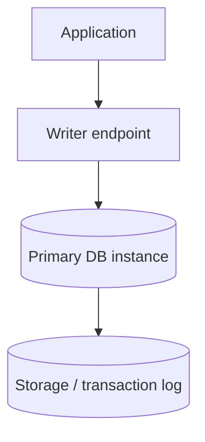
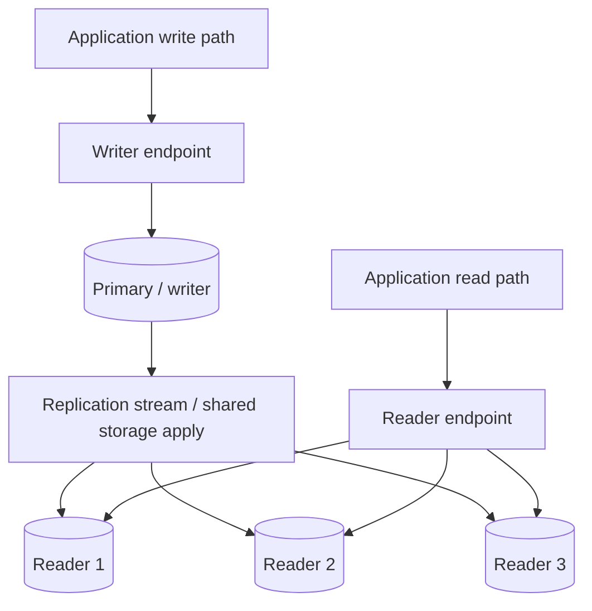
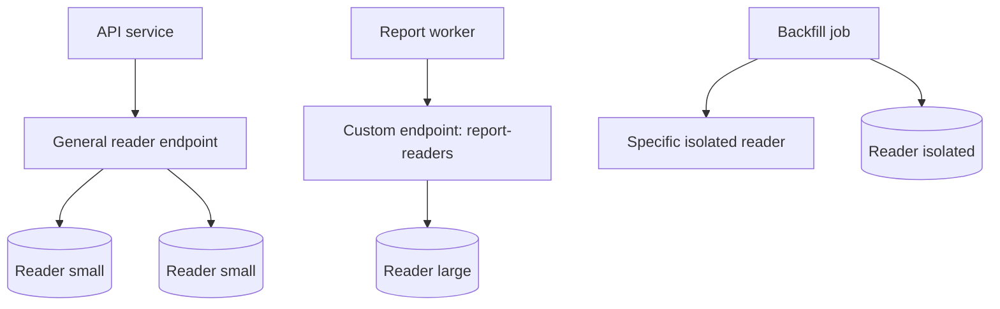
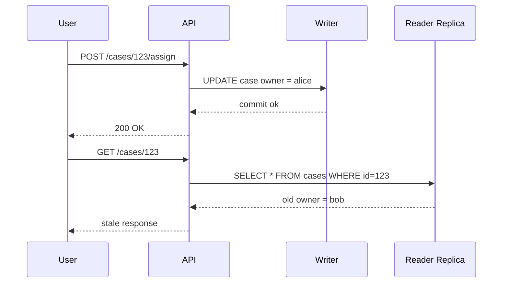
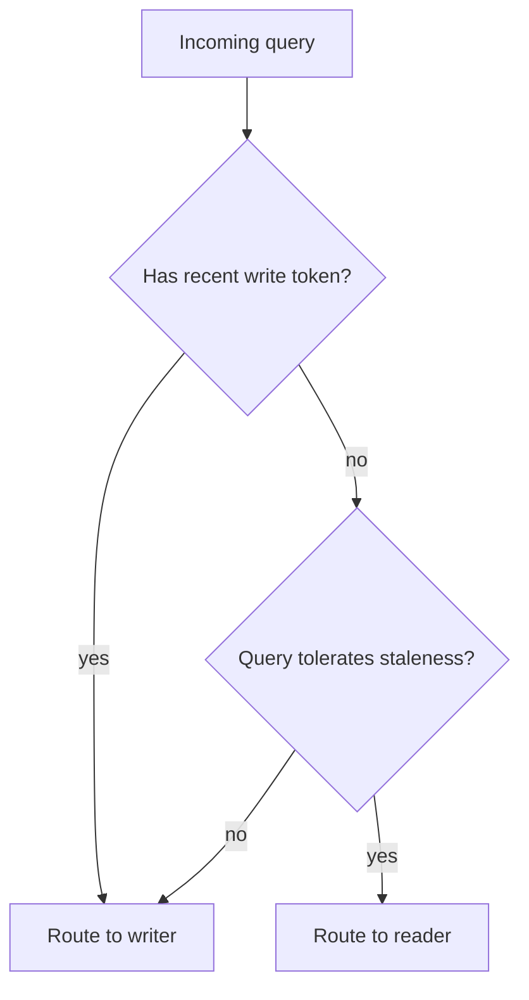
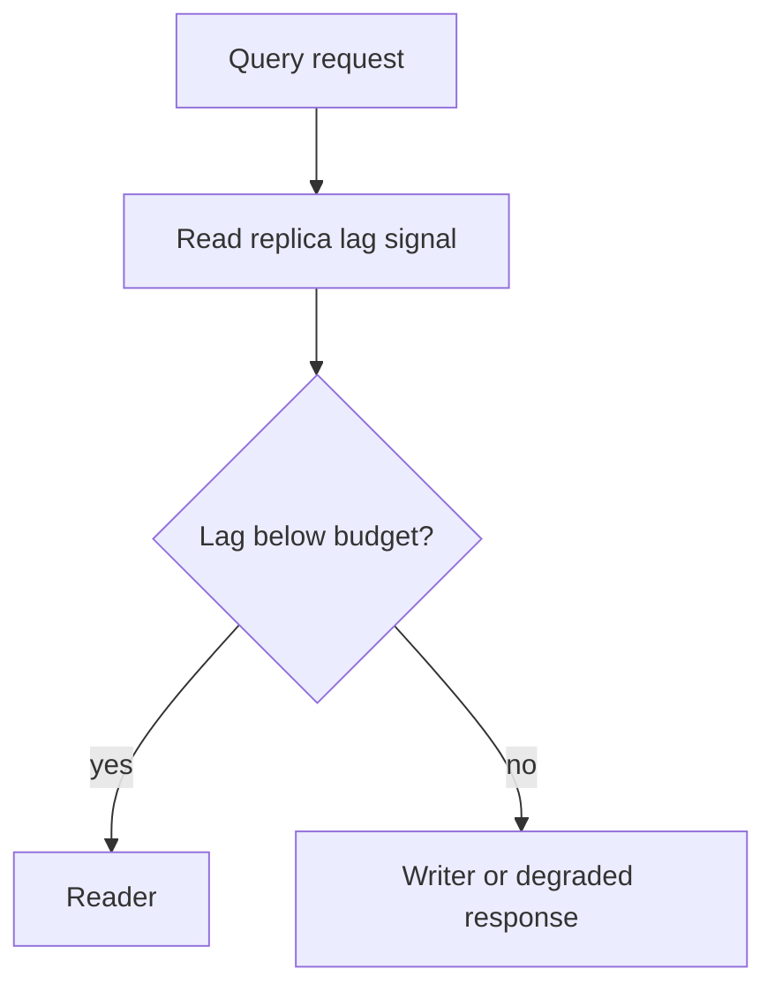
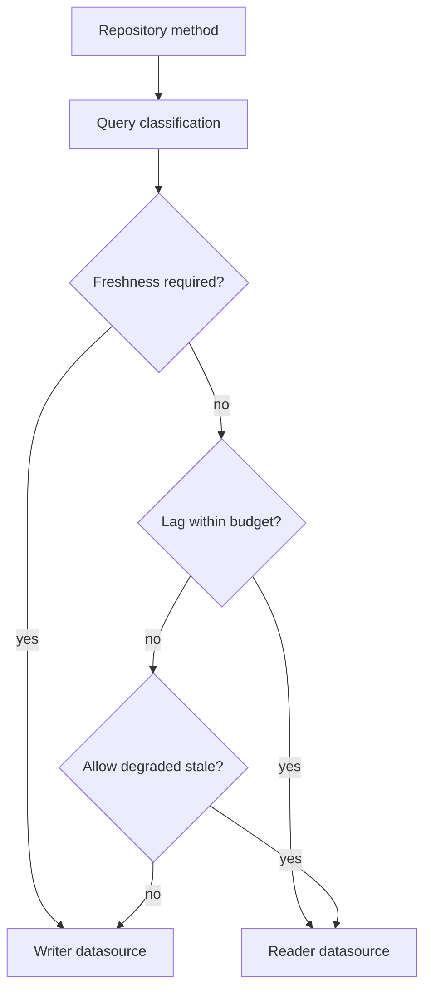
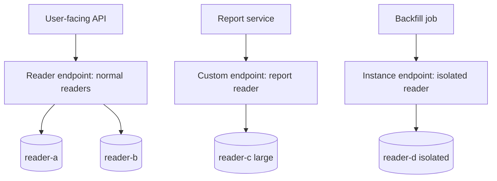
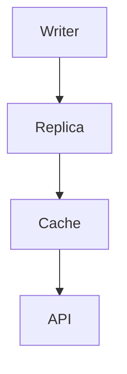
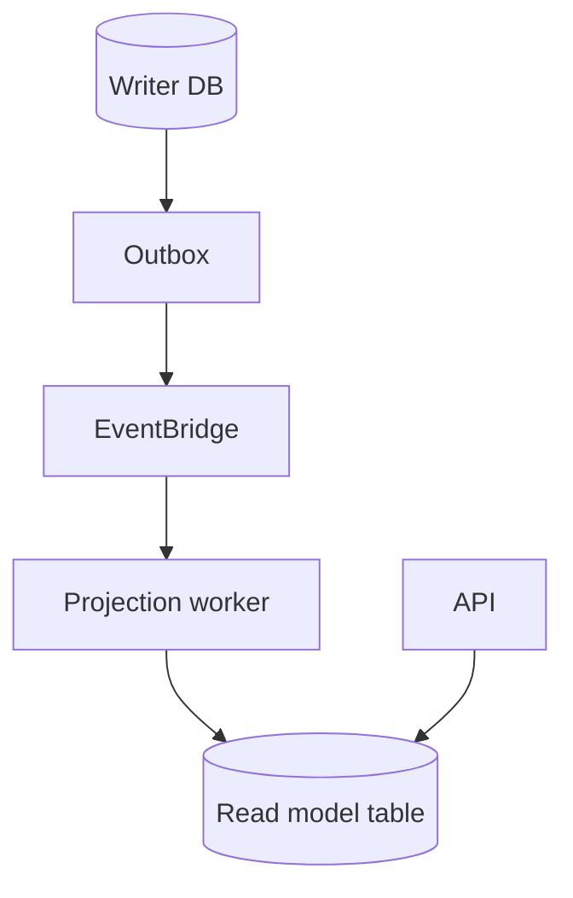

# Part 063 — Read Scaling, Replicas, Reader Endpoint, Lag, and Read-Your-Writes Problem

> Target pembelajaran: kamu harus bisa mendesain read scaling di Aurora/RDS tanpa merusak correctness. Setelah bagian ini, kamu harus bisa menjelaskan apa yang sebenarnya di-scale oleh read replica, apa yang tidak diselesaikan oleh reader endpoint, kenapa stale read terjadi, bagaimana mendesain read-your-writes secara eksplisit, dan metric apa yang menentukan apakah read scaling aman di production.

Read replica sering dijual secara mental sebagai solusi sederhana: “kalau read berat, tambahkan replica.” Itu benar hanya pada level kapasitas. Pada level sistem, replica memperkenalkan **consistency boundary** baru.

Read scaling bukan hanya memindahkan query `SELECT` dari writer ke reader. Read scaling mengubah pertanyaan arsitektur:

- query mana boleh membaca data lama;
- query mana wajib membaca state terbaru;
- berapa staleness budget yang diterima user;
- bagaimana client tahu bahwa hasil query mungkin stale;
- bagaimana routing query dilakukan setelah write;
- bagaimana sistem bereaksi saat replica lag tinggi;
- apakah failover membuat connection dan cache invalid;
- apakah read traffic yang dipindah ke replica justru menambah cost dan complexity tanpa mengurangi bottleneck sebenarnya.

Rule awal:

> Replica menambah kapasitas baca, bukan menghapus konsekuensi dari asynchronous replication.

---

## 1. Mental Model: Read Scaling adalah Trade-Off Consistency vs Capacity

Single writer database memberikan model mental sederhana:



Semua write dan read melalui satu authoritative instance. Jika request membaca tepat setelah write, peluang membaca data terbaru tinggi karena request diarahkan ke instance yang sama.

Ketika read replica masuk:



Sekarang read path bisa membaca dari instance yang belum melihat write terbaru. Ini bukan bug. Ini konsekuensi dari read scaling.

Kamu memperoleh:

- kapasitas baca tambahan;
- isolasi workload read-heavy dari writer;
- target failover untuk high availability;
- endpoint berbeda untuk read-only traffic;
- kemungkinan menjalankan reporting/query berat di reader tertentu.

Kamu membayar dengan:

- replica lag;
- read-your-writes problem;
- routing complexity;
- connection balancing yang tidak selalu sesuai distribusi query;
- observability tambahan;
- failure mode saat replica unavailable;
- kemungkinan stale cache/projection jika consumer membaca dari replica.

---

## 2. Endpoint Anatomy di Aurora

Aurora cluster umumnya punya beberapa jenis endpoint.

| Endpoint | Fungsi | Cocok untuk | Risiko |
|---|---|---|---|
| Cluster/writer endpoint | Mengarah ke current writer | command, transaction, strongly fresh read setelah write | bottleneck jika semua read masuk writer |
| Reader endpoint | Connection-balanced ke Aurora Replicas | read-only query yang tolerate lag | tidak load-balance per query; stale read |
| Instance endpoint | Mengarah ke instance spesifik | admin/debug/specialized workload | coupling ke instance; failover manual concern |
| Custom endpoint | Subset instance yang dipilih | workload isolation, analytics reader, heavy query pool | salah membership bisa overload replica tertentu |
| RDS Proxy endpoint | Proxy/pool untuk writer/reader | connection surge/failover pooling | pinning, proxy config, extra layer |

### 2.1 Writer endpoint

Writer endpoint adalah endpoint yang harus dipakai untuk write dan transaction yang mengubah state.

```text
jdbc:postgresql://my-cluster.cluster-xxxx.ap-southeast-1.rds.amazonaws.com:5432/app
```

Gunakan writer endpoint untuk:

- command handler;
- transaction yang membuat/mengubah aggregate;
- read yang harus strict setelah write;
- database migration;
- outbox publisher yang perlu membaca state committed terbaru;
- administrative transaction yang tidak boleh stale.

### 2.2 Reader endpoint

Reader endpoint mengarahkan connection baru ke salah satu Aurora Replica. Yang penting: reader endpoint **menyeimbangkan koneksi**, bukan setiap query.

```text
jdbc:postgresql://my-cluster.cluster-ro-xxxx.ap-southeast-1.rds.amazonaws.com:5432/app
```

Jika aplikasi memakai connection pool, pool mungkin membuat 20 koneksi saat startup. Setelah itu query akan memakai koneksi yang sudah ada. Akibatnya distribusi query sangat dipengaruhi oleh:

- kapan koneksi dibuat;
- berapa ukuran pool setiap app instance;
- apakah koneksi di-recycle;
- apakah semua koneksi kebetulan diarahkan ke replica tertentu;
- apakah replica membership berubah setelah failover/autoscaling.

Jangan menganggap reader endpoint sebagai query-level load balancer.

### 2.3 Custom endpoint

Custom endpoint berguna ketika semua read tidak sama.

Contoh:



Gunakan custom endpoint ketika:

- ada query berat yang tidak boleh mengganggu user-facing reads;
- ada reader instance class berbeda;
- ada batch/backfill/reporting workload;
- ada eksperimen optimizer/index yang ingin dibatasi;
- ada migration verification query yang berat.

---

## 3. Aurora Replica vs RDS Read Replica

Istilah “read replica” sering dipakai longgar, tetapi behavior Aurora dan RDS engine-specific read replica tidak identik.

### 3.1 Aurora Replica

Aurora memakai cluster architecture dengan writer dan up to multiple reader instances dalam cluster yang sama. Reader bisa dipakai untuk read scaling dan sebagai failover target.

Karakteristik penting:

- writer menerima write;
- reader melayani read-only workload;
- reader endpoint menyeimbangkan connection ke reader;
- reader bisa dipromosikan saat failover;
- cluster endpoint akan menunjuk writer baru setelah failover;
- replica lag biasanya rendah untuk banyak workload, tetapi tetap harus dimonitor;
- reader endpoint bisa jatuh ke writer jika cluster tidak punya replica.

### 3.2 RDS read replica non-Aurora

Pada RDS engine seperti PostgreSQL/MySQL biasa, read replica dibuat dari source DB instance dan di-update memakai mekanisme replication engine. Secara umum, replication bersifat asynchronous.

Karakteristik penting:

- replica adalah DB instance terpisah;
- replication lag bisa lebih terlihat;
- promotion dan failover semantics berbeda dari Aurora cluster failover;
- endpoint management lebih manual;
- cross-Region replica lebih sering dipakai untuk DR/read locality;
- beberapa engine punya fitur/limit berbeda.

### 3.3 Jangan samakan Multi-AZ dengan read replica

Multi-AZ untuk high availability tidak otomatis berarti “bisa dipakai untuk scale read.” Dalam banyak desain RDS klasik, standby Multi-AZ bukan target read traffic. Read replica adalah mekanisme berbeda.

Aurora agak berbeda karena reader instance memang bisa melayani read dan juga menjadi failover target. Tetapi mental model tetap harus dipisahkan:

- HA menjawab: “apakah database tetap tersedia ketika node/AZ gagal?”
- read scaling menjawab: “apakah kapasitas read cukup tanpa membebani writer?”
- DR menjawab: “apakah data dan service bisa pulih ketika Region/cluster rusak?”

---

## 4. Apa yang Boleh Dibaca dari Replica?

Tidak semua read aman diarahkan ke replica.

| Read type | Boleh ke replica? | Catatan |
|---|---:|---|
| Public catalog browsing | Ya | Staleness kecil biasanya aman |
| Dashboard aggregate non-critical | Ya | Tampilkan freshness timestamp |
| User membuka detail setelah create/update | Biasanya tidak | Butuh read-your-writes |
| Authorization decision | Hati-hati | Jangan pakai stale role/permission untuk keputusan kritis |
| Payment/order confirmation | Tidak untuk path kritis | Baca writer atau state machine authoritative |
| Search projection | Ya, jika explicit eventually consistent | Jangan klaim sebagai source of truth |
| Admin investigation | Tergantung | Audit/legal read sering perlu writer/snapshot konsisten |
| Background reconciliation | Ya, dengan lag guard | Bisa menunggu replica catch-up atau baca writer |
| Report berat | Ya, di isolated reader | Pakai custom endpoint/instance endpoint |

Rule:

> Replica cocok untuk read yang memiliki staleness budget eksplisit.

Jika kamu tidak bisa menjawab “berapa lama stale masih diterima?”, jangan otomatis arahkan ke replica.

---

## 5. Read-Your-Writes Problem

Read-your-writes problem terjadi ketika user melakukan write, lalu langsung membaca dari replica yang belum menerima write tersebut.

Contoh:



Dari perspektif database, ini wajar. Dari perspektif user, ini terlihat seperti bug.

### 5.1 Pola 1 — Read-after-write route to writer

Pola paling sederhana: setelah command berhasil, read detail diarahkan ke writer untuk window tertentu.



Implementation idea:

```java
public DbRoute chooseRoute(QueryRequest request, UserSession session) {
    if (request.requiresFreshRead()) {
        return DbRoute.WRITER;
    }

    Instant lastMutationAt = session.getLastMutationAt(request.aggregateScope());
    if (lastMutationAt != null && lastMutationAt.plusSeconds(10).isAfter(clock.now())) {
        return DbRoute.WRITER;
    }

    return DbRoute.READER;
}
```

Kelebihan:

- mudah;
- predictable;
- tidak perlu introspeksi replica position;
- cocok untuk API user-facing.

Kekurangan:

- writer menerima extra read setelah write;
- window terlalu besar mengurangi manfaat replica;
- window terlalu kecil masih bisa stale saat lag tinggi.

### 5.2 Pola 2 — Version token

Command response mengembalikan version terbaru.

```json
{
  "caseId": "CASE-123",
  "version": 17,
  "status": "ASSIGNED"
}
```

Query berikutnya membawa expected version:

```http
GET /cases/CASE-123
X-Min-Version: 17
```

Application dapat:

1. baca dari reader;
2. jika `version < X-Min-Version`, retry ke writer;
3. atau return `202/409` dengan instruksi retry jika freshness belum siap.

Pseudo-code:

```java
CaseView view = reader.loadCase(caseId);

if (view.version() < request.minVersion()) {
    metrics.increment("db.read.stale_detected");
    view = writer.loadCase(caseId);
}

return view;
```

Kelebihan:

- freshness eksplisit;
- tidak bergantung window waktu;
- bagus untuk aggregate dengan monotonically increasing version.

Kekurangan:

- schema perlu version column;
- query list/aggregate lebih kompleks;
- tidak semua domain punya version natural.

### 5.3 Pola 3 — Sticky writer per request flow

Selama satu request workflow, semua read setelah write memakai connection writer.

```java
@Transactional
public AssignCaseResult assign(AssignCaseCommand cmd) {
    Case c = caseRepository.lockById(cmd.caseId());
    c.assignTo(cmd.assignee());
    outbox.append(CaseAssigned.from(c));

    // read summary still from writer transaction/context
    CaseSummary summary = caseRepository.loadSummaryFromWriter(cmd.caseId());
    return AssignCaseResult.from(summary);
}
```

Kelebihan:

- kuat untuk command response;
- tidak expose stale state setelah command;
- mudah diuji.

Kekurangan:

- hanya menyelesaikan flow lokal;
- tidak menyelesaikan request berikutnya dari browser/client jika route berubah ke reader.

### 5.4 Pola 4 — Explicit stale UI

Untuk dashboard dan listing, jangan menyembunyikan eventual consistency.

Contoh response:

```json
{
  "items": [...],
  "freshness": {
    "source": "reader-replica",
    "maxReplicaLagMs": 850,
    "generatedAt": "2026-07-07T10:15:30Z"
  }
}
```

Ini cocok untuk:

- analytics dashboard;
- admin list yang tidak menjadi keputusan legal final;
- catalog/search/browse;
- monitoring UI.

Tidak cocok untuk:

- authorization decision;
- financial balance authoritative;
- compliance deadline state;
- enforcement action finalization.

### 5.5 Pola 5 — Lag-aware routing

Aplikasi membaca metric lag atau health signal, lalu memutuskan route.



Kamu bisa memakai:

- CloudWatch metric lag;
- internal health endpoint dari read pool;
- heartbeat table yang di-update writer dan dibaca reader;
- database-native replication status.

Heartbeat table example:

```sql
CREATE TABLE replication_heartbeat (
  id text PRIMARY KEY,
  writer_time timestamptz NOT NULL,
  sequence bigint NOT NULL
);
```

Writer job:

```sql
INSERT INTO replication_heartbeat(id, writer_time, sequence)
VALUES ('main', now(), nextval('heartbeat_seq'))
ON CONFLICT (id)
DO UPDATE SET writer_time = excluded.writer_time,
              sequence = excluded.sequence;
```

Reader check:

```sql
SELECT now() - writer_time AS observed_lag
FROM replication_heartbeat
WHERE id = 'main';
```

Caveat:

- `now()` di reader dan writer bergantung clock;
- metric bisa noisy;
- heartbeat hanya approximation;
- jangan query heartbeat per request pada traffic tinggi;
- cache lag signal pendek, misalnya 1–5 detik.

---

## 6. Endpoint Routing Pattern di Application

Jangan sebar `readerDataSource` dan `writerDataSource` secara ad hoc di seluruh codebase. Buat routing policy eksplisit.



### 6.1 Query annotation

Contoh interface:

```java
public enum Freshness {
    AUTHORITATIVE,
    READ_YOUR_WRITES,
    STALE_OK,
    ANALYTICAL_STALE_OK
}

public record DbReadPolicy(
    Freshness freshness,
    Duration maxStaleness,
    boolean allowFallbackToWriter
) {}
```

Repository:

```java
public CaseDetails loadCaseDetails(CaseId id, DbReadPolicy policy) {
    DataSource ds = router.route(policy, AggregateScope.caseId(id));
    return jdbc(ds).queryForObject(SQL_LOAD_CASE, mapper, id.value());
}
```

Service:

```java
caseRepository.loadCaseDetails(
    caseId,
    DbReadPolicy.authoritative()
);

caseRepository.searchCases(
    filter,
    DbReadPolicy.staleOk(Duration.ofSeconds(30))
);
```

### 6.2 Read route harus bagian dari contract

API contract bisa menyatakan freshness:

```yaml
paths:
  /cases/{caseId}:
    get:
      x-read-freshness: authoritative
  /cases:
    get:
      x-read-freshness: stale-ok-30s
```

Ini berguna untuk:

- code review;
- ADR;
- SLO;
- test scenario;
- dashboard annotation;
- audit ketika stale read menyebabkan bug.

---

## 7. Connection Pooling dengan Reader Endpoint

Reader endpoint connection balancing terjadi saat connection dibuat. Jika pool membuat koneksi jarang, distribusi query bisa tidak merata.

### 7.1 Pool imbalance example

Misal 3 app instance, masing-masing pool 20 connection, 3 reader. Saat startup:

```text
app-1: 18 conn -> reader-a, 2 conn -> reader-b
app-2: 20 conn -> reader-a
app-3: 15 conn -> reader-c, 5 conn -> reader-a
```

Secara teori ada 3 reader. Secara praktik, reader-a menerima mayoritas query.

Mitigasi:

- jangan pool terlalu besar;
- set max lifetime agar connection direcycle bertahap;
- gunakan custom endpoint untuk workload berbeda;
- monitor per-instance CPU/connection/query count;
- jangan deploy semua app instance sekaligus jika pool burst bermasalah;
- pertimbangkan RDS Proxy read-only endpoint bila sesuai;
- lakukan load test dengan jumlah replica sebenarnya.

### 7.2 Transaction read-only flag

Untuk PostgreSQL/Aurora PostgreSQL, gunakan read-only transaction untuk reader path.

```sql
BEGIN READ ONLY;
SELECT ...;
COMMIT;
```

Di Java/Spring:

```java
@Transactional(readOnly = true)
public CaseDetails getCase(CaseId id) {
    return caseRepository.load(id, DbReadPolicy.staleOk(Duration.ofSeconds(5)));
}
```

Catatan: `readOnly = true` di framework tidak otomatis menjamin route ke replica kecuali kamu membuat datasource routing. Jangan percaya annotation tanpa memahami konfigurasi.

---

## 8. Read Replica sebagai Failure Isolation

Replica bukan hanya untuk scale. Ia juga bisa memisahkan workload.

### 8.1 Heavy report isolation



Jangan jalankan query analytics besar di reader yang sama dengan user-facing read. Query besar bisa:

- memakan CPU;
- memakan I/O/cache;
- meningkatkan memory pressure;
- membuat query kecil lambat;
- memperlambat replica apply;
- membuat lag naik.

### 8.2 Backfill isolation

Backfill sering membaca banyak data. Jika backfill memakai writer, writer bisa berat. Jika memakai reader umum, user query terganggu.

Pola aman:

- buat reader khusus backfill;
- batasi concurrency;
- batasi page size;
- gunakan `ORDER BY primary_key` incremental scan;
- checkpoint progress;
- monitor replica lag;
- pause jika lag atau CPU melewati threshold;
- hapus reader setelah selesai jika hanya temporary.

---

## 9. Query Design untuk Read Replica

Replica tidak memperbaiki query buruk. Query buruk hanya pindah tempat.

### 9.1 Pastikan query shape cocok

Read replica cocok untuk:

- lookup by id;
- list dengan index yang benar;
- reporting ringan;
- dashboard aggregate terbatas;
- search yang masih relational dan indexed;
- read model yang sudah disiapkan.

Tidak cocok untuk:

- full table scan sering;
- `OFFSET` pagination dalam-dalam;
- ad hoc analytics kompleks;
- query tanpa selective predicate;
- query yang butuh data sangat fresh;
- cross-aggregate transactional decision;
- authorization yang tidak boleh stale.

### 9.2 Keyset pagination

Jangan biarkan reader dibunuh oleh deep offset.

Buruk:

```sql
SELECT *
FROM cases
WHERE tenant_id = :tenant_id
ORDER BY created_at DESC
LIMIT 50 OFFSET 100000;
```

Lebih baik:

```sql
SELECT *
FROM cases
WHERE tenant_id = :tenant_id
  AND (created_at, id) < (:last_created_at, :last_id)
ORDER BY created_at DESC, id DESC
LIMIT 50;
```

Index:

```sql
CREATE INDEX idx_cases_tenant_created_id
ON cases (tenant_id, created_at DESC, id DESC);
```

### 9.3 Jangan pakai replica untuk menyembunyikan missing index

Jika query lambat karena index tidak ada, menambah replica hanya menambah biaya. Perbaiki index/query dulu.

Checklist sebelum menambah reader:

- `EXPLAIN (ANALYZE, BUFFERS)` untuk top queries;
- index hit ratio;
- CPU vs I/O bottleneck;
- lock wait;
- connection wait;
- query frequency;
- row cardinality;
- result size;
- pagination shape;
- cache possibility;
- materialized read model possibility.

---

## 10. Replica Lag

Replica lag adalah jarak antara state writer dan state reader.

Penyebab umum:

- writer workload tinggi;
- long-running transaction;
- reader CPU tinggi;
- reader I/O/cache pressure;
- heavy query di reader;
- DDL/migration;
- large batch write;
- network/replication issue;
- vacuum/maintenance pressure;
- under-provisioned replica;
- cross-Region replication latency.

### 10.1 Lag bukan hanya angka rata-rata

Jangan hanya melihat average lag. Yang penting:

- maximum lag antar replica;
- p95/p99 lag selama peak;
- lag saat deployment/backfill/migration;
- lag saat failover;
- lag saat long-running report;
- lag ketika write burst terjadi;
- dampak lag terhadap user-visible correctness.

### 10.2 Lag budget per use case

| Use case | Suggested max staleness | Route |
|---|---:|---|
| Case detail after mutation | 0–1s / writer | writer atau version fallback |
| Case search list | 5–30s | reader |
| Operational dashboard | 10–60s | reader/projection |
| Audit/legal export | explicit snapshot | writer/snapshot/clone |
| Billing/payment confirmation | 0s for critical decision | writer |
| Backoffice report | minutes acceptable | isolated reader |

Kuncinya bukan angka universal. Kuncinya adalah **budget eksplisit**.

### 10.3 Alarm lag harus contextual

Alarm `replica lag > 1s` bisa terlalu noisy untuk analytics reader. Alarm `replica lag > 30s` bisa terlalu lambat untuk user-facing reads.

Buat alarm per endpoint/workload:

- `reader-general lag p95 > 5s for 5m`;
- `reader-report lag > 5m`;
- `replica-lag-max > freshness budget`;
- `writer fallback rate > baseline`;
- `stale read detected > 0 for critical endpoint`.

---

## 11. Failover Semantics dan Read Path

Aurora reader juga bisa menjadi failover target. Saat writer gagal, Aurora mempromosikan reader menjadi writer. Ada brief interruption ketika read/write ke primary bisa gagal.

Application harus siap:

- connection error;
- transaction rollback;
- ambiguous commit;
- DNS endpoint change;
- stale connection in pool;
- read-only error jika write connection salah target;
- writer endpoint menunjuk writer baru;
- reader endpoint membership berubah;
- cache/pool invalidation.

### 11.1 Retry rule setelah failover

Retry aman hanya jika operasi idempotent atau transaction boundary jelas.

Command write:

```java
try {
    return commandHandler.handle(cmd);
} catch (TransientDatabaseException e) {
    // safe only because command has idempotency key
    return retryOnceWithFreshConnection(cmd);
}
```

Query read:

```java
try {
    return readerQuery.execute(query);
} catch (DatabaseConnectionException e) {
    return writerQuery.execute(query.withFreshness(AUTHORITATIVE));
}
```

Tetapi fallback semua read ke writer saat failover bisa membuat writer collapse. Gunakan rate limit dan circuit breaker.

### 11.2 Pool invalidation

Setelah failover, pool bisa memegang stale connections. Pastikan:

- connection validation aktif;
- max lifetime wajar;
- retry membuat fresh connection;
- DNS cache TTL tidak terlalu panjang;
- prepared statement/session state tidak membuat recovery sulit;
- driver aware terhadap TCP timeout.

---

## 12. Read Replica dan Cache

Cache di depan replica bisa memperpanjang staleness.



Jika replica lag 5 detik dan cache TTL 60 detik, user bisa melihat data lama 65 detik atau lebih.

Rule:

> Total staleness = replication lag + cache TTL + refresh interval + client cache.

Cache strategy harus mencatat:

- apakah data berasal dari writer atau reader;
- TTL berdasarkan freshness class;
- invalidation event source;
- fallback ketika invalidation event terlambat;
- versioned cache key jika perlu read-your-writes.

Pattern:

```text
cache key = case:{caseId}:v{caseVersion}
```

Jika command response membawa version baru, client dapat meminta key/version baru sehingga stale cache lama tidak dipakai untuk fresh read.

---

## 13. Read Replica vs Projection

Kadang read replica bukan solusi terbaik. Jika query pattern sangat berbeda dari normalized schema, buat projection/read model.

| Problem | Better fit |
|---|---|
| Same relational query, high read volume | Aurora reader |
| Search text/filter kompleks | OpenSearch projection |
| Dashboard aggregate repeated | Materialized table/projection |
| Cross-service view | Event-driven read model |
| Analytics exploratory | Data warehouse/lakehouse path |
| Detail view after write | Writer/read-your-writes route |

Replica menyalin database. Projection mengubah model baca.

Jika query butuh join banyak tabel, aggregate mahal, dan field yang ditampilkan stabil, projection sering lebih baik:



Trade-off:

- projection lebih kompleks;
- eventual consistency lebih eksplisit;
- query lebih murah dan predictable;
- read model bisa disesuaikan dengan UI;
- rebuild harus didesain.

---

## 14. Regulatory Case Management Example

Misal sistem enforcement lifecycle:

- case creation;
- evidence intake;
- officer assignment;
- review escalation;
- deadline tracking;
- enforcement decision;
- audit trail.

### 14.1 Classification

| Query | Freshness | Route |
|---|---|---|
| `GET /cases/{id}` after assignment | read-your-writes | writer for short window/version fallback |
| `GET /cases?status=OPEN` | stale ok 10s | reader |
| `GET /cases/{id}/audit` | authoritative | writer or audit store |
| `GET /dashboard/workload` | stale ok 60s | projection/reader |
| `GET /permissions/current-user` | authoritative or short TTL | writer/cache with explicit invalidation |
| `GET /reports/monthly` | stale ok hours | isolated reader/warehouse |

### 14.2 Why this matters

Jika stale read membuat UI menampilkan owner lama setelah reassignment, itu mungkin annoyance. Jika stale read membuat user lama masih dianggap authorized untuk melihat sensitive case, itu correctness/security issue.

Freshness bukan performance detail. Freshness adalah domain decision.

---

## 15. Implementation Skeleton: Spring Boot Routing DataSource

Contoh sederhana untuk menunjukkan struktur, bukan drop-in framework.

```java
public enum DbRoute {
    WRITER,
    READER
}

public final class DbRouteContext {
    private static final ThreadLocal<DbRoute> CURRENT = new ThreadLocal<>();

    public static void use(DbRoute route) {
        CURRENT.set(route);
    }

    public static DbRoute current() {
        return Optional.ofNullable(CURRENT.get()).orElse(DbRoute.WRITER);
    }

    public static void clear() {
        CURRENT.remove();
    }
}
```

Routing datasource:

```java
public class ReadWriteRoutingDataSource extends AbstractRoutingDataSource {
    @Override
    protected Object determineCurrentLookupKey() {
        return DbRouteContext.current();
    }
}
```

Policy wrapper:

```java
public <T> T read(DbReadPolicy policy, Supplier<T> query) {
    DbRoute route = routePlanner.choose(policy);
    try {
        DbRouteContext.use(route);
        return query.get();
    } catch (StaleReadDetectedException e) {
        if (policy.allowFallbackToWriter()) {
            DbRouteContext.use(DbRoute.WRITER);
            return query.get();
        }
        throw e;
    } finally {
        DbRouteContext.clear();
    }
}
```

Usage:

```java
public CaseDetails getCase(CaseId id, Optional<Long> minVersion) {
    DbReadPolicy policy = minVersion
        .map(v -> DbReadPolicy.minVersion(v, true))
        .orElse(DbReadPolicy.staleOk(Duration.ofSeconds(10)));

    return dbRouter.read(policy, () -> caseRepository.load(id));
}
```

Caveat:

- ThreadLocal tidak cocok langsung untuk reactive stack tanpa context propagation;
- transaction manager harus konsisten dengan route;
- jangan switch datasource di tengah transaction;
- repository write harus selalu writer;
- read-only annotation bukan substitute policy.

---

## 16. Testing Matrix

### 16.1 Unit tests

- query `AUTHORITATIVE` selalu writer;
- query `STALE_OK` reader jika lag sehat;
- query `STALE_OK` fallback jika lag melewati budget dan fallback allowed;
- query dengan `minVersion` fallback ke writer saat reader stale;
- command response tidak membaca dari reader;
- authorization read tidak route ke stale reader.

### 16.2 Integration tests

- create/update lalu immediate get;
- simulate stale reader dengan fake lower version;
- simulate reader connection failure;
- simulate lag threshold breach;
- validate transaction read-only;
- validate pool metrics per datasource.

### 16.3 Load tests

- reader endpoint distribution;
- per-reader CPU/connection count;
- writer fallback surge;
- lag during write burst;
- lag during report query;
- failover with pooled connections;
- deploy rolling restart effect on reader endpoint balancing.

### 16.4 Failure drills

- kill reader instance;
- promote/failover writer;
- introduce artificial long query on reader;
- run migration/backfill and observe lag;
- misroute write to reader and ensure error handling;
- increase cache TTL and verify staleness SLO alarm.

---

## 17. Observability

Minimum dashboard:

### 17.1 Database metrics

- writer CPU;
- reader CPU per instance;
- database connections per instance;
- replica lag max/min;
- read IOPS/write IOPS;
- buffer/cache metrics;
- deadlocks/lock waits;
- active sessions;
- slow query count;
- failover events.

### 17.2 Application metrics

- read route count: writer vs reader;
- fallback-to-writer count;
- stale read detected count;
- freshness policy distribution;
- query latency by route;
- pool wait by datasource;
- connection errors by endpoint;
- retry count after failover;
- cache hit by freshness class.

### 17.3 Logs

Every slow query log should include:

```json
{
  "event": "db.query.slow",
  "route": "reader",
  "freshness": "stale-ok-10s",
  "endpointKind": "aurora-reader-endpoint",
  "aggregateType": "case",
  "queryName": "CaseSearchByStatus",
  "durationMs": 842,
  "replicaLagMsAtStart": 320,
  "tenantId": "t-123",
  "correlationId": "..."
}
```

### 17.4 Alerts

Alert examples:

- `critical endpoint stale_read_detected > 0`;
- `reader lag > freshness budget for 5 minutes`;
- `writer fallback rate > 20%`;
- `reader CPU > 85% and query latency p95 > SLO`;
- `reader pool wait > 100ms p95`;
- `replica unavailable`;
- `read route policy unknown/defaulted`.

---

## 18. Anti-Patterns

### 18.1 “All SELECT goes to replica”

Tidak semua `SELECT` sama. `SELECT` untuk authorization, post-write detail, and audit-critical decision tidak sama dengan catalog browse.

### 18.2 Reader endpoint dianggap per-query load balancer

Reader endpoint balances connections, not individual query execution. Dengan connection pool, distribusi bisa tidak rata.

### 18.3 Replica untuk memperbaiki schema buruk

Jika query lambat karena index/model buruk, replica hanya menggandakan problem.

### 18.4 Fallback semua read ke writer saat replica lag

Ini bisa membuat writer overload tepat saat sistem sedang stress. Fallback harus dibatasi, diprioritaskan, dan dilindungi circuit breaker.

### 18.5 Freshness tidak masuk API contract

Jika consumer tidak tahu data stale, bug correctness akan muncul sebagai “kadang-kadang UI salah.”

### 18.6 Reporting di reader yang sama dengan API

Report berat bisa merusak p95 user-facing API.

### 18.7 Authorization dari stale replica

Role/permission change harus punya consistency model eksplisit. Untuk keputusan kritis, baca authoritative store atau gunakan token/cache dengan invalidation dan expiry yang jelas.

---

## 19. Decision Framework

Gunakan checklist ini sebelum menambah read replica.

### 19.1 Pertanyaan workload

- Query mana yang read-heavy?
- Apakah query sudah optimal?
- Apakah bottleneck writer CPU, I/O, lock, connection, atau query plan?
- Berapa freshness budget tiap endpoint?
- Apakah stale read bisa merusak correctness?
- Apakah read-your-writes dibutuhkan?
- Apakah reporting/backfill perlu isolated reader?
- Apakah projection lebih cocok daripada replica?
- Apakah cost reader justified?

### 19.2 Pertanyaan operasional

- Apa metric lag yang dipakai?
- Apa alarm per workload?
- Apa fallback saat lag tinggi?
- Apa runbook saat reader unhealthy?
- Apa test failover?
- Bagaimana pool mendistribusikan koneksi?
- Bagaimana deployment mempengaruhi connection distribution?
- Bagaimana route policy di-code-review?
- Apakah audit log mencatat route/freshness?

---

## 20. Production Readiness Checklist

Sebelum production:

- [ ] Semua query diklasifikasi: authoritative, read-your-writes, stale-ok, analytics-stale-ok.
- [ ] Writer dan reader datasource terpisah.
- [ ] Route policy tidak tersebar ad hoc.
- [ ] Read-your-writes pattern dipilih: writer window, version token, atau explicit stale response.
- [ ] Fallback ke writer dibatasi dan dimonitor.
- [ ] Replica lag dashboard tersedia.
- [ ] Alarm lag sesuai freshness budget.
- [ ] Per-reader CPU/connection/query metrics dipantau.
- [ ] Heavy report/backfill tidak memakai reader umum.
- [ ] Failover drill dilakukan dengan connection pool aktif.
- [ ] API response/contract menyatakan freshness untuk stale endpoint.
- [ ] Slow query log menyertakan route dan freshness policy.
- [ ] Cache TTL dihitung bersama replica lag.
- [ ] Authorization/security read tidak bergantung stale replica tanpa design eksplisit.
- [ ] ADR menjelaskan kenapa read replica dipilih dibanding query optimization/projection/cache.

---

## 21. Latihan Desain

Ambil satu service yang punya workload:

- `POST /cases/{id}/assign`
- `GET /cases/{id}`
- `GET /cases?status=OPEN&assignee=me`
- `GET /dashboard/team-workload`
- `GET /reports/monthly-enforcement`
- `GET /users/me/permissions`

Buat tabel:

| Endpoint | Freshness | Route | Max lag | Fallback | Reason |
|---|---|---|---:|---|---|
| ... | ... | ... | ... | ... | ... |

Kemudian gambar routing diagram dengan writer, reader umum, reader reporting, dan projection bila perlu.

---

## 22. Ringkasan

Read replica adalah alat untuk menaikkan kapasitas baca dan memisahkan workload, tetapi ia tidak gratis secara correctness. Begitu read path keluar dari writer, sistem harus punya model freshness.

Kesimpulan praktis:

- reader endpoint menyeimbangkan connection, bukan query;
- replica lag harus masuk desain API, bukan hanya metric DB;
- read-your-writes harus dibuat eksplisit;
- fallback ke writer harus dibatasi;
- reporting/backfill perlu isolasi;
- projection sering lebih tepat daripada replica untuk query shape berbeda;
- authorization dan audit-critical read perlu perlakuan khusus;
- read scaling harus diuji dengan failover, lag, pool behavior, dan cache.

> Senior engineer tidak bertanya “berapa banyak replica yang kita butuhkan?” terlebih dahulu. Ia bertanya “read mana yang boleh stale, berapa lama, dan apa yang terjadi ketika asumsi itu salah?”

---

## References

- AWS Documentation — Reader endpoints for Amazon Aurora: https://docs.aws.amazon.com/AmazonRDS/latest/AuroraUserGuide/Aurora.Endpoints.Reader.html
- AWS Documentation — Amazon Aurora endpoint connections: https://docs.aws.amazon.com/AmazonRDS/latest/AuroraUserGuide/Aurora.Overview.Endpoints.html
- AWS Documentation — Custom endpoints for Amazon Aurora: https://docs.aws.amazon.com/AmazonRDS/latest/AuroraUserGuide/Aurora.Endpoints.Custom.html
- AWS Documentation — Replication with Amazon Aurora: https://docs.aws.amazon.com/AmazonRDS/latest/AuroraUserGuide/Aurora.Replication.html
- AWS Documentation — High availability for Amazon Aurora: https://docs.aws.amazon.com/AmazonRDS/latest/AuroraUserGuide/Concepts.AuroraHighAvailability.html
- AWS Documentation — Working with DB instance read replicas: https://docs.aws.amazon.com/AmazonRDS/latest/UserGuide/USER_ReadRepl.html
- AWS Documentation — Monitoring Amazon Aurora metrics with CloudWatch: https://docs.aws.amazon.com/AmazonRDS/latest/AuroraUserGuide/monitoring-cloudwatch.html
- AWS Documentation — Amazon CloudWatch metrics for Amazon Aurora: https://docs.aws.amazon.com/AmazonRDS/latest/AuroraUserGuide/Aurora.AuroraMonitoring.Metrics.html
