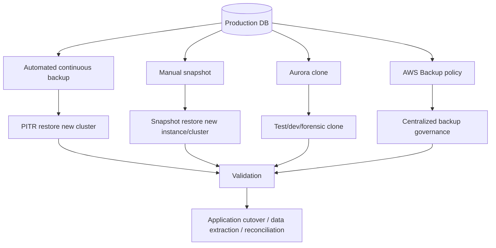
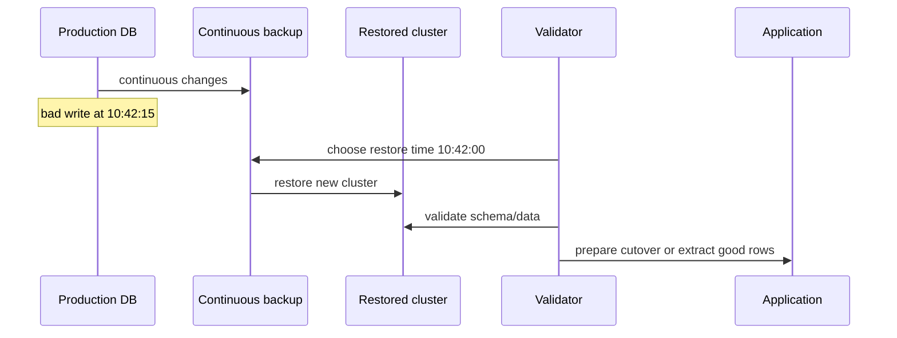
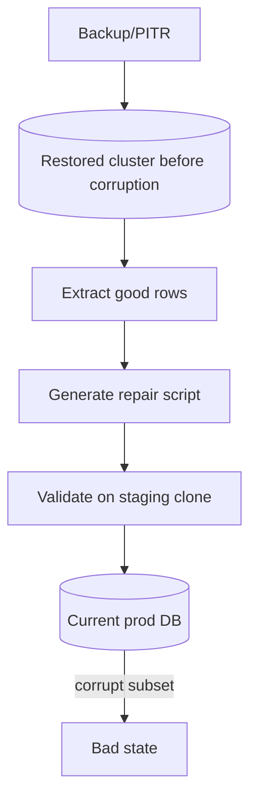
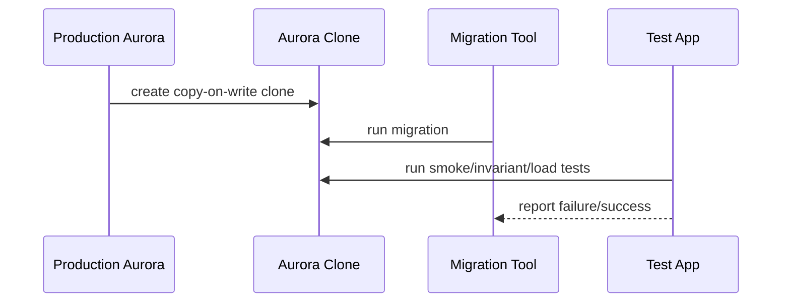
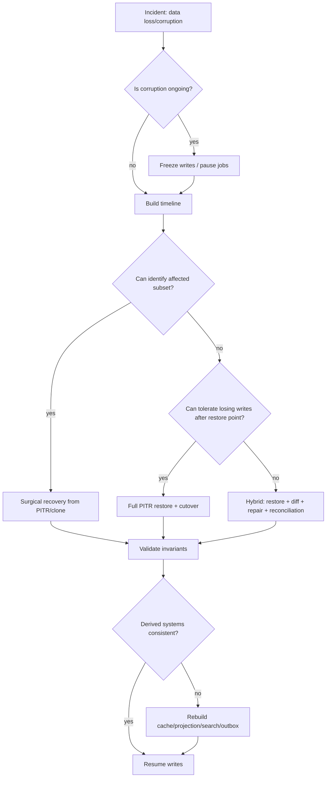

# Part 064 — Backup, Restore, PITR, Snapshot, Clone, and Disaster Recovery Drill

> Target pembelajaran: kamu harus bisa mendesain recovery strategy untuk RDS/Aurora secara production-grade: membedakan backup, snapshot, PITR, clone, retained automated backup, AWS Backup, Backtrack, dan DR drill; menghitung RPO/RTO; membuat runbook restore; dan menguji bahwa backup benar-benar bisa dipakai sebelum incident terjadi.

Backup yang belum pernah di-restore hanyalah asumsi. Snapshot yang tidak punya runbook cutover hanyalah artefak storage. PITR yang tidak diuji dengan aplikasi, secret, endpoint, migration version, dan data reconciliation bukan strategi recovery.

Database recovery adalah engineering discipline. Tujuannya bukan “punya backup”, tetapi bisa menjawab:

- data bisa dikembalikan ke titik waktu mana;
- berapa banyak data boleh hilang;
- berapa lama sistem boleh tidak tersedia;
- siapa yang boleh melakukan restore;
- bagaimana endpoint aplikasi dialihkan;
- bagaimana mencegah restore salah cluster;
- bagaimana memvalidasi data setelah restore;
- bagaimana menangani event/outbox/cache/projection setelah restore;
- bagaimana membuktikan ke auditor bahwa recovery process reliable.

---

## 1. Mental Model: Backup bukan Recovery

Backup adalah bahan mentah. Recovery adalah proses end-to-end.



Important distinction:

| Concept | What it gives you | What it does not give you automatically |
|---|---|---|
| Automated backup | Restore window/PITR | Validated recovery process |
| Manual snapshot | Point-in-time copy kept until deleted | Automatic freshness or cutover |
| PITR | Restore to a time within retention | In-place rollback for normal RDS/Aurora restore |
| Aurora clone | Fast copy-on-write clone | Long-term backup or DR by itself |
| Backtrack | Rewind Aurora MySQL cluster | Universal feature for all engines/use cases |
| AWS Backup | Centralized backup policy/governance | Application-aware recovery correctness |
| Multi-AZ | High availability | Protection from bad writes/user error |
| Read replica | Read scaling/possible promotion | Historical recovery of deleted/corrupted data |

Rule:

> HA protects availability. Backup protects recoverability. Audit protects proof. You need all three for serious systems.

---

## 2. Recovery Objectives: RPO, RTO, RCO

### 2.1 RPO — Recovery Point Objective

RPO menjawab: **berapa banyak data boleh hilang?**

Contoh:

- RPO 24 jam: backup harian cukup secara bisnis.
- RPO 15 menit: perlu continuous backup/PITR atau log shipping strategy.
- RPO near-zero: perlu replication/multi-region/transactional design, bukan hanya snapshot.

### 2.2 RTO — Recovery Time Objective

RTO menjawab: **berapa lama sistem boleh terganggu sampai pulih?**

Contoh:

- RTO 8 jam: manual restore + validation mungkin cukup.
- RTO 1 jam: runbook harus scripted dan diuji.
- RTO menit: perlu standby/replica/failover architecture.

### 2.3 RCO — Recovery Correctness Objective

Tambahan yang sering diabaikan: **seberapa benar state setelah recovery?**

RCO mencakup:

- apakah event/outbox dipublish ulang atau tidak;
- apakah projection/cache/search index konsisten;
- apakah workflow Step Functions masih menunjuk entity yang valid;
- apakah idempotency table ikut restore;
- apakah audit trail utuh;
- apakah external side effect tidak dipanggil ulang salah;
- apakah data yang salah bisa diisolasi tanpa rollback global.

Recovery yang cepat tetapi menghasilkan state bisnis salah tetap gagal.

---

## 3. Automated Backups di Aurora/RDS

Automated backup adalah baseline. Untuk Aurora, automated backups bersifat continuous dan incremental dalam backup retention period, dan dapat dipakai untuk restore ke point in time dalam window tersebut.

### 3.1 Backup retention period

Retention period menentukan berapa lama restore data disimpan. Untuk Aurora, retention dapat dikonfigurasi dari 1 sampai 35 hari.

Pertanyaan desain:

- Apakah 7 hari cukup untuk mendeteksi corruption bisnis?
- Apakah audit/regulatory membutuhkan snapshot lebih lama?
- Apakah aplikasi punya backfill yang bisa memperbaiki derived state?
- Apakah data deletion harus recoverable setelah user/admin mistake?
- Apakah retention berbeda per environment?

### 3.2 Automated backup vs manual snapshot

| Feature | Automated backup | Manual snapshot |
|---|---|---|
| Purpose | PITR dalam retention window | Point-in-time copy eksplisit |
| Lifecycle | Expire sesuai retention | Disimpan sampai dihapus/policy |
| Restore target | New cluster/instance | New cluster/instance |
| Use case | operational recovery | release checkpoint, compliance, migration, forensic |
| Risk | window terlalu pendek | snapshot sprawl/cost/stale |

### 3.3 Restore membuat resource baru

PITR/snapshot restore umumnya membuat DB instance/cluster baru. Ini penting karena recovery bukan sekadar “rollback tombol undo.” Setelah restore, kamu harus menangani:

- endpoint baru;
- security group/subnet group;
- parameter group;
- option group;
- KMS key;
- secrets;
- users/roles;
- app configuration;
- DNS/cutover;
- migration version;
- monitoring/alarm;
- backup policy untuk cluster baru.

---

## 4. Point-in-Time Recovery Pattern

PITR berguna untuk memulihkan database ke waktu sebelum incident.

Contoh incident:

- migration salah menghapus kolom/data;
- batch job salah update status banyak case;
- admin salah import CSV;
- bug aplikasi membuat duplicate/invalid state;
- ransomware/credential compromise;
- application deployment corrupt data.

### 4.1 PITR timeline



### 4.2 Choosing restore time

Memilih restore time bukan selalu mudah. Kamu perlu event timeline:

- deploy time;
- migration start/end;
- first bad write;
- first alert;
- user report;
- batch job logs;
- audit table timestamps;
- CloudTrail/admin action;
- outbox/event publish time;
- external side effect time.

Jika restore terlalu awal, data valid hilang. Jika terlalu lambat, corruption ikut ter-restore.

### 4.3 Full cluster rollback vs surgical recovery

Dua mode utama:

| Mode | Cara | Cocok untuk | Risiko |
|---|---|---|---|
| Full rollback/cutover | Restore cluster baru lalu aplikasi pindah | corruption luas, early incident | kehilangan valid writes setelah restore point |
| Surgical recovery | Restore clone lalu extract/merge rows benar | corruption subset | butuh script aman dan domain validation |

Untuk banyak sistem bisnis, surgical recovery lebih realistis karena tidak semua data setelah incident boleh hilang.

---

## 5. Full Restore Runbook

Ini runbook konseptual. Sesuaikan dengan engine, IaC, organization control, dan compliance.

### 5.1 Declare incident and freeze writes

Tujuan: mencegah kerusakan meluas.

Actions:

- aktifkan incident channel;
- tentukan incident commander;
- freeze write path jika corruption ongoing;
- pause batch/backfill/consumer;
- disable risky scheduled job;
- stop deployment pipeline;
- snapshot current broken state untuk forensic;
- capture CloudWatch/CloudTrail/log context.

Write freeze bisa berbentuk:

- feature flag read-only mode;
- API Gateway throttling/deny write endpoints;
- app-level maintenance mode;
- revoke app write secret sementara;
- pause queue consumers;
- stop Step Functions triggers.

### 5.2 Identify restore point

Data yang diperlukan:

```text
bad_change_detected_at = 2026-07-07T10:45:00Z
suspected_first_bad_write = 2026-07-07T10:42:15Z
safe_restore_candidate = 2026-07-07T10:42:00Z
```

Harus divalidasi dari:

- audit table;
- migration logs;
- app logs;
- deployment event;
- CloudTrail;
- DB slow/query logs jika ada;
- outbox event timestamps.

### 5.3 Restore to new cluster

Pseudo CLI Aurora:

```bash
aws rds restore-db-cluster-to-point-in-time \
  --source-db-cluster-identifier prod-case-db \
  --target-db-cluster-identifier restore-case-db-20260707-104200 \
  --restore-to-time 2026-07-07T10:42:00Z \
  --db-subnet-group-name prod-db-subnet-group \
  --vpc-security-group-ids sg-xxxx \
  --engine aurora-postgresql
```

Lalu buat DB instance di cluster restored jika diperlukan:

```bash
aws rds create-db-instance \
  --db-cluster-identifier restore-case-db-20260707-104200 \
  --db-instance-identifier restore-case-db-20260707-104200-writer \
  --db-instance-class db.r7g.large \
  --engine aurora-postgresql
```

Catatan:

- jangan langsung menghubungkan aplikasi production;
- pastikan security group membatasi akses;
- gunakan tag `purpose=restore-validation`;
- jangan biarkan backup policy hilang jika cluster menjadi production baru.

### 5.4 Validate restored cluster

Validation harus multi-layer.

#### Schema/version validation

```sql
SELECT version, installed_on
FROM flyway_schema_history
ORDER BY installed_rank DESC
LIMIT 10;
```

Pertanyaan:

- apakah schema version cocok dengan app version target?
- apakah migration yang buruk sudah exclude?
- apakah app lama diperlukan untuk membaca schema restored?
- apakah migration perlu forward-fix sebelum cutover?

#### Domain invariant validation

Contoh:

```sql
-- case cannot be closed without final decision
SELECT id
FROM cases
WHERE status = 'CLOSED'
  AND final_decision_id IS NULL;

-- active assignment must have exactly one active owner
SELECT case_id, count(*)
FROM case_assignments
WHERE active = true
GROUP BY case_id
HAVING count(*) <> 1;
```

#### Count/reconciliation validation

```sql
SELECT status, count(*)
FROM cases
GROUP BY status
ORDER BY status;
```

Bandingkan dengan:

- last good dashboard;
- audit log;
- exported report;
- source system;
- domain expected count.

#### Application smoke test

- login test user;
- read key case;
- execute safe read-only endpoint;
- verify permission;
- verify dashboard;
- verify no writes accidentally enabled during validation.

### 5.5 Cutover strategy

Cutover options:

1. Update application secret/endpoint to restored cluster.
2. Update DNS CNAME if app uses internal DB CNAME.
3. Promote restored cluster as new production in IaC state.
4. Keep old cluster read-only for forensic.
5. Rebuild derived systems.

Cutover checklist:

- [ ] app config updated;
- [ ] secrets rotated if needed;
- [ ] migrations aligned;
- [ ] consumers paused/resumed in order;
- [ ] cache cleared;
- [ ] projections rebuilt or reconciled;
- [ ] search index refreshed;
- [ ] outbox handling decided;
- [ ] dashboards/alarms point to new cluster;
- [ ] backup retention enabled;
- [ ] old cluster protected from accidental writes.

---

## 6. Surgical Recovery Pattern

Surgical recovery menghindari full rollback ketika hanya subset data corrupt.



### 6.1 Example: wrong assignment batch

Bug:

```text
Batch job assigned 12,483 cases to wrong officer.
Incident started at 10:42:15.
Only cases touched by job are corrupt.
Valid user writes after 10:42 must be preserved.
```

Surgical process:

1. restore cluster to 10:42:00;
2. identify affected case IDs from current prod audit/job logs;
3. extract correct assignment from restored cluster;
4. generate repair commands;
5. validate on clone/current snapshot;
6. apply repair in batches;
7. append audit repair events;
8. publish correction events;
9. reconcile projections/cache/search.

### 6.2 Repair script discipline

Bad repair:

```sql
UPDATE cases SET owner_id = 'old-owner' WHERE updated_at > '2026-07-07T10:42:15Z';
```

Too broad. It can overwrite valid user changes.

Better:

```sql
CREATE TEMP TABLE repair_case_owner (
  case_id uuid PRIMARY KEY,
  expected_current_owner uuid NOT NULL,
  restored_owner uuid NOT NULL
);

-- load generated rows from restore analysis

UPDATE cases c
SET owner_id = r.restored_owner,
    updated_at = now(),
    version = version + 1
FROM repair_case_owner r
WHERE c.id = r.case_id
  AND c.owner_id = r.expected_current_owner;
```

Then verify:

```sql
SELECT r.case_id
FROM repair_case_owner r
JOIN cases c ON c.id = r.case_id
WHERE c.owner_id <> r.restored_owner;
```

### 6.3 Audit and event correction

For regulated systems, repair is a business event.

Insert audit:

```sql
INSERT INTO case_audit_events (
  id,
  case_id,
  event_type,
  reason,
  actor,
  occurred_at,
  metadata
)
SELECT gen_random_uuid(),
       case_id,
       'CASE_OWNER_REPAIRED',
       'Incident INC-2026-07-07 wrong assignment batch repair',
       'system:incident-repair',
       now(),
       jsonb_build_object('incidentId', 'INC-2026-07-07')
FROM repair_case_owner;
```

Publish correction events through outbox, not direct ad hoc publish:

```sql
INSERT INTO outbox_events(id, aggregate_id, event_type, payload, created_at)
SELECT gen_random_uuid(),
       case_id,
       'CaseOwnerRepaired',
       jsonb_build_object('incidentId', 'INC-2026-07-07'),
       now()
FROM repair_case_owner;
```

---

## 7. Aurora Clone

Aurora clone creates a copy-on-write cluster. Initial clone is fast and storage-efficient because source and clone share underlying pages until either side modifies data.

Good uses:

- test migration against production-like data;
- validate repair script;
- forensic investigation;
- performance test query/index;
- temporary analytics;
- developer debugging with sanitized data;
- blue/green-ish database experiment with caution.

Not good as sole strategy for:

- long-term backup;
- compliance retention;
- cross-account immutable backup;
- disaster recovery by itself;
- protection from source/account compromise unless isolated.

### 7.1 Clone safety checklist

- [ ] Clone security group restricts access.
- [ ] Clone credentials separated.
- [ ] PII masking/sanitization applied if used outside prod boundary.
- [ ] Background jobs disabled.
- [ ] Outbox publisher disabled.
- [ ] External integrations disabled.
- [ ] Cost expiry tag set.
- [ ] Data classification tag applied.
- [ ] Destruction date defined.

### 7.2 Clone for migration test

Flow:



This is safer than running first-time migration on production.

---

## 8. Backtrack for Aurora MySQL

Backtrack lets Aurora MySQL-Compatible cluster rewind to a specific time without restoring from backup. It is useful for quickly undoing mistakes or testing data changes.

Important boundaries:

- Aurora MySQL only, not universal across all Aurora engines;
- must be enabled/configured;
- rewinds existing cluster, so it affects current database state;
- not substitute for backup retention or immutable snapshot;
- can be useful for non-production/test or carefully controlled production use cases.

Decision:

| Need | Better tool |
|---|---|
| Undo recent test change on Aurora MySQL dev cluster | Backtrack |
| Recover production corruption while preserving valid later writes | PITR + surgical recovery |
| Long-term retention | Manual snapshot/AWS Backup |
| Cross-account immutable backup | AWS Backup/copy policy |
| PostgreSQL cluster recovery | PITR/snapshot/clone, not Backtrack |

---

## 9. AWS Backup and Governance

AWS Backup is useful when organization needs centralized backup policy, retention, vaulting, cross-account/cross-region copy, audit, and governance across services.

Database engineers still need application-aware runbooks.

Central policy can answer:

- are backups configured;
- are backups retained;
- are backups encrypted;
- are backups copied;
- who can delete recovery points;
- compliance status.

It does not answer by itself:

- which restore time avoids corruption;
- whether restored schema matches app;
- how to replay outbox;
- how to rebuild OpenSearch projection;
- whether idempotency table should be restored;
- whether legal audit state is complete.

---

## 10. Backup Security Model

Backup is sensitive. It contains production data, historical deleted data, and sometimes data that users believe is gone from active system.

Controls:

- encryption with KMS;
- least privilege restore permissions;
- separation between snapshot creation and deletion;
- backup vault lock if required;
- cross-account copy for blast-radius reduction;
- CloudTrail monitoring for snapshot export/copy/delete;
- tag-based access control;
- data classification tags;
- restore approval workflow;
- masking for non-prod restore;
- deletion retention policy aligned with legal/regulatory needs.

Threat model:

| Threat | Control |
|---|---|
| Accidental deletion of backup | retention, vault lock, limited IAM |
| Malicious insider restores data to weak environment | IAM, approval, CloudTrail, VPC/security group restriction |
| Ransomware deletes database and backups | cross-account immutable backup policy |
| PII leak from dev clone | masking, isolated account, no broad access |
| Restore wrong snapshot | naming, tags, approval, validation gate |

---

## 11. Application Recovery Beyond Database

Database restore can break surrounding systems.

### 11.1 Outbox

If database is restored to earlier point, outbox state may roll back.

Scenarios:

1. Event was published externally, but restored DB says it was not.
2. Event was not published, but restored DB says it should be.
3. Event was published and side effect executed, but idempotency record disappeared.

Mitigation:

- event IDs deterministic where possible;
- outbox publisher idempotent;
- external consumers idempotent;
- event ledger/audit independent when required;
- recovery runbook includes outbox reconciliation.

### 11.2 Queues

SQS/EventBridge may still contain messages from after restore point.

Actions:

- pause consumers during restore;
- inspect DLQ/main queue age;
- decide purge/replay/re-drive;
- validate idempotency table state;
- avoid processing future messages against older DB state.

### 11.3 Step Functions

Long-running workflows may reference state that changed during restore.

Actions:

- list running executions;
- stop/pause risky executions;
- reconcile workflow state with restored DB;
- restart from domain commands if needed;
- record incident repair event.

### 11.4 Cache and projections

After restore/cutover:

- clear cache;
- rebuild read model if source-of-truth changed;
- rebuild OpenSearch index;
- invalidate user sessions if permission state changed;
- verify dashboard counts.

---

## 12. Recovery Drill

A recovery strategy is only real after a drill.

### 12.1 Quarterly drill structure

1. Pick a production-like cluster or sanitized clone.
2. Define incident scenario.
3. Restore to point in time.
4. Validate schema and domain invariants.
5. Run app smoke test.
6. Rebuild projections/cache.
7. Measure actual RTO.
8. Measure actual data loss window/RPO.
9. Update runbook.
10. Record evidence.

### 12.2 Drill scenario examples

- accidental table truncate;
- bad migration deletes data;
- batch job corrupts subset;
- wrong tenant data import;
- permission table bad update;
- lost KMS/secret access simulation;
- restore into isolated account;
- failover plus restore combined;
- restore and rebuild search index.

### 12.3 Drill evidence

Store:

- date/time;
- participants;
- cluster/snapshot identifiers;
- restore command/log;
- validation SQL results;
- app smoke test results;
- RTO observed;
- RPO observed;
- issues found;
- runbook changes;
- sign-off.

This is critical for audit and operational maturity.

---

## 13. Restore Validation SQL Pack

Create a small validation suite per service.

Example: enforcement lifecycle.

```sql
-- 1. No case in impossible status
SELECT id, status
FROM cases
WHERE status NOT IN ('DRAFT', 'OPEN', 'UNDER_REVIEW', 'ESCALATED', 'CLOSED', 'CANCELLED');

-- 2. Closed case must have final decision
SELECT id
FROM cases
WHERE status = 'CLOSED'
  AND final_decision_id IS NULL;

-- 3. Deadline cannot exist without owning case
SELECT d.id
FROM deadlines d
LEFT JOIN cases c ON c.id = d.case_id
WHERE c.id IS NULL;

-- 4. One active assignment max per case
SELECT case_id, count(*)
FROM case_assignments
WHERE active = true
GROUP BY case_id
HAVING count(*) > 1;

-- 5. Outbox unpublished too old
SELECT count(*)
FROM outbox_events
WHERE published_at IS NULL
  AND created_at < now() - interval '10 minutes';
```

Validation result should be machine-readable:

```json
{
  "restoreId": "restore-case-db-20260707-104200",
  "schemaVersion": "2026.07.07.12",
  "checks": [
    {"name": "closed_case_has_decision", "violations": 0},
    {"name": "one_active_assignment", "violations": 0}
  ],
  "readyForCutover": true
}
```

---

## 14. IaC and Naming Discipline

Bad names cause incidents.

Avoid:

```text
restore-db
new-prod-db
backup-test
```

Prefer:

```text
restore-case-prod-20260707-104200-inc1234
snapshot-case-prod-pre-migration-20260707-v42
clone-case-prod-migration-test-20260707-expire-20260710
```

Tags:

```yaml
Tags:
  system: case-management
  environment: restore-validation
  source-cluster: case-prod
  incident-id: INC-2026-07-07
  restore-point: '2026-07-07T10:42:00Z'
  owner: platform-db
  data-classification: confidential
  expires-at: '2026-07-14'
```

IaC considerations:

- production cluster should not be manually replaced without state update;
- restored cluster should have explicit stack or documented exception;
- alarms/dashboards must be recreated or retargeted;
- DNS cutover should be controlled;
- parameter groups should match expected production settings;
- deletion protection should be enabled only after role is clear.

---

## 15. Cost Model

Backup/recovery cost hides in several places:

- backup storage;
- retained snapshots;
- cross-Region copy;
- restored cluster runtime;
- clone divergence storage;
- extra instances for validation;
- data transfer;
- AWS Backup vault/storage;
- long-running forensic environments;
- rebuild of projections/search.

Cost controls:

- expiry tags;
- automated cleanup for non-prod clones;
- snapshot lifecycle policy;
- separate long-term compliance retention;
- do not keep restored clusters running without owner;
- monitor backup storage growth;
- review manual snapshots monthly.

But do not over-optimize backup cost into unacceptable RPO/RTO risk.

---

## 16. Common Failure Modes

### 16.1 Backup exists but restore IAM denied

Runbook fails because operator lacks permission. Drill should catch this.

### 16.2 Restore works but app cannot connect

Security group/subnet/KMS/secret mismatch.

### 16.3 Restore works but app version incompatible

Schema restored before migration, app expects after migration. Need app rollback or forward migration.

### 16.4 Restore works but projections are wrong

OpenSearch/cache/read model still reflects corrupt future state.

### 16.5 Restore works but outbox duplicates side effects

Published events roll back to unpublished. Publisher republishes. Consumer must be idempotent.

### 16.6 Snapshot restored into non-prod leaks data

Clone/restore should follow data classification and masking policy.

### 16.7 No one knows safe restore time

Need audit logs, deployment logs, batch job logs, and business timeline.

### 16.8 Retention window too short

Corruption discovered after PITR window. Need manual snapshots, AWS Backup retention, or domain-level audit repair.

---

## 17. Recovery Strategy Decision Tree



---

## 18. Production Readiness Checklist

Before production:

- [ ] Backup retention period explicitly set.
- [ ] Manual snapshot policy defined for release/migration checkpoints.
- [ ] AWS Backup/vault/cross-account strategy evaluated.
- [ ] Restore runbook exists.
- [ ] Restore drill performed at least once.
- [ ] RPO/RTO documented per workload.
- [ ] Recovery correctness checks defined.
- [ ] Validation SQL pack committed in repo.
- [ ] Schema migration compatibility plan exists.
- [ ] Outbox/queue/workflow recovery behavior documented.
- [ ] Cache/projection/search rebuild runbook exists.
- [ ] Restore IAM permissions tested.
- [ ] KMS and secret access tested.
- [ ] Snapshot/clone naming and tagging standard used.
- [ ] Data masking policy for non-prod restore/clone defined.
- [ ] Cost cleanup policy for clones/restores exists.
- [ ] CloudTrail monitoring for snapshot copy/delete/export enabled.
- [ ] Incident timeline template prepared.
- [ ] Legal/audit retention requirements mapped to backup policy.

---

## 19. Exercise: Design Recovery for a Bad Migration

Scenario:

```text
At 09:00, migration v20260707_01 was deployed.
At 09:12, support reported missing case assignment history.
At 09:20, engineer found migration accidentally deleted inactive assignment rows.
From 09:00 to 09:20, valid users created 300 new cases and updated 1,200 existing cases.
```

Design:

1. Full rollback or surgical recovery?
2. Restore point candidate?
3. How to identify deleted rows?
4. How to preserve valid writes after 09:00?
5. What validation SQL is needed?
6. What outbox events must be published?
7. What projections/caches/search indexes must be rebuilt?
8. What audit entry records the repair?
9. What RTO/RPO is realistic?
10. What test prevents recurrence?

Expected conclusion: surgical recovery is likely better than full rollback because many valid writes happened after the bad migration.

---

## 20. Ringkasan

Backup/restore adalah bagian dari correctness architecture, bukan checklist infrastruktur.

Hal yang harus tertanam:

- backup bukan recovery sampai restore diuji;
- PITR restore biasanya membuat cluster/instance baru;
- RPO/RTO harus disepakati dengan domain, bukan ditebak platform team;
- RCO penting: state setelah restore harus benar secara bisnis;
- surgical recovery sering lebih baik daripada full rollback;
- Aurora clone sangat berguna untuk validation, migration test, dan forensic;
- Backtrack berguna tetapi terbatas untuk Aurora MySQL dan bukan pengganti backup;
- restore harus melibatkan app config, secret, endpoint, schema, outbox, queues, workflow, cache, projection, search, and audit;
- runbook harus diuji dalam drill reguler.

> Database engineer yang matang tidak berkata “kita punya snapshot.” Ia berkata “kita pernah restore, mengukur RTO, memvalidasi invariant, dan tahu apa yang terjadi pada event, queue, cache, serta workflow setelah cutover.”

---

## References

- AWS Documentation — Overview of backing up and restoring an Aurora DB cluster: https://docs.aws.amazon.com/AmazonRDS/latest/AuroraUserGuide/Aurora.Managing.Backups.html
- AWS Documentation — Restoring an Aurora DB cluster to a specified time: https://docs.aws.amazon.com/AmazonRDS/latest/AuroraUserGuide/aurora-pitr.html
- AWS CLI Reference — restore-db-cluster-to-point-in-time: https://docs.aws.amazon.com/cli/latest/reference/rds/restore-db-cluster-to-point-in-time.html
- AWS Documentation — Restoring a DB instance to a specified time for Amazon RDS: https://docs.aws.amazon.com/AmazonRDS/latest/UserGuide/USER_PIT.html
- AWS Documentation — Restoring from a DB snapshot: https://docs.aws.amazon.com/AmazonRDS/latest/UserGuide/USER_RestoreFromSnapshot.html
- AWS Documentation — Cloning a volume for an Amazon Aurora DB cluster: https://docs.aws.amazon.com/AmazonRDS/latest/AuroraUserGuide/Aurora.Managing.Clone.html
- AWS Documentation — Backtracking an Aurora DB cluster: https://docs.aws.amazon.com/AmazonRDS/latest/AuroraUserGuide/AuroraMySQL.Managing.Backtrack.html
- AWS Documentation — Understanding Aurora backup storage usage: https://docs.aws.amazon.com/AmazonRDS/latest/AuroraUserGuide/aurora-storage-backup.html
- AWS Documentation — Retaining automated backups for Aurora: https://docs.aws.amazon.com/AmazonRDS/latest/AuroraUserGuide/Aurora.Managing.Backups.Retaining.html
