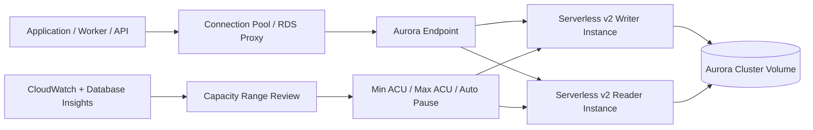
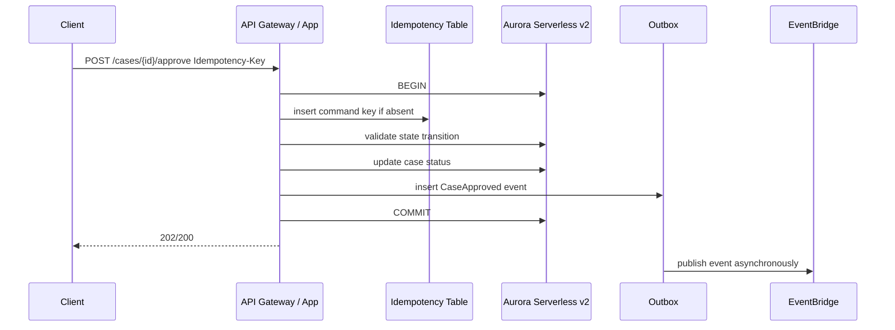
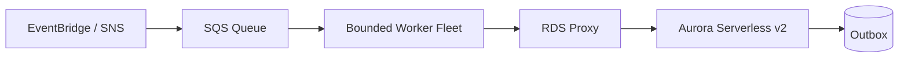
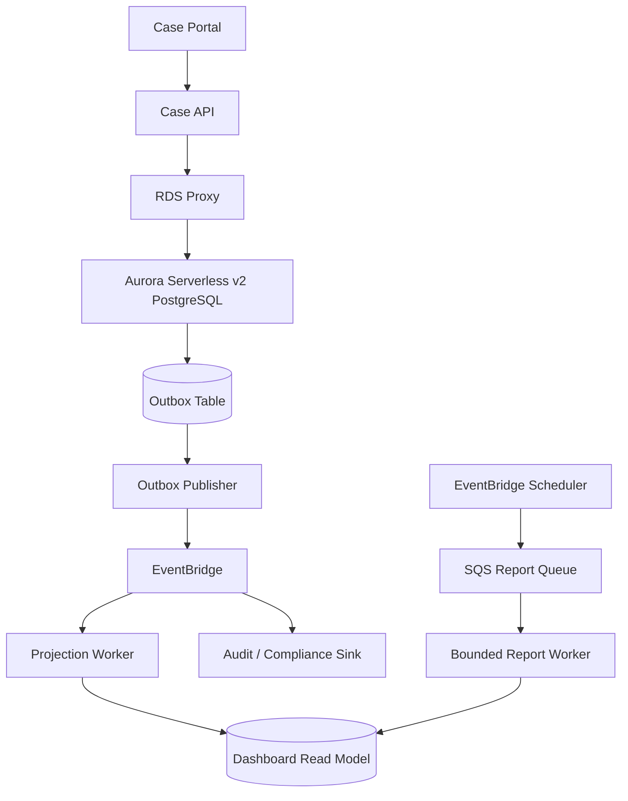

# Part 065 — Aurora Serverless v2

> Goal: setelah bagian ini, kamu tidak melihat Aurora Serverless v2 sebagai “Aurora yang otomatis murah”, tetapi sebagai **relational database capacity model** dengan scaling semantics, connection behavior, failover behavior, warm/cold characteristics, dan cost envelope yang harus didesain secara eksplisit.

Aurora Serverless v2 bukan database baru. Ia adalah **Aurora cluster** dengan DB instance class `db.serverless`, di mana kapasitas compute dapat naik/turun dalam rentang ACU yang ditentukan. Storage, replication, transaction semantics, SQL engine behavior, schema design, locks, indexes, connection pressure, slow query, dan failover tetap perlu dipahami seperti Aurora biasa.

Yang berubah adalah cara kita membeli dan mengelola compute capacity.



The top 1% mental model is simple:

> Aurora Serverless v2 scales **capacity**, not bad data modeling, not unbounded connections, not missing indexes, not lock contention, and not unbounded tenant skew.

---

## 1. What Aurora Serverless v2 Actually Is

Aurora Serverless v2 is an Aurora capacity mode where each serverless DB instance scales within a configured capacity range.

Key primitives:

| Primitive | Meaning | Production Implication |
|---|---|---|
| ACU | Aurora Capacity Unit. Roughly maps to memory plus corresponding CPU/network resources. | Capacity planning is still required. |
| Minimum ACU | Lowest capacity the instance may scale down to. | Controls baseline latency, connection capacity, and idle cost. |
| Maximum ACU | Highest capacity the instance may scale up to. | Controls blast radius and cost ceiling. |
| `db.serverless` | DB instance class for Aurora Serverless v2. | Instance is still an Aurora DB instance in a cluster. |
| Writer instance | Accepts writes. | Still the primary transaction bottleneck for single-writer Aurora. |
| Reader instance | Handles reads if configured. | Scaling readers does not solve write bottlenecks. |
| Auto pause | Optional ability to scale to 0 ACU for supported versions/configurations. | Useful for dev/test and low-duty workloads, risky for latency-sensitive production paths. |

A mistake many teams make:

```txt
Aurora Serverless v2 = no capacity planning
```

Better framing:

```txt
Aurora Serverless v2 = elastic capacity range + managed Aurora semantics + operational guardrails
```

---

## 2. When Aurora Serverless v2 Is a Good Fit

Use it when workload demand is relational but compute demand is irregular.

Good candidates:

1. SaaS workloads with spiky tenant activity.
2. Internal business systems with heavy office-hour usage and low night usage.
3. APIs where traffic grows unpredictably but correctness needs SQL transactions.
4. Environments that must remain available but do not justify fixed peak compute 24/7.
5. Developer/staging/test environments where idle cost matters.
6. Mixed workloads where reads/writes are relational, but peaks are uneven.
7. Low-to-medium traffic production systems that sometimes burst.

Poor candidates:

1. Extremely latency-sensitive workloads where scale-up delay is unacceptable.
2. Workloads requiring predictable dedicated compute at all times.
3. Systems with constant high utilization where provisioned instances are cheaper/simpler.
4. Applications with uncontrolled connection storms.
5. Schemas with severe lock contention, missing indexes, or hot rows.
6. Multi-tenant systems where one tenant can monopolize writer capacity.
7. Workloads expecting Serverless v2 to replace database design.

Decision heuristic:

```txt
If demand is variable and SQL correctness matters, evaluate Aurora Serverless v2.
If demand is flat and high, compare against provisioned Aurora.
If query shape is not relational, do not force Aurora just because it scales.
```

---

## 3. ACU Capacity Range as a Contract

The capacity range is not a minor setting. It is a contract between application behavior and database capacity.

```txt
minimum ACU = baseline readiness
maximum ACU = blast radius and peak budget
```

### Minimum ACU

A low minimum saves cost but can increase risk:

- less warm capacity;
- fewer available resources for sudden bursts;
- lower connection headroom;
- slower perceived recovery from idle;
- more sensitivity to simultaneous cold traffic.

A higher minimum costs more but gives:

- better baseline latency;
- more stable connection capacity;
- more room for background tasks;
- less sensitivity to scale-up lag;
- more predictable production behavior.

### Maximum ACU

A high maximum gives elasticity but can hide architectural problems:

- missing indexes become expensive instead of immediately painful;
- tenant skew becomes a cost spike;
- batch jobs can consume enormous capacity;
- accidental full scans can burn budget quickly;
- database-level backpressure becomes less visible until cost arrives.

A low maximum protects budget but can throttle growth:

- requests hit database saturation earlier;
- queue lag rises;
- API p95/p99 latency increases;
- lock waits and connection waits become visible;
- the app may fail safer, but fail sooner.

### A Better Rule

Do not choose min/max ACU from vibes. Choose it from evidence:

```txt
min ACU = enough to handle baseline + safety margin
max ACU = enough to handle expected peak + controlled burst, not infinite mistakes
```

---

## 4. Scaling Semantics: What Actually Scales

Aurora Serverless v2 scales compute capacity. It does not repartition your relational model.

It can help with:

- CPU-bound query bursts;
- memory pressure from active working set;
- moderate traffic spikes;
- temporary connection/workload increase;
- scheduled or organic usage bursts.

It does not directly solve:

- long row locks;
- deadlocks;
- poor transaction boundaries;
- hot counter rows;
- missing indexes;
- unbounded query result sets;
- table bloat;
- bad vacuum behavior;
- serializable retry storms;
- external API calls inside DB transactions;
- one writer becoming the unavoidable bottleneck.

The most important failure mode:

```txt
Database scales up because the workload is inefficient.
Team celebrates "no outage".
Finance sees the bill.
Latency is still unstable.
Root cause remains.
```

Serverless capacity should be treated as a **shock absorber**, not as a substitute for workload engineering.

---

## 5. Auto Pause and Scale-to-Zero

Aurora Serverless v2 can support scaling down to zero ACUs for eligible configurations. This is useful, but dangerous when misunderstood.

Auto pause is good for:

- dev/test environments;
- demos;
- low-duty internal tools;
- experimental workloads;
- scheduled jobs where startup latency is acceptable;
- disaster recovery standby patterns where workload is normally idle, if validated.

Auto pause is risky for:

- user-facing API paths;
- synchronous checkout/payment/approval flows;
- latency-sensitive dashboards;
- consumers with strict SLA;
- workloads with connection warm-up assumptions;
- systems with health checks that accidentally prevent pause;
- systems with health checks that fail during resume.

Important operational questions:

1. What happens to the first request after pause?
2. Does the app retry safely during resume?
3. Do clients have long enough timeout budgets?
4. Does RDS Proxy interact with pause/resume as expected?
5. Are synthetic health checks keeping the DB awake?
6. Do scheduled maintenance jobs unexpectedly wake the cluster?
7. Are alarms aware of paused state?

A safe default:

```txt
Production user-facing writer: usually do not use scale-to-zero unless explicitly tested.
Non-prod or low-duty tools: scale-to-zero can be excellent.
```

---

## 6. Provisioned Aurora vs Aurora Serverless v2

| Dimension | Provisioned Aurora | Aurora Serverless v2 |
|---|---|---|
| Capacity model | Fixed instance class | ACU range |
| Predictability | High | High if min/max tuned; variable if too low |
| Idle cost | Fixed | Can scale down; sometimes to zero |
| Burst handling | Needs headroom or scaling operation | Automatic within configured range |
| Cost control | Instance-based | Capacity-range-based |
| Operational simplicity | Simple when workload stable | Simple when workload variable, but requires metric review |
| Failure mode | Under/over-provisioning | Under/over-range, scaling lag, cost spikes |
| Best for | Stable known workloads | Variable relational workloads |

Decision rule:

```txt
If you can accurately predict and saturate capacity, provisioned can be simpler.
If demand is variable and correctness needs relational SQL, Serverless v2 is attractive.
```

---

## 7. Connection Management Still Matters

Aurora Serverless v2 does not remove the need for connection discipline.

Bad pattern:

```txt
Lambda burst -> each invocation opens DB connection -> Aurora scales -> max connections hit -> API fails
```

Better pattern:

```txt
Lambda/API/Worker -> RDS Proxy or disciplined pool -> bounded concurrency -> Aurora
```

### Why Connection Storms Hurt

Connections consume server resources. Even if compute can scale, connection creation and session state still create pressure.

Symptoms:

- high connection count;
- connection borrow latency;
- timeouts acquiring DB connection;
- high CPU from connection churn;
- database scaling but app still timing out;
- pinned proxy connections;
- too many idle connections.

### ECS / Long-Running Service Rule

Use a bounded pool per instance:

```txt
max_pool_size_per_task * number_of_tasks <= safe_database_connection_budget
```

Example:

```txt
Aurora safe app connections: 600
ECS tasks: 20
Max pool per task: <= 30
Reserve capacity for migrations, admin, monitoring, workers.
```

### Lambda Rule

Avoid one physical DB connection per invocation when concurrency can spike.

Prefer:

- RDS Proxy;
- bounded reserved concurrency;
- async queue buffering;
- command API with idempotency;
- short transactions;
- connection reuse when runtime allows;
- no long-running SQL inside synchronous API path.

---

## 8. RDS Proxy With Aurora Serverless v2

RDS Proxy is often paired with Aurora Serverless v2 when applications are bursty, especially serverless compute.

It can help with:

- connection pooling;
- connection reuse;
- smoothing bursts;
- reducing database connection churn;
- failover handling;
- protecting the DB from direct client stampede.

It does not solve:

- inefficient SQL;
- transaction locks;
- unbounded result sets;
- bad pool sizing;
- long transactions;
- session pinning;
- lack of application-level backpressure.

### Session Pinning Trap

Proxy multiplexing is limited when sessions are pinned. Pinning can happen due to session state or features that require a client connection to stay tied to a DB connection.

Production checklist:

- avoid unnecessary session variables;
- avoid long transactions;
- avoid temporary-table-heavy request paths;
- check pinned connection metrics;
- keep transaction scope minimal;
- use connection initialization SQL carefully;
- test failover with proxy in the loop.

---

## 9. Scaling Is Not Instant Capacity Magic

Aurora Serverless v2 scaling is much more granular than Aurora Serverless v1, but it still has operational behavior.

Do not assume:

```txt
Traffic spike arrives -> DB instantly has exactly the capacity required -> no latency impact
```

Better assumption:

```txt
Traffic spike arrives -> DB capacity reacts within engine/service constraints -> app must absorb transient pressure
```

That means application design still needs:

- timeout budget;
- retry with backoff;
- queue buffering for async work;
- API throttling;
- circuit breaker;
- load shedding;
- tenant limits;
- read/write separation;
- bounded batch jobs.

Serverless scaling and application backpressure are complementary, not alternatives.

---

## 10. Workload Patterns

### Pattern A — Spiky API With Relational Commands



Why Serverless v2 fits:

- traffic can burst;
- correctness needs SQL transaction;
- outbox avoids dual-write failure;
- max ACU protects peak capacity;
- min ACU keeps baseline readiness.

Risk:

- if approval command locks hot aggregate rows, scaling will not remove contention.

---

### Pattern B — Office-Hour Internal System

Workload:

```txt
08:00-18:00 heavy usage
18:00-08:00 low usage
Weekend low usage
Month-end spike
```

Serverless v2 can reduce idle over-provisioning.

Still required:

- scheduled report throttling;
- query performance monitoring;
- connection pool limits;
- capacity range review near month-end;
- alarms on ACU near max.

---

### Pattern C — Burst Worker Writes



This pattern is safer than synchronous burst writes because SQS absorbs pressure.

Critical controls:

- worker concurrency limit;
- queue age alarm;
- database ACU alarm;
- lock wait alarm;
- DLQ for poison messages;
- idempotent worker;
- batch size tuned to transaction time.

---

## 11. Serverless v2 and Multi-Tenant Systems

Multi-tenant workloads often look variable, which makes Aurora Serverless v2 attractive. But tenant skew can create a hidden problem.

Bad assumption:

```txt
Serverless capacity solves noisy tenant issues.
```

Reality:

```txt
Serverless capacity may let noisy tenants consume more resources before being stopped.
```

Tenant controls needed:

| Control | Purpose |
|---|---|
| Tenant rate limit | Prevent one tenant from consuming all API capacity |
| Query guardrails | Prevent tenant-specific full scans |
| Worker partitioning | Prevent one tenant from filling queue capacity |
| Tenant-level metrics | Attribute cost/latency to tenant |
| Budget alarms | Detect capacity expansion caused by few tenants |
| Row-level access/index design | Prevent tenant filter from becoming scan |

For regulatory/case-management systems, tenant skew is common:

- one agency uploads a large case file batch;
- one investigation creates many relationship records;
- one enforcement campaign runs many approvals;
- one reporting user executes broad queries.

Serverless capacity should be paired with tenant isolation strategy.

---

## 12. Cost Model Traps

Aurora Serverless v2 can reduce cost for variable workloads, but it can also increase cost silently.

### Trap 1 — Max ACU Too High

```txt
A bad query runs frequently.
Aurora scales up.
Everything “works”.
Cost rises.
```

Mitigation:

- max ACU as guardrail;
- query plan regression test;
- CloudWatch alarm on ACU utilization;
- Database Insights/Performance Insights review;
- tenant cost attribution.

### Trap 2 — Minimum ACU Too High Everywhere

If every dev/test/preview environment uses high minimum ACU, cost grows across environments.

Mitigation:

- environment-specific min/max;
- auto pause for non-prod;
- scheduled teardown for ephemeral environments;
- IaC defaults that force explicit production override.

### Trap 3 — Batch Jobs Trigger Scaling

A nightly report can consume high ACU even if user traffic is low.

Mitigation:

- run reports against replica or projection;
- throttle batch jobs;
- bound query windows;
- schedule during low user load;
- materialize read models;
- use Athena/Redshift/OpenSearch if relational OLTP is the wrong target.

### Trap 4 — Missing Index Hidden by Scaling

Serverless v2 makes inefficient queries survive longer.

Mitigation:

- slow query review;
- plan diff in CI for critical queries;
- query budget per endpoint;
- alarm on scanned rows / rows returned ratio where available;
- regular index hygiene.

---

## 13. Observability for Aurora Serverless v2

Minimum dashboard:

| Signal | Why It Matters |
|---|---|
| ACU utilization / capacity | Shows scaling behavior and ceiling pressure |
| CPU utilization | Detects CPU-bound workload |
| Database connections | Detects connection storms |
| Connection borrow latency | Detects pool/proxy pressure |
| DB load / wait events | Reveals bottleneck class |
| Read/write latency | User-visible database latency |
| Deadlocks | Transaction design issue |
| Lock waits | Contention issue not solved by scaling |
| Replica lag | Read scaling correctness risk |
| Freeable memory | Working set pressure |
| Commit latency | Storage/replication/write path pressure |
| Query latency p95/p99 | Application SLO impact |

Critical alarms:

```txt
ACU near max for sustained period
DB connections near safe limit
Connection borrow latency high
DB load > vCPU-equivalent capacity
Lock wait spike
Deadlock spike
Replica lag exceeds staleness budget
Oldest SQS message age increasing while DB saturated
API p99 increases with DB wait events
```

Do not alert only on CPU. Many database incidents are lock, I/O, connection, or query-plan incidents.

---

## 14. ACU Range Tuning Loop

A practical operating loop:

```txt
1. Start with conservative min/max range.
2. Run realistic load test.
3. Observe ACU, DB load, waits, query latency, connection pressure.
4. Fix bad queries and locks first.
5. Adjust max ACU only after workload is sane.
6. Adjust min ACU based on baseline latency and burst tolerance.
7. Re-test failover, resume, burst, and replay scenarios.
8. Record decision in ADR.
```

Example review table:

| Observation | Likely Meaning | Action |
|---|---|---|
| ACU at max + CPU high | Legit compute pressure or bad query | Inspect top SQL |
| ACU at max + lock waits high | Contention | Fix transaction/locking |
| ACU low + latency high | Not capacity issue | Check locks, network, query plan, app pool |
| Connections high + DB idle | Pool misconfiguration | Reduce pool size / use proxy |
| Queue age rising + ACU max | DB bottleneck | Throttle workers, optimize writes, raise max only if valid |
| Cost spike + no traffic spike | Background job/query regression | Investigate scheduled work |

---

## 15. Failover and Serverless v2

Aurora failover still matters. Serverless capacity mode does not remove cluster topology.

Questions to test:

1. What happens to in-flight transactions during writer failover?
2. Does the app retry commit ambiguity safely?
3. Does RDS Proxy shorten recovery or hide details?
4. Are DNS/client caches respecting endpoint behavior?
5. Do prepared statements/session state survive as expected?
6. Does application pool evict broken connections?
7. Are idempotency keys used for retried commands?
8. Are outbox events published exactly once at business level?

Failover-safe command handler:

```java
public ApiResponse approveCase(ApproveCaseCommand cmd) {
    return retryDatabaseTransaction(() -> {
        // Idempotency table protects against retry after ambiguous commit.
        CommandRecord record = commandStore.getOrCreate(cmd.idempotencyKey(), hash(cmd));

        if (record.isCompleted()) {
            return record.cachedResponse();
        }

        Case c = caseRepository.lockById(cmd.caseId());
        c.approve(cmd.actor(), cmd.reason());

        caseRepository.save(c);
        outbox.insert(Event.caseApproved(c.id(), cmd.idempotencyKey()));
        commandStore.complete(cmd.idempotencyKey(), responseFor(c));

        return responseFor(c);
    });
}
```

The key is not “retry everything”. The key is:

```txt
retry only when operation is safe to retry because idempotency and transaction boundary are explicit
```

---

## 16. Deployment and IaC Defaults

Good IaC modules should force explicit capacity decisions.

Example shape:

```ts
interface AuroraServerlessV2Config {
  environment: "dev" | "staging" | "prod";
  minAcu: number;
  maxAcu: number;
  autoPauseEnabled: boolean;
  autoPauseSeconds?: number;
  deletionProtection: boolean;
  backupRetentionDays: number;
  performanceInsightsOrDatabaseInsightsEnabled: boolean;
  proxyEnabled: boolean;
  alarmsEnabled: boolean;
}
```

Bad module default:

```txt
minAcu = 0
maxAcu = 256
autoPause = true
alarms = false
```

Better module discipline:

```txt
production requires explicit min/max
production autoPause requires explicit approval
maxAcu requires budget tag
Database Insights/metrics enabled by default
RDS Proxy decision explicit
backup/PITR explicit
alarms mandatory
```

---

## 17. Migration From Provisioned Aurora to Serverless v2

Migration checklist:

1. Confirm engine/version support.
2. Confirm workload is variable enough to justify capacity mode.
3. Capture baseline metrics from provisioned cluster.
4. Identify peak CPU/memory/connection usage.
5. Identify top SQL and wait events.
6. Define min/max ACU from evidence.
7. Test connection pool/RDS Proxy behavior.
8. Test failover.
9. Test load spike.
10. Test idle/resume if auto pause is enabled.
11. Compare cost using realistic duty cycle.
12. Roll out gradually if architecture allows.
13. Record ADR.

Do not migrate to Serverless v2 to avoid fixing known query/locking problems.

---

## 18. Production Readiness Checklist

Before using Aurora Serverless v2 in production:

- [ ] Access patterns are known.
- [ ] Top queries have indexes and plan reviews.
- [ ] Transaction boundaries are short.
- [ ] Idempotency exists for retried commands.
- [ ] Outbox exists for DB + event consistency.
- [ ] Connection pool sizes are bounded.
- [ ] RDS Proxy decision is explicit.
- [ ] Min/max ACU are based on observed workload.
- [ ] Max ACU is tied to budget guardrails.
- [ ] Auto pause is disabled or explicitly tested for production.
- [ ] Failover has been tested.
- [ ] Replay/backfill behavior has been tested.
- [ ] CloudWatch metrics are in dashboards.
- [ ] Database Insights/Performance Insights workflow is defined.
- [ ] Alarms exist for ACU ceiling, connections, waits, latency, deadlocks.
- [ ] Runbook exists for cost spike and capacity saturation.
- [ ] ADR records why Serverless v2 was chosen.

---

## 19. Common Anti-Patterns

### Anti-Pattern 1 — Treating Serverless v2 as Infinite Database

```txt
Symptom: max ACU huge, no query guardrails, no alarms.
Result: cost spike and hidden inefficiency.
```

Fix:

```txt
Set budget-aware max ACU, monitor top SQL, review query plans, enforce app limits.
```

### Anti-Pattern 2 — Auto Pause on Critical Path Without Testing

```txt
Symptom: first user request after idle fails or times out.
Result: user-facing reliability issue.
```

Fix:

```txt
Disable auto pause for critical path or design explicit resume/retry behavior.
```

### Anti-Pattern 3 — Unbounded Lambda Concurrency

```txt
Symptom: thousands of concurrent invocations open DB connections.
Result: connection storm.
```

Fix:

```txt
Use RDS Proxy, reserved concurrency, SQS buffering, and bounded worker concurrency.
```

### Anti-Pattern 4 — Solving Lock Contention With More ACU

```txt
Symptom: ACU rises but lock waits remain.
Result: higher cost, same bottleneck.
```

Fix:

```txt
Shorten transactions, change locking strategy, redesign hot aggregate, use queue/serialization where needed.
```

### Anti-Pattern 5 — No Environment-Specific Policy

```txt
Symptom: dev/staging/prod all use same capacity range.
Result: unnecessary cost or unsafe prod behavior.
```

Fix:

```txt
Use environment-specific min/max, backup, pause, alarms, deletion protection.
```

---

## 20. Regulatory Case-Management Example

Imagine an enforcement lifecycle platform:

- cases have state transitions;
- approvals require auditability;
- tasks are assigned to officers;
- documents are uploaded asynchronously;
- daily dashboards read derived views;
- monthly reporting creates spikes;
- agencies/tenants vary heavily in activity.

Aurora Serverless v2 could be used for the transactional case database if:

- state transitions need relational constraints;
- audit records must be transactionally written;
- workload has office-hour and campaign spikes;
- connection pool and worker concurrency are bounded;
- reports do not run unbounded against OLTP tables;
- tenant-level query guardrails exist.

Architecture:



Key invariant:

```txt
Case state and audit event are committed together.
Everything else is derived, replayable, or reconciled.
```

Serverless v2 helps with variable demand, but correctness still comes from transaction boundaries and event/outbox discipline.

---

## 21. Mental Model Summary

Aurora Serverless v2 is best understood as:

```txt
Aurora relational semantics
+ elastic compute capacity range
+ cost/latency trade-off
+ unchanged need for database engineering
```

Use it when:

- relational correctness matters;
- workload demand varies;
- the team can define capacity boundaries;
- the app can handle transient scaling/failover behavior;
- observability and cost controls exist.

Do not use it as a shortcut around:

- data modeling;
- indexing;
- locking discipline;
- idempotency;
- connection management;
- query governance;
- production readiness.

The right question is not:

```txt
Should we use Aurora Serverless v2 because serverless is modern?
```

The right question is:

```txt
Does this relational workload benefit from elastic capacity, and have we designed the app/database boundary so scaling is safe, observable, and cost-bounded?
```

---

## References

- AWS Documentation — Using Aurora Serverless v2: https://docs.aws.amazon.com/AmazonRDS/latest/AuroraUserGuide/aurora-serverless-v2.html
- AWS Documentation — How Aurora Serverless v2 works: https://docs.aws.amazon.com/AmazonRDS/latest/AuroraUserGuide/aurora-serverless-v2.how-it-works.html
- AWS Documentation — Aurora Serverless v2 requirements and limitations: https://docs.aws.amazon.com/AmazonRDS/latest/AuroraUserGuide/aurora-serverless-v2.requirements.html
- AWS Documentation — Performance and scaling for Aurora Serverless v2: https://docs.aws.amazon.com/AmazonRDS/latest/AuroraUserGuide/aurora-serverless-v2.setting-capacity.html
- AWS Documentation — Aurora Serverless v2 automatic pause: https://docs.aws.amazon.com/AmazonRDS/latest/AuroraUserGuide/aurora-serverless-v2-auto-pause.html
- AWS Documentation — Amazon RDS Proxy: https://docs.aws.amazon.com/AmazonRDS/latest/AuroraUserGuide/rds-proxy.html
