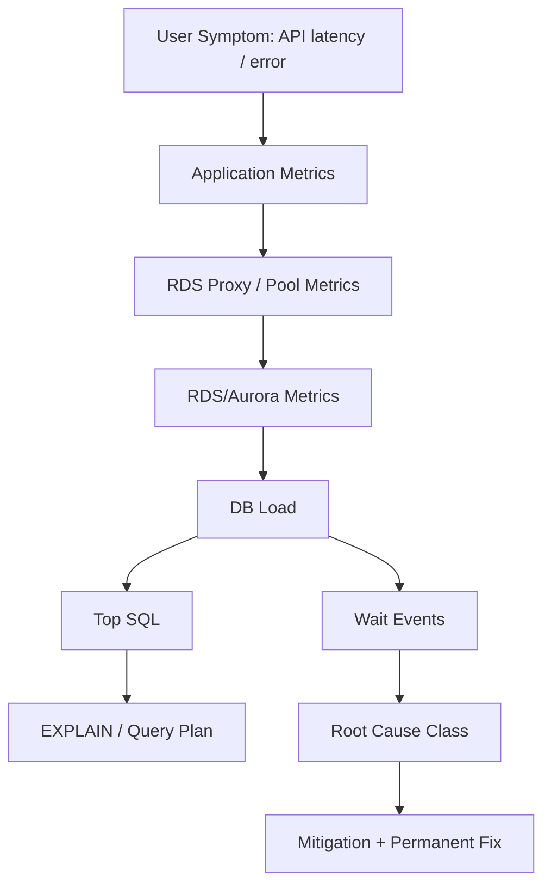
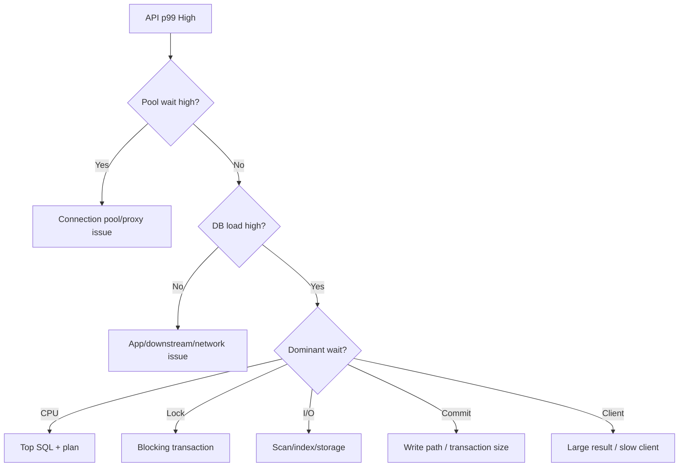

# Part 066 — RDS Operability: Performance Insights, Database Insights, Slow Query, Wait Events, Alarms

> Goal: setelah bagian ini, kamu bisa mengoperasikan RDS/Aurora sebagai production system: tahu apa yang harus dimonitor, bagaimana membaca DB load, bagaimana men-debug query dan wait event, bagaimana membuat alarm yang actionable, dan bagaimana membuat runbook incident yang tidak berhenti di “CPU tinggi”.

Database operability bukan dashboard cantik. Database operability adalah kemampuan menjawab pertanyaan berikut dalam tekanan incident:

```txt
Apa yang melambat?
Kenapa melambat?
Siapa yang menyebabkan?
Apa blast radius-nya?
Apa tindakan aman sekarang?
Apa perbaikan permanennya?
```

For RDS/Aurora, the answer usually lives across:

- CloudWatch metrics;
- Database Insights / Performance Insights;
- engine logs;
- slow query logs;
- wait events;
- top SQL;
- connection pool metrics;
- application traces;
- queue/API/workflow metrics;
- deployment history;
- schema/index migration history.



---

## 1. The Operability Mental Model

A relational database incident is rarely just “database down”. More often it is one of these:

| Symptom | Possible Root Cause |
|---|---|
| API p99 latency high | slow query, lock wait, connection wait, replica lag |
| CPU high | bad query, missing index, legitimate traffic spike, vacuum pressure |
| DB connections high | pool misconfig, Lambda storm, stuck clients, proxy pinning |
| Lock waits high | long transaction, hot row, migration lock, DDL contention |
| Deadlocks | inconsistent lock ordering, overly broad transaction scope |
| Replica lag high | heavy writes, long query on replica, under-capacity reader |
| Storage grows fast | table bloat, index bloat, audit/outbox retention issue |
| Queue age rises | DB write bottleneck, worker throttling, lock contention |
| 5xx from API | DB timeout, connection exhaustion, failover, retry storm |

The production question is not:

```txt
Is the database healthy?
```

It is:

```txt
Which invariant is at risk, and which bottleneck class explains the symptom?
```

---

## 2. Performance Insights vs CloudWatch Database Insights

AWS has been moving the RDS/Aurora database observability experience toward CloudWatch Database Insights. Performance Insights concepts remain important because the API and mental model of DB load, waits, top SQL, hosts, and users remain central.

Practical framing:

| Capability | Why It Matters |
|---|---|
| DB load | Shows how much active work database is doing |
| Wait breakdown | Shows what the database is waiting on |
| Top SQL | Identifies SQL driving load |
| Top users/hosts | Identifies source of load |
| Time range analysis | Correlates incident with deployment or traffic spike |
| Retention | Enables post-incident analysis |
| Integration with CloudWatch | Connects database analysis to broader workload telemetry |

The important mental model:

```txt
CPU alone tells you resource usage.
DB load + waits tells you bottleneck type.
Top SQL tells you what to fix.
```

---

## 3. DB Load: The Core Signal

DB load measures active database sessions over time. It is more useful than CPU alone because sessions may be active due to CPU, locks, I/O, commits, or other waits.

Interpretation:

| DB Load Pattern | Likely Meaning |
|---|---|
| DB load high + CPU high | CPU-bound queries or workload spike |
| DB load high + lock waits | contention, long transaction, DDL lock |
| DB load high + I/O waits | storage access, cache miss, scan-heavy workload |
| DB load high + connection waits | pool/proxy/database connection pressure |
| DB load high + commit waits | write path/storage/replication pressure |
| DB load low + API slow | app layer, network, pool wait, downstream dependency |

Rule:

```txt
Do not tune the database before classifying the wait.
```

---

## 4. Wait Events: Turning Symptoms Into Bottleneck Classes

Wait events answer:

```txt
When database sessions are active, what are they waiting for?
```

Common wait classes:

| Wait Class | Meaning | Typical Fix |
|---|---|---|
| CPU | Queries need CPU | optimize SQL, add index, scale capacity if legitimate |
| Lock | Session blocked by another transaction | shorten transactions, fix lock order, avoid hot rows |
| I/O | Waiting for storage/table/index access | add index, reduce scan, tune working set |
| Commit | Waiting on commit path | batch carefully, reduce transaction size, inspect write load |
| Client | Waiting on client interaction | app fetch pattern, network, large result set |
| Buffer/cache | Memory pressure or cache behavior | tune query, capacity, indexes |
| LWLock / internal | Engine-level contention | inspect top SQL, version, workload pattern |

A high-end engineer does not memorize every wait event. They classify waits into actionable categories.

---

## 5. Debugging Flow: From User Symptom to Root Cause

Use this flow during incident:

```txt
1. Confirm user-visible symptom.
2. Identify affected API/job/workflow.
3. Check app latency breakdown.
4. Check connection pool/proxy metrics.
5. Check DB load and wait events.
6. Identify top SQL / top host / top user.
7. Check deployment/migration/job history.
8. Mitigate safely.
9. Capture evidence before it disappears.
10. Create permanent fix.
```



---

## 6. Slow Query Logging

Slow query logs are not enough alone, but they are essential evidence.

They answer:

- which statements exceeded threshold;
- how often they occurred;
- how latency changes over time;
- whether a deployment introduced query regression;
- whether a specific tenant/user caused heavy queries;
- whether an endpoint is doing N+1 queries.

### PostgreSQL/Aurora PostgreSQL Settings to Review

Commonly useful settings:

```txt
log_min_duration_statement
log_lock_waits
deadlock_timeout
log_statement_sample_rate
log_temp_files
```

Use carefully. Logging every statement in production can create noise and cost.

### MySQL/Aurora MySQL Settings to Review

Commonly useful:

```txt
slow_query_log
long_query_time
log_queries_not_using_indexes
performance_schema
```

Again: do not enable noisy settings blindly under high traffic.

---

## 7. Top SQL Analysis

Top SQL is where operability becomes engineering.

When a query dominates DB load, ask:

1. Is it a legitimate high-frequency query?
2. Did its frequency increase?
3. Did its plan change?
4. Did its latency increase?
5. Is it missing an index?
6. Is it returning too many rows?
7. Is it scanning across tenants?
8. Is it blocked by locks?
9. Is it part of a transaction that does too much?
10. Is it coming from a recently deployed code path?

Example workflow:

```sql
EXPLAIN (ANALYZE, BUFFERS)
SELECT *
FROM enforcement_case
WHERE tenant_id = $1
  AND status = 'UNDER_REVIEW'
ORDER BY updated_at DESC
LIMIT 50;
```

Possible fix:

```sql
CREATE INDEX CONCURRENTLY idx_case_tenant_status_updated
ON enforcement_case (tenant_id, status, updated_at DESC);
```

But the top engineer asks one more question:

```txt
Does this index support a real access pattern, or are we indexing around bad API design?
```

---

## 8. Lock Incident Playbook

Lock incidents are common in relational systems.

Symptoms:

- API latency spikes;
- DB load high but CPU not high;
- lock wait events dominate;
- many sessions blocked by one session;
- migration appears stuck;
- workers stop progressing;
- deadlocks increase.

Immediate steps:

```txt
1. Identify blocked sessions.
2. Identify blocking session/query.
3. Identify transaction age.
4. Identify whether blocker is app, migration, admin, report, vacuum, or DDL.
5. Decide whether safe to cancel query or terminate session.
6. Stop new traffic/job if needed.
7. Preserve evidence.
8. Patch transaction/migration design.
```

PostgreSQL inspection examples:

```sql
SELECT
  blocked.pid AS blocked_pid,
  blocked.query AS blocked_query,
  blocking.pid AS blocking_pid,
  blocking.query AS blocking_query,
  now() - blocking.xact_start AS blocking_xact_age
FROM pg_catalog.pg_locks blocked_locks
JOIN pg_catalog.pg_stat_activity blocked
  ON blocked.pid = blocked_locks.pid
JOIN pg_catalog.pg_locks blocking_locks
  ON blocking_locks.locktype = blocked_locks.locktype
 AND blocking_locks.database IS NOT DISTINCT FROM blocked_locks.database
 AND blocking_locks.relation IS NOT DISTINCT FROM blocked_locks.relation
 AND blocking_locks.page IS NOT DISTINCT FROM blocked_locks.page
 AND blocking_locks.tuple IS NOT DISTINCT FROM blocked_locks.tuple
 AND blocking_locks.virtualxid IS NOT DISTINCT FROM blocked_locks.virtualxid
 AND blocking_locks.transactionid IS NOT DISTINCT FROM blocked_locks.transactionid
 AND blocking_locks.classid IS NOT DISTINCT FROM blocked_locks.classid
 AND blocking_locks.objid IS NOT DISTINCT FROM blocked_locks.objid
 AND blocking_locks.objsubid IS NOT DISTINCT FROM blocked_locks.objsubid
 AND blocking_locks.pid != blocked_locks.pid
JOIN pg_catalog.pg_stat_activity blocking
  ON blocking.pid = blocking_locks.pid
WHERE NOT blocked_locks.granted;
```

Permanent fixes:

- shorten transaction;
- remove external API calls inside transaction;
- avoid broad updates;
- use deterministic lock ordering;
- split hot aggregate;
- use queue serialization where necessary;
- use `SKIP LOCKED` for work claim pattern;
- design zero-downtime migrations.

---

## 9. Connection Exhaustion Playbook

Symptoms:

- app cannot acquire connection;
- RDS Proxy borrow latency rises;
- database connections near max;
- API timeouts;
- Lambda/ECS scale-out event correlates with failure;
- many idle connections.

Immediate mitigation:

```txt
1. Reduce application concurrency.
2. Pause non-critical workers.
3. Scale down noisy consumer fleet if safe.
4. Increase pool queueing/backpressure rather than opening more connections.
5. Check RDS Proxy target health and pinned connections.
6. Restart leaking app instances if necessary.
```

Permanent fix:

- bounded pool per service;
- RDS Proxy for bursty/serverless clients;
- reserved concurrency for Lambda;
- queue buffering for workers;
- connection leak detection;
- pool metrics exported;
- max lifetime / idle timeout configured;
- avoid one service owning unlimited connections.

Formula:

```txt
safe_db_connections
  >= sum(service_instance_count * max_pool_per_instance)
     + migration/admin reserve
     + monitoring reserve
```

Do not let every service independently choose pool size.

---

## 10. Replica Lag Playbook

Replica lag becomes a correctness problem when the application assumes fresh reads.

Symptoms:

- user writes data, then does not see it;
- API returns stale state;
- dashboard lags behind source;
- worker reads old row and performs wrong action;
- failover surprises app due to different replica state.

Immediate mitigation:

- route read-after-write to writer;
- temporarily disable replica reads for affected endpoint;
- reduce heavy replica queries;
- add lag-aware routing;
- pause reporting workloads.

Permanent fix:

- classify reads as fresh/stale-tolerant;
- expose staleness budget;
- use writer for command confirmation;
- use projection freshness metadata;
- avoid hidden correctness dependency on replica freshness.

Design rule:

```txt
Replica reads are performance optimization, not correctness source.
```

---

## 11. Failover Observability

During failover, the app often sees:

- broken connections;
- transaction errors;
- commit ambiguity;
- DNS/endpoint transition delay;
- brief write unavailability;
- retry storm;
- pool poisoning.

Instrumentation needed:

| Signal | Why |
|---|---|
| DB failover event | Anchor timeline |
| API 5xx/latency | User impact |
| DB connection errors | Client behavior |
| Retry attempts | Detect storm |
| Idempotency duplicate hits | Validate safe retry |
| Outbox lag | Detect publish impact |
| Queue lag | Detect downstream recovery |
| RDS Proxy target health | Connection recovery |

Failover readiness means proving:

```txt
The system may return temporary errors, but it must not corrupt state or duplicate business effects.
```

---

## 12. Alarms That Are Actually Useful

Bad alarm:

```txt
CPU > 80% for 5 minutes
```

Not useless, but insufficient.

Better alarm set:

### Availability Alarms

- DB instance unavailable;
- failover event;
- storage full / low free storage;
- replica not available;
- backup failure;
- RDS Proxy target unhealthy.

### Saturation Alarms

- DB load above baseline/threshold;
- CPU sustained high;
- connections near limit;
- RDS Proxy borrow latency high;
- freeable memory low;
- storage queue / IOPS pressure;
- Aurora Serverless v2 ACU near max.

### Contention Alarms

- lock wait spike;
- deadlock spike;
- transaction age too high;
- blocked sessions count high.

### Correctness Alarms

- replica lag exceeds staleness budget;
- outbox unpublished records age high;
- failed migrations;
- workflow compensation spike;
- idempotency conflict rate spike.

### Application-Database Boundary Alarms

- API p99 high while DB wait high;
- SQS oldest message age high while DB saturated;
- worker failure rate high;
- connection pool acquisition timeout;
- query timeout count.

Alarm rule:

```txt
Every alarm must map to a runbook decision.
```

If no one knows what to do when an alarm fires, the alarm is not operationally mature.

---

## 13. Dashboard Design

A useful database dashboard has layers.

### Layer 1 — Executive Symptom

- API p50/p95/p99 latency;
- API 5xx;
- queue age;
- user-facing SLO burn;
- workflow failure count.

### Layer 2 — Database Saturation

- DB load;
- CPU;
- memory;
- connections;
- ACU capacity if Serverless v2;
- storage/IOPS/throughput;
- commit latency.

### Layer 3 — Bottleneck Classification

- wait events;
- top SQL;
- top hosts;
- top users;
- lock waits;
- deadlocks;
- replica lag.

### Layer 4 — Change Correlation

- deployments;
- schema migrations;
- batch jobs;
- traffic spikes;
- failover events;
- config changes.

Dashboard anti-pattern:

```txt
A wall of metrics with no investigative path.
```

Good dashboard:

```txt
Symptom -> bottleneck class -> responsible query/host/user -> runbook action
```

---

## 14. Runbook Template

Every critical database alert should have a runbook like this:

```md
# Runbook: RDS/Aurora DB Load High

## User Impact
- Which services/endpoints are affected?
- Is data correctness at risk or only latency?

## First Checks
- DB load current vs baseline
- Dominant wait event
- Top SQL
- Top host/user
- Connection count / borrow latency
- Recent deployments/migrations/jobs

## Safe Mitigations
- Disable non-critical workers
- Reduce concurrency
- Route reads away from overloaded replica
- Cancel known bad query if safe
- Increase capacity only if bottleneck is capacity, not lock
- Enable feature flag degradation

## Do Not Do
- Do not blindly restart database
- Do not increase max connections without pool review
- Do not kill unknown sessions without identifying transaction role
- Do not run DDL during incident unless part of approved mitigation

## Permanent Fix Candidates
- Query/index change
- Transaction boundary change
- Pool sizing change
- Tenant throttling
- Batch job redesign
- Projection/read model split
- Capacity range change
```

---

## 15. Incident Patterns and Fixes

### Pattern A — Missing Index After Feature Launch

Timeline:

```txt
New filter shipped -> query scans large table -> CPU high -> DB load high -> API p99 high
```

Evidence:

- top SQL changed after deployment;
- wait dominated by CPU/I/O;
- slow query logs show new query;
- explain plan shows seq scan.

Mitigation:

- feature flag off;
- create index concurrently if safe;
- throttle endpoint;
- route heavy reads to projection if available.

Permanent fix:

- query plan review in CI for critical paths;
- index design in API contract review;
- pagination/limit enforcement.

---

### Pattern B — Long Transaction Blocks Everything

Timeline:

```txt
Admin bulk update starts transaction -> holds row/table locks -> user writes block -> API timeout
```

Evidence:

- DB load high but CPU moderate;
- lock waits dominate;
- one blocking transaction old;
- many blocked sessions.

Mitigation:

- cancel/terminate blocker if safe;
- stop bulk job;
- drain workers.

Permanent fix:

- chunk updates;
- avoid long transaction;
- deterministic lock order;
- use queue and batch windows;
- preflight lock impact for migrations.

---

### Pattern C — Lambda Connection Storm

Timeline:

```txt
Event spike -> Lambda concurrency jumps -> each opens connection -> DB max connections hit
```

Evidence:

- connection count spike;
- app connection acquisition errors;
- DB may not be CPU-bound;
- RDS Proxy absent or saturated.

Mitigation:

- reduce reserved concurrency;
- pause event source mapping;
- use SQS buffering;
- scale app down/up with lower pool.

Permanent fix:

- RDS Proxy;
- bounded concurrency;
- pool sizing formula;
- async worker design.

---

### Pattern D — Replica Lag Breaks Read-Your-Writes

Timeline:

```txt
Write succeeds -> UI reads from replica -> stale result -> user retries -> duplicate command pressure
```

Evidence:

- replica lag spike;
- endpoint uses reader endpoint;
- user-visible stale reads;
- duplicate requests increase.

Mitigation:

- route fresh reads to writer;
- add post-write session stickiness;
- degrade dashboard freshness.

Permanent fix:

- classify read freshness;
- staleness-aware contract;
- projection freshness field;
- no correctness dependency on replica.

---

## 16. Database Change Correlation

Many database incidents are caused by changes outside the database.

Always correlate with:

- app deployment;
- feature flag enablement;
- schema migration;
- index creation/drop;
- batch job;
- tenant import;
- traffic campaign;
- failover event;
- parameter group change;
- engine minor/major upgrade;
- connection pool config change.

A mature platform records these changes as timeline annotations.

Example annotation format:

```json
{
  "time": "2026-07-07T09:15:00+07:00",
  "type": "schema_migration",
  "service": "case-service",
  "change": "add idx_case_tenant_status_updated",
  "deployment": "case-service@sha256:...",
  "owner": "platform-db"
}
```

Without change timeline, incidents become archaeology.

---

## 17. Query Review Checklist

For every critical query:

- [ ] Has bounded result size.
- [ ] Uses tenant/account/partition filter where relevant.
- [ ] Has index matching filter + order.
- [ ] Does not use leading wildcard on large table.
- [ ] Avoids unbounded joins on high-cardinality tables.
- [ ] Does not fetch large blobs unnecessarily.
- [ ] Uses keyset pagination where appropriate.
- [ ] Has stable execution plan under realistic cardinality.
- [ ] Has timeout budget.
- [ ] Is visible in traces/logs with query name/fingerprint.
- [ ] Has owner service.
- [ ] Has expected p95/p99 latency budget.

---

## 18. Schema Migration Operability

Schema migrations are production events.

For RDS/Aurora, migration runbooks should include:

- migration type: additive, backfill, destructive, index, constraint, DDL;
- expected lock level;
- expected duration;
- rollback or forward-fix strategy;
- monitoring during migration;
- kill/cancel criteria;
- feature flag dependency;
- communication plan;
- off-peak scheduling;
- backup/restore readiness if risky.

Dangerous migrations:

- adding column with table rewrite behavior;
- creating index without concurrency where engine supports concurrent option;
- adding constraint without validation strategy;
- broad update in one transaction;
- dropping column still read by old app version;
- changing enum/state without dual-read/dual-write plan.

Migration incident invariant:

```txt
A schema migration must not hold locks that block critical production writes beyond the approved budget.
```

---

## 19. RDS/Aurora Operability for Regulatory Systems

For enforcement lifecycle systems, database observability has defensibility implications.

You need to answer:

- Was a case transition persisted exactly once?
- Was an approval delayed due to system incident?
- Did a retry duplicate an enforcement action?
- Was the audit trail written in the same transaction as state change?
- Was a dashboard stale, and by how much?
- Did a migration change case semantics?
- Which user/tenant/query created load that affected others?

Operational signals become audit evidence.

Recommended additional tables/metadata:

```txt
command_log
outbox
inbox
state_transition_audit
projection_watermark
migration_history
incident_annotation
job_execution_log
tenant_usage_metric
```

This is not bureaucracy. It is how you prove what happened.

---

## 20. Permanent Fix Taxonomy

After an incident, fixes usually fall into one or more categories:

| Category | Example |
|---|---|
| Query fix | Rewrite query, add limit, remove N+1 |
| Index fix | Composite/partial/expression index |
| Transaction fix | Shorten transaction, move side effect outside |
| Data model fix | Split hot row/table, denormalize read path |
| Capacity fix | Resize instance, adjust ACU range |
| Pool fix | Reduce pool, add RDS Proxy, bound concurrency |
| Routing fix | Use writer for fresh reads, replica for stale reads |
| Workflow fix | Move long operation to Step Functions/SQS |
| Observability fix | Add query name, dashboard, alarm, trace |
| Governance fix | Migration review, ADR, tenant guardrail |

Do not accept “scaled database” as the only permanent fix unless the evidence shows legitimate capacity growth.

---

## 21. Production Readiness Checklist

Before calling RDS/Aurora production-ready:

- [ ] CloudWatch metrics dashboard exists.
- [ ] Database Insights/Performance Insights workflow is enabled/defined.
- [ ] Slow query logging strategy exists.
- [ ] Top SQL review cadence exists.
- [ ] Wait event interpretation guide exists.
- [ ] Application traces include DB boundary timing.
- [ ] Connection pool metrics are exported.
- [ ] RDS Proxy metrics monitored if used.
- [ ] Lock/deadlock alerts exist.
- [ ] Replica lag alarms use staleness budget.
- [ ] Backup/restore drills are tested.
- [ ] Failover drill is tested.
- [ ] Migration runbook exists.
- [ ] Query/index review process exists.
- [ ] Incident runbooks exist for CPU, locks, connections, lag, storage.
- [ ] Cost and capacity dashboards exist.
- [ ] Tenant/noisy-neighbor metrics exist where multi-tenant.
- [ ] Outbox/inbox/projection freshness is observable.
- [ ] Alerts map to action, not just notification.

---

## 22. Mental Model Summary

RDS/Aurora operability is the discipline of connecting:

```txt
user symptom
-> application boundary
-> connection layer
-> database load
-> wait event
-> responsible SQL/host/user
-> safe mitigation
-> permanent fix
```

Do not run production databases with only infrastructure metrics.

You need:

- DB load;
- wait events;
- top SQL;
- slow query evidence;
- connection metrics;
- lock/deadlock visibility;
- replica lag semantics;
- deployment/migration correlation;
- runbooks;
- ownership.

The difference between average and elite database operation is not knowing every knob. It is knowing how to preserve correctness while diagnosing bottlenecks under pressure.

---

## References

- AWS Documentation — Monitoring DB load with Performance Insights on Amazon RDS: https://docs.aws.amazon.com/AmazonRDS/latest/UserGuide/USER_PerfInsights.html
- AWS Documentation — Performance Insights overview: https://docs.aws.amazon.com/AmazonRDS/latest/UserGuide/USER_PerfInsights.Overview.html
- AWS Documentation — CloudWatch Database Insights: https://docs.aws.amazon.com/AmazonCloudWatch/latest/monitoring/Database-Insights.html
- AWS Documentation — Analyzing DB load by wait events for Aurora: https://docs.aws.amazon.com/AmazonRDS/latest/AuroraUserGuide/USER_PerfInsights.UsingDashboard.AnalyzeDBLoad.html
- AWS Documentation — Aurora PostgreSQL wait events: https://docs.aws.amazon.com/AmazonRDS/latest/AuroraUserGuide/AuroraPostgreSQL.Reference.Waitevents.html
- AWS Documentation — Aurora MySQL wait events: https://docs.aws.amazon.com/AmazonRDS/latest/AuroraUserGuide/AuroraMySQL.Reference.Waitevents.html
- AWS Documentation — Amazon RDS Proxy metrics: https://docs.aws.amazon.com/AmazonRDS/latest/UserGuide/rds-proxy.monitoring.html
