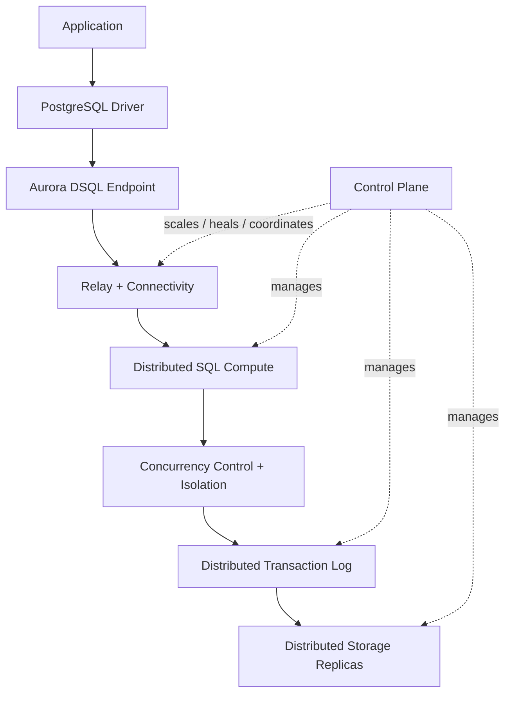
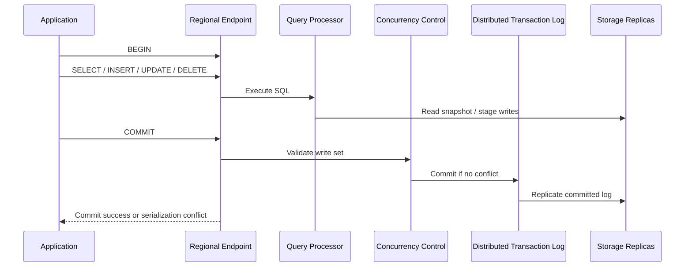
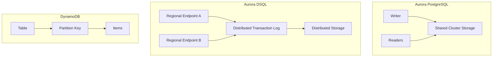
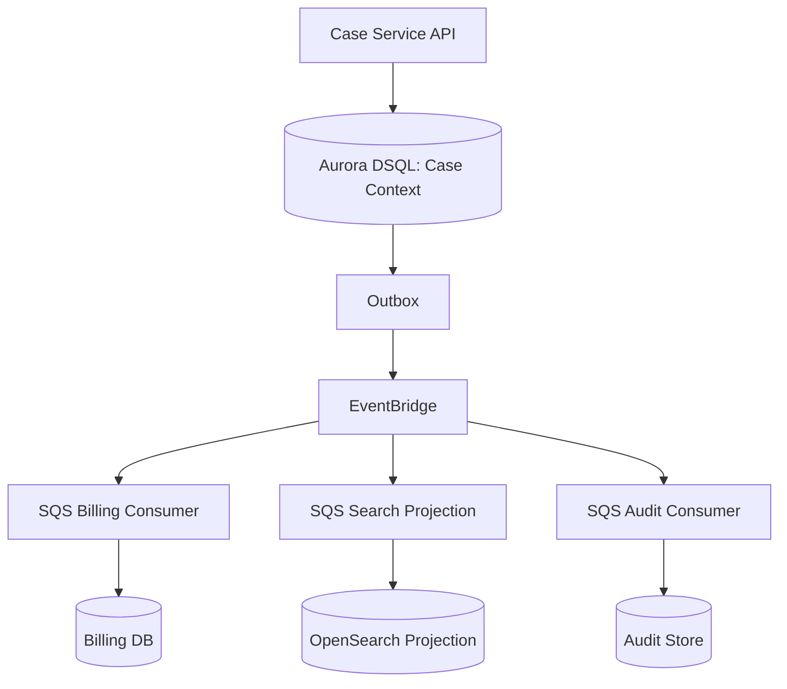
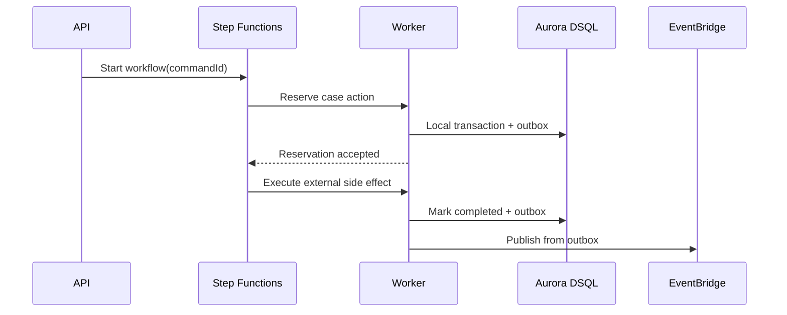

# Part 067 — Aurora DSQL Mental Model: Distributed SQL Tanpa Sharding Manual

> Goal: setelah bagian ini, kamu bisa memahami Aurora DSQL bukan sebagai “Aurora PostgreSQL versi baru”, tetapi sebagai **serverless distributed SQL database** dengan model aplikasi yang berbeda: PostgreSQL-compatible, ACID, strongly consistent, active-active, optimistic-concurrency-based, dan tanpa operasi tradisional seperti provisioning instance, manual sharding, failover primer-sekunder, atau vacuum tuning.

Aurora DSQL harus dipahami dari pertanyaan yang benar:

```txt
Bukan: “Apakah ini PostgreSQL biasa yang otomatis multi-region?”
Tapi:  “Apakah workload transactional saya cocok dengan distributed SQL yang strong consistent,
        active-active, serverless, dan optimistic-concurrency-based?”
```

Kesalahan paling mahal adalah membawa kebiasaan single-node PostgreSQL apa adanya ke distributed SQL. Kamu masih memakai SQL, tabel, index, joins, transaksi, driver PostgreSQL, dan banyak tooling yang familiar. Tetapi model failure, contention, latency, DDL, connection, dan schema ownership berubah.

---

## 1. What Aurora DSQL Is

Aurora DSQL adalah **serverless distributed relational database** yang dioptimalkan untuk workload transactional. Secara praktis:

- SQL tetap menjadi interface utama;
- wire protocol kompatibel dengan PostgreSQL;
- transaksi ACID tetap ada;
- consistency strong, bukan eventual read replica style;
- cluster bisa single-Region atau multi-Region;
- deployment multi-Region bersifat active-active;
- scaling compute, I/O, dan storage dikelola service;
- aplikasi tidak mengelola shard, failover primary/secondary, instance sizing, vacuum, atau storage layout manual.

Mental model sederhananya:



The important shift:

```txt
You no longer design physical shards.
You design logical keys, aggregate boundaries, contention boundaries, and retry semantics.
```

---

## 2. What Aurora DSQL Is Not

Aurora DSQL is not:

| Not This | Why It Matters |
|---|---|
| Regular PostgreSQL with all extensions/features | It is PostgreSQL-compatible, not PostgreSQL-identical. Some features work differently or are absent. |
| Aurora PostgreSQL Global Database | Aurora Global Database is replication-oriented with primary/writer topology; DSQL is active-active distributed SQL. |
| DynamoDB with SQL syntax | It supports relational constructs, secondary indexes, joins, and transactions, but has distributed SQL constraints. |
| A replacement for every OLTP database | High-contention, lock-heavy, trigger-heavy, procedural-DB-heavy applications may need redesign. |
| A magic way to avoid data modeling | Key distribution, aggregate size, write contention, transaction scope, and retry behavior still matter. |
| A free pass for multi-Region complexity | Database consistency becomes simpler, but application routing, external side effects, events, caches, and queues still need design. |

The strongest way to use Aurora DSQL is **not** to pretend the distributed system disappeared. It is to move the hardest database distribution problems into the managed service, while still designing the application around explicit invariants.

---

## 3. The Core Mental Model

Aurora DSQL gives you a single logical relational database, but internally it is distributed.

A simplified transaction path:



The operational meaning:

1. Reads are from a consistent snapshot.
2. Writes can proceed optimistically.
3. Conflicts are detected at commit time.
4. The client must treat some transactions as retryable.
5. High contention becomes an application/data-model problem, not a lock-wait problem.

In single-node PostgreSQL, you often think:

```txt
Who holds the lock?
How long do I wait?
Can I tune lock timeout?
```

In Aurora DSQL, think:

```txt
Which aggregate/key range is contended?
Can this transaction be retried safely?
Can I reduce the write set?
Can I route ownership to avoid multi-writer conflict?
Can I split the hot aggregate?
```

---

## 4. Why This Matters for Top-Level Architecture

Aurora DSQL changes the decision boundary for systems that previously had bad choices:

| Problem | Traditional Option | DSQL Option |
|---|---|---|
| Need SQL and strong consistency across Regions | Complex custom replication / single writer Region | Active-active strongly consistent SQL cluster |
| Need relational model but serverless scaling | Aurora Serverless v2 / RDS Proxy / capacity planning | Serverless distributed SQL |
| Need scale without manual sharding | Sharding framework / tenant partitioning / query routing | Automatic partitioning and distribution |
| Need no replica lag after regional write | Hard with async read replicas | Strong consistency on regional endpoints |
| Need simpler failover | Runbooks, switchover, DNS, app reconnection | Service handles database recovery; app still routes endpoints |

But the trade-off is real:

| Benefit | Design Cost |
|---|---|
| Active-active database | Need conflict-aware transaction design |
| Strong consistency | Cross-region commit path can affect latency |
| Serverless scale | Less low-level tuning control |
| PostgreSQL compatibility | Must verify unsupported or different features |
| Lock-free OCC | Need retry-safe transaction logic |
| Automatic partitioning | Need key distribution and hot-key avoidance |

---

## 5. The Database Boundary Shift

With RDS/Aurora PostgreSQL, the database boundary includes:

- instance class;
- storage configuration;
- replication topology;
- failover priority;
- vacuum/autovacuum behavior;
- parameter groups;
- connection limits;
- engine-level tuning;
- manual read scaling design.

With Aurora DSQL, much of that shifts to service-managed infrastructure. Your boundary becomes:

- schema design;
- transaction size;
- aggregate write contention;
- primary key distribution;
- application-level referential integrity;
- retry strategy;
- idempotency;
- endpoint routing;
- observability;
- data residency and Region-set choices;
- compatibility verification.

```mermaid
flowchart LR
  subgraph Old[Traditional Relational Ops]
    Instance[Instance sizing]
    Failover[Failover topology]
    Vacuum[Vacuum and maintenance]
    Storage[Storage growth and IOPS]
    Replica[Replica lag management]
  end

  subgraph New[Aurora DSQL App/Data Design]
    Key[Key distribution]
    Aggregate[Aggregate boundary]
    Retry[Retry-safe transactions]
    Conflict[Contention management]
    Contract[Compatibility contract]
    Route[Endpoint routing]
  end

  Old -. service-managed .-> New
```



This is not “less engineering”. It is a different engineering layer.

---

## 6. The Compatibility Boundary

Aurora DSQL uses PostgreSQL-compatible protocol and behavior for supported syntax. That means many existing clients and ORMs can connect through familiar PostgreSQL drivers.

But compatibility must be treated as a contract, not an assumption.

### Practical Compatibility Checklist

| Area | Question |
|---|---|
| Driver | Does the application use standard PostgreSQL wire protocol features only? |
| ORM | Does generated SQL use supported syntax? |
| Migrations | Does migration tooling use unsupported DDL? |
| Schema | Does the schema depend on triggers, procedural functions, temp tables, foreign key enforcement, sequences, or non-supported extensions? |
| Transactions | Does the app assume pessimistic row locks or blocking lock waits? |
| Isolation | Does the app require isolation stronger/weaker than DSQL fixed behavior? |
| DDL/DML | Does deployment mix DDL and DML in one transaction? |
| Bulk writes | Can large migrations respect row-modification limits? |
| Collation/timezone | Does the app assume custom collation or database local timezone? |

A top engineer does not ask “does it support PostgreSQL?” only once. They build a compatibility suite:

```txt
1. Capture real SQL from production or staging.
2. Replay representative queries against Aurora DSQL.
3. Run ORM-generated migration SQL.
4. Run transaction conflict tests.
5. Run bulk write/backfill tests.
6. Run failure and retry tests.
7. Verify observability and error classification.
```

---

## 7. DSQL vs Aurora PostgreSQL vs DynamoDB

### 7.1 Quick Decision Table

| Requirement | Better Fit |
|---|---|
| SQL joins, relational model, strong transactions, multi-Region active-active | Aurora DSQL |
| PostgreSQL feature completeness, extensions, procedural logic, deep engine tuning | Aurora PostgreSQL / RDS PostgreSQL |
| Extreme predictable key-value access, single-digit ms pattern, no relational query | DynamoDB |
| Existing mature PostgreSQL app with heavy FK/triggers/extensions | Aurora PostgreSQL first, DSQL after compatibility redesign |
| Multi-Region global table with eventual conflict semantics accepted | DynamoDB Global Tables |
| Multi-Region SQL with strong consistency and no manual sharding | Aurora DSQL |

### 7.2 Architectural Comparison



### 7.3 The Real Differentiator

Aurora PostgreSQL gives you a familiar PostgreSQL engine with managed operations.

DynamoDB gives you horizontally scalable access-pattern-first storage with strict key/query design.

Aurora DSQL gives you SQL plus distributed strong consistency and active-active availability, but asks you to embrace distributed transaction patterns.

---

## 8. Transaction Model: Think Retry First

Aurora DSQL uses optimistic concurrency control. That means transactions do not block each other the same way lock-based PostgreSQL workloads do. Instead, a transaction can fail at commit if another transaction changed overlapping data.

Bad application assumption:

```txt
If my SQL statements succeeded, COMMIT will normally succeed.
```

Better assumption:

```txt
Every transaction that modifies data may fail at commit due to conflict.
Therefore the whole unit of work must be retry-safe.
```

### Retry-Safe Transaction Skeleton

```java
public CommandResult handle(CreateCaseCommand command) {
    String idempotencyKey = command.idempotencyKey();

    return retry.withExponentialBackoffAndJitter(() -> {
        return tx.execute(() -> {
            CommandRecord existing = commandRepository.find(idempotencyKey);
            if (existing != null && existing.isCompleted()) {
                return existing.result();
            }

            commandRepository.insertStarted(idempotencyKey, hash(command));

            CaseRecord caseRecord = CaseRecord.open(
                command.caseId(),
                command.tenantId(),
                command.subjectId(),
                command.openedAt()
            );

            caseRepository.insert(caseRecord);
            outboxRepository.insert(EventEnvelope.caseOpened(caseRecord));
            commandRepository.markCompleted(idempotencyKey, caseRecord.caseId());

            return CommandResult.created(caseRecord.caseId());
        });
    }, RetryWhen.serializationConflictOrTransient());
}
```

The important part is not the syntax. The important part is the invariant:

```txt
Retrying the entire transaction must not create a second business effect.
```

That requires:

- stable command ID/idempotency key;
- unique business key where applicable;
- command table or idempotency table;
- deterministic event ID or outbox ID;
- retry classification;
- bounded retry budget;
- jitter;
- observability for retry frequency.

---

## 9. Conflict Is a Data Model Signal

In a lock-based system, high contention often appears as lock wait. In Aurora DSQL, it often appears as serialization/conflict errors.

Do not treat conflict rate as merely “retry more”. Conflict rate tells you where your data model violates distribution.

| Conflict Source | Meaning | Better Design |
|---|---|---|
| Many writers update one counter row | Hot aggregate | Sharded counter, event aggregation, async materialization |
| Many Regions update same account row | Missing ownership/locality strategy | Home Region per account/tenant, command routing, CRDT-like domain model if valid |
| Workflow updates same case header repeatedly | Overloaded case aggregate | Move high-frequency substate into child table/append-only log |
| Global sequential ID row | Central bottleneck | UUID/ULID/application-generated ID |
| Backfill updates many hot rows in one transaction | Bulk work too broad | Chunked idempotent migration |
| Event consumer upserts same projection row at high volume | Projection hot key | Partition projection, batch with care, derive asynchronously |

### Example: Bad Counter

```sql
UPDATE agency_statistics
SET open_case_count = open_case_count + 1
WHERE agency_id = :agency_id;
```

This is semantically easy but physically hot.

Better alternatives:

```txt
Option A: append case_opened event and compute count asynchronously.
Option B: maintain per-day/per-agency bucket counters.
Option C: maintain per-worker/per-shard counter and sum at read time.
Option D: only maintain exact counter if it is a strict invariant.
```

The correctness question decides the design:

```txt
Does this count block user action if stale by 5 seconds?
If no, don't make it a hot synchronous write.
```

---

## 10. Primary Key Design

Because Aurora DSQL automatically distributes data, primary key choice still matters. The service can split/merge/replicate data, but your key distribution influences hot ranges and contention.

A poor key is not always one that is sequential. A poor key is one that concentrates concurrent writes on the same logical region of data.

### Candidate Key Shapes

| Key Shape | Good For | Risk |
|---|---|---|
| UUID v4 | write distribution | hard temporal locality, less human friendly |
| ULID / UUIDv7 | roughly time-sortable IDs | can create time-range concentration if used as leading key under burst |
| tenant_id + random id | tenant-scoped query | hot tenant if tenant is leading distribution dimension |
| region_id + tenant_id + id | regional ownership | cross-region movement complexity |
| case_id | aggregate lookup | case hot spot if too much mutable state on header |
| natural business key | uniqueness | collisions/changes/lifecycle complexity |

### Design Rule

```txt
Choose primary keys from access patterns, uniqueness invariants, write distribution,
and regional ownership — not from convenience alone.
```

For a regulatory case-management platform:

```sql
CREATE TABLE enforcement_case (
  case_id          uuid PRIMARY KEY,
  tenant_id        uuid NOT NULL,
  agency_id        uuid NOT NULL,
  subject_id       uuid NOT NULL,
  case_number      text NOT NULL,
  status           text NOT NULL,
  opened_at        timestamptz NOT NULL,
  updated_at       timestamptz NOT NULL,
  version          bigint NOT NULL,
  UNIQUE (tenant_id, case_number)
);
```

The `case_id` is stable identity. The `(tenant_id, case_number)` is business uniqueness. Application code must still handle concurrency conflict and uniqueness violation separately.

---

## 11. Application-Level Referential Integrity

Aurora DSQL supports relational modeling and joins, but distributed SQL designs often move some referential enforcement into the application boundary.

This is not an excuse for weak integrity. It means integrity becomes explicit in command handling.

### Example: Create Enforcement Action

Invariant:

```txt
An enforcement action must belong to an existing case.
A closed case cannot receive a new action unless reopened.
```

Implementation pattern:

```sql
-- in one retry-safe transaction
SELECT case_id, status, version
FROM enforcement_case
WHERE case_id = :case_id;

-- application validates status transition

INSERT INTO enforcement_action (
  action_id,
  case_id,
  action_type,
  created_at,
  created_by
) VALUES (
  :action_id,
  :case_id,
  :action_type,
  :created_at,
  :created_by
);

UPDATE enforcement_case
SET updated_at = :created_at,
    version = version + 1
WHERE case_id = :case_id
  AND version = :expected_version;
```

The application owns the invariant. The database still stores durable facts.

### Required Guardrails

- command validation must happen inside the transaction;
- validation reads and writes must use the same retry unit;
- missing parent must be classified as business error, not transient error;
- concurrency conflict must be retryable only if command remains valid;
- reconciliation job must detect orphan-like anomalies if migration/import bypasses command layer.

---

## 12. The Right Workload Shape

Aurora DSQL is strongest when:

- data is transactional;
- SQL query model is valuable;
- high availability matters;
- active-active Region design matters;
- sharding would otherwise be hard;
- application can tolerate retry-on-conflict;
- aggregate boundaries are well designed;
- write contention is not concentrated on a tiny set of rows;
- database logic is not deeply dependent on triggers/procedural extensions;
- schema changes can follow DSQL-compatible migration practices.

It is weaker when:

- workload needs full PostgreSQL feature compatibility;
- app relies heavily on PL/pgSQL, triggers, temp tables, extension-specific behavior;
- high-contention updates to the same row are common and cannot be redesigned;
- large bulk mutations are normal transactional behavior;
- application cannot tolerate retry semantics;
- database is being used as a procedural application server;
- low-latency single-Region local writes matter more than multi-Region consistency.

---

## 13. DSQL and Microservices

Aurora DSQL does not invalidate database-per-service. A single distributed SQL database is still a source-of-truth boundary.

Bad interpretation:

```txt
DSQL is globally available, so all services can share one database again.
```

Better interpretation:

```txt
DSQL can be the source-of-truth store for one bounded context that needs SQL,
strong consistency, serverless scaling, and active-active availability.
```

Use DSQL per bounded context when it makes sense:



The event contract remains critical. DSQL may remove replication lag inside the source-of-truth database, but it does not make projections instantly correct.

---

## 14. DSQL and Outbox Pattern

Even with strong database consistency, the dual-write problem remains:

```txt
Write database + publish event
```

If the database commit succeeds but event publish fails, downstream systems miss the fact. Therefore, keep the transactional outbox.

```sql
BEGIN;

INSERT INTO enforcement_case (...);

INSERT INTO outbox_event (
  outbox_id,
  aggregate_type,
  aggregate_id,
  event_type,
  event_version,
  payload,
  occurred_at,
  publish_status
) VALUES (..., 'PENDING');

COMMIT;
```

Then publisher:

```txt
1. Read pending outbox rows in bounded batch.
2. Publish to EventBridge/SNS.
3. Mark published idempotently.
4. Retry with backoff.
5. Alert on outbox lag.
```

DSQL changes how the database scales. It does not remove distributed side effects.

---

## 15. DSQL and Workflow

Step Functions and Aurora DSQL solve different problems.

| Problem | Better Tool |
|---|---|
| Durable business process across many steps | Step Functions |
| Transactional state inside one bounded context | Aurora DSQL |
| Human approval timeout | Step Functions |
| Strongly consistent case status update | Aurora DSQL |
| Multi-step saga with compensation | Step Functions + local DB transactions |
| SQL source of truth across Regions | Aurora DSQL |

Pattern:



Do not hold a database transaction open while waiting for human approval, third-party response, or workflow timeout.

---

## 16. DSQL and Caches

Strong database consistency does not make caches safe.

Common cache mistakes:

- caching mutable command-side data without version key;
- invalidating cache only in one Region;
- ignoring retry after conflict;
- caching negative lookup too long;
- using cache as cross-region coordination primitive;
- letting cache return stale state after transaction commit.

Safer cache patterns:

```txt
Read model cache: okay with explicit staleness budget.
Command validation cache: avoid unless invalidation is provably correct.
Versioned cache key: tenant:case:{caseId}:v{version}.
Event-driven eviction: outbox event invalidates derived caches.
Bypass-on-write: after command, return committed result directly from transaction response.
```

---

## 17. Error Classification

A DSQL application must classify database errors. Do not throw every database exception as HTTP 500.

| Error Class | Meaning | Response |
|---|---|---|
| Unique constraint violation | Duplicate business identity | 409 or idempotent replay result |
| Serialization/concurrency conflict | OCC conflict | retry whole transaction with jitter |
| Transaction row limit violation | transaction too large | split command/backfill; no blind retry |
| Unsupported SQL | compatibility bug | fail deployment/test, not runtime retry |
| Connection timeout | network/session issue | retry if safe; circuit-break if widespread |
| Permission error | IAM/schema grants issue | fail fast; alert |
| Business invariant violation | invalid command | 400/409; no retry |

Application error boundary:

```txt
Business error != transient error != compatibility error != unknown commit ambiguity.
```

---

## 18. Idempotency Is Non-Negotiable

Because retry is normal, every write command needs idempotency.

Minimum idempotency table:

```sql
CREATE TABLE command_idempotency (
  command_id       uuid PRIMARY KEY,
  command_type     text NOT NULL,
  request_hash     text NOT NULL,
  status           text NOT NULL,
  result_ref       text,
  created_at       timestamptz NOT NULL,
  updated_at       timestamptz NOT NULL
);
```

Command handling invariant:

```txt
Same command_id + same request_hash returns same logical result.
Same command_id + different request_hash is a client error.
Transaction retry does not duplicate business facts.
```

This is especially important for:

- API Gateway timeout retry;
- client retry after lost response;
- Step Functions task retry;
- SQS consumer retry;
- EventBridge replay;
- multi-Region endpoint retry;
- failover reconnection.

---

## 19. DDL and Schema Evolution

Aurora DSQL schema evolution should be treated as distributed schema change.

Safe migration pattern:

```txt
1. Expand: add new nullable column/table/index asynchronously if supported.
2. Deploy app that writes both old and new shape.
3. Backfill in idempotent chunks.
4. Verify reconciliation metrics.
5. Switch reads to new shape.
6. Contract: stop writing old shape.
7. Remove old shape after retention window.
```

Do not run a massive migration as one transaction. Keep migration chunks bounded, resumable, and observable.

### Backfill Control Table

```sql
CREATE TABLE migration_job_checkpoint (
  job_name       text PRIMARY KEY,
  last_key       text,
  status         text NOT NULL,
  updated_at     timestamptz NOT NULL
);
```

Backfill worker invariant:

```txt
Each chunk can be retried.
Each chunk is small enough to avoid row-modification constraints.
Each chunk emits progress metrics.
Backfill can pause without data corruption.
```

---

## 20. Observability Mental Model

For Aurora DSQL, observability must answer:

```txt
Are we seeing conflicts?
Are conflicts localized to specific keys/tenants/commands?
Are retries succeeding within budget?
Are transaction sizes close to limits?
Are endpoint errors regional?
Are writes evenly distributed?
Are migrations causing conflict spikes?
Are outbox lag and DB conflict correlated?
```

Application metrics you should emit:

| Metric | Dimension |
|---|---|
| `db.transaction.success` | command_type, tenant_id_hash, region |
| `db.transaction.retry` | command_type, error_class, attempt, region |
| `db.transaction.conflict` | aggregate_type, command_type, region |
| `db.transaction.duration` | command_type, success/failure |
| `db.rows_modified` | command_type |
| `db.unique_violation` | constraint_name, command_type |
| `db.connection.error` | endpoint_region, error_class |
| `outbox.lag.seconds` | event_type, region |
| `migration.chunk.duration` | job_name |

Log fields:

```json
{
  "traceId": "...",
  "commandId": "...",
  "tenantIdHash": "...",
  "aggregateType": "case",
  "aggregateId": "...",
  "dbSystem": "aurora-dsql",
  "dbEndpointRegion": "us-east-1",
  "transactionAttempt": 2,
  "dbErrorClass": "serialization_conflict",
  "retryable": true
}
```

Do not log raw regulated data. Hash or tokenize sensitive identifiers.

---

## 21. Failure Model

| Failure | Detection | Safe Response |
|---|---|---|
| OCC conflict | serialization/conflict error | retry whole transaction with jitter |
| Hot aggregate conflict storm | conflict metric spike for same aggregate | split aggregate, route ownership, async derive |
| Endpoint unreachable | connection errors by endpoint region | route to healthy endpoint if multi-Region |
| Commit response lost | timeout after commit attempt | use idempotency key and read command record |
| Unsupported SQL in deploy | migration failure | rollback app deploy; compatibility test gate |
| Backfill too large | row limit / duration / conflict spike | chunk smaller; resume from checkpoint |
| Outbox publisher down | outbox lag | restart publisher; replay pending rows |
| Event published but mark failed | duplicate publish risk | deterministic event ID; idempotent consumer |
| Cache stale after write | stale read reports | versioned cache/eviction from outbox |

---

## 22. Production Readiness Checklist

Before using Aurora DSQL for a bounded context:

- [ ] Access patterns are known and documented.
- [ ] Aggregate boundaries are explicit.
- [ ] Hot write paths have contention analysis.
- [ ] Every write command has idempotency key.
- [ ] Whole-transaction retry is implemented with exponential backoff and jitter.
- [ ] Retry budget is bounded.
- [ ] Error classifier distinguishes business, constraint, conflict, transient, compatibility, and unknown errors.
- [ ] Outbox pattern is used for event publication.
- [ ] Backfills are chunked and resumable.
- [ ] Compatibility suite runs ORM queries and migrations against DSQL.
- [ ] No hidden dependency on unsupported PostgreSQL features.
- [ ] Endpoint routing strategy is defined.
- [ ] Metrics expose conflict rate, retry count, transaction duration, and outbox lag.
- [ ] Runbook exists for regional endpoint failure.
- [ ] Reconciliation jobs validate derived state.
- [ ] ADR records why DSQL is chosen over Aurora PostgreSQL/DynamoDB.

---

## 23. ADR Template

```md
# ADR: Use Aurora DSQL for <bounded-context>

## Context
- Workload:
- Tenancy:
- Regions:
- RPO/RTO:
- Consistency requirement:
- Query shape:
- Write contention expectation:

## Decision
Use Amazon Aurora DSQL as source-of-truth database for <context>.

## Why Not Aurora PostgreSQL
- ...

## Why Not DynamoDB
- ...

## Invariants
- ...

## Known Constraints
- transaction retry required;
- compatibility verification required;
- application-level referential integrity where needed;
- no large unbounded write transaction;
- endpoint routing required for multi-Region.

## Operational Controls
- metrics:
- alarms:
- runbooks:
- reconciliation:

## Exit Strategy
- logical export path:
- data ownership boundary:
- migration plan:
```

---

## 24. Practice Lab

Build a mini **regulatory case intake** service on Aurora DSQL.

### Requirements

- Create case command.
- Add action command.
- Close case command.
- Emit outbox events.
- Support idempotent retry.
- Simulate concurrent close/add-action conflict.
- Measure conflict rate.
- Add retry with jitter.
- Add backfill job for new `case_priority` column.

### Tables

```sql
CREATE TABLE command_idempotency (
  command_id uuid PRIMARY KEY,
  command_type text NOT NULL,
  request_hash text NOT NULL,
  status text NOT NULL,
  result_ref text,
  created_at timestamptz NOT NULL,
  updated_at timestamptz NOT NULL
);

CREATE TABLE enforcement_case (
  case_id uuid PRIMARY KEY,
  tenant_id uuid NOT NULL,
  case_number text NOT NULL,
  status text NOT NULL,
  version bigint NOT NULL,
  opened_at timestamptz NOT NULL,
  updated_at timestamptz NOT NULL,
  UNIQUE (tenant_id, case_number)
);

CREATE TABLE enforcement_action (
  action_id uuid PRIMARY KEY,
  case_id uuid NOT NULL,
  action_type text NOT NULL,
  created_at timestamptz NOT NULL,
  created_by text NOT NULL
);

CREATE TABLE outbox_event (
  outbox_id uuid PRIMARY KEY,
  aggregate_type text NOT NULL,
  aggregate_id uuid NOT NULL,
  event_type text NOT NULL,
  event_version int NOT NULL,
  payload jsonb NOT NULL,
  occurred_at timestamptz NOT NULL,
  publish_status text NOT NULL
);
```

### Test Cases

| Test | Expected Result |
|---|---|
| Same command sent twice | one case created, same result returned |
| Same command ID different payload | reject as idempotency conflict |
| Add action while close case concurrently | one wins; other retries or fails business validation |
| Publisher crash after publish before mark | duplicate event possible; consumer dedup handles it |
| Endpoint timeout after commit | command record resolves outcome |
| Backfill interrupted | resumes from checkpoint |

---

## 25. Key Takeaways

Aurora DSQL is best understood as:

```txt
PostgreSQL-compatible distributed transactional SQL,
with strong consistency, active-active availability,
serverless operations, automatic distribution,
and optimistic-concurrency-centered application design.
```

The success pattern is:

```txt
Model aggregate boundaries.
Avoid hot write concentration.
Make transactions small.
Make every write retry-safe.
Use idempotency keys.
Keep outbox for side effects.
Treat compatibility as testable contract.
Operate conflict metrics as first-class SLO signals.
```

The wrong pattern is:

```txt
Move a lock-heavy PostgreSQL app unchanged and hope distribution is invisible.
```

Aurora DSQL removes many infrastructure burdens, but it makes application correctness more explicit. That is the trade: less database fleet management, more disciplined transaction and data-model engineering.

---

## References

- AWS Documentation — What is Amazon Aurora DSQL?: https://docs.aws.amazon.com/aurora-dsql/latest/userguide/what-is-aurora-dsql.html
- AWS Documentation — Aurora DSQL and PostgreSQL: https://docs.aws.amazon.com/aurora-dsql/latest/userguide/working-with.html
- AWS Documentation — Migrating from PostgreSQL to Aurora DSQL: https://docs.aws.amazon.com/aurora-dsql/latest/userguide/working-with-postgresql-compatibility-migration-guide.html
- AWS Database Blog — Concurrency control in Amazon Aurora DSQL: https://aws.amazon.com/blogs/database/concurrency-control-in-amazon-aurora-dsql/
- AWS Documentation — Resilience in Amazon Aurora DSQL: https://docs.aws.amazon.com/aurora-dsql/latest/userguide/disaster-recovery-resiliency.html
