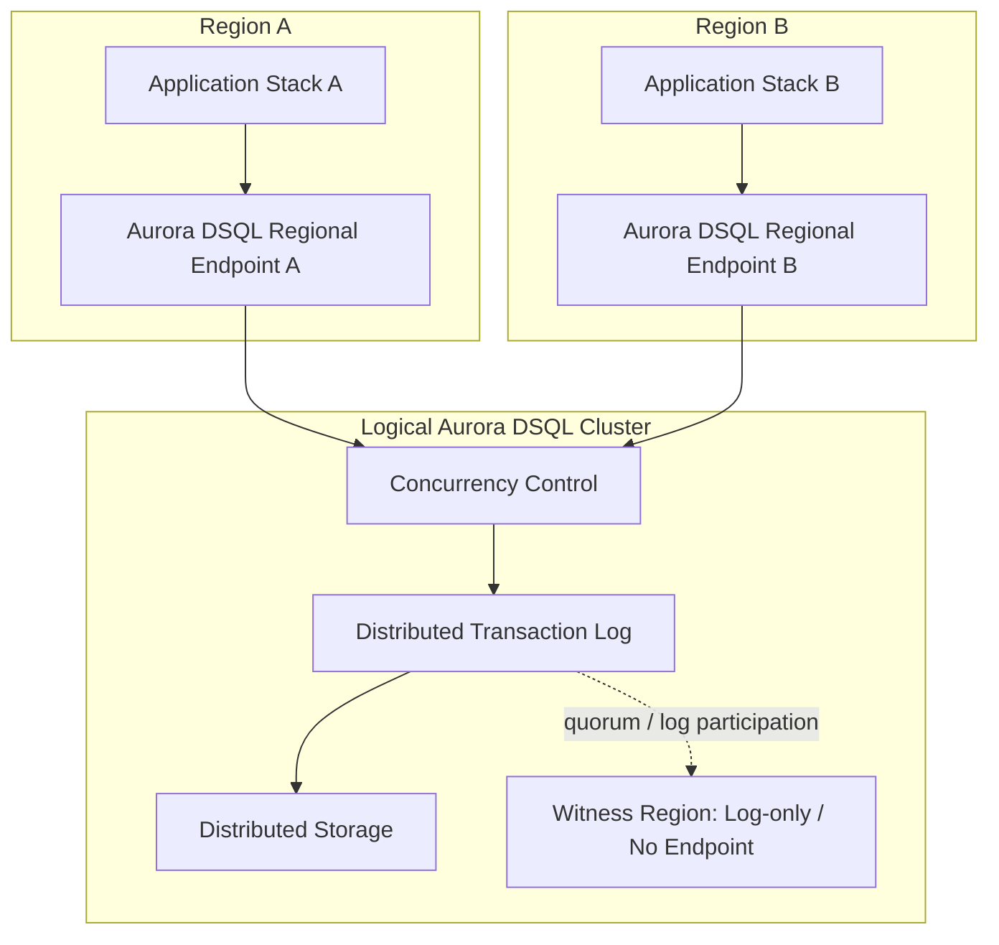
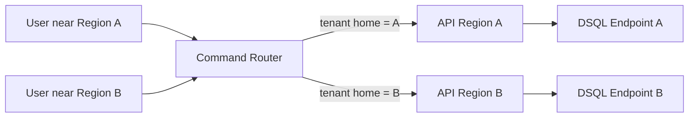
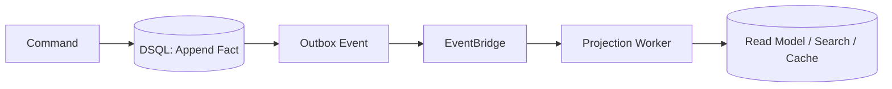
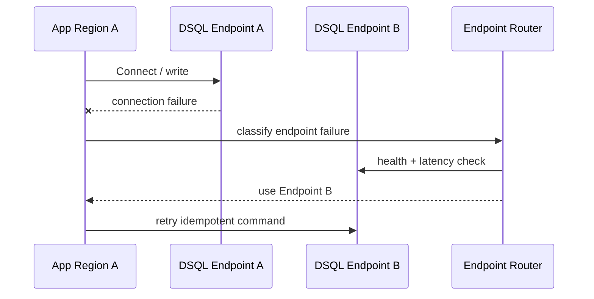
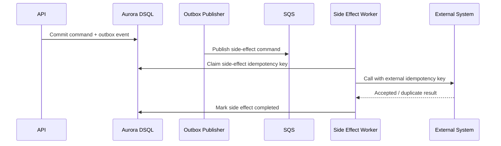
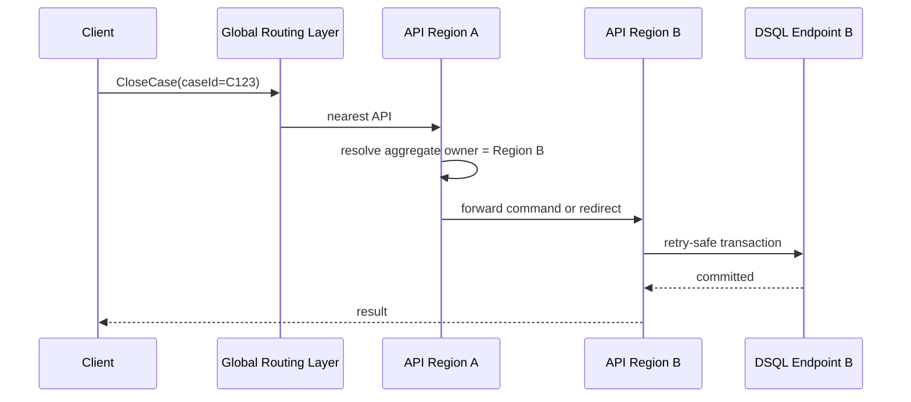
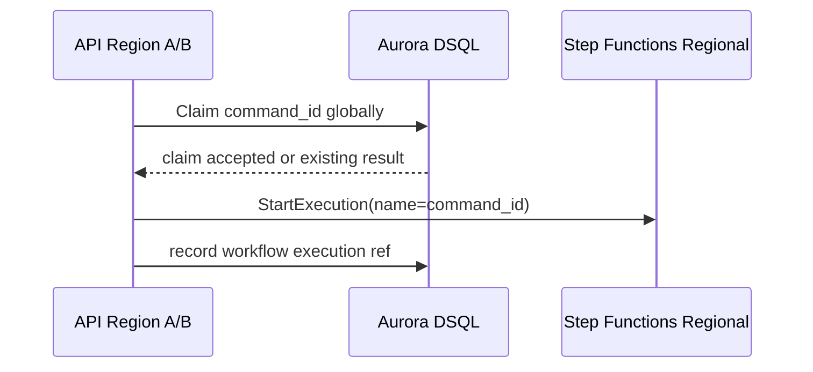
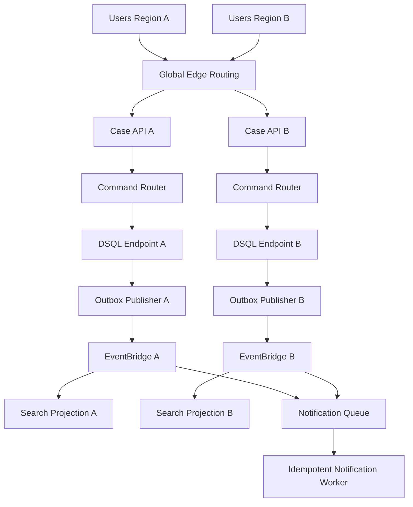

# Part 068 — Active-Active SQL Architecture: Consistency, Region Failure, Latency Trade-Off

> Goal: setelah bagian ini, kamu bisa mendesain aplikasi active-active di atas Aurora DSQL tanpa naif. Database dapat menerima read/write di dua regional endpoints dengan strong consistency, tetapi aplikasi tetap harus mengatur routing, retry, idempotency, external side effects, cache/projection staleness, dan regional failure behavior.

Active-active sering dijual sebagai kalimat pendek:

```txt
Run in two Regions at the same time.
```

Production reality lebih keras:

```txt
What is active in both Regions?
API?
Workers?
Database writes?
Queues?
Caches?
Workflow execution?
External integrations?
Human operations?
```

Aurora DSQL menyelesaikan bagian database yang sangat sulit: strongly consistent distributed SQL dengan regional endpoints yang dapat menerima read dan write. Tetapi ia tidak otomatis menyelesaikan traffic routing, command idempotency, external API side effects, event delivery, cache invalidation, operator runbook, atau data residency decision.

---

## 1. Mental Model

Aurora DSQL multi-Region cluster menyediakan dua regional endpoints yang merepresentasikan satu logical database. Aplikasi dapat read/write ke endpoint Region A atau Region B, dan committed data terlihat konsisten di kedua Region.



The key mental shift:

```txt
There is no application-managed primary database Region.
There is still application-managed routing and correctness.
```

---

## 2. Active-Active Does Not Mean Everything Is Symmetric

A mature architecture distinguishes several kinds of active-active:

| Layer | Active-Active Meaning | Hidden Trap |
|---|---|---|
| API | both Regions serve user traffic | sticky sessions, auth token locality, rate-limit state |
| Database | both regional endpoints accept writes | write conflicts on hot aggregates |
| Queue | workers in both Regions consume work | duplicate side effects, cross-region queue ownership |
| Event bus | events produced in both Regions | duplicate routing, ordering, replay scope |
| Cache | caches exist in both Regions | stale values after remote writes |
| Search projection | projections update in both Regions | lag, conflict, duplicate indexing |
| Workflow | workflows can run in both Regions | duplicate workflow starts, callback token locality |
| External integration | both Regions call third-party systems | duplicate payment/email/notification/enforcement side effects |

Aurora DSQL makes the database active-active. Your architecture must decide whether the rest of the system is:

- active-active;
- active-passive;
- active-active read, single-writer command routing;
- active-active by tenant/home Region;
- active-active only for stateless APIs;
- active-active database, but regional ownership for side effects.

---

## 3. Strong Consistency Is Not Zero Latency

Strong consistency means a successful commit has a globally agreed outcome. It does not mean every cross-region commit has local-only latency.

Aurora DSQL can process SQL locally and perform concurrency/commit coordination when the transaction commits. That is a good latency architecture, but it is still distributed consensus/synchronous replication work.

### Latency Budget

```txt
client -> API Region
API -> DSQL regional endpoint
SQL execution
commit validation and replication
DSQL response
API response
```

For single-Region users, latency is dominated by local path.

For multi-Region strong writes, commit latency includes distributed durability/consistency behavior. This is the correct trade when the invariant is:

```txt
After commit, both Regions must observe the same durable fact.
```

### Design Rule

```txt
Use active-active DSQL for data that must be correct globally.
Do not force every low-value derived counter, cache, projection, or notification into the synchronous write path.
```

---

## 4. The Write Conflict Problem

Active-active write capability means two Regions can update the same logical record. That is power and risk.

Example:

```txt
Region A: officer closes case C123.
Region B: investigator adds action to case C123 at the same time.
```

The database can detect concurrency conflict. But only the application can decide domain behavior:

| Question | Domain Decision |
|---|---|
| Should add-action retry after close? | maybe no, if closed case rejects new actions |
| Should close retry after add-action? | maybe yes, if close only requires latest action set |
| Should both be accepted in some order? | maybe yes, if action timestamp precedes close decision |
| Should human review decide? | maybe yes, in regulatory workflows |

Database conflict detection is not business conflict resolution.

---

## 5. Conflict Avoidance Strategies

### 5.1 Home Region per Tenant

Route commands for a tenant to its home Region.



Pros:

- reduces cross-region write conflict;
- operational ownership clear;
- easier data residency reasoning;
- good for tenant-scoped systems.

Cons:

- user far from home Region pays latency;
- tenant migration needs procedure;
- global aggregates still need design.

### 5.2 Home Region per Aggregate

Route writes for a specific aggregate to one Region.

Example:

```txt
case_id hash determines write-owner Region.
```

Pros:

- balances load better than tenant home for giant tenants;
- avoids concurrent updates to same aggregate from both Regions;
- works for case/order/account aggregate models.

Cons:

- routing layer needs aggregate lookup/hash;
- rebalancing is harder;
- cross-aggregate commands may span Regions conceptually.

### 5.3 Split Hot Aggregate

Instead of updating one row for everything, split high-frequency mutable state.

Bad:

```sql
UPDATE enforcement_case
SET status = :status,
    action_count = action_count + 1,
    last_viewed_at = :now,
    updated_at = :now,
    version = version + 1
WHERE case_id = :case_id;
```

Better:

```txt
case_header: low-frequency legal state
case_action: append-only facts
case_activity_projection: eventually consistent read model
case_view_marker: per-user state
case_counter_bucket: derived counter
```

This reduces conflict surface area.

### 5.4 Append Facts, Derive Views

When business allows it, write immutable facts and derive mutable summaries asynchronously.



This is often the difference between a scalable active-active system and a retry storm.

---

## 6. Endpoint Routing

Aurora DSQL gives you regional endpoints. Your application must choose which endpoint to use.

Routing policies:

| Policy | Use When | Risk |
|---|---|---|
| nearest healthy endpoint | read/write latency optimization | write conflict if same aggregate updated globally |
| tenant home endpoint | tenant ownership matters | remote users pay latency |
| aggregate home endpoint | aggregate-level write conflict avoidance | routing metadata complexity |
| command-specific endpoint | some commands globally owned | harder operational model |
| failover-only alternate endpoint | normally local, alternate on failure | failover testing required |

A routing layer must be observable:

```json
{
  "routePolicy": "tenant_home_region",
  "tenantHomeRegion": "us-east-1",
  "selectedDsqlEndpoint": "us-east-1",
  "requestOriginRegion": "us-east-2",
  "routeReason": "write_command_home_region",
  "fallbackUsed": false
}
```

---

## 7. Failure Modes

### 7.1 Regional Endpoint Unreachable

If a regional DSQL endpoint is unreachable, clients should route to a reachable endpoint if the cluster is multi-Region and business policy allows it.



Critical: retry must use the same command ID. Otherwise failover can duplicate business side effects.

### 7.2 Application Region Down

If API Region A is down but DSQL Region A endpoint is healthy, user traffic can shift to API Region B. The database may not be the bottleneck. The routing problem is full-stack:

- DNS/global accelerator/application routing;
- auth/session strategy;
- API Gateway/custom domain strategy;
- queue/event Region ownership;
- cache warmup;
- workflow execution routing;
- third-party allowlists;
- operator runbook.

### 7.3 Witness Region Impaired

In DSQL multi-Region architecture, a witness Region participates in transaction log durability but does not expose an endpoint. Application code should not depend on witness endpoint behavior. Operationally, understand whether write latency changes during witness impairment and what service health reports show.

### 7.4 Network Partition Between App and Preferred Endpoint

This is common:

```txt
Application Region A cannot reach DSQL Endpoint A,
but DSQL Endpoint A is not globally down.
```

Endpoint routing should be client-observed, not only service-health-observed.

---

## 8. Command Idempotency Across Regions

Every cross-region retry must be idempotent.

### Correct Command Envelope

```json
{
  "commandId": "01J...",
  "commandType": "CloseCase",
  "tenantId": "...",
  "aggregateId": "case-123",
  "requestHash": "sha256:...",
  "issuedAt": "2026-07-07T10:00:00Z",
  "originRegion": "ap-southeast-1",
  "expectedVersion": 17
}
```

### Idempotency Invariant

```txt
A command produces at most one accepted business result globally,
regardless of endpoint Region, retry attempt, timeout, or client reconnection.
```

### Pattern

```sql
BEGIN;

INSERT INTO command_idempotency (
  command_id,
  command_type,
  request_hash,
  status,
  created_at,
  updated_at
) VALUES (
  :command_id,
  :command_type,
  :request_hash,
  'STARTED',
  :now,
  :now
);

-- perform business mutation
-- insert outbox event with deterministic event id

UPDATE command_idempotency
SET status = 'COMPLETED',
    result_ref = :result_ref,
    updated_at = :now
WHERE command_id = :command_id;

COMMIT;
```

On duplicate command:

```txt
same command_id + same request_hash + COMPLETED => return stored result
same command_id + same request_hash + STARTED => 409/retry-after or poll result
same command_id + different request_hash => reject as misuse
```

---

## 9. Active-Active and External Side Effects

External systems are rarely active-active safe.

Examples:

- sending email/SMS;
- charging payment;
- issuing legal notification;
- calling government registry;
- creating ticket in third-party case system;
- publishing irreversible enforcement action.

Never put external side effects inside the same retry loop without idempotency.

Pattern:



Design invariant:

```txt
Database transaction can be retried.
External side effect can be retried.
Neither retry creates duplicate legal/business effect.
```

---

## 10. Active-Active and Eventing

A DSQL write in either Region may produce an outbox event. You need a regional event routing policy.

Options:

| Event Strategy | Description | Risk |
|---|---|---|
| publish from local Region | outbox publisher in same Region as writer publishes to local bus | duplicate event pipeline per Region |
| central event bus | all publishers send to one governance bus | cross-region dependency |
| per-Region bus with replication | local bus routes to regional consumers and replicates selected events | loop/duplicate prevention required |
| consumer-owned queues | every consumer has queue with dedup/inbox | operational overhead but safer replay |

Event envelope should include:

```json
{
  "eventId": "deterministic-id",
  "aggregateId": "case-123",
  "aggregateVersion": 18,
  "eventType": "CaseClosed",
  "occurredAt": "2026-07-07T10:00:01Z",
  "committedRegion": "us-east-1",
  "producerRegion": "us-east-1",
  "causationCommandId": "...",
  "correlationId": "..."
}
```

Consumers must deduplicate by `eventId`.

---

## 11. Active-Active and Caches

Strong DB consistency does not mean strong cache consistency.

Cache invalidation must include Region dimension.

Bad pattern:

```txt
Region A writes DB.
Region A invalidates local cache only.
Region B serves stale cached case status.
```

Better patterns:

1. versioned cache key;
2. event-driven cross-region eviction;
3. short TTL with stale marker;
4. bypass cache after command;
5. per-aggregate version in response;
6. read-through cache that validates version if command freshness required.

Versioned key example:

```txt
case:{caseId}:version:{caseVersion}
```

If the version changes, old cache entries become unreachable even before eviction.

---

## 12. Active-Active and Read Models

Aurora DSQL can be the source-of-truth. Search indexes, dashboards, counters, and materialized views are derived state.

Do not promise DSQL-level consistency for OpenSearch, cache, or analytics projection.

API response should be honest:

| Query Type | Consistency Contract |
|---|---|
| command response | committed source-of-truth result |
| case detail from DSQL | strongly consistent database state |
| search result | eventually consistent projection |
| dashboard counter | staleness budget e.g. < 60s |
| notification feed | at-least-once event delivery with dedup |

A production API can expose freshness metadata:

```json
{
  "items": [...],
  "projection": {
    "source": "opensearch",
    "lastAppliedEventTime": "2026-07-07T10:00:00Z",
    "stalenessSeconds": 4
  }
}
```

---

## 13. Regional Ownership Models

### 13.1 Fully Active-Active

Any Region can write any aggregate.

Use only when:

- conflict rate is low;
- commands are retry-safe;
- business semantics tolerate retry/re-evaluation;
- hot aggregates are split;
- endpoint latency is more important than ownership simplicity.

### 13.2 Tenant Home Region

Tenant writes go to assigned Region.

Use when:

- tenants map to jurisdiction/data residency;
- support teams operate regionally;
- conflict avoidance matters;
- most writes are tenant-scoped.

### 13.3 Aggregate Home Region

Each aggregate has owner Region.

Use when:

- tenants are too large/skewed;
- aggregates are independent;
- write conflict must be minimized;
- routing can compute owner from key.

### 13.4 Command Home Region

Certain commands always go to a designated Region.

Use when:

- command touches external system regional endpoint;
- legal action must originate from a jurisdiction;
- workflow/human approval team is regional.

### 13.5 Hybrid

Most production systems are hybrid.

Example:

```txt
Case creation: nearest Region.
Case mutation: aggregate home Region.
Search: nearest Region projection.
Legal notification: jurisdiction home Region.
Dashboard counters: local eventual projection.
```

---

## 14. Multi-Region Request Flow

### 14.1 Write Command with Aggregate Home Routing



Forward vs redirect decision:

| Option | Pros | Cons |
|---|---|---|
| API forwards internally | client simpler | cross-region API dependency, timeout complexity |
| API returns redirect/409 with owner Region | explicit | client complexity |
| edge routes before API | efficient | edge needs routing metadata |

### 14.2 Read Query

Read query can usually go to nearest Region if it reads DSQL directly. For projections/search, use projection freshness budget.

---

## 15. Retry Budget and Backoff

Active-active systems amplify retries. If both Regions retry aggressively during contention, conflict rate can get worse.

Retry policy:

```txt
attempt 1: immediate
attempt 2: 25-75 ms jitter
attempt 3: 100-300 ms jitter
attempt 4: 500-1000 ms jitter
then fail with retryable response or route to workflow/manual handling
```

Rules:

- retry whole transaction, not the last SQL statement;
- use jitter, not fixed sleep;
- stop after bounded attempts;
- expose retry count in logs/metrics;
- separate OCC conflict retry from connection retry;
- do not retry business invariant failures;
- do not retry transaction-too-large failures without changing plan.

---

## 16. Latency Trade-Offs

### 16.1 Local Endpoint Reads/Writes

Pros:

- lower network latency from local app Region;
- app stack remains regional;
- no application-managed cross-region DB replication.

Cost:

- commit still must meet consistency/durability constraints;
- conflicts across Regions resolved at commit;
- endpoint routing must be tested.

### 16.2 Home Region Writes

Pros:

- reduces write conflict;
- predictable ownership;
- easier operator reasoning.

Cost:

- remote clients pay cross-region latency;
- owner Region outage forces failover path;
- ownership metadata must be durable and globally readable.

### 16.3 Fully Local Writes

Pros:

- best user-perceived write latency in many cases;
- simple local stack.

Cost:

- conflict rate can rise if same aggregate is edited globally;
- domain conflict handling must be mature.

The architecture decision is not purely technical. It depends on business semantics.

---

## 17. Designing for Region Failure

### Failure Matrix

| Failure | Database Impact | App Response |
|---|---|---|
| one app Region down | DSQL may still be healthy | route users to other app Region |
| one DSQL endpoint unreachable | other endpoint may still accept writes | reconnect to healthy endpoint with idempotency |
| network path from app to DSQL broken | local app cannot use preferred endpoint | client-side endpoint routing |
| high connection errors in one Region | partial degradation | circuit-break endpoint, route commands elsewhere |
| conflict storm after failover | many commands converge on same aggregates | throttle, backoff, route ownership, split hot writes |
| event bus Region down | DB commits continue but events stuck | outbox lag alarm; replay from outbox |
| cache Region stale | DB correct, cache wrong | invalidate/version/bypass |

### Runbook Template

```md
# Aurora DSQL Regional Endpoint Incident

## Detection
- endpoint connection error rate:
- command failure rate:
- retry attempts:
- conflict rate:
- API p95/p99:

## Immediate Action
1. Classify: endpoint issue, app network issue, full Region issue, or workload conflict.
2. Enable endpoint fallback if not automatic.
3. Verify idempotent retry is active.
4. Watch conflict rate after reroute.
5. Watch outbox lag and projection lag.

## Safety Checks
- no duplicate external side effects;
- no unbounded retry storm;
- no stale cache served for command-critical reads;
- no workflow duplicated across Regions.

## Recovery
- restore preferred endpoint routing gradually;
- compare reconciliation reports;
- keep duplicate/error metrics elevated for review window.
```

---

## 18. Testing Regional Failure

Do not wait for a real regional incident to discover your routing strategy.

Test cases:

| Test | What It Proves |
|---|---|
| block endpoint A from app A | client can route to endpoint B |
| inject high connection error rate | circuit breaker works |
| force timeout after commit attempt | idempotency resolves unknown outcome |
| concurrent writes to same aggregate from both Regions | conflict handling works |
| app Region A down | global traffic routes to B |
| outbox publisher in A down | DB remains correct; events catch up |
| cache invalidation bus delayed | versioned keys protect command reads |
| workflow started twice from two Regions | execution/idempotency prevents duplicate process |

Aurora DSQL integrates with AWS Fault Injection Service for controlled experiments around connection error rates and multi-Region behavior. Use it as part of pre-production validation, not as a once-a-year chaos demo.

---

## 19. Active-Active Workflow Design

Step Functions state machines are regional resources. Aurora DSQL global database consistency does not make Step Functions execution global.

Risk:

```txt
Client retries StartExecution in Region B after timeout in Region A.
Now two workflows might run.
```

Mitigation:

- command table in DSQL is global source of workflow start truth;
- deterministic workflow execution name based on command ID;
- only start workflow after command claim succeeds;
- record workflow execution ARN per command;
- workflow worker operations are idempotent;
- callbacks include command/workflow identity.

Pattern:



If the workflow start succeeds but recording the ARN fails, use reconciliation:

```txt
List/find execution by deterministic name.
Update command workflow_ref.
Never start another workflow blindly.
```

---

## 20. Active-Active Queue Design

SQS is regional. If a database write in Region A produces work that a worker in Region B must process, you need explicit routing.

Options:

1. local outbox publisher sends to local SQS;
2. EventBridge cross-region rule routes selected events;
3. central work queue in one Region;
4. per-Region queues with consumer dedup;
5. worker reads DSQL directly and claims work by deterministic key.

### Queue Ownership Rule

```txt
A unit of work should have one authoritative processing lane,
even if events are delivered to multiple Regions.
```

Consumer idempotency table should be global if the side effect is global, or regional if the side effect is intentionally regional.

---

## 21. Active-Active Security and Compliance

Multi-Region database does not automatically mean every Region is allowed to process every data item.

Questions:

- Are both Regions allowed to store/process this tenant's regulated data?
- Does witness Region choice affect data residency because encrypted log data is stored there?
- Are operator roles region-scoped?
- Are audit logs centralized or regional?
- Does backup copy cross Region boundaries?
- Are encryption keys customer-managed and region-specific?
- Can failover route data through a jurisdiction that is not allowed?

Design table:

| Data Class | Allowed Regions | Write Policy | Read Policy | Failover Policy |
|---|---|---|---|---|
| public metadata | A/B | nearest | nearest | either |
| regulated case content | home Region set only | tenant home | tenant home or approved | approved alternate only |
| audit evidence | immutable store | append in origin | central audit team | no unapproved copy |

Active-active must be legally active-active, not just technically active-active.

---

## 22. Observability

Metrics to emit from application:

| Metric | Dimensions |
|---|---|
| `dsql.endpoint.selected` | endpoint_region, route_policy |
| `dsql.endpoint.fallback` | from_region, to_region, reason |
| `dsql.transaction.conflict` | command_type, aggregate_type, endpoint_region |
| `dsql.transaction.retry.attempts` | command_type, endpoint_region |
| `dsql.transaction.duration` | command_type, endpoint_region, success |
| `command.idempotency.hit` | command_type, status |
| `outbox.lag.seconds` | producer_region, event_type |
| `projection.lag.seconds` | projection_name, region |
| `external_side_effect.duplicate_prevented` | provider, effect_type |

Dashboards should compare Regions side-by-side:

```txt
Region A API latency | Region B API latency
Region A DSQL endpoint errors | Region B DSQL endpoint errors
Region A conflict rate | Region B conflict rate
Outbox lag A | Outbox lag B
Projection lag A | Projection lag B
Endpoint fallback count
```

Logs should include:

```json
{
  "traceId": "...",
  "commandId": "...",
  "originRegion": "us-east-2",
  "apiRegion": "us-east-2",
  "dsqlEndpointRegion": "us-east-1",
  "routePolicy": "aggregate_home",
  "fallback": false,
  "transactionAttempt": 3,
  "conflict": true
}
```

---

## 23. The Regulatory Case Platform Example

Imagine a national enforcement platform:

- users operate from two Regions;
- each agency has home jurisdiction;
- cases can be searched globally;
- official case mutation must be strongly consistent;
- notifications must not duplicate;
- audit evidence must be defensible;
- dashboards can lag by 30 seconds.

Architecture:



Policy:

```txt
Case command writes route to agency home Region.
Case reads use nearest DSQL endpoint if direct read.
Search uses regional projection with freshness metadata.
Notifications use global idempotency key.
Audit events use deterministic event ID and immutable append store.
```

---

## 24. Anti-Patterns

| Anti-Pattern | Why It Fails |
|---|---|
| “DSQL is active-active, so all writes go anywhere” | ignores hot aggregate conflicts and business ownership |
| no idempotency key | retry/failover duplicates commands |
| external call inside DB retry loop | duplicates irreversible side effects |
| regional caches without invalidation/version | stale command-critical reads |
| search projection treated as source of truth | eventual state overwrites correct DB state |
| workflow execution started before command claim | duplicate workflows across Regions |
| unbounded transaction retry | retry storm during conflict spike |
| one global counter row | hot write bottleneck |
| ignoring data residency | technically available but legally invalid |
| testing only happy-path failover | misses partial network failure and commit ambiguity |

---

## 25. Implementation Checklist

Before production active-active launch:

- [ ] Define whether writes are fully local, tenant-home, aggregate-home, or hybrid.
- [ ] Implement deterministic command ID and request hash.
- [ ] Use DSQL command table/idempotency table.
- [ ] Implement whole-transaction retry with jitter.
- [ ] Emit conflict metrics by command/aggregate/Region.
- [ ] Implement endpoint routing and fallback.
- [ ] Test preferred endpoint failure.
- [ ] Test app Region failure.
- [ ] Test timeout after commit attempt.
- [ ] Test concurrent cross-region aggregate updates.
- [ ] Keep external side effects behind idempotent workers.
- [ ] Use outbox for all domain events.
- [ ] Deduplicate consumers by deterministic event ID.
- [ ] Version or invalidate regional caches.
- [ ] Expose projection freshness metadata.
- [ ] Define data residency and Region-set policy.
- [ ] Write runbooks for endpoint fallback and conflict storm.
- [ ] Run AWS FIS experiments where supported.
- [ ] Document ADR and rollback strategy.

---

## 26. Active-Active ADR Template

```md
# ADR: Active-Active Architecture with Aurora DSQL

## Context
- Business requirement:
- Regions:
- RTO/RPO:
- Consistency requirement:
- Data residency requirement:
- Expected write locality:
- Hot aggregate risk:

## Decision
Use Aurora DSQL multi-Region cluster with <routing-policy>.

## Database Write Policy
- Create commands:
- Update commands:
- Delete/close commands:
- Bulk jobs:

## Endpoint Routing
- normal route:
- fallback route:
- health source:
- circuit breaker:

## Conflict Handling
- retryable errors:
- retry budget:
- jitter:
- business conflict escalation:

## Side Effects
- outbox:
- queue/event path:
- idempotency key:
- duplicate prevention:

## Derived State
- search consistency:
- cache invalidation:
- dashboard staleness:

## Security and Compliance
- allowed Region set:
- witness/log considerations:
- backup/restore policy:
- audit policy:

## Failure Drills
- endpoint A unreachable:
- app Region A down:
- conflict storm:
- outbox publisher down:
- cache stale:
```

---

## 27. Practice Lab

Build an active-active case command simulator.

### Setup

- Region A API simulator.
- Region B API simulator.
- Shared Aurora DSQL schema.
- Command router with three policies:
  - nearest endpoint;
  - tenant home Region;
  - aggregate hash Region.

### Scenarios

1. 1,000 case creations from both Regions.
2. 1,000 updates to different cases.
3. 1,000 updates to the same case.
4. endpoint A failure during writes.
5. timeout after commit attempt.
6. outbox publisher A paused for 10 minutes.
7. cache invalidation delay.

### Metrics to Compare

| Metric | Nearest | Tenant Home | Aggregate Home |
|---|---:|---:|---:|
| p95 write latency | | | |
| conflict rate | | | |
| retry attempts / command | | | |
| endpoint fallback count | | | |
| duplicate command prevented | | | |
| outbox lag | | | |
| projection staleness | | | |

The point is not to prove one routing policy is universally best. The point is to learn the shape of your workload.

---

## 28. Key Takeaways

Aurora DSQL gives you a rare capability:

```txt
Strongly consistent SQL writes from multiple Regions without manual database failover or sharding.
```

But active-active correctness still requires:

```txt
Explicit write ownership policy.
Endpoint routing.
Retry-safe transactions.
Idempotent commands.
Conflict-aware data modeling.
Outbox for side effects.
Deduplicated event consumers.
Cache/projection freshness contracts.
Regional failure drills.
Compliance-aware Region choices.
```

The most important principle:

```txt
Database active-active is a foundation.
Application active-active is a system design discipline.
```

---

## References

- AWS Documentation — What is Amazon Aurora DSQL?: https://docs.aws.amazon.com/aurora-dsql/latest/userguide/what-is-aurora-dsql.html
- AWS Documentation — Resilience in Amazon Aurora DSQL: https://docs.aws.amazon.com/aurora-dsql/latest/userguide/disaster-recovery-resiliency.html
- AWS Database Blog — Concurrency control in Amazon Aurora DSQL: https://aws.amazon.com/blogs/database/concurrency-control-in-amazon-aurora-dsql/
- AWS Database Blog — Implement multi-Region endpoint routing for Amazon Aurora DSQL: https://aws.amazon.com/blogs/database/implement-multi-region-endpoint-routing-for-amazon-aurora-dsql/
- AWS Documentation — Migrating from PostgreSQL to Aurora DSQL: https://docs.aws.amazon.com/aurora-dsql/latest/userguide/working-with-postgresql-compatibility-migration-guide.html
