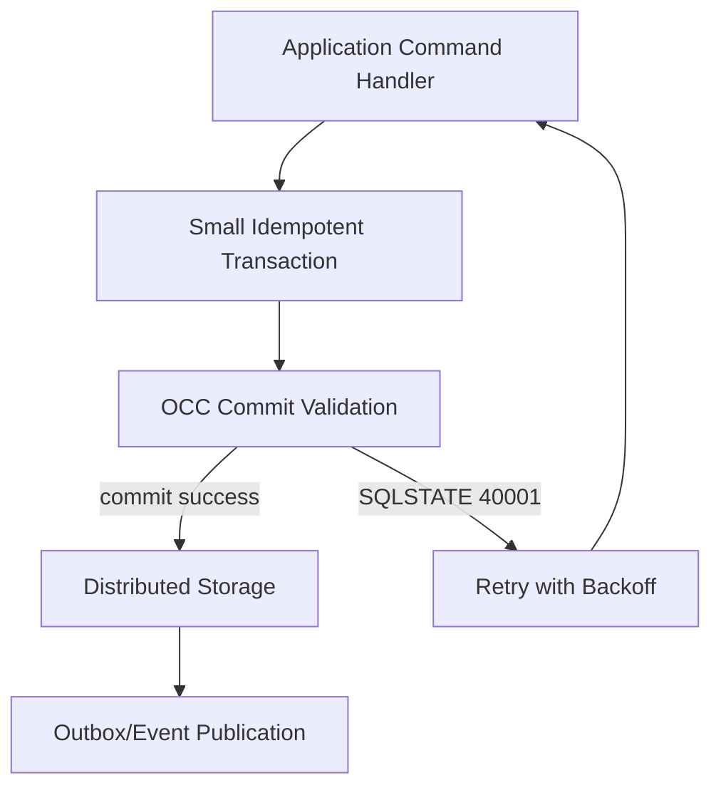
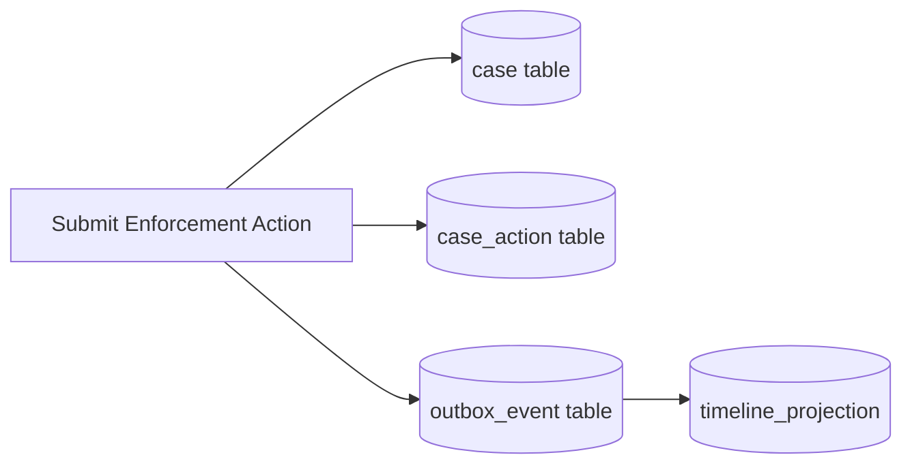
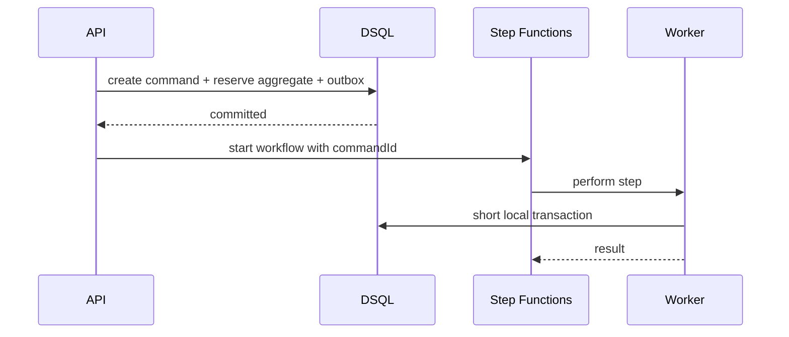
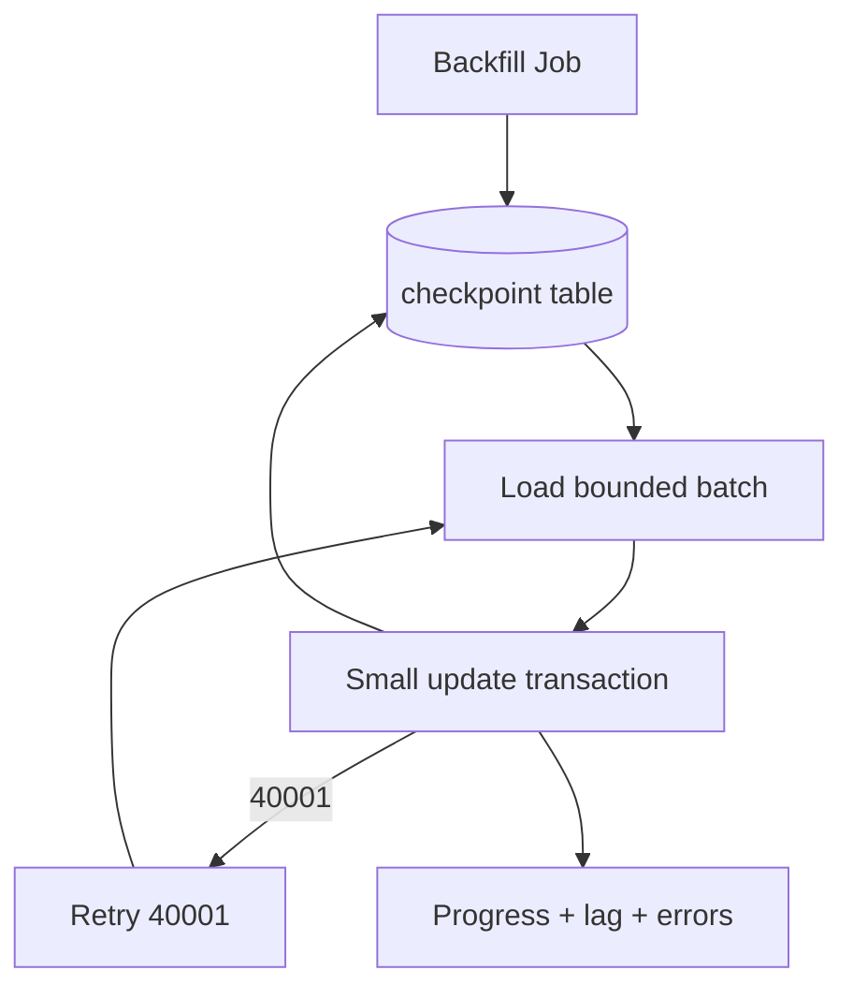

# Part 069 — DSQL Data Modeling: Transactional Boundaries, Key Design, Query Discipline

> Goal: setelah bagian ini, kamu bisa memodelkan data untuk Amazon Aurora DSQL sebagai **distributed transactional SQL database**, bukan sebagai PostgreSQL biasa yang kebetulan managed. Kamu akan belajar cara memilih aggregate boundary, primary key, transaction scope, uniqueness, referential integrity, indexes, JSON usage, schema evolution, dan retry-safe application logic.

Aurora DSQL memberi sesuatu yang menarik: SQL, ACID, PostgreSQL-compatible wire protocol, strong consistency, dan multi-Region active-active option. Tetapi desain data yang buruk tetap bisa membuat sistem lambat, mahal, konflik tinggi, atau sulit dioperasikan.

Mental model sederhananya:

```txt
Aurora DSQL removes manual sharding.
It does not remove data modeling.
```

Distributed SQL tidak berarti semua pola SQL lama aman dipindahkan apa adanya. Di database single-node, desain buruk sering muncul sebagai lock contention, deadlock, bloated indexes, slow query, atau replica lag. Di distributed SQL, desain buruk sering muncul sebagai conflict-at-commit, hot key, large transaction abort, unnecessary coordination, cross-Region latency, dan schema compatibility surprise.

---

## 1. What Aurora DSQL Changes

Aurora DSQL adalah relational database, tetapi operating model-nya berbeda dari RDS/Aurora PostgreSQL tradisional.

Key facts yang harus mempengaruhi data modeling:

- Aurora DSQL memakai PostgreSQL v3 wire protocol, sehingga client/tool umum seperti `psql`, pgjdbc, dan psycopg bisa digunakan.
- Aurora DSQL currently based on PostgreSQL 16 compatibility surface, tetapi hanya syntax/feature yang supported yang boleh diasumsikan.
- Isolation level fixed setara PostgreSQL `REPEATABLE READ`.
- Aurora DSQL memakai optimistic concurrency control atau OCC: transaction tidak saling block seperti lock-heavy database tradisional; conflict dievaluasi saat commit.
- Conflict yang terdeteksi muncul sebagai serialization failure `SQLSTATE 40001` dengan OCC code seperti `OC000` untuk data conflict dan `OC001` untuk schema/catalog conflict.
- DML transaction punya batas penting: maksimal 3,000 modified rows per transaction.
- DDL dan DML harus berada di transaction terpisah; satu transaction hanya bisa berisi satu DDL statement.
- Referential integrity seperti foreign key tidak menjadi primitive utama yang harus kamu andalkan; AWS guidance mendorong application-layer validation untuk relationship integrity pada Aurora DSQL migration patterns.
- DSQL mendukung JOIN, secondary indexes, standard DML, SQL functions tertentu, dan `CREATE INDEX ASYNC`, tetapi bukan seluruh fitur PostgreSQL.

Semua poin di atas membuat desain data harus lebih eksplisit.



Prinsip paling penting:

```txt
Design transactions that are small, deterministic, idempotent, and retryable.
```

---

## 2. DSQL Data Modeling Is Not Just Table Design

Untuk DSQL, data modeling harus menjawab lima pertanyaan sekaligus.

| Question | Why it matters |
|---|---|
| Apa aggregate yang berubah bersama? | Menentukan transaction boundary. |
| Apa key yang mendistribusikan load? | Menentukan hot key dan write contention. |
| Apa invariant yang harus strong? | Menentukan constraint, conditional update, dan retry. |
| Apa query path yang production-critical? | Menentukan index dan read model. |
| Apa operasi yang bisa diulang? | Menentukan idempotency dan conflict recovery. |

A weak model biasanya terlihat seperti ini:

```txt
We have entities: users, orders, order_items, invoices, payments.
Let's normalize everything and let transactions update whatever they need.
```

A production model harus lebih tajam:

```txt
Order command transaction mutates exactly one order aggregate and its command record.
Invoice creation is a separate command triggered by an outbox event.
Payment confirmation is idempotent and owns its own external reference.
Read models are rebuilt from source tables/events.
```

---

## 3. Start from Aggregate Boundary

Aggregate di sini bukan istilah DDD kosmetik. Aggregate adalah **unit consistency**.

A good aggregate boundary has these properties:

- bisa divalidasi dalam satu short transaction;
- punya owner command handler yang jelas;
- punya identity yang stabil;
- punya state machine yang eksplisit;
- tidak membutuhkan update massal untuk setiap command;
- tidak memaksa semua related entity ikut terkunci/terupdate;
- punya retry behavior yang deterministic.

Contoh regulatory case management:

```txt
Case
├─ Case status
├─ Assigned officer
├─ Current escalation level
├─ Key deadlines
├─ Version
└─ Minimal summary fields needed for command validation

CaseAction
├─ Immutable action record
├─ Actor
├─ Timestamp
└─ Evidence pointer

CaseTimelineProjection
└─ Derived read model, rebuildable
```

Yang strong biasanya `Case` state transition. Yang append-only bisa `CaseAction`. Yang derived bisa `CaseTimelineProjection`.



A command should not update every representation of the case. Itu membuat transaction besar dan replay sulit.

---

## 4. Transaction Boundary Rules

Untuk Aurora DSQL, transaction boundary yang baik biasanya mengikuti aturan berikut.

### Rule 1 — One command, one aggregate, one short transaction

```txt
Good:
ApproveCase(caseId, officerId, decision)
  - validate current case status
  - update case status/version
  - insert immutable decision record
  - insert outbox event
  - commit
```

```txt
Bad:
ApproveCase(caseId)
  - update case
  - update all case list rows
  - update dashboard counters
  - update officer workload summary
  - call external notification service
  - update audit search index
  - commit
```

The second pattern mixes source state, derived state, and side effects.

### Rule 2 — Do not hold business workflow inside one DB transaction

A long-running regulatory workflow should not be modeled as one transaction. Use Step Functions, events, or state machine rows.



### Rule 3 — Keep transaction write set small

Aurora DSQL transaction conflict probability grows when a transaction touches many rows or hot rows. AWS loading guidance explicitly recommends small transactions and notes that large transactions touching many rows are more likely to conflict.

Practical target:

```txt
Interactive command: usually < 10 modified rows
Batch command: hundreds, not thousands
Hard ceiling to remember: 3,000 modified rows per DML transaction
```

Do not design normal online commands near the ceiling. The ceiling is not a performance target.

### Rule 4 — External side effects happen after commit

External side effects include:

- sending email/SMS;
- calling payment API;
- publishing event directly;
- writing to search index;
- calling third-party case registry;
- pushing WebSocket notification.

Use outbox or workflow continuation after local commit.

---

## 5. Primary Key Design

Aurora DSQL automatically partitions/distributes data based on primary key range and access patterns. AWS migration guidance recommends UUIDs or application-generated IDs for optimal distribution, and concurrency guidance recommends random primary keys and avoiding contention on single keys/small key ranges.

That means sequential key habits deserve scrutiny.

### 5.1 Good primary key candidates

| Key type | Fit | Risk |
|---|---|---|
| UUIDv4 / random UUID | Good distribution | Not time-sortable. |
| UUIDv7 / time-ordered with randomness | Good operational sorting, usually better locality | Must validate distribution under workload. |
| ULID | Useful, sortable | Some implementations can cluster by timestamp under high write rate. |
| Natural business key | Useful as alternate unique key | Often changes or becomes hotspot. |
| Monotonic integer sequence | Familiar | Coordination overhead and locality/hotspot risk in distributed systems. |

The main heuristic:

```txt
Primary key should identify the row and distribute write pressure.
Business uniqueness should often be a separate unique constraint or command-level invariant.
```

### 5.2 Avoid one hot aggregate row for high-frequency counters

Bad:

```sql
UPDATE officer_workload
SET open_case_count = open_case_count + 1
WHERE officer_id = :officerId;
```

If every case assignment for one officer hits the same row, you create write contention. Options:

- derive count asynchronously;
- shard counter by bucket;
- compute from indexed source rows for low volume;
- update summary less frequently;
- separate online command correctness from dashboard freshness.

Example sharded counter:

```sql
CREATE TABLE officer_workload_counter_bucket (
  officer_id UUID NOT NULL,
  bucket_id INTEGER NOT NULL,
  open_case_delta INTEGER NOT NULL DEFAULT 0,
  updated_at TIMESTAMPTZ NOT NULL,
  PRIMARY KEY (officer_id, bucket_id)
);
```

For many systems, even better:

```txt
Do not store mutable counter as source of truth.
Store assignment events. Derive summary.
```

---

## 6. Entity Table Pattern

A clean entity table in Aurora DSQL should usually include:

- random/application-generated primary key;
- explicit domain status;
- optimistic version;
- timestamps;
- command/audit correlation;
- compact summary fields used for command validation;
- no large mutable blob unless justified.

Example:

```sql
CREATE TABLE enforcement_case (
  case_id UUID PRIMARY KEY,
  tenant_id UUID NOT NULL,
  case_number VARCHAR(64) NOT NULL,
  subject_id UUID NOT NULL,
  status VARCHAR(32) NOT NULL,
  escalation_level INTEGER NOT NULL DEFAULT 0,
  assigned_officer_id UUID,
  opened_at TIMESTAMPTZ NOT NULL,
  closed_at TIMESTAMPTZ,
  version BIGINT NOT NULL DEFAULT 0,
  created_at TIMESTAMPTZ NOT NULL,
  updated_at TIMESTAMPTZ NOT NULL,
  last_command_id UUID NOT NULL,
  UNIQUE (tenant_id, case_number)
);
```

Notes:

- `case_id` is technical identity and distribution key.
- `tenant_id, case_number` is business uniqueness.
- `version` supports compare-and-set semantics.
- `last_command_id` helps audit/reconciliation.
- Status is not derived from child rows at command time.

---

## 7. State Machine Modeling

A top-tier database model does not treat status as a string field that any code can mutate freely.

Define allowed transitions:

```txt
DRAFT -> OPEN
OPEN -> UNDER_REVIEW
UNDER_REVIEW -> ACTION_REQUIRED
UNDER_REVIEW -> CLOSED
ACTION_REQUIRED -> UNDER_REVIEW
CLOSED -> REOPENED
REOPENED -> UNDER_REVIEW
```

Implement at application boundary and optionally reinforce with constraints where supported.

Command handler pseudo-code:

```java
void transitionCase(UUID caseId, CaseStatus expectedStatus, CaseStatus nextStatus, UUID commandId) {
  retryOnSerializationFailure(() -> {
    begin();

    int inserted = insertCommandIfAbsent(commandId, caseId, "TRANSITION_CASE");
    if (inserted == 0) {
      return loadCommandResult(commandId);
    }

    CaseRow row = selectCase(caseId);
    if (!isAllowed(row.status(), expectedStatus, nextStatus)) {
      markCommandRejected(commandId, "INVALID_TRANSITION");
      commit();
      return rejected();
    }

    int updated = updateCaseStatus(
      caseId,
      expectedStatus,
      row.version(),
      nextStatus,
      commandId
    );

    if (updated == 0) {
      rollback();
      throw new RetryableConcurrencyException();
    }

    insertOutboxEvent(commandId, "CaseStatusChanged", ...);
    markCommandSucceeded(commandId, ...);
    commit();
  });
}
```

The model is not just SQL. It is SQL plus application-level invariants.

---

## 8. Optimistic Concurrency as a First-Class Modeling Constraint

Aurora DSQL OCC changes how you design contention.

Traditional lock-based thinking:

```txt
Take lock early.
Wait.
Then update.
```

OCC thinking:

```txt
Read snapshot.
Compute deterministic update.
Commit.
If conflict: retry full transaction.
```

That means your command must be safe to execute more than once.

### 8.1 Retry the whole transaction

Do not retry only the failed `COMMIT` as if nothing else matters. The data snapshot may be obsolete.

```java
<T> T withDsqlRetry(Supplier<T> transaction) {
  int attempt = 0;
  while (true) {
    try {
      return transaction.get();
    } catch (SQLException e) {
      if (!isSerializationFailure40001(e) || attempt >= MAX_ATTEMPTS) throw e;
      sleep(jitteredBackoff(attempt));
      attempt++;
    }
  }
}
```

### 8.2 Make transaction deterministic

Avoid non-deterministic side effects inside retried block:

```txt
Bad inside transaction retry:
- generate new external reference every attempt
- call external API
- publish event directly
- send email
- use current time in five inconsistent places
```

Better:

```txt
- commandId generated before retry loop
- requestHash fixed
- external idempotency key fixed
- timestamp captured once or generated by database consistently
- outbox event inserted transactionally
```

### 8.3 Conflict is not an incident by default

`SQLSTATE 40001` is expected under contention. It becomes an incident when:

- retry attempts frequently exceed budget;
- one aggregate/key dominates conflicts;
- p95/p99 command latency violates SLO;
- retries amplify database load;
- commands are not idempotent and cause duplicate side effects.

---

## 9. Uniqueness Modeling

Uniqueness is usually one of the strongest invariants.

Examples:

- case number unique per tenant;
- external report id unique per agency;
- idempotency key unique per client/route;
- payment reference unique globally;
- active assignment unique per case;
- one open investigation per regulated entity and category.

Use unique constraints where supported and fit the access pattern.

```sql
CREATE TABLE idempotency_command (
  command_id UUID PRIMARY KEY,
  tenant_id UUID NOT NULL,
  operation VARCHAR(128) NOT NULL,
  idempotency_key VARCHAR(256) NOT NULL,
  request_hash VARCHAR(128) NOT NULL,
  status VARCHAR(32) NOT NULL,
  response_json JSONB,
  created_at TIMESTAMPTZ NOT NULL,
  updated_at TIMESTAMPTZ NOT NULL,
  UNIQUE (tenant_id, operation, idempotency_key)
);
```

Subtle point:

```txt
Business uniqueness should not rely only on read-before-write.
```

Bad:

```sql
SELECT 1 FROM enforcement_case WHERE tenant_id = :tenantId AND case_number = :caseNumber;
-- none found
INSERT INTO enforcement_case (...);
```

Good:

```sql
INSERT INTO enforcement_case (...)
VALUES (...)
ON CONFLICT (tenant_id, case_number) DO NOTHING;
```

Then interpret the result deterministically.

---

## 10. Referential Integrity Without Naive Foreign-Key Dependence

In ordinary PostgreSQL, many teams put business graph correctness into foreign keys. In distributed systems, you often need a more deliberate approach.

Aurora DSQL supports table relationships and JOINs, but AWS migration guidance recommends application-layer validation for referential integrity patterns. This is not a license to ignore integrity; it is a shift in where integrity is enforced.

### 10.1 Application-layer referential integrity pattern

```txt
Command: AssignOfficerToCase(caseId, officerId)

Transaction:
1. Insert idempotency command if absent.
2. Load case by caseId.
3. Load officer by officerId.
4. Validate officer is active and eligible.
5. Update case assignment/version.
6. Insert case_action audit row.
7. Insert outbox event.
8. Commit.
```

This is acceptable when:

- all rows are read/written in a short transaction;
- invariant is validated by one command owner;
- reconciliation can detect broken references;
- delete semantics are explicit.

### 10.2 Deletion becomes lifecycle, not cascade

Instead of physical cascade delete:

```txt
RegulatedEntity deleted -> delete all cases -> delete all actions -> delete all evidence
```

Prefer lifecycle transition:

```txt
RegulatedEntity archived
Case remains immutable/auditable
Evidence retention policy controls deletion separately
Projection hides archived subjects when required
```

For regulatory systems, cascade delete is often a compliance hazard.

---

## 11. Relationship Modeling

### 11.1 One-to-many

One case has many actions:

```sql
CREATE TABLE case_action (
  action_id UUID PRIMARY KEY,
  case_id UUID NOT NULL,
  tenant_id UUID NOT NULL,
  action_type VARCHAR(64) NOT NULL,
  actor_id UUID NOT NULL,
  action_at TIMESTAMPTZ NOT NULL,
  command_id UUID NOT NULL,
  details JSONB,
  UNIQUE (tenant_id, command_id)
);

CREATE INDEX ASYNC case_action_case_time_idx
ON case_action (case_id, action_at DESC);
```

Model source actions as append-only. Do not update historical records except for narrowly defined correction workflows.

### 11.2 Many-to-many

Case assigned to labels/tags:

```sql
CREATE TABLE case_label_assignment (
  assignment_id UUID PRIMARY KEY,
  case_id UUID NOT NULL,
  label_id UUID NOT NULL,
  tenant_id UUID NOT NULL,
  assigned_at TIMESTAMPTZ NOT NULL,
  assigned_by UUID NOT NULL,
  removed_at TIMESTAMPTZ,
  UNIQUE (tenant_id, case_id, label_id, removed_at)
);
```

But be careful with partial active uniqueness if unsupported or impractical. Alternative:

```sql
CREATE TABLE active_case_label (
  case_id UUID NOT NULL,
  label_id UUID NOT NULL,
  tenant_id UUID NOT NULL,
  assigned_at TIMESTAMPTZ NOT NULL,
  assigned_by UUID NOT NULL,
  PRIMARY KEY (case_id, label_id)
);
```

And move history to append-only table.

### 11.3 Hierarchies

For case escalation tree or organizational hierarchy, choose based on mutation/query:

| Pattern | Good for | Risk |
|---|---|---|
| Parent pointer | Simple tree, low query depth | Recursive query complexity. |
| Materialized path | Fast subtree query | Expensive move/rename. |
| Closure table | Complex hierarchy query | More writes per relationship change. |
| Projection table | Read-heavy hierarchy UI | Eventual consistency. |

In DSQL, avoid massive hierarchy move transaction. Treat large tree re-parenting as job/workflow.

---

## 12. Index Strategy

Indexes are not free. In distributed SQL, indexes add write work and may affect commit coordination.

Design indexes from production queries, not from entity fields.

### 12.1 Query inventory

For every table, maintain query inventory:

| Query | Predicate | Sort | Cardinality | SLO | Index |
|---|---|---|---|---|---|
| Load case by id | `case_id = ?` | none | 1 | p95 20ms | PK |
| List open cases by officer | `tenant_id, officer_id, status` | `opened_at desc` | thousands | p95 100ms | composite |
| Find case number | `tenant_id, case_number` | none | 1 | p95 30ms | unique |
| Timeline | `case_id` | `action_at desc` | 10-1000 | p95 100ms | composite |

Example:

```sql
CREATE INDEX ASYNC case_open_by_officer_idx
ON enforcement_case (tenant_id, assigned_officer_id, status, opened_at DESC);
```

### 12.2 Index anti-patterns

Avoid:

- indexing every foreign-looking column;
- indexing low-cardinality boolean/status alone;
- indexing JSONB as if it were PostgreSQL GIN everywhere without checking DSQL support;
- creating indexes for admin-only rare queries on hot write tables;
- assuming index creation is instant or free;
- ignoring write amplification.

### 12.3 Async index creation

Aurora DSQL supports `CREATE INDEX ASYNC`. Treat index creation as schema migration with observability and rollback plan.

```sql
CREATE INDEX ASYNC case_action_case_time_idx
ON case_action (case_id, action_at DESC);
```

Runbook:

```txt
1. Confirm query inventory.
2. Add index asynchronously.
3. Monitor build/progress where available.
4. Deploy query path that can use it.
5. Validate query plan and latency.
6. Remove obsolete indexes intentionally.
```

---

## 13. JSON and JSONB Usage

Aurora DSQL supports `json` and `jsonb` with limits and support boundaries. Use JSON for flexible details, not as an excuse to skip modeling.

Good JSON usage:

```sql
CREATE TABLE case_action (
  action_id UUID PRIMARY KEY,
  case_id UUID NOT NULL,
  action_type VARCHAR(64) NOT NULL,
  details JSONB,
  action_at TIMESTAMPTZ NOT NULL
);
```

Because `details` is action-specific and usually read with the action.

Bad JSON usage:

```sql
CREATE TABLE enforcement_case (
  case_id UUID PRIMARY KEY,
  entire_case JSONB NOT NULL
);
```

Because command validation, indexing, and schema evolution become implicit and fragile.

Heuristic:

```txt
Put stable invariants in columns.
Put variable display/audit details in JSON.
Do not hide command-critical state in JSON.
```

---

## 14. Outbox Table for DSQL

The outbox pattern remains essential.

```sql
CREATE TABLE outbox_event (
  event_id UUID PRIMARY KEY,
  aggregate_type VARCHAR(64) NOT NULL,
  aggregate_id UUID NOT NULL,
  event_type VARCHAR(128) NOT NULL,
  event_version INTEGER NOT NULL,
  occurred_at TIMESTAMPTZ NOT NULL,
  payload JSONB NOT NULL,
  publish_status VARCHAR(32) NOT NULL,
  publish_attempts INTEGER NOT NULL DEFAULT 0,
  next_attempt_at TIMESTAMPTZ,
  published_at TIMESTAMPTZ,
  command_id UUID NOT NULL,
  UNIQUE (command_id, event_type)
);

CREATE INDEX ASYNC outbox_pending_idx
ON outbox_event (publish_status, next_attempt_at, occurred_at);
```

Important design points:

- event is created in the same transaction as source state;
- publisher is idempotent;
- target publish uses `event_id` as idempotency/dedup key;
- consumers still deduplicate;
- replay is expected.

Outbox publisher loop:

```java
List<OutboxEvent> batch = loadPendingOutbox(now, limit);
for (OutboxEvent event : batch) {
  try {
    publishToEventBridge(event.eventId(), event.eventType(), event.payload());
    markPublished(event.eventId());
  } catch (Exception e) {
    markPublishFailed(event.eventId(), nextAttemptWithBackoff());
  }
}
```

Do not publish directly inside the command transaction.

---

## 15. Inbox Table for Idempotent Consumers

If your DSQL-backed service consumes SQS/EventBridge/SNS messages, use an inbox table.

```sql
CREATE TABLE inbox_message (
  message_id UUID PRIMARY KEY,
  source VARCHAR(128) NOT NULL,
  message_type VARCHAR(128) NOT NULL,
  received_at TIMESTAMPTZ NOT NULL,
  processed_at TIMESTAMPTZ,
  status VARCHAR(32) NOT NULL,
  payload_hash VARCHAR(128) NOT NULL,
  error_code VARCHAR(128),
  attempts INTEGER NOT NULL DEFAULT 0
);
```

Consumer transaction:

```txt
1. Insert inbox row with message_id.
2. If conflict and status=processed, ack message.
3. Validate message contract.
4. Apply local mutation.
5. Insert outbox event if needed.
6. Mark inbox processed.
7. Commit.
8. Ack message.
```

This gives replay safety.

---

## 16. Query Discipline

Aurora DSQL supports many familiar SQL constructs, including joins and common clauses, but production query discipline still matters.

### 16.1 Command query vs read query

Command query:

```txt
Small, indexed, deterministic, used to validate one command.
```

Read query:

```txt
May be broader, paginated, sometimes derived/projection-backed.
```

Never let a user-facing list query become part of command correctness.

### 16.2 Pagination

Avoid offset pagination for large, mutable datasets.

Bad:

```sql
SELECT *
FROM enforcement_case
WHERE tenant_id = :tenantId
ORDER BY opened_at DESC
OFFSET 50000
LIMIT 50;
```

Better keyset pagination:

```sql
SELECT *
FROM enforcement_case
WHERE tenant_id = :tenantId
  AND status = 'OPEN'
  AND (opened_at, case_id) < (:lastOpenedAt, :lastCaseId)
ORDER BY opened_at DESC, case_id DESC
LIMIT 50;
```

### 16.3 Report queries

Do not run unbounded operational reports against hot OLTP tables if they threaten command SLO.

Options:

- projection tables;
- OpenSearch projection for search;
- S3/warehouse export for analytics;
- periodic materialized summaries controlled by workflow;
- read model updated by events.

---

## 17. Multi-Tenancy Modeling

Common choices:

| Model | Fit | Risk |
|---|---|---|
| Shared tables with `tenant_id` | Many tenants, operational simplicity | Need strict tenant filtering and index design. |
| Schema per tenant | Stronger logical separation | More schema management complexity. |
| Cluster per tenant | High isolation/regulatory boundary | Higher operational/cost overhead. |

For shared tables, include `tenant_id` in business unique constraints and access-path indexes.

```sql
CREATE TABLE regulated_entity (
  entity_id UUID PRIMARY KEY,
  tenant_id UUID NOT NULL,
  registration_number VARCHAR(128) NOT NULL,
  legal_name VARCHAR(512) NOT NULL,
  status VARCHAR(32) NOT NULL,
  created_at TIMESTAMPTZ NOT NULL,
  updated_at TIMESTAMPTZ NOT NULL,
  UNIQUE (tenant_id, registration_number)
);
```

But think carefully before putting `tenant_id` first in every primary key. The primary key also participates in data distribution. Validate hot tenant behavior with load tests.

---

## 18. Schema Evolution

Aurora DSQL runs DDL operations asynchronously and coordinates schema changes in a distributed architecture. Schema changes can still conflict with transactions via `OC001` when cached schema catalog is stale and cannot safely rebase.

Safe schema evolution pattern:

```txt
Expand -> Backfill -> Dual-read/write if needed -> Switch -> Contract
```

Example: adding `priority` to case.

### Step 1 — Expand

```sql
ALTER TABLE enforcement_case
ADD COLUMN priority VARCHAR(32);
```

### Step 2 — Deploy app that writes both old/new behavior

```txt
New commands set priority.
Old rows can still be null.
Read path handles null as default.
```

### Step 3 — Backfill in small chunks

```txt
Batch size: hundreds, not thousands.
Retry SQLSTATE 40001.
Track checkpoint.
Do not update 3,000+ rows in one transaction.
```

### Step 4 — Enforce contract later

Only after backfill and app rollout.

---

## 19. Data Loading and Backfill

AWS DSQL loading guidance recommends:

- multi-row inserts instead of one row per statement;
- parameterized queries;
- small transactions because OCC conflicts are more likely for large transactions touching many rows;
- retry logic with exponential backoff;
- parallelization across connections.

Backfill worker design:



Checkpoint table:

```sql
CREATE TABLE backfill_job_checkpoint (
  job_name VARCHAR(128) PRIMARY KEY,
  last_key UUID,
  status VARCHAR(32) NOT NULL,
  updated_at TIMESTAMPTZ NOT NULL,
  processed_count BIGINT NOT NULL DEFAULT 0,
  error_count BIGINT NOT NULL DEFAULT 0
);
```

Backfill rules:

```txt
- never run unbounded update without checkpoint;
- never assume no concurrent writes;
- never skip idempotency;
- never run only in production first;
- never ignore retry metrics.
```

---

## 20. Large Object and Payload Strategy

Do not store unbounded files or evidence blobs in DSQL rows. Use S3 for large payloads and store metadata/pointers.

```sql
CREATE TABLE evidence_document (
  evidence_id UUID PRIMARY KEY,
  case_id UUID NOT NULL,
  tenant_id UUID NOT NULL,
  s3_bucket VARCHAR(256) NOT NULL,
  s3_key VARCHAR(1024) NOT NULL,
  sha256 VARCHAR(64) NOT NULL,
  content_type VARCHAR(128) NOT NULL,
  size_bytes BIGINT NOT NULL,
  uploaded_by UUID NOT NULL,
  uploaded_at TIMESTAMPTZ NOT NULL,
  retention_class VARCHAR(64) NOT NULL
);
```

Database stores:

- identity;
- pointer;
- checksum;
- classification;
- lifecycle metadata;
- audit linkage.

S3 stores bytes.

---

## 21. Case Study: Enforcement Lifecycle Model

Assume platform needs:

- create case;
- assign officer;
- submit evidence;
- escalate if SLA breach;
- approve enforcement action;
- notify external registry;
- show timeline and dashboards;
- audit every action.

### Source tables

```txt
enforcement_case
case_action
evidence_document
idempotency_command
outbox_event
inbox_message
```

### Derived tables

```txt
case_timeline_projection
case_search_projection
case_dashboard_summary
officer_workload_summary
```

### Workflow state

```txt
Step Functions execution or workflow_state table
```

### Rules

| Concern | Source of truth |
|---|---|
| Current case status | `enforcement_case` |
| Historical actions | `case_action` |
| Evidence bytes | S3 |
| Evidence metadata | `evidence_document` |
| Event publication | `outbox_event` |
| External notification result | integration-specific command/result table |
| Search UI | projection, not source |
| Dashboard | projection, not source |

Command transaction for `ApproveEnforcementAction`:

```txt
1. Insert idempotency command.
2. Load case by case_id.
3. Validate status allows approval.
4. Update case status/version.
5. Insert case_action approval record.
6. Insert outbox event EnforcementActionApproved.
7. Mark command completed.
8. Commit.
```

Everything else happens after commit.

---

## 22. Anti-Patterns

### Anti-pattern 1 — Treating DSQL as unlimited PostgreSQL

Wrong assumption:

```txt
It speaks PostgreSQL, so every PostgreSQL feature/pattern is safe.
```

Better:

```txt
It is PostgreSQL-compatible for supported syntax and behavior; check supported features and distributed constraints.
```

### Anti-pattern 2 — Large cross-aggregate transaction

```txt
One command updates 1 case, 500 child rows, 20 summaries, 3 dashboards, and publishes event.
```

Better:

```txt
Short source transaction + outbox + projection rebuild.
```

### Anti-pattern 3 — Hot sequence as central ID generator

Sequential IDs are familiar, but random/application-generated IDs are often a better default for distribution.

### Anti-pattern 4 — Mutable JSON source blob

JSON is useful for flexible detail, not for hiding all invariants.

### Anti-pattern 5 — Dashboard as source of truth

Summary tables are projections. They can be stale and rebuildable.

### Anti-pattern 6 — Ignoring `40001`

OCC conflicts must be first-class in application code.

---

## 23. Data Modeling Review Checklist

For each table:

```txt
[ ] What is the primary key and why does it distribute writes?
[ ] What business uniqueness is enforced?
[ ] Which commands mutate this table?
[ ] What is the max rows modified per command?
[ ] What queries require indexes?
[ ] Which fields are source-of-truth vs derived?
[ ] Which fields are command-critical vs display-only?
[ ] Is JSON used only where schema flexibility is intentional?
[ ] How does schema evolution happen without downtime?
[ ] How do backfills avoid large transactions?
[ ] How are OCC conflicts retried and measured?
[ ] What reconciliation detects broken references or stale projections?
```

For each transaction:

```txt
[ ] Is it idempotent?
[ ] Is it deterministic under retry?
[ ] Does it avoid external side effects before commit?
[ ] Does it avoid touching high-contention rows unnecessarily?
[ ] Does it stay far below 3,000 modified rows?
[ ] Does it produce outbox events transactionally?
[ ] Does it handle SQLSTATE 40001 with full transaction retry?
```

---

## 24. Minimal ADR Template

```mdx
# ADR: Use Aurora DSQL for <domain/workload>

## Context
- Workload:
- Regions:
- Consistency requirement:
- Transaction shape:
- Expected QPS/write rate:
- Data size:
- Regulatory constraints:

## Decision
Use Aurora DSQL for <source-of-truth tables>.

## Data model
- Aggregate:
- Primary key strategy:
- Unique constraints:
- Source tables:
- Projection tables:
- Outbox/inbox:

## Transaction rules
- Max modified rows per command:
- Retry policy for SQLSTATE 40001:
- Idempotency key:
- External side effects:

## Query rules
- Production queries:
- Indexes:
- Forbidden queries:

## Consequences
- Benefits:
- Risks:
- Failure modes:
- Migration path:
- Rollback path:
```

---

## 25. Summary

Aurora DSQL data modeling is about making **distributed consistency explicit**.

The practical rules:

1. Model aggregate boundary before tables.
2. Keep transactions short, deterministic, and idempotent.
3. Use random/application-generated keys unless a stronger reason exists.
4. Avoid hot keys and centralized mutable counters.
5. Enforce uniqueness with constraints, not read-before-write.
6. Treat foreign-key-like integrity as application-layer invariant plus reconciliation where necessary.
7. Use outbox/inbox for reliable event and message boundaries.
8. Use JSON for flexible detail, not hidden core state.
9. Use async schema evolution and small backfills.
10. Treat `SQLSTATE 40001` as expected production behavior requiring full transaction retry.

Top engineers do not ask only:

```txt
Can DSQL store this schema?
```

They ask:

```txt
Can this schema survive retries, conflicts, regional latency, schema evolution, replay, backfill, audit, and production incidents?
```

---

## References

- AWS Docs — Aurora DSQL and PostgreSQL: https://docs.aws.amazon.com/aurora-dsql/latest/userguide/working-with.html
- AWS Docs — Concurrency control in Aurora DSQL: https://docs.aws.amazon.com/aurora-dsql/latest/userguide/working-with-concurrency-control.html
- AWS Docs — Migrating from PostgreSQL to Aurora DSQL: https://docs.aws.amazon.com/aurora-dsql/latest/userguide/working-with-postgresql-compatibility-migration-guide.html
- AWS Docs — SQL feature compatibility in Aurora DSQL: https://docs.aws.amazon.com/aurora-dsql/latest/userguide/working-with-postgresql-compatibility.html
- AWS Docs — Supported data types in Aurora DSQL: https://docs.aws.amazon.com/aurora-dsql/latest/userguide/working-with-postgresql-compatibility-supported-data-types.html
- AWS Docs — Supported SQL for Aurora DSQL: https://docs.aws.amazon.com/aurora-dsql/latest/userguide/working-with-postgresql-compatibility-supported-sql-features.html
- AWS Docs — CREATE TABLE support in Aurora DSQL: https://docs.aws.amazon.com/aurora-dsql/latest/userguide/create-table-syntax-support.html
- AWS Docs — Loading data into Aurora DSQL: https://docs.aws.amazon.com/aurora-dsql/latest/userguide/loading-data.html
