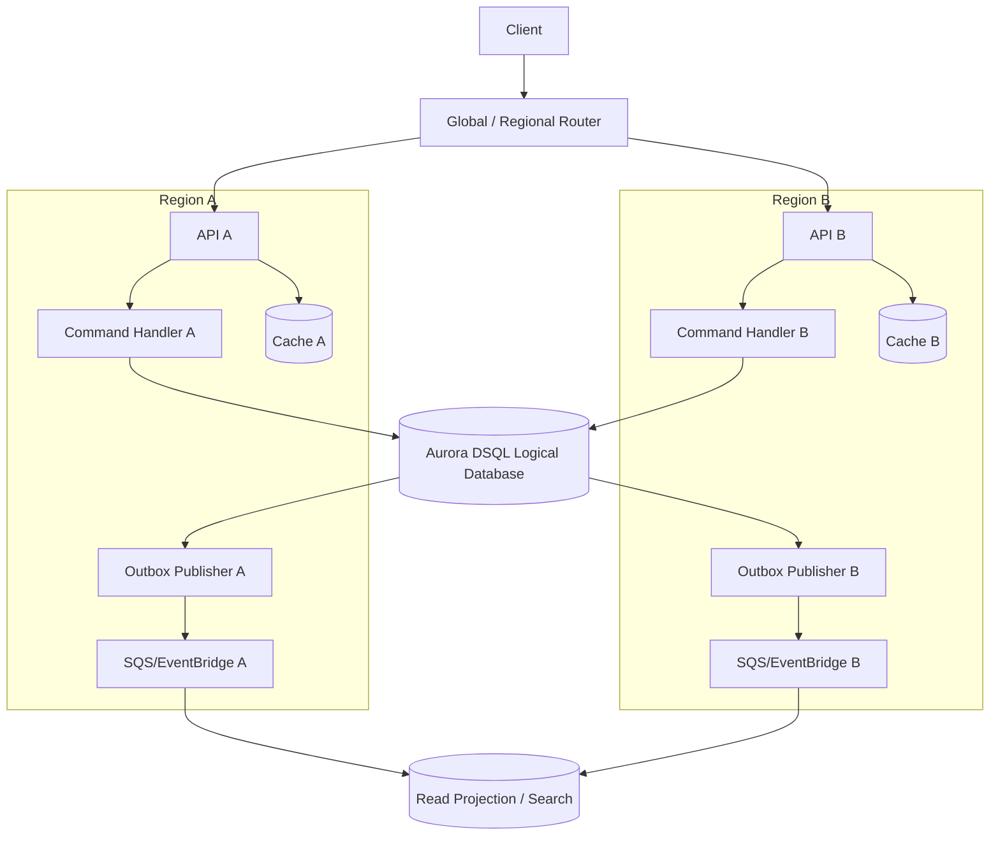
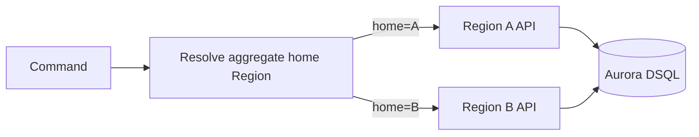
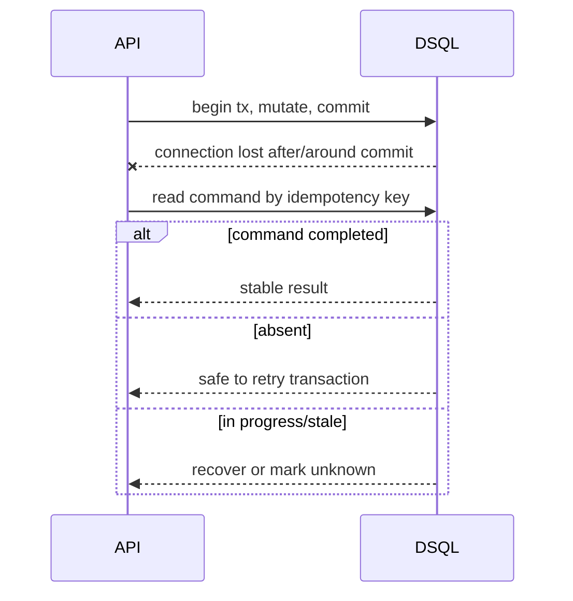
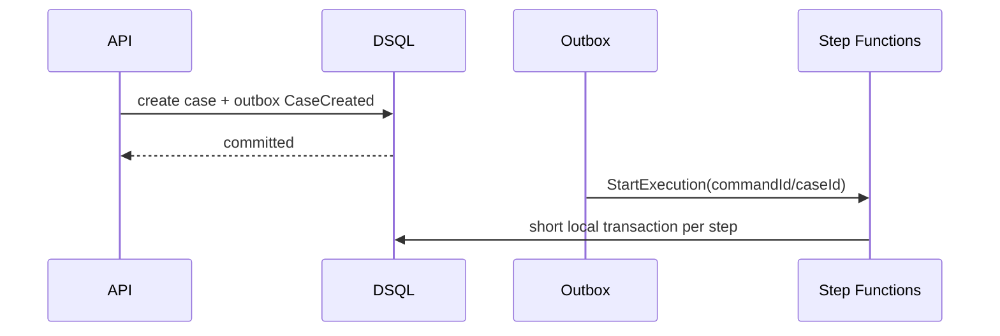

# Part 070 — DSQL Application Patterns: Multi-Region Write, Conflict Avoidance, Failover

> Goal: setelah bagian ini, kamu bisa membangun application layer di atas Aurora DSQL yang aman untuk active-active, retry, failover, outbox, workflow, cache, dan projection. Fokusnya bukan hanya “connect ke endpoint DSQL”, tetapi bagaimana request path, worker path, dan event path tetap benar ketika ada OCC conflict, regional routing, duplicate command, dan partial failure.

Aurora DSQL memberi database layer yang strongly consistent dan distributed. Tetapi application correctness tetap tanggung jawab aplikasi.

Kalimat yang harus diingat:

```txt
Strong database consistency does not automatically create strong application behavior.
```

Aplikasi masih harus memutuskan:

- Region mana yang menerima command?
- Bagaimana retry saat `SQLSTATE 40001`?
- Apa idempotency key untuk command?
- Bagaimana external side effect dicegah dari duplicate?
- Bagaimana event dipublish setelah commit?
- Bagaimana cache/projection invalidation bekerja?
- Bagaimana queue/workflow tidak mengeksekusi command yang sama di dua Region?
- Bagaimana traffic shift terjadi saat endpoint/Region bermasalah?

---

## 1. Baseline Architecture

A production Aurora DSQL application should separate these planes:

| Plane | Responsibility |
|---|---|
| API plane | Accept command/query, auth, validation, idempotency key. |
| Command plane | Execute short idempotent transaction against DSQL. |
| Event plane | Publish outbox events after commit. |
| Worker plane | Consume messages and run idempotent local transactions. |
| Workflow plane | Coordinate long-running steps without holding DB transaction. |
| Read plane | Serve queries from DSQL or projection/cache depending on freshness. |
| Operations plane | Observe conflicts, latency, retries, endpoint health, publish lag. |



Do not blur all planes into one transaction.

---

## 2. Connection Pattern

Aurora DSQL uses the PostgreSQL wire protocol and requires SSL. It uses IAM authentication tokens instead of long-lived passwords. Single-Region clusters provide a managed endpoint; multi-Region peered clusters expose regional endpoints.

Application implications:

- token generation belongs to connection creation path;
- connection pool must handle token expiry for new sessions;
- set `application_name` so sessions are attributable;
- expect connection errors during fault injection/regional impairment;
- do not hardcode only one Region endpoint if the architecture claims active-active.

Pseudo configuration:

```yaml
app:
  database:
    endpoints:
      ap-northeast-1: case-prod-a.cluster-id.dsql.ap-northeast-1.on.aws
      ap-northeast-3: case-prod-b.cluster-id.dsql.ap-northeast-3.on.aws
    sslMode: require
    dbName: postgres
    auth: iam-token
    applicationName: enforcement-command-api
    pool:
      maxSize: 40
      connectionMaxLifetime: 50m
      acquisitionTimeout: 2s
```

Why `connectionMaxLifetime` below one hour? Aurora DSQL documentation notes database connections time out after one hour in its PostgreSQL compatibility considerations. A client pool should not discover this only through random production failures.

---

## 3. Endpoint Routing Pattern

There are two broad routing modes.

### 3.1 Nearest-region routing

```txt
Client -> nearest healthy Region -> local DSQL endpoint
```

Good for latency-sensitive applications where any Region can accept writes.

Risks:

- same aggregate may receive concurrent writes from two Regions;
- conflict probability increases for global hot aggregates;
- external side effects may duplicate if command idempotency is weak;
- operator mental model is harder.

### 3.2 Aggregate-home routing

```txt
caseId / tenantId / accountId -> home Region -> that Region API -> local DSQL endpoint
```

Good for reducing write conflict and making ownership explicit.

Risks:

- more routing logic;
- failover must re-home or temporarily route home to alternate Region;
- not all user traffic uses nearest Region.

Recommended default for business-critical transactional systems:

```txt
Use aggregate-home routing for writes.
Use nearest-region routing for safe reads.
```



---

## 4. Command Handler Pattern

A DSQL command handler should be:

- idempotent;
- short;
- deterministic;
- full-transaction retryable;
- outbox-producing;
- external-side-effect-free inside transaction.

Canonical flow:

```txt
1. Validate API request shape.
2. Resolve command identity.
3. Choose Region/endpoint.
4. Enter retry loop for retryable transaction errors.
5. Insert or load command record.
6. Load aggregate source row(s).
7. Validate invariant.
8. Mutate source row(s).
9. Insert audit/action row.
10. Insert outbox event.
11. Commit.
12. Return stable response.
```

Pseudo-code:

```java
public CommandResult approveCase(ApproveCaseRequest req) {
  UUID commandId = stableCommandId(req.idempotencyKey());
  String requestHash = hashCanonical(req);

  return dsqlRetry.execute(() -> tx.inTransaction(() -> {
    CommandRecord existing = commandStore.insertOrGet(
      commandId,
      req.tenantId(),
      "ApproveCase",
      req.idempotencyKey(),
      requestHash
    );

    if (existing.isCompleted()) return existing.result();
    if (existing.hasDifferentRequestHash(requestHash)) {
      return rejectIdempotencyConflict(commandId);
    }

    CaseRow c = caseRepo.get(req.caseId());
    domainPolicy.assertCanApprove(c, req.actorId());

    caseRepo.updateStatus(
      c.caseId(),
      c.version(),
      "APPROVED",
      commandId
    );

    actionRepo.insertApprovalAction(commandId, c.caseId(), req.actorId(), req.reason());
    outbox.insert(commandId, "CaseApproved", payload(...));

    CommandResult result = CommandResult.accepted(c.caseId(), commandId);
    commandStore.complete(commandId, result);
    return result;
  }));
}
```

Key idea:

```txt
Idempotency is not a cache entry.
It is part of the command state machine.
```

---

## 5. OCC Retry Pattern

Aurora DSQL returns `SQLSTATE 40001` for OCC conflict. Application code must retry the full transaction with exponential backoff and jitter.

### 5.1 Retry classification

| Error | Meaning | Action |
|---|---|---|
| `40001` + `OC000` | Data conflict | Retry full transaction. |
| `40001` + `OC001` | Schema/catalog conflict | Retry after short delay; investigate if persistent during migration. |
| connection failure before commit known | Ambiguous | Re-read command record by idempotency key. |
| validation failure | Business reject | Do not retry automatically. |
| unique constraint violation | Maybe duplicate command/business conflict | Interpret based on constraint. |

### 5.2 Retry budget

```yaml
retry:
  serializationFailure:
    maxAttempts: 5
    baseDelayMs: 20
    maxDelayMs: 500
    jitter: full
  ambiguousCommit:
    maxAttempts: 3
    recovery: read-command-record
```

### 5.3 Ambiguous commit recovery

Problem:

```txt
Application sends COMMIT.
Network fails before response.
Did commit succeed?
```

Solution:

```txt
Do not re-run blindly.
Read by command_id/idempotency_key.
If command completed, return stored result.
If command absent/in-progress after timeout, use recovery policy.
```



---

## 6. Conflict Avoidance Patterns

### 6.1 Avoid global mutable rows

Bad:

```txt
system_config.current_case_number++
tenant_summary.open_cases++
global_sequence.nextval()
```

Better:

- application-generated IDs;
- per-aggregate state;
- append-only event/action rows;
- sharded counters;
- async summaries;
- allocate number ranges per tenant/period only when business requires sequential numbering.

### 6.2 Use reservation records

For unique scarce resource:

```sql
CREATE TABLE case_number_reservation (
  tenant_id UUID NOT NULL,
  case_number VARCHAR(64) NOT NULL,
  command_id UUID NOT NULL,
  reserved_at TIMESTAMPTZ NOT NULL,
  status VARCHAR(32) NOT NULL,
  PRIMARY KEY (tenant_id, case_number)
);
```

Command flow:

```txt
1. Insert reservation with unique key.
2. If exists, compare command_id.
3. Create case using reserved number.
4. Mark reservation consumed.
```

### 6.3 Use append-only logs for high-contention workflows

Instead of updating one row for every event:

```sql
CREATE TABLE case_sla_event (
  sla_event_id UUID PRIMARY KEY,
  case_id UUID NOT NULL,
  event_type VARCHAR(64) NOT NULL,
  event_at TIMESTAMPTZ NOT NULL,
  command_id UUID NOT NULL
);
```

Then derive current SLA state with a projection or bounded command query.

---

## 7. Multi-Region Write Pattern

Aurora DSQL multi-Region clusters present one logical database through two Regional endpoints that can both accept concurrent read/write with strong consistency. That enables multi-Region write application designs, but you still need policy.

### 7.1 Write policy options

| Policy | Description | Use when |
|---|---|---|
| Any-region write | Any healthy Region accepts any command | Low contention, global UX priority. |
| Home-region write | Aggregate/tenant has preferred write Region | Strong operational control. |
| Command-type routing | Some commands global, some home-bound | Mixed workloads. |
| Failover write | Normal home routing, alternate on failure | Most regulated transactional systems. |

### 7.2 Recommended command envelope

```json
{
  "commandId": "uuid",
  "tenantId": "uuid",
  "aggregateType": "EnforcementCase",
  "aggregateId": "uuid",
  "aggregateHomeRegion": "ap-northeast-1",
  "submittedRegion": "ap-northeast-3",
  "operation": "ApproveCase",
  "idempotencyKey": "client-key",
  "requestHash": "sha256",
  "causationId": "uuid",
  "correlationId": "uuid",
  "submittedAt": "2026-07-07T10:15:30Z"
}
```

This envelope makes regional behavior auditable.

### 7.3 Region-local API, global database

Do not assume a global database means global application state is solved. Each Region still has:

- local API instances;
- local caches;
- local queues;
- local workflow executions;
- local logs/traces;
- local IAM/network failures;
- local third-party reachability.

Design each layer explicitly.

---

## 8. Outbox Publisher in Active-Active

If both Regions run outbox publishers against one DSQL database, you must avoid duplicate publication.

Pattern: claim rows before publish.

```sql
UPDATE outbox_event
SET publish_status = 'CLAIMED',
    claimed_by = :publisherId,
    claimed_at = :now,
    publish_attempts = publish_attempts + 1
WHERE event_id = :eventId
  AND publish_status = 'PENDING';
```

Then publish only if update count is 1.

But be careful:

```txt
Claim then publish then mark published
```

can still fail between publish and mark. Therefore target consumers must deduplicate by `event_id`.

Better publication semantics:

- outbox event ID stable;
- EventBridge/SNS/SQS message carries event ID;
- consumer inbox deduplicates;
- publisher retry is allowed;
- published flag is optimization, not sole correctness guarantee.

---

## 9. Queue and Worker Pattern

If workers run in both Regions, ask:

```txt
Is the queue regional or global?
Can the same logical message be processed in both Regions?
Who owns retries?
Where is idempotency recorded?
```

Recommended baseline:

```txt
Regional queue + DSQL inbox table + idempotent command transaction
```

Worker flow:

```txt
1. Receive message.
2. Parse event envelope.
3. Insert inbox row by event_id/message_id.
4. If already processed, ack.
5. Apply local transaction to DSQL.
6. Insert outbox if needed.
7. Mark inbox processed.
8. Commit.
9. Ack message.
```

This survives:

- duplicate message;
- worker crash after commit before ack;
- cross-Region duplicate event;
- replay;
- publisher duplicate.

---

## 10. Workflow Pattern with Step Functions

Step Functions and Aurora DSQL fit well if you keep responsibilities separate.

```txt
Step Functions owns process progress.
Aurora DSQL owns domain state.
```

Do not store all workflow progress only in DSQL if you need durable orchestration semantics. Do not store all domain correctness only in Step Functions if you need queryable/auditable source state.

### 10.1 Start workflow after command commit



### 10.2 Execution name idempotency

For Standard Workflows, use a stable execution name derived from command/workflow identity. If API retries, you should not create duplicate workflows.

Example:

```txt
executionName = workflowType + '-' + commandId
```

### 10.3 Callback token and DSQL

For human approval:

```txt
1. Workflow creates approval_requested row in DSQL.
2. Workflow waits with callback token.
3. Human action API updates DSQL in short transaction.
4. API sends task success/failure using token.
5. Workflow continues.
```

Keep approval domain state in DSQL. Keep orchestration wait in Step Functions.

---

## 11. Cache Pattern

Strongly consistent DSQL does not make cache strongly consistent.

Use cache only with clear freshness semantics.

| Pattern | Fit | Risk |
|---|---|---|
| Cache-aside for read-heavy reference data | Good | Stale reads. |
| Versioned cache key | Good for aggregate reads | More storage churn. |
| Event-driven invalidation | Good if events reliable | Race/reorder risk. |
| Write-through cache | Rarely worth it for critical state | Partial failure. |
| Cache as source of truth | Avoid unless intentionally MemoryDB-style | Data loss/correctness risk. |

Recommended aggregate cache key:

```txt
case:{caseId}:v:{version}
```

When DSQL row version changes, old cache key naturally becomes obsolete.

Avoid:

```txt
case:{caseId}
```

unless you have explicit invalidation and staleness tolerance.

---

## 12. Projection Pattern

Read models are often necessary:

- timeline view;
- search page;
- dashboard counters;
- officer workload list;
- compliance report summary.

Projection rules:

```txt
Source state is DSQL.
Projection is rebuildable.
Projection freshness is measured.
Projection writes are idempotent.
Projection consumers deduplicate by event_id.
```

Projection status table:

```sql
CREATE TABLE projection_checkpoint (
  projection_name VARCHAR(128) PRIMARY KEY,
  last_event_time TIMESTAMPTZ,
  last_event_id UUID,
  lag_seconds INTEGER NOT NULL DEFAULT 0,
  status VARCHAR(32) NOT NULL,
  updated_at TIMESTAMPTZ NOT NULL
);
```

Do not promise strong consistency for projection-backed UI unless you can actually prove it.

---

## 13. Read Path Pattern

Choose read path by freshness requirement.

| Read type | Recommended path |
|---|---|
| Command confirmation | DSQL source row by primary key. |
| Read-your-write detail page | DSQL source row or version-aware cache. |
| List/search | Projection/OpenSearch/read model. |
| Dashboard | Projection with freshness indicator. |
| Audit/legal view | Source tables + immutable action log. |
| Analytics | Export/warehouse, not hot OLTP query. |

Read response should expose freshness where relevant:

```json
{
  "items": [],
  "projectionFreshness": {
    "asOf": "2026-07-07T10:20:00Z",
    "lagSeconds": 12
  }
}
```

This is more honest than pretending every UI read is source-consistent.

---

## 14. Failover and Degradation Pattern

Aurora DSQL single-Region and multi-Region clusters are active-active by design, and multi-Region clusters provide two strongly consistent Regional endpoints with zero replication lag on commit. But application failover must still be designed.

Failure scenarios:

| Scenario | Application behavior |
|---|---|
| One API Region unhealthy | Route clients to other Region. |
| One DSQL Regional endpoint unreachable | Use alternate Regional endpoint if policy allows. |
| High connection error rate | Circuit-break endpoint and shift traffic. |
| OCC conflict spike | Reduce concurrency / home-route hot aggregates. |
| Outbox publisher down in one Region | Other publisher can continue if claim logic safe. |
| Regional queue backlog | Pause non-critical processing, replay later. |
| Cache cluster down | Bypass cache; protect DSQL with rate limit. |

### 14.1 Endpoint health manager

Pseudo logic:

```java
Endpoint chooseEndpoint(Command cmd) {
  Region home = homeRegionResolver.resolve(cmd.aggregateId());
  if (health.isHealthy(home.dsqlEndpoint())) {
    return home.dsqlEndpoint();
  }
  if (cmd.isFailoverAllowed() && health.isHealthy(alternate(home).dsqlEndpoint())) {
    return alternate(home).dsqlEndpoint();
  }
  throw new ServiceUnavailable("No safe DSQL endpoint for command");
}
```

### 14.2 Fail closed for dangerous commands

Not every command should fail over automatically.

Examples that may require operator approval:

- irreversible enforcement action;
- legal notice issuance;
- external payment capture;
- bulk migration/backfill;
- regulatory data export.

Failover policy belongs in the command catalog.

---

## 15. External Side Effect Pattern

External systems usually are not active-active transactional with DSQL.

Use a side-effect ledger:

```sql
CREATE TABLE external_side_effect (
  side_effect_id UUID PRIMARY KEY,
  command_id UUID NOT NULL,
  provider VARCHAR(128) NOT NULL,
  operation VARCHAR(128) NOT NULL,
  external_idempotency_key VARCHAR(256) NOT NULL,
  status VARCHAR(32) NOT NULL,
  request_hash VARCHAR(128) NOT NULL,
  response_json JSONB,
  created_at TIMESTAMPTZ NOT NULL,
  updated_at TIMESTAMPTZ NOT NULL,
  UNIQUE (provider, operation, external_idempotency_key)
);
```

Flow:

```txt
1. Domain command commits with outbox event.
2. Integration worker claims side effect idempotently.
3. External call uses stable external idempotency key.
4. Result stored in side_effect table.
5. Follow-up event emitted if needed.
```

Never rely on “the worker probably won't run twice”.

---

## 16. API Pattern: 202 Accepted for Long Commands

For commands that may take workflow or external integration time:

```http
POST /cases/{caseId}/approve
Idempotency-Key: 123
```

Response:

```json
{
  "commandId": "...",
  "status": "ACCEPTED",
  "caseId": "...",
  "statusUrl": "/commands/..."
}
```

Then status endpoint reads command/workflow state.

This avoids holding API connection while workflow proceeds.

---

## 17. Tenant Isolation Pattern

For multi-tenant DSQL applications, combine:

- IAM/application auth;
- tenant-aware command envelope;
- query filters;
- uniqueness constraints including tenant;
- per-tenant home Region if needed;
- per-tenant rate limits;
- per-tenant conflict metrics.

Tenant home table:

```sql
CREATE TABLE tenant_region_assignment (
  tenant_id UUID PRIMARY KEY,
  home_region VARCHAR(64) NOT NULL,
  failover_region VARCHAR(64),
  failover_mode VARCHAR(32) NOT NULL,
  updated_at TIMESTAMPTZ NOT NULL
);
```

This prevents ad-hoc region decision spread across services.

---

## 18. Observability Pattern

Measure DSQL application behavior, not just database availability.

Metrics:

```txt
api.command.count
api.command.latency
api.command.retry.count
api.command.retry.exhausted
api.command.ambiguous_commit.count
api.command.idempotency.hit
api.command.idempotency.conflict
dsql.sqlstate.40001.count
dsql.occ.oc000.count
dsql.occ.oc001.count
dsql.endpoint.connection_error.count
dsql.endpoint.latency
outbox.pending.count
outbox.oldest_age_seconds
projection.lag_seconds
workflow.duplicate_start.count
cache.hit_ratio
cache.stale_read.detected
```

Structured log fields:

```json
{
  "commandId": "uuid",
  "tenantId": "uuid",
  "aggregateId": "uuid",
  "operation": "ApproveCase",
  "submittedRegion": "ap-northeast-3",
  "dsqlEndpointRegion": "ap-northeast-1",
  "attempt": 2,
  "sqlState": "40001",
  "occCode": "OC000",
  "outboxEventId": "uuid",
  "correlationId": "uuid"
}
```

Top-tier debugging depends on these fields.

---

## 19. Testing Pattern

You need tests that intentionally trigger distributed failure modes.

### 19.1 Conflict test

```txt
Given 100 concurrent approvals for same case
When all commands race
Then exactly one succeeds or state machine rejects duplicates deterministically
And retries do not create duplicate case_action rows
And outbox has one CaseApproved event
```

### 19.2 Ambiguous commit test

```txt
Given connection is dropped around commit response
When API retries same command
Then command record returns stable result
And no duplicate external side effect occurs
```

### 19.3 Region routing test

```txt
Given case home Region A is unhealthy
When failover-allowed command arrives
Then it routes to Region B endpoint
And command envelope records submittedRegion and executionRegion
```

### 19.4 Replay test

```txt
Given outbox event is published twice
When consumer processes both
Then inbox deduplicates by eventId
And projection is updated once or idempotently to same value
```

### 19.5 Schema change test

```txt
Given app v1 and v2 run during expand phase
When DDL happens and commands run concurrently
Then OC001 retries succeed
And both versions can read/write safely
```

---

## 20. Deployment Pattern

Use progressive rollout:

```txt
1. Deploy schema expand.
2. Deploy app reading old+new.
3. Enable writes for new fields.
4. Backfill small batches.
5. Compare source/projection.
6. Switch reads.
7. Contract old fields.
```

For regional deployment:

```txt
1. Deploy Region A dark.
2. Deploy Region B dark.
3. Enable read traffic in one Region.
4. Enable write traffic for low-risk tenants.
5. Enable aggregate-home routing.
6. Enable failover drills.
7. Enable all tenants.
```

Never combine new schema, new routing policy, new outbox publisher, and new workflow semantics in one big-bang release.

---

## 21. Runbook: OCC Conflict Spike

Symptoms:

```txt
- sqlstate.40001 rises
- p95/p99 command latency rises
- retry exhausted increases
- one aggregate/tenant dominates
```

Actions:

```txt
1. Identify top operation/aggregate/tenant causing conflict.
2. Check recent deployment or traffic change.
3. Reduce concurrency for affected operation.
4. Route writes for hot aggregate to one home Region.
5. Disable non-critical batch/backfill job.
6. Inspect schema/index changes causing OC001.
7. Review command transaction write set.
8. Create follow-up to redesign hot row/counter if persistent.
```

Do not blindly increase retry count. That can amplify load.

---

## 22. Runbook: Regional Endpoint Problems

Symptoms:

```txt
- connection error rate rises for one DSQL endpoint
- API Region latency spikes
- health checker fails
```

Actions:

```txt
1. Confirm issue is endpoint/Region-specific, not app-wide.
2. Circuit-break affected endpoint.
3. Route failover-allowed commands to alternate endpoint.
4. Fail closed for dangerous commands.
5. Monitor duplicate command/idempotency hits.
6. Watch outbox publisher ownership.
7. Re-enable endpoint gradually after recovery.
8. Reconcile commands submitted during impairment.
```

Aurora DSQL integrates with AWS Fault Injection Service for controlled experiments such as elevated cluster connection error rates. Use that before production teaches the lesson painfully.

---

## 23. Runbook: Outbox Lag

Symptoms:

```txt
- outbox.pending.count grows
- outbox.oldest_age_seconds exceeds SLO
- projection lag grows
- users complain search/dashboard stale
```

Actions:

```txt
1. Check publisher health in both Regions.
2. Check claim query/index performance.
3. Check target EventBridge/SNS/SQS failures.
4. Check duplicate publish errors.
5. Increase publisher concurrency carefully.
6. Pause low-priority outbox event types if necessary.
7. Rebuild projection if consumer bug caused divergence.
```

Outbox lag is not always database failure. It is often event-plane or consumer-plane failure.

---

## 24. Decision Matrix

| Requirement | Pattern |
|---|---|
| Low-latency global writes, low contention | Any-region write + OCC retry. |
| Strong operational control | Aggregate-home write routing. |
| Regulated irreversible command | Home-region write + fail-closed policy. |
| External API side effect | Outbox + side-effect ledger + external idempotency key. |
| Long-running process | Step Functions + DSQL local transactions. |
| Read-your-write detail | DSQL source row or versioned cache. |
| Search/list/dashboard | Projection with freshness indicator. |
| High contention counter | Append-only events or sharded counter. |
| Duplicate event risk | Inbox table and idempotent projection. |
| Schema evolution | Expand/backfill/contract with OC001 retry. |

---

## 25. Production Readiness Checklist

```txt
[ ] Every command has stable commandId and idempotency key.
[ ] Every command transaction is deterministic and retryable.
[ ] SQLSTATE 40001 is retried with backoff and jitter.
[ ] Ambiguous commit is recovered by reading command record.
[ ] External side effects are outside DB transaction.
[ ] Outbox events are inserted transactionally.
[ ] Outbox publisher claim logic is safe in multi-Region deployment.
[ ] Consumers have inbox/dedup table.
[ ] Write routing policy is explicit: any-region, home-region, or failover.
[ ] Dangerous commands fail closed during regional uncertainty.
[ ] Cache has clear freshness semantics.
[ ] Projection lag is measured and visible to users/operators.
[ ] Backfills are chunked and checkpointed.
[ ] DDL deployment handles OC001 retries.
[ ] Conflict metrics are broken down by operation, tenant, aggregate, and Region.
[ ] Fault injection validates endpoint failure and connection error handling.
```

---

## 26. Summary

Aurora DSQL changes the application design space. You can build strongly consistent, distributed, active-active SQL applications without manual database sharding, but you cannot skip application-level correctness.

The core application patterns:

1. Use stable command identity and idempotency.
2. Retry full transactions on OCC serialization failures.
3. Recover ambiguous commits by reading command records.
4. Keep writes short and aggregate-scoped.
5. Choose write routing policy deliberately.
6. Use outbox/inbox for events and messages.
7. Keep workflow orchestration outside DB transactions.
8. Treat cache/projection as derived and freshness-bound.
9. Make failover policy command-specific.
10. Test conflicts, replay, endpoint failure, and schema changes intentionally.

The difference between average and elite engineering here is not knowing that DSQL has active-active endpoints.

It is knowing exactly what your application does when the same command, same aggregate, same event, or same side effect appears twice from two Regions under partial failure.

---

## References

- AWS Docs — What is Amazon Aurora DSQL?: https://docs.aws.amazon.com/aurora-dsql/latest/userguide/what-is-aurora-dsql.html
- AWS Docs — Accessing Aurora DSQL with PostgreSQL-compatible clients: https://docs.aws.amazon.com/aurora-dsql/latest/userguide/accessing.html
- AWS Docs — Aurora DSQL and PostgreSQL: https://docs.aws.amazon.com/aurora-dsql/latest/userguide/working-with.html
- AWS Docs — Concurrency control in Aurora DSQL: https://docs.aws.amazon.com/aurora-dsql/latest/userguide/working-with-concurrency-control.html
- AWS Docs — Resilience in Amazon Aurora DSQL: https://docs.aws.amazon.com/aurora-dsql/latest/userguide/disaster-recovery-resiliency.html
- AWS Docs — Migrating from PostgreSQL to Aurora DSQL: https://docs.aws.amazon.com/aurora-dsql/latest/userguide/working-with-postgresql-compatibility-migration-guide.html
- AWS Docs — Loading data into Aurora DSQL: https://docs.aws.amazon.com/aurora-dsql/latest/userguide/loading-data.html
