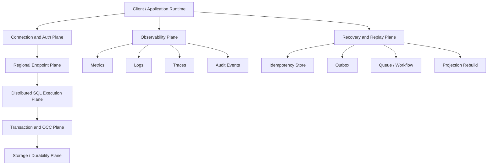
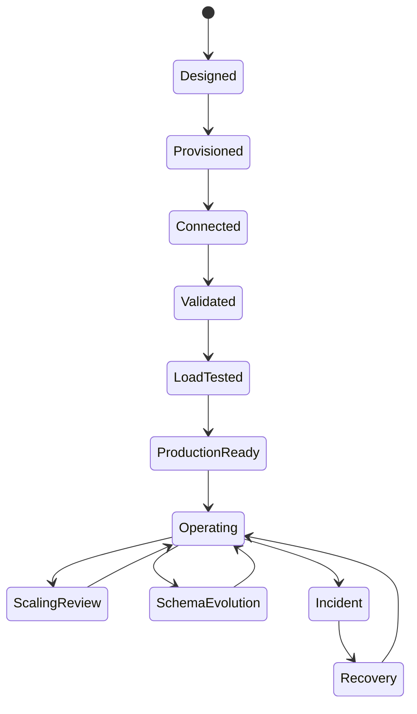
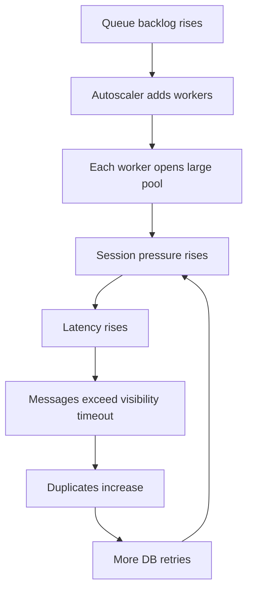
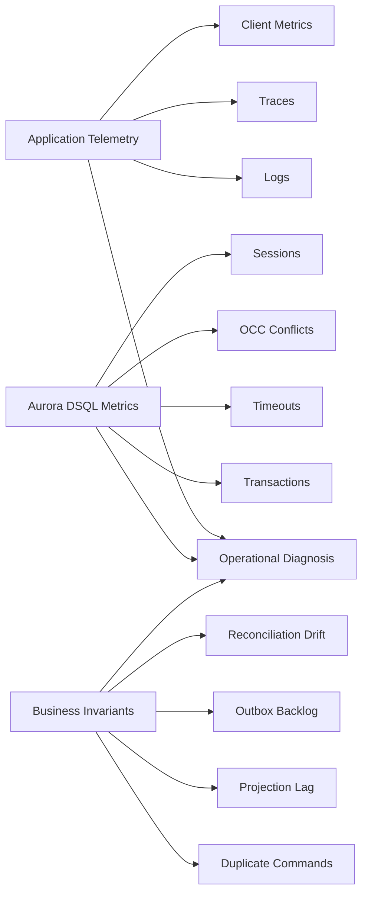
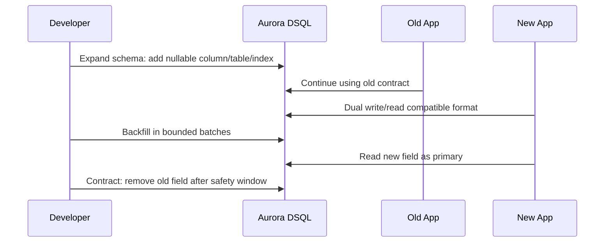
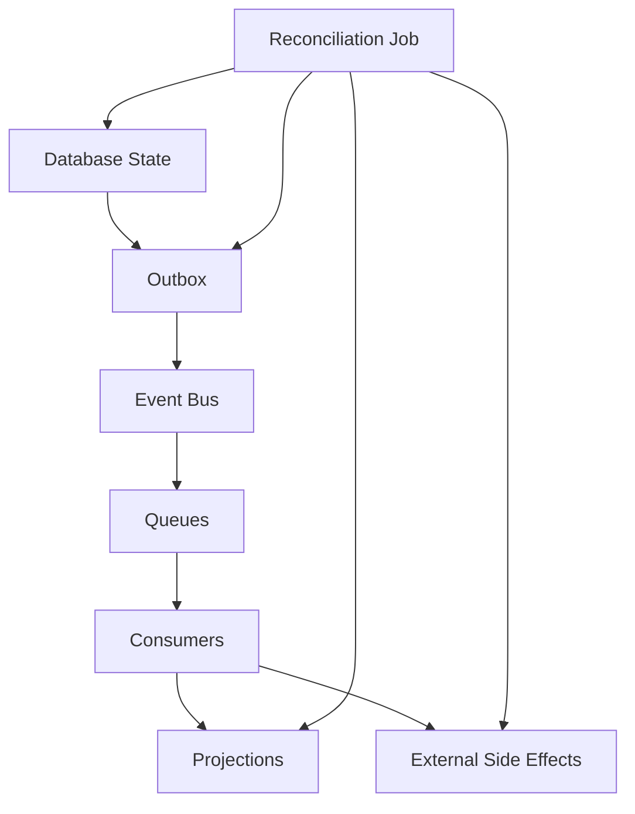
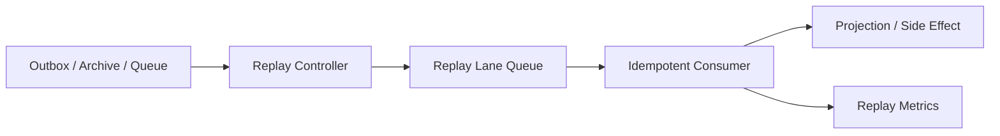

# Part 071 — DSQL Operability: Lifecycle, Connectivity, Observability, Incident Drill

Aurora DSQL should not be treated as "PostgreSQL, but global".

That framing is too weak.

The useful production framing is:

> Aurora DSQL is a distributed SQL coordination substrate. Your application still owns command idempotency, transaction shape, conflict avoidance, failover routing, projection freshness, and operational proof.

A normal PostgreSQL incident is usually about one database instance, one primary, one failover path, one set of sessions, and one local transaction log. Aurora DSQL changes the shape of the problem. It gives you a serverless distributed SQL service with strong consistency semantics, PostgreSQL compatibility boundaries, multi-Region endpoints when configured that way, and optimistic concurrency control. That means your runbooks must include failure modes that are rare in single-primary relational systems but normal in distributed SQL systems:

- conflict spikes without CPU saturation
- commit ambiguity after client/network failure
- regional endpoint routing bugs
- active-active duplicate command execution
- schema change incompatibility across app versions
- hot aggregate contention
- application-side referential integrity mistakes
- cache/projection drift after failover
- replay storms caused by outbox/queue/workflow recovery

This part focuses on **operability**, not basic usage.

By the end, you should be able to answer:

- What must be monitored for Aurora DSQL beyond generic availability?
- How do we detect OCC conflict, timeout, session pressure, and bad transaction shape?
- How should an application classify DSQL errors?
- What runbooks are needed before active-active writes are allowed?
- How do we perform schema changes without breaking distributed SQL constraints?
- How do we test regional failure without pretending that routing is magic?

---

## 1. Operability Starts with Explicit Invariants

Before dashboards, define invariants.

A useful Aurora DSQL production invariant set looks like this:

| Area | Invariant | Why It Matters |
|---|---|---|
| Command correctness | Every external command has a stable command id or idempotency key | Active-active routing and retry can submit the same command more than once |
| Transaction shape | Transactions are short, bounded, and aggregate-oriented | OCC conflicts become worse when transactions touch too much state |
| Conflict behavior | Serialization failures are retried safely at the whole transaction boundary | Retrying only a statement can corrupt application assumptions |
| Region routing | Each command has deterministic routing logic | Random regional routing increases cross-region latency and conflict probability |
| Write ownership | Hot aggregates have an owner or conflict avoidance policy | Active-active does not remove logical contention |
| External side effect | External calls are not made inside ambiguous DB commit windows | Payment/email/case-notification duplication is harder to repair than a DB retry |
| Projection freshness | Staleness budget is declared per read model | Strong DB consistency does not mean every cache/search/projection is fresh |
| Schema evolution | All schema changes are compatible with at least two application versions | Rolling deploys and active-active traffic require compatibility windows |
| Recovery | Restore/replay procedures are tested | A design that cannot be recovered is not production-ready |

A dashboard without invariants is decoration. A runbook without invariants is theater.

---

## 2. Aurora DSQL Operational Surface

Mentally split Aurora DSQL operations into six planes.



Each plane fails differently:

| Plane | Failure Example | Symptom | Response |
|---|---|---|---|
| Client/runtime | Bad pool, unbounded concurrency | Session pressure, rising latency | Limit concurrency, pool correctly, shed load |
| Auth/connectivity | IAM token issue, DNS/routing issue | Connection failures | Check auth path, endpoint, certificate, network path |
| Regional endpoint | Region unreachable or degraded | Region-specific failure | Route to healthy endpoint according to policy |
| SQL execution | Slow query, missing index, large transaction | Query timeout, high transaction duration | Optimize query shape, index, pagination, transaction scope |
| OCC/transaction | Hot aggregate, overlapping writes | Serialization failure / conflict spike | Whole transaction retry, command routing, aggregate partitioning |
| Recovery/replay | Duplicate event or outbox replay | Duplicate side effects, projection drift | Idempotency, replay lane, reconciliation |

Do not compress these into one alarm called `DatabaseErrorRate`.

That hides the real control lever.

---

## 3. Lifecycle Management

Aurora DSQL lifecycle should be treated as an application-platform lifecycle.

A minimal lifecycle model:



### 3.1 Design Phase

Before provisioning, document:

- expected read/write ratio
- hot aggregate candidates
- expected transaction write set size
- expected conflict probability
- required Regions
- routing policy
- data residency constraints
- cache/projection design
- outbox/eventing design
- idempotency key design
- retry policy
- rollback strategy

### 3.2 Provisioning Phase

Provisioning is not "create cluster, done".

Record:

- cluster identity
- Region topology
- endpoint inventory
- account ownership
- IAM boundary
- secret/auth mechanism
- schema bootstrap method
- migration tool/version
- baseline quotas
- CloudWatch dashboard link
- runbook location

### 3.3 Validation Phase

Before production traffic:

- create a smoke-test client from every runtime environment
- verify auth renewal under long-running process
- verify endpoint failover/routing behavior
- run a transaction retry test
- run a hot aggregate conflict test
- run a schema migration dry run
- run backup/export/recovery-adjacent procedures if applicable
- run observability validation: metrics, logs, traces, alarms

### 3.4 Operating Phase

Daily operating questions:

- Are conflicts normal or increasing?
- Are query timeouts correlated with deployment, traffic, or data growth?
- Are sessions rising faster than request volume?
- Are retries hiding a degraded workload?
- Are regional endpoints behaving symmetrically or asymmetrically?
- Are projections/caches within staleness budget?
- Are outbox events publishing without backlog?
- Are schema changes compatible with all active app versions?

---

## 4. Connectivity and Client Runtime Discipline

The easiest way to damage a distributed SQL system is not a bad query. It is an unbounded client.

### 4.1 Connection Is a Shared Resource

Even if the database is serverless, connections are not morally free.

Every application runtime must define:

```txt
max_application_concurrency <= max_safe_db_sessions_for_that_service
```

This is especially important for:

- Lambda burst concurrency
- ECS/Kubernetes horizontal scale-out
- queue workers scaling based on backlog
- scheduled jobs running in parallel
- replay workers
- migration/backfill jobs
- API retries during partial outage

### 4.2 Runtime Connection Budget

A practical budget:

```txt
db_session_budget_per_service = floor(cluster_safe_session_budget * service_weight)

max_pool_size_per_instance = floor(db_session_budget_per_service / max_runtime_instances)

max_inflight_db_commands <= max_pool_size_per_instance
```

Do not set pool size based on CPU count alone. In distributed SQL, a session budget is also a conflict, latency, and coordination budget.

### 4.3 Recommended Client Guardrails

For every service using Aurora DSQL:

- bounded pool size
- bounded request concurrency
- connection acquisition timeout
- statement timeout
- transaction timeout
- whole transaction retry with capped attempts
- exponential backoff with jitter
- separate retry policy for serialization failure vs connectivity failure
- idempotency key on all externally retried commands
- no external side effects inside transaction before commit outcome is known

### 4.4 Bad Pattern: Pool Explosion



Fix:

- cap worker concurrency by database capacity
- use backlog age, not backlog size alone
- add circuit breaker for conflict/timeout rate
- split hot workloads by aggregate/tenant
- move large replay/backfill into controlled lanes

---

## 5. Error Classification

Aurora DSQL applications need an explicit error classifier.

A useful taxonomy:

| Class | Example | Retry? | Where? | Notes |
|---|---|---:|---|---|
| Serialization conflict | OCC conflict / SQLSTATE `40001` style failure | Yes | Whole transaction | Use bounded retry with jitter |
| Unique violation | Duplicate idempotency key, duplicate business key | Maybe | Application decision | Often means duplicate command succeeded before |
| Conditional/business violation | Invalid state transition | No | Return domain error | Not infrastructure failure |
| Statement timeout | Query too slow or overloaded | Maybe | Once/cautiously | Usually needs query/capacity fix |
| Connection acquisition timeout | Pool exhausted | No immediate spam retry | Caller/backpressure | Retrying can amplify outage |
| Endpoint/network failure | Region unreachable | Maybe | Routing/failover layer | Respect idempotency |
| Auth failure | bad token/role/secret | No | Operator/deploy fix | Retry wastes capacity |
| Schema error | missing column/table, incompatible migration | No | Rollback/fix deploy | Indicates deployment drift |
| Quota/limit exceeded | sessions/storage/transaction limit | No until mitigated | Operator action | Needs scaling/design change |

Pseudo-code:

```java
public final class DsqlErrorClassifier {
    public DbErrorClass classify(SQLException e) {
        String state = e.getSQLState();

        if ("40001".equals(state)) return DbErrorClass.SERIALIZATION_CONFLICT;
        if ("23505".equals(state)) return DbErrorClass.UNIQUE_VIOLATION;
        if ("57014".equals(state)) return DbErrorClass.STATEMENT_TIMEOUT;
        if (state != null && state.startsWith("08")) return DbErrorClass.CONNECTION_FAILURE;
        if (state != null && state.startsWith("28")) return DbErrorClass.AUTH_FAILURE;
        if (state != null && state.startsWith("42")) return DbErrorClass.SCHEMA_OR_SQL_ERROR;

        return DbErrorClass.UNKNOWN;
    }
}
```

The exact exceptions depend on driver, framework, and execution path. The invariant matters more than the class name:

> Retry only when the operation is safe, bounded, and classified.

---

## 6. Whole Transaction Retry

Optimistic concurrency control means conflicting transactions can fail and must be retried from the start.

Do not retry the last SQL statement in isolation.

Bad:

```java
try {
    repository.updateCaseStatus(caseId, APPROVED);
} catch (SerializationFailure e) {
    repository.updateCaseStatus(caseId, APPROVED); // bad: partial mental model
}
```

Better:

```java
public CaseApprovalResult approveCase(ApproveCaseCommand command) {
    return retryPolicy.execute(() -> transactionTemplate.execute(tx -> {
        CommandRecord record = commandStore.begin(command.idempotencyKey(), command.hash());

        if (record.isCompleted()) {
            return record.toApprovalResult();
        }

        CaseAggregate aggregate = caseRepository.loadForDecision(command.caseId());
        aggregate.approve(command.actor(), command.reason());

        caseRepository.save(aggregate);
        outbox.insert(CaseApprovedEvent.from(aggregate, command));
        commandStore.complete(command.idempotencyKey(), aggregate.version());

        return CaseApprovalResult.approved(aggregate.id(), aggregate.version());
    }));
}
```

The entire read-decide-write operation must be retried because the decision depends on the snapshot.

---

## 7. Conflict Rate as a First-Class Metric

A rising conflict rate is not automatically bad. Sometimes it means the database is correctly preventing lost updates.

But it is a design signal.

Track:

```txt
conflict_rate = serialization_conflict_count / write_transaction_count
retry_success_rate = retry_success_count / serialization_conflict_count
retry_exhausted_rate = retry_exhausted_count / serialization_conflict_count
```

Interpretation:

| Signal | Likely Meaning | Action |
|---|---|---|
| Low conflict, high success | Normal OCC behavior | Keep monitoring |
| Conflict spike after deploy | New transaction touches too much state | Review query/write set |
| Conflict spike on one tenant | Hot tenant/aggregate | Tenant routing, aggregate split, queue serialization |
| Conflict spike during replay | Replay lane too parallel | Reduce concurrency, shard replay by aggregate |
| Retry exhausted rising | User-facing failures | Apply backpressure, change workflow, reduce contention |
| Conflict plus latency | Hot path and load pressure | Combine design and capacity mitigation |

A conflict metric is more useful when tagged by:

- service
- operation name
- aggregate type
- tenant
- Region
- retry attempt
- command type

---

## 8. Observability Model

Use three layers of observability:



### 8.1 Application Metrics

Every command handler should emit:

- command count
- command latency
- transaction latency
- DB acquire latency
- DB execution latency
- retry count
- retry exhausted count
- serialization conflict count
- unique violation count
- timeout count
- idempotency duplicate count
- outbox insert count
- outbox publish lag
- external side-effect attempt count

### 8.2 Logs

Every write command log should include:

```json
{
  "timestamp": "2026-07-07T10:15:00.000Z",
  "service": "case-command-service",
  "operation": "ApproveCase",
  "commandId": "cmd_01H...",
  "caseId": "case_123",
  "tenantId": "tenant_abc",
  "region": "ap-southeast-1",
  "dbCluster": "prod-case-dsql",
  "attempt": 2,
  "errorClass": "SERIALIZATION_CONFLICT",
  "sqlState": "40001",
  "durationMs": 118,
  "traceId": "1-..."
}
```

Do not log sensitive data. Log identifiers and state transitions, not private payload.

### 8.3 Traces

A useful trace should show:

```txt
HTTP/API request
  -> command validation
  -> idempotency begin
  -> transaction begin
  -> SELECT aggregate
  -> UPDATE aggregate
  -> INSERT outbox
  -> command complete
  -> transaction commit
  -> response
```

For retries, the trace should show attempts as distinct spans.

---

## 9. CloudWatch Metrics and Alarm Strategy

Aurora DSQL publishes CloudWatch observability metrics, including workload metrics like read-only and total transactions, actionable metrics such as query timeouts and OCC conflict rate, and session-related metrics for active/total sessions.

Treat these as raw signals, not complete diagnosis.

### 9.1 Minimum Dashboard

A production dashboard should include:

| Panel | Why |
|---|---|
| Total transactions | Workload volume baseline |
| Read-only transactions | Read/write mix shift detection |
| Query timeout metrics | Query/capacity/lock symptom |
| OCC conflict metrics/rate | Contention detection |
| Active sessions | Runtime pressure |
| Total sessions | Connection growth and leak detection |
| Application retry count | Retry amplification detection |
| Retry exhausted count | User-facing correctness/availability impact |
| API latency/error rate | User boundary impact |
| Queue lag/outbox lag | Downstream recovery and replay pressure |
| Projection freshness | Read model consistency |
| Regional endpoint success/latency | Active-active routing health |

### 9.2 Alarm Principles

Bad alarms:

- any single conflict occurred
- CPU-like generic threshold with no action
- total transactions high
- query timeout count nonzero in a batch system

Better alarms:

| Alarm | Condition | Action |
|---|---|---|
| Conflict spike | conflict rate above baseline for N periods | Check hot operation/tenant/deploy |
| Retry exhausted | user-visible retry failures > threshold | Apply backpressure, inspect conflict/timeout class |
| Query timeout | sustained timeout rate | Inspect query shape, data growth, index, transaction scope |
| Session pressure | sessions near quota or growth abnormal | Check pool/deploy/autoscaling/replay |
| Regional endpoint degradation | one endpoint latency/error abnormal | Route per failover policy |
| Outbox stuck | outbox lag increasing | Check publisher, EventBridge/SQS target, credentials |
| Projection stale | staleness > budget | Rebuild/replay projection lane |

### 9.3 Composite Alarms

Useful composite examples:

```txt
UserImpactingDsqlWriteIncident =
  (API_5xx_high OR CommandRetryExhausted_high)
  AND
  (DsqlOccConflictRate_high OR DsqlQueryTimeout_high OR DsqlSessionPressure_high)
```

```txt
ReplayStormRisk =
  OutboxLag_high
  AND QueueBacklog_high
  AND DsqlConflictRate_high
```

---

## 10. Query and Transaction Operability

Distributed SQL punishes vague transaction boundaries.

### 10.1 Transaction Shape Review

For every write operation, document:

```txt
Operation: ApproveCase
Reads:
  - case by case_id
  - active enforcement flags by case_id
Writes:
  - case status/version
  - audit entry
  - outbox event
Expected rows modified: 3
Expected transaction duration: < 100 ms p95
Retryable: yes, on serialization conflict
Idempotency key: command_id
Hot aggregate risk: medium
```

### 10.2 Query Shape Smells

Smells:

- unbounded `SELECT *`
- transaction reads many aggregates before deciding one update
- query depends on non-indexed predicate
- large write transaction for bulk status changes
- pagination inside write transaction
- external HTTP call inside transaction
- long user think-time between transaction begin and commit
- transaction performs analytics-like query
- background job updates many tenants at once

### 10.3 Backfill as Controlled Production Traffic

A backfill is not a script. It is a distributed workload.

Backfill rules:

- process in small batches
- checkpoint progress
- bound concurrency
- shard by tenant or aggregate range
- emit metrics
- avoid hot aggregate collision with live traffic
- use idempotent writes
- define pause/resume
- define rollback or compensating cleanup
- run during a controlled window if conflict risk is high

---

## 11. Schema Change Operability

Aurora DSQL has PostgreSQL compatibility boundaries and distributed-architecture constraints. Treat schema changes as compatibility-managed deployments.

### 11.1 Expand-Migrate-Contract

Use the standard online-change pattern:



### 11.2 DDL Rules

Operational rules:

- never combine incompatible schema change with application cutover in one step
- avoid large blocking changes during peak traffic
- test DDL behavior in a representative environment
- keep old and new app versions compatible during deployment
- include rollback path for app and schema state
- tag migrations with release id
- log migration progress and duration
- include data validation query after migration

### 11.3 Application Compatibility Matrix

| Schema Version | Old App | New App | Safe? |
|---|---:|---:|---:|
| Current | yes | maybe | before deployment |
| Expanded | yes | yes | required |
| Backfilled | yes | yes | required |
| Contracted | no | yes | only after old app gone |

---

## 12. Active-Active Incident Runbooks

Active-active does not remove incidents. It changes them.

### 12.1 Regional Endpoint Degradation

Symptoms:

- one Region has elevated connection failures
- one Region has elevated latency
- command retry increases only in one Region
- global error rate may look acceptable while a local user base is failing

Runbook:

1. Confirm whether the issue is app runtime, network path, auth, or DSQL endpoint.
2. Compare regional endpoint latency and error rate.
3. Check whether only writes or both reads/writes are affected.
4. Apply routing policy: fail away, degrade, or hold writes depending on command criticality.
5. Confirm idempotency keys are stable across reroute.
6. Monitor conflict and duplicate command metrics after reroute.
7. Keep projection/cache staleness visible.
8. Rebalance traffic gradually after recovery.

### 12.2 Conflict Storm

Symptoms:

- OCC conflict rate increases sharply
- p95/p99 latency rises because retries add work
- retry exhausted count increases
- hot tenant/aggregate visible in app logs

Runbook:

1. Identify top operation and aggregate/tenant.
2. Check recent deploy/backfill/replay.
3. Reduce concurrency on the conflicting operation.
4. Route hot aggregate to single command lane if necessary.
5. Temporarily disable replay/backfill if it competes with live traffic.
6. Inspect transaction write set.
7. Patch transaction shape or aggregate design.
8. Re-enable traffic gradually.

### 12.3 Duplicate External Side Effects

Symptoms:

- duplicate emails/payments/webhooks/case notifications
- idempotency duplicate count rises
- external provider receives same business command multiple times

Runbook:

1. Stop side-effect publisher if duplicates are active.
2. Identify idempotency key and command ids.
3. Check whether DB commit succeeded before client retry.
4. Check outbox/inbox side-effect ledger.
5. Reconcile external provider state.
6. Mark duplicate outbox messages as consumed or compensating-required.
7. Add missing idempotency key propagation.

### 12.4 Schema Drift Incident

Symptoms:

- one app version fails with missing/changed column
- only one Region or service deployment fails
- writes fail after migration

Runbook:

1. Stop rollout.
2. Identify schema version and app versions active.
3. Roll forward if expanded schema is missing.
4. Roll back app if contracted schema broke old app.
5. Avoid emergency destructive migration.
6. Validate compatibility matrix.
7. Add migration CI gate.

---

## 13. Recovery, Replay, and Reconciliation

Aurora DSQL recovery does not end at database health.

A production application often has:

- API command idempotency table
- domain tables
- outbox table
- EventBridge bus
- SQS queues
- Step Functions executions
- cache entries
- search projection
- reporting projection
- external notifications

Recovery must reconcile all of them.



### 13.1 Reconciliation Queries

Examples:

```sql
-- Domain rows changed but no corresponding outbox event.
SELECT c.case_id, c.status, c.updated_at
FROM cases c
LEFT JOIN outbox_events e
  ON e.aggregate_id = c.case_id
 AND e.event_type = 'CaseApproved'
 AND e.aggregate_version = c.version
WHERE c.status = 'APPROVED'
  AND e.id IS NULL;
```

```sql
-- Commands stuck in in-progress state beyond safe window.
SELECT command_id, operation, created_at, updated_at
FROM command_records
WHERE status = 'IN_PROGRESS'
  AND updated_at < now() - interval '10 minutes';
```

```sql
-- Outbox events not published.
SELECT id, aggregate_type, aggregate_id, event_type, created_at, attempt_count
FROM outbox_events
WHERE published_at IS NULL
ORDER BY created_at
LIMIT 100;
```

### 13.2 Replay Lane Pattern

Do not replay into the main hot path blindly.



Replay lane rules:

- lower concurrency than live traffic
- deterministic ordering if aggregate order matters
- idempotent consumers only
- dry-run option for projections
- stop switch
- conflict/timeout alarm
- audit log of replay scope

---

## 14. Security and Audit Operability

Database operability also includes proof.

Track:

- who can create/delete/modify cluster
- who can connect as application role
- who can run migrations
- who can view sensitive query outputs
- who can trigger replay/backfill
- who can change routing policy
- who can update secrets/auth config
- who can change alarms

For regulated systems, each production data mutation path should be traceable:

```txt
actor -> API request -> command id -> transaction -> audit row -> outbox event -> downstream effect
```

The audit model should survive retry, replay, and failover.

---

## 15. Quotas and Limits as Design Inputs

Do not discover quotas during an incident.

Maintain a quota register:

| Quota / Limit | Current | Required | Margin | Owner | Review Trigger |
|---|---:|---:|---:|---|---|
| Cluster storage | TBD | TBD | TBD | Platform DB | monthly/data growth |
| Active connections | TBD | TBD | TBD | App Platform | new service / autoscale change |
| Transaction row modification limits | TBD | TBD | TBD | Service Owner | new bulk operation |
| Query timeout behavior | TBD | TBD | TBD | Service Owner | slow query incident |
| Regional cluster availability | TBD | TBD | TBD | Platform DB | new market/tenant |

A good ADR includes the known quotas and the design strategy for staying away from them.

---

## 16. Production Readiness Checklist

Before production:

- [ ] Every write command has idempotency key.
- [ ] Every write command has whole-transaction retry for serialization conflict.
- [ ] Retry attempts are capped and jittered.
- [ ] Retry exhausted is visible as a metric.
- [ ] External side effects have a side-effect ledger or provider idempotency key.
- [ ] Hot aggregate candidates are identified.
- [ ] Regional routing policy is documented.
- [ ] Endpoint failover test has been executed.
- [ ] Connection pool budgets are documented per service.
- [ ] Session pressure alarm exists.
- [ ] OCC conflict alarm exists.
- [ ] Query timeout alarm exists.
- [ ] Outbox backlog alarm exists.
- [ ] Projection freshness alarm exists.
- [ ] Schema migration compatibility matrix exists.
- [ ] Backfill/replay lane exists.
- [ ] Reconciliation queries exist.
- [ ] Runbooks are tested.
- [ ] Quota register exists.
- [ ] Security/audit path is documented.

---

## 17. Mental Model Summary

Aurora DSQL gives you distributed SQL capabilities, but the hardest production work remains in application architecture.

The invariant is:

> Distributed SQL reduces infrastructure burden; it does not remove distributed application correctness.

In practice:

- Use short aggregate-oriented transactions.
- Treat OCC conflict as normal but measurable.
- Retry whole transactions, not statements.
- Route commands intentionally.
- Bound runtime concurrency.
- Keep external side effects outside ambiguous commit windows.
- Use outbox/inbox for event and consumer correctness.
- Treat schema change as a compatibility protocol.
- Test regional failure and replay before production.

If Aurora DSQL is operated like a single-node PostgreSQL database, the system will eventually fail in ways the team cannot explain.

If it is operated like a distributed coordination substrate, it becomes a powerful primitive for global transactional applications.

---

## References

- AWS Documentation — Monitoring and logging for Aurora DSQL: https://docs.aws.amazon.com/aurora-dsql/latest/userguide/monitoring-overview.html
- AWS Documentation — Monitoring Aurora DSQL with Amazon CloudWatch: https://docs.aws.amazon.com/aurora-dsql/latest/userguide/cloudwatch-monitoring.html
- AWS Documentation — Cluster quotas and database limits in Amazon Aurora DSQL: https://docs.aws.amazon.com/aurora-dsql/latest/userguide/CHAP_quotas.html
- AWS Documentation — Considerations for working with Amazon Aurora DSQL: https://docs.aws.amazon.com/aurora-dsql/latest/userguide/considerations.html
- AWS Documentation — Aurora DSQL endpoints and quotas: https://docs.aws.amazon.com/general/latest/gr/dsql.html
- AWS Documentation — Migrating from PostgreSQL to Aurora DSQL: https://docs.aws.amazon.com/aurora-dsql/latest/userguide/working-with-postgresql-compatibility-migration-guide.html
