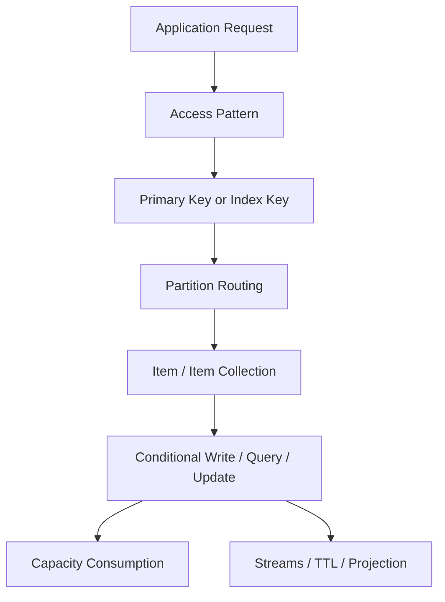
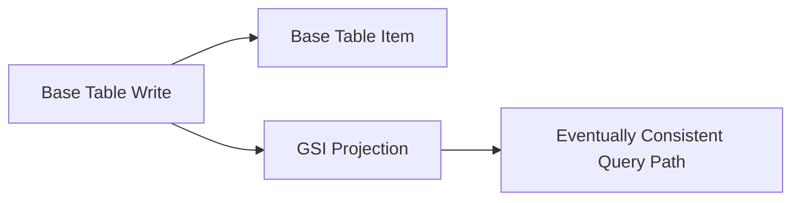
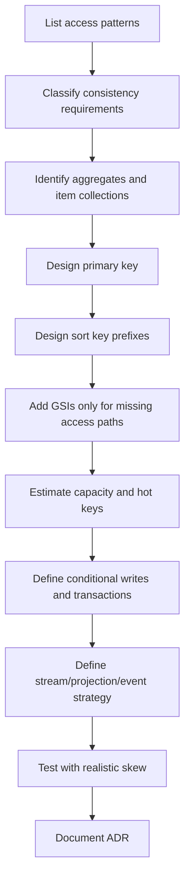

# Part 072 — DynamoDB Mental Model: Partitioned Key-Value Store with Predictable Access

DynamoDB is often introduced as "NoSQL".

That is correct but not useful enough.

A stronger mental model:

> DynamoDB is a managed, serverless, partitioned key-value/document database that rewards precise access-pattern design and punishes ad-hoc query expectations.

If you bring relational instincts into DynamoDB without translating them, you will design tables that look simple at first and become expensive, throttled, or impossible to query later.

DynamoDB is not worse than relational databases. It is optimized for a different contract:

- You define access paths up front.
- You distribute load through key design.
- You keep item size, partition heat, and index cost visible.
- You model aggregates and item collections deliberately.
- You accept that many joins and flexible query shapes belong elsewhere.
- You build idempotency, conditional writes, and projection logic explicitly.

This part builds the foundation for the next DynamoDB parts: single-table design, partition key design, GSI/LSI strategy, conditional writes, transactions, streams, global tables, capacity/cost, and production debugging.

---

## 1. What DynamoDB Is

At production-design level, DynamoDB is:

```txt
Table
  -> items
  -> primary key
  -> partition key
  -> optional sort key
  -> optional secondary indexes
  -> capacity model
  -> streams/TTL/backups/global tables
```

But this structural view is still too shallow.

The runtime view is better:



The critical point:

> DynamoDB does not ask, "What tables represent your entities?" It asks, "What exact access patterns must be served predictably at scale?"

---

## 2. Core Vocabulary

| Term | Meaning | Design Consequence |
|---|---|---|
| Table | Top-level container of items | Can hold one or many entity types |
| Item | Record/document; max item size matters | Keep payload bounded and intentional |
| Attribute | Field on an item | Sparse attributes are normal |
| Partition key | Hash key used to route item to partition | Controls load distribution and item collection grouping |
| Sort key | Range key within same partition key | Enables ordered/range access patterns |
| Item collection | Items with same partition key | Useful for aggregate/query grouping; can also become hot |
| Query | Efficient lookup by partition key and optional sort key condition | Primary read primitive |
| Scan | Reads through table/index | Usually operational/backfill, not request path |
| GSI | Global Secondary Index with its own partition/sort key | Adds access path, cost, and eventual consistency |
| LSI | Local Secondary Index with same partition key, alternate sort key | Must be defined at table creation; different constraints |
| Conditional write | Write with condition expression | Core primitive for correctness |
| Streams | Ordered change stream per shard | Useful for projections/outbox-adjacent patterns |
| TTL | Expiration marker for item deletion | Eventual deletion, not exact scheduler |

---

## 3. DynamoDB Is Access-Pattern First

Relational design often begins with normalization:

```txt
Case
Investigation
Violation
Party
Evidence
Decision
Payment
```

DynamoDB design begins with questions:

```txt
Get case summary by case id
List active cases for investigator by status and due date
Append audit event to case
Get latest decision for case
Enforce unique external complaint number
List overdue enforcement actions by region
Load case aggregate for state transition
```

Then you design keys.

### 3.1 Access Pattern Inventory

A useful access pattern record:

```txt
Access Pattern: List active cases assigned to investigator
Operation Type: Query
Caller: Case dashboard API
Consistency: eventually consistent acceptable, freshness < 5 seconds
Cardinality: up to 2,000 active cases per investigator
Sort: due date ascending
Filter after read: not allowed for large result set
Key candidate:
  GSI1PK = INVESTIGATOR#<investigatorId>#STATUS#ACTIVE
  GSI1SK = DUE#<yyyy-mm-dd>#CASE#<caseId>
Expected RPS: 100 p95, 600 peak
Failure mode: hot investigator during incident response
```

This inventory becomes the schema.

---

## 4. Table, Item, and Item Collection

A DynamoDB table can represent multiple entity types when that helps access patterns.

Example item collection:

```txt
PK = CASE#123
SK = META#CASE
SK = PARTY#agency#42
SK = VIOLATION#v001
SK = EVIDENCE#e009
SK = DECISION#2026-07-07T10:15:00Z
SK = AUDIT#2026-07-07T10:16:00Z#evt_001
```

This allows:

```txt
Query PK = CASE#123
```

to load a case-oriented collection.

But an item collection is not free. If one case receives massive writes, one partition key can become hot.

So the design question is:

> Should this aggregate be grouped for read efficiency, or sharded/split for write scalability?

---

## 5. Partition Key Mental Model

DynamoDB stores data across physical partitions. The partition key determines item placement.

A good partition key does two jobs:

1. Places related items together when the application needs efficient query.
2. Distributes traffic across many keys when the workload is large.

These goals can conflict.

### 5.1 Bad Partition Key Examples

| Bad Key | Why It Fails |
|---|---|
| `PK = TENANT#bigTenant` for all tenant writes | One large tenant can become hot |
| `PK = STATUS#OPEN` | All open items share one logical partition key |
| `PK = DATE#2026-07-07` | Daily traffic concentrates into one key |
| `PK = REGION#apac` | Regional workload skew creates hot key |
| `PK = CONSTANT` | Almost always catastrophic |

### 5.2 Better Key Shape

| Access Need | Better Shape |
|---|---|
| Load one case aggregate | `PK = CASE#<caseId>` |
| List cases by investigator/status | GSI partition by investigator+status, sort by due date |
| High-volume time-series events | bucket/shard by time and random/hash suffix |
| Global uniqueness | separate uniqueness item keyed by unique value |
| High-write ledger | split by aggregate and time bucket when needed |

### 5.3 Partition Key Invariant

```txt
For every partition key pattern, estimate:
  - item count per key
  - read RPS per key
  - write RPS per key
  - item collection growth
  - top-N hot keys
  - skew under incident/replay/backfill
```

Do not design only for average load.

Hot keys are caused by concentration, not total table size.

---

## 6. Sort Key Mental Model

The sort key gives you order and range inside a partition key.

Common shapes:

```txt
SK = META
SK = AUDIT#2026-07-07T10:15:00Z#evt_001
SK = DECISION#2026-07-07T10:16:00Z
SK = VIOLATION#<violationId>
SK = ACTION#DUE#2026-07-10#<actionId>
```

Useful operations:

```txt
begins_with(SK, 'AUDIT#')
SK BETWEEN 'ACTION#DUE#2026-07-01' AND 'ACTION#DUE#2026-07-31'
ScanIndexForward = false for latest-first
Limit = 20
```

Sort key design gives you query expressiveness without secondary indexes.

But it only works inside one partition key.

---

## 7. Query, Scan, and the FilterExpression Trap

DynamoDB `Query` is the normal request-path primitive.

`Scan` is usually for:

- operational inspection
- migration/backfill
- low-frequency admin tasks
- table export workflows
- emergency repair tooling

A common mistake is using `FilterExpression` as if it reduces read cost like an SQL `WHERE` with an index.

The better mental model:

> Key condition selects what DynamoDB reads efficiently. Filter expression discards results after reading.

So this is often bad for large datasets:

```txt
Query PK = TENANT#123
FilterExpression status = 'OPEN'
```

If the access pattern is common and high-volume, encode status into a key or index:

```txt
GSI1PK = TENANT#123#STATUS#OPEN
GSI1SK = DUE#2026-07-10#CASE#456
```

---

## 8. Consistency Model

DynamoDB supports different read consistency options depending on table/index type.

Mental model:

| Read Path | Strong Read? | Notes |
|---|---:|---|
| Base table | yes | Strongly consistent read available |
| Local Secondary Index | yes | Same partition key as base table |
| Global Secondary Index | no | Eventually consistent |
| Streams | no | Change propagation is asynchronous |
| Global Tables | no global single-copy illusion | Multi-Region replication has conflict semantics |

Design question:

> Which reads must observe the immediately preceding write, and which reads can tolerate staleness?

### 8.1 Read-After-Write Patterns

| Pattern | Approach |
|---|---|
| Command response needs new state | Return state from write result, not re-query via GSI |
| UI needs immediate confirmation | Read base table strongly by primary key |
| Dashboard can lag | Read eventually consistent GSI/projection |
| Search result can lag | Use projection freshness indicator |
| Workflow decision needs latest state | Use strongly consistent read/conditional write on source item |

---

## 9. Conditional Writes Are the Correctness Primitive

DynamoDB applications should lean heavily on conditional writes.

Examples:

### 9.1 Create If Not Exists

```java
PutItemRequest request = PutItemRequest.builder()
    .tableName(table)
    .item(item)
    .conditionExpression("attribute_not_exists(PK)")
    .build();
```

Use for:

- idempotency record creation
- uniqueness guard
- aggregate creation
- lock/lease item creation

### 9.2 Optimistic Version Update

```java
UpdateItemRequest request = UpdateItemRequest.builder()
    .tableName(table)
    .key(key)
    .updateExpression("SET #status = :next, #version = #version + :one")
    .conditionExpression("#version = :expectedVersion AND #status = :expectedStatus")
    .expressionAttributeNames(Map.of(
        "#status", "status",
        "#version", "version"
    ))
    .expressionAttributeValues(values)
    .build();
```

Use for:

- state machine transitions
- compare-and-swap update
- preventing lost updates
- enforcing legal lifecycle transitions

### 9.3 Idempotency Record

```txt
PK = IDEMPOTENCY#<idempotencyKey>
status = IN_PROGRESS | COMPLETED | FAILED_RETRYABLE | FAILED_FINAL
requestHash = sha256(canonicalRequest)
responseRef = ...
expiresAt = epochSeconds
```

Invariant:

```txt
Same idempotency key + same request hash => return prior result or wait/retry
Same idempotency key + different request hash => reject as conflict
```

---

## 10. DynamoDB Transactions

DynamoDB transactions are useful but should not become a default hammer.

Use `TransactWriteItems` when you need all-or-nothing across multiple items, for example:

- create aggregate and uniqueness guard
- update aggregate and insert audit event
- create idempotency command record and domain item
- reserve capacity and create order

But transactions increase cost and complexity. They also do not make flexible querying easier.

Decision rule:

```txt
Use conditional single-item write when the invariant fits one item.
Use transaction when the invariant spans multiple items.
Reconsider the aggregate model if every normal write needs many transaction items.
```

---

## 11. Item Size and Document Modeling

DynamoDB item size is finite. Treat each item as a bounded document, not an infinite object graph.

Good item candidates:

- case metadata summary
- current state record
- small configuration object
- idempotency record
- projection row
- uniqueness guard item
- audit/event item

Risky item candidates:

- entire case with unbounded evidence list
- full audit history in one list attribute
- ever-growing array of comments
- tenant-wide settings plus all child config
- large binary/document payload

Better pattern:

```txt
CASE#123 / META
CASE#123 / EVIDENCE#e001
CASE#123 / EVIDENCE#e002
CASE#123 / AUDIT#timestamp#eventId
```

Keep large binary payloads in S3 and store pointers/metadata in DynamoDB.

---

## 12. Secondary Index Mental Model

A secondary index is not a free view. It is a replicated access path with its own cost and consistency behavior.



For every GSI, document:

```txt
GSI name:
Access patterns served:
GSI PK:
GSI SK:
Projected attributes:
Expected read RPS:
Expected write amplification:
Staleness tolerance:
Backfill impact:
Hot key risk:
Owner:
```

Anti-patterns:

- create GSI for every new screen without reviewing workload
- project all attributes by default
- use GSI for immediate read-after-write correctness
- overload one GSI with incompatible access patterns
- ignore hot keys on index partition key

---

## 13. Capacity Mental Model

DynamoDB capacity is consumed by reads and writes, affected by item size, consistency, transactions, indexes, and traffic distribution.

Important implications:

- Strong reads cost more than eventually consistent reads.
- Larger items cost more capacity.
- Writes to indexed attributes also update indexes.
- Hot partitions can throttle even when table-level capacity looks available.
- Adaptive capacity helps uneven access, but it is not a license for bad keys.
- On-demand mode reduces capacity planning burden but does not remove hot key physics.

### 13.1 Capacity Is Not Just RPS

For each access pattern:

```txt
capacity_cost = request_count * item_size_factor * consistency_factor * transaction_factor * index_amplification
```

Example:

```txt
Update case status:
  - update base item
  - insert audit item
  - update GSI for status dashboard
  - maybe stream event

Cost is not "one write" in practical system terms.
```

---

## 14. Hot Keys and Adaptive Capacity

A hot key is a key receiving too much traffic for its partition/key range.

Hot key sources:

- popular tenant
- popular case
- global status key
- current day/hour bucket
- leaderboard/dashboard item
- queue-like item collection
- replay/backfill process
- all workers updating same counter

Mitigations:

| Problem | Mitigation |
|---|---|
| One tenant too hot | tenant sub-sharding, workload isolation, dedicated table/account if needed |
| One aggregate too hot | serialize writes through queue, split aggregate, reduce update frequency |
| Time bucket hot | add shard suffix, widen bucket carefully |
| Counter hot | distributed counter shards |
| Global dashboard hot | precompute per-shard, aggregate asynchronously |
| Replay hot | throttle replay, group by aggregate, use replay lane |

---

## 15. DynamoDB as Source of Truth vs Projection

DynamoDB can be source of truth or projection. Do not blur the role.

| Role | Example | Invariant |
|---|---|---|
| Source of truth | case aggregate current state | conditional writes enforce correctness |
| Idempotency store | command execution record | stable command key prevents duplicate execution |
| Projection | dashboard read model from Aurora events | rebuildable from source |
| Cache-like store | low-latency lookup with TTL | stale data acceptable |
| Ledger/event store adjacent | append-only audit/event items | ordering and retention explicitly designed |

If DynamoDB is a projection, it must be rebuildable.

If DynamoDB is source of truth, writes must enforce domain invariants.

---

## 16. Streams Mental Model

DynamoDB Streams capture item-level changes and can feed downstream processors.

Use streams for:

- projection updates
- cache invalidation
- async integration
- audit pipeline
- search indexing
- CDC-like propagation within AWS-native design

But streams are not a substitute for domain event design unless you control the event contract.

Stream records expose data mutations. Domain events expose business facts.

Example:

```txt
Mutation: item attribute status changed from REVIEW to APPROVED
Domain event: CaseApproved by officer X under rule Y at time T
```

When downstream consumers need business meaning, publish a domain event explicitly.

---

## 17. TTL Mental Model

TTL is useful for lifecycle cleanup:

- idempotency records
- temporary locks
- sessions
- short-lived projections
- deduplication markers
- ephemeral workflow state

But TTL deletion is eventual.

Do not use TTL when exact timing is a business requirement.

For exact scheduling, use EventBridge Scheduler, Step Functions Wait, or an explicit due-item polling pattern with clear semantics.

---

## 18. Common Anti-Patterns

### 18.1 Relational Table Copy

Bad:

```txt
Cases table
Parties table
Violations table
Evidence table
Decisions table
```

without access-pattern-driven keys.

This often creates N+1 reads and missing query paths.

### 18.2 Scan-Driven Feature

Bad:

```txt
"We can just scan by status."
```

That is usually a future incident.

### 18.3 FilterExpression as Index

Bad:

```txt
Query broad partition, filter most rows away.
```

Correct the key/index.

### 18.4 One Global Hot Key

Bad:

```txt
PK = OPEN_CASES
```

for all open cases.

### 18.5 GSI Explosion

Bad:

```txt
Every UI sort/filter gets a new GSI.
```

Prefer explicit product decisions, denormalized projections, or search service when query flexibility dominates.

### 18.6 Strong Consistency Assumption on GSI

Bad:

```txt
Write item, immediately query GSI, assume item exists.
```

Use base table read or return write result.

### 18.7 Unbounded Item Growth

Bad:

```txt
Append every audit event to one list attribute.
```

Use separate audit items.

---

## 19. Regulatory Case Management Example

Suppose we are modeling an enforcement case platform.

Requirements:

- load case by id
- update case state with legal transitions
- append immutable audit entries
- list active cases by investigator
- list overdue actions by due date
- enforce unique complaint reference
- publish `CaseApproved` event
- keep dashboard eventually consistent

A DynamoDB-oriented shape:

```txt
Base table:
PK = CASE#<caseId>
SK = META
  entityType = Case
  status = REVIEW
  version = 7

PK = CASE#<caseId>
SK = AUDIT#<timestamp>#<eventId>
  entityType = AuditEntry

PK = UNIQUE#COMPLAINT_REF#<ref>
SK = UNIQUE
  caseId = <caseId>

GSI1:
GSI1PK = INVESTIGATOR#<investigatorId>#STATUS#<status>
GSI1SK = DUE#<yyyy-mm-dd>#CASE#<caseId>

GSI2:
GSI2PK = REGION#<region>#ACTION_STATUS#OPEN
GSI2SK = DUE#<yyyy-mm-dd>#CASE#<caseId>#ACTION#<actionId>
```

Approval write:

```txt
TransactWriteItems:
  - ConditionCheck case version/status
  - Update case status/version
  - Put audit entry
  - Put outbox event item or stream-driving domain event marker
```

This design is not automatically correct. You still need to validate:

- can one case become write-hot?
- can one investigator dashboard become read-hot?
- can one region/due-date GSI partition become hot?
- does approval need immediate dashboard visibility?
- is audit immutable enough for regulatory proof?
- is event publication idempotent?

---

## 20. Design Workflow

Use this sequence:



Do not start at table names.

Start at questions the application must answer.

---

## 21. Production Readiness Checklist

Before using DynamoDB in production:

- [ ] Every request-path access pattern is documented.
- [ ] Every access pattern maps to primary key or index key.
- [ ] No high-volume request path depends on `Scan`.
- [ ] `FilterExpression` is not hiding missing key design.
- [ ] Hot key analysis exists.
- [ ] Item size growth is bounded.
- [ ] GSI cost and staleness are understood.
- [ ] Strong consistency requirements avoid GSI assumptions.
- [ ] Conditional writes enforce state transitions.
- [ ] Idempotency is designed for retried commands.
- [ ] Transaction use is justified and bounded.
- [ ] TTL is not used as exact scheduler.
- [ ] Streams have idempotent consumers.
- [ ] Dashboard includes throttling, consumed capacity, latency, errors, hot key indicators.
- [ ] Backfill/replay process is throttled and resumable.
- [ ] ADR records why DynamoDB is source of truth or projection.

---

## 22. Mental Model Summary

DynamoDB is simple only after the access pattern is precise.

The core invariants:

- Key design is workload design.
- Partition key design is scalability design.
- Sort key design is query design.
- Conditional write design is correctness design.
- GSI design is cost and staleness design.
- Stream design is integration design.
- TTL design is lifecycle cleanup, not exact timing.
- Hot key analysis is production safety.

The most dangerous DynamoDB design is the one that looks like relational modeling with fewer features.

The strongest DynamoDB design feels almost mechanical:

```txt
For this question, use this key.
For this transition, use this condition.
For this projection, tolerate this lag.
For this hot path, distribute this way.
For this retry, use this idempotency key.
```

That is the level of precision DynamoDB rewards.

---

## References

- AWS Documentation — What is Amazon DynamoDB?: https://docs.aws.amazon.com/amazondynamodb/latest/developerguide/Introduction.html
- AWS Documentation — Best practices for designing and architecting with DynamoDB: https://docs.aws.amazon.com/amazondynamodb/latest/developerguide/best-practices.html
- AWS Documentation — Partitions and data distribution in DynamoDB: https://docs.aws.amazon.com/amazondynamodb/latest/developerguide/HowItWorks.Partitions.html
- AWS Documentation — Best practices for designing and using partition keys: https://docs.aws.amazon.com/amazondynamodb/latest/developerguide/bp-partition-key-design.html
- AWS Documentation — DynamoDB burst and adaptive capacity: https://docs.aws.amazon.com/amazondynamodb/latest/developerguide/burst-adaptive-capacity.html
- AWS Documentation — DynamoDB read consistency: https://docs.aws.amazon.com/amazondynamodb/latest/developerguide/HowItWorks.ReadConsistency.html
- AWS Documentation — Key range throughput exceeded / hot partitions: https://docs.aws.amazon.com/amazondynamodb/latest/developerguide/throttling-key-range-limit-exceeded-mitigation.html
