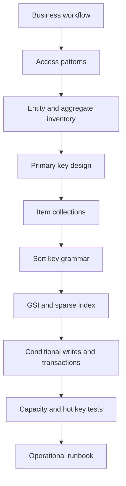
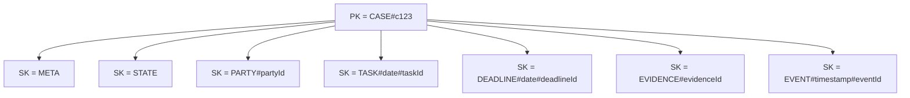
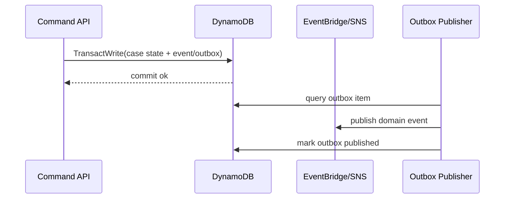

# Part 073 — Single-Table Design: Entity, Access Pattern, Composite Key, Item Collection

Single-table design bukan aturan agama. Ia adalah teknik untuk menyusun banyak entity dalam satu table DynamoDB agar operasi aplikasi bisa dijawab oleh `GetItem`, `Query`, `PutItem`, `UpdateItem`, `DeleteItem`, `TransactWriteItems`, dan index yang sengaja dirancang.

Target part ini: kamu bisa membaca requirement bisnis, menurunkannya menjadi access pattern, lalu mendesain key schema yang membuat DynamoDB bekerja seperti engine query yang deterministik, bukan seperti database document yang dipaksa melakukan scan.

AWS sendiri menjelaskan single-table design sebagai pola untuk menyimpan banyak tipe entity dalam satu DynamoDB table demi mengoptimalkan access pattern, performa, dan cost. Namun AWS juga tidak mengatakan bahwa semua workload wajib single-table. Keputusan tetap harus berdasarkan access pattern, ownership, operability, dan evolusi data model.

---

## 1. Core Principle

Relational modeling dimulai dari entity dan relationship.

DynamoDB modeling dimulai dari pertanyaan:

> Query apa yang harus dijawab oleh sistem, dengan latency berapa, pada skala berapa, dengan consistency apa, dan menggunakan key apa?

Dalam RDBMS, kamu sering membuat model normalisasi dulu, lalu query menyusul.

Dalam DynamoDB, kamu membalik proses:

1. daftar semua access pattern;
2. kelompokkan access pattern berdasarkan aggregate dan ownership;
3. desain primary key dan sort key agar access pattern penting bisa dijawab dengan `Query` atau `GetItem`;
4. tambahkan GSI hanya jika ada access pattern alternatif yang tidak bisa dijawab oleh primary key;
5. denormalisasi secara eksplisit;
6. uji dengan data volume, skew, hot key, dan growth scenario.

Mermaid mental model:



Single-table design bukan tentang “satu table supaya keren”. Single-table design berguna jika beberapa entity sering dibaca bersama dalam satu aggregate/query boundary.

---

## 2. DynamoDB Table as Access-Pattern Index

Anggap DynamoDB table sebagai kumpulan index yang sengaja kamu bentuk.

Satu table minimal punya:

| Component | Fungsi |
|---|---|
| Partition key | Menentukan item collection dan distribusi workload |
| Sort key | Menentukan urutan, range query, hierarchy, dan overloaded relationship |
| Attributes | Data entity, metadata, state, audit, dan projection fields |
| GSI | Alternate access pattern dengan partition/sort key berbeda |
| LSI | Alternate sort key dalam partition key yang sama, jika perlu dan didesain sejak table dibuat |

Istilah penting:

| Istilah | Makna operasional |
|---|---|
| Item | Satu record DynamoDB, bukan row SQL yang harus punya kolom sama |
| Entity type | Jenis item: Case, Party, Task, Event, Assignment, Comment |
| Item collection | Semua item dengan partition key sama |
| Composite key | Key yang dibentuk dari beberapa komponen domain |
| Overloaded key | Key attribute yang dipakai banyak entity type dengan format konsisten |
| Sparse index | Index yang hanya berisi item yang memiliki attribute index tertentu |
| Adjacency list | Teknik menyimpan relationship graph-ish dalam item collection/index |

---

## 3. Kapan Single-Table Design Cocok

Single-table design cocok ketika:

1. access pattern sudah cukup jelas;
2. entity saling dibaca dalam aggregate yang sama;
3. latency query harus predictable;
4. transaksi lokal kecil dan terbatas;
5. aplikasi lebih sering melakukan point lookup/range query daripada ad-hoc query;
6. read model bisa didesain sejak awal;
7. team disiplin menjaga key grammar dan schema contract;
8. migration/backfill bisa dikontrol lewat versioned item.

Contoh cocok:

| Domain | Mengapa cocok |
|---|---|
| Order management | Order, order line, payment attempt, shipment, status history sering dibaca bersama |
| Regulatory case management | Case, parties, tasks, deadlines, enforcement actions, decision log bisa dikelompokkan per case |
| IoT device registry | Device, config, latest telemetry pointer, alert state, owner mapping punya access pattern jelas |
| Multi-tenant issue tracker | Tenant, ticket, comments, assignments, SLA state, status index |
| Game leaderboard/session | Session, participant, score, rank projection |

---

## 4. Kapan Jangan Memaksakan Single-Table Design

Single-table design bisa menjadi beban kalau:

1. access pattern belum stabil dan masih sangat eksploratif;
2. workload butuh ad-hoc analytics;
3. query membutuhkan banyak filter bebas, join bebas, aggregate bebas;
4. team belum punya discipline key schema;
5. banyak tim menulis ke table yang sama tanpa ownership jelas;
6. compliance/audit memerlukan physical separation yang sulit disimulasikan dengan item type;
7. kebutuhan data export/reporting lebih dominan daripada low-latency transactional access;
8. data model berubah cepat tetapi tidak ada migration framework.

Dalam kondisi ini, pilihan lebih baik bisa berupa:

| Problem | Alternatif |
|---|---|
| Ad-hoc query kompleks | Aurora PostgreSQL, OpenSearch projection, Athena/S3 analytics |
| Transactional consistency lintas banyak entity | Aurora/RDS atau DynamoDB transaction terbatas dengan desain ketat |
| Reporting-heavy | OLTP store + stream/export ke analytical store |
| Full-text search | OpenSearch sebagai projection, bukan source of truth |
| Graph traversal | Neptune atau explicit precomputed relationship index |

---

## 5. Running Example: Enforcement Case Platform

Kita pakai contoh regulatory enforcement lifecycle.

Entity utama:

| Entity | Description |
|---|---|
| Tenant | Regulator/business unit/account boundary |
| Case | Enforcement case/investigation |
| Party | Person/company terkait case |
| Task | Action item untuk officer/reviewer |
| Deadline | SLA/legal deadline |
| Action | Enforcement action: warning, notice, penalty, escalation |
| Evidence | Metadata evidence, bukan file binary langsung |
| Event | Domain event/audit event |
| Assignment | Mapping case/task ke user/team |

Access pattern awal:

| ID | Access pattern | Consistency | Expected operation |
|---|---|---|---|
| AP1 | Get case summary by `caseId` | Strong or eventually, depends UI | `GetItem` |
| AP2 | List all items in a case timeline | Usually eventual acceptable | `Query PK = CASE#id` |
| AP3 | List open tasks for officer | Eventually acceptable | GSI query |
| AP4 | List overdue deadlines by tenant/date | Eventually acceptable | Sparse GSI query |
| AP5 | Add event to case timeline | Atomic with event item | `PutItem` conditionally |
| AP6 | Change case status with optimistic concurrency | Strong write invariant | `UpdateItem` condition expression |
| AP7 | Find case by external reference | Strong uniqueness preferred | GSI or uniqueness sentinel |
| AP8 | List parties in a case | Same case item collection | `Query PK = CASE#id AND begins_with(SK,'PARTY#')` |
| AP9 | Get all cases for party | Alternate relationship view | GSI adjacency query |
| AP10 | List cases by tenant and status | Eventually acceptable | GSI query/status projection |

Jangan mulai dari ERD. Mulai dari tabel access pattern.

---

## 6. Base Key Schema

Satu bentuk umum:

```txt
PK  string
SK  string
GSI1PK string optional
GSI1SK string optional
GSI2PK string optional
GSI2SK string optional
entityType string
version number
createdAt string ISO-8601
updatedAt string ISO-8601
...
```

Base table:

```txt
Table: EnforcementCore
Primary key:
  PK = partition key
  SK = sort key
```

Contoh key grammar:

| Item | PK | SK |
|---|---|---|
| Tenant metadata | `TENANT#t1` | `META` |
| Case metadata | `CASE#c123` | `META` |
| Case status snapshot | `CASE#c123` | `STATE` |
| Case party | `CASE#c123` | `PARTY#p789` |
| Case task | `CASE#c123` | `TASK#2026-07-07#task456` |
| Deadline | `CASE#c123` | `DEADLINE#2026-07-30#deadline9` |
| Evidence metadata | `CASE#c123` | `EVIDENCE#evd55` |
| Domain event | `CASE#c123` | `EVENT#2026-07-07T10:05:00Z#evt999` |
| Party case edge | `PARTY#p789` | `CASE#c123` |
| External reference sentinel | `EXTREF#ABC-2026-0001` | `CASE#c123` |

Item collection for case:

```txt
PK = CASE#c123
  SK = META
  SK = STATE
  SK = PARTY#p789
  SK = TASK#2026-07-07#task456
  SK = DEADLINE#2026-07-30#deadline9
  SK = EVIDENCE#evd55
  SK = EVENT#2026-07-07T10:05:00Z#evt999
```

Query timeline:

```txt
PK = CASE#c123
SK begins_with EVENT#
```

Query deadlines:

```txt
PK = CASE#c123
SK begins_with DEADLINE#
```

Query all case operational view:

```txt
PK = CASE#c123
SK between META and TASK...?
```

Lebih aman: gunakan prefix yang eksplisit daripada range ambigu.

---

## 7. Item Collection Design

Item collection adalah semua item dengan `PK` sama.

Dalam single-table design, item collection sering mewakili aggregate read boundary.

Untuk `CASE#c123`, item collection bisa memuat:



Keuntungan:

1. satu `Query` bisa mengambil banyak komponen case;
2. timeline bisa sorted by SK;
3. entity berbeda tetap ada di physical table yang sama;
4. relationship lokal case mudah diakses;
5. UI case detail bisa mengambil subset dengan prefix.

Risiko:

1. item collection terlalu besar;
2. hot case menjadi hot partition key;
3. semua entity ikut berbagi throughput boundary logical key;
4. schema governance makin penting;
5. LSI punya batas item collection size yang perlu diperhatikan jika digunakan.

Rule praktis:

> Letakkan entity dalam item collection yang sama hanya jika access pattern membacanya bersama atau membutuhkan locality yang nyata.

---

## 8. Sort Key Grammar

Sort key bukan string bebas. Sort key adalah bahasa kecil untuk query.

Contoh grammar:

```txt
META
STATE
PARTY#<partyId>
TASK#<dueDate>#<taskId>
TASK_STATUS#<status>#<dueDate>#<taskId>
DEADLINE#<dueDate>#<deadlineId>
EVIDENCE#<evidenceId>
EVENT#<occurredAt>#<eventId>
```

Sort key yang baik:

1. sortable secara leksikografis;
2. punya prefix entity type;
3. komponen waktu memakai ISO-8601 atau epoch-padded;
4. ID ditempatkan setelah field query utama;
5. mendukung `begins_with`, `between`, forward/reverse scan;
6. stabil walaupun attribute lain berubah;
7. tidak menyimpan data sensitive kalau key masuk log/metrics.

Buruk:

```txt
TASK#<uuid>#<dueDate>
```

Kenapa buruk? Karena query `TASK due before date` tidak bisa range by due date.

Lebih baik:

```txt
TASK#<dueDate>#<taskId>
```

Kalau query utama adalah due date.

---

## 9. Entity Modeling Pattern

Setiap item sebaiknya menyimpan `entityType`.

Contoh Case metadata:

```json
{
  "PK": "CASE#c123",
  "SK": "META",
  "entityType": "Case",
  "tenantId": "t1",
  "caseId": "c123",
  "externalRef": "ABC-2026-0001",
  "status": "UNDER_REVIEW",
  "riskScore": 82,
  "openedAt": "2026-07-07T02:10:00Z",
  "version": 7
}
```

Task item:

```json
{
  "PK": "CASE#c123",
  "SK": "TASK#2026-07-12#task456",
  "entityType": "Task",
  "tenantId": "t1",
  "caseId": "c123",
  "taskId": "task456",
  "assigneeId": "u77",
  "status": "OPEN",
  "dueAt": "2026-07-12T17:00:00Z",
  "version": 1,
  "GSI1PK": "ASSIGNEE#u77#TASK_STATUS#OPEN",
  "GSI1SK": "2026-07-12T17:00:00Z#CASE#c123#TASK#task456"
}
```

Deadline item:

```json
{
  "PK": "CASE#c123",
  "SK": "DEADLINE#2026-07-30#deadline9",
  "entityType": "Deadline",
  "tenantId": "t1",
  "caseId": "c123",
  "deadlineId": "deadline9",
  "deadlineType": "LEGAL_RESPONSE",
  "status": "OPEN",
  "dueAt": "2026-07-30T00:00:00Z",
  "GSI2PK": "TENANT#t1#DEADLINE_STATUS#OPEN",
  "GSI2SK": "2026-07-30T00:00:00Z#CASE#c123#DEADLINE#deadline9"
}
```

The table is schemaless, but your application must not be schema-less.

---

## 10. Access Pattern Matrix

Sebelum membuat table, buat matrix.

| Access Pattern | PK | SK condition | Index | Operation |
|---|---|---|---|---|
| Get case metadata | `CASE#<caseId>` | `SK = META` | Base | `GetItem` |
| Get case state | `CASE#<caseId>` | `SK = STATE` | Base | `GetItem` |
| List case parties | `CASE#<caseId>` | `begins_with(PARTY#)` | Base | `Query` |
| List case tasks by due date | `CASE#<caseId>` | `begins_with(TASK#)` | Base | `Query` |
| List case events | `CASE#<caseId>` | `begins_with(EVENT#)` | Base | `Query` |
| List open tasks by assignee | `ASSIGNEE#<id>#TASK_STATUS#OPEN` | due-date range | GSI1 | `Query` |
| List tenant overdue deadlines | `TENANT#<id>#DEADLINE_STATUS#OPEN` | due-date range | GSI2 | `Query` |
| Find case by external ref | `EXTREF#<ref>` | `CASE#<caseId>` | Base or GSI | `GetItem`/`Query` |
| List cases for party | `PARTY#<partyId>` | `begins_with(CASE#)` | Base or GSI | `Query` |

If an access pattern has no key plan, it is not designed yet.

Jangan menjawab “nanti pakai filter expression”. Filter expression tidak mengurangi read capacity untuk item yang sudah dibaca dari partition/query result. Filter hanya menyaring setelah read candidate ditemukan.

---

## 11. Composite Key Design

Composite key harus menjawab tiga hal:

1. locality: data apa yang harus berdekatan?
2. ordering: data harus sorted by apa?
3. selectivity: query harus memotong data dari mana?

Contoh `SK = TASK#2026-07-12#task456`:

| Segment | Fungsi |
|---|---|
| `TASK` | Prefix entity/query type |
| `2026-07-12` | Sort/range by due date |
| `task456` | Tie-breaker uniqueness |

Contoh GSI untuk assignee task:

```txt
GSI1PK = ASSIGNEE#u77#TASK_STATUS#OPEN
GSI1SK = 2026-07-12T17:00:00Z#CASE#c123#TASK#task456
```

Ini menjawab:

```txt
List open tasks for assignee u77 sorted by due date.
```

Kalau status berubah dari `OPEN` ke `DONE`, update item harus menghapus/mengubah index attribute.

---

## 12. Denormalization Is a Contract

Di DynamoDB, denormalization bukan dosa. Ia adalah kontrak.

Contoh `Task` item menyimpan:

```json
{
  "caseTitle": "Investigation ABC",
  "partyName": "PT Example",
  "assigneeName": "Nadia"
}
```

Ini boleh jika:

1. field memang read-optimized;
2. staleness acceptable;
3. source of truth tetap jelas;
4. ada propagation rule ketika source berubah;
5. ada reconciliation job untuk memperbaiki drift;
6. UI tahu field mana yang authoritative dan mana yang snapshot.

Classification:

| Field type | Example | Safe? | Rule |
|---|---|---|---|
| Immutable copy | `caseId`, `createdAt` | Safe | Copy freely |
| Slowly changing label | `caseTitle` | Usually safe | Accept staleness/reconcile |
| Current state | `caseStatus` | Risky | Prefer projection with version |
| Money/legal amount | `penaltyAmount` | Dangerous | Use source-of-truth or audited copy |
| Authorization field | `tenantId`, `ownerOrg` | Dangerous | Must be strongly governed |

---

## 13. Relationship Modeling

DynamoDB tidak punya join. Kamu memilih relationship representation.

### 13.1 One-to-Many Inside Item Collection

Case to tasks:

```txt
PK = CASE#c123
SK = TASK#2026-07-12#task456
```

Bagus untuk:

```txt
List tasks for case.
```

### 13.2 Many-to-Many with Edge Items

Party to cases:

```txt
PK = CASE#c123
SK = PARTY#p789

PK = PARTY#p789
SK = CASE#c123
```

Atau gunakan GSI:

```txt
CaseParty item:
PK = CASE#c123
SK = PARTY#p789
GSI1PK = PARTY#p789
GSI1SK = CASE#c123
```

Pilihan tergantung update atomicity dan query volume.

### 13.3 Adjacency List

Untuk relationship heavy tetapi traversal terbatas:

```txt
PK = ENTITY#A
SK = EDGE#RELATION#B
```

Jangan menjadikan DynamoDB sebagai graph database umum jika query butuh traversal multi-hop dinamis. Untuk graph-heavy workload, evaluasi Neptune atau precomputed projection.

---

## 14. GSI as Alternate Access Pattern

GSI bukan index untuk “nanti siapa tahu perlu”. GSI adalah access pattern yang dibayar dengan write amplification, storage, eventual consistency, dan operational surface.

Contoh GSI1: open tasks by assignee.

```txt
GSI1PK = ASSIGNEE#<assigneeId>#TASK_STATUS#OPEN
GSI1SK = <dueAt>#CASE#<caseId>#TASK#<taskId>
```

Contoh GSI2: open deadlines by tenant.

```txt
GSI2PK = TENANT#<tenantId>#DEADLINE_STATUS#OPEN
GSI2SK = <dueAt>#CASE#<caseId>#DEADLINE#<deadlineId>
```

Sparse GSI:

- hanya item dengan `GSI2PK` dan `GSI2SK` yang masuk index;
- cocok untuk open tasks, open deadlines, active escalations;
- jangan memasukkan closed/completed item jika query hanya active item.

GSI design checklist:

1. Apa exact query yang dijawab?
2. Seberapa sering item berubah status sehingga keluar/masuk index?
3. Apakah GSI partition key bisa hot?
4. Apakah query butuh strong consistency? Jika iya, GSI bukan jawabannya karena GSI read eventually consistent.
5. Berapa projected attributes yang dibutuhkan?
6. Apakah index bisa sparse?
7. Bagaimana backfill ketika menambah GSI baru?

---

## 15. LSI: Use Rarely and Deliberately

Local Secondary Index memakai partition key yang sama dengan base table tetapi sort key berbeda. Ia harus dibuat saat table creation.

LSI berguna jika:

1. kamu butuh alternate sort order dalam item collection yang sama;
2. partition key tetap sama;
3. strong consistency pada index read penting;
4. item collection size tetap aman.

Contoh:

```txt
Base:
PK = CASE#c123
SK = EVENT#2026-07-07T10:00:00Z#evt1

LSI1SK = SEVERITY#HIGH#2026-07-07T10:00:00Z#evt1
```

Namun banyak desain modern lebih memilih GSI atau duplicated item karena LSI constraint lebih kaku.

---

## 16. Uniqueness Pattern

DynamoDB tidak punya unique constraint global selain primary key.

Untuk memastikan `externalRef` unik:

```txt
PK = EXTREF#ABC-2026-0001
SK = UNIQUE
entityType = UniqueExternalRef
caseId = c123
```

Ketika membuat case, gunakan `TransactWriteItems`:

1. `Put` unique sentinel with condition `attribute_not_exists(PK)`;
2. `Put` case metadata;
3. `Put` case state;
4. optional outbox/event item.

Pseudo transaction:

```json
{
  "TransactItems": [
    {
      "Put": {
        "TableName": "EnforcementCore",
        "Item": {
          "PK": {"S": "EXTREF#ABC-2026-0001"},
          "SK": {"S": "UNIQUE"},
          "entityType": {"S": "UniqueExternalRef"},
          "caseId": {"S": "c123"}
        },
        "ConditionExpression": "attribute_not_exists(PK)"
      }
    },
    {
      "Put": {
        "TableName": "EnforcementCore",
        "Item": {
          "PK": {"S": "CASE#c123"},
          "SK": {"S": "META"},
          "entityType": {"S": "Case"}
        },
        "ConditionExpression": "attribute_not_exists(PK) AND attribute_not_exists(SK)"
      }
    }
  ]
}
```

Failure behavior:

| Failure | Meaning | Response |
|---|---|---|
| Conditional check failed on sentinel | externalRef exists | return conflict/duplicate |
| Conditional check failed on case item | caseId collision | generate new ID or conflict |
| Transaction canceled unknown to client | ambiguous | retry with idempotency key/read sentinel |

---

## 17. Optimistic Concurrency Pattern

Case status transition:

```txt
UNDER_REVIEW -> NOTICE_ISSUED -> RESPONSE_WAITING -> DECISION_PENDING -> CLOSED
```

Use versioned item:

```json
{
  "PK": "CASE#c123",
  "SK": "STATE",
  "status": "UNDER_REVIEW",
  "version": 7
}
```

Update:

```sql
SET status = :next,
    version = version + :one,
    updatedAt = :now
WHERE PK = :pk
  AND SK = :sk
  AND version = :expected
  AND status = :expectedStatus
```

DynamoDB expression:

```txt
UpdateExpression: SET #status = :next, #version = #version + :one, updatedAt = :now
ConditionExpression: #version = :expectedVersion AND #status = :expectedStatus
```

This is not just concurrency control. It is state-machine enforcement.

---

## 18. Transaction Boundary

DynamoDB transactions are useful, but not a license to model relational joins.

Use transaction when:

1. several items must change atomically;
2. uniqueness sentinel and entity must be created together;
3. state transition and domain event must be committed together;
4. counter/summary must remain consistent with mutation;
5. multiple conditional writes form one invariant.

Avoid transaction when:

1. you are compensating for wrong aggregate boundary;
2. transaction touches many dynamic items;
3. business process is long-running;
4. workflow needs human/external callback;
5. cross-aggregate consistency can be eventual via event/projection.

Pattern:



---

## 19. Outbox in Single-Table Design

Outbox item in same case item collection:

```json
{
  "PK": "CASE#c123",
  "SK": "OUTBOX#2026-07-07T10:05:00Z#evt999",
  "entityType": "OutboxEvent",
  "eventId": "evt999",
  "eventType": "CaseStatusChanged",
  "published": false,
  "payload": {
    "caseId": "c123",
    "from": "UNDER_REVIEW",
    "to": "NOTICE_ISSUED"
  },
  "GSI3PK": "OUTBOX#PENDING",
  "GSI3SK": "2026-07-07T10:05:00Z#evt999"
}
```

Publisher query:

```txt
GSI3PK = OUTBOX#PENDING
GSI3SK <= now
```

After publish:

```txt
SET published = true
REMOVE GSI3PK, GSI3SK
```

Important:

1. publisher must be idempotent;
2. event ID must be stable;
3. publish may succeed but update may fail;
4. duplicate publish must be accepted by consumers;
5. outbox retention must be defined.

---

## 20. Versioned Item Pattern

Single-table design evolves. Add explicit schema version.

```json
{
  "entityType": "Task",
  "schemaVersion": 3,
  "PK": "CASE#c123",
  "SK": "TASK#2026-07-12#task456"
}
```

Versioning strategies:

| Strategy | When |
|---|---|
| Read-time upcast | Low write volume, compatibility needed |
| Background backfill | High read volume, new field required |
| Dual write new attributes | Transition period |
| New item type | Semantic change large enough |
| New GSI attributes | New access pattern requires index |

Never assume schemaless means migrationless.

---

## 21. Projection Attribute Strategy

GSI projection controls what attributes are copied into index.

Options:

| Projection | Use case |
|---|---|
| `KEYS_ONLY` | Query index, then `BatchGetItem` base item if needed |
| `INCLUDE` | UI list needs small summary fields |
| `ALL` | Avoid extra read but increases write/storage cost |

For open tasks by assignee, projection might include:

```txt
caseId
taskId
dueAt
priority
caseTitleSnapshot
status
```

Not include:

```txt
largeDescription
evidenceMetadataBlob
internalAuditTrail
```

---

## 22. Query Examples

### 22.1 Get Case Metadata

```java
GetItemRequest request = GetItemRequest.builder()
    .tableName("EnforcementCore")
    .key(Map.of(
        "PK", AttributeValue.fromS("CASE#c123"),
        "SK", AttributeValue.fromS("META")
    ))
    .consistentRead(true)
    .build();
```

### 22.2 List Case Timeline Events

```java
QueryRequest request = QueryRequest.builder()
    .tableName("EnforcementCore")
    .keyConditionExpression("PK = :pk AND begins_with(SK, :prefix)")
    .expressionAttributeValues(Map.of(
        ":pk", AttributeValue.fromS("CASE#c123"),
        ":prefix", AttributeValue.fromS("EVENT#")
    ))
    .scanIndexForward(false)
    .limit(50)
    .build();
```

### 22.3 List Open Tasks for Assignee

```java
QueryRequest request = QueryRequest.builder()
    .tableName("EnforcementCore")
    .indexName("GSI1")
    .keyConditionExpression("GSI1PK = :pk AND GSI1SK BETWEEN :from AND :to")
    .expressionAttributeValues(Map.of(
        ":pk", AttributeValue.fromS("ASSIGNEE#u77#TASK_STATUS#OPEN"),
        ":from", AttributeValue.fromS("2026-07-01T00:00:00Z"),
        ":to", AttributeValue.fromS("2026-07-31T23:59:59Z")
    ))
    .build();
```

### 22.4 Conditional Status Transition

```java
UpdateItemRequest request = UpdateItemRequest.builder()
    .tableName("EnforcementCore")
    .key(Map.of(
        "PK", AttributeValue.fromS("CASE#c123"),
        "SK", AttributeValue.fromS("STATE")
    ))
    .updateExpression("SET #status = :next, #version = #version + :one, updatedAt = :now")
    .conditionExpression("#status = :current AND #version = :expected")
    .expressionAttributeNames(Map.of(
        "#status", "status",
        "#version", "version"
    ))
    .expressionAttributeValues(Map.of(
        ":current", AttributeValue.fromS("UNDER_REVIEW"),
        ":next", AttributeValue.fromS("NOTICE_ISSUED"),
        ":expected", AttributeValue.fromN("7"),
        ":one", AttributeValue.fromN("1"),
        ":now", AttributeValue.fromS("2026-07-07T10:15:00Z")
    ))
    .build();
```

---

## 23. Scan Is Usually a Design Smell

`Scan` reads across table/index. It is useful for:

1. backfill job;
2. export/maintenance;
3. admin operation with bounded table;
4. rare repair workflow;
5. parallel scan with strict throttling.

It is not a normal application query path.

Bad pattern:

```txt
Scan all tasks where assigneeId = u77 and status = OPEN
```

Good pattern:

```txt
GSI1PK = ASSIGNEE#u77#TASK_STATUS#OPEN
```

---

## 24. Write Amplification

Single-table design often creates additional writes:

1. base item;
2. relationship edge item;
3. GSI entry;
4. outbox item;
5. summary/counter item;
6. idempotency record;
7. audit event.

For every command, compute write amplification:

| Command | Writes |
|---|---:|
| Create case | case meta + state + external ref sentinel + audit event + outbox = 5 |
| Add task | task item + audit event + outbox = 3, plus GSI entries |
| Complete task | update task + remove GSI open attributes + audit event + outbox = 4 |
| Link party | party edge + reverse edge + audit event = 3 |

Write amplification is not automatically bad. Hidden write amplification is bad.

---

## 25. Tenant Modeling

Do not blindly put tenant ID as only partition key.

Bad:

```txt
PK = TENANT#t1
SK = CASE#c123
```

If tenant is large, every operation for tenant hits same logical partition key.

Better:

```txt
PK = CASE#c123
SK = META
```

And use tenant-specific GSI for tenant views:

```txt
GSI_TENANT_PK = TENANT#t1#CASE_STATUS#OPEN
GSI_TENANT_SK = 2026-07-07T10:00:00Z#CASE#c123
```

For multi-tenant systems, tenant ID still belongs in every item for authorization and audit, but it does not always belong as the base partition key.

---

## 26. Authorization Boundary

DynamoDB key design can help authorization, but must not be the only enforcement.

Every item should include:

```txt
tenantId
ownerOrgId
classification
createdBy
updatedBy
```

API/service layer must verify authorization before query and before mutation.

Risky design:

```txt
Client supplies PK directly.
```

Safer design:

```txt
API receives domain ID -> service resolves tenant/authorization -> service constructs PK/SK.
```

Never expose raw internal key grammar as public contract unless you are prepared to support it forever.

---

## 27. Evolution Strategy

New access pattern appears:

> “List high-risk open cases per tenant by risk score.”

Decision process:

1. Is this production transactional path or reporting path?
2. Is consistency requirement strong or eventual?
3. Is query bounded by tenant/status/risk?
4. Can existing GSI answer it?
5. Would new sparse GSI be hot?
6. Can we maintain projection attributes on state change?
7. Is OpenSearch/reporting store better?
8. Can we backfill safely?

Potential GSI:

```txt
GSI4PK = TENANT#t1#CASE_STATUS#OPEN#RISK_BUCKET#HIGH
GSI4SK = 000082#CASE#c123
```

But if risk changes frequently, index churn increases. Maybe compute daily queue/report projection instead.

---

## 28. Testing the Data Model

Test data model before production.

### 28.1 Access Pattern Test

For each access pattern:

```txt
Given realistic item volume
When query is executed
Then it uses GetItem/Query not Scan
And page size is bounded
And p95 latency target is met
And consumed capacity is within budget
```

### 28.2 Hot Key Test

Simulate:

1. 10 officers updating same hot case;
2. 1 tenant with 10x traffic;
3. status dashboard refreshing every few seconds;
4. bulk import creating events for same case;
5. GSI partition for `OPEN` tasks getting skewed.

### 28.3 Evolution Test

1. add new field;
2. add new item type;
3. add new sparse GSI attribute;
4. backfill old items;
5. deploy reader before writer;
6. deploy writer before reader;
7. rollback.

### 28.4 Replay Test

If events/outbox are used:

1. publish duplicate event;
2. replay old event;
3. process out-of-order event;
4. rebuild projection;
5. validate idempotency.

---

## 29. Anti-Patterns

### 29.1 Table-per-Entity Without Reason

```txt
CasesTable
TasksTable
PartiesTable
DeadlinesTable
EventsTable
```

This recreates relational layout without joins. It often leads to many network calls and application-side joins.

Multiple tables can be correct if ownership/capacity/security/lifecycle differ. But if the reason is “because SQL had tables,” it is not enough.

### 29.2 Single Table with No Access Pattern Discipline

```txt
PK = uuid
SK = uuid
```

This is not single-table design. It is an object dump.

### 29.3 FilterExpression as Query Strategy

Filter expression after reading many items is not a scalable query plan.

### 29.4 GSI Explosion

Adding GSI for every UI filter makes write path expensive and hard to operate.

### 29.5 Overloaded Key Without Grammar

```txt
PK = random business string
SK = sometimes date, sometimes name, sometimes status
```

Overloading requires grammar. Without grammar, it is entropy.

### 29.6 Mutable Sort Key as Identity

If sort key contains mutable field, updates require delete+put or careful rewrite. Put mutable fields in index keys only if movement across index is intentional.

### 29.7 Authorization by Partition Key Alone

Do not assume because `PK` includes tenant, authorization is solved. Validate every command/query.

---

## 30. Production Checklist

Before approving a single-table design:

- [ ] Every access pattern has exact key condition.
- [ ] No normal application path depends on table scan.
- [ ] Every entity has `entityType` and `schemaVersion`.
- [ ] Sort key grammar is documented.
- [ ] GSI purpose is documented per access pattern.
- [ ] Sparse indexes are used where appropriate.
- [ ] Hot partition analysis exists.
- [ ] Tenant skew analysis exists.
- [ ] Write amplification is calculated.
- [ ] Conditional write invariants are defined.
- [ ] Transaction boundaries are explicit.
- [ ] Idempotency strategy exists for commands.
- [ ] Outbox/replay behavior is safe.
- [ ] Backfill/migration strategy exists.
- [ ] Projection staleness is documented.
- [ ] Dashboard and alarms include throttling, latency, errors, consumed capacity, and GSI health.

---

## 31. Minimal ADR Template

```md
# ADR: DynamoDB Single-Table Design for EnforcementCore

## Status
Accepted / Proposed / Deprecated

## Context
The workload requires predictable low-latency access for enforcement case operational screens.

## Access Patterns
- AP1: Get case metadata by caseId
- AP2: List case timeline
- AP3: List open tasks by assignee
- AP4: List overdue deadlines by tenant
...

## Decision
Use one DynamoDB table with PK/SK and sparse GSIs for assignee task and tenant deadline views.

## Key Schema
Base:
- PK
- SK

GSI1:
- GSI1PK
- GSI1SK

GSI2:
- GSI2PK
- GSI2SK

## Invariants
- externalRef uniqueness enforced by sentinel item
- case status transition enforced by conditional update
- outbox item written in same transaction as state change

## Trade-offs
- no ad-hoc joins
- GSI eventual consistency
- write amplification accepted
- schema grammar must be governed

## Reversibility
Export to S3 + DMS/custom migration to Aurora/OpenSearch projection if access pattern changes.

## Validation
Load test with tenant skew and hot case scenario.
```

---

## 32. Key Takeaways

1. Single-table design is access-pattern design, not table-count minimalism.
2. Partition key creates locality and distribution; sort key creates query language.
3. Item collection is the central modeling primitive.
4. GSI is an alternate access pattern, not a casual secondary index.
5. Denormalization is acceptable only with source-of-truth and reconciliation discipline.
6. Conditional writes and transactions encode business invariants.
7. Schema-less storage still requires schema governance.
8. The most dangerous DynamoDB model is one that works in dev because the dataset is small.

---

## References

- AWS DynamoDB Developer Guide — Data modeling foundations in DynamoDB: https://docs.aws.amazon.com/amazondynamodb/latest/developerguide/data-modeling-foundations.html
- AWS DynamoDB Developer Guide — NoSQL design for DynamoDB: https://docs.aws.amazon.com/amazondynamodb/latest/developerguide/bp-general-nosql-design.html
- AWS DynamoDB Developer Guide — Best practices for DynamoDB table design: https://docs.aws.amazon.com/amazondynamodb/latest/developerguide/bp-table-design.html
- AWS Prescriptive Guidance — Identify DynamoDB data access patterns: https://docs.aws.amazon.com/prescriptive-guidance/latest/dynamodb-data-modeling/step3.html
- AWS Database Blog — Single-table vs. multi-table design in Amazon DynamoDB: https://aws.amazon.com/blogs/database/single-table-vs-multi-table-design-in-amazon-dynamodb/
- AWS Compute Blog — Creating a single-table design with Amazon DynamoDB: https://aws.amazon.com/blogs/compute/creating-a-single-table-design-with-amazon-dynamodb/
